# Opinion Poll by Cluster17 for RTL TVi, 28–31 May 2024

Areas included: Brussels, Flanders, Wallonia

<a href="#voting-intentions">Voting Intentions</a> | <a href="#seats">Seats</a> | <a href="#coalitions">Coalitions</a> | <a href="#technical-information">Technical Information</a>

## Voting Intentions

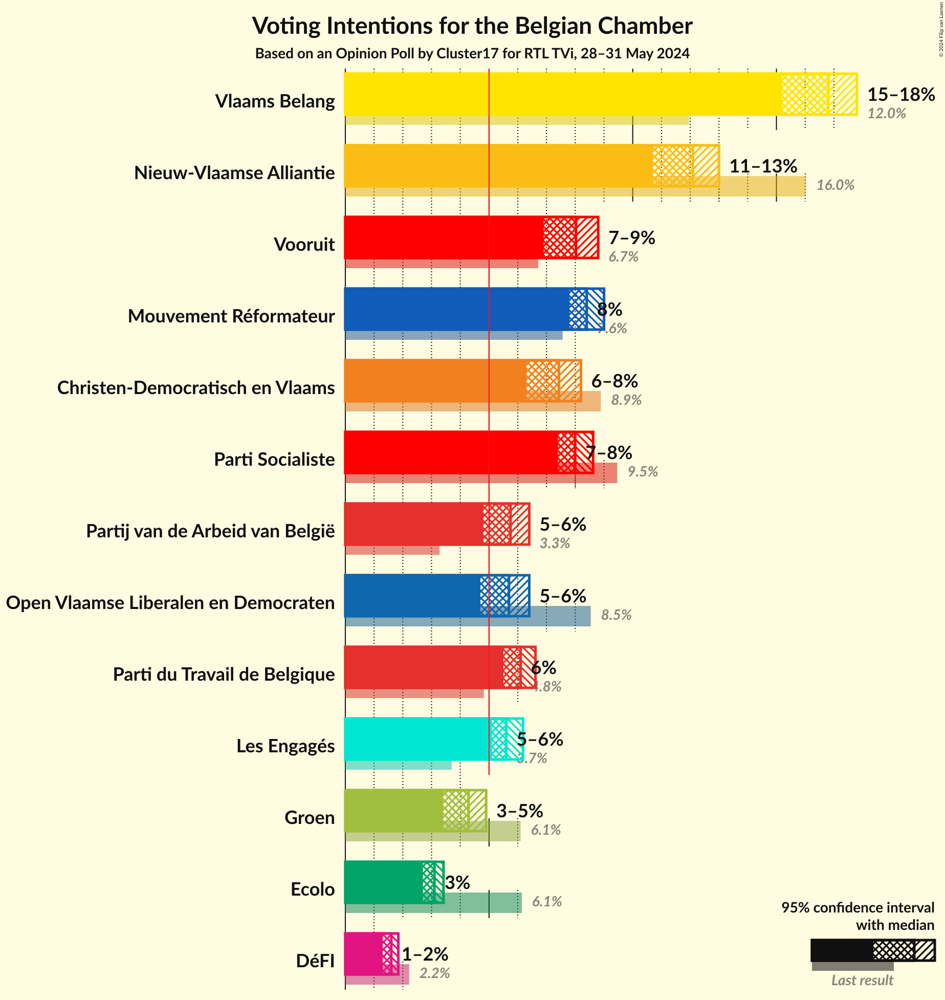

### Confidence Intervals

| Party | Last Result | Poll Result | 80% Confidence Interval | 90% Confidence Interval | 95% Confidence Interval | 99% Confidence Interval |
|:-----:|:-----------:|:-----------:|:-----------------------:|:-----------------------:|:-----------------------:|:-----------------------:|
| Vlaams Belang | 12.0% | 16.8% | 15.8–17.5% |15.5–17.7% |15.2–17.8% |14.8–17.8% |
| Nieuw-Vlaamse Alliantie | 16.0% | 12.1% | 11.2–12.8% |10.9–12.9% |10.7–13.0% |10.3–13.1% |
| Mouvement Réformateur | 7.6% | 9.0% | 8.0–8.4% |7.9–8.4% |7.8–8.4% |7.6–8.4% |
| Parti Socialiste | 9.5% | 8.6% | 7.6–8.0% |7.5–8.0% |7.4–8.0% |7.2–8.0% |
| Vooruit | 6.7% | 8.0% | 7.2–8.6% |7.1–8.7% |6.9–8.8% |6.5–8.8% |
| Christen-Democratisch en Vlaams | 8.9% | 7.4% | 6.7–8.0% |6.5–8.1% |6.3–8.2% |6.0–8.2% |
| Parti du Travail de Belgique | 4.8% | 6.6% | 5.7–6.1% |5.6–6.1% |5.5–6.1% |5.4–6.1% |
| Les Engagés | 3.7% | 6.2% | 5.3–5.6% |5.2–5.6% |5.1–5.6% |5.0–5.6% |
| Partij van de Arbeid van België | 3.3% | 5.7% | 5.1–6.3% |4.9–6.4% |4.8–6.4% |4.5–6.5% |
| Open Vlaamse Liberalen en Democraten | 8.5% | 5.7% | 5.0–6.2% |4.9–6.3% |4.7–6.4% |4.5–6.4% |
| Groen | 6.1% | 4.3% | 3.7–4.7% |3.6–4.8% |3.4–4.9% |3.2–4.9% |
| Ecolo | 6.1% | 3.4% | 2.8–3.1% |2.7–3.1% |2.7–3.1% |2.6–3.1% |
| DéFI | 2.2% | 1.8% | 1.4–1.6% |1.3–1.6% |1.3–1.6% |1.2–1.6% |

*Note:* The poll result column reflects the actual value used in the calculations. Published results may vary slightly, and in addition be rounded to fewer digits.

## Seats

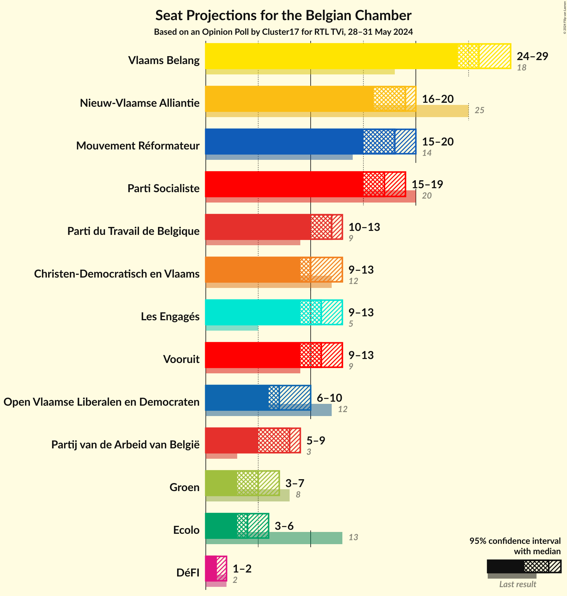

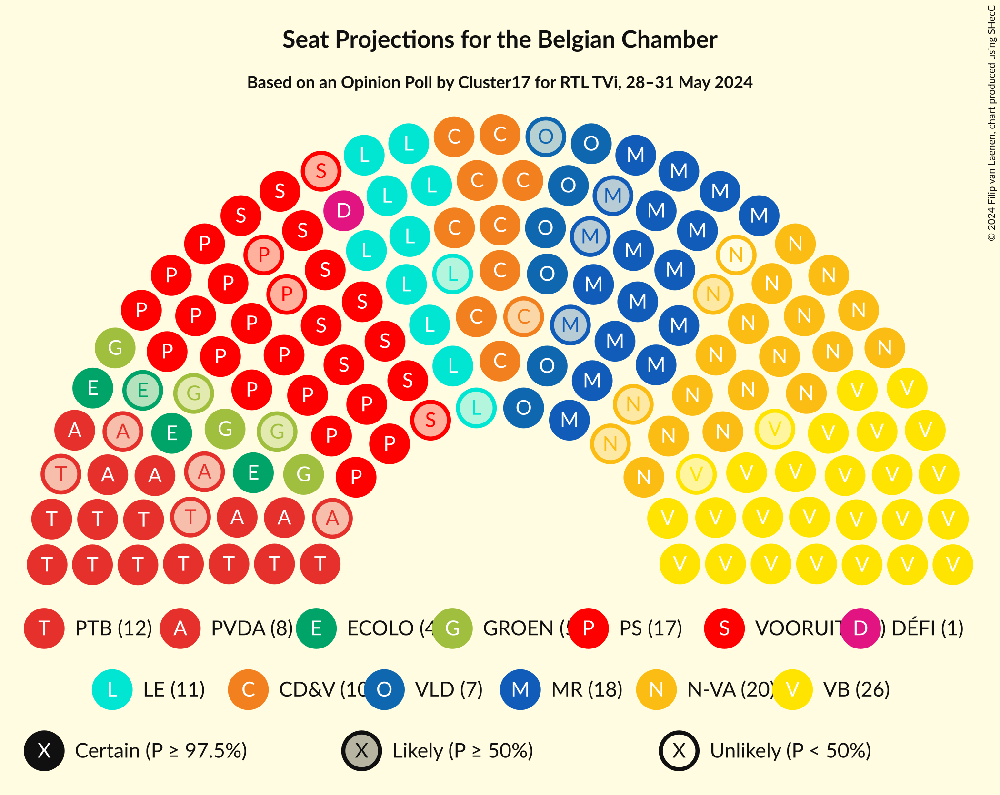

### Confidence Intervals

| Party | Last Result | Median | 80% Confidence Interval | 90% Confidence Interval | 95% Confidence Interval | 99% Confidence Interval |
|:-----:|:-----------:|:------:|:-----------------------:|:-----------------------:|:-----------------------:|:-----------------------:|
| <a href="#vlaams-belang">Vlaams Belang</a> | 18 | 26 | 25–29 |25–29 |24–29 |23–30 |
| <a href="#nieuw-vlaamse-alliantie">Nieuw-Vlaamse Alliantie</a> | 25 | 19 | 17–20 |16–20 |16–20 |15–22 |
| <a href="#mouvement-réformateur">Mouvement Réformateur</a> | 14 | 18 | 16–19 |16–19 |15–20 |14–20 |
| <a href="#parti-socialiste">Parti Socialiste</a> | 20 | 17 | 16–18 |15–19 |15–19 |14–20 |
| <a href="#vooruit">Vooruit</a> | 9 | 11 | 11–13 |10–13 |9–13 |9–14 |
| <a href="#christen-democratisch-en-vlaams">Christen-Democratisch en Vlaams</a> | 12 | 10 | 10–12 |10–12 |9–13 |9–13 |
| <a href="#parti-du-travail-de-belgique">Parti du Travail de Belgique</a> | 9 | 12 | 11–13 |10–13 |10–13 |10–14 |
| <a href="#les-engagés">Les Engagés</a> | 5 | 11 | 10–12 |9–13 |9–13 |9–14 |
| <a href="#partij-van-de-arbeid-van-belgië">Partij van de Arbeid van België</a> | 3 | 8 | 7–9 |6–9 |5–9 |5–10 |
| <a href="#open-vlaamse-liberalen-en-democraten">Open Vlaamse Liberalen en Democraten</a> | 12 | 7 | 6–9 |6–10 |6–10 |6–10 |
| <a href="#groen">Groen</a> | 8 | 5 | 3–6 |3–6 |3–7 |3–7 |
| <a href="#ecolo">Ecolo</a> | 13 | 4 | 4–5 |4–6 |3–6 |3–7 |
| <a href="#défi">DéFI</a> | 2 | 1 | 1 |1–2 |1–2 |0–3 |

### Vlaams Belang

*For a full overview of the results for this party, see the [Vlaams Belang](party-vlaamsbelang.html) page.*

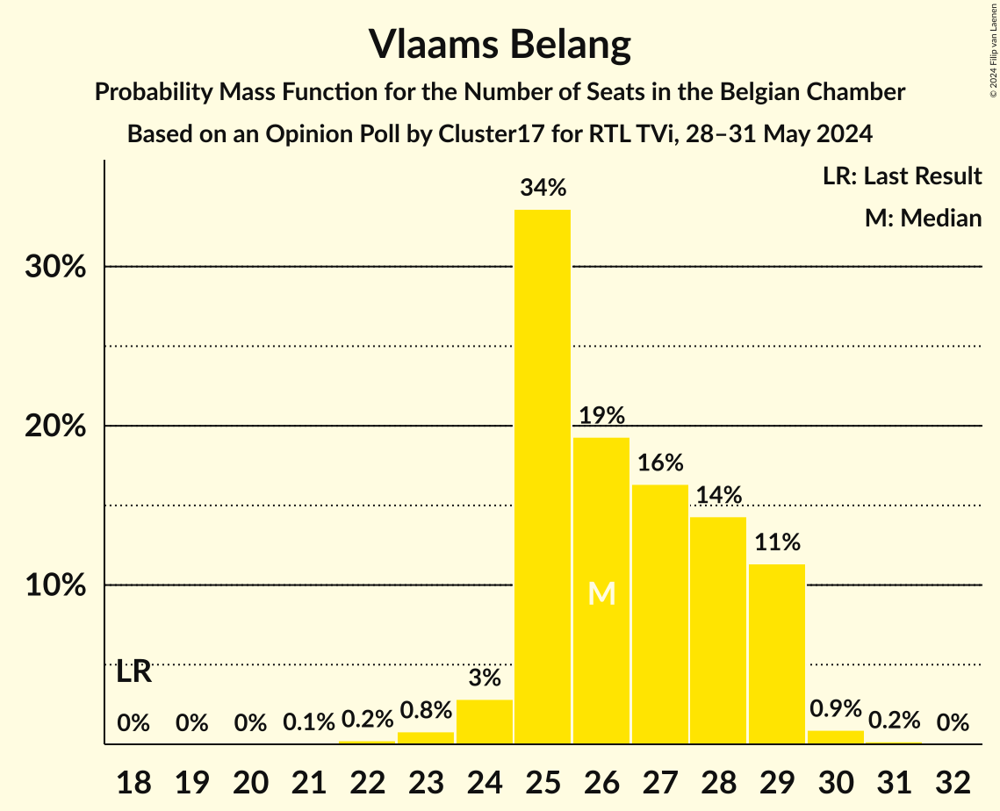

| Number of Seats | Probability | Accumulated | Special Marks |
|:---------------:|:-----------:|:-----------:|:-------------:|
| 18 | 0% | 100% | Last Result |
| 19 | 0% | 100% |  |
| 20 | 0% | 100% |  |
| 21 | 0.1% | 100% |  |
| 22 | 0.2% | 99.9% |  |
| 23 | 0.8% | 99.7% |  |
| 24 | 3% | 98.9% |  |
| 25 | 34% | 96% |  |
| 26 | 19% | 62% | Median |
| 27 | 16% | 43% |  |
| 28 | 14% | 27% |  |
| 29 | 11% | 12% |  |
| 30 | 0.9% | 1.1% |  |
| 31 | 0.2% | 0.2% |  |
| 32 | 0% | 0% |  |

### Nieuw-Vlaamse Alliantie

*For a full overview of the results for this party, see the [Nieuw-Vlaamse Alliantie](party-nieuw-vlaamsealliantie.html) page.*

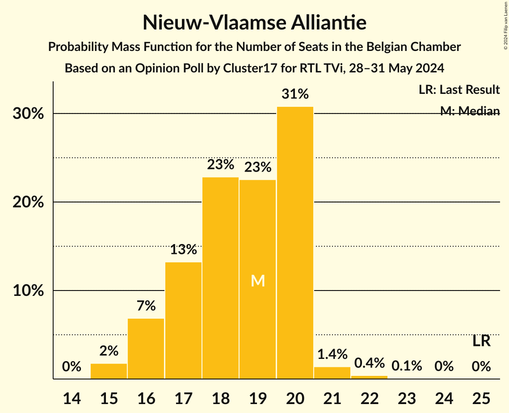

| Number of Seats | Probability | Accumulated | Special Marks |
|:---------------:|:-----------:|:-----------:|:-------------:|
| 15 | 2% | 100% |  |
| 16 | 7% | 98% |  |
| 17 | 13% | 91% |  |
| 18 | 23% | 78% |  |
| 19 | 23% | 55% | Median |
| 20 | 31% | 33% |  |
| 21 | 1.4% | 2% |  |
| 22 | 0.4% | 0.5% |  |
| 23 | 0.1% | 0.1% |  |
| 24 | 0% | 0% |  |
| 25 | 0% | 0% | Last Result |

### Mouvement Réformateur

*For a full overview of the results for this party, see the [Mouvement Réformateur](party-mouvementréformateur.html) page.*

| Number of Seats | Probability | Accumulated | Special Marks |
|:---------------:|:-----------:|:-----------:|:-------------:|
| 14 | 0.6% | 100% | Last Result |
| 15 | 2% | 99.4% |  |
| 16 | 9% | 97% |  |
| 17 | 15% | 88% |  |
| 18 | 43% | 73% | Median |
| 19 | 27% | 30% |  |
| 20 | 3% | 3% |  |
| 21 | 0.2% | 0.3% |  |
| 22 | 0% | 0.1% |  |
| 23 | 0% | 0% |  |

### Parti Socialiste

*For a full overview of the results for this party, see the [Parti Socialiste](party-partisocialiste.html) page.*

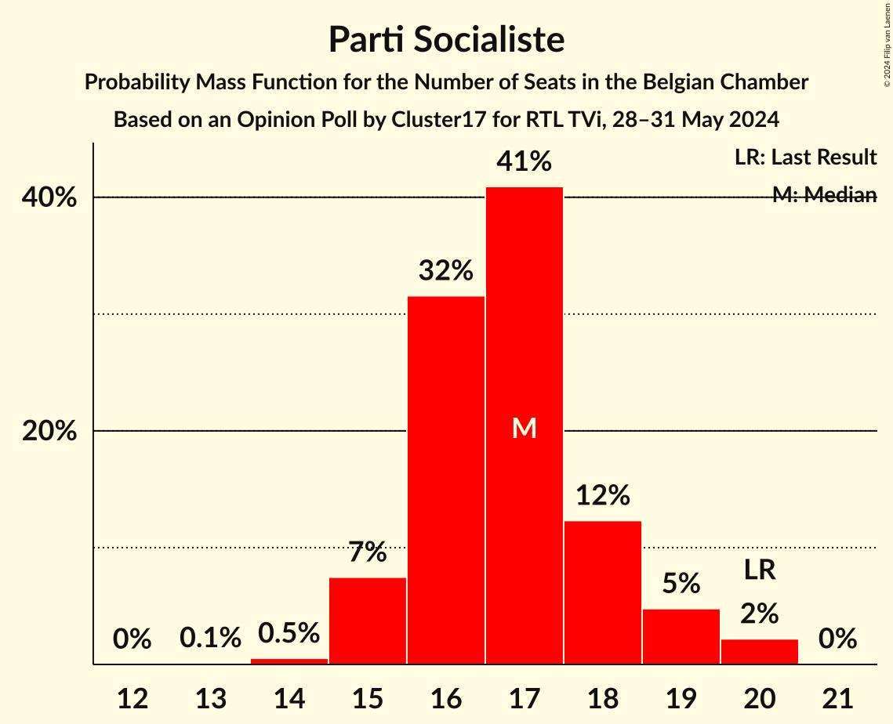

| Number of Seats | Probability | Accumulated | Special Marks |
|:---------------:|:-----------:|:-----------:|:-------------:|
| 13 | 0.1% | 100% |  |
| 14 | 0.5% | 99.8% |  |
| 15 | 7% | 99.3% |  |
| 16 | 32% | 92% |  |
| 17 | 41% | 60% | Median |
| 18 | 12% | 19% |  |
| 19 | 5% | 7% |  |
| 20 | 2% | 2% | Last Result |
| 21 | 0% | 0% |  |

### Vooruit

*For a full overview of the results for this party, see the [Vooruit](party-vooruit.html) page.*

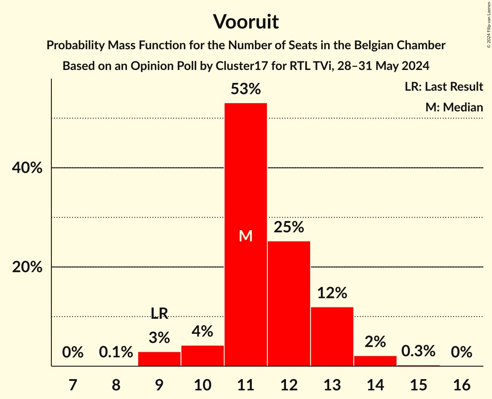

| Number of Seats | Probability | Accumulated | Special Marks |
|:---------------:|:-----------:|:-----------:|:-------------:|
| 8 | 0.1% | 100% |  |
| 9 | 3% | 99.9% | Last Result |
| 10 | 4% | 97% |  |
| 11 | 53% | 93% | Median |
| 12 | 25% | 40% |  |
| 13 | 12% | 14% |  |
| 14 | 2% | 2% |  |
| 15 | 0.3% | 0.3% |  |
| 16 | 0% | 0% |  |

### Christen-Democratisch en Vlaams

*For a full overview of the results for this party, see the [Christen-Democratisch en Vlaams](party-christen-democratischenvlaams.html) page.*

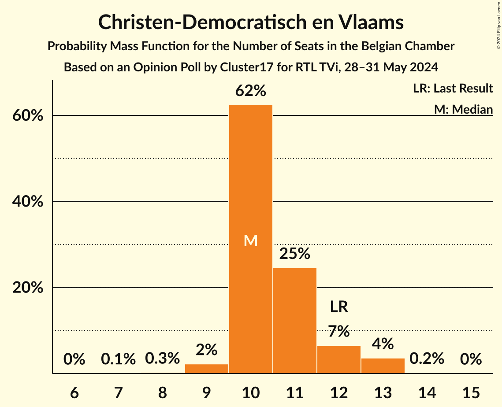

| Number of Seats | Probability | Accumulated | Special Marks |
|:---------------:|:-----------:|:-----------:|:-------------:|
| 7 | 0.1% | 100% |  |
| 8 | 0.3% | 99.9% |  |
| 9 | 2% | 99.6% |  |
| 10 | 62% | 97% | Median |
| 11 | 25% | 35% |  |
| 12 | 7% | 10% | Last Result |
| 13 | 4% | 4% |  |
| 14 | 0.2% | 0.2% |  |
| 15 | 0% | 0% |  |

### Parti du Travail de Belgique

*For a full overview of the results for this party, see the [Parti du Travail de Belgique](party-partidutravaildebelgique.html) page.*

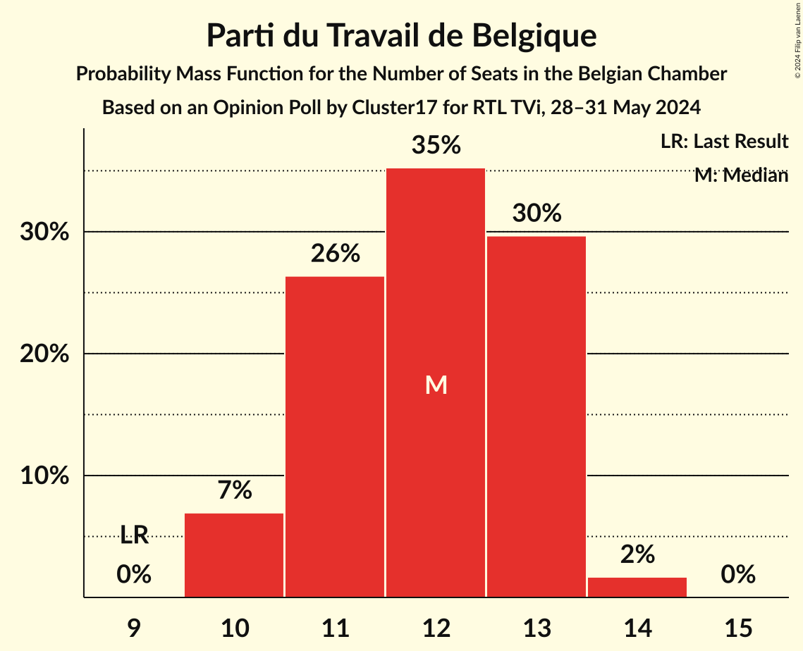

| Number of Seats | Probability | Accumulated | Special Marks |
|:---------------:|:-----------:|:-----------:|:-------------:|
| 9 | 0% | 100% | Last Result |
| 10 | 7% | 100% |  |
| 11 | 26% | 93% |  |
| 12 | 35% | 67% | Median |
| 13 | 30% | 31% |  |
| 14 | 2% | 2% |  |
| 15 | 0% | 0% |  |

### Les Engagés

*For a full overview of the results for this party, see the [Les Engagés](party-lesengagés.html) page.*

| Number of Seats | Probability | Accumulated | Special Marks |
|:---------------:|:-----------:|:-----------:|:-------------:|
| 5 | 0% | 100% | Last Result |
| 6 | 0% | 100% |  |
| 7 | 0% | 100% |  |
| 8 | 0% | 100% |  |
| 9 | 6% | 100% |  |
| 10 | 22% | 94% |  |
| 11 | 36% | 72% | Median |
| 12 | 29% | 36% |  |
| 13 | 7% | 8% |  |
| 14 | 0.6% | 0.7% |  |
| 15 | 0% | 0% |  |

### Partij van de Arbeid van België

*For a full overview of the results for this party, see the [Partij van de Arbeid van België](party-partijvandearbeidvanbelgië.html) page.*

| Number of Seats | Probability | Accumulated | Special Marks |
|:---------------:|:-----------:|:-----------:|:-------------:|
| 3 | 0% | 100% | Last Result |
| 4 | 0% | 100% |  |
| 5 | 3% | 100% |  |
| 6 | 4% | 97% |  |
| 7 | 8% | 93% |  |
| 8 | 73% | 85% | Median |
| 9 | 12% | 12% |  |
| 10 | 0.6% | 0.7% |  |
| 11 | 0.1% | 0.1% |  |
| 12 | 0% | 0% |  |

### Open Vlaamse Liberalen en Democraten

*For a full overview of the results for this party, see the [Open Vlaamse Liberalen en Democraten](party-openvlaamseliberalenendemocraten.html) page.*

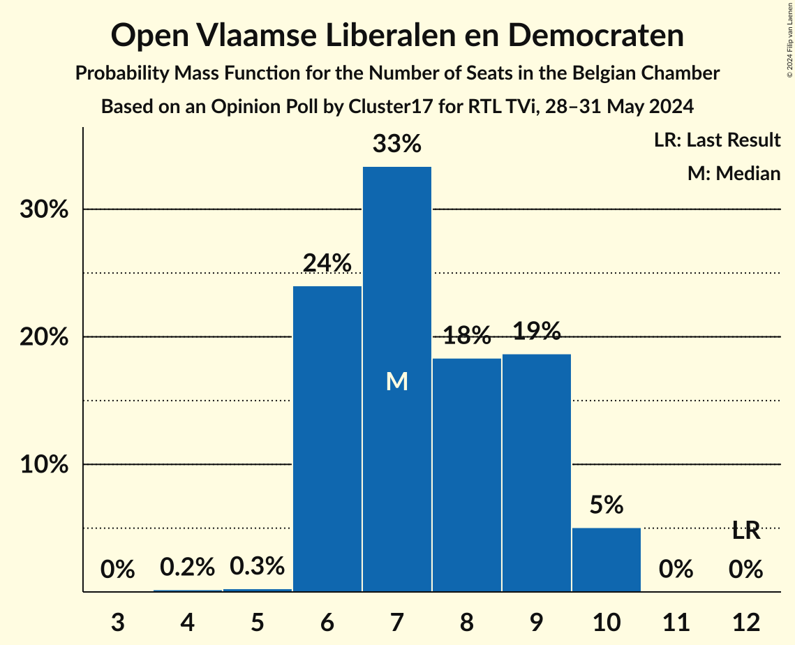

| Number of Seats | Probability | Accumulated | Special Marks |
|:---------------:|:-----------:|:-----------:|:-------------:|
| 4 | 0.2% | 100% |  |
| 5 | 0.3% | 99.8% |  |
| 6 | 24% | 99.5% |  |
| 7 | 33% | 76% | Median |
| 8 | 18% | 42% |  |
| 9 | 19% | 24% |  |
| 10 | 5% | 5% |  |
| 11 | 0% | 0% |  |
| 12 | 0% | 0% | Last Result |

### Groen

*For a full overview of the results for this party, see the [Groen](party-groen.html) page.*

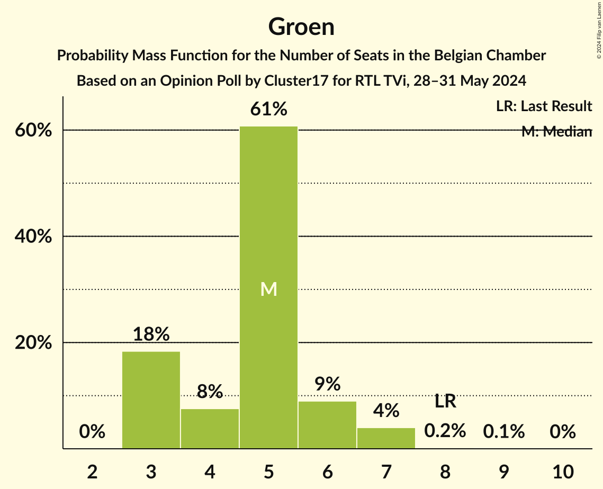

| Number of Seats | Probability | Accumulated | Special Marks |
|:---------------:|:-----------:|:-----------:|:-------------:|
| 3 | 18% | 100% |  |
| 4 | 8% | 82% |  |
| 5 | 61% | 74% | Median |
| 6 | 9% | 13% |  |
| 7 | 4% | 4% |  |
| 8 | 0.2% | 0.3% | Last Result |
| 9 | 0.1% | 0.1% |  |
| 10 | 0% | 0% |  |

### Ecolo

*For a full overview of the results for this party, see the [Ecolo](party-ecolo.html) page.*

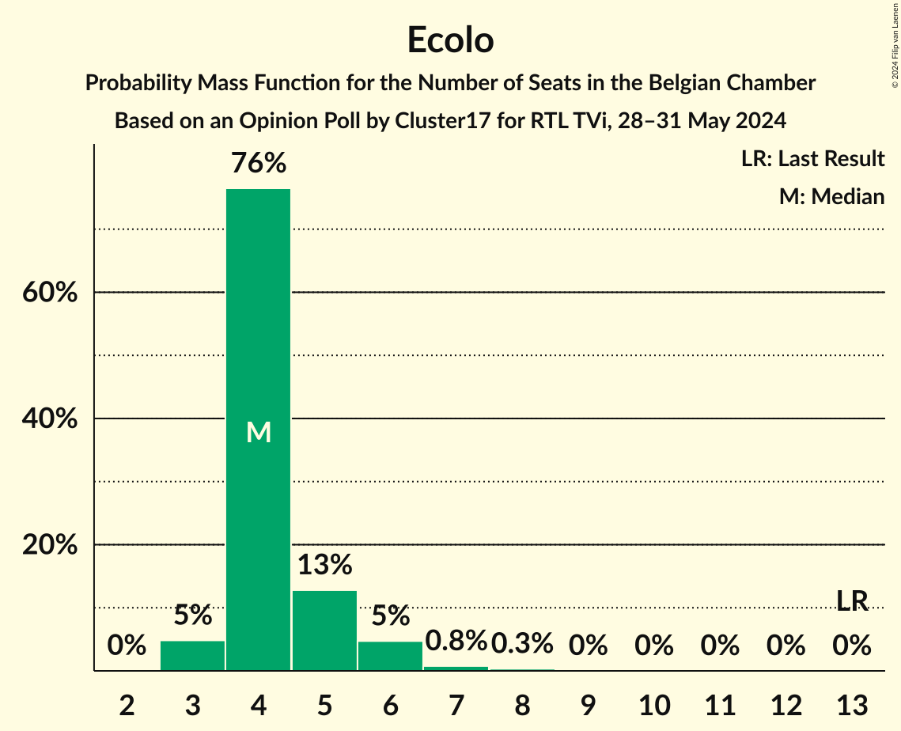

| Number of Seats | Probability | Accumulated | Special Marks |
|:---------------:|:-----------:|:-----------:|:-------------:|
| 3 | 5% | 100% |  |
| 4 | 76% | 95% | Median |
| 5 | 13% | 19% |  |
| 6 | 5% | 6% |  |
| 7 | 0.8% | 1.1% |  |
| 8 | 0.3% | 0.4% |  |
| 9 | 0% | 0% |  |
| 10 | 0% | 0% |  |
| 11 | 0% | 0% |  |
| 12 | 0% | 0% |  |
| 13 | 0% | 0% | Last Result |

### DéFI

*For a full overview of the results for this party, see the [DéFI](party-défi.html) page.*

| Number of Seats | Probability | Accumulated | Special Marks |
|:---------------:|:-----------:|:-----------:|:-------------:|
| 0 | 1.2% | 100% |  |
| 1 | 94% | 98.8% | Median |
| 2 | 4% | 5% | Last Result |
| 3 | 0.7% | 0.7% |  |
| 4 | 0% | 0% |  |

## Coalitions

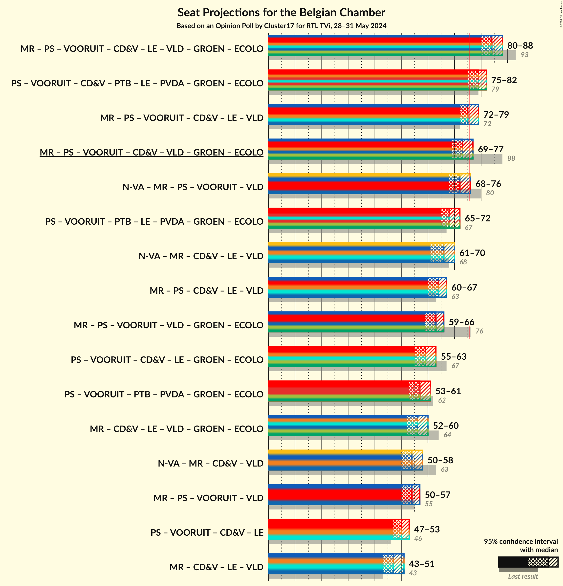

### Confidence Intervals

| Coalition | Last Result | Median | Majority? | 80% Confidence Interval | 90% Confidence Interval | 95% Confidence Interval | 99% Confidence Interval |
|:---------:|:-----------:|:------:|:---------:|:-----------------------:|:-----------------------:|:-----------------------:|:-----------------------:|
| Mouvement Réformateur – Parti Socialiste – Vooruit – Christen-Democratisch en Vlaams – Les Engagés – Open Vlaamse Liberalen en Democraten – Groen – Ecolo | 93 | 84 | 100% | 82–87 | 81–87 | 80–88 | 79–89 |
| Parti Socialiste – Vooruit – Christen-Democratisch en Vlaams – Parti du Travail de Belgique – Les Engagés – Partij van de Arbeid van België – Groen – Ecolo | 79 | 79 | 95% | 76–81 | 76–82 | 75–82 | 74–84 |
| Mouvement Réformateur – Parti Socialiste – Vooruit – Christen-Democratisch en Vlaams – Les Engagés – Open Vlaamse Liberalen en Democraten | 72 | 75 | 44% | 73–78 | 72–78 | 72–79 | 71–80 |
| Mouvement Réformateur – Parti Socialiste – Vooruit – Christen-Democratisch en Vlaams – Open Vlaamse Liberalen en Democraten – Groen – Ecolo | 88 | 73 | 11% | 70–76 | 70–76 | 69–77 | 68–78 |
| Nieuw-Vlaamse Alliantie – Mouvement Réformateur – Parti Socialiste – Vooruit – Open Vlaamse Liberalen en Democraten | 80 | 72 | 4% | 70–75 | 69–75 | 68–76 | 67–77 |
| Parti Socialiste – Vooruit – Parti du Travail de Belgique – Les Engagés – Partij van de Arbeid van België – Groen – Ecolo | 67 | 68 | 0% | 66–70 | 65–71 | 65–72 | 63–73 |
| Nieuw-Vlaamse Alliantie – Mouvement Réformateur – Christen-Democratisch en Vlaams – Les Engagés – Open Vlaamse Liberalen en Democraten | 68 | 66 | 0% | 63–68 | 62–69 | 61–70 | 60–71 |
| Mouvement Réformateur – Parti Socialiste – Christen-Democratisch en Vlaams – Les Engagés – Open Vlaamse Liberalen en Democraten | 63 | 64 | 0% | 61–66 | 61–67 | 60–67 | 59–68 |
| Mouvement Réformateur – Parti Socialiste – Vooruit – Open Vlaamse Liberalen en Democraten – Groen – Ecolo | 76 | 63 | 0% | 60–65 | 59–66 | 59–66 | 58–68 |
| Parti Socialiste – Vooruit – Christen-Democratisch en Vlaams – Les Engagés – Groen – Ecolo | 67 | 59 | 0% | 56–61 | 56–62 | 55–63 | 54–64 |
| Parti Socialiste – Vooruit – Parti du Travail de Belgique – Partij van de Arbeid van België – Groen – Ecolo | 62 | 57 | 0% | 55–59 | 54–60 | 53–61 | 52–62 |
| Mouvement Réformateur – Christen-Democratisch en Vlaams – Les Engagés – Open Vlaamse Liberalen en Democraten – Groen – Ecolo | 64 | 56 | 0% | 53–58 | 53–59 | 52–60 | 51–61 |
| Nieuw-Vlaamse Alliantie – Mouvement Réformateur – Christen-Democratisch en Vlaams – Open Vlaamse Liberalen en Democraten | 63 | 54 | 0% | 52–57 | 51–58 | 50–58 | 49–59 |
| Mouvement Réformateur – Parti Socialiste – Vooruit – Open Vlaamse Liberalen en Democraten | 55 | 54 | 0% | 51–56 | 51–57 | 50–57 | 49–58 |
| Parti Socialiste – Vooruit – Christen-Democratisch en Vlaams – Les Engagés | 46 | 50 | 0% | 48–52 | 47–53 | 47–53 | 46–55 |
| Mouvement Réformateur – Christen-Democratisch en Vlaams – Les Engagés – Open Vlaamse Liberalen en Democraten | 43 | 47 | 0% | 44–49 | 44–50 | 43–51 | 42–52 |

### Mouvement Réformateur – Parti Socialiste – Vooruit – Christen-Democratisch en Vlaams – Les Engagés – Open Vlaamse Liberalen en Democraten – Groen – Ecolo

| Number of Seats | Probability | Accumulated | Special Marks |
|:---------------:|:-----------:|:-----------:|:-------------:|
| 78 | 0.1% | 100% |  |
| 79 | 0.9% | 99.9% |  |
| 80 | 2% | 99.0% |  |
| 81 | 5% | 97% |  |
| 82 | 11% | 92% |  |
| 83 | 18% | 81% | Median |
| 84 | 21% | 63% |  |
| 85 | 19% | 42% |  |
| 86 | 13% | 24% |  |
| 87 | 7% | 11% |  |
| 88 | 3% | 4% |  |
| 89 | 0.9% | 1.1% |  |
| 90 | 0.2% | 0.2% |  |
| 91 | 0% | 0% |  |
| 92 | 0% | 0% |  |
| 93 | 0% | 0% | Last Result |

### Parti Socialiste – Vooruit – Christen-Democratisch en Vlaams – Parti du Travail de Belgique – Les Engagés – Partij van de Arbeid van België – Groen – Ecolo

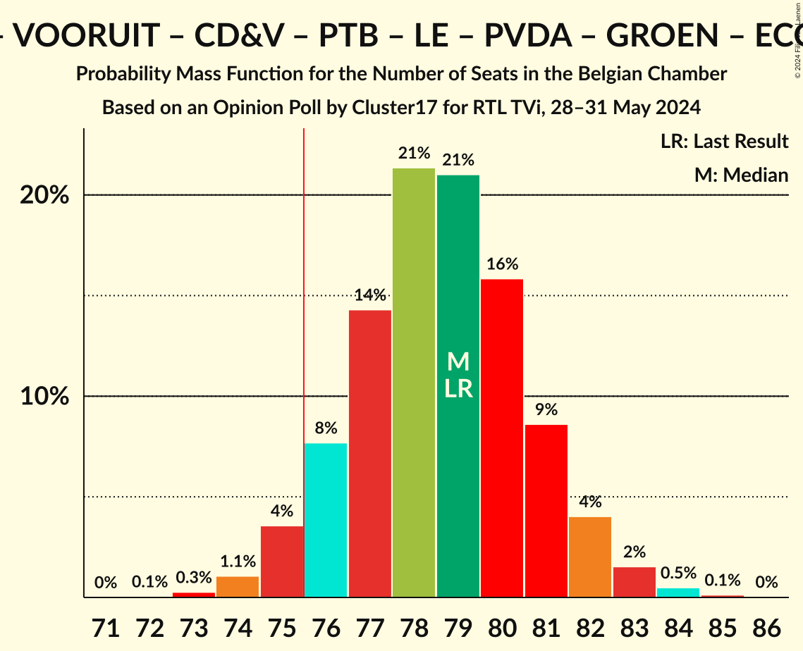

| Number of Seats | Probability | Accumulated | Special Marks |
|:---------------:|:-----------:|:-----------:|:-------------:|
| 72 | 0.1% | 100% |  |
| 73 | 0.3% | 99.9% |  |
| 74 | 1.1% | 99.7% |  |
| 75 | 4% | 98.6% |  |
| 76 | 8% | 95% | Majority |
| 77 | 14% | 87% |  |
| 78 | 21% | 73% | Median |
| 79 | 21% | 52% | Last Result |
| 80 | 16% | 31% |  |
| 81 | 9% | 15% |  |
| 82 | 4% | 6% |  |
| 83 | 2% | 2% |  |
| 84 | 0.5% | 0.7% |  |
| 85 | 0.1% | 0.2% |  |
| 86 | 0% | 0% |  |

### Mouvement Réformateur – Parti Socialiste – Vooruit – Christen-Democratisch en Vlaams – Les Engagés – Open Vlaamse Liberalen en Democraten

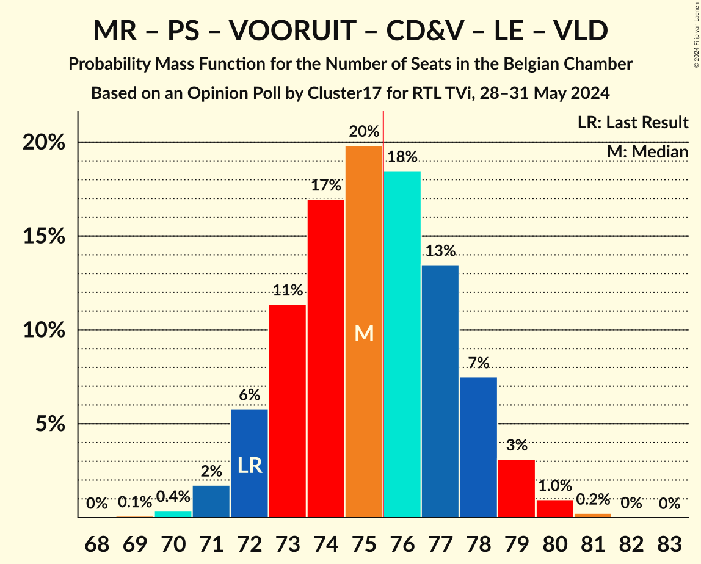

| Number of Seats | Probability | Accumulated | Special Marks |
|:---------------:|:-----------:|:-----------:|:-------------:|
| 69 | 0.1% | 100% |  |
| 70 | 0.4% | 99.9% |  |
| 71 | 2% | 99.5% |  |
| 72 | 6% | 98% | Last Result |
| 73 | 11% | 92% |  |
| 74 | 17% | 81% | Median |
| 75 | 20% | 64% |  |
| 76 | 18% | 44% | Majority |
| 77 | 13% | 25% |  |
| 78 | 7% | 12% |  |
| 79 | 3% | 4% |  |
| 80 | 1.0% | 1.2% |  |
| 81 | 0.2% | 0.3% |  |
| 82 | 0% | 0.1% |  |
| 83 | 0% | 0% |  |

### Mouvement Réformateur – Parti Socialiste – Vooruit – Christen-Democratisch en Vlaams – Open Vlaamse Liberalen en Democraten – Groen – Ecolo

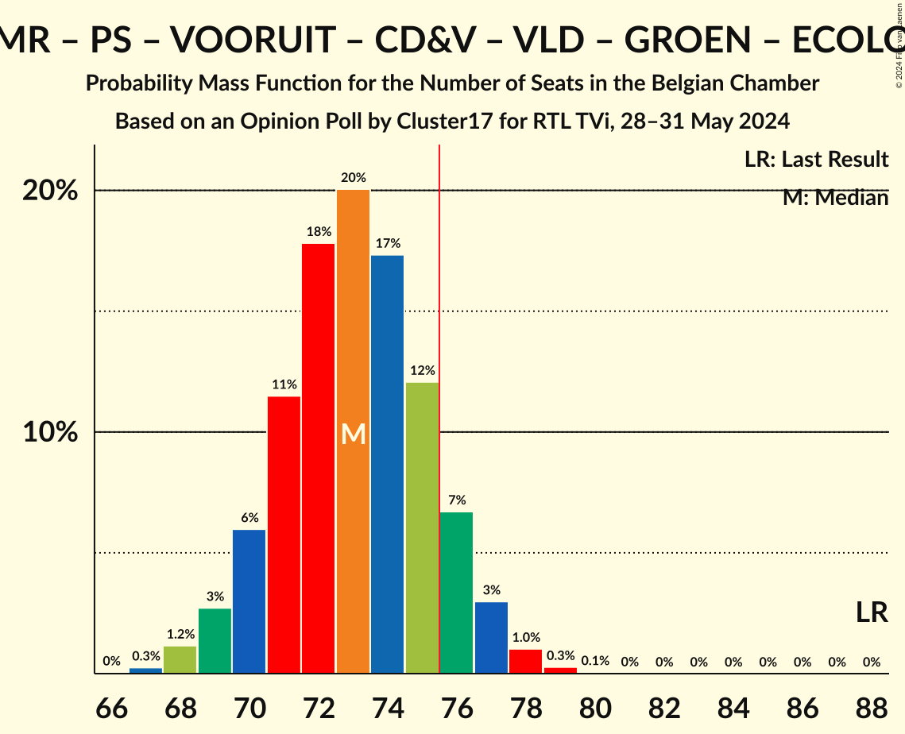

| Number of Seats | Probability | Accumulated | Special Marks |
|:---------------:|:-----------:|:-----------:|:-------------:|
| 66 | 0% | 100% |  |
| 67 | 0.3% | 99.9% |  |
| 68 | 1.2% | 99.7% |  |
| 69 | 3% | 98.5% |  |
| 70 | 6% | 96% |  |
| 71 | 11% | 90% |  |
| 72 | 18% | 78% | Median |
| 73 | 20% | 61% |  |
| 74 | 17% | 40% |  |
| 75 | 12% | 23% |  |
| 76 | 7% | 11% | Majority |
| 77 | 3% | 4% |  |
| 78 | 1.0% | 1.4% |  |
| 79 | 0.3% | 0.3% |  |
| 80 | 0.1% | 0.1% |  |
| 81 | 0% | 0% |  |
| 82 | 0% | 0% |  |
| 83 | 0% | 0% |  |
| 84 | 0% | 0% |  |
| 85 | 0% | 0% |  |
| 86 | 0% | 0% |  |
| 87 | 0% | 0% |  |
| 88 | 0% | 0% | Last Result |

### Nieuw-Vlaamse Alliantie – Mouvement Réformateur – Parti Socialiste – Vooruit – Open Vlaamse Liberalen en Democraten

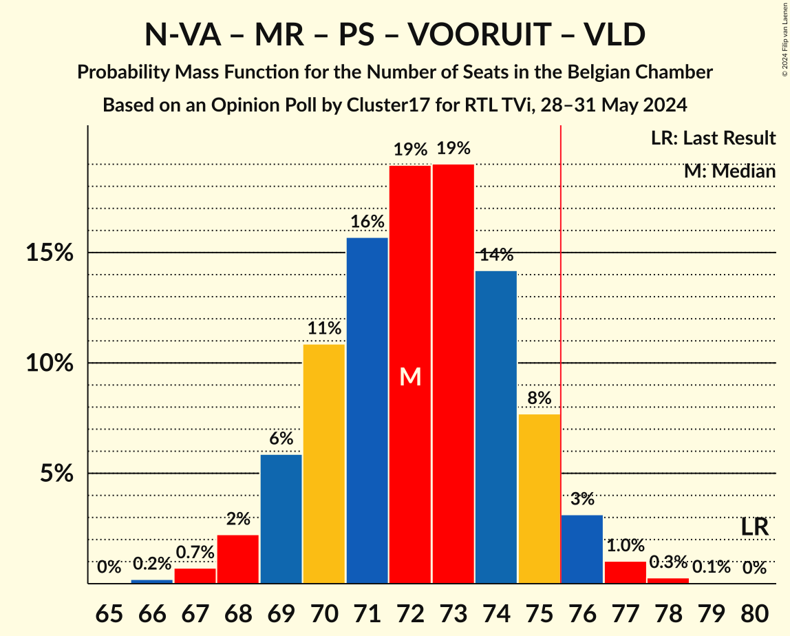

| Number of Seats | Probability | Accumulated | Special Marks |
|:---------------:|:-----------:|:-----------:|:-------------:|
| 65 | 0% | 100% |  |
| 66 | 0.2% | 99.9% |  |
| 67 | 0.7% | 99.7% |  |
| 68 | 2% | 99.0% |  |
| 69 | 6% | 97% |  |
| 70 | 11% | 91% |  |
| 71 | 16% | 80% |  |
| 72 | 19% | 64% | Median |
| 73 | 19% | 45% |  |
| 74 | 14% | 26% |  |
| 75 | 8% | 12% |  |
| 76 | 3% | 4% | Majority |
| 77 | 1.0% | 1.4% |  |
| 78 | 0.3% | 0.3% |  |
| 79 | 0.1% | 0.1% |  |
| 80 | 0% | 0% | Last Result |

### Parti Socialiste – Vooruit – Parti du Travail de Belgique – Les Engagés – Partij van de Arbeid van België – Groen – Ecolo

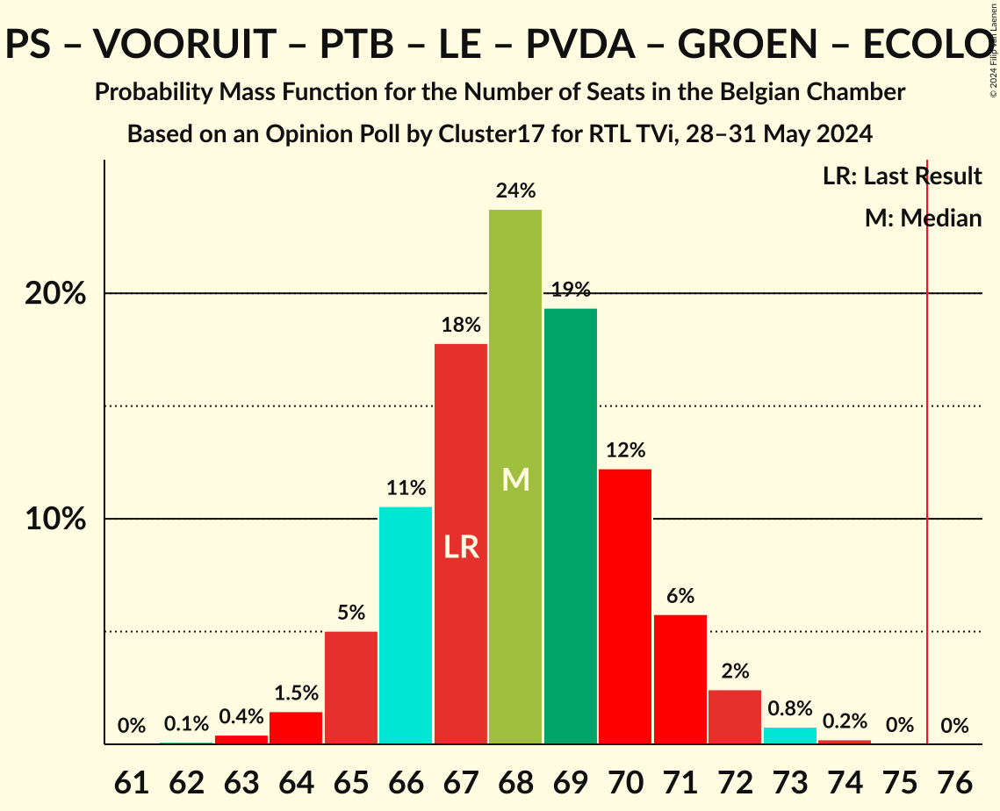

| Number of Seats | Probability | Accumulated | Special Marks |
|:---------------:|:-----------:|:-----------:|:-------------:|
| 62 | 0.1% | 100% |  |
| 63 | 0.4% | 99.9% |  |
| 64 | 1.5% | 99.5% |  |
| 65 | 5% | 98% |  |
| 66 | 11% | 93% |  |
| 67 | 18% | 82% | Last Result |
| 68 | 24% | 65% | Median |
| 69 | 19% | 41% |  |
| 70 | 12% | 21% |  |
| 71 | 6% | 9% |  |
| 72 | 2% | 3% |  |
| 73 | 0.8% | 1.1% |  |
| 74 | 0.2% | 0.3% |  |
| 75 | 0% | 0.1% |  |
| 76 | 0% | 0% | Majority |

### Nieuw-Vlaamse Alliantie – Mouvement Réformateur – Christen-Democratisch en Vlaams – Les Engagés – Open Vlaamse Liberalen en Democraten

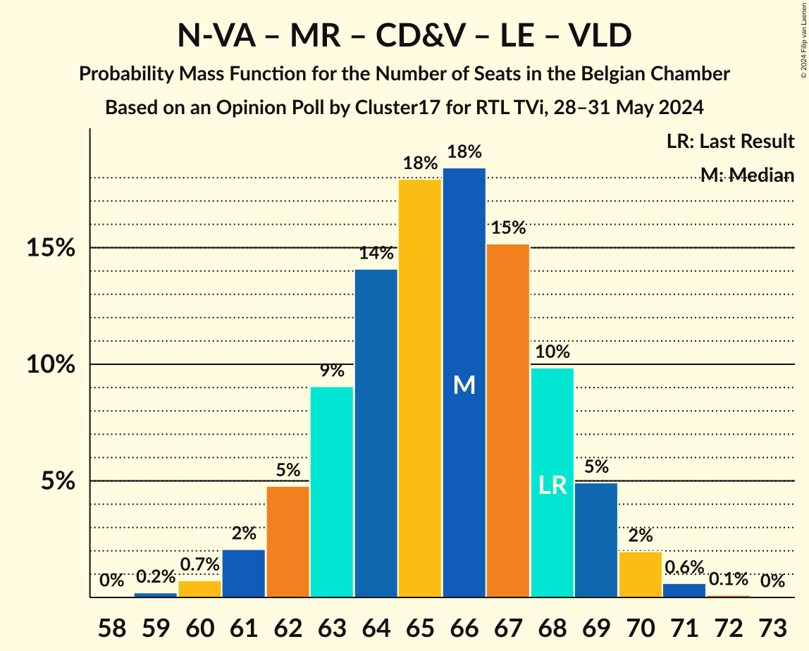

| Number of Seats | Probability | Accumulated | Special Marks |
|:---------------:|:-----------:|:-----------:|:-------------:|
| 58 | 0% | 100% |  |
| 59 | 0.2% | 99.9% |  |
| 60 | 0.7% | 99.7% |  |
| 61 | 2% | 99.0% |  |
| 62 | 5% | 97% |  |
| 63 | 9% | 92% |  |
| 64 | 14% | 83% |  |
| 65 | 18% | 69% | Median |
| 66 | 18% | 51% |  |
| 67 | 15% | 33% |  |
| 68 | 10% | 17% | Last Result |
| 69 | 5% | 8% |  |
| 70 | 2% | 3% |  |
| 71 | 0.6% | 0.7% |  |
| 72 | 0.1% | 0.1% |  |
| 73 | 0% | 0% |  |

### Mouvement Réformateur – Parti Socialiste – Christen-Democratisch en Vlaams – Les Engagés – Open Vlaamse Liberalen en Democraten

| Number of Seats | Probability | Accumulated | Special Marks |
|:---------------:|:-----------:|:-----------:|:-------------:|
| 58 | 0.1% | 100% |  |
| 59 | 0.4% | 99.9% |  |
| 60 | 2% | 99.5% |  |
| 61 | 8% | 97% |  |
| 62 | 15% | 89% |  |
| 63 | 20% | 74% | Last Result, Median |
| 64 | 20% | 54% |  |
| 65 | 17% | 34% |  |
| 66 | 11% | 17% |  |
| 67 | 5% | 7% |  |
| 68 | 1.4% | 2% |  |
| 69 | 0.2% | 0.3% |  |
| 70 | 0.1% | 0.1% |  |
| 71 | 0% | 0% |  |

### Mouvement Réformateur – Parti Socialiste – Vooruit – Open Vlaamse Liberalen en Democraten – Groen – Ecolo

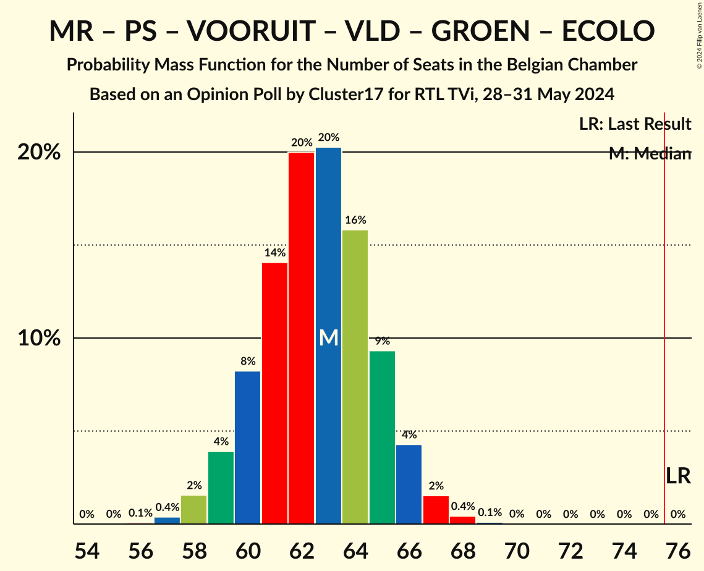

| Number of Seats | Probability | Accumulated | Special Marks |
|:---------------:|:-----------:|:-----------:|:-------------:|
| 56 | 0.1% | 100% |  |
| 57 | 0.4% | 99.9% |  |
| 58 | 2% | 99.5% |  |
| 59 | 4% | 98% |  |
| 60 | 8% | 94% |  |
| 61 | 14% | 86% |  |
| 62 | 20% | 72% | Median |
| 63 | 20% | 52% |  |
| 64 | 16% | 32% |  |
| 65 | 9% | 16% |  |
| 66 | 4% | 6% |  |
| 67 | 2% | 2% |  |
| 68 | 0.4% | 0.6% |  |
| 69 | 0.1% | 0.1% |  |
| 70 | 0% | 0% |  |
| 71 | 0% | 0% |  |
| 72 | 0% | 0% |  |
| 73 | 0% | 0% |  |
| 74 | 0% | 0% |  |
| 75 | 0% | 0% |  |
| 76 | 0% | 0% | Last Result, Majority |

### Parti Socialiste – Vooruit – Christen-Democratisch en Vlaams – Les Engagés – Groen – Ecolo

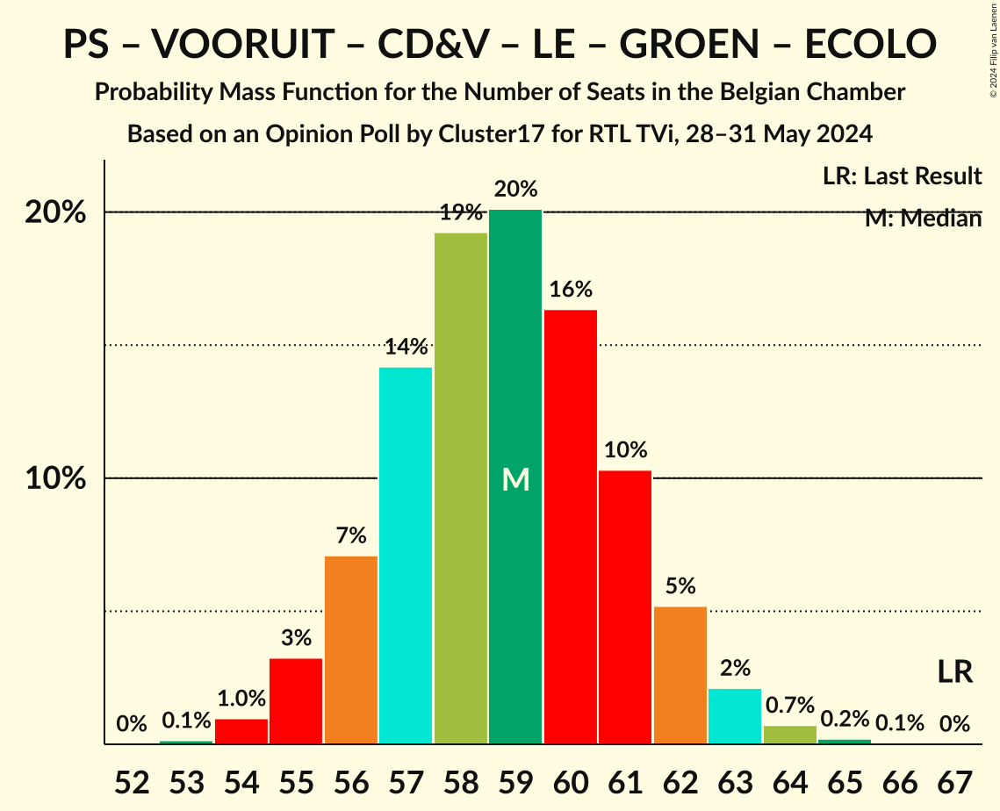

| Number of Seats | Probability | Accumulated | Special Marks |
|:---------------:|:-----------:|:-----------:|:-------------:|
| 53 | 0.1% | 100% |  |
| 54 | 1.0% | 99.8% |  |
| 55 | 3% | 98.9% |  |
| 56 | 7% | 96% |  |
| 57 | 14% | 89% |  |
| 58 | 19% | 74% | Median |
| 59 | 20% | 55% |  |
| 60 | 16% | 35% |  |
| 61 | 10% | 19% |  |
| 62 | 5% | 8% |  |
| 63 | 2% | 3% |  |
| 64 | 0.7% | 1.0% |  |
| 65 | 0.2% | 0.3% |  |
| 66 | 0.1% | 0.1% |  |
| 67 | 0% | 0% | Last Result |

### Parti Socialiste – Vooruit – Parti du Travail de Belgique – Partij van de Arbeid van België – Groen – Ecolo

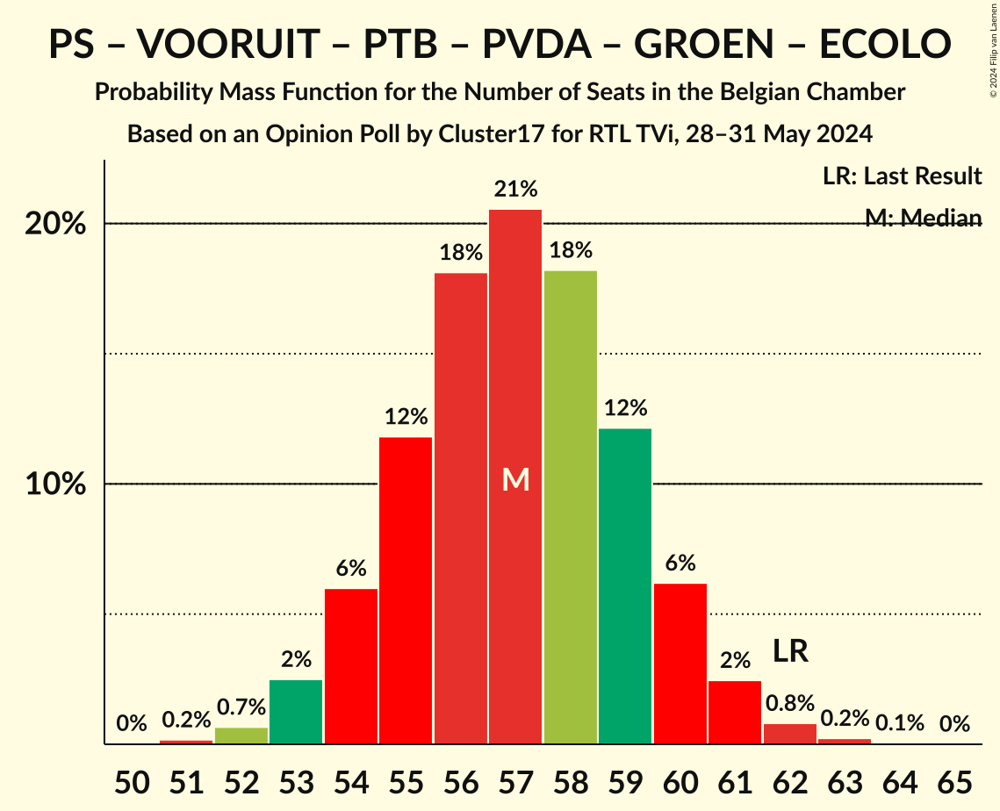

| Number of Seats | Probability | Accumulated | Special Marks |
|:---------------:|:-----------:|:-----------:|:-------------:|
| 51 | 0.2% | 100% |  |
| 52 | 0.7% | 99.8% |  |
| 53 | 2% | 99.1% |  |
| 54 | 6% | 97% |  |
| 55 | 12% | 91% |  |
| 56 | 18% | 79% |  |
| 57 | 21% | 61% | Median |
| 58 | 18% | 40% |  |
| 59 | 12% | 22% |  |
| 60 | 6% | 10% |  |
| 61 | 2% | 4% |  |
| 62 | 0.8% | 1.1% | Last Result |
| 63 | 0.2% | 0.3% |  |
| 64 | 0.1% | 0.1% |  |
| 65 | 0% | 0% |  |

### Mouvement Réformateur – Christen-Democratisch en Vlaams – Les Engagés – Open Vlaamse Liberalen en Democraten – Groen – Ecolo

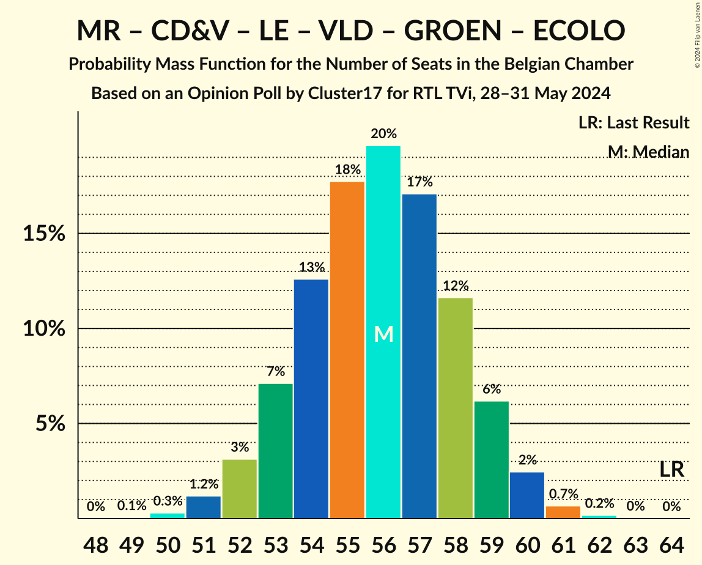

| Number of Seats | Probability | Accumulated | Special Marks |
|:---------------:|:-----------:|:-----------:|:-------------:|
| 49 | 0.1% | 100% |  |
| 50 | 0.3% | 99.9% |  |
| 51 | 1.2% | 99.6% |  |
| 52 | 3% | 98% |  |
| 53 | 7% | 95% |  |
| 54 | 13% | 88% |  |
| 55 | 18% | 76% | Median |
| 56 | 20% | 58% |  |
| 57 | 17% | 38% |  |
| 58 | 12% | 21% |  |
| 59 | 6% | 10% |  |
| 60 | 2% | 3% |  |
| 61 | 0.7% | 0.9% |  |
| 62 | 0.2% | 0.2% |  |
| 63 | 0% | 0% |  |
| 64 | 0% | 0% | Last Result |

### Nieuw-Vlaamse Alliantie – Mouvement Réformateur – Christen-Democratisch en Vlaams – Open Vlaamse Liberalen en Democraten

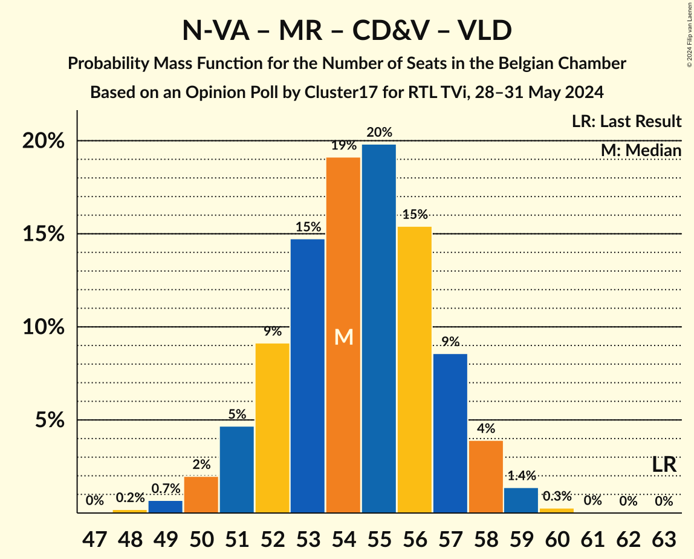

| Number of Seats | Probability | Accumulated | Special Marks |
|:---------------:|:-----------:|:-----------:|:-------------:|
| 47 | 0% | 100% |  |
| 48 | 0.2% | 99.9% |  |
| 49 | 0.7% | 99.8% |  |
| 50 | 2% | 99.1% |  |
| 51 | 5% | 97% |  |
| 52 | 9% | 92% |  |
| 53 | 15% | 83% |  |
| 54 | 19% | 69% | Median |
| 55 | 20% | 49% |  |
| 56 | 15% | 30% |  |
| 57 | 9% | 14% |  |
| 58 | 4% | 6% |  |
| 59 | 1.4% | 2% |  |
| 60 | 0.3% | 0.3% |  |
| 61 | 0% | 0.1% |  |
| 62 | 0% | 0% |  |
| 63 | 0% | 0% | Last Result |

### Mouvement Réformateur – Parti Socialiste – Vooruit – Open Vlaamse Liberalen en Democraten

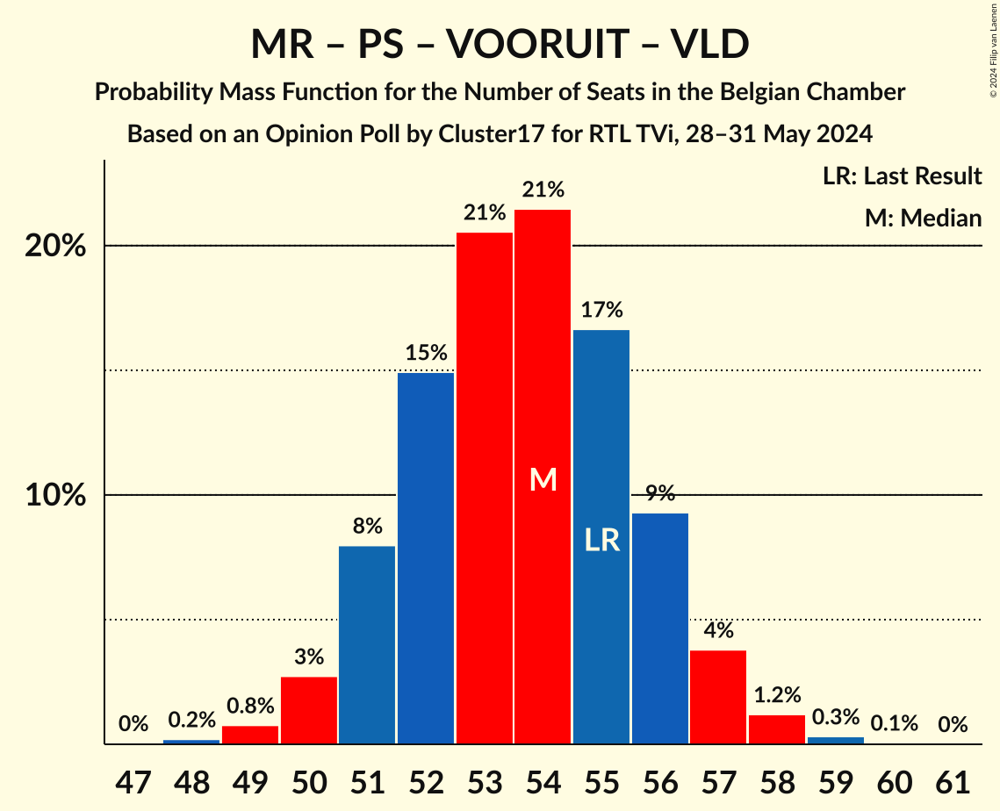

| Number of Seats | Probability | Accumulated | Special Marks |
|:---------------:|:-----------:|:-----------:|:-------------:|
| 47 | 0% | 100% |  |
| 48 | 0.2% | 99.9% |  |
| 49 | 0.8% | 99.7% |  |
| 50 | 3% | 99.0% |  |
| 51 | 8% | 96% |  |
| 52 | 15% | 88% |  |
| 53 | 21% | 73% | Median |
| 54 | 21% | 53% |  |
| 55 | 17% | 31% | Last Result |
| 56 | 9% | 15% |  |
| 57 | 4% | 5% |  |
| 58 | 1.2% | 2% |  |
| 59 | 0.3% | 0.4% |  |
| 60 | 0.1% | 0.1% |  |
| 61 | 0% | 0% |  |

### Parti Socialiste – Vooruit – Christen-Democratisch en Vlaams – Les Engagés

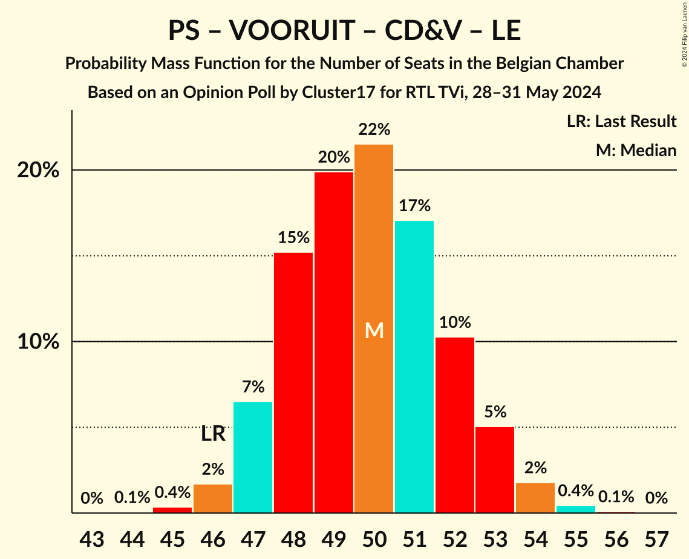

| Number of Seats | Probability | Accumulated | Special Marks |
|:---------------:|:-----------:|:-----------:|:-------------:|
| 44 | 0.1% | 100% |  |
| 45 | 0.4% | 99.9% |  |
| 46 | 2% | 99.6% | Last Result |
| 47 | 7% | 98% |  |
| 48 | 15% | 91% |  |
| 49 | 20% | 76% | Median |
| 50 | 22% | 56% |  |
| 51 | 17% | 35% |  |
| 52 | 10% | 18% |  |
| 53 | 5% | 7% |  |
| 54 | 2% | 2% |  |
| 55 | 0.4% | 0.6% |  |
| 56 | 0.1% | 0.1% |  |
| 57 | 0% | 0% |  |

### Mouvement Réformateur – Christen-Democratisch en Vlaams – Les Engagés – Open Vlaamse Liberalen en Democraten

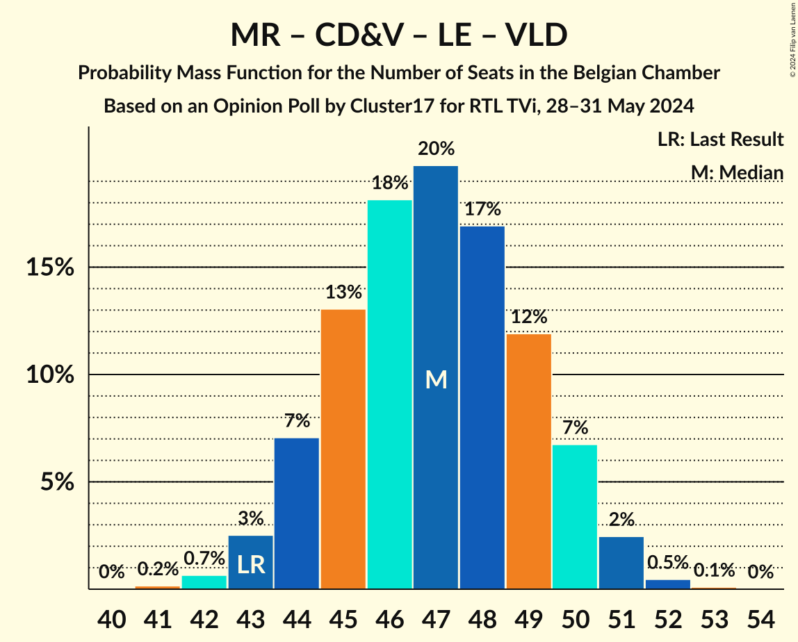

| Number of Seats | Probability | Accumulated | Special Marks |
|:---------------:|:-----------:|:-----------:|:-------------:|
| 41 | 0.2% | 100% |  |
| 42 | 0.7% | 99.8% |  |
| 43 | 3% | 99.2% | Last Result |
| 44 | 7% | 97% |  |
| 45 | 13% | 90% |  |
| 46 | 18% | 77% | Median |
| 47 | 20% | 58% |  |
| 48 | 17% | 39% |  |
| 49 | 12% | 22% |  |
| 50 | 7% | 10% |  |
| 51 | 2% | 3% |  |
| 52 | 0.5% | 0.6% |  |
| 53 | 0.1% | 0.1% |  |
| 54 | 0% | 0% |  |

## Technical Information

### Opinion Poll

+ **Polling firm:** Cluster17
+ **Commissioner(s):** RTL TVi
+ **Fieldwork period:** 28–31 May 2024

### Calculations

+ **Sample size:** 1844
+ **Simulations done:** 2,097,152
+ **Error estimate:** 0.61%

