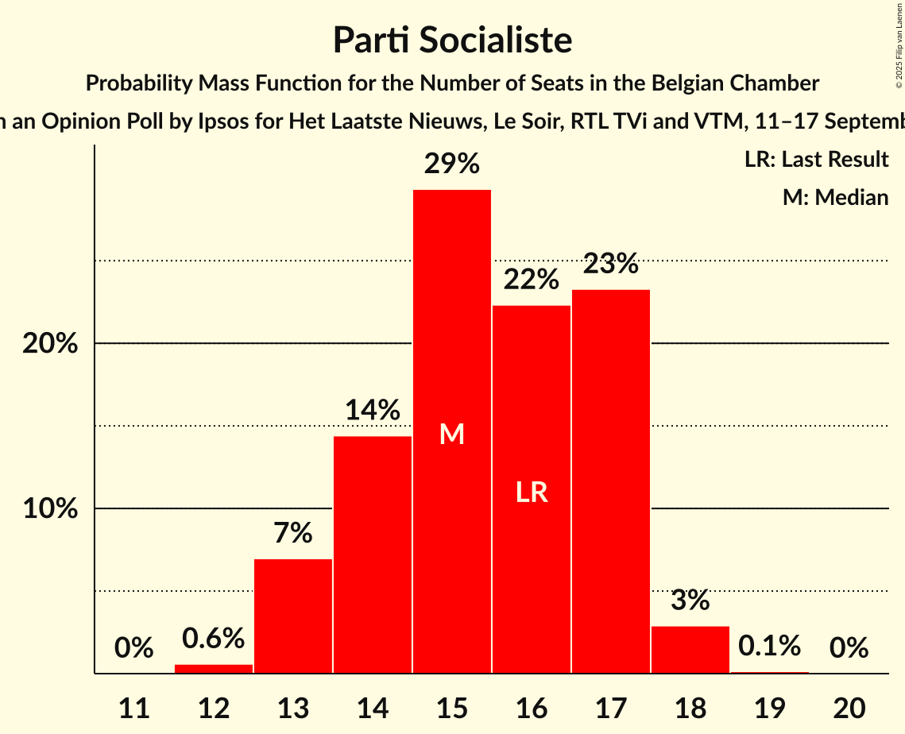
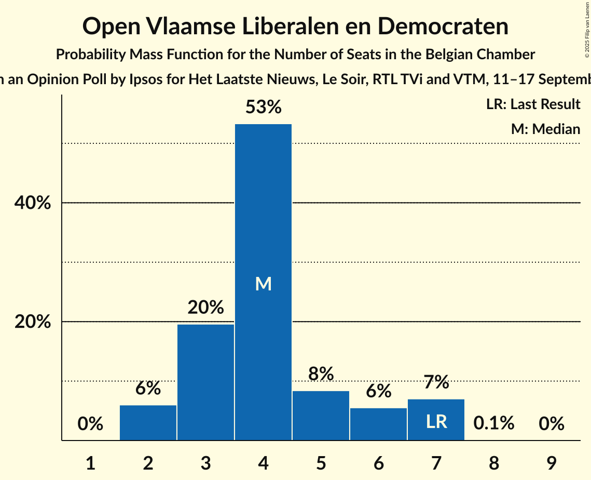
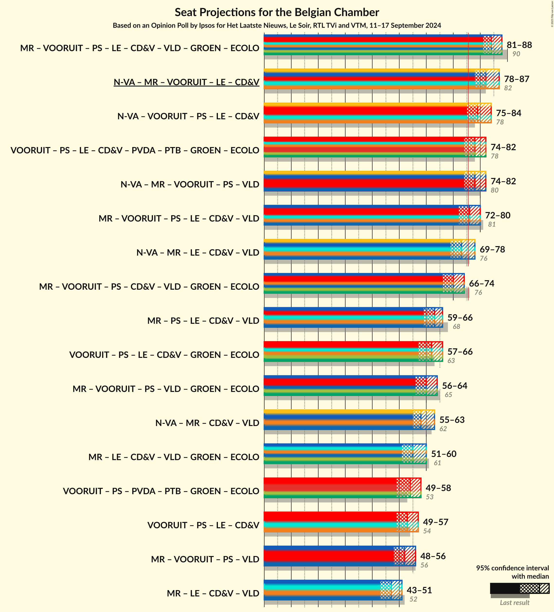
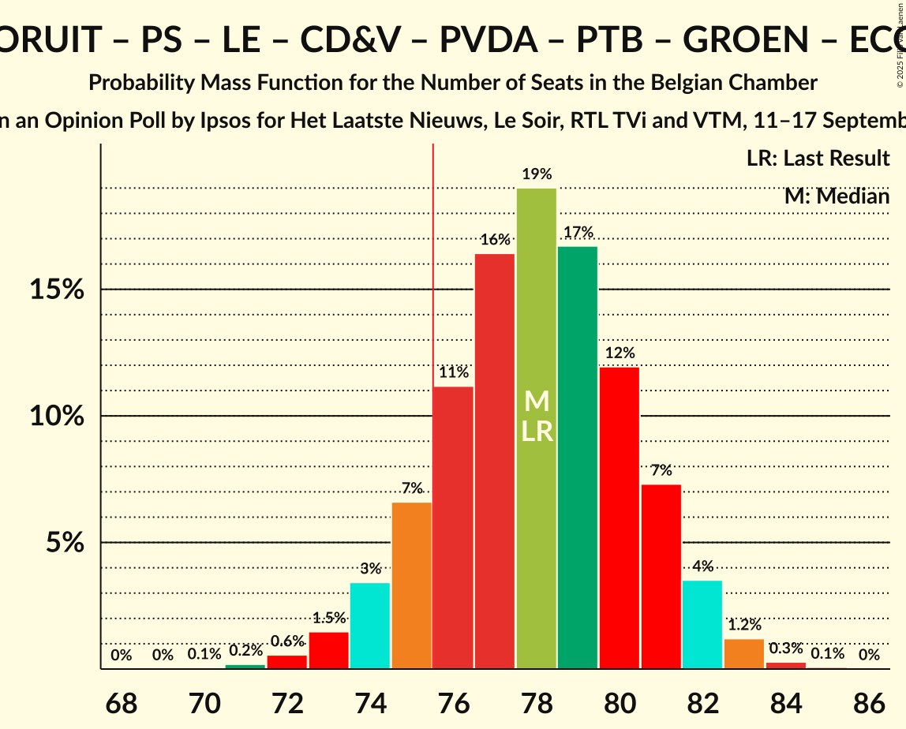
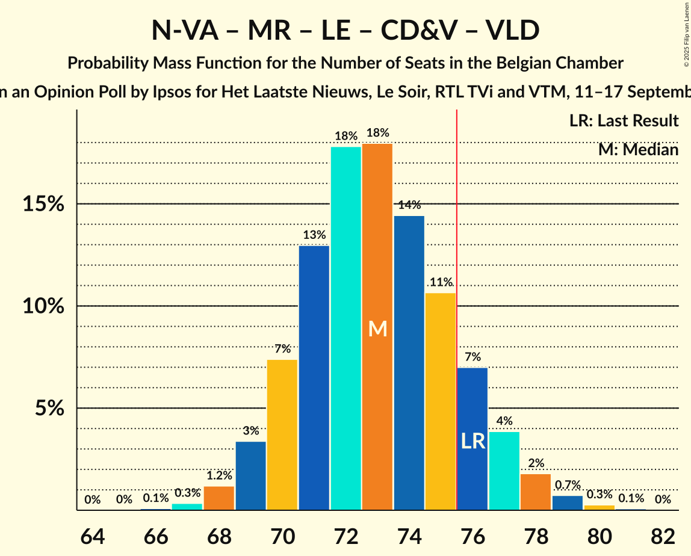
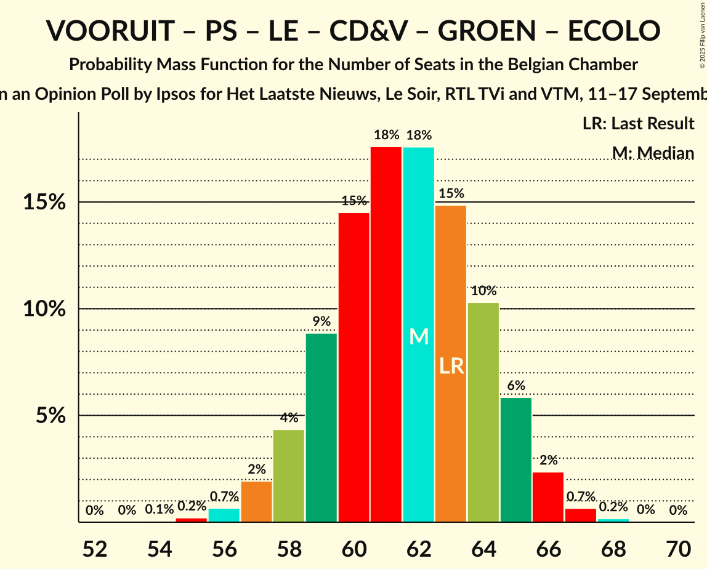
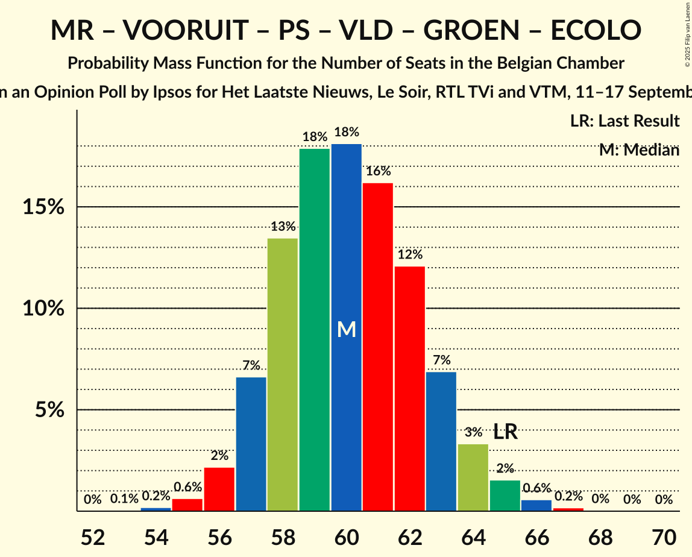
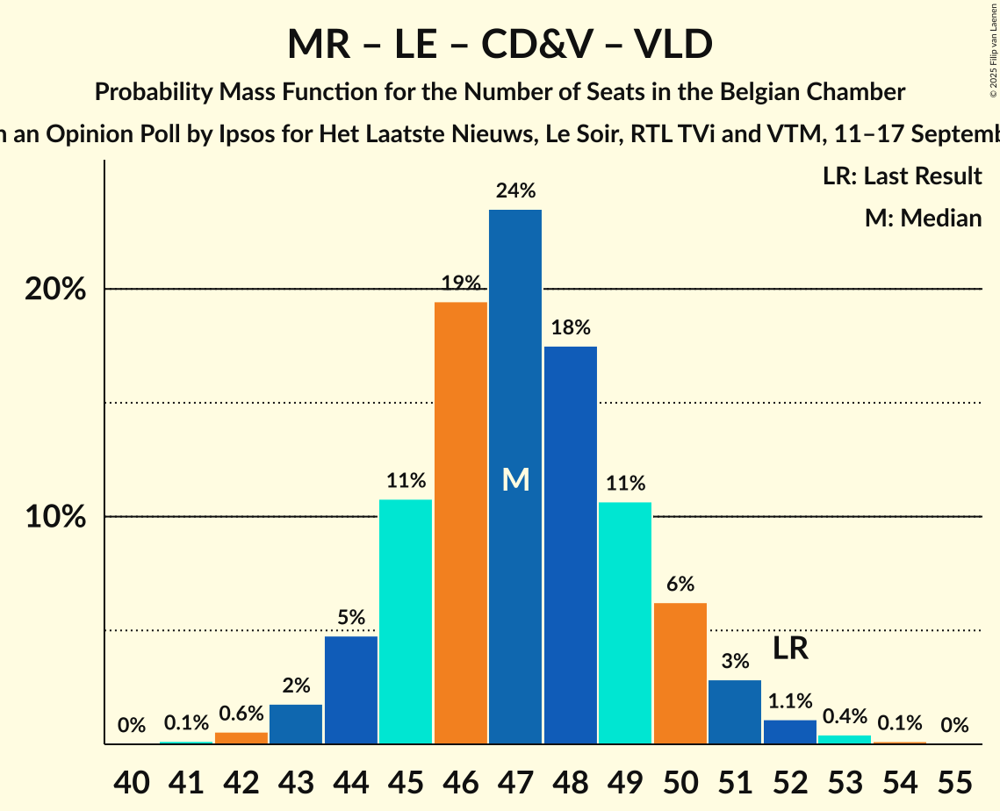

# Opinion Poll by Ipsos for Het Laatste Nieuws, Le Soir, RTL TVi and VTM, 11–17 September 2024

Areas included: Brussels, Flanders, Wallonia

<a href="#voting-intentions">Voting Intentions</a> | <a href="#seats">Seats</a> | <a href="#coalitions">Coalitions</a> | <a href="#technical-information">Technical Information</a>

## Voting Intentions

### Confidence Intervals

| Party | Last Result | Poll Result | 80% Confidence Interval | 90% Confidence Interval | 95% Confidence Interval | 99% Confidence Interval |
|:-----:|:-----------:|:-----------:|:-----------------------:|:-----------------------:|:-----------------------:|:-----------------------:|
| Nieuw-Vlaamse Alliantie | 16.7% | 16.7% | 14.9–15.8% |14.7–15.8% |14.5–15.8% |14.1–15.8% |
| Vlaams Belang | 13.8% | 14.6% | 12.9–13.7% |12.7–13.7% |12.5–13.7% |12.1–13.7% |
| Mouvement Réformateur | 10.3% | 9.8% | 8.8–9.2% |8.7–9.2% |8.6–9.2% |8.4–9.2% |
| Vooruit | 8.1% | 9.2% | 8.3–9.9% |8.1–10.0% |7.9–10.1% |7.5–10.2% |
| Parti Socialiste | 8.0% | 8.2% | 7.2–7.6% |7.1–7.6% |7.1–7.6% |6.9–7.6% |
| Les Engagés | 6.8% | 7.6% | 6.6–7.0% |6.5–7.0% |6.4–7.0% |6.3–7.0% |
| Christen-Democratisch en Vlaams | 8.0% | 7.0% | 6.3–7.6% |6.1–7.7% |5.9–7.8% |5.6–7.9% |
| Partij van de Arbeid van België | 5.1% | 5.5% | 4.9–6.1% |4.7–6.2% |4.5–6.3% |4.2–6.3% |
| Parti du Travail de Belgique | 4.8% | 5.2% | 4.5–4.8% |4.4–4.8% |4.3–4.8% |4.2–4.8% |
| Open Vlaamse Liberalen en Democraten | 5.4% | 4.2% | 3.6–4.7% |3.5–4.8% |3.3–4.9% |3.1–4.9% |
| Groen | 4.6% | 4.0% | 3.5–4.5% |3.3–4.6% |3.2–4.7% |2.9–4.7% |
| Ecolo | 2.9% | 3.4% | 2.7–3.0% |2.7–3.0% |2.6–3.0% |2.5–3.0% |
| DéFI | 1.2% | 1.2% | 0.9–1.0% |0.8–1.0% |0.8–1.0% |0.7–1.0% |
| Chez Nous | 0.9% | 0.9% | 0.7–0.9% |0.6–0.9% |0.6–1.0% |0.5–1.0% |
| Team Fouad Ahidar | 0.4% | 0.1% | 0.1% |0.1% |0.1% |0.1% |

*Note:* The poll result column reflects the actual value used in the calculations. Published results may vary slightly, and in addition be rounded to fewer digits.

## Seats

### Confidence Intervals

| Party | Last Result | Median | 80% Confidence Interval | 90% Confidence Interval | 95% Confidence Interval | 99% Confidence Interval |
|:-----:|:-----------:|:------:|:-----------------------:|:-----------------------:|:-----------------------:|:-----------------------:|
| <a href="#nieuw-vlaamse-alliantie">Nieuw-Vlaamse Alliantie</a> | 24 | 26 | 24–28 |24–29 |23–30 |22–30 |
| <a href="#vlaams-belang">Vlaams Belang</a> | 20 | 23 | 20–24 |20–25 |19–25 |18–26 |
| <a href="#mouvement-réformateur">Mouvement Réformateur</a> | 20 | 19 | 17–20 |17–21 |17–22 |17–22 |
| <a href="#vooruit">Vooruit</a> | 13 | 13 | 13–15 |12–15 |11–16 |10–17 |
| <a href="#parti-socialiste">Parti Socialiste</a> | 16 | 15 | 14–17 |13–17 |13–18 |12–18 |
| <a href="#les-engagés">Les Engagés</a> | 14 | 14 | 14–15 |13–15 |12–16 |11–16 |
| <a href="#christen-democratisch-en-vlaams">Christen-Democratisch en Vlaams</a> | 11 | 10 | 9–10 |8–11 |8–12 |7–13 |
| <a href="#partij-van-de-arbeid-van-belgië">Partij van de Arbeid van België</a> | 7 | 7 | 5–8 |5–8 |5–9 |5–11 |
| <a href="#parti-du-travail-de-belgique">Parti du Travail de Belgique</a> | 8 | 9 | 8–10 |8–10 |8–11 |7–11 |
| <a href="#open-vlaamse-liberalen-en-democraten">Open Vlaamse Liberalen en Democraten</a> | 7 | 4 | 3–6 |2–7 |2–7 |2–7 |
| <a href="#groen">Groen</a> | 6 | 4 | 3–6 |3–6 |3–6 |1–6 |
| <a href="#ecolo">Ecolo</a> | 3 | 4 | 3–5 |3–6 |3–6 |2–7 |
| <a href="#défi">DéFI</a> | 1 | 1 | 1 |0–1 |0–1 |0–1 |
| <a href="#chez-nous">Chez Nous</a> | 0 | 0 | 0 |0 |0 |0 |
| <a href="#team-fouad-ahidar">Team Fouad Ahidar</a> | 0 | 0 | 0 |0 |0 |0 |

### Nieuw-Vlaamse Alliantie

*For a full overview of the results for this party, see the [Nieuw-Vlaamse Alliantie](party-nieuw-vlaamsealliantie.html) page.*

| Number of Seats | Probability | Accumulated | Special Marks |
|:---------------:|:-----------:|:-----------:|:-------------:|
| 21 | 0.3% | 100% |  |
| 22 | 0.5% | 99.7% |  |
| 23 | 4% | 99.2% |  |
| 24 | 18% | 95% | Last Result |
| 25 | 21% | 77% |  |
| 26 | 23% | 56% | Median |
| 27 | 16% | 33% |  |
| 28 | 8% | 17% |  |
| 29 | 6% | 9% |  |
| 30 | 3% | 3% |  |
| 31 | 0.1% | 0.2% |  |
| 32 | 0% | 0% |  |

### Vlaams Belang

*For a full overview of the results for this party, see the [Vlaams Belang](party-vlaamsbelang.html) page.*

| Number of Seats | Probability | Accumulated | Special Marks |
|:---------------:|:-----------:|:-----------:|:-------------:|
| 18 | 0.8% | 100% |  |
| 19 | 4% | 99.1% |  |
| 20 | 10% | 96% | Last Result |
| 21 | 11% | 85% |  |
| 22 | 18% | 74% |  |
| 23 | 31% | 56% | Median |
| 24 | 19% | 25% |  |
| 25 | 5% | 6% |  |
| 26 | 0.9% | 1.1% |  |
| 27 | 0.1% | 0.2% |  |
| 28 | 0% | 0% |  |

### Mouvement Réformateur

*For a full overview of the results for this party, see the [Mouvement Réformateur](party-mouvementréformateur.html) page.*

| Number of Seats | Probability | Accumulated | Special Marks |
|:---------------:|:-----------:|:-----------:|:-------------:|
| 16 | 0.2% | 100% |  |
| 17 | 13% | 99.8% |  |
| 18 | 33% | 86% |  |
| 19 | 30% | 53% | Median |
| 20 | 13% | 23% | Last Result |
| 21 | 6% | 10% |  |
| 22 | 3% | 3% |  |
| 23 | 0.3% | 0.3% |  |
| 24 | 0% | 0% |  |

### Vooruit

*For a full overview of the results for this party, see the [Vooruit](party-vooruit.html) page.*

| Number of Seats | Probability | Accumulated | Special Marks |
|:---------------:|:-----------:|:-----------:|:-------------:|
| 9 | 0.5% | 100% |  |
| 10 | 1.4% | 99.5% |  |
| 11 | 2% | 98% |  |
| 12 | 5% | 96% |  |
| 13 | 48% | 91% | Last Result, Median |
| 14 | 29% | 43% |  |
| 15 | 9% | 13% |  |
| 16 | 3% | 4% |  |
| 17 | 1.1% | 1.2% |  |
| 18 | 0.1% | 0.1% |  |
| 19 | 0% | 0% |  |

### Parti Socialiste

*For a full overview of the results for this party, see the [Parti Socialiste](party-partisocialiste.html) page.*

| Number of Seats | Probability | Accumulated | Special Marks |
|:---------------:|:-----------:|:-----------:|:-------------:|
| 12 | 0.8% | 100% |  |
| 13 | 7% | 99.2% |  |
| 14 | 14% | 92% |  |
| 15 | 29% | 77% | Median |
| 16 | 23% | 49% | Last Result |
| 17 | 23% | 26% |  |
| 18 | 3% | 3% |  |
| 19 | 0.1% | 0.2% |  |
| 20 | 0% | 0% |  |

### Les Engagés

*For a full overview of the results for this party, see the [Les Engagés](party-lesengagés.html) page.*

| Number of Seats | Probability | Accumulated | Special Marks |
|:---------------:|:-----------:|:-----------:|:-------------:|
| 10 | 0.1% | 100% |  |
| 11 | 0.7% | 99.8% |  |
| 12 | 2% | 99.2% |  |
| 13 | 5% | 97% |  |
| 14 | 45% | 92% | Last Result, Median |
| 15 | 42% | 47% |  |
| 16 | 4% | 4% |  |
| 17 | 0.4% | 0.4% |  |
| 18 | 0% | 0% |  |

### Christen-Democratisch en Vlaams

*For a full overview of the results for this party, see the [Christen-Democratisch en Vlaams](party-christen-democratischenvlaams.html) page.*

| Number of Seats | Probability | Accumulated | Special Marks |
|:---------------:|:-----------:|:-----------:|:-------------:|
| 5 | 0.1% | 100% |  |
| 6 | 0.2% | 99.9% |  |
| 7 | 0.7% | 99.6% |  |
| 8 | 9% | 98.9% |  |
| 9 | 7% | 90% |  |
| 10 | 74% | 83% | Median |
| 11 | 5% | 9% | Last Result |
| 12 | 2% | 4% |  |
| 13 | 2% | 2% |  |
| 14 | 0% | 0% |  |

### Partij van de Arbeid van België

*For a full overview of the results for this party, see the [Partij van de Arbeid van België](party-partijvandearbeidvanbelgië.html) page.*

| Number of Seats | Probability | Accumulated | Special Marks |
|:---------------:|:-----------:|:-----------:|:-------------:|
| 5 | 12% | 100% |  |
| 6 | 9% | 88% |  |
| 7 | 46% | 79% | Last Result, Median |
| 8 | 29% | 33% |  |
| 9 | 3% | 4% |  |
| 10 | 1.0% | 2% |  |
| 11 | 0.6% | 0.6% |  |
| 12 | 0% | 0% |  |

### Parti du Travail de Belgique

*For a full overview of the results for this party, see the [Parti du Travail de Belgique](party-partidutravaildebelgique.html) page.*

| Number of Seats | Probability | Accumulated | Special Marks |
|:---------------:|:-----------:|:-----------:|:-------------:|
| 7 | 1.5% | 100% |  |
| 8 | 12% | 98% | Last Result |
| 9 | 44% | 86% | Median |
| 10 | 38% | 43% |  |
| 11 | 5% | 5% |  |
| 12 | 0.1% | 0.2% |  |
| 13 | 0% | 0% |  |

### Open Vlaamse Liberalen en Democraten

*For a full overview of the results for this party, see the [Open Vlaamse Liberalen en Democraten](party-openvlaamseliberalenendemocraten.html) page.*

| Number of Seats | Probability | Accumulated | Special Marks |
|:---------------:|:-----------:|:-----------:|:-------------:|
| 2 | 6% | 100% |  |
| 3 | 20% | 94% |  |
| 4 | 54% | 74% | Median |
| 5 | 8% | 20% |  |
| 6 | 5% | 13% |  |
| 7 | 7% | 7% | Last Result |
| 8 | 0.1% | 0.1% |  |
| 9 | 0% | 0% |  |

### Groen

*For a full overview of the results for this party, see the [Groen](party-groen.html) page.*

| Number of Seats | Probability | Accumulated | Special Marks |
|:---------------:|:-----------:|:-----------:|:-------------:|
| 1 | 0.8% | 100% |  |
| 2 | 0.8% | 99.2% |  |
| 3 | 33% | 98% |  |
| 4 | 31% | 66% | Median |
| 5 | 10% | 34% |  |
| 6 | 24% | 24% | Last Result |
| 7 | 0% | 0.1% |  |
| 8 | 0% | 0% |  |

### Ecolo

*For a full overview of the results for this party, see the [Ecolo](party-ecolo.html) page.*

| Number of Seats | Probability | Accumulated | Special Marks |
|:---------------:|:-----------:|:-----------:|:-------------:|
| 2 | 0.5% | 100% |  |
| 3 | 14% | 99.5% | Last Result |
| 4 | 63% | 85% | Median |
| 5 | 16% | 22% |  |
| 6 | 4% | 6% |  |
| 7 | 2% | 2% |  |
| 8 | 0.1% | 0.1% |  |
| 9 | 0% | 0% |  |

### DéFI

*For a full overview of the results for this party, see the [DéFI](party-défi.html) page.*

| Number of Seats | Probability | Accumulated | Special Marks |
|:---------------:|:-----------:|:-----------:|:-------------:|
| 0 | 10% | 100% |  |
| 1 | 90% | 90% | Last Result, Median |
| 2 | 0.1% | 0.1% |  |
| 3 | 0% | 0% |  |

### Chez Nous

*For a full overview of the results for this party, see the [Chez Nous](party-cheznous.html) page.*

| Number of Seats | Probability | Accumulated | Special Marks |
|:---------------:|:-----------:|:-----------:|:-------------:|
| 0 | 99.8% | 100% | Last Result, Median |
| 1 | 0.2% | 0.2% |  |
| 2 | 0% | 0% |  |

### Team Fouad Ahidar

*For a full overview of the results for this party, see the [Team Fouad Ahidar](party-teamfouadahidar.html) page.*

| Number of Seats | Probability | Accumulated | Special Marks |
|:---------------:|:-----------:|:-----------:|:-------------:|
| 0 | 100% | 100% | Last Result, Median |

## Coalitions

### Confidence Intervals

| Coalition | Last Result | Median | Majority? | 80% Confidence Interval | 90% Confidence Interval | 95% Confidence Interval | 99% Confidence Interval |
|:---------:|:-----------:|:------:|:---------:|:-----------------------:|:-----------------------:|:-----------------------:|:-----------------------:|
| Mouvement Réformateur – Vooruit – Parti Socialiste – Les Engagés – Christen-Democratisch en Vlaams – Open Vlaamse Liberalen en Democraten – Groen – Ecolo | 90 | 84 | 100% | 82–87 | 81–88 | 81–89 | 79–90 |
| Nieuw-Vlaamse Alliantie – Mouvement Réformateur – Vooruit – Les Engagés – Christen-Democratisch en Vlaams | 82 | 82 | 99.9% | 80–85 | 79–86 | 78–87 | 77–89 |
| Nieuw-Vlaamse Alliantie – Vooruit – Parti Socialiste – Les Engagés – Christen-Democratisch en Vlaams | 78 | 79 | 95% | 76–82 | 75–83 | 75–84 | 73–85 |
| Nieuw-Vlaamse Alliantie – Mouvement Réformateur – Vooruit – Parti Socialiste – Open Vlaamse Liberalen en Democraten | 80 | 78 | 84% | 75–81 | 74–81 | 74–82 | 72–84 |
| Vooruit – Parti Socialiste – Les Engagés – Christen-Democratisch en Vlaams – Partij van de Arbeid van België – Parti du Travail de Belgique – Groen – Ecolo | 78 | 78 | 87% | 75–81 | 74–82 | 73–82 | 72–83 |
| Mouvement Réformateur – Vooruit – Parti Socialiste – Les Engagés – Christen-Democratisch en Vlaams – Open Vlaamse Liberalen en Democraten | 81 | 76 | 60% | 74–79 | 73–79 | 72–80 | 71–81 |
| Nieuw-Vlaamse Alliantie – Mouvement Réformateur – Les Engagés – Christen-Democratisch en Vlaams – Open Vlaamse Liberalen en Democraten | 76 | 73 | 14% | 70–76 | 69–77 | 69–78 | 68–79 |
| Mouvement Réformateur – Vooruit – Parti Socialiste – Christen-Democratisch en Vlaams – Open Vlaamse Liberalen en Democraten – Groen – Ecolo | 76 | 70 | 0.7% | 67–73 | 67–74 | 66–74 | 65–76 |
| Mouvement Réformateur – Parti Socialiste – Les Engagés – Christen-Democratisch en Vlaams – Open Vlaamse Liberalen en Democraten | 68 | 63 | 0% | 60–65 | 60–66 | 59–66 | 58–68 |
| Vooruit – Parti Socialiste – Les Engagés – Christen-Democratisch en Vlaams – Groen – Ecolo | 63 | 62 | 0% | 59–64 | 58–65 | 57–66 | 56–67 |
| Mouvement Réformateur – Vooruit – Parti Socialiste – Open Vlaamse Liberalen en Democraten – Groen – Ecolo | 65 | 60 | 0% | 58–63 | 57–64 | 56–65 | 55–66 |
| Nieuw-Vlaamse Alliantie – Mouvement Réformateur – Christen-Democratisch en Vlaams – Open Vlaamse Liberalen en Democraten | 62 | 58 | 0% | 56–62 | 55–62 | 55–63 | 53–65 |
| Mouvement Réformateur – Les Engagés – Christen-Democratisch en Vlaams – Open Vlaamse Liberalen en Democraten – Groen – Ecolo | 61 | 55 | 0% | 53–58 | 52–59 | 51–60 | 50–62 |
| Vooruit – Parti Socialiste – Partij van de Arbeid van België – Parti du Travail de Belgique – Groen – Ecolo | 53 | 54 | 0% | 51–56 | 50–57 | 49–58 | 48–59 |
| Vooruit – Parti Socialiste – Les Engagés – Christen-Democratisch en Vlaams | 54 | 53 | 0% | 51–56 | 50–56 | 49–57 | 48–58 |
| Mouvement Réformateur – Vooruit – Parti Socialiste – Open Vlaamse Liberalen en Democraten | 56 | 52 | 0% | 49–54 | 49–55 | 48–56 | 47–57 |
| Mouvement Réformateur – Les Engagés – Christen-Democratisch en Vlaams – Open Vlaamse Liberalen en Democraten | 52 | 47 | 0% | 45–50 | 44–50 | 43–51 | 42–53 |

### Mouvement Réformateur – Vooruit – Parti Socialiste – Les Engagés – Christen-Democratisch en Vlaams – Open Vlaamse Liberalen en Democraten – Groen – Ecolo

| Number of Seats | Probability | Accumulated | Special Marks |
|:---------------:|:-----------:|:-----------:|:-------------:|
| 78 | 0.1% | 100% |  |
| 79 | 0.5% | 99.8% |  |
| 80 | 1.4% | 99.4% |  |
| 81 | 4% | 98% |  |
| 82 | 11% | 94% |  |
| 83 | 18% | 82% | Median |
| 84 | 19% | 65% |  |
| 85 | 17% | 46% |  |
| 86 | 14% | 29% |  |
| 87 | 8% | 15% |  |
| 88 | 4% | 7% |  |
| 89 | 2% | 3% |  |
| 90 | 0.6% | 0.8% | Last Result |
| 91 | 0.1% | 0.2% |  |
| 92 | 0% | 0% |  |

### Nieuw-Vlaamse Alliantie – Mouvement Réformateur – Vooruit – Les Engagés – Christen-Democratisch en Vlaams

| Number of Seats | Probability | Accumulated | Special Marks |
|:---------------:|:-----------:|:-----------:|:-------------:|
| 75 | 0.1% | 100% |  |
| 76 | 0.3% | 99.9% | Majority |
| 77 | 0.8% | 99.6% |  |
| 78 | 2% | 98.8% |  |
| 79 | 5% | 97% |  |
| 80 | 10% | 92% |  |
| 81 | 17% | 82% |  |
| 82 | 20% | 65% | Last Result, Median |
| 83 | 16% | 44% |  |
| 84 | 12% | 28% |  |
| 85 | 8% | 16% |  |
| 86 | 5% | 8% |  |
| 87 | 2% | 4% |  |
| 88 | 1.0% | 2% |  |
| 89 | 0.4% | 0.6% |  |
| 90 | 0.1% | 0.2% |  |
| 91 | 0% | 0% |  |

### Nieuw-Vlaamse Alliantie – Vooruit – Parti Socialiste – Les Engagés – Christen-Democratisch en Vlaams

| Number of Seats | Probability | Accumulated | Special Marks |
|:---------------:|:-----------:|:-----------:|:-------------:|
| 71 | 0.1% | 100% |  |
| 72 | 0.2% | 99.9% |  |
| 73 | 0.5% | 99.8% |  |
| 74 | 1.4% | 99.3% |  |
| 75 | 3% | 98% |  |
| 76 | 7% | 95% | Majority |
| 77 | 12% | 88% |  |
| 78 | 16% | 76% | Last Result, Median |
| 79 | 18% | 60% |  |
| 80 | 16% | 42% |  |
| 81 | 12% | 25% |  |
| 82 | 7% | 14% |  |
| 83 | 4% | 7% |  |
| 84 | 2% | 3% |  |
| 85 | 0.7% | 1.0% |  |
| 86 | 0.2% | 0.3% |  |
| 87 | 0.1% | 0.1% |  |
| 88 | 0% | 0% |  |

### Nieuw-Vlaamse Alliantie – Mouvement Réformateur – Vooruit – Parti Socialiste – Open Vlaamse Liberalen en Democraten

| Number of Seats | Probability | Accumulated | Special Marks |
|:---------------:|:-----------:|:-----------:|:-------------:|
| 71 | 0.1% | 100% |  |
| 72 | 0.4% | 99.9% |  |
| 73 | 2% | 99.4% |  |
| 74 | 4% | 98% |  |
| 75 | 9% | 94% |  |
| 76 | 15% | 84% | Majority |
| 77 | 19% | 70% | Median |
| 78 | 18% | 51% |  |
| 79 | 14% | 33% |  |
| 80 | 9% | 20% | Last Result |
| 81 | 6% | 10% |  |
| 82 | 3% | 5% |  |
| 83 | 1.2% | 2% |  |
| 84 | 0.4% | 0.6% |  |
| 85 | 0.1% | 0.2% |  |
| 86 | 0% | 0% |  |

### Vooruit – Parti Socialiste – Les Engagés – Christen-Democratisch en Vlaams – Partij van de Arbeid van België – Parti du Travail de Belgique – Groen – Ecolo

| Number of Seats | Probability | Accumulated | Special Marks |
|:---------------:|:-----------:|:-----------:|:-------------:|
| 70 | 0.1% | 100% |  |
| 71 | 0.2% | 99.9% |  |
| 72 | 0.6% | 99.7% |  |
| 73 | 2% | 99.1% |  |
| 74 | 4% | 97% |  |
| 75 | 7% | 94% |  |
| 76 | 12% | 87% | Median, Majority |
| 77 | 17% | 75% |  |
| 78 | 19% | 58% | Last Result |
| 79 | 16% | 39% |  |
| 80 | 11% | 23% |  |
| 81 | 7% | 12% |  |
| 82 | 3% | 5% |  |
| 83 | 1.2% | 2% |  |
| 84 | 0.3% | 0.4% |  |
| 85 | 0.1% | 0.1% |  |
| 86 | 0% | 0% |  |

### Mouvement Réformateur – Vooruit – Parti Socialiste – Les Engagés – Christen-Democratisch en Vlaams – Open Vlaamse Liberalen en Democraten

| Number of Seats | Probability | Accumulated | Special Marks |
|:---------------:|:-----------:|:-----------:|:-------------:|
| 69 | 0.1% | 100% |  |
| 70 | 0.2% | 99.9% |  |
| 71 | 0.8% | 99.7% |  |
| 72 | 2% | 98.9% |  |
| 73 | 6% | 97% |  |
| 74 | 12% | 91% |  |
| 75 | 19% | 79% | Median |
| 76 | 21% | 60% | Majority |
| 77 | 17% | 39% |  |
| 78 | 11% | 21% |  |
| 79 | 6% | 10% |  |
| 80 | 3% | 4% |  |
| 81 | 1.0% | 1.4% | Last Result |
| 82 | 0.3% | 0.5% |  |
| 83 | 0.1% | 0.1% |  |
| 84 | 0% | 0% |  |

### Nieuw-Vlaamse Alliantie – Mouvement Réformateur – Les Engagés – Christen-Democratisch en Vlaams – Open Vlaamse Liberalen en Democraten

| Number of Seats | Probability | Accumulated | Special Marks |
|:---------------:|:-----------:|:-----------:|:-------------:|
| 66 | 0.1% | 100% |  |
| 67 | 0.4% | 99.9% |  |
| 68 | 1.2% | 99.5% |  |
| 69 | 3% | 98% |  |
| 70 | 7% | 95% |  |
| 71 | 13% | 87% |  |
| 72 | 18% | 75% |  |
| 73 | 18% | 57% | Median |
| 74 | 14% | 39% |  |
| 75 | 11% | 24% |  |
| 76 | 7% | 14% | Last Result, Majority |
| 77 | 4% | 7% |  |
| 78 | 2% | 3% |  |
| 79 | 0.8% | 1.2% |  |
| 80 | 0.3% | 0.4% |  |
| 81 | 0.1% | 0.1% |  |
| 82 | 0% | 0% |  |

### Mouvement Réformateur – Vooruit – Parti Socialiste – Christen-Democratisch en Vlaams – Open Vlaamse Liberalen en Democraten – Groen – Ecolo

| Number of Seats | Probability | Accumulated | Special Marks |
|:---------------:|:-----------:|:-----------:|:-------------:|
| 63 | 0.1% | 100% |  |
| 64 | 0.3% | 99.9% |  |
| 65 | 0.9% | 99.6% |  |
| 66 | 3% | 98.7% |  |
| 67 | 7% | 96% |  |
| 68 | 14% | 89% |  |
| 69 | 18% | 75% | Median |
| 70 | 18% | 57% |  |
| 71 | 16% | 39% |  |
| 72 | 12% | 24% |  |
| 73 | 7% | 12% |  |
| 74 | 3% | 6% |  |
| 75 | 1.5% | 2% |  |
| 76 | 0.5% | 0.7% | Last Result, Majority |
| 77 | 0.2% | 0.2% |  |
| 78 | 0% | 0.1% |  |
| 79 | 0% | 0% |  |

### Mouvement Réformateur – Parti Socialiste – Les Engagés – Christen-Democratisch en Vlaams – Open Vlaamse Liberalen en Democraten

| Number of Seats | Probability | Accumulated | Special Marks |
|:---------------:|:-----------:|:-----------:|:-------------:|
| 56 | 0.1% | 100% |  |
| 57 | 0.2% | 99.9% |  |
| 58 | 0.9% | 99.7% |  |
| 59 | 3% | 98.8% |  |
| 60 | 7% | 96% |  |
| 61 | 15% | 89% |  |
| 62 | 23% | 74% | Median |
| 63 | 23% | 51% |  |
| 64 | 15% | 28% |  |
| 65 | 7% | 13% |  |
| 66 | 3% | 5% |  |
| 67 | 1.4% | 2% |  |
| 68 | 0.4% | 0.5% | Last Result |
| 69 | 0.1% | 0.1% |  |
| 70 | 0% | 0% |  |

### Vooruit – Parti Socialiste – Les Engagés – Christen-Democratisch en Vlaams – Groen – Ecolo

| Number of Seats | Probability | Accumulated | Special Marks |
|:---------------:|:-----------:|:-----------:|:-------------:|
| 54 | 0.1% | 100% |  |
| 55 | 0.2% | 99.9% |  |
| 56 | 0.7% | 99.7% |  |
| 57 | 2% | 99.0% |  |
| 58 | 5% | 97% |  |
| 59 | 9% | 92% |  |
| 60 | 15% | 83% | Median |
| 61 | 18% | 68% |  |
| 62 | 17% | 50% |  |
| 63 | 14% | 33% | Last Result |
| 64 | 10% | 19% |  |
| 65 | 6% | 9% |  |
| 66 | 2% | 3% |  |
| 67 | 0.6% | 0.8% |  |
| 68 | 0.2% | 0.2% |  |
| 69 | 0% | 0% |  |

### Mouvement Réformateur – Vooruit – Parti Socialiste – Open Vlaamse Liberalen en Democraten – Groen – Ecolo

| Number of Seats | Probability | Accumulated | Special Marks |
|:---------------:|:-----------:|:-----------:|:-------------:|
| 53 | 0.1% | 100% |  |
| 54 | 0.2% | 99.9% |  |
| 55 | 0.6% | 99.7% |  |
| 56 | 2% | 99.1% |  |
| 57 | 6% | 97% |  |
| 58 | 13% | 91% |  |
| 59 | 18% | 78% | Median |
| 60 | 18% | 60% |  |
| 61 | 16% | 41% |  |
| 62 | 12% | 25% |  |
| 63 | 7% | 13% |  |
| 64 | 3% | 6% |  |
| 65 | 2% | 3% | Last Result |
| 66 | 0.6% | 0.9% |  |
| 67 | 0.2% | 0.3% |  |
| 68 | 0.1% | 0.1% |  |
| 69 | 0% | 0% |  |

### Nieuw-Vlaamse Alliantie – Mouvement Réformateur – Christen-Democratisch en Vlaams – Open Vlaamse Liberalen en Democraten

| Number of Seats | Probability | Accumulated | Special Marks |
|:---------------:|:-----------:|:-----------:|:-------------:|
| 52 | 0.1% | 100% |  |
| 53 | 0.4% | 99.9% |  |
| 54 | 2% | 99.5% |  |
| 55 | 5% | 98% |  |
| 56 | 10% | 93% |  |
| 57 | 16% | 84% |  |
| 58 | 19% | 68% |  |
| 59 | 17% | 49% | Median |
| 60 | 13% | 32% |  |
| 61 | 9% | 20% |  |
| 62 | 6% | 10% | Last Result |
| 63 | 3% | 5% |  |
| 64 | 1.3% | 2% |  |
| 65 | 0.5% | 0.7% |  |
| 66 | 0.2% | 0.2% |  |
| 67 | 0% | 0.1% |  |
| 68 | 0% | 0% |  |

### Mouvement Réformateur – Les Engagés – Christen-Democratisch en Vlaams – Open Vlaamse Liberalen en Democraten – Groen – Ecolo

| Number of Seats | Probability | Accumulated | Special Marks |
|:---------------:|:-----------:|:-----------:|:-------------:|
| 49 | 0.1% | 100% |  |
| 50 | 0.6% | 99.8% |  |
| 51 | 2% | 99.3% |  |
| 52 | 5% | 97% |  |
| 53 | 11% | 93% |  |
| 54 | 16% | 82% |  |
| 55 | 18% | 65% | Median |
| 56 | 17% | 47% |  |
| 57 | 13% | 31% |  |
| 58 | 8% | 17% |  |
| 59 | 5% | 9% |  |
| 60 | 3% | 4% |  |
| 61 | 1.0% | 2% | Last Result |
| 62 | 0.4% | 0.6% |  |
| 63 | 0.1% | 0.2% |  |
| 64 | 0% | 0% |  |

### Vooruit – Parti Socialiste – Partij van de Arbeid van België – Parti du Travail de Belgique – Groen – Ecolo

| Number of Seats | Probability | Accumulated | Special Marks |
|:---------------:|:-----------:|:-----------:|:-------------:|
| 46 | 0.1% | 100% |  |
| 47 | 0.2% | 99.9% |  |
| 48 | 0.7% | 99.7% |  |
| 49 | 2% | 99.0% |  |
| 50 | 4% | 97% |  |
| 51 | 8% | 93% |  |
| 52 | 13% | 85% | Median |
| 53 | 19% | 72% | Last Result |
| 54 | 19% | 53% |  |
| 55 | 15% | 34% |  |
| 56 | 10% | 19% |  |
| 57 | 6% | 9% |  |
| 58 | 2% | 4% |  |
| 59 | 0.8% | 1.2% |  |
| 60 | 0.2% | 0.3% |  |
| 61 | 0.1% | 0.1% |  |
| 62 | 0% | 0% |  |

### Vooruit – Parti Socialiste – Les Engagés – Christen-Democratisch en Vlaams

| Number of Seats | Probability | Accumulated | Special Marks |
|:---------------:|:-----------:|:-----------:|:-------------:|
| 46 | 0.1% | 100% |  |
| 47 | 0.3% | 99.9% |  |
| 48 | 0.8% | 99.6% |  |
| 49 | 2% | 98.8% |  |
| 50 | 5% | 97% |  |
| 51 | 11% | 91% |  |
| 52 | 17% | 81% | Median |
| 53 | 20% | 64% |  |
| 54 | 19% | 44% | Last Result |
| 55 | 13% | 24% |  |
| 56 | 7% | 11% |  |
| 57 | 3% | 4% |  |
| 58 | 1.1% | 1.5% |  |
| 59 | 0.3% | 0.4% |  |
| 60 | 0.1% | 0.1% |  |
| 61 | 0% | 0% |  |

### Mouvement Réformateur – Vooruit – Parti Socialiste – Open Vlaamse Liberalen en Democraten

| Number of Seats | Probability | Accumulated | Special Marks |
|:---------------:|:-----------:|:-----------:|:-------------:|
| 45 | 0.1% | 100% |  |
| 46 | 0.2% | 99.9% |  |
| 47 | 0.8% | 99.7% |  |
| 48 | 2% | 98.9% |  |
| 49 | 7% | 96% |  |
| 50 | 14% | 89% |  |
| 51 | 21% | 75% | Median |
| 52 | 22% | 54% |  |
| 53 | 16% | 33% |  |
| 54 | 9% | 17% |  |
| 55 | 5% | 8% |  |
| 56 | 2% | 3% | Last Result |
| 57 | 0.7% | 1.0% |  |
| 58 | 0.2% | 0.3% |  |
| 59 | 0.1% | 0.1% |  |
| 60 | 0% | 0% |  |

### Mouvement Réformateur – Les Engagés – Christen-Democratisch en Vlaams – Open Vlaamse Liberalen en Democraten

| Number of Seats | Probability | Accumulated | Special Marks |
|:---------------:|:-----------:|:-----------:|:-------------:|
| 41 | 0.2% | 100% |  |
| 42 | 0.6% | 99.8% |  |
| 43 | 2% | 99.2% |  |
| 44 | 5% | 97% |  |
| 45 | 11% | 93% |  |
| 46 | 20% | 82% |  |
| 47 | 23% | 62% | Median |
| 48 | 17% | 38% |  |
| 49 | 10% | 21% |  |
| 50 | 6% | 11% |  |
| 51 | 3% | 5% |  |
| 52 | 1.1% | 2% | Last Result |
| 53 | 0.4% | 0.6% |  |
| 54 | 0.1% | 0.2% |  |
| 55 | 0% | 0% |  |

## Technical Information

### Opinion Poll

+ **Polling firm:** Ipsos
+ **Commissioner(s):** Het Laatste Nieuws, Le Soir, RTL TVi and VTM
+ **Fieldwork period:** 11–17 September 2024

### Calculations

+ **Sample size:** 1606
+ **Simulations done:** 1,048,576
+ **Error estimate:** 1.39%

