# Opinion Poll by Ipsos for Het Laatste Nieuws, Le Soir, RTL TVi and VTM, 18–21 November 2024

Areas included: Brussels, Flanders, Wallonia

<a href="#voting-intentions">Voting Intentions</a> | <a href="#seats">Seats</a> | <a href="#coalitions">Coalitions</a> | <a href="#technical-information">Technical Information</a>

## Voting Intentions

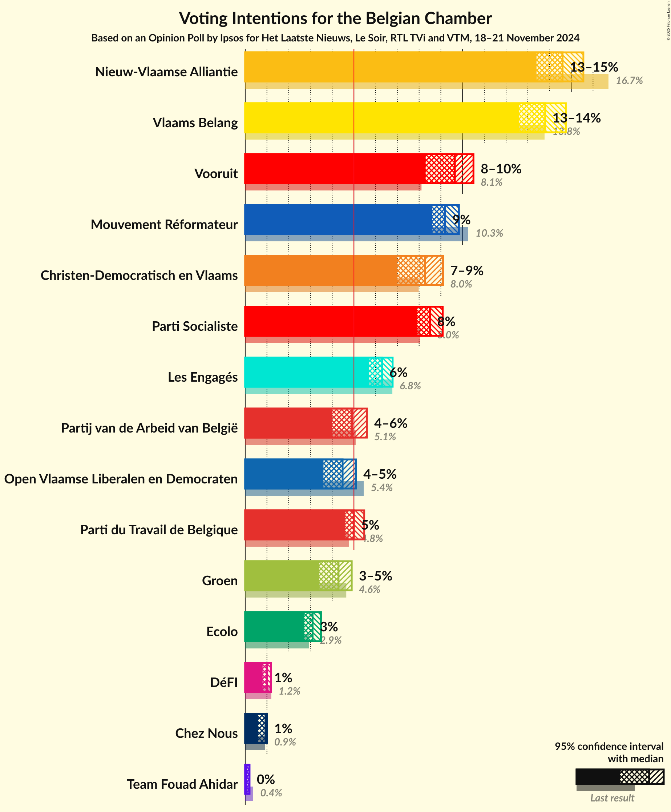

### Confidence Intervals

| Party | Last Result | Poll Result | 80% Confidence Interval | 90% Confidence Interval | 95% Confidence Interval | 99% Confidence Interval |
|:-----:|:-----------:|:-----------:|:-----------------------:|:-----------------------:|:-----------------------:|:-----------------------:|
| Nieuw-Vlaamse Alliantie | 16.7% | 15.6% | 13.7–14.6% |13.5–14.6% |13.4–14.6% |13.0–14.6% |
| Vlaams Belang | 13.8% | 14.7% | 13.0–13.8% |12.8–13.8% |12.6–13.8% |12.2–13.8% |
| Mouvement Réformateur | 10.3% | 9.8% | 8.8–9.2% |8.7–9.2% |8.6–9.2% |8.4–9.2% |
| Vooruit | 8.1% | 9.6% | 8.8–10.3% |8.5–10.5% |8.3–10.5% |7.9–10.6% |
| Parti Socialiste | 8.0% | 9.1% | 8.1–8.5% |8.0–8.5% |7.9–8.5% |7.7–8.5% |
| Christen-Democratisch en Vlaams | 8.0% | 8.3% | 7.4–8.9% |7.2–9.0% |7.0–9.1% |6.7–9.2% |
| Les Engagés | 6.8% | 6.8% | 5.9–6.2% |5.8–6.2% |5.7–6.3% |5.5–6.3% |
| Parti du Travail de Belgique | 4.8% | 5.5% | 4.7–5.0% |4.6–5.0% |4.6–5.0% |4.4–5.0% |
| Partij van de Arbeid van België | 5.1% | 4.9% | 4.3–5.4% |4.1–5.5% |4.0–5.6% |3.7–5.6% |
| Open Vlaamse Liberalen en Democraten | 5.4% | 4.5% | 3.9–5.0% |3.7–5.1% |3.6–5.1% |3.3–5.2% |
| Groen | 4.6% | 4.3% | 3.7–4.8% |3.5–4.9% |3.4–4.9% |3.1–5.0% |
| Ecolo | 2.9% | 3.5% | 2.8–3.1% |2.8–3.1% |2.7–3.1% |2.6–3.1% |
| DéFI | 1.2% | 1.2% | 0.8–1.0% |0.8–1.0% |0.8–1.0% |0.7–1.0% |
| Chez Nous | 0.9% | 0.9% | 0.7–0.9% |0.6–0.9% |0.6–1.0% |0.5–1.0% |
| Team Fouad Ahidar | 0.4% | 0.2% | 0.1–0.2% |0.1–0.2% |0.1–0.2% |0.1–0.2% |

*Note:* The poll result column reflects the actual value used in the calculations. Published results may vary slightly, and in addition be rounded to fewer digits.

## Seats

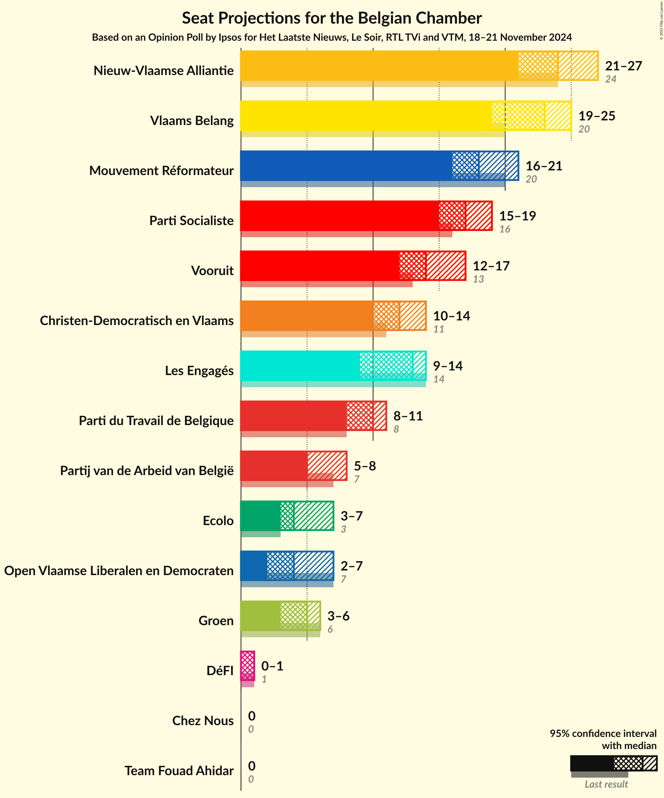

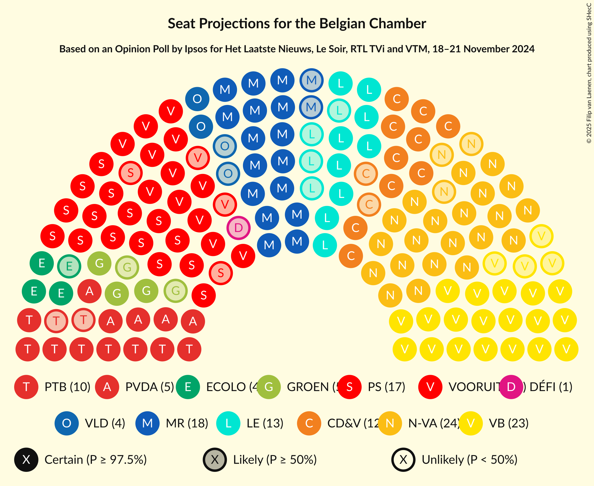

### Confidence Intervals

| Party | Last Result | Median | 80% Confidence Interval | 90% Confidence Interval | 95% Confidence Interval | 99% Confidence Interval |
|:-----:|:-----------:|:------:|:-----------------------:|:-----------------------:|:-----------------------:|:-----------------------:|
| <a href="#nieuw-vlaamse-alliantie">Nieuw-Vlaamse Alliantie</a> | 24 | 24 | 21–25 |21–26 |21–26 |20–28 |
| <a href="#vlaams-belang">Vlaams Belang</a> | 20 | 23 | 21–24 |20–25 |19–25 |18–26 |
| <a href="#mouvement-réformateur">Mouvement Réformateur</a> | 20 | 18 | 17–20 |16–21 |16–21 |16–22 |
| <a href="#vooruit">Vooruit</a> | 13 | 14 | 13–16 |13–16 |12–17 |11–17 |
| <a href="#parti-socialiste">Parti Socialiste</a> | 16 | 17 | 16–19 |15–19 |15–19 |14–20 |
| <a href="#christen-democratisch-en-vlaams">Christen-Democratisch en Vlaams</a> | 11 | 12 | 10–13 |10–13 |10–14 |10–15 |
| <a href="#les-engagés">Les Engagés</a> | 14 | 13 | 10–14 |9–14 |9–14 |9–15 |
| <a href="#parti-du-travail-de-belgique">Parti du Travail de Belgique</a> | 8 | 10 | 9–11 |8–11 |8–11 |8–12 |
| <a href="#partij-van-de-arbeid-van-belgië">Partij van de Arbeid van België</a> | 7 | 5 | 5–7 |5–8 |5–8 |5–8 |
| <a href="#open-vlaamse-liberalen-en-democraten">Open Vlaamse Liberalen en Democraten</a> | 7 | 4 | 3–7 |3–7 |2–7 |2–7 |
| <a href="#groen">Groen</a> | 6 | 4 | 3–6 |3–6 |3–6 |3–6 |
| <a href="#ecolo">Ecolo</a> | 3 | 4 | 3–6 |3–6 |3–7 |3–8 |
| <a href="#défi">DéFI</a> | 1 | 1 | 0–1 |0–1 |0–1 |0–1 |
| <a href="#chez-nous">Chez Nous</a> | 0 | 0 | 0 |0 |0 |0 |
| <a href="#team-fouad-ahidar">Team Fouad Ahidar</a> | 0 | 0 | 0 |0 |0 |0 |

### Nieuw-Vlaamse Alliantie

*For a full overview of the results for this party, see the [Nieuw-Vlaamse Alliantie](party-nieuw-vlaamsealliantie.html) page.*

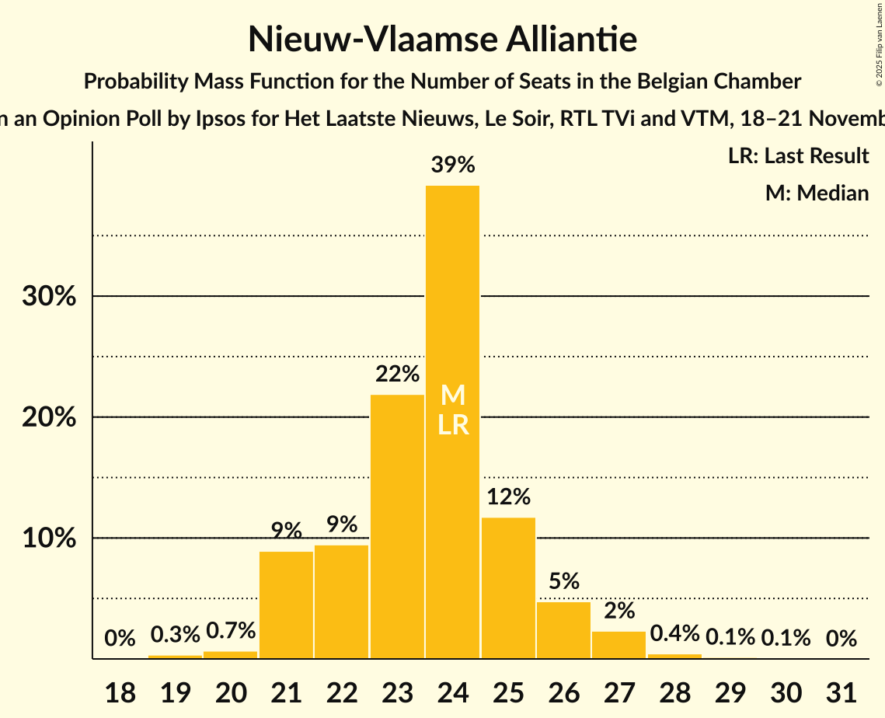

| Number of Seats | Probability | Accumulated | Special Marks |
|:---------------:|:-----------:|:-----------:|:-------------:|
| 19 | 0.4% | 100% |  |
| 20 | 0.8% | 99.6% |  |
| 21 | 9% | 98.7% |  |
| 22 | 8% | 90% |  |
| 23 | 21% | 81% |  |
| 24 | 41% | 60% | Last Result, Median |
| 25 | 11% | 19% |  |
| 26 | 5% | 8% |  |
| 27 | 2% | 2% |  |
| 28 | 0.4% | 0.6% |  |
| 29 | 0.2% | 0.2% |  |
| 30 | 0.1% | 0.1% |  |
| 31 | 0% | 0% |  |

### Vlaams Belang

*For a full overview of the results for this party, see the [Vlaams Belang](party-vlaamsbelang.html) page.*

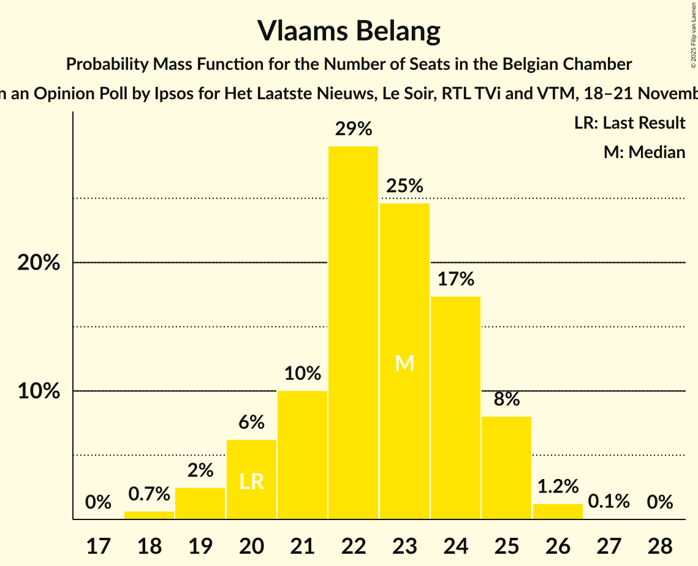

| Number of Seats | Probability | Accumulated | Special Marks |
|:---------------:|:-----------:|:-----------:|:-------------:|
| 18 | 0.7% | 100% |  |
| 19 | 2% | 99.3% |  |
| 20 | 6% | 97% | Last Result |
| 21 | 10% | 91% |  |
| 22 | 29% | 81% |  |
| 23 | 25% | 51% | Median |
| 24 | 17% | 27% |  |
| 25 | 8% | 9% |  |
| 26 | 1.2% | 1.4% |  |
| 27 | 0.1% | 0.1% |  |
| 28 | 0% | 0% |  |

### Mouvement Réformateur

*For a full overview of the results for this party, see the [Mouvement Réformateur](party-mouvementréformateur.html) page.*

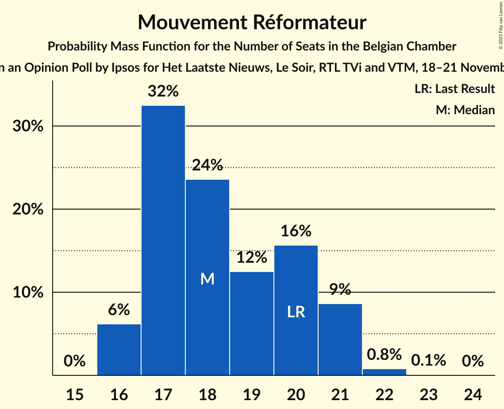

| Number of Seats | Probability | Accumulated | Special Marks |
|:---------------:|:-----------:|:-----------:|:-------------:|
| 16 | 7% | 100% |  |
| 17 | 33% | 93% |  |
| 18 | 22% | 60% | Median |
| 19 | 13% | 38% |  |
| 20 | 15% | 25% | Last Result |
| 21 | 8% | 9% |  |
| 22 | 0.8% | 0.9% |  |
| 23 | 0.1% | 0.1% |  |
| 24 | 0% | 0% |  |

### Vooruit

*For a full overview of the results for this party, see the [Vooruit](party-vooruit.html) page.*

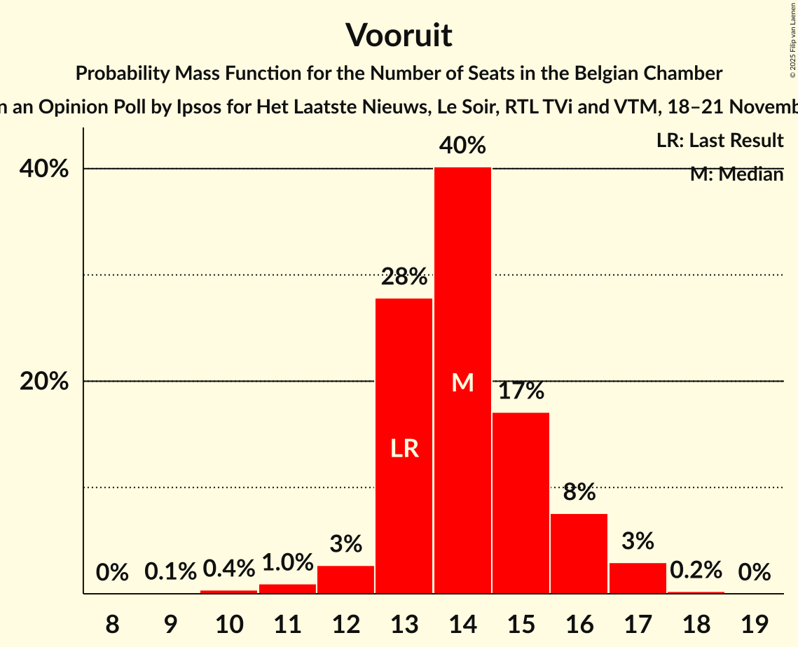

| Number of Seats | Probability | Accumulated | Special Marks |
|:---------------:|:-----------:|:-----------:|:-------------:|
| 9 | 0.1% | 100% |  |
| 10 | 0.4% | 99.9% |  |
| 11 | 1.0% | 99.5% |  |
| 12 | 3% | 98.6% |  |
| 13 | 28% | 96% | Last Result |
| 14 | 40% | 68% | Median |
| 15 | 17% | 28% |  |
| 16 | 8% | 11% |  |
| 17 | 3% | 3% |  |
| 18 | 0.2% | 0.3% |  |
| 19 | 0% | 0% |  |

### Parti Socialiste

*For a full overview of the results for this party, see the [Parti Socialiste](party-partisocialiste.html) page.*

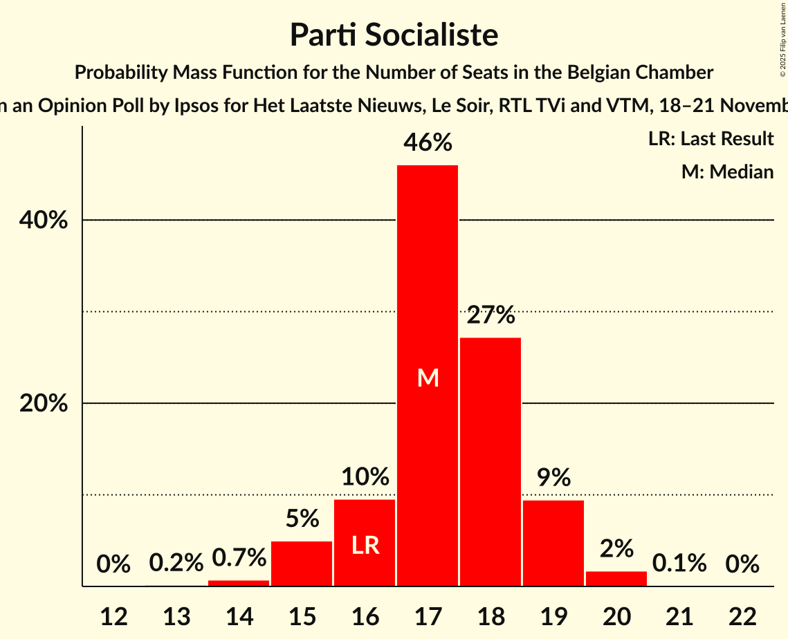

| Number of Seats | Probability | Accumulated | Special Marks |
|:---------------:|:-----------:|:-----------:|:-------------:|
| 13 | 0.2% | 100% |  |
| 14 | 0.6% | 99.8% |  |
| 15 | 5% | 99.3% |  |
| 16 | 9% | 95% | Last Result |
| 17 | 45% | 86% | Median |
| 18 | 29% | 41% |  |
| 19 | 10% | 12% |  |
| 20 | 2% | 2% |  |
| 21 | 0.1% | 0.1% |  |
| 22 | 0% | 0% |  |

### Christen-Democratisch en Vlaams

*For a full overview of the results for this party, see the [Christen-Democratisch en Vlaams](party-christen-democratischenvlaams.html) page.*

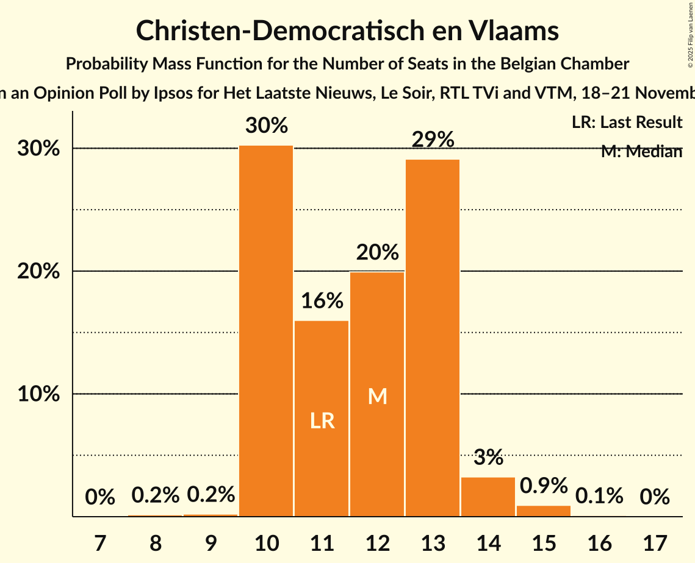

| Number of Seats | Probability | Accumulated | Special Marks |
|:---------------:|:-----------:|:-----------:|:-------------:|
| 8 | 0.2% | 100% |  |
| 9 | 0.2% | 99.8% |  |
| 10 | 30% | 99.6% |  |
| 11 | 18% | 70% | Last Result |
| 12 | 19% | 52% | Median |
| 13 | 29% | 33% |  |
| 14 | 3% | 4% |  |
| 15 | 0.9% | 1.1% |  |
| 16 | 0.1% | 0.1% |  |
| 17 | 0% | 0% |  |

### Les Engagés

*For a full overview of the results for this party, see the [Les Engagés](party-lesengagés.html) page.*

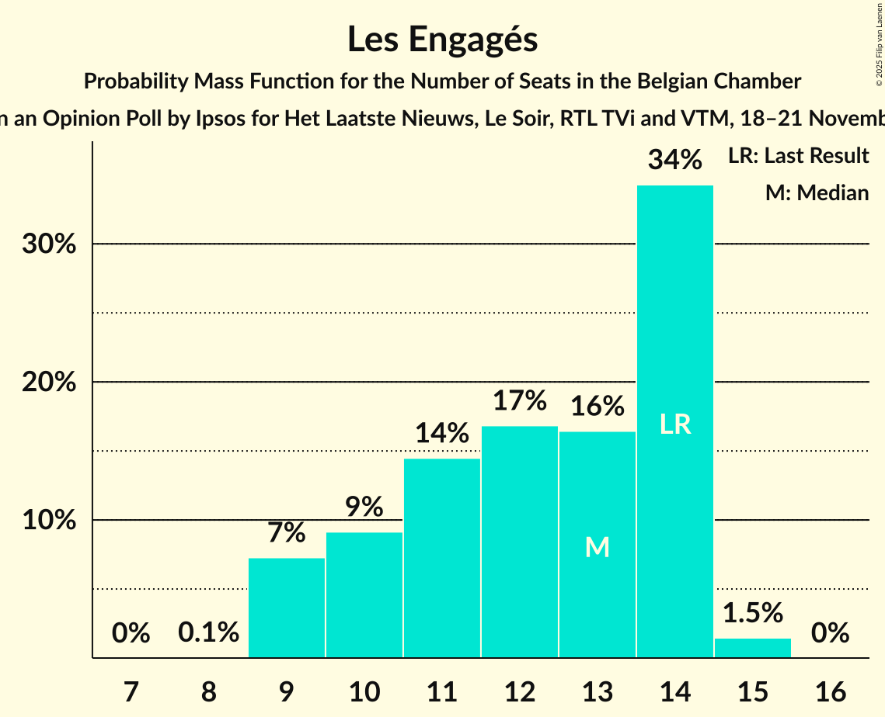

| Number of Seats | Probability | Accumulated | Special Marks |
|:---------------:|:-----------:|:-----------:|:-------------:|
| 9 | 7% | 100% |  |
| 10 | 10% | 93% |  |
| 11 | 15% | 83% |  |
| 12 | 16% | 68% |  |
| 13 | 15% | 52% | Median |
| 14 | 35% | 37% | Last Result |
| 15 | 2% | 2% |  |
| 16 | 0% | 0% |  |

### Parti du Travail de Belgique

*For a full overview of the results for this party, see the [Parti du Travail de Belgique](party-partidutravaildebelgique.html) page.*

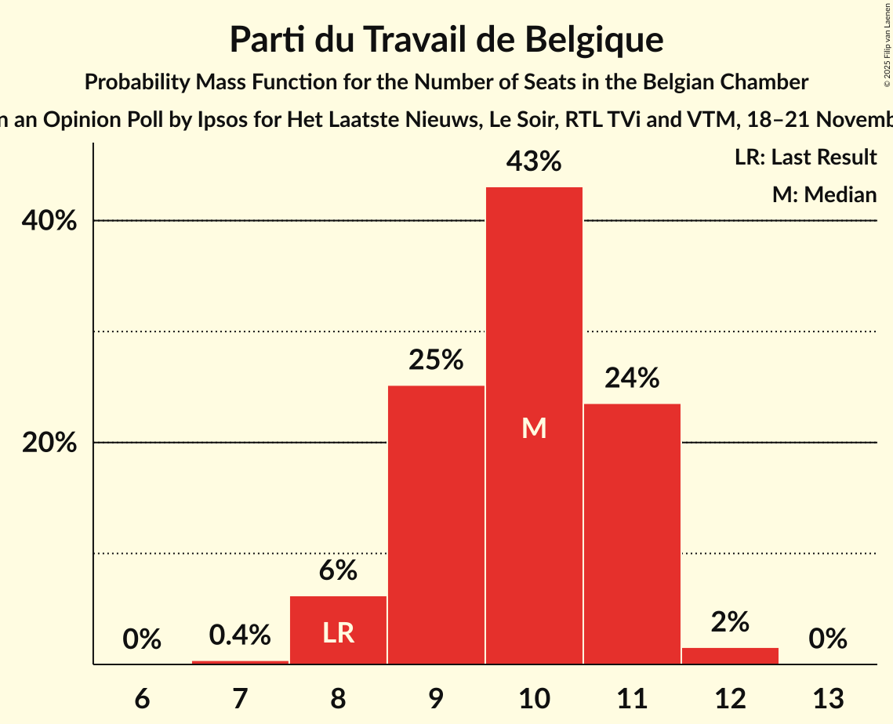

| Number of Seats | Probability | Accumulated | Special Marks |
|:---------------:|:-----------:|:-----------:|:-------------:|
| 7 | 0.4% | 100% |  |
| 8 | 6% | 99.6% | Last Result |
| 9 | 25% | 93% |  |
| 10 | 43% | 68% | Median |
| 11 | 24% | 25% |  |
| 12 | 2% | 2% |  |
| 13 | 0% | 0% |  |

### Partij van de Arbeid van België

*For a full overview of the results for this party, see the [Partij van de Arbeid van België](party-partijvandearbeidvanbelgië.html) page.*

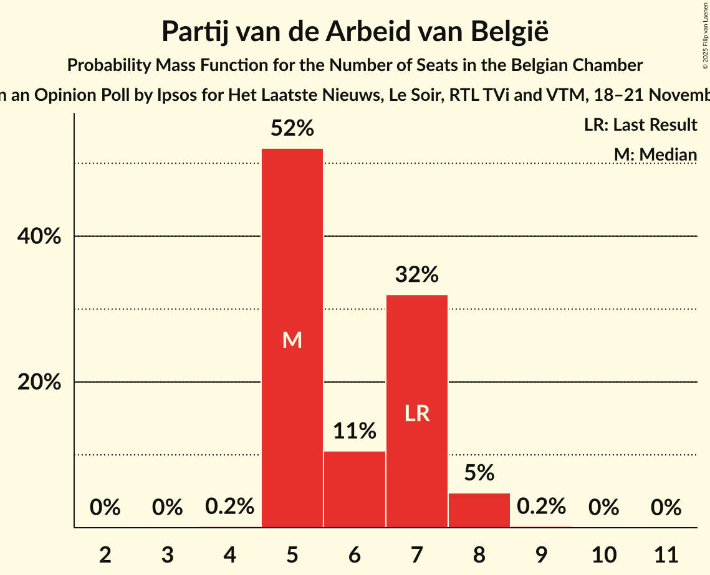

| Number of Seats | Probability | Accumulated | Special Marks |
|:---------------:|:-----------:|:-----------:|:-------------:|
| 2 | 0% | 100% |  |
| 3 | 0% | 99.9% |  |
| 4 | 0.2% | 99.9% |  |
| 5 | 53% | 99.7% | Median |
| 6 | 10% | 47% |  |
| 7 | 32% | 37% | Last Result |
| 8 | 5% | 5% |  |
| 9 | 0.2% | 0.2% |  |
| 10 | 0% | 0.1% |  |
| 11 | 0% | 0% |  |

### Open Vlaamse Liberalen en Democraten

*For a full overview of the results for this party, see the [Open Vlaamse Liberalen en Democraten](party-openvlaamseliberalenendemocraten.html) page.*

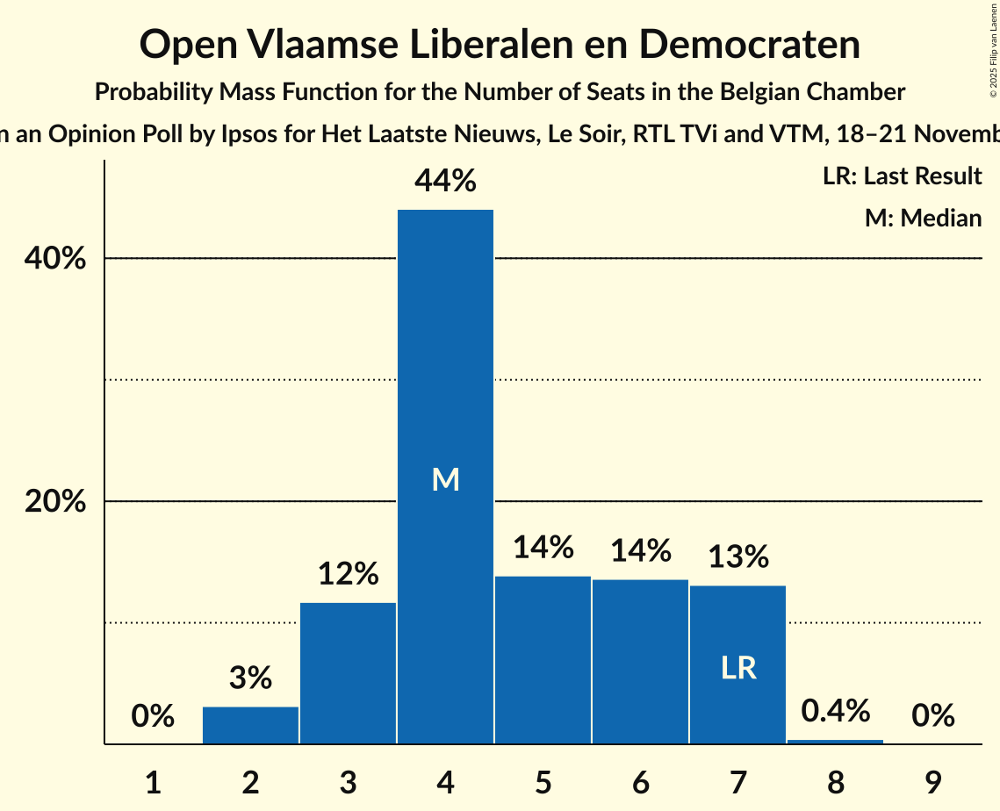

| Number of Seats | Probability | Accumulated | Special Marks |
|:---------------:|:-----------:|:-----------:|:-------------:|
| 2 | 3% | 100% |  |
| 3 | 12% | 97% |  |
| 4 | 44% | 85% | Median |
| 5 | 14% | 41% |  |
| 6 | 14% | 27% |  |
| 7 | 13% | 14% | Last Result |
| 8 | 0.4% | 0.5% |  |
| 9 | 0% | 0% |  |

### Groen

*For a full overview of the results for this party, see the [Groen](party-groen.html) page.*

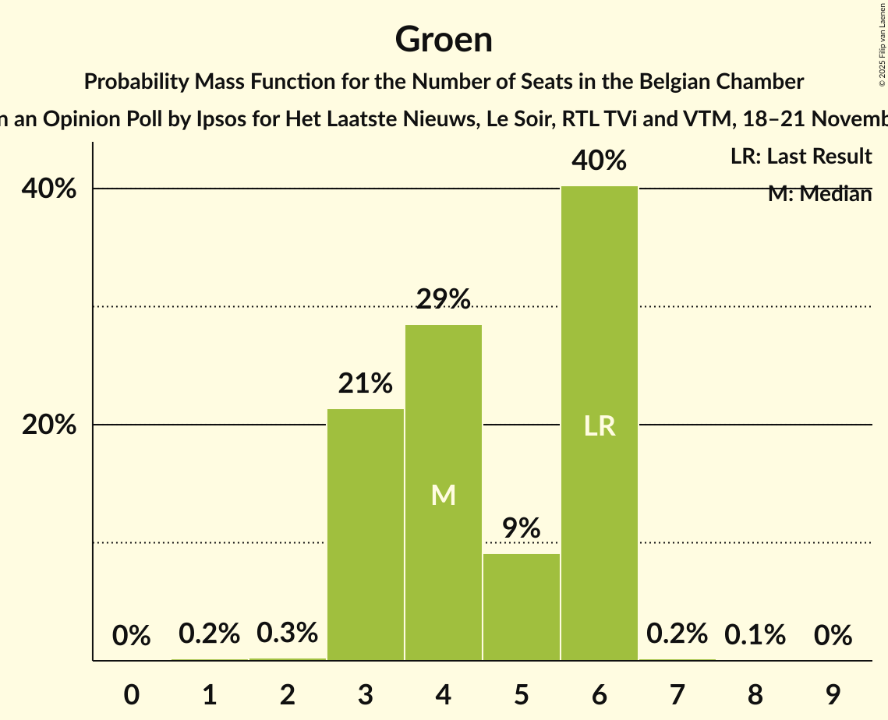

| Number of Seats | Probability | Accumulated | Special Marks |
|:---------------:|:-----------:|:-----------:|:-------------:|
| 1 | 0.2% | 100% |  |
| 2 | 0.3% | 99.8% |  |
| 3 | 21% | 99.6% |  |
| 4 | 29% | 78% | Median |
| 5 | 9% | 50% |  |
| 6 | 40% | 41% | Last Result |
| 7 | 0.2% | 0.3% |  |
| 8 | 0.1% | 0.1% |  |
| 9 | 0% | 0% |  |

### Ecolo

*For a full overview of the results for this party, see the [Ecolo](party-ecolo.html) page.*

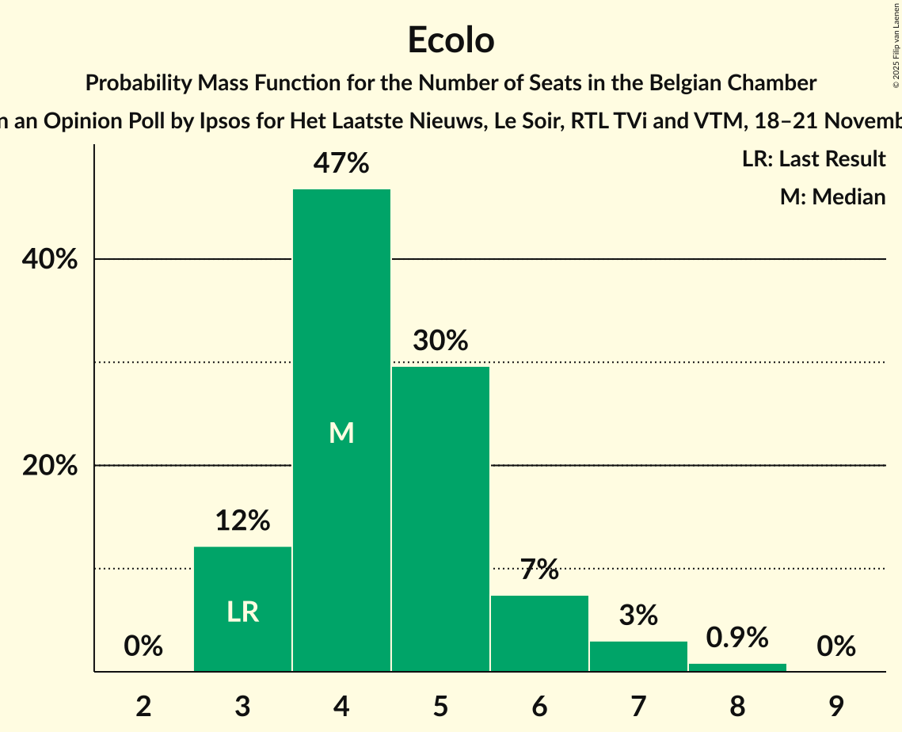

| Number of Seats | Probability | Accumulated | Special Marks |
|:---------------:|:-----------:|:-----------:|:-------------:|
| 3 | 12% | 100% | Last Result |
| 4 | 47% | 88% | Median |
| 5 | 30% | 41% |  |
| 6 | 7% | 11% |  |
| 7 | 3% | 4% |  |
| 8 | 0.9% | 0.9% |  |
| 9 | 0% | 0% |  |

### DéFI

*For a full overview of the results for this party, see the [DéFI](party-défi.html) page.*

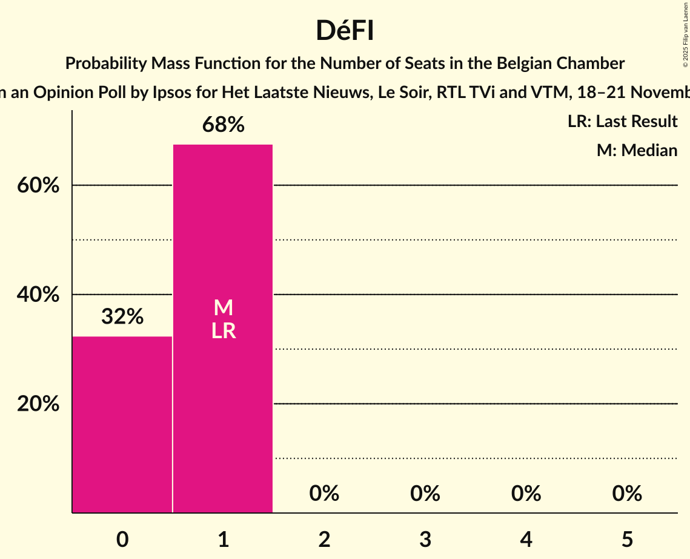

| Number of Seats | Probability | Accumulated | Special Marks |
|:---------------:|:-----------:|:-----------:|:-------------:|
| 0 | 32% | 100% |  |
| 1 | 68% | 68% | Last Result, Median |
| 2 | 0% | 0% |  |

### Chez Nous

*For a full overview of the results for this party, see the [Chez Nous](party-cheznous.html) page.*

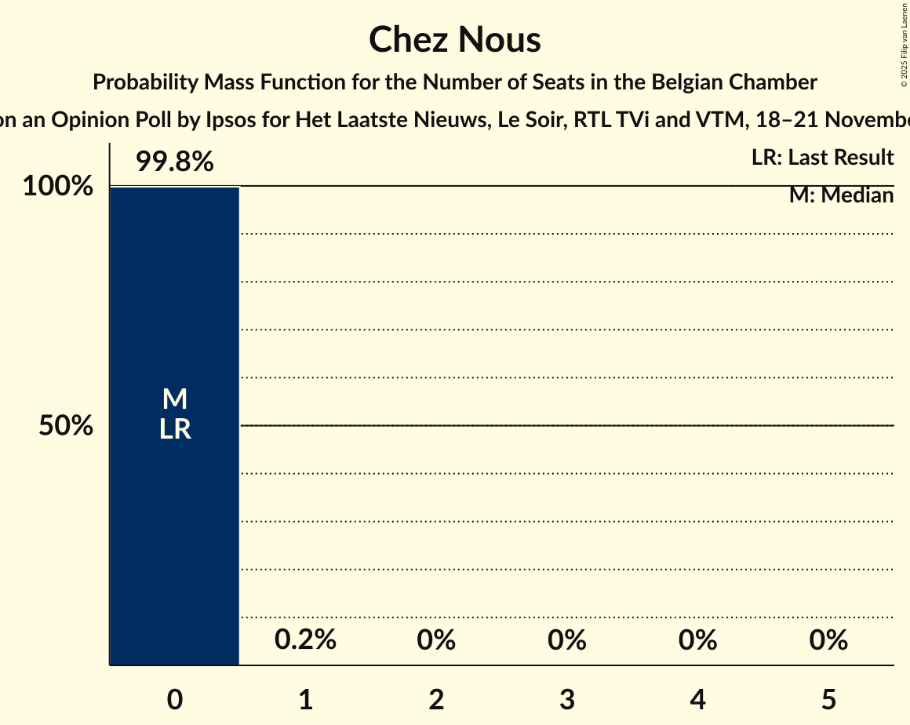

| Number of Seats | Probability | Accumulated | Special Marks |
|:---------------:|:-----------:|:-----------:|:-------------:|
| 0 | 99.8% | 100% | Last Result, Median |
| 1 | 0.1% | 0.2% |  |
| 2 | 0% | 0% |  |

### Team Fouad Ahidar

*For a full overview of the results for this party, see the [Team Fouad Ahidar](party-teamfouadahidar.html) page.*

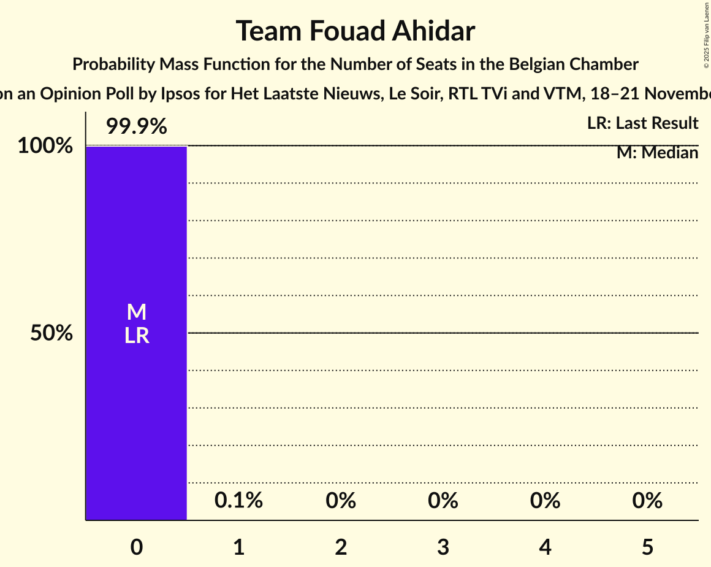

| Number of Seats | Probability | Accumulated | Special Marks |
|:---------------:|:-----------:|:-----------:|:-------------:|
| 0 | 99.8% | 100% | Last Result, Median |
| 1 | 0.2% | 0.2% |  |
| 2 | 0% | 0% |  |

## Coalitions

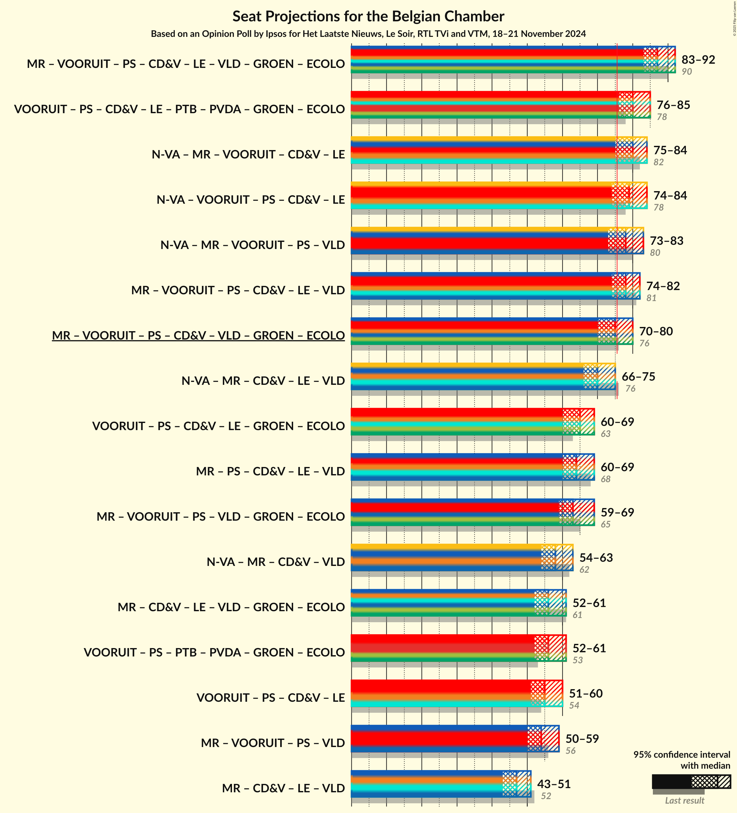

### Confidence Intervals

| Coalition | Last Result | Median | Majority? | 80% Confidence Interval | 90% Confidence Interval | 95% Confidence Interval | 99% Confidence Interval |
|:---------:|:-----------:|:------:|:---------:|:-----------------------:|:-----------------------:|:-----------------------:|:-----------------------:|
| Mouvement Réformateur – Vooruit – Parti Socialiste – Christen-Democratisch en Vlaams – Les Engagés – Open Vlaamse Liberalen en Democraten – Groen – Ecolo | 90 | 87 | 100% | 85–90 | 84–91 | 83–92 | 82–93 |
| Vooruit – Parti Socialiste – Christen-Democratisch en Vlaams – Les Engagés – Parti du Travail de Belgique – Partij van de Arbeid van België – Groen – Ecolo | 78 | 80 | 98% | 77–83 | 76–84 | 76–85 | 74–86 |
| Nieuw-Vlaamse Alliantie – Mouvement Réformateur – Vooruit – Christen-Democratisch en Vlaams – Les Engagés | 82 | 80 | 97% | 77–83 | 76–83 | 75–84 | 74–86 |
| Nieuw-Vlaamse Alliantie – Vooruit – Parti Socialiste – Christen-Democratisch en Vlaams – Les Engagés | 78 | 79 | 92% | 76–82 | 75–83 | 74–84 | 73–85 |
| Nieuw-Vlaamse Alliantie – Mouvement Réformateur – Vooruit – Parti Socialiste – Open Vlaamse Liberalen en Democraten | 80 | 78 | 84% | 75–81 | 74–82 | 73–83 | 72–84 |
| Mouvement Réformateur – Vooruit – Parti Socialiste – Christen-Democratisch en Vlaams – Les Engagés – Open Vlaamse Liberalen en Democraten | 81 | 78 | 90% | 75–81 | 75–82 | 74–82 | 73–84 |
| Mouvement Réformateur – Vooruit – Parti Socialiste – Christen-Democratisch en Vlaams – Open Vlaamse Liberalen en Democraten – Groen – Ecolo | 76 | 75 | 41% | 72–78 | 71–79 | 70–80 | 69–82 |
| Nieuw-Vlaamse Alliantie – Mouvement Réformateur – Christen-Democratisch en Vlaams – Les Engagés – Open Vlaamse Liberalen en Democraten | 76 | 70 | 2% | 67–74 | 67–75 | 66–75 | 64–77 |
| Vooruit – Parti Socialiste – Christen-Democratisch en Vlaams – Les Engagés – Groen – Ecolo | 63 | 65 | 0% | 61–68 | 60–68 | 60–69 | 58–70 |
| Mouvement Réformateur – Parti Socialiste – Christen-Democratisch en Vlaams – Les Engagés – Open Vlaamse Liberalen en Democraten | 68 | 64 | 0% | 61–67 | 61–68 | 60–69 | 59–70 |
| Mouvement Réformateur – Vooruit – Parti Socialiste – Open Vlaamse Liberalen en Democraten – Groen – Ecolo | 65 | 63 | 0% | 60–67 | 59–68 | 59–69 | 58–70 |
| Nieuw-Vlaamse Alliantie – Mouvement Réformateur – Christen-Democratisch en Vlaams – Open Vlaamse Liberalen en Democraten | 62 | 58 | 0% | 55–61 | 54–62 | 54–63 | 53–65 |
| Mouvement Réformateur – Christen-Democratisch en Vlaams – Les Engagés – Open Vlaamse Liberalen en Democraten – Groen – Ecolo | 61 | 56 | 0% | 53–59 | 52–60 | 52–61 | 50–62 |
| Vooruit – Parti Socialiste – Parti du Travail de Belgique – Partij van de Arbeid van België – Groen – Ecolo | 53 | 56 | 0% | 53–59 | 52–60 | 52–61 | 51–62 |
| Vooruit – Parti Socialiste – Christen-Democratisch en Vlaams – Les Engagés | 54 | 55 | 0% | 52–58 | 52–59 | 51–60 | 50–61 |
| Mouvement Réformateur – Vooruit – Parti Socialiste – Open Vlaamse Liberalen en Democraten | 56 | 54 | 0% | 52–57 | 51–58 | 50–59 | 49–61 |
| Mouvement Réformateur – Christen-Democratisch en Vlaams – Les Engagés – Open Vlaamse Liberalen en Democraten | 52 | 47 | 0% | 44–50 | 43–51 | 43–51 | 41–52 |

### Mouvement Réformateur – Vooruit – Parti Socialiste – Christen-Democratisch en Vlaams – Les Engagés – Open Vlaamse Liberalen en Democraten – Groen – Ecolo

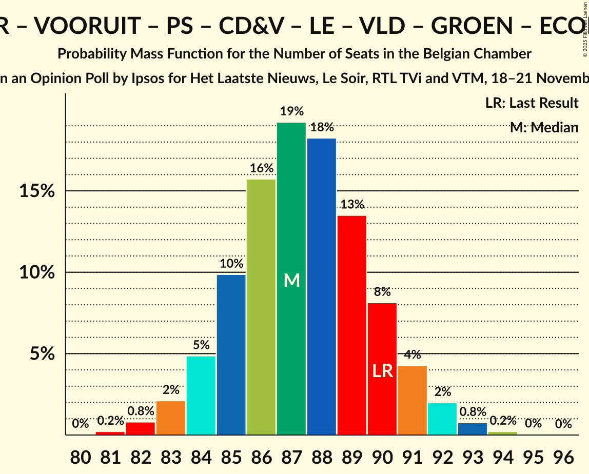

| Number of Seats | Probability | Accumulated | Special Marks |
|:---------------:|:-----------:|:-----------:|:-------------:|
| 81 | 0.2% | 100% |  |
| 82 | 0.8% | 99.7% |  |
| 83 | 2% | 98.9% |  |
| 84 | 5% | 97% |  |
| 85 | 10% | 92% |  |
| 86 | 16% | 82% | Median |
| 87 | 19% | 66% |  |
| 88 | 18% | 47% |  |
| 89 | 13% | 29% |  |
| 90 | 8% | 15% | Last Result |
| 91 | 4% | 7% |  |
| 92 | 2% | 3% |  |
| 93 | 0.8% | 1.0% |  |
| 94 | 0.2% | 0.3% |  |
| 95 | 0% | 0.1% |  |
| 96 | 0% | 0% |  |

### Vooruit – Parti Socialiste – Christen-Democratisch en Vlaams – Les Engagés – Parti du Travail de Belgique – Partij van de Arbeid van België – Groen – Ecolo

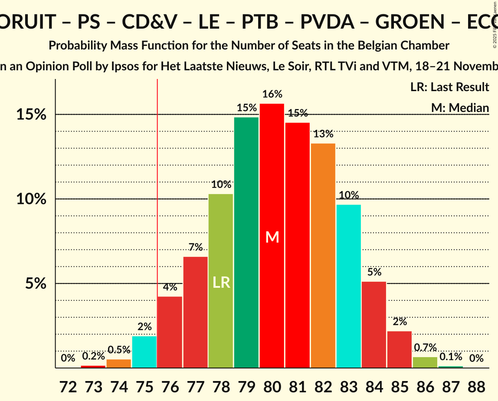

| Number of Seats | Probability | Accumulated | Special Marks |
|:---------------:|:-----------:|:-----------:|:-------------:|
| 73 | 0.1% | 100% |  |
| 74 | 0.4% | 99.8% |  |
| 75 | 2% | 99.4% |  |
| 76 | 4% | 98% | Majority |
| 77 | 7% | 94% |  |
| 78 | 10% | 87% | Last Result |
| 79 | 15% | 77% | Median |
| 80 | 16% | 62% |  |
| 81 | 14% | 46% |  |
| 82 | 13% | 31% |  |
| 83 | 10% | 18% |  |
| 84 | 5% | 9% |  |
| 85 | 2% | 3% |  |
| 86 | 0.9% | 1.1% |  |
| 87 | 0.2% | 0.2% |  |
| 88 | 0% | 0% |  |

### Nieuw-Vlaamse Alliantie – Mouvement Réformateur – Vooruit – Christen-Democratisch en Vlaams – Les Engagés

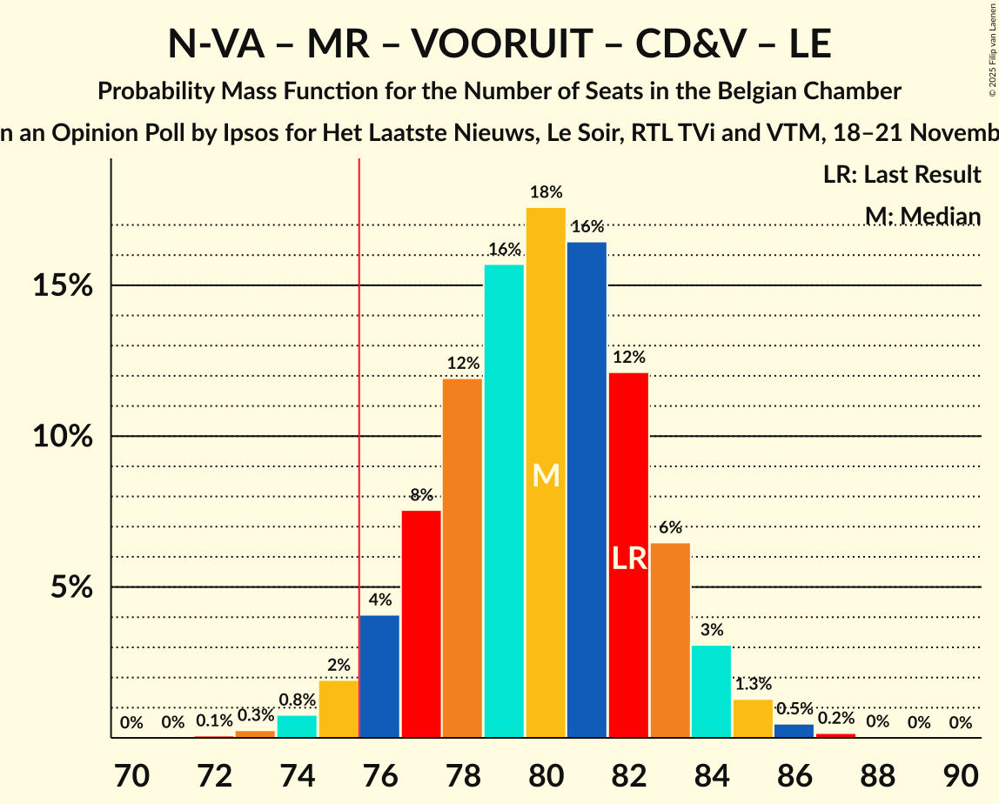

| Number of Seats | Probability | Accumulated | Special Marks |
|:---------------:|:-----------:|:-----------:|:-------------:|
| 72 | 0.1% | 100% |  |
| 73 | 0.3% | 99.9% |  |
| 74 | 0.8% | 99.6% |  |
| 75 | 2% | 98.9% |  |
| 76 | 4% | 97% | Majority |
| 77 | 8% | 93% |  |
| 78 | 12% | 85% |  |
| 79 | 16% | 73% |  |
| 80 | 18% | 57% |  |
| 81 | 16% | 40% | Median |
| 82 | 12% | 23% | Last Result |
| 83 | 6% | 11% |  |
| 84 | 3% | 5% |  |
| 85 | 1.2% | 2% |  |
| 86 | 0.5% | 0.7% |  |
| 87 | 0.1% | 0.2% |  |
| 88 | 0% | 0.1% |  |
| 89 | 0% | 0% |  |

### Nieuw-Vlaamse Alliantie – Vooruit – Parti Socialiste – Christen-Democratisch en Vlaams – Les Engagés

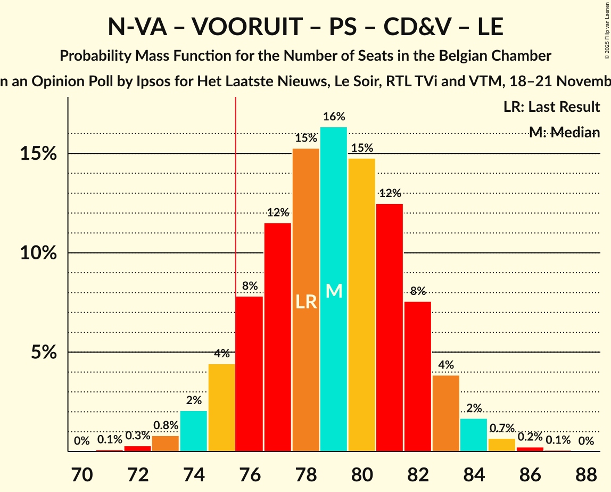

| Number of Seats | Probability | Accumulated | Special Marks |
|:---------------:|:-----------:|:-----------:|:-------------:|
| 71 | 0.1% | 100% |  |
| 72 | 0.3% | 99.9% |  |
| 73 | 0.8% | 99.6% |  |
| 74 | 2% | 98.8% |  |
| 75 | 4% | 97% |  |
| 76 | 8% | 92% | Majority |
| 77 | 12% | 84% |  |
| 78 | 15% | 73% | Last Result |
| 79 | 16% | 58% |  |
| 80 | 15% | 41% | Median |
| 81 | 12% | 27% |  |
| 82 | 8% | 14% |  |
| 83 | 4% | 7% |  |
| 84 | 2% | 3% |  |
| 85 | 0.7% | 1.0% |  |
| 86 | 0.2% | 0.3% |  |
| 87 | 0.1% | 0.1% |  |
| 88 | 0% | 0% |  |

### Nieuw-Vlaamse Alliantie – Mouvement Réformateur – Vooruit – Parti Socialiste – Open Vlaamse Liberalen en Democraten

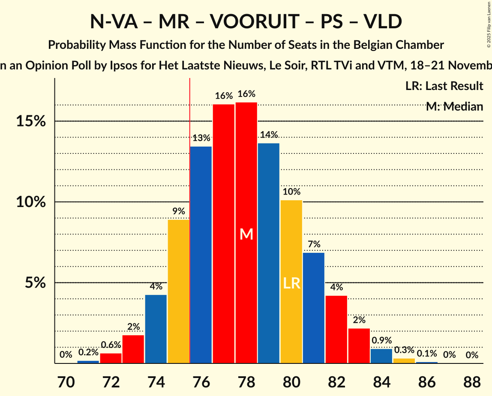

| Number of Seats | Probability | Accumulated | Special Marks |
|:---------------:|:-----------:|:-----------:|:-------------:|
| 70 | 0% | 100% |  |
| 71 | 0.2% | 99.9% |  |
| 72 | 0.6% | 99.8% |  |
| 73 | 2% | 99.1% |  |
| 74 | 4% | 97% |  |
| 75 | 9% | 93% |  |
| 76 | 13% | 84% | Majority |
| 77 | 16% | 71% | Median |
| 78 | 16% | 55% |  |
| 79 | 14% | 38% |  |
| 80 | 10% | 25% | Last Result |
| 81 | 7% | 15% |  |
| 82 | 4% | 8% |  |
| 83 | 2% | 4% |  |
| 84 | 0.9% | 1.4% |  |
| 85 | 0.3% | 0.5% |  |
| 86 | 0.1% | 0.2% |  |
| 87 | 0% | 0% |  |

### Mouvement Réformateur – Vooruit – Parti Socialiste – Christen-Democratisch en Vlaams – Les Engagés – Open Vlaamse Liberalen en Democraten

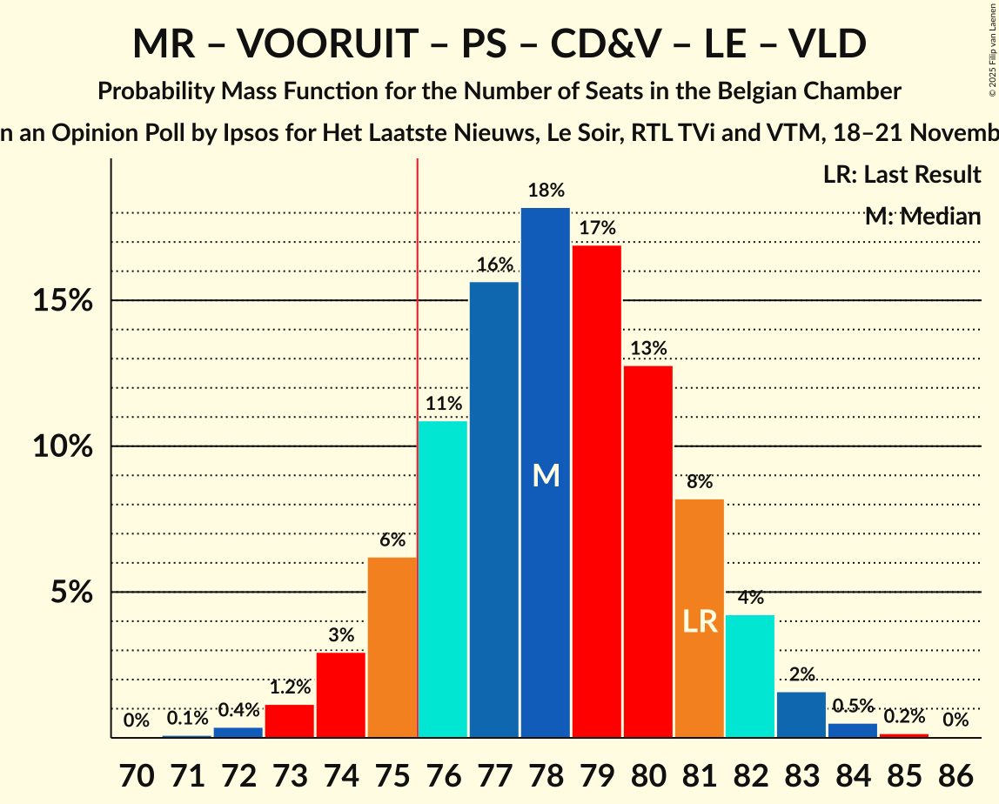

| Number of Seats | Probability | Accumulated | Special Marks |
|:---------------:|:-----------:|:-----------:|:-------------:|
| 71 | 0.1% | 100% |  |
| 72 | 0.3% | 99.9% |  |
| 73 | 1.1% | 99.5% |  |
| 74 | 3% | 98% |  |
| 75 | 6% | 96% |  |
| 76 | 11% | 90% | Majority |
| 77 | 15% | 79% |  |
| 78 | 18% | 64% | Median |
| 79 | 17% | 46% |  |
| 80 | 13% | 28% |  |
| 81 | 8% | 15% | Last Result |
| 82 | 4% | 7% |  |
| 83 | 2% | 2% |  |
| 84 | 0.6% | 0.8% |  |
| 85 | 0.2% | 0.2% |  |
| 86 | 0% | 0% |  |

### Mouvement Réformateur – Vooruit – Parti Socialiste – Christen-Democratisch en Vlaams – Open Vlaamse Liberalen en Democraten – Groen – Ecolo

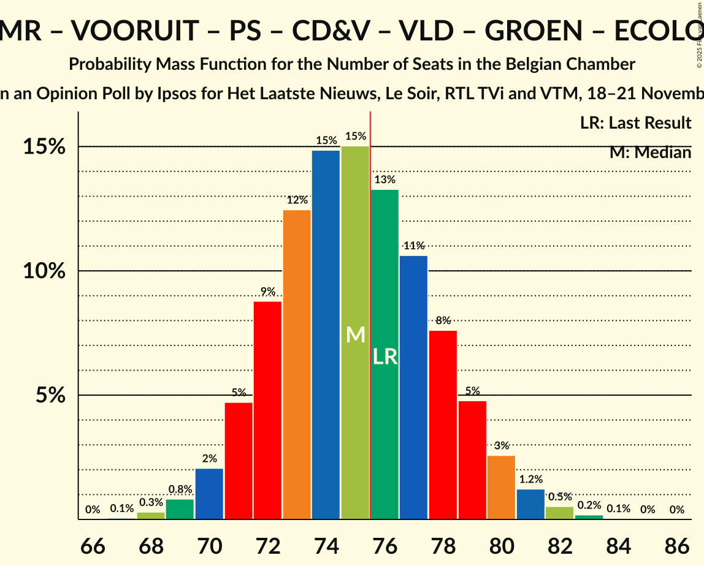

| Number of Seats | Probability | Accumulated | Special Marks |
|:---------------:|:-----------:|:-----------:|:-------------:|
| 67 | 0.1% | 100% |  |
| 68 | 0.3% | 99.9% |  |
| 69 | 0.8% | 99.7% |  |
| 70 | 2% | 98.9% |  |
| 71 | 5% | 97% |  |
| 72 | 8% | 92% |  |
| 73 | 12% | 84% | Median |
| 74 | 15% | 71% |  |
| 75 | 15% | 56% |  |
| 76 | 13% | 41% | Last Result, Majority |
| 77 | 11% | 28% |  |
| 78 | 8% | 17% |  |
| 79 | 5% | 10% |  |
| 80 | 3% | 5% |  |
| 81 | 1.3% | 2% |  |
| 82 | 0.5% | 0.8% |  |
| 83 | 0.2% | 0.3% |  |
| 84 | 0.1% | 0.1% |  |
| 85 | 0% | 0% |  |

### Nieuw-Vlaamse Alliantie – Mouvement Réformateur – Christen-Democratisch en Vlaams – Les Engagés – Open Vlaamse Liberalen en Democraten

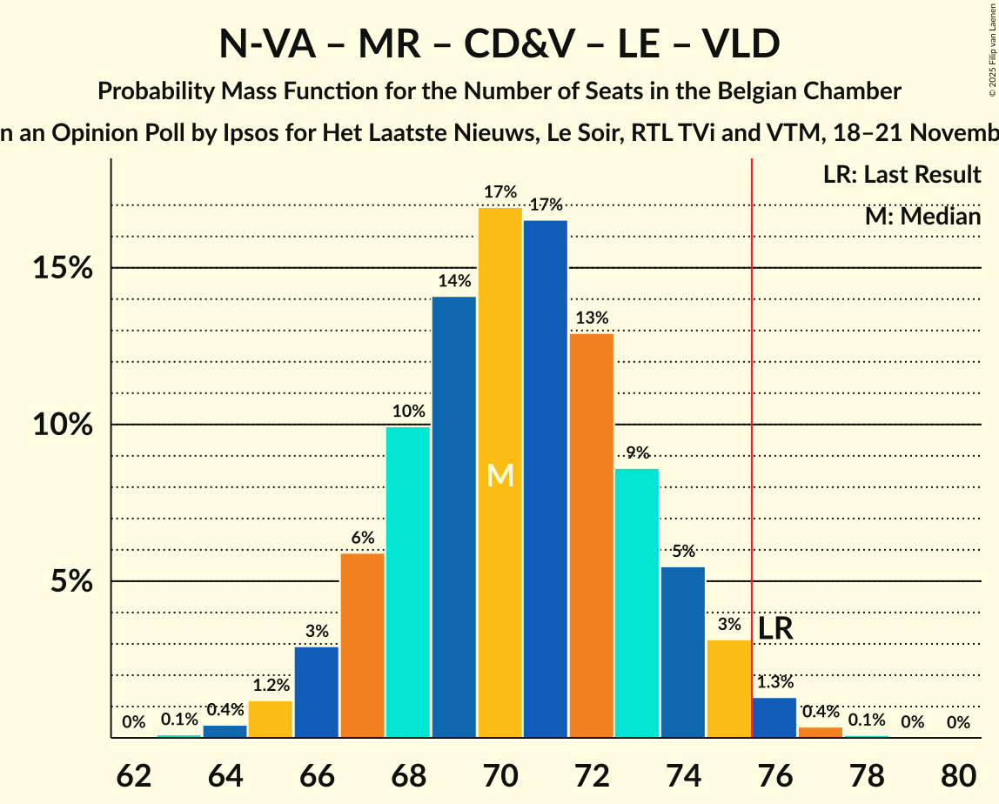

| Number of Seats | Probability | Accumulated | Special Marks |
|:---------------:|:-----------:|:-----------:|:-------------:|
| 63 | 0.1% | 100% |  |
| 64 | 0.4% | 99.9% |  |
| 65 | 1.2% | 99.5% |  |
| 66 | 3% | 98% |  |
| 67 | 6% | 95% |  |
| 68 | 10% | 90% |  |
| 69 | 14% | 80% |  |
| 70 | 17% | 66% |  |
| 71 | 16% | 49% | Median |
| 72 | 13% | 32% |  |
| 73 | 9% | 19% |  |
| 74 | 5% | 11% |  |
| 75 | 3% | 5% |  |
| 76 | 1.4% | 2% | Last Result, Majority |
| 77 | 0.4% | 0.5% |  |
| 78 | 0.1% | 0.1% |  |
| 79 | 0% | 0% |  |

### Vooruit – Parti Socialiste – Christen-Democratisch en Vlaams – Les Engagés – Groen – Ecolo

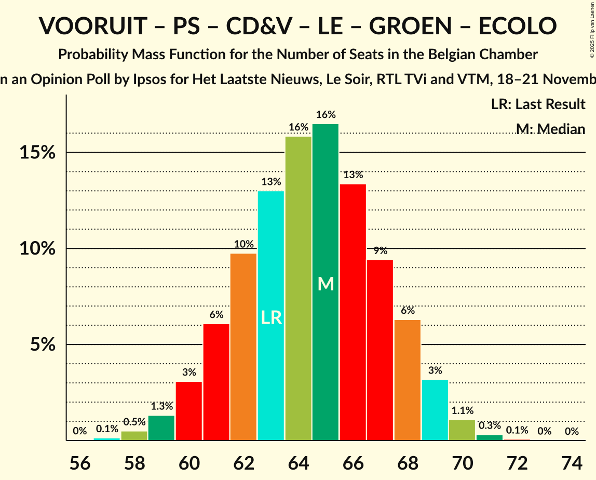

| Number of Seats | Probability | Accumulated | Special Marks |
|:---------------:|:-----------:|:-----------:|:-------------:|
| 57 | 0.1% | 100% |  |
| 58 | 0.5% | 99.8% |  |
| 59 | 1.3% | 99.3% |  |
| 60 | 3% | 98% |  |
| 61 | 6% | 95% |  |
| 62 | 10% | 89% |  |
| 63 | 13% | 79% | Last Result |
| 64 | 16% | 66% | Median |
| 65 | 16% | 50% |  |
| 66 | 13% | 34% |  |
| 67 | 9% | 20% |  |
| 68 | 6% | 11% |  |
| 69 | 3% | 5% |  |
| 70 | 1.1% | 1.5% |  |
| 71 | 0.3% | 0.4% |  |
| 72 | 0.1% | 0.1% |  |
| 73 | 0% | 0% |  |

### Mouvement Réformateur – Parti Socialiste – Christen-Democratisch en Vlaams – Les Engagés – Open Vlaamse Liberalen en Democraten

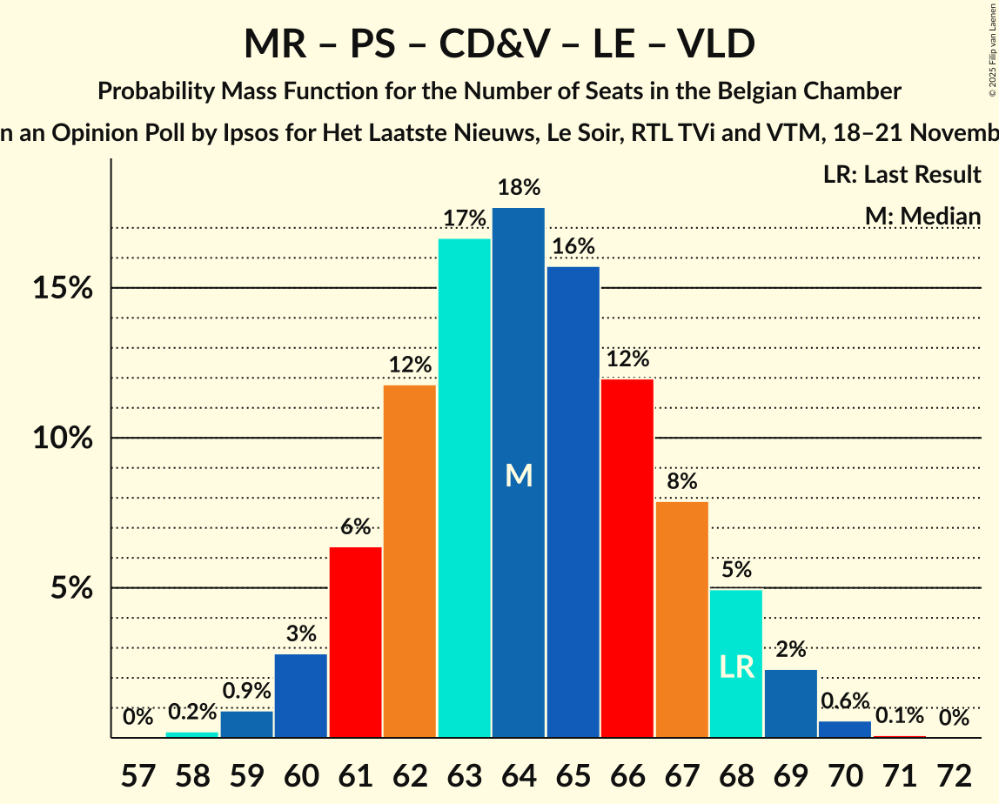

| Number of Seats | Probability | Accumulated | Special Marks |
|:---------------:|:-----------:|:-----------:|:-------------:|
| 58 | 0.2% | 100% |  |
| 59 | 0.9% | 99.7% |  |
| 60 | 3% | 98.8% |  |
| 61 | 6% | 96% |  |
| 62 | 12% | 90% |  |
| 63 | 17% | 78% |  |
| 64 | 18% | 61% | Median |
| 65 | 16% | 44% |  |
| 66 | 12% | 28% |  |
| 67 | 8% | 16% |  |
| 68 | 5% | 8% | Last Result |
| 69 | 2% | 3% |  |
| 70 | 0.6% | 0.7% |  |
| 71 | 0.1% | 0.1% |  |
| 72 | 0% | 0% |  |

### Mouvement Réformateur – Vooruit – Parti Socialiste – Open Vlaamse Liberalen en Democraten – Groen – Ecolo

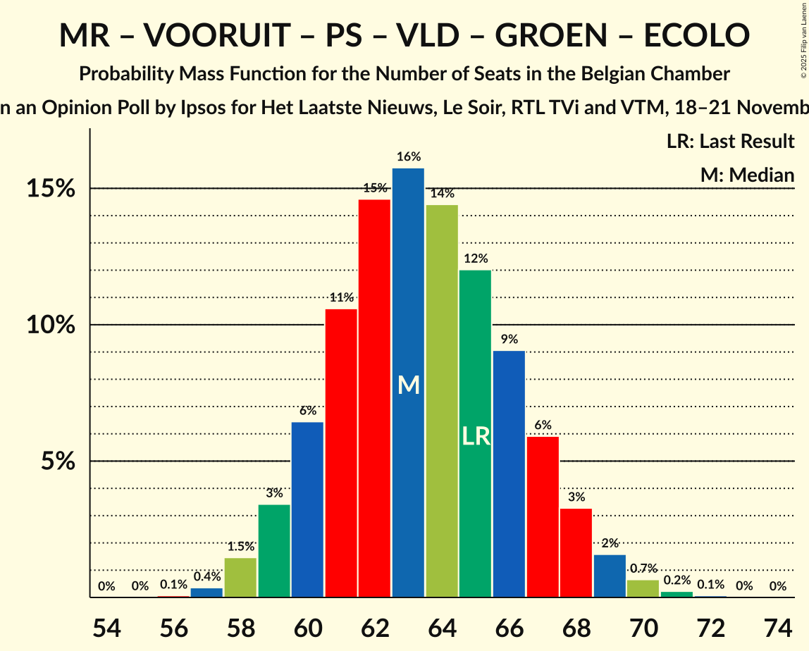

| Number of Seats | Probability | Accumulated | Special Marks |
|:---------------:|:-----------:|:-----------:|:-------------:|
| 56 | 0.1% | 100% |  |
| 57 | 0.4% | 99.9% |  |
| 58 | 1.5% | 99.6% |  |
| 59 | 3% | 98% |  |
| 60 | 6% | 95% |  |
| 61 | 11% | 88% | Median |
| 62 | 15% | 78% |  |
| 63 | 16% | 63% |  |
| 64 | 14% | 47% |  |
| 65 | 12% | 33% | Last Result |
| 66 | 9% | 21% |  |
| 67 | 6% | 12% |  |
| 68 | 3% | 6% |  |
| 69 | 2% | 3% |  |
| 70 | 0.7% | 1.0% |  |
| 71 | 0.2% | 0.3% |  |
| 72 | 0.1% | 0.1% |  |
| 73 | 0% | 0% |  |

### Nieuw-Vlaamse Alliantie – Mouvement Réformateur – Christen-Democratisch en Vlaams – Open Vlaamse Liberalen en Democraten

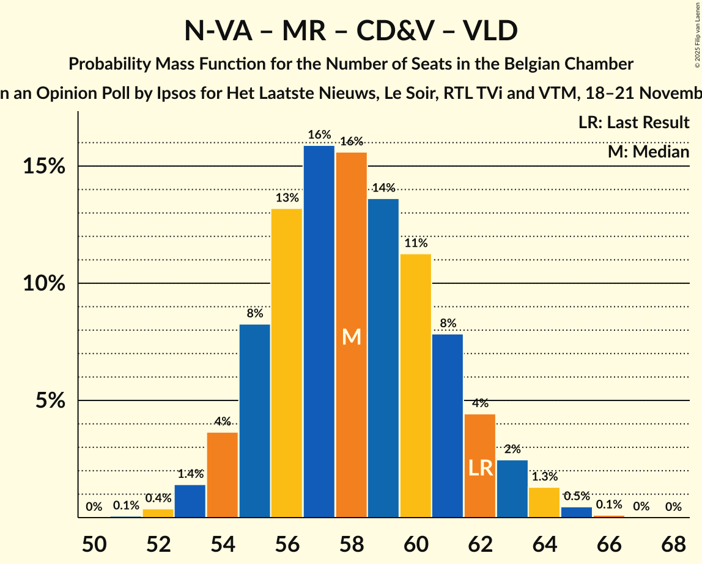

| Number of Seats | Probability | Accumulated | Special Marks |
|:---------------:|:-----------:|:-----------:|:-------------:|
| 51 | 0.1% | 100% |  |
| 52 | 0.4% | 99.9% |  |
| 53 | 1.4% | 99.5% |  |
| 54 | 4% | 98% |  |
| 55 | 8% | 94% |  |
| 56 | 13% | 86% |  |
| 57 | 16% | 73% |  |
| 58 | 16% | 57% | Median |
| 59 | 14% | 42% |  |
| 60 | 11% | 28% |  |
| 61 | 8% | 17% |  |
| 62 | 4% | 9% | Last Result |
| 63 | 2% | 4% |  |
| 64 | 1.3% | 2% |  |
| 65 | 0.5% | 0.6% |  |
| 66 | 0.1% | 0.1% |  |
| 67 | 0% | 0% |  |

### Mouvement Réformateur – Christen-Democratisch en Vlaams – Les Engagés – Open Vlaamse Liberalen en Democraten – Groen – Ecolo

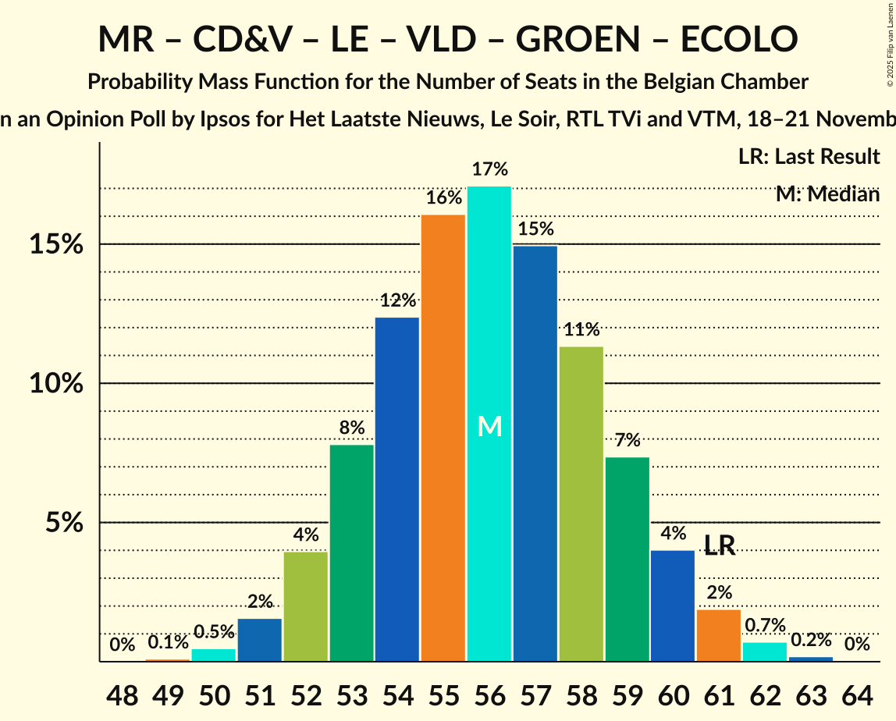

| Number of Seats | Probability | Accumulated | Special Marks |
|:---------------:|:-----------:|:-----------:|:-------------:|
| 49 | 0.1% | 100% |  |
| 50 | 0.5% | 99.9% |  |
| 51 | 2% | 99.4% |  |
| 52 | 4% | 98% |  |
| 53 | 8% | 94% |  |
| 54 | 12% | 86% |  |
| 55 | 16% | 74% | Median |
| 56 | 17% | 58% |  |
| 57 | 15% | 41% |  |
| 58 | 11% | 26% |  |
| 59 | 7% | 14% |  |
| 60 | 4% | 7% |  |
| 61 | 2% | 3% | Last Result |
| 62 | 0.7% | 0.9% |  |
| 63 | 0.2% | 0.2% |  |
| 64 | 0% | 0% |  |

### Vooruit – Parti Socialiste – Parti du Travail de Belgique – Partij van de Arbeid van België – Groen – Ecolo

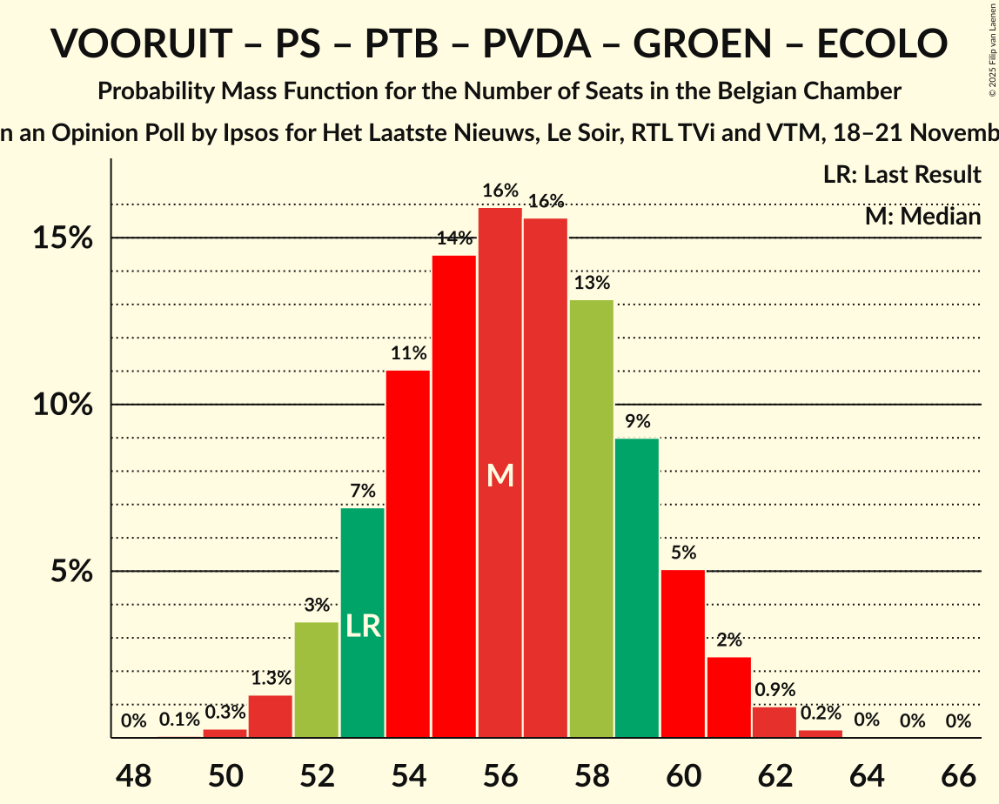

| Number of Seats | Probability | Accumulated | Special Marks |
|:---------------:|:-----------:|:-----------:|:-------------:|
| 49 | 0.1% | 100% |  |
| 50 | 0.3% | 99.9% |  |
| 51 | 1.3% | 99.7% |  |
| 52 | 3% | 98% |  |
| 53 | 7% | 95% | Last Result |
| 54 | 11% | 88% | Median |
| 55 | 14% | 77% |  |
| 56 | 16% | 62% |  |
| 57 | 16% | 47% |  |
| 58 | 13% | 31% |  |
| 59 | 9% | 18% |  |
| 60 | 5% | 9% |  |
| 61 | 2% | 4% |  |
| 62 | 0.9% | 1.3% |  |
| 63 | 0.2% | 0.3% |  |
| 64 | 0% | 0.1% |  |
| 65 | 0% | 0% |  |

### Vooruit – Parti Socialiste – Christen-Democratisch en Vlaams – Les Engagés

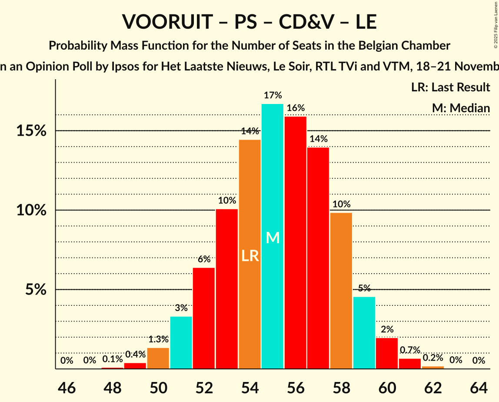

| Number of Seats | Probability | Accumulated | Special Marks |
|:---------------:|:-----------:|:-----------:|:-------------:|
| 48 | 0.1% | 100% |  |
| 49 | 0.3% | 99.9% |  |
| 50 | 1.2% | 99.6% |  |
| 51 | 3% | 98% |  |
| 52 | 6% | 95% |  |
| 53 | 10% | 89% |  |
| 54 | 14% | 79% | Last Result |
| 55 | 17% | 65% |  |
| 56 | 16% | 48% | Median |
| 57 | 14% | 32% |  |
| 58 | 10% | 18% |  |
| 59 | 5% | 8% |  |
| 60 | 2% | 3% |  |
| 61 | 0.7% | 0.9% |  |
| 62 | 0.2% | 0.3% |  |
| 63 | 0% | 0.1% |  |
| 64 | 0% | 0% |  |

### Mouvement Réformateur – Vooruit – Parti Socialiste – Open Vlaamse Liberalen en Democraten

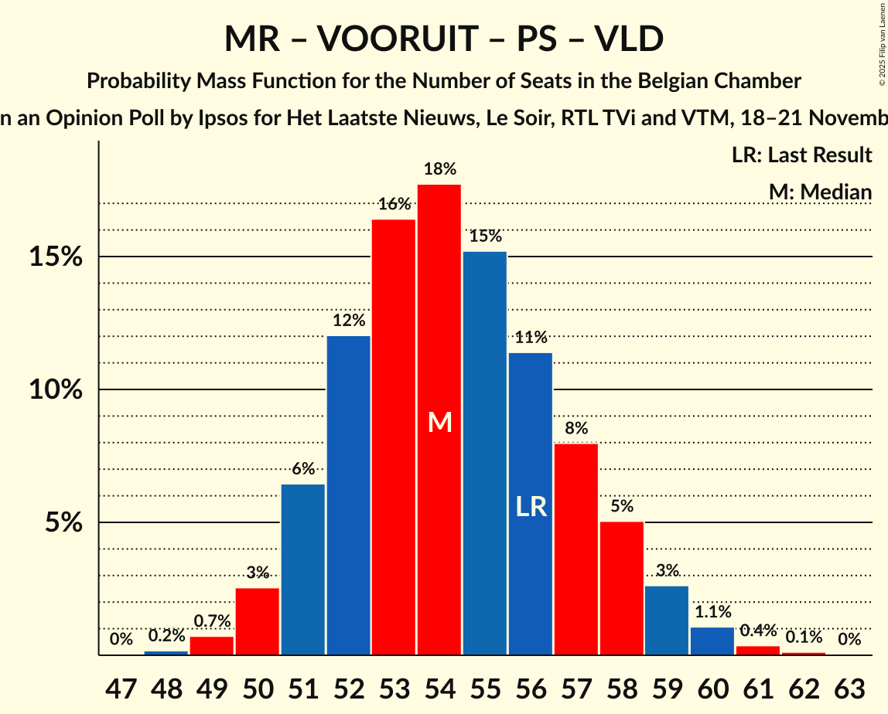

| Number of Seats | Probability | Accumulated | Special Marks |
|:---------------:|:-----------:|:-----------:|:-------------:|
| 47 | 0% | 100% |  |
| 48 | 0.2% | 99.9% |  |
| 49 | 0.7% | 99.8% |  |
| 50 | 3% | 99.0% |  |
| 51 | 6% | 97% |  |
| 52 | 12% | 90% |  |
| 53 | 16% | 78% | Median |
| 54 | 18% | 62% |  |
| 55 | 15% | 44% |  |
| 56 | 11% | 29% | Last Result |
| 57 | 8% | 17% |  |
| 58 | 5% | 9% |  |
| 59 | 3% | 4% |  |
| 60 | 1.1% | 2% |  |
| 61 | 0.4% | 0.5% |  |
| 62 | 0.1% | 0.2% |  |
| 63 | 0% | 0% |  |

### Mouvement Réformateur – Christen-Democratisch en Vlaams – Les Engagés – Open Vlaamse Liberalen en Democraten

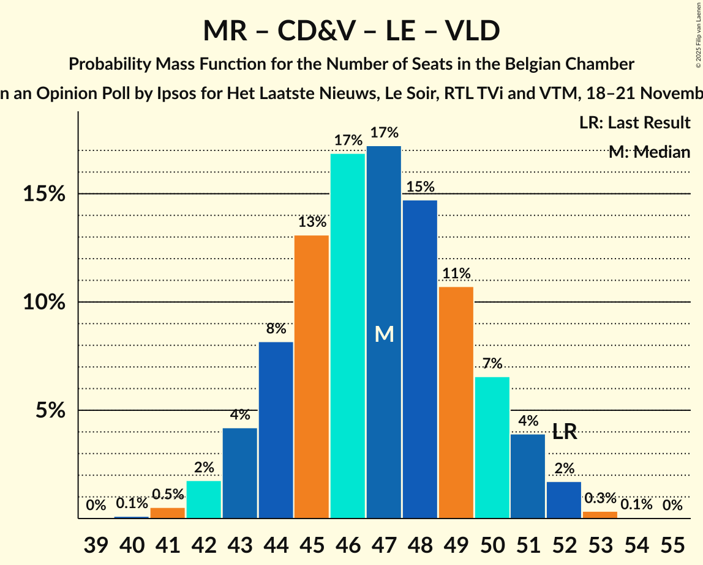

| Number of Seats | Probability | Accumulated | Special Marks |
|:---------------:|:-----------:|:-----------:|:-------------:|
| 40 | 0.1% | 100% |  |
| 41 | 0.5% | 99.9% |  |
| 42 | 2% | 99.3% |  |
| 43 | 4% | 98% |  |
| 44 | 8% | 93% |  |
| 45 | 13% | 85% |  |
| 46 | 17% | 72% |  |
| 47 | 17% | 55% | Median |
| 48 | 14% | 38% |  |
| 49 | 11% | 24% |  |
| 50 | 7% | 13% |  |
| 51 | 4% | 6% |  |
| 52 | 2% | 2% | Last Result |
| 53 | 0.4% | 0.4% |  |
| 54 | 0.1% | 0.1% |  |
| 55 | 0% | 0% |  |

## Technical Information

### Opinion Poll

+ **Polling firm:** Ipsos
+ **Commissioner(s):** Het Laatste Nieuws, Le Soir, RTL TVi and VTM
+ **Fieldwork period:** 18–21 November 2024

### Calculations

+ **Sample size:** 1607
+ **Simulations done:** 1,048,576
+ **Error estimate:** 1.14%

