# Opinion Poll by Ipsos for Het Laatste Nieuws, Le Soir, RTL TVi and VTM, 4–9 March 2021

Areas included: Brussels, Flanders, Wallonia

<a href="#voting-intentions">Voting Intentions</a> | <a href="#seats">Seats</a> | <a href="#coalitions">Coalitions</a> | <a href="#technical-information">Technical Information</a>

## Voting Intentions

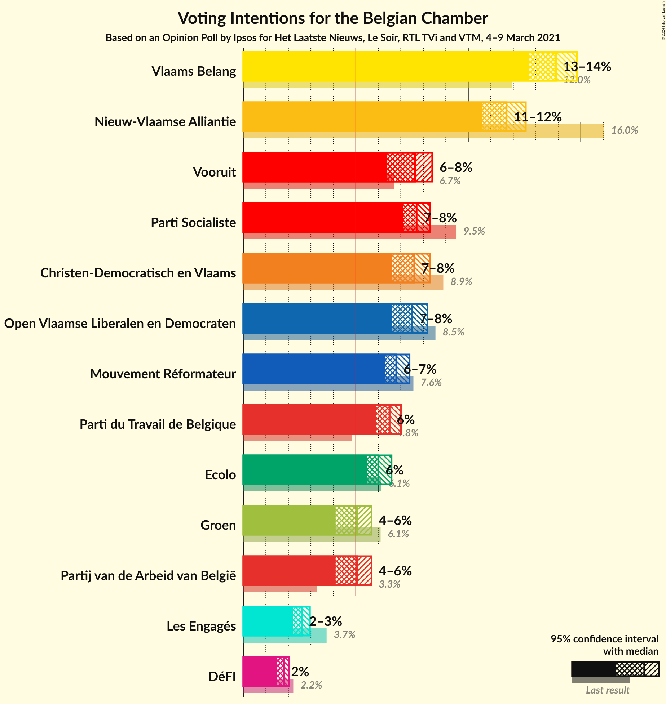

### Confidence Intervals

| Party | Last Result | Poll Result | 80% Confidence Interval | 90% Confidence Interval | 95% Confidence Interval | 99% Confidence Interval |
|:-----:|:-----------:|:-----------:|:-----------------------:|:-----------------------:|:-----------------------:|:-----------------------:|
| Vlaams Belang | 12.0% | 14.8% | 13.0–13.9% |12.8–13.9% |12.7–13.9% |12.3–13.9% |
| Nieuw-Vlaamse Alliantie | 16.0% | 12.6% | 10.9–11.7% |10.7–11.7% |10.6–11.7% |10.2–11.7% |
| Christen-Democratisch en Vlaams | 8.9% | 8.3% | 6.9–7.6% |6.8–7.6% |6.6–7.6% |6.3–7.6% |
| Parti Socialiste | 9.5% | 8.3% | 7.3–7.7% |7.2–7.7% |7.1–7.7% |6.9–7.7% |
| Open Vlaamse Liberalen en Democraten | 8.5% | 8.2% | 6.8–7.5% |6.7–7.5% |6.6–7.5% |6.3–7.5% |
| Vooruit | 6.7% | 7.6% | 6.8–8.2% |6.6–8.3% |6.4–8.4% |6.1–8.5% |
| Mouvement Réformateur | 7.6% | 7.4% | 6.5–6.8% |6.4–6.8% |6.3–6.8% |6.1–6.9% |
| Parti du Travail de Belgique | 4.8% | 7.0% | 6.1–6.5% |6.0–6.5% |5.9–6.5% |5.7–6.5% |
| Ecolo | 6.1% | 6.6% | 5.7–6.0% |5.6–6.0% |5.5–6.0% |5.3–6.0% |
| Groen | 6.1% | 5.0% | 4.4–5.5% |4.2–5.6% |4.1–5.7% |3.8–5.8% |
| Partij van de Arbeid van België | 3.3% | 5.0% | 4.4–5.5% |4.2–5.6% |4.1–5.7% |3.8–5.8% |
| Les Engagés | 3.7% | 3.0% | 2.3–2.6% |2.3–2.6% |2.2–2.6% |2.1–2.6% |
| DéFI | 2.2% | 2.0% | 1.6–1.8% |1.5–1.8% |1.5–1.8% |1.4–1.8% |

*Note:* The poll result column reflects the actual value used in the calculations. Published results may vary slightly, and in addition be rounded to fewer digits.

## Seats

### Confidence Intervals

| Party | Last Result | Median | 80% Confidence Interval | 90% Confidence Interval | 95% Confidence Interval | 99% Confidence Interval |
|:-----:|:-----------:|:------:|:-----------------------:|:-----------------------:|:-----------------------:|:-----------------------:|
| <a href="#vlaams-belang">Vlaams Belang</a> | 18 | 22 | 21–25 |20–25 |20–25 |19–26 |
| <a href="#nieuw-vlaamse-alliantie">Nieuw-Vlaamse Alliantie</a> | 25 | 19 | 16–21 |16–21 |16–21 |15–23 |
| <a href="#christen-democratisch-en-vlaams">Christen-Democratisch en Vlaams</a> | 12 | 11 | 10–14 |10–14 |10–14 |9–15 |
| <a href="#parti-socialiste">Parti Socialiste</a> | 20 | 17 | 15–18 |15–19 |15–19 |14–19 |
| <a href="#open-vlaamse-liberalen-en-democraten">Open Vlaamse Liberalen en Democraten</a> | 12 | 11 | 10–13 |10–13 |9–14 |9–15 |
| <a href="#vooruit">Vooruit</a> | 9 | 11 | 9–12 |9–13 |9–13 |8–14 |
| <a href="#mouvement-réformateur">Mouvement Réformateur</a> | 14 | 14 | 13–16 |13–17 |13–17 |12–17 |
| <a href="#parti-du-travail-de-belgique">Parti du Travail de Belgique</a> | 9 | 13 | 12–13 |11–14 |11–14 |10–16 |
| <a href="#ecolo">Ecolo</a> | 13 | 13 | 12–14 |11–14 |11–15 |10–16 |
| <a href="#groen">Groen</a> | 8 | 6 | 5–8 |5–9 |4–9 |4–9 |
| <a href="#partij-van-de-arbeid-van-belgië">Partij van de Arbeid van België</a> | 3 | 6 | 5–8 |5–8 |5–8 |4–9 |
| <a href="#les-engagés">Les Engagés</a> | 5 | 4 | 4–5 |4–5 |4–5 |3–5 |
| <a href="#défi">DéFI</a> | 2 | 2 | 2 |1–2 |1–3 |1–3 |

### Vlaams Belang

*For a full overview of the results for this party, see the [Vlaams Belang](party-vlaamsbelang.html) page.*

| Number of Seats | Probability | Accumulated | Special Marks |
|:---------------:|:-----------:|:-----------:|:-------------:|
| 17 | 0.1% | 100% |  |
| 18 | 0.3% | 99.9% | Last Result |
| 19 | 2% | 99.6% |  |
| 20 | 7% | 98% |  |
| 21 | 30% | 90% |  |
| 22 | 16% | 60% | Median |
| 23 | 13% | 44% |  |
| 24 | 12% | 32% |  |
| 25 | 19% | 20% |  |
| 26 | 0.8% | 1.0% |  |
| 27 | 0.1% | 0.2% |  |
| 28 | 0% | 0% |  |

### Nieuw-Vlaamse Alliantie

*For a full overview of the results for this party, see the [Nieuw-Vlaamse Alliantie](party-nieuw-vlaamsealliantie.html) page.*

| Number of Seats | Probability | Accumulated | Special Marks |
|:---------------:|:-----------:|:-----------:|:-------------:|
| 15 | 1.0% | 100% |  |
| 16 | 11% | 99.0% |  |
| 17 | 14% | 88% |  |
| 18 | 12% | 74% |  |
| 19 | 18% | 62% | Median |
| 20 | 28% | 44% |  |
| 21 | 14% | 16% |  |
| 22 | 2% | 2% |  |
| 23 | 0.4% | 0.5% |  |
| 24 | 0.1% | 0.1% |  |
| 25 | 0% | 0% | Last Result |

### Christen-Democratisch en Vlaams

*For a full overview of the results for this party, see the [Christen-Democratisch en Vlaams](party-christen-democratischenvlaams.html) page.*

| Number of Seats | Probability | Accumulated | Special Marks |
|:---------------:|:-----------:|:-----------:|:-------------:|
| 9 | 1.0% | 100% |  |
| 10 | 28% | 99.0% |  |
| 11 | 30% | 71% | Median |
| 12 | 18% | 41% | Last Result |
| 13 | 10% | 23% |  |
| 14 | 12% | 13% |  |
| 15 | 1.2% | 1.4% |  |
| 16 | 0.1% | 0.1% |  |
| 17 | 0% | 0% |  |

### Parti Socialiste

*For a full overview of the results for this party, see the [Parti Socialiste](party-partisocialiste.html) page.*

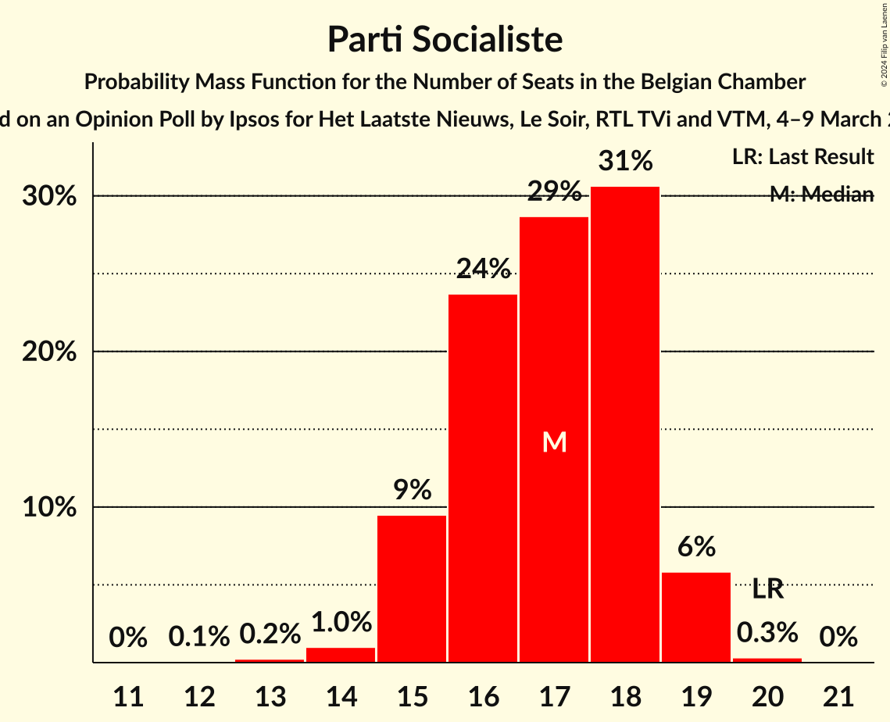

| Number of Seats | Probability | Accumulated | Special Marks |
|:---------------:|:-----------:|:-----------:|:-------------:|
| 12 | 0.1% | 100% |  |
| 13 | 0.2% | 99.9% |  |
| 14 | 1.0% | 99.7% |  |
| 15 | 9% | 98.7% |  |
| 16 | 24% | 89% |  |
| 17 | 29% | 66% | Median |
| 18 | 31% | 37% |  |
| 19 | 6% | 6% |  |
| 20 | 0.3% | 0.4% | Last Result |
| 21 | 0% | 0% |  |

### Open Vlaamse Liberalen en Democraten

*For a full overview of the results for this party, see the [Open Vlaamse Liberalen en Democraten](party-openvlaamseliberalenendemocraten.html) page.*

| Number of Seats | Probability | Accumulated | Special Marks |
|:---------------:|:-----------:|:-----------:|:-------------:|
| 8 | 0.1% | 100% |  |
| 9 | 3% | 99.9% |  |
| 10 | 37% | 97% |  |
| 11 | 35% | 60% | Median |
| 12 | 14% | 25% | Last Result |
| 13 | 7% | 11% |  |
| 14 | 4% | 5% |  |
| 15 | 0.6% | 0.7% |  |
| 16 | 0.1% | 0.1% |  |
| 17 | 0% | 0% |  |

### Vooruit

*For a full overview of the results for this party, see the [Vooruit](party-vooruit.html) page.*

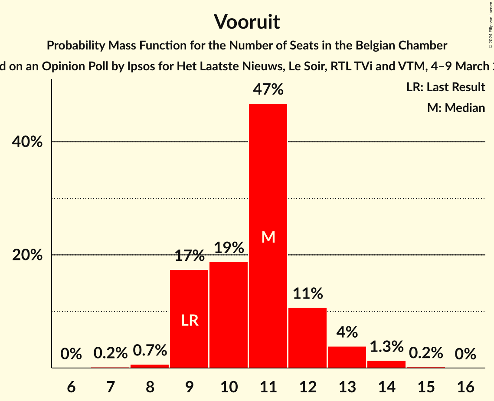

| Number of Seats | Probability | Accumulated | Special Marks |
|:---------------:|:-----------:|:-----------:|:-------------:|
| 7 | 0.2% | 100% |  |
| 8 | 0.7% | 99.8% |  |
| 9 | 17% | 99.1% | Last Result |
| 10 | 19% | 82% |  |
| 11 | 47% | 63% | Median |
| 12 | 11% | 16% |  |
| 13 | 4% | 5% |  |
| 14 | 1.3% | 2% |  |
| 15 | 0.2% | 0.2% |  |
| 16 | 0% | 0% |  |

### Mouvement Réformateur

*For a full overview of the results for this party, see the [Mouvement Réformateur](party-mouvementréformateur.html) page.*

| Number of Seats | Probability | Accumulated | Special Marks |
|:---------------:|:-----------:|:-----------:|:-------------:|
| 12 | 2% | 100% |  |
| 13 | 27% | 98% |  |
| 14 | 26% | 71% | Last Result, Median |
| 15 | 27% | 45% |  |
| 16 | 9% | 18% |  |
| 17 | 9% | 9% |  |
| 18 | 0.4% | 0.4% |  |
| 19 | 0% | 0% |  |

### Parti du Travail de Belgique

*For a full overview of the results for this party, see the [Parti du Travail de Belgique](party-partidutravaildebelgique.html) page.*

| Number of Seats | Probability | Accumulated | Special Marks |
|:---------------:|:-----------:|:-----------:|:-------------:|
| 9 | 0% | 100% | Last Result |
| 10 | 0.7% | 100% |  |
| 11 | 9% | 99.3% |  |
| 12 | 39% | 90% |  |
| 13 | 42% | 52% | Median |
| 14 | 7% | 9% |  |
| 15 | 1.2% | 2% |  |
| 16 | 0.8% | 1.1% |  |
| 17 | 0.3% | 0.3% |  |
| 18 | 0.1% | 0.1% |  |
| 19 | 0% | 0% |  |

### Ecolo

*For a full overview of the results for this party, see the [Ecolo](party-ecolo.html) page.*

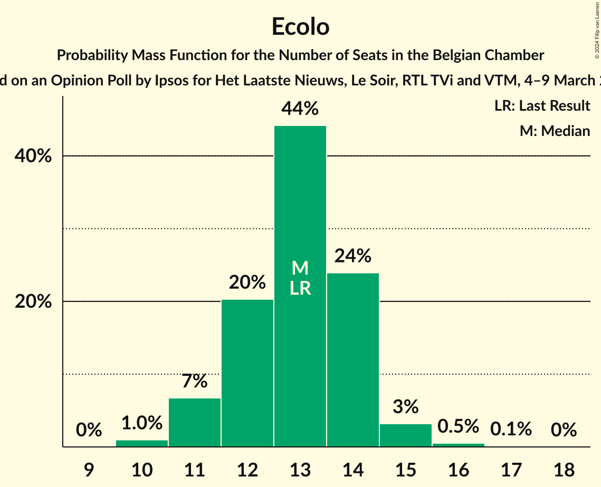

| Number of Seats | Probability | Accumulated | Special Marks |
|:---------------:|:-----------:|:-----------:|:-------------:|
| 10 | 1.0% | 100% |  |
| 11 | 7% | 99.0% |  |
| 12 | 20% | 92% |  |
| 13 | 44% | 72% | Last Result, Median |
| 14 | 24% | 28% |  |
| 15 | 3% | 4% |  |
| 16 | 0.5% | 0.7% |  |
| 17 | 0.1% | 0.2% |  |
| 18 | 0% | 0% |  |

### Groen

*For a full overview of the results for this party, see the [Groen](party-groen.html) page.*

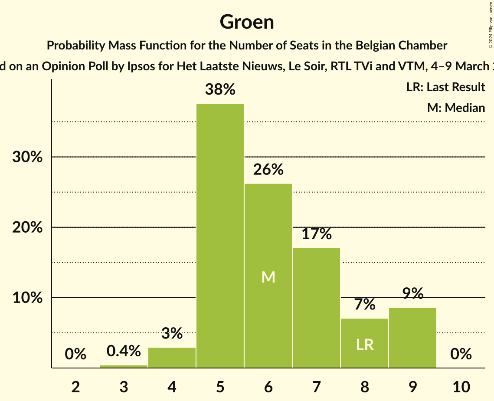

| Number of Seats | Probability | Accumulated | Special Marks |
|:---------------:|:-----------:|:-----------:|:-------------:|
| 3 | 0.4% | 100% |  |
| 4 | 3% | 99.6% |  |
| 5 | 38% | 97% |  |
| 6 | 26% | 59% | Median |
| 7 | 17% | 33% |  |
| 8 | 7% | 16% | Last Result |
| 9 | 9% | 9% |  |
| 10 | 0% | 0% |  |

### Partij van de Arbeid van België

*For a full overview of the results for this party, see the [Partij van de Arbeid van België](party-partijvandearbeidvanbelgië.html) page.*

| Number of Seats | Probability | Accumulated | Special Marks |
|:---------------:|:-----------:|:-----------:|:-------------:|
| 3 | 0.4% | 100% | Last Result |
| 4 | 1.0% | 99.6% |  |
| 5 | 31% | 98.6% |  |
| 6 | 18% | 67% | Median |
| 7 | 18% | 49% |  |
| 8 | 30% | 31% |  |
| 9 | 0.9% | 0.9% |  |
| 10 | 0% | 0% |  |

### Les Engagés

*For a full overview of the results for this party, see the [Les Engagés](party-lesengagés.html) page.*

| Number of Seats | Probability | Accumulated | Special Marks |
|:---------------:|:-----------:|:-----------:|:-------------:|
| 1 | 0.1% | 100% |  |
| 2 | 0.4% | 99.9% |  |
| 3 | 0.5% | 99.5% |  |
| 4 | 87% | 99.0% | Median |
| 5 | 12% | 12% | Last Result |
| 6 | 0.1% | 0.1% |  |
| 7 | 0% | 0% |  |

### DéFI

*For a full overview of the results for this party, see the [DéFI](party-défi.html) page.*

| Number of Seats | Probability | Accumulated | Special Marks |
|:---------------:|:-----------:|:-----------:|:-------------:|
| 1 | 7% | 100% |  |
| 2 | 89% | 93% | Last Result, Median |
| 3 | 5% | 5% |  |
| 4 | 0.3% | 0.3% |  |
| 5 | 0% | 0% |  |

## Coalitions

### Confidence Intervals

| Coalition | Last Result | Median | Majority? | 80% Confidence Interval | 90% Confidence Interval | 95% Confidence Interval | 99% Confidence Interval |
|:---------:|:-----------:|:------:|:---------:|:-----------------------:|:-----------------------:|:-----------------------:|:-----------------------:|
| Christen-Democratisch en Vlaams – Open Vlaamse Liberalen en Democraten – Mouvement Réformateur – Ecolo – Groen – Les Engagés | 64 | 60 | 0% | 57–63 | 56–64 | 56–65 | 55–66 |
| Nieuw-Vlaamse Alliantie – Christen-Democratisch en Vlaams – Open Vlaamse Liberalen en Democraten – Mouvement Réformateur – Les Engagés | 68 | 60 | 0% | 57–63 | 56–64 | 55–65 | 54–66 |
| Christen-Democratisch en Vlaams – Parti Socialiste – Open Vlaamse Liberalen en Democraten – Mouvement Réformateur – Les Engagés | 63 | 58 | 0% | 55–61 | 55–62 | 54–62 | 53–63 |
| Nieuw-Vlaamse Alliantie – Christen-Democratisch en Vlaams – Open Vlaamse Liberalen en Democraten – Mouvement Réformateur | 63 | 56 | 0% | 53–59 | 52–60 | 51–60 | 50–62 |
| Christen-Democratisch en Vlaams – Open Vlaamse Liberalen en Democraten – Mouvement Réformateur – Les Engagés | 43 | 41 | 0% | 38–44 | 38–45 | 37–46 | 36–47 |
| Nieuw-Vlaamse Alliantie – Parti Socialiste – Open Vlaamse Liberalen en Democraten – Vooruit – Mouvement Réformateur | 80 | 41 | 0% | 38–43 | 38–44 | 37–44 | 36–45 |
| Christen-Democratisch en Vlaams – Parti Socialiste – Open Vlaamse Liberalen en Democraten – Vooruit – Mouvement Réformateur – Ecolo – Groen | 88 | 39 | 0% | 37–42 | 36–43 | 36–43 | 35–44 |
| Christen-Democratisch en Vlaams – Parti Socialiste – Open Vlaamse Liberalen en Democraten – Vooruit – Mouvement Réformateur – Ecolo – Groen – Les Engagés | 93 | 39 | 0% | 37–42 | 36–43 | 36–43 | 35–44 |
| Christen-Democratisch en Vlaams – Parti Socialiste – Vooruit – Parti du Travail de Belgique – Ecolo – Groen – Partij van de Arbeid van België – Les Engagés | 79 | 35 | 0% | 32–37 | 31–38 | 31–39 | 30–40 |
| Christen-Democratisch en Vlaams – Parti Socialiste – Open Vlaamse Liberalen en Democraten – Vooruit – Mouvement Réformateur – Les Engagés | 72 | 33 | 0% | 31–36 | 30–36 | 30–37 | 29–38 |
| Christen-Democratisch en Vlaams – Parti Socialiste – Vooruit – Ecolo – Groen – Les Engagés | 67 | 28 | 0% | 26–31 | 25–31 | 25–32 | 24–33 |
| Parti Socialiste – Open Vlaamse Liberalen en Democraten – Vooruit – Mouvement Réformateur – Ecolo – Groen | 76 | 27 | 0% | 26–30 | 25–31 | 25–31 | 24–32 |
| Parti Socialiste – Vooruit – Parti du Travail de Belgique – Ecolo – Groen – Partij van de Arbeid van België | 62 | 23 | 0% | 21–26 | 20–27 | 20–27 | 19–28 |
| Parti Socialiste – Vooruit – Parti du Travail de Belgique – Ecolo – Groen – Partij van de Arbeid van België – Les Engagés | 67 | 23 | 0% | 21–26 | 20–27 | 20–27 | 19–28 |
| Christen-Democratisch en Vlaams – Parti Socialiste – Vooruit – Les Engagés | 46 | 22 | 0% | 20–25 | 20–25 | 19–25 | 19–27 |
| Parti Socialiste – Open Vlaamse Liberalen en Democraten – Vooruit – Mouvement Réformateur | 55 | 22 | 0% | 20–24 | 19–24 | 19–25 | 18–26 |

### Christen-Democratisch en Vlaams – Open Vlaamse Liberalen en Democraten – Mouvement Réformateur – Ecolo – Groen – Les Engagés

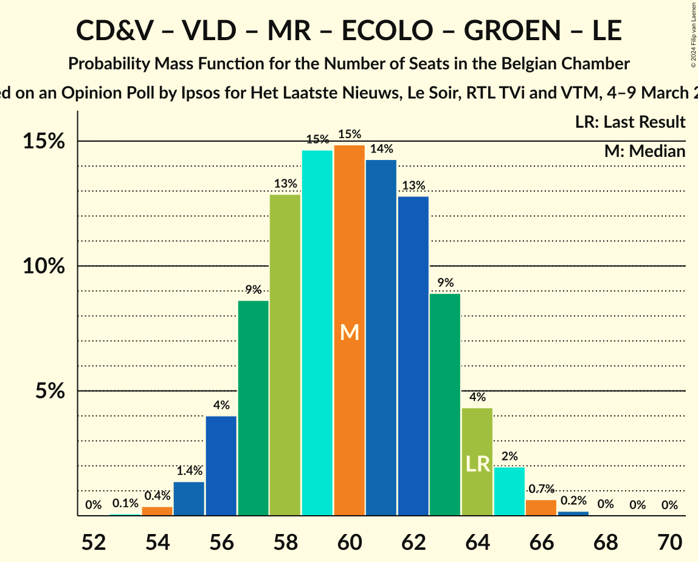

| Number of Seats | Probability | Accumulated | Special Marks |
|:---------------:|:-----------:|:-----------:|:-------------:|
| 53 | 0.1% | 100% |  |
| 54 | 0.4% | 99.9% |  |
| 55 | 1.4% | 99.5% |  |
| 56 | 4% | 98% |  |
| 57 | 9% | 94% |  |
| 58 | 13% | 86% |  |
| 59 | 15% | 73% | Median |
| 60 | 15% | 58% |  |
| 61 | 14% | 43% |  |
| 62 | 13% | 29% |  |
| 63 | 9% | 16% |  |
| 64 | 4% | 7% | Last Result |
| 65 | 2% | 3% |  |
| 66 | 0.7% | 0.9% |  |
| 67 | 0.2% | 0.2% |  |
| 68 | 0% | 0.1% |  |
| 69 | 0% | 0% |  |

### Nieuw-Vlaamse Alliantie – Christen-Democratisch en Vlaams – Open Vlaamse Liberalen en Democraten – Mouvement Réformateur – Les Engagés

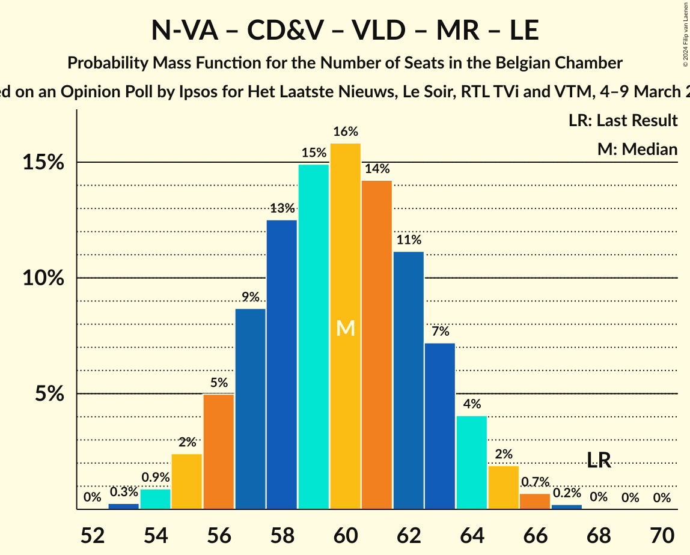

| Number of Seats | Probability | Accumulated | Special Marks |
|:---------------:|:-----------:|:-----------:|:-------------:|
| 53 | 0.3% | 100% |  |
| 54 | 0.9% | 99.7% |  |
| 55 | 2% | 98.8% |  |
| 56 | 5% | 96% |  |
| 57 | 9% | 91% |  |
| 58 | 13% | 83% |  |
| 59 | 15% | 70% | Median |
| 60 | 16% | 55% |  |
| 61 | 14% | 39% |  |
| 62 | 11% | 25% |  |
| 63 | 7% | 14% |  |
| 64 | 4% | 7% |  |
| 65 | 2% | 3% |  |
| 66 | 0.7% | 1.0% |  |
| 67 | 0.2% | 0.3% |  |
| 68 | 0% | 0.1% | Last Result |
| 69 | 0% | 0% |  |

### Christen-Democratisch en Vlaams – Parti Socialiste – Open Vlaamse Liberalen en Democraten – Mouvement Réformateur – Les Engagés

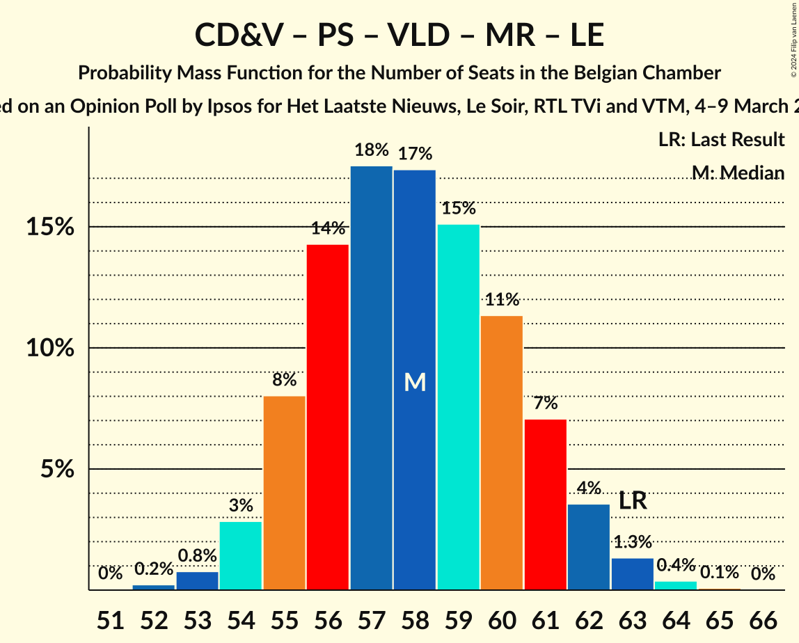

| Number of Seats | Probability | Accumulated | Special Marks |
|:---------------:|:-----------:|:-----------:|:-------------:|
| 51 | 0% | 100% |  |
| 52 | 0.2% | 99.9% |  |
| 53 | 0.8% | 99.7% |  |
| 54 | 3% | 98.9% |  |
| 55 | 8% | 96% |  |
| 56 | 14% | 88% |  |
| 57 | 18% | 74% | Median |
| 58 | 17% | 56% |  |
| 59 | 15% | 39% |  |
| 60 | 11% | 24% |  |
| 61 | 7% | 12% |  |
| 62 | 4% | 5% |  |
| 63 | 1.3% | 2% | Last Result |
| 64 | 0.4% | 0.5% |  |
| 65 | 0.1% | 0.1% |  |
| 66 | 0% | 0% |  |

### Nieuw-Vlaamse Alliantie – Christen-Democratisch en Vlaams – Open Vlaamse Liberalen en Democraten – Mouvement Réformateur

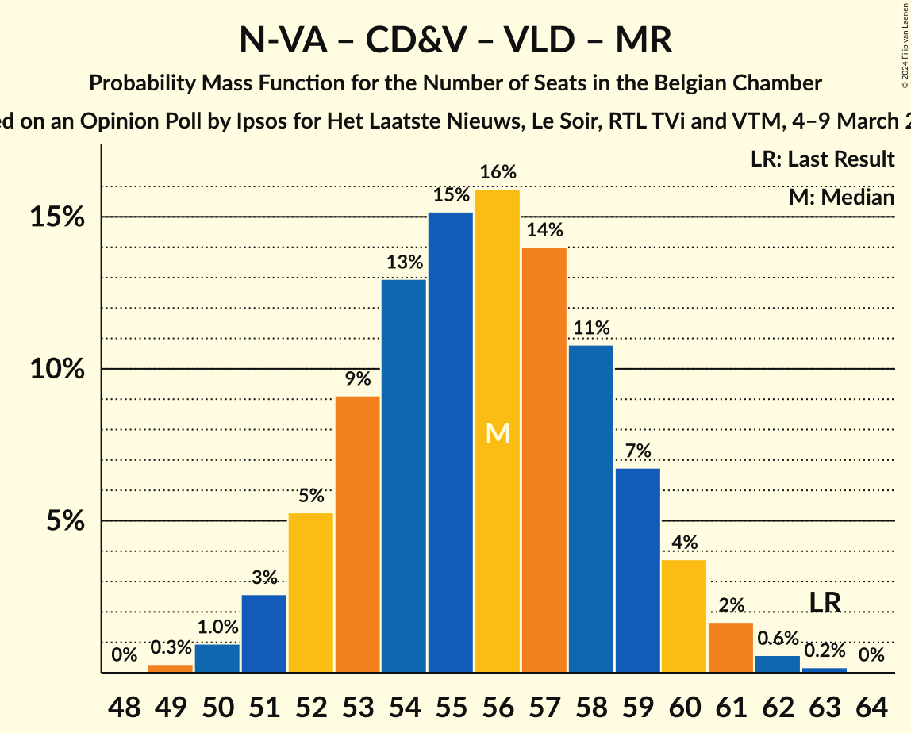

| Number of Seats | Probability | Accumulated | Special Marks |
|:---------------:|:-----------:|:-----------:|:-------------:|
| 49 | 0.3% | 100% |  |
| 50 | 1.0% | 99.7% |  |
| 51 | 3% | 98.7% |  |
| 52 | 5% | 96% |  |
| 53 | 9% | 91% |  |
| 54 | 13% | 82% |  |
| 55 | 15% | 69% | Median |
| 56 | 16% | 54% |  |
| 57 | 14% | 38% |  |
| 58 | 11% | 24% |  |
| 59 | 7% | 13% |  |
| 60 | 4% | 6% |  |
| 61 | 2% | 2% |  |
| 62 | 0.6% | 0.8% |  |
| 63 | 0.2% | 0.2% | Last Result |
| 64 | 0% | 0% |  |

### Christen-Democratisch en Vlaams – Open Vlaamse Liberalen en Democraten – Mouvement Réformateur – Les Engagés

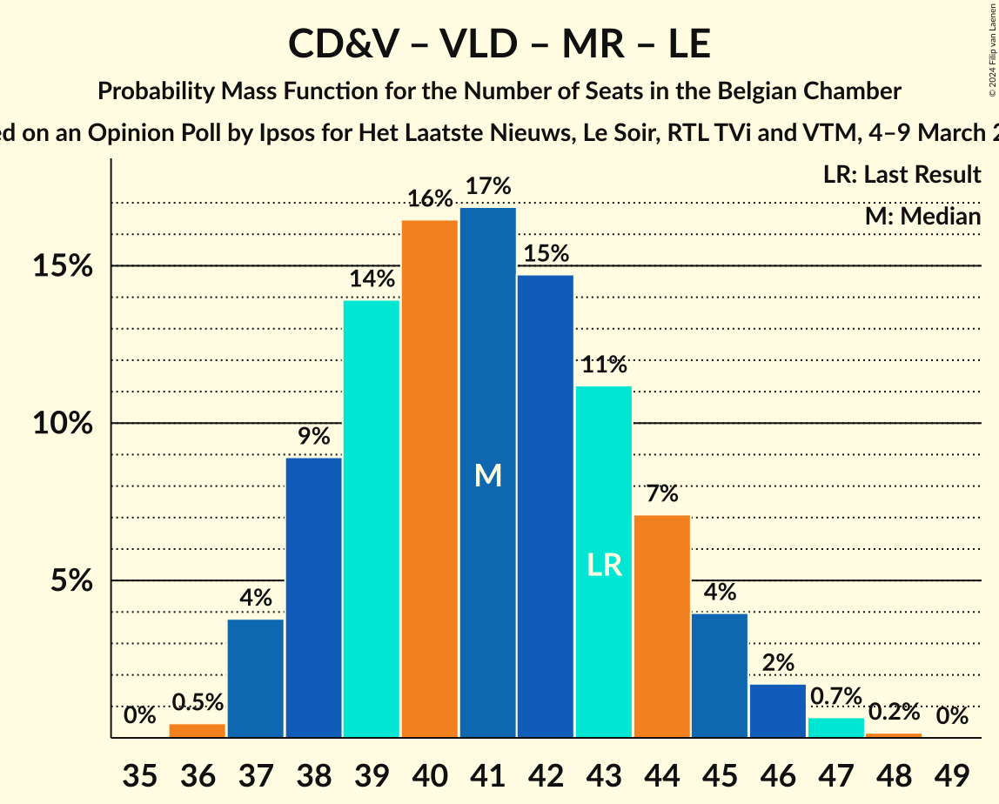

| Number of Seats | Probability | Accumulated | Special Marks |
|:---------------:|:-----------:|:-----------:|:-------------:|
| 35 | 0% | 100% |  |
| 36 | 0.5% | 99.9% |  |
| 37 | 4% | 99.5% |  |
| 38 | 9% | 96% |  |
| 39 | 14% | 87% |  |
| 40 | 16% | 73% | Median |
| 41 | 17% | 56% |  |
| 42 | 15% | 40% |  |
| 43 | 11% | 25% | Last Result |
| 44 | 7% | 14% |  |
| 45 | 4% | 7% |  |
| 46 | 2% | 3% |  |
| 47 | 0.7% | 0.8% |  |
| 48 | 0.2% | 0.2% |  |
| 49 | 0% | 0% |  |

### Nieuw-Vlaamse Alliantie – Parti Socialiste – Open Vlaamse Liberalen en Democraten – Vooruit – Mouvement Réformateur

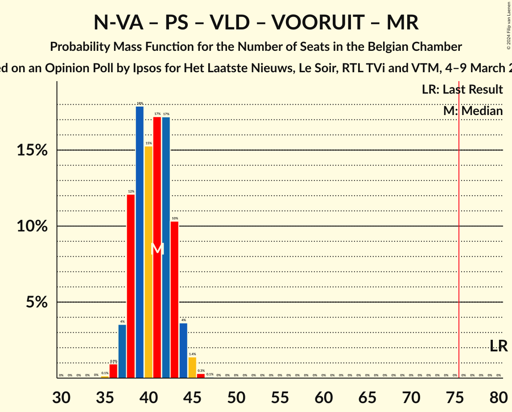

| Number of Seats | Probability | Accumulated | Special Marks |
|:---------------:|:-----------:|:-----------:|:-------------:|
| 35 | 0.1% | 100% |  |
| 36 | 0.9% | 99.8% |  |
| 37 | 4% | 98.9% |  |
| 38 | 12% | 95% |  |
| 39 | 18% | 83% |  |
| 40 | 15% | 65% |  |
| 41 | 17% | 50% |  |
| 42 | 17% | 33% |  |
| 43 | 10% | 16% |  |
| 44 | 4% | 5% |  |
| 45 | 1.4% | 2% |  |
| 46 | 0.3% | 0.4% |  |
| 47 | 0.1% | 0.1% |  |
| 48 | 0% | 0% |  |
| 49 | 0% | 0% |  |
| 50 | 0% | 0% |  |
| 51 | 0% | 0% |  |
| 52 | 0% | 0% |  |
| 53 | 0% | 0% |  |
| 54 | 0% | 0% |  |
| 55 | 0% | 0% |  |
| 56 | 0% | 0% |  |
| 57 | 0% | 0% |  |
| 58 | 0% | 0% |  |
| 59 | 0% | 0% |  |
| 60 | 0% | 0% |  |
| 61 | 0% | 0% |  |
| 62 | 0% | 0% |  |
| 63 | 0% | 0% |  |
| 64 | 0% | 0% |  |
| 65 | 0% | 0% |  |
| 66 | 0% | 0% |  |
| 67 | 0% | 0% |  |
| 68 | 0% | 0% |  |
| 69 | 0% | 0% |  |
| 70 | 0% | 0% |  |
| 71 | 0% | 0% |  |
| 72 | 0% | 0% | Median |
| 73 | 0% | 0% |  |
| 74 | 0% | 0% |  |
| 75 | 0% | 0% |  |
| 76 | 0% | 0% | Majority |
| 77 | 0% | 0% |  |
| 78 | 0% | 0% |  |
| 79 | 0% | 0% |  |
| 80 | 0% | 0% | Last Result |

### Christen-Democratisch en Vlaams – Parti Socialiste – Open Vlaamse Liberalen en Democraten – Vooruit – Mouvement Réformateur – Ecolo – Groen

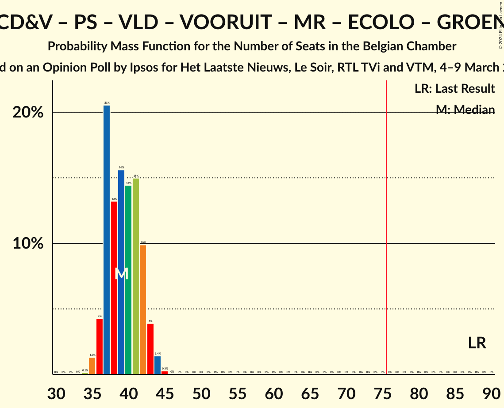

| Number of Seats | Probability | Accumulated | Special Marks |
|:---------------:|:-----------:|:-----------:|:-------------:|
| 34 | 0.1% | 100% |  |
| 35 | 1.3% | 99.8% |  |
| 36 | 4% | 98.5% |  |
| 37 | 21% | 94% |  |
| 38 | 13% | 74% |  |
| 39 | 16% | 61% |  |
| 40 | 14% | 45% |  |
| 41 | 15% | 30% |  |
| 42 | 10% | 16% |  |
| 43 | 4% | 6% |  |
| 44 | 1.4% | 2% |  |
| 45 | 0.3% | 0.3% |  |
| 46 | 0% | 0% |  |
| 47 | 0% | 0% |  |
| 48 | 0% | 0% |  |
| 49 | 0% | 0% |  |
| 50 | 0% | 0% |  |
| 51 | 0% | 0% |  |
| 52 | 0% | 0% |  |
| 53 | 0% | 0% |  |
| 54 | 0% | 0% |  |
| 55 | 0% | 0% |  |
| 56 | 0% | 0% |  |
| 57 | 0% | 0% |  |
| 58 | 0% | 0% |  |
| 59 | 0% | 0% |  |
| 60 | 0% | 0% |  |
| 61 | 0% | 0% |  |
| 62 | 0% | 0% |  |
| 63 | 0% | 0% |  |
| 64 | 0% | 0% |  |
| 65 | 0% | 0% |  |
| 66 | 0% | 0% |  |
| 67 | 0% | 0% |  |
| 68 | 0% | 0% |  |
| 69 | 0% | 0% |  |
| 70 | 0% | 0% |  |
| 71 | 0% | 0% |  |
| 72 | 0% | 0% |  |
| 73 | 0% | 0% |  |
| 74 | 0% | 0% |  |
| 75 | 0% | 0% |  |
| 76 | 0% | 0% | Majority |
| 77 | 0% | 0% |  |
| 78 | 0% | 0% |  |
| 79 | 0% | 0% |  |
| 80 | 0% | 0% |  |
| 81 | 0% | 0% |  |
| 82 | 0% | 0% |  |
| 83 | 0% | 0% | Median |
| 84 | 0% | 0% |  |
| 85 | 0% | 0% |  |
| 86 | 0% | 0% |  |
| 87 | 0% | 0% |  |
| 88 | 0% | 0% | Last Result |

### Christen-Democratisch en Vlaams – Parti Socialiste – Open Vlaamse Liberalen en Democraten – Vooruit – Mouvement Réformateur – Ecolo – Groen – Les Engagés

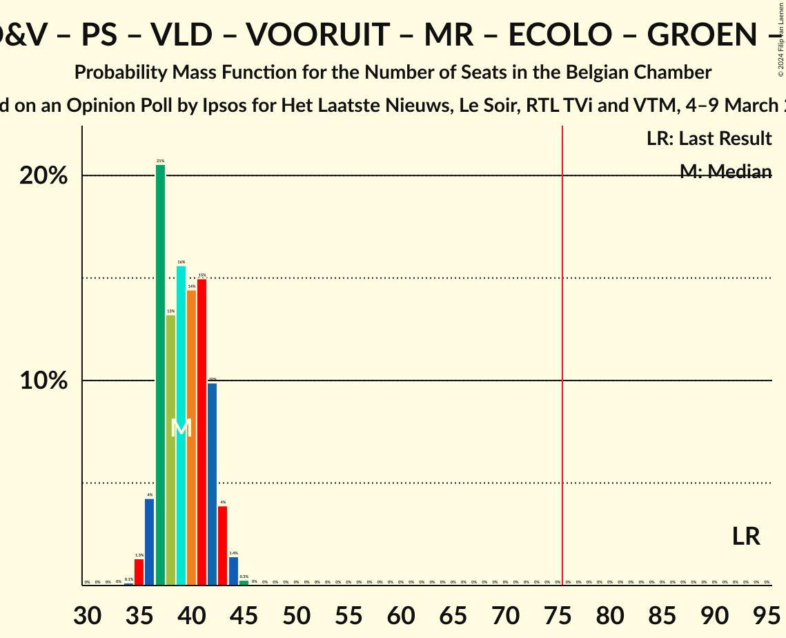

| Number of Seats | Probability | Accumulated | Special Marks |
|:---------------:|:-----------:|:-----------:|:-------------:|
| 34 | 0.1% | 100% |  |
| 35 | 1.3% | 99.8% |  |
| 36 | 4% | 98.5% |  |
| 37 | 21% | 94% |  |
| 38 | 13% | 74% |  |
| 39 | 16% | 61% |  |
| 40 | 14% | 45% |  |
| 41 | 15% | 30% |  |
| 42 | 10% | 16% |  |
| 43 | 4% | 6% |  |
| 44 | 1.4% | 2% |  |
| 45 | 0.3% | 0.3% |  |
| 46 | 0% | 0% |  |
| 47 | 0% | 0% |  |
| 48 | 0% | 0% |  |
| 49 | 0% | 0% |  |
| 50 | 0% | 0% |  |
| 51 | 0% | 0% |  |
| 52 | 0% | 0% |  |
| 53 | 0% | 0% |  |
| 54 | 0% | 0% |  |
| 55 | 0% | 0% |  |
| 56 | 0% | 0% |  |
| 57 | 0% | 0% |  |
| 58 | 0% | 0% |  |
| 59 | 0% | 0% |  |
| 60 | 0% | 0% |  |
| 61 | 0% | 0% |  |
| 62 | 0% | 0% |  |
| 63 | 0% | 0% |  |
| 64 | 0% | 0% |  |
| 65 | 0% | 0% |  |
| 66 | 0% | 0% |  |
| 67 | 0% | 0% |  |
| 68 | 0% | 0% |  |
| 69 | 0% | 0% |  |
| 70 | 0% | 0% |  |
| 71 | 0% | 0% |  |
| 72 | 0% | 0% |  |
| 73 | 0% | 0% |  |
| 74 | 0% | 0% |  |
| 75 | 0% | 0% |  |
| 76 | 0% | 0% | Majority |
| 77 | 0% | 0% |  |
| 78 | 0% | 0% |  |
| 79 | 0% | 0% |  |
| 80 | 0% | 0% |  |
| 81 | 0% | 0% |  |
| 82 | 0% | 0% |  |
| 83 | 0% | 0% |  |
| 84 | 0% | 0% |  |
| 85 | 0% | 0% |  |
| 86 | 0% | 0% |  |
| 87 | 0% | 0% | Median |
| 88 | 0% | 0% |  |
| 89 | 0% | 0% |  |
| 90 | 0% | 0% |  |
| 91 | 0% | 0% |  |
| 92 | 0% | 0% |  |
| 93 | 0% | 0% | Last Result |

### Christen-Democratisch en Vlaams – Parti Socialiste – Vooruit – Parti du Travail de Belgique – Ecolo – Groen – Partij van de Arbeid van België – Les Engagés

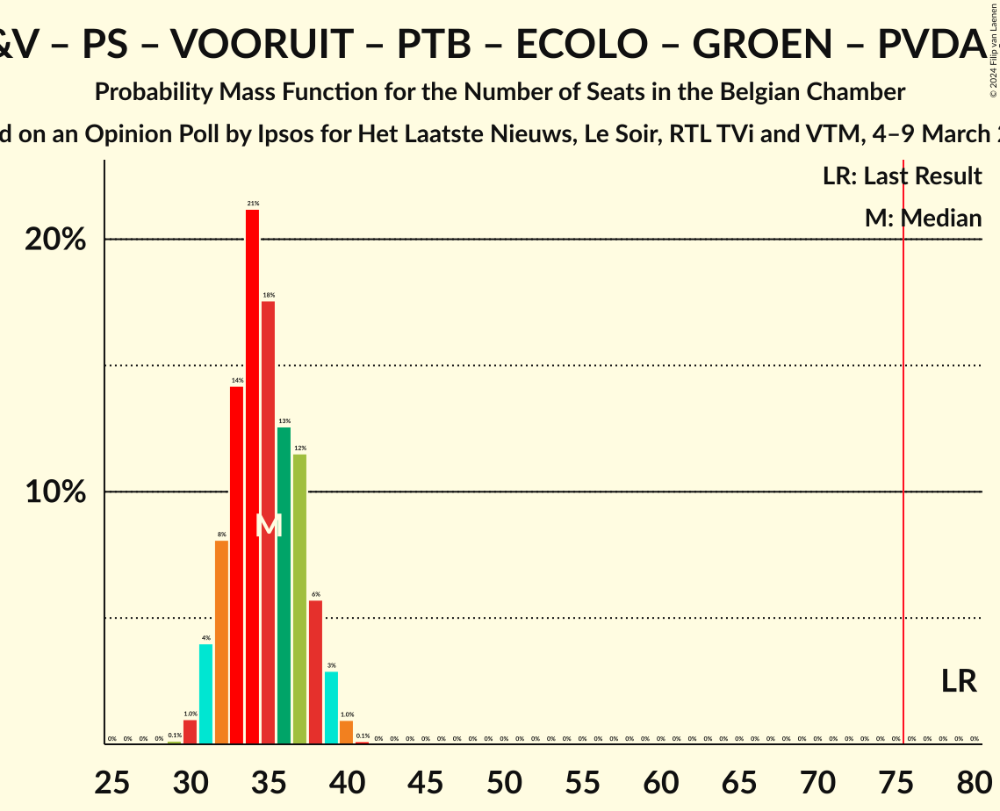

| Number of Seats | Probability | Accumulated | Special Marks |
|:---------------:|:-----------:|:-----------:|:-------------:|
| 29 | 0.1% | 100% |  |
| 30 | 1.0% | 99.9% |  |
| 31 | 4% | 98.9% |  |
| 32 | 8% | 95% |  |
| 33 | 14% | 87% |  |
| 34 | 21% | 73% |  |
| 35 | 18% | 51% |  |
| 36 | 13% | 34% |  |
| 37 | 12% | 21% |  |
| 38 | 6% | 10% |  |
| 39 | 3% | 4% |  |
| 40 | 1.0% | 1.1% |  |
| 41 | 0.1% | 0.1% |  |
| 42 | 0% | 0% |  |
| 43 | 0% | 0% |  |
| 44 | 0% | 0% |  |
| 45 | 0% | 0% |  |
| 46 | 0% | 0% |  |
| 47 | 0% | 0% |  |
| 48 | 0% | 0% |  |
| 49 | 0% | 0% |  |
| 50 | 0% | 0% |  |
| 51 | 0% | 0% |  |
| 52 | 0% | 0% |  |
| 53 | 0% | 0% |  |
| 54 | 0% | 0% |  |
| 55 | 0% | 0% |  |
| 56 | 0% | 0% |  |
| 57 | 0% | 0% |  |
| 58 | 0% | 0% |  |
| 59 | 0% | 0% |  |
| 60 | 0% | 0% |  |
| 61 | 0% | 0% |  |
| 62 | 0% | 0% |  |
| 63 | 0% | 0% |  |
| 64 | 0% | 0% |  |
| 65 | 0% | 0% |  |
| 66 | 0% | 0% |  |
| 67 | 0% | 0% |  |
| 68 | 0% | 0% |  |
| 69 | 0% | 0% |  |
| 70 | 0% | 0% |  |
| 71 | 0% | 0% |  |
| 72 | 0% | 0% |  |
| 73 | 0% | 0% |  |
| 74 | 0% | 0% |  |
| 75 | 0% | 0% |  |
| 76 | 0% | 0% | Majority |
| 77 | 0% | 0% |  |
| 78 | 0% | 0% |  |
| 79 | 0% | 0% | Last Result |

### Christen-Democratisch en Vlaams – Parti Socialiste – Open Vlaamse Liberalen en Democraten – Vooruit – Mouvement Réformateur – Les Engagés

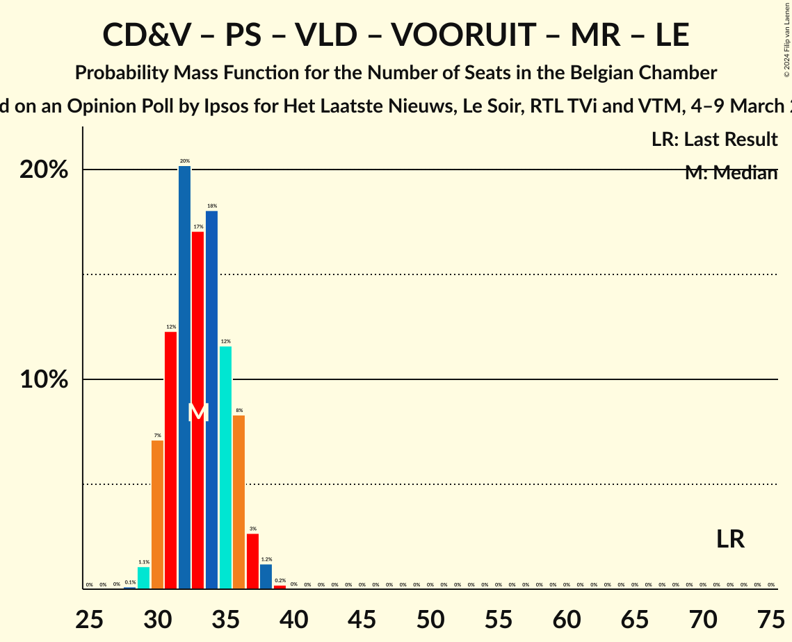

| Number of Seats | Probability | Accumulated | Special Marks |
|:---------------:|:-----------:|:-----------:|:-------------:|
| 28 | 0.1% | 100% |  |
| 29 | 1.1% | 99.8% |  |
| 30 | 7% | 98.8% |  |
| 31 | 12% | 92% |  |
| 32 | 20% | 79% |  |
| 33 | 17% | 59% |  |
| 34 | 18% | 42% |  |
| 35 | 12% | 24% |  |
| 36 | 8% | 12% |  |
| 37 | 3% | 4% |  |
| 38 | 1.2% | 1.4% |  |
| 39 | 0.2% | 0.2% |  |
| 40 | 0% | 0% |  |
| 41 | 0% | 0% |  |
| 42 | 0% | 0% |  |
| 43 | 0% | 0% |  |
| 44 | 0% | 0% |  |
| 45 | 0% | 0% |  |
| 46 | 0% | 0% |  |
| 47 | 0% | 0% |  |
| 48 | 0% | 0% |  |
| 49 | 0% | 0% |  |
| 50 | 0% | 0% |  |
| 51 | 0% | 0% |  |
| 52 | 0% | 0% |  |
| 53 | 0% | 0% |  |
| 54 | 0% | 0% |  |
| 55 | 0% | 0% |  |
| 56 | 0% | 0% |  |
| 57 | 0% | 0% |  |
| 58 | 0% | 0% |  |
| 59 | 0% | 0% |  |
| 60 | 0% | 0% |  |
| 61 | 0% | 0% |  |
| 62 | 0% | 0% |  |
| 63 | 0% | 0% |  |
| 64 | 0% | 0% |  |
| 65 | 0% | 0% |  |
| 66 | 0% | 0% |  |
| 67 | 0% | 0% |  |
| 68 | 0% | 0% | Median |
| 69 | 0% | 0% |  |
| 70 | 0% | 0% |  |
| 71 | 0% | 0% |  |
| 72 | 0% | 0% | Last Result |

### Christen-Democratisch en Vlaams – Parti Socialiste – Vooruit – Ecolo – Groen – Les Engagés

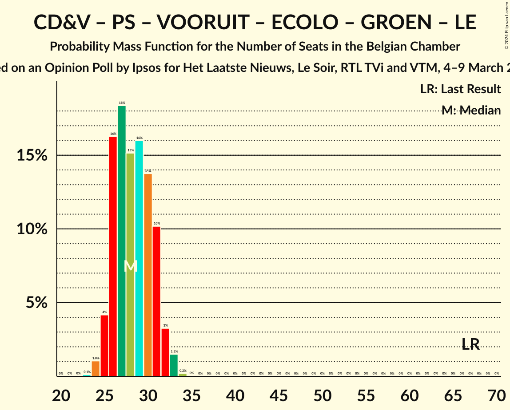

| Number of Seats | Probability | Accumulated | Special Marks |
|:---------------:|:-----------:|:-----------:|:-------------:|
| 23 | 0.1% | 100% |  |
| 24 | 1.0% | 99.9% |  |
| 25 | 4% | 98.8% |  |
| 26 | 16% | 95% |  |
| 27 | 18% | 78% |  |
| 28 | 15% | 60% |  |
| 29 | 16% | 45% |  |
| 30 | 14% | 29% |  |
| 31 | 10% | 15% |  |
| 32 | 3% | 5% |  |
| 33 | 1.5% | 2% |  |
| 34 | 0.2% | 0.2% |  |
| 35 | 0% | 0% |  |
| 36 | 0% | 0% |  |
| 37 | 0% | 0% |  |
| 38 | 0% | 0% |  |
| 39 | 0% | 0% |  |
| 40 | 0% | 0% |  |
| 41 | 0% | 0% |  |
| 42 | 0% | 0% |  |
| 43 | 0% | 0% |  |
| 44 | 0% | 0% |  |
| 45 | 0% | 0% |  |
| 46 | 0% | 0% |  |
| 47 | 0% | 0% |  |
| 48 | 0% | 0% |  |
| 49 | 0% | 0% |  |
| 50 | 0% | 0% |  |
| 51 | 0% | 0% |  |
| 52 | 0% | 0% |  |
| 53 | 0% | 0% |  |
| 54 | 0% | 0% |  |
| 55 | 0% | 0% |  |
| 56 | 0% | 0% |  |
| 57 | 0% | 0% |  |
| 58 | 0% | 0% |  |
| 59 | 0% | 0% |  |
| 60 | 0% | 0% |  |
| 61 | 0% | 0% |  |
| 62 | 0% | 0% | Median |
| 63 | 0% | 0% |  |
| 64 | 0% | 0% |  |
| 65 | 0% | 0% |  |
| 66 | 0% | 0% |  |
| 67 | 0% | 0% | Last Result |

### Parti Socialiste – Open Vlaamse Liberalen en Democraten – Vooruit – Mouvement Réformateur – Ecolo – Groen

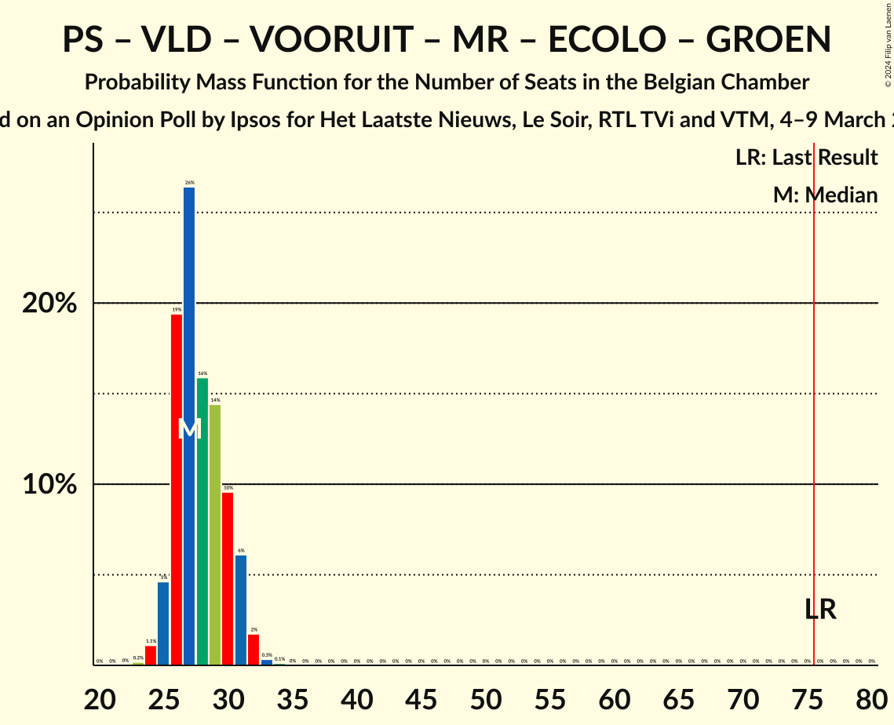

| Number of Seats | Probability | Accumulated | Special Marks |
|:---------------:|:-----------:|:-----------:|:-------------:|
| 23 | 0.2% | 100% |  |
| 24 | 1.1% | 99.8% |  |
| 25 | 5% | 98.7% |  |
| 26 | 19% | 94% |  |
| 27 | 26% | 75% |  |
| 28 | 16% | 48% |  |
| 29 | 14% | 32% |  |
| 30 | 10% | 18% |  |
| 31 | 6% | 8% |  |
| 32 | 2% | 2% |  |
| 33 | 0.3% | 0.5% |  |
| 34 | 0.1% | 0.1% |  |
| 35 | 0% | 0% |  |
| 36 | 0% | 0% |  |
| 37 | 0% | 0% |  |
| 38 | 0% | 0% |  |
| 39 | 0% | 0% |  |
| 40 | 0% | 0% |  |
| 41 | 0% | 0% |  |
| 42 | 0% | 0% |  |
| 43 | 0% | 0% |  |
| 44 | 0% | 0% |  |
| 45 | 0% | 0% |  |
| 46 | 0% | 0% |  |
| 47 | 0% | 0% |  |
| 48 | 0% | 0% |  |
| 49 | 0% | 0% |  |
| 50 | 0% | 0% |  |
| 51 | 0% | 0% |  |
| 52 | 0% | 0% |  |
| 53 | 0% | 0% |  |
| 54 | 0% | 0% |  |
| 55 | 0% | 0% |  |
| 56 | 0% | 0% |  |
| 57 | 0% | 0% |  |
| 58 | 0% | 0% |  |
| 59 | 0% | 0% |  |
| 60 | 0% | 0% |  |
| 61 | 0% | 0% |  |
| 62 | 0% | 0% |  |
| 63 | 0% | 0% |  |
| 64 | 0% | 0% |  |
| 65 | 0% | 0% |  |
| 66 | 0% | 0% |  |
| 67 | 0% | 0% |  |
| 68 | 0% | 0% |  |
| 69 | 0% | 0% |  |
| 70 | 0% | 0% |  |
| 71 | 0% | 0% |  |
| 72 | 0% | 0% | Median |
| 73 | 0% | 0% |  |
| 74 | 0% | 0% |  |
| 75 | 0% | 0% |  |
| 76 | 0% | 0% | Last Result, Majority |

### Parti Socialiste – Vooruit – Parti du Travail de Belgique – Ecolo – Groen – Partij van de Arbeid van België

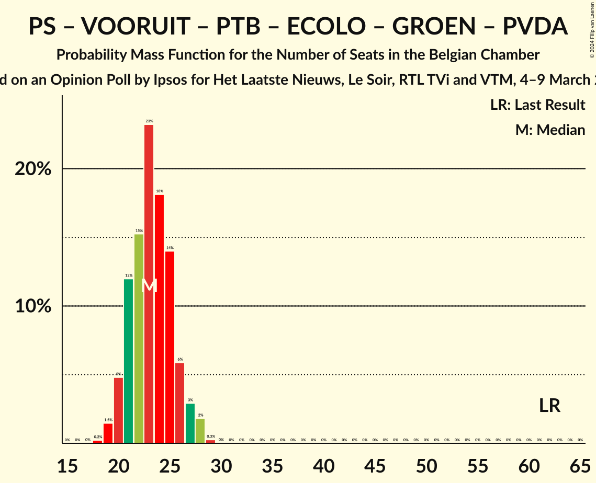

| Number of Seats | Probability | Accumulated | Special Marks |
|:---------------:|:-----------:|:-----------:|:-------------:|
| 18 | 0.2% | 100% |  |
| 19 | 1.5% | 99.8% |  |
| 20 | 5% | 98% |  |
| 21 | 12% | 93% |  |
| 22 | 15% | 82% |  |
| 23 | 23% | 66% |  |
| 24 | 18% | 43% |  |
| 25 | 14% | 25% |  |
| 26 | 6% | 11% |  |
| 27 | 3% | 5% |  |
| 28 | 2% | 2% |  |
| 29 | 0.3% | 0.3% |  |
| 30 | 0% | 0% |  |
| 31 | 0% | 0% |  |
| 32 | 0% | 0% |  |
| 33 | 0% | 0% |  |
| 34 | 0% | 0% |  |
| 35 | 0% | 0% |  |
| 36 | 0% | 0% |  |
| 37 | 0% | 0% |  |
| 38 | 0% | 0% |  |
| 39 | 0% | 0% |  |
| 40 | 0% | 0% |  |
| 41 | 0% | 0% |  |
| 42 | 0% | 0% |  |
| 43 | 0% | 0% |  |
| 44 | 0% | 0% |  |
| 45 | 0% | 0% |  |
| 46 | 0% | 0% |  |
| 47 | 0% | 0% |  |
| 48 | 0% | 0% |  |
| 49 | 0% | 0% |  |
| 50 | 0% | 0% |  |
| 51 | 0% | 0% |  |
| 52 | 0% | 0% |  |
| 53 | 0% | 0% |  |
| 54 | 0% | 0% |  |
| 55 | 0% | 0% |  |
| 56 | 0% | 0% |  |
| 57 | 0% | 0% |  |
| 58 | 0% | 0% |  |
| 59 | 0% | 0% |  |
| 60 | 0% | 0% |  |
| 61 | 0% | 0% |  |
| 62 | 0% | 0% | Last Result |

### Parti Socialiste – Vooruit – Parti du Travail de Belgique – Ecolo – Groen – Partij van de Arbeid van België – Les Engagés

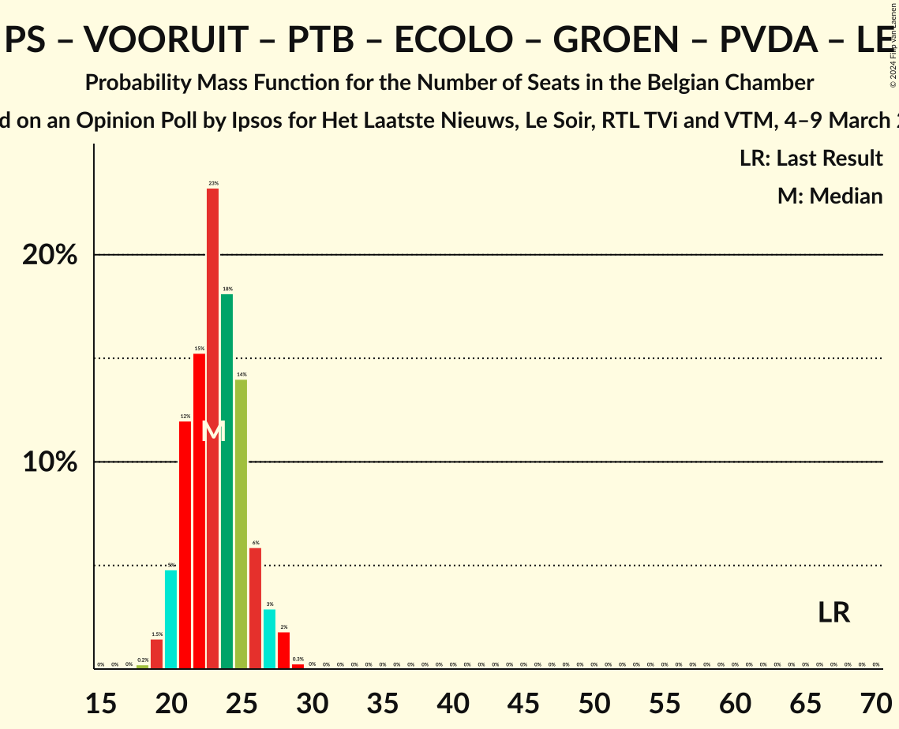

| Number of Seats | Probability | Accumulated | Special Marks |
|:---------------:|:-----------:|:-----------:|:-------------:|
| 18 | 0.2% | 100% |  |
| 19 | 1.5% | 99.8% |  |
| 20 | 5% | 98% |  |
| 21 | 12% | 93% |  |
| 22 | 15% | 82% |  |
| 23 | 23% | 66% |  |
| 24 | 18% | 43% |  |
| 25 | 14% | 25% |  |
| 26 | 6% | 11% |  |
| 27 | 3% | 5% |  |
| 28 | 2% | 2% |  |
| 29 | 0.3% | 0.3% |  |
| 30 | 0% | 0% |  |
| 31 | 0% | 0% |  |
| 32 | 0% | 0% |  |
| 33 | 0% | 0% |  |
| 34 | 0% | 0% |  |
| 35 | 0% | 0% |  |
| 36 | 0% | 0% |  |
| 37 | 0% | 0% |  |
| 38 | 0% | 0% |  |
| 39 | 0% | 0% |  |
| 40 | 0% | 0% |  |
| 41 | 0% | 0% |  |
| 42 | 0% | 0% |  |
| 43 | 0% | 0% |  |
| 44 | 0% | 0% |  |
| 45 | 0% | 0% |  |
| 46 | 0% | 0% |  |
| 47 | 0% | 0% |  |
| 48 | 0% | 0% |  |
| 49 | 0% | 0% |  |
| 50 | 0% | 0% |  |
| 51 | 0% | 0% |  |
| 52 | 0% | 0% |  |
| 53 | 0% | 0% |  |
| 54 | 0% | 0% |  |
| 55 | 0% | 0% |  |
| 56 | 0% | 0% |  |
| 57 | 0% | 0% |  |
| 58 | 0% | 0% |  |
| 59 | 0% | 0% |  |
| 60 | 0% | 0% |  |
| 61 | 0% | 0% |  |
| 62 | 0% | 0% |  |
| 63 | 0% | 0% |  |
| 64 | 0% | 0% |  |
| 65 | 0% | 0% |  |
| 66 | 0% | 0% |  |
| 67 | 0% | 0% | Last Result |

### Christen-Democratisch en Vlaams – Parti Socialiste – Vooruit – Les Engagés

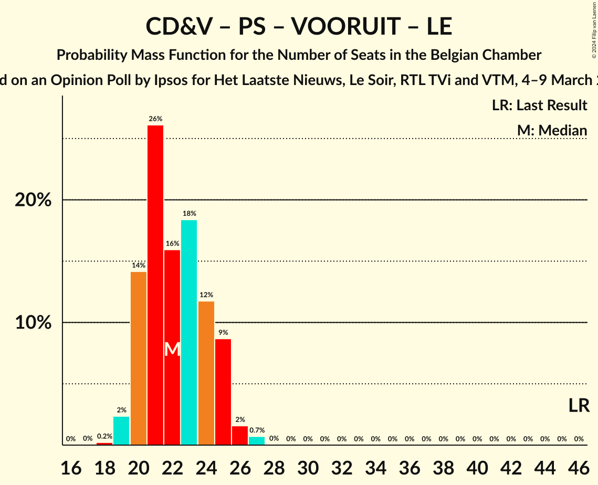

| Number of Seats | Probability | Accumulated | Special Marks |
|:---------------:|:-----------:|:-----------:|:-------------:|
| 17 | 0% | 100% |  |
| 18 | 0.2% | 99.9% |  |
| 19 | 2% | 99.7% |  |
| 20 | 14% | 97% |  |
| 21 | 26% | 83% |  |
| 22 | 16% | 57% |  |
| 23 | 18% | 41% |  |
| 24 | 12% | 23% |  |
| 25 | 9% | 11% |  |
| 26 | 2% | 2% |  |
| 27 | 0.7% | 0.8% |  |
| 28 | 0% | 0.1% |  |
| 29 | 0% | 0% |  |
| 30 | 0% | 0% |  |
| 31 | 0% | 0% |  |
| 32 | 0% | 0% |  |
| 33 | 0% | 0% |  |
| 34 | 0% | 0% |  |
| 35 | 0% | 0% |  |
| 36 | 0% | 0% |  |
| 37 | 0% | 0% |  |
| 38 | 0% | 0% |  |
| 39 | 0% | 0% |  |
| 40 | 0% | 0% |  |
| 41 | 0% | 0% |  |
| 42 | 0% | 0% |  |
| 43 | 0% | 0% | Median |
| 44 | 0% | 0% |  |
| 45 | 0% | 0% |  |
| 46 | 0% | 0% | Last Result |

### Parti Socialiste – Open Vlaamse Liberalen en Democraten – Vooruit – Mouvement Réformateur

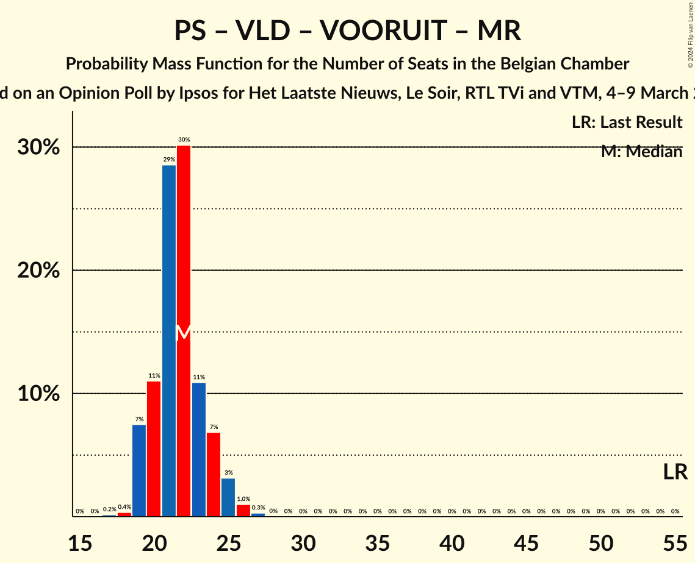

| Number of Seats | Probability | Accumulated | Special Marks |
|:---------------:|:-----------:|:-----------:|:-------------:|
| 17 | 0.2% | 100% |  |
| 18 | 0.4% | 99.8% |  |
| 19 | 7% | 99.5% |  |
| 20 | 11% | 92% |  |
| 21 | 29% | 81% |  |
| 22 | 30% | 52% |  |
| 23 | 11% | 22% |  |
| 24 | 7% | 11% |  |
| 25 | 3% | 4% |  |
| 26 | 1.0% | 1.3% |  |
| 27 | 0.3% | 0.3% |  |
| 28 | 0% | 0% |  |
| 29 | 0% | 0% |  |
| 30 | 0% | 0% |  |
| 31 | 0% | 0% |  |
| 32 | 0% | 0% |  |
| 33 | 0% | 0% |  |
| 34 | 0% | 0% |  |
| 35 | 0% | 0% |  |
| 36 | 0% | 0% |  |
| 37 | 0% | 0% |  |
| 38 | 0% | 0% |  |
| 39 | 0% | 0% |  |
| 40 | 0% | 0% |  |
| 41 | 0% | 0% |  |
| 42 | 0% | 0% |  |
| 43 | 0% | 0% |  |
| 44 | 0% | 0% |  |
| 45 | 0% | 0% |  |
| 46 | 0% | 0% |  |
| 47 | 0% | 0% |  |
| 48 | 0% | 0% |  |
| 49 | 0% | 0% |  |
| 50 | 0% | 0% |  |
| 51 | 0% | 0% |  |
| 52 | 0% | 0% |  |
| 53 | 0% | 0% | Median |
| 54 | 0% | 0% |  |
| 55 | 0% | 0% | Last Result |

## Technical Information

### Opinion Poll

+ **Polling firm:** Ipsos
+ **Commissioner(s):** Het Laatste Nieuws, Le Soir, RTL TVi and VTM
+ **Fieldwork period:** 4–9 March 2021

### Calculations

+ **Sample size:** 1625
+ **Simulations done:** 1,048,576
+ **Error estimate:** 0.94%

