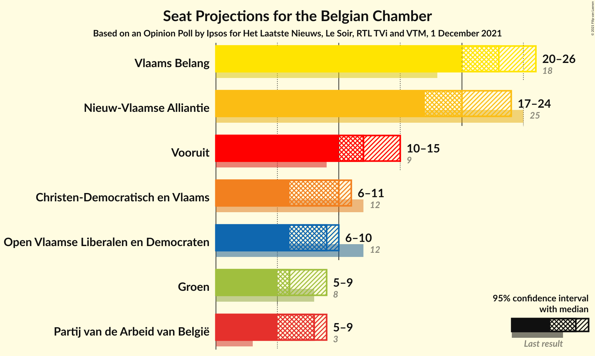
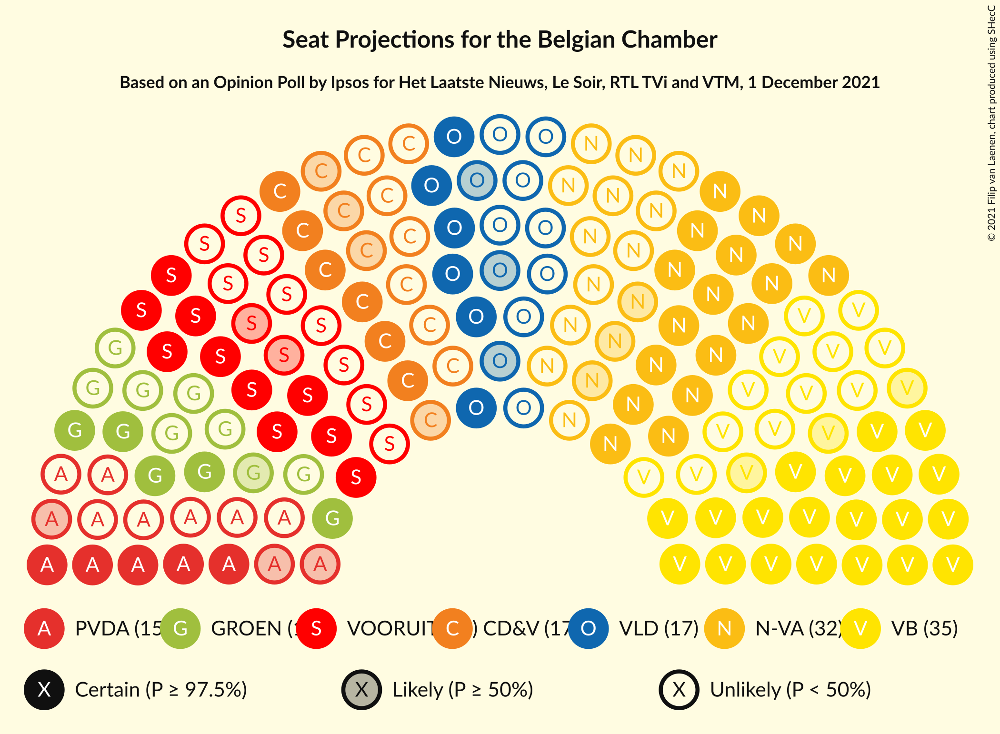
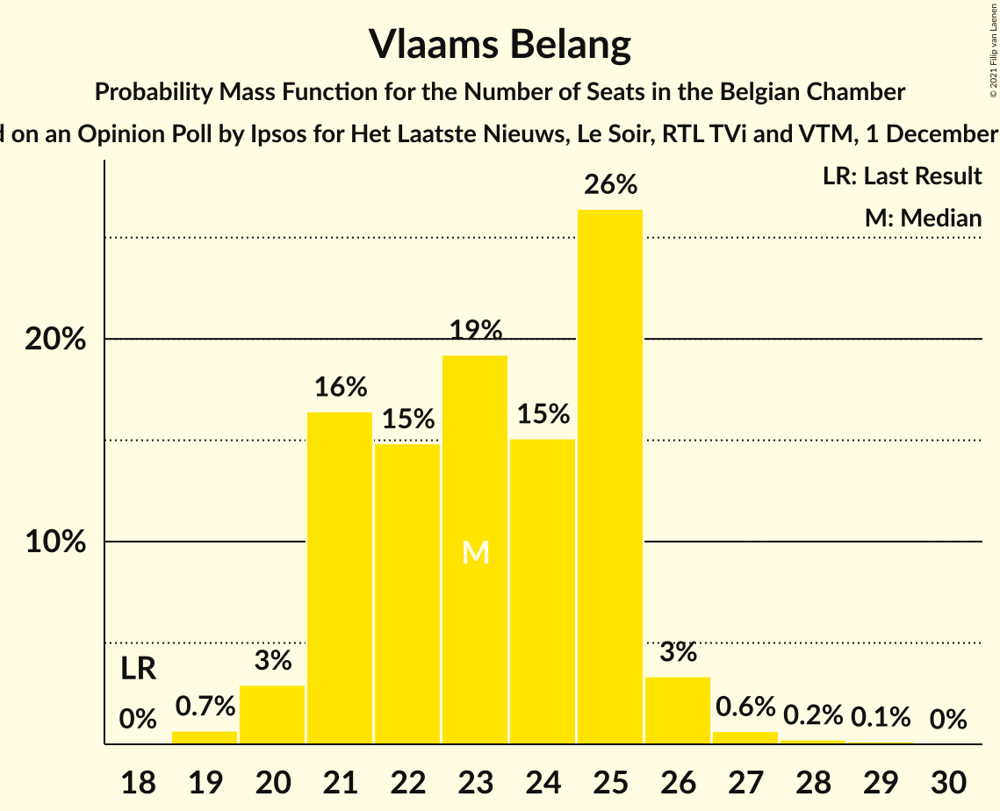
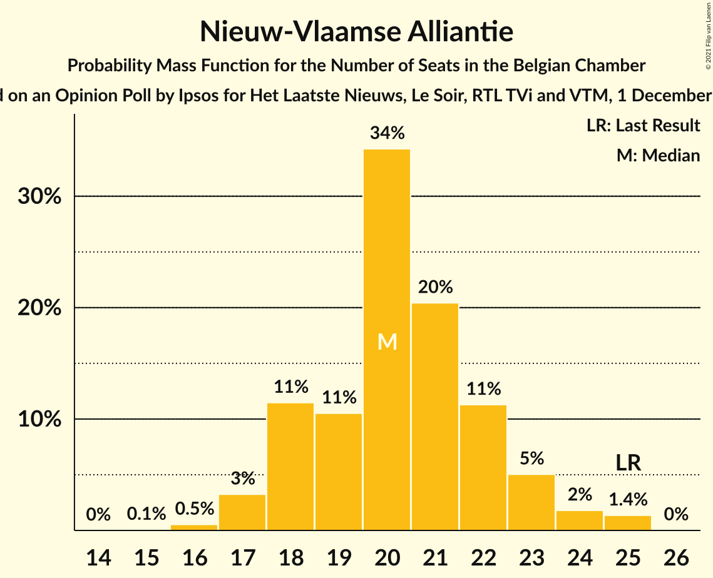
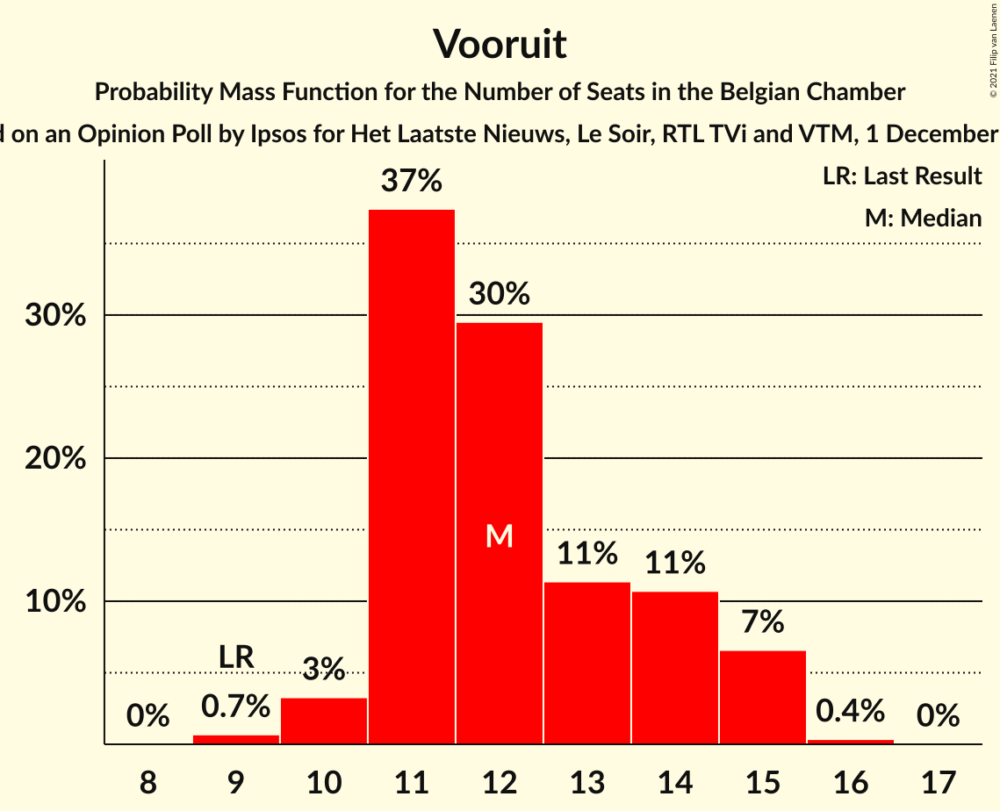
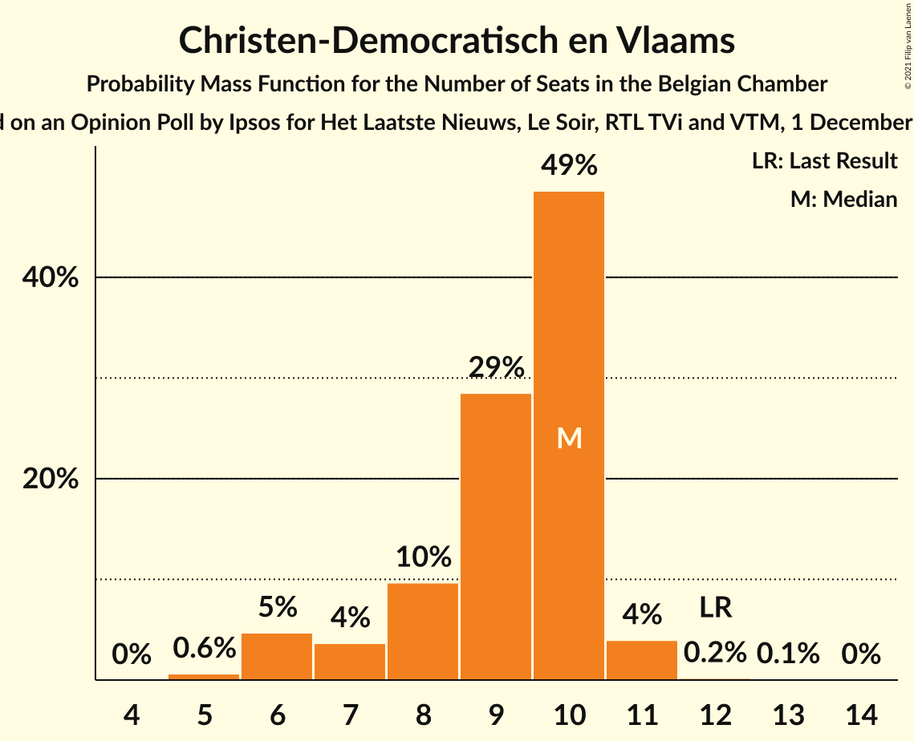
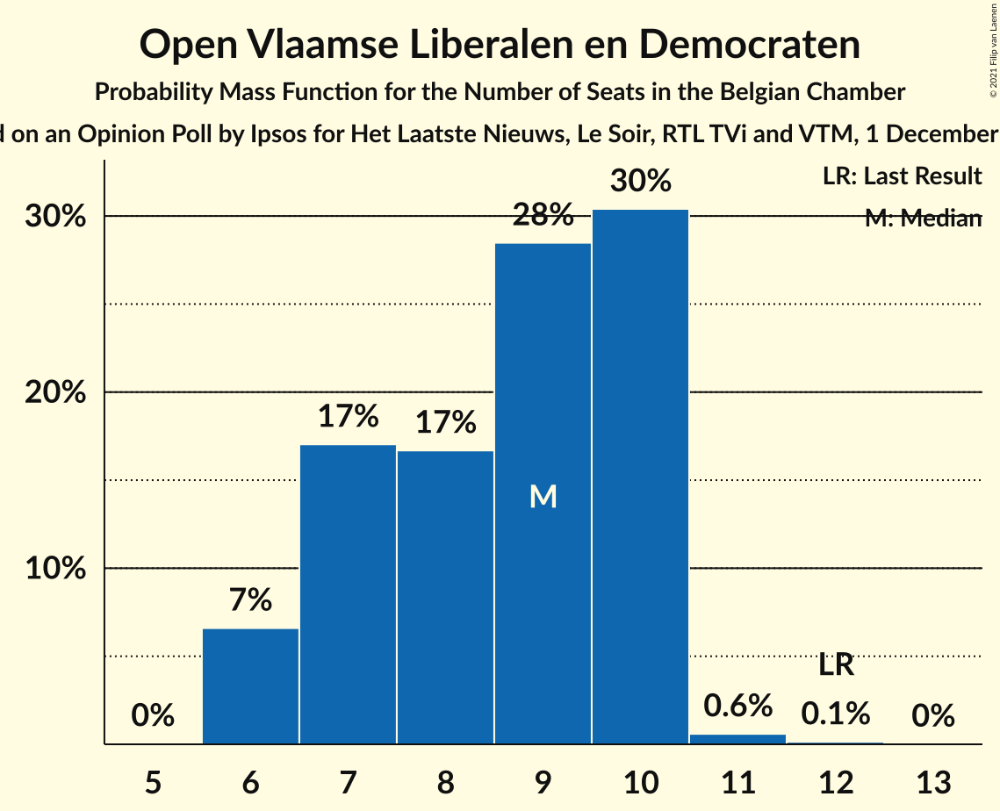
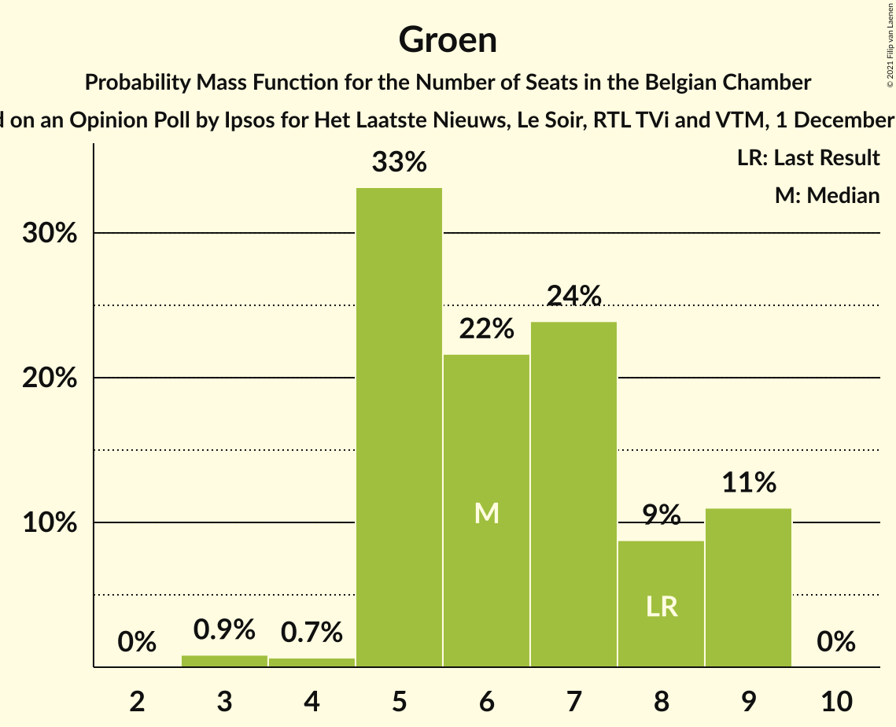
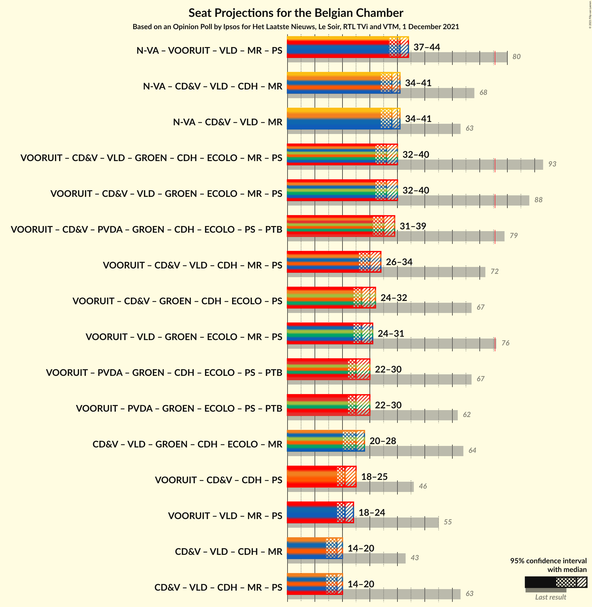

# Opinion Poll by Ipsos for Het Laatste Nieuws, Le Soir, RTL TVi and VTM, 1 December 2021

Areas included: Flanders

<a href="#voting-intentions">Voting Intentions</a> | <a href="#seats">Seats</a> | <a href="#coalitions">Coalitions</a> | <a href="#technical-information">Technical Information</a>

## Voting Intentions

### Confidence Intervals

| Party | Last Result | Poll Result | 80% Confidence Interval | 90% Confidence Interval | 95% Confidence Interval | 99% Confidence Interval |
|:-----:|:-----------:|:-----------:|:-----------------------:|:-----------------------:|:-----------------------:|:-----------------------:|
| Vlaams Belang | 12.0% | 24.5% | N/A |N/A |N/A |N/A |
| Nieuw-Vlaamse Alliantie | 16.0% | 21.6% | N/A |N/A |N/A |N/A |
| Vooruit | 6.7% | 13.9% | N/A |N/A |N/A |N/A |
| Christen-Democratisch en Vlaams | 8.9% | 10.7% | N/A |N/A |N/A |N/A |
| Open Vlaamse Liberalen en Democraten | 8.5% | 10.3% | N/A |N/A |N/A |N/A |
| Partij van de Arbeid van België | 3.3% | 8.9% | N/A |N/A |N/A |N/A |
| Groen | 6.1% | 8.4% | N/A |N/A |N/A |N/A |

*Note:* The poll result column reflects the actual value used in the calculations. Published results may vary slightly, and in addition be rounded to fewer digits.

## Seats

### Confidence Intervals

| Party | Last Result | Median | 80% Confidence Interval | 90% Confidence Interval | 95% Confidence Interval | 99% Confidence Interval |
|:-----:|:-----------:|:------:|:-----------------------:|:-----------------------:|:-----------------------:|:-----------------------:|
| <a href="#vlaams-belang">Vlaams Belang</a> | 18 | 23 | 21–25 |21–25 |20–26 |19–27 |
| <a href="#nieuw-vlaamse-alliantie">Nieuw-Vlaamse Alliantie</a> | 25 | 20 | 18–22 |18–23 |17–24 |16–25 |
| <a href="#vooruit">Vooruit</a> | 9 | 12 | 11–14 |11–15 |10–15 |9–15 |
| <a href="#christen-democratisch-en-vlaams">Christen-Democratisch en Vlaams</a> | 12 | 10 | 8–10 |6–10 |6–11 |5–11 |
| <a href="#open-vlaamse-liberalen-en-democraten">Open Vlaamse Liberalen en Democraten</a> | 12 | 9 | 7–10 |6–10 |6–10 |6–11 |
| <a href="#partij-van-de-arbeid-van-belgië">Partij van de Arbeid van België</a> | 3 | 8 | 5–8 |5–8 |5–9 |5–9 |
| <a href="#groen">Groen</a> | 8 | 6 | 5–9 |5–9 |5–9 |3–9 |

### Vlaams Belang

*For a full overview of the results for this party, see the [Vlaams Belang](party-vlaamsbelang.html) page.*

| Number of Seats | Probability | Accumulated | Special Marks |
|:---------------:|:-----------:|:-----------:|:-------------:|
| 18 | 0% | 100% | Last Result |
| 19 | 0.7% | 100% |  |
| 20 | 3% | 99.3% |  |
| 21 | 16% | 96% |  |
| 22 | 15% | 80% |  |
| 23 | 19% | 65% | Median |
| 24 | 15% | 46% |  |
| 25 | 26% | 31% |  |
| 26 | 3% | 4% |  |
| 27 | 0.6% | 1.0% |  |
| 28 | 0.2% | 0.4% |  |
| 29 | 0.1% | 0.1% |  |
| 30 | 0% | 0% |  |

### Nieuw-Vlaamse Alliantie

*For a full overview of the results for this party, see the [Nieuw-Vlaamse Alliantie](party-nieuw-vlaamsealliantie.html) page.*

| Number of Seats | Probability | Accumulated | Special Marks |
|:---------------:|:-----------:|:-----------:|:-------------:|
| 15 | 0.1% | 100% |  |
| 16 | 0.5% | 99.9% |  |
| 17 | 3% | 99.4% |  |
| 18 | 11% | 96% |  |
| 19 | 11% | 85% |  |
| 20 | 34% | 74% | Median |
| 21 | 20% | 40% |  |
| 22 | 11% | 19% |  |
| 23 | 5% | 8% |  |
| 24 | 2% | 3% |  |
| 25 | 1.4% | 1.4% | Last Result |
| 26 | 0% | 0% |  |

### Vooruit

*For a full overview of the results for this party, see the [Vooruit](party-vooruit.html) page.*

| Number of Seats | Probability | Accumulated | Special Marks |
|:---------------:|:-----------:|:-----------:|:-------------:|
| 9 | 0.7% | 100% | Last Result |
| 10 | 3% | 99.3% |  |
| 11 | 37% | 96% |  |
| 12 | 30% | 59% | Median |
| 13 | 11% | 29% |  |
| 14 | 11% | 18% |  |
| 15 | 7% | 7% |  |
| 16 | 0.4% | 0.4% |  |
| 17 | 0% | 0% |  |

### Christen-Democratisch en Vlaams

*For a full overview of the results for this party, see the [Christen-Democratisch en Vlaams](party-christen-democratischenvlaams.html) page.*

| Number of Seats | Probability | Accumulated | Special Marks |
|:---------------:|:-----------:|:-----------:|:-------------:|
| 5 | 0.6% | 100% |  |
| 6 | 5% | 99.4% |  |
| 7 | 4% | 95% |  |
| 8 | 10% | 91% |  |
| 9 | 29% | 81% |  |
| 10 | 49% | 53% | Median |
| 11 | 4% | 4% |  |
| 12 | 0.2% | 0.3% | Last Result |
| 13 | 0.1% | 0.1% |  |
| 14 | 0% | 0% |  |

### Open Vlaamse Liberalen en Democraten

*For a full overview of the results for this party, see the [Open Vlaamse Liberalen en Democraten](party-openvlaamseliberalenendemocraten.html) page.*

| Number of Seats | Probability | Accumulated | Special Marks |
|:---------------:|:-----------:|:-----------:|:-------------:|
| 5 | 0% | 100% |  |
| 6 | 7% | 99.9% |  |
| 7 | 17% | 93% |  |
| 8 | 17% | 76% |  |
| 9 | 28% | 60% | Median |
| 10 | 30% | 31% |  |
| 11 | 0.6% | 0.7% |  |
| 12 | 0.1% | 0.2% | Last Result |
| 13 | 0% | 0% |  |

### Partij van de Arbeid van België

*For a full overview of the results for this party, see the [Partij van de Arbeid van België](party-partijvandearbeidvanbelgië.html) page.*

| Number of Seats | Probability | Accumulated | Special Marks |
|:---------------:|:-----------:|:-----------:|:-------------:|
| 3 | 0% | 100% | Last Result |
| 4 | 0.1% | 100% |  |
| 5 | 18% | 99.8% |  |
| 6 | 5% | 82% |  |
| 7 | 19% | 76% |  |
| 8 | 53% | 57% | Median |
| 9 | 4% | 4% |  |
| 10 | 0.3% | 0.3% |  |
| 11 | 0% | 0% |  |

### Groen

*For a full overview of the results for this party, see the [Groen](party-groen.html) page.*

| Number of Seats | Probability | Accumulated | Special Marks |
|:---------------:|:-----------:|:-----------:|:-------------:|
| 3 | 0.9% | 100% |  |
| 4 | 0.7% | 99.1% |  |
| 5 | 33% | 98% |  |
| 6 | 22% | 65% | Median |
| 7 | 24% | 44% |  |
| 8 | 9% | 20% | Last Result |
| 9 | 11% | 11% |  |
| 10 | 0% | 0% |  |

## Coalitions

### Confidence Intervals

| Coalition | Last Result | Median | Majority? | 80% Confidence Interval | 90% Confidence Interval | 95% Confidence Interval | 99% Confidence Interval |
|:---------:|:-----------:|:------:|:---------:|:-----------------------:|:-----------------------:|:-----------------------:|:-----------------------:|

## Technical Information

### Opinion Poll

+ **Polling firm:** Ipsos
+ **Commissioner(s):** Het Laatste Nieuws, Le Soir, RTL TVi and VTM
+ **Fieldwork period:** 1 December 2021

### Calculations

+ **Sample size:** 1000
+ **Simulations done:** 1,048,576
+ **Error estimate:** 1.45%

