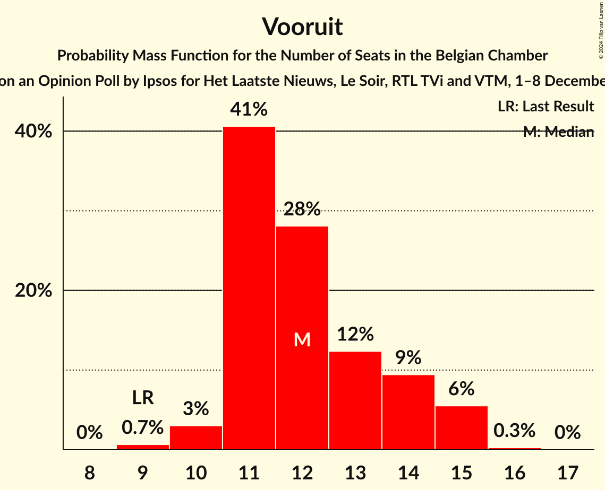

# Opinion Poll by Ipsos for Het Laatste Nieuws, Le Soir, RTL TVi and VTM, 1–8 December 2021

Areas included: Brussels, Flanders, Wallonia

<a href="#voting-intentions">Voting Intentions</a> | <a href="#seats">Seats</a> | <a href="#coalitions">Coalitions</a> | <a href="#technical-information">Technical Information</a>

## Voting Intentions

### Confidence Intervals

| Party | Last Result | Poll Result | 80% Confidence Interval | 90% Confidence Interval | 95% Confidence Interval | 99% Confidence Interval |
|:-----:|:-----------:|:-----------:|:-----------------------:|:-----------------------:|:-----------------------:|:-----------------------:|
| Vlaams Belang | 12.0% | 15.4% | 13.6–14.4% |13.4–14.4% |13.2–14.5% |12.8–14.5% |
| Nieuw-Vlaamse Alliantie | 16.0% | 13.6% | 11.9–12.7% |11.7–12.7% |11.5–12.7% |11.1–12.7% |
| Parti Socialiste | 9.5% | 8.8% | 7.7–8.2% |7.6–8.2% |7.6–8.2% |7.4–8.2% |
| Vooruit | 6.7% | 8.6% | 7.7–9.2% |7.5–9.3% |7.3–9.4% |6.9–9.5% |
| Mouvement Réformateur | 7.6% | 8.1% | 7.1–7.5% |7.0–7.5% |6.9–7.5% |6.8–7.5% |
| Christen-Democratisch en Vlaams | 8.9% | 6.7% | 5.5–6.1% |5.3–6.1% |5.2–6.1% |5.0–6.1% |
| Parti du Travail de Belgique | 4.8% | 6.7% | 5.8–6.1% |5.7–6.2% |5.6–6.2% |5.5–6.2% |
| Open Vlaamse Liberalen en Democraten | 8.5% | 6.6% | 5.4–5.9% |5.2–6.0% |5.1–6.0% |4.9–6.0% |
| Ecolo | 6.1% | 6.3% | 5.4–5.7% |5.3–5.7% |5.2–5.7% |5.1–5.7% |
| Partij van de Arbeid van België | 3.3% | 5.5% | 4.8–6.0% |4.6–6.2% |4.5–6.2% |4.2–6.3% |
| Groen | 6.1% | 5.2% | 4.5–5.7% |4.4–5.8% |4.2–5.9% |3.9–5.9% |
| Les Engagés | 3.7% | 2.8% | 2.2–2.5% |2.2–2.5% |2.1–2.5% |2.0–2.5% |
| DéFI | 2.2% | 2.1% | 1.6–1.8% |1.6–1.8% |1.6–1.8% |1.5–1.8% |

*Note:* The poll result column reflects the actual value used in the calculations. Published results may vary slightly, and in addition be rounded to fewer digits.

## Seats

### Confidence Intervals

| Party | Last Result | Median | 80% Confidence Interval | 90% Confidence Interval | 95% Confidence Interval | 99% Confidence Interval |
|:-----:|:-----------:|:------:|:-----------------------:|:-----------------------:|:-----------------------:|:-----------------------:|
| <a href="#vlaams-belang">Vlaams Belang</a> | 18 | 23 | 21–25 |21–25 |20–26 |19–27 |
| <a href="#nieuw-vlaamse-alliantie">Nieuw-Vlaamse Alliantie</a> | 25 | 20 | 18–22 |18–22 |17–23 |16–25 |
| <a href="#parti-socialiste">Parti Socialiste</a> | 20 | 17 | 16–19 |15–19 |15–20 |14–20 |
| <a href="#vooruit">Vooruit</a> | 9 | 12 | 11–14 |11–15 |10–15 |9–15 |
| <a href="#mouvement-réformateur">Mouvement Réformateur</a> | 14 | 16 | 14–17 |14–18 |13–18 |13–18 |
| <a href="#christen-democratisch-en-vlaams">Christen-Democratisch en Vlaams</a> | 12 | 10 | 8–10 |7–11 |6–11 |5–11 |
| <a href="#parti-du-travail-de-belgique">Parti du Travail de Belgique</a> | 9 | 12 | 11–13 |10–13 |10–13 |10–14 |
| <a href="#open-vlaamse-liberalen-en-democraten">Open Vlaamse Liberalen en Democraten</a> | 12 | 9 | 7–10 |6–10 |6–10 |6–11 |
| <a href="#ecolo">Ecolo</a> | 13 | 12 | 10–13 |10–13 |10–14 |10–14 |
| <a href="#partij-van-de-arbeid-van-belgië">Partij van de Arbeid van België</a> | 3 | 8 | 5–8 |5–8 |5–9 |5–9 |
| <a href="#groen">Groen</a> | 8 | 6 | 5–8 |5–9 |5–9 |4–9 |
| <a href="#les-engagés">Les Engagés</a> | 5 | 5 | 4–5 |3–5 |2–5 |1–5 |
| <a href="#défi">DéFI</a> | 2 | 2 | 1–2 |1–3 |1–3 |1–4 |

### Vlaams Belang

*For a full overview of the results for this party, see the [Vlaams Belang](party-vlaamsbelang.html) page.*

| Number of Seats | Probability | Accumulated | Special Marks |
|:---------------:|:-----------:|:-----------:|:-------------:|
| 18 | 0% | 100% | Last Result |
| 19 | 0.8% | 100% |  |
| 20 | 3% | 99.2% |  |
| 21 | 15% | 96% |  |
| 22 | 16% | 82% |  |
| 23 | 17% | 66% | Median |
| 24 | 17% | 49% |  |
| 25 | 29% | 33% |  |
| 26 | 3% | 4% |  |
| 27 | 0.7% | 1.0% |  |
| 28 | 0.3% | 0.4% |  |
| 29 | 0.1% | 0.1% |  |
| 30 | 0% | 0% |  |

### Nieuw-Vlaamse Alliantie

*For a full overview of the results for this party, see the [Nieuw-Vlaamse Alliantie](party-nieuw-vlaamsealliantie.html) page.*

| Number of Seats | Probability | Accumulated | Special Marks |
|:---------------:|:-----------:|:-----------:|:-------------:|
| 15 | 0.1% | 100% |  |
| 16 | 0.5% | 99.9% |  |
| 17 | 2% | 99.4% |  |
| 18 | 10% | 97% |  |
| 19 | 10% | 87% |  |
| 20 | 37% | 77% | Median |
| 21 | 25% | 40% |  |
| 22 | 11% | 15% |  |
| 23 | 3% | 5% |  |
| 24 | 1.1% | 2% |  |
| 25 | 0.9% | 1.0% | Last Result |
| 26 | 0.1% | 0.1% |  |
| 27 | 0% | 0% |  |

### Parti Socialiste

*For a full overview of the results for this party, see the [Parti Socialiste](party-partisocialiste.html) page.*

| Number of Seats | Probability | Accumulated | Special Marks |
|:---------------:|:-----------:|:-----------:|:-------------:|
| 14 | 0.9% | 100% |  |
| 15 | 5% | 99.1% |  |
| 16 | 19% | 94% |  |
| 17 | 40% | 75% | Median |
| 18 | 24% | 36% |  |
| 19 | 8% | 11% |  |
| 20 | 3% | 4% | Last Result |
| 21 | 0.1% | 0.1% |  |
| 22 | 0% | 0% |  |

### Vooruit

*For a full overview of the results for this party, see the [Vooruit](party-vooruit.html) page.*

| Number of Seats | Probability | Accumulated | Special Marks |
|:---------------:|:-----------:|:-----------:|:-------------:|
| 9 | 0.7% | 100% | Last Result |
| 10 | 3% | 99.3% |  |
| 11 | 41% | 96% |  |
| 12 | 28% | 56% | Median |
| 13 | 12% | 28% |  |
| 14 | 9% | 15% |  |
| 15 | 6% | 6% |  |
| 16 | 0.3% | 0.3% |  |
| 17 | 0% | 0% |  |

### Mouvement Réformateur

*For a full overview of the results for this party, see the [Mouvement Réformateur](party-mouvementréformateur.html) page.*

| Number of Seats | Probability | Accumulated | Special Marks |
|:---------------:|:-----------:|:-----------:|:-------------:|
| 12 | 0.1% | 100% |  |
| 13 | 3% | 99.9% |  |
| 14 | 19% | 97% | Last Result |
| 15 | 20% | 79% |  |
| 16 | 18% | 59% | Median |
| 17 | 33% | 41% |  |
| 18 | 8% | 8% |  |
| 19 | 0.3% | 0.3% |  |
| 20 | 0% | 0% |  |

### Christen-Democratisch en Vlaams

*For a full overview of the results for this party, see the [Christen-Democratisch en Vlaams](party-christen-democratischenvlaams.html) page.*

| Number of Seats | Probability | Accumulated | Special Marks |
|:---------------:|:-----------:|:-----------:|:-------------:|
| 5 | 0.6% | 100% |  |
| 6 | 4% | 99.4% |  |
| 7 | 5% | 95% |  |
| 8 | 7% | 90% |  |
| 9 | 25% | 83% |  |
| 10 | 52% | 58% | Median |
| 11 | 5% | 6% |  |
| 12 | 0.3% | 0.4% | Last Result |
| 13 | 0.1% | 0.1% |  |
| 14 | 0% | 0% |  |

### Parti du Travail de Belgique

*For a full overview of the results for this party, see the [Parti du Travail de Belgique](party-partidutravaildebelgique.html) page.*

| Number of Seats | Probability | Accumulated | Special Marks |
|:---------------:|:-----------:|:-----------:|:-------------:|
| 9 | 0.3% | 100% | Last Result |
| 10 | 8% | 99.7% |  |
| 11 | 33% | 91% |  |
| 12 | 42% | 58% | Median |
| 13 | 16% | 17% |  |
| 14 | 1.0% | 1.2% |  |
| 15 | 0.2% | 0.2% |  |
| 16 | 0% | 0% |  |

### Open Vlaamse Liberalen en Democraten

*For a full overview of the results for this party, see the [Open Vlaamse Liberalen en Democraten](party-openvlaamseliberalenendemocraten.html) page.*

| Number of Seats | Probability | Accumulated | Special Marks |
|:---------------:|:-----------:|:-----------:|:-------------:|
| 5 | 0% | 100% |  |
| 6 | 7% | 99.9% |  |
| 7 | 18% | 93% |  |
| 8 | 16% | 75% |  |
| 9 | 28% | 59% | Median |
| 10 | 30% | 31% |  |
| 11 | 1.3% | 1.5% |  |
| 12 | 0.2% | 0.2% | Last Result |
| 13 | 0% | 0% |  |

### Ecolo

*For a full overview of the results for this party, see the [Ecolo](party-ecolo.html) page.*

| Number of Seats | Probability | Accumulated | Special Marks |
|:---------------:|:-----------:|:-----------:|:-------------:|
| 9 | 0.2% | 100% |  |
| 10 | 10% | 99.8% |  |
| 11 | 30% | 89% |  |
| 12 | 29% | 59% | Median |
| 13 | 27% | 30% | Last Result |
| 14 | 3% | 3% |  |
| 15 | 0.1% | 0.1% |  |
| 16 | 0% | 0% |  |

### Partij van de Arbeid van België

*For a full overview of the results for this party, see the [Partij van de Arbeid van België](party-partijvandearbeidvanbelgië.html) page.*

| Number of Seats | Probability | Accumulated | Special Marks |
|:---------------:|:-----------:|:-----------:|:-------------:|
| 3 | 0% | 100% | Last Result |
| 4 | 0.2% | 100% |  |
| 5 | 12% | 99.8% |  |
| 6 | 6% | 87% |  |
| 7 | 21% | 81% |  |
| 8 | 56% | 60% | Median |
| 9 | 4% | 4% |  |
| 10 | 0.2% | 0.2% |  |
| 11 | 0% | 0% |  |

### Groen

*For a full overview of the results for this party, see the [Groen](party-groen.html) page.*

| Number of Seats | Probability | Accumulated | Special Marks |
|:---------------:|:-----------:|:-----------:|:-------------:|
| 3 | 0.5% | 100% |  |
| 4 | 0.4% | 99.5% |  |
| 5 | 35% | 99.1% |  |
| 6 | 21% | 64% | Median |
| 7 | 25% | 43% |  |
| 8 | 10% | 18% | Last Result |
| 9 | 7% | 7% |  |
| 10 | 0% | 0% |  |

### Les Engagés

*For a full overview of the results for this party, see the [Les Engagés](party-lesengagés.html) page.*

| Number of Seats | Probability | Accumulated | Special Marks |
|:---------------:|:-----------:|:-----------:|:-------------:|
| 0 | 0.3% | 100% |  |
| 1 | 1.5% | 99.7% |  |
| 2 | 2% | 98% |  |
| 3 | 3% | 96% |  |
| 4 | 38% | 93% |  |
| 5 | 55% | 55% | Last Result, Median |
| 6 | 0% | 0% |  |

### DéFI

*For a full overview of the results for this party, see the [DéFI](party-défi.html) page.*

| Number of Seats | Probability | Accumulated | Special Marks |
|:---------------:|:-----------:|:-----------:|:-------------:|
| 1 | 12% | 100% |  |
| 2 | 81% | 88% | Last Result, Median |
| 3 | 6% | 6% |  |
| 4 | 0.7% | 0.7% |  |
| 5 | 0% | 0% |  |

## Coalitions

### Confidence Intervals

| Coalition | Last Result | Median | Majority? | 80% Confidence Interval | 90% Confidence Interval | 95% Confidence Interval | 99% Confidence Interval |
|:---------:|:-----------:|:------:|:---------:|:-----------------------:|:-----------------------:|:-----------------------:|:-----------------------:|
| Parti Socialiste – Vooruit – Mouvement Réformateur – Christen-Democratisch en Vlaams – Open Vlaamse Liberalen en Democraten – Ecolo – Groen – Les Engagés | 93 | 85 | 100% | 83–88 | 82–89 | 81–90 | 80–91 |
| Parti Socialiste – Vooruit – Mouvement Réformateur – Christen-Democratisch en Vlaams – Open Vlaamse Liberalen en Democraten – Ecolo – Groen | 88 | 81 | 99.5% | 78–84 | 77–85 | 77–86 | 76–87 |
| Parti Socialiste – Vooruit – Christen-Democratisch en Vlaams – Parti du Travail de Belgique – Ecolo – Partij van de Arbeid van België – Groen – Les Engagés | 79 | 80 | 98% | 77–83 | 76–84 | 76–85 | 74–86 |
| Nieuw-Vlaamse Alliantie – Parti Socialiste – Vooruit – Mouvement Réformateur – Open Vlaamse Liberalen en Democraten | 80 | 74 | 24% | 71–77 | 70–78 | 70–78 | 68–80 |
| Parti Socialiste – Vooruit – Mouvement Réformateur – Open Vlaamse Liberalen en Democraten – Ecolo – Groen | 76 | 72 | 6% | 69–75 | 68–76 | 68–76 | 67–78 |
| Parti Socialiste – Vooruit – Parti du Travail de Belgique – Ecolo – Partij van de Arbeid van België – Groen – Les Engagés | 67 | 71 | 3% | 68–74 | 67–75 | 66–76 | 65–77 |
| Parti Socialiste – Vooruit – Mouvement Réformateur – Christen-Democratisch en Vlaams – Open Vlaamse Liberalen en Democraten – Les Engagés | 72 | 67 | 0% | 64–70 | 64–71 | 63–72 | 62–73 |
| Parti Socialiste – Vooruit – Parti du Travail de Belgique – Ecolo – Partij van de Arbeid van België – Groen | 62 | 66 | 0% | 63–69 | 63–70 | 62–71 | 61–73 |
| Parti Socialiste – Vooruit – Christen-Democratisch en Vlaams – Ecolo – Groen – Les Engagés | 67 | 61 | 0% | 58–64 | 57–65 | 57–66 | 55–67 |
| Nieuw-Vlaamse Alliantie – Mouvement Réformateur – Christen-Democratisch en Vlaams – Open Vlaamse Liberalen en Democraten – Les Engagés | 68 | 58 | 0% | 55–62 | 54–62 | 54–63 | 52–64 |
| Mouvement Réformateur – Christen-Democratisch en Vlaams – Open Vlaamse Liberalen en Democraten – Ecolo – Groen – Les Engagés | 64 | 56 | 0% | 53–59 | 53–60 | 52–61 | 50–62 |
| Parti Socialiste – Mouvement Réformateur – Christen-Democratisch en Vlaams – Open Vlaamse Liberalen en Democraten – Les Engagés | 63 | 55 | 0% | 53–58 | 52–59 | 51–59 | 50–60 |
| Parti Socialiste – Vooruit – Mouvement Réformateur – Open Vlaamse Liberalen en Democraten | 55 | 54 | 0% | 51–56 | 50–57 | 50–58 | 49–59 |
| Nieuw-Vlaamse Alliantie – Mouvement Réformateur – Christen-Democratisch en Vlaams – Open Vlaamse Liberalen en Democraten | 63 | 54 | 0% | 51–57 | 50–58 | 49–58 | 48–60 |
| Parti Socialiste – Vooruit – Christen-Democratisch en Vlaams – Les Engagés | 46 | 43 | 0% | 40–46 | 40–46 | 39–47 | 37–48 |
| Mouvement Réformateur – Christen-Democratisch en Vlaams – Open Vlaamse Liberalen en Democraten – Les Engagés | 43 | 38 | 0% | 35–41 | 34–42 | 34–42 | 32–43 |

### Parti Socialiste – Vooruit – Mouvement Réformateur – Christen-Democratisch en Vlaams – Open Vlaamse Liberalen en Democraten – Ecolo – Groen – Les Engagés

| Number of Seats | Probability | Accumulated | Special Marks |
|:---------------:|:-----------:|:-----------:|:-------------:|
| 79 | 0.2% | 100% |  |
| 80 | 0.7% | 99.8% |  |
| 81 | 2% | 99.1% |  |
| 82 | 5% | 97% |  |
| 83 | 10% | 92% |  |
| 84 | 15% | 82% |  |
| 85 | 18% | 67% |  |
| 86 | 18% | 49% |  |
| 87 | 14% | 31% | Median |
| 88 | 9% | 17% |  |
| 89 | 5% | 9% |  |
| 90 | 3% | 4% |  |
| 91 | 0.9% | 1.2% |  |
| 92 | 0.2% | 0.3% |  |
| 93 | 0% | 0% | Last Result |

### Parti Socialiste – Vooruit – Mouvement Réformateur – Christen-Democratisch en Vlaams – Open Vlaamse Liberalen en Democraten – Ecolo – Groen

| Number of Seats | Probability | Accumulated | Special Marks |
|:---------------:|:-----------:|:-----------:|:-------------:|
| 74 | 0.1% | 100% |  |
| 75 | 0.4% | 99.9% |  |
| 76 | 1.3% | 99.5% | Majority |
| 77 | 3% | 98% |  |
| 78 | 7% | 95% |  |
| 79 | 12% | 88% |  |
| 80 | 16% | 76% |  |
| 81 | 18% | 60% |  |
| 82 | 16% | 42% | Median |
| 83 | 11% | 25% |  |
| 84 | 7% | 14% |  |
| 85 | 4% | 7% |  |
| 86 | 2% | 3% |  |
| 87 | 0.7% | 1.0% |  |
| 88 | 0.2% | 0.3% | Last Result |
| 89 | 0.1% | 0.1% |  |
| 90 | 0% | 0% |  |

### Parti Socialiste – Vooruit – Christen-Democratisch en Vlaams – Parti du Travail de Belgique – Ecolo – Partij van de Arbeid van België – Groen – Les Engagés

| Number of Seats | Probability | Accumulated | Special Marks |
|:---------------:|:-----------:|:-----------:|:-------------:|
| 72 | 0% | 100% |  |
| 73 | 0.2% | 99.9% |  |
| 74 | 0.6% | 99.8% |  |
| 75 | 2% | 99.2% |  |
| 76 | 4% | 98% | Majority |
| 77 | 7% | 94% |  |
| 78 | 13% | 87% |  |
| 79 | 16% | 75% | Last Result |
| 80 | 17% | 58% |  |
| 81 | 15% | 42% |  |
| 82 | 12% | 27% | Median |
| 83 | 7% | 15% |  |
| 84 | 4% | 7% |  |
| 85 | 2% | 3% |  |
| 86 | 0.9% | 1.3% |  |
| 87 | 0.3% | 0.4% |  |
| 88 | 0.1% | 0.1% |  |
| 89 | 0% | 0% |  |

### Nieuw-Vlaamse Alliantie – Parti Socialiste – Vooruit – Mouvement Réformateur – Open Vlaamse Liberalen en Democraten

| Number of Seats | Probability | Accumulated | Special Marks |
|:---------------:|:-----------:|:-----------:|:-------------:|
| 67 | 0.1% | 100% |  |
| 68 | 0.5% | 99.9% |  |
| 69 | 2% | 99.4% |  |
| 70 | 4% | 98% |  |
| 71 | 9% | 93% |  |
| 72 | 13% | 85% |  |
| 73 | 16% | 72% |  |
| 74 | 17% | 56% | Median |
| 75 | 15% | 39% |  |
| 76 | 11% | 24% | Majority |
| 77 | 7% | 13% |  |
| 78 | 3% | 6% |  |
| 79 | 2% | 2% |  |
| 80 | 0.6% | 0.9% | Last Result |
| 81 | 0.2% | 0.3% |  |
| 82 | 0.1% | 0.1% |  |
| 83 | 0% | 0% |  |

### Parti Socialiste – Vooruit – Mouvement Réformateur – Open Vlaamse Liberalen en Democraten – Ecolo – Groen

| Number of Seats | Probability | Accumulated | Special Marks |
|:---------------:|:-----------:|:-----------:|:-------------:|
| 65 | 0.1% | 100% |  |
| 66 | 0.3% | 99.9% |  |
| 67 | 2% | 99.6% |  |
| 68 | 5% | 98% |  |
| 69 | 10% | 93% |  |
| 70 | 14% | 84% |  |
| 71 | 17% | 70% |  |
| 72 | 17% | 53% | Median |
| 73 | 14% | 35% |  |
| 74 | 9% | 22% |  |
| 75 | 6% | 12% |  |
| 76 | 4% | 6% | Last Result, Majority |
| 77 | 2% | 2% |  |
| 78 | 0.5% | 0.8% |  |
| 79 | 0.2% | 0.2% |  |
| 80 | 0% | 0.1% |  |
| 81 | 0% | 0% |  |

### Parti Socialiste – Vooruit – Parti du Travail de Belgique – Ecolo – Partij van de Arbeid van België – Groen – Les Engagés

| Number of Seats | Probability | Accumulated | Special Marks |
|:---------------:|:-----------:|:-----------:|:-------------:|
| 64 | 0.1% | 100% |  |
| 65 | 0.6% | 99.9% |  |
| 66 | 2% | 99.2% |  |
| 67 | 4% | 97% | Last Result |
| 68 | 10% | 93% |  |
| 69 | 14% | 83% |  |
| 70 | 17% | 69% |  |
| 71 | 16% | 52% |  |
| 72 | 14% | 36% | Median |
| 73 | 10% | 22% |  |
| 74 | 6% | 12% |  |
| 75 | 4% | 6% |  |
| 76 | 2% | 3% | Majority |
| 77 | 0.6% | 0.9% |  |
| 78 | 0.2% | 0.2% |  |
| 79 | 0% | 0% |  |

### Parti Socialiste – Vooruit – Mouvement Réformateur – Christen-Democratisch en Vlaams – Open Vlaamse Liberalen en Democraten – Les Engagés

| Number of Seats | Probability | Accumulated | Special Marks |
|:---------------:|:-----------:|:-----------:|:-------------:|
| 60 | 0.1% | 100% |  |
| 61 | 0.3% | 99.9% |  |
| 62 | 1.1% | 99.6% |  |
| 63 | 3% | 98% |  |
| 64 | 6% | 96% |  |
| 65 | 10% | 90% |  |
| 66 | 14% | 80% |  |
| 67 | 17% | 65% |  |
| 68 | 17% | 48% |  |
| 69 | 14% | 31% | Median |
| 70 | 9% | 17% |  |
| 71 | 5% | 8% |  |
| 72 | 2% | 3% | Last Result |
| 73 | 0.9% | 1.1% |  |
| 74 | 0.2% | 0.2% |  |
| 75 | 0% | 0% |  |

### Parti Socialiste – Vooruit – Parti du Travail de Belgique – Ecolo – Partij van de Arbeid van België – Groen

| Number of Seats | Probability | Accumulated | Special Marks |
|:---------------:|:-----------:|:-----------:|:-------------:|
| 59 | 0% | 100% |  |
| 60 | 0.3% | 99.9% |  |
| 61 | 1.2% | 99.6% |  |
| 62 | 3% | 98% | Last Result |
| 63 | 7% | 95% |  |
| 64 | 12% | 89% |  |
| 65 | 15% | 77% |  |
| 66 | 16% | 62% |  |
| 67 | 15% | 46% | Median |
| 68 | 13% | 30% |  |
| 69 | 8% | 18% |  |
| 70 | 5% | 10% |  |
| 71 | 3% | 5% |  |
| 72 | 1.2% | 2% |  |
| 73 | 0.4% | 0.6% |  |
| 74 | 0.1% | 0.2% |  |
| 75 | 0% | 0% |  |

### Parti Socialiste – Vooruit – Christen-Democratisch en Vlaams – Ecolo – Groen – Les Engagés

| Number of Seats | Probability | Accumulated | Special Marks |
|:---------------:|:-----------:|:-----------:|:-------------:|
| 54 | 0.2% | 100% |  |
| 55 | 0.5% | 99.8% |  |
| 56 | 1.3% | 99.3% |  |
| 57 | 3% | 98% |  |
| 58 | 7% | 95% |  |
| 59 | 13% | 88% |  |
| 60 | 16% | 75% |  |
| 61 | 17% | 58% |  |
| 62 | 16% | 41% | Median |
| 63 | 11% | 25% |  |
| 64 | 7% | 14% |  |
| 65 | 4% | 7% |  |
| 66 | 2% | 3% |  |
| 67 | 0.8% | 1.1% | Last Result |
| 68 | 0.2% | 0.3% |  |
| 69 | 0% | 0.1% |  |
| 70 | 0% | 0% |  |

### Nieuw-Vlaamse Alliantie – Mouvement Réformateur – Christen-Democratisch en Vlaams – Open Vlaamse Liberalen en Democraten – Les Engagés

| Number of Seats | Probability | Accumulated | Special Marks |
|:---------------:|:-----------:|:-----------:|:-------------:|
| 51 | 0.2% | 100% |  |
| 52 | 0.5% | 99.8% |  |
| 53 | 1.4% | 99.3% |  |
| 54 | 3% | 98% |  |
| 55 | 6% | 95% |  |
| 56 | 10% | 88% |  |
| 57 | 13% | 78% |  |
| 58 | 16% | 65% |  |
| 59 | 16% | 49% |  |
| 60 | 13% | 33% | Median |
| 61 | 9% | 20% |  |
| 62 | 6% | 11% |  |
| 63 | 3% | 4% |  |
| 64 | 0.9% | 1.2% |  |
| 65 | 0.2% | 0.3% |  |
| 66 | 0.1% | 0.1% |  |
| 67 | 0% | 0% |  |
| 68 | 0% | 0% | Last Result |

### Mouvement Réformateur – Christen-Democratisch en Vlaams – Open Vlaamse Liberalen en Democraten – Ecolo – Groen – Les Engagés

| Number of Seats | Probability | Accumulated | Special Marks |
|:---------------:|:-----------:|:-----------:|:-------------:|
| 49 | 0.1% | 100% |  |
| 50 | 0.4% | 99.8% |  |
| 51 | 1.2% | 99.4% |  |
| 52 | 3% | 98% |  |
| 53 | 6% | 95% |  |
| 54 | 11% | 89% |  |
| 55 | 15% | 79% |  |
| 56 | 17% | 64% |  |
| 57 | 16% | 47% |  |
| 58 | 13% | 30% | Median |
| 59 | 9% | 17% |  |
| 60 | 5% | 8% |  |
| 61 | 2% | 3% |  |
| 62 | 0.7% | 1.0% |  |
| 63 | 0.2% | 0.3% |  |
| 64 | 0% | 0% | Last Result |

### Parti Socialiste – Mouvement Réformateur – Christen-Democratisch en Vlaams – Open Vlaamse Liberalen en Democraten – Les Engagés

| Number of Seats | Probability | Accumulated | Special Marks |
|:---------------:|:-----------:|:-----------:|:-------------:|
| 48 | 0.1% | 100% |  |
| 49 | 0.3% | 99.9% |  |
| 50 | 0.8% | 99.7% |  |
| 51 | 2% | 98.9% |  |
| 52 | 6% | 97% |  |
| 53 | 10% | 91% |  |
| 54 | 14% | 81% |  |
| 55 | 17% | 67% |  |
| 56 | 18% | 50% |  |
| 57 | 16% | 31% | Median |
| 58 | 10% | 16% |  |
| 59 | 4% | 5% |  |
| 60 | 0.8% | 0.9% |  |
| 61 | 0.1% | 0.1% |  |
| 62 | 0% | 0% |  |
| 63 | 0% | 0% | Last Result |

### Parti Socialiste – Vooruit – Mouvement Réformateur – Open Vlaamse Liberalen en Democraten

| Number of Seats | Probability | Accumulated | Special Marks |
|:---------------:|:-----------:|:-----------:|:-------------:|
| 47 | 0.1% | 100% |  |
| 48 | 0.4% | 99.9% |  |
| 49 | 2% | 99.5% |  |
| 50 | 4% | 98% |  |
| 51 | 9% | 94% |  |
| 52 | 14% | 85% |  |
| 53 | 19% | 71% |  |
| 54 | 19% | 52% | Median |
| 55 | 15% | 33% | Last Result |
| 56 | 9% | 18% |  |
| 57 | 5% | 9% |  |
| 58 | 3% | 4% |  |
| 59 | 0.9% | 1.2% |  |
| 60 | 0.2% | 0.3% |  |
| 61 | 0.1% | 0.1% |  |
| 62 | 0% | 0% |  |

### Nieuw-Vlaamse Alliantie – Mouvement Réformateur – Christen-Democratisch en Vlaams – Open Vlaamse Liberalen en Democraten

| Number of Seats | Probability | Accumulated | Special Marks |
|:---------------:|:-----------:|:-----------:|:-------------:|
| 46 | 0% | 100% |  |
| 47 | 0.2% | 99.9% |  |
| 48 | 0.8% | 99.7% |  |
| 49 | 2% | 99.0% |  |
| 50 | 4% | 97% |  |
| 51 | 8% | 93% |  |
| 52 | 11% | 85% |  |
| 53 | 15% | 74% |  |
| 54 | 16% | 59% |  |
| 55 | 15% | 42% | Median |
| 56 | 12% | 27% |  |
| 57 | 8% | 15% |  |
| 58 | 5% | 7% |  |
| 59 | 2% | 2% |  |
| 60 | 0.4% | 0.5% |  |
| 61 | 0.1% | 0.1% |  |
| 62 | 0% | 0% |  |
| 63 | 0% | 0% | Last Result |

### Parti Socialiste – Vooruit – Christen-Democratisch en Vlaams – Les Engagés

| Number of Seats | Probability | Accumulated | Special Marks |
|:---------------:|:-----------:|:-----------:|:-------------:|
| 36 | 0.1% | 100% |  |
| 37 | 0.4% | 99.8% |  |
| 38 | 1.3% | 99.4% |  |
| 39 | 3% | 98% |  |
| 40 | 6% | 95% |  |
| 41 | 12% | 89% |  |
| 42 | 18% | 76% |  |
| 43 | 20% | 58% |  |
| 44 | 16% | 38% | Median |
| 45 | 11% | 22% |  |
| 46 | 7% | 11% | Last Result |
| 47 | 3% | 5% |  |
| 48 | 1.1% | 1.5% |  |
| 49 | 0.3% | 0.4% |  |
| 50 | 0.1% | 0.1% |  |
| 51 | 0% | 0% |  |

### Mouvement Réformateur – Christen-Democratisch en Vlaams – Open Vlaamse Liberalen en Democraten – Les Engagés

| Number of Seats | Probability | Accumulated | Special Marks |
|:---------------:|:-----------:|:-----------:|:-------------:|
| 31 | 0.1% | 100% |  |
| 32 | 0.5% | 99.8% |  |
| 33 | 1.3% | 99.4% |  |
| 34 | 4% | 98% |  |
| 35 | 7% | 94% |  |
| 36 | 10% | 88% |  |
| 37 | 14% | 77% |  |
| 38 | 17% | 63% |  |
| 39 | 16% | 46% |  |
| 40 | 13% | 29% | Median |
| 41 | 10% | 16% |  |
| 42 | 5% | 6% |  |
| 43 | 1.0% | 1.1% | Last Result |
| 44 | 0.1% | 0.1% |  |
| 45 | 0% | 0% |  |

## Technical Information

### Opinion Poll

+ **Polling firm:** Ipsos
+ **Commissioner(s):** Het Laatste Nieuws, Le Soir, RTL TVi and VTM
+ **Fieldwork period:** 1–8 December 2021

### Calculations

+ **Sample size:** 1596
+ **Simulations done:** 1,048,576
+ **Error estimate:** 1.36%

