# Opinion Poll by Ipsos for Het Laatste Nieuws, Le Soir, RTL TVi and VTM, 20–27 March 2023

Areas included: Brussels, Flanders, Wallonia

<a href="#voting-intentions">Voting Intentions</a> | <a href="#seats">Seats</a> | <a href="#coalitions">Coalitions</a> | <a href="#technical-information">Technical Information</a>

## Voting Intentions

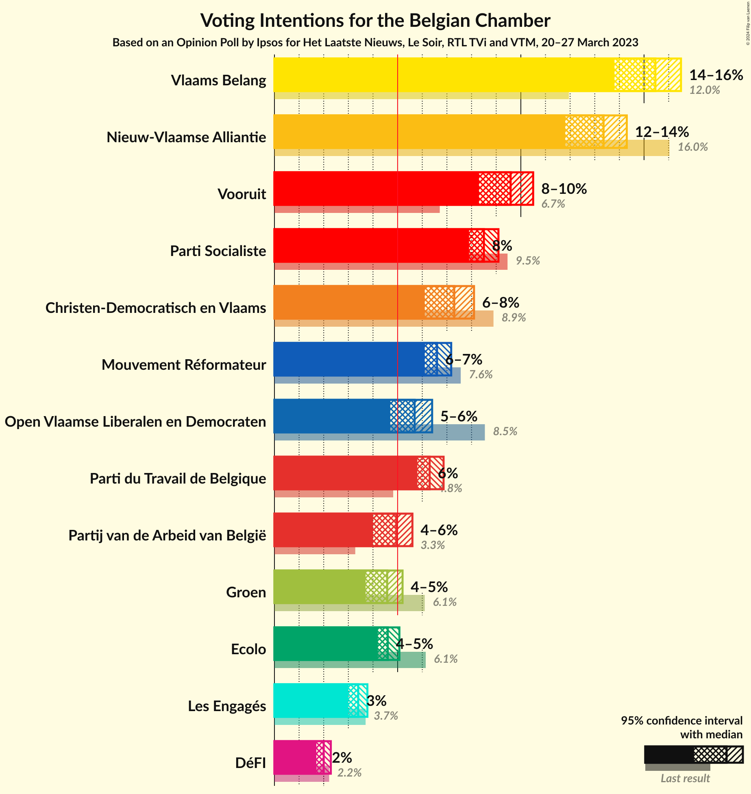

### Confidence Intervals

| Party | Last Result | Poll Result | 80% Confidence Interval | 90% Confidence Interval | 95% Confidence Interval | 99% Confidence Interval |
|:-----:|:-----------:|:-----------:|:-----------------------:|:-----------------------:|:-----------------------:|:-----------------------:|
| Vlaams Belang | 12.0% | 15.5% | 14.4–16.2% |14.1–16.4% |13.8–16.5% |13.4–16.6% |
| Nieuw-Vlaamse Alliantie | 16.0% | 13.4% | 12.3–14.1% |12.1–14.2% |11.8–14.3% |11.4–14.4% |
| Vooruit | 6.7% | 9.6% | 8.7–10.2% |8.4–10.4% |8.3–10.5% |7.9–10.5% |
| Parti Socialiste | 9.5% | 9.1% | 8.1–8.5% |8.0–8.5% |7.9–8.5% |7.7–8.5% |
| Christen-Democratisch en Vlaams | 8.9% | 7.3% | 6.5–7.9% |6.3–8.0% |6.1–8.1% |5.8–8.1% |
| Mouvement Réformateur | 7.6% | 7.2% | 6.2–6.6% |6.2–6.6% |6.1–6.6% |5.9–6.6% |
| Parti du Travail de Belgique | 4.8% | 6.9% | 5.9–6.3% |5.9–6.3% |5.8–6.3% |5.6–6.3% |
| Open Vlaamse Liberalen en Democraten | 8.5% | 5.7% | 5.0–6.2% |4.8–6.3% |4.7–6.4% |4.4–6.5% |
| Ecolo | 6.1% | 5.1% | 4.3–4.6% |4.2–4.6% |4.2–4.6% |4.0–4.6% |
| Partij van de Arbeid van België | 3.3% | 4.9% | 4.3–5.4% |4.1–5.5% |4.0–5.6% |3.7–5.7% |
| Groen | 6.1% | 4.6% | 4.0–5.1% |3.8–5.2% |3.7–5.2% |3.4–5.3% |
| Les Engagés | 3.7% | 3.8% | 3.1–3.4% |3.0–3.4% |3.0–3.4% |2.8–3.4% |
| DéFI | 2.2% | 2.3% | 1.8–2.0% |1.7–2.0% |1.7–2.0% |1.6–2.0% |

*Note:* The poll result column reflects the actual value used in the calculations. Published results may vary slightly, and in addition be rounded to fewer digits.

## Seats

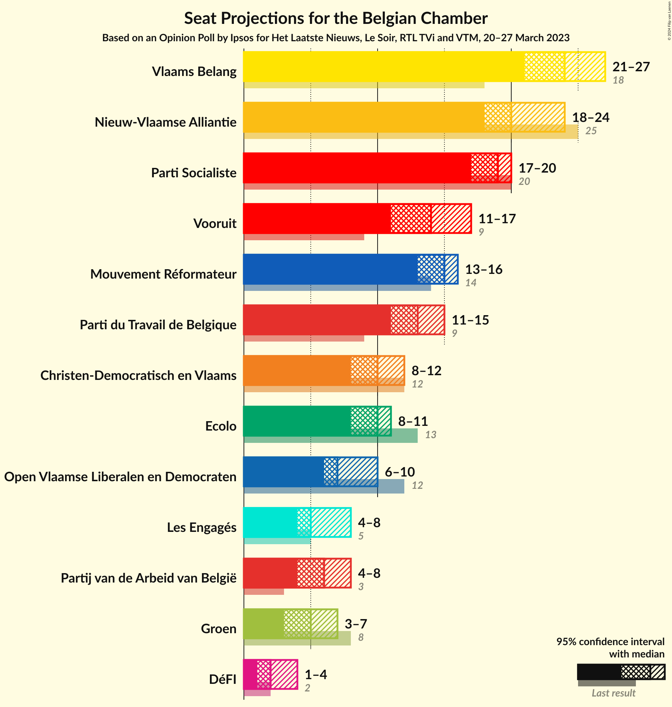

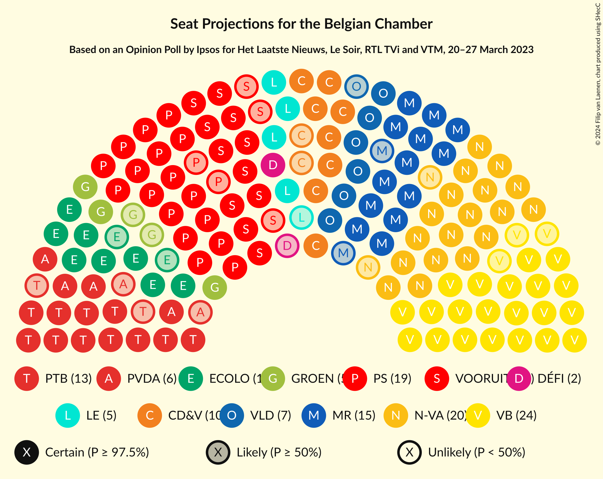

### Confidence Intervals

| Party | Last Result | Median | 80% Confidence Interval | 90% Confidence Interval | 95% Confidence Interval | 99% Confidence Interval |
|:-----:|:-----------:|:------:|:-----------------------:|:-----------------------:|:-----------------------:|:-----------------------:|
| <a href="#vlaams-belang">Vlaams Belang</a> | 18 | 24 | 22–26 |21–26 |21–27 |20–28 |
| <a href="#nieuw-vlaamse-alliantie">Nieuw-Vlaamse Alliantie</a> | 25 | 20 | 19–22 |18–23 |18–24 |17–25 |
| <a href="#vooruit">Vooruit</a> | 9 | 14 | 12–15 |12–16 |11–17 |11–17 |
| <a href="#parti-socialiste">Parti Socialiste</a> | 20 | 19 | 18–20 |17–20 |17–20 |16–21 |
| <a href="#christen-democratisch-en-vlaams">Christen-Democratisch en Vlaams</a> | 12 | 10 | 10–11 |9–11 |8–12 |7–13 |
| <a href="#mouvement-réformateur">Mouvement Réformateur</a> | 14 | 15 | 13–15 |13–16 |13–16 |12–17 |
| <a href="#parti-du-travail-de-belgique">Parti du Travail de Belgique</a> | 9 | 13 | 12–14 |11–15 |11–15 |10–16 |
| <a href="#open-vlaamse-liberalen-en-democraten">Open Vlaamse Liberalen en Democraten</a> | 12 | 7 | 6–9 |6–10 |6–10 |4–10 |
| <a href="#ecolo">Ecolo</a> | 13 | 10 | 9–11 |8–11 |8–11 |8–13 |
| <a href="#partij-van-de-arbeid-van-belgië">Partij van de Arbeid van België</a> | 3 | 6 | 5–8 |4–8 |4–8 |4–8 |
| <a href="#groen">Groen</a> | 8 | 5 | 4–7 |3–7 |3–7 |3–9 |
| <a href="#les-engagés">Les Engagés</a> | 5 | 5 | 4–7 |4–8 |4–8 |4–9 |
| <a href="#défi">DéFI</a> | 2 | 2 | 1–3 |1–4 |1–4 |1–5 |

### Vlaams Belang

*For a full overview of the results for this party, see the [Vlaams Belang](party-vlaamsbelang.html) page.*

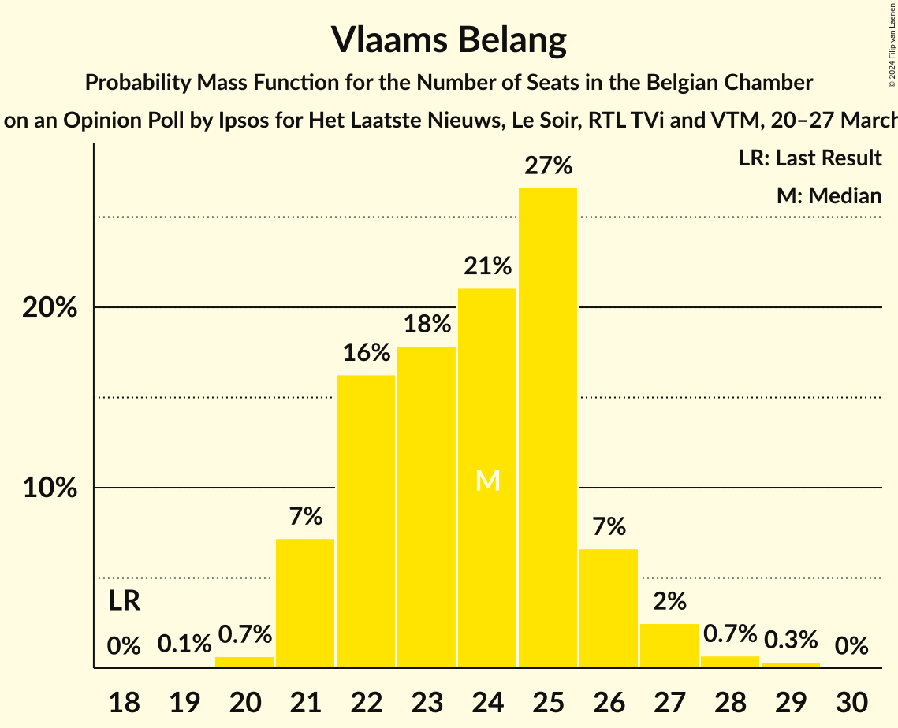

| Number of Seats | Probability | Accumulated | Special Marks |
|:---------------:|:-----------:|:-----------:|:-------------:|
| 18 | 0% | 100% | Last Result |
| 19 | 0.1% | 100% |  |
| 20 | 0.7% | 99.9% |  |
| 21 | 7% | 99.2% |  |
| 22 | 16% | 92% |  |
| 23 | 18% | 76% |  |
| 24 | 21% | 58% | Median |
| 25 | 27% | 37% |  |
| 26 | 7% | 10% |  |
| 27 | 2% | 4% |  |
| 28 | 0.7% | 1.0% |  |
| 29 | 0.3% | 0.4% |  |
| 30 | 0% | 0% |  |

### Nieuw-Vlaamse Alliantie

*For a full overview of the results for this party, see the [Nieuw-Vlaamse Alliantie](party-nieuw-vlaamsealliantie.html) page.*

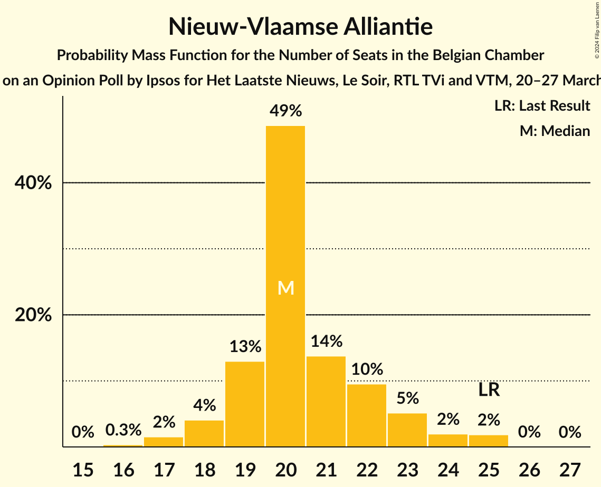

| Number of Seats | Probability | Accumulated | Special Marks |
|:---------------:|:-----------:|:-----------:|:-------------:|
| 16 | 0.3% | 100% |  |
| 17 | 2% | 99.6% |  |
| 18 | 4% | 98% |  |
| 19 | 13% | 94% |  |
| 20 | 49% | 81% | Median |
| 21 | 14% | 32% |  |
| 22 | 10% | 19% |  |
| 23 | 5% | 9% |  |
| 24 | 2% | 4% |  |
| 25 | 2% | 2% | Last Result |
| 26 | 0% | 0.1% |  |
| 27 | 0% | 0% |  |

### Vooruit

*For a full overview of the results for this party, see the [Vooruit](party-vooruit.html) page.*

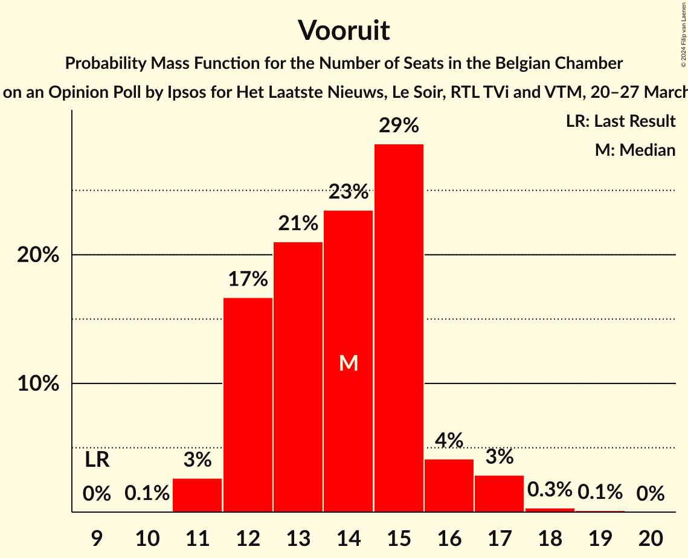

| Number of Seats | Probability | Accumulated | Special Marks |
|:---------------:|:-----------:|:-----------:|:-------------:|
| 9 | 0% | 100% | Last Result |
| 10 | 0.1% | 100% |  |
| 11 | 3% | 99.9% |  |
| 12 | 17% | 97% |  |
| 13 | 21% | 81% |  |
| 14 | 23% | 60% | Median |
| 15 | 29% | 36% |  |
| 16 | 4% | 7% |  |
| 17 | 3% | 3% |  |
| 18 | 0.3% | 0.5% |  |
| 19 | 0.1% | 0.1% |  |
| 20 | 0% | 0% |  |

### Parti Socialiste

*For a full overview of the results for this party, see the [Parti Socialiste](party-partisocialiste.html) page.*

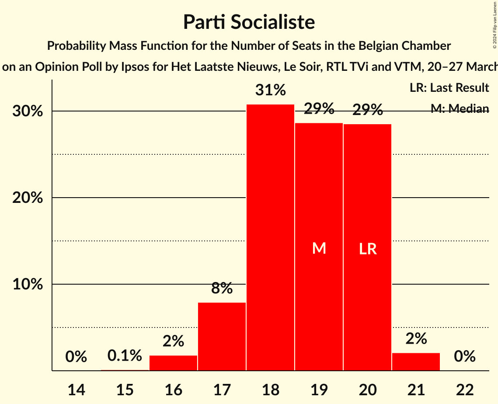

| Number of Seats | Probability | Accumulated | Special Marks |
|:---------------:|:-----------:|:-----------:|:-------------:|
| 15 | 0.1% | 100% |  |
| 16 | 2% | 99.9% |  |
| 17 | 8% | 98% |  |
| 18 | 31% | 90% |  |
| 19 | 29% | 59% | Median |
| 20 | 29% | 31% | Last Result |
| 21 | 2% | 2% |  |
| 22 | 0% | 0% |  |

### Christen-Democratisch en Vlaams

*For a full overview of the results for this party, see the [Christen-Democratisch en Vlaams](party-christen-democratischenvlaams.html) page.*

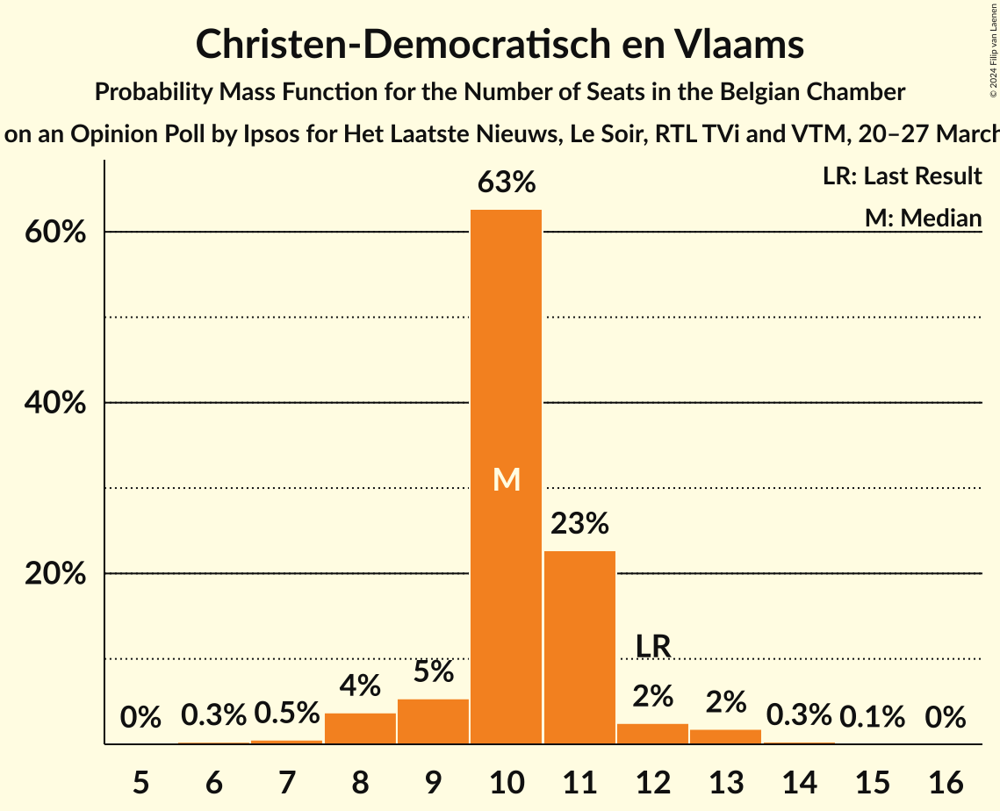

| Number of Seats | Probability | Accumulated | Special Marks |
|:---------------:|:-----------:|:-----------:|:-------------:|
| 6 | 0.3% | 100% |  |
| 7 | 0.5% | 99.7% |  |
| 8 | 4% | 99.2% |  |
| 9 | 5% | 95% |  |
| 10 | 63% | 90% | Median |
| 11 | 23% | 27% |  |
| 12 | 2% | 5% | Last Result |
| 13 | 2% | 2% |  |
| 14 | 0.3% | 0.4% |  |
| 15 | 0.1% | 0.1% |  |
| 16 | 0% | 0% |  |

### Mouvement Réformateur

*For a full overview of the results for this party, see the [Mouvement Réformateur](party-mouvementréformateur.html) page.*

| Number of Seats | Probability | Accumulated | Special Marks |
|:---------------:|:-----------:|:-----------:|:-------------:|
| 11 | 0.2% | 100% |  |
| 12 | 2% | 99.8% |  |
| 13 | 9% | 98% |  |
| 14 | 38% | 89% | Last Result |
| 15 | 43% | 51% | Median |
| 16 | 6% | 8% |  |
| 17 | 1.3% | 2% |  |
| 18 | 0.4% | 0.4% |  |
| 19 | 0.1% | 0.1% |  |
| 20 | 0% | 0% |  |

### Parti du Travail de Belgique

*For a full overview of the results for this party, see the [Parti du Travail de Belgique](party-partidutravaildebelgique.html) page.*

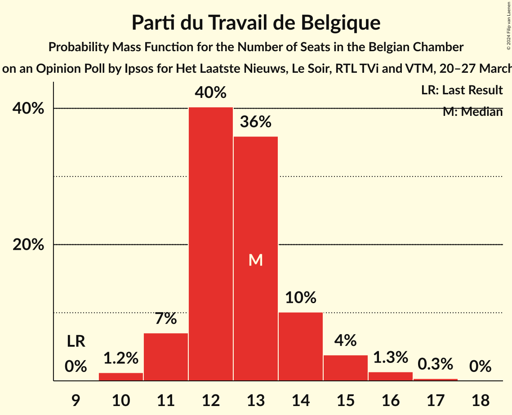

| Number of Seats | Probability | Accumulated | Special Marks |
|:---------------:|:-----------:|:-----------:|:-------------:|
| 9 | 0% | 100% | Last Result |
| 10 | 1.2% | 100% |  |
| 11 | 7% | 98.8% |  |
| 12 | 40% | 92% |  |
| 13 | 36% | 52% | Median |
| 14 | 10% | 16% |  |
| 15 | 4% | 6% |  |
| 16 | 1.3% | 2% |  |
| 17 | 0.3% | 0.4% |  |
| 18 | 0% | 0% |  |

### Open Vlaamse Liberalen en Democraten

*For a full overview of the results for this party, see the [Open Vlaamse Liberalen en Democraten](party-openvlaamseliberalenendemocraten.html) page.*

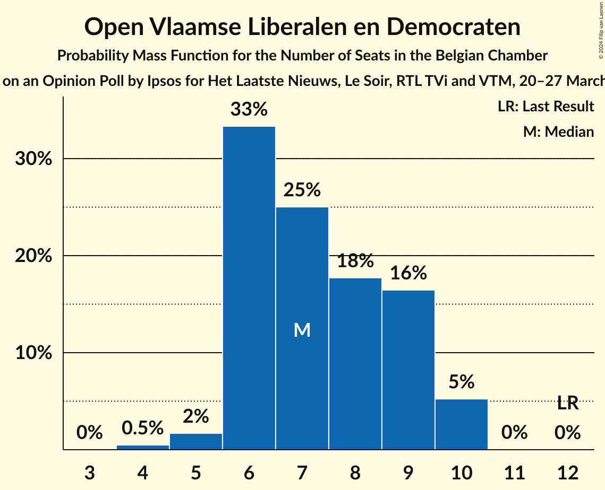

| Number of Seats | Probability | Accumulated | Special Marks |
|:---------------:|:-----------:|:-----------:|:-------------:|
| 4 | 0.5% | 100% |  |
| 5 | 2% | 99.5% |  |
| 6 | 33% | 98% |  |
| 7 | 25% | 64% | Median |
| 8 | 18% | 39% |  |
| 9 | 16% | 22% |  |
| 10 | 5% | 5% |  |
| 11 | 0% | 0% |  |
| 12 | 0% | 0% | Last Result |

### Ecolo

*For a full overview of the results for this party, see the [Ecolo](party-ecolo.html) page.*

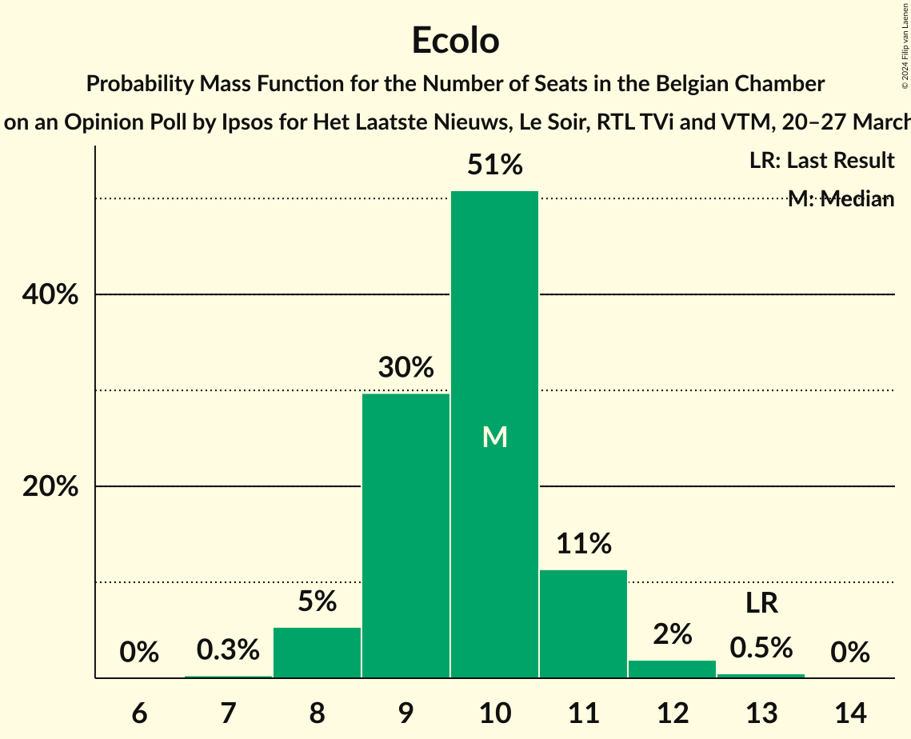

| Number of Seats | Probability | Accumulated | Special Marks |
|:---------------:|:-----------:|:-----------:|:-------------:|
| 7 | 0.3% | 100% |  |
| 8 | 5% | 99.7% |  |
| 9 | 30% | 94% |  |
| 10 | 51% | 65% | Median |
| 11 | 11% | 14% |  |
| 12 | 2% | 2% |  |
| 13 | 0.5% | 0.5% | Last Result |
| 14 | 0% | 0% |  |

### Partij van de Arbeid van België

*For a full overview of the results for this party, see the [Partij van de Arbeid van België](party-partijvandearbeidvanbelgië.html) page.*

| Number of Seats | Probability | Accumulated | Special Marks |
|:---------------:|:-----------:|:-----------:|:-------------:|
| 3 | 0.4% | 100% | Last Result |
| 4 | 5% | 99.6% |  |
| 5 | 37% | 95% |  |
| 6 | 11% | 58% | Median |
| 7 | 16% | 47% |  |
| 8 | 31% | 31% |  |
| 9 | 0.3% | 0.3% |  |
| 10 | 0% | 0% |  |

### Groen

*For a full overview of the results for this party, see the [Groen](party-groen.html) page.*

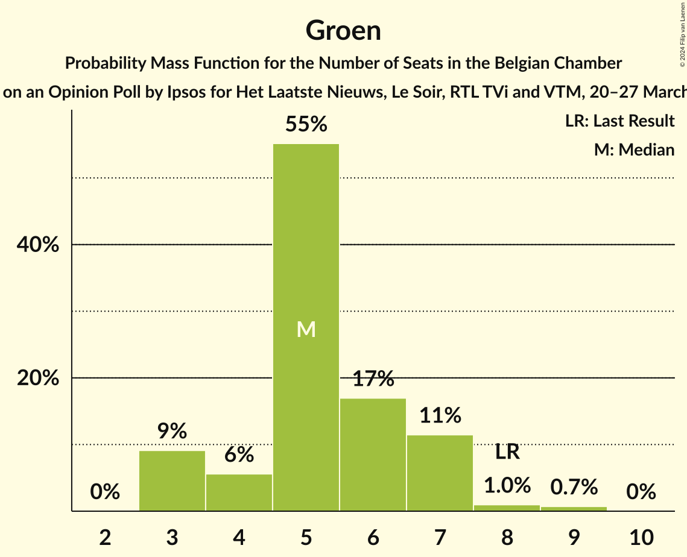

| Number of Seats | Probability | Accumulated | Special Marks |
|:---------------:|:-----------:|:-----------:|:-------------:|
| 3 | 9% | 100% |  |
| 4 | 6% | 91% |  |
| 5 | 55% | 85% | Median |
| 6 | 17% | 30% |  |
| 7 | 11% | 13% |  |
| 8 | 1.0% | 2% | Last Result |
| 9 | 0.7% | 0.7% |  |
| 10 | 0% | 0% |  |

### Les Engagés

*For a full overview of the results for this party, see the [Les Engagés](party-lesengagés.html) page.*

| Number of Seats | Probability | Accumulated | Special Marks |
|:---------------:|:-----------:|:-----------:|:-------------:|
| 4 | 24% | 100% |  |
| 5 | 44% | 76% | Last Result, Median |
| 6 | 16% | 32% |  |
| 7 | 9% | 15% |  |
| 8 | 5% | 7% |  |
| 9 | 2% | 2% |  |
| 10 | 0.1% | 0.1% |  |
| 11 | 0% | 0% |  |

### DéFI

*For a full overview of the results for this party, see the [DéFI](party-défi.html) page.*

| Number of Seats | Probability | Accumulated | Special Marks |
|:---------------:|:-----------:|:-----------:|:-------------:|
| 1 | 29% | 100% |  |
| 2 | 52% | 71% | Last Result, Median |
| 3 | 10% | 19% |  |
| 4 | 8% | 9% |  |
| 5 | 0.5% | 0.5% |  |
| 6 | 0% | 0% |  |

## Coalitions

### Confidence Intervals

| Coalition | Last Result | Median | Majority? | 80% Confidence Interval | 90% Confidence Interval | 95% Confidence Interval | 99% Confidence Interval |
|:---------:|:-----------:|:------:|:---------:|:-----------------------:|:-----------------------:|:-----------------------:|:-----------------------:|
| Vooruit – Parti Socialiste – Christen-Democratisch en Vlaams – Mouvement Réformateur – Open Vlaamse Liberalen en Democraten – Ecolo – Groen – Les Engagés | 93 | 85 | 100% | 82–88 | 81–89 | 80–89 | 79–90 |
| Vooruit – Parti Socialiste – Christen-Democratisch en Vlaams – Parti du Travail de Belgique – Ecolo – Partij van de Arbeid van België – Groen – Les Engagés | 79 | 82 | 99.9% | 79–85 | 79–86 | 78–86 | 77–88 |
| Vooruit – Parti Socialiste – Christen-Democratisch en Vlaams – Mouvement Réformateur – Open Vlaamse Liberalen en Democraten – Ecolo – Groen | 88 | 80 | 95% | 76–83 | 76–83 | 75–84 | 73–85 |
| Nieuw-Vlaamse Alliantie – Vooruit – Parti Socialiste – Mouvement Réformateur – Open Vlaamse Liberalen en Democraten | 80 | 75 | 38% | 72–78 | 71–78 | 70–79 | 69–81 |
| Vooruit – Parti Socialiste – Parti du Travail de Belgique – Ecolo – Partij van de Arbeid van België – Groen – Les Engagés | 67 | 72 | 5% | 69–75 | 68–76 | 68–76 | 66–77 |
| Vooruit – Parti Socialiste – Christen-Democratisch en Vlaams – Mouvement Réformateur – Open Vlaamse Liberalen en Democraten – Les Engagés | 72 | 70 | 0.7% | 67–73 | 66–74 | 65–74 | 64–76 |
| Vooruit – Parti Socialiste – Mouvement Réformateur – Open Vlaamse Liberalen en Democraten – Ecolo – Groen | 76 | 69 | 0.3% | 66–72 | 65–73 | 65–74 | 63–75 |
| Vooruit – Parti Socialiste – Parti du Travail de Belgique – Ecolo – Partij van de Arbeid van België – Groen | 62 | 67 | 0% | 64–70 | 63–71 | 62–71 | 60–73 |
| Vooruit – Parti Socialiste – Christen-Democratisch en Vlaams – Ecolo – Groen – Les Engagés | 67 | 63 | 0% | 60–66 | 60–67 | 59–67 | 58–69 |
| Nieuw-Vlaamse Alliantie – Christen-Democratisch en Vlaams – Mouvement Réformateur – Open Vlaamse Liberalen en Democraten – Les Engagés | 68 | 58 | 0% | 55–61 | 54–61 | 54–62 | 52–64 |
| Parti Socialiste – Christen-Democratisch en Vlaams – Mouvement Réformateur – Open Vlaamse Liberalen en Democraten – Les Engagés | 63 | 56 | 0% | 53–59 | 53–60 | 52–60 | 51–61 |
| Vooruit – Parti Socialiste – Mouvement Réformateur – Open Vlaamse Liberalen en Democraten | 55 | 54 | 0% | 52–57 | 51–58 | 50–59 | 49–60 |
| Nieuw-Vlaamse Alliantie – Christen-Democratisch en Vlaams – Mouvement Réformateur – Open Vlaamse Liberalen en Democraten | 63 | 52 | 0% | 50–55 | 49–56 | 49–56 | 47–58 |
| Christen-Democratisch en Vlaams – Mouvement Réformateur – Open Vlaamse Liberalen en Democraten – Ecolo – Groen – Les Engagés | 64 | 52 | 0% | 50–55 | 49–56 | 48–56 | 47–58 |
| Vooruit – Parti Socialiste – Christen-Democratisch en Vlaams – Les Engagés | 46 | 48 | 0% | 46–51 | 45–51 | 44–52 | 43–54 |
| Christen-Democratisch en Vlaams – Mouvement Réformateur – Open Vlaamse Liberalen en Democraten – Les Engagés | 43 | 37 | 0% | 35–40 | 34–41 | 34–42 | 33–43 |

### Vooruit – Parti Socialiste – Christen-Democratisch en Vlaams – Mouvement Réformateur – Open Vlaamse Liberalen en Democraten – Ecolo – Groen – Les Engagés

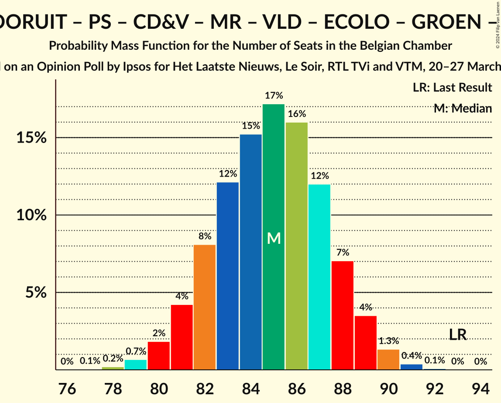

| Number of Seats | Probability | Accumulated | Special Marks |
|:---------------:|:-----------:|:-----------:|:-------------:|
| 77 | 0.1% | 100% |  |
| 78 | 0.2% | 99.9% |  |
| 79 | 0.7% | 99.7% |  |
| 80 | 2% | 99.1% |  |
| 81 | 4% | 97% |  |
| 82 | 8% | 93% |  |
| 83 | 12% | 85% |  |
| 84 | 15% | 73% |  |
| 85 | 17% | 58% | Median |
| 86 | 16% | 40% |  |
| 87 | 12% | 24% |  |
| 88 | 7% | 12% |  |
| 89 | 4% | 5% |  |
| 90 | 1.3% | 2% |  |
| 91 | 0.4% | 0.5% |  |
| 92 | 0.1% | 0.1% |  |
| 93 | 0% | 0% | Last Result |

### Vooruit – Parti Socialiste – Christen-Democratisch en Vlaams – Parti du Travail de Belgique – Ecolo – Partij van de Arbeid van België – Groen – Les Engagés

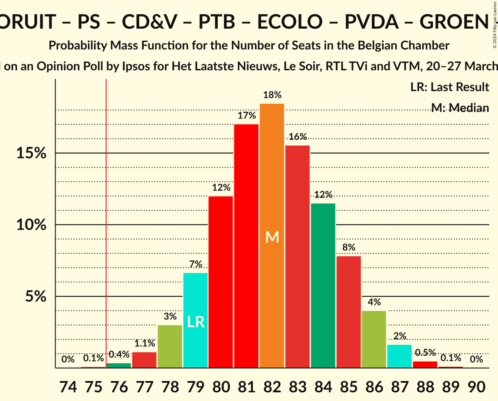

| Number of Seats | Probability | Accumulated | Special Marks |
|:---------------:|:-----------:|:-----------:|:-------------:|
| 75 | 0.1% | 100% |  |
| 76 | 0.4% | 99.9% | Majority |
| 77 | 1.1% | 99.5% |  |
| 78 | 3% | 98% |  |
| 79 | 7% | 95% | Last Result |
| 80 | 12% | 89% |  |
| 81 | 17% | 77% |  |
| 82 | 18% | 60% | Median |
| 83 | 16% | 41% |  |
| 84 | 12% | 26% |  |
| 85 | 8% | 14% |  |
| 86 | 4% | 6% |  |
| 87 | 2% | 2% |  |
| 88 | 0.5% | 0.6% |  |
| 89 | 0.1% | 0.1% |  |
| 90 | 0% | 0% |  |

### Vooruit – Parti Socialiste – Christen-Democratisch en Vlaams – Mouvement Réformateur – Open Vlaamse Liberalen en Democraten – Ecolo – Groen

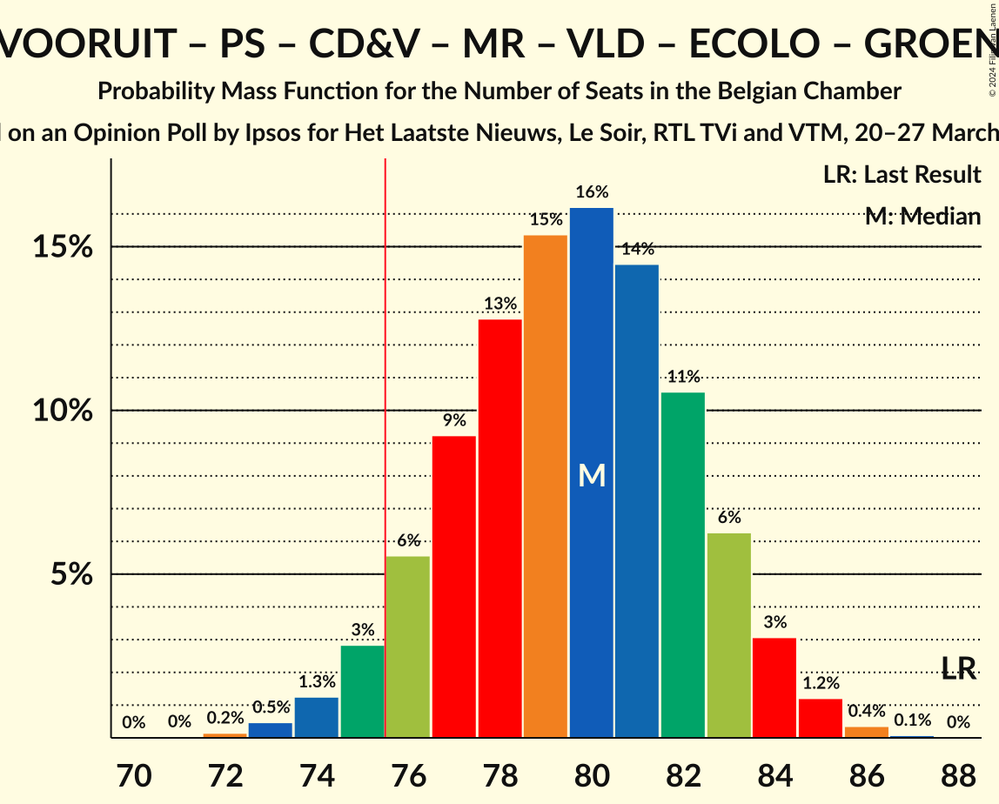

| Number of Seats | Probability | Accumulated | Special Marks |
|:---------------:|:-----------:|:-----------:|:-------------:|
| 72 | 0.2% | 100% |  |
| 73 | 0.5% | 99.8% |  |
| 74 | 1.3% | 99.3% |  |
| 75 | 3% | 98% |  |
| 76 | 6% | 95% | Majority |
| 77 | 9% | 90% |  |
| 78 | 13% | 80% |  |
| 79 | 15% | 68% |  |
| 80 | 16% | 52% | Median |
| 81 | 14% | 36% |  |
| 82 | 11% | 22% |  |
| 83 | 6% | 11% |  |
| 84 | 3% | 5% |  |
| 85 | 1.2% | 2% |  |
| 86 | 0.4% | 0.5% |  |
| 87 | 0.1% | 0.1% |  |
| 88 | 0% | 0% | Last Result |

### Nieuw-Vlaamse Alliantie – Vooruit – Parti Socialiste – Mouvement Réformateur – Open Vlaamse Liberalen en Democraten

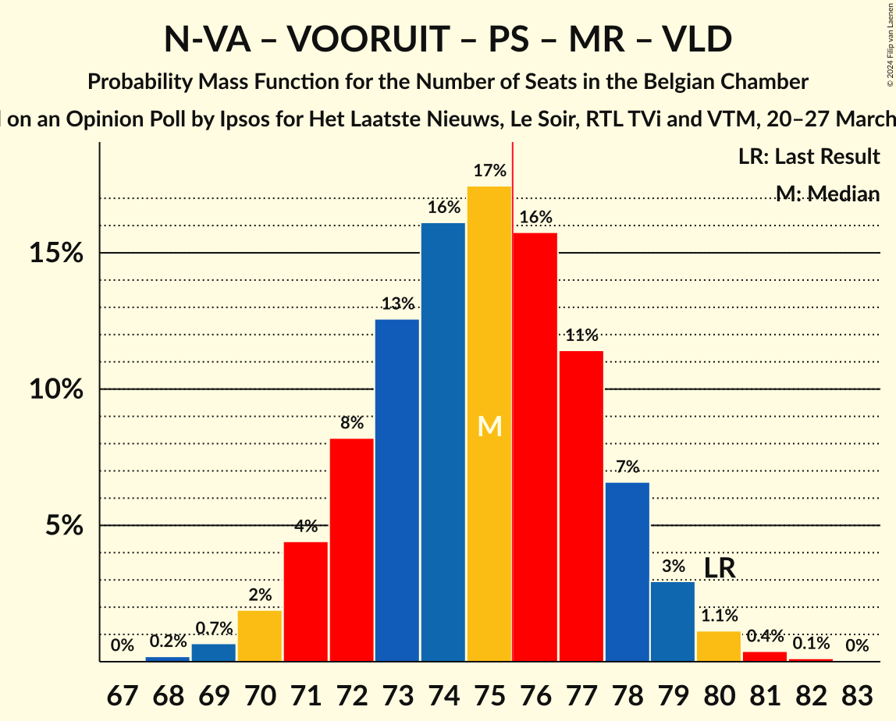

| Number of Seats | Probability | Accumulated | Special Marks |
|:---------------:|:-----------:|:-----------:|:-------------:|
| 67 | 0% | 100% |  |
| 68 | 0.2% | 99.9% |  |
| 69 | 0.7% | 99.7% |  |
| 70 | 2% | 99.1% |  |
| 71 | 4% | 97% |  |
| 72 | 8% | 93% |  |
| 73 | 13% | 85% |  |
| 74 | 16% | 72% |  |
| 75 | 17% | 56% | Median |
| 76 | 16% | 38% | Majority |
| 77 | 11% | 23% |  |
| 78 | 7% | 11% |  |
| 79 | 3% | 5% |  |
| 80 | 1.1% | 2% | Last Result |
| 81 | 0.4% | 0.5% |  |
| 82 | 0.1% | 0.2% |  |
| 83 | 0% | 0% |  |

### Vooruit – Parti Socialiste – Parti du Travail de Belgique – Ecolo – Partij van de Arbeid van België – Groen – Les Engagés

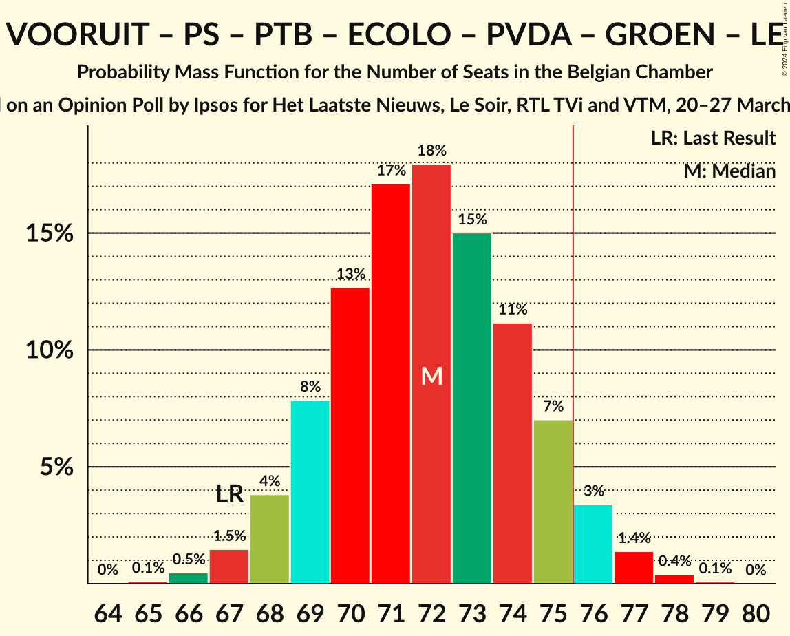

| Number of Seats | Probability | Accumulated | Special Marks |
|:---------------:|:-----------:|:-----------:|:-------------:|
| 65 | 0.1% | 100% |  |
| 66 | 0.5% | 99.9% |  |
| 67 | 1.5% | 99.4% | Last Result |
| 68 | 4% | 98% |  |
| 69 | 8% | 94% |  |
| 70 | 13% | 86% |  |
| 71 | 17% | 74% |  |
| 72 | 18% | 56% | Median |
| 73 | 15% | 38% |  |
| 74 | 11% | 23% |  |
| 75 | 7% | 12% |  |
| 76 | 3% | 5% | Majority |
| 77 | 1.4% | 2% |  |
| 78 | 0.4% | 0.5% |  |
| 79 | 0.1% | 0.1% |  |
| 80 | 0% | 0% |  |

### Vooruit – Parti Socialiste – Christen-Democratisch en Vlaams – Mouvement Réformateur – Open Vlaamse Liberalen en Democraten – Les Engagés

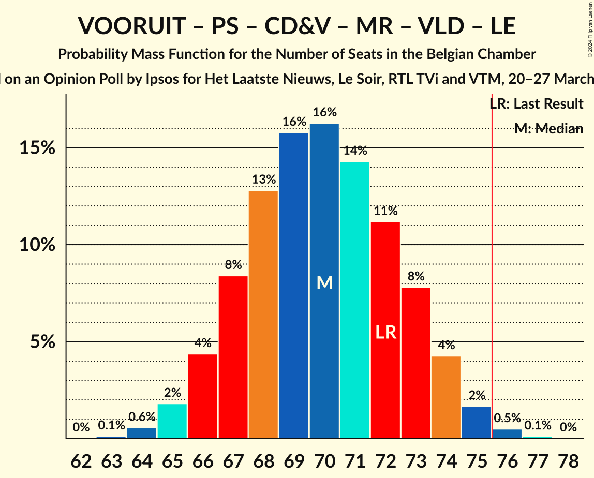

| Number of Seats | Probability | Accumulated | Special Marks |
|:---------------:|:-----------:|:-----------:|:-------------:|
| 63 | 0.1% | 100% |  |
| 64 | 0.6% | 99.8% |  |
| 65 | 2% | 99.3% |  |
| 66 | 4% | 97% |  |
| 67 | 8% | 93% |  |
| 68 | 13% | 85% |  |
| 69 | 16% | 72% |  |
| 70 | 16% | 56% | Median |
| 71 | 14% | 40% |  |
| 72 | 11% | 26% | Last Result |
| 73 | 8% | 14% |  |
| 74 | 4% | 7% |  |
| 75 | 2% | 2% |  |
| 76 | 0.5% | 0.7% | Majority |
| 77 | 0.1% | 0.2% |  |
| 78 | 0% | 0% |  |

### Vooruit – Parti Socialiste – Mouvement Réformateur – Open Vlaamse Liberalen en Democraten – Ecolo – Groen

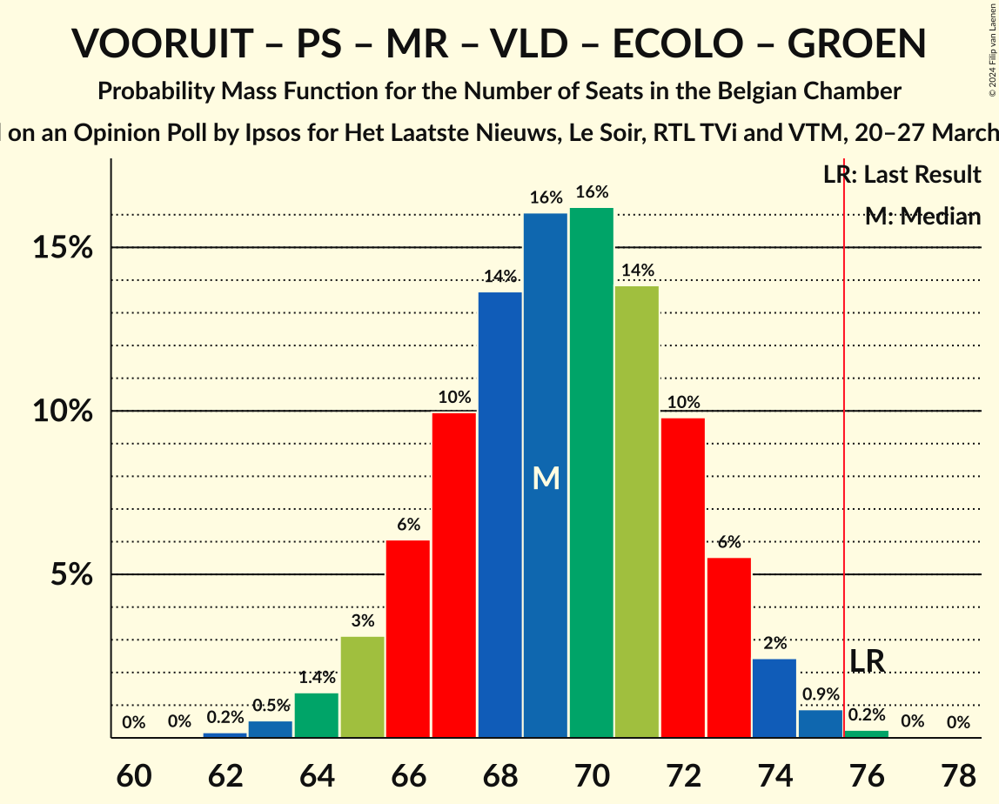

| Number of Seats | Probability | Accumulated | Special Marks |
|:---------------:|:-----------:|:-----------:|:-------------:|
| 61 | 0% | 100% |  |
| 62 | 0.2% | 99.9% |  |
| 63 | 0.5% | 99.8% |  |
| 64 | 1.4% | 99.2% |  |
| 65 | 3% | 98% |  |
| 66 | 6% | 95% |  |
| 67 | 10% | 89% |  |
| 68 | 14% | 79% |  |
| 69 | 16% | 65% |  |
| 70 | 16% | 49% | Median |
| 71 | 14% | 33% |  |
| 72 | 10% | 19% |  |
| 73 | 6% | 9% |  |
| 74 | 2% | 4% |  |
| 75 | 0.9% | 1.2% |  |
| 76 | 0.2% | 0.3% | Last Result, Majority |
| 77 | 0% | 0.1% |  |
| 78 | 0% | 0% |  |

### Vooruit – Parti Socialiste – Parti du Travail de Belgique – Ecolo – Partij van de Arbeid van België – Groen

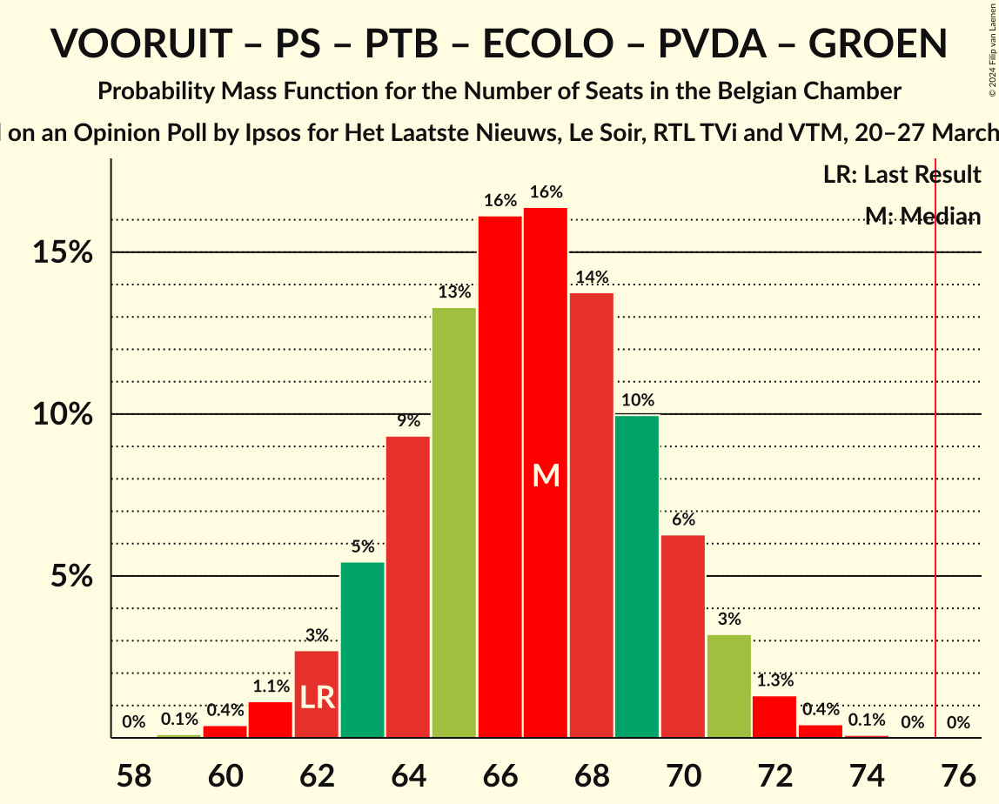

| Number of Seats | Probability | Accumulated | Special Marks |
|:---------------:|:-----------:|:-----------:|:-------------:|
| 59 | 0.1% | 100% |  |
| 60 | 0.4% | 99.9% |  |
| 61 | 1.1% | 99.5% |  |
| 62 | 3% | 98% | Last Result |
| 63 | 5% | 96% |  |
| 64 | 9% | 90% |  |
| 65 | 13% | 81% |  |
| 66 | 16% | 68% |  |
| 67 | 16% | 51% | Median |
| 68 | 14% | 35% |  |
| 69 | 10% | 21% |  |
| 70 | 6% | 11% |  |
| 71 | 3% | 5% |  |
| 72 | 1.3% | 2% |  |
| 73 | 0.4% | 0.5% |  |
| 74 | 0.1% | 0.1% |  |
| 75 | 0% | 0% |  |

### Vooruit – Parti Socialiste – Christen-Democratisch en Vlaams – Ecolo – Groen – Les Engagés

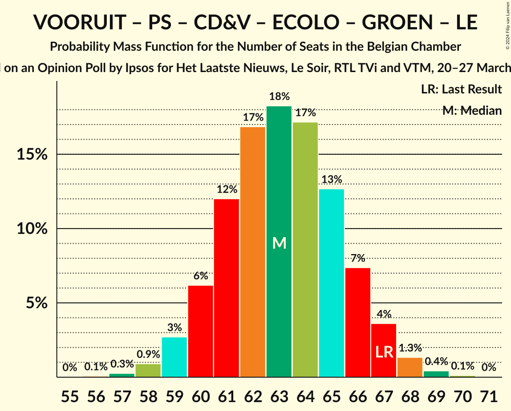

| Number of Seats | Probability | Accumulated | Special Marks |
|:---------------:|:-----------:|:-----------:|:-------------:|
| 56 | 0.1% | 100% |  |
| 57 | 0.3% | 99.9% |  |
| 58 | 0.9% | 99.6% |  |
| 59 | 3% | 98.7% |  |
| 60 | 6% | 96% |  |
| 61 | 12% | 90% |  |
| 62 | 17% | 78% |  |
| 63 | 18% | 61% | Median |
| 64 | 17% | 43% |  |
| 65 | 13% | 26% |  |
| 66 | 7% | 13% |  |
| 67 | 4% | 6% | Last Result |
| 68 | 1.3% | 2% |  |
| 69 | 0.4% | 0.6% |  |
| 70 | 0.1% | 0.1% |  |
| 71 | 0% | 0% |  |

### Nieuw-Vlaamse Alliantie – Christen-Democratisch en Vlaams – Mouvement Réformateur – Open Vlaamse Liberalen en Democraten – Les Engagés

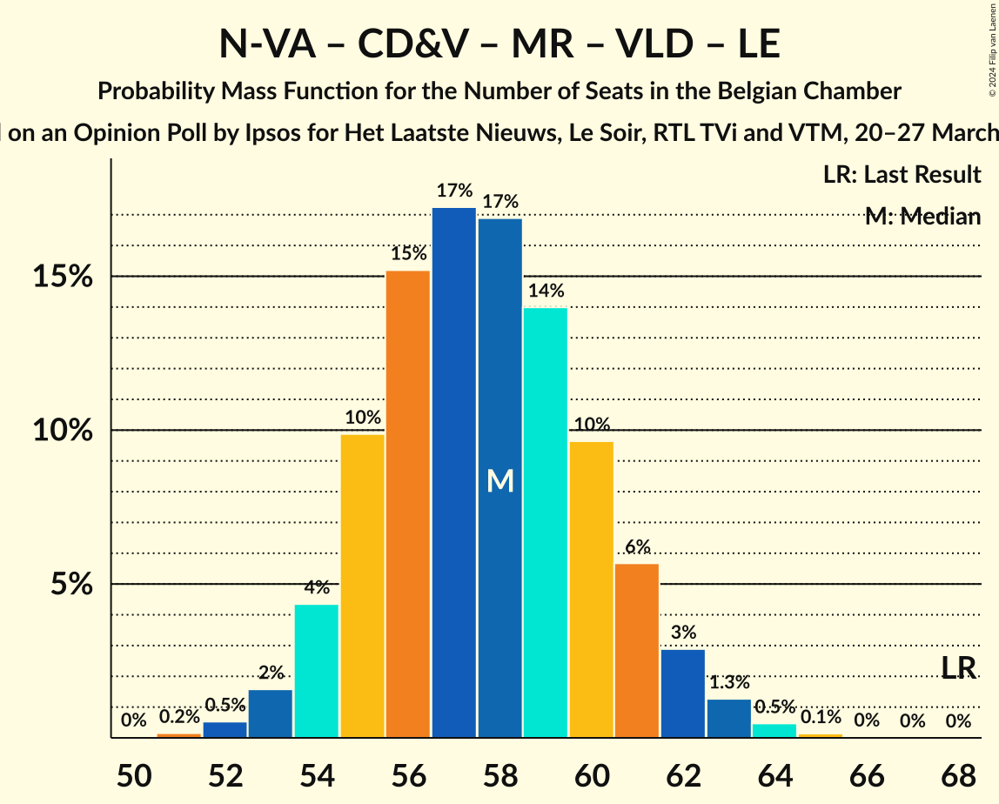

| Number of Seats | Probability | Accumulated | Special Marks |
|:---------------:|:-----------:|:-----------:|:-------------:|
| 51 | 0.2% | 100% |  |
| 52 | 0.5% | 99.8% |  |
| 53 | 2% | 99.3% |  |
| 54 | 4% | 98% |  |
| 55 | 10% | 93% |  |
| 56 | 15% | 83% |  |
| 57 | 17% | 68% | Median |
| 58 | 17% | 51% |  |
| 59 | 14% | 34% |  |
| 60 | 10% | 20% |  |
| 61 | 6% | 10% |  |
| 62 | 3% | 5% |  |
| 63 | 1.3% | 2% |  |
| 64 | 0.5% | 0.7% |  |
| 65 | 0.1% | 0.2% |  |
| 66 | 0% | 0% |  |
| 67 | 0% | 0% |  |
| 68 | 0% | 0% | Last Result |

### Parti Socialiste – Christen-Democratisch en Vlaams – Mouvement Réformateur – Open Vlaamse Liberalen en Democraten – Les Engagés

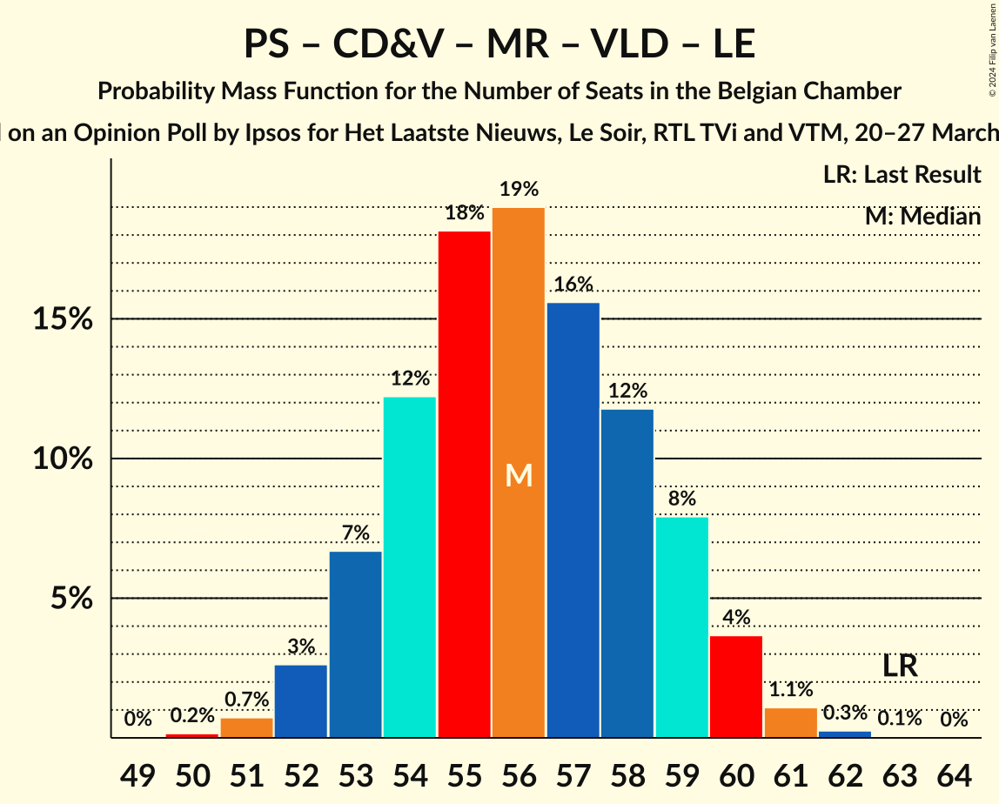

| Number of Seats | Probability | Accumulated | Special Marks |
|:---------------:|:-----------:|:-----------:|:-------------:|
| 50 | 0.2% | 100% |  |
| 51 | 0.7% | 99.8% |  |
| 52 | 3% | 99.1% |  |
| 53 | 7% | 96% |  |
| 54 | 12% | 90% |  |
| 55 | 18% | 78% |  |
| 56 | 19% | 59% | Median |
| 57 | 16% | 40% |  |
| 58 | 12% | 25% |  |
| 59 | 8% | 13% |  |
| 60 | 4% | 5% |  |
| 61 | 1.1% | 1.4% |  |
| 62 | 0.3% | 0.3% |  |
| 63 | 0.1% | 0.1% | Last Result |
| 64 | 0% | 0% |  |

### Vooruit – Parti Socialiste – Mouvement Réformateur – Open Vlaamse Liberalen en Democraten

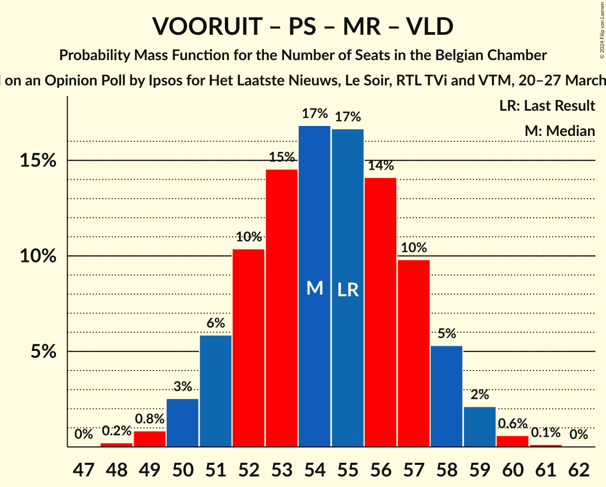

| Number of Seats | Probability | Accumulated | Special Marks |
|:---------------:|:-----------:|:-----------:|:-------------:|
| 48 | 0.2% | 100% |  |
| 49 | 0.8% | 99.7% |  |
| 50 | 3% | 98.9% |  |
| 51 | 6% | 96% |  |
| 52 | 10% | 90% |  |
| 53 | 15% | 80% |  |
| 54 | 17% | 66% |  |
| 55 | 17% | 49% | Last Result, Median |
| 56 | 14% | 32% |  |
| 57 | 10% | 18% |  |
| 58 | 5% | 8% |  |
| 59 | 2% | 3% |  |
| 60 | 0.6% | 0.8% |  |
| 61 | 0.1% | 0.2% |  |
| 62 | 0% | 0% |  |

### Nieuw-Vlaamse Alliantie – Christen-Democratisch en Vlaams – Mouvement Réformateur – Open Vlaamse Liberalen en Democraten

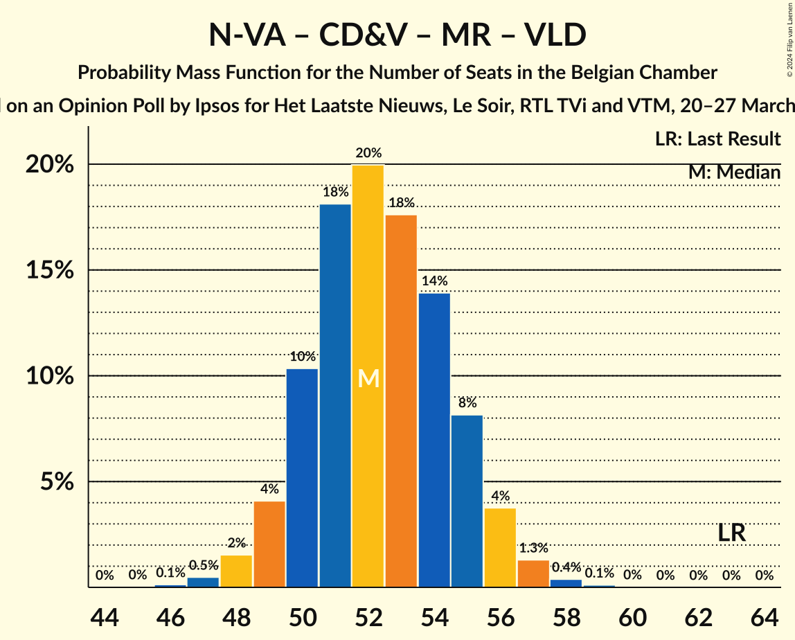

| Number of Seats | Probability | Accumulated | Special Marks |
|:---------------:|:-----------:|:-----------:|:-------------:|
| 46 | 0.1% | 100% |  |
| 47 | 0.5% | 99.8% |  |
| 48 | 2% | 99.3% |  |
| 49 | 4% | 98% |  |
| 50 | 10% | 94% |  |
| 51 | 18% | 83% |  |
| 52 | 20% | 65% | Median |
| 53 | 18% | 45% |  |
| 54 | 14% | 28% |  |
| 55 | 8% | 14% |  |
| 56 | 4% | 6% |  |
| 57 | 1.3% | 2% |  |
| 58 | 0.4% | 0.5% |  |
| 59 | 0.1% | 0.1% |  |
| 60 | 0% | 0% |  |
| 61 | 0% | 0% |  |
| 62 | 0% | 0% |  |
| 63 | 0% | 0% | Last Result |

### Christen-Democratisch en Vlaams – Mouvement Réformateur – Open Vlaamse Liberalen en Democraten – Ecolo – Groen – Les Engagés

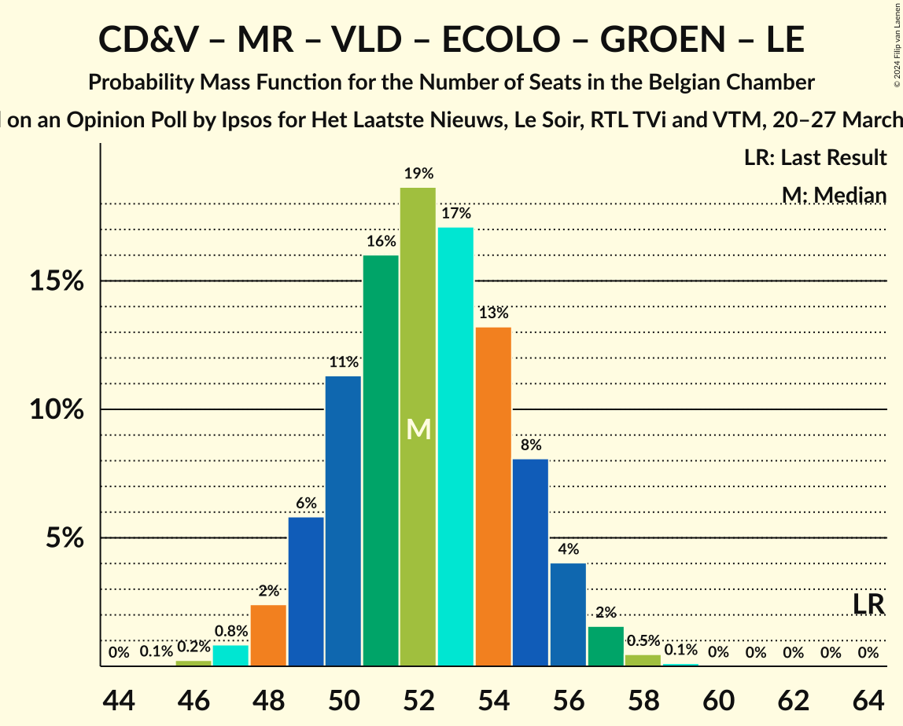

| Number of Seats | Probability | Accumulated | Special Marks |
|:---------------:|:-----------:|:-----------:|:-------------:|
| 45 | 0.1% | 100% |  |
| 46 | 0.2% | 99.9% |  |
| 47 | 0.8% | 99.7% |  |
| 48 | 2% | 98.9% |  |
| 49 | 6% | 96% |  |
| 50 | 11% | 91% |  |
| 51 | 16% | 79% |  |
| 52 | 19% | 63% | Median |
| 53 | 17% | 45% |  |
| 54 | 13% | 28% |  |
| 55 | 8% | 14% |  |
| 56 | 4% | 6% |  |
| 57 | 2% | 2% |  |
| 58 | 0.5% | 0.6% |  |
| 59 | 0.1% | 0.2% |  |
| 60 | 0% | 0% |  |
| 61 | 0% | 0% |  |
| 62 | 0% | 0% |  |
| 63 | 0% | 0% |  |
| 64 | 0% | 0% | Last Result |

### Vooruit – Parti Socialiste – Christen-Democratisch en Vlaams – Les Engagés

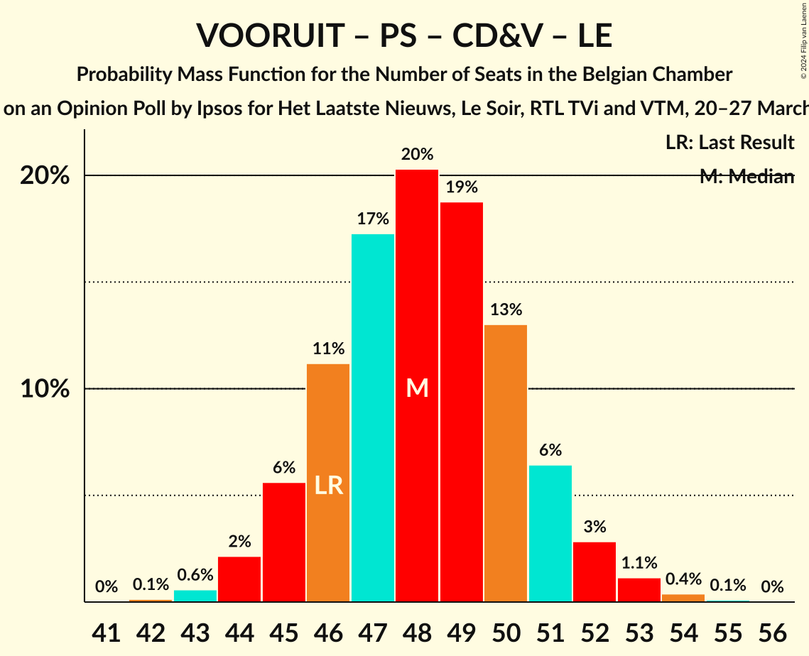

| Number of Seats | Probability | Accumulated | Special Marks |
|:---------------:|:-----------:|:-----------:|:-------------:|
| 42 | 0.1% | 100% |  |
| 43 | 0.6% | 99.8% |  |
| 44 | 2% | 99.2% |  |
| 45 | 6% | 97% |  |
| 46 | 11% | 91% | Last Result |
| 47 | 17% | 80% |  |
| 48 | 20% | 63% | Median |
| 49 | 19% | 43% |  |
| 50 | 13% | 24% |  |
| 51 | 6% | 11% |  |
| 52 | 3% | 4% |  |
| 53 | 1.1% | 2% |  |
| 54 | 0.4% | 0.5% |  |
| 55 | 0.1% | 0.1% |  |
| 56 | 0% | 0% |  |

### Christen-Democratisch en Vlaams – Mouvement Réformateur – Open Vlaamse Liberalen en Democraten – Les Engagés

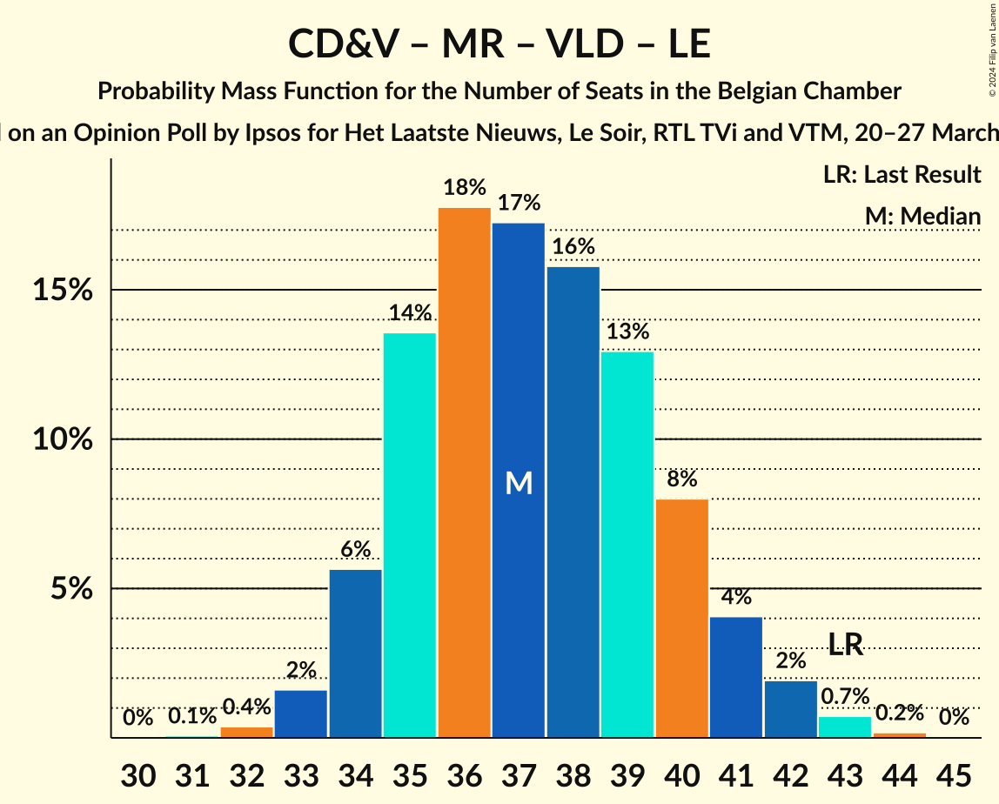

| Number of Seats | Probability | Accumulated | Special Marks |
|:---------------:|:-----------:|:-----------:|:-------------:|
| 31 | 0.1% | 100% |  |
| 32 | 0.4% | 99.9% |  |
| 33 | 2% | 99.5% |  |
| 34 | 6% | 98% |  |
| 35 | 14% | 92% |  |
| 36 | 18% | 79% |  |
| 37 | 17% | 61% | Median |
| 38 | 16% | 44% |  |
| 39 | 13% | 28% |  |
| 40 | 8% | 15% |  |
| 41 | 4% | 7% |  |
| 42 | 2% | 3% |  |
| 43 | 0.7% | 0.9% | Last Result |
| 44 | 0.2% | 0.2% |  |
| 45 | 0% | 0% |  |

## Technical Information

### Opinion Poll

+ **Polling firm:** Ipsos
+ **Commissioner(s):** Het Laatste Nieuws, Le Soir, RTL TVi and VTM
+ **Fieldwork period:** 20–27 March 2023

### Calculations

+ **Sample size:** 1617
+ **Simulations done:** 1,048,576
+ **Error estimate:** 1.72%

