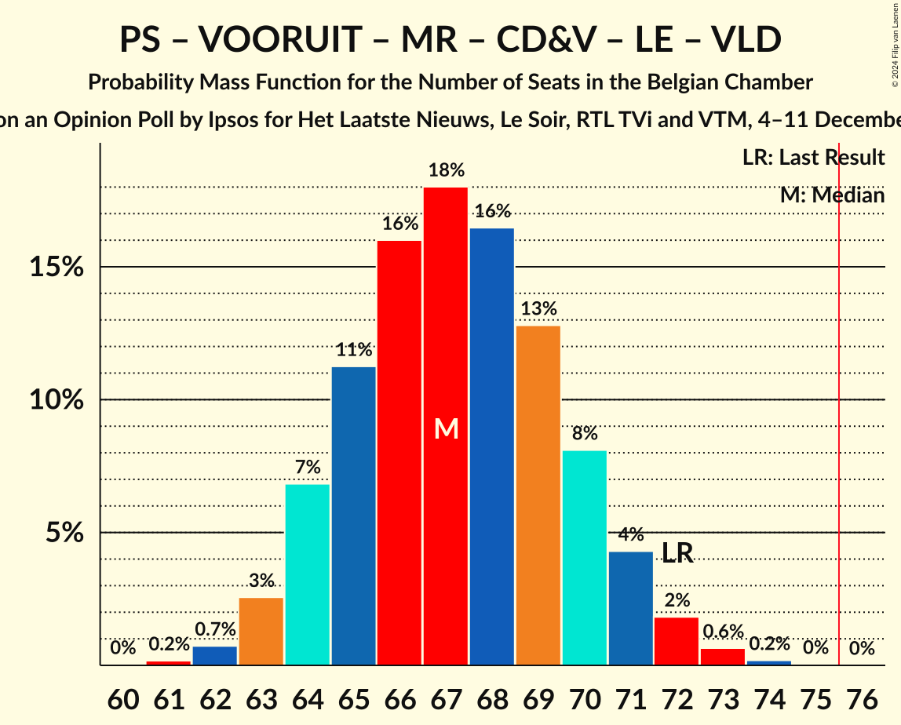

# Opinion Poll by Ipsos for Het Laatste Nieuws, Le Soir, RTL TVi and VTM, 4–11 December 2023

Areas included: Brussels, Flanders, Wallonia

<a href="#voting-intentions">Voting Intentions</a> | <a href="#seats">Seats</a> | <a href="#coalitions">Coalitions</a> | <a href="#technical-information">Technical Information</a>

## Voting Intentions

### Confidence Intervals

| Party | Last Result | Poll Result | 80% Confidence Interval | 90% Confidence Interval | 95% Confidence Interval | 99% Confidence Interval |
|:-----:|:-----------:|:-----------:|:-----------------------:|:-----------------------:|:-----------------------:|:-----------------------:|
| Vlaams Belang | 12.0% | 15.5% | 14.4–16.3% |14.1–16.5% |13.9–16.5% |13.4–16.6% |
| Nieuw-Vlaamse Alliantie | 16.0% | 13.6% | 12.6–14.3% |12.3–14.5% |12.1–14.6% |11.6–14.6% |
| Parti Socialiste | 9.5% | 8.7% | 7.7–8.1% |7.6–8.1% |7.5–8.1% |7.3–8.1% |
| Vooruit | 6.7% | 8.5% | 7.7–9.2% |7.5–9.3% |7.3–9.4% |6.9–9.4% |
| Mouvement Réformateur | 7.6% | 7.7% | 6.7–7.1% |6.6–7.1% |6.5–7.1% |6.4–7.1% |
| Christen-Democratisch en Vlaams | 8.9% | 7.2% | 6.4–7.8% |6.2–7.9% |6.1–8.0% |5.7–8.1% |
| Partij van de Arbeid van België | 3.3% | 6.0% | 5.3–6.6% |5.1–6.7% |4.9–6.7% |4.6–6.8% |
| Parti du Travail de Belgique | 4.8% | 5.9% | 5.1–5.4% |5.0–5.4% |4.9–5.4% |4.8–5.4% |
| Groen | 6.1% | 5.7% | 5.0–6.2% |4.8–6.3% |4.7–6.4% |4.4–6.5% |
| Ecolo | 6.1% | 5.7% | 4.9–5.2% |4.8–5.2% |4.7–5.2% |4.6–5.2% |
| Les Engagés | 3.7% | 4.8% | 4.1–4.4% |4.0–4.4% |3.9–4.4% |3.8–4.4% |
| Open Vlaamse Liberalen en Democraten | 8.5% | 4.4% | 3.8–4.9% |3.6–5.0% |3.5–5.0% |3.2–5.1% |
| DéFI | 2.2% | 2.0% | 1.5–1.7% |1.5–1.7% |1.4–1.7% |1.4–1.7% |

*Note:* The poll result column reflects the actual value used in the calculations. Published results may vary slightly, and in addition be rounded to fewer digits.

## Seats

### Confidence Intervals

| Party | Last Result | Median | 80% Confidence Interval | 90% Confidence Interval | 95% Confidence Interval | 99% Confidence Interval |
|:-----:|:-----------:|:------:|:-----------------------:|:-----------------------:|:-----------------------:|:-----------------------:|
| <a href="#vlaams-belang">Vlaams Belang</a> | 18 | 24 | 22–25 |21–26 |21–26 |20–28 |
| <a href="#nieuw-vlaamse-alliantie">Nieuw-Vlaamse Alliantie</a> | 25 | 20 | 19–23 |18–23 |18–24 |17–25 |
| <a href="#parti-socialiste">Parti Socialiste</a> | 20 | 17 | 16–19 |16–20 |15–20 |14–20 |
| <a href="#vooruit">Vooruit</a> | 9 | 12 | 11–14 |11–14 |10–15 |9–15 |
| <a href="#mouvement-réformateur">Mouvement Réformateur</a> | 14 | 15 | 14–17 |13–17 |13–17 |13–18 |
| <a href="#christen-democratisch-en-vlaams">Christen-Democratisch en Vlaams</a> | 12 | 10 | 10–11 |9–11 |8–12 |7–13 |
| <a href="#partij-van-de-arbeid-van-belgië">Partij van de Arbeid van België</a> | 3 | 8 | 7–9 |7–9 |6–9 |5–10 |
| <a href="#parti-du-travail-de-belgique">Parti du Travail de Belgique</a> | 9 | 11 | 10–12 |10–12 |9–12 |8–13 |
| <a href="#groen">Groen</a> | 8 | 7 | 6–9 |5–9 |5–9 |5–9 |
| <a href="#ecolo">Ecolo</a> | 13 | 10 | 9–12 |9–12 |9–13 |8–13 |
| <a href="#les-engagés">Les Engagés</a> | 5 | 8 | 7–9 |6–10 |6–10 |6–11 |
| <a href="#open-vlaamse-liberalen-en-democraten">Open Vlaamse Liberalen en Democraten</a> | 12 | 4 | 3–6 |3–6 |3–6 |2–7 |
| <a href="#défi">DéFI</a> | 2 | 1 | 1–2 |1–2 |1–2 |1–3 |

### Vlaams Belang

*For a full overview of the results for this party, see the [Vlaams Belang](party-vlaamsbelang.html) page.*

| Number of Seats | Probability | Accumulated | Special Marks |
|:---------------:|:-----------:|:-----------:|:-------------:|
| 18 | 0% | 100% | Last Result |
| 19 | 0.2% | 100% |  |
| 20 | 0.4% | 99.8% |  |
| 21 | 7% | 99.4% |  |
| 22 | 11% | 92% |  |
| 23 | 19% | 81% |  |
| 24 | 12% | 62% | Median |
| 25 | 44% | 50% |  |
| 26 | 4% | 6% |  |
| 27 | 1.5% | 2% |  |
| 28 | 0.7% | 0.8% |  |
| 29 | 0.1% | 0.2% |  |
| 30 | 0% | 0% |  |

### Nieuw-Vlaamse Alliantie

*For a full overview of the results for this party, see the [Nieuw-Vlaamse Alliantie](party-nieuw-vlaamsealliantie.html) page.*

| Number of Seats | Probability | Accumulated | Special Marks |
|:---------------:|:-----------:|:-----------:|:-------------:|
| 16 | 0.1% | 100% |  |
| 17 | 0.7% | 99.9% |  |
| 18 | 5% | 99.2% |  |
| 19 | 7% | 94% |  |
| 20 | 38% | 87% | Median |
| 21 | 19% | 49% |  |
| 22 | 18% | 29% |  |
| 23 | 8% | 11% |  |
| 24 | 2% | 3% |  |
| 25 | 0.8% | 1.0% | Last Result |
| 26 | 0.2% | 0.2% |  |
| 27 | 0% | 0% |  |

### Parti Socialiste

*For a full overview of the results for this party, see the [Parti Socialiste](party-partisocialiste.html) page.*

| Number of Seats | Probability | Accumulated | Special Marks |
|:---------------:|:-----------:|:-----------:|:-------------:|
| 13 | 0.1% | 100% |  |
| 14 | 0.7% | 99.9% |  |
| 15 | 2% | 99.2% |  |
| 16 | 17% | 97% |  |
| 17 | 50% | 80% | Median |
| 18 | 13% | 30% |  |
| 19 | 10% | 16% |  |
| 20 | 6% | 7% | Last Result |
| 21 | 0.1% | 0.1% |  |
| 22 | 0% | 0% |  |

### Vooruit

*For a full overview of the results for this party, see the [Vooruit](party-vooruit.html) page.*

| Number of Seats | Probability | Accumulated | Special Marks |
|:---------------:|:-----------:|:-----------:|:-------------:|
| 8 | 0.1% | 100% |  |
| 9 | 0.6% | 99.9% | Last Result |
| 10 | 2% | 99.3% |  |
| 11 | 40% | 97% |  |
| 12 | 30% | 57% | Median |
| 13 | 16% | 27% |  |
| 14 | 7% | 11% |  |
| 15 | 4% | 4% |  |
| 16 | 0.4% | 0.4% |  |
| 17 | 0% | 0% |  |

### Mouvement Réformateur

*For a full overview of the results for this party, see the [Mouvement Réformateur](party-mouvementréformateur.html) page.*

| Number of Seats | Probability | Accumulated | Special Marks |
|:---------------:|:-----------:|:-----------:|:-------------:|
| 12 | 0.1% | 100% |  |
| 13 | 8% | 99.9% |  |
| 14 | 37% | 92% | Last Result |
| 15 | 27% | 55% | Median |
| 16 | 17% | 27% |  |
| 17 | 9% | 10% |  |
| 18 | 2% | 2% |  |
| 19 | 0% | 0% |  |

### Christen-Democratisch en Vlaams

*For a full overview of the results for this party, see the [Christen-Democratisch en Vlaams](party-christen-democratischenvlaams.html) page.*

| Number of Seats | Probability | Accumulated | Special Marks |
|:---------------:|:-----------:|:-----------:|:-------------:|
| 6 | 0.4% | 100% |  |
| 7 | 0.7% | 99.6% |  |
| 8 | 2% | 98.9% |  |
| 9 | 6% | 97% |  |
| 10 | 75% | 91% | Median |
| 11 | 12% | 16% |  |
| 12 | 3% | 5% | Last Result |
| 13 | 1.0% | 1.4% |  |
| 14 | 0.4% | 0.4% |  |
| 15 | 0% | 0% |  |

### Partij van de Arbeid van België

*For a full overview of the results for this party, see the [Partij van de Arbeid van België](party-partijvandearbeidvanbelgië.html) page.*

| Number of Seats | Probability | Accumulated | Special Marks |
|:---------------:|:-----------:|:-----------:|:-------------:|
| 3 | 0% | 100% | Last Result |
| 4 | 0% | 100% |  |
| 5 | 2% | 100% |  |
| 6 | 2% | 98% |  |
| 7 | 9% | 96% |  |
| 8 | 68% | 87% | Median |
| 9 | 18% | 19% |  |
| 10 | 1.4% | 2% |  |
| 11 | 0.1% | 0.2% |  |
| 12 | 0% | 0.1% |  |
| 13 | 0% | 0% |  |

### Parti du Travail de Belgique

*For a full overview of the results for this party, see the [Parti du Travail de Belgique](party-partidutravaildebelgique.html) page.*

| Number of Seats | Probability | Accumulated | Special Marks |
|:---------------:|:-----------:|:-----------:|:-------------:|
| 7 | 0.1% | 100% |  |
| 8 | 1.1% | 99.9% |  |
| 9 | 3% | 98.8% | Last Result |
| 10 | 29% | 96% |  |
| 11 | 46% | 67% | Median |
| 12 | 19% | 21% |  |
| 13 | 2% | 2% |  |
| 14 | 0% | 0% |  |

### Groen

*For a full overview of the results for this party, see the [Groen](party-groen.html) page.*

| Number of Seats | Probability | Accumulated | Special Marks |
|:---------------:|:-----------:|:-----------:|:-------------:|
| 4 | 0.1% | 100% |  |
| 5 | 8% | 99.9% |  |
| 6 | 9% | 92% |  |
| 7 | 35% | 83% | Median |
| 8 | 14% | 47% | Last Result |
| 9 | 33% | 34% |  |
| 10 | 0.2% | 0.3% |  |
| 11 | 0% | 0% |  |

### Ecolo

*For a full overview of the results for this party, see the [Ecolo](party-ecolo.html) page.*

| Number of Seats | Probability | Accumulated | Special Marks |
|:---------------:|:-----------:|:-----------:|:-------------:|
| 8 | 2% | 100% |  |
| 9 | 32% | 98% |  |
| 10 | 24% | 65% | Median |
| 11 | 21% | 42% |  |
| 12 | 17% | 21% |  |
| 13 | 4% | 4% | Last Result |
| 14 | 0.2% | 0.2% |  |
| 15 | 0% | 0% |  |

### Les Engagés

*For a full overview of the results for this party, see the [Les Engagés](party-lesengagés.html) page.*

| Number of Seats | Probability | Accumulated | Special Marks |
|:---------------:|:-----------:|:-----------:|:-------------:|
| 5 | 0.4% | 100% | Last Result |
| 6 | 7% | 99.6% |  |
| 7 | 12% | 92% |  |
| 8 | 31% | 81% | Median |
| 9 | 40% | 50% |  |
| 10 | 8% | 10% |  |
| 11 | 2% | 2% |  |
| 12 | 0.1% | 0.1% |  |
| 13 | 0% | 0% |  |

### Open Vlaamse Liberalen en Democraten

*For a full overview of the results for this party, see the [Open Vlaamse Liberalen en Democraten](party-openvlaamseliberalenendemocraten.html) page.*

| Number of Seats | Probability | Accumulated | Special Marks |
|:---------------:|:-----------:|:-----------:|:-------------:|
| 2 | 1.0% | 100% |  |
| 3 | 18% | 99.0% |  |
| 4 | 32% | 81% | Median |
| 5 | 11% | 50% |  |
| 6 | 37% | 39% |  |
| 7 | 2% | 2% |  |
| 8 | 0.2% | 0.3% |  |
| 9 | 0.1% | 0.1% |  |
| 10 | 0% | 0% |  |
| 11 | 0% | 0% |  |
| 12 | 0% | 0% | Last Result |

### DéFI

*For a full overview of the results for this party, see the [DéFI](party-défi.html) page.*

| Number of Seats | Probability | Accumulated | Special Marks |
|:---------------:|:-----------:|:-----------:|:-------------:|
| 1 | 63% | 100% | Median |
| 2 | 36% | 37% | Last Result |
| 3 | 0.9% | 1.2% |  |
| 4 | 0.2% | 0.2% |  |
| 5 | 0% | 0% |  |

## Coalitions

### Confidence Intervals

| Coalition | Last Result | Median | Majority? | 80% Confidence Interval | 90% Confidence Interval | 95% Confidence Interval | 99% Confidence Interval |
|:---------:|:-----------:|:------:|:---------:|:-----------------------:|:-----------------------:|:-----------------------:|:-----------------------:|
| Parti Socialiste – Vooruit – Mouvement Réformateur – Christen-Democratisch en Vlaams – Ecolo – Groen – Les Engagés – Open Vlaamse Liberalen en Democraten | 93 | 85 | 100% | 83–88 | 82–89 | 81–89 | 80–90 |
| Parti Socialiste – Vooruit – Christen-Democratisch en Vlaams – Partij van de Arbeid van België – Parti du Travail de Belgique – Ecolo – Groen – Les Engagés | 79 | 84 | 100% | 82–87 | 81–88 | 80–88 | 79–90 |
| Parti Socialiste – Vooruit – Mouvement Réformateur – Christen-Democratisch en Vlaams – Ecolo – Groen – Open Vlaamse Liberalen en Democraten | 88 | 77 | 71% | 74–80 | 73–81 | 72–81 | 71–83 |
| Parti Socialiste – Vooruit – Partij van de Arbeid van België – Parti du Travail de Belgique – Ecolo – Groen – Les Engagés | 67 | 74 | 29% | 72–77 | 71–78 | 70–78 | 69–79 |
| Nieuw-Vlaamse Alliantie – Parti Socialiste – Vooruit – Mouvement Réformateur – Open Vlaamse Liberalen en Democraten | 80 | 69 | 0.6% | 67–73 | 66–73 | 65–74 | 64–76 |
| Parti Socialiste – Vooruit – Mouvement Réformateur – Christen-Democratisch en Vlaams – Les Engagés – Open Vlaamse Liberalen en Democraten | 72 | 67 | 0% | 64–70 | 64–71 | 63–72 | 62–73 |
| Parti Socialiste – Vooruit – Mouvement Réformateur – Ecolo – Groen – Open Vlaamse Liberalen en Democraten | 76 | 67 | 0% | 64–70 | 63–70 | 62–71 | 61–73 |
| Parti Socialiste – Vooruit – Christen-Democratisch en Vlaams – Ecolo – Groen – Les Engagés | 67 | 66 | 0% | 63–68 | 62–69 | 62–70 | 60–71 |
| Parti Socialiste – Vooruit – Partij van de Arbeid van België – Parti du Travail de Belgique – Ecolo – Groen | 62 | 66 | 0% | 63–69 | 62–70 | 62–70 | 61–72 |
| Nieuw-Vlaamse Alliantie – Mouvement Réformateur – Christen-Democratisch en Vlaams – Les Engagés – Open Vlaamse Liberalen en Democraten | 68 | 59 | 0% | 56–62 | 55–62 | 54–63 | 53–65 |
| Mouvement Réformateur – Christen-Democratisch en Vlaams – Ecolo – Groen – Les Engagés – Open Vlaamse Liberalen en Democraten | 64 | 56 | 0% | 53–58 | 52–59 | 52–60 | 50–61 |
| Parti Socialiste – Mouvement Réformateur – Christen-Democratisch en Vlaams – Les Engagés – Open Vlaamse Liberalen en Democraten | 63 | 55 | 0% | 53–58 | 52–58 | 52–59 | 50–60 |
| Nieuw-Vlaamse Alliantie – Mouvement Réformateur – Christen-Democratisch en Vlaams – Open Vlaamse Liberalen en Democraten | 63 | 50 | 0% | 48–53 | 47–54 | 47–55 | 46–56 |
| Parti Socialiste – Vooruit – Mouvement Réformateur – Open Vlaamse Liberalen en Democraten | 55 | 49 | 0% | 46–52 | 45–52 | 45–53 | 44–54 |
| Parti Socialiste – Vooruit – Christen-Democratisch en Vlaams – Les Engagés | 46 | 48 | 0% | 45–50 | 45–51 | 44–52 | 43–53 |
| Mouvement Réformateur – Christen-Democratisch en Vlaams – Les Engagés – Open Vlaamse Liberalen en Democraten | 43 | 38 | 0% | 35–41 | 35–41 | 34–42 | 33–43 |

### Parti Socialiste – Vooruit – Mouvement Réformateur – Christen-Democratisch en Vlaams – Ecolo – Groen – Les Engagés – Open Vlaamse Liberalen en Democraten

| Number of Seats | Probability | Accumulated | Special Marks |
|:---------------:|:-----------:|:-----------:|:-------------:|
| 79 | 0.2% | 100% |  |
| 80 | 0.8% | 99.8% |  |
| 81 | 3% | 99.0% |  |
| 82 | 6% | 96% |  |
| 83 | 11% | 90% | Median |
| 84 | 18% | 80% |  |
| 85 | 22% | 62% |  |
| 86 | 17% | 40% |  |
| 87 | 11% | 23% |  |
| 88 | 7% | 12% |  |
| 89 | 4% | 5% |  |
| 90 | 1.2% | 2% |  |
| 91 | 0.3% | 0.4% |  |
| 92 | 0.1% | 0.1% |  |
| 93 | 0% | 0% | Last Result |

### Parti Socialiste – Vooruit – Christen-Democratisch en Vlaams – Partij van de Arbeid van België – Parti du Travail de Belgique – Ecolo – Groen – Les Engagés

| Number of Seats | Probability | Accumulated | Special Marks |
|:---------------:|:-----------:|:-----------:|:-------------:|
| 77 | 0% | 100% |  |
| 78 | 0.2% | 99.9% |  |
| 79 | 0.7% | 99.8% | Last Result |
| 80 | 2% | 99.1% |  |
| 81 | 5% | 97% |  |
| 82 | 10% | 92% |  |
| 83 | 15% | 82% | Median |
| 84 | 18% | 66% |  |
| 85 | 18% | 48% |  |
| 86 | 15% | 31% |  |
| 87 | 9% | 16% |  |
| 88 | 5% | 7% |  |
| 89 | 2% | 2% |  |
| 90 | 0.5% | 0.7% |  |
| 91 | 0.1% | 0.1% |  |
| 92 | 0% | 0% |  |

### Parti Socialiste – Vooruit – Mouvement Réformateur – Christen-Democratisch en Vlaams – Ecolo – Groen – Open Vlaamse Liberalen en Democraten

| Number of Seats | Probability | Accumulated | Special Marks |
|:---------------:|:-----------:|:-----------:|:-------------:|
| 70 | 0.2% | 100% |  |
| 71 | 0.7% | 99.8% |  |
| 72 | 2% | 99.1% |  |
| 73 | 5% | 97% |  |
| 74 | 8% | 93% |  |
| 75 | 13% | 84% | Median |
| 76 | 17% | 71% | Majority |
| 77 | 17% | 54% |  |
| 78 | 14% | 36% |  |
| 79 | 10% | 22% |  |
| 80 | 6% | 12% |  |
| 81 | 3% | 6% |  |
| 82 | 1.5% | 2% |  |
| 83 | 0.6% | 0.7% |  |
| 84 | 0.1% | 0.2% |  |
| 85 | 0% | 0% |  |
| 86 | 0% | 0% |  |
| 87 | 0% | 0% |  |
| 88 | 0% | 0% | Last Result |

### Parti Socialiste – Vooruit – Partij van de Arbeid van België – Parti du Travail de Belgique – Ecolo – Groen – Les Engagés

| Number of Seats | Probability | Accumulated | Special Marks |
|:---------------:|:-----------:|:-----------:|:-------------:|
| 67 | 0% | 100% | Last Result |
| 68 | 0.2% | 100% |  |
| 69 | 0.7% | 99.8% |  |
| 70 | 2% | 99.1% |  |
| 71 | 5% | 97% |  |
| 72 | 10% | 91% |  |
| 73 | 16% | 81% | Median |
| 74 | 19% | 66% |  |
| 75 | 18% | 47% |  |
| 76 | 15% | 29% | Majority |
| 77 | 9% | 14% |  |
| 78 | 4% | 5% |  |
| 79 | 1.3% | 2% |  |
| 80 | 0.4% | 0.5% |  |
| 81 | 0.1% | 0.1% |  |
| 82 | 0% | 0% |  |

### Nieuw-Vlaamse Alliantie – Parti Socialiste – Vooruit – Mouvement Réformateur – Open Vlaamse Liberalen en Democraten

| Number of Seats | Probability | Accumulated | Special Marks |
|:---------------:|:-----------:|:-----------:|:-------------:|
| 62 | 0% | 100% |  |
| 63 | 0.2% | 99.9% |  |
| 64 | 0.7% | 99.7% |  |
| 65 | 2% | 99.0% |  |
| 66 | 6% | 97% |  |
| 67 | 10% | 91% |  |
| 68 | 15% | 81% | Median |
| 69 | 17% | 67% |  |
| 70 | 17% | 50% |  |
| 71 | 14% | 33% |  |
| 72 | 9% | 20% |  |
| 73 | 6% | 10% |  |
| 74 | 3% | 5% |  |
| 75 | 1.2% | 2% |  |
| 76 | 0.4% | 0.6% | Majority |
| 77 | 0.1% | 0.1% |  |
| 78 | 0% | 0% |  |
| 79 | 0% | 0% |  |
| 80 | 0% | 0% | Last Result |

### Parti Socialiste – Vooruit – Mouvement Réformateur – Christen-Democratisch en Vlaams – Les Engagés – Open Vlaamse Liberalen en Democraten

| Number of Seats | Probability | Accumulated | Special Marks |
|:---------------:|:-----------:|:-----------:|:-------------:|
| 61 | 0.2% | 100% |  |
| 62 | 0.7% | 99.8% |  |
| 63 | 3% | 99.1% |  |
| 64 | 7% | 96% |  |
| 65 | 11% | 90% |  |
| 66 | 16% | 78% | Median |
| 67 | 18% | 62% |  |
| 68 | 16% | 44% |  |
| 69 | 13% | 28% |  |
| 70 | 8% | 15% |  |
| 71 | 4% | 7% |  |
| 72 | 2% | 3% | Last Result |
| 73 | 0.6% | 0.9% |  |
| 74 | 0.2% | 0.2% |  |
| 75 | 0% | 0.1% |  |
| 76 | 0% | 0% | Majority |

### Parti Socialiste – Vooruit – Mouvement Réformateur – Ecolo – Groen – Open Vlaamse Liberalen en Democraten

| Number of Seats | Probability | Accumulated | Special Marks |
|:---------------:|:-----------:|:-----------:|:-------------:|
| 60 | 0.2% | 100% |  |
| 61 | 0.7% | 99.8% |  |
| 62 | 2% | 99.0% |  |
| 63 | 5% | 97% |  |
| 64 | 8% | 92% |  |
| 65 | 14% | 84% | Median |
| 66 | 18% | 70% |  |
| 67 | 18% | 52% |  |
| 68 | 14% | 35% |  |
| 69 | 10% | 20% |  |
| 70 | 6% | 10% |  |
| 71 | 3% | 5% |  |
| 72 | 1.2% | 2% |  |
| 73 | 0.4% | 0.6% |  |
| 74 | 0.1% | 0.1% |  |
| 75 | 0% | 0% |  |
| 76 | 0% | 0% | Last Result, Majority |

### Parti Socialiste – Vooruit – Christen-Democratisch en Vlaams – Ecolo – Groen – Les Engagés

| Number of Seats | Probability | Accumulated | Special Marks |
|:---------------:|:-----------:|:-----------:|:-------------:|
| 59 | 0.1% | 100% |  |
| 60 | 0.5% | 99.9% |  |
| 61 | 2% | 99.4% |  |
| 62 | 5% | 98% |  |
| 63 | 10% | 92% |  |
| 64 | 15% | 83% | Median |
| 65 | 18% | 68% |  |
| 66 | 17% | 50% |  |
| 67 | 14% | 33% | Last Result |
| 68 | 10% | 18% |  |
| 69 | 5% | 8% |  |
| 70 | 2% | 3% |  |
| 71 | 0.8% | 1.0% |  |
| 72 | 0.2% | 0.3% |  |
| 73 | 0% | 0.1% |  |
| 74 | 0% | 0% |  |

### Parti Socialiste – Vooruit – Partij van de Arbeid van België – Parti du Travail de Belgique – Ecolo – Groen

| Number of Seats | Probability | Accumulated | Special Marks |
|:---------------:|:-----------:|:-----------:|:-------------:|
| 59 | 0.1% | 100% |  |
| 60 | 0.3% | 99.9% |  |
| 61 | 1.3% | 99.6% |  |
| 62 | 4% | 98% | Last Result |
| 63 | 8% | 95% |  |
| 64 | 12% | 87% |  |
| 65 | 16% | 75% | Median |
| 66 | 18% | 58% |  |
| 67 | 16% | 41% |  |
| 68 | 12% | 24% |  |
| 69 | 7% | 13% |  |
| 70 | 3% | 5% |  |
| 71 | 1.3% | 2% |  |
| 72 | 0.4% | 0.6% |  |
| 73 | 0.1% | 0.2% |  |
| 74 | 0% | 0% |  |

### Nieuw-Vlaamse Alliantie – Mouvement Réformateur – Christen-Democratisch en Vlaams – Les Engagés – Open Vlaamse Liberalen en Democraten

| Number of Seats | Probability | Accumulated | Special Marks |
|:---------------:|:-----------:|:-----------:|:-------------:|
| 52 | 0.1% | 100% |  |
| 53 | 0.5% | 99.8% |  |
| 54 | 2% | 99.3% |  |
| 55 | 5% | 97% |  |
| 56 | 9% | 93% |  |
| 57 | 14% | 84% | Median |
| 58 | 17% | 70% |  |
| 59 | 17% | 53% |  |
| 60 | 15% | 36% |  |
| 61 | 11% | 21% |  |
| 62 | 6% | 11% |  |
| 63 | 3% | 5% |  |
| 64 | 1.2% | 2% |  |
| 65 | 0.4% | 0.5% |  |
| 66 | 0.1% | 0.1% |  |
| 67 | 0% | 0% |  |
| 68 | 0% | 0% | Last Result |

### Mouvement Réformateur – Christen-Democratisch en Vlaams – Ecolo – Groen – Les Engagés – Open Vlaamse Liberalen en Democraten

| Number of Seats | Probability | Accumulated | Special Marks |
|:---------------:|:-----------:|:-----------:|:-------------:|
| 49 | 0.1% | 100% |  |
| 50 | 0.5% | 99.9% |  |
| 51 | 2% | 99.4% |  |
| 52 | 4% | 98% |  |
| 53 | 8% | 94% |  |
| 54 | 12% | 86% | Median |
| 55 | 15% | 74% |  |
| 56 | 20% | 59% |  |
| 57 | 19% | 39% |  |
| 58 | 12% | 21% |  |
| 59 | 6% | 9% |  |
| 60 | 2% | 3% |  |
| 61 | 0.8% | 1.0% |  |
| 62 | 0.2% | 0.3% |  |
| 63 | 0.1% | 0.1% |  |
| 64 | 0% | 0% | Last Result |

### Parti Socialiste – Mouvement Réformateur – Christen-Democratisch en Vlaams – Les Engagés – Open Vlaamse Liberalen en Democraten

| Number of Seats | Probability | Accumulated | Special Marks |
|:---------------:|:-----------:|:-----------:|:-------------:|
| 49 | 0.1% | 100% |  |
| 50 | 0.4% | 99.9% |  |
| 51 | 2% | 99.4% |  |
| 52 | 6% | 98% |  |
| 53 | 11% | 92% |  |
| 54 | 15% | 81% | Median |
| 55 | 20% | 65% |  |
| 56 | 18% | 45% |  |
| 57 | 14% | 27% |  |
| 58 | 9% | 14% |  |
| 59 | 4% | 5% |  |
| 60 | 1.0% | 1.3% |  |
| 61 | 0.3% | 0.3% |  |
| 62 | 0.1% | 0.1% |  |
| 63 | 0% | 0% | Last Result |

### Nieuw-Vlaamse Alliantie – Mouvement Réformateur – Christen-Democratisch en Vlaams – Open Vlaamse Liberalen en Democraten

| Number of Seats | Probability | Accumulated | Special Marks |
|:---------------:|:-----------:|:-----------:|:-------------:|
| 44 | 0.1% | 100% |  |
| 45 | 0.4% | 99.9% |  |
| 46 | 2% | 99.5% |  |
| 47 | 6% | 98% |  |
| 48 | 12% | 92% |  |
| 49 | 15% | 81% | Median |
| 50 | 19% | 66% |  |
| 51 | 17% | 46% |  |
| 52 | 13% | 29% |  |
| 53 | 8% | 16% |  |
| 54 | 4% | 7% |  |
| 55 | 2% | 3% |  |
| 56 | 0.7% | 1.0% |  |
| 57 | 0.2% | 0.3% |  |
| 58 | 0.1% | 0.1% |  |
| 59 | 0% | 0% |  |
| 60 | 0% | 0% |  |
| 61 | 0% | 0% |  |
| 62 | 0% | 0% |  |
| 63 | 0% | 0% | Last Result |

### Parti Socialiste – Vooruit – Mouvement Réformateur – Open Vlaamse Liberalen en Democraten

| Number of Seats | Probability | Accumulated | Special Marks |
|:---------------:|:-----------:|:-----------:|:-------------:|
| 42 | 0.1% | 100% |  |
| 43 | 0.3% | 99.9% |  |
| 44 | 1.1% | 99.7% |  |
| 45 | 4% | 98.6% |  |
| 46 | 9% | 95% |  |
| 47 | 13% | 86% |  |
| 48 | 18% | 73% | Median |
| 49 | 18% | 55% |  |
| 50 | 15% | 37% |  |
| 51 | 11% | 21% |  |
| 52 | 6% | 10% |  |
| 53 | 3% | 4% |  |
| 54 | 1.1% | 2% |  |
| 55 | 0.4% | 0.5% | Last Result |
| 56 | 0.1% | 0.1% |  |
| 57 | 0% | 0% |  |

### Parti Socialiste – Vooruit – Christen-Democratisch en Vlaams – Les Engagés

| Number of Seats | Probability | Accumulated | Special Marks |
|:---------------:|:-----------:|:-----------:|:-------------:|
| 41 | 0% | 100% |  |
| 42 | 0.2% | 99.9% |  |
| 43 | 0.9% | 99.7% |  |
| 44 | 3% | 98.8% |  |
| 45 | 7% | 96% |  |
| 46 | 16% | 89% | Last Result |
| 47 | 21% | 72% | Median |
| 48 | 19% | 51% |  |
| 49 | 15% | 32% |  |
| 50 | 9% | 17% |  |
| 51 | 5% | 8% |  |
| 52 | 2% | 3% |  |
| 53 | 0.8% | 1.0% |  |
| 54 | 0.2% | 0.3% |  |
| 55 | 0.1% | 0.1% |  |
| 56 | 0% | 0% |  |

### Mouvement Réformateur – Christen-Democratisch en Vlaams – Les Engagés – Open Vlaamse Liberalen en Democraten

| Number of Seats | Probability | Accumulated | Special Marks |
|:---------------:|:-----------:|:-----------:|:-------------:|
| 31 | 0% | 100% |  |
| 32 | 0.2% | 99.9% |  |
| 33 | 0.8% | 99.8% |  |
| 34 | 3% | 99.0% |  |
| 35 | 7% | 96% |  |
| 36 | 13% | 89% |  |
| 37 | 17% | 77% | Median |
| 38 | 19% | 60% |  |
| 39 | 17% | 40% |  |
| 40 | 12% | 23% |  |
| 41 | 7% | 11% |  |
| 42 | 3% | 3% |  |
| 43 | 0.6% | 0.8% | Last Result |
| 44 | 0.2% | 0.2% |  |
| 45 | 0% | 0% |  |

## Technical Information

### Opinion Poll

+ **Polling firm:** Ipsos
+ **Commissioner(s):** Het Laatste Nieuws, Le Soir, RTL TVi and VTM
+ **Fieldwork period:** 4–11 December 2023

### Calculations

+ **Sample size:** 1617
+ **Simulations done:** 1,048,576
+ **Error estimate:** 0.62%

