# Poll Average

<a href="#voting-intentions">Voting Intentions</a> | <a href="#seats">Seats</a> | <a href="#coalitions">Coalitions</a> | <a href="#technical-information">Technical Information</a>

## Summary

The table below lists the polls on which the average is based. They are the most recent polls (less than 90 days old) registered and analyzed so far.

| Period     | Polling firm/Commissioner(s) | N-VA | VB | PS | CD&V | PTB | PVDA | VLD | MR | VOORUIT | ECOLO | GROEN | LE | DÉFI | PP |
|:----------:|:----------------------------:|:--:|:--:|:--:|:--:|:--:|:--:|:--:|:--:|:--:|:--:|:--:|:--:|:--:|:--:|
| 26 May 2019 | General Election | 16.0%   25 | 12.0%   18 | 9.5%   20 | 8.9%   12 | 4.8%   9 | 3.3%   3 | 8.5%   12 | 7.6%   14 | 6.7%   9 | 6.1%   13 | 6.1%   8 | 3.7%   5 | 2.2%   2 | 1.1%   0 |
| N/A | Poll Average | 11–13%   16–22 | 14–16%   23–29 | 7–8%   15–20 | 6–7%   9–12 | 5–6%   9–13 | 5–8%   6–13 | 4–6%   6–10 | 7–8%   14–19 | 6–9%   8–14 | 3%   4–11 | 3–5%   3–6 | 4%   6–13 | 1–2%   1–2 | N/A   N/A |
| [28–31 May 2024](2024-05-31-Cluster17.html) | Cluster17   RTL TVi | 11–13%   16–20 | 15–18%   24–29 | 7–8%   15–19 | 6–8%   9–13 | 6%   10–13 | 5–6%   5–9 | 5–6%   6–10 | 8%   15–20 | 7–9%   9–13 | 3%   3–6 | 3–5%   3–7 | 5–6%   9–13 | 1–2%   1–2 | N/A   N/A |
| [14–20 May 2024](2024-05-20-Ipsos.html) | Ipsos   Het Laatste Nieuws, Le Soir, RTL TVi and VTM | 12–13%   18–21 | 15–17%   24–29 | 7–8%   14–19 | 7–8%   10–12 | 5%   10–13 | 5–6%   5–8 | 4–6%   5–8 | 8%   15–20 | 8–9%   11–14 | 3%   4–8 | 3–4%   3–5 | 5–6%   9–13 | 1–2%   1–3 | N/A   N/A |
| [8–18 April 2024](2024-04-18-Kantar.html) | Kantar   La Libre Belgique and RTBf | 11–12%   17–23 | 14–16%   22–29 | 8%   16–20 | 6–7%   8–11 | 5–6%   9–12 | 6–8%   8–13 | 5–6%   6–10 | 7–8%   14–18 | 6–8%   7–12 | 4–5%   9–12 | 3–4%   2–5 | 4%   5–10 | 1–2%   1–2 | N/A   N/A |
| 26 May 2019 | General Election | 16.0%   25 | 12.0%   18 | 9.5%   20 | 8.9%   12 | 4.8%   9 | 3.3%   3 | 8.5%   12 | 7.6%   14 | 6.7%   9 | 6.1%   13 | 6.1%   8 | 3.7%   5 | 2.2%   2 | 1.1%   0 |

Only polls for which at least the sample size has been published are included in the table above.

**Legend:**
+ **Top half of each row:** Voting intentions (95% confidence interval)
+ **Bottom half of each row:** Seat projections for the Belgian Chamber (95% confidence interval)
+ **N-VA:** Nieuw-Vlaamse Alliantie
+ **VB:** Vlaams Belang
+ **PS:** Parti Socialiste
+ **CD&V:** Christen-Democratisch en Vlaams
+ **PTB:** Parti du Travail de Belgique
+ **PVDA:** Partij van de Arbeid van België
+ **VLD:** Open Vlaamse Liberalen en Democraten
+ **MR:** Mouvement Réformateur
+ **VOORUIT:** Vooruit
+ **ECOLO:** Ecolo
+ **GROEN:** Groen
+ **LE:** Les Engagés
+ **DÉFI:** DéFI
+ **PP:** Parti Populaire
+ **N/A (single party):** Party not included the published results
+ **N/A (entire row):** Calculation for this opinion poll not started yet

## Voting Intentions

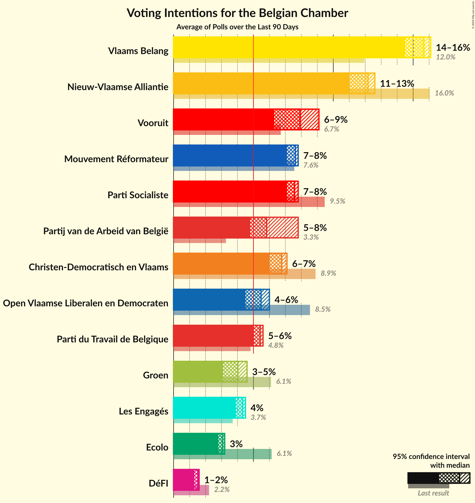

### Confidence Intervals

| Party | Last Result | Median | 80% Confidence Interval | 90% Confidence Interval | 95% Confidence Interval | 99% Confidence Interval |
|:-----:|:-----------:|:------:|:-----------------------:|:-----------------------:|:-----------------------:|:-----------------------:|
| <a href="#nieuw-vlaamse-alliantie">Nieuw-Vlaamse Alliantie</a> | 16.0% | 12.2% | 11.5–12.6% |11.2–12.6% | 11.0–12.6% | 10.5–12.6% |
| <a href="#vlaams-belang">Vlaams Belang</a> | 12.0% | 15.7% | 15.0–16.0% |14.7–16.1% | 14.5–16.1% | 14.1–16.1% |
| <a href="#parti-socialiste">Parti Socialiste</a> | 9.5% | 7.6% | 7.3–7.7% |7.2–7.8% | 7.1–7.8% | 6.8–7.8% |
| <a href="#christen-democratisch-en-vlaams">Christen-Democratisch en Vlaams</a> | 8.9% | 6.8% | 6.3–7.0% |6.1–7.1% | 6.0–7.1% | 5.7–7.1% |
| <a href="#open-vlaamse-liberalen-en-democraten">Open Vlaamse Liberalen en Democraten</a> | 8.5% | 5.5% | 4.8–5.9% |4.7–5.9% | 4.5–6.0% | 4.3–6.0% |
| <a href="#mouvement-réformateur">Mouvement Réformateur</a> | 7.6% | 7.6% | 7.3–7.8% |7.2–7.8% | 7.1–7.8% | 6.9–7.8% |
| <a href="#vooruit">Vooruit</a> | 6.7% | 7.9% | 6.8–8.9% |6.5–9.0% | 6.3–9.1% | 5.9–9.1% |
| <a href="#ecolo">Ecolo</a> | 6.1% | 3.1% | 2.9–3.2% |2.8–3.2% | 2.8–3.2% | 2.6–3.2% |
| <a href="#groen">Groen</a> | 6.1% | 4.0% | 3.4–4.5% |3.2–4.6% | 3.1–4.6% | 2.8–4.7% |
| <a href="#parti-du-travail-de-belgique">Parti du Travail de Belgique</a> | 4.8% | 5.4% | 5.2–5.6% |5.1–5.6% | 5.0–5.6% | 4.9–5.6% |
| <a href="#les-engagés">Les Engagés</a> | 3.7% | 4.3% | 4.1–4.4% |4.0–4.5% | 3.9–4.5% | 3.7–4.5% |
| <a href="#partij-van-de-arbeid-van-belgië">Partij van de Arbeid van België</a> | 3.3% | 5.8% | 5.1–7.5% |5.0–7.7% | 4.8–7.8% | 4.6–7.9% |
| <a href="#défi">DéFI</a> | 2.2% | 1.5% | 1.4–1.6% |1.4–1.6% | 1.3–1.6% | 1.2–1.6% |
| <a href="#parti-populaire">Parti Populaire</a> | 1.1% | N/A | N/A |N/A | N/A | N/A |

### Nieuw-Vlaamse Alliantie

*For a full overview of the results for this party, see the [Nieuw-Vlaamse Alliantie](party-nieuw-vlaamsealliantie.html) page.*

| Voting Intentions | Probability | Accumulated | Special Marks |
|:-----------------:|:-----------:|:-----------:|:-------------:|
| 8.5–9.5% | 0% | 100% |  |
| 9.5–10.5% | 0.5% | 100% |  |
| 10.5–11.5% | 12% | 99.5% |  |
| 11.5–12.5% | 77% | 88% | Median |
| 12.5–13.5% | 100% | 10% |  |
| 13.5–14.5% | 75% | 0% |  |
| 14.5–15.5% | 12% | 0% |  |
| 15.5–16.5% | 0.5% | 0% | Last Result |

### Vlaams Belang

*For a full overview of the results for this party, see the [Vlaams Belang](party-vlaamsbelang.html) page.*

| Voting Intentions | Probability | Accumulated | Special Marks |
|:-----------------:|:-----------:|:-----------:|:-------------:|
| 11.5–12.5% | 0% | 100% | Last Result |
| 12.5–13.5% | 0% | 100% |  |
| 13.5–14.5% | 3% | 100% |  |
| 14.5–15.5% | 36% | 97% |  |
| 15.5–16.5% | 100% | 61% | Median |
| 16.5–17.5% | 100% | 0% |  |
| 17.5–18.5% | 32% | 0% |  |
| 18.5–19.5% | 3% | 0% |  |

### Parti Socialiste

*For a full overview of the results for this party, see the [Parti Socialiste](party-partisocialiste.html) page.*

| Voting Intentions | Probability | Accumulated | Special Marks |
|:-----------------:|:-----------:|:-----------:|:-------------:|
| 5.5–6.5% | 0% | 100% |  |
| 6.5–7.5% | 43% | 100% |  |
| 7.5–8.5% | 100% | 57% | Median |
| 8.5–9.5% | 100% | 0% | Last Result |
| 9.5–10.5% | 40% | 0% |  |

### Christen-Democratisch en Vlaams

*For a full overview of the results for this party, see the [Christen-Democratisch en Vlaams](party-christen-democratischenvlaams.html) page.*

| Voting Intentions | Probability | Accumulated | Special Marks |
|:-----------------:|:-----------:|:-----------:|:-------------:|
| 3.5–4.5% | 0% | 100% |  |
| 4.5–5.5% | 0.3% | 100% |  |
| 5.5–6.5% | 27% | 99.7% |  |
| 6.5–7.5% | 100% | 73% | Median |
| 7.5–8.5% | 100% | 0% |  |
| 8.5–9.5% | 9% | 0% | Last Result |

### Open Vlaamse Liberalen en Democraten

*For a full overview of the results for this party, see the [Open Vlaamse Liberalen en Democraten](party-openvlaamseliberalenendemocraten.html) page.*

| Voting Intentions | Probability | Accumulated | Special Marks |
|:-----------------:|:-----------:|:-----------:|:-------------:|
| 2.5–3.5% | 0% | 100% |  |
| 3.5–4.5% | 3% | 100% |  |
| 4.5–5.5% | 53% | 97% | Median |
| 5.5–6.5% | 100% | 44% |  |
| 6.5–7.5% | 100% | 0% |  |
| 7.5–8.5% | 14% | 0% |  |
| 8.5–9.5% | 0.2% | 0% | Last Result |

### Mouvement Réformateur

*For a full overview of the results for this party, see the [Mouvement Réformateur](party-mouvementréformateur.html) page.*

| Voting Intentions | Probability | Accumulated | Special Marks |
|:-----------------:|:-----------:|:-----------:|:-------------:|
| 5.5–6.5% | 0% | 100% |  |
| 6.5–7.5% | 38% | 100% |  |
| 7.5–8.5% | 100% | 62% | Last Result, Median |
| 8.5–9.5% | 100% | 0% |  |
| 9.5–10.5% | 55% | 0% |  |
| 10.5–11.5% | 0.2% | 0% |  |

### Vooruit

*For a full overview of the results for this party, see the [Vooruit](party-vooruit.html) page.*

| Voting Intentions | Probability | Accumulated | Special Marks |
|:-----------------:|:-----------:|:-----------:|:-------------:|
| 3.5–4.5% | 0% | 100% |  |
| 4.5–5.5% | 0.1% | 100% |  |
| 5.5–6.5% | 6% | 99.9% |  |
| 6.5–7.5% | 29% | 94% | Last Result |
| 7.5–8.5% | 41% | 65% | Median |
| 8.5–9.5% | 32% | 24% |  |
| 9.5–10.5% | 3% | 0% |  |

### Ecolo

*For a full overview of the results for this party, see the [Ecolo](party-ecolo.html) page.*

| Voting Intentions | Probability | Accumulated | Special Marks |
|:-----------------:|:-----------:|:-----------:|:-------------:|
| 1.5–2.5% | 0.1% | 100% |  |
| 2.5–3.5% | 100% | 99.9% | Median |
| 3.5–4.5% | 100% | 0% |  |
| 4.5–5.5% | 100% | 0% |  |
| 5.5–6.5% | 100% | 0% | Last Result |
| 6.5–7.5% | 0.4% | 0% |  |

### Groen

*For a full overview of the results for this party, see the [Groen](party-groen.html) page.*

| Voting Intentions | Probability | Accumulated | Special Marks |
|:-----------------:|:-----------:|:-----------:|:-------------:|
| 1.5–2.5% | 0.1% | 100% |  |
| 2.5–3.5% | 15% | 99.9% |  |
| 3.5–4.5% | 78% | 85% | Median |
| 4.5–5.5% | 17% | 6% |  |
| 5.5–6.5% | 0.3% | 0% | Last Result |

### Parti du Travail de Belgique

*For a full overview of the results for this party, see the [Parti du Travail de Belgique](party-partidutravaildebelgique.html) page.*

| Voting Intentions | Probability | Accumulated | Special Marks |
|:-----------------:|:-----------:|:-----------:|:-------------:|
| 3.5–4.5% | 0% | 100% |  |
| 4.5–5.5% | 88% | 100% | Last Result, Median |
| 5.5–6.5% | 100% | 12% |  |
| 6.5–7.5% | 100% | 0% |  |
| 7.5–8.5% | 4% | 0% |  |

### Les Engagés

*For a full overview of the results for this party, see the [Les Engagés](party-lesengagés.html) page.*

| Voting Intentions | Probability | Accumulated | Special Marks |
|:-----------------:|:-----------:|:-----------:|:-------------:|
| 2.5–3.5% | 0.1% | 100% |  |
| 3.5–4.5% | 100% | 99.9% | Last Result, Median |
| 4.5–5.5% | 100% | 0% |  |
| 5.5–6.5% | 100% | 0% |  |
| 6.5–7.5% | 100% | 0% |  |
| 7.5–8.5% | 0.2% | 0% |  |

### Partij van de Arbeid van België

*For a full overview of the results for this party, see the [Partij van de Arbeid van België](party-partijvandearbeidvanbelgië.html) page.*

| Voting Intentions | Probability | Accumulated | Special Marks |
|:-----------------:|:-----------:|:-----------:|:-------------:|
| 2.5–3.5% | 0% | 100% | Last Result |
| 3.5–4.5% | 0.4% | 100% |  |
| 4.5–5.5% | 32% | 99.6% |  |
| 5.5–6.5% | 40% | 68% | Median |
| 6.5–7.5% | 19% | 27% |  |
| 7.5–8.5% | 17% | 8% |  |
| 8.5–9.5% | 3% | 0% |  |

### DéFI

*For a full overview of the results for this party, see the [DéFI](party-défi.html) page.*

| Voting Intentions | Probability | Accumulated | Special Marks |
|:-----------------:|:-----------:|:-----------:|:-------------:|
| 0.0–0.5% | 0% | 100% |  |
| 0.5–1.5% | 77% | 100% |  |
| 1.5–2.5% | 100% | 23% | Last Result, Median |
| 2.5–3.5% | 2% | 0% |  |

## Seats

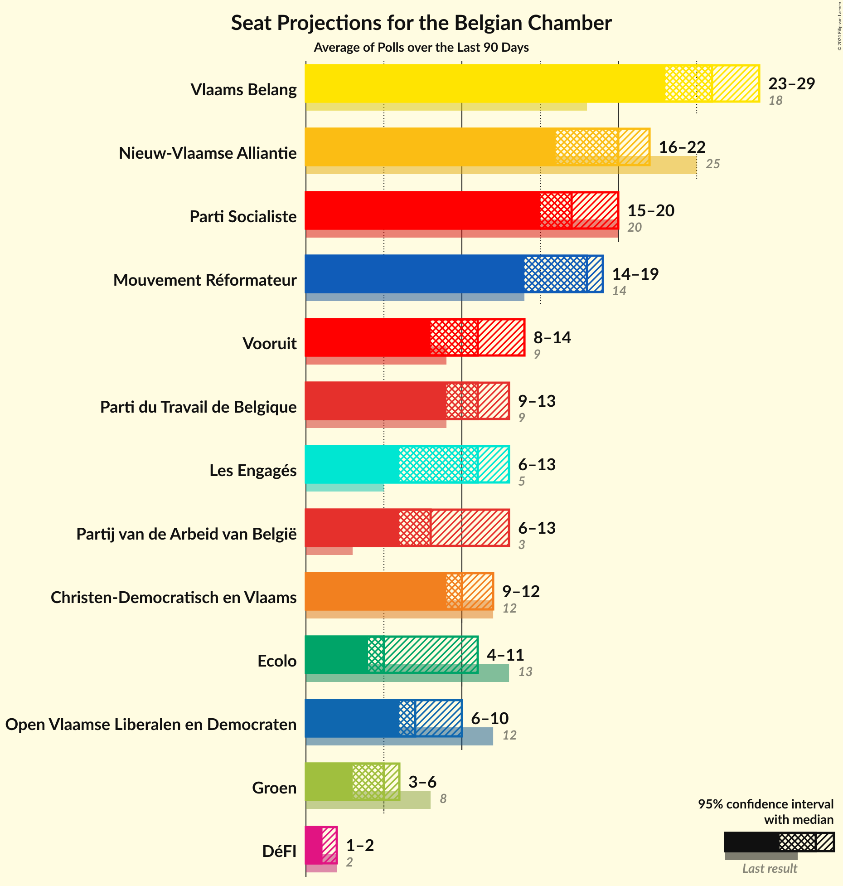

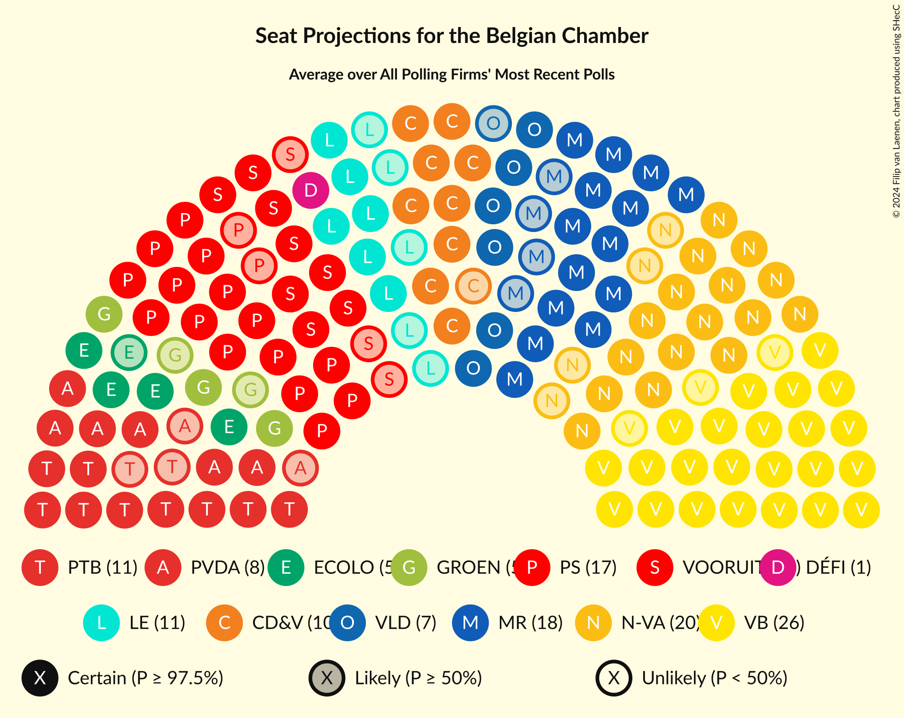

### Confidence Intervals

| Party | Last Result | Median | 80% Confidence Interval | 90% Confidence Interval | 95% Confidence Interval | 99% Confidence Interval |
|:-----:|:-----------:|:------:|:-----------------------:|:-----------------------:|:-----------------------:|:-----------------------:|
| <a href="#nieuw-vlaamse-alliantie">Nieuw-Vlaamse Alliantie</a> | 25 | 20 | 18–21 |17–21 | 16–22 | 15–23 |
| <a href="#vlaams-belang">Vlaams Belang</a> | 18 | 26 | 24–28 |24–29 | 23–29 | 22–30 |
| <a href="#parti-socialiste">Parti Socialiste</a> | 20 | 17 | 16–18 |15–19 | 15–20 | 13–20 |
| <a href="#christen-democratisch-en-vlaams">Christen-Democratisch en Vlaams</a> | 12 | 10 | 10–11 |9–12 | 9–12 | 8–13 |
| <a href="#open-vlaamse-liberalen-en-democraten">Open Vlaamse Liberalen en Democraten</a> | 12 | 7 | 6–10 |6–10 | 6–10 | 4–10 |
| <a href="#mouvement-réformateur">Mouvement Réformateur</a> | 14 | 18 | 15–19 |15–19 | 14–19 | 14–20 |
| <a href="#vooruit">Vooruit</a> | 9 | 11 | 9–13 |9–14 | 8–14 | 7–15 |
| <a href="#ecolo">Ecolo</a> | 13 | 5 | 4–10 |4–10 | 4–11 | 3–12 |
| <a href="#groen">Groen</a> | 8 | 5 | 3–5 |3–6 | 3–6 | 1–7 |
| <a href="#parti-du-travail-de-belgique">Parti du Travail de Belgique</a> | 9 | 11 | 10–13 |10–13 | 9–13 | 9–14 |
| <a href="#les-engagés">Les Engagés</a> | 5 | 11 | 8–12 |7–13 | 6–13 | 5–14 |
| <a href="#partij-van-de-arbeid-van-belgië">Partij van de Arbeid van België</a> | 3 | 8 | 7–10 |6–11 | 6–13 | 5–13 |
| <a href="#défi">DéFI</a> | 2 | 1 | 1 |1–2 | 1–2 | 0–3 |
| <a href="#parti-populaire">Parti Populaire</a> | 0 | N/A | N/A |N/A | N/A | N/A |

### Nieuw-Vlaamse Alliantie

*For a full overview of the results for this party, see the [Nieuw-Vlaamse Alliantie](party-nieuw-vlaamsealliantie.html) page.*

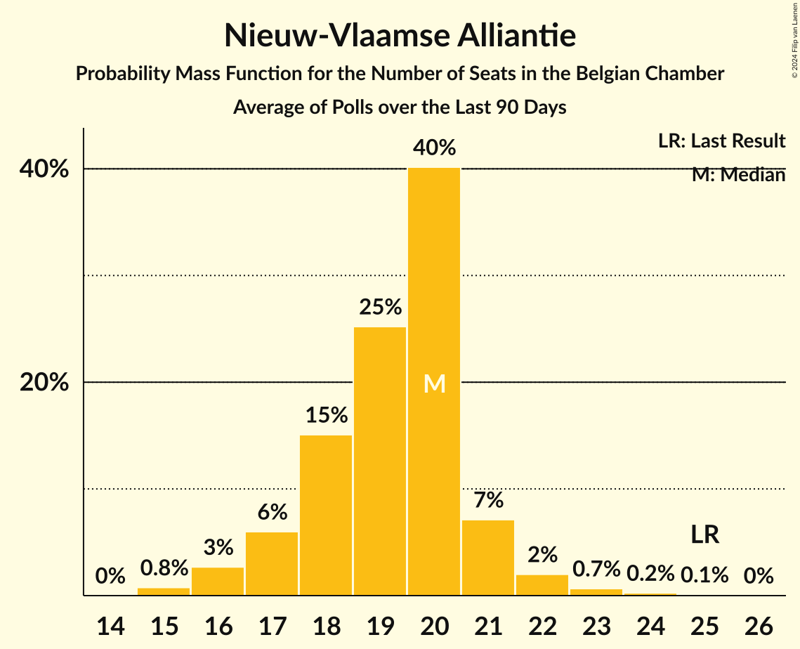

| Number of Seats | Probability | Accumulated | Special Marks |
|:---------------:|:-----------:|:-----------:|:-------------:|
| 15 | 0.8% | 100% |  |
| 16 | 3% | 99.2% |  |
| 17 | 6% | 97% |  |
| 18 | 15% | 91% |  |
| 19 | 25% | 75% |  |
| 20 | 40% | 50% | Median |
| 21 | 7% | 10% |  |
| 22 | 2% | 3% |  |
| 23 | 0.7% | 1.0% |  |
| 24 | 0.2% | 0.3% |  |
| 25 | 0.1% | 0.1% | Last Result |
| 26 | 0% | 0% |  |

### Vlaams Belang

*For a full overview of the results for this party, see the [Vlaams Belang](party-vlaamsbelang.html) page.*

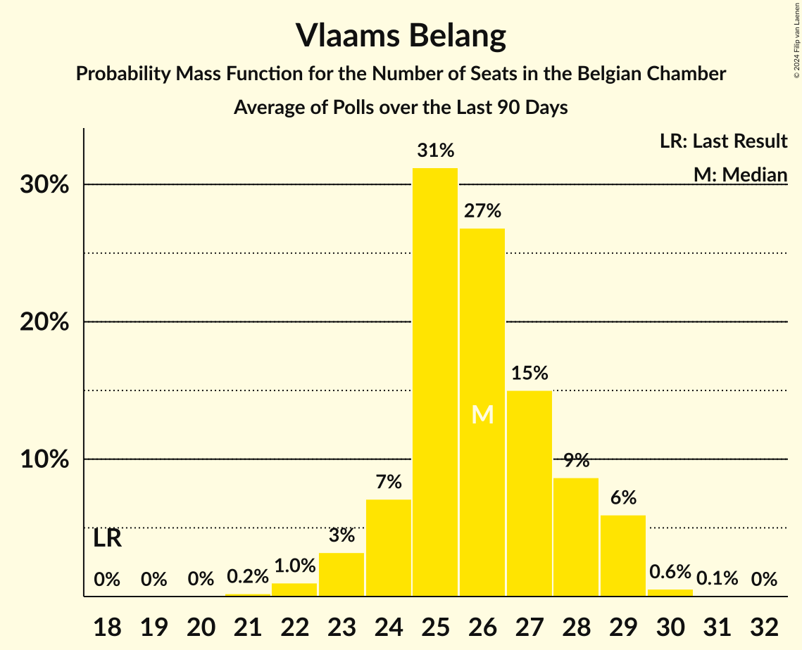

| Number of Seats | Probability | Accumulated | Special Marks |
|:---------------:|:-----------:|:-----------:|:-------------:|
| 18 | 0% | 100% | Last Result |
| 19 | 0% | 100% |  |
| 20 | 0% | 100% |  |
| 21 | 0.2% | 99.9% |  |
| 22 | 1.0% | 99.7% |  |
| 23 | 3% | 98.7% |  |
| 24 | 7% | 95% |  |
| 25 | 31% | 88% |  |
| 26 | 27% | 57% | Median |
| 27 | 15% | 30% |  |
| 28 | 9% | 15% |  |
| 29 | 6% | 7% |  |
| 30 | 0.6% | 0.7% |  |
| 31 | 0.1% | 0.1% |  |
| 32 | 0% | 0% |  |

### Parti Socialiste

*For a full overview of the results for this party, see the [Parti Socialiste](party-partisocialiste.html) page.*

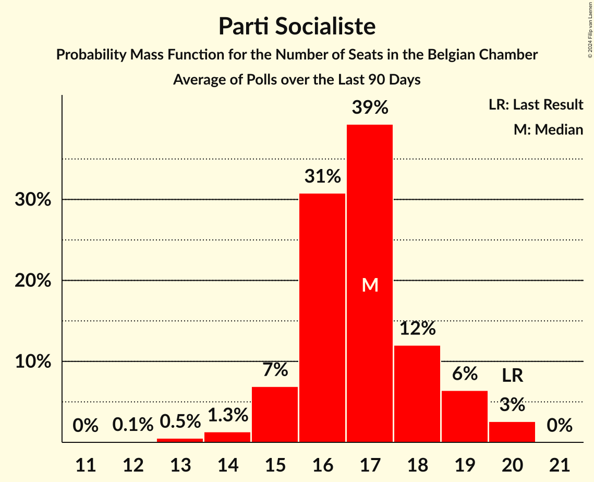

| Number of Seats | Probability | Accumulated | Special Marks |
|:---------------:|:-----------:|:-----------:|:-------------:|
| 12 | 0.1% | 100% |  |
| 13 | 0.5% | 99.9% |  |
| 14 | 1.3% | 99.3% |  |
| 15 | 7% | 98% |  |
| 16 | 31% | 91% |  |
| 17 | 39% | 60% | Median |
| 18 | 12% | 21% |  |
| 19 | 6% | 9% |  |
| 20 | 3% | 3% | Last Result |
| 21 | 0% | 0% |  |

### Christen-Democratisch en Vlaams

*For a full overview of the results for this party, see the [Christen-Democratisch en Vlaams](party-christen-democratischenvlaams.html) page.*

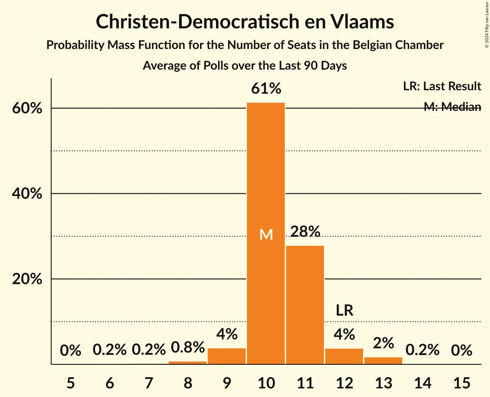

| Number of Seats | Probability | Accumulated | Special Marks |
|:---------------:|:-----------:|:-----------:|:-------------:|
| 6 | 0.2% | 100% |  |
| 7 | 0.2% | 99.8% |  |
| 8 | 0.8% | 99.6% |  |
| 9 | 4% | 98.8% |  |
| 10 | 61% | 95% | Median |
| 11 | 28% | 34% |  |
| 12 | 4% | 6% | Last Result |
| 13 | 2% | 2% |  |
| 14 | 0.2% | 0.2% |  |
| 15 | 0% | 0% |  |

### Open Vlaamse Liberalen en Democraten

*For a full overview of the results for this party, see the [Open Vlaamse Liberalen en Democraten](party-openvlaamseliberalenendemocraten.html) page.*

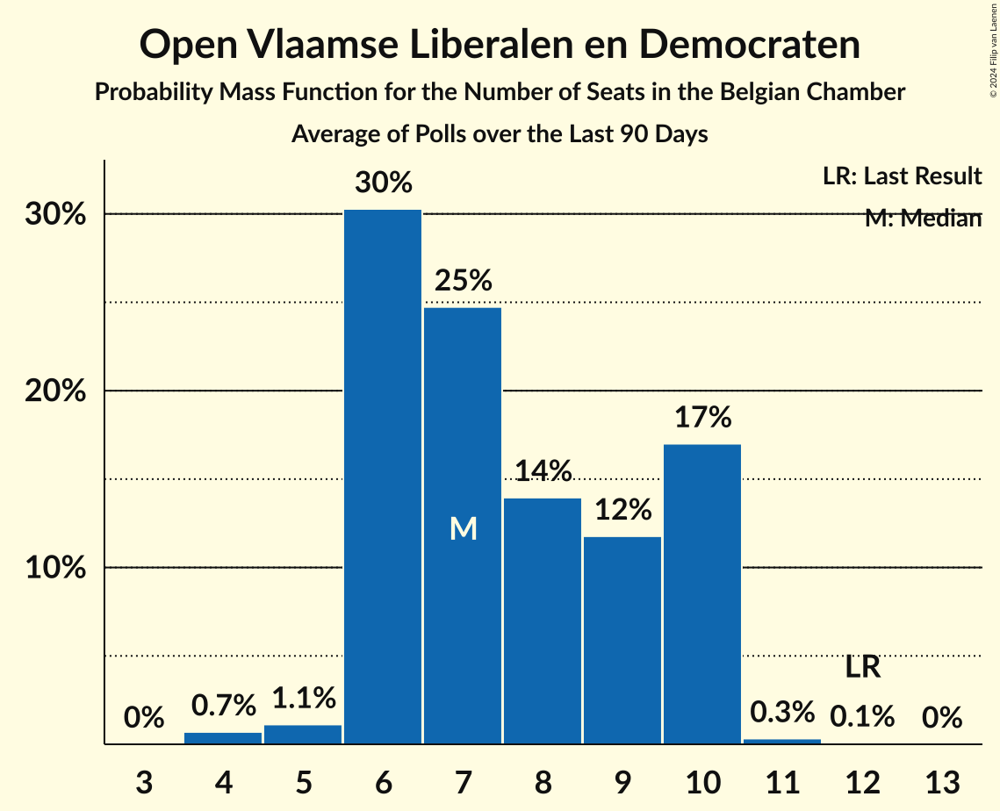

| Number of Seats | Probability | Accumulated | Special Marks |
|:---------------:|:-----------:|:-----------:|:-------------:|
| 4 | 0.7% | 100% |  |
| 5 | 1.1% | 99.3% |  |
| 6 | 30% | 98% |  |
| 7 | 25% | 68% | Median |
| 8 | 14% | 43% |  |
| 9 | 12% | 29% |  |
| 10 | 17% | 17% |  |
| 11 | 0.3% | 0.4% |  |
| 12 | 0.1% | 0.1% | Last Result |
| 13 | 0% | 0% |  |

### Mouvement Réformateur

*For a full overview of the results for this party, see the [Mouvement Réformateur](party-mouvementréformateur.html) page.*

| Number of Seats | Probability | Accumulated | Special Marks |
|:---------------:|:-----------:|:-----------:|:-------------:|
| 13 | 0.1% | 100% |  |
| 14 | 3% | 99.9% | Last Result |
| 15 | 16% | 97% |  |
| 16 | 17% | 82% |  |
| 17 | 14% | 65% |  |
| 18 | 31% | 51% | Median |
| 19 | 18% | 21% |  |
| 20 | 2% | 2% |  |
| 21 | 0.2% | 0.3% |  |
| 22 | 0.1% | 0.1% |  |
| 23 | 0% | 0% |  |

### Vooruit

*For a full overview of the results for this party, see the [Vooruit](party-vooruit.html) page.*

| Number of Seats | Probability | Accumulated | Special Marks |
|:---------------:|:-----------:|:-----------:|:-------------:|
| 6 | 0.2% | 100% |  |
| 7 | 1.1% | 99.8% |  |
| 8 | 2% | 98.7% |  |
| 9 | 9% | 97% | Last Result |
| 10 | 9% | 88% |  |
| 11 | 34% | 79% | Median |
| 12 | 23% | 45% |  |
| 13 | 17% | 22% |  |
| 14 | 4% | 5% |  |
| 15 | 0.7% | 0.9% |  |
| 16 | 0.2% | 0.2% |  |
| 17 | 0% | 0% |  |

### Ecolo

*For a full overview of the results for this party, see the [Ecolo](party-ecolo.html) page.*

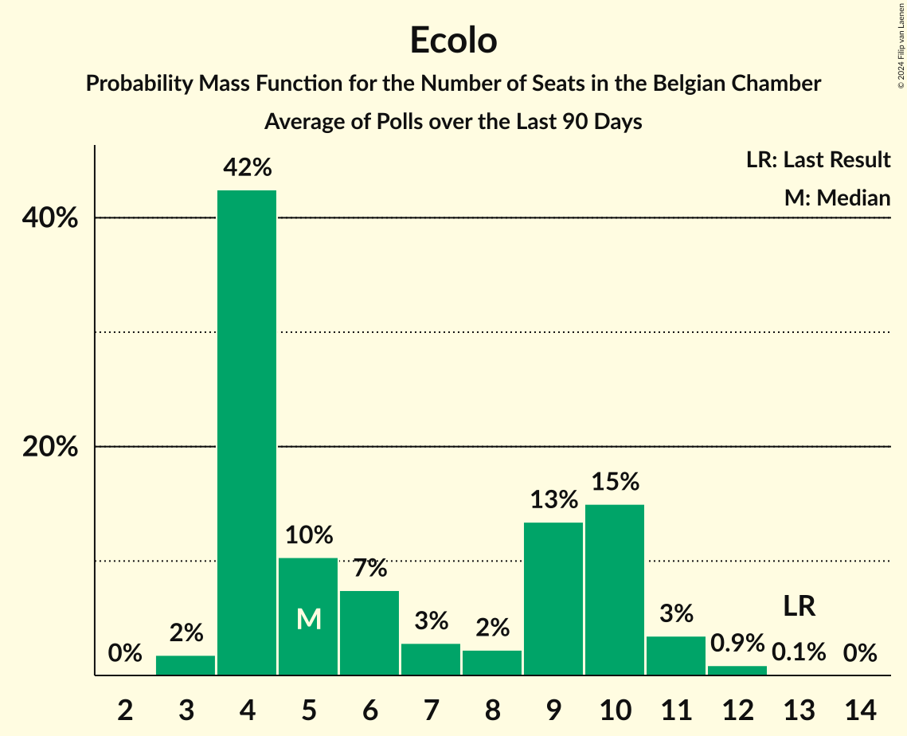

| Number of Seats | Probability | Accumulated | Special Marks |
|:---------------:|:-----------:|:-----------:|:-------------:|
| 3 | 2% | 100% |  |
| 4 | 42% | 98% |  |
| 5 | 10% | 56% | Median |
| 6 | 7% | 45% |  |
| 7 | 3% | 38% |  |
| 8 | 2% | 35% |  |
| 9 | 13% | 33% |  |
| 10 | 15% | 19% |  |
| 11 | 3% | 4% |  |
| 12 | 0.9% | 1.0% |  |
| 13 | 0.1% | 0.1% | Last Result |
| 14 | 0% | 0% |  |

### Groen

*For a full overview of the results for this party, see the [Groen](party-groen.html) page.*

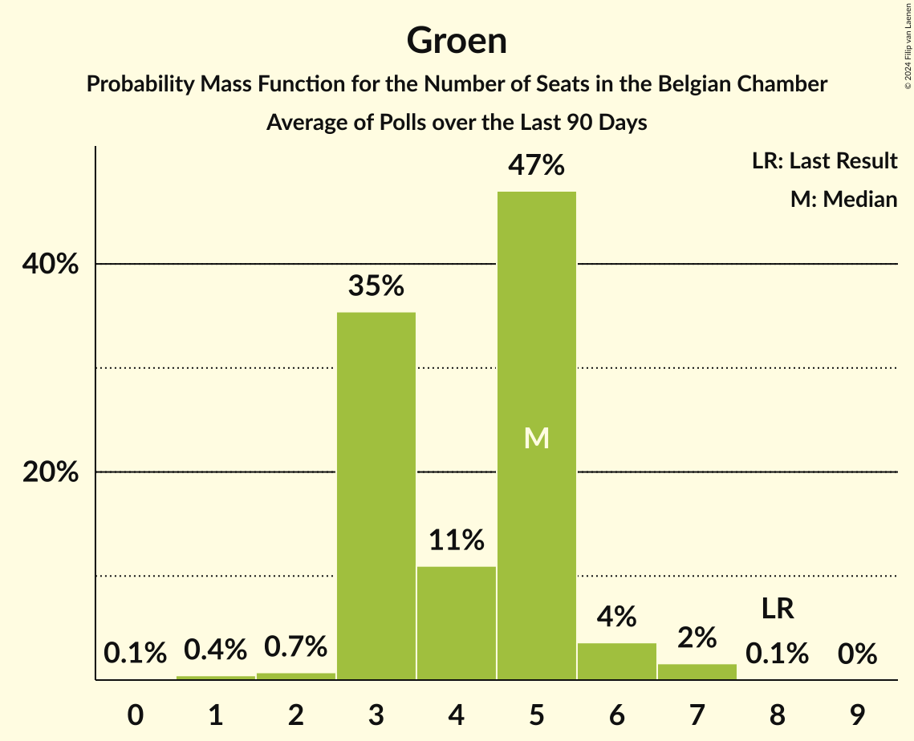

| Number of Seats | Probability | Accumulated | Special Marks |
|:---------------:|:-----------:|:-----------:|:-------------:|
| 0 | 0.1% | 100% |  |
| 1 | 0.4% | 99.9% |  |
| 2 | 0.7% | 99.4% |  |
| 3 | 35% | 98.7% |  |
| 4 | 11% | 63% |  |
| 5 | 47% | 52% | Median |
| 6 | 4% | 5% |  |
| 7 | 2% | 2% |  |
| 8 | 0.1% | 0.1% | Last Result |
| 9 | 0% | 0% |  |

### Parti du Travail de Belgique

*For a full overview of the results for this party, see the [Parti du Travail de Belgique](party-partidutravaildebelgique.html) page.*

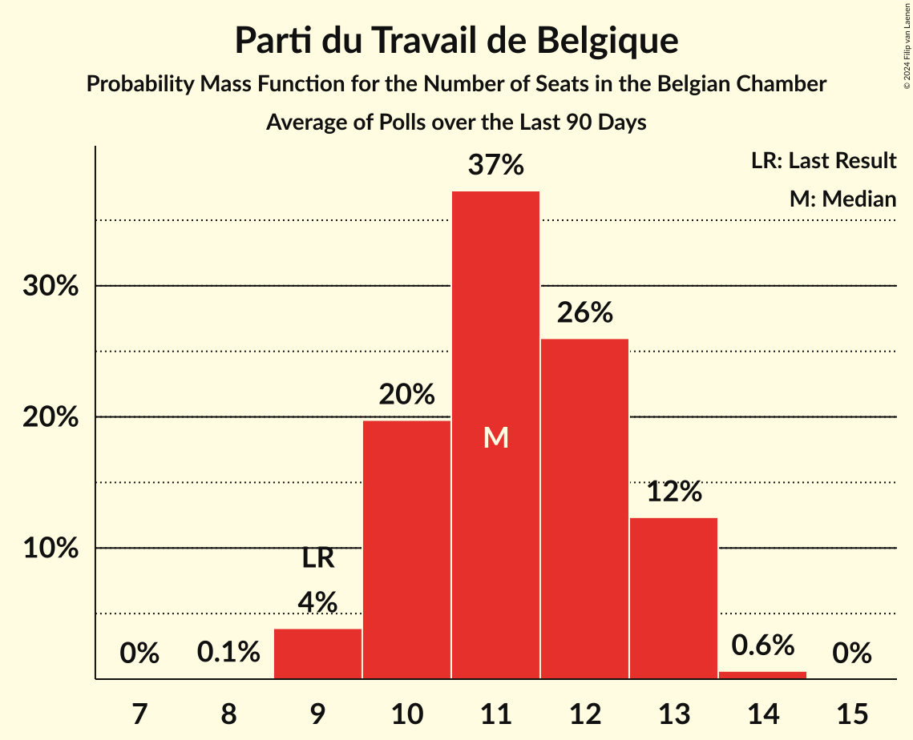

| Number of Seats | Probability | Accumulated | Special Marks |
|:---------------:|:-----------:|:-----------:|:-------------:|
| 8 | 0.1% | 100% |  |
| 9 | 4% | 99.9% | Last Result |
| 10 | 20% | 96% |  |
| 11 | 37% | 76% | Median |
| 12 | 26% | 39% |  |
| 13 | 12% | 13% |  |
| 14 | 0.6% | 0.6% |  |
| 15 | 0% | 0% |  |

### Les Engagés

*For a full overview of the results for this party, see the [Les Engagés](party-lesengagés.html) page.*

| Number of Seats | Probability | Accumulated | Special Marks |
|:---------------:|:-----------:|:-----------:|:-------------:|
| 4 | 0.1% | 100% |  |
| 5 | 0.9% | 99.9% | Last Result |
| 6 | 3% | 99.0% |  |
| 7 | 5% | 96% |  |
| 8 | 10% | 92% |  |
| 9 | 17% | 81% |  |
| 10 | 13% | 64% |  |
| 11 | 22% | 51% | Median |
| 12 | 22% | 29% |  |
| 13 | 6% | 7% |  |
| 14 | 0.7% | 0.8% |  |
| 15 | 0.1% | 0.1% |  |
| 16 | 0% | 0% |  |

### Partij van de Arbeid van België

*For a full overview of the results for this party, see the [Partij van de Arbeid van België](party-partijvandearbeidvanbelgië.html) page.*

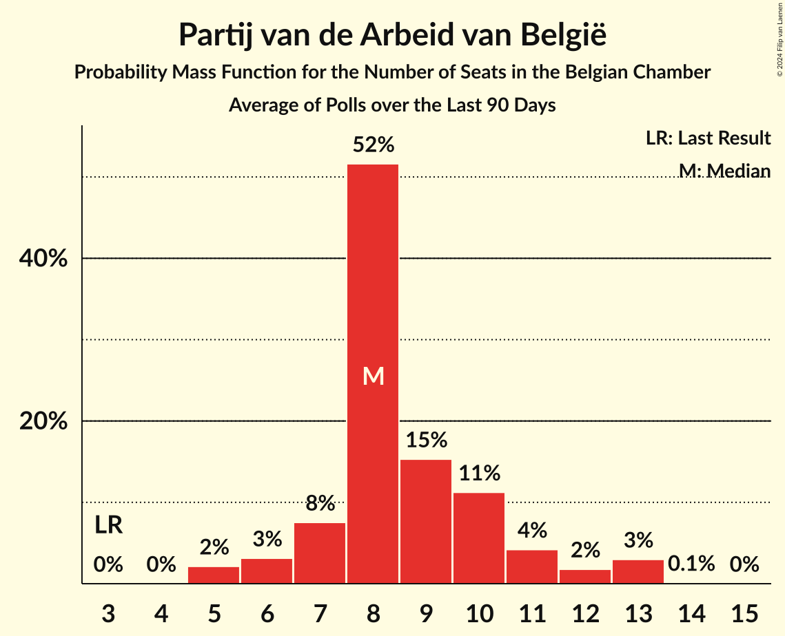

| Number of Seats | Probability | Accumulated | Special Marks |
|:---------------:|:-----------:|:-----------:|:-------------:|
| 3 | 0% | 100% | Last Result |
| 4 | 0% | 100% |  |
| 5 | 2% | 100% |  |
| 6 | 3% | 98% |  |
| 7 | 8% | 95% |  |
| 8 | 52% | 87% | Median |
| 9 | 15% | 36% |  |
| 10 | 11% | 20% |  |
| 11 | 4% | 9% |  |
| 12 | 2% | 5% |  |
| 13 | 3% | 3% |  |
| 14 | 0.1% | 0.1% |  |
| 15 | 0% | 0% |  |

### DéFI

*For a full overview of the results for this party, see the [DéFI](party-défi.html) page.*

| Number of Seats | Probability | Accumulated | Special Marks |
|:---------------:|:-----------:|:-----------:|:-------------:|
| 0 | 0.7% | 100% |  |
| 1 | 93% | 99.3% | Median |
| 2 | 4% | 6% | Last Result |
| 3 | 2% | 2% |  |
| 4 | 0% | 0% |  |

### Parti Populaire

*For a full overview of the results for this party, see the [Parti Populaire](party-partipopulaire.html) page.*

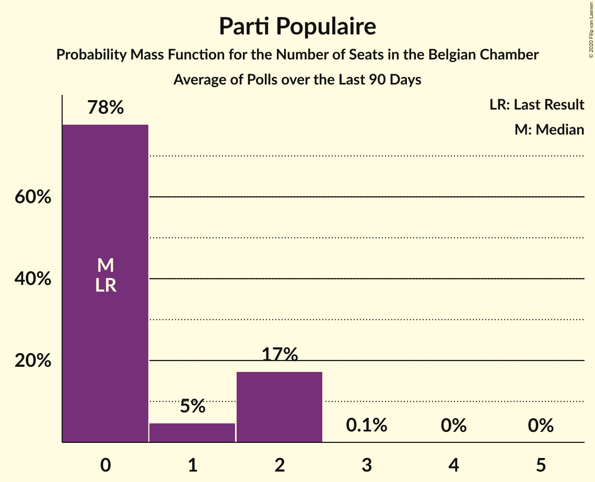

## Coalitions

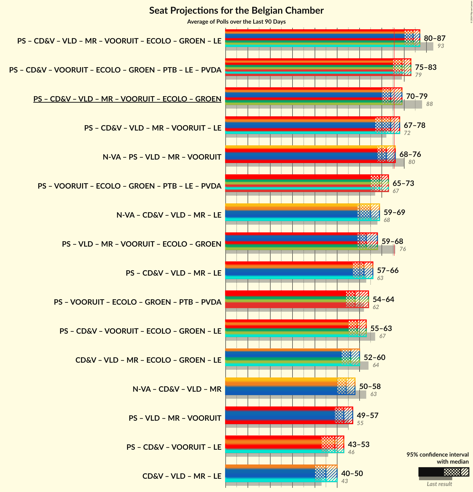

### Confidence Intervals

| Coalition | Last Result | Median | Majority? | 80% Confidence Interval | 90% Confidence Interval | 95% Confidence Interval | 99% Confidence Interval |
|:---------:|:-----------:|:------:|:---------:|:-----------------------:|:-----------------------:|:-----------------------:|:-----------------------:|
| Parti Socialiste – Christen-Democratisch en Vlaams – Open Vlaamse Liberalen en Democraten – Mouvement Réformateur – Vooruit – Ecolo – Groen – Les Engagés | 93 | 84 | 100% | 82–86 | 81–87 | 80–87 | 79–89 |
| Parti Socialiste – Christen-Democratisch en Vlaams – Vooruit – Ecolo – Groen – Parti du Travail de Belgique – Les Engagés – Partij van de Arbeid van België | 79 | 79 | 97% | 77–81 | 76–82 | 75–83 | 74–84 |
| Parti Socialiste – Christen-Democratisch en Vlaams – Open Vlaamse Liberalen en Democraten – Mouvement Réformateur – Vooruit – Ecolo – Groen | 88 | 74 | 22% | 71–77 | 70–78 | 70–79 | 68–80 |
| Parti Socialiste – Christen-Democratisch en Vlaams – Open Vlaamse Liberalen en Democraten – Mouvement Réformateur – Vooruit – Les Engagés | 72 | 74 | 28% | 69–77 | 68–78 | 67–78 | 66–80 |
| Nieuw-Vlaamse Alliantie – Parti Socialiste – Open Vlaamse Liberalen en Democraten – Mouvement Réformateur – Vooruit | 80 | 72 | 5% | 69–75 | 69–75 | 68–76 | 66–77 |
| Parti Socialiste – Vooruit – Ecolo – Groen – Parti du Travail de Belgique – Les Engagés – Partij van de Arbeid van België | 67 | 69 | 0.1% | 66–71 | 66–72 | 65–73 | 64–74 |
| Nieuw-Vlaamse Alliantie – Christen-Democratisch en Vlaams – Open Vlaamse Liberalen en Democraten – Mouvement Réformateur – Les Engagés | 68 | 65 | 0% | 61–68 | 60–68 | 59–69 | 58–70 |
| Parti Socialiste – Open Vlaamse Liberalen en Democraten – Mouvement Réformateur – Vooruit – Ecolo – Groen | 76 | 63 | 0% | 61–67 | 60–68 | 59–68 | 58–70 |
| Parti Socialiste – Christen-Democratisch en Vlaams – Open Vlaamse Liberalen en Democraten – Mouvement Réformateur – Les Engagés | 63 | 62 | 0% | 59–65 | 58–66 | 57–66 | 56–68 |
| Parti Socialiste – Vooruit – Ecolo – Groen – Parti du Travail de Belgique – Partij van de Arbeid van België | 62 | 58 | 0% | 55–62 | 54–63 | 54–64 | 53–66 |
| Parti Socialiste – Christen-Democratisch en Vlaams – Vooruit – Ecolo – Groen – Les Engagés | 67 | 59 | 0% | 57–62 | 56–62 | 55–63 | 54–64 |
| Christen-Democratisch en Vlaams – Open Vlaamse Liberalen en Democraten – Mouvement Réformateur – Ecolo – Groen – Les Engagés | 64 | 56 | 0% | 53–58 | 53–59 | 52–60 | 51–61 |
| Nieuw-Vlaamse Alliantie – Christen-Democratisch en Vlaams – Open Vlaamse Liberalen en Democraten – Mouvement Réformateur | 63 | 54 | 0% | 52–57 | 51–57 | 50–58 | 49–59 |
| Parti Socialiste – Open Vlaamse Liberalen en Democraten – Mouvement Réformateur – Vooruit | 55 | 53 | 0% | 50–55 | 49–56 | 49–57 | 47–58 |
| Parti Socialiste – Christen-Democratisch en Vlaams – Vooruit – Les Engagés | 46 | 49 | 0% | 45–52 | 44–53 | 43–53 | 41–55 |
| Christen-Democratisch en Vlaams – Open Vlaamse Liberalen en Democraten – Mouvement Réformateur – Les Engagés | 43 | 45 | 0% | 42–48 | 41–49 | 40–50 | 38–51 |

### Parti Socialiste – Christen-Democratisch en Vlaams – Open Vlaamse Liberalen en Democraten – Mouvement Réformateur – Vooruit – Ecolo – Groen – Les Engagés

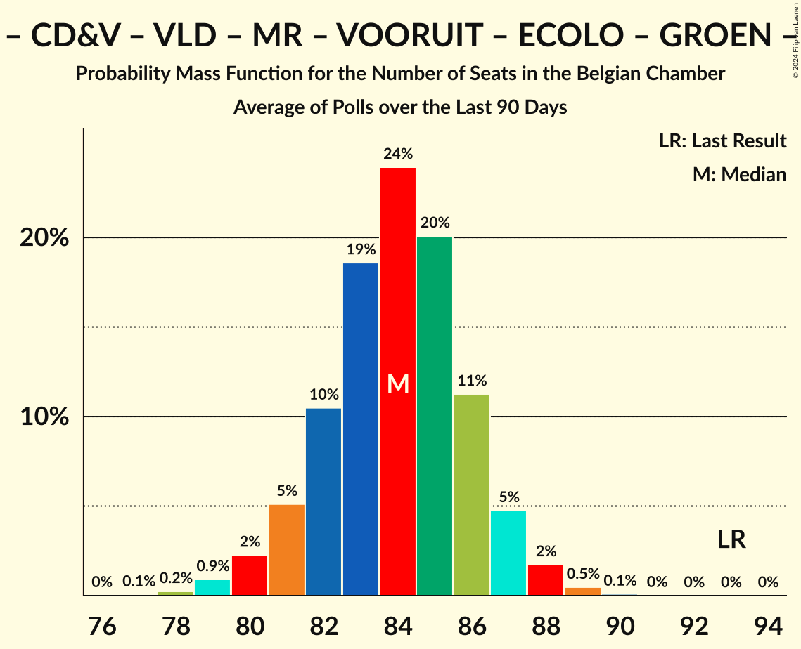

| Number of Seats | Probability | Accumulated | Special Marks |
|:---------------:|:-----------:|:-----------:|:-------------:|
| 77 | 0.1% | 100% |  |
| 78 | 0.2% | 99.9% |  |
| 79 | 0.9% | 99.7% |  |
| 80 | 2% | 98.8% |  |
| 81 | 5% | 97% |  |
| 82 | 10% | 91% |  |
| 83 | 19% | 81% |  |
| 84 | 24% | 62% | Median |
| 85 | 20% | 38% |  |
| 86 | 11% | 18% |  |
| 87 | 5% | 7% |  |
| 88 | 2% | 2% |  |
| 89 | 0.5% | 0.6% |  |
| 90 | 0.1% | 0.1% |  |
| 91 | 0% | 0% |  |
| 92 | 0% | 0% |  |
| 93 | 0% | 0% | Last Result |

### Parti Socialiste – Christen-Democratisch en Vlaams – Vooruit – Ecolo – Groen – Parti du Travail de Belgique – Les Engagés – Partij van de Arbeid van België

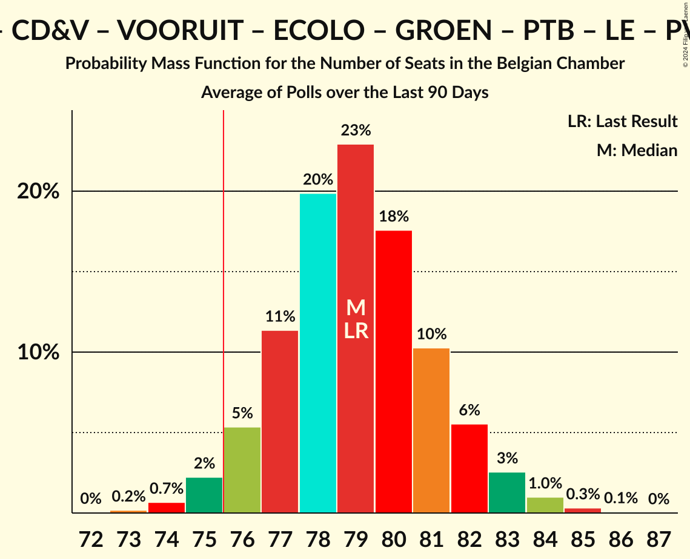

| Number of Seats | Probability | Accumulated | Special Marks |
|:---------------:|:-----------:|:-----------:|:-------------:|
| 72 | 0% | 100% |  |
| 73 | 0.2% | 99.9% |  |
| 74 | 0.7% | 99.8% |  |
| 75 | 2% | 99.1% |  |
| 76 | 5% | 97% | Majority |
| 77 | 11% | 92% |  |
| 78 | 20% | 80% | Median |
| 79 | 23% | 60% | Last Result |
| 80 | 18% | 37% |  |
| 81 | 10% | 20% |  |
| 82 | 6% | 10% |  |
| 83 | 3% | 4% |  |
| 84 | 1.0% | 1.4% |  |
| 85 | 0.3% | 0.4% |  |
| 86 | 0.1% | 0.1% |  |
| 87 | 0% | 0% |  |

### Parti Socialiste – Christen-Democratisch en Vlaams – Open Vlaamse Liberalen en Democraten – Mouvement Réformateur – Vooruit – Ecolo – Groen

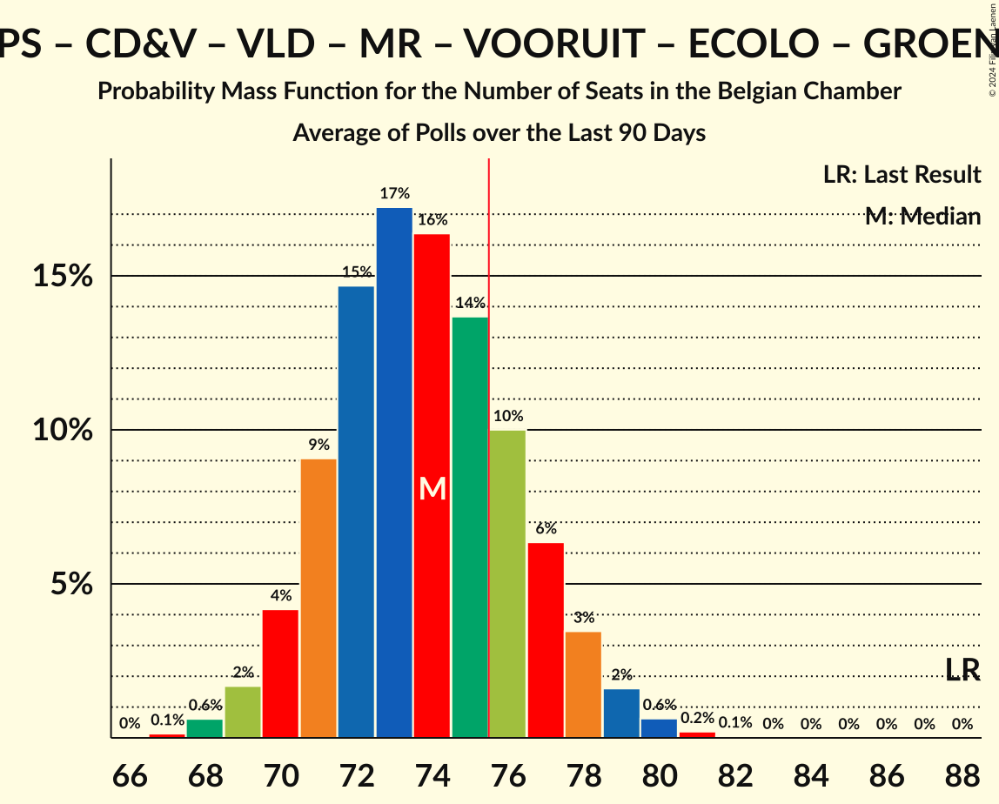

| Number of Seats | Probability | Accumulated | Special Marks |
|:---------------:|:-----------:|:-----------:|:-------------:|
| 67 | 0.1% | 100% |  |
| 68 | 0.6% | 99.8% |  |
| 69 | 2% | 99.2% |  |
| 70 | 4% | 98% |  |
| 71 | 9% | 93% |  |
| 72 | 15% | 84% |  |
| 73 | 17% | 70% | Median |
| 74 | 16% | 52% |  |
| 75 | 14% | 36% |  |
| 76 | 10% | 22% | Majority |
| 77 | 6% | 12% |  |
| 78 | 3% | 6% |  |
| 79 | 2% | 3% |  |
| 80 | 0.6% | 0.9% |  |
| 81 | 0.2% | 0.3% |  |
| 82 | 0.1% | 0.1% |  |
| 83 | 0% | 0% |  |
| 84 | 0% | 0% |  |
| 85 | 0% | 0% |  |
| 86 | 0% | 0% |  |
| 87 | 0% | 0% |  |
| 88 | 0% | 0% | Last Result |

### Parti Socialiste – Christen-Democratisch en Vlaams – Open Vlaamse Liberalen en Democraten – Mouvement Réformateur – Vooruit – Les Engagés

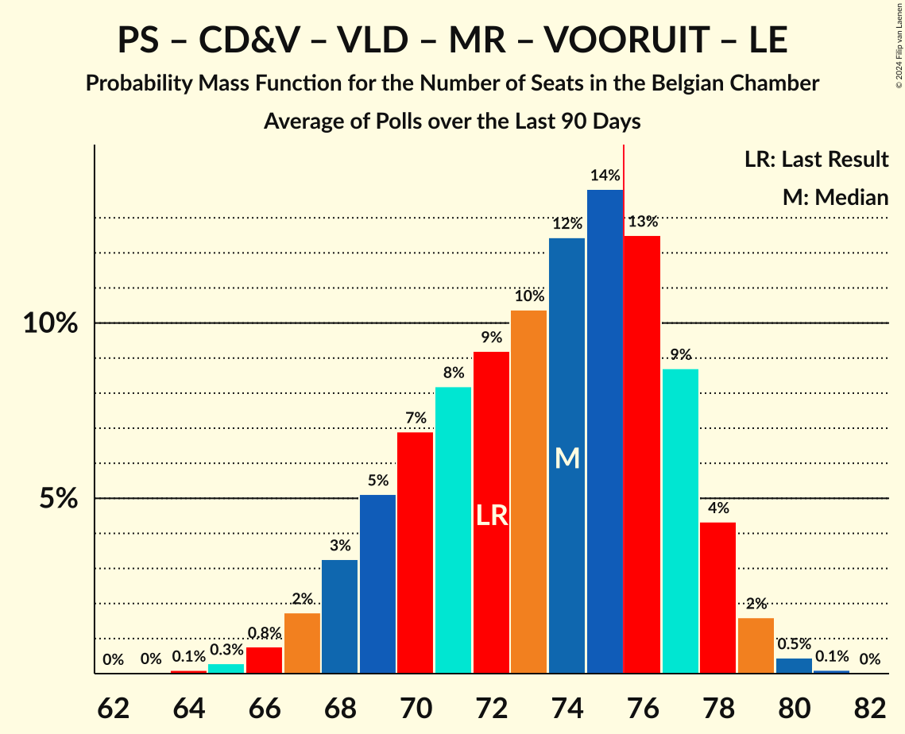

| Number of Seats | Probability | Accumulated | Special Marks |
|:---------------:|:-----------:|:-----------:|:-------------:|
| 64 | 0.1% | 100% |  |
| 65 | 0.3% | 99.9% |  |
| 66 | 0.8% | 99.6% |  |
| 67 | 2% | 98.8% |  |
| 68 | 3% | 97% |  |
| 69 | 5% | 94% |  |
| 70 | 7% | 89% |  |
| 71 | 8% | 82% |  |
| 72 | 9% | 74% | Last Result |
| 73 | 10% | 64% |  |
| 74 | 12% | 54% | Median |
| 75 | 14% | 42% |  |
| 76 | 13% | 28% | Majority |
| 77 | 9% | 15% |  |
| 78 | 4% | 7% |  |
| 79 | 2% | 2% |  |
| 80 | 0.5% | 0.6% |  |
| 81 | 0.1% | 0.1% |  |
| 82 | 0% | 0% |  |

### Nieuw-Vlaamse Alliantie – Parti Socialiste – Open Vlaamse Liberalen en Democraten – Mouvement Réformateur – Vooruit

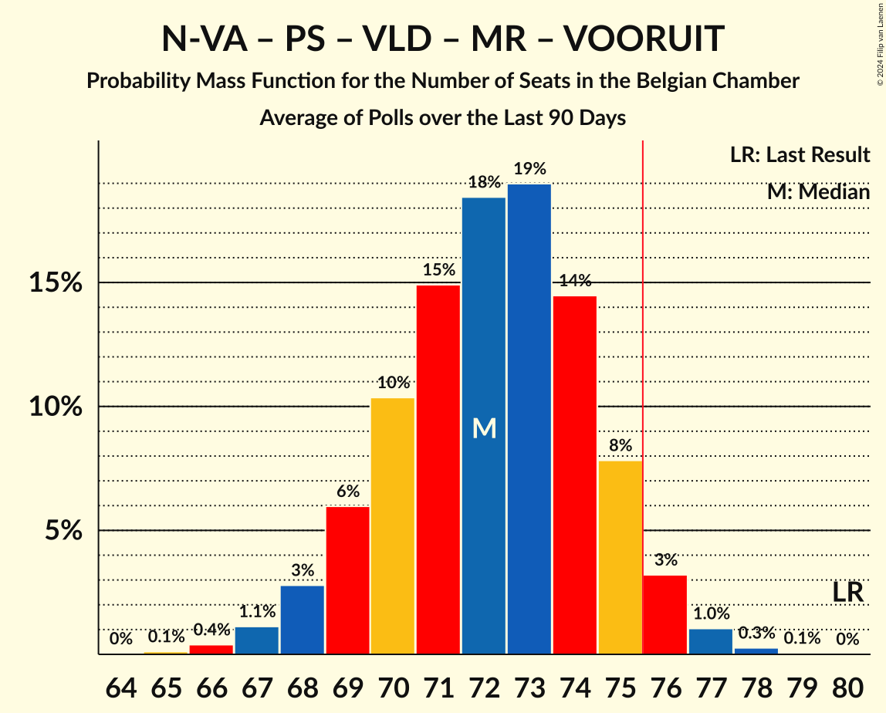

| Number of Seats | Probability | Accumulated | Special Marks |
|:---------------:|:-----------:|:-----------:|:-------------:|
| 65 | 0.1% | 100% |  |
| 66 | 0.4% | 99.9% |  |
| 67 | 1.1% | 99.5% |  |
| 68 | 3% | 98% |  |
| 69 | 6% | 96% |  |
| 70 | 10% | 90% |  |
| 71 | 15% | 79% |  |
| 72 | 18% | 64% |  |
| 73 | 19% | 46% | Median |
| 74 | 14% | 27% |  |
| 75 | 8% | 12% |  |
| 76 | 3% | 5% | Majority |
| 77 | 1.0% | 1.4% |  |
| 78 | 0.3% | 0.3% |  |
| 79 | 0.1% | 0.1% |  |
| 80 | 0% | 0% | Last Result |

### Parti Socialiste – Vooruit – Ecolo – Groen – Parti du Travail de Belgique – Les Engagés – Partij van de Arbeid van België

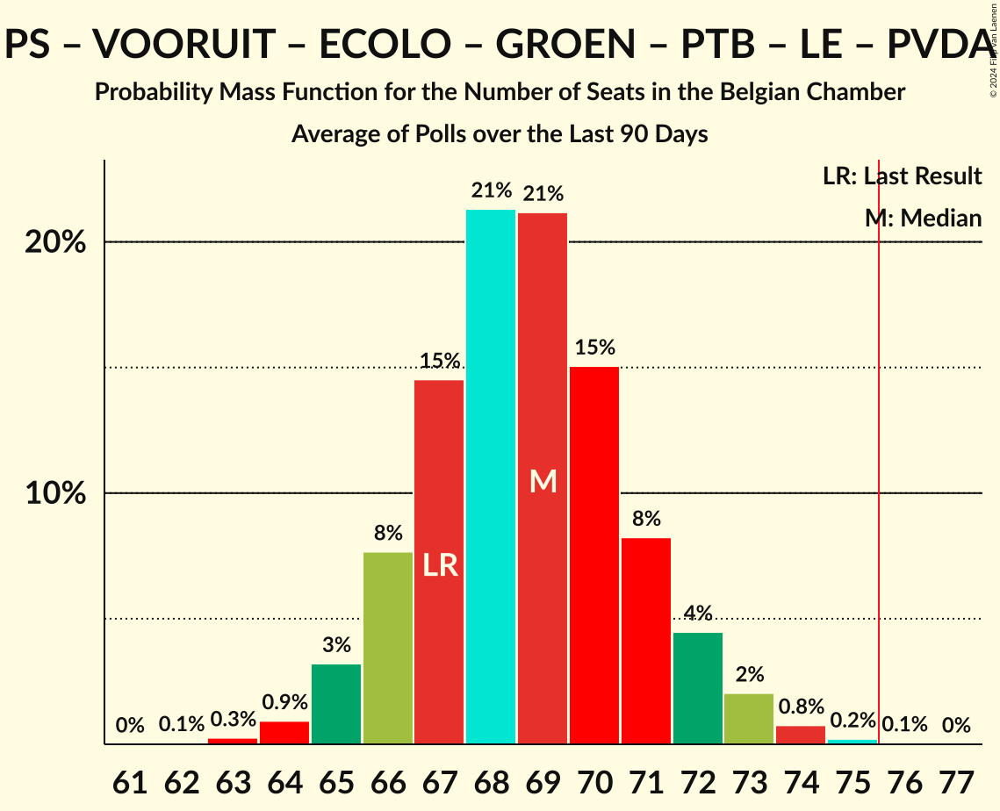

| Number of Seats | Probability | Accumulated | Special Marks |
|:---------------:|:-----------:|:-----------:|:-------------:|
| 62 | 0.1% | 100% |  |
| 63 | 0.3% | 99.9% |  |
| 64 | 0.9% | 99.7% |  |
| 65 | 3% | 98.7% |  |
| 66 | 8% | 96% |  |
| 67 | 15% | 88% | Last Result |
| 68 | 21% | 73% | Median |
| 69 | 21% | 52% |  |
| 70 | 15% | 31% |  |
| 71 | 8% | 16% |  |
| 72 | 4% | 8% |  |
| 73 | 2% | 3% |  |
| 74 | 0.8% | 1.0% |  |
| 75 | 0.2% | 0.3% |  |
| 76 | 0.1% | 0.1% | Majority |
| 77 | 0% | 0% |  |

### Nieuw-Vlaamse Alliantie – Christen-Democratisch en Vlaams – Open Vlaamse Liberalen en Democraten – Mouvement Réformateur – Les Engagés

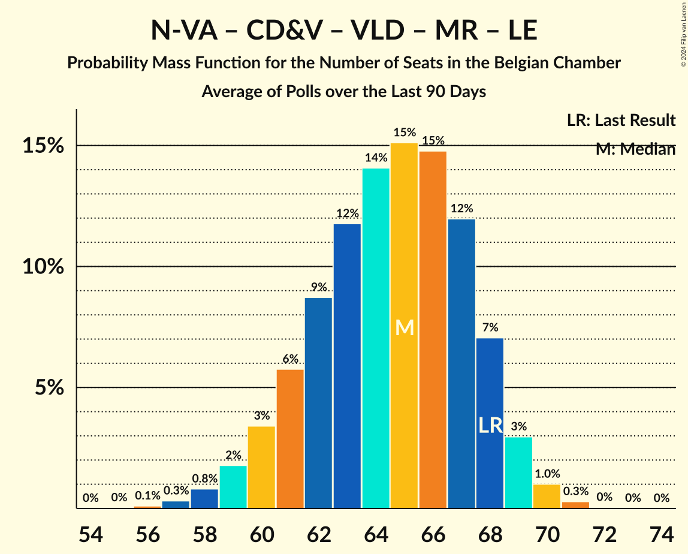

| Number of Seats | Probability | Accumulated | Special Marks |
|:---------------:|:-----------:|:-----------:|:-------------:|
| 56 | 0.1% | 100% |  |
| 57 | 0.3% | 99.9% |  |
| 58 | 0.8% | 99.5% |  |
| 59 | 2% | 98.7% |  |
| 60 | 3% | 97% |  |
| 61 | 6% | 94% |  |
| 62 | 9% | 88% |  |
| 63 | 12% | 79% |  |
| 64 | 14% | 67% |  |
| 65 | 15% | 53% |  |
| 66 | 15% | 38% | Median |
| 67 | 12% | 23% |  |
| 68 | 7% | 11% | Last Result |
| 69 | 3% | 4% |  |
| 70 | 1.0% | 1.3% |  |
| 71 | 0.3% | 0.3% |  |
| 72 | 0% | 0.1% |  |
| 73 | 0% | 0% |  |

### Parti Socialiste – Open Vlaamse Liberalen en Democraten – Mouvement Réformateur – Vooruit – Ecolo – Groen

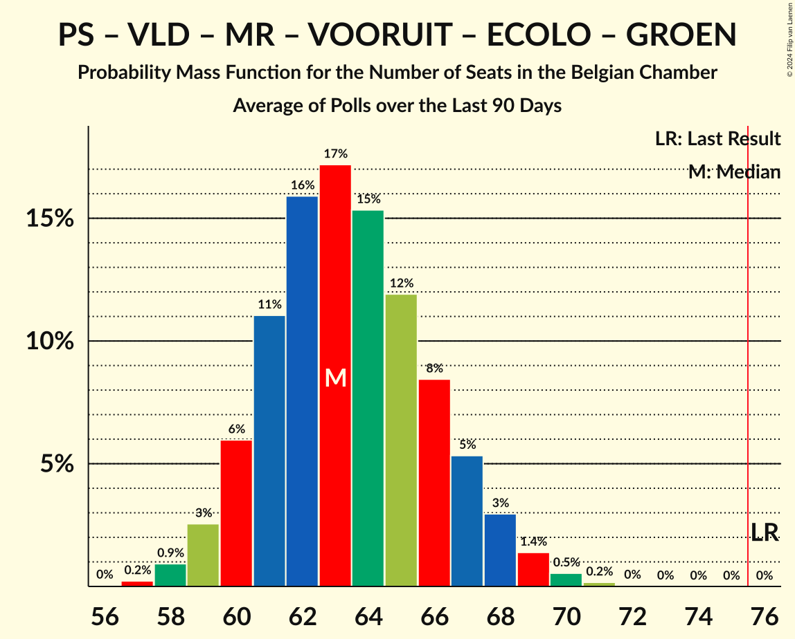

| Number of Seats | Probability | Accumulated | Special Marks |
|:---------------:|:-----------:|:-----------:|:-------------:|
| 56 | 0% | 100% |  |
| 57 | 0.2% | 99.9% |  |
| 58 | 0.9% | 99.7% |  |
| 59 | 3% | 98.8% |  |
| 60 | 6% | 96% |  |
| 61 | 11% | 90% |  |
| 62 | 16% | 79% |  |
| 63 | 17% | 63% | Median |
| 64 | 15% | 46% |  |
| 65 | 12% | 31% |  |
| 66 | 8% | 19% |  |
| 67 | 5% | 10% |  |
| 68 | 3% | 5% |  |
| 69 | 1.4% | 2% |  |
| 70 | 0.5% | 0.8% |  |
| 71 | 0.2% | 0.2% |  |
| 72 | 0% | 0.1% |  |
| 73 | 0% | 0% |  |
| 74 | 0% | 0% |  |
| 75 | 0% | 0% |  |
| 76 | 0% | 0% | Last Result, Majority |

### Parti Socialiste – Christen-Democratisch en Vlaams – Open Vlaamse Liberalen en Democraten – Mouvement Réformateur – Les Engagés

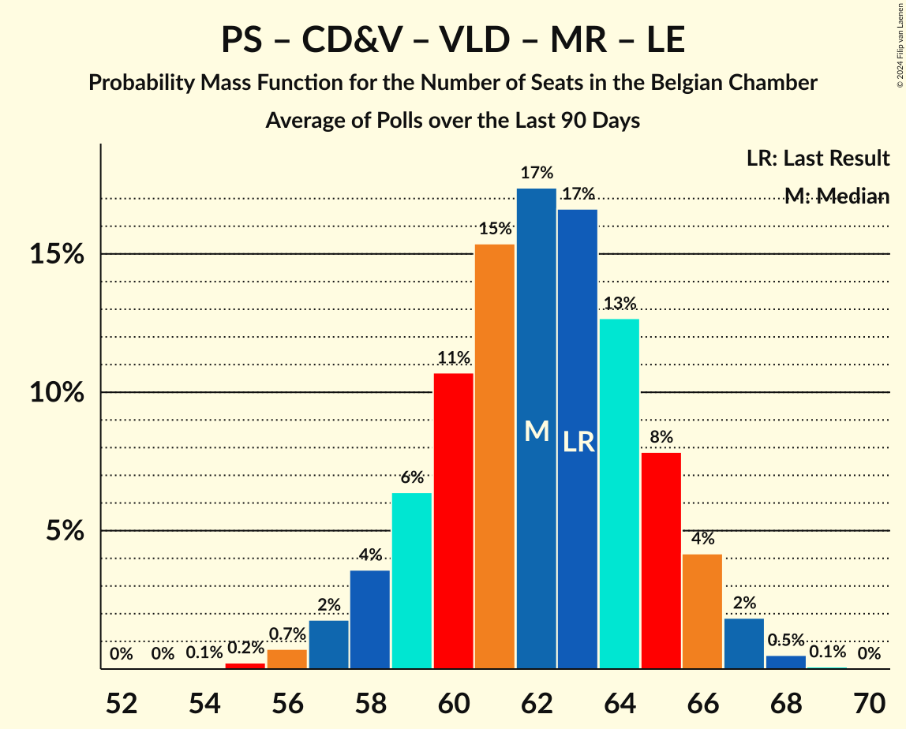

| Number of Seats | Probability | Accumulated | Special Marks |
|:---------------:|:-----------:|:-----------:|:-------------:|
| 54 | 0.1% | 100% |  |
| 55 | 0.2% | 99.9% |  |
| 56 | 0.7% | 99.7% |  |
| 57 | 2% | 99.0% |  |
| 58 | 4% | 97% |  |
| 59 | 6% | 94% |  |
| 60 | 11% | 87% |  |
| 61 | 15% | 77% |  |
| 62 | 17% | 61% |  |
| 63 | 17% | 44% | Last Result, Median |
| 64 | 13% | 27% |  |
| 65 | 8% | 14% |  |
| 66 | 4% | 7% |  |
| 67 | 2% | 2% |  |
| 68 | 0.5% | 0.6% |  |
| 69 | 0.1% | 0.1% |  |
| 70 | 0% | 0% |  |

### Parti Socialiste – Vooruit – Ecolo – Groen – Parti du Travail de Belgique – Partij van de Arbeid van België

| Number of Seats | Probability | Accumulated | Special Marks |
|:---------------:|:-----------:|:-----------:|:-------------:|
| 51 | 0.1% | 100% |  |
| 52 | 0.3% | 99.9% |  |
| 53 | 1.4% | 99.6% |  |
| 54 | 4% | 98% |  |
| 55 | 8% | 94% |  |
| 56 | 13% | 87% |  |
| 57 | 15% | 74% | Median |
| 58 | 14% | 59% |  |
| 59 | 12% | 45% |  |
| 60 | 10% | 33% |  |
| 61 | 8% | 23% |  |
| 62 | 6% | 15% | Last Result |
| 63 | 4% | 9% |  |
| 64 | 3% | 5% |  |
| 65 | 1.4% | 2% |  |
| 66 | 0.7% | 1.1% |  |
| 67 | 0.3% | 0.4% |  |
| 68 | 0.1% | 0.1% |  |
| 69 | 0% | 0% |  |

### Parti Socialiste – Christen-Democratisch en Vlaams – Vooruit – Ecolo – Groen – Les Engagés

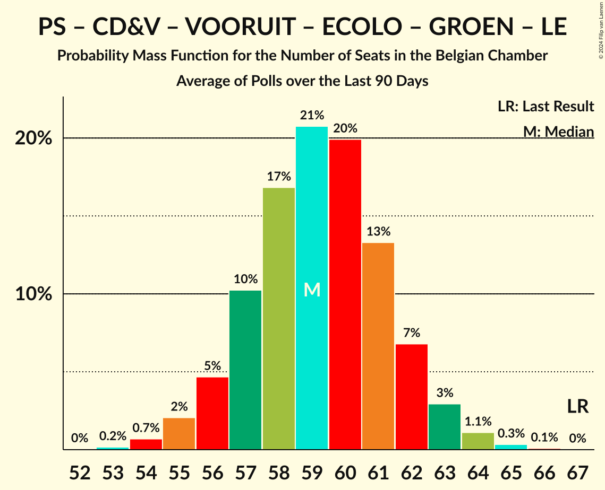

| Number of Seats | Probability | Accumulated | Special Marks |
|:---------------:|:-----------:|:-----------:|:-------------:|
| 52 | 0% | 100% |  |
| 53 | 0.2% | 99.9% |  |
| 54 | 0.7% | 99.8% |  |
| 55 | 2% | 99.1% |  |
| 56 | 5% | 97% |  |
| 57 | 10% | 92% |  |
| 58 | 17% | 82% |  |
| 59 | 21% | 65% | Median |
| 60 | 20% | 45% |  |
| 61 | 13% | 25% |  |
| 62 | 7% | 11% |  |
| 63 | 3% | 5% |  |
| 64 | 1.1% | 2% |  |
| 65 | 0.3% | 0.5% |  |
| 66 | 0.1% | 0.1% |  |
| 67 | 0% | 0% | Last Result |

### Christen-Democratisch en Vlaams – Open Vlaamse Liberalen en Democraten – Mouvement Réformateur – Ecolo – Groen – Les Engagés

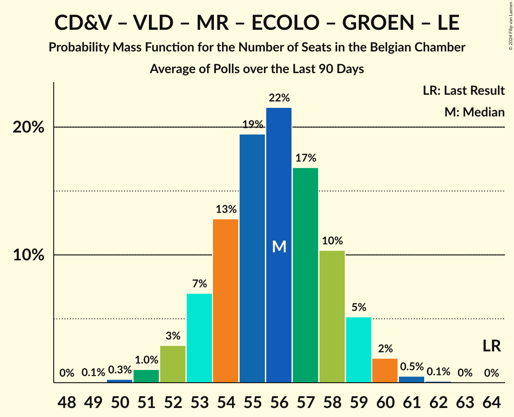

| Number of Seats | Probability | Accumulated | Special Marks |
|:---------------:|:-----------:|:-----------:|:-------------:|
| 49 | 0.1% | 100% |  |
| 50 | 0.3% | 99.9% |  |
| 51 | 1.0% | 99.7% |  |
| 52 | 3% | 98.6% |  |
| 53 | 7% | 96% |  |
| 54 | 13% | 89% |  |
| 55 | 19% | 76% |  |
| 56 | 22% | 56% | Median |
| 57 | 17% | 35% |  |
| 58 | 10% | 18% |  |
| 59 | 5% | 8% |  |
| 60 | 2% | 3% |  |
| 61 | 0.5% | 0.7% |  |
| 62 | 0.1% | 0.1% |  |
| 63 | 0% | 0% |  |
| 64 | 0% | 0% | Last Result |

### Nieuw-Vlaamse Alliantie – Christen-Democratisch en Vlaams – Open Vlaamse Liberalen en Democraten – Mouvement Réformateur

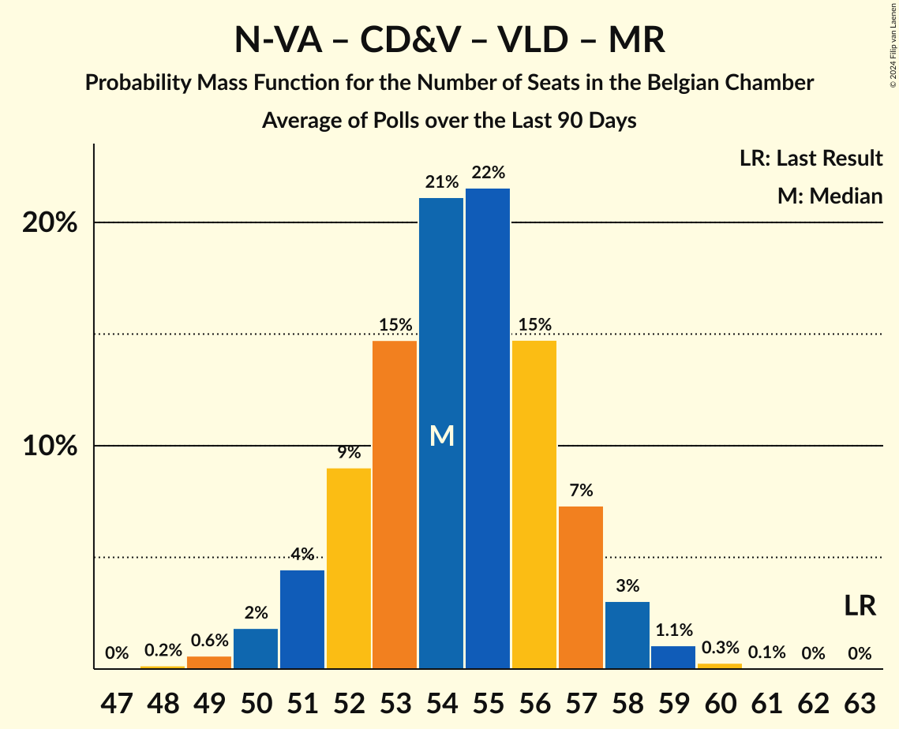

| Number of Seats | Probability | Accumulated | Special Marks |
|:---------------:|:-----------:|:-----------:|:-------------:|
| 48 | 0.2% | 100% |  |
| 49 | 0.6% | 99.8% |  |
| 50 | 2% | 99.2% |  |
| 51 | 4% | 97% |  |
| 52 | 9% | 93% |  |
| 53 | 15% | 84% |  |
| 54 | 21% | 69% |  |
| 55 | 22% | 48% | Median |
| 56 | 15% | 27% |  |
| 57 | 7% | 12% |  |
| 58 | 3% | 4% |  |
| 59 | 1.1% | 1.4% |  |
| 60 | 0.3% | 0.4% |  |
| 61 | 0.1% | 0.1% |  |
| 62 | 0% | 0% |  |
| 63 | 0% | 0% | Last Result |

### Parti Socialiste – Open Vlaamse Liberalen en Democraten – Mouvement Réformateur – Vooruit

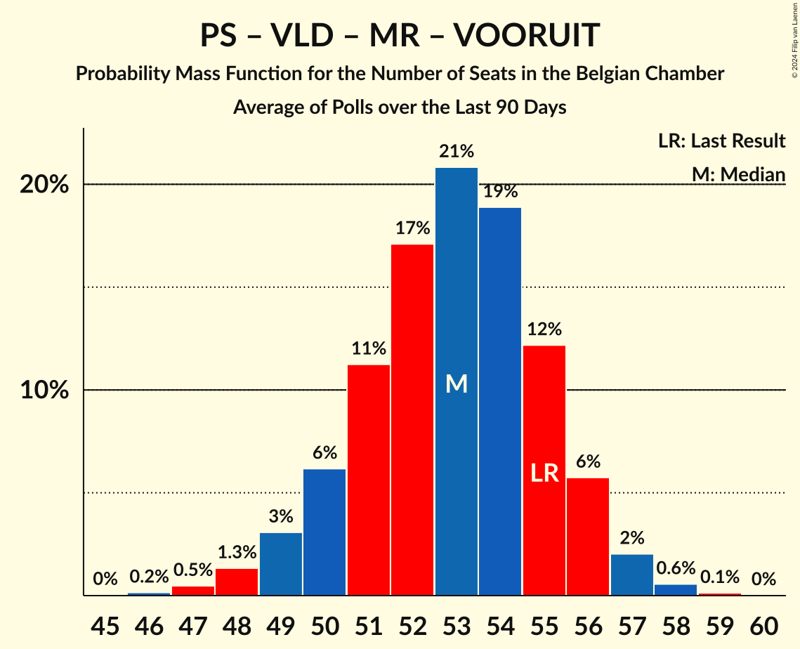

| Number of Seats | Probability | Accumulated | Special Marks |
|:---------------:|:-----------:|:-----------:|:-------------:|
| 46 | 0.2% | 100% |  |
| 47 | 0.5% | 99.8% |  |
| 48 | 1.3% | 99.3% |  |
| 49 | 3% | 98% |  |
| 50 | 6% | 95% |  |
| 51 | 11% | 89% |  |
| 52 | 17% | 77% |  |
| 53 | 21% | 60% | Median |
| 54 | 19% | 40% |  |
| 55 | 12% | 21% | Last Result |
| 56 | 6% | 8% |  |
| 57 | 2% | 3% |  |
| 58 | 0.6% | 0.7% |  |
| 59 | 0.1% | 0.2% |  |
| 60 | 0% | 0% |  |

### Parti Socialiste – Christen-Democratisch en Vlaams – Vooruit – Les Engagés

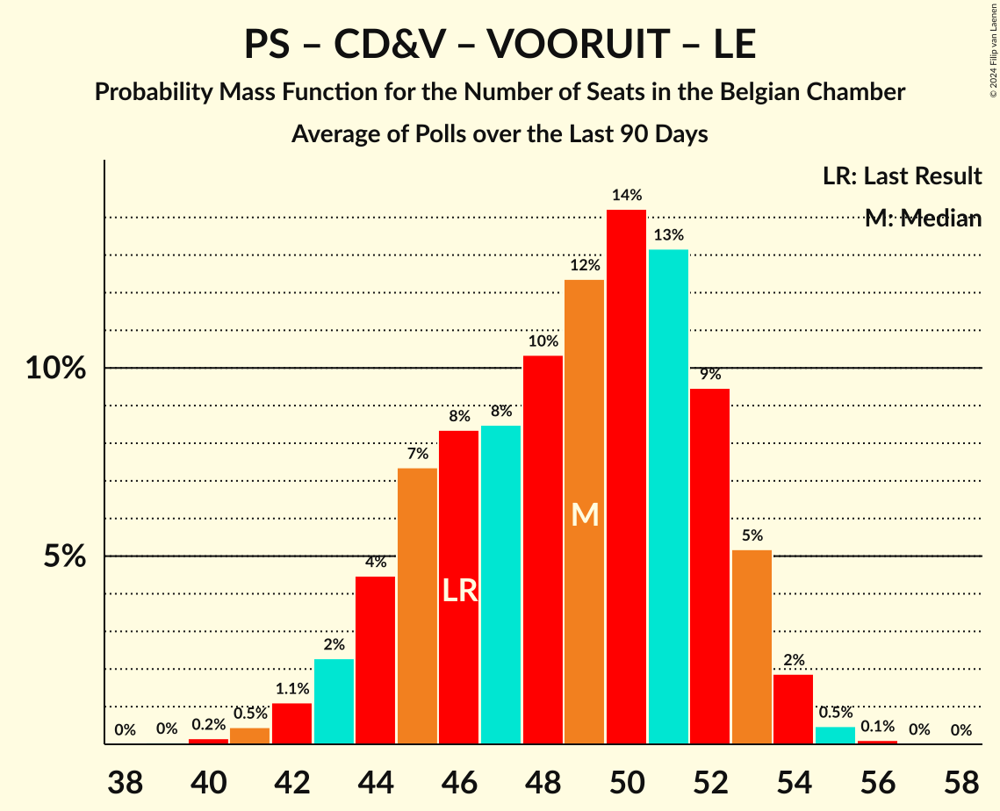

| Number of Seats | Probability | Accumulated | Special Marks |
|:---------------:|:-----------:|:-----------:|:-------------:|
| 39 | 0% | 100% |  |
| 40 | 0.2% | 99.9% |  |
| 41 | 0.5% | 99.8% |  |
| 42 | 1.1% | 99.3% |  |
| 43 | 2% | 98% |  |
| 44 | 4% | 96% |  |
| 45 | 7% | 91% |  |
| 46 | 8% | 84% | Last Result |
| 47 | 8% | 76% |  |
| 48 | 10% | 67% |  |
| 49 | 12% | 57% | Median |
| 50 | 14% | 45% |  |
| 51 | 13% | 30% |  |
| 52 | 9% | 17% |  |
| 53 | 5% | 8% |  |
| 54 | 2% | 2% |  |
| 55 | 0.5% | 0.6% |  |
| 56 | 0.1% | 0.1% |  |
| 57 | 0% | 0% |  |

### Christen-Democratisch en Vlaams – Open Vlaamse Liberalen en Democraten – Mouvement Réformateur – Les Engagés

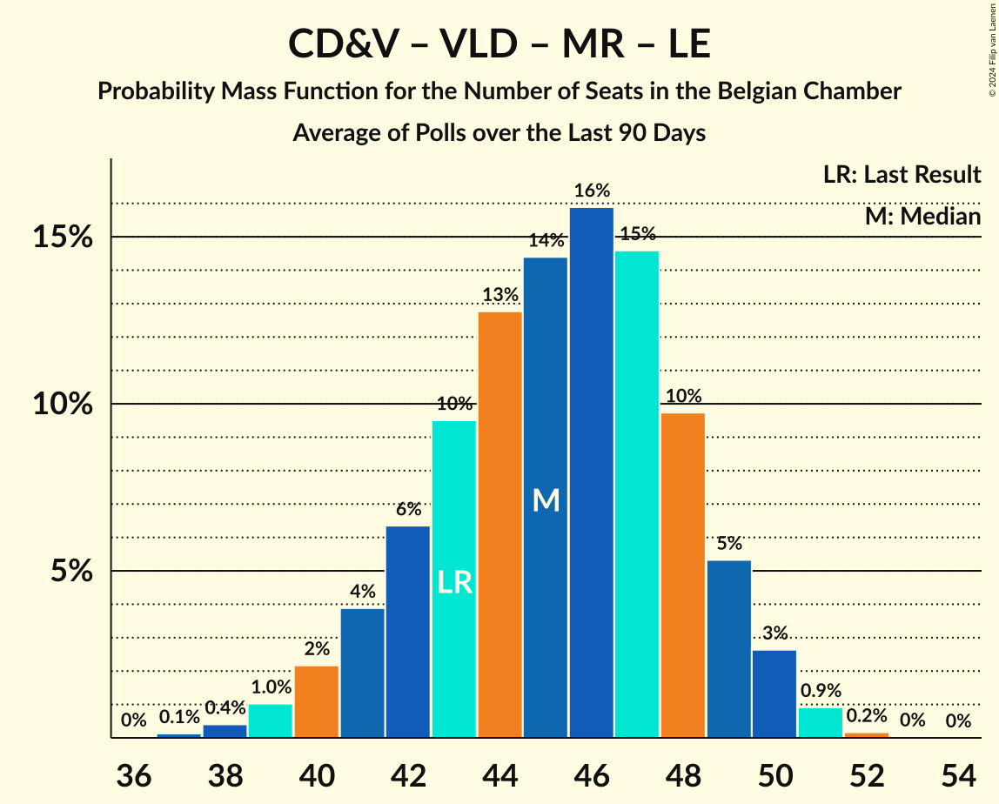

| Number of Seats | Probability | Accumulated | Special Marks |
|:---------------:|:-----------:|:-----------:|:-------------:|
| 37 | 0.1% | 100% |  |
| 38 | 0.4% | 99.8% |  |
| 39 | 1.0% | 99.4% |  |
| 40 | 2% | 98% |  |
| 41 | 4% | 96% |  |
| 42 | 6% | 92% |  |
| 43 | 10% | 86% | Last Result |
| 44 | 13% | 76% |  |
| 45 | 14% | 64% |  |
| 46 | 16% | 49% | Median |
| 47 | 15% | 33% |  |
| 48 | 10% | 19% |  |
| 49 | 5% | 9% |  |
| 50 | 3% | 4% |  |
| 51 | 0.9% | 1.1% |  |
| 52 | 0.2% | 0.2% |  |
| 53 | 0% | 0% |  |

## Technical Information

+ **Number of polls included in this average:** 3
+ **Lowest number of simulations done in a poll included in this average:** 2,097,152
+ **Total number of simulations done in the polls included in this average:** 6,291,456
+ **Error estimate:** 0.76%
