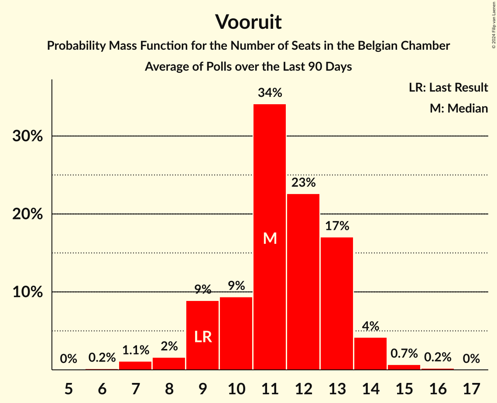

# Vooruit

<a href="#voting-intentions">Voting Intentions</a> | <a href="#seats">Seats</a>

## Voting Intentions

Last result: **6.7%** (General Election of 26 May 2019)

### Confidence Intervals

| Period     | Polling firm/Commissioner(s) | Median | 80% Confidence Interval | 90% Confidence Interval | 95% Confidence Interval | 99% Confidence Interval |
|:----------:|:----------------:|:-----------:|:-----------------------:|:-----------------------:|:-----------------------:|:-----------------------:|
| N/A | [Poll Average](average.html) | 7.9% | 6.8–8.9% | 6.5–9.0% | 6.3–9.1% | 5.9–9.1% |
| [28–31 May 2024](2024-05-31-Cluster17.html) | Cluster17   RTL TVi | 8.0% | 7.2–8.6% | 7.1–8.7% | 6.9–8.8% | 6.5–8.8% |
| [14–20 May 2024](2024-05-20-Ipsos.html) | Ipsos   Het Laatste Nieuws, Le Soir, RTL TVi and VTM | 8.8% | 8.2–9.3% | 8.1–9.4% | 7.9–9.4% | 7.6–9.5% |
| [8–18 April 2024](2024-04-18-Kantar.html) | Kantar   La Libre Belgique and RTBf | 7.1% | 6.3–7.7% | 6.2–7.8% | 6.0–7.9% | 5.6–8.0% |
| [11–18 March 2024](2024-03-18-Ipsos.html) | Ipsos   Het Laatste Nieuws, Le Soir, RTL TVi and VTM | 7.1% | 6.3–7.6% | 6.1–7.8% | 5.9–7.8% | 5.6–7.9% |
| [22 January–8 February 2024](2024-02-08-Kantar.html) | Kantar   Knack and Le Vif | 9.1% | 8.2–9.7% | 8.0–9.8% | 7.8–9.9% | 7.5–10.0% |
| [4–11 December 2023](2023-12-11-Ipsos.html) | Ipsos   Het Laatste Nieuws, Le Soir, RTL TVi and VTM | 8.5% | 7.7–9.2% | 7.5–9.3% | 7.3–9.4% | 6.9–9.4% |
| [10 September–9 October 2023](2023-10-09-Kantar.html) | Kantar   La Libre Belgique and RTBf | 10.0% | 8.8–10.9% | 8.4–11.0% | 8.2–11.1% | 7.7–11.2% |
| [18–25 September 2023](2023-09-25-Ipsos.html) | Ipsos   Het Laatste Nieuws, Le Soir, RTL TVi and VTM | 9.5% | 8.6–10.2% | 8.4–10.3% | 8.2–10.4% | 7.8–10.5% |
| [29 May–6 June 2023](2023-06-06-Ipsos.html) | Ipsos   Het Laatste Nieuws, Le Soir, RTL TVi and VTM | 10.4% | 9.5–11.1% | 9.2–11.2% | 9.0–11.3% | 8.6–11.4% |
| [20–27 March 2023](2023-03-27-Ipsos.html) | Ipsos   Het Laatste Nieuws, Le Soir, RTL TVi and VTM | 9.6% | 8.7–10.2% | 8.4–10.4% | 8.3–10.5% | 7.9–10.5% |
| [13–23 March 2023](2023-03-23-TNS.html) | TNS   De Standaard and VRT | 16.9% | N/A | N/A | N/A | N/A |
| [16–29 January 2023](2023-01-29-Kantar.html) | Kantar   La Libre Belgique and RTBf | 9.4% | 8.2–10.3% | 7.9–10.5% | 7.6–10.6% | 7.1–10.7% |
| [21–29 November 2022](2022-11-29-Ipsos.html) | Ipsos   Het Laatste Nieuws, Le Soir, RTL TVi and VTM | 9.9% | 9.0–10.6% | 8.8–10.7% | 8.6–10.8% | 8.2–10.9% |
| [7–13 September 2022](2022-09-13-Ipsos.html) | Ipsos   Het Laatste Nieuws, Le Soir, RTL TVi and VTM | 10.4% | 9.5–11.1% | 9.2–11.2% | 9.0–11.3% | 8.6–11.4% |
| [6–14 June 2022](2022-06-14-Ipsos.html) | Ipsos   Het Laatste Nieuws, Le Soir, RTL TVi and VTM | 9.1% | 8.3–9.8% | 8.0–9.9% | 7.8–10.0% | 7.5–10.1% |
| [15–22 March 2022](2022-03-22-Ipsos.html) | Ipsos   Het Laatste Nieuws, Le Soir, RTL TVi and VTM | 8.8% | 7.9–9.4% | 7.7–9.5% | 7.5–9.6% | 7.1–9.7% |
| [1–8 December 2021](2021-12-08-Ipsos.html) | Ipsos   Het Laatste Nieuws, Le Soir, RTL TVi and VTM | 8.6% | 7.7–9.2% | 7.5–9.3% | 7.3–9.4% | 6.9–9.5% |
| [7–14 September 2021](2021-09-14-Ipsos.html) | Ipsos   Het Laatste Nieuws, Le Soir, RTL TVi and VTM | 7.6% | 6.8–8.2% | 6.6–8.3% | 6.4–8.4% | 6.1–8.4% |
| [25 May–1 June 2021](2021-06-01-Ipsos.html) | Ipsos   Het Laatste Nieuws, Le Soir, RTL TVi and VTM | 7.8% | 7.0–8.4% | 6.8–8.5% | 6.6–8.6% | 6.2–8.6% |
| [4–9 March 2021](2021-03-09-Ipsos.html) | Ipsos   Het Laatste Nieuws, Le Soir, RTL TVi and VTM | 7.6% | 6.8–8.2% | 6.6–8.3% | 6.4–8.4% | 6.1–8.5% |
| [2–8 December 2020](2020-12-08-Ipsos.html) | Ipsos   Het Laatste Nieuws, Le Soir, RTL TVi and VTM | 8.4% | 7.6–9.0% | 7.4–9.2% | 7.2–9.2% | 6.8–9.3% |
| [2–8 October 2020](2020-10-08-Ipsos.html) | Ipsos   Het Laatste Nieuws, Le Soir, RTL TVi and VTM | 8.5% | 7.6–9.1% | 7.4–9.2% | 7.2–9.3% | 6.8–9.3% |
| [28 August–1 September 2020](2020-09-01-Dedicated.html) | Dedicated   Soirmag | 8.0% | 7.0–8.9% | 6.8–9.0% | 6.5–9.1% | 6.1–9.2% |
| [10–15 June 2020](2020-06-15-Ipsos.html) | Ipsos   Het Laatste Nieuws, Le Soir, RTL TVi and VTM | 7.7% | 6.9–8.4% | 6.7–8.5% | 6.5–8.5% | 6.2–8.6% |
| [4–9 March 2020](2020-03-09-Ipsos.html) | Ipsos   Het Laatste Nieuws, Le Soir, RTL TVi and VTM | 5.9% | 5.2–6.5% | 5.0–6.6% | 4.9–6.7% | 4.6–6.7% |
| [29 November–6 December 2019](2019-12-06-Ipsos.html) | Ipsos   Het Laatste Nieuws, Le Soir, RTL TVi and VTM | 5.5% | 4.8–6.0% | 4.6–6.1% | 4.5–6.2% | 4.2–6.3% |
| [2–10 September 2019](2019-09-10-Ipsos.html) | Ipsos   Het Laatste Nieuws, Le Soir, RTL TVi and VTM | 5.2% | 4.5–5.7% | 4.4–5.8% | 4.2–5.9% | 3.9–5.9% |

### Probability Mass Function

The following table shows the probability mass function per percentage block of voting intentions for the [poll average](average.html) for Vooruit.

| Voting Intentions | Probability | Accumulated | Special Marks |
|:-----------------:|:-----------:|:-----------:|:-------------:|
| 3.5–4.5% | 0% | 100% |  |
| 4.5–5.5% | 0.1% | 100% |  |
| 5.5–6.5% | 6% | 99.9% |  |
| 6.5–7.5% | 29% | 94% | Last Result |
| 7.5–8.5% | 41% | 65% | Median |
| 8.5–9.5% | 32% | 24% |  |
| 9.5–10.5% | 3% | 0% |  |

## Seats

Last result: **9** seats (General Election of 26 May 2019)

### Confidence Intervals

| Period     | Polling firm/Commissioner(s) | Median | 80% Confidence Interval | 90% Confidence Interval | 95% Confidence Interval | 99% Confidence Interval |
|:----------:|:----------------:|:------:|:-----------------------:|:-----------------------:|:-----------------------:|:-----------------------:|
| N/A | [Poll Average](average.html) | 11 | 9–13 | 9–14 | 8–14 | 7–15 |
| [28–31 May 2024](2024-05-31-Cluster17.html) | Cluster17   RTL TVi | 11 | 11–13 | 10–13 | 9–13 | 9–14 |
| [14–20 May 2024](2024-05-20-Ipsos.html) | Ipsos   Het Laatste Nieuws, Le Soir, RTL TVi and VTM | 13 | 12–14 | 11–14 | 11–14 | 11–16 |
| [8–18 April 2024](2024-04-18-Kantar.html) | Kantar   La Libre Belgique and RTBf | 10 | 9–11 | 8–11 | 7–12 | 7–12 |
| [11–18 March 2024](2024-03-18-Ipsos.html) | Ipsos   Het Laatste Nieuws, Le Soir, RTL TVi and VTM | 10 | 9–11 | 8–11 | 7–12 | 6–12 |
| [22 January–8 February 2024](2024-02-08-Kantar.html) | Kantar   Knack and Le Vif | 13 | 11–15 | 11–15 | 11–16 | 11–16 |
| [4–11 December 2023](2023-12-11-Ipsos.html) | Ipsos   Het Laatste Nieuws, Le Soir, RTL TVi and VTM | 12 | 11–14 | 11–14 | 10–15 | 9–15 |
| [10 September–9 October 2023](2023-10-09-Kantar.html) | Kantar   La Libre Belgique and RTBf | 15 | 12–17 | 12–17 | 11–18 | 11–19 |
| [18–25 September 2023](2023-09-25-Ipsos.html) | Ipsos   Het Laatste Nieuws, Le Soir, RTL TVi and VTM | 14 | 12–16 | 12–16 | 11–17 | 11–17 |
| [29 May–6 June 2023](2023-06-06-Ipsos.html) | Ipsos   Het Laatste Nieuws, Le Soir, RTL TVi and VTM | 15 | 14–17 | 13–17 | 13–18 | 12–19 |
| [20–27 March 2023](2023-03-27-Ipsos.html) | Ipsos   Het Laatste Nieuws, Le Soir, RTL TVi and VTM | 14 | 12–15 | 12–16 | 11–17 | 11–17 |
| [13–23 March 2023](2023-03-23-TNS.html) | TNS   De Standaard and VRT | 16 | 14–17 | 14–17 | 14–17 | 13–18 |
| [16–29 January 2023](2023-01-29-Kantar.html) | Kantar   La Libre Belgique and RTBf | 14 | 11–16 | 11–16 | 11–17 | 10–19 |
| [21–29 November 2022](2022-11-29-Ipsos.html) | Ipsos   Het Laatste Nieuws, Le Soir, RTL TVi and VTM | 15 | 13–16 | 12–17 | 12–17 | 11–18 |
| [7–13 September 2022](2022-09-13-Ipsos.html) | Ipsos   Het Laatste Nieuws, Le Soir, RTL TVi and VTM | 15 | 14–17 | 13–17 | 12–18 | 12–19 |
| [6–14 June 2022](2022-06-14-Ipsos.html) | Ipsos   Het Laatste Nieuws, Le Soir, RTL TVi and VTM | 13 | 11–15 | 11–15 | 11–15 | 11–17 |
| [15–22 March 2022](2022-03-22-Ipsos.html) | Ipsos   Het Laatste Nieuws, Le Soir, RTL TVi and VTM | 12 | 11–14 | 11–15 | 11–15 | 10–15 |
| [1–8 December 2021](2021-12-08-Ipsos.html) | Ipsos   Het Laatste Nieuws, Le Soir, RTL TVi and VTM | 12 | 11–14 | 11–15 | 10–15 | 9–15 |
| [7–14 September 2021](2021-09-14-Ipsos.html) | Ipsos   Het Laatste Nieuws, Le Soir, RTL TVi and VTM | 11 | 9–12 | 9–12 | 9–13 | 7–14 |
| [25 May–1 June 2021](2021-06-01-Ipsos.html) | Ipsos   Het Laatste Nieuws, Le Soir, RTL TVi and VTM | 11 | 10–12 | 9–12 | 9–13 | 8–14 |
| [4–9 March 2021](2021-03-09-Ipsos.html) | Ipsos   Het Laatste Nieuws, Le Soir, RTL TVi and VTM | 11 | 9–12 | 9–13 | 9–13 | 8–14 |
| [2–8 December 2020](2020-12-08-Ipsos.html) | Ipsos   Het Laatste Nieuws, Le Soir, RTL TVi and VTM | 12 | 11–14 | 10–14 | 10–15 | 9–15 |
| [2–8 October 2020](2020-10-08-Ipsos.html) | Ipsos   Het Laatste Nieuws, Le Soir, RTL TVi and VTM | 12 | 11–14 | 11–15 | 11–15 | 9–15 |
| [28 August–1 September 2020](2020-09-01-Dedicated.html) | Dedicated   Soirmag | 11 | 9–13 | 9–13 | 9–14 | 8–15 |
| [10–15 June 2020](2020-06-15-Ipsos.html) | Ipsos   Het Laatste Nieuws, Le Soir, RTL TVi and VTM | 11 | 9–12 | 9–13 | 8–13 | 8–14 |
| [4–9 March 2020](2020-03-09-Ipsos.html) | Ipsos   Het Laatste Nieuws, Le Soir, RTL TVi and VTM | 7 | 6–9 | 6–10 | 6–10 | 5–11 |
| [29 November–6 December 2019](2019-12-06-Ipsos.html) | Ipsos   Het Laatste Nieuws, Le Soir, RTL TVi and VTM | 6 | 6–8 | 6–8 | 5–9 | 4–10 |
| [2–10 September 2019](2019-09-10-Ipsos.html) | Ipsos   Het Laatste Nieuws, Le Soir, RTL TVi and VTM | 6 | 6–7 | 5–8 | 4–8 | 4–9 |

### Probability Mass Function

The following table shows the probability mass function per seat for the [poll average](average.html) for Vooruit.

| Number of Seats | Probability | Accumulated | Special Marks |
|:---------------:|:-----------:|:-----------:|:-------------:|
| 6 | 0.2% | 100% |  |
| 7 | 1.1% | 99.8% |  |
| 8 | 2% | 98.7% |  |
| 9 | 9% | 97% | Last Result |
| 10 | 9% | 88% |  |
| 11 | 34% | 79% | Median |
| 12 | 23% | 45% |  |
| 13 | 17% | 22% |  |
| 14 | 4% | 5% |  |
| 15 | 0.7% | 0.9% |  |
| 16 | 0.2% | 0.2% |  |
| 17 | 0% | 0% |  |

