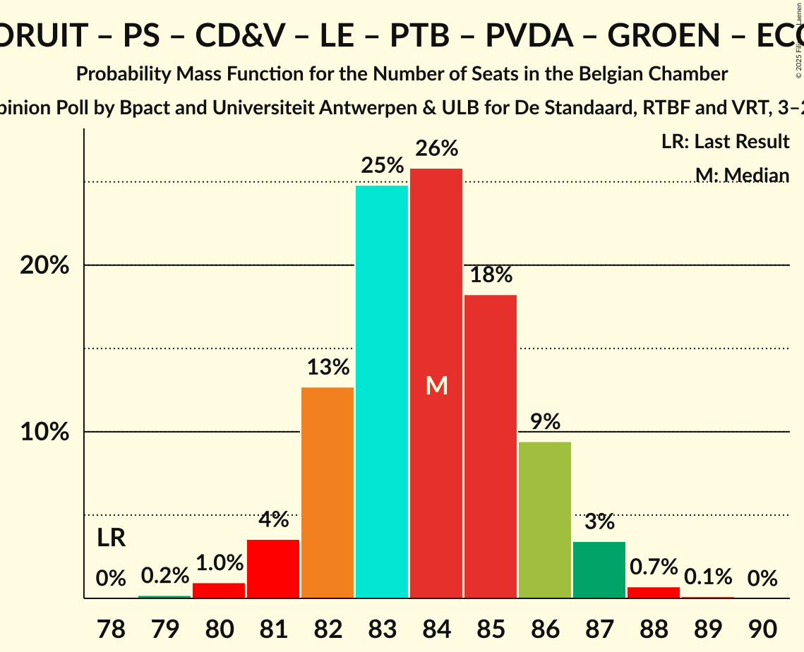

# Opinion Poll by Bpact and Universiteit Antwerpen & ULB for De Standaard, RTBF and VRT, 3–24 March 2025

Areas included: Brussels, Flanders, Wallonia

<a href="#voting-intentions">Voting Intentions</a> | <a href="#seats">Seats</a> | <a href="#coalitions">Coalitions</a> | <a href="#technical-information">Technical Information</a>

## Voting Intentions

### Confidence Intervals

| Party | Last Result | Poll Result | 80% Confidence Interval | 90% Confidence Interval | 95% Confidence Interval | 99% Confidence Interval |
|:-----:|:-----------:|:-----------:|:-----------------------:|:-----------------------:|:-----------------------:|:-----------------------:|
| Nieuw-Vlaamse Alliantie | 16.7% | 17.1% | 15.8–16.4% |15.7–16.4% |15.5–16.4% |15.2–16.4% |
| Vlaams Belang | 13.8% | 13.0% | 11.8–12.3% |11.7–12.4% |11.6–12.4% |11.3–12.4% |
| Vooruit | 8.1% | 9.2% | 8.6–9.6% |8.4–9.7% |8.3–9.8% |8.0–9.8% |
| Mouvement Réformateur | 10.3% | 9.0% | 8.2–8.5% |8.2–8.5% |8.1–8.5% |8.0–8.5% |
| Parti Socialiste | 8.0% | 8.8% | 8.1–8.4% |8.0–8.4% |8.0–8.4% |7.8–8.4% |
| Christen-Democratisch en Vlaams | 8.0% | 8.5% | 7.9–8.9% |7.8–9.0% |7.6–9.0% |7.4–9.1% |
| Les Engagés | 6.8% | 6.9% | 6.2–6.5% |6.2–6.5% |6.1–6.5% |6.0–6.5% |
| Parti du Travail de Belgique | 4.8% | 6.4% | 5.8–6.1% |5.8–6.1% |5.7–6.1% |5.6–6.1% |
| Partij van de Arbeid van België | 5.1% | 5.6% | 5.1–5.9% |5.0–6.0% |4.8–6.0% |4.6–6.1% |
| Groen | 4.6% | 4.6% | 4.1–4.9% |4.0–5.0% |3.9–5.0% |3.7–5.0% |
| Open Vlaamse Liberalen en Democraten | 5.4% | 3.5% | 3.2–3.8% |3.1–3.9% |3.0–3.9% |2.8–3.9% |
| Ecolo | 2.9% | 2.9% | 2.5–2.6% |2.5–2.7% |2.4–2.7% |2.3–2.7% |
| DéFI | 1.2% | 1.1% | 0.9–1.0% |0.8–1.0% |0.8–1.0% |0.8–1.0% |
| Chez Nous | 0.9% | 1.0% | 0.9–1.1% |0.8–1.1% |0.8–1.1% |0.7–1.1% |

*Note:* The poll result column reflects the actual value used in the calculations. Published results may vary slightly, and in addition be rounded to fewer digits.

## Seats

### Confidence Intervals

| Party | Last Result | Median | 80% Confidence Interval | 90% Confidence Interval | 95% Confidence Interval | 99% Confidence Interval |
|:-----:|:-----------:|:------:|:-----------------------:|:-----------------------:|:-----------------------:|:-----------------------:|
| <a href="#nieuw-vlaamse-alliantie">Nieuw-Vlaamse Alliantie</a> | 24 | 27 | 25–28 |24–29 |24–29 |24–30 |
| <a href="#vlaams-belang">Vlaams Belang</a> | 20 | 20 | 18–21 |18–21 |17–22 |16–23 |
| <a href="#vooruit">Vooruit</a> | 13 | 14 | 13–14 |13–15 |12–15 |11–15 |
| <a href="#mouvement-réformateur">Mouvement Réformateur</a> | 20 | 17 | 17–18 |16–18 |16–18 |16–19 |
| <a href="#parti-socialiste">Parti Socialiste</a> | 16 | 17 | 16–18 |16–19 |16–19 |15–19 |
| <a href="#christen-democratisch-en-vlaams">Christen-Democratisch en Vlaams</a> | 11 | 12 | 10–13 |10–14 |10–14 |10–15 |
| <a href="#les-engagés">Les Engagés</a> | 14 | 13 | 12–15 |11–15 |11–15 |11–15 |
| <a href="#parti-du-travail-de-belgique">Parti du Travail de Belgique</a> | 8 | 12 | 11–13 |11–13 |10–13 |10–14 |
| <a href="#partij-van-de-arbeid-van-belgië">Partij van de Arbeid van België</a> | 7 | 7 | 6–8 |5–8 |5–8 |5–9 |
| <a href="#groen">Groen</a> | 6 | 6 | 4–6 |4–6 |4–6 |3–6 |
| <a href="#open-vlaamse-liberalen-en-democraten">Open Vlaamse Liberalen en Democraten</a> | 7 | 3 | 2–4 |2–4 |2–4 |2–4 |
| <a href="#ecolo">Ecolo</a> | 3 | 3 | 3–4 |3–4 |3–4 |3–4 |
| <a href="#défi">DéFI</a> | 1 | 0 | 0 |0 |0 |0–1 |
| <a href="#chez-nous">Chez Nous</a> | 0 | 0 | 0 |0 |0 |0 |

### Nieuw-Vlaamse Alliantie

*For a full overview of the results for this party, see the [Nieuw-Vlaamse Alliantie](party-nieuw-vlaamsealliantie.html) page.*

| Number of Seats | Probability | Accumulated | Special Marks |
|:---------------:|:-----------:|:-----------:|:-------------:|
| 23 | 0.3% | 100% |  |
| 24 | 6% | 99.6% | Last Result |
| 25 | 9% | 94% |  |
| 26 | 26% | 85% |  |
| 27 | 38% | 59% | Median |
| 28 | 14% | 21% |  |
| 29 | 6% | 7% |  |
| 30 | 0.9% | 1.0% |  |
| 31 | 0.1% | 0.1% |  |
| 32 | 0% | 0% |  |

### Vlaams Belang

*For a full overview of the results for this party, see the [Vlaams Belang](party-vlaamsbelang.html) page.*

| Number of Seats | Probability | Accumulated | Special Marks |
|:---------------:|:-----------:|:-----------:|:-------------:|
| 16 | 1.0% | 100% |  |
| 17 | 3% | 99.0% |  |
| 18 | 16% | 96% |  |
| 19 | 29% | 79% |  |
| 20 | 40% | 51% | Last Result, Median |
| 21 | 7% | 11% |  |
| 22 | 3% | 4% |  |
| 23 | 1.0% | 1.0% |  |
| 24 | 0% | 0% |  |

### Vooruit

*For a full overview of the results for this party, see the [Vooruit](party-vooruit.html) page.*

| Number of Seats | Probability | Accumulated | Special Marks |
|:---------------:|:-----------:|:-----------:|:-------------:|
| 10 | 0.1% | 100% |  |
| 11 | 0.8% | 99.9% |  |
| 12 | 2% | 99.2% |  |
| 13 | 45% | 97% | Last Result |
| 14 | 46% | 52% | Median |
| 15 | 6% | 6% |  |
| 16 | 0.2% | 0.3% |  |
| 17 | 0.1% | 0.1% |  |
| 18 | 0% | 0% |  |

### Mouvement Réformateur

*For a full overview of the results for this party, see the [Mouvement Réformateur](party-mouvementréformateur.html) page.*

| Number of Seats | Probability | Accumulated | Special Marks |
|:---------------:|:-----------:|:-----------:|:-------------:|
| 15 | 0.3% | 100% |  |
| 16 | 5% | 99.7% |  |
| 17 | 61% | 95% | Median |
| 18 | 33% | 34% |  |
| 19 | 1.4% | 2% |  |
| 20 | 0.3% | 0.3% | Last Result |
| 21 | 0% | 0% |  |

### Parti Socialiste

*For a full overview of the results for this party, see the [Parti Socialiste](party-partisocialiste.html) page.*

| Number of Seats | Probability | Accumulated | Special Marks |
|:---------------:|:-----------:|:-----------:|:-------------:|
| 14 | 0.1% | 100% |  |
| 15 | 1.3% | 99.9% |  |
| 16 | 12% | 98.7% | Last Result |
| 17 | 55% | 87% | Median |
| 18 | 25% | 31% |  |
| 19 | 7% | 7% |  |
| 20 | 0% | 0% |  |

### Christen-Democratisch en Vlaams

*For a full overview of the results for this party, see the [Christen-Democratisch en Vlaams](party-christen-democratischenvlaams.html) page.*

| Number of Seats | Probability | Accumulated | Special Marks |
|:---------------:|:-----------:|:-----------:|:-------------:|
| 10 | 13% | 100% |  |
| 11 | 15% | 87% | Last Result |
| 12 | 28% | 72% | Median |
| 13 | 39% | 44% |  |
| 14 | 4% | 5% |  |
| 15 | 2% | 2% |  |
| 16 | 0% | 0% |  |

### Les Engagés

*For a full overview of the results for this party, see the [Les Engagés](party-lesengagés.html) page.*

| Number of Seats | Probability | Accumulated | Special Marks |
|:---------------:|:-----------:|:-----------:|:-------------:|
| 10 | 0.1% | 100% |  |
| 11 | 5% | 99.9% |  |
| 12 | 18% | 95% |  |
| 13 | 33% | 76% | Median |
| 14 | 32% | 43% | Last Result |
| 15 | 11% | 11% |  |
| 16 | 0% | 0% |  |

### Parti du Travail de Belgique

*For a full overview of the results for this party, see the [Parti du Travail de Belgique](party-partidutravaildebelgique.html) page.*

| Number of Seats | Probability | Accumulated | Special Marks |
|:---------------:|:-----------:|:-----------:|:-------------:|
| 8 | 0% | 100% | Last Result |
| 9 | 0% | 100% |  |
| 10 | 5% | 100% |  |
| 11 | 23% | 95% |  |
| 12 | 40% | 73% | Median |
| 13 | 31% | 32% |  |
| 14 | 2% | 2% |  |
| 15 | 0% | 0% |  |

### Partij van de Arbeid van België

*For a full overview of the results for this party, see the [Partij van de Arbeid van België](party-partijvandearbeidvanbelgië.html) page.*

| Number of Seats | Probability | Accumulated | Special Marks |
|:---------------:|:-----------:|:-----------:|:-------------:|
| 5 | 5% | 100% |  |
| 6 | 14% | 95% |  |
| 7 | 53% | 80% | Last Result, Median |
| 8 | 26% | 27% |  |
| 9 | 0.8% | 1.0% |  |
| 10 | 0.1% | 0.2% |  |
| 11 | 0.1% | 0.1% |  |
| 12 | 0% | 0% |  |

### Groen

*For a full overview of the results for this party, see the [Groen](party-groen.html) page.*

| Number of Seats | Probability | Accumulated | Special Marks |
|:---------------:|:-----------:|:-----------:|:-------------:|
| 3 | 2% | 100% |  |
| 4 | 16% | 98% |  |
| 5 | 8% | 82% |  |
| 6 | 74% | 74% | Last Result, Median |
| 7 | 0.1% | 0.1% |  |
| 8 | 0% | 0% |  |

### Open Vlaamse Liberalen en Democraten

*For a full overview of the results for this party, see the [Open Vlaamse Liberalen en Democraten](party-openvlaamseliberalenendemocraten.html) page.*

| Number of Seats | Probability | Accumulated | Special Marks |
|:---------------:|:-----------:|:-----------:|:-------------:|
| 2 | 39% | 100% |  |
| 3 | 46% | 61% | Median |
| 4 | 15% | 15% |  |
| 5 | 0% | 0.1% |  |
| 6 | 0% | 0% |  |
| 7 | 0% | 0% | Last Result |

### Ecolo

*For a full overview of the results for this party, see the [Ecolo](party-ecolo.html) page.*

| Number of Seats | Probability | Accumulated | Special Marks |
|:---------------:|:-----------:|:-----------:|:-------------:|
| 3 | 86% | 100% | Last Result, Median |
| 4 | 13% | 14% |  |
| 5 | 0.3% | 0.3% |  |
| 6 | 0% | 0% |  |

### DéFI

*For a full overview of the results for this party, see the [DéFI](party-défi.html) page.*

| Number of Seats | Probability | Accumulated | Special Marks |
|:---------------:|:-----------:|:-----------:|:-------------:|
| 0 | 98% | 100% | Median |
| 1 | 2% | 2% | Last Result |
| 2 | 0% | 0% |  |

### Chez Nous

*For a full overview of the results for this party, see the [Chez Nous](party-cheznous.html) page.*

| Number of Seats | Probability | Accumulated | Special Marks |
|:---------------:|:-----------:|:-----------:|:-------------:|
| 0 | 100% | 100% | Last Result, Median |

## Coalitions

### Confidence Intervals

| Coalition | Last Result | Median | Majority? | 80% Confidence Interval | 90% Confidence Interval | 95% Confidence Interval | 99% Confidence Interval |
|:---------:|:-----------:|:------:|:---------:|:-----------------------:|:-----------------------:|:-----------------------:|:-----------------------:|
| Vooruit – Mouvement Réformateur – Parti Socialiste – Christen-Democratisch en Vlaams – Les Engagés – Groen – Open Vlaamse Liberalen en Democraten – Ecolo | 90 | 85 | 100% | 83–87 | 82–87 | 82–88 | 81–89 |
| Vooruit – Parti Socialiste – Christen-Democratisch en Vlaams – Les Engagés – Parti du Travail de Belgique – Partij van de Arbeid van België – Groen – Ecolo | 78 | 84 | 100% | 82–86 | 82–86 | 81–87 | 80–88 |
| Nieuw-Vlaamse Alliantie – Vooruit – Parti Socialiste – Christen-Democratisch en Vlaams – Les Engagés | 78 | 83 | 100% | 81–85 | 80–86 | 80–86 | 79–87 |
| Nieuw-Vlaamse Alliantie – Vooruit – Mouvement Réformateur – Christen-Democratisch en Vlaams – Les Engagés | 82 | 83 | 100% | 81–85 | 80–86 | 79–86 | 78–87 |
| Nieuw-Vlaamse Alliantie – Vooruit – Mouvement Réformateur – Parti Socialiste – Open Vlaamse Liberalen en Democraten | 80 | 78 | 88% | 75–80 | 75–80 | 74–81 | 73–82 |
| Vooruit – Mouvement Réformateur – Parti Socialiste – Christen-Democratisch en Vlaams – Les Engagés – Open Vlaamse Liberalen en Democraten | 81 | 76 | 68% | 74–78 | 73–79 | 73–79 | 72–80 |
| Nieuw-Vlaamse Alliantie – Mouvement Réformateur – Christen-Democratisch en Vlaams – Les Engagés – Open Vlaamse Liberalen en Democraten | 76 | 72 | 2% | 70–74 | 69–75 | 69–75 | 67–76 |
| Vooruit – Mouvement Réformateur – Parti Socialiste – Christen-Democratisch en Vlaams – Groen – Open Vlaamse Liberalen en Democraten – Ecolo | 76 | 72 | 0.9% | 69–74 | 69–74 | 68–75 | 67–76 |
| Vooruit – Parti Socialiste – Christen-Democratisch en Vlaams – Les Engagés – Groen – Ecolo | 63 | 65 | 0% | 63–67 | 62–67 | 62–68 | 61–69 |
| Mouvement Réformateur – Parti Socialiste – Christen-Democratisch en Vlaams – Les Engagés – Open Vlaamse Liberalen en Democraten | 68 | 63 | 0% | 61–64 | 60–65 | 60–65 | 59–67 |
| Nieuw-Vlaamse Alliantie – Mouvement Réformateur – Christen-Democratisch en Vlaams – Open Vlaamse Liberalen en Democraten | 62 | 59 | 0% | 57–61 | 56–61 | 56–62 | 55–62 |
| Vooruit – Mouvement Réformateur – Parti Socialiste – Groen – Open Vlaamse Liberalen en Democraten – Ecolo | 65 | 60 | 0% | 58–61 | 57–62 | 56–62 | 55–63 |
| Vooruit – Parti Socialiste – Parti du Travail de Belgique – Partij van de Arbeid van België – Groen – Ecolo | 53 | 59 | 0% | 56–61 | 56–61 | 55–62 | 54–63 |
| Vooruit – Parti Socialiste – Christen-Democratisch en Vlaams – Les Engagés | 54 | 56 | 0% | 54–58 | 53–59 | 53–59 | 52–60 |
| Mouvement Réformateur – Christen-Democratisch en Vlaams – Les Engagés – Groen – Open Vlaamse Liberalen en Democraten – Ecolo | 61 | 54 | 0% | 52–56 | 51–57 | 51–57 | 50–58 |
| Vooruit – Mouvement Réformateur – Parti Socialiste – Open Vlaamse Liberalen en Democraten | 56 | 51 | 0% | 49–53 | 49–53 | 48–54 | 48–54 |
| Mouvement Réformateur – Christen-Democratisch en Vlaams – Les Engagés – Open Vlaamse Liberalen en Democraten | 52 | 45 | 0% | 43–47 | 43–48 | 42–48 | 41–50 |

### Vooruit – Mouvement Réformateur – Parti Socialiste – Christen-Democratisch en Vlaams – Les Engagés – Groen – Open Vlaamse Liberalen en Democraten – Ecolo

| Number of Seats | Probability | Accumulated | Special Marks |
|:---------------:|:-----------:|:-----------:|:-------------:|
| 80 | 0.2% | 100% |  |
| 81 | 2% | 99.7% |  |
| 82 | 6% | 98% |  |
| 83 | 12% | 92% |  |
| 84 | 20% | 80% |  |
| 85 | 25% | 60% | Median |
| 86 | 20% | 35% |  |
| 87 | 11% | 15% |  |
| 88 | 3% | 4% |  |
| 89 | 0.7% | 0.9% |  |
| 90 | 0.1% | 0.2% | Last Result |
| 91 | 0% | 0% |  |

### Vooruit – Parti Socialiste – Christen-Democratisch en Vlaams – Les Engagés – Parti du Travail de Belgique – Partij van de Arbeid van België – Groen – Ecolo

| Number of Seats | Probability | Accumulated | Special Marks |
|:---------------:|:-----------:|:-----------:|:-------------:|
| 78 | 0% | 100% | Last Result |
| 79 | 0.2% | 100% |  |
| 80 | 1.0% | 99.8% |  |
| 81 | 4% | 98.8% |  |
| 82 | 13% | 95% |  |
| 83 | 25% | 83% |  |
| 84 | 26% | 58% | Median |
| 85 | 18% | 32% |  |
| 86 | 9% | 14% |  |
| 87 | 3% | 4% |  |
| 88 | 0.7% | 0.8% |  |
| 89 | 0.1% | 0.1% |  |
| 90 | 0% | 0% |  |

### Nieuw-Vlaamse Alliantie – Vooruit – Parti Socialiste – Christen-Democratisch en Vlaams – Les Engagés

| Number of Seats | Probability | Accumulated | Special Marks |
|:---------------:|:-----------:|:-----------:|:-------------:|
| 77 | 0.1% | 100% |  |
| 78 | 0.4% | 99.9% | Last Result |
| 79 | 2% | 99.5% |  |
| 80 | 6% | 98% |  |
| 81 | 14% | 91% |  |
| 82 | 21% | 77% |  |
| 83 | 22% | 56% | Median |
| 84 | 18% | 33% |  |
| 85 | 10% | 16% |  |
| 86 | 4% | 5% |  |
| 87 | 1.0% | 1.2% |  |
| 88 | 0.2% | 0.2% |  |
| 89 | 0% | 0% |  |

### Nieuw-Vlaamse Alliantie – Vooruit – Mouvement Réformateur – Christen-Democratisch en Vlaams – Les Engagés

| Number of Seats | Probability | Accumulated | Special Marks |
|:---------------:|:-----------:|:-----------:|:-------------:|
| 77 | 0.1% | 100% |  |
| 78 | 0.6% | 99.9% |  |
| 79 | 2% | 99.2% |  |
| 80 | 7% | 97% |  |
| 81 | 13% | 90% |  |
| 82 | 19% | 77% | Last Result |
| 83 | 21% | 57% | Median |
| 84 | 18% | 36% |  |
| 85 | 11% | 19% |  |
| 86 | 5% | 7% |  |
| 87 | 2% | 2% |  |
| 88 | 0.3% | 0.4% |  |
| 89 | 0% | 0.1% |  |
| 90 | 0% | 0% |  |

### Nieuw-Vlaamse Alliantie – Vooruit – Mouvement Réformateur – Parti Socialiste – Open Vlaamse Liberalen en Democraten

| Number of Seats | Probability | Accumulated | Special Marks |
|:---------------:|:-----------:|:-----------:|:-------------:|
| 72 | 0.1% | 100% |  |
| 73 | 0.8% | 99.9% |  |
| 74 | 3% | 99.0% |  |
| 75 | 8% | 96% |  |
| 76 | 15% | 88% | Majority |
| 77 | 23% | 74% |  |
| 78 | 23% | 51% | Median |
| 79 | 16% | 27% |  |
| 80 | 8% | 11% | Last Result |
| 81 | 3% | 4% |  |
| 82 | 0.7% | 0.8% |  |
| 83 | 0.1% | 0.2% |  |
| 84 | 0% | 0% |  |

### Vooruit – Mouvement Réformateur – Parti Socialiste – Christen-Democratisch en Vlaams – Les Engagés – Open Vlaamse Liberalen en Democraten

| Number of Seats | Probability | Accumulated | Special Marks |
|:---------------:|:-----------:|:-----------:|:-------------:|
| 71 | 0.1% | 100% |  |
| 72 | 1.1% | 99.8% |  |
| 73 | 4% | 98.7% |  |
| 74 | 9% | 95% |  |
| 75 | 18% | 86% |  |
| 76 | 25% | 68% | Median, Majority |
| 77 | 23% | 42% |  |
| 78 | 13% | 20% |  |
| 79 | 5% | 7% |  |
| 80 | 1.4% | 2% |  |
| 81 | 0.3% | 0.3% | Last Result |
| 82 | 0% | 0% |  |

### Nieuw-Vlaamse Alliantie – Mouvement Réformateur – Christen-Democratisch en Vlaams – Les Engagés – Open Vlaamse Liberalen en Democraten

| Number of Seats | Probability | Accumulated | Special Marks |
|:---------------:|:-----------:|:-----------:|:-------------:|
| 66 | 0.1% | 100% |  |
| 67 | 0.4% | 99.9% |  |
| 68 | 2% | 99.4% |  |
| 69 | 5% | 98% |  |
| 70 | 11% | 93% |  |
| 71 | 19% | 82% |  |
| 72 | 23% | 63% | Median |
| 73 | 19% | 40% |  |
| 74 | 12% | 21% |  |
| 75 | 6% | 8% |  |
| 76 | 2% | 2% | Last Result, Majority |
| 77 | 0.3% | 0.4% |  |
| 78 | 0% | 0.1% |  |
| 79 | 0% | 0% |  |

### Vooruit – Mouvement Réformateur – Parti Socialiste – Christen-Democratisch en Vlaams – Groen – Open Vlaamse Liberalen en Democraten – Ecolo

| Number of Seats | Probability | Accumulated | Special Marks |
|:---------------:|:-----------:|:-----------:|:-------------:|
| 66 | 0.1% | 100% |  |
| 67 | 0.5% | 99.9% |  |
| 68 | 3% | 99.4% |  |
| 69 | 7% | 97% |  |
| 70 | 14% | 89% |  |
| 71 | 22% | 76% |  |
| 72 | 24% | 54% | Median |
| 73 | 18% | 30% |  |
| 74 | 9% | 12% |  |
| 75 | 3% | 4% |  |
| 76 | 0.7% | 0.9% | Last Result, Majority |
| 77 | 0.1% | 0.2% |  |
| 78 | 0% | 0% |  |

### Vooruit – Parti Socialiste – Christen-Democratisch en Vlaams – Les Engagés – Groen – Ecolo

| Number of Seats | Probability | Accumulated | Special Marks |
|:---------------:|:-----------:|:-----------:|:-------------:|
| 60 | 0.3% | 100% |  |
| 61 | 1.5% | 99.7% |  |
| 62 | 6% | 98% |  |
| 63 | 14% | 92% | Last Result |
| 64 | 21% | 78% |  |
| 65 | 23% | 58% | Median |
| 66 | 19% | 34% |  |
| 67 | 10% | 15% |  |
| 68 | 4% | 4% |  |
| 69 | 0.7% | 0.7% |  |
| 70 | 0.1% | 0.1% |  |
| 71 | 0% | 0% |  |

### Mouvement Réformateur – Parti Socialiste – Christen-Democratisch en Vlaams – Les Engagés – Open Vlaamse Liberalen en Democraten

| Number of Seats | Probability | Accumulated | Special Marks |
|:---------------:|:-----------:|:-----------:|:-------------:|
| 58 | 0.3% | 100% |  |
| 59 | 2% | 99.7% |  |
| 60 | 6% | 98% |  |
| 61 | 12% | 92% |  |
| 62 | 24% | 80% | Median |
| 63 | 28% | 55% |  |
| 64 | 17% | 27% |  |
| 65 | 7% | 9% |  |
| 66 | 2% | 2% |  |
| 67 | 0.4% | 0.5% |  |
| 68 | 0.1% | 0.1% | Last Result |
| 69 | 0% | 0% |  |

### Nieuw-Vlaamse Alliantie – Mouvement Réformateur – Christen-Democratisch en Vlaams – Open Vlaamse Liberalen en Democraten

| Number of Seats | Probability | Accumulated | Special Marks |
|:---------------:|:-----------:|:-----------:|:-------------:|
| 53 | 0.1% | 100% |  |
| 54 | 0.3% | 99.9% |  |
| 55 | 1.2% | 99.7% |  |
| 56 | 4% | 98.5% |  |
| 57 | 12% | 94% |  |
| 58 | 26% | 83% |  |
| 59 | 25% | 57% | Median |
| 60 | 18% | 32% |  |
| 61 | 10% | 14% |  |
| 62 | 3% | 3% | Last Result |
| 63 | 0.4% | 0.5% |  |
| 64 | 0.1% | 0.1% |  |
| 65 | 0% | 0% |  |

### Vooruit – Mouvement Réformateur – Parti Socialiste – Groen – Open Vlaamse Liberalen en Democraten – Ecolo

| Number of Seats | Probability | Accumulated | Special Marks |
|:---------------:|:-----------:|:-----------:|:-------------:|
| 54 | 0.1% | 100% |  |
| 55 | 0.6% | 99.9% |  |
| 56 | 2% | 99.3% |  |
| 57 | 6% | 97% |  |
| 58 | 14% | 91% |  |
| 59 | 25% | 77% |  |
| 60 | 26% | 52% | Median |
| 61 | 17% | 26% |  |
| 62 | 7% | 9% |  |
| 63 | 2% | 2% |  |
| 64 | 0.3% | 0.3% |  |
| 65 | 0% | 0% | Last Result |

### Vooruit – Parti Socialiste – Parti du Travail de Belgique – Partij van de Arbeid van België – Groen – Ecolo

| Number of Seats | Probability | Accumulated | Special Marks |
|:---------------:|:-----------:|:-----------:|:-------------:|
| 53 | 0.1% | 100% | Last Result |
| 54 | 0.5% | 99.9% |  |
| 55 | 3% | 99.4% |  |
| 56 | 8% | 97% |  |
| 57 | 16% | 88% |  |
| 58 | 22% | 73% |  |
| 59 | 22% | 51% | Median |
| 60 | 16% | 28% |  |
| 61 | 8% | 12% |  |
| 62 | 3% | 3% |  |
| 63 | 0.5% | 0.6% |  |
| 64 | 0% | 0.1% |  |
| 65 | 0% | 0% |  |

### Vooruit – Parti Socialiste – Christen-Democratisch en Vlaams – Les Engagés

| Number of Seats | Probability | Accumulated | Special Marks |
|:---------------:|:-----------:|:-----------:|:-------------:|
| 51 | 0.1% | 100% |  |
| 52 | 0.9% | 99.9% |  |
| 53 | 5% | 99.0% |  |
| 54 | 11% | 94% | Last Result |
| 55 | 17% | 84% |  |
| 56 | 24% | 66% | Median |
| 57 | 23% | 42% |  |
| 58 | 13% | 19% |  |
| 59 | 4% | 5% |  |
| 60 | 0.9% | 1.1% |  |
| 61 | 0.2% | 0.2% |  |
| 62 | 0% | 0% |  |

### Mouvement Réformateur – Christen-Democratisch en Vlaams – Les Engagés – Groen – Open Vlaamse Liberalen en Democraten – Ecolo

| Number of Seats | Probability | Accumulated | Special Marks |
|:---------------:|:-----------:|:-----------:|:-------------:|
| 49 | 0.2% | 100% |  |
| 50 | 1.4% | 99.7% |  |
| 51 | 5% | 98% |  |
| 52 | 10% | 94% |  |
| 53 | 18% | 83% |  |
| 54 | 23% | 65% | Median |
| 55 | 22% | 41% |  |
| 56 | 13% | 19% |  |
| 57 | 5% | 6% |  |
| 58 | 1.3% | 2% |  |
| 59 | 0.3% | 0.4% |  |
| 60 | 0.1% | 0.1% |  |
| 61 | 0% | 0% | Last Result |

### Vooruit – Mouvement Réformateur – Parti Socialiste – Open Vlaamse Liberalen en Democraten

| Number of Seats | Probability | Accumulated | Special Marks |
|:---------------:|:-----------:|:-----------:|:-------------:|
| 46 | 0% | 100% |  |
| 47 | 0.4% | 99.9% |  |
| 48 | 3% | 99.6% |  |
| 49 | 12% | 97% |  |
| 50 | 26% | 85% |  |
| 51 | 29% | 59% | Median |
| 52 | 19% | 30% |  |
| 53 | 8% | 11% |  |
| 54 | 2% | 3% |  |
| 55 | 0.4% | 0.4% |  |
| 56 | 0% | 0.1% | Last Result |
| 57 | 0% | 0% |  |

### Mouvement Réformateur – Christen-Democratisch en Vlaams – Les Engagés – Open Vlaamse Liberalen en Democraten

| Number of Seats | Probability | Accumulated | Special Marks |
|:---------------:|:-----------:|:-----------:|:-------------:|
| 40 | 0.1% | 100% |  |
| 41 | 0.9% | 99.9% |  |
| 42 | 3% | 98.9% |  |
| 43 | 8% | 96% |  |
| 44 | 16% | 88% |  |
| 45 | 23% | 72% | Median |
| 46 | 25% | 49% |  |
| 47 | 16% | 24% |  |
| 48 | 6% | 9% |  |
| 49 | 2% | 2% |  |
| 50 | 0.4% | 0.5% |  |
| 51 | 0.1% | 0.1% |  |
| 52 | 0% | 0% | Last Result |

## Technical Information

### Opinion Poll

+ **Polling firm:** Bpact and Universiteit Antwerpen & ULB
+ **Commissioner(s):** De Standaard, RTBF and VRT
+ **Fieldwork period:** 3–24 March 2025

### Calculations

+ **Sample size:** 3527
+ **Simulations done:** 2,097,152
+ **Error estimate:** 0.79%

