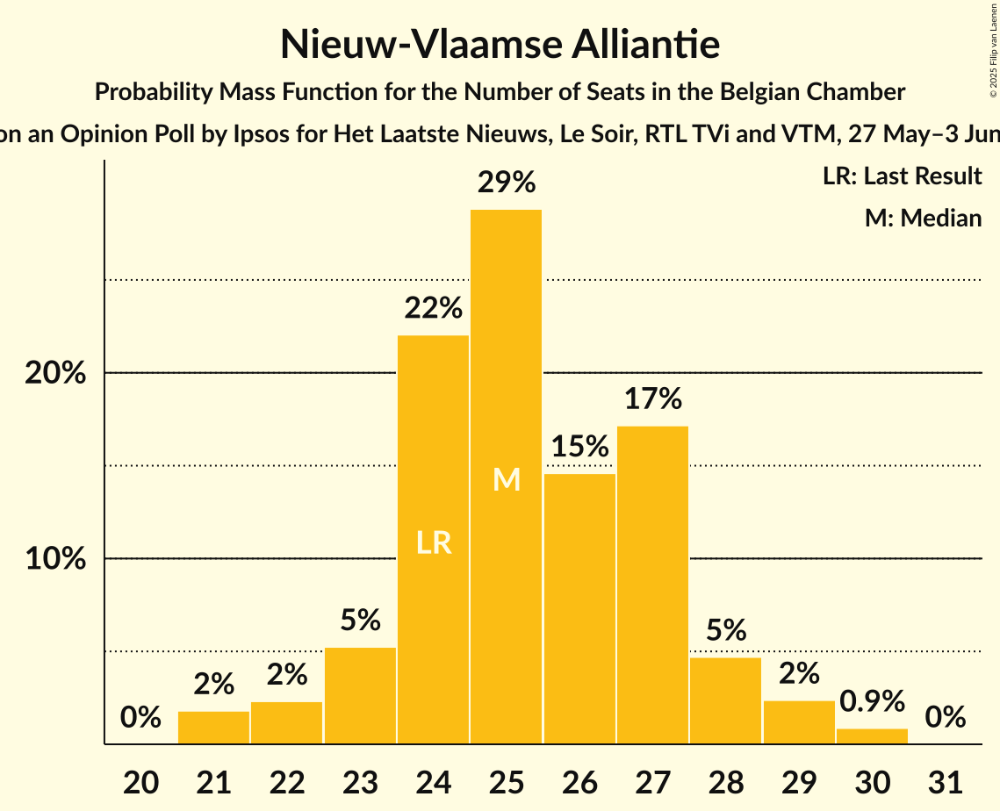
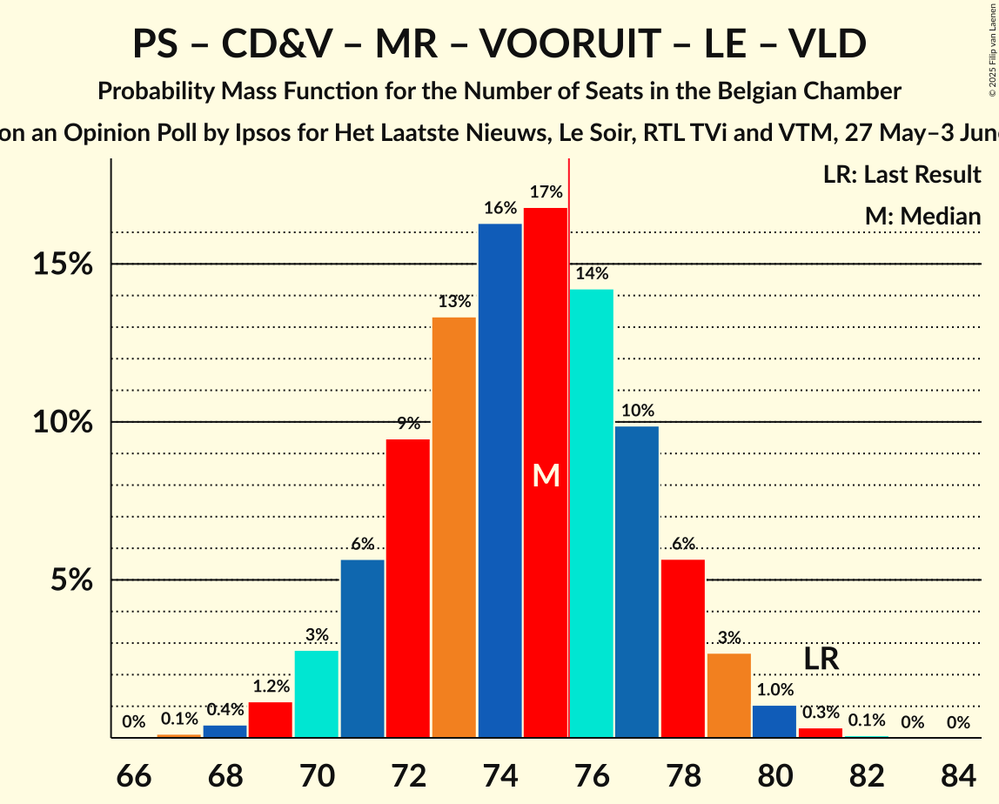

# Opinion Poll by Ipsos for Het Laatste Nieuws, Le Soir, RTL TVi and VTM, 27 May–3 June 2025

Areas included: Brussels, Flanders, Wallonia

<a href="#voting-intentions">Voting Intentions</a> | <a href="#seats">Seats</a> | <a href="#coalitions">Coalitions</a> | <a href="#technical-information">Technical Information</a>

## Voting Intentions

### Confidence Intervals

| Party | Last Result | Poll Result | 80% Confidence Interval | 90% Confidence Interval | 95% Confidence Interval | 99% Confidence Interval |
|:-----:|:-----------:|:-----------:|:-----------------------:|:-----------------------:|:-----------------------:|:-----------------------:|
| Nieuw-Vlaamse Alliantie | 16.7% | 16.4% | 15.3–17.2% |15.0–17.3% |14.7–17.4% |14.2–17.5% |
| Vlaams Belang | 13.8% | 14.2% | 13.1–14.9% |12.9–15.1% |12.6–15.2% |12.1–15.3% |
| Parti Socialiste | 8.0% | 9.5% | 8.5–8.9% |8.4–8.9% |8.3–8.9% |8.1–8.9% |
| Christen-Democratisch en Vlaams | 8.0% | 9.0% | 8.2–9.7% |7.9–9.8% |7.7–9.9% |7.3–10.0% |
| Mouvement Réformateur | 10.3% | 9.0% | 8.0–8.4% |7.9–8.4% |7.8–8.4% |7.6–8.4% |
| Vooruit | 8.1% | 8.3% | 7.5–9.0% |7.3–9.1% |7.1–9.2% |6.7–9.2% |
| Les Engagés | 6.8% | 6.5% | 5.6–6.0% |5.6–6.0% |5.5–6.0% |5.3–6.0% |
| Parti du Travail de Belgique | 4.8% | 6.5% | 5.6–5.9% |5.5–6.0% |5.5–6.0% |5.3–6.0% |
| Partij van de Arbeid van België | 5.1% | 5.5% | 4.9–6.1% |4.7–6.2% |4.5–6.3% |4.2–6.3% |
| Groen | 4.6% | 4.6% | 4.0–5.1% |3.8–5.2% |3.7–5.3% |3.4–5.3% |
| Open Vlaamse Liberalen en Democraten | 5.4% | 3.8% | 3.2–4.3% |3.1–4.4% |3.0–4.4% |2.7–4.5% |
| Ecolo | 2.9% | 3.3% | 2.7–2.9% |2.6–2.9% |2.6–2.9% |2.5–2.9% |
| Chez Nous | 0.9% | 0.9% | 0.7–0.9% |0.6–0.9% |0.6–1.0% |0.5–1.0% |
| DéFI | 1.2% | 0.7% | 0.5–0.7% |0.5–0.8% |0.5–0.8% |0.4–0.8% |

*Note:* The poll result column reflects the actual value used in the calculations. Published results may vary slightly, and in addition be rounded to fewer digits.

## Seats

### Confidence Intervals

| Party | Last Result | Median | 80% Confidence Interval | 90% Confidence Interval | 95% Confidence Interval | 99% Confidence Interval |
|:-----:|:-----------:|:------:|:-----------------------:|:-----------------------:|:-----------------------:|:-----------------------:|
| <a href="#nieuw-vlaamse-alliantie">Nieuw-Vlaamse Alliantie</a> | 24 | 25 | 24–27 |23–28 |22–29 |21–30 |
| <a href="#vlaams-belang">Vlaams Belang</a> | 20 | 22 | 20–24 |19–24 |19–24 |17–25 |
| <a href="#parti-socialiste">Parti Socialiste</a> | 16 | 18 | 17–19 |17–20 |16–20 |15–21 |
| <a href="#christen-democratisch-en-vlaams">Christen-Democratisch en Vlaams</a> | 11 | 13 | 11–15 |10–15 |10–15 |10–17 |
| <a href="#mouvement-réformateur">Mouvement Réformateur</a> | 20 | 17 | 16–18 |15–18 |15–19 |14–20 |
| <a href="#vooruit">Vooruit</a> | 13 | 12 | 9–14 |9–14 |9–14 |9–15 |
| <a href="#les-engagés">Les Engagés</a> | 14 | 11 | 10–13 |10–14 |10–14 |9–15 |
| <a href="#parti-du-travail-de-belgique">Parti du Travail de Belgique</a> | 8 | 11 | 10–13 |10–13 |10–13 |9–14 |
| <a href="#partij-van-de-arbeid-van-belgië">Partij van de Arbeid van België</a> | 7 | 7 | 5–8 |5–8 |5–9 |5–11 |
| <a href="#groen">Groen</a> | 6 | 6 | 4–6 |3–6 |3–6 |3–8 |
| <a href="#open-vlaamse-liberalen-en-democraten">Open Vlaamse Liberalen en Democraten</a> | 7 | 3 | 2–4 |2–4 |2–6 |2–7 |
| <a href="#ecolo">Ecolo</a> | 3 | 4 | 3–6 |3–6 |2–7 |2–7 |
| <a href="#chez-nous">Chez Nous</a> | 0 | 0 | 0 |0 |0 |0 |
| <a href="#défi">DéFI</a> | 1 | 0 | 0 |0 |0 |0 |

### Nieuw-Vlaamse Alliantie

*For a full overview of the results for this party, see the [Nieuw-Vlaamse Alliantie](party-nieuw-vlaamsealliantie.html) page.*

| Number of Seats | Probability | Accumulated | Special Marks |
|:---------------:|:-----------:|:-----------:|:-------------:|
| 21 | 2% | 100% |  |
| 22 | 2% | 98% |  |
| 23 | 5% | 96% |  |
| 24 | 22% | 91% | Last Result |
| 25 | 29% | 69% | Median |
| 26 | 15% | 40% |  |
| 27 | 17% | 25% |  |
| 28 | 5% | 8% |  |
| 29 | 2% | 3% |  |
| 30 | 0.9% | 0.9% |  |
| 31 | 0% | 0% |  |

### Vlaams Belang

*For a full overview of the results for this party, see the [Vlaams Belang](party-vlaamsbelang.html) page.*

| Number of Seats | Probability | Accumulated | Special Marks |
|:---------------:|:-----------:|:-----------:|:-------------:|
| 16 | 0.1% | 100% |  |
| 17 | 0.4% | 99.9% |  |
| 18 | 1.5% | 99.5% |  |
| 19 | 5% | 98% |  |
| 20 | 22% | 93% | Last Result |
| 21 | 16% | 72% |  |
| 22 | 25% | 55% | Median |
| 23 | 18% | 30% |  |
| 24 | 10% | 12% |  |
| 25 | 1.2% | 2% |  |
| 26 | 0.3% | 0.4% |  |
| 27 | 0.1% | 0.1% |  |
| 28 | 0% | 0% |  |

### Parti Socialiste

*For a full overview of the results for this party, see the [Parti Socialiste](party-partisocialiste.html) page.*

| Number of Seats | Probability | Accumulated | Special Marks |
|:---------------:|:-----------:|:-----------:|:-------------:|
| 14 | 0.1% | 100% |  |
| 15 | 1.1% | 99.9% |  |
| 16 | 3% | 98.8% | Last Result |
| 17 | 21% | 95% |  |
| 18 | 38% | 74% | Median |
| 19 | 27% | 35% |  |
| 20 | 8% | 8% |  |
| 21 | 0.5% | 0.5% |  |
| 22 | 0% | 0% |  |

### Christen-Democratisch en Vlaams

*For a full overview of the results for this party, see the [Christen-Democratisch en Vlaams](party-christen-democratischenvlaams.html) page.*

| Number of Seats | Probability | Accumulated | Special Marks |
|:---------------:|:-----------:|:-----------:|:-------------:|
| 10 | 9% | 100% |  |
| 11 | 7% | 91% | Last Result |
| 12 | 16% | 84% |  |
| 13 | 39% | 68% | Median |
| 14 | 14% | 29% |  |
| 15 | 14% | 16% |  |
| 16 | 1.0% | 1.5% |  |
| 17 | 0.4% | 0.5% |  |
| 18 | 0.1% | 0.1% |  |
| 19 | 0% | 0% |  |

### Mouvement Réformateur

*For a full overview of the results for this party, see the [Mouvement Réformateur](party-mouvementréformateur.html) page.*

| Number of Seats | Probability | Accumulated | Special Marks |
|:---------------:|:-----------:|:-----------:|:-------------:|
| 13 | 0.1% | 100% |  |
| 14 | 2% | 99.9% |  |
| 15 | 4% | 98% |  |
| 16 | 10% | 94% |  |
| 17 | 57% | 83% | Median |
| 18 | 23% | 26% |  |
| 19 | 2% | 3% |  |
| 20 | 0.7% | 0.9% | Last Result |
| 21 | 0.2% | 0.2% |  |
| 22 | 0% | 0% |  |

### Vooruit

*For a full overview of the results for this party, see the [Vooruit](party-vooruit.html) page.*

| Number of Seats | Probability | Accumulated | Special Marks |
|:---------------:|:-----------:|:-----------:|:-------------:|
| 9 | 15% | 100% |  |
| 10 | 10% | 85% |  |
| 11 | 8% | 75% |  |
| 12 | 17% | 66% | Median |
| 13 | 39% | 49% | Last Result |
| 14 | 9% | 10% |  |
| 15 | 0.7% | 0.8% |  |
| 16 | 0.1% | 0.1% |  |
| 17 | 0% | 0% |  |

### Les Engagés

*For a full overview of the results for this party, see the [Les Engagés](party-lesengagés.html) page.*

| Number of Seats | Probability | Accumulated | Special Marks |
|:---------------:|:-----------:|:-----------:|:-------------:|
| 9 | 2% | 100% |  |
| 10 | 23% | 98% |  |
| 11 | 37% | 75% | Median |
| 12 | 17% | 38% |  |
| 13 | 12% | 21% |  |
| 14 | 7% | 9% | Last Result |
| 15 | 2% | 2% |  |
| 16 | 0% | 0% |  |

### Parti du Travail de Belgique

*For a full overview of the results for this party, see the [Parti du Travail de Belgique](party-partidutravaildebelgique.html) page.*

| Number of Seats | Probability | Accumulated | Special Marks |
|:---------------:|:-----------:|:-----------:|:-------------:|
| 8 | 0% | 100% | Last Result |
| 9 | 0.6% | 100% |  |
| 10 | 28% | 99.4% |  |
| 11 | 30% | 72% | Median |
| 12 | 26% | 41% |  |
| 13 | 13% | 15% |  |
| 14 | 2% | 2% |  |
| 15 | 0% | 0% |  |

### Partij van de Arbeid van België

*For a full overview of the results for this party, see the [Partij van de Arbeid van België](party-partijvandearbeidvanbelgië.html) page.*

| Number of Seats | Probability | Accumulated | Special Marks |
|:---------------:|:-----------:|:-----------:|:-------------:|
| 5 | 15% | 100% |  |
| 6 | 11% | 85% |  |
| 7 | 46% | 74% | Last Result, Median |
| 8 | 24% | 28% |  |
| 9 | 3% | 4% |  |
| 10 | 0.8% | 1.4% |  |
| 11 | 0.6% | 0.6% |  |
| 12 | 0% | 0% |  |

### Groen

*For a full overview of the results for this party, see the [Groen](party-groen.html) page.*

| Number of Seats | Probability | Accumulated | Special Marks |
|:---------------:|:-----------:|:-----------:|:-------------:|
| 2 | 0% | 100% |  |
| 3 | 7% | 99.9% |  |
| 4 | 23% | 93% |  |
| 5 | 9% | 70% |  |
| 6 | 59% | 60% | Last Result, Median |
| 7 | 1.0% | 2% |  |
| 8 | 0.4% | 0.7% |  |
| 9 | 0.3% | 0.4% |  |
| 10 | 0% | 0% |  |

### Open Vlaamse Liberalen en Democraten

*For a full overview of the results for this party, see the [Open Vlaamse Liberalen en Democraten](party-openvlaamseliberalenendemocraten.html) page.*

| Number of Seats | Probability | Accumulated | Special Marks |
|:---------------:|:-----------:|:-----------:|:-------------:|
| 2 | 32% | 100% |  |
| 3 | 33% | 68% | Median |
| 4 | 30% | 35% |  |
| 5 | 1.3% | 5% |  |
| 6 | 2% | 3% |  |
| 7 | 1.5% | 1.5% | Last Result |
| 8 | 0% | 0% |  |

### Ecolo

*For a full overview of the results for this party, see the [Ecolo](party-ecolo.html) page.*

| Number of Seats | Probability | Accumulated | Special Marks |
|:---------------:|:-----------:|:-----------:|:-------------:|
| 2 | 5% | 100% |  |
| 3 | 27% | 95% | Last Result |
| 4 | 37% | 68% | Median |
| 5 | 20% | 31% |  |
| 6 | 8% | 11% |  |
| 7 | 3% | 3% |  |
| 8 | 0% | 0% |  |

### Chez Nous

*For a full overview of the results for this party, see the [Chez Nous](party-cheznous.html) page.*

| Number of Seats | Probability | Accumulated | Special Marks |
|:---------------:|:-----------:|:-----------:|:-------------:|
| 0 | 99.9% | 100% | Last Result, Median |
| 1 | 0.1% | 0.1% |  |
| 2 | 0% | 0% |  |

### DéFI

*For a full overview of the results for this party, see the [DéFI](party-défi.html) page.*

| Number of Seats | Probability | Accumulated | Special Marks |
|:---------------:|:-----------:|:-----------:|:-------------:|
| 0 | 100% | 100% | Median |
| 1 | 0% | 0% | Last Result |

## Coalitions

### Confidence Intervals

| Coalition | Last Result | Median | Majority? | 80% Confidence Interval | 90% Confidence Interval | 95% Confidence Interval | 99% Confidence Interval |
|:---------:|:-----------:|:------:|:---------:|:-----------------------:|:-----------------------:|:-----------------------:|:-----------------------:|
| Parti Socialiste – Christen-Democratisch en Vlaams – Mouvement Réformateur – Vooruit – Les Engagés – Groen – Open Vlaamse Liberalen en Democraten – Ecolo | 90 | 84 | 100% | 81–87 | 80–88 | 79–88 | 78–90 |
| Parti Socialiste – Christen-Democratisch en Vlaams – Vooruit – Les Engagés – Parti du Travail de Belgique – Partij van de Arbeid van België – Groen – Ecolo | 78 | 82 | 99.8% | 79–85 | 78–86 | 77–86 | 76–88 |
| Nieuw-Vlaamse Alliantie – Parti Socialiste – Christen-Democratisch en Vlaams – Vooruit – Les Engagés | 78 | 80 | 97% | 77–83 | 76–83 | 75–84 | 74–86 |
| Nieuw-Vlaamse Alliantie – Christen-Democratisch en Vlaams – Mouvement Réformateur – Vooruit – Les Engagés | 82 | 79 | 91% | 76–82 | 75–82 | 74–83 | 73–85 |
| Nieuw-Vlaamse Alliantie – Parti Socialiste – Mouvement Réformateur – Vooruit – Open Vlaamse Liberalen en Democraten | 80 | 76 | 50% | 72–78 | 71–79 | 71–80 | 69–81 |
| Parti Socialiste – Christen-Democratisch en Vlaams – Mouvement Réformateur – Vooruit – Les Engagés – Open Vlaamse Liberalen en Democraten | 81 | 75 | 34% | 71–77 | 71–78 | 70–79 | 68–80 |
| Parti Socialiste – Christen-Democratisch en Vlaams – Mouvement Réformateur – Vooruit – Groen – Open Vlaamse Liberalen en Democraten – Ecolo | 76 | 72 | 10% | 69–76 | 68–76 | 67–77 | 66–79 |
| Nieuw-Vlaamse Alliantie – Christen-Democratisch en Vlaams – Mouvement Réformateur – Les Engagés – Open Vlaamse Liberalen en Democraten | 76 | 70 | 0.9% | 67–73 | 66–74 | 65–75 | 64–76 |
| Parti Socialiste – Christen-Democratisch en Vlaams – Vooruit – Les Engagés – Groen – Ecolo | 63 | 64 | 0% | 61–67 | 60–68 | 59–68 | 58–70 |
| Parti Socialiste – Christen-Democratisch en Vlaams – Mouvement Réformateur – Les Engagés – Open Vlaamse Liberalen en Democraten | 68 | 63 | 0% | 60–65 | 59–66 | 59–67 | 57–68 |
| Parti Socialiste – Mouvement Réformateur – Vooruit – Groen – Open Vlaamse Liberalen en Democraten – Ecolo | 65 | 60 | 0% | 56–62 | 55–63 | 55–64 | 53–65 |
| Nieuw-Vlaamse Alliantie – Christen-Democratisch en Vlaams – Mouvement Réformateur – Open Vlaamse Liberalen en Democraten | 62 | 58 | 0% | 56–61 | 55–62 | 54–63 | 53–64 |
| Parti Socialiste – Vooruit – Parti du Travail de Belgique – Partij van de Arbeid van België – Groen – Ecolo | 53 | 58 | 0% | 54–61 | 54–61 | 53–62 | 51–63 |
| Parti Socialiste – Christen-Democratisch en Vlaams – Vooruit – Les Engagés | 54 | 54 | 0% | 51–57 | 51–58 | 50–59 | 48–60 |
| Christen-Democratisch en Vlaams – Mouvement Réformateur – Les Engagés – Groen – Open Vlaamse Liberalen en Democraten – Ecolo | 61 | 54 | 0% | 51–57 | 50–58 | 49–59 | 48–60 |
| Parti Socialiste – Mouvement Réformateur – Vooruit – Open Vlaamse Liberalen en Democraten | 56 | 50 | 0% | 47–53 | 46–54 | 46–54 | 44–56 |
| Christen-Democratisch en Vlaams – Mouvement Réformateur – Les Engagés – Open Vlaamse Liberalen en Democraten | 52 | 44 | 0% | 42–47 | 41–48 | 40–49 | 39–50 |

### Parti Socialiste – Christen-Democratisch en Vlaams – Mouvement Réformateur – Vooruit – Les Engagés – Groen – Open Vlaamse Liberalen en Democraten – Ecolo

| Number of Seats | Probability | Accumulated | Special Marks |
|:---------------:|:-----------:|:-----------:|:-------------:|
| 76 | 0.1% | 100% | Majority |
| 77 | 0.2% | 99.9% |  |
| 78 | 0.8% | 99.7% |  |
| 79 | 2% | 98.9% |  |
| 80 | 4% | 97% |  |
| 81 | 8% | 92% |  |
| 82 | 12% | 85% |  |
| 83 | 16% | 73% |  |
| 84 | 17% | 57% | Median |
| 85 | 16% | 39% |  |
| 86 | 12% | 24% |  |
| 87 | 7% | 12% |  |
| 88 | 3% | 5% |  |
| 89 | 1.4% | 2% |  |
| 90 | 0.4% | 0.6% | Last Result |
| 91 | 0.1% | 0.1% |  |
| 92 | 0% | 0% |  |

### Parti Socialiste – Christen-Democratisch en Vlaams – Vooruit – Les Engagés – Parti du Travail de Belgique – Partij van de Arbeid van België – Groen – Ecolo

| Number of Seats | Probability | Accumulated | Special Marks |
|:---------------:|:-----------:|:-----------:|:-------------:|
| 75 | 0.2% | 100% |  |
| 76 | 0.5% | 99.8% | Majority |
| 77 | 2% | 99.3% |  |
| 78 | 4% | 97% | Last Result |
| 79 | 8% | 93% |  |
| 80 | 12% | 86% |  |
| 81 | 16% | 74% |  |
| 82 | 19% | 58% | Median |
| 83 | 16% | 39% |  |
| 84 | 11% | 23% |  |
| 85 | 7% | 12% |  |
| 86 | 4% | 6% |  |
| 87 | 1.5% | 2% |  |
| 88 | 0.5% | 0.7% |  |
| 89 | 0.1% | 0.2% |  |
| 90 | 0% | 0% |  |

### Nieuw-Vlaamse Alliantie – Parti Socialiste – Christen-Democratisch en Vlaams – Vooruit – Les Engagés

| Number of Seats | Probability | Accumulated | Special Marks |
|:---------------:|:-----------:|:-----------:|:-------------:|
| 72 | 0.1% | 100% |  |
| 73 | 0.3% | 99.9% |  |
| 74 | 0.8% | 99.6% |  |
| 75 | 2% | 98.8% |  |
| 76 | 5% | 97% | Majority |
| 77 | 9% | 92% |  |
| 78 | 14% | 82% | Last Result |
| 79 | 17% | 68% | Median |
| 80 | 17% | 51% |  |
| 81 | 14% | 35% |  |
| 82 | 10% | 21% |  |
| 83 | 6% | 11% |  |
| 84 | 3% | 5% |  |
| 85 | 1.2% | 2% |  |
| 86 | 0.4% | 0.6% |  |
| 87 | 0.1% | 0.2% |  |
| 88 | 0% | 0% |  |

### Nieuw-Vlaamse Alliantie – Christen-Democratisch en Vlaams – Mouvement Réformateur – Vooruit – Les Engagés

| Number of Seats | Probability | Accumulated | Special Marks |
|:---------------:|:-----------:|:-----------:|:-------------:|
| 71 | 0.1% | 100% |  |
| 72 | 0.3% | 99.9% |  |
| 73 | 0.9% | 99.5% |  |
| 74 | 2% | 98.7% |  |
| 75 | 5% | 96% |  |
| 76 | 10% | 91% | Majority |
| 77 | 15% | 81% |  |
| 78 | 16% | 67% | Median |
| 79 | 16% | 50% |  |
| 80 | 13% | 34% |  |
| 81 | 10% | 20% |  |
| 82 | 6% | 11% | Last Result |
| 83 | 3% | 5% |  |
| 84 | 1.3% | 2% |  |
| 85 | 0.4% | 0.6% |  |
| 86 | 0.1% | 0.2% |  |
| 87 | 0% | 0% |  |

### Nieuw-Vlaamse Alliantie – Parti Socialiste – Mouvement Réformateur – Vooruit – Open Vlaamse Liberalen en Democraten

| Number of Seats | Probability | Accumulated | Special Marks |
|:---------------:|:-----------:|:-----------:|:-------------:|
| 67 | 0% | 100% |  |
| 68 | 0.2% | 99.9% |  |
| 69 | 0.6% | 99.8% |  |
| 70 | 1.4% | 99.2% |  |
| 71 | 3% | 98% |  |
| 72 | 6% | 95% |  |
| 73 | 9% | 89% |  |
| 74 | 13% | 80% |  |
| 75 | 16% | 67% | Median |
| 76 | 17% | 50% | Majority |
| 77 | 14% | 33% |  |
| 78 | 10% | 19% |  |
| 79 | 5% | 10% |  |
| 80 | 3% | 4% | Last Result |
| 81 | 1.1% | 2% |  |
| 82 | 0.3% | 0.5% |  |
| 83 | 0.1% | 0.1% |  |
| 84 | 0% | 0% |  |

### Parti Socialiste – Christen-Democratisch en Vlaams – Mouvement Réformateur – Vooruit – Les Engagés – Open Vlaamse Liberalen en Democraten

| Number of Seats | Probability | Accumulated | Special Marks |
|:---------------:|:-----------:|:-----------:|:-------------:|
| 67 | 0.1% | 100% |  |
| 68 | 0.4% | 99.8% |  |
| 69 | 1.2% | 99.4% |  |
| 70 | 3% | 98% |  |
| 71 | 6% | 95% |  |
| 72 | 9% | 90% |  |
| 73 | 13% | 80% |  |
| 74 | 16% | 67% | Median |
| 75 | 17% | 51% |  |
| 76 | 14% | 34% | Majority |
| 77 | 10% | 20% |  |
| 78 | 6% | 10% |  |
| 79 | 3% | 4% |  |
| 80 | 1.0% | 1.5% |  |
| 81 | 0.3% | 0.4% | Last Result |
| 82 | 0.1% | 0.1% |  |
| 83 | 0% | 0% |  |

### Parti Socialiste – Christen-Democratisch en Vlaams – Mouvement Réformateur – Vooruit – Groen – Open Vlaamse Liberalen en Democraten – Ecolo

| Number of Seats | Probability | Accumulated | Special Marks |
|:---------------:|:-----------:|:-----------:|:-------------:|
| 64 | 0.1% | 100% |  |
| 65 | 0.2% | 99.9% |  |
| 66 | 0.6% | 99.7% |  |
| 67 | 2% | 99.0% |  |
| 68 | 3% | 97% |  |
| 69 | 6% | 94% |  |
| 70 | 10% | 88% |  |
| 71 | 13% | 78% |  |
| 72 | 16% | 65% |  |
| 73 | 16% | 49% | Median |
| 74 | 14% | 33% |  |
| 75 | 10% | 20% |  |
| 76 | 6% | 10% | Last Result, Majority |
| 77 | 3% | 5% |  |
| 78 | 1.2% | 2% |  |
| 79 | 0.4% | 0.6% |  |
| 80 | 0.1% | 0.1% |  |
| 81 | 0% | 0% |  |

### Nieuw-Vlaamse Alliantie – Christen-Democratisch en Vlaams – Mouvement Réformateur – Les Engagés – Open Vlaamse Liberalen en Democraten

| Number of Seats | Probability | Accumulated | Special Marks |
|:---------------:|:-----------:|:-----------:|:-------------:|
| 62 | 0.1% | 100% |  |
| 63 | 0.3% | 99.9% |  |
| 64 | 0.9% | 99.6% |  |
| 65 | 2% | 98.7% |  |
| 66 | 4% | 97% |  |
| 67 | 8% | 92% |  |
| 68 | 13% | 84% |  |
| 69 | 16% | 71% | Median |
| 70 | 16% | 55% |  |
| 71 | 15% | 39% |  |
| 72 | 11% | 24% |  |
| 73 | 7% | 13% |  |
| 74 | 4% | 6% |  |
| 75 | 2% | 3% |  |
| 76 | 0.6% | 0.9% | Last Result, Majority |
| 77 | 0.2% | 0.3% |  |
| 78 | 0.1% | 0.1% |  |
| 79 | 0% | 0% |  |

### Parti Socialiste – Christen-Democratisch en Vlaams – Vooruit – Les Engagés – Groen – Ecolo

| Number of Seats | Probability | Accumulated | Special Marks |
|:---------------:|:-----------:|:-----------:|:-------------:|
| 56 | 0.1% | 100% |  |
| 57 | 0.4% | 99.9% |  |
| 58 | 1.1% | 99.5% |  |
| 59 | 3% | 98% |  |
| 60 | 5% | 96% |  |
| 61 | 9% | 91% |  |
| 62 | 13% | 82% |  |
| 63 | 16% | 69% | Last Result |
| 64 | 16% | 53% | Median |
| 65 | 14% | 37% |  |
| 66 | 10% | 23% |  |
| 67 | 7% | 13% |  |
| 68 | 4% | 6% |  |
| 69 | 1.5% | 2% |  |
| 70 | 0.4% | 0.6% |  |
| 71 | 0.1% | 0.2% |  |
| 72 | 0% | 0% |  |

### Parti Socialiste – Christen-Democratisch en Vlaams – Mouvement Réformateur – Les Engagés – Open Vlaamse Liberalen en Democraten

| Number of Seats | Probability | Accumulated | Special Marks |
|:---------------:|:-----------:|:-----------:|:-------------:|
| 56 | 0.1% | 100% |  |
| 57 | 0.5% | 99.9% |  |
| 58 | 2% | 99.3% |  |
| 59 | 4% | 98% |  |
| 60 | 8% | 94% |  |
| 61 | 15% | 85% |  |
| 62 | 19% | 71% | Median |
| 63 | 19% | 52% |  |
| 64 | 15% | 33% |  |
| 65 | 10% | 19% |  |
| 66 | 5% | 9% |  |
| 67 | 3% | 4% |  |
| 68 | 0.9% | 1.1% | Last Result |
| 69 | 0.2% | 0.3% |  |
| 70 | 0% | 0% |  |

### Parti Socialiste – Mouvement Réformateur – Vooruit – Groen – Open Vlaamse Liberalen en Democraten – Ecolo

| Number of Seats | Probability | Accumulated | Special Marks |
|:---------------:|:-----------:|:-----------:|:-------------:|
| 52 | 0.1% | 100% |  |
| 53 | 0.5% | 99.8% |  |
| 54 | 1.4% | 99.3% |  |
| 55 | 3% | 98% |  |
| 56 | 6% | 95% |  |
| 57 | 9% | 89% |  |
| 58 | 13% | 80% |  |
| 59 | 15% | 67% |  |
| 60 | 16% | 51% | Median |
| 61 | 15% | 35% |  |
| 62 | 11% | 20% |  |
| 63 | 6% | 10% |  |
| 64 | 3% | 4% |  |
| 65 | 0.9% | 1.4% | Last Result |
| 66 | 0.3% | 0.4% |  |
| 67 | 0.1% | 0.1% |  |
| 68 | 0% | 0% |  |

### Nieuw-Vlaamse Alliantie – Christen-Democratisch en Vlaams – Mouvement Réformateur – Open Vlaamse Liberalen en Democraten

| Number of Seats | Probability | Accumulated | Special Marks |
|:---------------:|:-----------:|:-----------:|:-------------:|
| 51 | 0.1% | 100% |  |
| 52 | 0.3% | 99.9% |  |
| 53 | 1.1% | 99.6% |  |
| 54 | 3% | 98% |  |
| 55 | 5% | 96% |  |
| 56 | 10% | 91% |  |
| 57 | 16% | 81% |  |
| 58 | 18% | 66% | Median |
| 59 | 17% | 48% |  |
| 60 | 14% | 31% |  |
| 61 | 10% | 17% |  |
| 62 | 4% | 7% | Last Result |
| 63 | 2% | 3% |  |
| 64 | 0.7% | 0.9% |  |
| 65 | 0.2% | 0.3% |  |
| 66 | 0.1% | 0.1% |  |
| 67 | 0% | 0% |  |

### Parti Socialiste – Vooruit – Parti du Travail de Belgique – Partij van de Arbeid van België – Groen – Ecolo

| Number of Seats | Probability | Accumulated | Special Marks |
|:---------------:|:-----------:|:-----------:|:-------------:|
| 50 | 0.1% | 100% |  |
| 51 | 0.5% | 99.9% |  |
| 52 | 1.3% | 99.4% |  |
| 53 | 3% | 98% | Last Result |
| 54 | 6% | 95% |  |
| 55 | 9% | 89% |  |
| 56 | 13% | 80% |  |
| 57 | 15% | 68% |  |
| 58 | 16% | 52% | Median |
| 59 | 14% | 36% |  |
| 60 | 11% | 21% |  |
| 61 | 6% | 11% |  |
| 62 | 3% | 4% |  |
| 63 | 0.9% | 1.3% |  |
| 64 | 0.3% | 0.3% |  |
| 65 | 0.1% | 0.1% |  |
| 66 | 0% | 0% |  |

### Parti Socialiste – Christen-Democratisch en Vlaams – Vooruit – Les Engagés

| Number of Seats | Probability | Accumulated | Special Marks |
|:---------------:|:-----------:|:-----------:|:-------------:|
| 47 | 0.1% | 100% |  |
| 48 | 0.5% | 99.8% |  |
| 49 | 1.2% | 99.4% |  |
| 50 | 3% | 98% |  |
| 51 | 6% | 95% |  |
| 52 | 11% | 89% |  |
| 53 | 14% | 78% |  |
| 54 | 16% | 64% | Last Result, Median |
| 55 | 16% | 48% |  |
| 56 | 14% | 32% |  |
| 57 | 10% | 18% |  |
| 58 | 5% | 8% |  |
| 59 | 2% | 3% |  |
| 60 | 0.8% | 1.1% |  |
| 61 | 0.2% | 0.3% |  |
| 62 | 0.1% | 0.1% |  |
| 63 | 0% | 0% |  |

### Christen-Democratisch en Vlaams – Mouvement Réformateur – Les Engagés – Groen – Open Vlaamse Liberalen en Democraten – Ecolo

| Number of Seats | Probability | Accumulated | Special Marks |
|:---------------:|:-----------:|:-----------:|:-------------:|
| 47 | 0.2% | 100% |  |
| 48 | 0.6% | 99.8% |  |
| 49 | 2% | 99.2% |  |
| 50 | 4% | 97% |  |
| 51 | 8% | 93% |  |
| 52 | 13% | 85% |  |
| 53 | 16% | 72% |  |
| 54 | 17% | 56% | Median |
| 55 | 15% | 39% |  |
| 56 | 11% | 24% |  |
| 57 | 7% | 13% |  |
| 58 | 4% | 6% |  |
| 59 | 2% | 3% |  |
| 60 | 0.6% | 0.8% |  |
| 61 | 0.2% | 0.2% | Last Result |
| 62 | 0% | 0% |  |

### Parti Socialiste – Mouvement Réformateur – Vooruit – Open Vlaamse Liberalen en Democraten

| Number of Seats | Probability | Accumulated | Special Marks |
|:---------------:|:-----------:|:-----------:|:-------------:|
| 43 | 0.1% | 100% |  |
| 44 | 0.4% | 99.9% |  |
| 45 | 1.5% | 99.5% |  |
| 46 | 4% | 98% |  |
| 47 | 7% | 94% |  |
| 48 | 10% | 87% |  |
| 49 | 14% | 77% |  |
| 50 | 17% | 63% | Median |
| 51 | 18% | 46% |  |
| 52 | 15% | 28% |  |
| 53 | 8% | 13% |  |
| 54 | 3% | 5% |  |
| 55 | 1.3% | 2% |  |
| 56 | 0.5% | 0.6% | Last Result |
| 57 | 0.1% | 0.2% |  |
| 58 | 0% | 0% |  |

### Christen-Democratisch en Vlaams – Mouvement Réformateur – Les Engagés – Open Vlaamse Liberalen en Democraten

| Number of Seats | Probability | Accumulated | Special Marks |
|:---------------:|:-----------:|:-----------:|:-------------:|
| 38 | 0.1% | 100% |  |
| 39 | 0.6% | 99.9% |  |
| 40 | 2% | 99.2% |  |
| 41 | 4% | 97% |  |
| 42 | 10% | 93% |  |
| 43 | 17% | 84% |  |
| 44 | 18% | 67% | Median |
| 45 | 17% | 49% |  |
| 46 | 13% | 31% |  |
| 47 | 9% | 18% |  |
| 48 | 5% | 9% |  |
| 49 | 2% | 4% |  |
| 50 | 1.0% | 1.4% |  |
| 51 | 0.3% | 0.4% |  |
| 52 | 0.1% | 0.1% | Last Result |
| 53 | 0% | 0% |  |

## Technical Information

### Opinion Poll

+ **Polling firm:** Ipsos
+ **Commissioner(s):** Het Laatste Nieuws, Le Soir, RTL TVi and VTM
+ **Fieldwork period:** 27 May–3 June 2025

### Calculations

+ **Sample size:** 1605
+ **Simulations done:** 2,097,152
+ **Error estimate:** 1.04%

