# Opinion Poll by Ipsos for Het Laatste Nieuws, Le Soir, RTL TVi and VTM, 16–23 September 2025

Areas included: Brussels, Flanders, Wallonia

<a href="#voting-intentions">Voting Intentions</a> | <a href="#seats">Seats</a> | <a href="#coalitions">Coalitions</a> | <a href="#technical-information">Technical Information</a>

## Voting Intentions

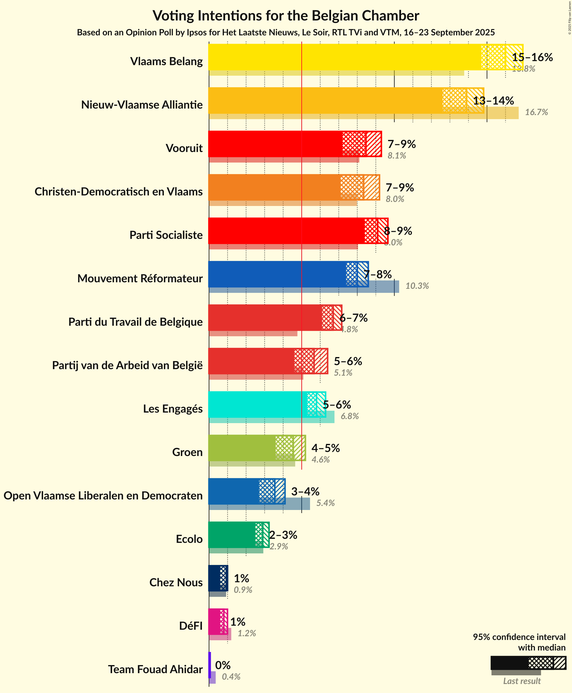

### Confidence Intervals

| Party | Last Result | Poll Result | 80% Confidence Interval | 90% Confidence Interval | 95% Confidence Interval | 99% Confidence Interval |
|:-----:|:-----------:|:-----------:|:-----------------------:|:-----------------------:|:-----------------------:|:-----------------------:|
| Vlaams Belang | 13.8% | 16.9% | 15.1–15.9% |14.9–16.0% |14.7–16.0% |14.3–16.0% |
| Nieuw-Vlaamse Alliantie | 16.7% | 14.8% | 13.0–13.9% |12.8–13.9% |12.6–13.9% |12.3–13.9% |
| Parti Socialiste | 8.0% | 9.7% | 8.6–9.0% |8.5–9.0% |8.4–9.1% |8.2–9.1% |
| Mouvement Réformateur | 10.3% | 8.6% | 7.6–8.0% |7.5–8.0% |7.4–8.0% |7.2–8.0% |
| Vooruit | 8.1% | 8.5% | 7.6–9.1% |7.4–9.2% |7.2–9.3% |6.8–9.4% |
| Christen-Democratisch en Vlaams | 8.0% | 8.3% | 7.5–9.0% |7.3–9.1% |7.1–9.2% |6.7–9.2% |
| Parti du Travail de Belgique | 4.8% | 7.2% | 6.3–6.6% |6.2–6.6% |6.1–6.7% |5.9–6.7% |
| Les Engagés | 6.8% | 6.3% | 5.4–5.8% |5.3–5.8% |5.3–5.8% |5.1–5.8% |
| Partij van de Arbeid van België | 5.1% | 5.7% | 5.0–6.2% |4.8–6.3% |4.6–6.4% |4.3–6.4% |
| Groen | 4.6% | 4.5% | 3.9–5.0% |3.8–5.1% |3.6–5.2% |3.4–5.2% |
| Open Vlaamse Liberalen en Democraten | 5.4% | 3.5% | 3.0–4.0% |2.9–4.1% |2.7–4.1% |2.5–4.2% |
| Ecolo | 2.9% | 3.2% | 2.6–2.9% |2.6–2.9% |2.5–2.9% |2.4–2.9% |
| DéFI | 1.2% | 1.0% | 0.7–0.8% |0.7–0.8% |0.6–0.8% |0.6–0.8% |
| Chez Nous | 0.9% | 0.9% | 0.7–0.9% |0.6–0.9% |0.6–1.0% |0.5–1.0% |
| Team Fouad Ahidar | 0.4% | 0.1% | 0.0% |0.0% |0.0% |0.0% |

*Note:* The poll result column reflects the actual value used in the calculations. Published results may vary slightly, and in addition be rounded to fewer digits.

## Seats

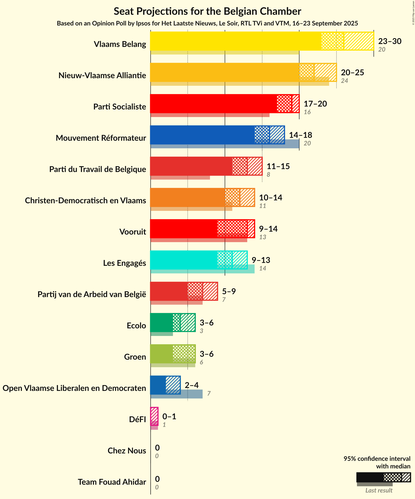

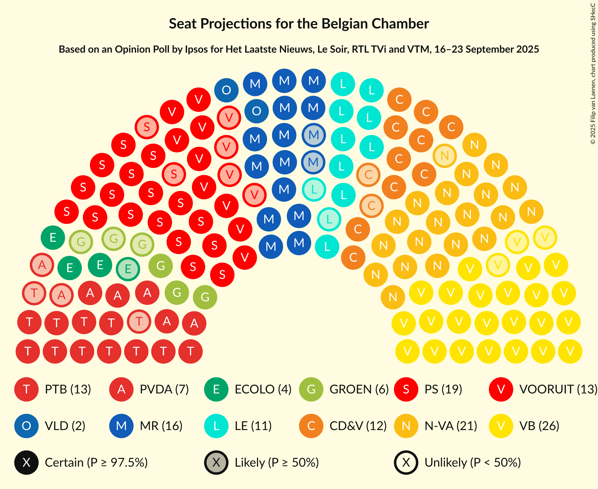

### Confidence Intervals

| Party | Last Result | Median | 80% Confidence Interval | 90% Confidence Interval | 95% Confidence Interval | 99% Confidence Interval |
|:-----:|:-----------:|:------:|:-----------------------:|:-----------------------:|:-----------------------:|:-----------------------:|
| <a href="#vlaams-belang">Vlaams Belang</a> | 20 | 26 | 24–28 |23–29 |23–30 |22–31 |
| <a href="#nieuw-vlaamse-alliantie">Nieuw-Vlaamse Alliantie</a> | 24 | 22 | 21–24 |21–25 |20–25 |19–26 |
| <a href="#parti-socialiste">Parti Socialiste</a> | 16 | 19 | 18–20 |17–20 |17–20 |16–21 |
| <a href="#mouvement-réformateur">Mouvement Réformateur</a> | 20 | 16 | 15–17 |14–18 |14–18 |13–19 |
| <a href="#vooruit">Vooruit</a> | 13 | 13 | 10–14 |9–14 |9–14 |9–15 |
| <a href="#christen-democratisch-en-vlaams">Christen-Democratisch en Vlaams</a> | 11 | 12 | 10–13 |10–14 |10–14 |10–15 |
| <a href="#parti-du-travail-de-belgique">Parti du Travail de Belgique</a> | 8 | 13 | 12–14 |12–15 |11–15 |11–16 |
| <a href="#les-engagés">Les Engagés</a> | 14 | 11 | 10–12 |10–13 |9–13 |9–14 |
| <a href="#partij-van-de-arbeid-van-belgië">Partij van de Arbeid van België</a> | 7 | 7 | 5–9 |5–9 |5–9 |5–11 |
| <a href="#groen">Groen</a> | 6 | 6 | 4–6 |3–6 |3–6 |3–8 |
| <a href="#open-vlaamse-liberalen-en-democraten">Open Vlaamse Liberalen en Democraten</a> | 7 | 2 | 2–4 |2–4 |2–4 |2–6 |
| <a href="#ecolo">Ecolo</a> | 3 | 4 | 3–5 |3–5 |3–6 |2–7 |
| <a href="#défi">DéFI</a> | 1 | 0 | 0 |0–1 |0–1 |0–1 |
| <a href="#chez-nous">Chez Nous</a> | 0 | 0 | 0 |0 |0 |0 |
| <a href="#team-fouad-ahidar">Team Fouad Ahidar</a> | 0 | 0 | 0 |0 |0 |0 |

### Vlaams Belang

*For a full overview of the results for this party, see the [Vlaams Belang](party-vlaamsbelang.html) page.*

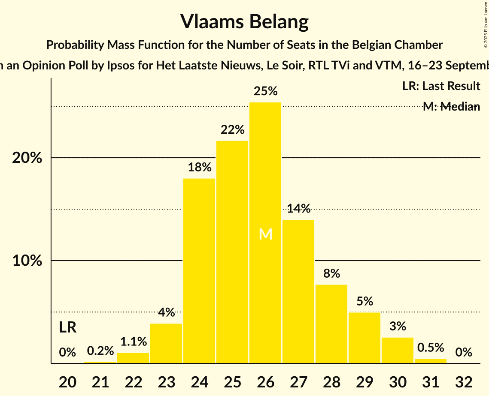

| Number of Seats | Probability | Accumulated | Special Marks |
|:---------------:|:-----------:|:-----------:|:-------------:|
| 20 | 0% | 100% | Last Result |
| 21 | 0.2% | 100% |  |
| 22 | 1.1% | 99.8% |  |
| 23 | 4% | 98.7% |  |
| 24 | 18% | 95% |  |
| 25 | 22% | 77% |  |
| 26 | 25% | 55% | Median |
| 27 | 14% | 30% |  |
| 28 | 8% | 16% |  |
| 29 | 5% | 8% |  |
| 30 | 3% | 3% |  |
| 31 | 0.5% | 0.5% |  |
| 32 | 0% | 0% |  |

### Nieuw-Vlaamse Alliantie

*For a full overview of the results for this party, see the [Nieuw-Vlaamse Alliantie](party-nieuw-vlaamsealliantie.html) page.*

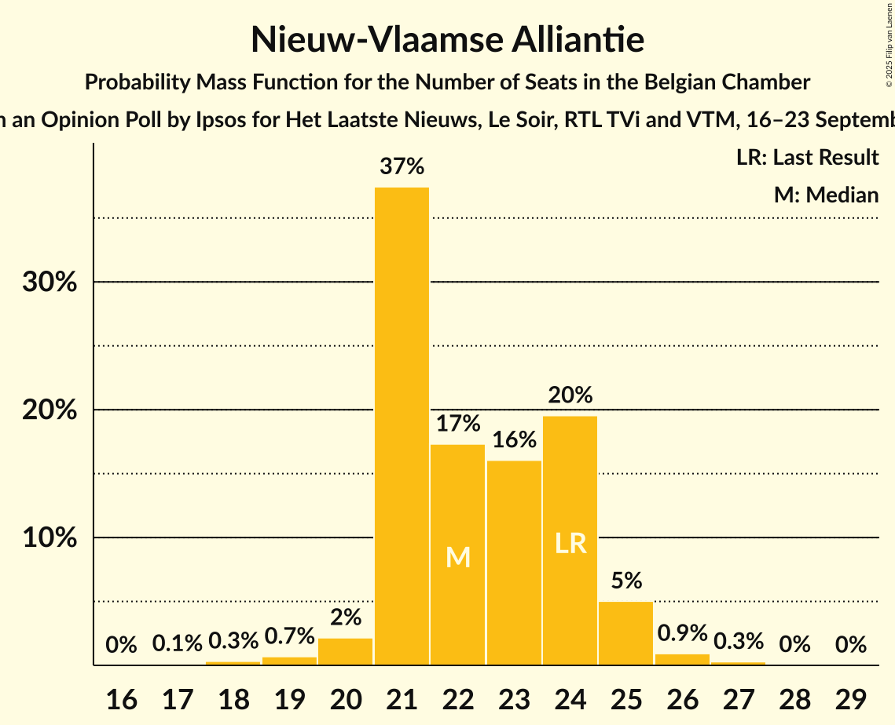

| Number of Seats | Probability | Accumulated | Special Marks |
|:---------------:|:-----------:|:-----------:|:-------------:|
| 17 | 0.1% | 100% |  |
| 18 | 0.3% | 99.9% |  |
| 19 | 0.7% | 99.5% |  |
| 20 | 2% | 98.8% |  |
| 21 | 37% | 97% |  |
| 22 | 17% | 59% | Median |
| 23 | 16% | 42% |  |
| 24 | 20% | 26% | Last Result |
| 25 | 5% | 6% |  |
| 26 | 0.9% | 1.3% |  |
| 27 | 0.3% | 0.4% |  |
| 28 | 0% | 0.1% |  |
| 29 | 0% | 0% |  |

### Parti Socialiste

*For a full overview of the results for this party, see the [Parti Socialiste](party-partisocialiste.html) page.*

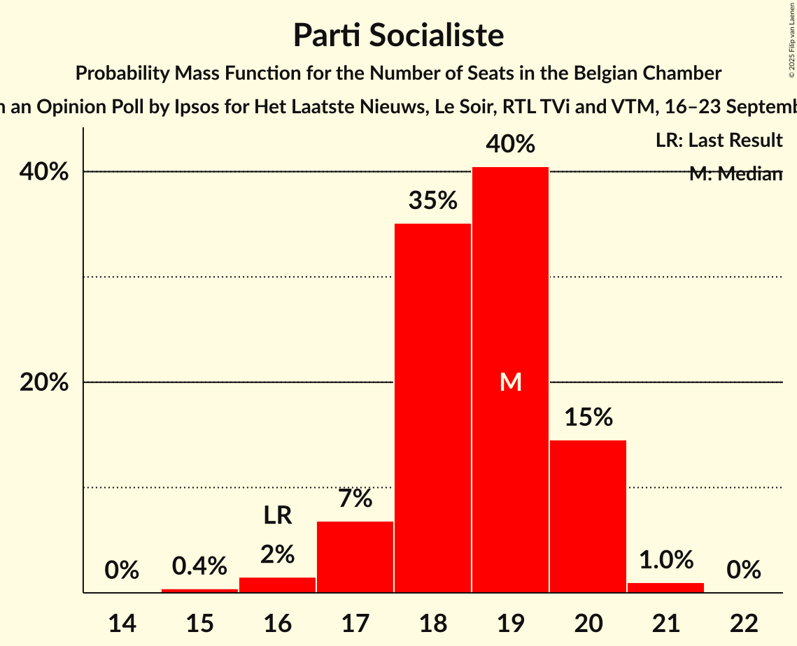

| Number of Seats | Probability | Accumulated | Special Marks |
|:---------------:|:-----------:|:-----------:|:-------------:|
| 15 | 0.4% | 100% |  |
| 16 | 2% | 99.6% | Last Result |
| 17 | 7% | 98% |  |
| 18 | 35% | 91% |  |
| 19 | 40% | 56% | Median |
| 20 | 15% | 16% |  |
| 21 | 1.0% | 1.0% |  |
| 22 | 0% | 0% |  |

### Mouvement Réformateur

*For a full overview of the results for this party, see the [Mouvement Réformateur](party-mouvementréformateur.html) page.*

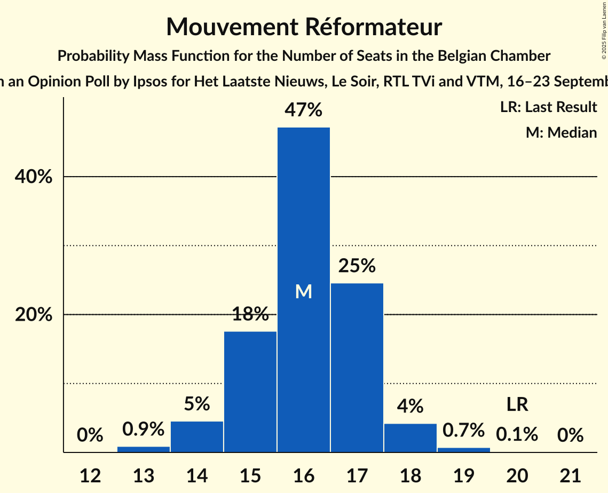

| Number of Seats | Probability | Accumulated | Special Marks |
|:---------------:|:-----------:|:-----------:|:-------------:|
| 13 | 0.9% | 100% |  |
| 14 | 5% | 99.1% |  |
| 15 | 18% | 95% |  |
| 16 | 47% | 77% | Median |
| 17 | 25% | 30% |  |
| 18 | 4% | 5% |  |
| 19 | 0.7% | 0.9% |  |
| 20 | 0.1% | 0.1% | Last Result |
| 21 | 0% | 0% |  |

### Vooruit

*For a full overview of the results for this party, see the [Vooruit](party-vooruit.html) page.*

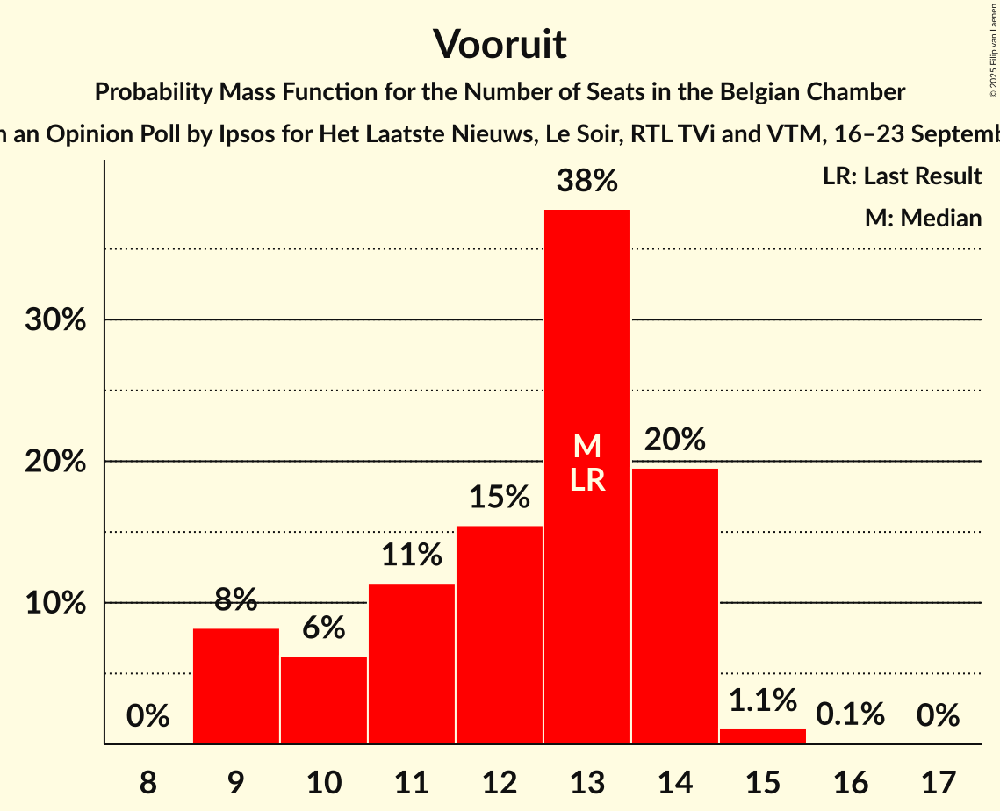

| Number of Seats | Probability | Accumulated | Special Marks |
|:---------------:|:-----------:|:-----------:|:-------------:|
| 9 | 8% | 100% |  |
| 10 | 6% | 92% |  |
| 11 | 11% | 86% |  |
| 12 | 15% | 74% |  |
| 13 | 38% | 59% | Last Result, Median |
| 14 | 20% | 21% |  |
| 15 | 1.1% | 1.3% |  |
| 16 | 0.1% | 0.2% |  |
| 17 | 0% | 0% |  |

### Christen-Democratisch en Vlaams

*For a full overview of the results for this party, see the [Christen-Democratisch en Vlaams](party-christen-democratischenvlaams.html) page.*

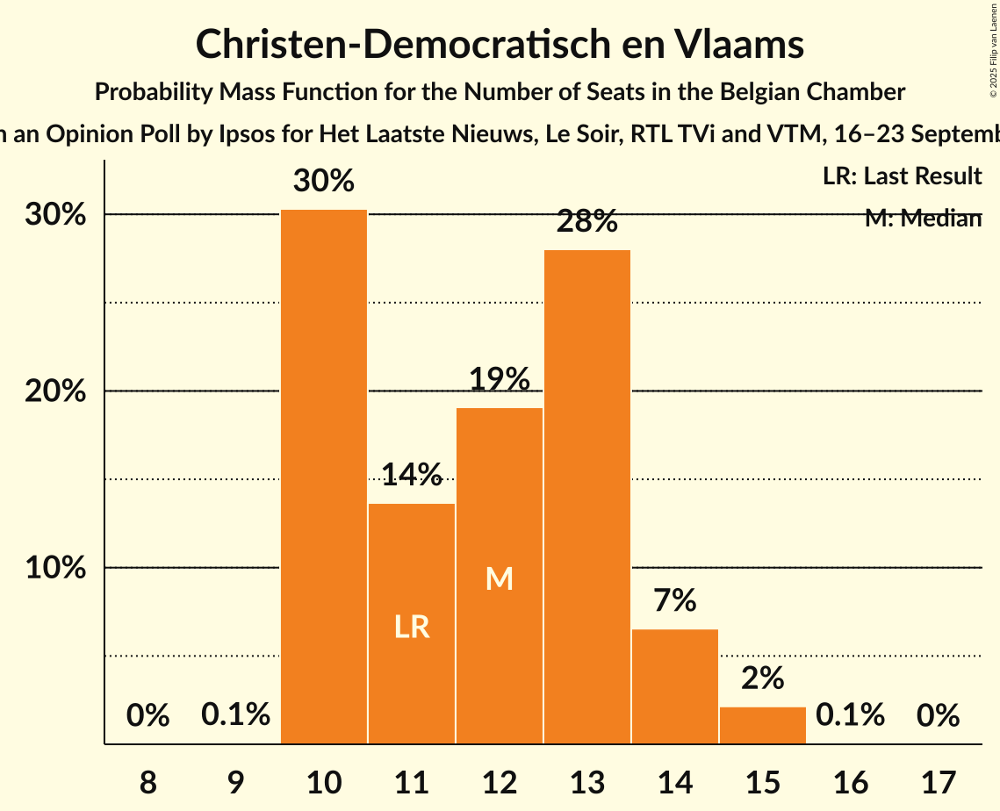

| Number of Seats | Probability | Accumulated | Special Marks |
|:---------------:|:-----------:|:-----------:|:-------------:|
| 9 | 0.1% | 100% |  |
| 10 | 30% | 99.9% |  |
| 11 | 14% | 70% | Last Result |
| 12 | 19% | 56% | Median |
| 13 | 28% | 37% |  |
| 14 | 7% | 9% |  |
| 15 | 2% | 2% |  |
| 16 | 0.1% | 0.1% |  |
| 17 | 0% | 0% |  |

### Parti du Travail de Belgique

*For a full overview of the results for this party, see the [Parti du Travail de Belgique](party-partidutravaildebelgique.html) page.*

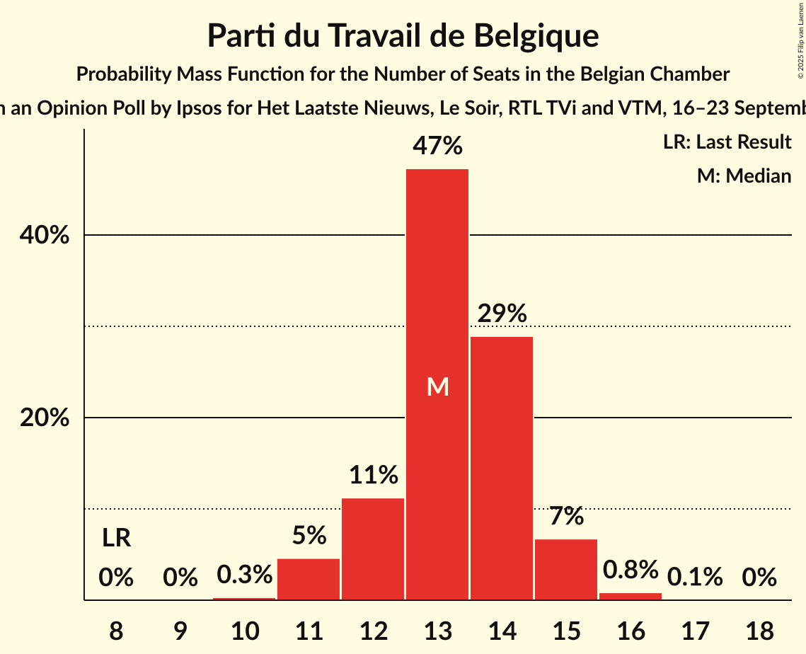

| Number of Seats | Probability | Accumulated | Special Marks |
|:---------------:|:-----------:|:-----------:|:-------------:|
| 8 | 0% | 100% | Last Result |
| 9 | 0% | 100% |  |
| 10 | 0.3% | 100% |  |
| 11 | 5% | 99.7% |  |
| 12 | 11% | 95% |  |
| 13 | 47% | 84% | Median |
| 14 | 29% | 37% |  |
| 15 | 7% | 8% |  |
| 16 | 0.8% | 0.9% |  |
| 17 | 0.1% | 0.1% |  |
| 18 | 0% | 0% |  |

### Les Engagés

*For a full overview of the results for this party, see the [Les Engagés](party-lesengagés.html) page.*

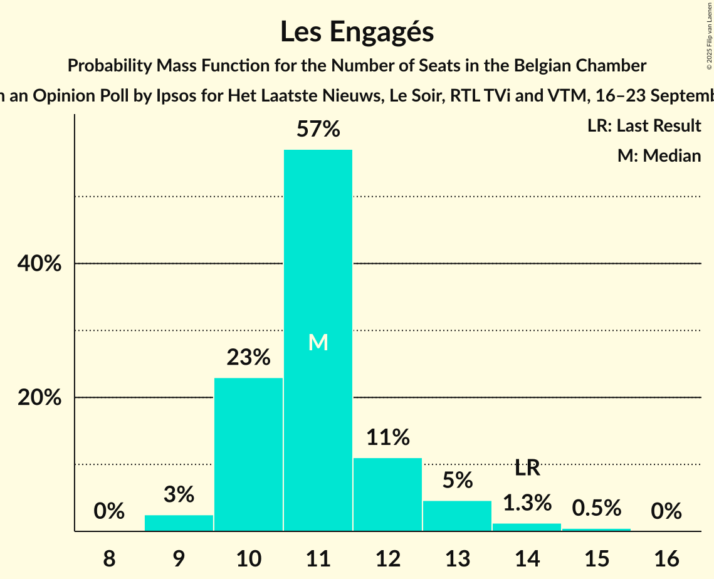

| Number of Seats | Probability | Accumulated | Special Marks |
|:---------------:|:-----------:|:-----------:|:-------------:|
| 9 | 3% | 100% |  |
| 10 | 23% | 97% |  |
| 11 | 57% | 74% | Median |
| 12 | 11% | 17% |  |
| 13 | 5% | 6% |  |
| 14 | 1.3% | 2% | Last Result |
| 15 | 0.5% | 0.5% |  |
| 16 | 0% | 0% |  |

### Partij van de Arbeid van België

*For a full overview of the results for this party, see the [Partij van de Arbeid van België](party-partijvandearbeidvanbelgië.html) page.*

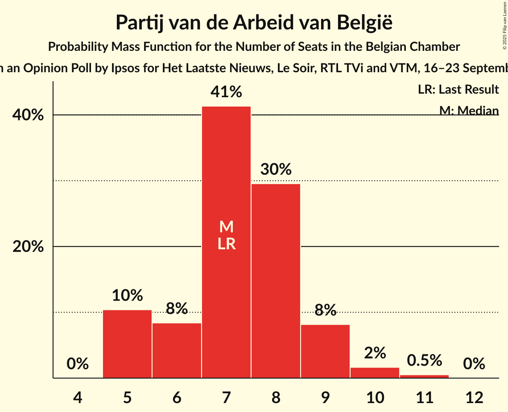

| Number of Seats | Probability | Accumulated | Special Marks |
|:---------------:|:-----------:|:-----------:|:-------------:|
| 5 | 10% | 100% |  |
| 6 | 8% | 90% |  |
| 7 | 41% | 81% | Last Result, Median |
| 8 | 30% | 40% |  |
| 9 | 8% | 10% |  |
| 10 | 2% | 2% |  |
| 11 | 0.5% | 0.5% |  |
| 12 | 0% | 0% |  |

### Groen

*For a full overview of the results for this party, see the [Groen](party-groen.html) page.*

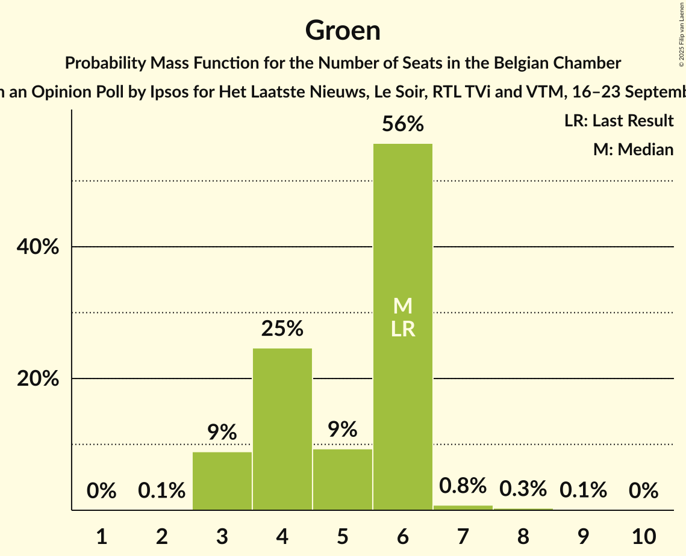

| Number of Seats | Probability | Accumulated | Special Marks |
|:---------------:|:-----------:|:-----------:|:-------------:|
| 2 | 0.1% | 100% |  |
| 3 | 9% | 99.9% |  |
| 4 | 25% | 91% |  |
| 5 | 9% | 66% |  |
| 6 | 56% | 57% | Last Result, Median |
| 7 | 0.8% | 1.3% |  |
| 8 | 0.3% | 0.5% |  |
| 9 | 0.1% | 0.2% |  |
| 10 | 0% | 0% |  |

### Open Vlaamse Liberalen en Democraten

*For a full overview of the results for this party, see the [Open Vlaamse Liberalen en Democraten](party-openvlaamseliberalenendemocraten.html) page.*

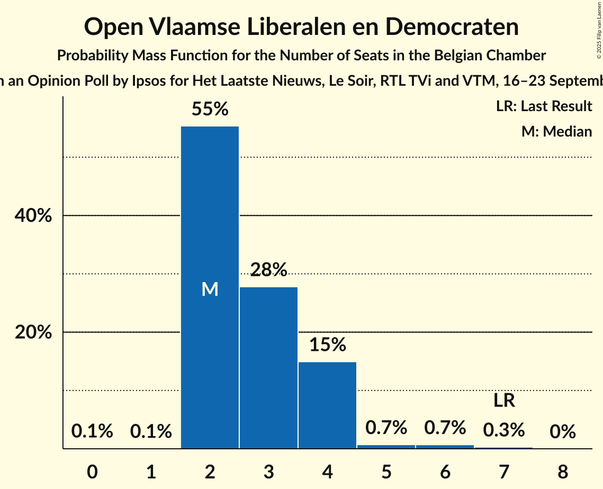

| Number of Seats | Probability | Accumulated | Special Marks |
|:---------------:|:-----------:|:-----------:|:-------------:|
| 0 | 0.1% | 100% |  |
| 1 | 0.1% | 99.9% |  |
| 2 | 55% | 99.8% | Median |
| 3 | 28% | 44% |  |
| 4 | 15% | 17% |  |
| 5 | 0.7% | 2% |  |
| 6 | 0.7% | 1.0% |  |
| 7 | 0.3% | 0.3% | Last Result |
| 8 | 0% | 0% |  |

### Ecolo

*For a full overview of the results for this party, see the [Ecolo](party-ecolo.html) page.*

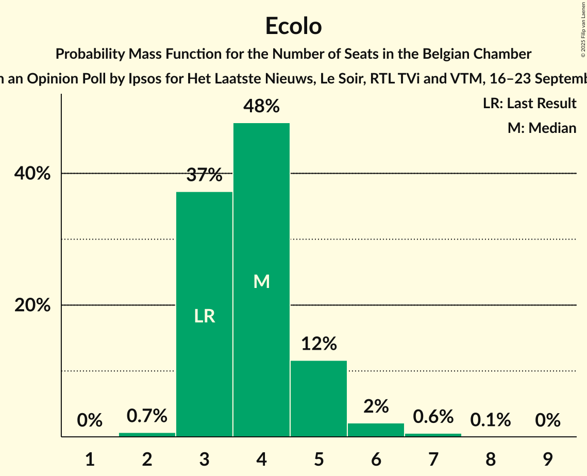

| Number of Seats | Probability | Accumulated | Special Marks |
|:---------------:|:-----------:|:-----------:|:-------------:|
| 2 | 0.7% | 100% |  |
| 3 | 37% | 99.3% | Last Result |
| 4 | 48% | 62% | Median |
| 5 | 12% | 14% |  |
| 6 | 2% | 3% |  |
| 7 | 0.6% | 0.6% |  |
| 8 | 0.1% | 0.1% |  |
| 9 | 0% | 0% |  |

### DéFI

*For a full overview of the results for this party, see the [DéFI](party-défi.html) page.*

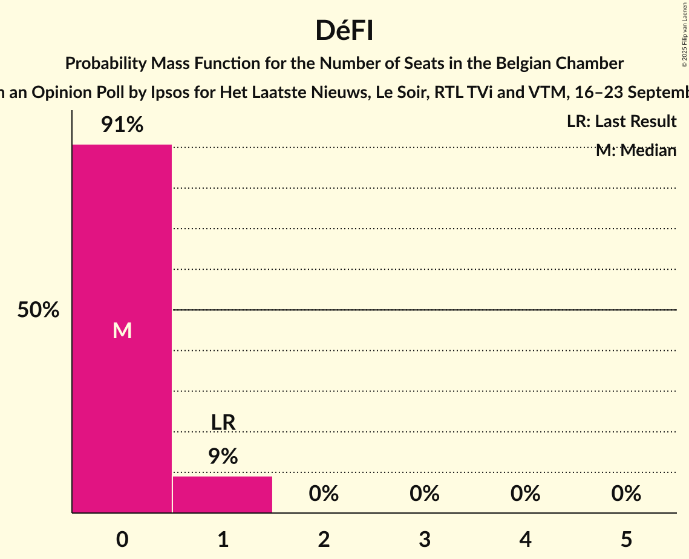

| Number of Seats | Probability | Accumulated | Special Marks |
|:---------------:|:-----------:|:-----------:|:-------------:|
| 0 | 91% | 100% | Median |
| 1 | 9% | 9% | Last Result |
| 2 | 0% | 0% |  |

### Chez Nous

*For a full overview of the results for this party, see the [Chez Nous](party-cheznous.html) page.*

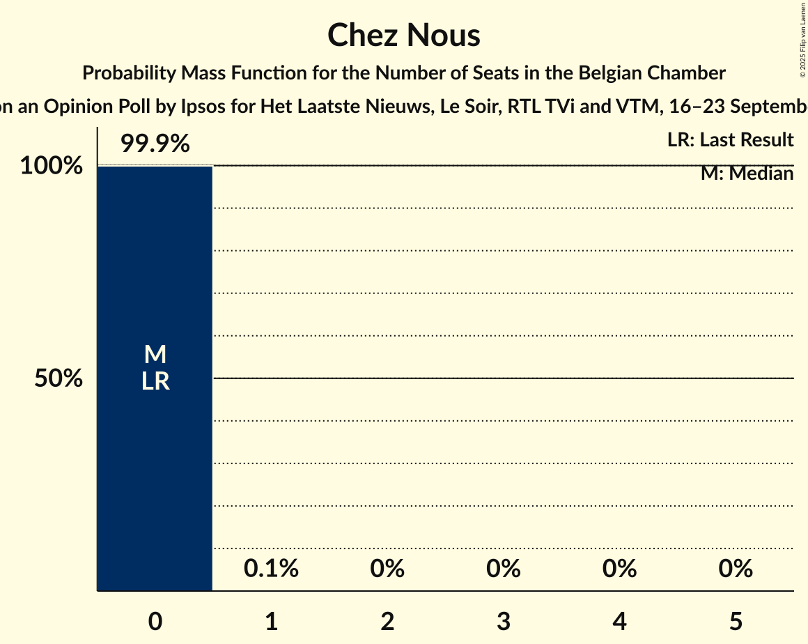

| Number of Seats | Probability | Accumulated | Special Marks |
|:---------------:|:-----------:|:-----------:|:-------------:|
| 0 | 99.9% | 100% | Last Result, Median |
| 1 | 0.1% | 0.1% |  |
| 2 | 0% | 0% |  |

### Team Fouad Ahidar

*For a full overview of the results for this party, see the [Team Fouad Ahidar](party-teamfouadahidar.html) page.*

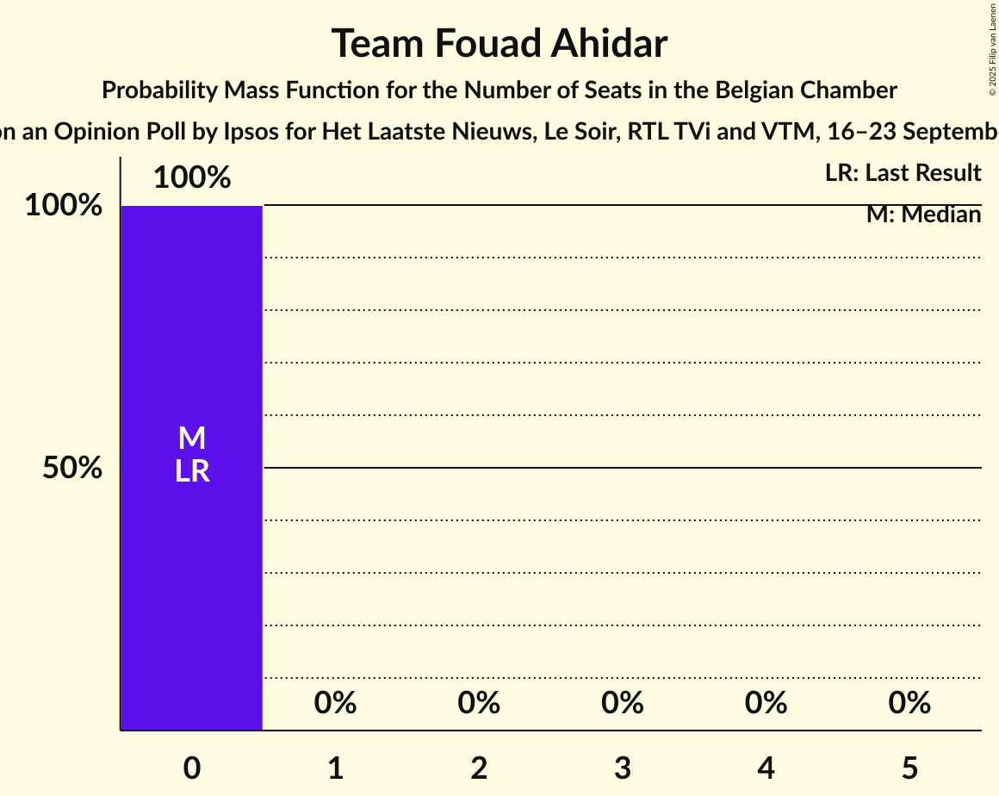

| Number of Seats | Probability | Accumulated | Special Marks |
|:---------------:|:-----------:|:-----------:|:-------------:|
| 0 | 100% | 100% | Last Result, Median |

## Coalitions

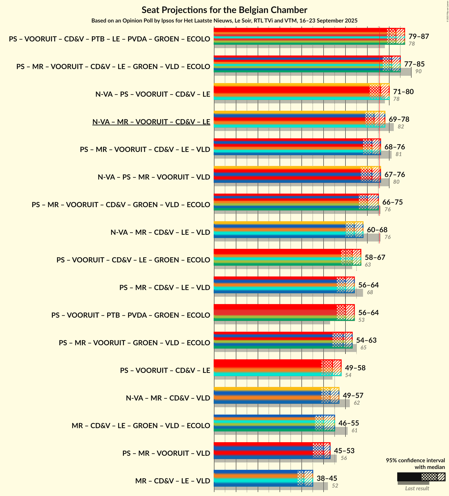

### Confidence Intervals

| Coalition | Last Result | Median | Majority? | 80% Confidence Interval | 90% Confidence Interval | 95% Confidence Interval | 99% Confidence Interval |
|:---------:|:-----------:|:------:|:---------:|:-----------------------:|:-----------------------:|:-----------------------:|:-----------------------:|
| Parti Socialiste – Vooruit – Christen-Democratisch en Vlaams – Parti du Travail de Belgique – Les Engagés – Partij van de Arbeid van België – Groen – Ecolo | 78 | 83 | 99.9% | 80–86 | 79–87 | 79–87 | 77–89 |
| Parti Socialiste – Mouvement Réformateur – Vooruit – Christen-Democratisch en Vlaams – Les Engagés – Groen – Open Vlaamse Liberalen en Democraten – Ecolo | 90 | 81 | 99.5% | 78–84 | 78–85 | 77–85 | 76–87 |
| Nieuw-Vlaamse Alliantie – Parti Socialiste – Vooruit – Christen-Democratisch en Vlaams – Les Engagés | 78 | 76 | 60% | 73–79 | 72–79 | 71–80 | 70–82 |
| Nieuw-Vlaamse Alliantie – Mouvement Réformateur – Vooruit – Christen-Democratisch en Vlaams – Les Engagés | 82 | 73 | 16% | 70–76 | 70–77 | 69–78 | 68–79 |
| Parti Socialiste – Mouvement Réformateur – Vooruit – Christen-Democratisch en Vlaams – Les Engagés – Open Vlaamse Liberalen en Democraten | 81 | 72 | 7% | 70–75 | 69–76 | 68–76 | 67–78 |
| Nieuw-Vlaamse Alliantie – Parti Socialiste – Mouvement Réformateur – Vooruit – Open Vlaamse Liberalen en Democraten | 80 | 72 | 5% | 69–75 | 68–76 | 67–76 | 66–78 |
| Parti Socialiste – Mouvement Réformateur – Vooruit – Christen-Democratisch en Vlaams – Groen – Open Vlaamse Liberalen en Democraten – Ecolo | 76 | 70 | 0.9% | 67–73 | 66–74 | 66–75 | 64–76 |
| Nieuw-Vlaamse Alliantie – Mouvement Réformateur – Christen-Democratisch en Vlaams – Les Engagés – Open Vlaamse Liberalen en Democraten | 76 | 64 | 0% | 61–66 | 61–67 | 60–68 | 59–70 |
| Parti Socialiste – Vooruit – Christen-Democratisch en Vlaams – Les Engagés – Groen – Ecolo | 63 | 63 | 0% | 60–66 | 59–66 | 58–67 | 57–68 |
| Parti Socialiste – Mouvement Réformateur – Christen-Democratisch en Vlaams – Les Engagés – Open Vlaamse Liberalen en Democraten | 68 | 60 | 0% | 58–62 | 57–63 | 56–64 | 56–65 |
| Parti Socialiste – Vooruit – Parti du Travail de Belgique – Partij van de Arbeid van België – Groen – Ecolo | 53 | 60 | 0% | 57–63 | 57–64 | 56–64 | 54–65 |
| Parti Socialiste – Mouvement Réformateur – Vooruit – Groen – Open Vlaamse Liberalen en Democraten – Ecolo | 65 | 59 | 0% | 56–61 | 55–62 | 54–63 | 52–64 |
| Parti Socialiste – Vooruit – Christen-Democratisch en Vlaams – Les Engagés | 54 | 54 | 0% | 51–56 | 50–57 | 49–58 | 48–59 |
| Nieuw-Vlaamse Alliantie – Mouvement Réformateur – Christen-Democratisch en Vlaams – Open Vlaamse Liberalen en Democraten | 62 | 53 | 0% | 50–55 | 50–56 | 49–57 | 48–58 |
| Mouvement Réformateur – Christen-Democratisch en Vlaams – Les Engagés – Groen – Open Vlaamse Liberalen en Democraten – Ecolo | 61 | 50 | 0% | 48–53 | 47–54 | 46–55 | 45–56 |
| Parti Socialiste – Mouvement Réformateur – Vooruit – Open Vlaamse Liberalen en Democraten | 56 | 50 | 0% | 47–52 | 46–53 | 45–53 | 44–55 |
| Mouvement Réformateur – Christen-Democratisch en Vlaams – Les Engagés – Open Vlaamse Liberalen en Democraten | 52 | 41 | 0% | 39–44 | 38–45 | 38–45 | 37–47 |

### Parti Socialiste – Vooruit – Christen-Democratisch en Vlaams – Parti du Travail de Belgique – Les Engagés – Partij van de Arbeid van België – Groen – Ecolo

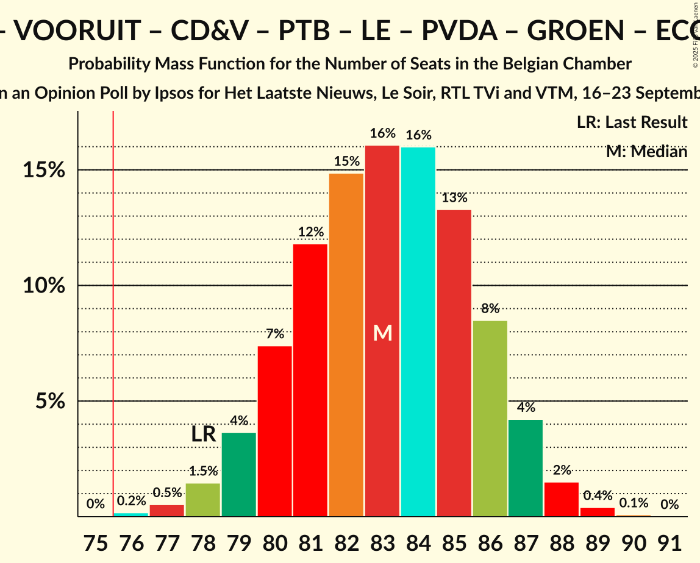

| Number of Seats | Probability | Accumulated | Special Marks |
|:---------------:|:-----------:|:-----------:|:-------------:|
| 75 | 0% | 100% |  |
| 76 | 0.2% | 99.9% | Majority |
| 77 | 0.5% | 99.8% |  |
| 78 | 1.5% | 99.2% | Last Result |
| 79 | 4% | 98% |  |
| 80 | 7% | 94% |  |
| 81 | 12% | 87% |  |
| 82 | 15% | 75% |  |
| 83 | 16% | 60% |  |
| 84 | 16% | 44% |  |
| 85 | 13% | 28% | Median |
| 86 | 8% | 15% |  |
| 87 | 4% | 6% |  |
| 88 | 2% | 2% |  |
| 89 | 0.4% | 0.5% |  |
| 90 | 0.1% | 0.1% |  |
| 91 | 0% | 0% |  |

### Parti Socialiste – Mouvement Réformateur – Vooruit – Christen-Democratisch en Vlaams – Les Engagés – Groen – Open Vlaamse Liberalen en Democraten – Ecolo

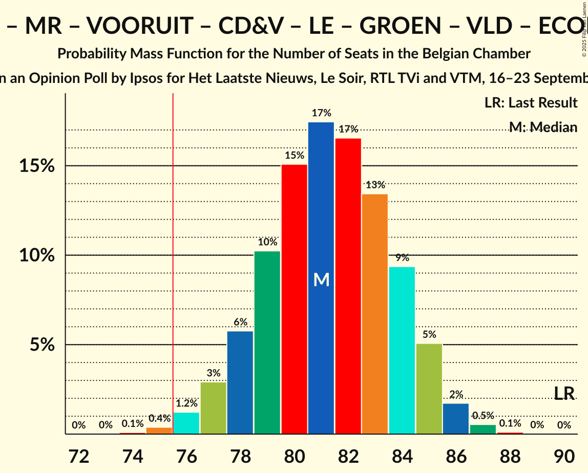

| Number of Seats | Probability | Accumulated | Special Marks |
|:---------------:|:-----------:|:-----------:|:-------------:|
| 74 | 0.1% | 100% |  |
| 75 | 0.4% | 99.9% |  |
| 76 | 1.2% | 99.5% | Majority |
| 77 | 3% | 98% |  |
| 78 | 6% | 95% |  |
| 79 | 10% | 90% |  |
| 80 | 15% | 79% |  |
| 81 | 17% | 64% |  |
| 82 | 17% | 47% |  |
| 83 | 13% | 30% | Median |
| 84 | 9% | 17% |  |
| 85 | 5% | 7% |  |
| 86 | 2% | 2% |  |
| 87 | 0.5% | 0.7% |  |
| 88 | 0.1% | 0.1% |  |
| 89 | 0% | 0% |  |
| 90 | 0% | 0% | Last Result |

### Nieuw-Vlaamse Alliantie – Parti Socialiste – Vooruit – Christen-Democratisch en Vlaams – Les Engagés

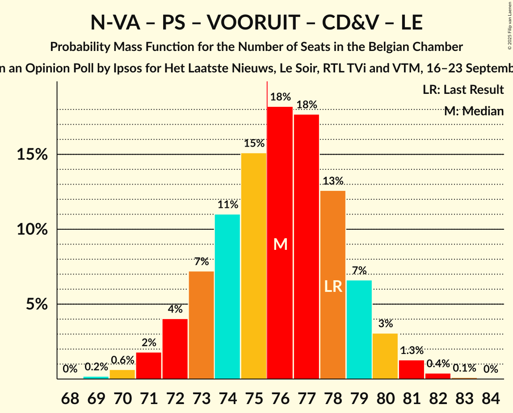

| Number of Seats | Probability | Accumulated | Special Marks |
|:---------------:|:-----------:|:-----------:|:-------------:|
| 68 | 0% | 100% |  |
| 69 | 0.2% | 99.9% |  |
| 70 | 0.6% | 99.8% |  |
| 71 | 2% | 99.1% |  |
| 72 | 4% | 97% |  |
| 73 | 7% | 93% |  |
| 74 | 11% | 86% |  |
| 75 | 15% | 75% |  |
| 76 | 18% | 60% | Majority |
| 77 | 18% | 42% | Median |
| 78 | 13% | 24% | Last Result |
| 79 | 7% | 11% |  |
| 80 | 3% | 5% |  |
| 81 | 1.3% | 2% |  |
| 82 | 0.4% | 0.5% |  |
| 83 | 0.1% | 0.1% |  |
| 84 | 0% | 0% |  |

### Nieuw-Vlaamse Alliantie – Mouvement Réformateur – Vooruit – Christen-Democratisch en Vlaams – Les Engagés

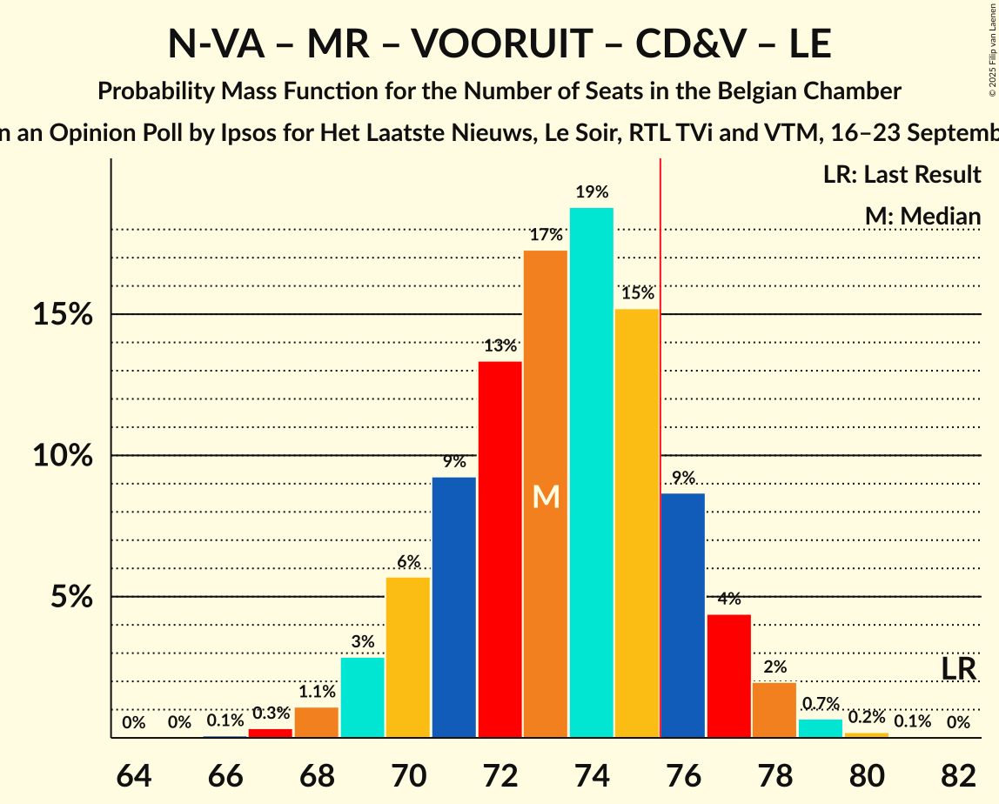

| Number of Seats | Probability | Accumulated | Special Marks |
|:---------------:|:-----------:|:-----------:|:-------------:|
| 66 | 0.1% | 100% |  |
| 67 | 0.3% | 99.9% |  |
| 68 | 1.1% | 99.6% |  |
| 69 | 3% | 98% |  |
| 70 | 6% | 96% |  |
| 71 | 9% | 90% |  |
| 72 | 13% | 81% |  |
| 73 | 17% | 67% |  |
| 74 | 19% | 50% | Median |
| 75 | 15% | 31% |  |
| 76 | 9% | 16% | Majority |
| 77 | 4% | 7% |  |
| 78 | 2% | 3% |  |
| 79 | 0.7% | 0.9% |  |
| 80 | 0.2% | 0.3% |  |
| 81 | 0.1% | 0.1% |  |
| 82 | 0% | 0% | Last Result |

### Parti Socialiste – Mouvement Réformateur – Vooruit – Christen-Democratisch en Vlaams – Les Engagés – Open Vlaamse Liberalen en Democraten

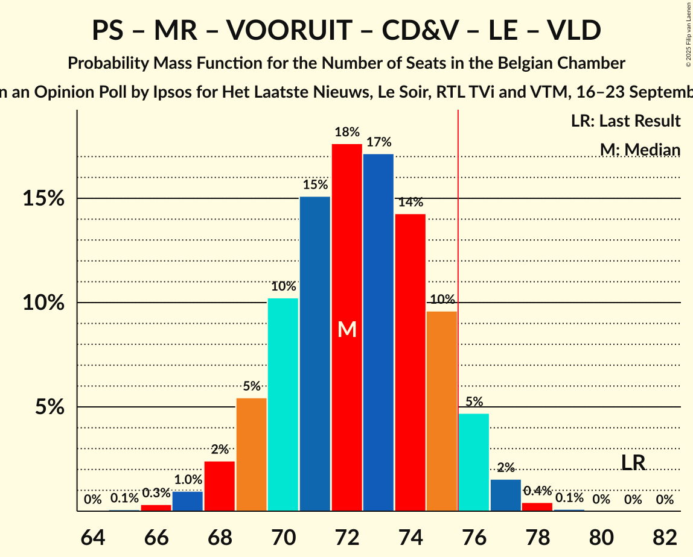

| Number of Seats | Probability | Accumulated | Special Marks |
|:---------------:|:-----------:|:-----------:|:-------------:|
| 65 | 0.1% | 100% |  |
| 66 | 0.3% | 99.9% |  |
| 67 | 1.0% | 99.6% |  |
| 68 | 2% | 98.6% |  |
| 69 | 5% | 96% |  |
| 70 | 10% | 91% |  |
| 71 | 15% | 81% |  |
| 72 | 18% | 65% |  |
| 73 | 17% | 48% | Median |
| 74 | 14% | 31% |  |
| 75 | 10% | 16% |  |
| 76 | 5% | 7% | Majority |
| 77 | 2% | 2% |  |
| 78 | 0.4% | 0.5% |  |
| 79 | 0.1% | 0.1% |  |
| 80 | 0% | 0% |  |
| 81 | 0% | 0% | Last Result |

### Nieuw-Vlaamse Alliantie – Parti Socialiste – Mouvement Réformateur – Vooruit – Open Vlaamse Liberalen en Democraten

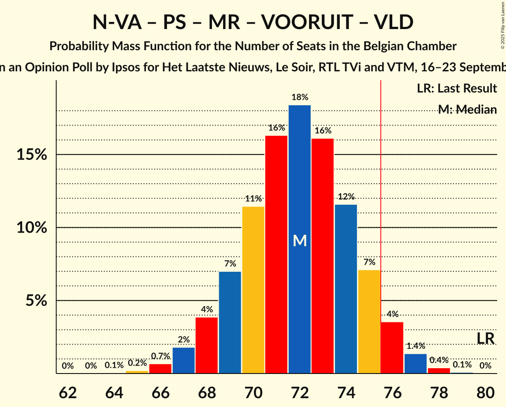

| Number of Seats | Probability | Accumulated | Special Marks |
|:---------------:|:-----------:|:-----------:|:-------------:|
| 64 | 0.1% | 100% |  |
| 65 | 0.2% | 99.9% |  |
| 66 | 0.7% | 99.7% |  |
| 67 | 2% | 99.1% |  |
| 68 | 4% | 97% |  |
| 69 | 7% | 93% |  |
| 70 | 11% | 86% |  |
| 71 | 16% | 75% |  |
| 72 | 18% | 59% | Median |
| 73 | 16% | 40% |  |
| 74 | 12% | 24% |  |
| 75 | 7% | 13% |  |
| 76 | 4% | 5% | Majority |
| 77 | 1.4% | 2% |  |
| 78 | 0.4% | 0.5% |  |
| 79 | 0.1% | 0.1% |  |
| 80 | 0% | 0% | Last Result |

### Parti Socialiste – Mouvement Réformateur – Vooruit – Christen-Democratisch en Vlaams – Groen – Open Vlaamse Liberalen en Democraten – Ecolo

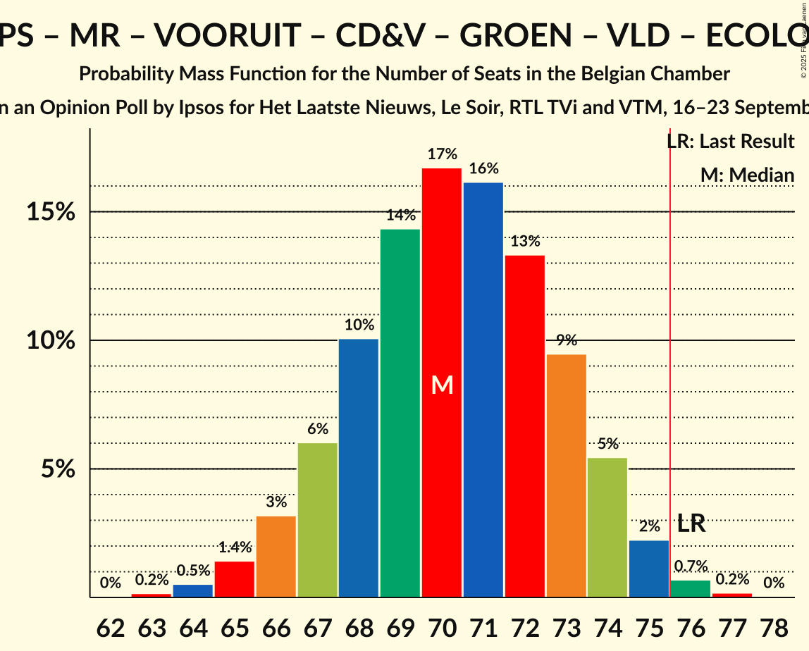

| Number of Seats | Probability | Accumulated | Special Marks |
|:---------------:|:-----------:|:-----------:|:-------------:|
| 63 | 0.2% | 100% |  |
| 64 | 0.5% | 99.8% |  |
| 65 | 1.4% | 99.3% |  |
| 66 | 3% | 98% |  |
| 67 | 6% | 95% |  |
| 68 | 10% | 89% |  |
| 69 | 14% | 79% |  |
| 70 | 17% | 64% |  |
| 71 | 16% | 48% |  |
| 72 | 13% | 31% | Median |
| 73 | 9% | 18% |  |
| 74 | 5% | 9% |  |
| 75 | 2% | 3% |  |
| 76 | 0.7% | 0.9% | Last Result, Majority |
| 77 | 0.2% | 0.2% |  |
| 78 | 0% | 0% |  |

### Nieuw-Vlaamse Alliantie – Mouvement Réformateur – Christen-Democratisch en Vlaams – Les Engagés – Open Vlaamse Liberalen en Democraten

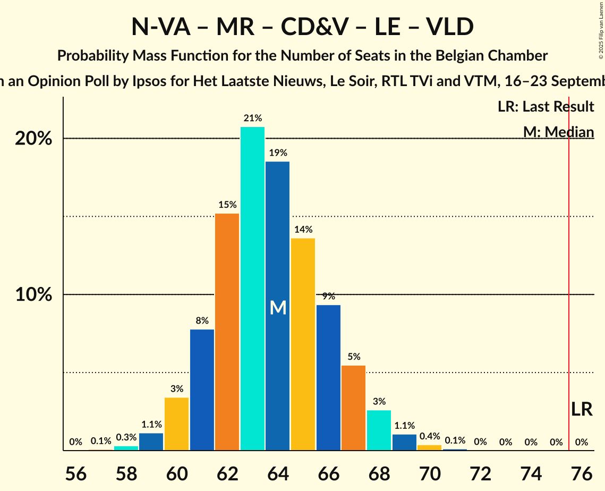

| Number of Seats | Probability | Accumulated | Special Marks |
|:---------------:|:-----------:|:-----------:|:-------------:|
| 57 | 0.1% | 100% |  |
| 58 | 0.3% | 99.9% |  |
| 59 | 1.1% | 99.6% |  |
| 60 | 3% | 98% |  |
| 61 | 8% | 95% |  |
| 62 | 15% | 87% |  |
| 63 | 21% | 72% | Median |
| 64 | 19% | 51% |  |
| 65 | 14% | 33% |  |
| 66 | 9% | 19% |  |
| 67 | 5% | 10% |  |
| 68 | 3% | 4% |  |
| 69 | 1.1% | 2% |  |
| 70 | 0.4% | 0.5% |  |
| 71 | 0.1% | 0.2% |  |
| 72 | 0% | 0% |  |
| 73 | 0% | 0% |  |
| 74 | 0% | 0% |  |
| 75 | 0% | 0% |  |
| 76 | 0% | 0% | Last Result, Majority |

### Parti Socialiste – Vooruit – Christen-Democratisch en Vlaams – Les Engagés – Groen – Ecolo

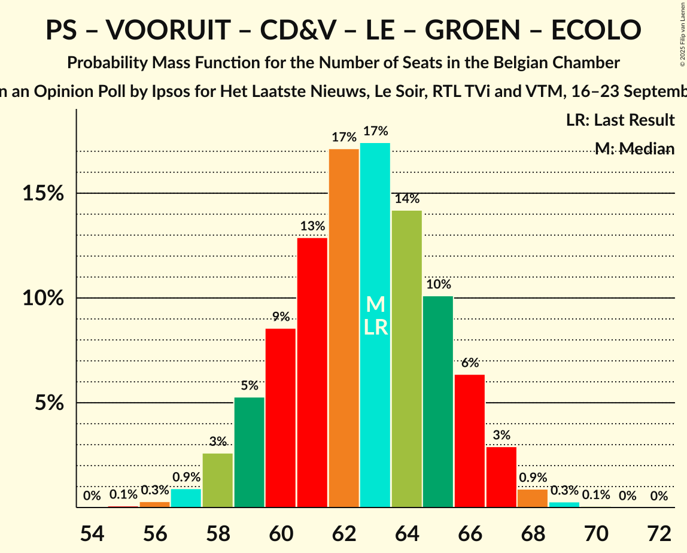

| Number of Seats | Probability | Accumulated | Special Marks |
|:---------------:|:-----------:|:-----------:|:-------------:|
| 55 | 0.1% | 100% |  |
| 56 | 0.3% | 99.9% |  |
| 57 | 0.9% | 99.6% |  |
| 58 | 3% | 98.7% |  |
| 59 | 5% | 96% |  |
| 60 | 9% | 91% |  |
| 61 | 13% | 82% |  |
| 62 | 17% | 69% |  |
| 63 | 17% | 52% | Last Result |
| 64 | 14% | 35% |  |
| 65 | 10% | 21% | Median |
| 66 | 6% | 11% |  |
| 67 | 3% | 4% |  |
| 68 | 0.9% | 1.2% |  |
| 69 | 0.3% | 0.4% |  |
| 70 | 0.1% | 0.1% |  |
| 71 | 0% | 0% |  |

### Parti Socialiste – Mouvement Réformateur – Christen-Democratisch en Vlaams – Les Engagés – Open Vlaamse Liberalen en Democraten

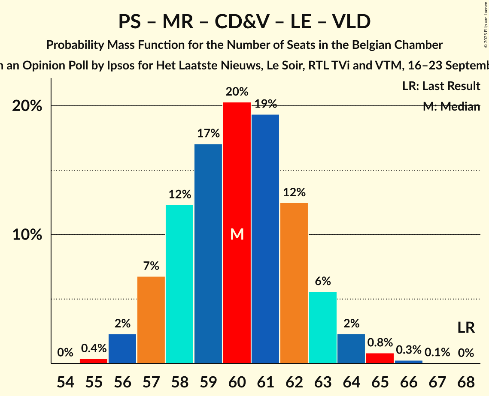

| Number of Seats | Probability | Accumulated | Special Marks |
|:---------------:|:-----------:|:-----------:|:-------------:|
| 54 | 0% | 100% |  |
| 55 | 0.4% | 99.9% |  |
| 56 | 2% | 99.6% |  |
| 57 | 7% | 97% |  |
| 58 | 12% | 91% |  |
| 59 | 17% | 78% |  |
| 60 | 20% | 61% | Median |
| 61 | 19% | 41% |  |
| 62 | 12% | 21% |  |
| 63 | 6% | 9% |  |
| 64 | 2% | 3% |  |
| 65 | 0.8% | 1.1% |  |
| 66 | 0.3% | 0.3% |  |
| 67 | 0.1% | 0.1% |  |
| 68 | 0% | 0% | Last Result |

### Parti Socialiste – Vooruit – Parti du Travail de Belgique – Partij van de Arbeid van België – Groen – Ecolo

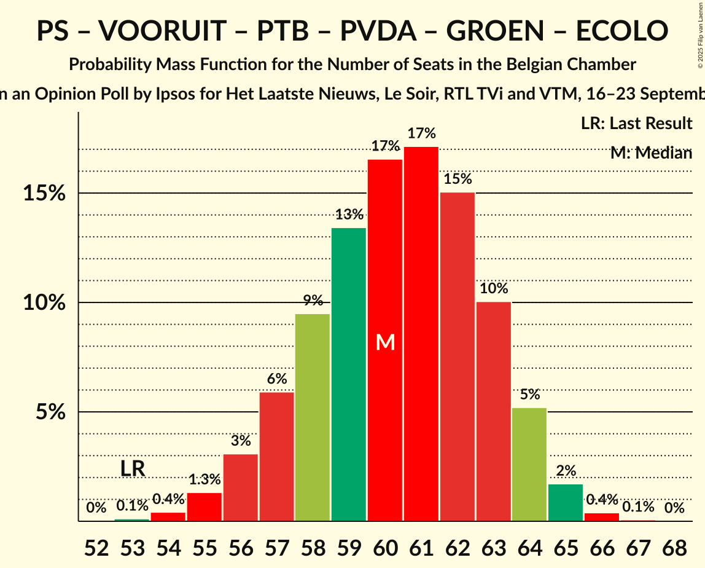

| Number of Seats | Probability | Accumulated | Special Marks |
|:---------------:|:-----------:|:-----------:|:-------------:|
| 53 | 0.1% | 100% | Last Result |
| 54 | 0.4% | 99.8% |  |
| 55 | 1.3% | 99.4% |  |
| 56 | 3% | 98% |  |
| 57 | 6% | 95% |  |
| 58 | 9% | 89% |  |
| 59 | 13% | 80% |  |
| 60 | 17% | 66% |  |
| 61 | 17% | 50% |  |
| 62 | 15% | 32% | Median |
| 63 | 10% | 17% |  |
| 64 | 5% | 7% |  |
| 65 | 2% | 2% |  |
| 66 | 0.4% | 0.5% |  |
| 67 | 0.1% | 0.1% |  |
| 68 | 0% | 0% |  |

### Parti Socialiste – Mouvement Réformateur – Vooruit – Groen – Open Vlaamse Liberalen en Democraten – Ecolo

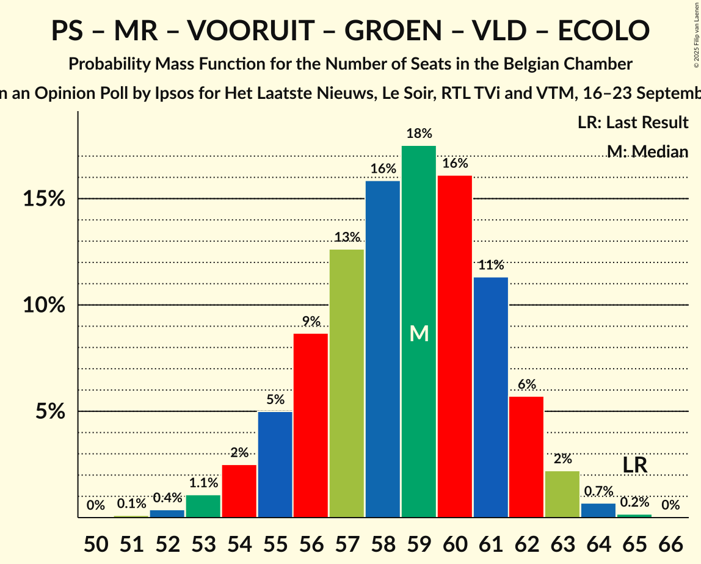

| Number of Seats | Probability | Accumulated | Special Marks |
|:---------------:|:-----------:|:-----------:|:-------------:|
| 51 | 0.1% | 100% |  |
| 52 | 0.4% | 99.9% |  |
| 53 | 1.1% | 99.5% |  |
| 54 | 2% | 98% |  |
| 55 | 5% | 96% |  |
| 56 | 9% | 91% |  |
| 57 | 13% | 82% |  |
| 58 | 16% | 70% |  |
| 59 | 18% | 54% |  |
| 60 | 16% | 36% | Median |
| 61 | 11% | 20% |  |
| 62 | 6% | 9% |  |
| 63 | 2% | 3% |  |
| 64 | 0.7% | 0.9% |  |
| 65 | 0.2% | 0.2% | Last Result |
| 66 | 0% | 0% |  |

### Parti Socialiste – Vooruit – Christen-Democratisch en Vlaams – Les Engagés

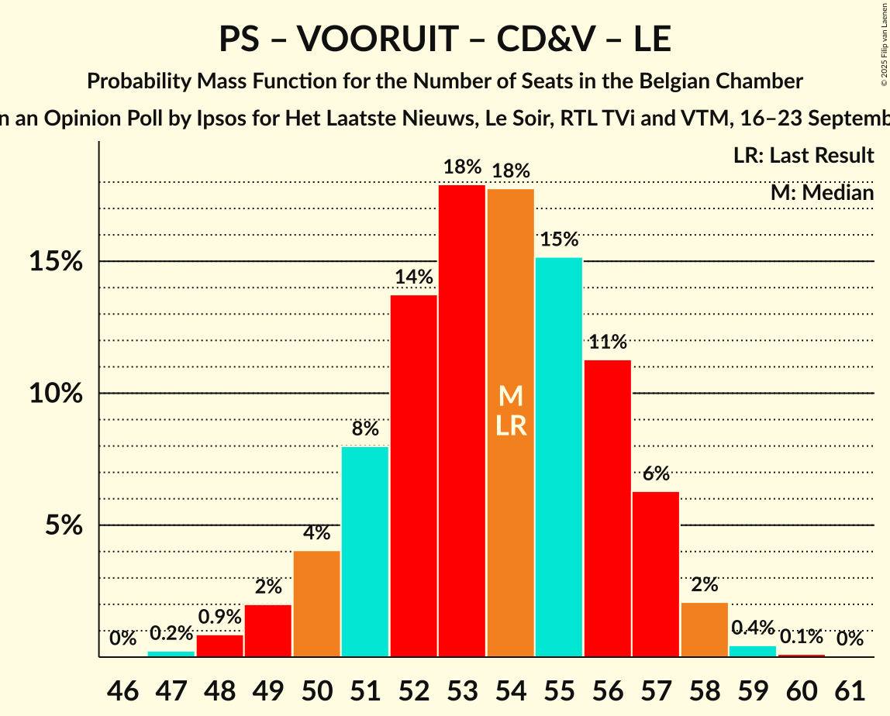

| Number of Seats | Probability | Accumulated | Special Marks |
|:---------------:|:-----------:|:-----------:|:-------------:|
| 46 | 0% | 100% |  |
| 47 | 0.2% | 99.9% |  |
| 48 | 0.9% | 99.7% |  |
| 49 | 2% | 98.8% |  |
| 50 | 4% | 97% |  |
| 51 | 8% | 93% |  |
| 52 | 14% | 85% |  |
| 53 | 18% | 71% |  |
| 54 | 18% | 53% | Last Result |
| 55 | 15% | 35% | Median |
| 56 | 11% | 20% |  |
| 57 | 6% | 9% |  |
| 58 | 2% | 3% |  |
| 59 | 0.4% | 0.6% |  |
| 60 | 0.1% | 0.1% |  |
| 61 | 0% | 0% |  |

### Nieuw-Vlaamse Alliantie – Mouvement Réformateur – Christen-Democratisch en Vlaams – Open Vlaamse Liberalen en Democraten

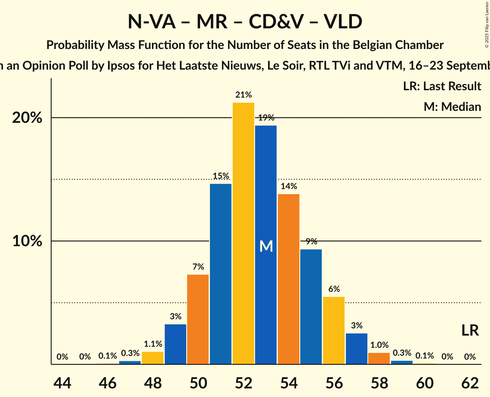

| Number of Seats | Probability | Accumulated | Special Marks |
|:---------------:|:-----------:|:-----------:|:-------------:|
| 46 | 0.1% | 100% |  |
| 47 | 0.3% | 99.9% |  |
| 48 | 1.1% | 99.6% |  |
| 49 | 3% | 98.5% |  |
| 50 | 7% | 95% |  |
| 51 | 15% | 88% |  |
| 52 | 21% | 73% | Median |
| 53 | 19% | 52% |  |
| 54 | 14% | 33% |  |
| 55 | 9% | 19% |  |
| 56 | 6% | 9% |  |
| 57 | 3% | 4% |  |
| 58 | 1.0% | 1.4% |  |
| 59 | 0.3% | 0.4% |  |
| 60 | 0.1% | 0.1% |  |
| 61 | 0% | 0% |  |
| 62 | 0% | 0% | Last Result |

### Mouvement Réformateur – Christen-Democratisch en Vlaams – Les Engagés – Groen – Open Vlaamse Liberalen en Democraten – Ecolo

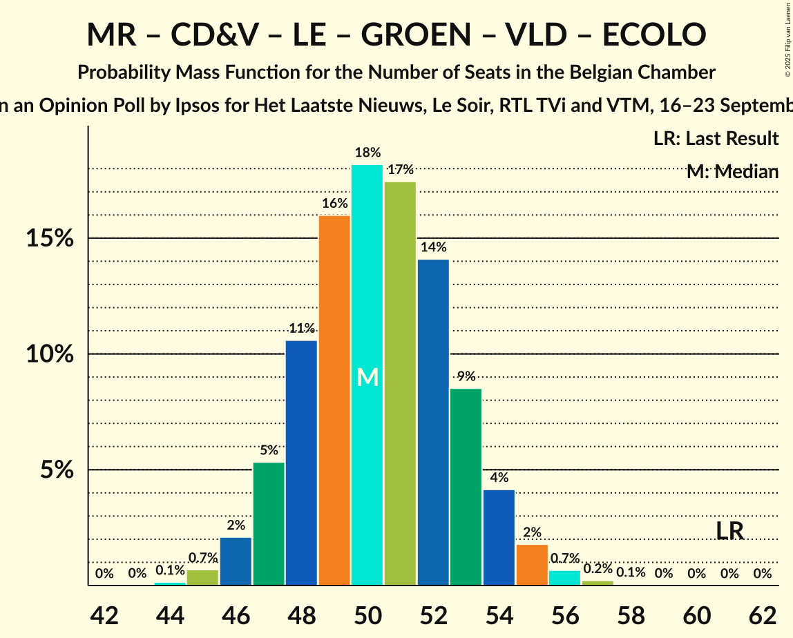

| Number of Seats | Probability | Accumulated | Special Marks |
|:---------------:|:-----------:|:-----------:|:-------------:|
| 44 | 0.1% | 100% |  |
| 45 | 0.7% | 99.8% |  |
| 46 | 2% | 99.1% |  |
| 47 | 5% | 97% |  |
| 48 | 11% | 92% |  |
| 49 | 16% | 81% |  |
| 50 | 18% | 65% |  |
| 51 | 17% | 47% | Median |
| 52 | 14% | 30% |  |
| 53 | 9% | 15% |  |
| 54 | 4% | 7% |  |
| 55 | 2% | 3% |  |
| 56 | 0.7% | 1.0% |  |
| 57 | 0.2% | 0.3% |  |
| 58 | 0.1% | 0.1% |  |
| 59 | 0% | 0% |  |
| 60 | 0% | 0% |  |
| 61 | 0% | 0% | Last Result |

### Parti Socialiste – Mouvement Réformateur – Vooruit – Open Vlaamse Liberalen en Democraten

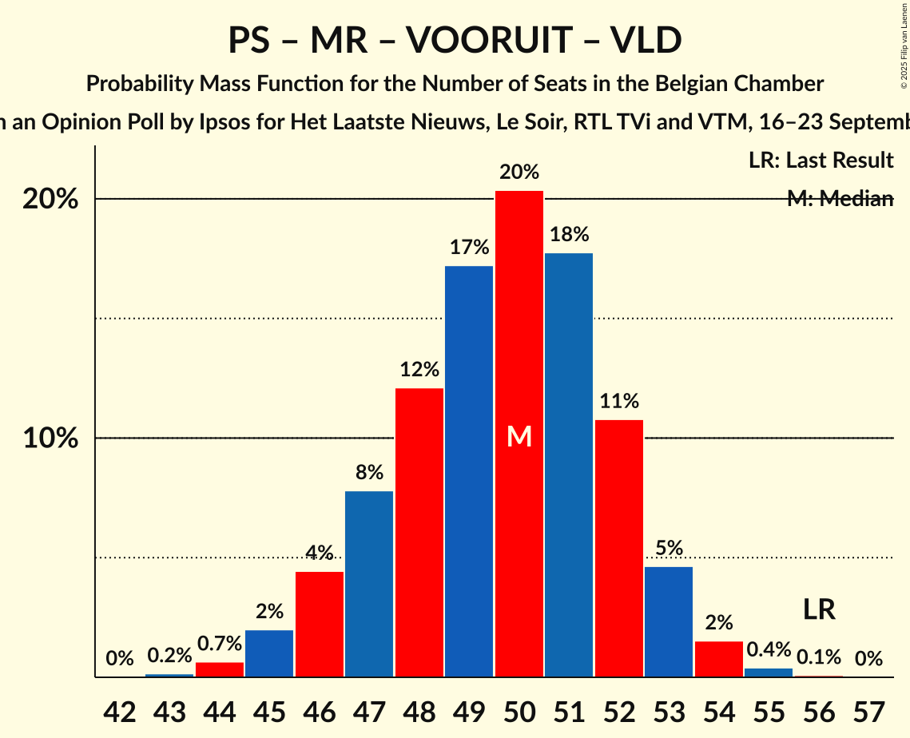

| Number of Seats | Probability | Accumulated | Special Marks |
|:---------------:|:-----------:|:-----------:|:-------------:|
| 43 | 0.2% | 100% |  |
| 44 | 0.7% | 99.8% |  |
| 45 | 2% | 99.2% |  |
| 46 | 4% | 97% |  |
| 47 | 8% | 93% |  |
| 48 | 12% | 85% |  |
| 49 | 17% | 73% |  |
| 50 | 20% | 56% | Median |
| 51 | 18% | 35% |  |
| 52 | 11% | 17% |  |
| 53 | 5% | 7% |  |
| 54 | 2% | 2% |  |
| 55 | 0.4% | 0.5% |  |
| 56 | 0.1% | 0.1% | Last Result |
| 57 | 0% | 0% |  |

### Mouvement Réformateur – Christen-Democratisch en Vlaams – Les Engagés – Open Vlaamse Liberalen en Democraten

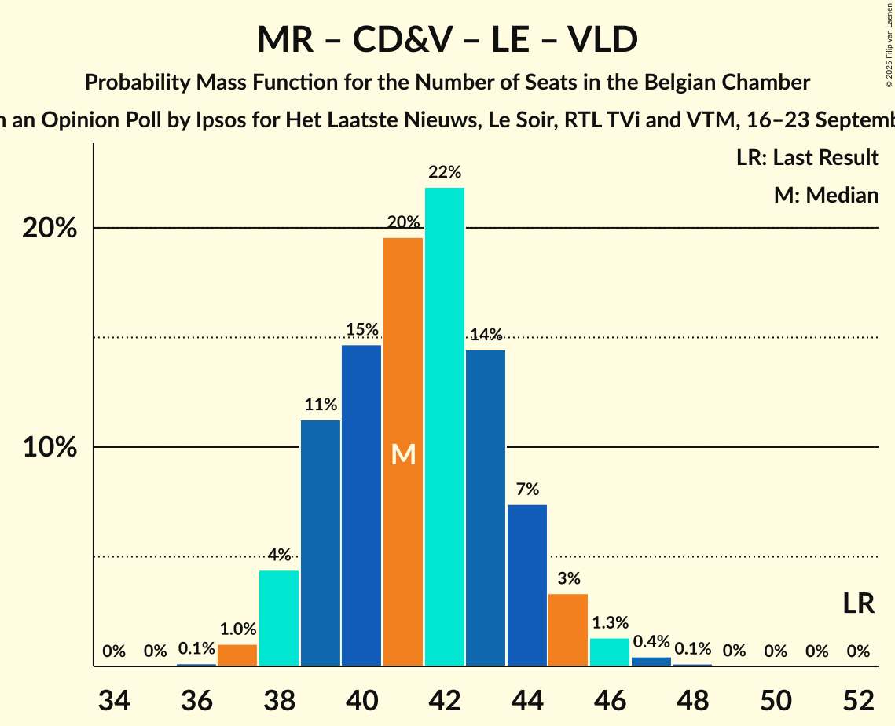

| Number of Seats | Probability | Accumulated | Special Marks |
|:---------------:|:-----------:|:-----------:|:-------------:|
| 36 | 0.1% | 100% |  |
| 37 | 1.0% | 99.9% |  |
| 38 | 4% | 98.8% |  |
| 39 | 11% | 94% |  |
| 40 | 15% | 83% |  |
| 41 | 20% | 69% | Median |
| 42 | 22% | 49% |  |
| 43 | 14% | 27% |  |
| 44 | 7% | 13% |  |
| 45 | 3% | 5% |  |
| 46 | 1.3% | 2% |  |
| 47 | 0.4% | 0.6% |  |
| 48 | 0.1% | 0.2% |  |
| 49 | 0% | 0% |  |
| 50 | 0% | 0% |  |
| 51 | 0% | 0% |  |
| 52 | 0% | 0% | Last Result |

## Technical Information

### Opinion Poll

+ **Polling firm:** Ipsos
+ **Commissioner(s):** Het Laatste Nieuws, Le Soir, RTL TVi and VTM
+ **Fieldwork period:** 16–23 September 2025

### Calculations

+ **Sample size:** 1606
+ **Simulations done:** 2,097,152
+ **Error estimate:** 0.82%

