# Opinion Poll by Bpact and Universiteit Antwerpen & ULB for De Standaard, RTBF and VRT, 9 March–5 April 2026

Areas included: Brussels, Flanders, Wallonia

<a href="#voting-intentions">Voting Intentions</a> | <a href="#seats">Seats</a> | <a href="#coalitions">Coalitions</a> | <a href="#technical-information">Technical Information</a>

## Voting Intentions

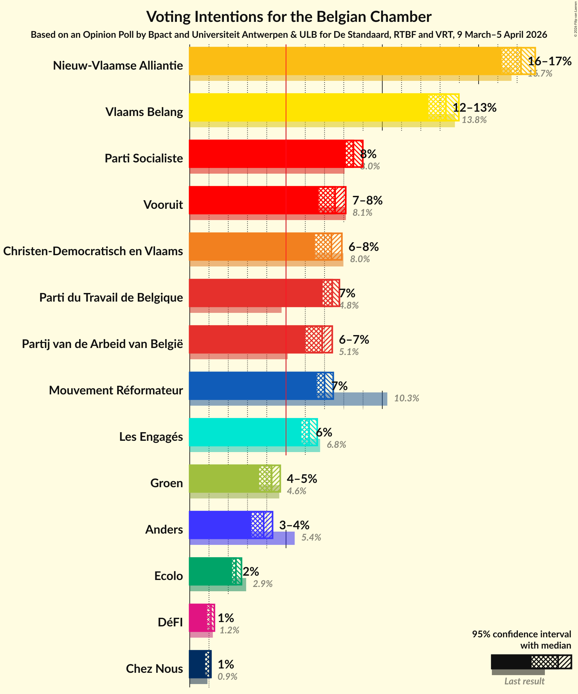

### Confidence Intervals

| Party | Last Result | Poll Result | 80% Confidence Interval | 90% Confidence Interval | 95% Confidence Interval | 99% Confidence Interval |
|:-----:|:-----------:|:-----------:|:-----------------------:|:-----------------------:|:-----------------------:|:-----------------------:|
| Nieuw-Vlaamse Alliantie | 16.7% | 17.9% | 16.6–17.2% |16.4–17.2% |16.2–17.2% |15.9–17.2% |
| Vlaams Belang | 13.8% | 14.0% | 12.7–13.3% |12.5–13.3% |12.4–13.3% |12.1–13.3% |
| Parti Socialiste | 8.0% | 9.0% | 8.2–8.5% |8.2–8.5% |8.1–8.5% |7.9–8.5% |
| Parti du Travail de Belgique | 4.8% | 7.8% | 7.1–7.3% |7.0–7.4% |6.9–7.4% |6.8–7.4% |
| Vooruit | 8.1% | 7.5% | 6.9–8.0% |6.8–8.1% |6.7–8.1% |6.4–8.2% |
| Mouvement Réformateur | 10.3% | 7.5% | 6.8–7.0% |6.7–7.0% |6.6–7.0% |6.5–7.0% |
| Christen-Democratisch en Vlaams | 8.0% | 7.4% | 6.8–7.8% |6.6–7.9% |6.5–7.9% |6.2–7.9% |
| Partij van de Arbeid van België | 5.1% | 6.9% | 6.3–7.3% |6.2–7.3% |6.0–7.4% |5.8–7.4% |
| Les Engagés | 6.8% | 6.6% | 6.0–6.2% |5.9–6.2% |5.8–6.2% |5.7–6.2% |
| Groen | 4.6% | 4.3% | 3.8–4.6% |3.7–4.7% |3.6–4.7% |3.4–4.7% |
| Anders | 5.4% | 3.8% | 3.4–4.2% |3.3–4.2% |3.2–4.3% |3.0–4.3% |
| Ecolo | 2.9% | 2.7% | 2.3–2.4% |2.2–2.4% |2.2–2.4% |2.1–2.4% |
| DéFI | 1.2% | 1.3% | 1.0–1.1% |1.0–1.1% |0.9–1.1% |0.9–1.1% |
| Chez Nous | 0.9% | 1.1% | 0.9–1.1% |0.8–1.1% |0.8–1.1% |0.7–1.1% |

*Note:* The poll result column reflects the actual value used in the calculations. Published results may vary slightly, and in addition be rounded to fewer digits.

## Seats

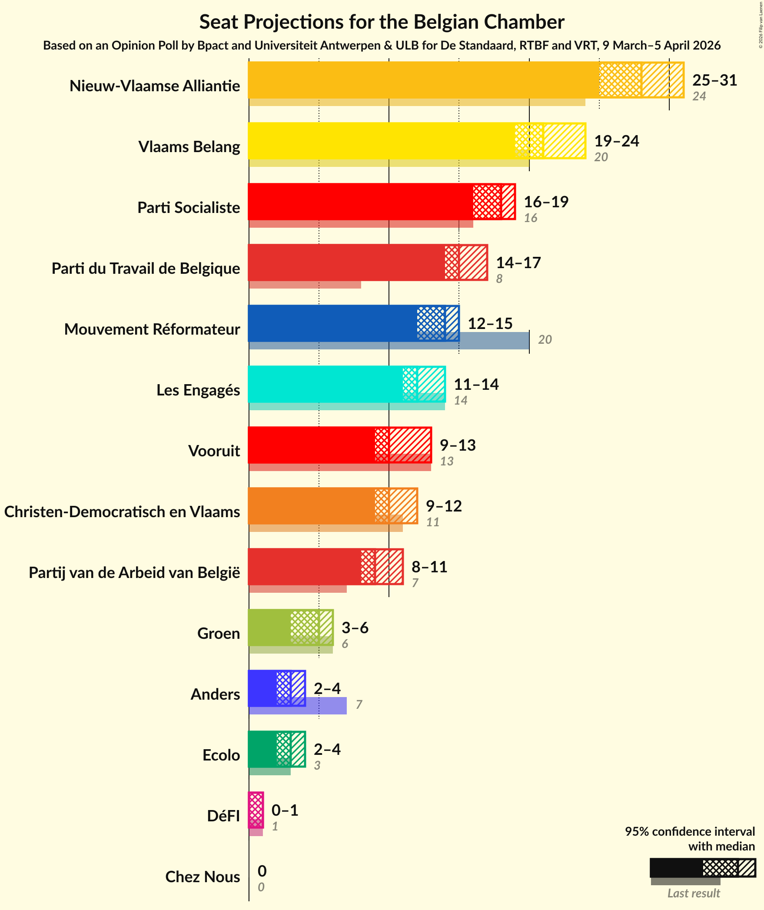

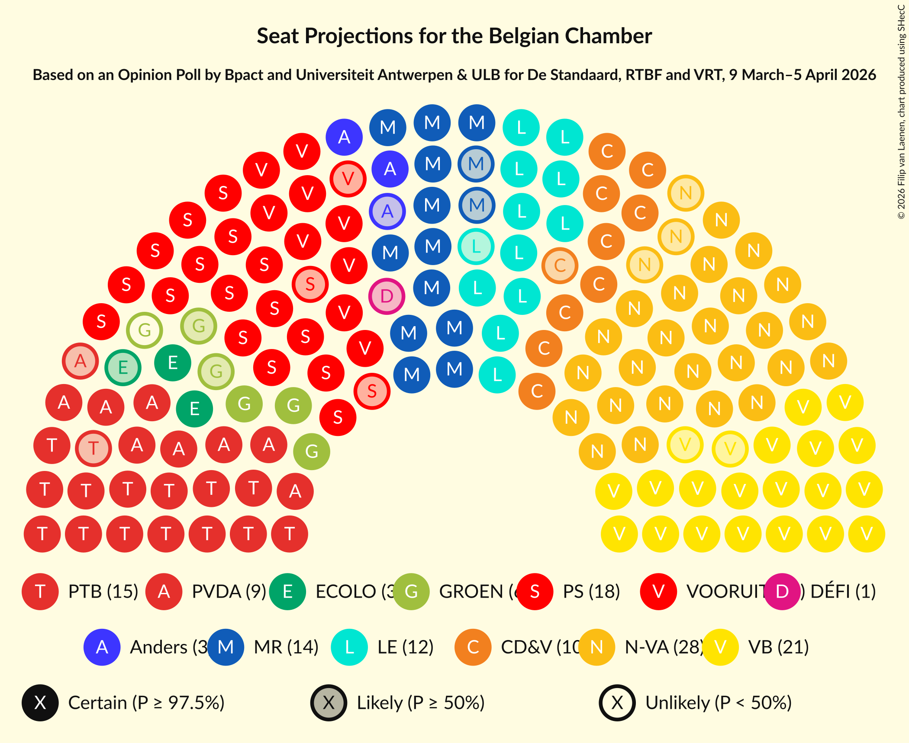

### Confidence Intervals

| Party | Last Result | Median | 80% Confidence Interval | 90% Confidence Interval | 95% Confidence Interval | 99% Confidence Interval |
|:-----:|:-----------:|:------:|:-----------------------:|:-----------------------:|:-----------------------:|:-----------------------:|
| <a href="#nieuw-vlaamse-alliantie">Nieuw-Vlaamse Alliantie</a> | 24 | 28 | 26–30 |25–31 |25–31 |24–31 |
| <a href="#vlaams-belang">Vlaams Belang</a> | 20 | 21 | 19–23 |19–24 |19–24 |18–24 |
| <a href="#parti-socialiste">Parti Socialiste</a> | 16 | 18 | 17–19 |16–19 |16–19 |15–19 |
| <a href="#parti-du-travail-de-belgique">Parti du Travail de Belgique</a> | 8 | 15 | 14–16 |14–16 |14–17 |13–17 |
| <a href="#vooruit">Vooruit</a> | 13 | 10 | 9–12 |9–13 |9–13 |8–13 |
| <a href="#mouvement-réformateur">Mouvement Réformateur</a> | 20 | 14 | 13–15 |12–15 |12–15 |12–16 |
| <a href="#christen-democratisch-en-vlaams">Christen-Democratisch en Vlaams</a> | 11 | 10 | 10–11 |9–12 |9–12 |8–13 |
| <a href="#partij-van-de-arbeid-van-belgië">Partij van de Arbeid van België</a> | 7 | 9 | 8–11 |8–11 |8–11 |8–11 |
| <a href="#les-engagés">Les Engagés</a> | 14 | 12 | 11–13 |11–13 |11–14 |11–14 |
| <a href="#groen">Groen</a> | 6 | 5 | 4–6 |3–6 |3–6 |3–6 |
| <a href="#anders">Anders</a> | 7 | 3 | 2–4 |2–4 |2–4 |2–5 |
| <a href="#ecolo">Ecolo</a> | 3 | 3 | 2–3 |2–3 |2–4 |2–4 |
| <a href="#défi">DéFI</a> | 1 | 1 | 1 |0–1 |0–1 |0–1 |
| <a href="#chez-nous">Chez Nous</a> | 0 | 0 | 0 |0 |0 |0 |

### Nieuw-Vlaamse Alliantie

*For a full overview of the results for this party, see the [Nieuw-Vlaamse Alliantie](party-nieuw-vlaamsealliantie.html) page.*

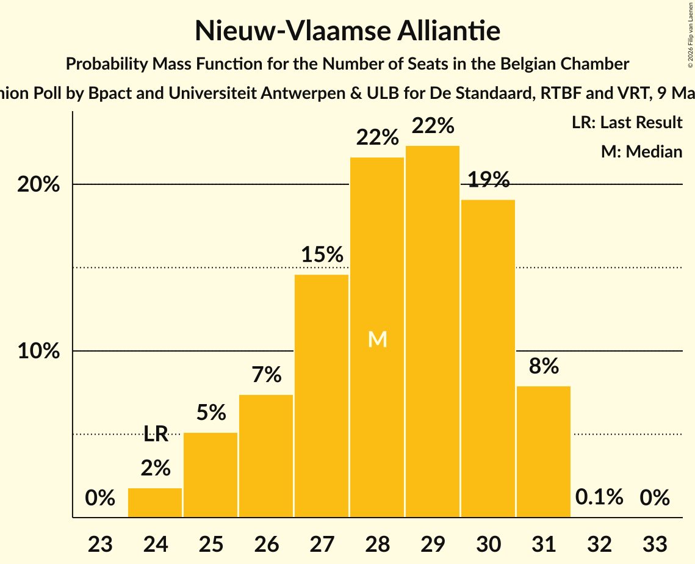

| Number of Seats | Probability | Accumulated | Special Marks |
|:---------------:|:-----------:|:-----------:|:-------------:|
| 24 | 2% | 100% | Last Result |
| 25 | 5% | 98% |  |
| 26 | 7% | 93% |  |
| 27 | 15% | 86% |  |
| 28 | 22% | 71% | Median |
| 29 | 22% | 49% |  |
| 30 | 19% | 27% |  |
| 31 | 8% | 8% |  |
| 32 | 0.1% | 0.1% |  |
| 33 | 0% | 0% |  |

### Vlaams Belang

*For a full overview of the results for this party, see the [Vlaams Belang](party-vlaamsbelang.html) page.*

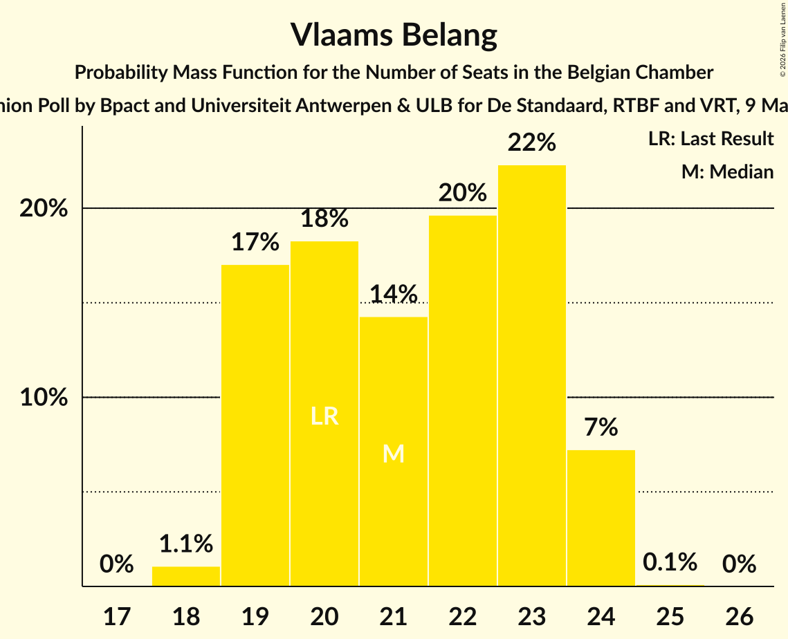

| Number of Seats | Probability | Accumulated | Special Marks |
|:---------------:|:-----------:|:-----------:|:-------------:|
| 18 | 1.1% | 100% |  |
| 19 | 17% | 98.9% |  |
| 20 | 18% | 82% | Last Result |
| 21 | 14% | 64% | Median |
| 22 | 20% | 49% |  |
| 23 | 22% | 30% |  |
| 24 | 7% | 7% |  |
| 25 | 0.1% | 0.1% |  |
| 26 | 0% | 0% |  |

### Parti Socialiste

*For a full overview of the results for this party, see the [Parti Socialiste](party-partisocialiste.html) page.*

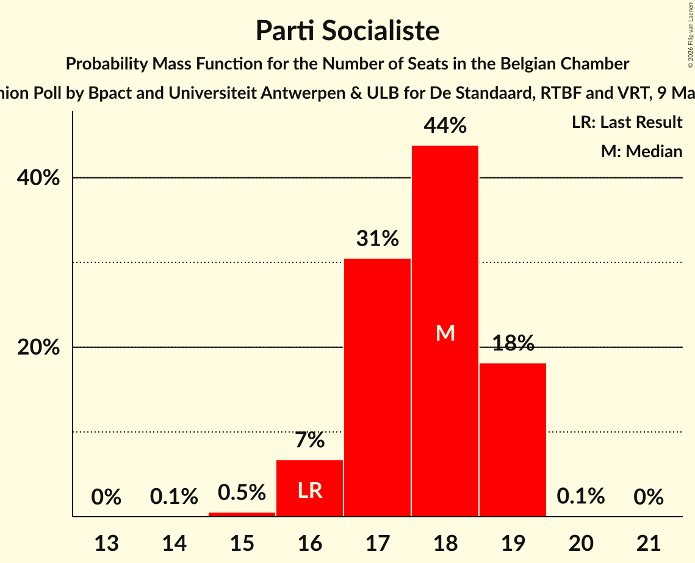

| Number of Seats | Probability | Accumulated | Special Marks |
|:---------------:|:-----------:|:-----------:|:-------------:|
| 14 | 0.1% | 100% |  |
| 15 | 0.5% | 99.9% |  |
| 16 | 7% | 99.4% | Last Result |
| 17 | 31% | 93% |  |
| 18 | 44% | 62% | Median |
| 19 | 18% | 18% |  |
| 20 | 0.1% | 0.1% |  |
| 21 | 0% | 0% |  |

### Parti du Travail de Belgique

*For a full overview of the results for this party, see the [Parti du Travail de Belgique](party-partidutravaildebelgique.html) page.*

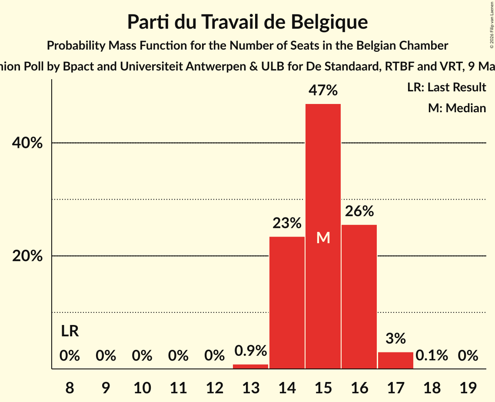

| Number of Seats | Probability | Accumulated | Special Marks |
|:---------------:|:-----------:|:-----------:|:-------------:|
| 8 | 0% | 100% | Last Result |
| 9 | 0% | 100% |  |
| 10 | 0% | 100% |  |
| 11 | 0% | 100% |  |
| 12 | 0% | 100% |  |
| 13 | 0.9% | 100% |  |
| 14 | 23% | 99.1% |  |
| 15 | 47% | 76% | Median |
| 16 | 26% | 29% |  |
| 17 | 3% | 3% |  |
| 18 | 0.1% | 0.1% |  |
| 19 | 0% | 0% |  |

### Vooruit

*For a full overview of the results for this party, see the [Vooruit](party-vooruit.html) page.*

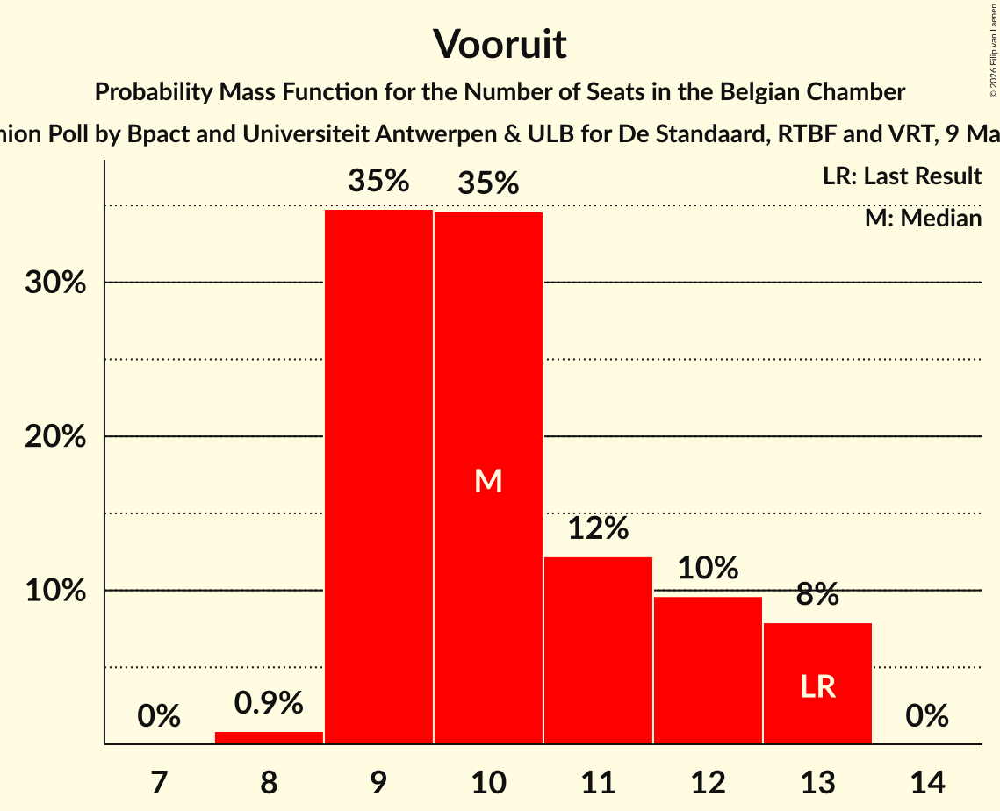

| Number of Seats | Probability | Accumulated | Special Marks |
|:---------------:|:-----------:|:-----------:|:-------------:|
| 8 | 0.9% | 100% |  |
| 9 | 35% | 99.1% |  |
| 10 | 35% | 64% | Median |
| 11 | 12% | 30% |  |
| 12 | 10% | 18% |  |
| 13 | 8% | 8% | Last Result |
| 14 | 0% | 0% |  |

### Mouvement Réformateur

*For a full overview of the results for this party, see the [Mouvement Réformateur](party-mouvementréformateur.html) page.*

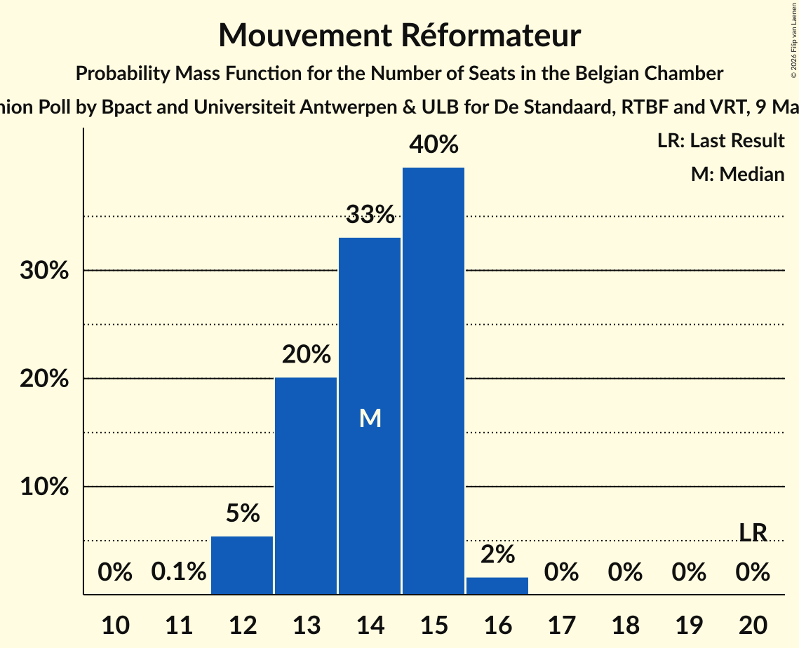

| Number of Seats | Probability | Accumulated | Special Marks |
|:---------------:|:-----------:|:-----------:|:-------------:|
| 11 | 0.1% | 100% |  |
| 12 | 5% | 99.9% |  |
| 13 | 20% | 94% |  |
| 14 | 33% | 74% | Median |
| 15 | 40% | 41% |  |
| 16 | 2% | 2% |  |
| 17 | 0% | 0% |  |
| 18 | 0% | 0% |  |
| 19 | 0% | 0% |  |
| 20 | 0% | 0% | Last Result |

### Christen-Democratisch en Vlaams

*For a full overview of the results for this party, see the [Christen-Democratisch en Vlaams](party-christen-democratischenvlaams.html) page.*

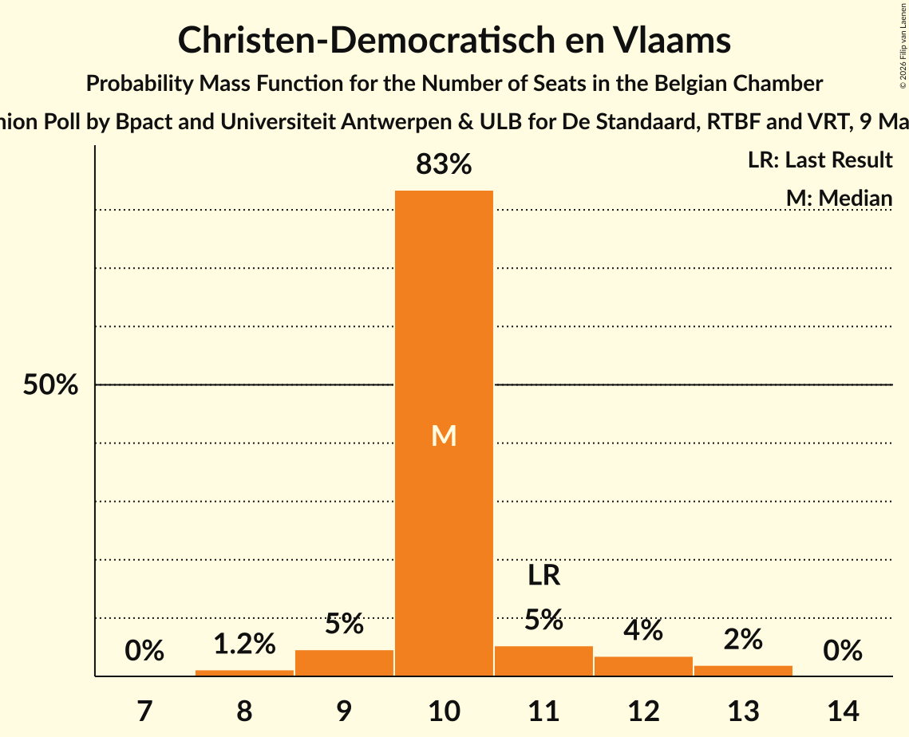

| Number of Seats | Probability | Accumulated | Special Marks |
|:---------------:|:-----------:|:-----------:|:-------------:|
| 8 | 1.2% | 100% |  |
| 9 | 5% | 98.8% |  |
| 10 | 83% | 94% | Median |
| 11 | 5% | 11% | Last Result |
| 12 | 4% | 5% |  |
| 13 | 2% | 2% |  |
| 14 | 0% | 0% |  |

### Partij van de Arbeid van België

*For a full overview of the results for this party, see the [Partij van de Arbeid van België](party-partijvandearbeidvanbelgië.html) page.*

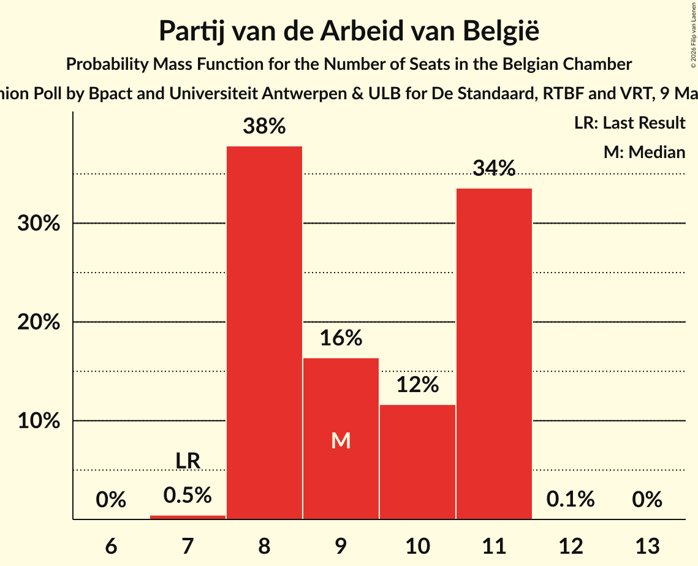

| Number of Seats | Probability | Accumulated | Special Marks |
|:---------------:|:-----------:|:-----------:|:-------------:|
| 7 | 0.5% | 100% | Last Result |
| 8 | 38% | 99.5% |  |
| 9 | 16% | 62% | Median |
| 10 | 12% | 45% |  |
| 11 | 34% | 34% |  |
| 12 | 0.1% | 0.1% |  |
| 13 | 0% | 0% |  |

### Les Engagés

*For a full overview of the results for this party, see the [Les Engagés](party-lesengagés.html) page.*

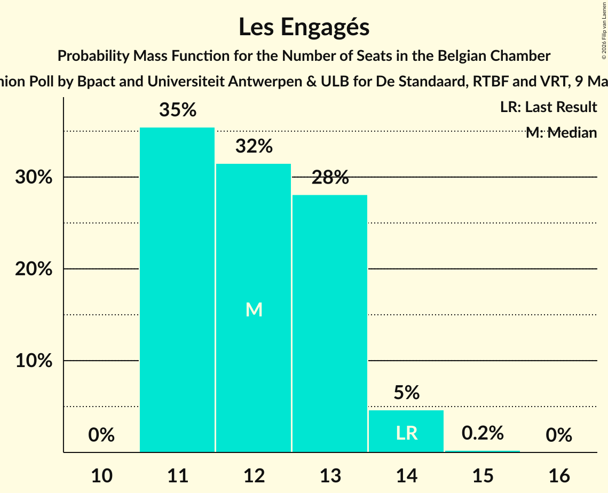

| Number of Seats | Probability | Accumulated | Special Marks |
|:---------------:|:-----------:|:-----------:|:-------------:|
| 11 | 35% | 100% |  |
| 12 | 32% | 65% | Median |
| 13 | 28% | 33% |  |
| 14 | 5% | 5% | Last Result |
| 15 | 0.2% | 0.3% |  |
| 16 | 0% | 0% |  |

### Groen

*For a full overview of the results for this party, see the [Groen](party-groen.html) page.*

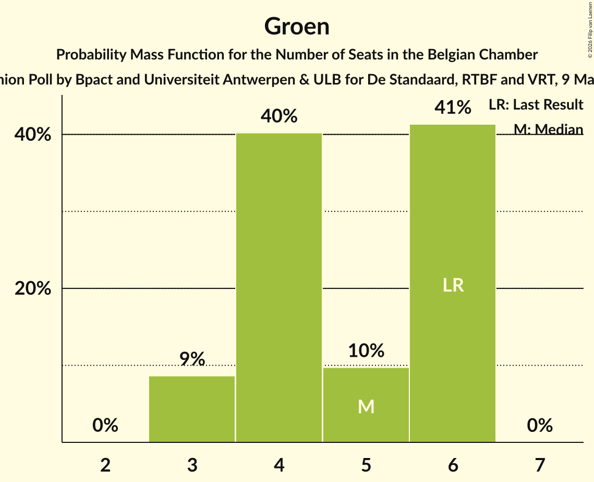

| Number of Seats | Probability | Accumulated | Special Marks |
|:---------------:|:-----------:|:-----------:|:-------------:|
| 2 | 0% | 100% |  |
| 3 | 9% | 99.9% |  |
| 4 | 40% | 91% |  |
| 5 | 10% | 51% | Median |
| 6 | 41% | 41% | Last Result |
| 7 | 0% | 0% |  |

### Anders

*For a full overview of the results for this party, see the [Anders](party-anders.html) page.*

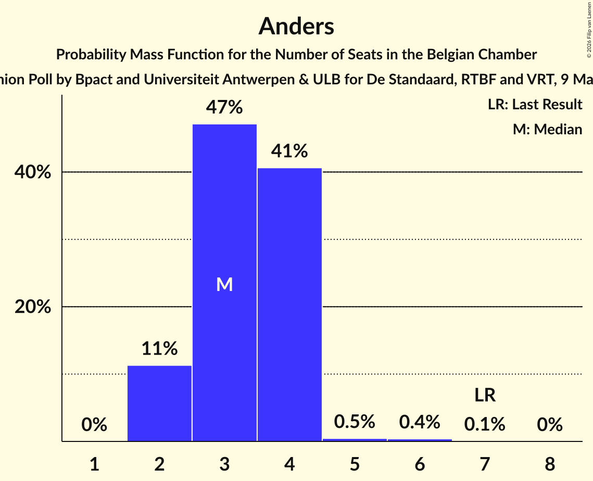

| Number of Seats | Probability | Accumulated | Special Marks |
|:---------------:|:-----------:|:-----------:|:-------------:|
| 2 | 11% | 100% |  |
| 3 | 47% | 89% | Median |
| 4 | 41% | 42% |  |
| 5 | 0.5% | 0.9% |  |
| 6 | 0.4% | 0.5% |  |
| 7 | 0.1% | 0.1% | Last Result |
| 8 | 0% | 0% |  |

### Ecolo

*For a full overview of the results for this party, see the [Ecolo](party-ecolo.html) page.*

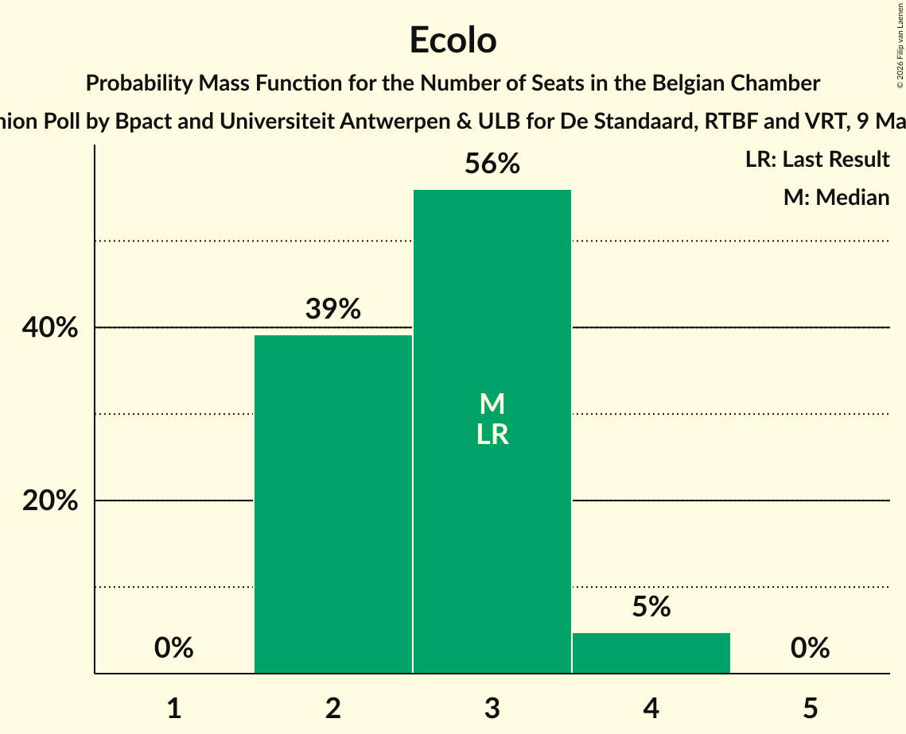

| Number of Seats | Probability | Accumulated | Special Marks |
|:---------------:|:-----------:|:-----------:|:-------------:|
| 2 | 39% | 100% |  |
| 3 | 56% | 61% | Last Result, Median |
| 4 | 5% | 5% |  |
| 5 | 0% | 0% |  |

### DéFI

*For a full overview of the results for this party, see the [DéFI](party-défi.html) page.*

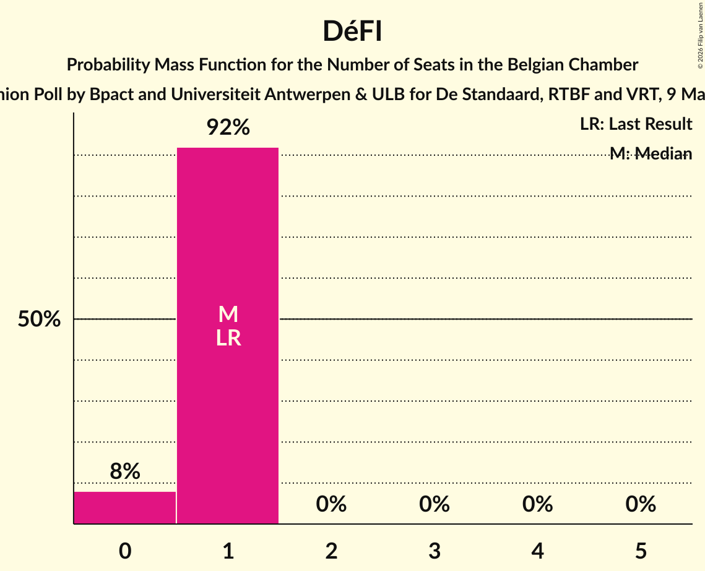

| Number of Seats | Probability | Accumulated | Special Marks |
|:---------------:|:-----------:|:-----------:|:-------------:|
| 0 | 8% | 100% |  |
| 1 | 92% | 92% | Last Result, Median |
| 2 | 0% | 0% |  |

### Chez Nous

*For a full overview of the results for this party, see the [Chez Nous](party-cheznous.html) page.*

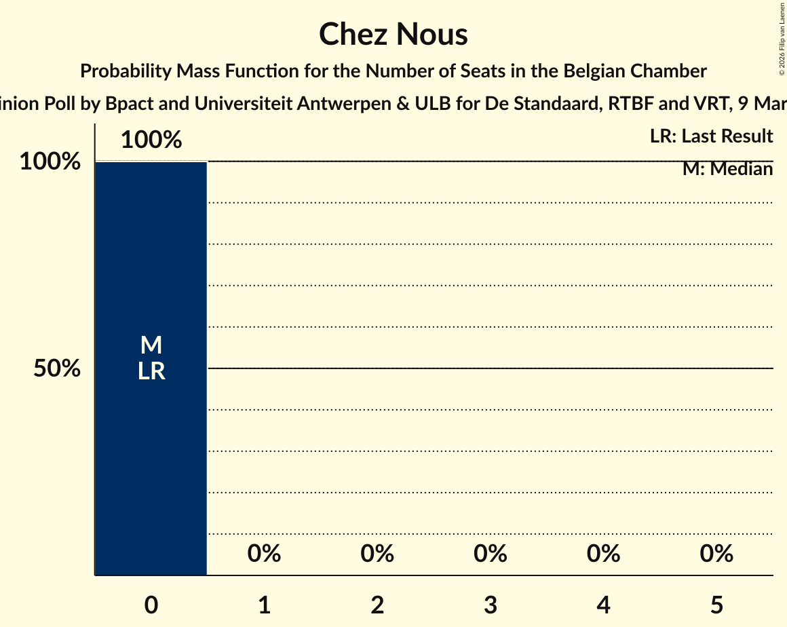

| Number of Seats | Probability | Accumulated | Special Marks |
|:---------------:|:-----------:|:-----------:|:-------------:|
| 0 | 100% | 100% | Last Result, Median |

## Coalitions

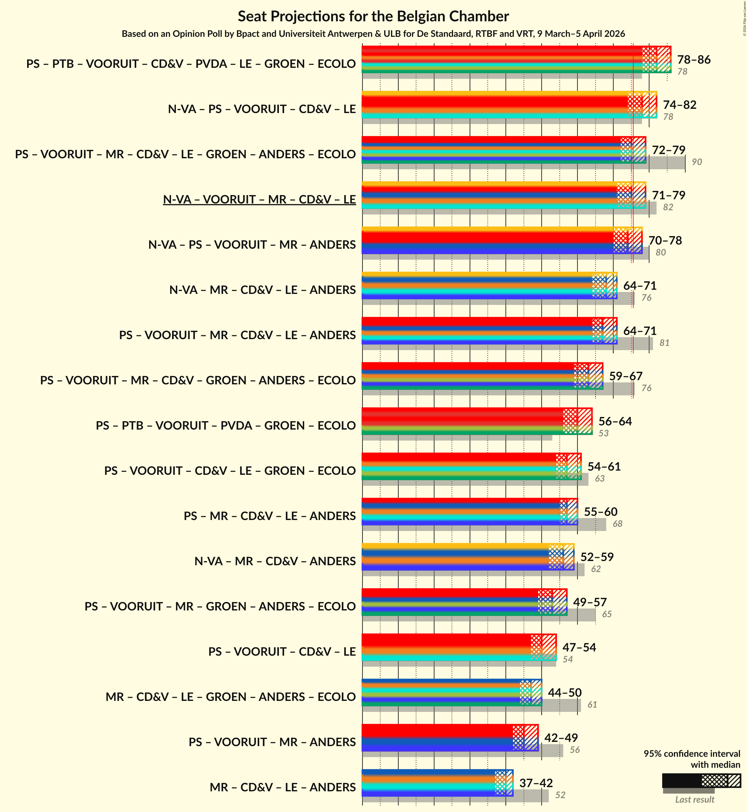

### Confidence Intervals

| Coalition | Last Result | Median | Majority? | 80% Confidence Interval | 90% Confidence Interval | 95% Confidence Interval | 99% Confidence Interval |
|:---------:|:-----------:|:------:|:---------:|:-----------------------:|:-----------------------:|:-----------------------:|:-----------------------:|
| Parti Socialiste – Parti du Travail de Belgique – Vooruit – Christen-Democratisch en Vlaams – Partij van de Arbeid van België – Les Engagés – Groen – Ecolo | 78 | 82 | 100% | 79–85 | 79–85 | 78–86 | 77–87 |
| Nieuw-Vlaamse Alliantie – Parti Socialiste – Vooruit – Christen-Democratisch en Vlaams – Les Engagés | 78 | 78 | 92% | 76–81 | 75–82 | 74–82 | 73–84 |
| Parti Socialiste – Vooruit – Mouvement Réformateur – Christen-Democratisch en Vlaams – Les Engagés – Groen – Anders – Ecolo | 90 | 75 | 38% | 73–77 | 72–78 | 72–79 | 71–80 |
| Nieuw-Vlaamse Alliantie – Vooruit – Mouvement Réformateur – Christen-Democratisch en Vlaams – Les Engagés | 82 | 75 | 36% | 72–77 | 71–78 | 71–79 | 69–80 |
| Nieuw-Vlaamse Alliantie – Parti Socialiste – Vooruit – Mouvement Réformateur – Anders | 80 | 74 | 18% | 71–76 | 70–77 | 70–78 | 68–79 |
| Nieuw-Vlaamse Alliantie – Mouvement Réformateur – Christen-Democratisch en Vlaams – Les Engagés – Anders | 76 | 68 | 0% | 65–70 | 65–71 | 64–71 | 63–73 |
| Parti Socialiste – Vooruit – Mouvement Réformateur – Christen-Democratisch en Vlaams – Les Engagés – Anders | 81 | 67 | 0% | 65–70 | 65–70 | 64–71 | 64–72 |
| Parti Socialiste – Vooruit – Mouvement Réformateur – Christen-Democratisch en Vlaams – Groen – Anders – Ecolo | 76 | 63 | 0% | 60–65 | 60–66 | 59–67 | 58–68 |
| Parti Socialiste – Parti du Travail de Belgique – Vooruit – Partij van de Arbeid van België – Groen – Ecolo | 53 | 60 | 0% | 57–63 | 56–63 | 56–64 | 55–65 |
| Parti Socialiste – Vooruit – Christen-Democratisch en Vlaams – Les Engagés – Groen – Ecolo | 63 | 57 | 0% | 55–60 | 55–61 | 54–61 | 53–63 |
| Parti Socialiste – Mouvement Réformateur – Christen-Democratisch en Vlaams – Les Engagés – Anders | 68 | 57 | 0% | 56–59 | 55–59 | 55–60 | 54–61 |
| Nieuw-Vlaamse Alliantie – Mouvement Réformateur – Christen-Democratisch en Vlaams – Anders | 62 | 56 | 0% | 53–58 | 53–59 | 52–59 | 51–60 |
| Parti Socialiste – Vooruit – Mouvement Réformateur – Groen – Anders – Ecolo | 65 | 53 | 0% | 50–55 | 50–56 | 49–57 | 48–58 |
| Parti Socialiste – Vooruit – Christen-Democratisch en Vlaams – Les Engagés | 54 | 50 | 0% | 48–52 | 48–53 | 47–54 | 46–55 |
| Mouvement Réformateur – Christen-Democratisch en Vlaams – Les Engagés – Groen – Anders – Ecolo | 61 | 47 | 0% | 45–49 | 44–50 | 44–50 | 43–51 |
| Parti Socialiste – Vooruit – Mouvement Réformateur – Anders | 56 | 45 | 0% | 43–48 | 43–48 | 42–49 | 41–50 |
| Mouvement Réformateur – Christen-Democratisch en Vlaams – Les Engagés – Anders | 52 | 40 | 0% | 38–41 | 37–42 | 37–42 | 36–43 |

### Parti Socialiste – Parti du Travail de Belgique – Vooruit – Christen-Democratisch en Vlaams – Partij van de Arbeid van België – Les Engagés – Groen – Ecolo

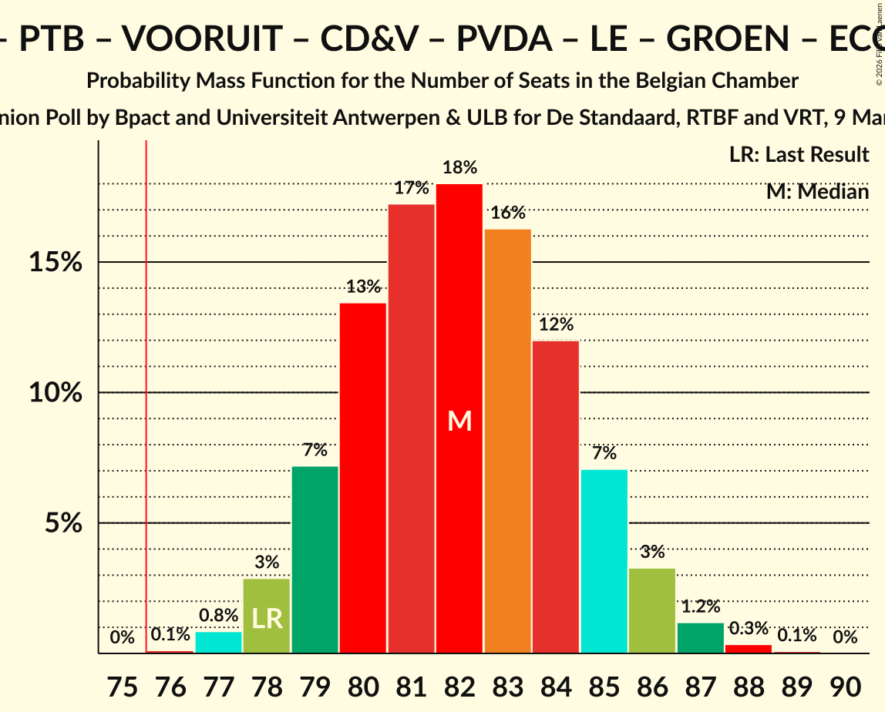

| Number of Seats | Probability | Accumulated | Special Marks |
|:---------------:|:-----------:|:-----------:|:-------------:|
| 76 | 0.1% | 100% | Majority |
| 77 | 0.8% | 99.9% |  |
| 78 | 3% | 99.0% | Last Result |
| 79 | 7% | 96% |  |
| 80 | 13% | 89% |  |
| 81 | 17% | 76% |  |
| 82 | 18% | 58% | Median |
| 83 | 16% | 40% |  |
| 84 | 12% | 24% |  |
| 85 | 7% | 12% |  |
| 86 | 3% | 5% |  |
| 87 | 1.2% | 2% |  |
| 88 | 0.3% | 0.4% |  |
| 89 | 0.1% | 0.1% |  |
| 90 | 0% | 0% |  |

### Nieuw-Vlaamse Alliantie – Parti Socialiste – Vooruit – Christen-Democratisch en Vlaams – Les Engagés

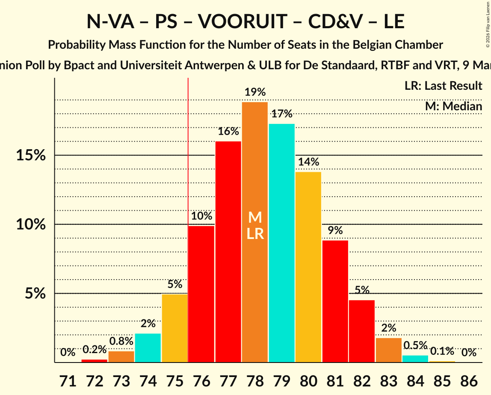

| Number of Seats | Probability | Accumulated | Special Marks |
|:---------------:|:-----------:|:-----------:|:-------------:|
| 72 | 0.2% | 100% |  |
| 73 | 0.8% | 99.7% |  |
| 74 | 2% | 98.9% |  |
| 75 | 5% | 97% |  |
| 76 | 10% | 92% | Majority |
| 77 | 16% | 82% |  |
| 78 | 19% | 66% | Last Result, Median |
| 79 | 17% | 47% |  |
| 80 | 14% | 30% |  |
| 81 | 9% | 16% |  |
| 82 | 5% | 7% |  |
| 83 | 2% | 2% |  |
| 84 | 0.5% | 0.7% |  |
| 85 | 0.1% | 0.1% |  |
| 86 | 0% | 0% |  |

### Parti Socialiste – Vooruit – Mouvement Réformateur – Christen-Democratisch en Vlaams – Les Engagés – Groen – Anders – Ecolo

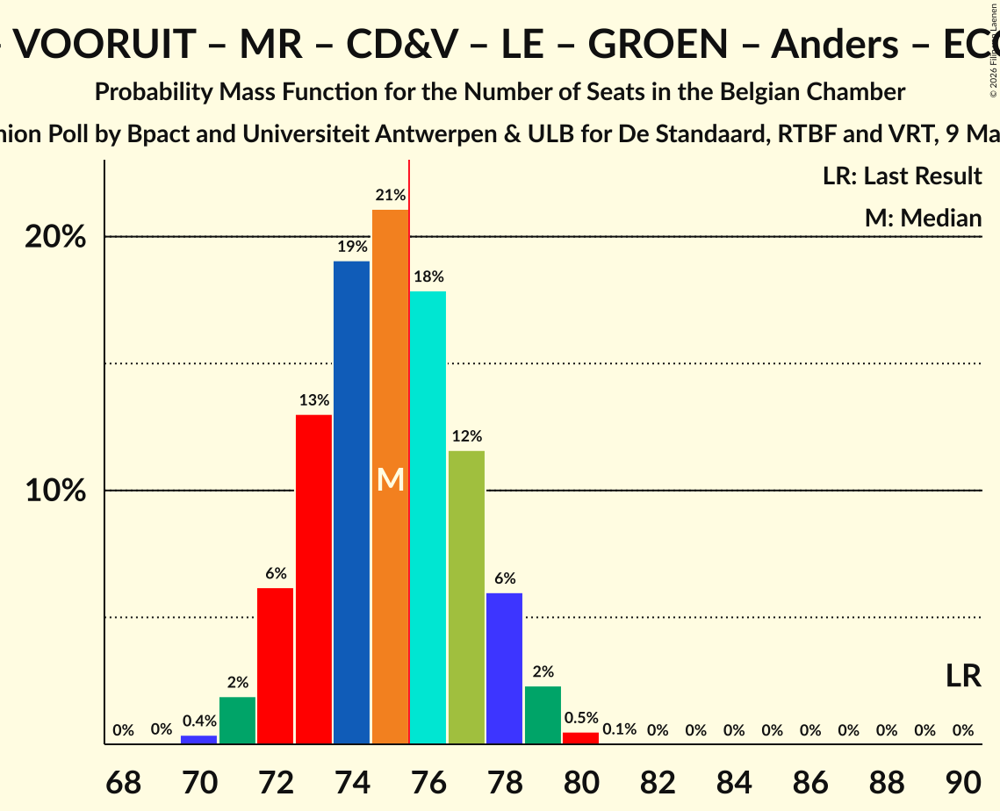

| Number of Seats | Probability | Accumulated | Special Marks |
|:---------------:|:-----------:|:-----------:|:-------------:|
| 69 | 0% | 100% |  |
| 70 | 0.4% | 99.9% |  |
| 71 | 2% | 99.6% |  |
| 72 | 6% | 98% |  |
| 73 | 13% | 91% |  |
| 74 | 19% | 78% |  |
| 75 | 21% | 59% | Median |
| 76 | 18% | 38% | Majority |
| 77 | 12% | 20% |  |
| 78 | 6% | 9% |  |
| 79 | 2% | 3% |  |
| 80 | 0.5% | 0.6% |  |
| 81 | 0.1% | 0.1% |  |
| 82 | 0% | 0% |  |
| 83 | 0% | 0% |  |
| 84 | 0% | 0% |  |
| 85 | 0% | 0% |  |
| 86 | 0% | 0% |  |
| 87 | 0% | 0% |  |
| 88 | 0% | 0% |  |
| 89 | 0% | 0% |  |
| 90 | 0% | 0% | Last Result |

### Nieuw-Vlaamse Alliantie – Vooruit – Mouvement Réformateur – Christen-Democratisch en Vlaams – Les Engagés

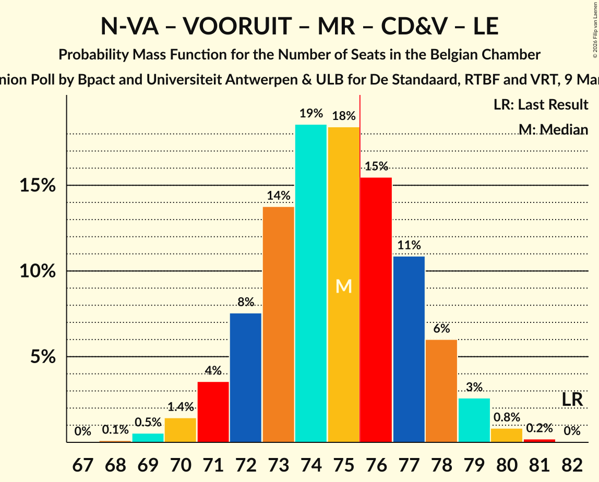

| Number of Seats | Probability | Accumulated | Special Marks |
|:---------------:|:-----------:|:-----------:|:-------------:|
| 68 | 0.1% | 100% |  |
| 69 | 0.5% | 99.9% |  |
| 70 | 1.4% | 99.3% |  |
| 71 | 4% | 98% |  |
| 72 | 8% | 94% |  |
| 73 | 14% | 87% |  |
| 74 | 19% | 73% | Median |
| 75 | 18% | 54% |  |
| 76 | 15% | 36% | Majority |
| 77 | 11% | 21% |  |
| 78 | 6% | 10% |  |
| 79 | 3% | 4% |  |
| 80 | 0.8% | 1.1% |  |
| 81 | 0.2% | 0.2% |  |
| 82 | 0% | 0% | Last Result |

### Nieuw-Vlaamse Alliantie – Parti Socialiste – Vooruit – Mouvement Réformateur – Anders

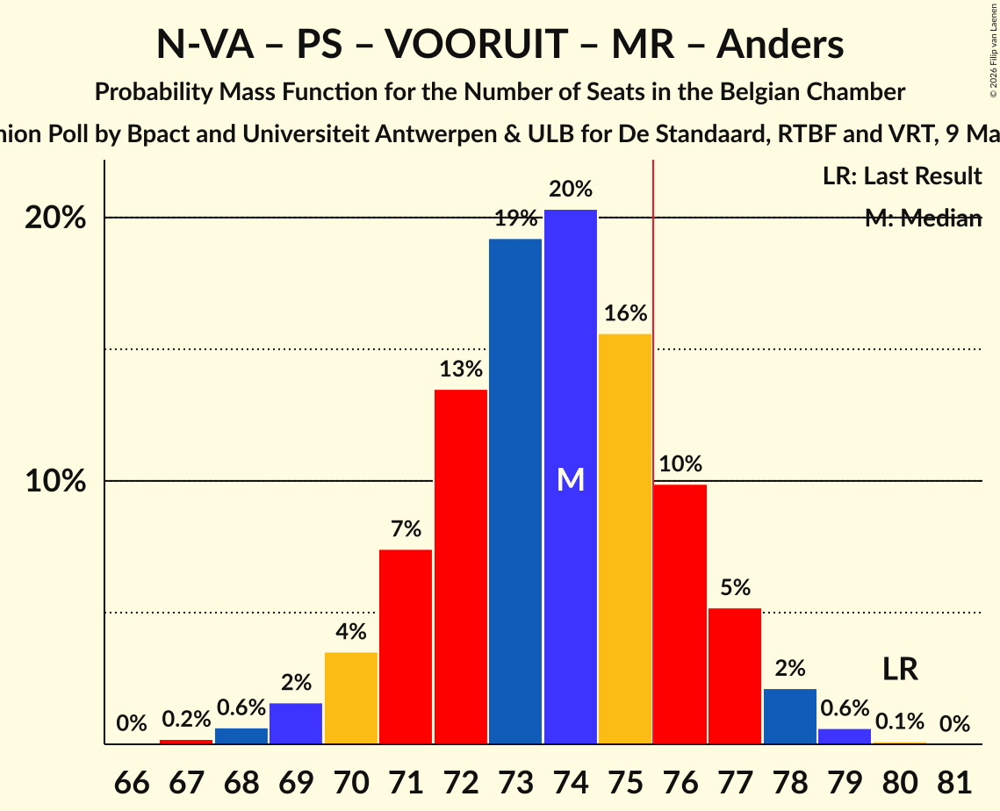

| Number of Seats | Probability | Accumulated | Special Marks |
|:---------------:|:-----------:|:-----------:|:-------------:|
| 67 | 0.2% | 100% |  |
| 68 | 0.6% | 99.8% |  |
| 69 | 2% | 99.1% |  |
| 70 | 4% | 98% |  |
| 71 | 7% | 94% |  |
| 72 | 13% | 87% |  |
| 73 | 19% | 73% | Median |
| 74 | 20% | 54% |  |
| 75 | 16% | 34% |  |
| 76 | 10% | 18% | Majority |
| 77 | 5% | 8% |  |
| 78 | 2% | 3% |  |
| 79 | 0.6% | 0.7% |  |
| 80 | 0.1% | 0.1% | Last Result |
| 81 | 0% | 0% |  |

### Nieuw-Vlaamse Alliantie – Mouvement Réformateur – Christen-Democratisch en Vlaams – Les Engagés – Anders

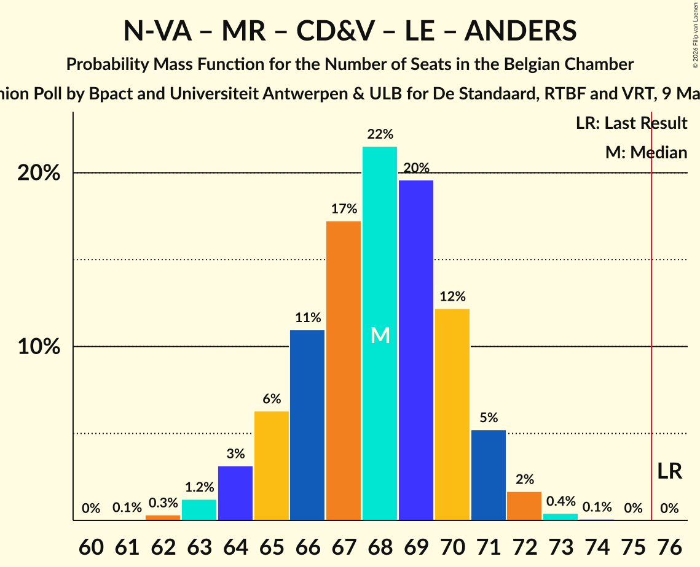

| Number of Seats | Probability | Accumulated | Special Marks |
|:---------------:|:-----------:|:-----------:|:-------------:|
| 61 | 0.1% | 100% |  |
| 62 | 0.3% | 99.9% |  |
| 63 | 1.2% | 99.6% |  |
| 64 | 3% | 98% |  |
| 65 | 6% | 95% |  |
| 66 | 11% | 89% |  |
| 67 | 17% | 78% | Median |
| 68 | 22% | 61% |  |
| 69 | 20% | 39% |  |
| 70 | 12% | 20% |  |
| 71 | 5% | 7% |  |
| 72 | 2% | 2% |  |
| 73 | 0.4% | 0.5% |  |
| 74 | 0.1% | 0.1% |  |
| 75 | 0% | 0% |  |
| 76 | 0% | 0% | Last Result, Majority |

### Parti Socialiste – Vooruit – Mouvement Réformateur – Christen-Democratisch en Vlaams – Les Engagés – Anders

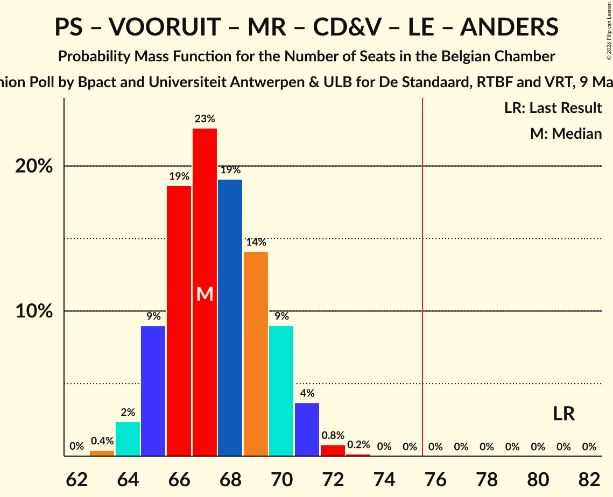

| Number of Seats | Probability | Accumulated | Special Marks |
|:---------------:|:-----------:|:-----------:|:-------------:|
| 62 | 0% | 100% |  |
| 63 | 0.4% | 99.9% |  |
| 64 | 2% | 99.5% |  |
| 65 | 9% | 97% |  |
| 66 | 19% | 88% |  |
| 67 | 23% | 70% | Median |
| 68 | 19% | 47% |  |
| 69 | 14% | 28% |  |
| 70 | 9% | 14% |  |
| 71 | 4% | 5% |  |
| 72 | 0.8% | 1.0% |  |
| 73 | 0.2% | 0.2% |  |
| 74 | 0% | 0% |  |
| 75 | 0% | 0% |  |
| 76 | 0% | 0% | Majority |
| 77 | 0% | 0% |  |
| 78 | 0% | 0% |  |
| 79 | 0% | 0% |  |
| 80 | 0% | 0% |  |
| 81 | 0% | 0% | Last Result |

### Parti Socialiste – Vooruit – Mouvement Réformateur – Christen-Democratisch en Vlaams – Groen – Anders – Ecolo

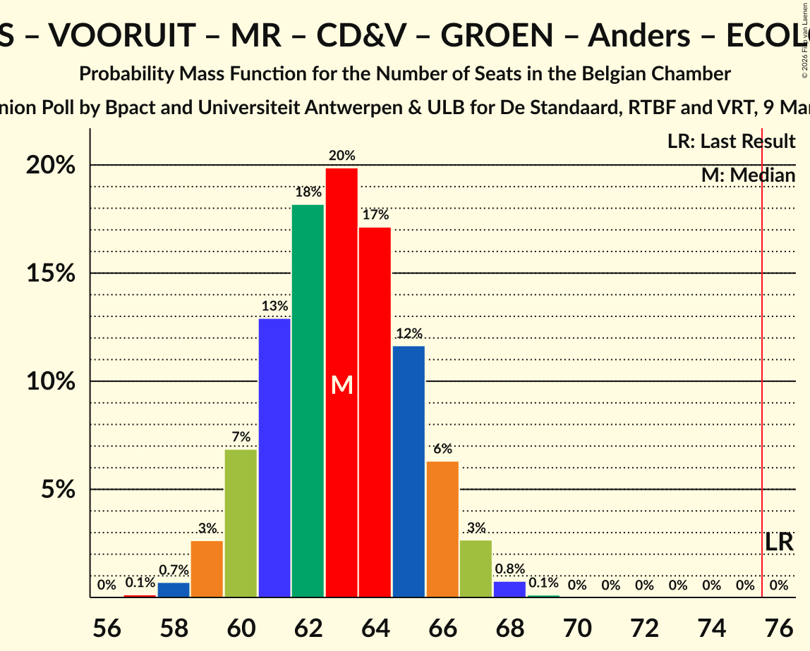

| Number of Seats | Probability | Accumulated | Special Marks |
|:---------------:|:-----------:|:-----------:|:-------------:|
| 57 | 0.1% | 100% |  |
| 58 | 0.7% | 99.9% |  |
| 59 | 3% | 99.1% |  |
| 60 | 7% | 97% |  |
| 61 | 13% | 90% |  |
| 62 | 18% | 77% |  |
| 63 | 20% | 59% | Median |
| 64 | 17% | 39% |  |
| 65 | 12% | 22% |  |
| 66 | 6% | 10% |  |
| 67 | 3% | 4% |  |
| 68 | 0.8% | 0.9% |  |
| 69 | 0.1% | 0.1% |  |
| 70 | 0% | 0% |  |
| 71 | 0% | 0% |  |
| 72 | 0% | 0% |  |
| 73 | 0% | 0% |  |
| 74 | 0% | 0% |  |
| 75 | 0% | 0% |  |
| 76 | 0% | 0% | Last Result, Majority |

### Parti Socialiste – Parti du Travail de Belgique – Vooruit – Partij van de Arbeid van België – Groen – Ecolo

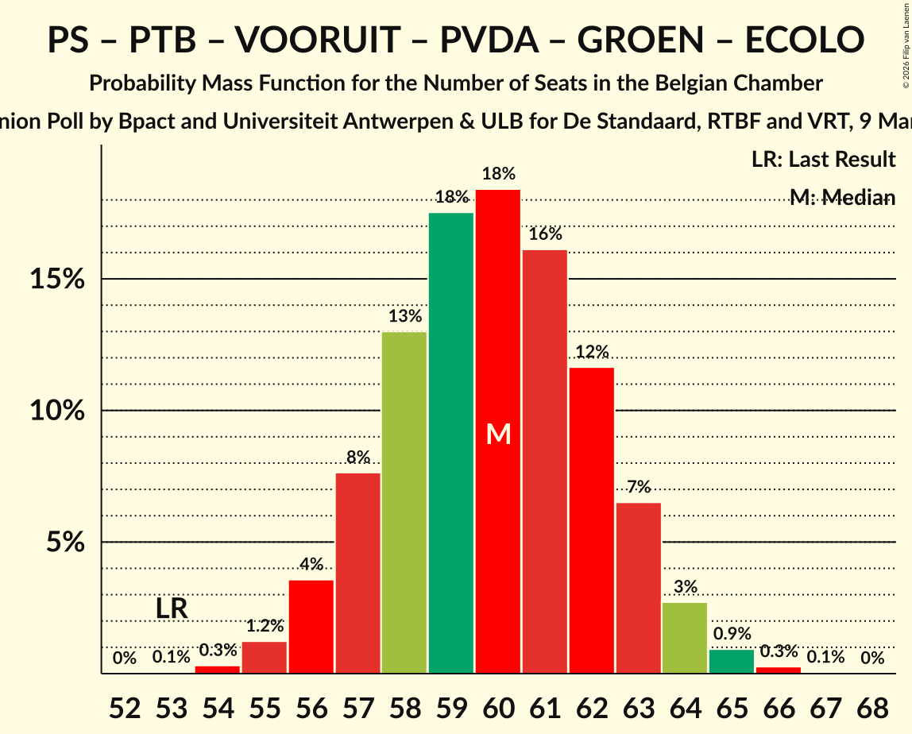

| Number of Seats | Probability | Accumulated | Special Marks |
|:---------------:|:-----------:|:-----------:|:-------------:|
| 53 | 0.1% | 100% | Last Result |
| 54 | 0.3% | 99.9% |  |
| 55 | 1.2% | 99.6% |  |
| 56 | 4% | 98% |  |
| 57 | 8% | 95% |  |
| 58 | 13% | 87% |  |
| 59 | 18% | 74% |  |
| 60 | 18% | 57% | Median |
| 61 | 16% | 38% |  |
| 62 | 12% | 22% |  |
| 63 | 7% | 10% |  |
| 64 | 3% | 4% |  |
| 65 | 0.9% | 1.3% |  |
| 66 | 0.3% | 0.3% |  |
| 67 | 0.1% | 0.1% |  |
| 68 | 0% | 0% |  |

### Parti Socialiste – Vooruit – Christen-Democratisch en Vlaams – Les Engagés – Groen – Ecolo

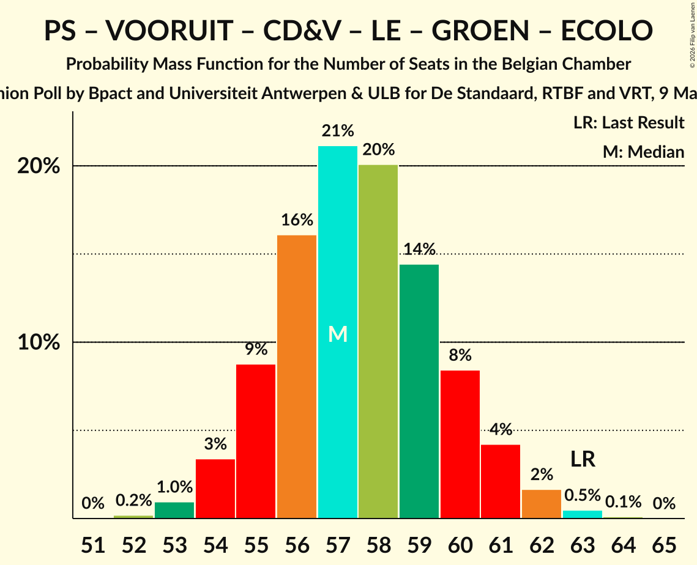

| Number of Seats | Probability | Accumulated | Special Marks |
|:---------------:|:-----------:|:-----------:|:-------------:|
| 52 | 0.2% | 100% |  |
| 53 | 1.0% | 99.8% |  |
| 54 | 3% | 98.8% |  |
| 55 | 9% | 95% |  |
| 56 | 16% | 87% |  |
| 57 | 21% | 71% |  |
| 58 | 20% | 49% | Median |
| 59 | 14% | 29% |  |
| 60 | 8% | 15% |  |
| 61 | 4% | 6% |  |
| 62 | 2% | 2% |  |
| 63 | 0.5% | 0.6% | Last Result |
| 64 | 0.1% | 0.1% |  |
| 65 | 0% | 0% |  |

### Parti Socialiste – Mouvement Réformateur – Christen-Democratisch en Vlaams – Les Engagés – Anders

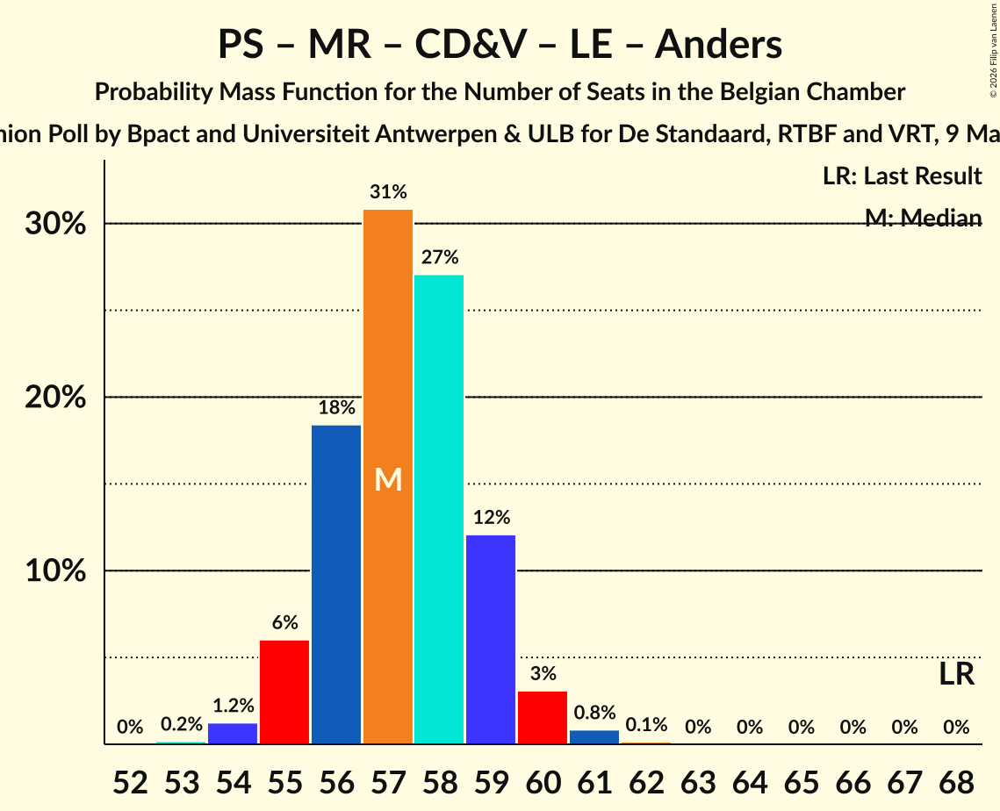

| Number of Seats | Probability | Accumulated | Special Marks |
|:---------------:|:-----------:|:-----------:|:-------------:|
| 53 | 0.2% | 100% |  |
| 54 | 1.2% | 99.8% |  |
| 55 | 6% | 98.6% |  |
| 56 | 18% | 93% |  |
| 57 | 31% | 74% | Median |
| 58 | 27% | 43% |  |
| 59 | 12% | 16% |  |
| 60 | 3% | 4% |  |
| 61 | 0.8% | 1.0% |  |
| 62 | 0.1% | 0.2% |  |
| 63 | 0% | 0% |  |
| 64 | 0% | 0% |  |
| 65 | 0% | 0% |  |
| 66 | 0% | 0% |  |
| 67 | 0% | 0% |  |
| 68 | 0% | 0% | Last Result |

### Nieuw-Vlaamse Alliantie – Mouvement Réformateur – Christen-Democratisch en Vlaams – Anders

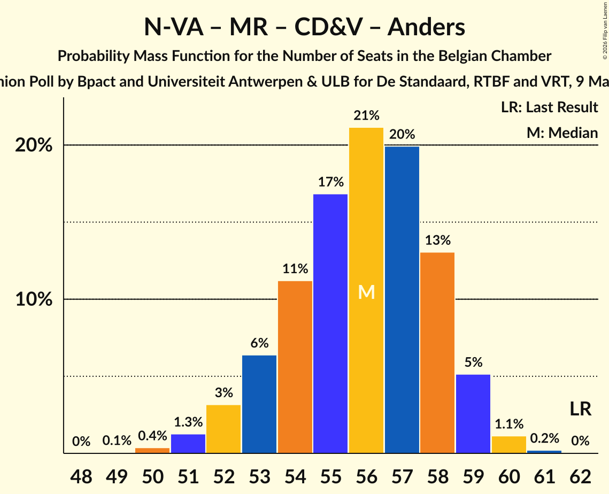

| Number of Seats | Probability | Accumulated | Special Marks |
|:---------------:|:-----------:|:-----------:|:-------------:|
| 49 | 0.1% | 100% |  |
| 50 | 0.4% | 99.9% |  |
| 51 | 1.3% | 99.6% |  |
| 52 | 3% | 98% |  |
| 53 | 6% | 95% |  |
| 54 | 11% | 89% |  |
| 55 | 17% | 78% | Median |
| 56 | 21% | 61% |  |
| 57 | 20% | 40% |  |
| 58 | 13% | 20% |  |
| 59 | 5% | 7% |  |
| 60 | 1.1% | 1.4% |  |
| 61 | 0.2% | 0.3% |  |
| 62 | 0% | 0% | Last Result |

### Parti Socialiste – Vooruit – Mouvement Réformateur – Groen – Anders – Ecolo

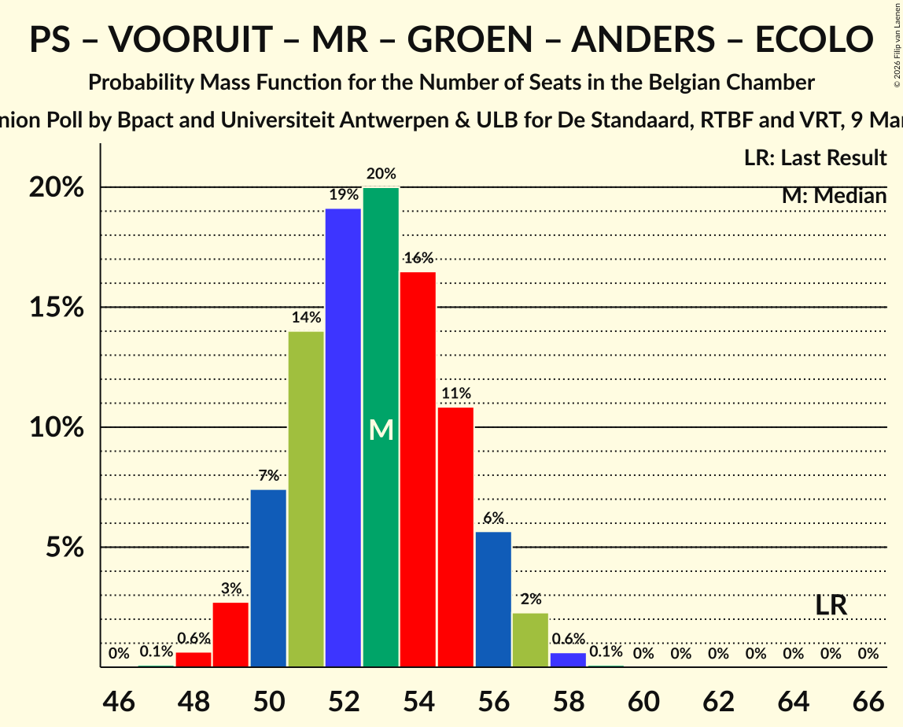

| Number of Seats | Probability | Accumulated | Special Marks |
|:---------------:|:-----------:|:-----------:|:-------------:|
| 47 | 0.1% | 100% |  |
| 48 | 0.6% | 99.9% |  |
| 49 | 3% | 99.3% |  |
| 50 | 7% | 97% |  |
| 51 | 14% | 89% |  |
| 52 | 19% | 75% |  |
| 53 | 20% | 56% | Median |
| 54 | 16% | 36% |  |
| 55 | 11% | 19% |  |
| 56 | 6% | 9% |  |
| 57 | 2% | 3% |  |
| 58 | 0.6% | 0.7% |  |
| 59 | 0.1% | 0.1% |  |
| 60 | 0% | 0% |  |
| 61 | 0% | 0% |  |
| 62 | 0% | 0% |  |
| 63 | 0% | 0% |  |
| 64 | 0% | 0% |  |
| 65 | 0% | 0% | Last Result |

### Parti Socialiste – Vooruit – Christen-Democratisch en Vlaams – Les Engagés

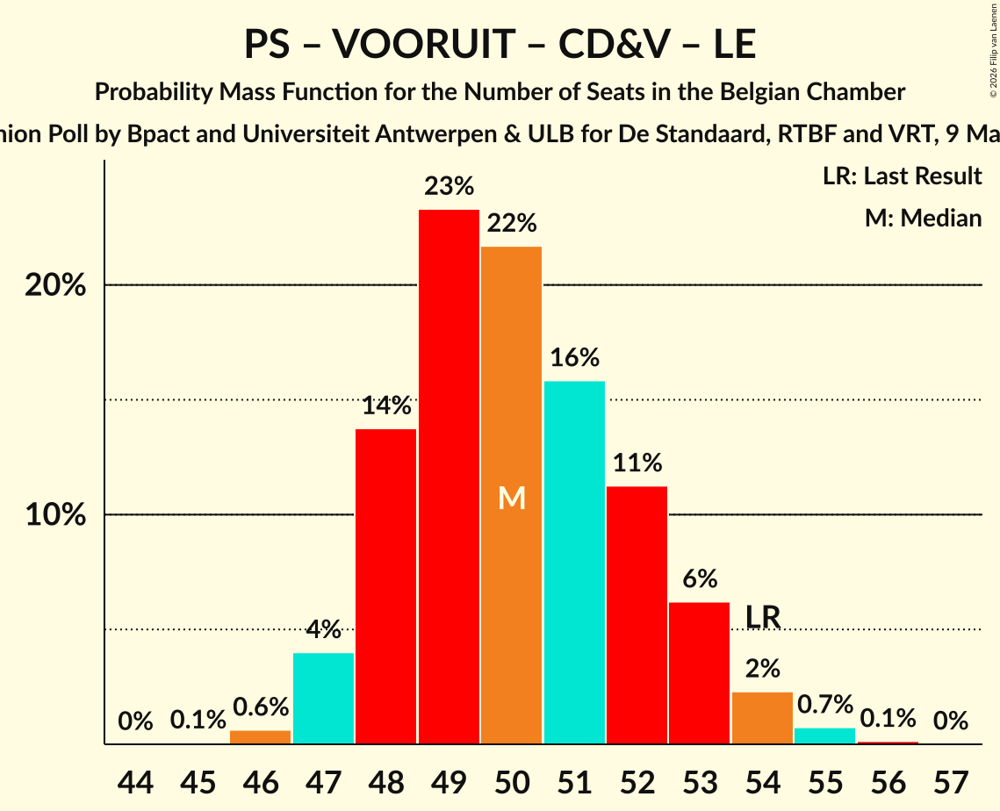

| Number of Seats | Probability | Accumulated | Special Marks |
|:---------------:|:-----------:|:-----------:|:-------------:|
| 45 | 0.1% | 100% |  |
| 46 | 0.6% | 99.9% |  |
| 47 | 4% | 99.3% |  |
| 48 | 14% | 95% |  |
| 49 | 23% | 82% |  |
| 50 | 22% | 58% | Median |
| 51 | 16% | 37% |  |
| 52 | 11% | 21% |  |
| 53 | 6% | 9% |  |
| 54 | 2% | 3% | Last Result |
| 55 | 0.7% | 0.9% |  |
| 56 | 0.1% | 0.2% |  |
| 57 | 0% | 0% |  |

### Mouvement Réformateur – Christen-Democratisch en Vlaams – Les Engagés – Groen – Anders – Ecolo

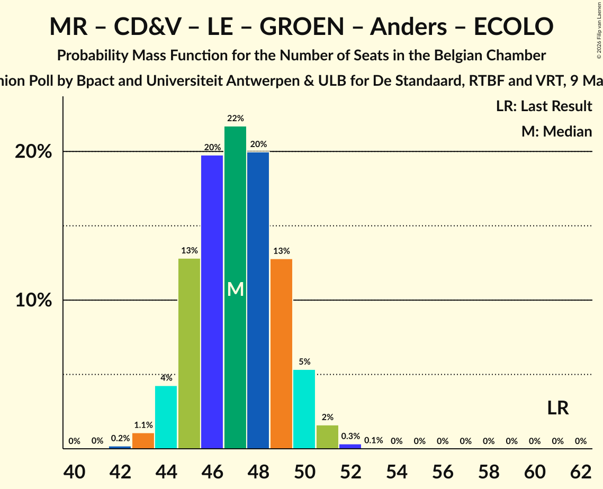

| Number of Seats | Probability | Accumulated | Special Marks |
|:---------------:|:-----------:|:-----------:|:-------------:|
| 42 | 0.2% | 100% |  |
| 43 | 1.1% | 99.8% |  |
| 44 | 4% | 98.7% |  |
| 45 | 13% | 94% |  |
| 46 | 20% | 82% |  |
| 47 | 22% | 62% | Median |
| 48 | 20% | 40% |  |
| 49 | 13% | 20% |  |
| 50 | 5% | 7% |  |
| 51 | 2% | 2% |  |
| 52 | 0.3% | 0.4% |  |
| 53 | 0.1% | 0.1% |  |
| 54 | 0% | 0% |  |
| 55 | 0% | 0% |  |
| 56 | 0% | 0% |  |
| 57 | 0% | 0% |  |
| 58 | 0% | 0% |  |
| 59 | 0% | 0% |  |
| 60 | 0% | 0% |  |
| 61 | 0% | 0% | Last Result |

### Parti Socialiste – Vooruit – Mouvement Réformateur – Anders

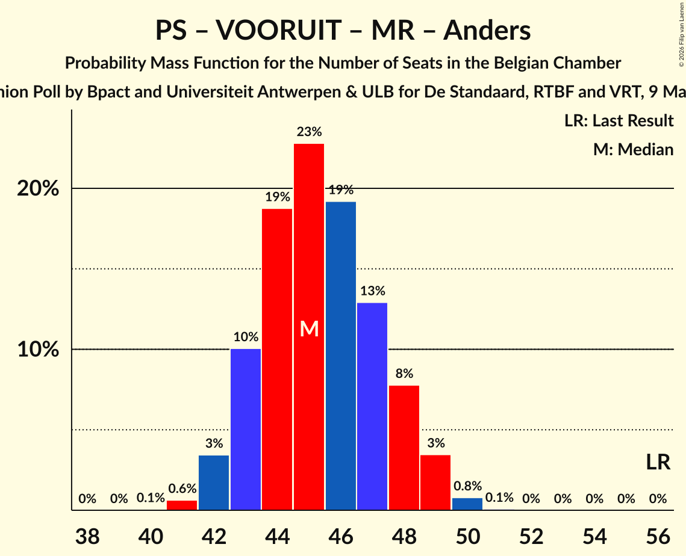

| Number of Seats | Probability | Accumulated | Special Marks |
|:---------------:|:-----------:|:-----------:|:-------------:|
| 40 | 0.1% | 100% |  |
| 41 | 0.6% | 99.9% |  |
| 42 | 3% | 99.3% |  |
| 43 | 10% | 96% |  |
| 44 | 19% | 86% |  |
| 45 | 23% | 67% | Median |
| 46 | 19% | 44% |  |
| 47 | 13% | 25% |  |
| 48 | 8% | 12% |  |
| 49 | 3% | 4% |  |
| 50 | 0.8% | 0.9% |  |
| 51 | 0.1% | 0.1% |  |
| 52 | 0% | 0% |  |
| 53 | 0% | 0% |  |
| 54 | 0% | 0% |  |
| 55 | 0% | 0% |  |
| 56 | 0% | 0% | Last Result |

### Mouvement Réformateur – Christen-Democratisch en Vlaams – Les Engagés – Anders

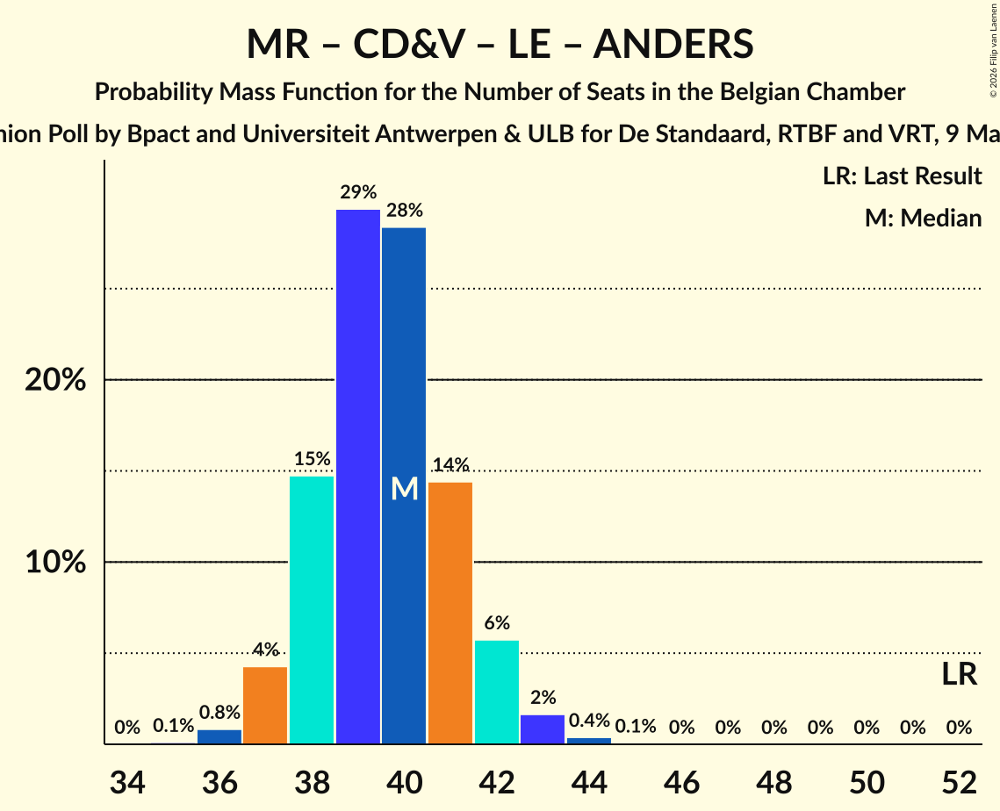

| Number of Seats | Probability | Accumulated | Special Marks |
|:---------------:|:-----------:|:-----------:|:-------------:|
| 35 | 0.1% | 100% |  |
| 36 | 0.8% | 99.9% |  |
| 37 | 4% | 99.0% |  |
| 38 | 15% | 95% |  |
| 39 | 29% | 80% | Median |
| 40 | 28% | 51% |  |
| 41 | 14% | 22% |  |
| 42 | 6% | 8% |  |
| 43 | 2% | 2% |  |
| 44 | 0.4% | 0.5% |  |
| 45 | 0.1% | 0.1% |  |
| 46 | 0% | 0% |  |
| 47 | 0% | 0% |  |
| 48 | 0% | 0% |  |
| 49 | 0% | 0% |  |
| 50 | 0% | 0% |  |
| 51 | 0% | 0% |  |
| 52 | 0% | 0% | Last Result |

## Technical Information

### Opinion Poll

+ **Polling firm:** Bpact and Universiteit Antwerpen & ULB
+ **Commissioner(s):** De Standaard, RTBF and VRT
+ **Fieldwork period:** 9 March–5 April 2026

### Calculations

+ **Sample size:** 3127
+ **Simulations done:** 2,097,152
+ **Error estimate:** 0.96%

