# Opinion Poll by Ipsos for Het Laatste Nieuws, Le Soir, RTL TVi and VTM, 1–9 June 2026

Areas included: Brussels, Flanders, Wallonia

<a href="#voting-intentions">Voting Intentions</a> | <a href="#seats">Seats</a> | <a href="#coalitions">Coalitions</a> | <a href="#technical-information">Technical Information</a>

## Voting Intentions

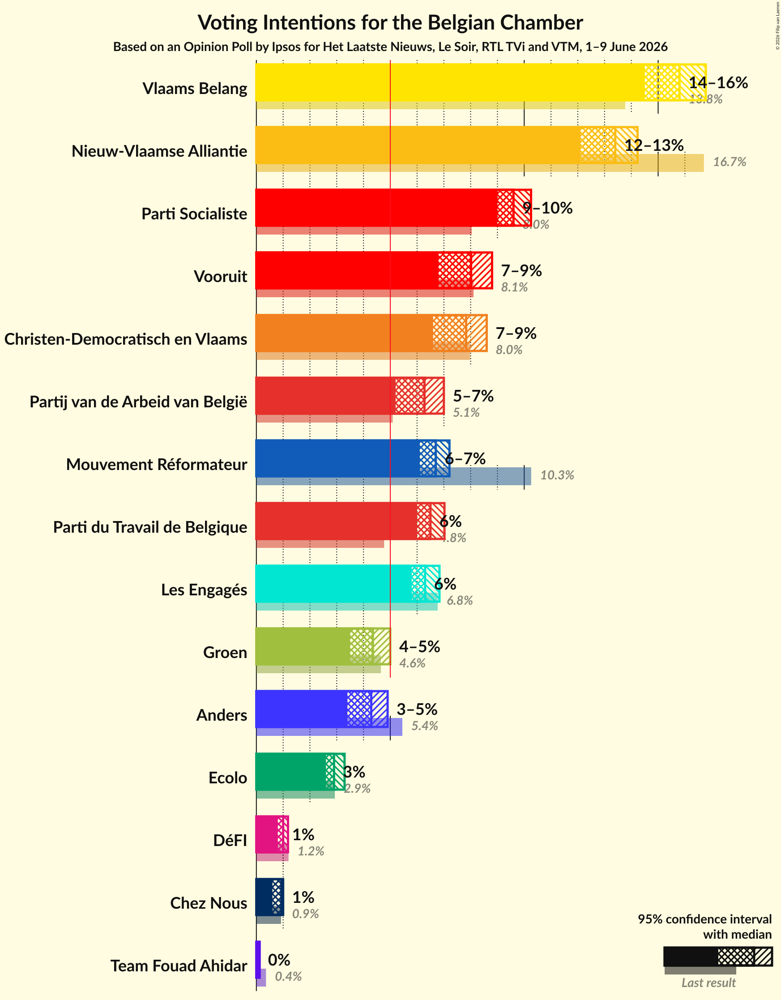

### Confidence Intervals

| Party | Last Result | Poll Result | 80% Confidence Interval | 90% Confidence Interval | 95% Confidence Interval | 99% Confidence Interval |
|:-----:|:-----------:|:-----------:|:-----------------------:|:-----------------------:|:-----------------------:|:-----------------------:|
| Vlaams Belang | 13.8% | 16.8% | 14.9–15.8% |14.7–15.8% |14.5–15.8% |14.1–15.8% |
| Nieuw-Vlaamse Alliantie | 16.7% | 14.2% | 12.5–13.3% |12.3–13.4% |12.1–13.4% |11.8–13.4% |
| Parti Socialiste | 8.0% | 10.3% | 9.2–9.6% |9.1–9.6% |9.0–9.6% |8.8–9.6% |
| Vooruit | 8.1% | 8.0% | 7.2–8.6% |7.0–8.8% |6.8–8.8% |6.4–8.9% |
| Christen-Democratisch en Vlaams | 8.0% | 7.8% | 7.0–8.5% |6.8–8.6% |6.6–8.6% |6.3–8.7% |
| Mouvement Réformateur | 10.3% | 7.2% | 6.3–6.6% |6.2–6.6% |6.1–6.7% |5.9–6.7% |
| Parti du Travail de Belgique | 4.8% | 7.0% | 6.2–6.5% |6.1–6.5% |6.0–6.5% |5.8–6.5% |
| Les Engagés | 6.8% | 6.8% | 5.9–6.3% |5.8–6.3% |5.8–6.3% |5.6–6.3% |
| Partij van de Arbeid van België | 5.1% | 6.3% | 5.6–6.8% |5.4–6.9% |5.2–7.0% |4.9–7.1% |
| Groen | 4.6% | 4.4% | 3.7–4.9% |3.6–4.9% |3.5–5.0% |3.2–5.1% |
| Anders | 5.4% | 4.3% | 3.7–4.8% |3.5–4.9% |3.4–4.9% |3.1–5.0% |
| Ecolo | 2.9% | 3.3% | 2.7–2.9% |2.6–2.9% |2.6–2.9% |2.5–2.9% |
| DéFI | 1.2% | 1.2% | 0.8–1.0% |0.8–1.0% |0.8–1.0% |0.7–1.0% |
| Chez Nous | 0.9% | 0.9% | 0.7–0.9% |0.6–0.9% |0.6–1.0% |0.5–1.0% |
| Team Fouad Ahidar | 0.4% | 0.1% | 0.1% |0.1% |0.1% |0.1% |

*Note:* The poll result column reflects the actual value used in the calculations. Published results may vary slightly, and in addition be rounded to fewer digits.

## Seats

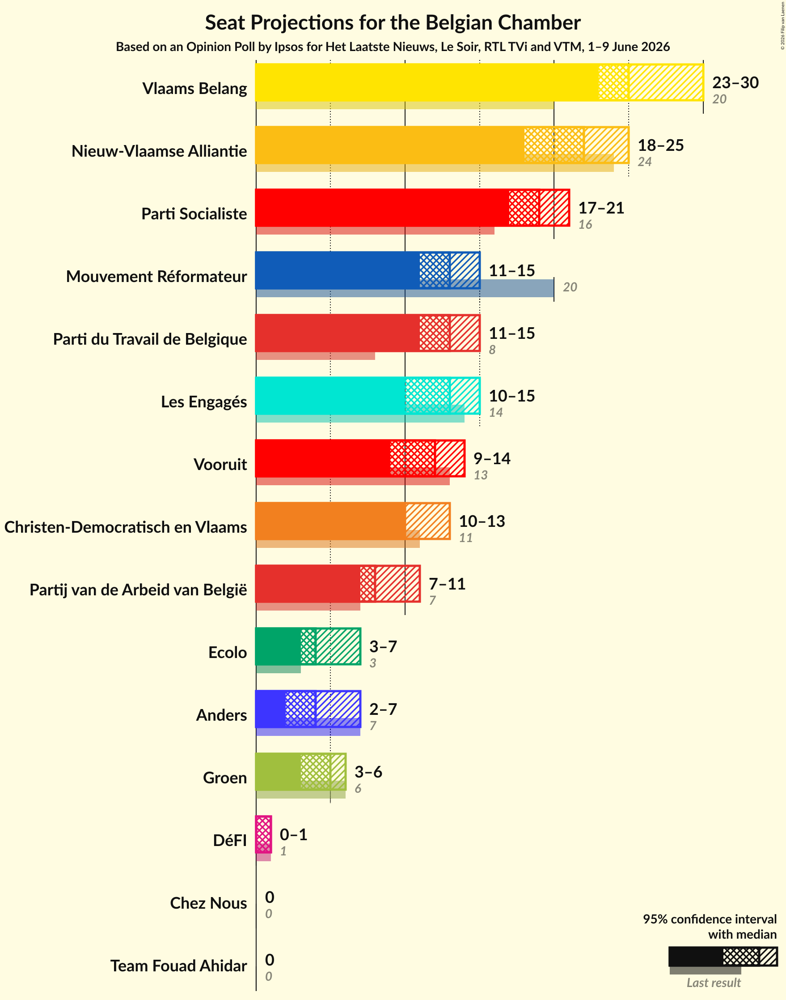

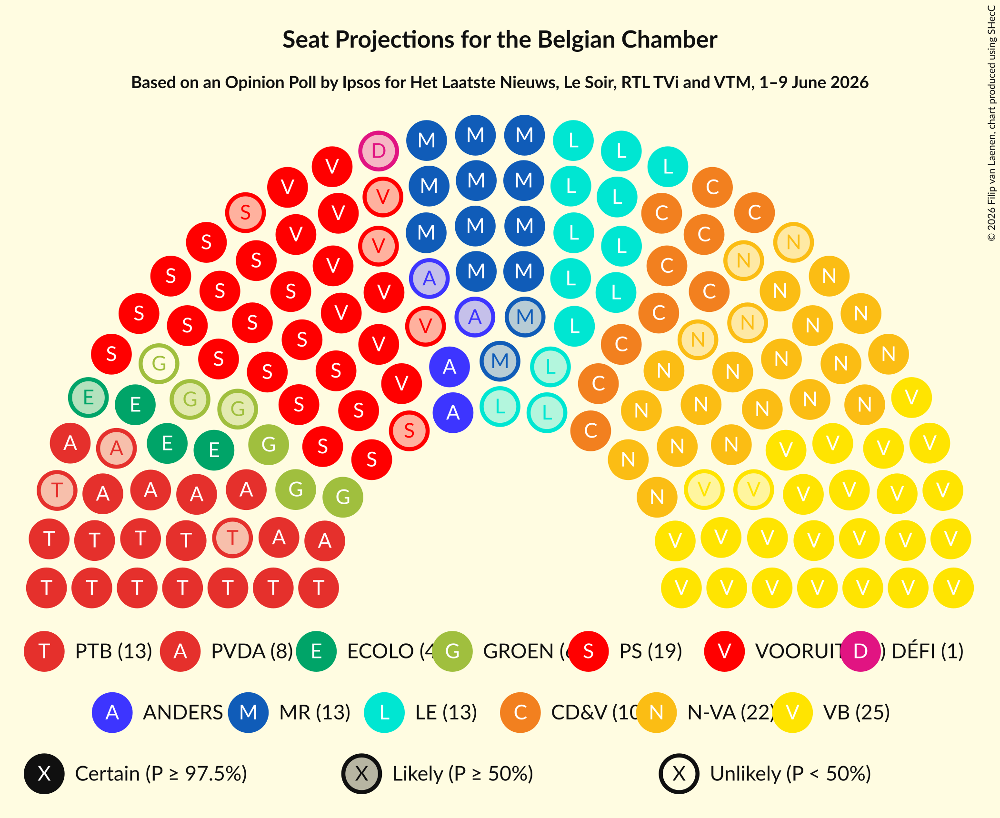

### Confidence Intervals

| Party | Last Result | Median | 80% Confidence Interval | 90% Confidence Interval | 95% Confidence Interval | 99% Confidence Interval |
|:-----:|:-----------:|:------:|:-----------------------:|:-----------------------:|:-----------------------:|:-----------------------:|
| <a href="#vlaams-belang">Vlaams Belang</a> | 20 | 25 | 24–28 |23–29 |23–30 |22–30 |
| <a href="#nieuw-vlaamse-alliantie">Nieuw-Vlaamse Alliantie</a> | 24 | 22 | 20–24 |19–25 |18–25 |17–26 |
| <a href="#parti-socialiste">Parti Socialiste</a> | 16 | 19 | 18–20 |18–21 |17–21 |17–21 |
| <a href="#vooruit">Vooruit</a> | 13 | 12 | 9–13 |9–14 |9–14 |9–14 |
| <a href="#christen-democratisch-en-vlaams">Christen-Democratisch en Vlaams</a> | 11 | 10 | 10–13 |10–13 |10–13 |8–15 |
| <a href="#mouvement-réformateur">Mouvement Réformateur</a> | 20 | 13 | 12–14 |11–15 |11–15 |10–16 |
| <a href="#parti-du-travail-de-belgique">Parti du Travail de Belgique</a> | 8 | 13 | 12–15 |11–15 |11–15 |11–16 |
| <a href="#les-engagés">Les Engagés</a> | 14 | 13 | 11–15 |10–15 |10–15 |10–15 |
| <a href="#partij-van-de-arbeid-van-belgië">Partij van de Arbeid van België</a> | 7 | 8 | 7–10 |7–11 |7–11 |5–11 |
| <a href="#groen">Groen</a> | 6 | 5 | 3–6 |3–6 |3–6 |3–7 |
| <a href="#anders">Anders</a> | 7 | 4 | 3–7 |3–7 |2–7 |2–7 |
| <a href="#ecolo">Ecolo</a> | 3 | 4 | 3–5 |3–6 |3–7 |2–7 |
| <a href="#défi">DéFI</a> | 1 | 1 | 0–1 |0–1 |0–1 |0–1 |
| <a href="#chez-nous">Chez Nous</a> | 0 | 0 | 0 |0 |0 |0 |
| <a href="#team-fouad-ahidar">Team Fouad Ahidar</a> | 0 | 0 | 0 |0 |0 |0 |

### Vlaams Belang

*For a full overview of the results for this party, see the [Vlaams Belang](party-vlaamsbelang.html) page.*

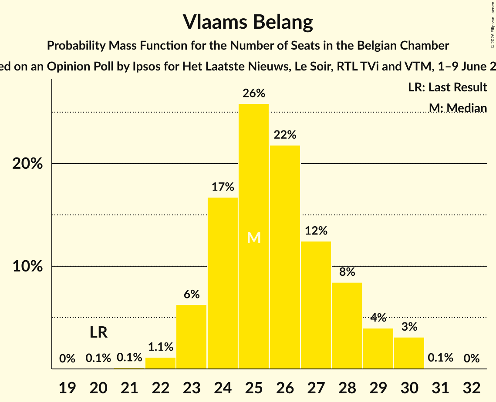

| Number of Seats | Probability | Accumulated | Special Marks |
|:---------------:|:-----------:|:-----------:|:-------------:|
| 20 | 0.1% | 100% | Last Result |
| 21 | 0.1% | 99.9% |  |
| 22 | 1.1% | 99.8% |  |
| 23 | 6% | 98.7% |  |
| 24 | 17% | 92% |  |
| 25 | 26% | 76% | Median |
| 26 | 22% | 50% |  |
| 27 | 12% | 28% |  |
| 28 | 8% | 16% |  |
| 29 | 4% | 7% |  |
| 30 | 3% | 3% |  |
| 31 | 0.1% | 0.1% |  |
| 32 | 0% | 0% |  |

### Nieuw-Vlaamse Alliantie

*For a full overview of the results for this party, see the [Nieuw-Vlaamse Alliantie](party-nieuw-vlaamsealliantie.html) page.*

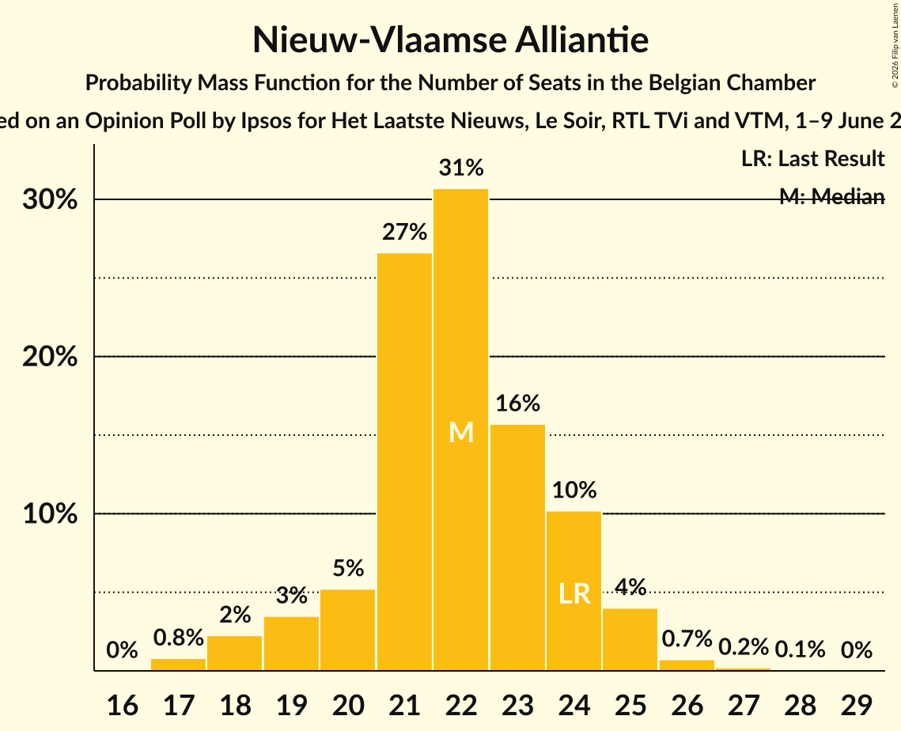

| Number of Seats | Probability | Accumulated | Special Marks |
|:---------------:|:-----------:|:-----------:|:-------------:|
| 17 | 0.8% | 100% |  |
| 18 | 2% | 99.2% |  |
| 19 | 3% | 97% |  |
| 20 | 5% | 93% |  |
| 21 | 27% | 88% |  |
| 22 | 31% | 62% | Median |
| 23 | 16% | 31% |  |
| 24 | 10% | 15% | Last Result |
| 25 | 4% | 5% |  |
| 26 | 0.7% | 1.0% |  |
| 27 | 0.2% | 0.3% |  |
| 28 | 0.1% | 0.1% |  |
| 29 | 0% | 0% |  |

### Parti Socialiste

*For a full overview of the results for this party, see the [Parti Socialiste](party-partisocialiste.html) page.*

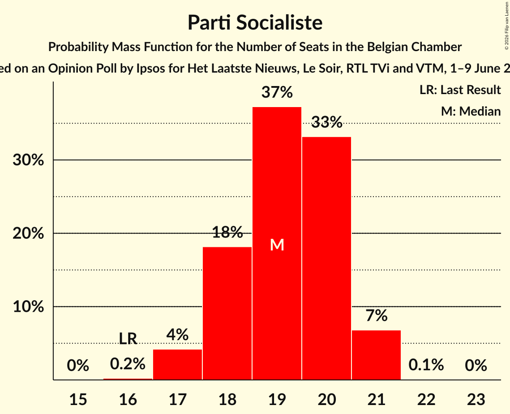

| Number of Seats | Probability | Accumulated | Special Marks |
|:---------------:|:-----------:|:-----------:|:-------------:|
| 16 | 0.2% | 100% | Last Result |
| 17 | 4% | 99.8% |  |
| 18 | 18% | 96% |  |
| 19 | 37% | 77% | Median |
| 20 | 33% | 40% |  |
| 21 | 7% | 7% |  |
| 22 | 0.1% | 0.1% |  |
| 23 | 0% | 0% |  |

### Vooruit

*For a full overview of the results for this party, see the [Vooruit](party-vooruit.html) page.*

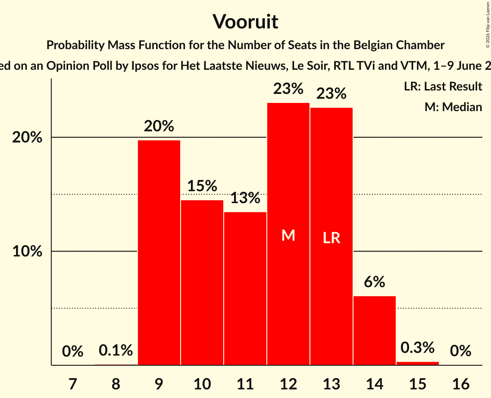

| Number of Seats | Probability | Accumulated | Special Marks |
|:---------------:|:-----------:|:-----------:|:-------------:|
| 8 | 0.1% | 100% |  |
| 9 | 20% | 99.9% |  |
| 10 | 15% | 80% |  |
| 11 | 13% | 66% |  |
| 12 | 23% | 52% | Median |
| 13 | 23% | 29% | Last Result |
| 14 | 6% | 6% |  |
| 15 | 0.3% | 0.4% |  |
| 16 | 0% | 0% |  |

### Christen-Democratisch en Vlaams

*For a full overview of the results for this party, see the [Christen-Democratisch en Vlaams](party-christen-democratischenvlaams.html) page.*

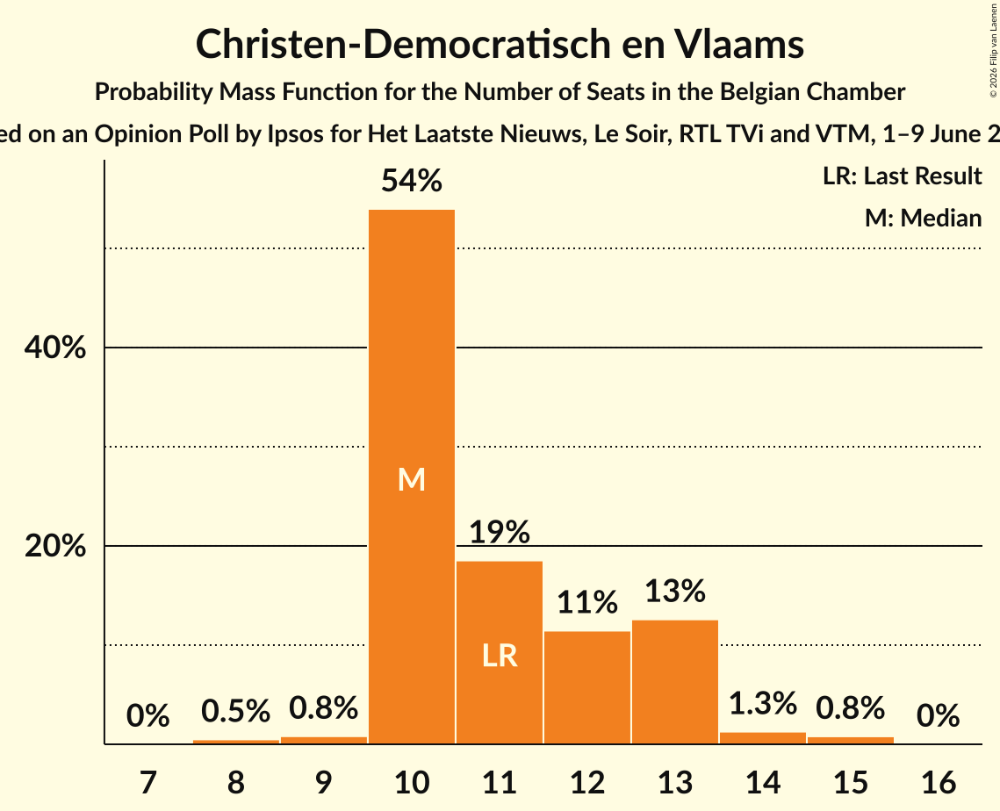

| Number of Seats | Probability | Accumulated | Special Marks |
|:---------------:|:-----------:|:-----------:|:-------------:|
| 8 | 0.5% | 100% |  |
| 9 | 0.8% | 99.5% |  |
| 10 | 54% | 98.7% | Median |
| 11 | 19% | 45% | Last Result |
| 12 | 11% | 26% |  |
| 13 | 13% | 15% |  |
| 14 | 1.3% | 2% |  |
| 15 | 0.8% | 0.8% |  |
| 16 | 0% | 0% |  |

### Mouvement Réformateur

*For a full overview of the results for this party, see the [Mouvement Réformateur](party-mouvementréformateur.html) page.*

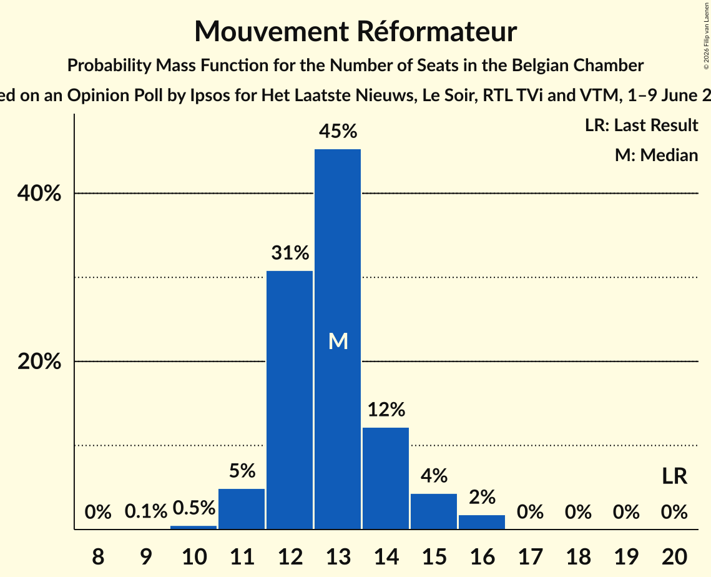

| Number of Seats | Probability | Accumulated | Special Marks |
|:---------------:|:-----------:|:-----------:|:-------------:|
| 9 | 0.1% | 100% |  |
| 10 | 0.5% | 99.9% |  |
| 11 | 5% | 99.4% |  |
| 12 | 31% | 94% |  |
| 13 | 45% | 64% | Median |
| 14 | 12% | 18% |  |
| 15 | 4% | 6% |  |
| 16 | 2% | 2% |  |
| 17 | 0% | 0% |  |
| 18 | 0% | 0% |  |
| 19 | 0% | 0% |  |
| 20 | 0% | 0% | Last Result |

### Parti du Travail de Belgique

*For a full overview of the results for this party, see the [Parti du Travail de Belgique](party-partidutravaildebelgique.html) page.*

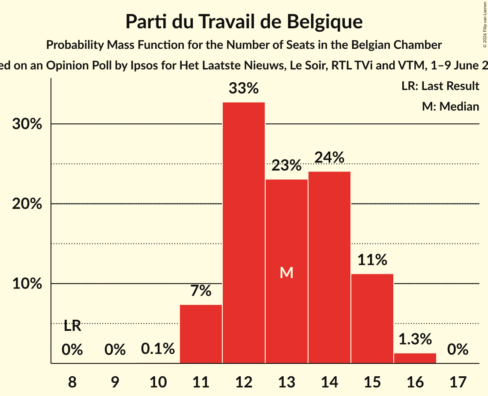

| Number of Seats | Probability | Accumulated | Special Marks |
|:---------------:|:-----------:|:-----------:|:-------------:|
| 8 | 0% | 100% | Last Result |
| 9 | 0% | 100% |  |
| 10 | 0.1% | 100% |  |
| 11 | 7% | 99.9% |  |
| 12 | 33% | 92% |  |
| 13 | 23% | 60% | Median |
| 14 | 24% | 37% |  |
| 15 | 11% | 13% |  |
| 16 | 1.3% | 1.3% |  |
| 17 | 0% | 0% |  |

### Les Engagés

*For a full overview of the results for this party, see the [Les Engagés](party-lesengagés.html) page.*

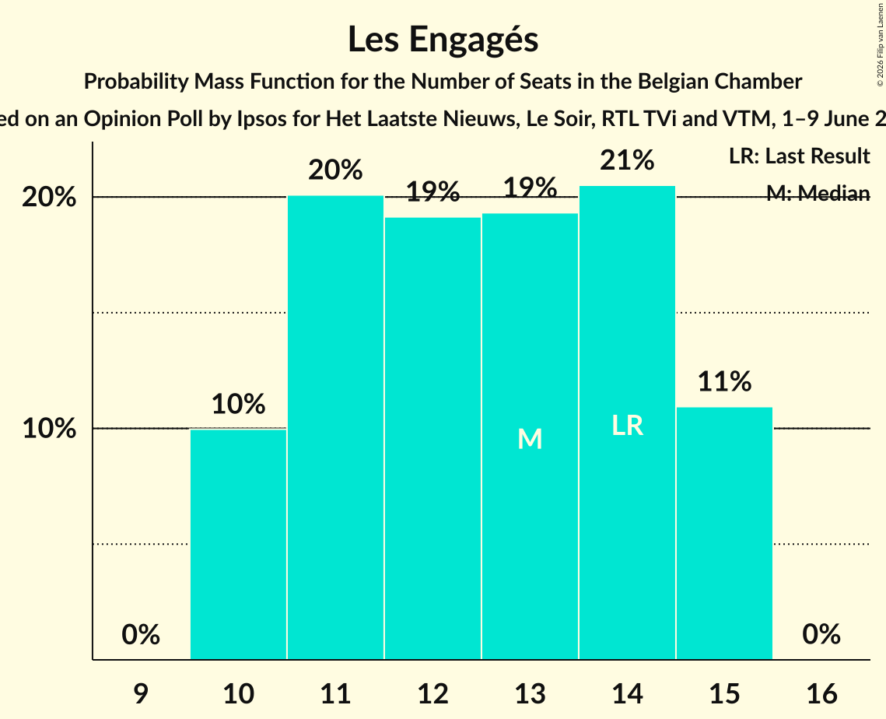

| Number of Seats | Probability | Accumulated | Special Marks |
|:---------------:|:-----------:|:-----------:|:-------------:|
| 10 | 10% | 100% |  |
| 11 | 20% | 90% |  |
| 12 | 19% | 70% |  |
| 13 | 19% | 51% | Median |
| 14 | 21% | 31% | Last Result |
| 15 | 11% | 11% |  |
| 16 | 0% | 0% |  |

### Partij van de Arbeid van België

*For a full overview of the results for this party, see the [Partij van de Arbeid van België](party-partijvandearbeidvanbelgië.html) page.*

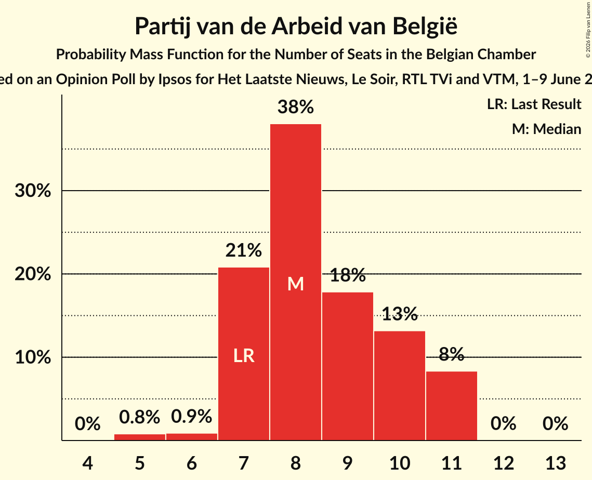

| Number of Seats | Probability | Accumulated | Special Marks |
|:---------------:|:-----------:|:-----------:|:-------------:|
| 5 | 0.8% | 100% |  |
| 6 | 0.9% | 99.2% |  |
| 7 | 21% | 98% | Last Result |
| 8 | 38% | 77% | Median |
| 9 | 18% | 39% |  |
| 10 | 13% | 22% |  |
| 11 | 8% | 8% |  |
| 12 | 0% | 0.1% |  |
| 13 | 0% | 0% |  |

### Groen

*For a full overview of the results for this party, see the [Groen](party-groen.html) page.*

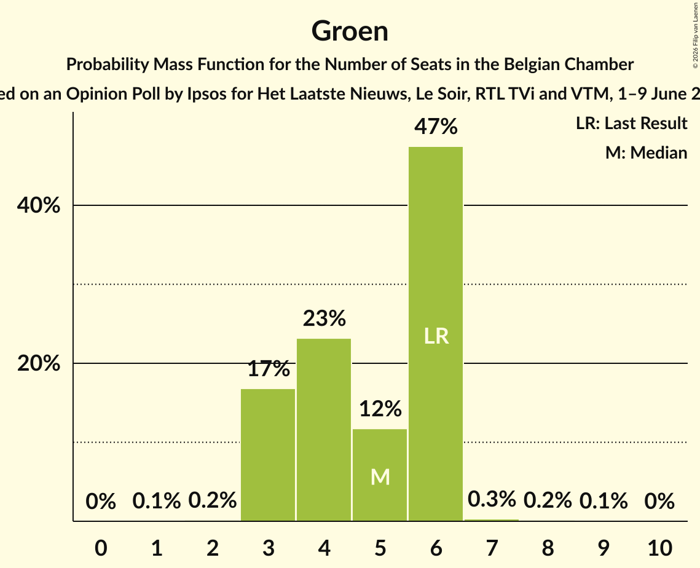

| Number of Seats | Probability | Accumulated | Special Marks |
|:---------------:|:-----------:|:-----------:|:-------------:|
| 1 | 0.1% | 100% |  |
| 2 | 0.2% | 99.9% |  |
| 3 | 17% | 99.8% |  |
| 4 | 23% | 83% |  |
| 5 | 12% | 60% | Median |
| 6 | 47% | 48% | Last Result |
| 7 | 0.3% | 0.6% |  |
| 8 | 0.2% | 0.3% |  |
| 9 | 0.1% | 0.1% |  |
| 10 | 0% | 0% |  |

### Anders

*For a full overview of the results for this party, see the [Anders](party-anders.html) page.*

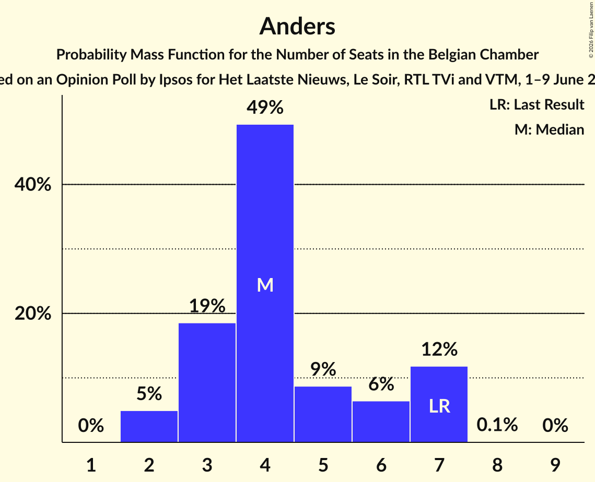

| Number of Seats | Probability | Accumulated | Special Marks |
|:---------------:|:-----------:|:-----------:|:-------------:|
| 2 | 5% | 100% |  |
| 3 | 19% | 95% |  |
| 4 | 49% | 76% | Median |
| 5 | 9% | 27% |  |
| 6 | 6% | 18% |  |
| 7 | 12% | 12% | Last Result |
| 8 | 0.1% | 0.1% |  |
| 9 | 0% | 0% |  |

### Ecolo

*For a full overview of the results for this party, see the [Ecolo](party-ecolo.html) page.*

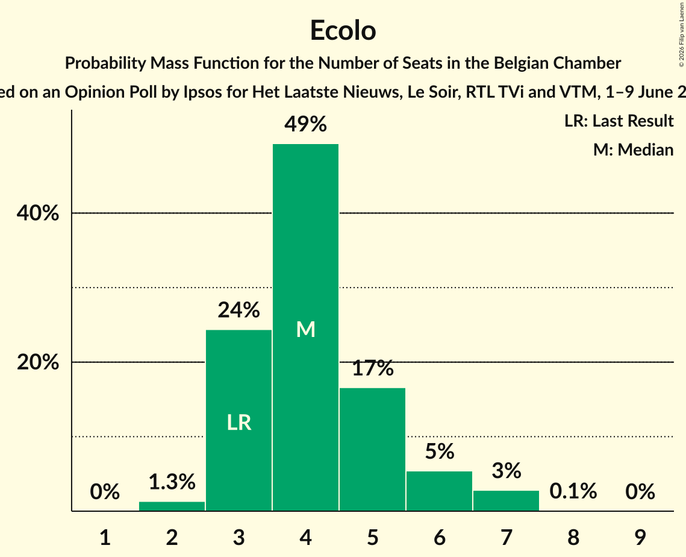

| Number of Seats | Probability | Accumulated | Special Marks |
|:---------------:|:-----------:|:-----------:|:-------------:|
| 2 | 1.3% | 100% |  |
| 3 | 24% | 98.7% | Last Result |
| 4 | 49% | 74% | Median |
| 5 | 17% | 25% |  |
| 6 | 5% | 8% |  |
| 7 | 3% | 3% |  |
| 8 | 0.1% | 0.1% |  |
| 9 | 0% | 0% |  |

### DéFI

*For a full overview of the results for this party, see the [DéFI](party-défi.html) page.*

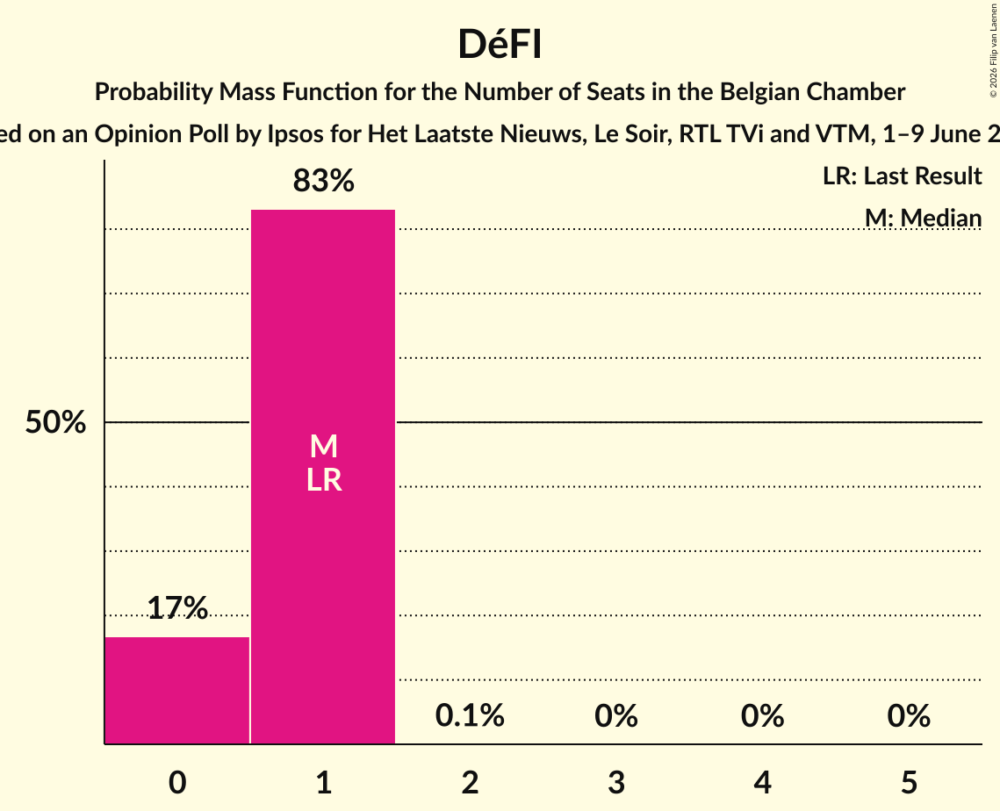

| Number of Seats | Probability | Accumulated | Special Marks |
|:---------------:|:-----------:|:-----------:|:-------------:|
| 0 | 17% | 100% |  |
| 1 | 83% | 83% | Last Result, Median |
| 2 | 0.1% | 0.1% |  |
| 3 | 0% | 0% |  |

### Chez Nous

*For a full overview of the results for this party, see the [Chez Nous](party-cheznous.html) page.*

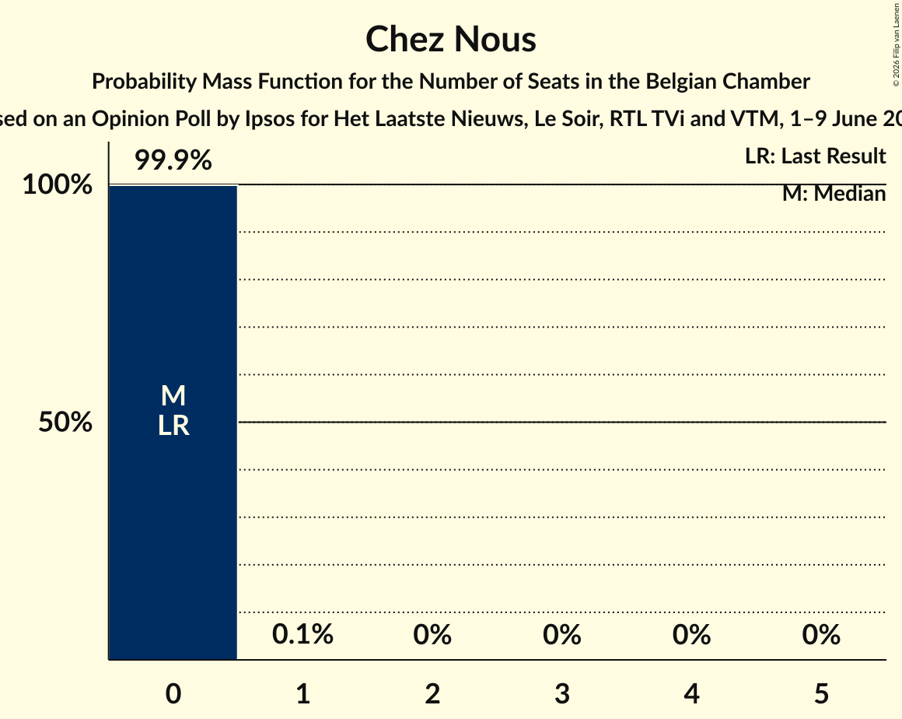

| Number of Seats | Probability | Accumulated | Special Marks |
|:---------------:|:-----------:|:-----------:|:-------------:|
| 0 | 99.9% | 100% | Last Result, Median |
| 1 | 0.1% | 0.1% |  |
| 2 | 0% | 0% |  |

### Team Fouad Ahidar

*For a full overview of the results for this party, see the [Team Fouad Ahidar](party-teamfouadahidar.html) page.*

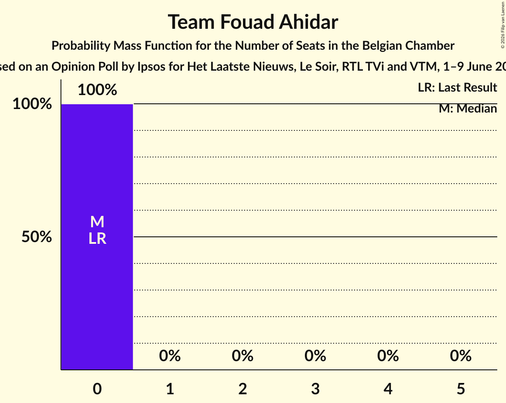

| Number of Seats | Probability | Accumulated | Special Marks |
|:---------------:|:-----------:|:-----------:|:-------------:|
| 0 | 100% | 100% | Last Result, Median |

## Coalitions

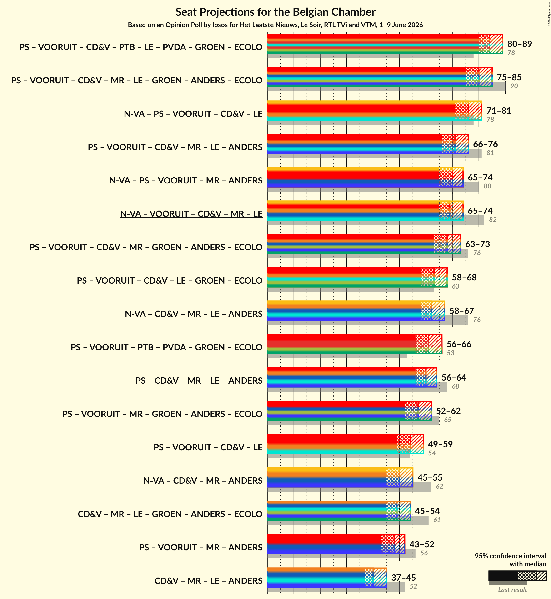

### Confidence Intervals

| Coalition | Last Result | Median | Majority? | 80% Confidence Interval | 90% Confidence Interval | 95% Confidence Interval | 99% Confidence Interval |
|:---------:|:-----------:|:------:|:---------:|:-----------------------:|:-----------------------:|:-----------------------:|:-----------------------:|
| Parti Socialiste – Vooruit – Christen-Democratisch en Vlaams – Parti du Travail de Belgique – Les Engagés – Partij van de Arbeid van België – Groen – Ecolo | 78 | 84 | 100% | 81–87 | 81–88 | 80–89 | 78–90 |
| Parti Socialiste – Vooruit – Christen-Democratisch en Vlaams – Mouvement Réformateur – Les Engagés – Groen – Anders – Ecolo | 90 | 80 | 97% | 77–83 | 76–84 | 75–85 | 74–86 |
| Nieuw-Vlaamse Alliantie – Parti Socialiste – Vooruit – Christen-Democratisch en Vlaams – Les Engagés | 78 | 76 | 56% | 73–79 | 72–80 | 71–81 | 69–82 |
| Parti Socialiste – Vooruit – Christen-Democratisch en Vlaams – Mouvement Réformateur – Les Engagés – Anders | 81 | 71 | 4% | 68–74 | 67–75 | 66–76 | 65–77 |
| Nieuw-Vlaamse Alliantie – Parti Socialiste – Vooruit – Mouvement Réformateur – Anders | 80 | 70 | 0.7% | 66–73 | 66–74 | 65–74 | 63–76 |
| Nieuw-Vlaamse Alliantie – Vooruit – Christen-Democratisch en Vlaams – Mouvement Réformateur – Les Engagés | 82 | 69 | 0.8% | 66–73 | 65–74 | 65–74 | 63–76 |
| Parti Socialiste – Vooruit – Christen-Democratisch en Vlaams – Mouvement Réformateur – Groen – Anders – Ecolo | 76 | 68 | 0.1% | 64–71 | 63–72 | 63–73 | 61–74 |
| Parti Socialiste – Vooruit – Christen-Democratisch en Vlaams – Les Engagés – Groen – Ecolo | 63 | 63 | 0% | 60–66 | 59–67 | 58–68 | 57–69 |
| Nieuw-Vlaamse Alliantie – Christen-Democratisch en Vlaams – Mouvement Réformateur – Les Engagés – Anders | 76 | 62 | 0% | 59–66 | 58–67 | 58–67 | 56–69 |
| Parti Socialiste – Vooruit – Parti du Travail de Belgique – Partij van de Arbeid van België – Groen – Ecolo | 53 | 61 | 0% | 58–64 | 57–65 | 56–66 | 55–67 |
| Parti Socialiste – Christen-Democratisch en Vlaams – Mouvement Réformateur – Les Engagés – Anders | 68 | 60 | 0% | 57–63 | 56–64 | 56–64 | 55–66 |
| Parti Socialiste – Vooruit – Mouvement Réformateur – Groen – Anders – Ecolo | 65 | 57 | 0% | 53–60 | 52–61 | 52–62 | 50–63 |
| Parti Socialiste – Vooruit – Christen-Democratisch en Vlaams – Les Engagés | 54 | 54 | 0% | 51–57 | 50–58 | 49–59 | 48–60 |
| Nieuw-Vlaamse Alliantie – Christen-Democratisch en Vlaams – Mouvement Réformateur – Anders | 62 | 50 | 0% | 47–53 | 46–54 | 45–55 | 44–56 |
| Christen-Democratisch en Vlaams – Mouvement Réformateur – Les Engagés – Groen – Anders – Ecolo | 61 | 49 | 0% | 47–53 | 46–53 | 45–54 | 44–56 |
| Parti Socialiste – Vooruit – Mouvement Réformateur – Anders | 56 | 48 | 0% | 45–51 | 44–51 | 43–52 | 42–53 |
| Christen-Democratisch en Vlaams – Mouvement Réformateur – Les Engagés – Anders | 52 | 40 | 0% | 38–43 | 37–44 | 37–45 | 35–47 |

### Parti Socialiste – Vooruit – Christen-Democratisch en Vlaams – Parti du Travail de Belgique – Les Engagés – Partij van de Arbeid van België – Groen – Ecolo

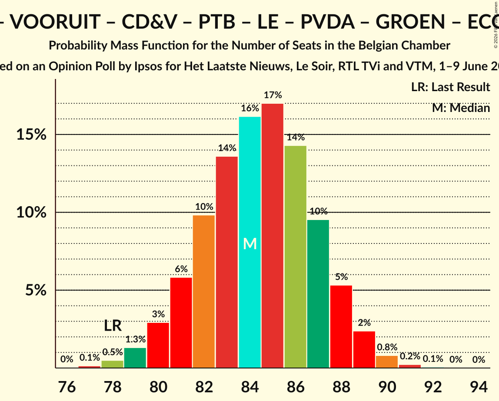

| Number of Seats | Probability | Accumulated | Special Marks |
|:---------------:|:-----------:|:-----------:|:-------------:|
| 77 | 0.1% | 100% |  |
| 78 | 0.5% | 99.8% | Last Result |
| 79 | 1.3% | 99.3% |  |
| 80 | 3% | 98% |  |
| 81 | 6% | 95% |  |
| 82 | 10% | 89% |  |
| 83 | 14% | 79% |  |
| 84 | 16% | 66% | Median |
| 85 | 17% | 50% |  |
| 86 | 14% | 33% |  |
| 87 | 10% | 18% |  |
| 88 | 5% | 9% |  |
| 89 | 2% | 3% |  |
| 90 | 0.8% | 1.1% |  |
| 91 | 0.2% | 0.3% |  |
| 92 | 0.1% | 0.1% |  |
| 93 | 0% | 0% |  |

### Parti Socialiste – Vooruit – Christen-Democratisch en Vlaams – Mouvement Réformateur – Les Engagés – Groen – Anders – Ecolo

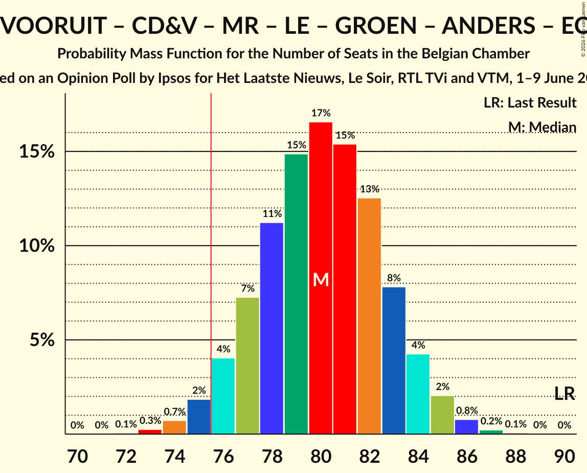

| Number of Seats | Probability | Accumulated | Special Marks |
|:---------------:|:-----------:|:-----------:|:-------------:|
| 72 | 0.1% | 100% |  |
| 73 | 0.3% | 99.9% |  |
| 74 | 0.7% | 99.7% |  |
| 75 | 2% | 99.0% |  |
| 76 | 4% | 97% | Majority |
| 77 | 7% | 93% |  |
| 78 | 11% | 86% |  |
| 79 | 15% | 75% |  |
| 80 | 17% | 60% | Median |
| 81 | 15% | 43% |  |
| 82 | 13% | 28% |  |
| 83 | 8% | 15% |  |
| 84 | 4% | 7% |  |
| 85 | 2% | 3% |  |
| 86 | 0.8% | 1.1% |  |
| 87 | 0.2% | 0.3% |  |
| 88 | 0.1% | 0.1% |  |
| 89 | 0% | 0% |  |
| 90 | 0% | 0% | Last Result |

### Nieuw-Vlaamse Alliantie – Parti Socialiste – Vooruit – Christen-Democratisch en Vlaams – Les Engagés

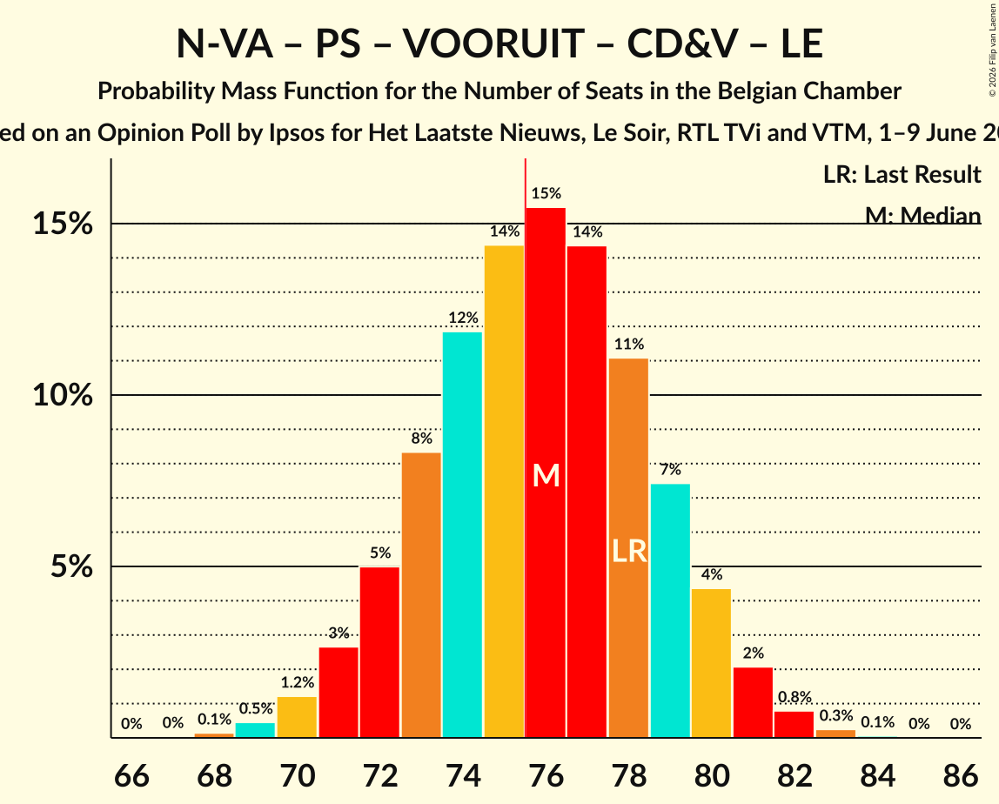

| Number of Seats | Probability | Accumulated | Special Marks |
|:---------------:|:-----------:|:-----------:|:-------------:|
| 67 | 0% | 100% |  |
| 68 | 0.1% | 99.9% |  |
| 69 | 0.5% | 99.8% |  |
| 70 | 1.2% | 99.3% |  |
| 71 | 3% | 98% |  |
| 72 | 5% | 95% |  |
| 73 | 8% | 90% |  |
| 74 | 12% | 82% |  |
| 75 | 14% | 70% |  |
| 76 | 15% | 56% | Median, Majority |
| 77 | 14% | 40% |  |
| 78 | 11% | 26% | Last Result |
| 79 | 7% | 15% |  |
| 80 | 4% | 8% |  |
| 81 | 2% | 3% |  |
| 82 | 0.8% | 1.1% |  |
| 83 | 0.3% | 0.3% |  |
| 84 | 0.1% | 0.1% |  |
| 85 | 0% | 0% |  |

### Parti Socialiste – Vooruit – Christen-Democratisch en Vlaams – Mouvement Réformateur – Les Engagés – Anders

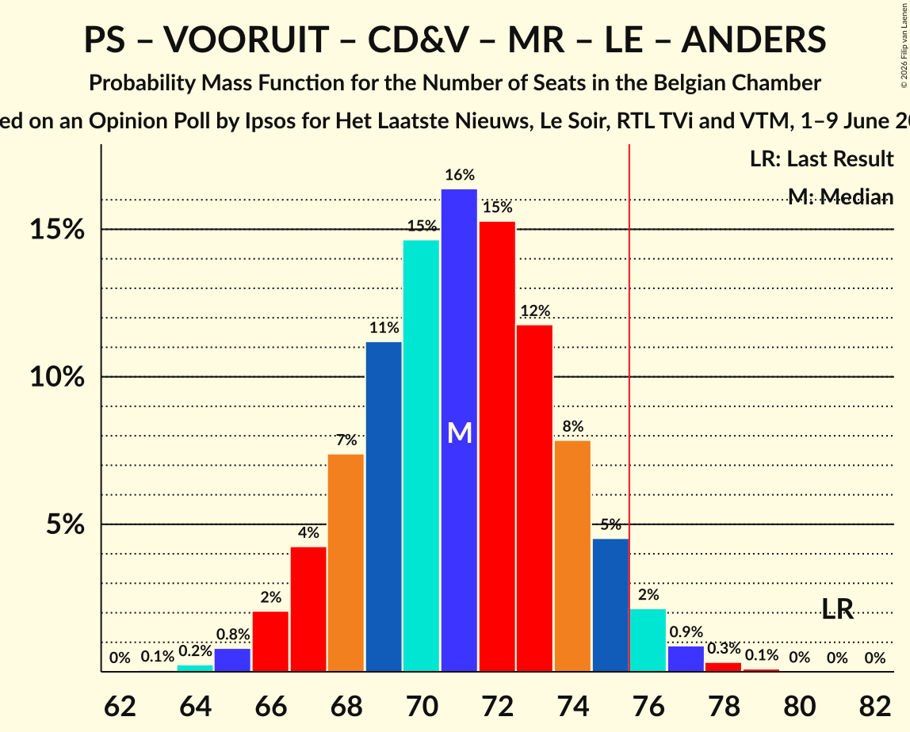

| Number of Seats | Probability | Accumulated | Special Marks |
|:---------------:|:-----------:|:-----------:|:-------------:|
| 63 | 0.1% | 100% |  |
| 64 | 0.2% | 99.9% |  |
| 65 | 0.8% | 99.7% |  |
| 66 | 2% | 98.9% |  |
| 67 | 4% | 97% |  |
| 68 | 7% | 93% |  |
| 69 | 11% | 85% |  |
| 70 | 15% | 74% |  |
| 71 | 16% | 59% | Median |
| 72 | 15% | 43% |  |
| 73 | 12% | 28% |  |
| 74 | 8% | 16% |  |
| 75 | 5% | 8% |  |
| 76 | 2% | 4% | Majority |
| 77 | 0.9% | 1.4% |  |
| 78 | 0.3% | 0.5% |  |
| 79 | 0.1% | 0.1% |  |
| 80 | 0% | 0% |  |
| 81 | 0% | 0% | Last Result |

### Nieuw-Vlaamse Alliantie – Parti Socialiste – Vooruit – Mouvement Réformateur – Anders

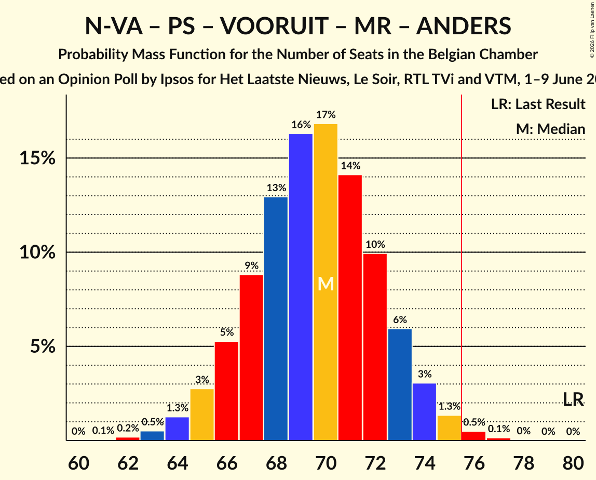

| Number of Seats | Probability | Accumulated | Special Marks |
|:---------------:|:-----------:|:-----------:|:-------------:|
| 61 | 0.1% | 100% |  |
| 62 | 0.2% | 99.9% |  |
| 63 | 0.5% | 99.7% |  |
| 64 | 1.3% | 99.2% |  |
| 65 | 3% | 98% |  |
| 66 | 5% | 95% |  |
| 67 | 9% | 90% |  |
| 68 | 13% | 81% |  |
| 69 | 16% | 68% |  |
| 70 | 17% | 52% | Median |
| 71 | 14% | 35% |  |
| 72 | 10% | 21% |  |
| 73 | 6% | 11% |  |
| 74 | 3% | 5% |  |
| 75 | 1.3% | 2% |  |
| 76 | 0.5% | 0.7% | Majority |
| 77 | 0.1% | 0.2% |  |
| 78 | 0% | 0% |  |
| 79 | 0% | 0% |  |
| 80 | 0% | 0% | Last Result |

### Nieuw-Vlaamse Alliantie – Vooruit – Christen-Democratisch en Vlaams – Mouvement Réformateur – Les Engagés

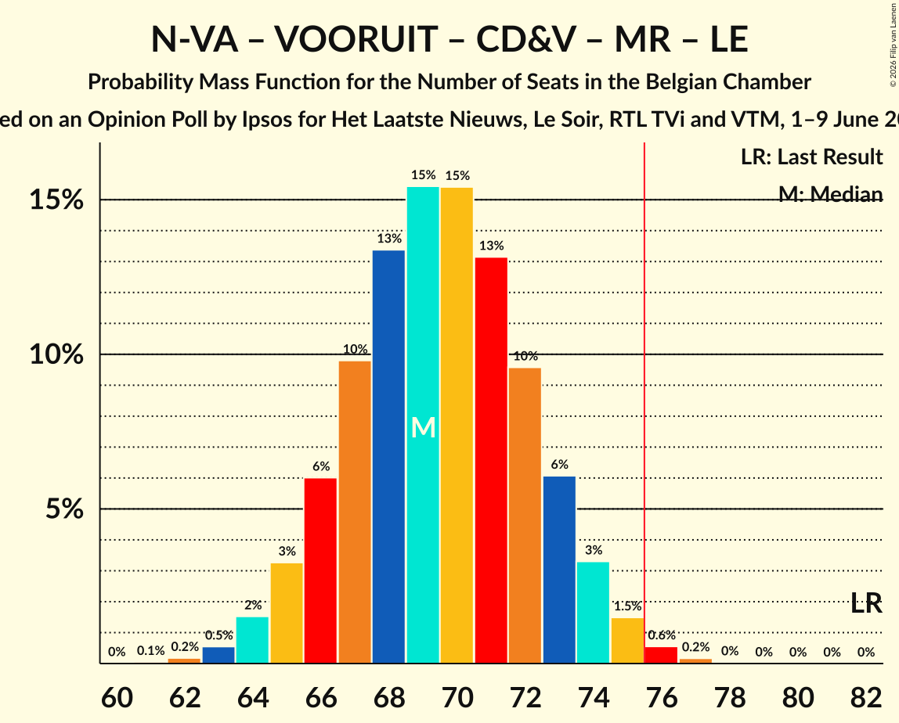

| Number of Seats | Probability | Accumulated | Special Marks |
|:---------------:|:-----------:|:-----------:|:-------------:|
| 61 | 0.1% | 100% |  |
| 62 | 0.2% | 99.9% |  |
| 63 | 0.5% | 99.8% |  |
| 64 | 2% | 99.2% |  |
| 65 | 3% | 98% |  |
| 66 | 6% | 94% |  |
| 67 | 10% | 88% |  |
| 68 | 13% | 79% |  |
| 69 | 15% | 65% |  |
| 70 | 15% | 50% | Median |
| 71 | 13% | 34% |  |
| 72 | 10% | 21% |  |
| 73 | 6% | 12% |  |
| 74 | 3% | 6% |  |
| 75 | 1.5% | 2% |  |
| 76 | 0.6% | 0.8% | Majority |
| 77 | 0.2% | 0.2% |  |
| 78 | 0% | 0.1% |  |
| 79 | 0% | 0% |  |
| 80 | 0% | 0% |  |
| 81 | 0% | 0% |  |
| 82 | 0% | 0% | Last Result |

### Parti Socialiste – Vooruit – Christen-Democratisch en Vlaams – Mouvement Réformateur – Groen – Anders – Ecolo

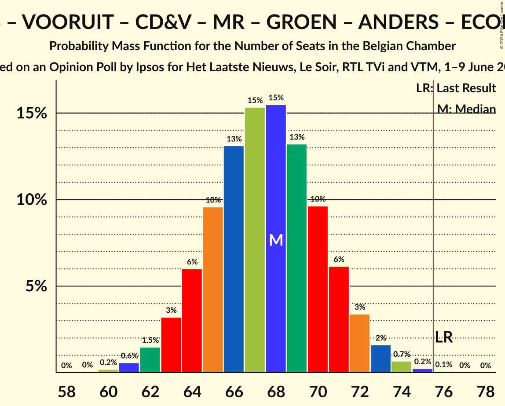

| Number of Seats | Probability | Accumulated | Special Marks |
|:---------------:|:-----------:|:-----------:|:-------------:|
| 59 | 0% | 100% |  |
| 60 | 0.2% | 99.9% |  |
| 61 | 0.6% | 99.8% |  |
| 62 | 1.5% | 99.2% |  |
| 63 | 3% | 98% |  |
| 64 | 6% | 95% |  |
| 65 | 10% | 88% |  |
| 66 | 13% | 79% |  |
| 67 | 15% | 66% | Median |
| 68 | 15% | 50% |  |
| 69 | 13% | 35% |  |
| 70 | 10% | 22% |  |
| 71 | 6% | 12% |  |
| 72 | 3% | 6% |  |
| 73 | 2% | 3% |  |
| 74 | 0.7% | 1.0% |  |
| 75 | 0.2% | 0.3% |  |
| 76 | 0.1% | 0.1% | Last Result, Majority |
| 77 | 0% | 0% |  |

### Parti Socialiste – Vooruit – Christen-Democratisch en Vlaams – Les Engagés – Groen – Ecolo

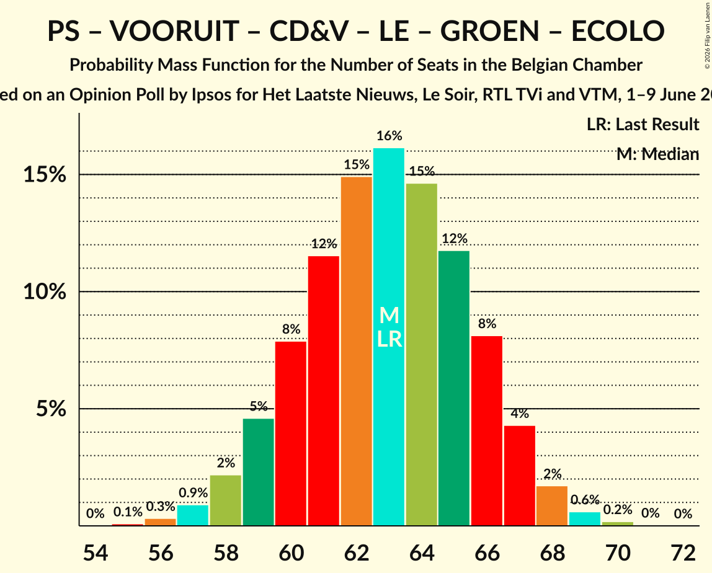

| Number of Seats | Probability | Accumulated | Special Marks |
|:---------------:|:-----------:|:-----------:|:-------------:|
| 55 | 0.1% | 100% |  |
| 56 | 0.3% | 99.9% |  |
| 57 | 0.9% | 99.6% |  |
| 58 | 2% | 98.6% |  |
| 59 | 5% | 96% |  |
| 60 | 8% | 92% |  |
| 61 | 12% | 84% |  |
| 62 | 15% | 72% |  |
| 63 | 16% | 58% | Last Result, Median |
| 64 | 15% | 41% |  |
| 65 | 12% | 27% |  |
| 66 | 8% | 15% |  |
| 67 | 4% | 7% |  |
| 68 | 2% | 3% |  |
| 69 | 0.6% | 0.8% |  |
| 70 | 0.2% | 0.2% |  |
| 71 | 0% | 0% |  |

### Nieuw-Vlaamse Alliantie – Christen-Democratisch en Vlaams – Mouvement Réformateur – Les Engagés – Anders

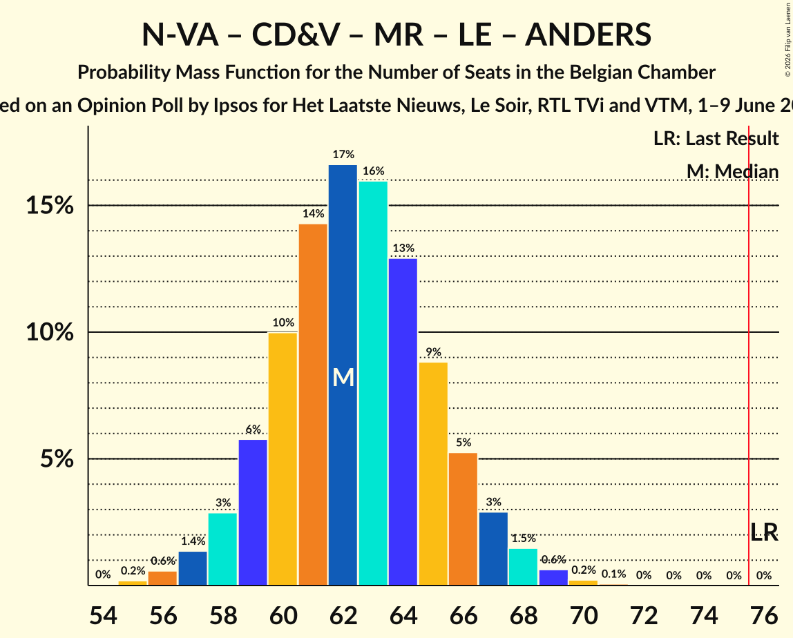

| Number of Seats | Probability | Accumulated | Special Marks |
|:---------------:|:-----------:|:-----------:|:-------------:|
| 54 | 0% | 100% |  |
| 55 | 0.2% | 99.9% |  |
| 56 | 0.6% | 99.8% |  |
| 57 | 1.4% | 99.2% |  |
| 58 | 3% | 98% |  |
| 59 | 6% | 95% |  |
| 60 | 10% | 89% |  |
| 61 | 14% | 79% |  |
| 62 | 17% | 65% | Median |
| 63 | 16% | 48% |  |
| 64 | 13% | 32% |  |
| 65 | 9% | 19% |  |
| 66 | 5% | 11% |  |
| 67 | 3% | 5% |  |
| 68 | 1.5% | 2% |  |
| 69 | 0.6% | 0.9% |  |
| 70 | 0.2% | 0.3% |  |
| 71 | 0.1% | 0.1% |  |
| 72 | 0% | 0% |  |
| 73 | 0% | 0% |  |
| 74 | 0% | 0% |  |
| 75 | 0% | 0% |  |
| 76 | 0% | 0% | Last Result, Majority |

### Parti Socialiste – Vooruit – Parti du Travail de Belgique – Partij van de Arbeid van België – Groen – Ecolo

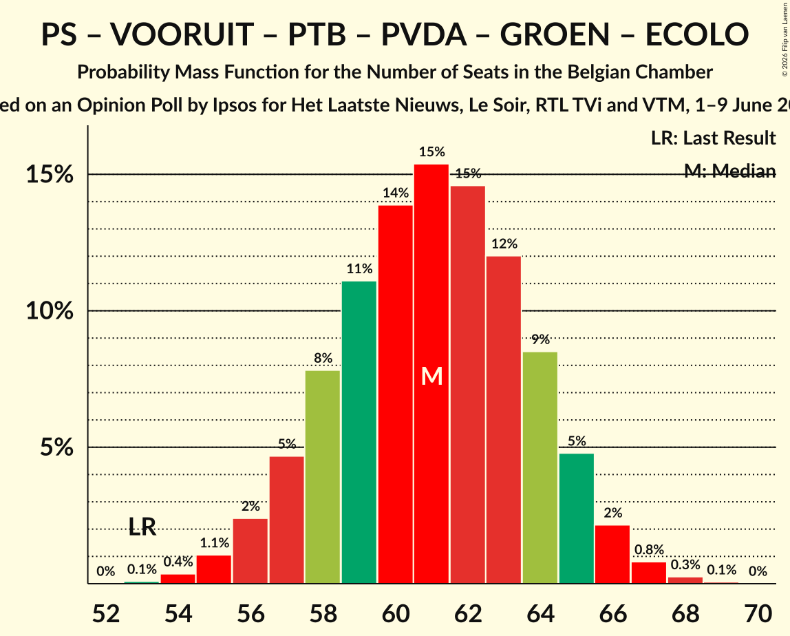

| Number of Seats | Probability | Accumulated | Special Marks |
|:---------------:|:-----------:|:-----------:|:-------------:|
| 53 | 0.1% | 100% | Last Result |
| 54 | 0.4% | 99.9% |  |
| 55 | 1.1% | 99.5% |  |
| 56 | 2% | 98% |  |
| 57 | 5% | 96% |  |
| 58 | 8% | 91% |  |
| 59 | 11% | 84% |  |
| 60 | 14% | 72% |  |
| 61 | 15% | 59% | Median |
| 62 | 15% | 43% |  |
| 63 | 12% | 29% |  |
| 64 | 9% | 17% |  |
| 65 | 5% | 8% |  |
| 66 | 2% | 3% |  |
| 67 | 0.8% | 1.1% |  |
| 68 | 0.3% | 0.3% |  |
| 69 | 0.1% | 0.1% |  |
| 70 | 0% | 0% |  |

### Parti Socialiste – Christen-Democratisch en Vlaams – Mouvement Réformateur – Les Engagés – Anders

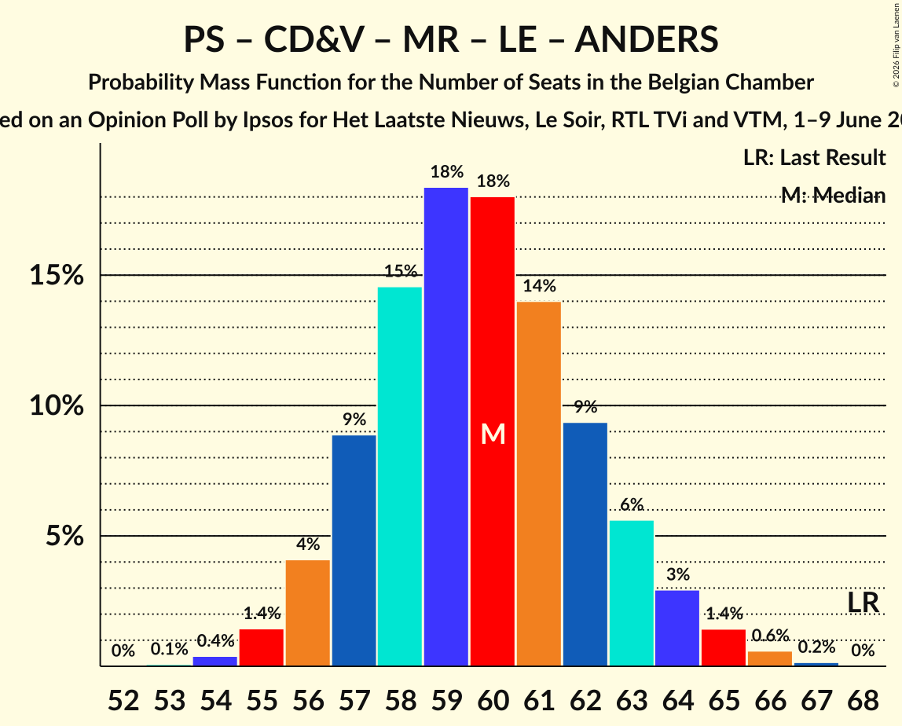

| Number of Seats | Probability | Accumulated | Special Marks |
|:---------------:|:-----------:|:-----------:|:-------------:|
| 53 | 0.1% | 100% |  |
| 54 | 0.4% | 99.9% |  |
| 55 | 1.4% | 99.5% |  |
| 56 | 4% | 98% |  |
| 57 | 9% | 94% |  |
| 58 | 15% | 85% |  |
| 59 | 18% | 71% | Median |
| 60 | 18% | 52% |  |
| 61 | 14% | 34% |  |
| 62 | 9% | 20% |  |
| 63 | 6% | 11% |  |
| 64 | 3% | 5% |  |
| 65 | 1.4% | 2% |  |
| 66 | 0.6% | 0.8% |  |
| 67 | 0.2% | 0.2% |  |
| 68 | 0% | 0% | Last Result |

### Parti Socialiste – Vooruit – Mouvement Réformateur – Groen – Anders – Ecolo

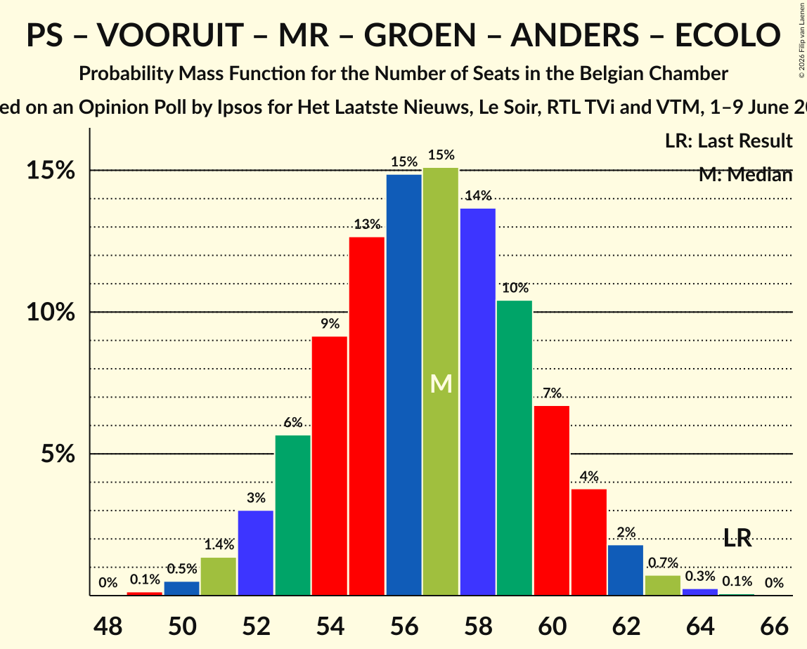

| Number of Seats | Probability | Accumulated | Special Marks |
|:---------------:|:-----------:|:-----------:|:-------------:|
| 49 | 0.1% | 100% |  |
| 50 | 0.5% | 99.8% |  |
| 51 | 1.4% | 99.3% |  |
| 52 | 3% | 98% |  |
| 53 | 6% | 95% |  |
| 54 | 9% | 89% |  |
| 55 | 13% | 80% |  |
| 56 | 15% | 67% |  |
| 57 | 15% | 53% | Median |
| 58 | 14% | 37% |  |
| 59 | 10% | 24% |  |
| 60 | 7% | 13% |  |
| 61 | 4% | 7% |  |
| 62 | 2% | 3% |  |
| 63 | 0.7% | 1.1% |  |
| 64 | 0.3% | 0.4% |  |
| 65 | 0.1% | 0.1% | Last Result |
| 66 | 0% | 0% |  |

### Parti Socialiste – Vooruit – Christen-Democratisch en Vlaams – Les Engagés

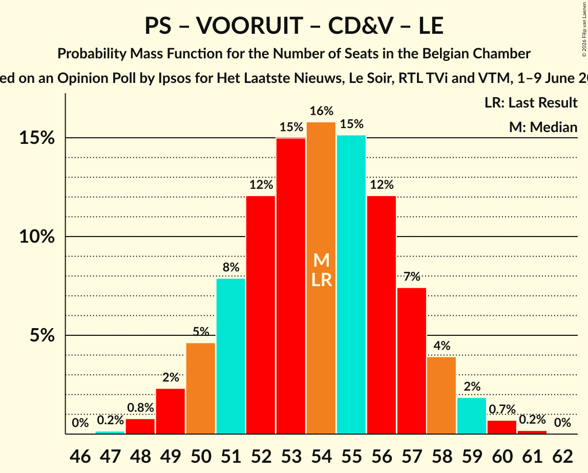

| Number of Seats | Probability | Accumulated | Special Marks |
|:---------------:|:-----------:|:-----------:|:-------------:|
| 47 | 0.2% | 100% |  |
| 48 | 0.8% | 99.8% |  |
| 49 | 2% | 99.0% |  |
| 50 | 5% | 97% |  |
| 51 | 8% | 92% |  |
| 52 | 12% | 84% |  |
| 53 | 15% | 72% |  |
| 54 | 16% | 57% | Last Result, Median |
| 55 | 15% | 41% |  |
| 56 | 12% | 26% |  |
| 57 | 7% | 14% |  |
| 58 | 4% | 7% |  |
| 59 | 2% | 3% |  |
| 60 | 0.7% | 0.9% |  |
| 61 | 0.2% | 0.2% |  |
| 62 | 0% | 0% |  |

### Nieuw-Vlaamse Alliantie – Christen-Democratisch en Vlaams – Mouvement Réformateur – Anders

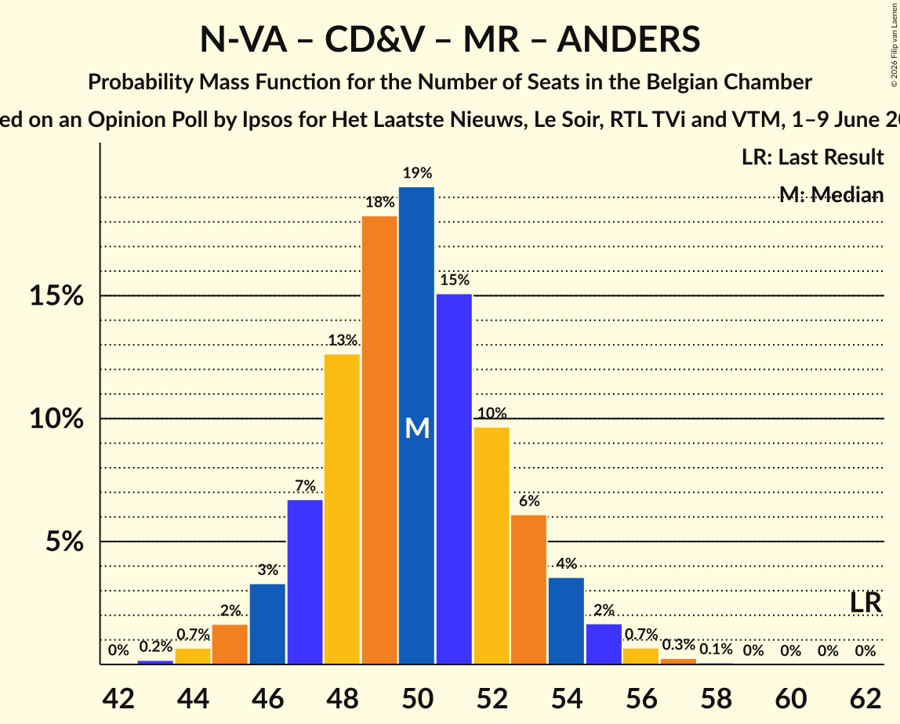

| Number of Seats | Probability | Accumulated | Special Marks |
|:---------------:|:-----------:|:-----------:|:-------------:|
| 43 | 0.2% | 100% |  |
| 44 | 0.7% | 99.8% |  |
| 45 | 2% | 99.1% |  |
| 46 | 3% | 97% |  |
| 47 | 7% | 94% |  |
| 48 | 13% | 87% |  |
| 49 | 18% | 75% | Median |
| 50 | 19% | 57% |  |
| 51 | 15% | 37% |  |
| 52 | 10% | 22% |  |
| 53 | 6% | 12% |  |
| 54 | 4% | 6% |  |
| 55 | 2% | 3% |  |
| 56 | 0.7% | 1.0% |  |
| 57 | 0.3% | 0.4% |  |
| 58 | 0.1% | 0.1% |  |
| 59 | 0% | 0% |  |
| 60 | 0% | 0% |  |
| 61 | 0% | 0% |  |
| 62 | 0% | 0% | Last Result |

### Christen-Democratisch en Vlaams – Mouvement Réformateur – Les Engagés – Groen – Anders – Ecolo

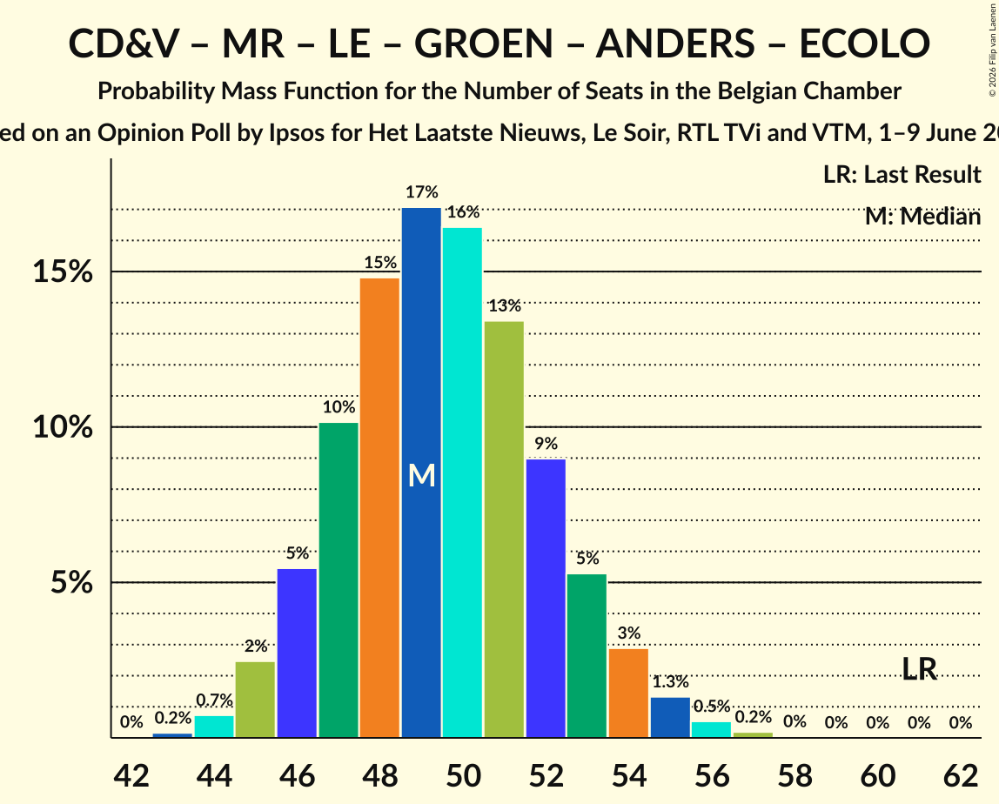

| Number of Seats | Probability | Accumulated | Special Marks |
|:---------------:|:-----------:|:-----------:|:-------------:|
| 43 | 0.2% | 100% |  |
| 44 | 0.7% | 99.8% |  |
| 45 | 2% | 99.1% |  |
| 46 | 5% | 97% |  |
| 47 | 10% | 91% |  |
| 48 | 15% | 81% |  |
| 49 | 17% | 66% | Median |
| 50 | 16% | 49% |  |
| 51 | 13% | 33% |  |
| 52 | 9% | 19% |  |
| 53 | 5% | 10% |  |
| 54 | 3% | 5% |  |
| 55 | 1.3% | 2% |  |
| 56 | 0.5% | 0.8% |  |
| 57 | 0.2% | 0.2% |  |
| 58 | 0% | 0.1% |  |
| 59 | 0% | 0% |  |
| 60 | 0% | 0% |  |
| 61 | 0% | 0% | Last Result |

### Parti Socialiste – Vooruit – Mouvement Réformateur – Anders

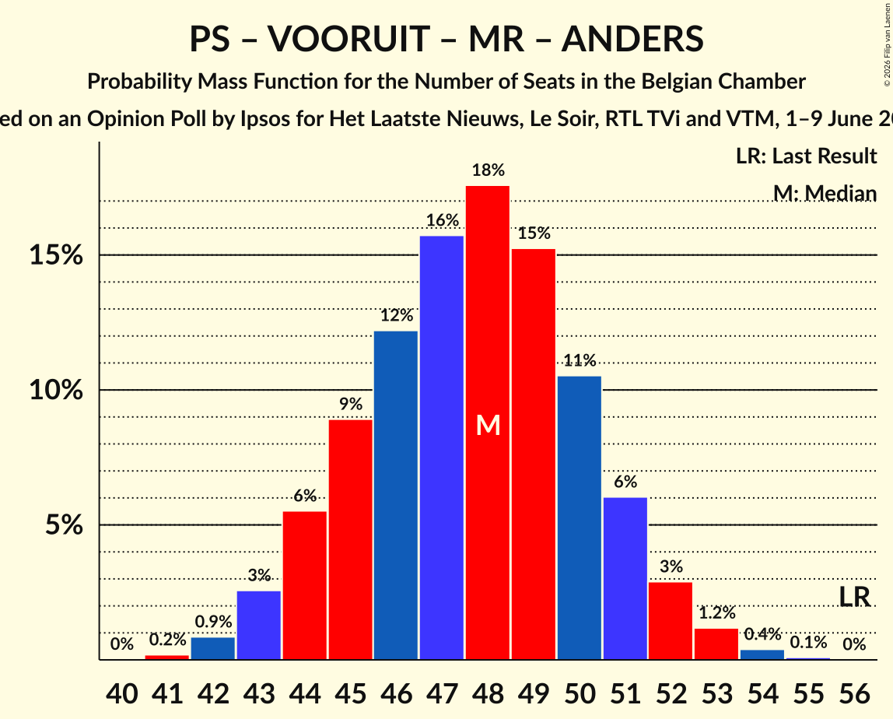

| Number of Seats | Probability | Accumulated | Special Marks |
|:---------------:|:-----------:|:-----------:|:-------------:|
| 41 | 0.2% | 100% |  |
| 42 | 0.9% | 99.8% |  |
| 43 | 3% | 98.9% |  |
| 44 | 6% | 96% |  |
| 45 | 9% | 91% |  |
| 46 | 12% | 82% |  |
| 47 | 16% | 70% |  |
| 48 | 18% | 54% | Median |
| 49 | 15% | 36% |  |
| 50 | 11% | 21% |  |
| 51 | 6% | 11% |  |
| 52 | 3% | 5% |  |
| 53 | 1.2% | 2% |  |
| 54 | 0.4% | 0.5% |  |
| 55 | 0.1% | 0.1% |  |
| 56 | 0% | 0% | Last Result |

### Christen-Democratisch en Vlaams – Mouvement Réformateur – Les Engagés – Anders

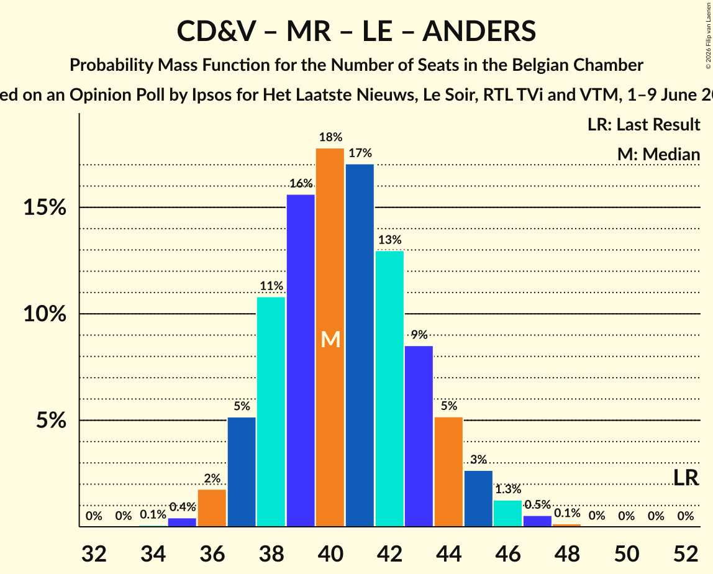

| Number of Seats | Probability | Accumulated | Special Marks |
|:---------------:|:-----------:|:-----------:|:-------------:|
| 34 | 0.1% | 100% |  |
| 35 | 0.4% | 99.9% |  |
| 36 | 2% | 99.5% |  |
| 37 | 5% | 98% |  |
| 38 | 11% | 93% |  |
| 39 | 16% | 82% |  |
| 40 | 18% | 66% | Median |
| 41 | 17% | 48% |  |
| 42 | 13% | 31% |  |
| 43 | 9% | 18% |  |
| 44 | 5% | 10% |  |
| 45 | 3% | 5% |  |
| 46 | 1.3% | 2% |  |
| 47 | 0.5% | 0.7% |  |
| 48 | 0.1% | 0.2% |  |
| 49 | 0% | 0% |  |
| 50 | 0% | 0% |  |
| 51 | 0% | 0% |  |
| 52 | 0% | 0% | Last Result |

## Technical Information

### Opinion Poll

+ **Polling firm:** Ipsos
+ **Commissioner(s):** Het Laatste Nieuws, Le Soir, RTL TVi and VTM
+ **Fieldwork period:** 1–9 June 2026

### Calculations

+ **Sample size:** 1609
+ **Simulations done:** 2,097,152
+ **Error estimate:** 0.84%

