# Poll Average

<a href="#voting-intentions">Voting Intentions</a> | <a href="#seats">Seats</a> | <a href="#coalitions">Coalitions</a> | <a href="#technical-information">Technical Information</a>

## Summary

The table below lists the polls on which the average is based. They are the most recent polls (less than 90 days old) registered and analyzed so far.

| Period     | Polling firm/Commissioner(s) | N-VA | PS | CD&V | VLD | MR | SP.A | GROEN | CDH | VB | ECOLO | PTB | DÉFI | PVDA | PP | DLB | LDD | DROITE | PIRAAT | ISLAM | WDA | PIRATE | RWF | FW |
|:----------:|:----------------------------:|:--:|:--:|:--:|:--:|:--:|:--:|:--:|:--:|:--:|:--:|:--:|:--:|:--:|:--:|:--:|:--:|:--:|:--:|:--:|:--:|:--:|:--:|:--:|
| 25 May 2014 | General Election | 20.3%   33 | 11.7%   23 | 11.6%   18 | 9.8%   14 | 9.6%   20 | 8.8%   13 | 5.3%   6 | 5.0%   9 | 3.7%   3 | 3.3%   6 | 2.0%   2 | 1.8%   2 | 1.8%   0 | 1.5%   1 | 0.9%   0 | 0.4%   0 | 0.4%   0 | 0.3%   0 | 0.2%   0 | 0.2%   0 | 0.2%   0 | 0.1%   0 | 0.1%   0 |
| N/A | Poll Average | 15–16%   24–30 | 8%   16–20 | 8%   11–16 | 6–8%   10–15 | 6%   11–16 | 6–7%   8–14 | 8–10%   11–17 | 3%   4–7 | 5–6%   6–12 | 6%   13–18 | 3–4%   5–11 | 1–2%   1–3 | 2–4%   1–4 | 1%   0–2 | N/A   N/A | N/A   N/A | 0%   0 | N/A   N/A | N/A   N/A | N/A   N/A | N/A   N/A | N/A   N/A | N/A   N/A |
| [25 March–14 April 2019](2019-04-14-TNS.html) | TNS   De Standaard, La Libre Belgique, RTBf and VRT | 15–17%   24–30 | 8%   16–20 | 8%   11–16 | 7–8%   11–16 | 6%   11–15 | 6–7%   9–14 | 8–10%   11–16 | 3%   4–6 | 4–5%   6–9 | 7–8%   15–18 | 4–5%   8–11 | 1–2%   1–2 | 3–4%   1–5 | 1%   0 | N/A   N/A | N/A   N/A | N/A   N/A | N/A   N/A | N/A   N/A | N/A   N/A | N/A   N/A | N/A   N/A | N/A   N/A |
| [5–11 February 2019](2019-02-11-Ipsos.html) | Ipsos   Het Laatste Nieuws, Le Soir, RTL TVi and VTM | 15–16%   25–31 | 8%   16–20 | 8–9%   11–17 | 6–7%   9–14 | 6–7%   13–17 | 6%   8–12 | 8–10%   12–17 | 3%   4–7 | 6%   7–12 | 6%   12–17 | 3%   5–8 | 2%   2–3 | 2–4%   1–3 | 1–2%   0–2 | N/A   N/A | N/A   N/A | 0%   0 | N/A   N/A | N/A   N/A | N/A   N/A | N/A   N/A | N/A   N/A | N/A   N/A |
| 25 May 2014 | General Election | 20.3%   33 | 11.7%   23 | 11.6%   18 | 9.8%   14 | 9.6%   20 | 8.8%   13 | 5.3%   6 | 5.0%   9 | 3.7%   3 | 3.3%   6 | 2.0%   2 | 1.8%   2 | 1.8%   0 | 1.5%   1 | 0.9%   0 | 0.4%   0 | 0.4%   0 | 0.3%   0 | 0.2%   0 | 0.2%   0 | 0.2%   0 | 0.1%   0 | 0.1%   0 |

Only polls for which at least the sample size has been published are included in the table above.

**Legend:**
+ **Top half of each row:** Voting intentions (95% confidence interval)
+ **Bottom half of each row:** Seat projections for the Belgian Chamber (95% confidence interval)
+ **N-VA:** N-VA
+ **PS:** PS
+ **CD&V:** CD&V
+ **VLD:** Open Vld
+ **MR:** MR
+ **SP.A:** sp.a
+ **GROEN:** Groen
+ **CDH:** cdH
+ **VB:** Vlaams Belang
+ **ECOLO:** Ecolo
+ **PTB:** PTB
+ **DÉFI:** DéFI
+ **PVDA:** PVDA
+ **PP:** Parti Populaire
+ **DLB:** Debout les Belges
+ **LDD:** Lijst Dedecker
+ **DROITE:** La Droite
+ **PIRAAT:** Piratenpartij
+ **ISLAM:** ISLAM
+ **WDA:** Wallonie d’Abord
+ **PIRATE:** PIRATE
+ **RWF:** R.W.F.
+ **FW:** FW
+ **N/A (single party):** Party not included the published results
+ **N/A (entire row):** Calculation for this opinion poll not started yet

## Voting Intentions

### Confidence Intervals

| Party | Last Result | Median | 80% Confidence Interval | 90% Confidence Interval | 95% Confidence Interval | 99% Confidence Interval |
|:-----:|:-----------:|:------:|:-----------------------:|:-----------------------:|:-----------------------:|:-----------------------:|
| <a href="#n-va">N-VA</a> | 20.3% | 16.2% | 15.6–16.5% |15.4–16.5% | 15.2–16.5% | 14.8–16.6% |
| <a href="#ps">PS</a> | 11.7% | 8.0% | 7.8–8.2% |7.6–8.2% | 7.5–8.2% | 7.3–8.2% |
| <a href="#cd&v">CD&V</a> | 11.6% | 8.3% | 7.8–8.5% |7.7–8.5% | 7.5–8.5% | 7.2–8.5% |
| <a href="#open-vld">Open Vld</a> | 9.8% | 7.3% | 6.8–7.5% |6.6–7.5% | 6.5–7.5% | 6.2–7.6% |
| <a href="#mr">MR</a> | 9.6% | 6.2% | 6.0–6.3% |5.9–6.4% | 5.8–6.4% | 5.6–6.4% |
| <a href="#sp.a">sp.a</a> | 8.8% | 6.3% | 5.9–6.6% |5.7–6.6% | 5.6–6.6% | 5.3–6.6% |
| <a href="#groen">Groen</a> | 5.3% | 9.3% | 8.4–10.0% |8.1–10.2% | 7.9–10.3% | 7.5–10.3% |
| <a href="#cdh">cdH</a> | 5.0% | 3.0% | 2.8–3.0% |2.7–3.1% | 2.6–3.1% | 2.5–3.1% |
| <a href="#vlaams-belang">Vlaams Belang</a> | 3.7% | 5.3% | 4.9–5.5% |4.7–5.5% | 4.6–5.5% | 4.3–5.6% |
| <a href="#ecolo">Ecolo</a> | 3.3% | 6.3% | 6.0–6.4% |5.9–6.4% | 5.9–6.5% | 5.7–6.5% |
| <a href="#ptb">PTB</a> | 2.0% | 3.4% | 3.2–3.5% |3.1–3.5% | 3.1–3.5% | 2.9–3.5% |
| <a href="#défi">DéFI</a> | 1.8% | 1.6% | 1.4–1.6% |1.4–1.6% | 1.4–1.6% | 1.3–1.7% |
| <a href="#pvda">PVDA</a> | 1.8% | 3.3% | 2.7–3.9% |2.5–4.0% | 2.4–4.0% | 2.2–4.1% |
| <a href="#parti-populaire">Parti Populaire</a> | 1.5% | 0.9% | 0.8–0.9% |0.7–0.9% | 0.7–0.9% | 0.6–0.9% |
| <a href="#debout-les-belges">Debout les Belges</a> | 0.9% | N/A | N/A |N/A | N/A | N/A |
| <a href="#lijst-dedecker">Lijst Dedecker</a> | 0.4% | N/A | N/A |N/A | N/A | N/A |
| <a href="#la-droite">La Droite</a> | 0.4% | 0.5% | 0.3–0.5% |0.3–0.5% | 0.3–0.5% | 0.2–0.5% |
| <a href="#piratenpartij">Piratenpartij</a> | 0.3% | N/A | N/A |N/A | N/A | N/A |
| <a href="#islam">ISLAM</a> | 0.2% | N/A | N/A |N/A | N/A | N/A |
| <a href="#wallonie-d’abord">Wallonie d’Abord</a> | 0.2% | N/A | N/A |N/A | N/A | N/A |
| <a href="#pirate">PIRATE</a> | 0.2% | N/A | N/A |N/A | N/A | N/A |
| <a href="#r.w.f.">R.W.F.</a> | 0.1% | N/A | N/A |N/A | N/A | N/A |
| <a href="#fw">FW</a> | 0.1% | N/A | N/A |N/A | N/A | N/A |

### N-VA

*For a full overview of the results for this party, see the [N-VA](party-n-va.html) page.*

| Voting Intentions | Probability | Accumulated | Special Marks |
|:-----------------:|:-----------:|:-----------:|:-------------:|
| 12.5–13.5% | 0% | 100% |  |
| 13.5–14.5% | 0.2% | 100% |  |
| 14.5–15.5% | 8% | 99.8% |  |
| 15.5–16.5% | 91% | 92% | Median |
| 16.5–17.5% | 100% | 0.7% |  |
| 17.5–18.5% | 100% | 0% |  |
| 18.5–19.5% | 83% | 0% |  |
| 19.5–20.5% | 9% | 0% | Last Result |
| 20.5–21.5% | 0.3% | 0% |  |

### PS

*For a full overview of the results for this party, see the [PS](party-ps.html) page.*

| Voting Intentions | Probability | Accumulated | Special Marks |
|:-----------------:|:-----------:|:-----------:|:-------------:|
| 5.5–6.5% | 0% | 100% |  |
| 6.5–7.5% | 3% | 100% |  |
| 7.5–8.5% | 100% | 97% | Median |
| 8.5–9.5% | 100% | 0% |  |
| 9.5–10.5% | 74% | 0% |  |
| 10.5–11.5% | 0.2% | 0% |  |
| 11.5–12.5% | 0% | 0% | Last Result |

### CD&V

*For a full overview of the results for this party, see the [CD&V](party-cdv.html) page.*

| Voting Intentions | Probability | Accumulated | Special Marks |
|:-----------------:|:-----------:|:-----------:|:-------------:|
| 5.5–6.5% | 0% | 100% |  |
| 6.5–7.5% | 3% | 100% |  |
| 7.5–8.5% | 98.7% | 97% | Median |
| 8.5–9.5% | 100% | 0% |  |
| 9.5–10.5% | 100% | 0% |  |
| 10.5–11.5% | 31% | 0% |  |
| 11.5–12.5% | 0.9% | 0% | Last Result |

### Open Vld

*For a full overview of the results for this party, see the [Open Vld](party-openvld.html) page.*

| Voting Intentions | Probability | Accumulated | Special Marks |
|:-----------------:|:-----------:|:-----------:|:-------------:|
| 4.5–5.5% | 0% | 100% |  |
| 5.5–6.5% | 4% | 100% |  |
| 6.5–7.5% | 95% | 96% | Median |
| 7.5–8.5% | 100% | 2% |  |
| 8.5–9.5% | 100% | 0% |  |
| 9.5–10.5% | 72% | 0% | Last Result |
| 10.5–11.5% | 5% | 0% |  |

### MR

*For a full overview of the results for this party, see the [MR](party-mr.html) page.*

| Voting Intentions | Probability | Accumulated | Special Marks |
|:-----------------:|:-----------:|:-----------:|:-------------:|
| 3.5–4.5% | 0% | 100% |  |
| 4.5–5.5% | 0.2% | 100% |  |
| 5.5–6.5% | 100% | 99.8% | Median |
| 6.5–7.5% | 100% | 0% |  |
| 7.5–8.5% | 95% | 0% |  |
| 8.5–9.5% | 0.2% | 0% |  |
| 9.5–10.5% | 0% | 0% | Last Result |

### sp.a

*For a full overview of the results for this party, see the [sp.a](party-spa.html) page.*

| Voting Intentions | Probability | Accumulated | Special Marks |
|:-----------------:|:-----------:|:-----------:|:-------------:|
| 3.5–4.5% | 0% | 100% |  |
| 4.5–5.5% | 2% | 100% |  |
| 5.5–6.5% | 84% | 98% | Median |
| 6.5–7.5% | 100% | 14% |  |
| 7.5–8.5% | 100% | 0% |  |
| 8.5–9.5% | 70% | 0% | Last Result |
| 9.5–10.5% | 4% | 0% |  |

### Groen

*For a full overview of the results for this party, see the [Groen](party-groen.html) page.*

| Voting Intentions | Probability | Accumulated | Special Marks |
|:-----------------:|:-----------:|:-----------:|:-------------:|
| 4.5–5.5% | 0% | 100% | Last Result |
| 5.5–6.5% | 0% | 100% |  |
| 6.5–7.5% | 0.6% | 100% |  |
| 7.5–8.5% | 15% | 99.4% |  |
| 8.5–9.5% | 51% | 84% | Median |
| 9.5–10.5% | 37% | 33% |  |
| 10.5–11.5% | 7% | 0% |  |
| 11.5–12.5% | 0.3% | 0% |  |

### cdH

*For a full overview of the results for this party, see the [cdH](party-cdh.html) page.*

| Voting Intentions | Probability | Accumulated | Special Marks |
|:-----------------:|:-----------:|:-----------:|:-------------:|
| 0.5–1.5% | 0% | 100% |  |
| 1.5–2.5% | 0.7% | 100% |  |
| 2.5–3.5% | 100% | 99.3% | Median |
| 3.5–4.5% | 100% | 0% |  |
| 4.5–5.5% | 2% | 0% | Last Result |

### Vlaams Belang

*For a full overview of the results for this party, see the [Vlaams Belang](party-vlaamsbelang.html) page.*

| Voting Intentions | Probability | Accumulated | Special Marks |
|:-----------------:|:-----------:|:-----------:|:-------------:|
| 2.5–3.5% | 0% | 100% |  |
| 3.5–4.5% | 2% | 100% | Last Result |
| 4.5–5.5% | 97% | 98% | Median |
| 5.5–6.5% | 100% | 0.7% |  |
| 6.5–7.5% | 100% | 0% |  |
| 7.5–8.5% | 81% | 0% |  |
| 8.5–9.5% | 4% | 0% |  |

### Ecolo

*For a full overview of the results for this party, see the [Ecolo](party-ecolo.html) page.*

| Voting Intentions | Probability | Accumulated | Special Marks |
|:-----------------:|:-----------:|:-----------:|:-------------:|
| 2.5–3.5% | 0% | 100% | Last Result |
| 3.5–4.5% | 0% | 100% |  |
| 4.5–5.5% | 0.1% | 100% |  |
| 5.5–6.5% | 100% | 99.9% | Median |
| 6.5–7.5% | 100% | 0% |  |
| 7.5–8.5% | 100% | 0% |  |
| 8.5–9.5% | 100% | 0% |  |
| 9.5–10.5% | 7% | 0% |  |

### PTB

*For a full overview of the results for this party, see the [PTB](party-ptb.html) page.*

| Voting Intentions | Probability | Accumulated | Special Marks |
|:-----------------:|:-----------:|:-----------:|:-------------:|
| 1.5–2.5% | 0% | 100% | Last Result |
| 2.5–3.5% | 100% | 100% | Median |
| 3.5–4.5% | 100% | 0% |  |
| 4.5–5.5% | 100% | 0% |  |
| 5.5–6.5% | 100% | 0% |  |
| 6.5–7.5% | 1.1% | 0% |  |

### DéFI

*For a full overview of the results for this party, see the [DéFI](party-défi.html) page.*

| Voting Intentions | Probability | Accumulated | Special Marks |
|:-----------------:|:-----------:|:-----------:|:-------------:|
| 0.0–0.5% | 0% | 100% |  |
| 0.5–1.5% | 38% | 100% |  |
| 1.5–2.5% | 100% | 62% | Last Result, Median |
| 2.5–3.5% | 72% | 0% |  |

### PVDA

*For a full overview of the results for this party, see the [PVDA](party-pvda.html) page.*

| Voting Intentions | Probability | Accumulated | Special Marks |
|:-----------------:|:-----------:|:-----------:|:-------------:|
| 0.5–1.5% | 0% | 100% |  |
| 1.5–2.5% | 6% | 100% | Last Result |
| 2.5–3.5% | 64% | 94% | Median |
| 3.5–4.5% | 39% | 31% |  |
| 4.5–5.5% | 2% | 0% |  |

### Parti Populaire

*For a full overview of the results for this party, see the [Parti Populaire](party-partipopulaire.html) page.*

| Voting Intentions | Probability | Accumulated | Special Marks |
|:-----------------:|:-----------:|:-----------:|:-------------:|
| 0.0–0.5% | 0.1% | 100% |  |
| 0.5–1.5% | 100% | 99.9% | Median |
| 1.5–2.5% | 100% | 0% | Last Result |
| 2.5–3.5% | 1.4% | 0% |  |

### La Droite

*For a full overview of the results for this party, see the [La Droite](party-ladroite.html) page.*

| Voting Intentions | Probability | Accumulated | Special Marks |
|:-----------------:|:-----------:|:-----------:|:-------------:|
| 0.0–0.5% | 100% | 100% | Last Result, Median |
| 0.5–1.5% | 69% | 0% |  |
| 1.5–2.5% | 0% | 0% |  |

## Seats

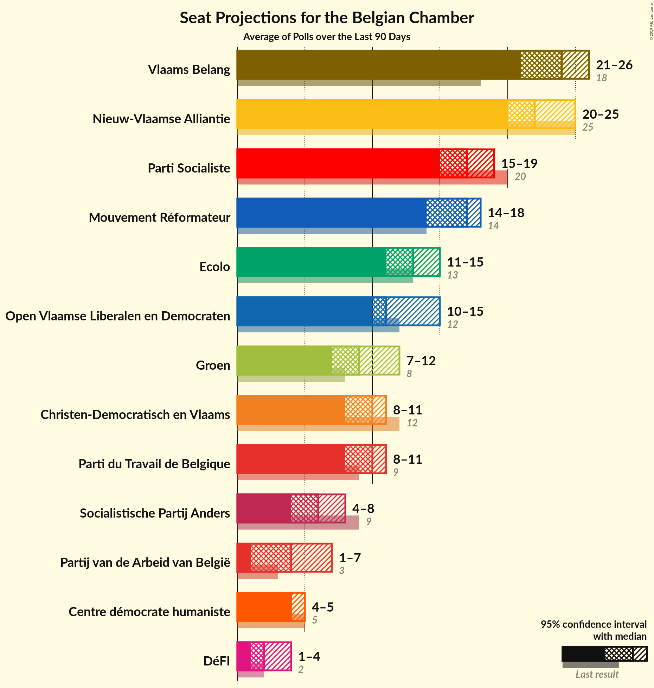

### Confidence Intervals

| Party | Last Result | Median | 80% Confidence Interval | 90% Confidence Interval | 95% Confidence Interval | 99% Confidence Interval |
|:-----:|:-----------:|:------:|:-----------------------:|:-----------------------:|:-----------------------:|:-----------------------:|
| <a href="#n-va">N-VA</a> | 33 | 28 | 25–30 |25–30 | 24–30 | 23–32 |
| <a href="#ps">PS</a> | 23 | 18 | 17–20 |16–20 | 16–20 | 15–21 |
| <a href="#cd&v">CD&V</a> | 18 | 14 | 12–15 |11–16 | 11–16 | 10–18 |
| <a href="#open-vld">Open Vld</a> | 14 | 12 | 11–14 |10–14 | 10–15 | 8–17 |
| <a href="#mr">MR</a> | 20 | 13 | 12–15 |12–16 | 11–16 | 11–17 |
| <a href="#sp.a">sp.a</a> | 13 | 10 | 9–12 |9–13 | 8–14 | 7–15 |
| <a href="#groen">Groen</a> | 6 | 13 | 12–16 |11–16 | 11–17 | 10–17 |
| <a href="#cdh">cdH</a> | 9 | 5 | 4–6 |4–6 | 4–7 | 3–7 |
| <a href="#vlaams-belang">Vlaams Belang</a> | 3 | 8 | 7–11 |7–11 | 6–12 | 6–13 |
| <a href="#ecolo">Ecolo</a> | 6 | 16 | 14–18 |13–18 | 13–18 | 12–19 |
| <a href="#ptb">PTB</a> | 2 | 8 | 5–10 |5–10 | 5–11 | 4–11 |
| <a href="#défi">DéFI</a> | 2 | 2 | 1–2 |1–3 | 1–3 | 1–4 |
| <a href="#pvda">PVDA</a> | 0 | 3 | 1–3 |1–4 | 1–4 | 1–5 |
| <a href="#parti-populaire">Parti Populaire</a> | 1 | 0 | 0–2 |0–2 | 0–2 | 0–2 |
| <a href="#debout-les-belges">Debout les Belges</a> | 0 | N/A | N/A |N/A | N/A | N/A |
| <a href="#lijst-dedecker">Lijst Dedecker</a> | 0 | N/A | N/A |N/A | N/A | N/A |
| <a href="#la-droite">La Droite</a> | 0 | 0 | 0 |0 | 0 | 0 |
| <a href="#piratenpartij">Piratenpartij</a> | 0 | N/A | N/A |N/A | N/A | N/A |
| <a href="#islam">ISLAM</a> | 0 | N/A | N/A |N/A | N/A | N/A |
| <a href="#wallonie-d’abord">Wallonie d’Abord</a> | 0 | N/A | N/A |N/A | N/A | N/A |
| <a href="#pirate">PIRATE</a> | 0 | N/A | N/A |N/A | N/A | N/A |
| <a href="#r.w.f.">R.W.F.</a> | 0 | N/A | N/A |N/A | N/A | N/A |
| <a href="#fw">FW</a> | 0 | N/A | N/A |N/A | N/A | N/A |

### N-VA

*For a full overview of the results for this party, see the [N-VA](party-n-va.html) page.*

| Number of Seats | Probability | Accumulated | Special Marks |
|:---------------:|:-----------:|:-----------:|:-------------:|
| 22 | 0.3% | 100% |  |
| 23 | 0.7% | 99.7% |  |
| 24 | 2% | 99.0% |  |
| 25 | 8% | 97% |  |
| 26 | 13% | 89% |  |
| 27 | 16% | 75% |  |
| 28 | 31% | 59% | Median |
| 29 | 17% | 28% |  |
| 30 | 9% | 11% |  |
| 31 | 2% | 2% |  |
| 32 | 0.5% | 0.7% |  |
| 33 | 0.1% | 0.2% | Last Result |
| 34 | 0% | 0% |  |

### PS

*For a full overview of the results for this party, see the [PS](party-ps.html) page.*

| Number of Seats | Probability | Accumulated | Special Marks |
|:---------------:|:-----------:|:-----------:|:-------------:|
| 14 | 0.1% | 100% |  |
| 15 | 0.8% | 99.9% |  |
| 16 | 6% | 99.1% |  |
| 17 | 18% | 93% |  |
| 18 | 32% | 76% | Median |
| 19 | 33% | 44% |  |
| 20 | 10% | 11% |  |
| 21 | 0.6% | 0.7% |  |
| 22 | 0% | 0% |  |
| 23 | 0% | 0% | Last Result |

### CD&V

*For a full overview of the results for this party, see the [CD&V](party-cdv.html) page.*

| Number of Seats | Probability | Accumulated | Special Marks |
|:---------------:|:-----------:|:-----------:|:-------------:|
| 9 | 0.2% | 100% |  |
| 10 | 0.8% | 99.8% |  |
| 11 | 5% | 99.0% |  |
| 12 | 8% | 94% |  |
| 13 | 29% | 86% |  |
| 14 | 44% | 57% | Median |
| 15 | 7% | 12% |  |
| 16 | 3% | 6% |  |
| 17 | 1.3% | 2% |  |
| 18 | 1.1% | 1.1% | Last Result |
| 19 | 0% | 0% |  |

### Open Vld

*For a full overview of the results for this party, see the [Open Vld](party-openvld.html) page.*

| Number of Seats | Probability | Accumulated | Special Marks |
|:---------------:|:-----------:|:-----------:|:-------------:|
| 8 | 1.0% | 100% |  |
| 9 | 1.0% | 99.0% |  |
| 10 | 4% | 98% |  |
| 11 | 17% | 94% |  |
| 12 | 55% | 77% | Median |
| 13 | 11% | 21% |  |
| 14 | 6% | 11% | Last Result |
| 15 | 3% | 5% |  |
| 16 | 1.2% | 2% |  |
| 17 | 0.6% | 0.6% |  |
| 18 | 0% | 0% |  |

### MR

*For a full overview of the results for this party, see the [MR](party-mr.html) page.*

| Number of Seats | Probability | Accumulated | Special Marks |
|:---------------:|:-----------:|:-----------:|:-------------:|
| 10 | 0.1% | 100% |  |
| 11 | 4% | 99.9% |  |
| 12 | 23% | 95% |  |
| 13 | 30% | 73% | Median |
| 14 | 18% | 43% |  |
| 15 | 17% | 25% |  |
| 16 | 6% | 8% |  |
| 17 | 2% | 2% |  |
| 18 | 0.1% | 0.1% |  |
| 19 | 0% | 0% |  |
| 20 | 0% | 0% | Last Result |

### sp.a

*For a full overview of the results for this party, see the [sp.a](party-spa.html) page.*

| Number of Seats | Probability | Accumulated | Special Marks |
|:---------------:|:-----------:|:-----------:|:-------------:|
| 6 | 0.4% | 100% |  |
| 7 | 0.8% | 99.6% |  |
| 8 | 2% | 98.8% |  |
| 9 | 29% | 97% |  |
| 10 | 18% | 67% | Median |
| 11 | 34% | 49% |  |
| 12 | 8% | 15% |  |
| 13 | 4% | 7% | Last Result |
| 14 | 3% | 3% |  |
| 15 | 0.7% | 0.8% |  |
| 16 | 0% | 0% |  |

### Groen

*For a full overview of the results for this party, see the [Groen](party-groen.html) page.*

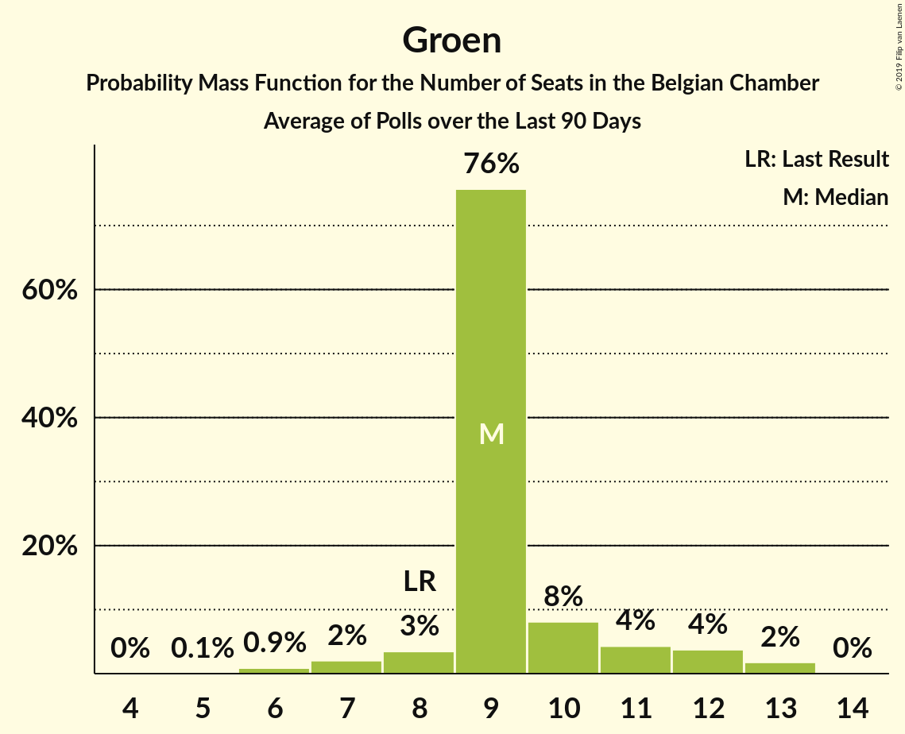

| Number of Seats | Probability | Accumulated | Special Marks |
|:---------------:|:-----------:|:-----------:|:-------------:|
| 6 | 0% | 100% | Last Result |
| 7 | 0% | 100% |  |
| 8 | 0% | 100% |  |
| 9 | 0% | 100% |  |
| 10 | 0.8% | 100% |  |
| 11 | 6% | 99.2% |  |
| 12 | 40% | 93% |  |
| 13 | 15% | 53% | Median |
| 14 | 11% | 38% |  |
| 15 | 14% | 27% |  |
| 16 | 8% | 13% |  |
| 17 | 5% | 5% |  |
| 18 | 0.1% | 0.1% |  |
| 19 | 0% | 0% |  |

### cdH

*For a full overview of the results for this party, see the [cdH](party-cdh.html) page.*

| Number of Seats | Probability | Accumulated | Special Marks |
|:---------------:|:-----------:|:-----------:|:-------------:|
| 3 | 1.2% | 100% |  |
| 4 | 45% | 98.8% |  |
| 5 | 34% | 54% | Median |
| 6 | 17% | 20% |  |
| 7 | 3% | 4% |  |
| 8 | 0.3% | 0.3% |  |
| 9 | 0% | 0% | Last Result |

### Vlaams Belang

*For a full overview of the results for this party, see the [Vlaams Belang](party-vlaamsbelang.html) page.*

| Number of Seats | Probability | Accumulated | Special Marks |
|:---------------:|:-----------:|:-----------:|:-------------:|
| 3 | 0% | 100% | Last Result |
| 4 | 0% | 100% |  |
| 5 | 0.3% | 100% |  |
| 6 | 4% | 99.7% |  |
| 7 | 27% | 96% |  |
| 8 | 44% | 69% | Median |
| 9 | 8% | 25% |  |
| 10 | 5% | 17% |  |
| 11 | 7% | 12% |  |
| 12 | 4% | 5% |  |
| 13 | 0.7% | 0.7% |  |
| 14 | 0% | 0% |  |

### Ecolo

*For a full overview of the results for this party, see the [Ecolo](party-ecolo.html) page.*

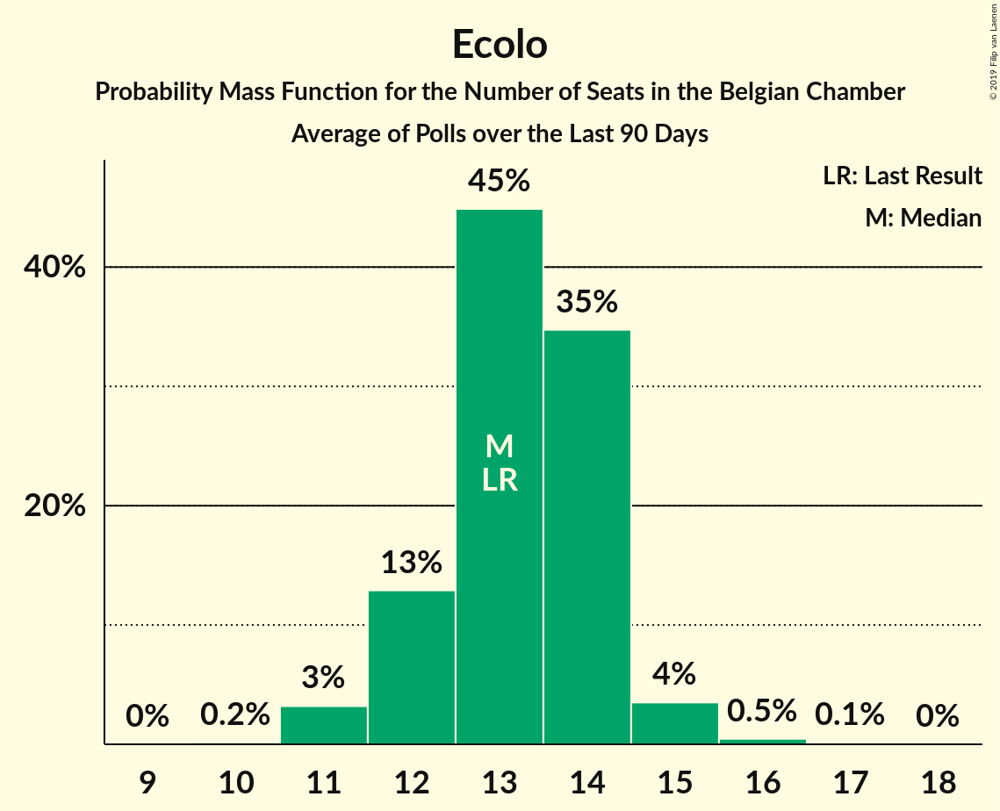

| Number of Seats | Probability | Accumulated | Special Marks |
|:---------------:|:-----------:|:-----------:|:-------------:|
| 6 | 0% | 100% | Last Result |
| 7 | 0% | 100% |  |
| 8 | 0% | 100% |  |
| 9 | 0% | 100% |  |
| 10 | 0.1% | 100% |  |
| 11 | 0.4% | 99.9% |  |
| 12 | 2% | 99.5% |  |
| 13 | 7% | 98% |  |
| 14 | 14% | 91% |  |
| 15 | 16% | 77% |  |
| 16 | 23% | 61% | Median |
| 17 | 25% | 38% |  |
| 18 | 12% | 12% |  |
| 19 | 0.8% | 0.8% |  |
| 20 | 0.1% | 0.1% |  |
| 21 | 0% | 0% |  |

### PTB

*For a full overview of the results for this party, see the [PTB](party-ptb.html) page.*

| Number of Seats | Probability | Accumulated | Special Marks |
|:---------------:|:-----------:|:-----------:|:-------------:|
| 2 | 0% | 100% | Last Result |
| 3 | 0% | 100% |  |
| 4 | 0.6% | 100% |  |
| 5 | 19% | 99.4% |  |
| 6 | 21% | 81% |  |
| 7 | 7% | 60% |  |
| 8 | 4% | 52% | Median |
| 9 | 29% | 48% |  |
| 10 | 17% | 19% |  |
| 11 | 3% | 3% |  |
| 12 | 0% | 0% |  |

### DéFI

*For a full overview of the results for this party, see the [DéFI](party-défi.html) page.*

| Number of Seats | Probability | Accumulated | Special Marks |
|:---------------:|:-----------:|:-----------:|:-------------:|
| 1 | 37% | 100% |  |
| 2 | 53% | 63% | Last Result, Median |
| 3 | 9% | 10% |  |
| 4 | 0.6% | 1.0% |  |
| 5 | 0.3% | 0.4% |  |
| 6 | 0.1% | 0.1% |  |
| 7 | 0% | 0% |  |

### PVDA

*For a full overview of the results for this party, see the [PVDA](party-pvda.html) page.*

| Number of Seats | Probability | Accumulated | Special Marks |
|:---------------:|:-----------:|:-----------:|:-------------:|
| 0 | 0.1% | 100% | Last Result |
| 1 | 20% | 99.9% |  |
| 2 | 28% | 80% |  |
| 3 | 45% | 52% | Median |
| 4 | 5% | 7% |  |
| 5 | 2% | 2% |  |
| 6 | 0.3% | 0.4% |  |
| 7 | 0% | 0% |  |

### Parti Populaire

*For a full overview of the results for this party, see the [Parti Populaire](party-partipopulaire.html) page.*

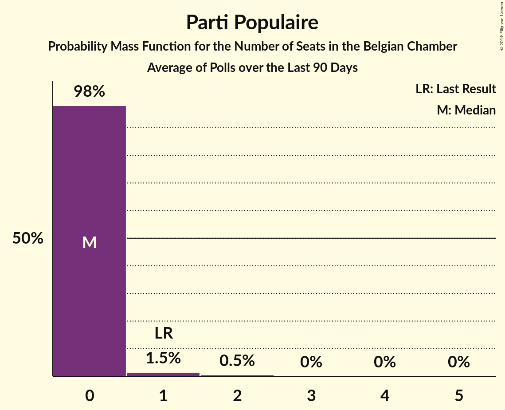

| Number of Seats | Probability | Accumulated | Special Marks |
|:---------------:|:-----------:|:-----------:|:-------------:|
| 0 | 54% | 100% | Median |
| 1 | 9% | 46% | Last Result |
| 2 | 37% | 37% |  |
| 3 | 0% | 0% |  |

### La Droite

*For a full overview of the results for this party, see the [La Droite](party-ladroite.html) page.*

| Number of Seats | Probability | Accumulated | Special Marks |
|:---------------:|:-----------:|:-----------:|:-------------:|
| 0 | 100% | 100% | Last Result, Median |

## Coalitions

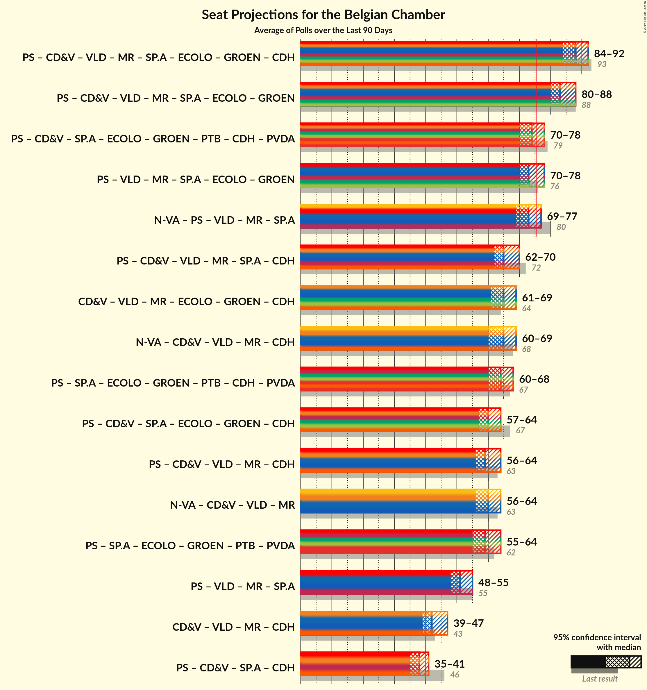

### Confidence Intervals

| Coalition | Last Result | Median | Majority? | 80% Confidence Interval | 90% Confidence Interval | 95% Confidence Interval | 99% Confidence Interval |
|:---------:|:-----------:|:------:|:---------:|:-----------------------:|:-----------------------:|:-----------------------:|:-----------------------:|
| PS – CD&V – Open Vld – MR – sp.a – Groen – cdH – Ecolo | 109 | 102 | 100% | 99–104 | 98–105 | 97–105 | 96–107 |
| PS – CD&V – sp.a – Groen – cdH – Ecolo – PTB – PVDA | 77 | 86 | 100% | 81–90 | 80–91 | 79–92 | 78–94 |
| PS – Open Vld – MR – sp.a – Groen – Ecolo | 82 | 83 | 99.9% | 80–86 | 80–87 | 79–87 | 77–89 |
| N-VA – PS – Open Vld – MR – sp.a | 103 | 82 | 99.7% | 79–84 | 78–85 | 77–86 | 76–87 |
| PS – CD&V – sp.a – Groen – cdH – Ecolo | 75 | 76 | 60% | 73–79 | 72–80 | 71–80 | 70–82 |
| PS – sp.a – Groen – cdH – Ecolo – PTB – PVDA | 59 | 73 | 25% | 67–77 | 66–78 | 66–79 | 64–81 |
| CD&V – Open Vld – MR – Groen – cdH – Ecolo | 73 | 73 | 13% | 70–76 | 69–77 | 69–77 | 68–79 |
| PS – CD&V – Open Vld – MR – sp.a – cdH | 97 | 73 | 8% | 70–75 | 69–76 | 68–77 | 67–78 |
| N-VA – CD&V – Open Vld – MR – cdH | 94 | 71 | 6% | 68–75 | 67–76 | 66–77 | 65–78 |
| PS – sp.a – Groen – Ecolo – PTB – PVDA | 50 | 68 | 1.3% | 62–73 | 61–74 | 60–75 | 59–76 |
| N-VA – CD&V – Open Vld – MR | 85 | 67 | 0% | 64–70 | 63–71 | 62–71 | 60–73 |
| PS – CD&V – Open Vld – MR – cdH | 84 | 62 | 0% | 59–65 | 59–66 | 58–67 | 57–68 |
| PS – Open Vld – MR – sp.a | 70 | 54 | 0% | 52–57 | 51–58 | 50–58 | 49–59 |
| PS – CD&V – sp.a – cdH | 63 | 47 | 0% | 44–49 | 44–50 | 43–51 | 42–52 |
| CD&V – Open Vld – MR – cdH | 61 | 44 | 0% | 41–47 | 40–48 | 40–48 | 39–50 |

### PS – CD&V – Open Vld – MR – sp.a – Groen – cdH – Ecolo

| Number of Seats | Probability | Accumulated | Special Marks |
|:---------------:|:-----------:|:-----------:|:-------------:|
| 94 | 0.1% | 100% |  |
| 95 | 0.2% | 99.9% |  |
| 96 | 0.7% | 99.7% |  |
| 97 | 2% | 99.1% |  |
| 98 | 4% | 97% |  |
| 99 | 8% | 93% |  |
| 100 | 14% | 86% |  |
| 101 | 21% | 72% | Median |
| 102 | 21% | 52% |  |
| 103 | 15% | 31% |  |
| 104 | 9% | 16% |  |
| 105 | 4% | 6% |  |
| 106 | 1.4% | 2% |  |
| 107 | 0.4% | 0.5% |  |
| 108 | 0.1% | 0.1% |  |
| 109 | 0% | 0% | Last Result |

### PS – CD&V – sp.a – Groen – cdH – Ecolo – PTB – PVDA

| Number of Seats | Probability | Accumulated | Special Marks |
|:---------------:|:-----------:|:-----------:|:-------------:|
| 76 | 0.1% | 100% | Majority |
| 77 | 0.3% | 99.9% | Last Result |
| 78 | 0.9% | 99.6% |  |
| 79 | 2% | 98.7% |  |
| 80 | 3% | 97% |  |
| 81 | 5% | 93% |  |
| 82 | 7% | 88% |  |
| 83 | 9% | 81% |  |
| 84 | 9% | 72% |  |
| 85 | 8% | 63% |  |
| 86 | 7% | 55% |  |
| 87 | 8% | 48% | Median |
| 88 | 11% | 40% |  |
| 89 | 10% | 30% |  |
| 90 | 10% | 20% |  |
| 91 | 5% | 10% |  |
| 92 | 3% | 5% |  |
| 93 | 1.3% | 2% |  |
| 94 | 0.6% | 0.9% |  |
| 95 | 0.2% | 0.2% |  |
| 96 | 0% | 0% |  |

### PS – Open Vld – MR – sp.a – Groen – Ecolo

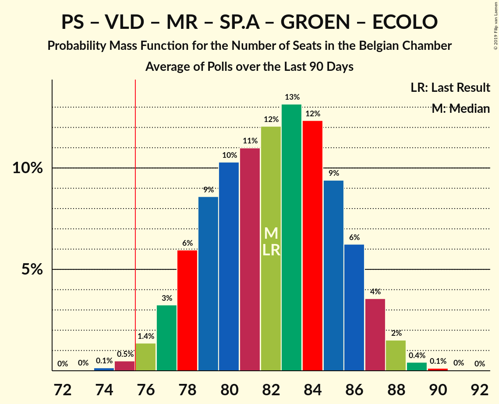

| Number of Seats | Probability | Accumulated | Special Marks |
|:---------------:|:-----------:|:-----------:|:-------------:|
| 75 | 0.1% | 100% |  |
| 76 | 0.2% | 99.9% | Majority |
| 77 | 0.5% | 99.8% |  |
| 78 | 1.3% | 99.3% |  |
| 79 | 3% | 98% |  |
| 80 | 6% | 95% |  |
| 81 | 10% | 89% |  |
| 82 | 16% | 79% | Last Result, Median |
| 83 | 19% | 63% |  |
| 84 | 17% | 44% |  |
| 85 | 12% | 28% |  |
| 86 | 8% | 15% |  |
| 87 | 5% | 7% |  |
| 88 | 2% | 2% |  |
| 89 | 0.4% | 0.6% |  |
| 90 | 0.1% | 0.2% |  |
| 91 | 0% | 0% |  |

### N-VA – PS – Open Vld – MR – sp.a

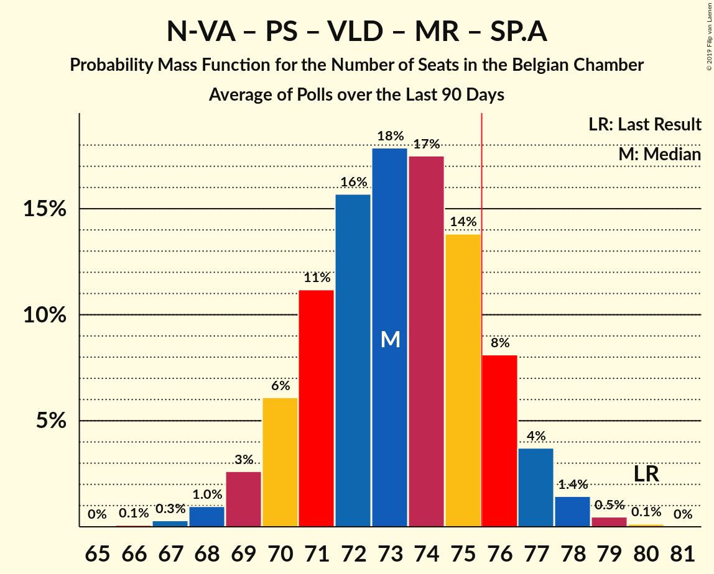

| Number of Seats | Probability | Accumulated | Special Marks |
|:---------------:|:-----------:|:-----------:|:-------------:|
| 74 | 0.1% | 100% |  |
| 75 | 0.2% | 99.9% |  |
| 76 | 0.7% | 99.7% | Majority |
| 77 | 2% | 98.9% |  |
| 78 | 4% | 97% |  |
| 79 | 7% | 93% |  |
| 80 | 12% | 86% |  |
| 81 | 17% | 74% | Median |
| 82 | 20% | 57% |  |
| 83 | 17% | 37% |  |
| 84 | 11% | 20% |  |
| 85 | 6% | 9% |  |
| 86 | 2% | 4% |  |
| 87 | 0.8% | 1.2% |  |
| 88 | 0.3% | 0.4% |  |
| 89 | 0.1% | 0.1% |  |
| 90 | 0% | 0% |  |
| 91 | 0% | 0% |  |
| 92 | 0% | 0% |  |
| 93 | 0% | 0% |  |
| 94 | 0% | 0% |  |
| 95 | 0% | 0% |  |
| 96 | 0% | 0% |  |
| 97 | 0% | 0% |  |
| 98 | 0% | 0% |  |
| 99 | 0% | 0% |  |
| 100 | 0% | 0% |  |
| 101 | 0% | 0% |  |
| 102 | 0% | 0% |  |
| 103 | 0% | 0% | Last Result |

### PS – CD&V – sp.a – Groen – cdH – Ecolo

| Number of Seats | Probability | Accumulated | Special Marks |
|:---------------:|:-----------:|:-----------:|:-------------:|
| 68 | 0.1% | 100% |  |
| 69 | 0.2% | 99.9% |  |
| 70 | 0.7% | 99.7% |  |
| 71 | 2% | 99.0% |  |
| 72 | 4% | 97% |  |
| 73 | 7% | 93% |  |
| 74 | 11% | 86% |  |
| 75 | 15% | 75% | Last Result |
| 76 | 18% | 60% | Median, Majority |
| 77 | 17% | 42% |  |
| 78 | 13% | 25% |  |
| 79 | 7% | 12% |  |
| 80 | 3% | 6% |  |
| 81 | 1.5% | 2% |  |
| 82 | 0.6% | 0.8% |  |
| 83 | 0.1% | 0.2% |  |
| 84 | 0% | 0% |  |

### PS – sp.a – Groen – cdH – Ecolo – PTB – PVDA

| Number of Seats | Probability | Accumulated | Special Marks |
|:---------------:|:-----------:|:-----------:|:-------------:|
| 59 | 0% | 100% | Last Result |
| 60 | 0% | 100% |  |
| 61 | 0% | 100% |  |
| 62 | 0% | 100% |  |
| 63 | 0.2% | 100% |  |
| 64 | 0.6% | 99.8% |  |
| 65 | 1.4% | 99.2% |  |
| 66 | 3% | 98% |  |
| 67 | 5% | 95% |  |
| 68 | 7% | 90% |  |
| 69 | 9% | 83% |  |
| 70 | 9% | 74% |  |
| 71 | 8% | 65% |  |
| 72 | 6% | 57% |  |
| 73 | 6% | 51% | Median |
| 74 | 10% | 45% |  |
| 75 | 10% | 35% |  |
| 76 | 11% | 25% | Majority |
| 77 | 6% | 15% |  |
| 78 | 4% | 8% |  |
| 79 | 2% | 4% |  |
| 80 | 1.2% | 2% |  |
| 81 | 0.6% | 0.7% |  |
| 82 | 0.1% | 0.2% |  |
| 83 | 0% | 0% |  |

### CD&V – Open Vld – MR – Groen – cdH – Ecolo

| Number of Seats | Probability | Accumulated | Special Marks |
|:---------------:|:-----------:|:-----------:|:-------------:|
| 66 | 0.1% | 100% |  |
| 67 | 0.4% | 99.9% |  |
| 68 | 1.4% | 99.5% |  |
| 69 | 4% | 98% |  |
| 70 | 8% | 95% |  |
| 71 | 13% | 86% |  |
| 72 | 17% | 73% |  |
| 73 | 17% | 56% | Last Result, Median |
| 74 | 14% | 39% |  |
| 75 | 11% | 24% |  |
| 76 | 7% | 13% | Majority |
| 77 | 4% | 6% |  |
| 78 | 2% | 2% |  |
| 79 | 0.5% | 0.8% |  |
| 80 | 0.2% | 0.2% |  |
| 81 | 0% | 0.1% |  |
| 82 | 0% | 0% |  |

### PS – CD&V – Open Vld – MR – sp.a – cdH

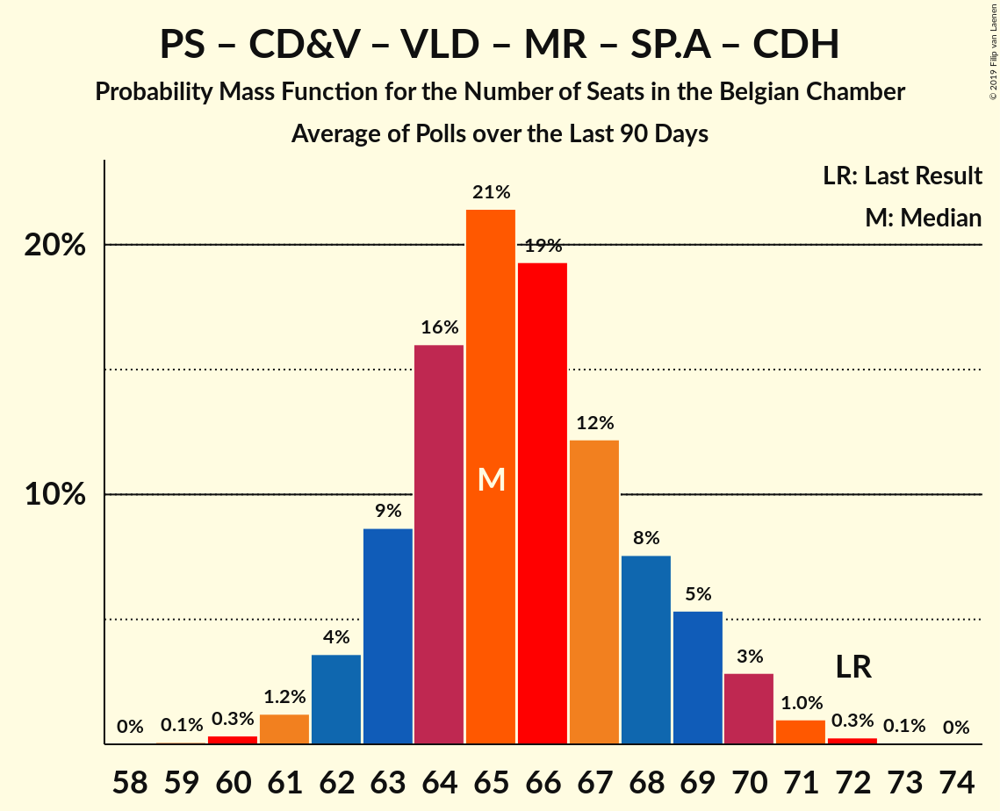

| Number of Seats | Probability | Accumulated | Special Marks |
|:---------------:|:-----------:|:-----------:|:-------------:|
| 65 | 0% | 100% |  |
| 66 | 0.2% | 99.9% |  |
| 67 | 0.7% | 99.8% |  |
| 68 | 2% | 99.1% |  |
| 69 | 5% | 97% |  |
| 70 | 9% | 92% |  |
| 71 | 14% | 82% |  |
| 72 | 18% | 69% | Median |
| 73 | 19% | 50% |  |
| 74 | 14% | 31% |  |
| 75 | 9% | 17% |  |
| 76 | 5% | 8% | Majority |
| 77 | 2% | 3% |  |
| 78 | 0.7% | 1.1% |  |
| 79 | 0.2% | 0.4% |  |
| 80 | 0.1% | 0.1% |  |
| 81 | 0% | 0% |  |
| 82 | 0% | 0% |  |
| 83 | 0% | 0% |  |
| 84 | 0% | 0% |  |
| 85 | 0% | 0% |  |
| 86 | 0% | 0% |  |
| 87 | 0% | 0% |  |
| 88 | 0% | 0% |  |
| 89 | 0% | 0% |  |
| 90 | 0% | 0% |  |
| 91 | 0% | 0% |  |
| 92 | 0% | 0% |  |
| 93 | 0% | 0% |  |
| 94 | 0% | 0% |  |
| 95 | 0% | 0% |  |
| 96 | 0% | 0% |  |
| 97 | 0% | 0% | Last Result |

### N-VA – CD&V – Open Vld – MR – cdH

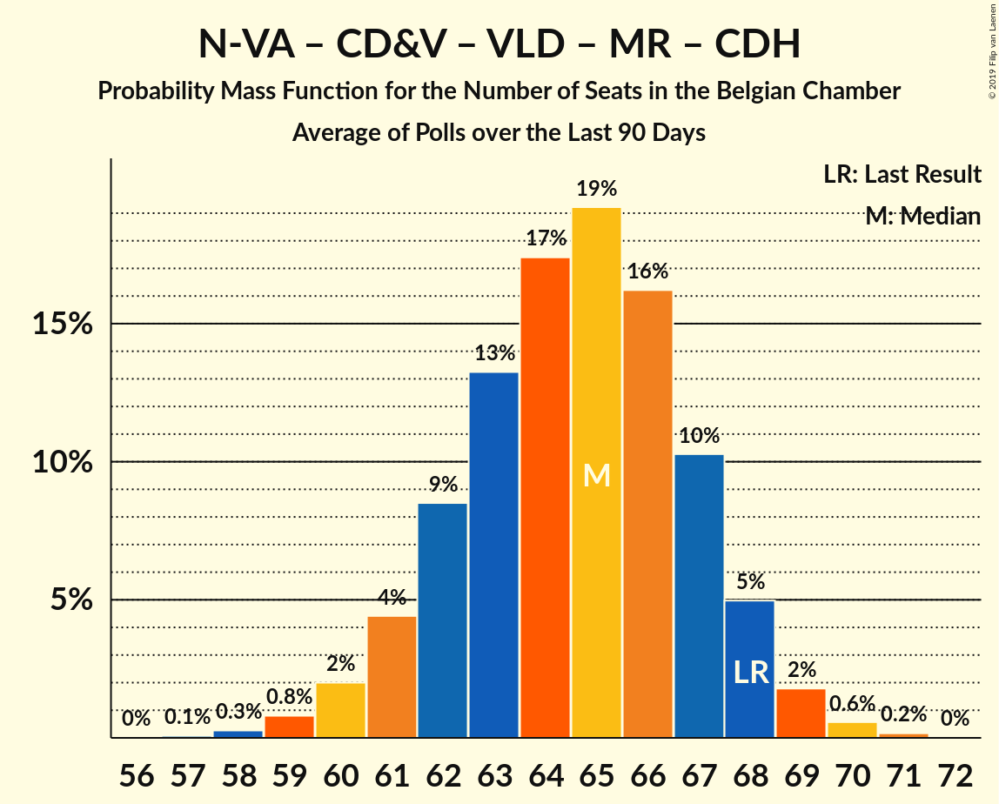

| Number of Seats | Probability | Accumulated | Special Marks |
|:---------------:|:-----------:|:-----------:|:-------------:|
| 63 | 0% | 100% |  |
| 64 | 0.3% | 99.9% |  |
| 65 | 0.8% | 99.7% |  |
| 66 | 2% | 98.9% |  |
| 67 | 3% | 97% |  |
| 68 | 5% | 94% |  |
| 69 | 9% | 89% |  |
| 70 | 14% | 80% |  |
| 71 | 17% | 66% |  |
| 72 | 16% | 49% | Median |
| 73 | 13% | 34% |  |
| 74 | 9% | 21% |  |
| 75 | 6% | 12% |  |
| 76 | 3% | 6% | Majority |
| 77 | 2% | 3% |  |
| 78 | 0.7% | 1.0% |  |
| 79 | 0.2% | 0.3% |  |
| 80 | 0.1% | 0.1% |  |
| 81 | 0% | 0% |  |
| 82 | 0% | 0% |  |
| 83 | 0% | 0% |  |
| 84 | 0% | 0% |  |
| 85 | 0% | 0% |  |
| 86 | 0% | 0% |  |
| 87 | 0% | 0% |  |
| 88 | 0% | 0% |  |
| 89 | 0% | 0% |  |
| 90 | 0% | 0% |  |
| 91 | 0% | 0% |  |
| 92 | 0% | 0% |  |
| 93 | 0% | 0% |  |
| 94 | 0% | 0% | Last Result |

### PS – sp.a – Groen – Ecolo – PTB – PVDA

| Number of Seats | Probability | Accumulated | Special Marks |
|:---------------:|:-----------:|:-----------:|:-------------:|
| 50 | 0% | 100% | Last Result |
| 51 | 0% | 100% |  |
| 52 | 0% | 100% |  |
| 53 | 0% | 100% |  |
| 54 | 0% | 100% |  |
| 55 | 0% | 100% |  |
| 56 | 0% | 100% |  |
| 57 | 0.1% | 100% |  |
| 58 | 0.2% | 99.9% |  |
| 59 | 0.7% | 99.7% |  |
| 60 | 2% | 99.0% |  |
| 61 | 3% | 97% |  |
| 62 | 5% | 94% |  |
| 63 | 7% | 89% |  |
| 64 | 9% | 82% |  |
| 65 | 8% | 73% |  |
| 66 | 7% | 65% |  |
| 67 | 6% | 58% |  |
| 68 | 6% | 52% | Median |
| 69 | 7% | 47% |  |
| 70 | 10% | 39% |  |
| 71 | 10% | 30% |  |
| 72 | 8% | 20% |  |
| 73 | 5% | 12% |  |
| 74 | 3% | 6% |  |
| 75 | 2% | 3% |  |
| 76 | 0.9% | 1.3% | Majority |
| 77 | 0.3% | 0.4% |  |
| 78 | 0.1% | 0.1% |  |
| 79 | 0% | 0% |  |

### N-VA – CD&V – Open Vld – MR

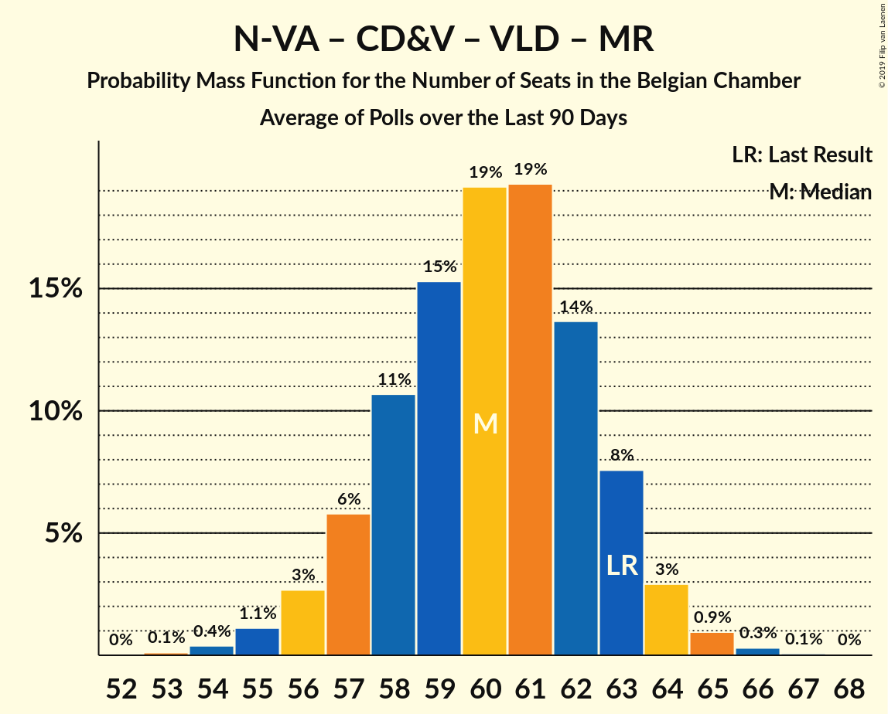

| Number of Seats | Probability | Accumulated | Special Marks |
|:---------------:|:-----------:|:-----------:|:-------------:|
| 59 | 0.1% | 100% |  |
| 60 | 0.4% | 99.9% |  |
| 61 | 1.2% | 99.5% |  |
| 62 | 2% | 98% |  |
| 63 | 4% | 96% |  |
| 64 | 7% | 92% |  |
| 65 | 12% | 84% |  |
| 66 | 18% | 72% |  |
| 67 | 18% | 54% | Median |
| 68 | 15% | 36% |  |
| 69 | 10% | 22% |  |
| 70 | 6% | 11% |  |
| 71 | 3% | 5% |  |
| 72 | 1.4% | 2% |  |
| 73 | 0.5% | 0.7% |  |
| 74 | 0.1% | 0.2% |  |
| 75 | 0% | 0% |  |
| 76 | 0% | 0% | Majority |
| 77 | 0% | 0% |  |
| 78 | 0% | 0% |  |
| 79 | 0% | 0% |  |
| 80 | 0% | 0% |  |
| 81 | 0% | 0% |  |
| 82 | 0% | 0% |  |
| 83 | 0% | 0% |  |
| 84 | 0% | 0% |  |
| 85 | 0% | 0% | Last Result |

### PS – CD&V – Open Vld – MR – cdH

| Number of Seats | Probability | Accumulated | Special Marks |
|:---------------:|:-----------:|:-----------:|:-------------:|
| 56 | 0.2% | 100% |  |
| 57 | 1.0% | 99.8% |  |
| 58 | 3% | 98.8% |  |
| 59 | 6% | 96% |  |
| 60 | 12% | 89% |  |
| 61 | 17% | 77% |  |
| 62 | 20% | 60% | Median |
| 63 | 15% | 40% |  |
| 64 | 12% | 26% |  |
| 65 | 7% | 14% |  |
| 66 | 4% | 7% |  |
| 67 | 2% | 3% |  |
| 68 | 0.7% | 1.1% |  |
| 69 | 0.3% | 0.4% |  |
| 70 | 0.1% | 0.1% |  |
| 71 | 0% | 0% |  |
| 72 | 0% | 0% |  |
| 73 | 0% | 0% |  |
| 74 | 0% | 0% |  |
| 75 | 0% | 0% |  |
| 76 | 0% | 0% | Majority |
| 77 | 0% | 0% |  |
| 78 | 0% | 0% |  |
| 79 | 0% | 0% |  |
| 80 | 0% | 0% |  |
| 81 | 0% | 0% |  |
| 82 | 0% | 0% |  |
| 83 | 0% | 0% |  |
| 84 | 0% | 0% | Last Result |

### PS – Open Vld – MR – sp.a

| Number of Seats | Probability | Accumulated | Special Marks |
|:---------------:|:-----------:|:-----------:|:-------------:|
| 47 | 0.1% | 100% |  |
| 48 | 0.2% | 99.9% |  |
| 49 | 0.7% | 99.7% |  |
| 50 | 2% | 99.0% |  |
| 51 | 5% | 97% |  |
| 52 | 11% | 91% |  |
| 53 | 18% | 80% | Median |
| 54 | 21% | 63% |  |
| 55 | 18% | 42% |  |
| 56 | 12% | 24% |  |
| 57 | 7% | 12% |  |
| 58 | 4% | 5% |  |
| 59 | 1.2% | 2% |  |
| 60 | 0.3% | 0.4% |  |
| 61 | 0.1% | 0.1% |  |
| 62 | 0% | 0% |  |
| 63 | 0% | 0% |  |
| 64 | 0% | 0% |  |
| 65 | 0% | 0% |  |
| 66 | 0% | 0% |  |
| 67 | 0% | 0% |  |
| 68 | 0% | 0% |  |
| 69 | 0% | 0% |  |
| 70 | 0% | 0% | Last Result |

### PS – CD&V – sp.a – cdH

| Number of Seats | Probability | Accumulated | Special Marks |
|:---------------:|:-----------:|:-----------:|:-------------:|
| 40 | 0.1% | 100% |  |
| 41 | 0.2% | 99.9% |  |
| 42 | 1.0% | 99.7% |  |
| 43 | 3% | 98.7% |  |
| 44 | 7% | 96% |  |
| 45 | 13% | 89% |  |
| 46 | 17% | 76% |  |
| 47 | 19% | 59% | Median |
| 48 | 18% | 40% |  |
| 49 | 12% | 22% |  |
| 50 | 6% | 10% |  |
| 51 | 3% | 4% |  |
| 52 | 0.8% | 1.0% |  |
| 53 | 0.2% | 0.3% |  |
| 54 | 0% | 0.1% |  |
| 55 | 0% | 0% |  |
| 56 | 0% | 0% |  |
| 57 | 0% | 0% |  |
| 58 | 0% | 0% |  |
| 59 | 0% | 0% |  |
| 60 | 0% | 0% |  |
| 61 | 0% | 0% |  |
| 62 | 0% | 0% |  |
| 63 | 0% | 0% | Last Result |

### CD&V – Open Vld – MR – cdH

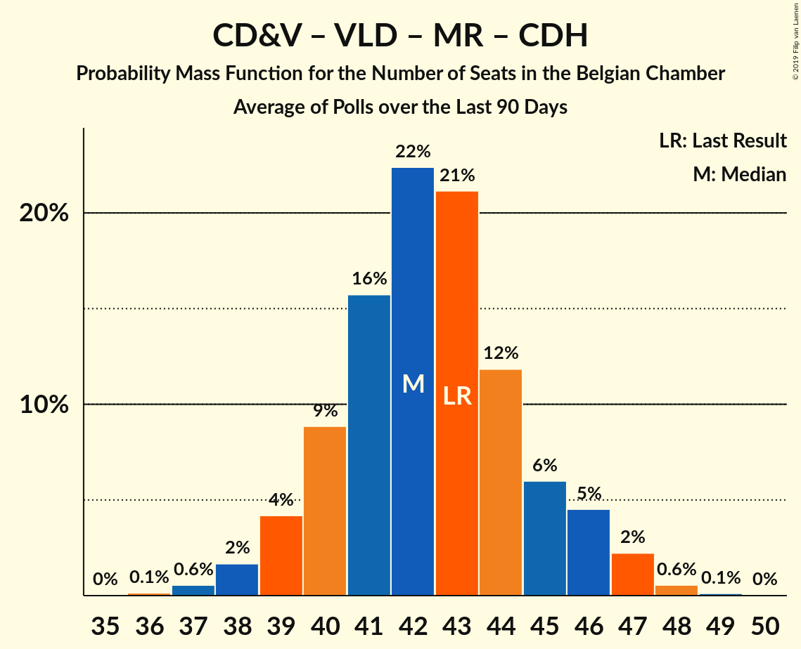

| Number of Seats | Probability | Accumulated | Special Marks |
|:---------------:|:-----------:|:-----------:|:-------------:|
| 37 | 0.1% | 100% |  |
| 38 | 0.3% | 99.9% |  |
| 39 | 1.3% | 99.6% |  |
| 40 | 4% | 98% |  |
| 41 | 8% | 94% |  |
| 42 | 14% | 87% |  |
| 43 | 18% | 73% |  |
| 44 | 17% | 55% | Median |
| 45 | 15% | 38% |  |
| 46 | 11% | 23% |  |
| 47 | 7% | 12% |  |
| 48 | 3% | 5% |  |
| 49 | 1.4% | 2% |  |
| 50 | 0.5% | 0.7% |  |
| 51 | 0.2% | 0.2% |  |
| 52 | 0% | 0.1% |  |
| 53 | 0% | 0% |  |
| 54 | 0% | 0% |  |
| 55 | 0% | 0% |  |
| 56 | 0% | 0% |  |
| 57 | 0% | 0% |  |
| 58 | 0% | 0% |  |
| 59 | 0% | 0% |  |
| 60 | 0% | 0% |  |
| 61 | 0% | 0% | Last Result |

## Technical Information

+ **Number of polls included in this average:** 2
+ **Lowest number of simulations done in a poll included in this average:** 131,072
+ **Total number of simulations done in the polls included in this average:** 1,179,648
+ **Error estimate:** 1.94%
