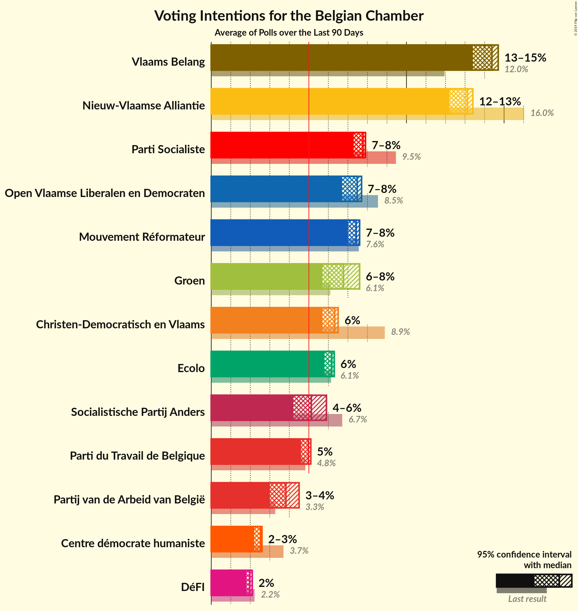
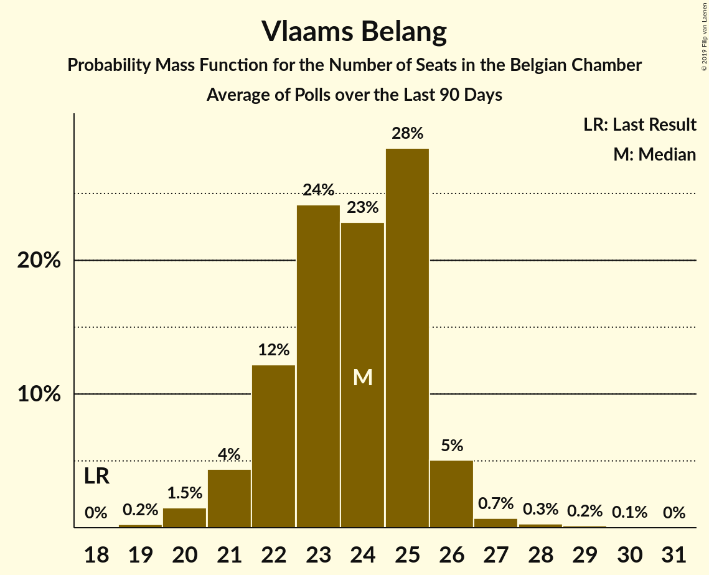

# Poll Average

<a href="#voting-intentions">Voting Intentions</a> | <a href="#seats">Seats</a> | <a href="#coalitions">Coalitions</a> | <a href="#technical-information">Technical Information</a>

## Summary

The table below lists the polls on which the average is based. They are the most recent polls (less than 90 days old) registered and analyzed so far.

| Period     | Polling firm/Commissioner(s) | N-VA | VB | PS | CD&V | PTB | PVDA | VLD | MR | SP.A | ECOLO | GROEN | CDH | DÉFI |
|:----------:|:----------------------------:|:--:|:--:|:--:|:--:|:--:|:--:|:--:|:--:|:--:|:--:|:--:|:--:|:--:|
| 26 May 2019 | General Election | 16.0%   25 | 12.0%   18 | 9.5%   20 | 8.9%   12 | 4.8%   9 | 3.3%   3 | 8.5%   12 | 7.6%   14 | 6.7%   9 | 6.1%   13 | 6.1%   8 | 3.7%   5 | 2.2%   2 |
| N/A | Poll Average | 12–13%   0 | 13–15%   20–24 | 7–8%   0 | 6%   0 | 5%   0 | 3–4%   0 | 7–8%   0 | 7–8%   0 | 4–5%   0 | 6%   4 | 6–8%   9–10 | 2–3%   0 | 2%   1 |
| [2–10 September 2019](2019-09-10-Ipsos.html) | Ipsos   Het Laatste Nieuws, Le Soir, RTL TVi and VTM | 12–13%   0 | 13–15%   20–24 | 7–8%   0 | 6%   0 | 5%   0 | 3–4%   0 | 7–8%   0 | 7–8%   0 | 4–5%   0 | 6%   4 | 6–8%   9–10 | 2–3%   0 | 2%   1 |
| 26 May 2019 | General Election | 16.0%   25 | 12.0%   18 | 9.5%   20 | 8.9%   12 | 4.8%   9 | 3.3%   3 | 8.5%   12 | 7.6%   14 | 6.7%   9 | 6.1%   13 | 6.1%   8 | 3.7%   5 | 2.2%   2 |

Only polls for which at least the sample size has been published are included in the table above.

**Legend:**
+ **Top half of each row:** Voting intentions (95% confidence interval)
+ **Bottom half of each row:** Seat projections for the Belgian Chamber (95% confidence interval)
+ **N-VA:** N-VA
+ **VB:** Vlaams Belang
+ **PS:** PS
+ **CD&V:** CD&V
+ **PTB:** PTB
+ **PVDA:** PVDA
+ **VLD:** Open Vld
+ **MR:** MR
+ **SP.A:** sp.a
+ **ECOLO:** Ecolo
+ **GROEN:** Groen
+ **CDH:** cdH
+ **DÉFI:** DéFI
+ **N/A (single party):** Party not included the published results
+ **N/A (entire row):** Calculation for this opinion poll not started yet

## Voting Intentions

### Confidence Intervals

| Party | Last Result | Median | 80% Confidence Interval | 90% Confidence Interval | 95% Confidence Interval | 99% Confidence Interval |
|:-----:|:-----------:|:------:|:-----------------------:|:-----------------------:|:-----------------------:|:-----------------------:|
| <a href="#n-va">N-VA</a> | 16.0% | 13.1% | 12.6–13.4% |12.4–13.4% | 12.2–13.4% | 11.8–13.4% |
| <a href="#vlaams-belang">Vlaams Belang</a> | 12.0% | 14.4% | 13.8–14.6% |13.6–14.6% | 13.4–14.7% | 13.0–14.7% |
| <a href="#ps">PS</a> | 9.5% | 7.7% | 7.5–7.9% |7.4–7.9% | 7.3–7.9% | 7.1–7.9% |
| <a href="#cd&v">CD&V</a> | 8.9% | 6.3% | 5.9–6.5% |5.8–6.5% | 5.7–6.5% | 5.4–6.5% |
| <a href="#open-vld">Open Vld</a> | 8.5% | 7.5% | 7.0–7.7% |6.9–7.7% | 6.7–7.7% | 6.4–7.7% |
| <a href="#mr">MR</a> | 7.6% | 7.4% | 7.2–7.6% |7.1–7.6% | 7.0–7.6% | 6.8–7.6% |
| <a href="#sp.a">sp.a</a> | 6.7% | 4.5% | 4.2–4.7% |4.1–4.7% | 3.9–4.7% | 3.7–4.7% |
| <a href="#ecolo">Ecolo</a> | 6.1% | 6.1% | 5.9–6.3% |5.8–6.3% | 5.8–6.3% | 5.6–6.3% |
| <a href="#groen">Groen</a> | 6.1% | 6.8% | 6.0–7.4% |5.8–7.5% | 5.7–7.6% | 5.3–7.6% |
| <a href="#ptb">PTB</a> | 4.8% | 5.0% | 4.7–5.1% |4.7–5.1% | 4.6–5.1% | 4.4–5.1% |
| <a href="#cdh">cdH</a> | 3.7% | 2.5% | 2.4–2.6% |2.3–2.6% | 2.2–2.6% | 2.1–2.6% |
| <a href="#pvda">PVDA</a> | 3.3% | 3.8% | 3.3–4.3% |3.1–4.4% | 3.0–4.5% | 2.8–4.5% |
| <a href="#défi">DéFI</a> | 2.2% | 2.0% | 1.9–2.1% |1.8–2.1% | 1.8–2.1% | 1.7–2.1% |

### N-VA

*For a full overview of the results for this party, see the [N-VA](party-n-va.html) page.*

| Voting Intentions | Probability | Accumulated | Special Marks |
|:-----------------:|:-----------:|:-----------:|:-------------:|
| 9.5–10.5% | 0% | 100% |  |
| 10.5–11.5% | 0.1% | 100% |  |
| 11.5–12.5% | 9% | 99.9% |  |
| 12.5–13.5% | 100% | 91% | Median |
| 13.5–14.5% | 100% | 0% |  |
| 14.5–15.5% | 100% | 0% |  |
| 15.5–16.5% | 51% | 0% | Last Result |
| 16.5–17.5% | 3% | 0% |  |

### Vlaams Belang

*For a full overview of the results for this party, see the [Vlaams Belang](party-vlaamsbelang.html) page.*

| Voting Intentions | Probability | Accumulated | Special Marks |
|:-----------------:|:-----------:|:-----------:|:-------------:|
| 11.5–12.5% | 0.1% | 100% | Last Result |
| 12.5–13.5% | 4% | 99.9% |  |
| 13.5–14.5% | 74% | 95% | Median |
| 14.5–15.5% | 100% | 22% |  |
| 15.5–16.5% | 100% | 0% |  |
| 16.5–17.5% | 94% | 0% |  |
| 17.5–18.5% | 9% | 0% |  |
| 18.5–19.5% | 0.3% | 0% |  |

### PS

*For a full overview of the results for this party, see the [PS](party-ps.html) page.*

| Voting Intentions | Probability | Accumulated | Special Marks |
|:-----------------:|:-----------:|:-----------:|:-------------:|
| 5.5–6.5% | 0% | 100% |  |
| 6.5–7.5% | 18% | 100% |  |
| 7.5–8.5% | 100% | 82% | Median |
| 8.5–9.5% | 100% | 0% | Last Result |
| 9.5–10.5% | 8% | 0% |  |

### CD&V

*For a full overview of the results for this party, see the [CD&V](party-cdv.html) page.*

| Voting Intentions | Probability | Accumulated | Special Marks |
|:-----------------:|:-----------:|:-----------:|:-------------:|
| 3.5–4.5% | 0% | 100% |  |
| 4.5–5.5% | 1.4% | 100% |  |
| 5.5–6.5% | 100% | 98.6% | Median |
| 6.5–7.5% | 100% | 0% |  |
| 7.5–8.5% | 100% | 0% |  |
| 8.5–9.5% | 24% | 0% | Last Result |
| 9.5–10.5% | 0.4% | 0% |  |

### Open Vld

*For a full overview of the results for this party, see the [Open Vld](party-openvld.html) page.*

| Voting Intentions | Probability | Accumulated | Special Marks |
|:-----------------:|:-----------:|:-----------:|:-------------:|
| 4.5–5.5% | 0% | 100% |  |
| 5.5–6.5% | 0.9% | 100% |  |
| 6.5–7.5% | 64% | 99.1% | Median |
| 7.5–8.5% | 100% | 35% |  |
| 8.5–9.5% | 100% | 0% | Last Result |
| 9.5–10.5% | 38% | 0% |  |
| 10.5–11.5% | 1.1% | 0% |  |

### MR

*For a full overview of the results for this party, see the [MR](party-mr.html) page.*

| Voting Intentions | Probability | Accumulated | Special Marks |
|:-----------------:|:-----------:|:-----------:|:-------------:|
| 5.5–6.5% | 0% | 100% |  |
| 6.5–7.5% | 85% | 100% | Median |
| 7.5–8.5% | 100% | 15% | Last Result |
| 8.5–9.5% | 100% | 0% |  |
| 9.5–10.5% | 1.0% | 0% |  |

### sp.a

*For a full overview of the results for this party, see the [sp.a](party-spa.html) page.*

| Voting Intentions | Probability | Accumulated | Special Marks |
|:-----------------:|:-----------:|:-----------:|:-------------:|
| 2.5–3.5% | 0.1% | 100% |  |
| 3.5–4.5% | 57% | 99.9% |  |
| 4.5–5.5% | 100% | 43% | Median |
| 5.5–6.5% | 100% | 0% |  |
| 6.5–7.5% | 11% | 0% | Last Result |

### Ecolo

*For a full overview of the results for this party, see the [Ecolo](party-ecolo.html) page.*

| Voting Intentions | Probability | Accumulated | Special Marks |
|:-----------------:|:-----------:|:-----------:|:-------------:|
| 3.5–4.5% | 0% | 100% |  |
| 4.5–5.5% | 0.3% | 100% |  |
| 5.5–6.5% | 100% | 99.7% | Last Result, Median |
| 6.5–7.5% | 100% | 0% |  |
| 7.5–8.5% | 39% | 0% |  |

### Groen

*For a full overview of the results for this party, see the [Groen](party-groen.html) page.*

| Voting Intentions | Probability | Accumulated | Special Marks |
|:-----------------:|:-----------:|:-----------:|:-------------:|
| 3.5–4.5% | 0% | 100% |  |
| 4.5–5.5% | 1.5% | 100% |  |
| 5.5–6.5% | 33% | 98.5% | Last Result |
| 6.5–7.5% | 62% | 65% | Median |
| 7.5–8.5% | 14% | 3% |  |
| 8.5–9.5% | 0.5% | 0% |  |

### PTB

*For a full overview of the results for this party, see the [PTB](party-ptb.html) page.*

| Voting Intentions | Probability | Accumulated | Special Marks |
|:-----------------:|:-----------:|:-----------:|:-------------:|
| 2.5–3.5% | 0% | 100% |  |
| 3.5–4.5% | 2% | 100% |  |
| 4.5–5.5% | 100% | 98% | Last Result, Median |
| 5.5–6.5% | 100% | 0% |  |
| 6.5–7.5% | 8% | 0% |  |

### cdH

*For a full overview of the results for this party, see the [cdH](party-cdh.html) page.*

| Voting Intentions | Probability | Accumulated | Special Marks |
|:-----------------:|:-----------:|:-----------:|:-------------:|
| 0.5–1.5% | 0% | 100% |  |
| 1.5–2.5% | 63% | 100% |  |
| 2.5–3.5% | 100% | 37% | Median |
| 3.5–4.5% | 33% | 0% | Last Result |

### PVDA

*For a full overview of the results for this party, see the [PVDA](party-pvda.html) page.*

| Voting Intentions | Probability | Accumulated | Special Marks |
|:-----------------:|:-----------:|:-----------:|:-------------:|
| 1.5–2.5% | 0.1% | 100% |  |
| 2.5–3.5% | 27% | 99.9% | Last Result |
| 3.5–4.5% | 75% | 73% | Median |
| 4.5–5.5% | 10% | 0% |  |
| 5.5–6.5% | 0.1% | 0% |  |

### DéFI

*For a full overview of the results for this party, see the [DéFI](party-défi.html) page.*

| Voting Intentions | Probability | Accumulated | Special Marks |
|:-----------------:|:-----------:|:-----------:|:-------------:|
| 0.5–1.5% | 0% | 100% |  |
| 1.5–2.5% | 100% | 100% | Last Result, Median |
| 2.5–3.5% | 100% | 0% |  |

## Seats

### Confidence Intervals

| Party | Last Result | Median | 80% Confidence Interval | 90% Confidence Interval | 95% Confidence Interval | 99% Confidence Interval |
|:-----:|:-----------:|:------:|:-----------------------:|:-----------------------:|:-----------------------:|:-----------------------:|
| <a href="#n-va">N-VA</a> | 25 | 0 | 0 |0 | 0 | 0 |
| <a href="#vlaams-belang">Vlaams Belang</a> | 18 | 23 | 20–24 |20–24 | 20–24 | 20–24 |
| <a href="#ps">PS</a> | 20 | 0 | 0 |0 | 0 | 0 |
| <a href="#cd&v">CD&V</a> | 12 | 0 | 0 |0 | 0 | 0 |
| <a href="#open-vld">Open Vld</a> | 12 | 0 | 0 |0 | 0 | 0 |
| <a href="#mr">MR</a> | 14 | 0 | 0 |0 | 0 | 0 |
| <a href="#sp.a">sp.a</a> | 9 | 0 | 0 |0 | 0 | 0 |
| <a href="#ecolo">Ecolo</a> | 13 | 4 | 4 |4 | 4 | 4 |
| <a href="#groen">Groen</a> | 8 | 9 | 9–10 |9–10 | 9–10 | 7–10 |
| <a href="#ptb">PTB</a> | 9 | 0 | 0 |0 | 0 | 0 |
| <a href="#cdh">cdH</a> | 5 | 0 | 0 |0 | 0 | 0 |
| <a href="#pvda">PVDA</a> | 3 | 0 | 0 |0 | 0 | 0 |
| <a href="#défi">DéFI</a> | 2 | 1 | 1 |1 | 1 | 1 |

### N-VA

*For a full overview of the results for this party, see the [N-VA](party-n-va.html) page.*

| Number of Seats | Probability | Accumulated | Special Marks |
|:---------------:|:-----------:|:-----------:|:-------------:|
| 0 | 100% | 100% | Median |
| 1 | 0% | 0% |  |
| 2 | 0% | 0% |  |
| 3 | 0% | 0% |  |
| 4 | 0% | 0% |  |
| 5 | 0% | 0% |  |
| 6 | 0% | 0% |  |
| 7 | 0% | 0% |  |
| 8 | 0% | 0% |  |
| 9 | 0% | 0% |  |
| 10 | 0% | 0% |  |
| 11 | 0% | 0% |  |
| 12 | 0% | 0% |  |
| 13 | 0% | 0% |  |
| 14 | 0% | 0% |  |
| 15 | 0% | 0% |  |
| 16 | 0% | 0% |  |
| 17 | 0% | 0% |  |
| 18 | 0% | 0% |  |
| 19 | 0% | 0% |  |
| 20 | 0% | 0% |  |
| 21 | 0% | 0% |  |
| 22 | 0% | 0% |  |
| 23 | 0% | 0% |  |
| 24 | 0% | 0% |  |
| 25 | 0% | 0% | Last Result |

### Vlaams Belang

*For a full overview of the results for this party, see the [Vlaams Belang](party-vlaamsbelang.html) page.*

| Number of Seats | Probability | Accumulated | Special Marks |
|:---------------:|:-----------:|:-----------:|:-------------:|
| 18 | 0% | 100% | Last Result |
| 19 | 0% | 100% |  |
| 20 | 14% | 100% |  |
| 21 | 28% | 86% |  |
| 22 | 0.7% | 58% |  |
| 23 | 47% | 57% | Median |
| 24 | 10% | 10% |  |
| 25 | 0.3% | 0.4% |  |
| 26 | 0% | 0% |  |

### PS

*For a full overview of the results for this party, see the [PS](party-ps.html) page.*

| Number of Seats | Probability | Accumulated | Special Marks |
|:---------------:|:-----------:|:-----------:|:-------------:|
| 0 | 100% | 100% | Median |
| 1 | 0% | 0% |  |
| 2 | 0% | 0% |  |
| 3 | 0% | 0% |  |
| 4 | 0% | 0% |  |
| 5 | 0% | 0% |  |
| 6 | 0% | 0% |  |
| 7 | 0% | 0% |  |
| 8 | 0% | 0% |  |
| 9 | 0% | 0% |  |
| 10 | 0% | 0% |  |
| 11 | 0% | 0% |  |
| 12 | 0% | 0% |  |
| 13 | 0% | 0% |  |
| 14 | 0% | 0% |  |
| 15 | 0% | 0% |  |
| 16 | 0% | 0% |  |
| 17 | 0% | 0% |  |
| 18 | 0% | 0% |  |
| 19 | 0% | 0% |  |
| 20 | 0% | 0% | Last Result |

### CD&V

*For a full overview of the results for this party, see the [CD&V](party-cdv.html) page.*

| Number of Seats | Probability | Accumulated | Special Marks |
|:---------------:|:-----------:|:-----------:|:-------------:|
| 0 | 100% | 100% | Median |
| 1 | 0% | 0% |  |
| 2 | 0% | 0% |  |
| 3 | 0% | 0% |  |
| 4 | 0% | 0% |  |
| 5 | 0% | 0% |  |
| 6 | 0% | 0% |  |
| 7 | 0% | 0% |  |
| 8 | 0% | 0% |  |
| 9 | 0% | 0% |  |
| 10 | 0% | 0% |  |
| 11 | 0% | 0% |  |
| 12 | 0% | 0% | Last Result |

### Open Vld

*For a full overview of the results for this party, see the [Open Vld](party-openvld.html) page.*

| Number of Seats | Probability | Accumulated | Special Marks |
|:---------------:|:-----------:|:-----------:|:-------------:|
| 0 | 100% | 100% | Median |
| 1 | 0% | 0% |  |
| 2 | 0% | 0% |  |
| 3 | 0% | 0% |  |
| 4 | 0% | 0% |  |
| 5 | 0% | 0% |  |
| 6 | 0% | 0% |  |
| 7 | 0% | 0% |  |
| 8 | 0% | 0% |  |
| 9 | 0% | 0% |  |
| 10 | 0% | 0% |  |
| 11 | 0% | 0% |  |
| 12 | 0% | 0% | Last Result |

### MR

*For a full overview of the results for this party, see the [MR](party-mr.html) page.*

| Number of Seats | Probability | Accumulated | Special Marks |
|:---------------:|:-----------:|:-----------:|:-------------:|
| 0 | 100% | 100% | Median |
| 1 | 0% | 0% |  |
| 2 | 0% | 0% |  |
| 3 | 0% | 0% |  |
| 4 | 0% | 0% |  |
| 5 | 0% | 0% |  |
| 6 | 0% | 0% |  |
| 7 | 0% | 0% |  |
| 8 | 0% | 0% |  |
| 9 | 0% | 0% |  |
| 10 | 0% | 0% |  |
| 11 | 0% | 0% |  |
| 12 | 0% | 0% |  |
| 13 | 0% | 0% |  |
| 14 | 0% | 0% | Last Result |

### sp.a

*For a full overview of the results for this party, see the [sp.a](party-spa.html) page.*

| Number of Seats | Probability | Accumulated | Special Marks |
|:---------------:|:-----------:|:-----------:|:-------------:|
| 0 | 100% | 100% | Median |
| 1 | 0% | 0% |  |
| 2 | 0% | 0% |  |
| 3 | 0% | 0% |  |
| 4 | 0% | 0% |  |
| 5 | 0% | 0% |  |
| 6 | 0% | 0% |  |
| 7 | 0% | 0% |  |
| 8 | 0% | 0% |  |
| 9 | 0% | 0% | Last Result |

### Ecolo

*For a full overview of the results for this party, see the [Ecolo](party-ecolo.html) page.*

| Number of Seats | Probability | Accumulated | Special Marks |
|:---------------:|:-----------:|:-----------:|:-------------:|
| 3 | 0.1% | 100% |  |
| 4 | 99.7% | 99.9% | Median |
| 5 | 0.2% | 0.2% |  |
| 6 | 0% | 0% |  |
| 7 | 0% | 0% |  |
| 8 | 0% | 0% |  |
| 9 | 0% | 0% |  |
| 10 | 0% | 0% |  |
| 11 | 0% | 0% |  |
| 12 | 0% | 0% |  |
| 13 | 0% | 0% | Last Result |

### Groen

*For a full overview of the results for this party, see the [Groen](party-groen.html) page.*

| Number of Seats | Probability | Accumulated | Special Marks |
|:---------------:|:-----------:|:-----------:|:-------------:|
| 6 | 0% | 100% |  |
| 7 | 0.6% | 99.9% |  |
| 8 | 0.7% | 99.3% | Last Result |
| 9 | 71% | 98.6% | Median |
| 10 | 27% | 27% |  |
| 11 | 0% | 0% |  |

### PTB

*For a full overview of the results for this party, see the [PTB](party-ptb.html) page.*

| Number of Seats | Probability | Accumulated | Special Marks |
|:---------------:|:-----------:|:-----------:|:-------------:|
| 0 | 100% | 100% | Median |
| 1 | 0% | 0% |  |
| 2 | 0% | 0% |  |
| 3 | 0% | 0% |  |
| 4 | 0% | 0% |  |
| 5 | 0% | 0% |  |
| 6 | 0% | 0% |  |
| 7 | 0% | 0% |  |
| 8 | 0% | 0% |  |
| 9 | 0% | 0% | Last Result |

### cdH

*For a full overview of the results for this party, see the [cdH](party-cdh.html) page.*

| Number of Seats | Probability | Accumulated | Special Marks |
|:---------------:|:-----------:|:-----------:|:-------------:|
| 0 | 100% | 100% | Median |
| 1 | 0% | 0% |  |
| 2 | 0% | 0% |  |
| 3 | 0% | 0% |  |
| 4 | 0% | 0% |  |
| 5 | 0% | 0% | Last Result |

### PVDA

*For a full overview of the results for this party, see the [PVDA](party-pvda.html) page.*

| Number of Seats | Probability | Accumulated | Special Marks |
|:---------------:|:-----------:|:-----------:|:-------------:|
| 0 | 100% | 100% | Median |
| 1 | 0% | 0% |  |
| 2 | 0% | 0% |  |
| 3 | 0% | 0% | Last Result |

### DéFI

*For a full overview of the results for this party, see the [DéFI](party-défi.html) page.*

| Number of Seats | Probability | Accumulated | Special Marks |
|:---------------:|:-----------:|:-----------:|:-------------:|
| 1 | 99.9% | 100% | Median |
| 2 | 0.1% | 0.1% | Last Result |
| 3 | 0% | 0% |  |

## Coalitions

### Confidence Intervals

| Coalition | Last Result | Median | Majority? | 80% Confidence Interval | 90% Confidence Interval | 95% Confidence Interval | 99% Confidence Interval |
|:---------:|:-----------:|:------:|:---------:|:-----------------------:|:-----------------------:|:-----------------------:|:-----------------------:|

## Technical Information

+ **Number of polls included in this average:** 1
+ **Lowest number of simulations done in a poll included in this average:** 1,024
+ **Total number of simulations done in the polls included in this average:** 1,024
+ **Error estimate:** 3.40%
