# Poll Average

<a href="#voting-intentions">Voting Intentions</a> | <a href="#seats">Seats</a> | <a href="#coalitions">Coalitions</a> | <a href="#technical-information">Technical Information</a>

## Summary

The table below lists the polls on which the average is based. They are the most recent polls (less than 90 days old) registered and analyzed so far.

| Period     | Polling firm/Commissioner(s) | N-VA | VB | MR | PVDA | PTB | VOORUIT | PS | CD&V | LE | Anders | GROEN | ECOLO | DÉFI | CN | TFA |
|:----------:|:----------------------------:|:--:|:--:|:--:|:--:|:--:|:--:|:--:|:--:|:--:|:--:|:--:|:--:|:--:|:--:|:--:|
| 9 June 2024 | General Election | 16.7%   24 | 13.8%   20 | 10.3%   20 | 5.1%   7 | 4.8%   8 | 8.1%   13 | 8.0%   16 | 8.0%   11 | 6.8%   14 | 5.4%   7 | 4.6%   6 | 2.9%   3 | 1.2%   1 | 0.9%   0 | 0.4%   0 |
| N/A | Poll Average | 14–15%   21–28 | 13–14%   20–26 | 7%   13–17 | 5–7%   7–11 | 6–7%   12–16 | 6–8%   8–12 | 9–10%   18–21 | 7–10%   10–15 | 5–6%   10–12 | 4–5%   2–7 | 4–5%   3–6 | 2–3%   2–5 | 1%   0–1 | 1%   0 | 0%   0 |
| [1–9 December 2025](2025-12-09-Ipsos.html) | Ipsos   Het Laatste Nieuws, Le Soir, RTL TVi and VTM | 14–15%   21–28 | 13–14%   20–26 | 7%   13–17 | 5–7%   7–11 | 6–7%   12–16 | 6–8%   8–12 | 9–10%   18–21 | 7–10%   10–15 | 5–6%   10–12 | 4–5%   2–7 | 4–5%   3–6 | 2–3%   2–5 | 1%   0–1 | 1%   0 | 0%   0 |
| 9 June 2024 | General Election | 16.7%   24 | 13.8%   20 | 10.3%   20 | 5.1%   7 | 4.8%   8 | 8.1%   13 | 8.0%   16 | 8.0%   11 | 6.8%   14 | 5.4%   7 | 4.6%   6 | 2.9%   3 | 1.2%   1 | 0.9%   0 | 0.4%   0 |

Only polls for which at least the sample size has been published are included in the table above.

**Legend:**
+ **Top half of each row:** Voting intentions (95% confidence interval)
+ **Bottom half of each row:** Seat projections for the Belgian Chamber (95% confidence interval)
+ **N-VA:** Nieuw-Vlaamse Alliantie
+ **VB:** Vlaams Belang
+ **MR:** Mouvement Réformateur
+ **PVDA:** Partij van de Arbeid van België
+ **PTB:** Parti du Travail de Belgique
+ **VOORUIT:** Vooruit
+ **PS:** Parti Socialiste
+ **CD&V:** Christen-Democratisch en Vlaams
+ **LE:** Les Engagés
+ **Anders:** Anders
+ **GROEN:** Groen
+ **ECOLO:** Ecolo
+ **DÉFI:** DéFI
+ **CN:** Chez Nous
+ **TFA:** Team Fouad Ahidar
+ **N/A (single party):** Party not included the published results
+ **N/A (entire row):** Calculation for this opinion poll not started yet

## Voting Intentions

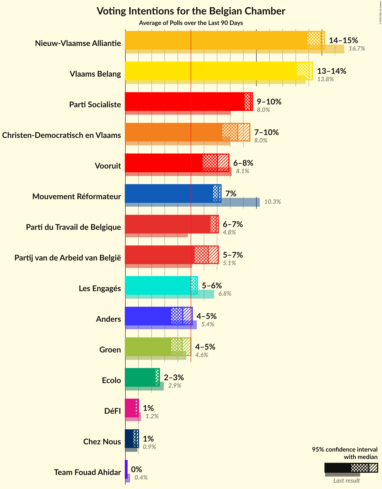

### Confidence Intervals

| Party | Last Result | Median | 80% Confidence Interval | 90% Confidence Interval | 95% Confidence Interval | 99% Confidence Interval |
|:-----:|:-----------:|:------:|:-----------------------:|:-----------------------:|:-----------------------:|:-----------------------:|
| <a href="#nieuw-vlaamse-alliantie">Nieuw-Vlaamse Alliantie</a> | 16.7% | 14.9% | 14.3–15.2% |14.1–15.2% | 13.9–15.2% | 13.5–15.2% |
| <a href="#vlaams-belang">Vlaams Belang</a> | 13.8% | 14.0% | 13.5–14.3% |13.3–14.3% | 13.1–14.3% | 12.7–14.4% |
| <a href="#mouvement-réformateur">Mouvement Réformateur</a> | 10.3% | 7.1% | 6.9–7.2% |6.8–7.2% | 6.7–7.3% | 6.5–7.3% |
| <a href="#vooruit">Vooruit</a> | 8.1% | 7.0% | 6.3–7.7% |6.1–7.8% | 5.9–7.9% | 5.6–7.9% |
| <a href="#parti-socialiste">Parti Socialiste</a> | 8.0% | 9.6% | 9.3–9.7% |9.2–9.7% | 9.1–9.7% | 8.9–9.7% |
| <a href="#christen-democratisch-en-vlaams">Christen-Democratisch en Vlaams</a> | 8.0% | 8.6% | 7.8–9.3% |7.6–9.4% | 7.4–9.5% | 7.0–9.6% |
| <a href="#les-engagés">Les Engagés</a> | 6.8% | 5.4% | 5.1–5.5% |5.1–5.5% | 5.0–5.5% | 4.8–5.5% |
| <a href="#anders">Anders</a> | 5.4% | 4.4% | 3.8–4.9% |3.6–5.0% | 3.5–5.1% | 3.3–5.1% |
| <a href="#partij-van-de-arbeid-van-belgië">Partij van de Arbeid van België</a> | 5.1% | 6.3% | 5.6–6.9% |5.4–7.0% | 5.3–7.1% | 4.9–7.1% |
| <a href="#parti-du-travail-de-belgique">Parti du Travail de Belgique</a> | 4.8% | 6.9% | 6.7–7.1% |6.6–7.1% | 6.5–7.1% | 6.3–7.1% |
| <a href="#groen">Groen</a> | 4.6% | 4.3% | 3.7–4.9% |3.6–5.0% | 3.5–5.0% | 3.2–5.1% |
| <a href="#ecolo">Ecolo</a> | 2.9% | 2.6% | 2.4–2.6% |2.4–2.6% | 2.3–2.6% | 2.2–2.6% |
| <a href="#défi">DéFI</a> | 1.2% | 0.9% | 0.8–0.9% |0.8–0.9% | 0.8–1.0% | 0.7–1.0% |
| <a href="#chez-nous">Chez Nous</a> | 0.9% | 0.8% | 0.7–0.9% |0.6–0.9% | 0.6–1.0% | 0.5–1.0% |
| <a href="#team-fouad-ahidar">Team Fouad Ahidar</a> | 0.4% | 0.1% | 0.1% |0.1% | 0.1% | 0.1% |

### Nieuw-Vlaamse Alliantie

*For a full overview of the results for this party, see the [Nieuw-Vlaamse Alliantie](party-nieuw-vlaamsealliantie.html) page.*

| Voting Intentions | Probability | Accumulated | Special Marks |
|:-----------------:|:-----------:|:-----------:|:-------------:|
| 11.5–12.5% | 0% | 100% |  |
| 12.5–13.5% | 0.5% | 100% |  |
| 13.5–14.5% | 19% | 99.5% |  |
| 14.5–15.5% | 100% | 80% | Median |
| 15.5–16.5% | 100% | 0% |  |
| 16.5–17.5% | 100% | 0% | Last Result |
| 17.5–18.5% | 43% | 0% |  |
| 18.5–19.5% | 3% | 0% |  |

### Vlaams Belang

*For a full overview of the results for this party, see the [Vlaams Belang](party-vlaamsbelang.html) page.*

| Voting Intentions | Probability | Accumulated | Special Marks |
|:-----------------:|:-----------:|:-----------:|:-------------:|
| 10.5–11.5% | 0% | 100% |  |
| 11.5–12.5% | 0.3% | 100% |  |
| 12.5–13.5% | 12% | 99.7% |  |
| 13.5–14.5% | 100% | 87% | Last Result, Median |
| 14.5–15.5% | 100% | 0% |  |
| 15.5–16.5% | 100% | 0% |  |
| 16.5–17.5% | 48% | 0% |  |
| 17.5–18.5% | 3% | 0% |  |

### Mouvement Réformateur

*For a full overview of the results for this party, see the [Mouvement Réformateur](party-mouvementréformateur.html) page.*

| Voting Intentions | Probability | Accumulated | Special Marks |
|:-----------------:|:-----------:|:-----------:|:-------------:|
| 4.5–5.5% | 0% | 100% |  |
| 5.5–6.5% | 0.7% | 100% |  |
| 6.5–7.5% | 100% | 99.3% | Median |
| 7.5–8.5% | 100% | 0% |  |
| 8.5–9.5% | 50% | 0% |  |
| 9.5–10.5% | 0% | 0% | Last Result |

### Vooruit

*For a full overview of the results for this party, see the [Vooruit](party-vooruit.html) page.*

| Voting Intentions | Probability | Accumulated | Special Marks |
|:-----------------:|:-----------:|:-----------:|:-------------:|
| 3.5–4.5% | 0% | 100% |  |
| 4.5–5.5% | 0.4% | 100% |  |
| 5.5–6.5% | 19% | 99.6% |  |
| 6.5–7.5% | 65% | 81% | Median |
| 7.5–8.5% | 26% | 16% | Last Result |
| 8.5–9.5% | 2% | 0% |  |

### Parti Socialiste

*For a full overview of the results for this party, see the [Parti Socialiste](party-partisocialiste.html) page.*

| Voting Intentions | Probability | Accumulated | Special Marks |
|:-----------------:|:-----------:|:-----------:|:-------------:|
| 7.5–8.5% | 0% | 100% | Last Result |
| 8.5–9.5% | 46% | 100% |  |
| 9.5–10.5% | 100% | 54% | Median |
| 10.5–11.5% | 100% | 0% |  |
| 11.5–12.5% | 5% | 0% |  |

### Christen-Democratisch en Vlaams

*For a full overview of the results for this party, see the [Christen-Democratisch en Vlaams](party-christen-democratischenvlaams.html) page.*

| Voting Intentions | Probability | Accumulated | Special Marks |
|:-----------------:|:-----------:|:-----------:|:-------------:|
| 5.5–6.5% | 0% | 100% |  |
| 6.5–7.5% | 5% | 100% |  |
| 7.5–8.5% | 43% | 95% | Last Result |
| 8.5–9.5% | 52% | 53% | Median |
| 9.5–10.5% | 12% | 0.7% |  |
| 10.5–11.5% | 0.5% | 0% |  |

### Les Engagés

*For a full overview of the results for this party, see the [Les Engagés](party-lesengagés.html) page.*

| Voting Intentions | Probability | Accumulated | Special Marks |
|:-----------------:|:-----------:|:-----------:|:-------------:|
| 3.5–4.5% | 0% | 100% |  |
| 4.5–5.5% | 100% | 100% | Median |
| 5.5–6.5% | 100% | 0% |  |
| 6.5–7.5% | 98% | 0% | Last Result |

### Anders

*For a full overview of the results for this party, see the [Anders](party-anders.html) page.*

| Voting Intentions | Probability | Accumulated | Special Marks |
|:-----------------:|:-----------:|:-----------:|:-------------:|
| 1.5–2.5% | 0% | 100% |  |
| 2.5–3.5% | 3% | 100% |  |
| 3.5–4.5% | 60% | 97% | Median |
| 4.5–5.5% | 46% | 37% | Last Result |
| 5.5–6.5% | 2% | 0% |  |

### Partij van de Arbeid van België

*For a full overview of the results for this party, see the [Partij van de Arbeid van België](party-partijvandearbeidvanbelgië.html) page.*

| Voting Intentions | Probability | Accumulated | Special Marks |
|:-----------------:|:-----------:|:-----------:|:-------------:|
| 3.5–4.5% | 0% | 100% |  |
| 4.5–5.5% | 8% | 100% | Last Result |
| 5.5–6.5% | 59% | 92% | Median |
| 6.5–7.5% | 41% | 32% |  |
| 7.5–8.5% | 3% | 0% |  |

### Parti du Travail de Belgique

*For a full overview of the results for this party, see the [Parti du Travail de Belgique](party-partidutravaildebelgique.html) page.*

| Voting Intentions | Probability | Accumulated | Special Marks |
|:-----------------:|:-----------:|:-----------:|:-------------:|
| 4.5–5.5% | 0% | 100% | Last Result |
| 5.5–6.5% | 3% | 100% |  |
| 6.5–7.5% | 100% | 97% | Median |
| 7.5–8.5% | 100% | 0% |  |
| 8.5–9.5% | 15% | 0% |  |

### Groen

*For a full overview of the results for this party, see the [Groen](party-groen.html) page.*

| Voting Intentions | Probability | Accumulated | Special Marks |
|:-----------------:|:-----------:|:-----------:|:-------------:|
| 1.5–2.5% | 0% | 100% |  |
| 2.5–3.5% | 4% | 100% |  |
| 3.5–4.5% | 64% | 96% | Median |
| 4.5–5.5% | 41% | 31% | Last Result |
| 5.5–6.5% | 2% | 0% |  |

### Ecolo

*For a full overview of the results for this party, see the [Ecolo](party-ecolo.html) page.*

| Voting Intentions | Probability | Accumulated | Special Marks |
|:-----------------:|:-----------:|:-----------:|:-------------:|
| 0.5–1.5% | 0% | 100% |  |
| 1.5–2.5% | 46% | 100% |  |
| 2.5–3.5% | 100% | 54% | Last Result, Median |
| 3.5–4.5% | 33% | 0% |  |

### DéFI

*For a full overview of the results for this party, see the [DéFI](party-défi.html) page.*

| Voting Intentions | Probability | Accumulated | Special Marks |
|:-----------------:|:-----------:|:-----------:|:-------------:|
| 0.0–0.5% | 0% | 100% |  |
| 0.5–1.5% | 100% | 100% | Last Result, Median |
| 1.5–2.5% | 21% | 0% |  |

### Chez Nous

*For a full overview of the results for this party, see the [Chez Nous](party-cheznous.html) page.*

| Voting Intentions | Probability | Accumulated | Special Marks |
|:-----------------:|:-----------:|:-----------:|:-------------:|
| 0.0–0.5% | 0.5% | 100% |  |
| 0.5–1.5% | 100% | 99.5% | Last Result, Median |
| 1.5–2.5% | 0.1% | 0% |  |

### Team Fouad Ahidar

*For a full overview of the results for this party, see the [Team Fouad Ahidar](party-teamfouadahidar.html) page.*

| Voting Intentions | Probability | Accumulated | Special Marks |
|:-----------------:|:-----------:|:-----------:|:-------------:|
| 0.0–0.5% | 100% | 100% | Last Result, Median |
| 0.5–1.5% | 0% | 0% |  |

## Seats

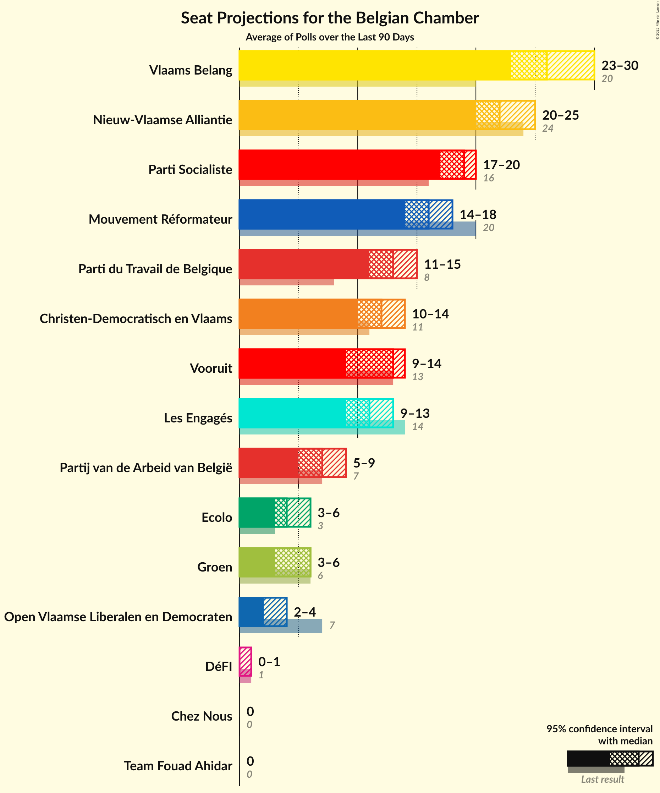

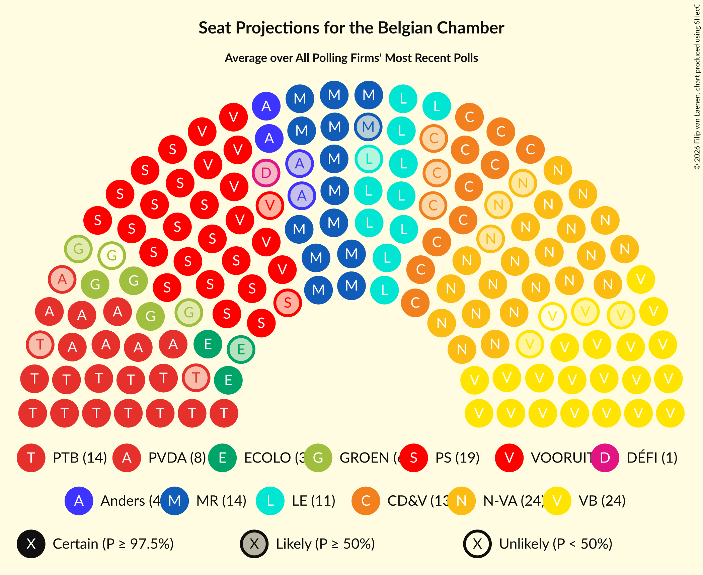

### Confidence Intervals

| Party | Last Result | Median | 80% Confidence Interval | 90% Confidence Interval | 95% Confidence Interval | 99% Confidence Interval |
|:-----:|:-----------:|:------:|:-----------------------:|:-----------------------:|:-----------------------:|:-----------------------:|
| <a href="#nieuw-vlaamse-alliantie">Nieuw-Vlaamse Alliantie</a> | 24 | 24 | 23–27 |22–27 | 21–28 | 21–29 |
| <a href="#vlaams-belang">Vlaams Belang</a> | 20 | 23 | 21–25 |21–26 | 20–26 | 19–28 |
| <a href="#mouvement-réformateur">Mouvement Réformateur</a> | 20 | 14 | 13–16 |13–16 | 13–17 | 12–18 |
| <a href="#vooruit">Vooruit</a> | 13 | 9 | 9–11 |8–12 | 8–12 | 7–13 |
| <a href="#parti-socialiste">Parti Socialiste</a> | 16 | 19 | 18–21 |18–21 | 18–21 | 17–22 |
| <a href="#christen-democratisch-en-vlaams">Christen-Democratisch en Vlaams</a> | 11 | 13 | 10–14 |10–15 | 10–15 | 10–15 |
| <a href="#les-engagés">Les Engagés</a> | 14 | 11 | 10–11 |10–12 | 10–12 | 9–13 |
| <a href="#anders">Anders</a> | 7 | 4 | 3–7 |3–7 | 2–7 | 2–7 |
| <a href="#partij-van-de-arbeid-van-belgië">Partij van de Arbeid van België</a> | 7 | 8 | 7–11 |7–11 | 7–11 | 5–11 |
| <a href="#parti-du-travail-de-belgique">Parti du Travail de Belgique</a> | 8 | 14 | 13–15 |13–16 | 12–16 | 12–17 |
| <a href="#groen">Groen</a> | 6 | 5 | 3–6 |3–6 | 3–6 | 3–6 |
| <a href="#ecolo">Ecolo</a> | 3 | 3 | 2–4 |2–4 | 2–5 | 2–6 |
| <a href="#défi">DéFI</a> | 1 | 1 | 0–1 |0–1 | 0–1 | 0–1 |
| <a href="#chez-nous">Chez Nous</a> | 0 | 0 | 0 |0 | 0 | 0 |
| <a href="#team-fouad-ahidar">Team Fouad Ahidar</a> | 0 | 0 | 0 |0 | 0 | 0 |

### Nieuw-Vlaamse Alliantie

*For a full overview of the results for this party, see the [Nieuw-Vlaamse Alliantie](party-nieuw-vlaamsealliantie.html) page.*

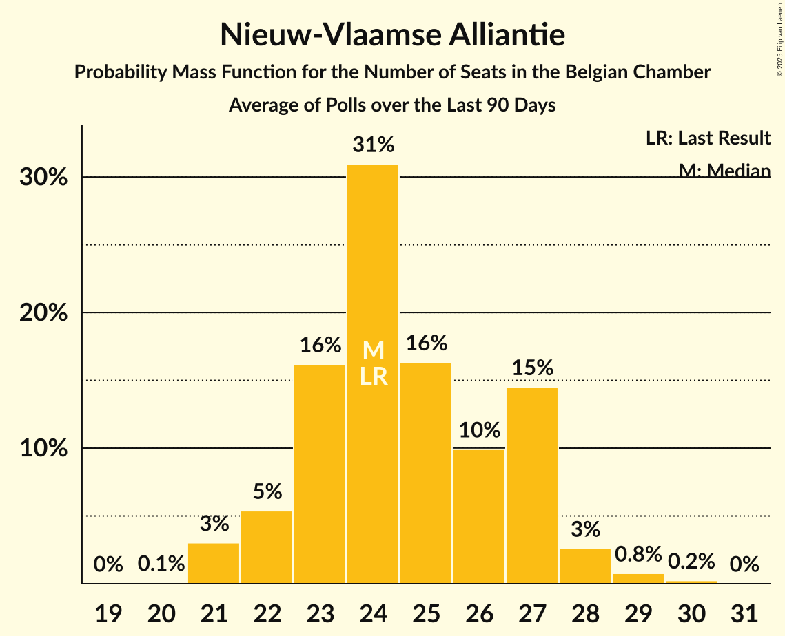

| Number of Seats | Probability | Accumulated | Special Marks |
|:---------------:|:-----------:|:-----------:|:-------------:|
| 20 | 0.1% | 100% |  |
| 21 | 3% | 99.9% |  |
| 22 | 5% | 97% |  |
| 23 | 16% | 92% |  |
| 24 | 31% | 75% | Last Result, Median |
| 25 | 16% | 44% |  |
| 26 | 10% | 28% |  |
| 27 | 15% | 18% |  |
| 28 | 3% | 4% |  |
| 29 | 0.8% | 1.0% |  |
| 30 | 0.2% | 0.2% |  |
| 31 | 0% | 0% |  |

### Vlaams Belang

*For a full overview of the results for this party, see the [Vlaams Belang](party-vlaamsbelang.html) page.*

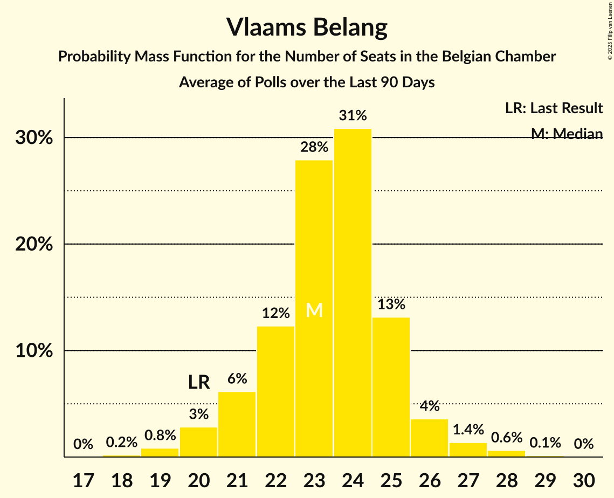

| Number of Seats | Probability | Accumulated | Special Marks |
|:---------------:|:-----------:|:-----------:|:-------------:|
| 18 | 0.2% | 100% |  |
| 19 | 0.8% | 99.8% |  |
| 20 | 3% | 99.0% | Last Result |
| 21 | 6% | 96% |  |
| 22 | 12% | 90% |  |
| 23 | 28% | 78% | Median |
| 24 | 31% | 50% |  |
| 25 | 13% | 19% |  |
| 26 | 4% | 6% |  |
| 27 | 1.4% | 2% |  |
| 28 | 0.6% | 0.8% |  |
| 29 | 0.1% | 0.2% |  |
| 30 | 0% | 0% |  |

### Mouvement Réformateur

*For a full overview of the results for this party, see the [Mouvement Réformateur](party-mouvementréformateur.html) page.*

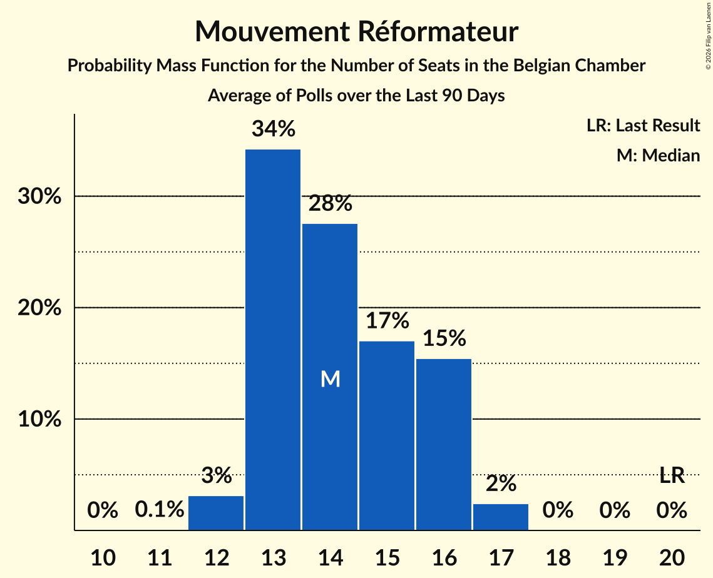

| Number of Seats | Probability | Accumulated | Special Marks |
|:---------------:|:-----------:|:-----------:|:-------------:|
| 11 | 0.1% | 100% |  |
| 12 | 1.2% | 99.9% |  |
| 13 | 11% | 98.8% |  |
| 14 | 40% | 88% | Median |
| 15 | 32% | 48% |  |
| 16 | 12% | 16% |  |
| 17 | 3% | 4% |  |
| 18 | 0.5% | 0.5% |  |
| 19 | 0% | 0% |  |
| 20 | 0% | 0% | Last Result |

### Vooruit

*For a full overview of the results for this party, see the [Vooruit](party-vooruit.html) page.*

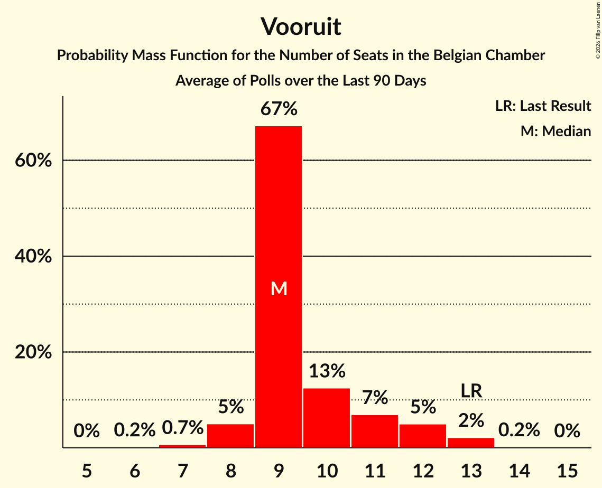

| Number of Seats | Probability | Accumulated | Special Marks |
|:---------------:|:-----------:|:-----------:|:-------------:|
| 6 | 0.2% | 100% |  |
| 7 | 0.7% | 99.8% |  |
| 8 | 5% | 99.1% |  |
| 9 | 67% | 94% | Median |
| 10 | 13% | 27% |  |
| 11 | 7% | 14% |  |
| 12 | 5% | 7% |  |
| 13 | 2% | 2% | Last Result |
| 14 | 0.2% | 0.2% |  |
| 15 | 0% | 0% |  |

### Parti Socialiste

*For a full overview of the results for this party, see the [Parti Socialiste](party-partisocialiste.html) page.*

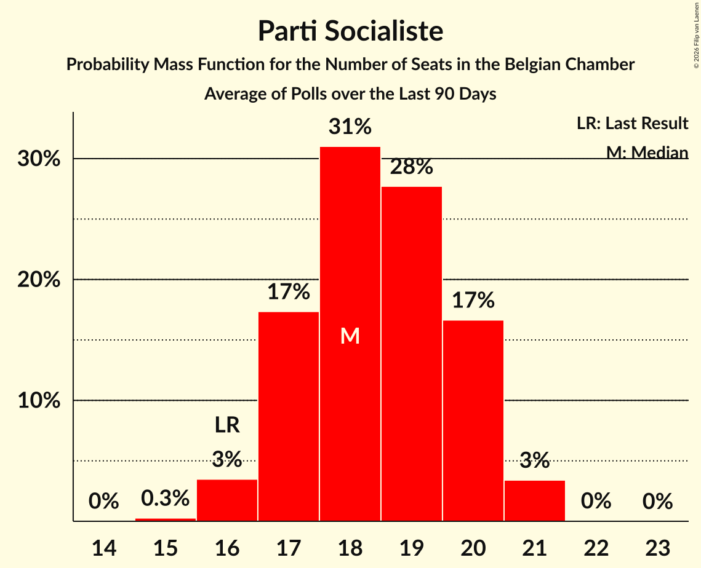

| Number of Seats | Probability | Accumulated | Special Marks |
|:---------------:|:-----------:|:-----------:|:-------------:|
| 16 | 0% | 100% | Last Result |
| 17 | 2% | 100% |  |
| 18 | 18% | 98% |  |
| 19 | 47% | 81% | Median |
| 20 | 21% | 34% |  |
| 21 | 11% | 12% |  |
| 22 | 1.2% | 1.2% |  |
| 23 | 0% | 0% |  |

### Christen-Democratisch en Vlaams

*For a full overview of the results for this party, see the [Christen-Democratisch en Vlaams](party-christen-democratischenvlaams.html) page.*

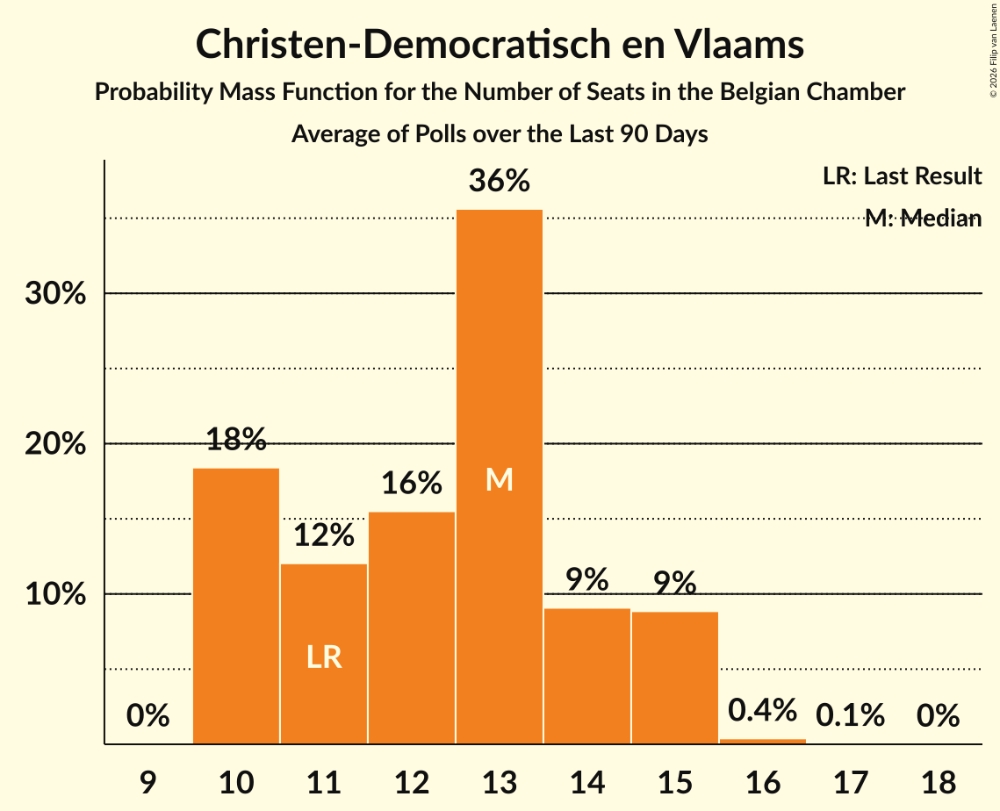

| Number of Seats | Probability | Accumulated | Special Marks |
|:---------------:|:-----------:|:-----------:|:-------------:|
| 10 | 18% | 100% |  |
| 11 | 12% | 82% | Last Result |
| 12 | 16% | 70% |  |
| 13 | 36% | 54% | Median |
| 14 | 9% | 18% |  |
| 15 | 9% | 9% |  |
| 16 | 0.4% | 0.5% |  |
| 17 | 0.1% | 0.1% |  |
| 18 | 0% | 0% |  |

### Les Engagés

*For a full overview of the results for this party, see the [Les Engagés](party-lesengagés.html) page.*

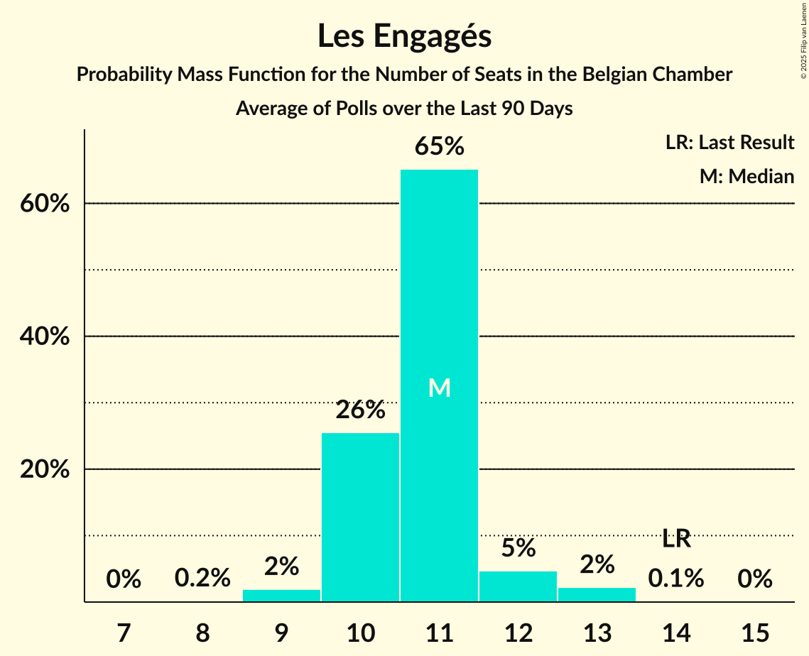

| Number of Seats | Probability | Accumulated | Special Marks |
|:---------------:|:-----------:|:-----------:|:-------------:|
| 8 | 0.2% | 100% |  |
| 9 | 2% | 99.8% |  |
| 10 | 26% | 98% |  |
| 11 | 65% | 72% | Median |
| 12 | 5% | 7% |  |
| 13 | 2% | 2% |  |
| 14 | 0.1% | 0.2% | Last Result |
| 15 | 0% | 0% |  |

### Anders

*For a full overview of the results for this party, see the [Anders](party-anders.html) page.*

| Number of Seats | Probability | Accumulated | Special Marks |
|:---------------:|:-----------:|:-----------:|:-------------:|
| 2 | 3% | 100% |  |
| 3 | 19% | 97% |  |
| 4 | 44% | 78% | Median |
| 5 | 7% | 33% |  |
| 6 | 8% | 26% |  |
| 7 | 18% | 19% | Last Result |
| 8 | 0.2% | 0.2% |  |
| 9 | 0% | 0% |  |

### Partij van de Arbeid van België

*For a full overview of the results for this party, see the [Partij van de Arbeid van België](party-partijvandearbeidvanbelgië.html) page.*

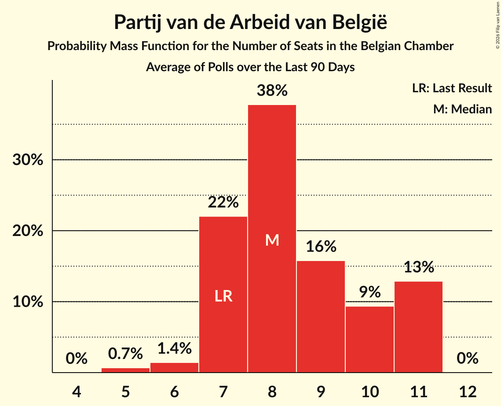

| Number of Seats | Probability | Accumulated | Special Marks |
|:---------------:|:-----------:|:-----------:|:-------------:|
| 5 | 0.7% | 100% |  |
| 6 | 1.4% | 99.3% |  |
| 7 | 22% | 98% | Last Result |
| 8 | 38% | 76% | Median |
| 9 | 16% | 38% |  |
| 10 | 9% | 22% |  |
| 11 | 13% | 13% |  |
| 12 | 0% | 0% |  |

### Parti du Travail de Belgique

*For a full overview of the results for this party, see the [Parti du Travail de Belgique](party-partidutravaildebelgique.html) page.*

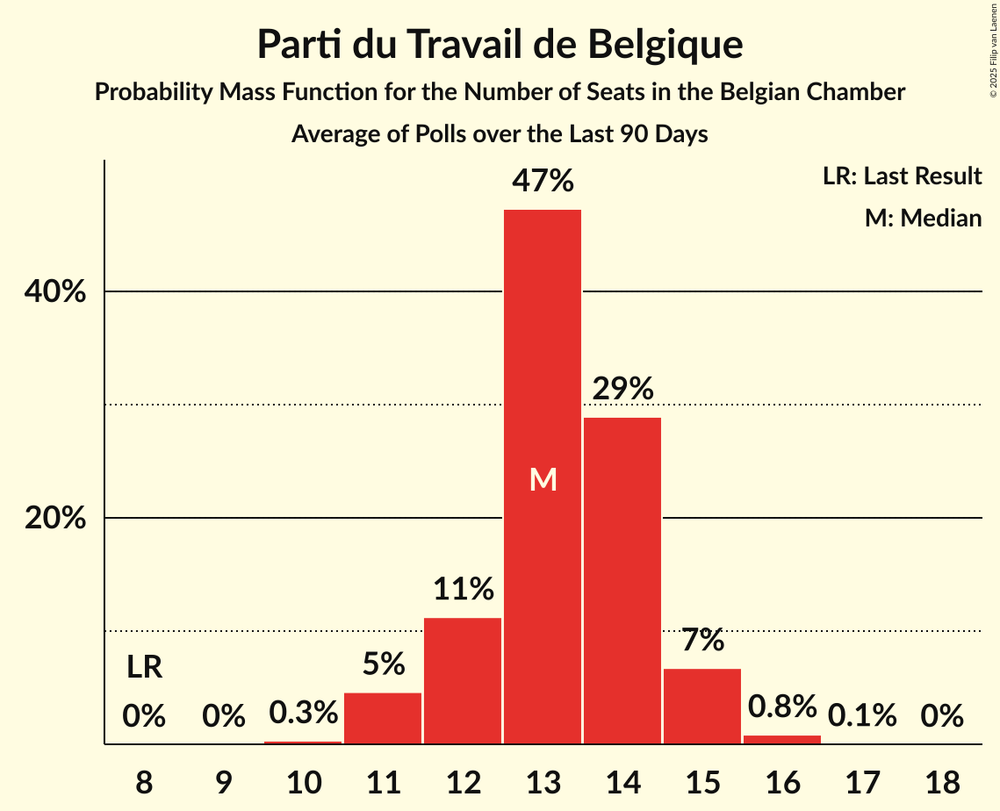

| Number of Seats | Probability | Accumulated | Special Marks |
|:---------------:|:-----------:|:-----------:|:-------------:|
| 8 | 0% | 100% | Last Result |
| 9 | 0% | 100% |  |
| 10 | 0% | 100% |  |
| 11 | 0.4% | 100% |  |
| 12 | 4% | 99.6% |  |
| 13 | 27% | 96% |  |
| 14 | 43% | 69% | Median |
| 15 | 19% | 26% |  |
| 16 | 6% | 7% |  |
| 17 | 1.1% | 1.1% |  |
| 18 | 0% | 0% |  |

### Groen

*For a full overview of the results for this party, see the [Groen](party-groen.html) page.*

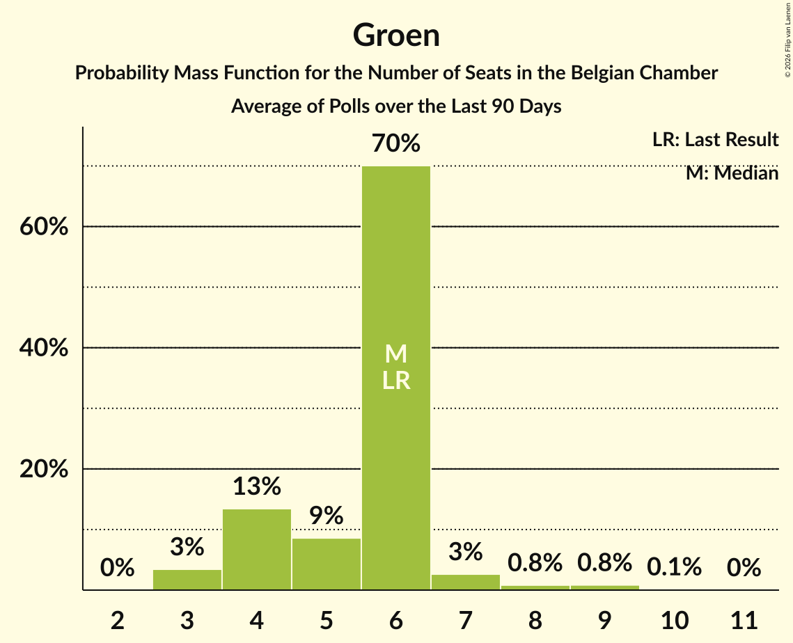

| Number of Seats | Probability | Accumulated | Special Marks |
|:---------------:|:-----------:|:-----------:|:-------------:|
| 1 | 0.2% | 100% |  |
| 2 | 0.2% | 99.8% |  |
| 3 | 20% | 99.6% |  |
| 4 | 24% | 79% |  |
| 5 | 11% | 55% | Median |
| 6 | 44% | 45% | Last Result |
| 7 | 0.2% | 0.5% |  |
| 8 | 0.1% | 0.2% |  |
| 9 | 0.1% | 0.1% |  |
| 10 | 0% | 0% |  |

### Ecolo

*For a full overview of the results for this party, see the [Ecolo](party-ecolo.html) page.*

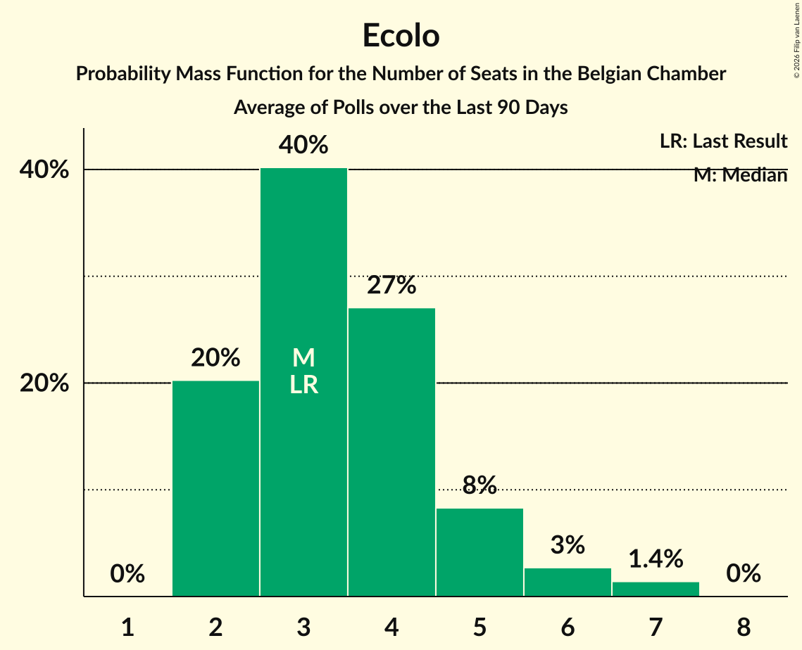

| Number of Seats | Probability | Accumulated | Special Marks |
|:---------------:|:-----------:|:-----------:|:-------------:|
| 2 | 20% | 100% |  |
| 3 | 53% | 80% | Last Result, Median |
| 4 | 23% | 27% |  |
| 5 | 2% | 3% |  |
| 6 | 0.9% | 0.9% |  |
| 7 | 0.1% | 0.1% |  |
| 8 | 0% | 0% |  |

### DéFI

*For a full overview of the results for this party, see the [DéFI](party-défi.html) page.*

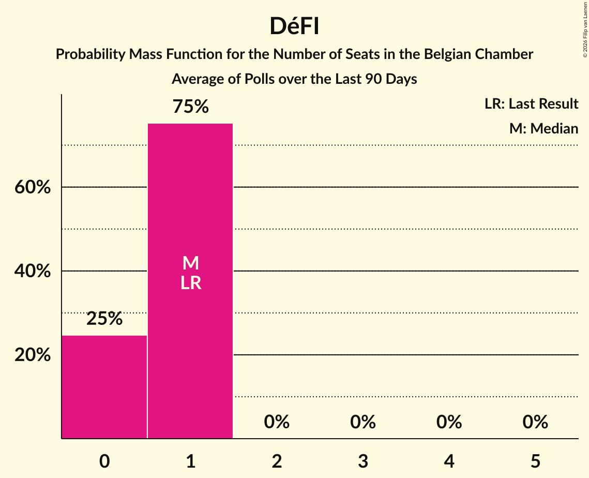

| Number of Seats | Probability | Accumulated | Special Marks |
|:---------------:|:-----------:|:-----------:|:-------------:|
| 0 | 25% | 100% |  |
| 1 | 75% | 75% | Last Result, Median |
| 2 | 0% | 0% |  |

### Chez Nous

*For a full overview of the results for this party, see the [Chez Nous](party-cheznous.html) page.*

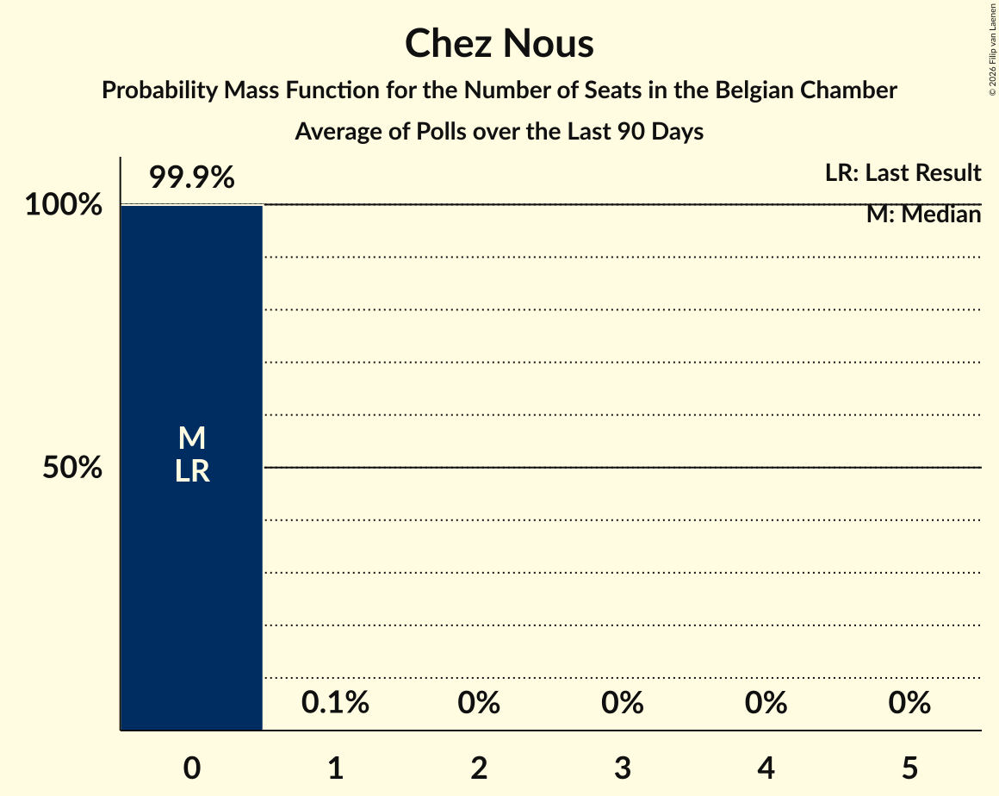

| Number of Seats | Probability | Accumulated | Special Marks |
|:---------------:|:-----------:|:-----------:|:-------------:|
| 0 | 99.9% | 100% | Last Result, Median |
| 1 | 0% | 0.1% |  |
| 2 | 0% | 0% |  |

### Team Fouad Ahidar

*For a full overview of the results for this party, see the [Team Fouad Ahidar](party-teamfouadahidar.html) page.*

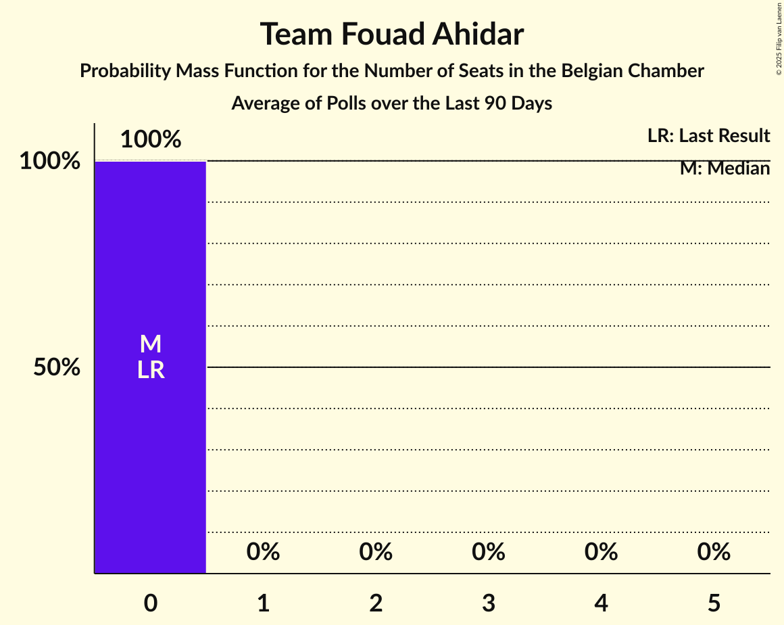

| Number of Seats | Probability | Accumulated | Special Marks |
|:---------------:|:-----------:|:-----------:|:-------------:|
| 0 | 100% | 100% | Last Result, Median |

## Coalitions

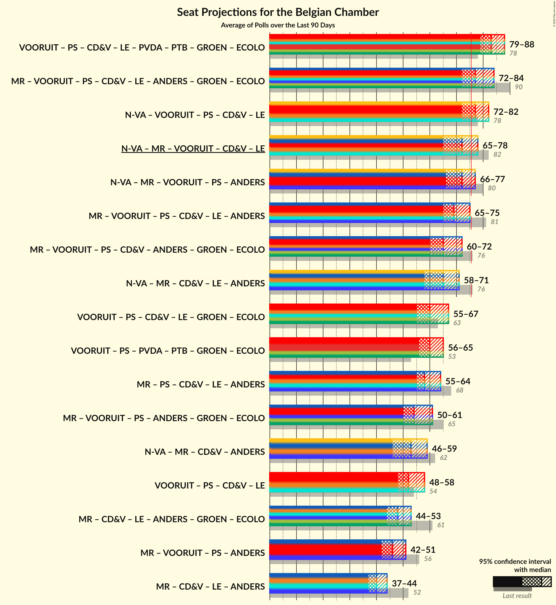

### Confidence Intervals

| Coalition | Last Result | Median | Majority? | 80% Confidence Interval | 90% Confidence Interval | 95% Confidence Interval | 99% Confidence Interval |
|:---------:|:-----------:|:------:|:---------:|:-----------------------:|:-----------------------:|:-----------------------:|:-----------------------:|
| Vooruit – Parti Socialiste – Christen-Democratisch en Vlaams – Les Engagés – Partij van de Arbeid van België – Parti du Travail de Belgique – Groen – Ecolo | 78 | 82 | 99.9% | 79–85 | 78–86 | 78–87 | 76–88 |
| Mouvement Réformateur – Vooruit – Parti Socialiste – Christen-Democratisch en Vlaams – Les Engagés – Anders – Groen – Ecolo | 90 | 79 | 93% | 76–82 | 75–83 | 74–83 | 73–85 |
| Nieuw-Vlaamse Alliantie – Vooruit – Parti Socialiste – Christen-Democratisch en Vlaams – Les Engagés | 78 | 76 | 65% | 73–79 | 72–80 | 72–81 | 71–82 |
| Nieuw-Vlaamse Alliantie – Mouvement Réformateur – Vooruit – Parti Socialiste – Anders | 80 | 72 | 9% | 69–75 | 69–76 | 68–77 | 67–78 |
| Nieuw-Vlaamse Alliantie – Mouvement Réformateur – Vooruit – Christen-Democratisch en Vlaams – Les Engagés | 82 | 72 | 4% | 69–75 | 68–75 | 67–76 | 66–77 |
| Mouvement Réformateur – Vooruit – Parti Socialiste – Christen-Democratisch en Vlaams – Les Engagés – Anders | 81 | 71 | 2% | 68–74 | 67–75 | 66–75 | 65–77 |
| Mouvement Réformateur – Vooruit – Parti Socialiste – Christen-Democratisch en Vlaams – Anders – Groen – Ecolo | 76 | 68 | 0.1% | 65–71 | 64–72 | 64–73 | 62–74 |
| Nieuw-Vlaamse Alliantie – Mouvement Réformateur – Christen-Democratisch en Vlaams – Les Engagés – Anders | 76 | 67 | 0% | 64–70 | 63–70 | 62–71 | 61–72 |
| Mouvement Réformateur – Parti Socialiste – Christen-Democratisch en Vlaams – Les Engagés – Anders | 68 | 61 | 0% | 59–64 | 58–65 | 57–66 | 56–67 |
| Vooruit – Parti Socialiste – Christen-Democratisch en Vlaams – Les Engagés – Groen – Ecolo | 63 | 60 | 0% | 57–63 | 56–63 | 56–64 | 54–65 |
| Vooruit – Parti Socialiste – Partij van de Arbeid van België – Parti du Travail de Belgique – Groen – Ecolo | 53 | 59 | 0% | 56–62 | 56–63 | 55–63 | 54–65 |
| Nieuw-Vlaamse Alliantie – Mouvement Réformateur – Christen-Democratisch en Vlaams – Anders | 62 | 56 | 0% | 53–59 | 52–60 | 51–60 | 50–62 |
| Mouvement Réformateur – Vooruit – Parti Socialiste – Anders – Groen – Ecolo | 65 | 56 | 0% | 53–59 | 52–60 | 51–60 | 50–62 |
| Vooruit – Parti Socialiste – Christen-Democratisch en Vlaams – Les Engagés | 54 | 52 | 0% | 49–54 | 48–55 | 48–56 | 47–57 |
| Mouvement Réformateur – Christen-Democratisch en Vlaams – Les Engagés – Anders – Groen – Ecolo | 61 | 50 | 0% | 47–53 | 46–54 | 46–55 | 45–56 |
| Mouvement Réformateur – Vooruit – Parti Socialiste – Anders | 56 | 48 | 0% | 45–51 | 45–51 | 44–52 | 43–53 |
| Mouvement Réformateur – Christen-Democratisch en Vlaams – Les Engagés – Anders | 52 | 42 | 0% | 39–45 | 39–46 | 38–46 | 37–47 |

### Vooruit – Parti Socialiste – Christen-Democratisch en Vlaams – Les Engagés – Partij van de Arbeid van België – Parti du Travail de Belgique – Groen – Ecolo

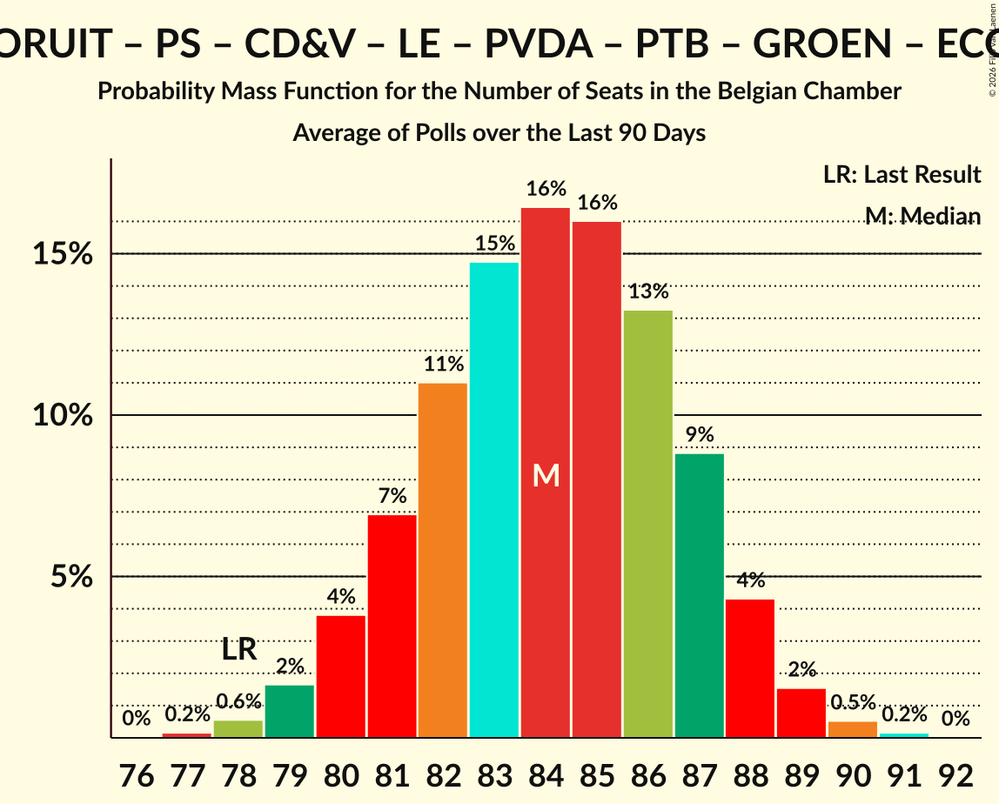

| Number of Seats | Probability | Accumulated | Special Marks |
|:---------------:|:-----------:|:-----------:|:-------------:|
| 75 | 0.1% | 100% |  |
| 76 | 0.4% | 99.9% | Majority |
| 77 | 1.3% | 99.5% |  |
| 78 | 3% | 98% | Last Result |
| 79 | 7% | 95% |  |
| 80 | 13% | 88% |  |
| 81 | 15% | 75% |  |
| 82 | 15% | 60% | Median |
| 83 | 15% | 45% |  |
| 84 | 13% | 30% |  |
| 85 | 9% | 17% |  |
| 86 | 5% | 8% |  |
| 87 | 2% | 3% |  |
| 88 | 0.7% | 0.9% |  |
| 89 | 0.2% | 0.2% |  |
| 90 | 0% | 0.1% |  |
| 91 | 0% | 0% |  |

### Mouvement Réformateur – Vooruit – Parti Socialiste – Christen-Democratisch en Vlaams – Les Engagés – Anders – Groen – Ecolo

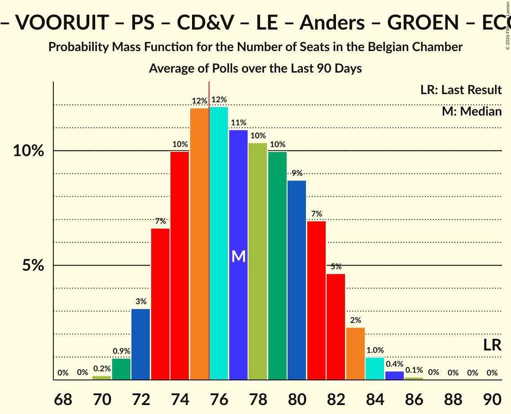

| Number of Seats | Probability | Accumulated | Special Marks |
|:---------------:|:-----------:|:-----------:|:-------------:|
| 72 | 0.2% | 100% |  |
| 73 | 0.6% | 99.8% |  |
| 74 | 2% | 99.2% |  |
| 75 | 4% | 97% |  |
| 76 | 9% | 93% | Majority |
| 77 | 14% | 84% |  |
| 78 | 16% | 70% | Median |
| 79 | 16% | 54% |  |
| 80 | 15% | 38% |  |
| 81 | 11% | 23% |  |
| 82 | 7% | 12% |  |
| 83 | 4% | 6% |  |
| 84 | 2% | 2% |  |
| 85 | 0.5% | 0.6% |  |
| 86 | 0.1% | 0.1% |  |
| 87 | 0% | 0% |  |
| 88 | 0% | 0% |  |
| 89 | 0% | 0% |  |
| 90 | 0% | 0% | Last Result |

### Nieuw-Vlaamse Alliantie – Vooruit – Parti Socialiste – Christen-Democratisch en Vlaams – Les Engagés

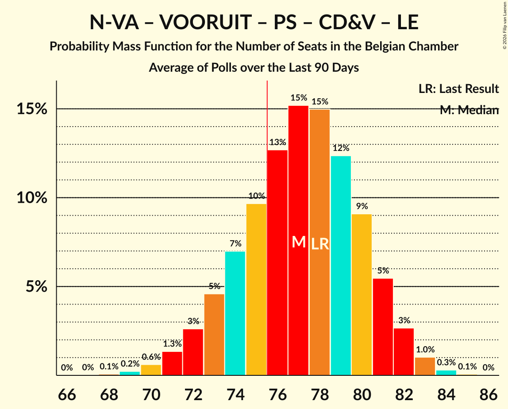

| Number of Seats | Probability | Accumulated | Special Marks |
|:---------------:|:-----------:|:-----------:|:-------------:|
| 69 | 0.1% | 100% |  |
| 70 | 0.3% | 99.9% |  |
| 71 | 1.3% | 99.6% |  |
| 72 | 4% | 98% |  |
| 73 | 6% | 95% |  |
| 74 | 10% | 88% |  |
| 75 | 14% | 79% |  |
| 76 | 16% | 65% | Median, Majority |
| 77 | 16% | 49% |  |
| 78 | 14% | 33% | Last Result |
| 79 | 10% | 19% |  |
| 80 | 6% | 10% |  |
| 81 | 3% | 4% |  |
| 82 | 0.9% | 1.3% |  |
| 83 | 0.3% | 0.4% |  |
| 84 | 0.1% | 0.1% |  |
| 85 | 0% | 0% |  |

### Nieuw-Vlaamse Alliantie – Mouvement Réformateur – Vooruit – Parti Socialiste – Anders

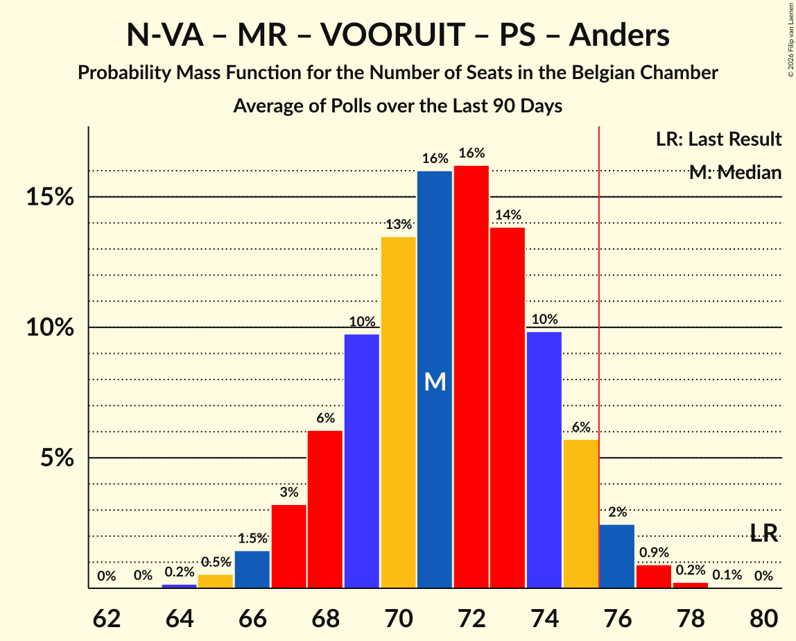

| Number of Seats | Probability | Accumulated | Special Marks |
|:---------------:|:-----------:|:-----------:|:-------------:|
| 65 | 0.1% | 100% |  |
| 66 | 0.4% | 99.9% |  |
| 67 | 1.2% | 99.5% |  |
| 68 | 3% | 98% |  |
| 69 | 7% | 95% |  |
| 70 | 11% | 88% | Median |
| 71 | 14% | 78% |  |
| 72 | 16% | 64% |  |
| 73 | 16% | 49% |  |
| 74 | 14% | 32% |  |
| 75 | 10% | 18% |  |
| 76 | 5% | 9% | Majority |
| 77 | 2% | 3% |  |
| 78 | 0.8% | 1.2% |  |
| 79 | 0.3% | 0.4% |  |
| 80 | 0.1% | 0.1% | Last Result |
| 81 | 0% | 0% |  |

### Nieuw-Vlaamse Alliantie – Mouvement Réformateur – Vooruit – Christen-Democratisch en Vlaams – Les Engagés

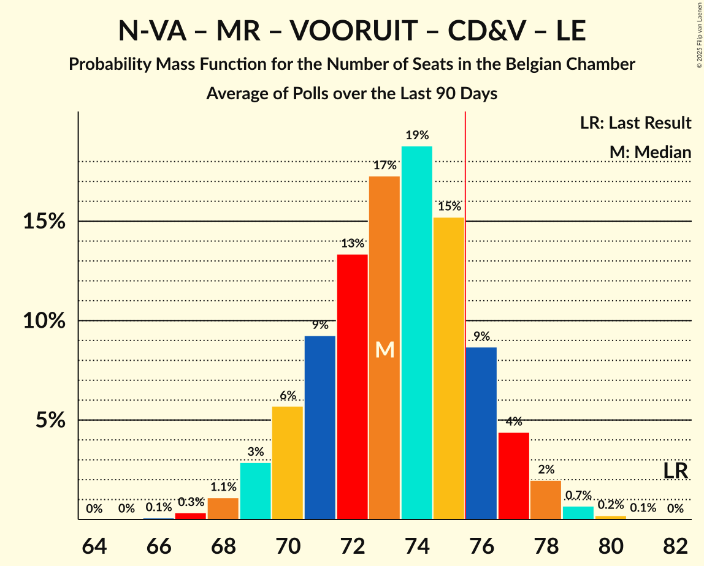

| Number of Seats | Probability | Accumulated | Special Marks |
|:---------------:|:-----------:|:-----------:|:-------------:|
| 65 | 0.2% | 100% |  |
| 66 | 0.7% | 99.8% |  |
| 67 | 2% | 99.1% |  |
| 68 | 6% | 97% |  |
| 69 | 8% | 91% |  |
| 70 | 13% | 83% |  |
| 71 | 16% | 70% | Median |
| 72 | 16% | 54% |  |
| 73 | 15% | 37% |  |
| 74 | 12% | 23% |  |
| 75 | 7% | 11% |  |
| 76 | 3% | 4% | Majority |
| 77 | 1.0% | 1.4% |  |
| 78 | 0.3% | 0.4% |  |
| 79 | 0.1% | 0.1% |  |
| 80 | 0% | 0% |  |
| 81 | 0% | 0% |  |
| 82 | 0% | 0% | Last Result |

### Mouvement Réformateur – Vooruit – Parti Socialiste – Christen-Democratisch en Vlaams – Les Engagés – Anders

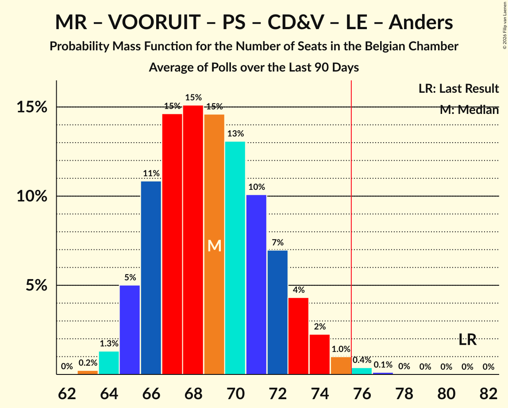

| Number of Seats | Probability | Accumulated | Special Marks |
|:---------------:|:-----------:|:-----------:|:-------------:|
| 64 | 0.1% | 100% |  |
| 65 | 0.6% | 99.8% |  |
| 66 | 2% | 99.2% |  |
| 67 | 4% | 97% |  |
| 68 | 8% | 93% |  |
| 69 | 13% | 85% |  |
| 70 | 16% | 73% | Median |
| 71 | 17% | 57% |  |
| 72 | 15% | 40% |  |
| 73 | 12% | 25% |  |
| 74 | 8% | 13% |  |
| 75 | 4% | 6% |  |
| 76 | 1.3% | 2% | Majority |
| 77 | 0.4% | 0.6% |  |
| 78 | 0.1% | 0.2% |  |
| 79 | 0% | 0% |  |
| 80 | 0% | 0% |  |
| 81 | 0% | 0% | Last Result |

### Mouvement Réformateur – Vooruit – Parti Socialiste – Christen-Democratisch en Vlaams – Anders – Groen – Ecolo

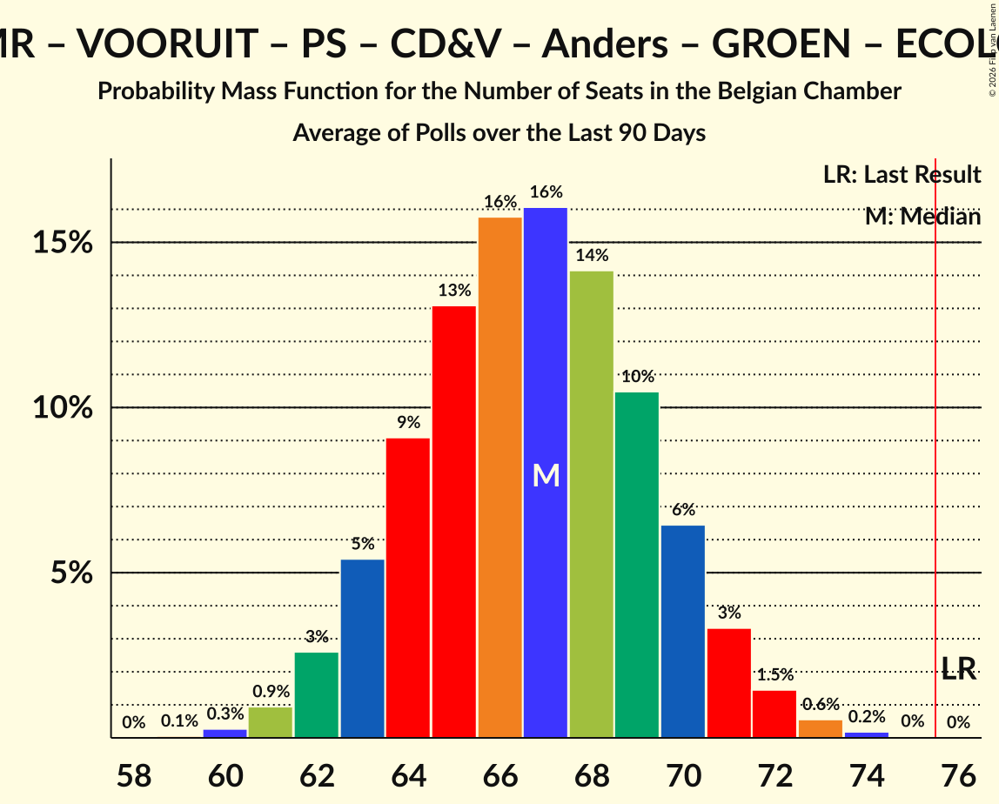

| Number of Seats | Probability | Accumulated | Special Marks |
|:---------------:|:-----------:|:-----------:|:-------------:|
| 61 | 0.2% | 100% |  |
| 62 | 0.6% | 99.8% |  |
| 63 | 2% | 99.2% |  |
| 64 | 4% | 98% |  |
| 65 | 8% | 93% |  |
| 66 | 13% | 85% |  |
| 67 | 15% | 73% | Median |
| 68 | 16% | 57% |  |
| 69 | 15% | 42% |  |
| 70 | 12% | 27% |  |
| 71 | 8% | 15% |  |
| 72 | 4% | 7% |  |
| 73 | 2% | 3% |  |
| 74 | 0.7% | 1.0% |  |
| 75 | 0.2% | 0.3% |  |
| 76 | 0% | 0.1% | Last Result, Majority |
| 77 | 0% | 0% |  |

### Nieuw-Vlaamse Alliantie – Mouvement Réformateur – Christen-Democratisch en Vlaams – Les Engagés – Anders

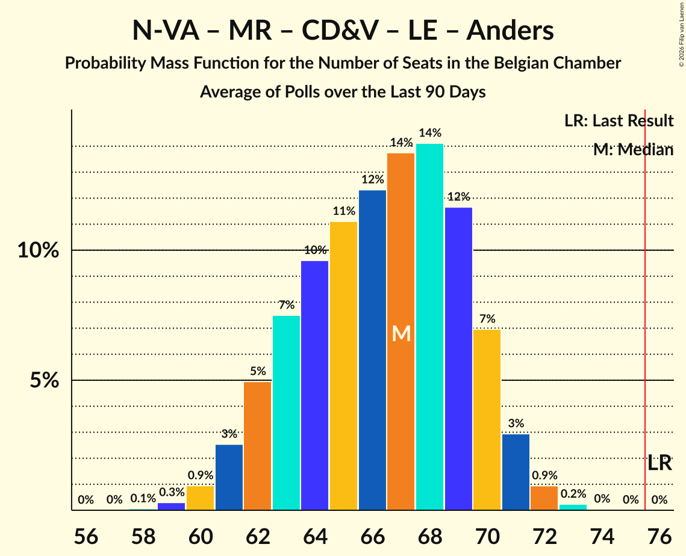

| Number of Seats | Probability | Accumulated | Special Marks |
|:---------------:|:-----------:|:-----------:|:-------------:|
| 60 | 0.2% | 100% |  |
| 61 | 0.7% | 99.8% |  |
| 62 | 2% | 99.0% |  |
| 63 | 5% | 97% |  |
| 64 | 8% | 92% |  |
| 65 | 12% | 84% |  |
| 66 | 16% | 72% | Median |
| 67 | 17% | 56% |  |
| 68 | 16% | 39% |  |
| 69 | 13% | 23% |  |
| 70 | 7% | 11% |  |
| 71 | 3% | 4% |  |
| 72 | 0.9% | 1.3% |  |
| 73 | 0.3% | 0.4% |  |
| 74 | 0.1% | 0.1% |  |
| 75 | 0% | 0% |  |
| 76 | 0% | 0% | Last Result, Majority |

### Mouvement Réformateur – Parti Socialiste – Christen-Democratisch en Vlaams – Les Engagés – Anders

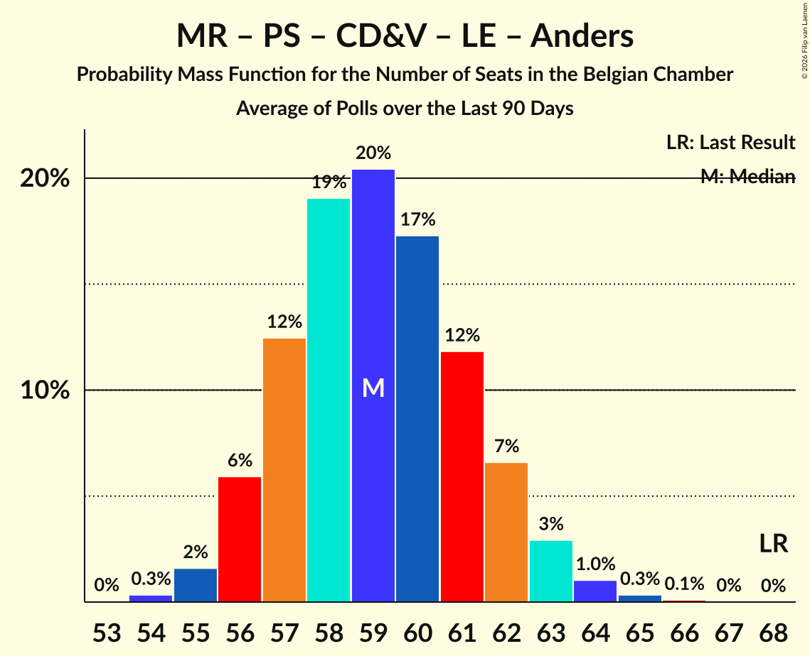

| Number of Seats | Probability | Accumulated | Special Marks |
|:---------------:|:-----------:|:-----------:|:-------------:|
| 55 | 0.2% | 100% |  |
| 56 | 0.8% | 99.8% |  |
| 57 | 3% | 99.0% |  |
| 58 | 6% | 96% |  |
| 59 | 10% | 90% |  |
| 60 | 15% | 80% |  |
| 61 | 17% | 66% | Median |
| 62 | 16% | 49% |  |
| 63 | 13% | 33% |  |
| 64 | 10% | 19% |  |
| 65 | 6% | 10% |  |
| 66 | 3% | 3% |  |
| 67 | 0.6% | 0.7% |  |
| 68 | 0.1% | 0.1% | Last Result |
| 69 | 0% | 0% |  |

### Vooruit – Parti Socialiste – Christen-Democratisch en Vlaams – Les Engagés – Groen – Ecolo

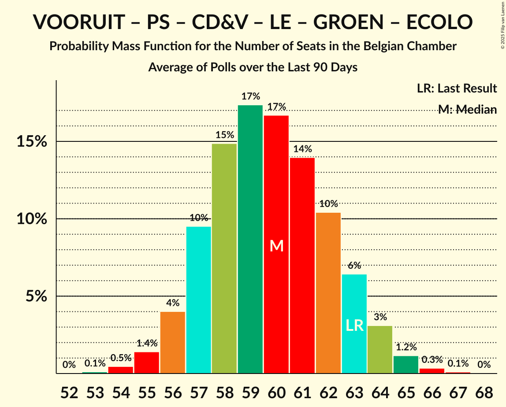

| Number of Seats | Probability | Accumulated | Special Marks |
|:---------------:|:-----------:|:-----------:|:-------------:|
| 53 | 0.1% | 100% |  |
| 54 | 0.5% | 99.9% |  |
| 55 | 1.4% | 99.4% |  |
| 56 | 4% | 98% |  |
| 57 | 10% | 94% |  |
| 58 | 15% | 84% |  |
| 59 | 17% | 70% |  |
| 60 | 17% | 52% | Median |
| 61 | 14% | 36% |  |
| 62 | 10% | 22% |  |
| 63 | 6% | 11% | Last Result |
| 64 | 3% | 5% |  |
| 65 | 1.2% | 2% |  |
| 66 | 0.3% | 0.5% |  |
| 67 | 0.1% | 0.1% |  |
| 68 | 0% | 0% |  |

### Vooruit – Parti Socialiste – Partij van de Arbeid van België – Parti du Travail de Belgique – Groen – Ecolo

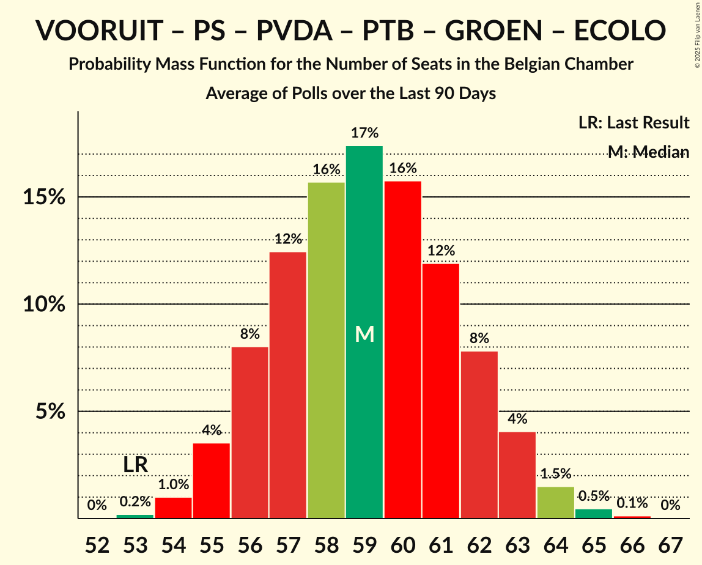

| Number of Seats | Probability | Accumulated | Special Marks |
|:---------------:|:-----------:|:-----------:|:-------------:|
| 53 | 0.2% | 100% | Last Result |
| 54 | 1.0% | 99.8% |  |
| 55 | 4% | 98.8% |  |
| 56 | 8% | 95% |  |
| 57 | 12% | 87% |  |
| 58 | 16% | 75% | Median |
| 59 | 17% | 59% |  |
| 60 | 16% | 42% |  |
| 61 | 12% | 26% |  |
| 62 | 8% | 14% |  |
| 63 | 4% | 6% |  |
| 64 | 1.5% | 2% |  |
| 65 | 0.5% | 0.6% |  |
| 66 | 0.1% | 0.2% |  |
| 67 | 0% | 0% |  |

### Nieuw-Vlaamse Alliantie – Mouvement Réformateur – Christen-Democratisch en Vlaams – Anders

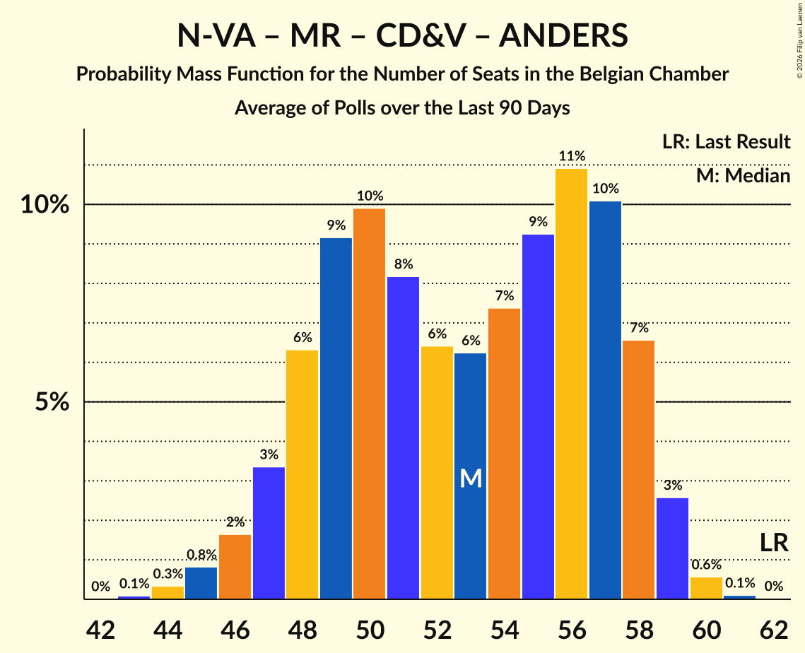

| Number of Seats | Probability | Accumulated | Special Marks |
|:---------------:|:-----------:|:-----------:|:-------------:|
| 49 | 0.1% | 100% |  |
| 50 | 0.6% | 99.9% |  |
| 51 | 2% | 99.3% |  |
| 52 | 4% | 97% |  |
| 53 | 7% | 93% |  |
| 54 | 12% | 86% |  |
| 55 | 15% | 74% | Median |
| 56 | 17% | 59% |  |
| 57 | 16% | 43% |  |
| 58 | 13% | 26% |  |
| 59 | 8% | 13% |  |
| 60 | 3% | 5% |  |
| 61 | 1.3% | 2% |  |
| 62 | 0.4% | 0.6% | Last Result |
| 63 | 0.1% | 0.2% |  |
| 64 | 0% | 0% |  |

### Mouvement Réformateur – Vooruit – Parti Socialiste – Anders – Groen – Ecolo

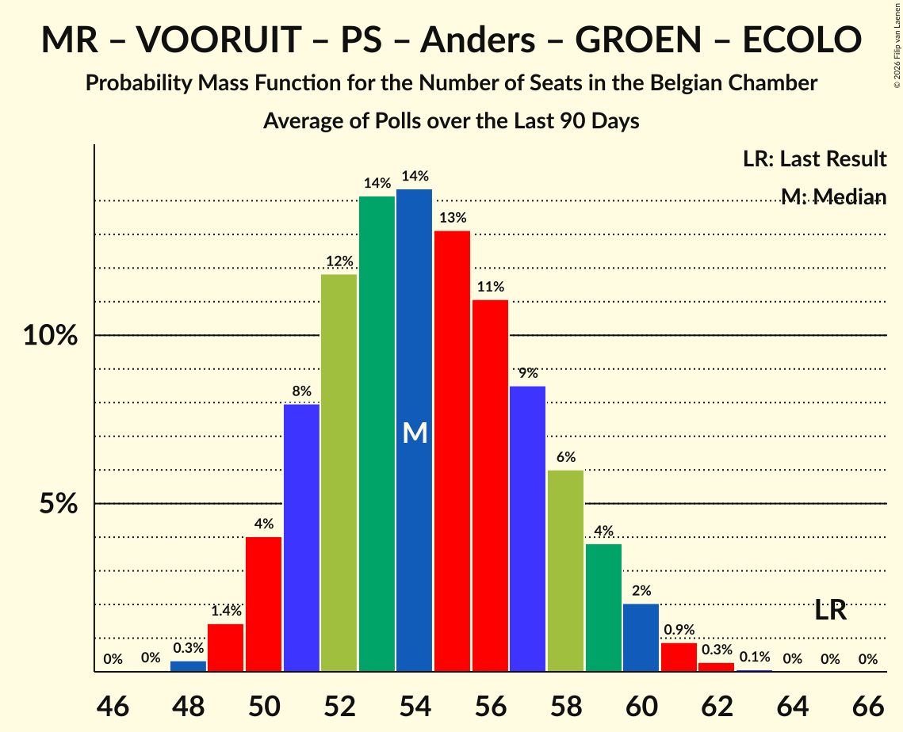

| Number of Seats | Probability | Accumulated | Special Marks |
|:---------------:|:-----------:|:-----------:|:-------------:|
| 49 | 0.1% | 100% |  |
| 50 | 0.7% | 99.8% |  |
| 51 | 2% | 99.1% |  |
| 52 | 5% | 97% |  |
| 53 | 10% | 92% |  |
| 54 | 13% | 82% | Median |
| 55 | 16% | 69% |  |
| 56 | 17% | 53% |  |
| 57 | 14% | 36% |  |
| 58 | 10% | 21% |  |
| 59 | 6% | 12% |  |
| 60 | 3% | 5% |  |
| 61 | 1.2% | 2% |  |
| 62 | 0.4% | 0.5% |  |
| 63 | 0.1% | 0.2% |  |
| 64 | 0% | 0% |  |
| 65 | 0% | 0% | Last Result |

### Vooruit – Parti Socialiste – Christen-Democratisch en Vlaams – Les Engagés

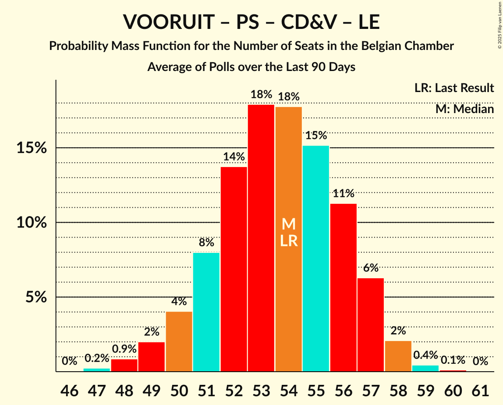

| Number of Seats | Probability | Accumulated | Special Marks |
|:---------------:|:-----------:|:-----------:|:-------------:|
| 46 | 0.2% | 100% |  |
| 47 | 1.1% | 99.8% |  |
| 48 | 4% | 98.7% |  |
| 49 | 8% | 95% |  |
| 50 | 12% | 87% |  |
| 51 | 18% | 75% |  |
| 52 | 20% | 57% | Median |
| 53 | 16% | 37% |  |
| 54 | 11% | 20% | Last Result |
| 55 | 6% | 9% |  |
| 56 | 2% | 4% |  |
| 57 | 0.9% | 1.3% |  |
| 58 | 0.3% | 0.4% |  |
| 59 | 0.1% | 0.1% |  |
| 60 | 0% | 0% |  |

### Mouvement Réformateur – Christen-Democratisch en Vlaams – Les Engagés – Anders – Groen – Ecolo

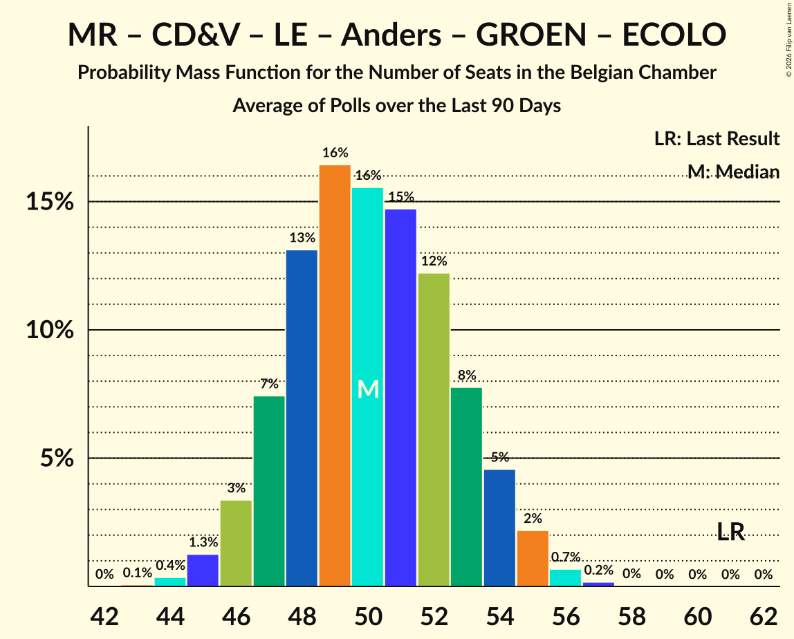

| Number of Seats | Probability | Accumulated | Special Marks |
|:---------------:|:-----------:|:-----------:|:-------------:|
| 43 | 0.1% | 100% |  |
| 44 | 0.4% | 99.9% |  |
| 45 | 1.3% | 99.6% |  |
| 46 | 3% | 98% |  |
| 47 | 7% | 95% |  |
| 48 | 13% | 87% |  |
| 49 | 16% | 74% |  |
| 50 | 16% | 58% | Median |
| 51 | 15% | 42% |  |
| 52 | 12% | 28% |  |
| 53 | 8% | 15% |  |
| 54 | 5% | 8% |  |
| 55 | 2% | 3% |  |
| 56 | 0.7% | 0.9% |  |
| 57 | 0.2% | 0.2% |  |
| 58 | 0% | 0% |  |
| 59 | 0% | 0% |  |
| 60 | 0% | 0% |  |
| 61 | 0% | 0% | Last Result |

### Mouvement Réformateur – Vooruit – Parti Socialiste – Anders

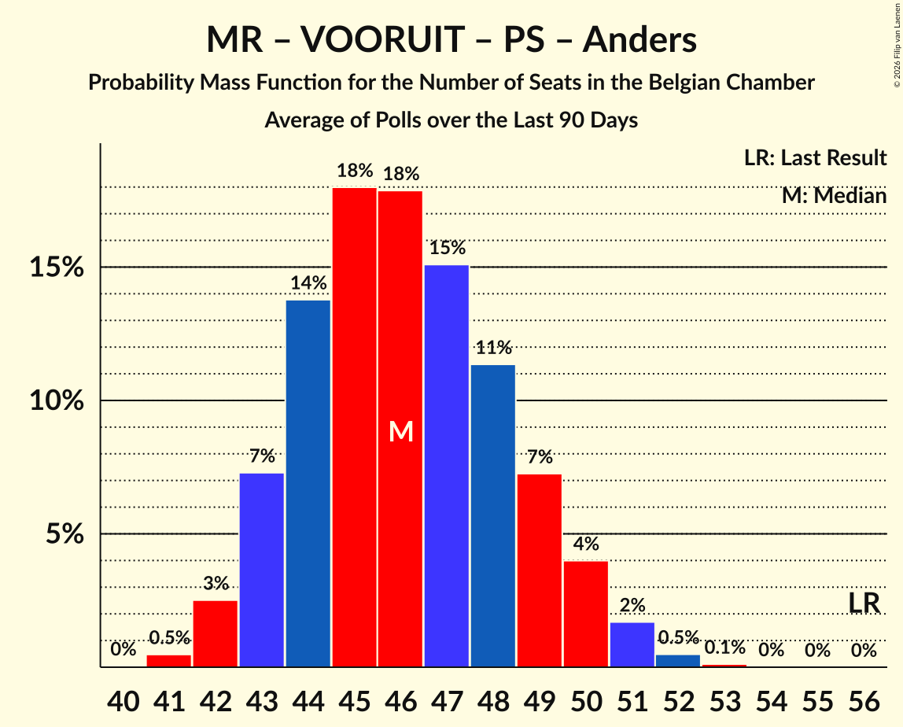

| Number of Seats | Probability | Accumulated | Special Marks |
|:---------------:|:-----------:|:-----------:|:-------------:|
| 42 | 0.2% | 100% |  |
| 43 | 1.0% | 99.8% |  |
| 44 | 4% | 98.8% |  |
| 45 | 9% | 95% |  |
| 46 | 15% | 86% | Median |
| 47 | 18% | 71% |  |
| 48 | 17% | 53% |  |
| 49 | 14% | 35% |  |
| 50 | 11% | 21% |  |
| 51 | 7% | 11% |  |
| 52 | 3% | 4% |  |
| 53 | 0.9% | 1.4% |  |
| 54 | 0.3% | 0.4% |  |
| 55 | 0.1% | 0.1% |  |
| 56 | 0% | 0% | Last Result |

### Mouvement Réformateur – Christen-Democratisch en Vlaams – Les Engagés – Anders

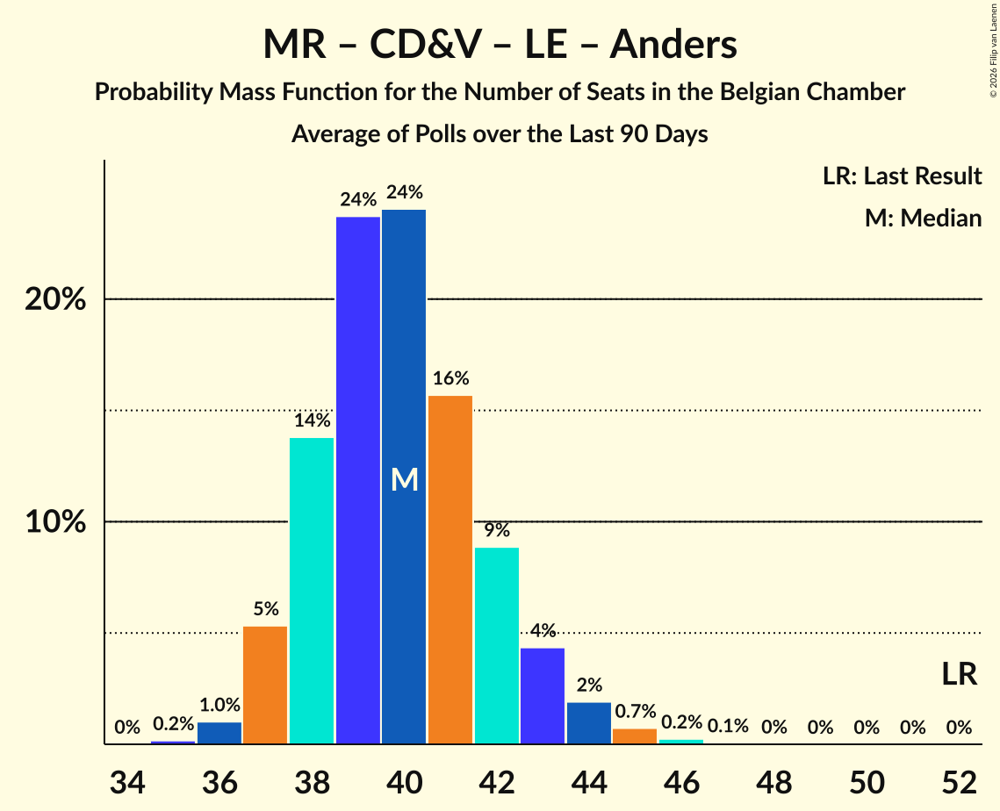

| Number of Seats | Probability | Accumulated | Special Marks |
|:---------------:|:-----------:|:-----------:|:-------------:|
| 36 | 0.1% | 100% |  |
| 37 | 0.7% | 99.8% |  |
| 38 | 3% | 99.1% |  |
| 39 | 7% | 96% |  |
| 40 | 12% | 89% |  |
| 41 | 16% | 77% |  |
| 42 | 18% | 62% | Median |
| 43 | 15% | 44% |  |
| 44 | 12% | 28% |  |
| 45 | 9% | 16% |  |
| 46 | 5% | 7% |  |
| 47 | 1.5% | 2% |  |
| 48 | 0.3% | 0.3% |  |
| 49 | 0% | 0% |  |
| 50 | 0% | 0% |  |
| 51 | 0% | 0% |  |
| 52 | 0% | 0% | Last Result |

## Technical Information

+ **Number of polls included in this average:** 1
+ **Lowest number of simulations done in a poll included in this average:** 2,097,152
+ **Total number of simulations done in the polls included in this average:** 2,097,152
+ **Error estimate:** 0.59%
