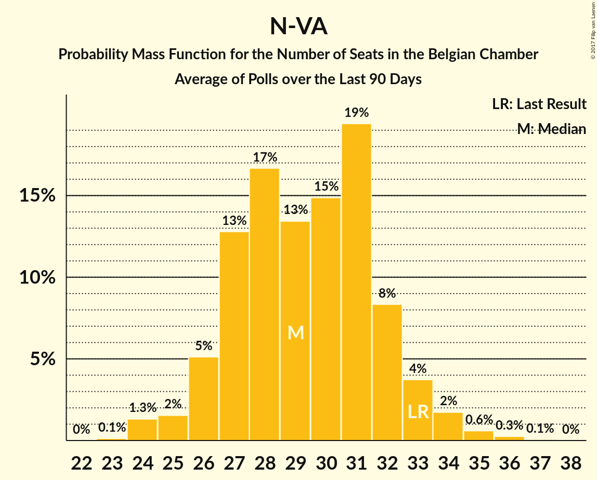
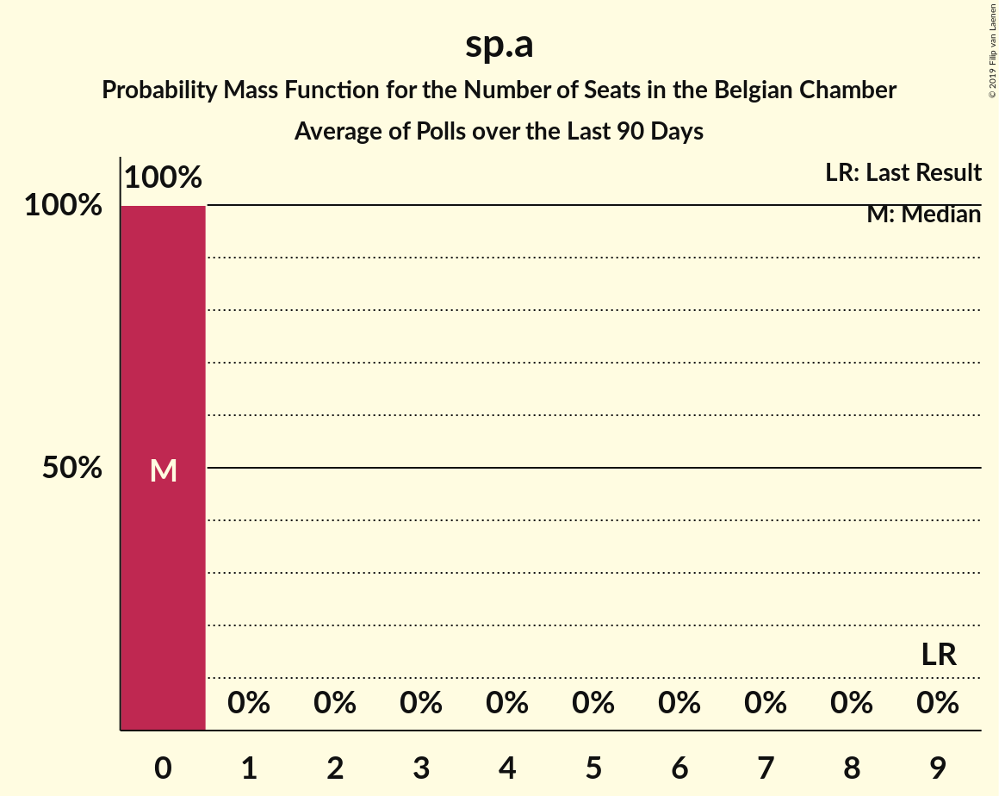
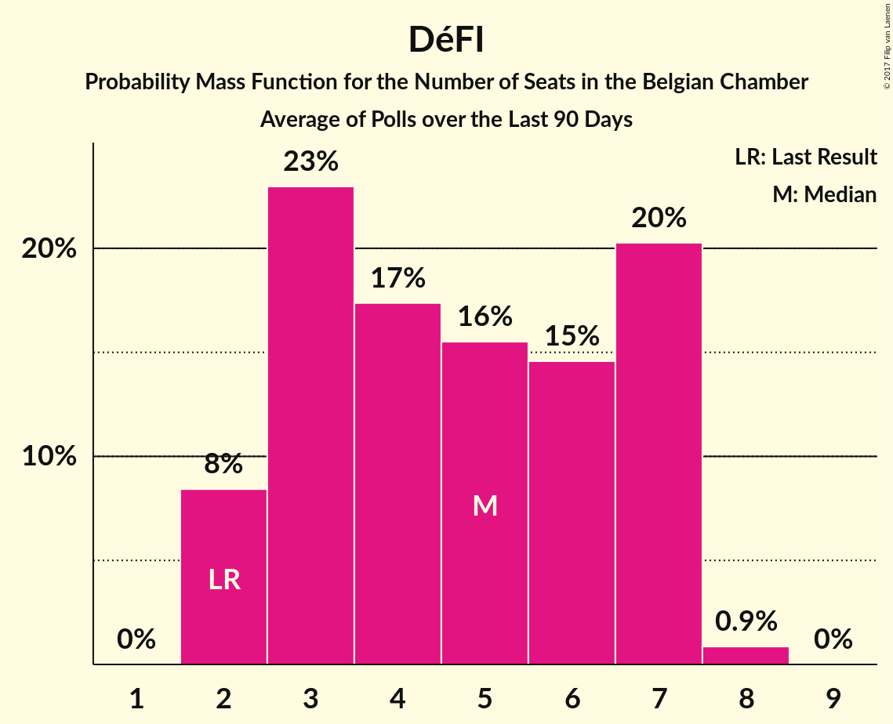
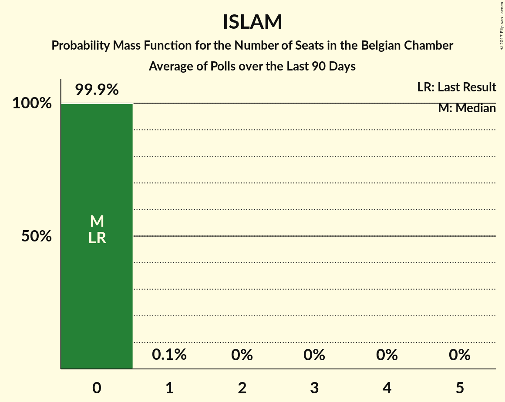

# Poll Average

<a href="#voting-intentions">Voting Intentions</a> | <a href="#seats">Seats</a> | <a href="#coalitions">Coalitions</a> | <a href="#technical-information">Technical Information</a>

## Summary

The table below lists the polls on which the average is based. They are the most recent polls (less than 90 days old) registered and analyzed so far.

| Period     | Polling firm/Commissioner(s) | N-VA | PS | CD&V | VLD | MR | SP.A | GROEN | CDH | VB | ECOLO | PTB | DÉFI | PVDA | PP | DLB | LDD | DROITE | PIRAAT | ISLAM | WDA | PIRATE | RWF | FW |
|:----------:|:----------------------------:|:--:|:--:|:--:|:--:|:--:|:--:|:--:|:--:|:--:|:--:|:--:|:--:|:--:|:--:|:--:|:--:|:--:|:--:|:--:|:--:|:--:|:--:|:--:|
| 25 May 2014 | General Election | 20.3%   33 | 11.7%   23 | 11.6%   18 | 9.8%   14 | 9.6%   20 | 8.8%   13 | 5.3%   6 | 5.0%   9 | 3.7%   3 | 3.3%   6 | 2.0%   2 | 1.8%   2 | 1.8%   0 | 1.5%   1 | 0.9%   0 | 0.4%   0 | 0.4%   0 | 0.3%   0 | 0.2%   0 | 0.2%   0 | 0.1%   0 | 0.1%   0 | 0.1%   0 |
| N/A | Poll Average | 26–33%   25–34 | N/A   14–17 | 14–22%   13–21 | 10–17%   9–17 | N/A   15–19 | 10–14%   8–13 | 12–16%   11–15 | N/A   4–6 | 5–10%   2–8 | N/A   8–16 | N/A   8–12 | N/A   2–7 | 4–7%   0 | N/A   0–2 | N/A   N/A | N/A   N/A | N/A   0 | N/A   N/A | N/A   0 | N/A   N/A | N/A   N/A | N/A   N/A | N/A   N/A |
| [11 September–5 October 2017](2017-10-05-TNS.html) | TNS   De Standaard–VRT–RTBf–La Libre Belgique | 25–31%   24–31 | N/A   14–17 | 17–22%   16–22 | 13–18%   12–17 | N/A   14–18 | 9–13%   8–12 | 12–16%   11–15 | N/A   4–6 | 5–8%   2–7 | N/A   12–16 | N/A   8–10 | N/A   2–6 | 4–7%   0 | N/A   0 | N/A   N/A | N/A   N/A | N/A   N/A | N/A   N/A | N/A   N/A | N/A   N/A | N/A   N/A | N/A   N/A | N/A   N/A |
| [25 August–3 September 2017](2017-09-03-Ipsos.html) | Ipsos   RTL TVi–Le Soir–VTM–Het Laatste Nieuws | 27–33%   27–34 | N/A   13–17 | 14–19%   13–18 | 10–14%   8–13 | N/A   15–19 | 10–14%   9–13 | 11–16%   10–15 | N/A   4–7 | 6–10%   5–8 | N/A   7–10 | N/A   9–12 | N/A   3–7 | 4–7%   0 | N/A   0–2 | N/A   N/A | N/A   N/A | N/A   0 | N/A   N/A | N/A   0 | N/A   N/A | N/A   N/A | N/A   N/A | N/A   N/A |
| 25 May 2014 | General Election | 20.3%   33 | 11.7%   23 | 11.6%   18 | 9.8%   14 | 9.6%   20 | 8.8%   13 | 5.3%   6 | 5.0%   9 | 3.7%   3 | 3.3%   6 | 2.0%   2 | 1.8%   2 | 1.8%   0 | 1.5%   1 | 0.9%   0 | 0.4%   0 | 0.4%   0 | 0.3%   0 | 0.2%   0 | 0.2%   0 | 0.1%   0 | 0.1%   0 | 0.1%   0 |

Only polls for which at least the sample size has been published are included in the table above.

**Legend:**
+ **Top half of each row:** Voting intentions (95% confidence interval)
+ **Bottom half of each row:** Seat projections for the Belgian Chamber (95% confidence interval)
+ **N-VA:** N-VA
+ **PS:** PS
+ **CD&V:** CD&V
+ **VLD:** Open Vld
+ **MR:** MR
+ **SP.A:** sp.a
+ **GROEN:** Groen
+ **CDH:** cdH
+ **VB:** Vlaams Belang
+ **ECOLO:** Ecolo
+ **PTB:** PTB
+ **DÉFI:** DéFI
+ **PVDA:** PVDA
+ **PP:** Parti Populaire
+ **DLB:** Debout les Belges
+ **LDD:** Lijst Dedecker
+ **DROITE:** La Droite
+ **PIRAAT:** Piratenpartij
+ **ISLAM:** ISLAM
+ **WDA:** Wallonie d’Abord
+ **PIRATE:** PIRATE
+ **RWF:** R.W.F.
+ **FW:** FW
+ **N/A (single party):** Party not included the published results
+ **N/A (entire row):** Calculation for this opinion poll not started yet

## Voting Intentions

### Confidence Intervals

| Party | Last Result | Median | 80% Confidence Interval | 90% Confidence Interval | 95% Confidence Interval | 99% Confidence Interval |
|:-----:|:-----------:|:------:|:-----------------------:|:-----------------------:|:-----------------------:|:-----------------------:|
| <a href="#n-va">N-VA</a> | 20.3% | 29.1% | 26.9–31.6% |26.3–32.2% | 25.8–32.7% | 24.9–33.8% |
| <a href="#ps">PS</a> | 11.7% | N/A | N/A |N/A | N/A | N/A |
| <a href="#cd&v">CD&V</a> | 11.6% | 17.8% | 15.1–20.5% |14.6–21.1% | 14.2–21.5% | 13.5–22.4% |
| <a href="#open-vld">Open Vld</a> | 9.8% | 13.9% | 11.3–16.5% |10.8–17.0% | 10.5–17.4% | 9.8–18.3% |
| <a href="#mr">MR</a> | 9.6% | N/A | N/A |N/A | N/A | N/A |
| <a href="#sp.a">sp.a</a> | 8.8% | 11.6% | 10.2–13.2% |9.8–13.7% | 9.5–14.1% | 8.9–14.9% |
| <a href="#groen">Groen</a> | 5.3% | 13.7% | 12.3–15.2% |12.0–15.6% | 11.6–16.0% | 11.0–16.7% |
| <a href="#cdh">cdH</a> | 5.0% | N/A | N/A |N/A | N/A | N/A |
| <a href="#vlaams-belang">Vlaams Belang</a> | 3.7% | 7.2% | 5.9–8.8% |5.6–9.2% | 5.4–9.5% | 4.9–10.2% |
| <a href="#ecolo">Ecolo</a> | 3.3% | N/A | N/A |N/A | N/A | N/A |
| <a href="#ptb">PTB</a> | 2.0% | N/A | N/A |N/A | N/A | N/A |
| <a href="#défi">DéFI</a> | 1.8% | N/A | N/A |N/A | N/A | N/A |
| <a href="#pvda">PVDA</a> | 1.8% | 5.1% | 4.3–6.0% |4.0–6.3% | 3.8–6.6% | 3.5–7.1% |
| <a href="#parti-populaire">Parti Populaire</a> | 1.5% | N/A | N/A |N/A | N/A | N/A |
| <a href="#debout-les-belges">Debout les Belges</a> | 0.9% | N/A | N/A |N/A | N/A | N/A |
| <a href="#lijst-dedecker">Lijst Dedecker</a> | 0.4% | N/A | N/A |N/A | N/A | N/A |
| <a href="#la-droite">La Droite</a> | 0.4% | N/A | N/A |N/A | N/A | N/A |
| <a href="#piratenpartij">Piratenpartij</a> | 0.3% | N/A | N/A |N/A | N/A | N/A |
| <a href="#islam">ISLAM</a> | 0.2% | N/A | N/A |N/A | N/A | N/A |
| <a href="#wallonie-d’abord">Wallonie d’Abord</a> | 0.2% | N/A | N/A |N/A | N/A | N/A |
| <a href="#pirate">PIRATE</a> | 0.1% | N/A | N/A |N/A | N/A | N/A |
| <a href="#r.w.f.">R.W.F.</a> | 0.1% | N/A | N/A |N/A | N/A | N/A |
| <a href="#fw">FW</a> | 0.1% | N/A | N/A |N/A | N/A | N/A |

### N-VA

*For a full overview of the results for this party, see the [N-VA](party-nva.html) page.*

| Voting Intentions | Probability | Accumulated | Special Marks |
|:-----------------:|:-----------:|:-----------:|:-------------:|
| 19.5–20.5% | 0% | 100% | Last Result |
| 20.5–21.5% | 0% | 100% |  |
| 21.5–22.5% | 0% | 100% |  |
| 22.5–23.5% | 0% | 100% |  |
| 23.5–24.5% | 0.2% | 100% |  |
| 24.5–25.5% | 1.4% | 99.8% |  |
| 25.5–26.5% | 5% | 98% |  |
| 26.5–27.5% | 12% | 93% |  |
| 27.5–28.5% | 18% | 81% |  |
| 28.5–29.5% | 21% | 62% | Median |
| 29.5–30.5% | 18% | 42% |  |
| 30.5–31.5% | 13% | 23% |  |
| 31.5–32.5% | 7% | 10% |  |
| 32.5–33.5% | 2% | 3% |  |
| 33.5–34.5% | 0.6% | 0.8% |  |
| 34.5–35.5% | 0.1% | 0.1% |  |
| 35.5–36.5% | 0% | 0% |  |

### CD&V

*For a full overview of the results for this party, see the [CD&V](party-cdv.html) page.*

| Voting Intentions | Probability | Accumulated | Special Marks |
|:-----------------:|:-----------:|:-----------:|:-------------:|
| 11.5–12.5% | 0% | 100% | Last Result |
| 12.5–13.5% | 0.6% | 100% |  |
| 13.5–14.5% | 4% | 99.4% |  |
| 14.5–15.5% | 11% | 96% |  |
| 15.5–16.5% | 17% | 84% |  |
| 16.5–17.5% | 14% | 67% |  |
| 17.5–18.5% | 13% | 53% | Median |
| 18.5–19.5% | 16% | 40% |  |
| 19.5–20.5% | 14% | 24% |  |
| 20.5–21.5% | 7% | 10% |  |
| 21.5–22.5% | 2% | 2% |  |
| 22.5–23.5% | 0.3% | 0.4% |  |
| 23.5–24.5% | 0% | 0% |  |

### Open Vld

*For a full overview of the results for this party, see the [Open Vld](party-openvld.html) page.*

| Voting Intentions | Probability | Accumulated | Special Marks |
|:-----------------:|:-----------:|:-----------:|:-------------:|
| 7.5–8.5% | 0% | 100% |  |
| 8.5–9.5% | 0.2% | 100% |  |
| 9.5–10.5% | 3% | 99.8% | Last Result |
| 10.5–11.5% | 11% | 97% |  |
| 11.5–12.5% | 18% | 86% |  |
| 12.5–13.5% | 14% | 68% |  |
| 13.5–14.5% | 12% | 53% | Median |
| 14.5–15.5% | 16% | 42% |  |
| 15.5–16.5% | 16% | 25% |  |
| 16.5–17.5% | 7% | 9% |  |
| 17.5–18.5% | 2% | 2% |  |
| 18.5–19.5% | 0.2% | 0.3% |  |
| 19.5–20.5% | 0% | 0% |  |

### sp.a

*For a full overview of the results for this party, see the [sp.a](party-spa.html) page.*

| Voting Intentions | Probability | Accumulated | Special Marks |
|:-----------------:|:-----------:|:-----------:|:-------------:|
| 6.5–7.5% | 0% | 100% |  |
| 7.5–8.5% | 0.1% | 100% |  |
| 8.5–9.5% | 3% | 99.9% | Last Result |
| 9.5–10.5% | 14% | 97% |  |
| 10.5–11.5% | 30% | 83% |  |
| 11.5–12.5% | 30% | 53% | Median |
| 12.5–13.5% | 17% | 23% |  |
| 13.5–14.5% | 5% | 6% |  |
| 14.5–15.5% | 0.9% | 1.0% |  |
| 15.5–16.5% | 0.1% | 0.1% |  |
| 16.5–17.5% | 0% | 0% |  |

### Groen

*For a full overview of the results for this party, see the [Groen](party-groen.html) page.*

| Voting Intentions | Probability | Accumulated | Special Marks |
|:-----------------:|:-----------:|:-----------:|:-------------:|
| 4.5–5.5% | 0% | 100% | Last Result |
| 5.5–6.5% | 0% | 100% |  |
| 6.5–7.5% | 0% | 100% |  |
| 7.5–8.5% | 0% | 100% |  |
| 8.5–9.5% | 0% | 100% |  |
| 9.5–10.5% | 0.1% | 100% |  |
| 10.5–11.5% | 2% | 99.9% |  |
| 11.5–12.5% | 12% | 98% |  |
| 12.5–13.5% | 30% | 86% |  |
| 13.5–14.5% | 33% | 56% | Median |
| 14.5–15.5% | 17% | 23% |  |
| 15.5–16.5% | 5% | 5% |  |
| 16.5–17.5% | 0.6% | 0.7% |  |
| 17.5–18.5% | 0.1% | 0.1% |  |
| 18.5–19.5% | 0% | 0% |  |

### Vlaams Belang

*For a full overview of the results for this party, see the [Vlaams Belang](party-vlaamsbelang.html) page.*

| Voting Intentions | Probability | Accumulated | Special Marks |
|:-----------------:|:-----------:|:-----------:|:-------------:|
| 3.5–4.5% | 0.1% | 100% | Last Result |
| 4.5–5.5% | 4% | 99.9% |  |
| 5.5–6.5% | 23% | 96% |  |
| 6.5–7.5% | 33% | 73% | Median |
| 7.5–8.5% | 27% | 40% |  |
| 8.5–9.5% | 11% | 14% |  |
| 9.5–10.5% | 2% | 2% |  |
| 10.5–11.5% | 0.2% | 0.2% |  |
| 11.5–12.5% | 0% | 0% |  |

### PVDA

*For a full overview of the results for this party, see the [PVDA](party-pvda.html) page.*

| Voting Intentions | Probability | Accumulated | Special Marks |
|:-----------------:|:-----------:|:-----------:|:-------------:|
| 1.5–2.5% | 0% | 100% | Last Result |
| 2.5–3.5% | 0.7% | 100% |  |
| 3.5–4.5% | 20% | 99.3% |  |
| 4.5–5.5% | 53% | 79% | Median |
| 5.5–6.5% | 24% | 26% |  |
| 6.5–7.5% | 3% | 3% |  |
| 7.5–8.5% | 0.1% | 0.1% |  |
| 8.5–9.5% | 0% | 0% |  |

## Seats

### Confidence Intervals

| Party | Last Result | Median | 80% Confidence Interval | 90% Confidence Interval | 95% Confidence Interval | 99% Confidence Interval |
|:-----:|:-----------:|:------:|:-----------------------:|:-----------------------:|:-----------------------:|:-----------------------:|
| <a href="#n-va">N-VA</a> | 33 | 29 | 27–32 |26–33 | 25–34 | 24–35 |
| <a href="#ps">PS</a> | 23 | 15 | 14–17 |14–17 | 14–17 | 13–18 |
| <a href="#cd&v">CD&V</a> | 18 | 18 | 14–19 |13–21 | 13–21 | 13–22 |
| <a href="#open-vld">Open Vld</a> | 14 | 12 | 11–16 |10–17 | 9–17 | 8–18 |
| <a href="#mr">MR</a> | 20 | 16 | 15–18 |15–19 | 15–19 | 14–20 |
| <a href="#sp.a">sp.a</a> | 13 | 10 | 9–13 |8–13 | 8–13 | 8–14 |
| <a href="#groen">Groen</a> | 6 | 12 | 12–13 |11–15 | 11–15 | 10–16 |
| <a href="#cdh">cdH</a> | 9 | 5 | 4–5 |4–6 | 4–6 | 3–7 |
| <a href="#vlaams-belang">Vlaams Belang</a> | 3 | 6 | 3–8 |2–8 | 2–8 | 2–8 |
| <a href="#ecolo">Ecolo</a> | 6 | 11 | 9–15 |8–16 | 8–16 | 7–16 |
| <a href="#ptb">PTB</a> | 2 | 10 | 8–12 |8–12 | 8–12 | 7–13 |
| <a href="#défi">DéFI</a> | 2 | 5 | 3–7 |2–7 | 2–7 | 2–8 |
| <a href="#pvda">PVDA</a> | 0 | 0 | 0 |0 | 0 | 0 |
| <a href="#parti-populaire">Parti Populaire</a> | 1 | 0 | 0–2 |0–2 | 0–2 | 0–2 |
| <a href="#debout-les-belges">Debout les Belges</a> | 0 | N/A | N/A |N/A | N/A | N/A |
| <a href="#lijst-dedecker">Lijst Dedecker</a> | 0 | N/A | N/A |N/A | N/A | N/A |
| <a href="#la-droite">La Droite</a> | 0 | 0 | 0 |0 | 0 | 0 |
| <a href="#piratenpartij">Piratenpartij</a> | 0 | N/A | N/A |N/A | N/A | N/A |
| <a href="#islam">ISLAM</a> | 0 | 0 | 0 |0 | 0 | 0 |
| <a href="#wallonie-d’abord">Wallonie d’Abord</a> | 0 | N/A | N/A |N/A | N/A | N/A |
| <a href="#pirate">PIRATE</a> | 0 | N/A | N/A |N/A | N/A | N/A |
| <a href="#r.w.f.">R.W.F.</a> | 0 | N/A | N/A |N/A | N/A | N/A |
| <a href="#fw">FW</a> | 0 | N/A | N/A |N/A | N/A | N/A |

### N-VA

*For a full overview of the results for this party, see the [N-VA](party-nva.html) page.*

| Number of Seats | Probability | Accumulated | Special Marks |
|:---------------:|:-----------:|:-----------:|:-------------:|
| 23 | 0.1% | 100% |  |
| 24 | 1.3% | 99.9% |  |
| 25 | 2% | 98.6% |  |
| 26 | 5% | 97% |  |
| 27 | 13% | 92% |  |
| 28 | 17% | 79% |  |
| 29 | 13% | 62% | Median |
| 30 | 15% | 49% |  |
| 31 | 19% | 34% |  |
| 32 | 8% | 15% |  |
| 33 | 4% | 6% | Last Result |
| 34 | 2% | 3% |  |
| 35 | 0.6% | 0.9% |  |
| 36 | 0.3% | 0.3% |  |
| 37 | 0.1% | 0.1% |  |
| 38 | 0% | 0% |  |

### PS

*For a full overview of the results for this party, see the [PS](party-ps.html) page.*

| Number of Seats | Probability | Accumulated | Special Marks |
|:---------------:|:-----------:|:-----------:|:-------------:|
| 11 | 0.1% | 100% |  |
| 12 | 0.3% | 99.8% |  |
| 13 | 2% | 99.5% |  |
| 14 | 29% | 98% |  |
| 15 | 32% | 69% | Median |
| 16 | 25% | 37% |  |
| 17 | 10% | 11% |  |
| 18 | 1.4% | 2% |  |
| 19 | 0.2% | 0.2% |  |
| 20 | 0% | 0% |  |
| 21 | 0% | 0% |  |
| 22 | 0% | 0% |  |
| 23 | 0% | 0% | Last Result |

### CD&V

*For a full overview of the results for this party, see the [CD&V](party-cdv.html) page.*

| Number of Seats | Probability | Accumulated | Special Marks |
|:---------------:|:-----------:|:-----------:|:-------------:|
| 12 | 0.1% | 100% |  |
| 13 | 7% | 99.9% |  |
| 14 | 18% | 93% |  |
| 15 | 7% | 76% |  |
| 16 | 8% | 69% |  |
| 17 | 5% | 61% |  |
| 18 | 39% | 56% | Last Result, Median |
| 19 | 7% | 17% |  |
| 20 | 4% | 10% |  |
| 21 | 4% | 6% |  |
| 22 | 1.5% | 2% |  |
| 23 | 0.3% | 0.3% |  |
| 24 | 0% | 0% |  |

### Open Vld

*For a full overview of the results for this party, see the [Open Vld](party-openvld.html) page.*

| Number of Seats | Probability | Accumulated | Special Marks |
|:---------------:|:-----------:|:-----------:|:-------------:|
| 7 | 0.1% | 100% |  |
| 8 | 2% | 99.9% |  |
| 9 | 1.4% | 98% |  |
| 10 | 3% | 97% |  |
| 11 | 28% | 94% |  |
| 12 | 19% | 67% | Median |
| 13 | 23% | 48% |  |
| 14 | 6% | 25% | Last Result |
| 15 | 5% | 19% |  |
| 16 | 5% | 14% |  |
| 17 | 8% | 9% |  |
| 18 | 1.0% | 1.0% |  |
| 19 | 0% | 0% |  |

### MR

*For a full overview of the results for this party, see the [MR](party-mr.html) page.*

| Number of Seats | Probability | Accumulated | Special Marks |
|:---------------:|:-----------:|:-----------:|:-------------:|
| 13 | 0.1% | 100% |  |
| 14 | 2% | 99.9% |  |
| 15 | 12% | 98% |  |
| 16 | 42% | 86% | Median |
| 17 | 24% | 44% |  |
| 18 | 14% | 20% |  |
| 19 | 4% | 5% |  |
| 20 | 0.8% | 0.8% | Last Result |
| 21 | 0.1% | 0.1% |  |
| 22 | 0% | 0% |  |

### sp.a

*For a full overview of the results for this party, see the [sp.a](party-spa.html) page.*

| Number of Seats | Probability | Accumulated | Special Marks |
|:---------------:|:-----------:|:-----------:|:-------------:|
| 6 | 0.1% | 100% |  |
| 7 | 0.2% | 99.9% |  |
| 8 | 7% | 99.7% |  |
| 9 | 41% | 93% |  |
| 10 | 14% | 52% | Median |
| 11 | 17% | 39% |  |
| 12 | 8% | 22% |  |
| 13 | 13% | 13% | Last Result |
| 14 | 0.6% | 0.7% |  |
| 15 | 0.1% | 0.1% |  |
| 16 | 0% | 0% |  |

### Groen

*For a full overview of the results for this party, see the [Groen](party-groen.html) page.*

| Number of Seats | Probability | Accumulated | Special Marks |
|:---------------:|:-----------:|:-----------:|:-------------:|
| 6 | 0% | 100% | Last Result |
| 7 | 0% | 100% |  |
| 8 | 0% | 100% |  |
| 9 | 0.3% | 100% |  |
| 10 | 2% | 99.7% |  |
| 11 | 6% | 98% |  |
| 12 | 78% | 92% | Median |
| 13 | 5% | 14% |  |
| 14 | 3% | 9% |  |
| 15 | 3% | 5% |  |
| 16 | 2% | 2% |  |
| 17 | 0.1% | 0.1% |  |
| 18 | 0% | 0% |  |

### cdH

*For a full overview of the results for this party, see the [cdH](party-cdh.html) page.*

| Number of Seats | Probability | Accumulated | Special Marks |
|:---------------:|:-----------:|:-----------:|:-------------:|
| 3 | 0.8% | 100% |  |
| 4 | 49% | 99.2% |  |
| 5 | 41% | 51% | Median |
| 6 | 8% | 10% |  |
| 7 | 2% | 2% |  |
| 8 | 0.4% | 0.4% |  |
| 9 | 0% | 0% | Last Result |

### Vlaams Belang

*For a full overview of the results for this party, see the [Vlaams Belang](party-vlaamsbelang.html) page.*

| Number of Seats | Probability | Accumulated | Special Marks |
|:---------------:|:-----------:|:-----------:|:-------------:|
| 1 | 0.1% | 100% |  |
| 2 | 8% | 99.9% |  |
| 3 | 3% | 91% | Last Result |
| 4 | 2% | 88% |  |
| 5 | 28% | 86% |  |
| 6 | 21% | 58% | Median |
| 7 | 27% | 38% |  |
| 8 | 10% | 10% |  |
| 9 | 0% | 0% |  |

### Ecolo

*For a full overview of the results for this party, see the [Ecolo](party-ecolo.html) page.*

| Number of Seats | Probability | Accumulated | Special Marks |
|:---------------:|:-----------:|:-----------:|:-------------:|
| 6 | 0.1% | 100% | Last Result |
| 7 | 1.4% | 99.9% |  |
| 8 | 7% | 98% |  |
| 9 | 32% | 92% |  |
| 10 | 9% | 60% |  |
| 11 | 2% | 51% | Median |
| 12 | 3% | 49% |  |
| 13 | 8% | 46% |  |
| 14 | 16% | 38% |  |
| 15 | 16% | 22% |  |
| 16 | 5% | 6% |  |
| 17 | 0.3% | 0.3% |  |
| 18 | 0% | 0% |  |

### PTB

*For a full overview of the results for this party, see the [PTB](party-ptb.html) page.*

| Number of Seats | Probability | Accumulated | Special Marks |
|:---------------:|:-----------:|:-----------:|:-------------:|
| 2 | 0% | 100% | Last Result |
| 3 | 0% | 100% |  |
| 4 | 0% | 100% |  |
| 5 | 0% | 100% |  |
| 6 | 0.1% | 100% |  |
| 7 | 0.6% | 99.9% |  |
| 8 | 12% | 99.3% |  |
| 9 | 28% | 87% |  |
| 10 | 23% | 59% | Median |
| 11 | 25% | 36% |  |
| 12 | 11% | 12% |  |
| 13 | 0.7% | 0.9% |  |
| 14 | 0.2% | 0.2% |  |
| 15 | 0% | 0% |  |

### DéFI

*For a full overview of the results for this party, see the [DéFI](party-dfi.html) page.*

| Number of Seats | Probability | Accumulated | Special Marks |
|:---------------:|:-----------:|:-----------:|:-------------:|
| 2 | 8% | 100% | Last Result |
| 3 | 23% | 92% |  |
| 4 | 17% | 69% |  |
| 5 | 15% | 52% | Median |
| 6 | 15% | 36% |  |
| 7 | 21% | 22% |  |
| 8 | 0.9% | 0.9% |  |
| 9 | 0% | 0% |  |

### PVDA

*For a full overview of the results for this party, see the [PVDA](party-pvda.html) page.*

| Number of Seats | Probability | Accumulated | Special Marks |
|:---------------:|:-----------:|:-----------:|:-------------:|
| 0 | 100% | 100% | Last Result, Median |

### Parti Populaire

*For a full overview of the results for this party, see the [Parti Populaire](party-partipopulaire.html) page.*

| Number of Seats | Probability | Accumulated | Special Marks |
|:---------------:|:-----------:|:-----------:|:-------------:|
| 0 | 80% | 100% | Median |
| 1 | 6% | 20% | Last Result |
| 2 | 14% | 14% |  |
| 3 | 0% | 0% |  |

### La Droite

*For a full overview of the results for this party, see the [La Droite](party-ladroite.html) page.*

| Number of Seats | Probability | Accumulated | Special Marks |
|:---------------:|:-----------:|:-----------:|:-------------:|
| 0 | 100% | 100% | Last Result, Median |

### ISLAM

*For a full overview of the results for this party, see the [ISLAM](party-islam.html) page.*

| Number of Seats | Probability | Accumulated | Special Marks |
|:---------------:|:-----------:|:-----------:|:-------------:|
| 0 | 99.9% | 100% | Last Result, Median |
| 1 | 0.1% | 0.1% |  |
| 2 | 0% | 0% |  |

## Coalitions

### Confidence Intervals

| Coalition | Last Result | Median | Majority? | 80% Confidence Interval | 90% Confidence Interval | 95% Confidence Interval | 99% Confidence Interval |
|:---------:|:-----------:|:------:|:---------:|:-----------------------:|:-----------------------:|:-----------------------:|:-----------------------:|
| PS – CD&V – Open Vld – MR – sp.a – Groen – cdH – Ecolo | 109 | 100 | 100% | 93–107 | 92–108 | 91–109 | 90–110 |
| PS – CD&V – sp.a – Groen – cdH – Ecolo – PTB – PVDA | 77 | 81 | 94% | 76–85 | 75–86 | 74–87 | 73–89 |
| PS – Open Vld – MR – sp.a – Groen – Ecolo | 82 | 79 | 70% | 73–84 | 72–85 | 71–86 | 70–87 |
| N-VA – CD&V – Open Vld – MR – cdH | 94 | 80 | 97% | 77–83 | 76–84 | 75–85 | 74–86 |
| CD&V – Open Vld – MR – Groen – cdH – Ecolo | 73 | 75 | 49% | 67–82 | 66–83 | 66–84 | 64–85 |
| PS – CD&V – Open Vld – MR – sp.a – cdH | 97 | 76 | 57% | 72–80 | 71–81 | 70–82 | 69–84 |
| N-VA – CD&V – Open Vld – MR | 85 | 76 | 51% | 72–79 | 71–80 | 71–81 | 69–82 |
| PS – CD&V – sp.a – Groen – cdH – Ecolo | 75 | 71 | 13% | 65–76 | 64–77 | 64–78 | 62–80 |
| PS – CD&V – Open Vld – MR – cdH | 84 | 66 | 0.2% | 61–71 | 60–72 | 59–73 | 58–75 |
| PS – sp.a – Groen – cdH – Ecolo – PTB – PVDA | 59 | 64 | 0% | 61–66 | 60–67 | 60–68 | 58–70 |
| PS – sp.a – Groen – Ecolo – PTB – PVDA | 50 | 59 | 0% | 56–62 | 55–63 | 54–64 | 53–65 |
| PS – Open Vld – MR – sp.a | 70 | 55 | 0% | 52–58 | 51–59 | 50–59 | 49–61 |
| CD&V – Open Vld – MR – cdH | 61 | 51 | 0% | 46–55 | 45–56 | 45–57 | 43–59 |
| PS – CD&V – sp.a – cdH | 63 | 47 | 0% | 44–50 | 43–51 | 42–51 | 41–53 |

### PS – CD&V – Open Vld – MR – sp.a – Groen – cdH – Ecolo

| Number of Seats | Probability | Accumulated | Special Marks |
|:---------------:|:-----------:|:-----------:|:-------------:|
| 88 | 0.1% | 100% |  |
| 89 | 0.3% | 99.9% |  |
| 90 | 0.8% | 99.6% |  |
| 91 | 2% | 98.8% |  |
| 92 | 4% | 97% |  |
| 93 | 6% | 93% |  |
| 94 | 8% | 87% |  |
| 95 | 8% | 79% |  |
| 96 | 7% | 71% |  |
| 97 | 6% | 64% |  |
| 98 | 4% | 58% |  |
| 99 | 3% | 54% | Median |
| 100 | 2% | 52% |  |
| 101 | 3% | 49% |  |
| 102 | 5% | 46% |  |
| 103 | 7% | 42% |  |
| 104 | 8% | 35% |  |
| 105 | 8% | 27% |  |
| 106 | 8% | 19% |  |
| 107 | 6% | 11% |  |
| 108 | 3% | 6% |  |
| 109 | 2% | 3% | Last Result |
| 110 | 0.7% | 0.9% |  |
| 111 | 0.2% | 0.3% |  |
| 112 | 0.1% | 0.1% |  |
| 113 | 0% | 0% |  |

### PS – CD&V – sp.a – Groen – cdH – Ecolo – PTB – PVDA

| Number of Seats | Probability | Accumulated | Special Marks |
|:---------------:|:-----------:|:-----------:|:-------------:|
| 71 | 0.1% | 100% |  |
| 72 | 0.2% | 99.9% |  |
| 73 | 0.7% | 99.7% |  |
| 74 | 2% | 98.9% |  |
| 75 | 4% | 97% |  |
| 76 | 6% | 94% | Majority |
| 77 | 8% | 88% | Last Result |
| 78 | 10% | 80% |  |
| 79 | 9% | 70% |  |
| 80 | 9% | 60% |  |
| 81 | 9% | 51% | Median |
| 82 | 10% | 42% |  |
| 83 | 10% | 32% |  |
| 84 | 8% | 22% |  |
| 85 | 6% | 13% |  |
| 86 | 4% | 7% |  |
| 87 | 2% | 4% |  |
| 88 | 1.0% | 2% |  |
| 89 | 0.4% | 0.7% |  |
| 90 | 0.2% | 0.2% |  |
| 91 | 0% | 0.1% |  |
| 92 | 0% | 0% |  |

### PS – Open Vld – MR – sp.a – Groen – Ecolo

| Number of Seats | Probability | Accumulated | Special Marks |
|:---------------:|:-----------:|:-----------:|:-------------:|
| 68 | 0.1% | 100% |  |
| 69 | 0.3% | 99.9% |  |
| 70 | 1.1% | 99.5% |  |
| 71 | 2% | 98% |  |
| 72 | 5% | 96% |  |
| 73 | 6% | 91% |  |
| 74 | 7% | 85% |  |
| 75 | 7% | 78% |  |
| 76 | 7% | 70% | Median, Majority |
| 77 | 6% | 63% |  |
| 78 | 6% | 57% |  |
| 79 | 7% | 51% |  |
| 80 | 8% | 44% |  |
| 81 | 9% | 36% |  |
| 82 | 8% | 28% | Last Result |
| 83 | 7% | 20% |  |
| 84 | 6% | 13% |  |
| 85 | 4% | 7% |  |
| 86 | 2% | 3% |  |
| 87 | 0.6% | 1.0% |  |
| 88 | 0.2% | 0.3% |  |
| 89 | 0.1% | 0.1% |  |
| 90 | 0% | 0% |  |

### N-VA – CD&V – Open Vld – MR – cdH

| Number of Seats | Probability | Accumulated | Special Marks |
|:---------------:|:-----------:|:-----------:|:-------------:|
| 72 | 0.1% | 100% |  |
| 73 | 0.2% | 99.9% |  |
| 74 | 0.7% | 99.7% |  |
| 75 | 2% | 99.0% |  |
| 76 | 4% | 97% | Majority |
| 77 | 8% | 93% |  |
| 78 | 11% | 85% |  |
| 79 | 14% | 74% |  |
| 80 | 16% | 60% | Median |
| 81 | 16% | 44% |  |
| 82 | 11% | 29% |  |
| 83 | 8% | 17% |  |
| 84 | 5% | 10% |  |
| 85 | 3% | 4% |  |
| 86 | 1.1% | 2% |  |
| 87 | 0.4% | 0.5% |  |
| 88 | 0.1% | 0.1% |  |
| 89 | 0% | 0% |  |
| 90 | 0% | 0% |  |
| 91 | 0% | 0% |  |
| 92 | 0% | 0% |  |
| 93 | 0% | 0% |  |
| 94 | 0% | 0% | Last Result |

### CD&V – Open Vld – MR – Groen – cdH – Ecolo

| Number of Seats | Probability | Accumulated | Special Marks |
|:---------------:|:-----------:|:-----------:|:-------------:|
| 62 | 0% | 100% |  |
| 63 | 0.2% | 99.9% |  |
| 64 | 0.5% | 99.8% |  |
| 65 | 1.4% | 99.3% |  |
| 66 | 4% | 98% |  |
| 67 | 6% | 94% |  |
| 68 | 8% | 88% |  |
| 69 | 8% | 80% |  |
| 70 | 7% | 72% |  |
| 71 | 6% | 65% |  |
| 72 | 4% | 59% |  |
| 73 | 3% | 55% | Last Result |
| 74 | 2% | 52% | Median |
| 75 | 1.3% | 50% |  |
| 76 | 2% | 49% | Majority |
| 77 | 4% | 47% |  |
| 78 | 7% | 43% |  |
| 79 | 8% | 35% |  |
| 80 | 8% | 27% |  |
| 81 | 7% | 20% |  |
| 82 | 6% | 12% |  |
| 83 | 4% | 6% |  |
| 84 | 2% | 3% |  |
| 85 | 0.7% | 1.1% |  |
| 86 | 0.3% | 0.4% |  |
| 87 | 0.1% | 0.1% |  |
| 88 | 0% | 0% |  |

### PS – CD&V – Open Vld – MR – sp.a – cdH

| Number of Seats | Probability | Accumulated | Special Marks |
|:---------------:|:-----------:|:-----------:|:-------------:|
| 67 | 0.1% | 100% |  |
| 68 | 0.4% | 99.9% |  |
| 69 | 1.0% | 99.5% |  |
| 70 | 2% | 98% |  |
| 71 | 4% | 96% |  |
| 72 | 6% | 92% |  |
| 73 | 8% | 86% |  |
| 74 | 10% | 78% |  |
| 75 | 11% | 68% |  |
| 76 | 11% | 57% | Median, Majority |
| 77 | 11% | 45% |  |
| 78 | 10% | 34% |  |
| 79 | 9% | 24% |  |
| 80 | 7% | 16% |  |
| 81 | 5% | 9% |  |
| 82 | 3% | 4% |  |
| 83 | 1.2% | 2% |  |
| 84 | 0.5% | 0.7% |  |
| 85 | 0.2% | 0.2% |  |
| 86 | 0% | 0.1% |  |
| 87 | 0% | 0% |  |
| 88 | 0% | 0% |  |
| 89 | 0% | 0% |  |
| 90 | 0% | 0% |  |
| 91 | 0% | 0% |  |
| 92 | 0% | 0% |  |
| 93 | 0% | 0% |  |
| 94 | 0% | 0% |  |
| 95 | 0% | 0% |  |
| 96 | 0% | 0% |  |
| 97 | 0% | 0% | Last Result |

### N-VA – CD&V – Open Vld – MR

| Number of Seats | Probability | Accumulated | Special Marks |
|:---------------:|:-----------:|:-----------:|:-------------:|
| 67 | 0% | 100% |  |
| 68 | 0.1% | 99.9% |  |
| 69 | 0.5% | 99.8% |  |
| 70 | 2% | 99.3% |  |
| 71 | 4% | 98% |  |
| 72 | 7% | 94% |  |
| 73 | 10% | 87% |  |
| 74 | 12% | 77% |  |
| 75 | 14% | 65% | Median |
| 76 | 15% | 51% | Majority |
| 77 | 14% | 36% |  |
| 78 | 9% | 22% |  |
| 79 | 6% | 13% |  |
| 80 | 4% | 7% |  |
| 81 | 2% | 3% |  |
| 82 | 0.6% | 0.7% |  |
| 83 | 0.1% | 0.2% |  |
| 84 | 0% | 0% |  |
| 85 | 0% | 0% | Last Result |

### PS – CD&V – sp.a – Groen – cdH – Ecolo

| Number of Seats | Probability | Accumulated | Special Marks |
|:---------------:|:-----------:|:-----------:|:-------------:|
| 61 | 0.1% | 100% |  |
| 62 | 0.7% | 99.8% |  |
| 63 | 1.4% | 99.1% |  |
| 64 | 3% | 98% |  |
| 65 | 6% | 94% |  |
| 66 | 8% | 89% |  |
| 67 | 11% | 81% |  |
| 68 | 8% | 70% |  |
| 69 | 6% | 62% |  |
| 70 | 4% | 56% |  |
| 71 | 5% | 52% | Median |
| 72 | 7% | 47% |  |
| 73 | 9% | 40% |  |
| 74 | 10% | 31% |  |
| 75 | 8% | 21% | Last Result |
| 76 | 6% | 13% | Majority |
| 77 | 4% | 7% |  |
| 78 | 2% | 4% |  |
| 79 | 0.9% | 2% |  |
| 80 | 0.4% | 0.6% |  |
| 81 | 0.2% | 0.2% |  |
| 82 | 0% | 0.1% |  |
| 83 | 0% | 0% |  |

### PS – CD&V – Open Vld – MR – cdH

| Number of Seats | Probability | Accumulated | Special Marks |
|:---------------:|:-----------:|:-----------:|:-------------:|
| 56 | 0.1% | 100% |  |
| 57 | 0.2% | 99.9% |  |
| 58 | 0.7% | 99.7% |  |
| 59 | 2% | 99.0% |  |
| 60 | 5% | 97% |  |
| 61 | 7% | 92% |  |
| 62 | 7% | 85% |  |
| 63 | 8% | 77% |  |
| 64 | 8% | 70% |  |
| 65 | 7% | 62% |  |
| 66 | 8% | 54% | Median |
| 67 | 9% | 46% |  |
| 68 | 9% | 37% |  |
| 69 | 8% | 28% |  |
| 70 | 7% | 20% |  |
| 71 | 6% | 13% |  |
| 72 | 4% | 7% |  |
| 73 | 2% | 3% |  |
| 74 | 0.9% | 1.5% |  |
| 75 | 0.4% | 0.6% |  |
| 76 | 0.1% | 0.2% | Majority |
| 77 | 0% | 0% |  |
| 78 | 0% | 0% |  |
| 79 | 0% | 0% |  |
| 80 | 0% | 0% |  |
| 81 | 0% | 0% |  |
| 82 | 0% | 0% |  |
| 83 | 0% | 0% |  |
| 84 | 0% | 0% | Last Result |

### PS – sp.a – Groen – cdH – Ecolo – PTB – PVDA

| Number of Seats | Probability | Accumulated | Special Marks |
|:---------------:|:-----------:|:-----------:|:-------------:|
| 57 | 0.1% | 100% |  |
| 58 | 0.5% | 99.9% |  |
| 59 | 2% | 99.4% | Last Result |
| 60 | 5% | 98% |  |
| 61 | 8% | 93% |  |
| 62 | 13% | 85% |  |
| 63 | 17% | 71% | Median |
| 64 | 19% | 54% |  |
| 65 | 16% | 36% |  |
| 66 | 10% | 20% |  |
| 67 | 5% | 10% |  |
| 68 | 3% | 4% |  |
| 69 | 1.2% | 2% |  |
| 70 | 0.4% | 0.6% |  |
| 71 | 0.1% | 0.1% |  |
| 72 | 0% | 0% |  |

### PS – sp.a – Groen – Ecolo – PTB – PVDA

| Number of Seats | Probability | Accumulated | Special Marks |
|:---------------:|:-----------:|:-----------:|:-------------:|
| 50 | 0% | 100% | Last Result |
| 51 | 0% | 100% |  |
| 52 | 0.1% | 100% |  |
| 53 | 0.6% | 99.8% |  |
| 54 | 2% | 99.2% |  |
| 55 | 4% | 97% |  |
| 56 | 7% | 93% |  |
| 57 | 11% | 85% |  |
| 58 | 14% | 75% | Median |
| 59 | 16% | 61% |  |
| 60 | 16% | 44% |  |
| 61 | 13% | 28% |  |
| 62 | 8% | 15% |  |
| 63 | 4% | 8% |  |
| 64 | 2% | 3% |  |
| 65 | 0.9% | 1.3% |  |
| 66 | 0.3% | 0.4% |  |
| 67 | 0.1% | 0.1% |  |
| 68 | 0% | 0% |  |

### PS – Open Vld – MR – sp.a

| Number of Seats | Probability | Accumulated | Special Marks |
|:---------------:|:-----------:|:-----------:|:-------------:|
| 47 | 0.1% | 100% |  |
| 48 | 0.2% | 99.9% |  |
| 49 | 0.8% | 99.7% |  |
| 50 | 3% | 98.9% |  |
| 51 | 6% | 96% |  |
| 52 | 10% | 90% |  |
| 53 | 14% | 80% | Median |
| 54 | 16% | 66% |  |
| 55 | 15% | 50% |  |
| 56 | 12% | 35% |  |
| 57 | 10% | 23% |  |
| 58 | 7% | 13% |  |
| 59 | 4% | 6% |  |
| 60 | 1.3% | 2% |  |
| 61 | 0.4% | 0.6% |  |
| 62 | 0.1% | 0.2% |  |
| 63 | 0% | 0% |  |
| 64 | 0% | 0% |  |
| 65 | 0% | 0% |  |
| 66 | 0% | 0% |  |
| 67 | 0% | 0% |  |
| 68 | 0% | 0% |  |
| 69 | 0% | 0% |  |
| 70 | 0% | 0% | Last Result |

### CD&V – Open Vld – MR – cdH

| Number of Seats | Probability | Accumulated | Special Marks |
|:---------------:|:-----------:|:-----------:|:-------------:|
| 41 | 0% | 100% |  |
| 42 | 0.1% | 99.9% |  |
| 43 | 0.4% | 99.8% |  |
| 44 | 1.4% | 99.4% |  |
| 45 | 4% | 98% |  |
| 46 | 7% | 94% |  |
| 47 | 8% | 87% |  |
| 48 | 8% | 79% |  |
| 49 | 8% | 71% |  |
| 50 | 9% | 63% |  |
| 51 | 11% | 54% | Median |
| 52 | 11% | 43% |  |
| 53 | 9% | 32% |  |
| 54 | 8% | 24% |  |
| 55 | 7% | 16% |  |
| 56 | 5% | 9% |  |
| 57 | 2% | 4% |  |
| 58 | 1.2% | 2% |  |
| 59 | 0.5% | 0.7% |  |
| 60 | 0.2% | 0.2% |  |
| 61 | 0% | 0.1% | Last Result |
| 62 | 0% | 0% |  |

### PS – CD&V – sp.a – cdH

| Number of Seats | Probability | Accumulated | Special Marks |
|:---------------:|:-----------:|:-----------:|:-------------:|
| 40 | 0.1% | 100% |  |
| 41 | 0.8% | 99.9% |  |
| 42 | 2% | 99.1% |  |
| 43 | 4% | 97% |  |
| 44 | 7% | 93% |  |
| 45 | 11% | 86% |  |
| 46 | 19% | 75% |  |
| 47 | 19% | 56% |  |
| 48 | 15% | 37% | Median |
| 49 | 10% | 22% |  |
| 50 | 6% | 12% |  |
| 51 | 3% | 5% |  |
| 52 | 1.4% | 2% |  |
| 53 | 0.5% | 0.7% |  |
| 54 | 0.2% | 0.2% |  |
| 55 | 0.1% | 0.1% |  |
| 56 | 0% | 0% |  |
| 57 | 0% | 0% |  |
| 58 | 0% | 0% |  |
| 59 | 0% | 0% |  |
| 60 | 0% | 0% |  |
| 61 | 0% | 0% |  |
| 62 | 0% | 0% |  |
| 63 | 0% | 0% | Last Result |

## Technical Information

