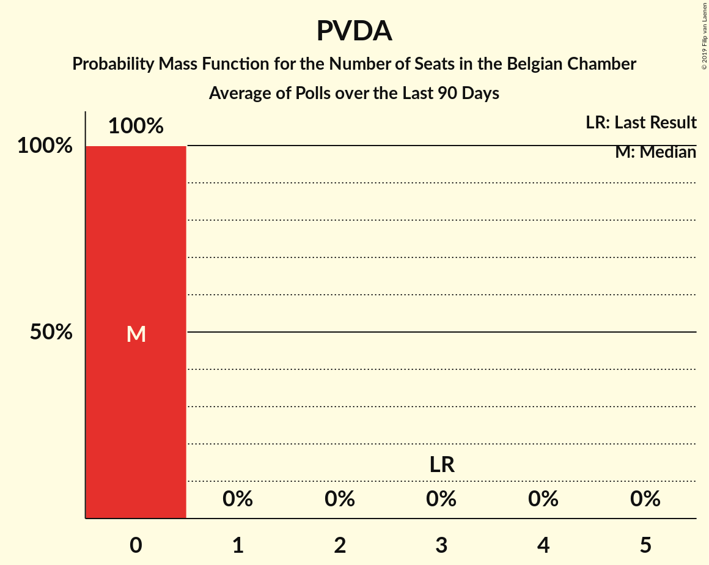
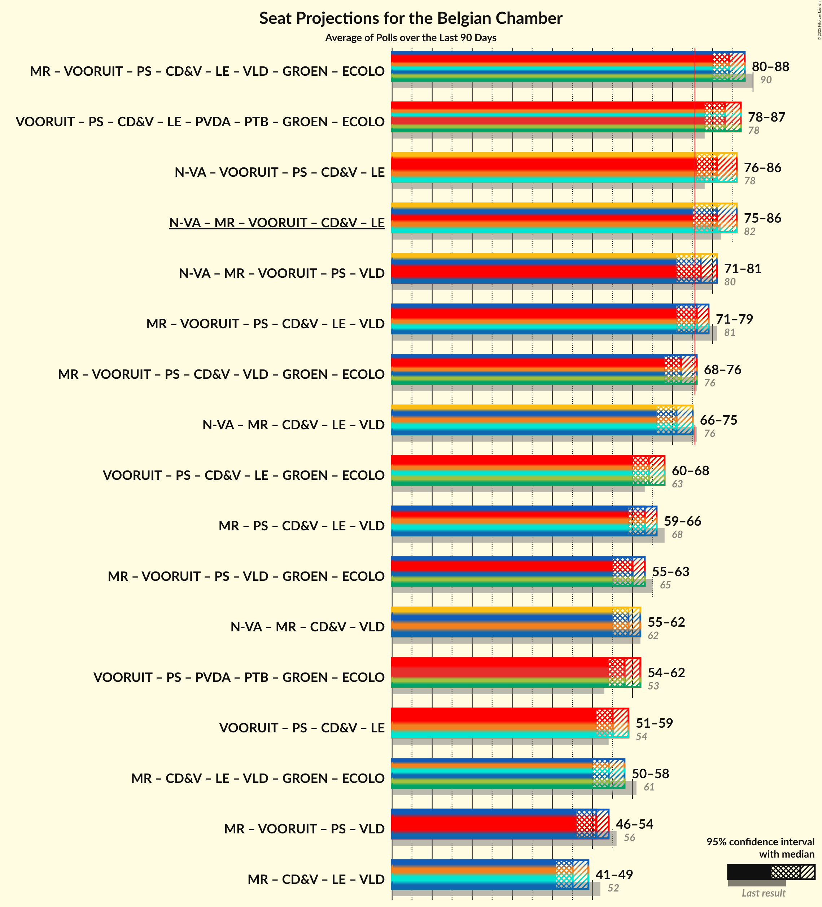

# Poll Average

<a href="#voting-intentions">Voting Intentions</a> | <a href="#seats">Seats</a> | <a href="#coalitions">Coalitions</a> | <a href="#technical-information">Technical Information</a>

## Summary

The table below lists the polls on which the average is based. They are the most recent polls (less than 90 days old) registered and analyzed so far.

| Period     | Polling firm/Commissioner(s) | N-VA | PS | CD&V | VLD | MR | SP.A | GROEN | CDH | VB | ECOLO | PTB | DÉFI | PVDA | PP | DLB | LDD | DROITE | PIRAAT | ISLAM | WDA | PIRATE | RWF | FW |
|:----------:|:----------------------------:|:--:|:--:|:--:|:--:|:--:|:--:|:--:|:--:|:--:|:--:|:--:|:--:|:--:|:--:|:--:|:--:|:--:|:--:|:--:|:--:|:--:|:--:|:--:|
| 25 May 2014 | General Election | 20.3%   33 | 11.7%   23 | 11.6%   18 | 9.8%   14 | 9.6%   20 | 8.8%   13 | 5.3%   6 | 5.0%   9 | 3.7%   3 | 3.3%   6 | 2.0%   2 | 1.8%   2 | 1.8%   0 | 1.5%   1 | 0.9%   0 | 0.4%   0 | 0.4%   0 | 0.3%   0 | 0.2%   0 | 0.2%   0 | 0.2%   0 | 0.1%   0 | 0.1%   0 |
| N/A | Poll Average | 15–17%   24–31 | 8%   15–20 | 7–8%   11–16 | 7–8%   10–14 | 7%   13–18 | 6–7%   9–13 | 6–8%   9–12 | 3%   4–8 | 6–7%   8–13 | 5%   9–13 | 4%   5–9 | 2%   2–4 | 3–4%   2–6 | 2%   1–3 | N/A   N/A | N/A   N/A | 0–1%   0 | N/A   N/A | N/A   N/A | N/A   N/A | N/A   N/A | N/A   N/A | N/A   N/A |
| [27 November–3 December 2018](2018-12-03-Ipsos.html) | Ipsos   Het Laatste Nieuws, Le Soir, RTL TVi and VTM | 15–17%   24–31 | 8%   15–20 | 7–8%   11–16 | 7–8%   10–14 | 7%   13–18 | 6–7%   9–13 | 6–8%   9–12 | 3%   4–8 | 6–7%   8–13 | 5%   9–13 | 4%   5–9 | 2%   2–4 | 3–4%   2–6 | 2%   1–3 | N/A   N/A | N/A   N/A | 0–1%   0 | N/A   N/A | N/A   N/A | N/A   N/A | N/A   N/A | N/A   N/A | N/A   N/A |
| 25 May 2014 | General Election | 20.3%   33 | 11.7%   23 | 11.6%   18 | 9.8%   14 | 9.6%   20 | 8.8%   13 | 5.3%   6 | 5.0%   9 | 3.7%   3 | 3.3%   6 | 2.0%   2 | 1.8%   2 | 1.8%   0 | 1.5%   1 | 0.9%   0 | 0.4%   0 | 0.4%   0 | 0.3%   0 | 0.2%   0 | 0.2%   0 | 0.2%   0 | 0.1%   0 | 0.1%   0 |

Only polls for which at least the sample size has been published are included in the table above.

**Legend:**
+ **Top half of each row:** Voting intentions (95% confidence interval)
+ **Bottom half of each row:** Seat projections for the Belgian Chamber (95% confidence interval)
+ **N-VA:** N-VA
+ **PS:** PS
+ **CD&V:** CD&V
+ **VLD:** Open Vld
+ **MR:** MR
+ **SP.A:** sp.a
+ **GROEN:** Groen
+ **CDH:** cdH
+ **VB:** Vlaams Belang
+ **ECOLO:** Ecolo
+ **PTB:** PTB
+ **DÉFI:** DéFI
+ **PVDA:** PVDA
+ **PP:** Parti Populaire
+ **DLB:** Debout les Belges
+ **LDD:** Lijst Dedecker
+ **DROITE:** La Droite
+ **PIRAAT:** Piratenpartij
+ **ISLAM:** ISLAM
+ **WDA:** Wallonie d’Abord
+ **PIRATE:** PIRATE
+ **RWF:** R.W.F.
+ **FW:** FW
+ **N/A (single party):** Party not included the published results
+ **N/A (entire row):** Calculation for this opinion poll not started yet

## Voting Intentions

### Confidence Intervals

| Party | Last Result | Median | 80% Confidence Interval | 90% Confidence Interval | 95% Confidence Interval | 99% Confidence Interval |
|:-----:|:-----------:|:------:|:-----------------------:|:-----------------------:|:-----------------------:|:-----------------------:|
| <a href="#n-va">N-VA</a> | 20.3% | 16.4% | 15.8–16.7% |15.6–16.7% | 15.4–16.7% | 15.0–16.7% |
| <a href="#ps">PS</a> | 11.7% | 8.1% | 7.8–8.2% |7.7–8.2% | 7.6–8.2% | 7.4–8.2% |
| <a href="#cd&v">CD&V</a> | 11.6% | 8.2% | 7.7–8.4% |7.5–8.4% | 7.4–8.4% | 7.1–8.4% |
| <a href="#open-vld">Open Vld</a> | 9.8% | 7.5% | 7.0–7.7% |6.9–7.7% | 6.7–7.7% | 6.4–7.7% |
| <a href="#mr">MR</a> | 9.6% | 7.0% | 6.8–7.1% |6.7–7.2% | 6.6–7.2% | 6.4–7.2% |
| <a href="#sp.a">sp.a</a> | 8.8% | 6.8% | 6.4–7.0% |6.2–7.0% | 6.1–7.0% | 5.8–7.0% |
| <a href="#groen">Groen</a> | 5.3% | 7.5% | 6.8–8.2% |6.6–8.3% | 6.4–8.3% | 6.0–8.4% |
| <a href="#cdh">cdH</a> | 5.0% | 3.3% | 3.1–3.4% |3.0–3.4% | 3.0–3.4% | 2.8–3.4% |
| <a href="#vlaams-belang">Vlaams Belang</a> | 3.7% | 6.5% | 6.1–6.7% |5.9–6.7% | 5.8–6.7% | 5.5–6.7% |
| <a href="#ecolo">Ecolo</a> | 3.3% | 5.1% | 4.9–5.2% |4.8–5.2% | 4.7–5.2% | 4.6–5.2% |
| <a href="#ptb">PTB</a> | 2.0% | 3.9% | 3.7–4.0% |3.6–4.0% | 3.6–4.0% | 3.4–4.0% |
| <a href="#défi">DéFI</a> | 1.8% | 2.0% | 1.9–2.1% |1.8–2.1% | 1.8–2.1% | 1.7–2.1% |
| <a href="#pvda">PVDA</a> | 1.8% | 3.8% | 3.3–4.3% |3.1–4.4% | 3.0–4.5% | 2.8–4.5% |
| <a href="#parti-populaire">Parti Populaire</a> | 1.5% | 1.8% | 1.7–1.9% |1.6–1.9% | 1.6–1.9% | 1.5–1.9% |
| <a href="#debout-les-belges">Debout les Belges</a> | 0.9% | N/A | N/A |N/A | N/A | N/A |
| <a href="#lijst-dedecker">Lijst Dedecker</a> | 0.4% | N/A | N/A |N/A | N/A | N/A |
| <a href="#la-droite">La Droite</a> | 0.4% | 0.6% | 0.5–0.7% |0.5–0.7% | 0.5–0.8% | 0.4–0.8% |
| <a href="#piratenpartij">Piratenpartij</a> | 0.3% | N/A | N/A |N/A | N/A | N/A |
| <a href="#islam">ISLAM</a> | 0.2% | N/A | N/A |N/A | N/A | N/A |
| <a href="#wallonie-d’abord">Wallonie d’Abord</a> | 0.2% | N/A | N/A |N/A | N/A | N/A |
| <a href="#pirate">PIRATE</a> | 0.2% | N/A | N/A |N/A | N/A | N/A |
| <a href="#r.w.f.">R.W.F.</a> | 0.1% | N/A | N/A |N/A | N/A | N/A |
| <a href="#fw">FW</a> | 0.1% | N/A | N/A |N/A | N/A | N/A |

### N-VA

*For a full overview of the results for this party, see the [N-VA](party-n-va.html) page.*

| Voting Intentions | Probability | Accumulated | Special Marks |
|:-----------------:|:-----------:|:-----------:|:-------------:|
| 13.5–14.5% | 0.1% | 100% |  |
| 14.5–15.5% | 4% | 99.9% |  |
| 15.5–16.5% | 66% | 95% | Median |
| 16.5–17.5% | 100% | 30% |  |
| 17.5–18.5% | 100% | 0% |  |
| 18.5–19.5% | 100% | 0% |  |
| 19.5–20.5% | 14% | 0% | Last Result |
| 20.5–21.5% | 0.6% | 0% |  |

### PS

*For a full overview of the results for this party, see the [PS](party-ps.html) page.*

| Voting Intentions | Probability | Accumulated | Special Marks |
|:-----------------:|:-----------:|:-----------:|:-------------:|
| 5.5–6.5% | 0% | 100% |  |
| 6.5–7.5% | 2% | 100% |  |
| 7.5–8.5% | 100% | 98% | Median |
| 8.5–9.5% | 100% | 0% |  |
| 9.5–10.5% | 57% | 0% |  |
| 10.5–11.5% | 0.1% | 0% |  |
| 11.5–12.5% | 0% | 0% | Last Result |

### CD&V

*For a full overview of the results for this party, see the [CD&V](party-cdv.html) page.*

| Voting Intentions | Probability | Accumulated | Special Marks |
|:-----------------:|:-----------:|:-----------:|:-------------:|
| 5.5–6.5% | 0% | 100% |  |
| 6.5–7.5% | 5% | 100% |  |
| 7.5–8.5% | 100% | 95% | Median |
| 8.5–9.5% | 100% | 0% |  |
| 9.5–10.5% | 100% | 0% |  |
| 10.5–11.5% | 19% | 0% |  |
| 11.5–12.5% | 0.4% | 0% | Last Result |

### Open Vld

*For a full overview of the results for this party, see the [Open Vld](party-openvld.html) page.*

| Voting Intentions | Probability | Accumulated | Special Marks |
|:-----------------:|:-----------:|:-----------:|:-------------:|
| 4.5–5.5% | 0% | 100% |  |
| 5.5–6.5% | 1.0% | 100% |  |
| 6.5–7.5% | 66% | 99.0% | Median |
| 7.5–8.5% | 100% | 33% |  |
| 8.5–9.5% | 100% | 0% |  |
| 9.5–10.5% | 36% | 0% | Last Result |
| 10.5–11.5% | 1.0% | 0% |  |

### MR

*For a full overview of the results for this party, see the [MR](party-mr.html) page.*

| Voting Intentions | Probability | Accumulated | Special Marks |
|:-----------------:|:-----------:|:-----------:|:-------------:|
| 4.5–5.5% | 0% | 100% |  |
| 5.5–6.5% | 2% | 100% |  |
| 6.5–7.5% | 100% | 98% | Median |
| 7.5–8.5% | 100% | 0% |  |
| 8.5–9.5% | 31% | 0% |  |
| 9.5–10.5% | 0% | 0% | Last Result |

### sp.a

*For a full overview of the results for this party, see the [sp.a](party-spa.html) page.*

| Voting Intentions | Probability | Accumulated | Special Marks |
|:-----------------:|:-----------:|:-----------:|:-------------:|
| 4.5–5.5% | 0.1% | 100% |  |
| 5.5–6.5% | 21% | 99.9% |  |
| 6.5–7.5% | 100% | 79% | Median |
| 7.5–8.5% | 100% | 0% |  |
| 8.5–9.5% | 75% | 0% | Last Result |
| 9.5–10.5% | 3% | 0% |  |

### Groen

*For a full overview of the results for this party, see the [Groen](party-groen.html) page.*

| Voting Intentions | Probability | Accumulated | Special Marks |
|:-----------------:|:-----------:|:-----------:|:-------------:|
| 4.5–5.5% | 0% | 100% | Last Result |
| 5.5–6.5% | 5% | 100% |  |
| 6.5–7.5% | 47% | 95% |  |
| 7.5–8.5% | 51% | 48% | Median |
| 8.5–9.5% | 8% | 0% |  |
| 9.5–10.5% | 0.2% | 0% |  |

### cdH

*For a full overview of the results for this party, see the [cdH](party-cdh.html) page.*

| Voting Intentions | Probability | Accumulated | Special Marks |
|:-----------------:|:-----------:|:-----------:|:-------------:|
| 1.5–2.5% | 0% | 100% |  |
| 2.5–3.5% | 100% | 100% | Median |
| 3.5–4.5% | 100% | 0% |  |
| 4.5–5.5% | 15% | 0% | Last Result |

### Vlaams Belang

*For a full overview of the results for this party, see the [Vlaams Belang](party-vlaamsbelang.html) page.*

| Voting Intentions | Probability | Accumulated | Special Marks |
|:-----------------:|:-----------:|:-----------:|:-------------:|
| 3.5–4.5% | 0% | 100% | Last Result |
| 4.5–5.5% | 0.6% | 100% |  |
| 5.5–6.5% | 64% | 99.4% | Median |
| 6.5–7.5% | 100% | 35% |  |
| 7.5–8.5% | 100% | 0% |  |
| 8.5–9.5% | 27% | 0% |  |
| 9.5–10.5% | 0.5% | 0% |  |

### Ecolo

*For a full overview of the results for this party, see the [Ecolo](party-ecolo.html) page.*

| Voting Intentions | Probability | Accumulated | Special Marks |
|:-----------------:|:-----------:|:-----------:|:-------------:|
| 2.5–3.5% | 0% | 100% | Last Result |
| 3.5–4.5% | 0.4% | 100% |  |
| 4.5–5.5% | 100% | 99.6% | Median |
| 5.5–6.5% | 100% | 0% |  |
| 6.5–7.5% | 12% | 0% |  |

### PTB

*For a full overview of the results for this party, see the [PTB](party-ptb.html) page.*

| Voting Intentions | Probability | Accumulated | Special Marks |
|:-----------------:|:-----------:|:-----------:|:-------------:|
| 1.5–2.5% | 0% | 100% | Last Result |
| 2.5–3.5% | 2% | 100% |  |
| 3.5–4.5% | 100% | 98% | Median |
| 4.5–5.5% | 100% | 0% |  |
| 5.5–6.5% | 1.5% | 0% |  |

### DéFI

*For a full overview of the results for this party, see the [DéFI](party-défi.html) page.*

| Voting Intentions | Probability | Accumulated | Special Marks |
|:-----------------:|:-----------:|:-----------:|:-------------:|
| 0.5–1.5% | 0% | 100% |  |
| 1.5–2.5% | 100% | 100% | Last Result, Median |
| 2.5–3.5% | 100% | 0% |  |

### PVDA

*For a full overview of the results for this party, see the [PVDA](party-pvda.html) page.*

| Voting Intentions | Probability | Accumulated | Special Marks |
|:-----------------:|:-----------:|:-----------:|:-------------:|
| 1.5–2.5% | 0.1% | 100% | Last Result |
| 2.5–3.5% | 26% | 99.9% |  |
| 3.5–4.5% | 75% | 74% | Median |
| 4.5–5.5% | 10% | 0% |  |
| 5.5–6.5% | 0.1% | 0% |  |

### Parti Populaire

*For a full overview of the results for this party, see the [Parti Populaire](party-partipopulaire.html) page.*

| Voting Intentions | Probability | Accumulated | Special Marks |
|:-----------------:|:-----------:|:-----------:|:-------------:|
| 0.0–0.5% | 0% | 100% |  |
| 0.5–1.5% | 2% | 100% |  |
| 1.5–2.5% | 100% | 98% | Last Result, Median |
| 2.5–3.5% | 96% | 0% |  |

### La Droite

*For a full overview of the results for this party, see the [La Droite](party-ladroite.html) page.*

| Voting Intentions | Probability | Accumulated | Special Marks |
|:-----------------:|:-----------:|:-----------:|:-------------:|
| 0.0–0.5% | 17% | 100% | Last Result |
| 0.5–1.5% | 100% | 83% | Median |
| 1.5–2.5% | 0% | 0% |  |

## Seats

### Confidence Intervals

| Party | Last Result | Median | 80% Confidence Interval | 90% Confidence Interval | 95% Confidence Interval | 99% Confidence Interval |
|:-----:|:-----------:|:------:|:-----------------------:|:-----------------------:|:-----------------------:|:-----------------------:|
| <a href="#n-va">N-VA</a> | 33 | 28 | 26–30 |25–30 | 24–31 | 24–32 |
| <a href="#ps">PS</a> | 23 | 17 | 16–19 |16–19 | 15–20 | 14–21 |
| <a href="#cd&v">CD&V</a> | 18 | 13 | 12–14 |11–15 | 11–16 | 10–17 |
| <a href="#open-vld">Open Vld</a> | 14 | 12 | 11–13 |11–14 | 10–14 | 9–16 |
| <a href="#mr">MR</a> | 20 | 16 | 14–17 |13–18 | 13–18 | 13–18 |
| <a href="#sp.a">sp.a</a> | 13 | 11 | 9–12 |9–13 | 9–13 | 8–14 |
| <a href="#groen">Groen</a> | 6 | 11 | 10–12 |10–12 | 9–12 | 7–13 |
| <a href="#cdh">cdH</a> | 9 | 6 | 4–8 |4–8 | 4–8 | 3–9 |
| <a href="#vlaams-belang">Vlaams Belang</a> | 3 | 9 | 8–12 |8–12 | 8–13 | 7–13 |
| <a href="#ecolo">Ecolo</a> | 6 | 10 | 9–12 |9–13 | 9–13 | 8–14 |
| <a href="#ptb">PTB</a> | 2 | 7 | 6–9 |6–9 | 5–9 | 5–9 |
| <a href="#défi">DéFI</a> | 2 | 3 | 2–3 |2–3 | 2–4 | 2–4 |
| <a href="#pvda">PVDA</a> | 0 | 3 | 2–5 |2–5 | 2–6 | 1–7 |
| <a href="#parti-populaire">Parti Populaire</a> | 1 | 2 | 2–3 |1–3 | 1–3 | 0–3 |
| <a href="#debout-les-belges">Debout les Belges</a> | 0 | N/A | N/A |N/A | N/A | N/A |
| <a href="#lijst-dedecker">Lijst Dedecker</a> | 0 | N/A | N/A |N/A | N/A | N/A |
| <a href="#la-droite">La Droite</a> | 0 | 0 | 0 |0 | 0 | 0 |
| <a href="#piratenpartij">Piratenpartij</a> | 0 | N/A | N/A |N/A | N/A | N/A |
| <a href="#islam">ISLAM</a> | 0 | N/A | N/A |N/A | N/A | N/A |
| <a href="#wallonie-d’abord">Wallonie d’Abord</a> | 0 | N/A | N/A |N/A | N/A | N/A |
| <a href="#pirate">PIRATE</a> | 0 | N/A | N/A |N/A | N/A | N/A |
| <a href="#r.w.f.">R.W.F.</a> | 0 | N/A | N/A |N/A | N/A | N/A |
| <a href="#fw">FW</a> | 0 | N/A | N/A |N/A | N/A | N/A |

### N-VA

*For a full overview of the results for this party, see the [N-VA](party-n-va.html) page.*

| Number of Seats | Probability | Accumulated | Special Marks |
|:---------------:|:-----------:|:-----------:|:-------------:|
| 23 | 0.4% | 100% |  |
| 24 | 2% | 99.6% |  |
| 25 | 7% | 97% |  |
| 26 | 12% | 90% |  |
| 27 | 14% | 78% |  |
| 28 | 22% | 64% | Median |
| 29 | 24% | 42% |  |
| 30 | 15% | 18% |  |
| 31 | 2% | 3% |  |
| 32 | 0.7% | 1.0% |  |
| 33 | 0.3% | 0.4% | Last Result |
| 34 | 0.1% | 0.1% |  |
| 35 | 0% | 0% |  |

### PS

*For a full overview of the results for this party, see the [PS](party-ps.html) page.*

| Number of Seats | Probability | Accumulated | Special Marks |
|:---------------:|:-----------:|:-----------:|:-------------:|
| 14 | 0.7% | 100% |  |
| 15 | 3% | 99.3% |  |
| 16 | 17% | 96% |  |
| 17 | 31% | 79% | Median |
| 18 | 27% | 48% |  |
| 19 | 17% | 22% |  |
| 20 | 4% | 5% |  |
| 21 | 0.4% | 0.5% |  |
| 22 | 0.1% | 0.1% |  |
| 23 | 0% | 0% | Last Result |

### CD&V

*For a full overview of the results for this party, see the [CD&V](party-cdv.html) page.*

| Number of Seats | Probability | Accumulated | Special Marks |
|:---------------:|:-----------:|:-----------:|:-------------:|
| 9 | 0.1% | 100% |  |
| 10 | 2% | 99.9% |  |
| 11 | 4% | 98% |  |
| 12 | 6% | 94% |  |
| 13 | 61% | 88% | Median |
| 14 | 20% | 27% |  |
| 15 | 4% | 7% |  |
| 16 | 2% | 3% |  |
| 17 | 0.8% | 1.2% |  |
| 18 | 0.4% | 0.4% | Last Result |
| 19 | 0% | 0% |  |

### Open Vld

*For a full overview of the results for this party, see the [Open Vld](party-openvld.html) page.*

| Number of Seats | Probability | Accumulated | Special Marks |
|:---------------:|:-----------:|:-----------:|:-------------:|
| 8 | 0.5% | 100% |  |
| 9 | 0.6% | 99.5% |  |
| 10 | 2% | 99.0% |  |
| 11 | 12% | 97% |  |
| 12 | 70% | 85% | Median |
| 13 | 9% | 15% |  |
| 14 | 4% | 6% | Last Result |
| 15 | 1.2% | 2% |  |
| 16 | 0.4% | 0.5% |  |
| 17 | 0.1% | 0.2% |  |
| 18 | 0% | 0% |  |

### MR

*For a full overview of the results for this party, see the [MR](party-mr.html) page.*

| Number of Seats | Probability | Accumulated | Special Marks |
|:---------------:|:-----------:|:-----------:|:-------------:|
| 12 | 0.1% | 100% |  |
| 13 | 6% | 99.9% |  |
| 14 | 14% | 94% |  |
| 15 | 16% | 80% |  |
| 16 | 32% | 64% | Median |
| 17 | 25% | 32% |  |
| 18 | 6% | 7% |  |
| 19 | 0.4% | 0.4% |  |
| 20 | 0% | 0% | Last Result |

### sp.a

*For a full overview of the results for this party, see the [sp.a](party-spa.html) page.*

| Number of Seats | Probability | Accumulated | Special Marks |
|:---------------:|:-----------:|:-----------:|:-------------:|
| 7 | 0.1% | 100% |  |
| 8 | 0.7% | 99.9% |  |
| 9 | 14% | 99.3% |  |
| 10 | 11% | 85% |  |
| 11 | 56% | 74% | Median |
| 12 | 10% | 17% |  |
| 13 | 6% | 8% | Last Result |
| 14 | 1.1% | 1.5% |  |
| 15 | 0.4% | 0.4% |  |
| 16 | 0% | 0% |  |

### Groen

*For a full overview of the results for this party, see the [Groen](party-groen.html) page.*

| Number of Seats | Probability | Accumulated | Special Marks |
|:---------------:|:-----------:|:-----------:|:-------------:|
| 6 | 0.1% | 100% | Last Result |
| 7 | 0.5% | 99.9% |  |
| 8 | 0.5% | 99.4% |  |
| 9 | 2% | 98.9% |  |
| 10 | 31% | 96% |  |
| 11 | 45% | 65% | Median |
| 12 | 19% | 20% |  |
| 13 | 1.1% | 1.2% |  |
| 14 | 0.1% | 0.2% |  |
| 15 | 0% | 0.1% |  |
| 16 | 0% | 0% |  |

### cdH

*For a full overview of the results for this party, see the [cdH](party-cdh.html) page.*

| Number of Seats | Probability | Accumulated | Special Marks |
|:---------------:|:-----------:|:-----------:|:-------------:|
| 3 | 1.3% | 100% |  |
| 4 | 11% | 98.7% |  |
| 5 | 22% | 87% |  |
| 6 | 18% | 65% | Median |
| 7 | 24% | 48% |  |
| 8 | 22% | 24% |  |
| 9 | 2% | 2% | Last Result |
| 10 | 0% | 0% |  |

### Vlaams Belang

*For a full overview of the results for this party, see the [Vlaams Belang](party-vlaamsbelang.html) page.*

| Number of Seats | Probability | Accumulated | Special Marks |
|:---------------:|:-----------:|:-----------:|:-------------:|
| 3 | 0% | 100% | Last Result |
| 4 | 0% | 100% |  |
| 5 | 0% | 100% |  |
| 6 | 0% | 100% |  |
| 7 | 0.9% | 100% |  |
| 8 | 33% | 99.1% |  |
| 9 | 21% | 66% | Median |
| 10 | 11% | 45% |  |
| 11 | 12% | 34% |  |
| 12 | 18% | 21% |  |
| 13 | 3% | 3% |  |
| 14 | 0% | 0% |  |

### Ecolo

*For a full overview of the results for this party, see the [Ecolo](party-ecolo.html) page.*

| Number of Seats | Probability | Accumulated | Special Marks |
|:---------------:|:-----------:|:-----------:|:-------------:|
| 6 | 0% | 100% | Last Result |
| 7 | 0% | 100% |  |
| 8 | 1.0% | 100% |  |
| 9 | 14% | 99.0% |  |
| 10 | 41% | 85% | Median |
| 11 | 20% | 44% |  |
| 12 | 17% | 24% |  |
| 13 | 6% | 7% |  |
| 14 | 0.8% | 0.9% |  |
| 15 | 0.1% | 0.1% |  |
| 16 | 0% | 0% |  |

### PTB

*For a full overview of the results for this party, see the [PTB](party-ptb.html) page.*

| Number of Seats | Probability | Accumulated | Special Marks |
|:---------------:|:-----------:|:-----------:|:-------------:|
| 2 | 0% | 100% | Last Result |
| 3 | 0% | 100% |  |
| 4 | 0.2% | 100% |  |
| 5 | 4% | 99.8% |  |
| 6 | 21% | 96% |  |
| 7 | 28% | 75% | Median |
| 8 | 35% | 48% |  |
| 9 | 12% | 12% |  |
| 10 | 0.2% | 0.2% |  |
| 11 | 0% | 0% |  |

### DéFI

*For a full overview of the results for this party, see the [DéFI](party-défi.html) page.*

| Number of Seats | Probability | Accumulated | Special Marks |
|:---------------:|:-----------:|:-----------:|:-------------:|
| 2 | 33% | 100% | Last Result |
| 3 | 63% | 67% | Median |
| 4 | 3% | 4% |  |
| 5 | 0.4% | 0.5% |  |
| 6 | 0.1% | 0.1% |  |
| 7 | 0% | 0% |  |

### PVDA

*For a full overview of the results for this party, see the [PVDA](party-pvda.html) page.*

| Number of Seats | Probability | Accumulated | Special Marks |
|:---------------:|:-----------:|:-----------:|:-------------:|
| 0 | 0% | 100% | Last Result |
| 1 | 1.3% | 100% |  |
| 2 | 10% | 98.7% |  |
| 3 | 68% | 89% | Median |
| 4 | 10% | 20% |  |
| 5 | 8% | 11% |  |
| 6 | 3% | 3% |  |
| 7 | 0.7% | 0.8% |  |
| 8 | 0.1% | 0.1% |  |
| 9 | 0% | 0% |  |

### Parti Populaire

*For a full overview of the results for this party, see the [Parti Populaire](party-partipopulaire.html) page.*

| Number of Seats | Probability | Accumulated | Special Marks |
|:---------------:|:-----------:|:-----------:|:-------------:|
| 0 | 1.4% | 100% |  |
| 1 | 5% | 98.6% | Last Result |
| 2 | 73% | 93% | Median |
| 3 | 20% | 20% |  |
| 4 | 0.1% | 0.1% |  |
| 5 | 0% | 0% |  |

### La Droite

*For a full overview of the results for this party, see the [La Droite](party-ladroite.html) page.*

| Number of Seats | Probability | Accumulated | Special Marks |
|:---------------:|:-----------:|:-----------:|:-------------:|
| 0 | 100% | 100% | Last Result, Median |

## Coalitions

### Confidence Intervals

| Coalition | Last Result | Median | Majority? | 80% Confidence Interval | 90% Confidence Interval | 95% Confidence Interval | 99% Confidence Interval |
|:---------:|:-----------:|:------:|:---------:|:-----------------------:|:-----------------------:|:-----------------------:|:-----------------------:|
| PS – CD&V – Open Vld – MR – sp.a – Groen – cdH – Ecolo | 109 | 97 | 100% | 94–100 | 93–101 | 93–101 | 91–103 |
| N-VA – PS – Open Vld – MR – sp.a | 103 | 84 | 100% | 81–87 | 80–88 | 80–88 | 78–90 |
| PS – CD&V – sp.a – Groen – cdH – Ecolo – PTB – PVDA | 77 | 80 | 97% | 77–83 | 76–83 | 75–84 | 74–86 |
| PS – Open Vld – MR – sp.a – Groen – Ecolo | 82 | 78 | 82% | 75–81 | 74–81 | 73–82 | 72–84 |
| PS – CD&V – Open Vld – MR – sp.a – cdH | 97 | 76 | 52% | 73–78 | 72–79 | 71–80 | 70–82 |
| N-VA – CD&V – Open Vld – MR – cdH | 94 | 75 | 46% | 72–78 | 71–79 | 70–80 | 68–81 |
| PS – CD&V – sp.a – Groen – cdH – Ecolo | 75 | 69 | 0.3% | 66–72 | 65–73 | 65–74 | 63–75 |
| CD&V – Open Vld – MR – Groen – cdH – Ecolo | 73 | 69 | 0.1% | 66–71 | 65–72 | 64–73 | 63–74 |
| N-VA – CD&V – Open Vld – MR | 85 | 69 | 0.1% | 66–72 | 65–73 | 64–73 | 63–75 |
| PS – sp.a – Groen – cdH – Ecolo – PTB – PVDA | 59 | 67 | 0% | 64–69 | 63–70 | 62–71 | 61–72 |
| PS – CD&V – Open Vld – MR – cdH | 84 | 65 | 0% | 62–67 | 61–68 | 61–69 | 59–70 |
| PS – sp.a – Groen – Ecolo – PTB – PVDA | 50 | 60 | 0% | 57–63 | 57–64 | 56–65 | 55–67 |
| PS – Open Vld – MR – sp.a | 70 | 56 | 0% | 54–59 | 53–60 | 52–60 | 51–62 |
| PS – CD&V – sp.a – cdH | 63 | 48 | 0% | 45–51 | 44–51 | 44–52 | 42–54 |
| CD&V – Open Vld – MR – cdH | 61 | 47 | 0% | 44–50 | 44–51 | 43–51 | 41–53 |

### PS – CD&V – Open Vld – MR – sp.a – Groen – cdH – Ecolo

| Number of Seats | Probability | Accumulated | Special Marks |
|:---------------:|:-----------:|:-----------:|:-------------:|
| 90 | 0.1% | 100% |  |
| 91 | 0.4% | 99.9% |  |
| 92 | 1.5% | 99.4% |  |
| 93 | 4% | 98% |  |
| 94 | 7% | 94% |  |
| 95 | 12% | 87% |  |
| 96 | 16% | 76% | Median |
| 97 | 19% | 60% |  |
| 98 | 17% | 41% |  |
| 99 | 12% | 24% |  |
| 100 | 7% | 12% |  |
| 101 | 3% | 5% |  |
| 102 | 1.4% | 2% |  |
| 103 | 0.5% | 0.6% |  |
| 104 | 0.1% | 0.2% |  |
| 105 | 0% | 0% |  |
| 106 | 0% | 0% |  |
| 107 | 0% | 0% |  |
| 108 | 0% | 0% |  |
| 109 | 0% | 0% | Last Result |

### N-VA – PS – Open Vld – MR – sp.a

| Number of Seats | Probability | Accumulated | Special Marks |
|:---------------:|:-----------:|:-----------:|:-------------:|
| 76 | 0% | 100% | Majority |
| 77 | 0.2% | 99.9% |  |
| 78 | 0.5% | 99.8% |  |
| 79 | 1.4% | 99.3% |  |
| 80 | 3% | 98% |  |
| 81 | 7% | 95% |  |
| 82 | 11% | 88% |  |
| 83 | 16% | 77% |  |
| 84 | 18% | 61% | Median |
| 85 | 17% | 43% |  |
| 86 | 12% | 26% |  |
| 87 | 7% | 14% |  |
| 88 | 4% | 6% |  |
| 89 | 2% | 2% |  |
| 90 | 0.6% | 0.8% |  |
| 91 | 0.2% | 0.2% |  |
| 92 | 0% | 0.1% |  |
| 93 | 0% | 0% |  |
| 94 | 0% | 0% |  |
| 95 | 0% | 0% |  |
| 96 | 0% | 0% |  |
| 97 | 0% | 0% |  |
| 98 | 0% | 0% |  |
| 99 | 0% | 0% |  |
| 100 | 0% | 0% |  |
| 101 | 0% | 0% |  |
| 102 | 0% | 0% |  |
| 103 | 0% | 0% | Last Result |

### PS – CD&V – sp.a – Groen – cdH – Ecolo – PTB – PVDA

| Number of Seats | Probability | Accumulated | Special Marks |
|:---------------:|:-----------:|:-----------:|:-------------:|
| 73 | 0.2% | 100% |  |
| 74 | 0.8% | 99.8% |  |
| 75 | 2% | 99.0% |  |
| 76 | 5% | 97% | Majority |
| 77 | 8% | 92% | Last Result |
| 78 | 13% | 84% | Median |
| 79 | 17% | 71% |  |
| 80 | 18% | 54% |  |
| 81 | 15% | 36% |  |
| 82 | 11% | 22% |  |
| 83 | 6% | 11% |  |
| 84 | 3% | 5% |  |
| 85 | 1.3% | 2% |  |
| 86 | 0.4% | 0.6% |  |
| 87 | 0.1% | 0.2% |  |
| 88 | 0% | 0% |  |

### PS – Open Vld – MR – sp.a – Groen – Ecolo

| Number of Seats | Probability | Accumulated | Special Marks |
|:---------------:|:-----------:|:-----------:|:-------------:|
| 70 | 0.1% | 100% |  |
| 71 | 0.3% | 99.9% |  |
| 72 | 0.9% | 99.7% |  |
| 73 | 2% | 98.7% |  |
| 74 | 5% | 96% |  |
| 75 | 10% | 91% |  |
| 76 | 14% | 82% | Majority |
| 77 | 17% | 67% | Median |
| 78 | 17% | 51% |  |
| 79 | 14% | 34% |  |
| 80 | 10% | 20% |  |
| 81 | 6% | 11% |  |
| 82 | 3% | 5% | Last Result |
| 83 | 1.2% | 2% |  |
| 84 | 0.4% | 0.6% |  |
| 85 | 0.1% | 0.2% |  |
| 86 | 0% | 0% |  |

### PS – CD&V – Open Vld – MR – sp.a – cdH

| Number of Seats | Probability | Accumulated | Special Marks |
|:---------------:|:-----------:|:-----------:|:-------------:|
| 68 | 0.1% | 100% |  |
| 69 | 0.3% | 99.9% |  |
| 70 | 0.9% | 99.6% |  |
| 71 | 2% | 98.8% |  |
| 72 | 5% | 96% |  |
| 73 | 9% | 91% |  |
| 74 | 14% | 82% |  |
| 75 | 17% | 69% | Median |
| 76 | 17% | 52% | Majority |
| 77 | 15% | 34% |  |
| 78 | 10% | 20% |  |
| 79 | 6% | 10% |  |
| 80 | 3% | 4% |  |
| 81 | 1.0% | 2% |  |
| 82 | 0.4% | 0.5% |  |
| 83 | 0.1% | 0.1% |  |
| 84 | 0% | 0% |  |
| 85 | 0% | 0% |  |
| 86 | 0% | 0% |  |
| 87 | 0% | 0% |  |
| 88 | 0% | 0% |  |
| 89 | 0% | 0% |  |
| 90 | 0% | 0% |  |
| 91 | 0% | 0% |  |
| 92 | 0% | 0% |  |
| 93 | 0% | 0% |  |
| 94 | 0% | 0% |  |
| 95 | 0% | 0% |  |
| 96 | 0% | 0% |  |
| 97 | 0% | 0% | Last Result |

### N-VA – CD&V – Open Vld – MR – cdH

| Number of Seats | Probability | Accumulated | Special Marks |
|:---------------:|:-----------:|:-----------:|:-------------:|
| 67 | 0.1% | 100% |  |
| 68 | 0.4% | 99.8% |  |
| 69 | 1.1% | 99.4% |  |
| 70 | 2% | 98% |  |
| 71 | 4% | 96% |  |
| 72 | 7% | 92% |  |
| 73 | 10% | 85% |  |
| 74 | 13% | 75% |  |
| 75 | 15% | 62% | Median |
| 76 | 15% | 46% | Majority |
| 77 | 13% | 32% |  |
| 78 | 9% | 19% |  |
| 79 | 5% | 9% |  |
| 80 | 2% | 4% |  |
| 81 | 1.0% | 1.3% |  |
| 82 | 0.3% | 0.4% |  |
| 83 | 0.1% | 0.1% |  |
| 84 | 0% | 0% |  |
| 85 | 0% | 0% |  |
| 86 | 0% | 0% |  |
| 87 | 0% | 0% |  |
| 88 | 0% | 0% |  |
| 89 | 0% | 0% |  |
| 90 | 0% | 0% |  |
| 91 | 0% | 0% |  |
| 92 | 0% | 0% |  |
| 93 | 0% | 0% |  |
| 94 | 0% | 0% | Last Result |

### PS – CD&V – sp.a – Groen – cdH – Ecolo

| Number of Seats | Probability | Accumulated | Special Marks |
|:---------------:|:-----------:|:-----------:|:-------------:|
| 62 | 0.1% | 100% |  |
| 63 | 0.5% | 99.9% |  |
| 64 | 1.5% | 99.4% |  |
| 65 | 3% | 98% |  |
| 66 | 7% | 95% |  |
| 67 | 11% | 88% |  |
| 68 | 15% | 77% | Median |
| 69 | 17% | 62% |  |
| 70 | 17% | 45% |  |
| 71 | 13% | 28% |  |
| 72 | 8% | 15% |  |
| 73 | 4% | 7% |  |
| 74 | 2% | 3% |  |
| 75 | 0.7% | 1.0% | Last Result |
| 76 | 0.2% | 0.3% | Majority |
| 77 | 0.1% | 0.1% |  |
| 78 | 0% | 0% |  |

### CD&V – Open Vld – MR – Groen – cdH – Ecolo

| Number of Seats | Probability | Accumulated | Special Marks |
|:---------------:|:-----------:|:-----------:|:-------------:|
| 61 | 0.1% | 100% |  |
| 62 | 0.2% | 99.9% |  |
| 63 | 0.6% | 99.7% |  |
| 64 | 2% | 99.1% |  |
| 65 | 4% | 97% |  |
| 66 | 8% | 93% |  |
| 67 | 13% | 86% |  |
| 68 | 18% | 73% | Median |
| 69 | 20% | 54% |  |
| 70 | 16% | 34% |  |
| 71 | 10% | 18% |  |
| 72 | 5% | 8% |  |
| 73 | 2% | 3% | Last Result |
| 74 | 0.7% | 1.0% |  |
| 75 | 0.2% | 0.3% |  |
| 76 | 0.1% | 0.1% | Majority |
| 77 | 0% | 0% |  |

### N-VA – CD&V – Open Vld – MR

| Number of Seats | Probability | Accumulated | Special Marks |
|:---------------:|:-----------:|:-----------:|:-------------:|
| 61 | 0% | 100% |  |
| 62 | 0.2% | 99.9% |  |
| 63 | 0.7% | 99.7% |  |
| 64 | 2% | 99.0% |  |
| 65 | 4% | 97% |  |
| 66 | 8% | 93% |  |
| 67 | 12% | 85% |  |
| 68 | 15% | 73% |  |
| 69 | 16% | 58% | Median |
| 70 | 16% | 42% |  |
| 71 | 13% | 26% |  |
| 72 | 8% | 13% |  |
| 73 | 4% | 6% |  |
| 74 | 1.4% | 2% |  |
| 75 | 0.4% | 0.5% |  |
| 76 | 0.1% | 0.1% | Majority |
| 77 | 0% | 0% |  |
| 78 | 0% | 0% |  |
| 79 | 0% | 0% |  |
| 80 | 0% | 0% |  |
| 81 | 0% | 0% |  |
| 82 | 0% | 0% |  |
| 83 | 0% | 0% |  |
| 84 | 0% | 0% |  |
| 85 | 0% | 0% | Last Result |

### PS – sp.a – Groen – cdH – Ecolo – PTB – PVDA

| Number of Seats | Probability | Accumulated | Special Marks |
|:---------------:|:-----------:|:-----------:|:-------------:|
| 59 | 0% | 100% | Last Result |
| 60 | 0.1% | 100% |  |
| 61 | 0.6% | 99.9% |  |
| 62 | 2% | 99.2% |  |
| 63 | 5% | 97% |  |
| 64 | 9% | 92% |  |
| 65 | 14% | 83% | Median |
| 66 | 18% | 69% |  |
| 67 | 18% | 50% |  |
| 68 | 14% | 32% |  |
| 69 | 9% | 18% |  |
| 70 | 5% | 9% |  |
| 71 | 2% | 3% |  |
| 72 | 0.8% | 1.2% |  |
| 73 | 0.3% | 0.4% |  |
| 74 | 0.1% | 0.1% |  |
| 75 | 0% | 0% |  |

### PS – CD&V – Open Vld – MR – cdH

| Number of Seats | Probability | Accumulated | Special Marks |
|:---------------:|:-----------:|:-----------:|:-------------:|
| 58 | 0.2% | 100% |  |
| 59 | 0.5% | 99.8% |  |
| 60 | 1.5% | 99.3% |  |
| 61 | 4% | 98% |  |
| 62 | 8% | 94% |  |
| 63 | 14% | 86% |  |
| 64 | 18% | 72% | Median |
| 65 | 19% | 55% |  |
| 66 | 16% | 36% |  |
| 67 | 11% | 20% |  |
| 68 | 5% | 9% |  |
| 69 | 2% | 4% |  |
| 70 | 0.9% | 1.3% |  |
| 71 | 0.3% | 0.4% |  |
| 72 | 0.1% | 0.1% |  |
| 73 | 0% | 0% |  |
| 74 | 0% | 0% |  |
| 75 | 0% | 0% |  |
| 76 | 0% | 0% | Majority |
| 77 | 0% | 0% |  |
| 78 | 0% | 0% |  |
| 79 | 0% | 0% |  |
| 80 | 0% | 0% |  |
| 81 | 0% | 0% |  |
| 82 | 0% | 0% |  |
| 83 | 0% | 0% |  |
| 84 | 0% | 0% | Last Result |

### PS – sp.a – Groen – Ecolo – PTB – PVDA

| Number of Seats | Probability | Accumulated | Special Marks |
|:---------------:|:-----------:|:-----------:|:-------------:|
| 50 | 0% | 100% | Last Result |
| 51 | 0% | 100% |  |
| 52 | 0% | 100% |  |
| 53 | 0.1% | 100% |  |
| 54 | 0.3% | 99.9% |  |
| 55 | 1.3% | 99.6% |  |
| 56 | 3% | 98% |  |
| 57 | 6% | 95% |  |
| 58 | 11% | 89% |  |
| 59 | 15% | 78% | Median |
| 60 | 17% | 62% |  |
| 61 | 16% | 45% |  |
| 62 | 12% | 30% |  |
| 63 | 8% | 18% |  |
| 64 | 5% | 9% |  |
| 65 | 3% | 4% |  |
| 66 | 1.2% | 2% |  |
| 67 | 0.4% | 0.6% |  |
| 68 | 0.1% | 0.2% |  |
| 69 | 0% | 0.1% |  |
| 70 | 0% | 0% |  |

### PS – Open Vld – MR – sp.a

| Number of Seats | Probability | Accumulated | Special Marks |
|:---------------:|:-----------:|:-----------:|:-------------:|
| 50 | 0.1% | 100% |  |
| 51 | 0.6% | 99.8% |  |
| 52 | 2% | 99.2% |  |
| 53 | 5% | 97% |  |
| 54 | 11% | 92% |  |
| 55 | 18% | 80% |  |
| 56 | 21% | 62% | Median |
| 57 | 18% | 42% |  |
| 58 | 12% | 24% |  |
| 59 | 7% | 12% |  |
| 60 | 3% | 5% |  |
| 61 | 1.3% | 2% |  |
| 62 | 0.4% | 0.6% |  |
| 63 | 0.1% | 0.2% |  |
| 64 | 0% | 0% |  |
| 65 | 0% | 0% |  |
| 66 | 0% | 0% |  |
| 67 | 0% | 0% |  |
| 68 | 0% | 0% |  |
| 69 | 0% | 0% |  |
| 70 | 0% | 0% | Last Result |

### PS – CD&V – sp.a – cdH

| Number of Seats | Probability | Accumulated | Special Marks |
|:---------------:|:-----------:|:-----------:|:-------------:|
| 41 | 0.1% | 100% |  |
| 42 | 0.5% | 99.9% |  |
| 43 | 2% | 99.3% |  |
| 44 | 4% | 98% |  |
| 45 | 8% | 93% |  |
| 46 | 14% | 85% |  |
| 47 | 17% | 71% | Median |
| 48 | 18% | 54% |  |
| 49 | 15% | 36% |  |
| 50 | 11% | 21% |  |
| 51 | 6% | 11% |  |
| 52 | 3% | 5% |  |
| 53 | 1.1% | 2% |  |
| 54 | 0.4% | 0.5% |  |
| 55 | 0.1% | 0.2% |  |
| 56 | 0% | 0% |  |
| 57 | 0% | 0% |  |
| 58 | 0% | 0% |  |
| 59 | 0% | 0% |  |
| 60 | 0% | 0% |  |
| 61 | 0% | 0% |  |
| 62 | 0% | 0% |  |
| 63 | 0% | 0% | Last Result |

### CD&V – Open Vld – MR – cdH

| Number of Seats | Probability | Accumulated | Special Marks |
|:---------------:|:-----------:|:-----------:|:-------------:|
| 40 | 0.1% | 100% |  |
| 41 | 0.4% | 99.8% |  |
| 42 | 1.2% | 99.4% |  |
| 43 | 3% | 98% |  |
| 44 | 6% | 95% |  |
| 45 | 9% | 89% |  |
| 46 | 14% | 80% |  |
| 47 | 18% | 65% | Median |
| 48 | 18% | 47% |  |
| 49 | 16% | 29% |  |
| 50 | 8% | 13% |  |
| 51 | 3% | 5% |  |
| 52 | 1.3% | 2% |  |
| 53 | 0.5% | 0.7% |  |
| 54 | 0.2% | 0.2% |  |
| 55 | 0% | 0% |  |
| 56 | 0% | 0% |  |
| 57 | 0% | 0% |  |
| 58 | 0% | 0% |  |
| 59 | 0% | 0% |  |
| 60 | 0% | 0% |  |
| 61 | 0% | 0% | Last Result |

## Technical Information

+ **Number of polls included in this average:** 1
+ **Lowest number of simulations done in a poll included in this average:** 524,288
+ **Total number of simulations done in the polls included in this average:** 524,288
+ **Error estimate:** 0.44%
