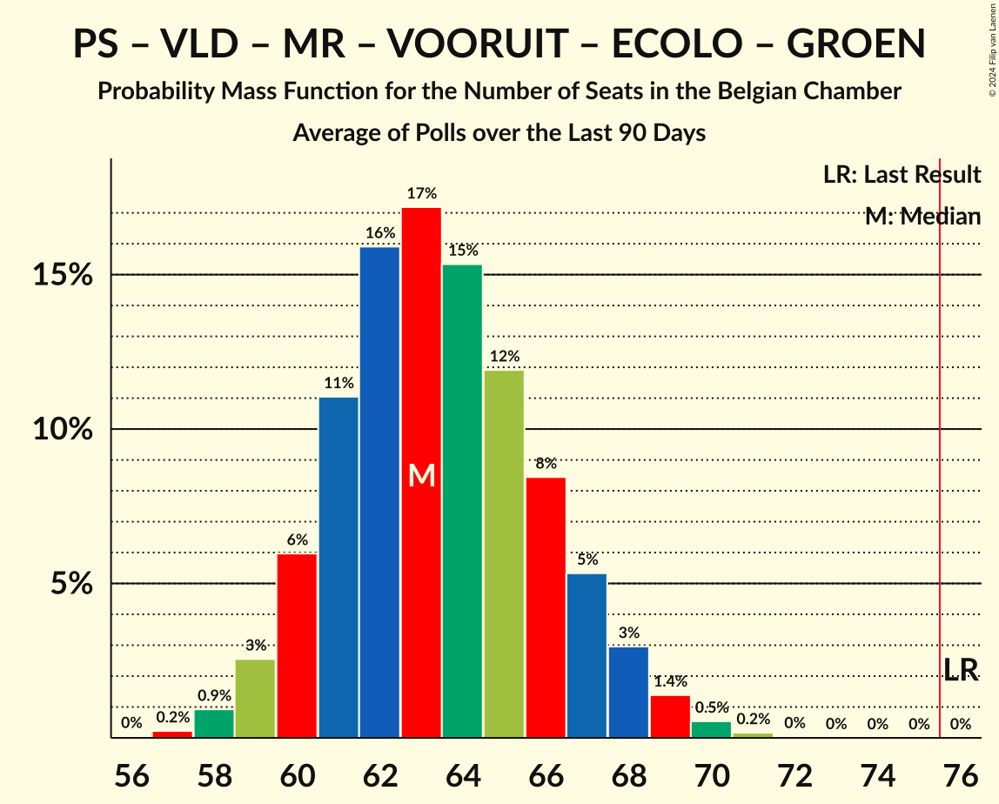
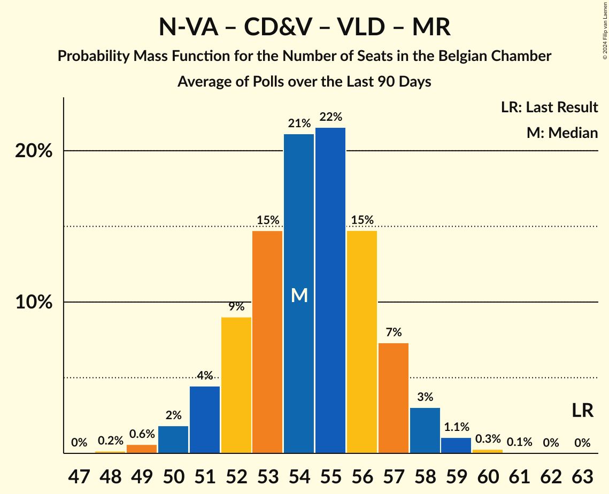
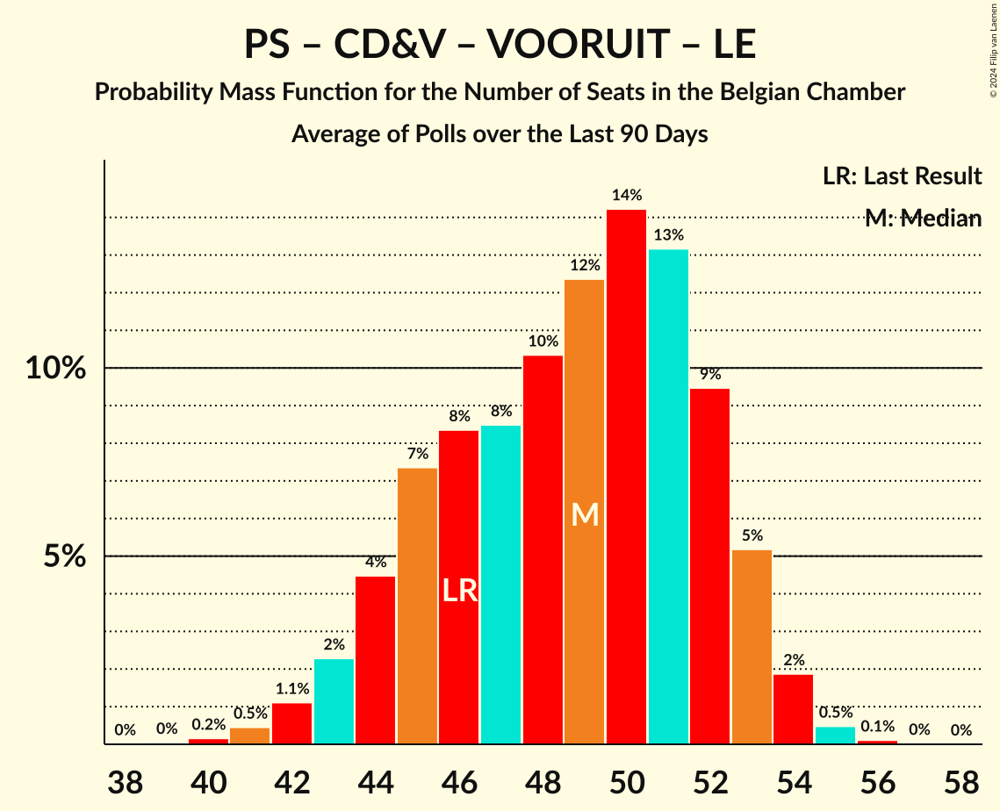

# Poll Average

<a href="#voting-intentions">Voting Intentions</a> | <a href="#seats">Seats</a> | <a href="#coalitions">Coalitions</a> | <a href="#technical-information">Technical Information</a>

## Summary

The table below lists the polls on which the average is based. They are the most recent polls (less than 90 days old) registered and analyzed so far.

| Period     | Polling firm/Commissioner(s) | N-VA | VB | PS | CD&V | PTB | PVDA | VLD | MR | VOORUIT | ECOLO | GROEN | LE | DÉFI | PP |
|:----------:|:----------------------------:|:--:|:--:|:--:|:--:|:--:|:--:|:--:|:--:|:--:|:--:|:--:|:--:|:--:|:--:|
| 26 May 2019 | General Election | 16.0%   25 | 12.0%   18 | 9.5%   20 | 8.9%   12 | 4.8%   9 | 3.3%   3 | 8.5%   12 | 7.6%   14 | 6.7%   9 | 6.1%   13 | 6.1%   8 | 3.7%   5 | 2.2%   2 | 1.1%   0 |
| N/A | Poll Average | 10–12%   16–24 | 12–14%   19–26 | 8%   16–21 | 6–8%   9–15 | 5–6%   10–16 | 4–7%   5–9 | 4–5%   3–9 | 6–7%   13–18 | 8–11%   11–17 | 4%   6–12 | 4–6%   4–9 | 3%   4–10 | 1–2%   1–3 | N/A   N/A |
| [4–11 December 2023](2023-12-11-Ipsos.html) | Ipsos   Het Laatste Nieuws, Le Soir, RTL TVi and VTM | 12–15%   18–24 | 14–16%   21–26 | 8%   15–20 | 6–8%   8–12 | 5%   9–12 | 5–7%   6–9 | 4–5%   3–6 | 6–7%   13–17 | 7–9%   10–15 | 5%   9–13 | 5–6%   5–9 | 4%   6–10 | 1–2%   1–2 | N/A   N/A |
| [10 September–9 October 2023](2023-10-09-Kantar.html) | Kantar   La Libre Belgique and RTBf | 10–12%   16–24 | 12–14%   19–26 | 8–9%   17–22 | 6–8%   10–15 | 6%   10–16 | 4–6%   5–9 | 4%   3–9 | 6–7%   12–18 | 8–11%   11–18 | 4%   6–11 | 4–6%   3–9 | 3%   4–9 | 1–2%   1–3 | N/A   N/A |
| 26 May 2019 | General Election | 16.0%   25 | 12.0%   18 | 9.5%   20 | 8.9%   12 | 4.8%   9 | 3.3%   3 | 8.5%   12 | 7.6%   14 | 6.7%   9 | 6.1%   13 | 6.1%   8 | 3.7%   5 | 2.2%   2 | 1.1%   0 |

Only polls for which at least the sample size has been published are included in the table above.

**Legend:**
+ **Top half of each row:** Voting intentions (95% confidence interval)
+ **Bottom half of each row:** Seat projections for the Belgian Chamber (95% confidence interval)
+ **N-VA:** Nieuw-Vlaamse Alliantie
+ **VB:** Vlaams Belang
+ **PS:** Parti Socialiste
+ **CD&V:** Christen-Democratisch en Vlaams
+ **PTB:** Parti du Travail de Belgique
+ **PVDA:** Partij van de Arbeid van België
+ **VLD:** Open Vlaamse Liberalen en Democraten
+ **MR:** Mouvement Réformateur
+ **VOORUIT:** Vooruit
+ **ECOLO:** Ecolo
+ **GROEN:** Groen
+ **LE:** Les Engagés
+ **DÉFI:** DéFI
+ **PP:** Parti Populaire
+ **N/A (single party):** Party not included the published results
+ **N/A (entire row):** Calculation for this opinion poll not started yet

## Voting Intentions

### Confidence Intervals

| Party | Last Result | Median | 80% Confidence Interval | 90% Confidence Interval | 95% Confidence Interval | 99% Confidence Interval |
|:-----:|:-----------:|:------:|:-----------------------:|:-----------------------:|:-----------------------:|:-----------------------:|
| <a href="#nieuw-vlaamse-alliantie">Nieuw-Vlaamse Alliantie</a> | 16.0% | 11.9% | 11.1–12.2% |10.8–12.3% | 10.5–12.3% | 10.1–12.3% |
| <a href="#vlaams-belang">Vlaams Belang</a> | 12.0% | 13.6% | 12.7–14.0% |12.4–14.0% | 12.2–14.1% | 11.6–14.1% |
| <a href="#parti-socialiste">Parti Socialiste</a> | 9.5% | 8.1% | 7.8–8.2% |7.7–8.2% | 7.6–8.2% | 7.4–8.2% |
| <a href="#christen-democratisch-en-vlaams">Christen-Democratisch en Vlaams</a> | 8.9% | 7.3% | 6.6–7.8% |6.4–7.8% | 6.2–7.8% | 5.8–7.8% |
| <a href="#open-vlaamse-liberalen-en-democraten">Open Vlaamse Liberalen en Democraten</a> | 8.5% | 4.3% | 3.8–4.5% |3.6–4.6% | 3.5–4.6% | 3.2–4.6% |
| <a href="#mouvement-réformateur">Mouvement Réformateur</a> | 7.6% | 6.9% | 6.5–7.0% |6.4–7.0% | 6.3–7.0% | 6.0–7.1% |
| <a href="#vooruit">Vooruit</a> | 6.7% | 9.0% | 7.9–10.3% |7.7–10.5% | 7.5–10.7% | 7.0–10.8% |
| <a href="#ecolo">Ecolo</a> | 6.1% | 4.3% | 3.9–4.4% |3.8–4.4% | 3.7–4.4% | 3.5–4.5% |
| <a href="#groen">Groen</a> | 6.1% | 5.4% | 4.5–6.0% |4.2–6.2% | 4.0–6.2% | 3.6–6.3% |
| <a href="#parti-du-travail-de-belgique">Parti du Travail de Belgique</a> | 4.8% | 5.4% | 5.2–5.6% |5.1–5.6% | 5.0–5.6% | 4.9–5.6% |
| <a href="#les-engagés">Les Engagés</a> | 3.7% | 3.2% | 2.9–3.3% |2.8–3.4% | 2.7–3.4% | 2.5–3.4% |
| <a href="#partij-van-de-arbeid-van-belgië">Partij van de Arbeid van België</a> | 3.3% | 5.7% | 4.8–6.4% |4.6–6.5% | 4.4–6.6% | 3.9–6.7% |
| <a href="#défi">DéFI</a> | 2.2% | 1.5% | 1.4–1.6% |1.3–1.6% | 1.3–1.6% | 1.1–1.6% |
| <a href="#parti-populaire">Parti Populaire</a> | 1.1% | N/A | N/A |N/A | N/A | N/A |

### Nieuw-Vlaamse Alliantie

*For a full overview of the results for this party, see the [Nieuw-Vlaamse Alliantie](party-nieuw-vlaamsealliantie.html) page.*

| Voting Intentions | Probability | Accumulated | Special Marks |
|:-----------------:|:-----------:|:-----------:|:-------------:|
| 8.5–9.5% | 0.1% | 100% |  |
| 9.5–10.5% | 3% | 99.9% |  |
| 10.5–11.5% | 27% | 97% |  |
| 11.5–12.5% | 99.9% | 71% | Median |
| 12.5–13.5% | 100% | 0% |  |
| 13.5–14.5% | 100% | 0% |  |
| 14.5–15.5% | 31% | 0% |  |
| 15.5–16.5% | 4% | 0% | Last Result |

### Vlaams Belang

*For a full overview of the results for this party, see the [Vlaams Belang](party-vlaamsbelang.html) page.*

| Voting Intentions | Probability | Accumulated | Special Marks |
|:-----------------:|:-----------:|:-----------:|:-------------:|
| 9.5–10.5% | 0% | 100% |  |
| 10.5–11.5% | 0.4% | 100% |  |
| 11.5–12.5% | 6% | 99.6% | Last Result |
| 12.5–13.5% | 42% | 93% |  |
| 13.5–14.5% | 100% | 51% | Median |
| 14.5–15.5% | 100% | 0% |  |
| 15.5–16.5% | 90% | 0% |  |
| 16.5–17.5% | 25% | 0% |  |
| 17.5–18.5% | 3% | 0% |  |

### Parti Socialiste

*For a full overview of the results for this party, see the [Parti Socialiste](party-partisocialiste.html) page.*

| Voting Intentions | Probability | Accumulated | Special Marks |
|:-----------------:|:-----------:|:-----------:|:-------------:|
| 5.5–6.5% | 0% | 100% |  |
| 6.5–7.5% | 2% | 100% |  |
| 7.5–8.5% | 100% | 98% | Median |
| 8.5–9.5% | 100% | 0% | Last Result |
| 9.5–10.5% | 100% | 0% |  |
| 10.5–11.5% | 94% | 0% |  |
| 11.5–12.5% | 5% | 0% |  |

### Christen-Democratisch en Vlaams

*For a full overview of the results for this party, see the [Christen-Democratisch en Vlaams](party-christen-democratischenvlaams.html) page.*

| Voting Intentions | Probability | Accumulated | Special Marks |
|:-----------------:|:-----------:|:-----------:|:-------------:|
| 3.5–4.5% | 0% | 100% |  |
| 4.5–5.5% | 0.1% | 100% |  |
| 5.5–6.5% | 8% | 99.9% |  |
| 6.5–7.5% | 60% | 92% | Median |
| 7.5–8.5% | 100% | 32% |  |
| 8.5–9.5% | 100% | 0% | Last Result |
| 9.5–10.5% | 58% | 0% |  |
| 10.5–11.5% | 10% | 0% |  |
| 11.5–12.5% | 0.7% | 0% |  |

### Open Vlaamse Liberalen en Democraten

*For a full overview of the results for this party, see the [Open Vlaamse Liberalen en Democraten](party-openvlaamseliberalenendemocraten.html) page.*

| Voting Intentions | Probability | Accumulated | Special Marks |
|:-----------------:|:-----------:|:-----------:|:-------------:|
| 1.5–2.5% | 0% | 100% |  |
| 2.5–3.5% | 3% | 100% |  |
| 3.5–4.5% | 91% | 97% | Median |
| 4.5–5.5% | 100% | 6% |  |
| 5.5–6.5% | 100% | 0% |  |
| 6.5–7.5% | 14% | 0% |  |
| 7.5–8.5% | 0.6% | 0% |  |
| 8.5–9.5% | 0% | 0% | Last Result |

### Mouvement Réformateur

*For a full overview of the results for this party, see the [Mouvement Réformateur](party-mouvementréformateur.html) page.*

| Voting Intentions | Probability | Accumulated | Special Marks |
|:-----------------:|:-----------:|:-----------:|:-------------:|
| 4.5–5.5% | 0% | 100% |  |
| 5.5–6.5% | 10% | 100% |  |
| 6.5–7.5% | 100% | 90% | Median |
| 7.5–8.5% | 100% | 0% | Last Result |
| 8.5–9.5% | 79% | 0% |  |
| 9.5–10.5% | 2% | 0% |  |

### Vooruit

*For a full overview of the results for this party, see the [Vooruit](party-vooruit.html) page.*

| Voting Intentions | Probability | Accumulated | Special Marks |
|:-----------------:|:-----------:|:-----------:|:-------------:|
| 5.5–6.5% | 0% | 100% |  |
| 6.5–7.5% | 3% | 100% | Last Result |
| 7.5–8.5% | 28% | 97% |  |
| 8.5–9.5% | 38% | 69% | Median |
| 9.5–10.5% | 26% | 31% |  |
| 10.5–11.5% | 13% | 4% |  |
| 11.5–12.5% | 3% | 0% |  |

### Ecolo

*For a full overview of the results for this party, see the [Ecolo](party-ecolo.html) page.*

| Voting Intentions | Probability | Accumulated | Special Marks |
|:-----------------:|:-----------:|:-----------:|:-------------:|
| 1.5–2.5% | 0% | 100% |  |
| 2.5–3.5% | 0.6% | 100% |  |
| 3.5–4.5% | 100% | 99.4% | Median |
| 4.5–5.5% | 100% | 0% |  |
| 5.5–6.5% | 100% | 0% | Last Result |
| 6.5–7.5% | 9% | 0% |  |

### Groen

*For a full overview of the results for this party, see the [Groen](party-groen.html) page.*

| Voting Intentions | Probability | Accumulated | Special Marks |
|:-----------------:|:-----------:|:-----------:|:-------------:|
| 1.5–2.5% | 0% | 100% |  |
| 2.5–3.5% | 0.4% | 100% |  |
| 3.5–4.5% | 12% | 99.6% |  |
| 4.5–5.5% | 50% | 87% | Median |
| 5.5–6.5% | 43% | 37% | Last Result |
| 6.5–7.5% | 6% | 0% |  |

### Parti du Travail de Belgique

*For a full overview of the results for this party, see the [Parti du Travail de Belgique](party-partidutravaildebelgique.html) page.*

| Voting Intentions | Probability | Accumulated | Special Marks |
|:-----------------:|:-----------:|:-----------:|:-------------:|
| 3.5–4.5% | 0% | 100% |  |
| 4.5–5.5% | 90% | 100% | Last Result, Median |
| 5.5–6.5% | 100% | 10% |  |
| 6.5–7.5% | 100% | 0% |  |
| 7.5–8.5% | 100% | 0% |  |
| 8.5–9.5% | 7% | 0% |  |

### Les Engagés

*For a full overview of the results for this party, see the [Les Engagés](party-lesengagés.html) page.*

| Voting Intentions | Probability | Accumulated | Special Marks |
|:-----------------:|:-----------:|:-----------:|:-------------:|
| 0.5–1.5% | 0% | 100% |  |
| 1.5–2.5% | 0.8% | 100% |  |
| 2.5–3.5% | 100% | 99.2% | Median |
| 3.5–4.5% | 100% | 0% | Last Result |
| 4.5–5.5% | 100% | 0% |  |
| 5.5–6.5% | 18% | 0% |  |

### Partij van de Arbeid van België

*For a full overview of the results for this party, see the [Partij van de Arbeid van België](party-partijvandearbeidvanbelgië.html) page.*

| Voting Intentions | Probability | Accumulated | Special Marks |
|:-----------------:|:-----------:|:-----------:|:-------------:|
| 2.5–3.5% | 0.1% | 100% | Last Result |
| 3.5–4.5% | 5% | 99.9% |  |
| 4.5–5.5% | 35% | 95% |  |
| 5.5–6.5% | 55% | 60% | Median |
| 6.5–7.5% | 15% | 5% |  |
| 7.5–8.5% | 0.8% | 0% |  |

### DéFI

*For a full overview of the results for this party, see the [DéFI](party-défi.html) page.*

| Voting Intentions | Probability | Accumulated | Special Marks |
|:-----------------:|:-----------:|:-----------:|:-------------:|
| 0.0–0.5% | 0% | 100% |  |
| 0.5–1.5% | 54% | 100% |  |
| 1.5–2.5% | 100% | 46% | Last Result, Median |
| 2.5–3.5% | 35% | 0% |  |

## Seats

### Confidence Intervals

| Party | Last Result | Median | 80% Confidence Interval | 90% Confidence Interval | 95% Confidence Interval | 99% Confidence Interval |
|:-----:|:-----------:|:------:|:-----------------------:|:-----------------------:|:-----------------------:|:-----------------------:|
| <a href="#nieuw-vlaamse-alliantie">Nieuw-Vlaamse Alliantie</a> | 25 | 20 | 18–22 |17–23 | 16–24 | 16–25 |
| <a href="#vlaams-belang">Vlaams Belang</a> | 18 | 23 | 21–25 |20–25 | 19–26 | 17–28 |
| <a href="#parti-socialiste">Parti Socialiste</a> | 20 | 18 | 16–21 |16–21 | 16–21 | 15–22 |
| <a href="#christen-democratisch-en-vlaams">Christen-Democratisch en Vlaams</a> | 12 | 10 | 10–14 |10–15 | 9–15 | 7–16 |
| <a href="#open-vlaamse-liberalen-en-democraten">Open Vlaamse Liberalen en Democraten</a> | 12 | 6 | 3–7 |3–8 | 3–9 | 2–10 |
| <a href="#mouvement-réformateur">Mouvement Réformateur</a> | 14 | 15 | 13–17 |13–18 | 13–18 | 12–19 |
| <a href="#vooruit">Vooruit</a> | 9 | 13 | 11–16 |11–17 | 11–17 | 10–19 |
| <a href="#ecolo">Ecolo</a> | 13 | 9 | 8–12 |7–12 | 6–12 | 5–13 |
| <a href="#groen">Groen</a> | 8 | 7 | 5–9 |5–9 | 4–9 | 3–9 |
| <a href="#parti-du-travail-de-belgique">Parti du Travail de Belgique</a> | 9 | 12 | 10–14 |10–15 | 10–16 | 8–17 |
| <a href="#les-engagés">Les Engagés</a> | 5 | 7 | 4–9 |4–9 | 4–10 | 4–11 |
| <a href="#partij-van-de-arbeid-van-belgië">Partij van de Arbeid van België</a> | 3 | 8 | 6–9 |5–9 | 5–9 | 4–10 |
| <a href="#défi">DéFI</a> | 2 | 1 | 1–2 |1–3 | 1–3 | 0–4 |
| <a href="#parti-populaire">Parti Populaire</a> | 0 | N/A | N/A |N/A | N/A | N/A |

### Nieuw-Vlaamse Alliantie

*For a full overview of the results for this party, see the [Nieuw-Vlaamse Alliantie](party-nieuw-vlaamsealliantie.html) page.*

| Number of Seats | Probability | Accumulated | Special Marks |
|:---------------:|:-----------:|:-----------:|:-------------:|
| 15 | 0.4% | 100% |  |
| 16 | 2% | 99.5% |  |
| 17 | 5% | 97% |  |
| 18 | 9% | 92% |  |
| 19 | 10% | 84% |  |
| 20 | 30% | 74% | Median |
| 21 | 22% | 44% |  |
| 22 | 13% | 21% |  |
| 23 | 6% | 9% |  |
| 24 | 2% | 3% |  |
| 25 | 0.8% | 1.1% | Last Result |
| 26 | 0.2% | 0.3% |  |
| 27 | 0% | 0% |  |

### Vlaams Belang

*For a full overview of the results for this party, see the [Vlaams Belang](party-vlaamsbelang.html) page.*

| Number of Seats | Probability | Accumulated | Special Marks |
|:---------------:|:-----------:|:-----------:|:-------------:|
| 16 | 0.1% | 100% |  |
| 17 | 0.4% | 99.8% |  |
| 18 | 0.6% | 99.4% | Last Result |
| 19 | 2% | 98.8% |  |
| 20 | 4% | 97% |  |
| 21 | 19% | 93% |  |
| 22 | 16% | 74% |  |
| 23 | 16% | 58% | Median |
| 24 | 11% | 42% |  |
| 25 | 27% | 32% |  |
| 26 | 3% | 5% |  |
| 27 | 1.2% | 2% |  |
| 28 | 0.5% | 0.7% |  |
| 29 | 0.1% | 0.1% |  |
| 30 | 0% | 0% |  |

### Parti Socialiste

*For a full overview of the results for this party, see the [Parti Socialiste](party-partisocialiste.html) page.*

| Number of Seats | Probability | Accumulated | Special Marks |
|:---------------:|:-----------:|:-----------:|:-------------:|
| 13 | 0.1% | 100% |  |
| 14 | 0.4% | 99.9% |  |
| 15 | 1.3% | 99.6% |  |
| 16 | 9% | 98% |  |
| 17 | 28% | 89% |  |
| 18 | 15% | 61% | Median |
| 19 | 17% | 46% |  |
| 20 | 15% | 29% | Last Result |
| 21 | 12% | 14% |  |
| 22 | 1.3% | 2% |  |
| 23 | 0.3% | 0.4% |  |
| 24 | 0.1% | 0.1% |  |
| 25 | 0% | 0% |  |

### Christen-Democratisch en Vlaams

*For a full overview of the results for this party, see the [Christen-Democratisch en Vlaams](party-christen-democratischenvlaams.html) page.*

| Number of Seats | Probability | Accumulated | Special Marks |
|:---------------:|:-----------:|:-----------:|:-------------:|
| 6 | 0.2% | 100% |  |
| 7 | 0.3% | 99.8% |  |
| 8 | 1.2% | 99.5% |  |
| 9 | 3% | 98% |  |
| 10 | 48% | 95% | Median |
| 11 | 16% | 47% |  |
| 12 | 7% | 31% | Last Result |
| 13 | 12% | 24% |  |
| 14 | 5% | 12% |  |
| 15 | 5% | 6% |  |
| 16 | 0.8% | 1.1% |  |
| 17 | 0.2% | 0.3% |  |
| 18 | 0.1% | 0.1% |  |
| 19 | 0% | 0% |  |

### Open Vlaamse Liberalen en Democraten

*For a full overview of the results for this party, see the [Open Vlaamse Liberalen en Democraten](party-openvlaamseliberalenendemocraten.html) page.*

| Number of Seats | Probability | Accumulated | Special Marks |
|:---------------:|:-----------:|:-----------:|:-------------:|
| 2 | 0.9% | 100% |  |
| 3 | 11% | 99.1% |  |
| 4 | 23% | 88% |  |
| 5 | 10% | 65% |  |
| 6 | 42% | 55% | Median |
| 7 | 8% | 14% |  |
| 8 | 2% | 5% |  |
| 9 | 2% | 3% |  |
| 10 | 0.5% | 0.6% |  |
| 11 | 0% | 0% |  |
| 12 | 0% | 0% | Last Result |

### Mouvement Réformateur

*For a full overview of the results for this party, see the [Mouvement Réformateur](party-mouvementréformateur.html) page.*

| Number of Seats | Probability | Accumulated | Special Marks |
|:---------------:|:-----------:|:-----------:|:-------------:|
| 11 | 0.3% | 100% |  |
| 12 | 2% | 99.7% |  |
| 13 | 10% | 98% |  |
| 14 | 35% | 88% | Last Result |
| 15 | 25% | 52% | Median |
| 16 | 14% | 27% |  |
| 17 | 8% | 13% |  |
| 18 | 4% | 5% |  |
| 19 | 1.0% | 1.1% |  |
| 20 | 0.1% | 0.1% |  |
| 21 | 0% | 0% |  |

### Vooruit

*For a full overview of the results for this party, see the [Vooruit](party-vooruit.html) page.*

| Number of Seats | Probability | Accumulated | Special Marks |
|:---------------:|:-----------:|:-----------:|:-------------:|
| 9 | 0.3% | 100% | Last Result |
| 10 | 1.1% | 99.6% |  |
| 11 | 22% | 98.6% |  |
| 12 | 19% | 77% |  |
| 13 | 18% | 57% | Median |
| 14 | 11% | 40% |  |
| 15 | 15% | 29% |  |
| 16 | 7% | 14% |  |
| 17 | 4% | 6% |  |
| 18 | 2% | 2% |  |
| 19 | 0.6% | 0.7% |  |
| 20 | 0.1% | 0.1% |  |
| 21 | 0% | 0% |  |

### Ecolo

*For a full overview of the results for this party, see the [Ecolo](party-ecolo.html) page.*

| Number of Seats | Probability | Accumulated | Special Marks |
|:---------------:|:-----------:|:-----------:|:-------------:|
| 5 | 0.8% | 100% |  |
| 6 | 4% | 99.1% |  |
| 7 | 4% | 96% |  |
| 8 | 9% | 92% |  |
| 9 | 33% | 83% | Median |
| 10 | 26% | 50% |  |
| 11 | 14% | 24% |  |
| 12 | 9% | 11% |  |
| 13 | 2% | 2% | Last Result |
| 14 | 0.1% | 0.1% |  |
| 15 | 0% | 0% |  |

### Groen

*For a full overview of the results for this party, see the [Groen](party-groen.html) page.*

| Number of Seats | Probability | Accumulated | Special Marks |
|:---------------:|:-----------:|:-----------:|:-------------:|
| 3 | 2% | 100% |  |
| 4 | 2% | 98% |  |
| 5 | 20% | 96% |  |
| 6 | 13% | 75% |  |
| 7 | 30% | 62% | Median |
| 8 | 10% | 32% | Last Result |
| 9 | 22% | 22% |  |
| 10 | 0.2% | 0.2% |  |
| 11 | 0% | 0.1% |  |
| 12 | 0% | 0% |  |

### Parti du Travail de Belgique

*For a full overview of the results for this party, see the [Parti du Travail de Belgique](party-partidutravaildebelgique.html) page.*

| Number of Seats | Probability | Accumulated | Special Marks |
|:---------------:|:-----------:|:-----------:|:-------------:|
| 8 | 0.6% | 100% |  |
| 9 | 2% | 99.4% | Last Result |
| 10 | 17% | 98% |  |
| 11 | 31% | 81% |  |
| 12 | 28% | 50% | Median |
| 13 | 8% | 22% |  |
| 14 | 7% | 14% |  |
| 15 | 4% | 7% |  |
| 16 | 2% | 3% |  |
| 17 | 0.5% | 0.8% |  |
| 18 | 0.2% | 0.3% |  |
| 19 | 0% | 0% |  |

### Les Engagés

*For a full overview of the results for this party, see the [Les Engagés](party-lesengagés.html) page.*

| Number of Seats | Probability | Accumulated | Special Marks |
|:---------------:|:-----------:|:-----------:|:-------------:|
| 3 | 0% | 100% |  |
| 4 | 20% | 99.9% |  |
| 5 | 17% | 79% | Last Result |
| 6 | 9% | 62% |  |
| 7 | 9% | 53% | Median |
| 8 | 18% | 44% |  |
| 9 | 21% | 26% |  |
| 10 | 4% | 5% |  |
| 11 | 0.8% | 0.9% |  |
| 12 | 0% | 0% |  |

### Partij van de Arbeid van België

*For a full overview of the results for this party, see the [Partij van de Arbeid van België](party-partijvandearbeidvanbelgië.html) page.*

| Number of Seats | Probability | Accumulated | Special Marks |
|:---------------:|:-----------:|:-----------:|:-------------:|
| 3 | 0.2% | 100% | Last Result |
| 4 | 1.0% | 99.8% |  |
| 5 | 8% | 98.9% |  |
| 6 | 8% | 91% |  |
| 7 | 10% | 83% |  |
| 8 | 59% | 73% | Median |
| 9 | 13% | 15% |  |
| 10 | 1.2% | 1.5% |  |
| 11 | 0.1% | 0.2% |  |
| 12 | 0.1% | 0.1% |  |
| 13 | 0% | 0% |  |

### DéFI

*For a full overview of the results for this party, see the [DéFI](party-défi.html) page.*

| Number of Seats | Probability | Accumulated | Special Marks |
|:---------------:|:-----------:|:-----------:|:-------------:|
| 0 | 1.1% | 100% |  |
| 1 | 72% | 98.9% | Median |
| 2 | 21% | 27% | Last Result |
| 3 | 5% | 6% |  |
| 4 | 0.7% | 0.7% |  |
| 5 | 0% | 0% |  |

### Parti Populaire

*For a full overview of the results for this party, see the [Parti Populaire](party-partipopulaire.html) page.*

## Coalitions

### Confidence Intervals

| Coalition | Last Result | Median | Majority? | 80% Confidence Interval | 90% Confidence Interval | 95% Confidence Interval | 99% Confidence Interval |
|:---------:|:-----------:|:------:|:---------:|:-----------------------:|:-----------------------:|:-----------------------:|:-----------------------:|
| Parti Socialiste – Christen-Democratisch en Vlaams – Open Vlaamse Liberalen en Democraten – Mouvement Réformateur – Vooruit – Ecolo – Groen – Les Engagés | 93 | 86 | 100% | 83–90 | 82–91 | 81–92 | 80–94 |
| Parti Socialiste – Christen-Democratisch en Vlaams – Vooruit – Ecolo – Groen – Parti du Travail de Belgique – Les Engagés – Partij van de Arbeid van België | 79 | 85 | 100% | 82–89 | 81–90 | 80–91 | 79–93 |
| Parti Socialiste – Christen-Democratisch en Vlaams – Open Vlaamse Liberalen en Democraten – Mouvement Réformateur – Vooruit – Ecolo – Groen | 88 | 79 | 84% | 75–84 | 74–86 | 73–87 | 72–89 |
| Parti Socialiste – Vooruit – Ecolo – Groen – Parti du Travail de Belgique – Les Engagés – Partij van de Arbeid van België | 67 | 74 | 29% | 71–77 | 70–78 | 69–79 | 67–80 |
| Nieuw-Vlaamse Alliantie – Parti Socialiste – Open Vlaamse Liberalen en Democraten – Mouvement Réformateur – Vooruit | 80 | 72 | 19% | 68–77 | 67–78 | 66–79 | 64–81 |
| Parti Socialiste – Christen-Democratisch en Vlaams – Open Vlaamse Liberalen en Democraten – Mouvement Réformateur – Vooruit – Les Engagés | 72 | 69 | 6% | 65–75 | 64–76 | 64–77 | 62–79 |
| Parti Socialiste – Open Vlaamse Liberalen en Democraten – Mouvement Réformateur – Vooruit – Ecolo – Groen | 76 | 68 | 1.1% | 64–72 | 64–73 | 63–74 | 61–76 |
| Parti Socialiste – Vooruit – Ecolo – Groen – Parti du Travail de Belgique – Partij van de Arbeid van België | 62 | 67 | 0.6% | 64–71 | 63–73 | 62–74 | 61–76 |
| Parti Socialiste – Christen-Democratisch en Vlaams – Vooruit – Ecolo – Groen – Les Engagés | 67 | 66 | 0% | 63–69 | 62–70 | 61–71 | 59–73 |
| Nieuw-Vlaamse Alliantie – Christen-Democratisch en Vlaams – Open Vlaamse Liberalen en Democraten – Mouvement Réformateur – Les Engagés | 68 | 58 | 0% | 55–62 | 54–63 | 53–64 | 51–65 |
| Parti Socialiste – Christen-Democratisch en Vlaams – Open Vlaamse Liberalen en Democraten – Mouvement Réformateur – Les Engagés | 63 | 56 | 0% | 53–60 | 52–61 | 52–62 | 50–64 |
| Christen-Democratisch en Vlaams – Open Vlaamse Liberalen en Democraten – Mouvement Réformateur – Ecolo – Groen – Les Engagés | 64 | 55 | 0% | 50–58 | 49–59 | 48–59 | 46–61 |
| Parti Socialiste – Open Vlaamse Liberalen en Democraten – Mouvement Réformateur – Vooruit | 55 | 51 | 0% | 47–57 | 46–58 | 45–59 | 44–61 |
| Nieuw-Vlaamse Alliantie – Christen-Democratisch en Vlaams – Open Vlaamse Liberalen en Democraten – Mouvement Réformateur | 63 | 51 | 0% | 48–55 | 47–56 | 47–58 | 45–60 |
| Parti Socialiste – Christen-Democratisch en Vlaams – Vooruit – Les Engagés | 46 | 49 | 0% | 46–54 | 45–55 | 45–56 | 43–58 |
| Christen-Democratisch en Vlaams – Open Vlaamse Liberalen en Democraten – Mouvement Réformateur – Les Engagés | 43 | 38 | 0% | 35–41 | 34–42 | 33–43 | 32–45 |

### Parti Socialiste – Christen-Democratisch en Vlaams – Open Vlaamse Liberalen en Democraten – Mouvement Réformateur – Vooruit – Ecolo – Groen – Les Engagés

| Number of Seats | Probability | Accumulated | Special Marks |
|:---------------:|:-----------:|:-----------:|:-------------:|
| 77 | 0% | 100% |  |
| 78 | 0.1% | 99.9% |  |
| 79 | 0.3% | 99.8% |  |
| 80 | 0.9% | 99.5% |  |
| 81 | 2% | 98.7% |  |
| 82 | 5% | 96% |  |
| 83 | 8% | 92% |  |
| 84 | 13% | 84% |  |
| 85 | 16% | 71% | Median |
| 86 | 15% | 55% |  |
| 87 | 12% | 40% |  |
| 88 | 10% | 28% |  |
| 89 | 7% | 18% |  |
| 90 | 5% | 11% |  |
| 91 | 3% | 6% |  |
| 92 | 2% | 3% |  |
| 93 | 0.7% | 1.2% | Last Result |
| 94 | 0.3% | 0.5% |  |
| 95 | 0.1% | 0.2% |  |
| 96 | 0% | 0.1% |  |
| 97 | 0% | 0% |  |

### Parti Socialiste – Christen-Democratisch en Vlaams – Vooruit – Ecolo – Groen – Parti du Travail de Belgique – Les Engagés – Partij van de Arbeid van België

| Number of Seats | Probability | Accumulated | Special Marks |
|:---------------:|:-----------:|:-----------:|:-------------:|
| 77 | 0.1% | 100% |  |
| 78 | 0.3% | 99.9% |  |
| 79 | 0.8% | 99.6% | Last Result |
| 80 | 2% | 98.8% |  |
| 81 | 4% | 97% |  |
| 82 | 7% | 93% |  |
| 83 | 11% | 85% |  |
| 84 | 14% | 74% | Median |
| 85 | 15% | 60% |  |
| 86 | 14% | 45% |  |
| 87 | 11% | 31% |  |
| 88 | 8% | 20% |  |
| 89 | 5% | 12% |  |
| 90 | 3% | 6% |  |
| 91 | 2% | 3% |  |
| 92 | 0.9% | 2% |  |
| 93 | 0.5% | 0.7% |  |
| 94 | 0.2% | 0.3% |  |
| 95 | 0.1% | 0.1% |  |
| 96 | 0% | 0% |  |

### Parti Socialiste – Christen-Democratisch en Vlaams – Open Vlaamse Liberalen en Democraten – Mouvement Réformateur – Vooruit – Ecolo – Groen

| Number of Seats | Probability | Accumulated | Special Marks |
|:---------------:|:-----------:|:-----------:|:-------------:|
| 70 | 0.1% | 100% |  |
| 71 | 0.4% | 99.9% |  |
| 72 | 1.1% | 99.5% |  |
| 73 | 2% | 98% |  |
| 74 | 4% | 96% |  |
| 75 | 7% | 92% |  |
| 76 | 10% | 84% | Majority |
| 77 | 10% | 75% |  |
| 78 | 10% | 64% | Median |
| 79 | 9% | 54% |  |
| 80 | 8% | 45% |  |
| 81 | 8% | 37% |  |
| 82 | 7% | 29% |  |
| 83 | 7% | 22% |  |
| 84 | 5% | 15% |  |
| 85 | 4% | 10% |  |
| 86 | 3% | 6% |  |
| 87 | 2% | 3% |  |
| 88 | 0.8% | 1.4% | Last Result |
| 89 | 0.4% | 0.6% |  |
| 90 | 0.1% | 0.2% |  |
| 91 | 0.1% | 0.1% |  |
| 92 | 0% | 0% |  |

### Parti Socialiste – Vooruit – Ecolo – Groen – Parti du Travail de Belgique – Les Engagés – Partij van de Arbeid van België

| Number of Seats | Probability | Accumulated | Special Marks |
|:---------------:|:-----------:|:-----------:|:-------------:|
| 65 | 0.1% | 100% |  |
| 66 | 0.2% | 99.9% |  |
| 67 | 0.5% | 99.7% | Last Result |
| 68 | 1.0% | 99.2% |  |
| 69 | 2% | 98% |  |
| 70 | 4% | 96% |  |
| 71 | 7% | 92% |  |
| 72 | 10% | 86% |  |
| 73 | 14% | 76% |  |
| 74 | 16% | 61% | Median |
| 75 | 16% | 45% |  |
| 76 | 13% | 29% | Majority |
| 77 | 8% | 16% |  |
| 78 | 5% | 8% |  |
| 79 | 2% | 3% |  |
| 80 | 0.8% | 1.3% |  |
| 81 | 0.3% | 0.5% |  |
| 82 | 0.1% | 0.1% |  |
| 83 | 0% | 0% |  |

### Nieuw-Vlaamse Alliantie – Parti Socialiste – Open Vlaamse Liberalen en Democraten – Mouvement Réformateur – Vooruit

| Number of Seats | Probability | Accumulated | Special Marks |
|:---------------:|:-----------:|:-----------:|:-------------:|
| 63 | 0.1% | 100% |  |
| 64 | 0.4% | 99.9% |  |
| 65 | 1.2% | 99.5% |  |
| 66 | 3% | 98% |  |
| 67 | 5% | 95% |  |
| 68 | 8% | 90% |  |
| 69 | 10% | 82% |  |
| 70 | 11% | 72% |  |
| 71 | 10% | 62% |  |
| 72 | 9% | 52% | Median |
| 73 | 8% | 42% |  |
| 74 | 8% | 34% |  |
| 75 | 7% | 26% |  |
| 76 | 6% | 19% | Majority |
| 77 | 5% | 13% |  |
| 78 | 4% | 8% |  |
| 79 | 2% | 4% |  |
| 80 | 1.2% | 2% | Last Result |
| 81 | 0.6% | 1.1% |  |
| 82 | 0.3% | 0.5% |  |
| 83 | 0.1% | 0.2% |  |
| 84 | 0% | 0.1% |  |
| 85 | 0% | 0% |  |

### Parti Socialiste – Christen-Democratisch en Vlaams – Open Vlaamse Liberalen en Democraten – Mouvement Réformateur – Vooruit – Les Engagés

| Number of Seats | Probability | Accumulated | Special Marks |
|:---------------:|:-----------:|:-----------:|:-------------:|
| 61 | 0.1% | 100% |  |
| 62 | 0.4% | 99.9% |  |
| 63 | 1.4% | 99.5% |  |
| 64 | 4% | 98% |  |
| 65 | 6% | 95% |  |
| 66 | 9% | 88% |  |
| 67 | 11% | 79% |  |
| 68 | 11% | 69% |  |
| 69 | 11% | 58% | Median |
| 70 | 9% | 47% |  |
| 71 | 8% | 38% |  |
| 72 | 7% | 30% | Last Result |
| 73 | 6% | 22% |  |
| 74 | 5% | 16% |  |
| 75 | 4% | 10% |  |
| 76 | 3% | 6% | Majority |
| 77 | 2% | 3% |  |
| 78 | 1.0% | 2% |  |
| 79 | 0.5% | 0.8% |  |
| 80 | 0.2% | 0.3% |  |
| 81 | 0.1% | 0.1% |  |
| 82 | 0% | 0% |  |

### Parti Socialiste – Open Vlaamse Liberalen en Democraten – Mouvement Réformateur – Vooruit – Ecolo – Groen

| Number of Seats | Probability | Accumulated | Special Marks |
|:---------------:|:-----------:|:-----------:|:-------------:|
| 60 | 0.1% | 100% |  |
| 61 | 0.5% | 99.8% |  |
| 62 | 1.3% | 99.3% |  |
| 63 | 3% | 98% |  |
| 64 | 5% | 95% |  |
| 65 | 9% | 90% |  |
| 66 | 12% | 81% |  |
| 67 | 13% | 69% |  |
| 68 | 13% | 56% | Median |
| 69 | 11% | 43% |  |
| 70 | 9% | 32% |  |
| 71 | 8% | 22% |  |
| 72 | 6% | 15% |  |
| 73 | 4% | 9% |  |
| 74 | 2% | 5% |  |
| 75 | 1.3% | 2% |  |
| 76 | 0.6% | 1.1% | Last Result, Majority |
| 77 | 0.3% | 0.4% |  |
| 78 | 0.1% | 0.2% |  |
| 79 | 0% | 0% |  |

### Parti Socialiste – Vooruit – Ecolo – Groen – Parti du Travail de Belgique – Partij van de Arbeid van België

| Number of Seats | Probability | Accumulated | Special Marks |
|:---------------:|:-----------:|:-----------:|:-------------:|
| 59 | 0.1% | 100% |  |
| 60 | 0.3% | 99.9% |  |
| 61 | 0.9% | 99.6% |  |
| 62 | 2% | 98.7% | Last Result |
| 63 | 5% | 96% |  |
| 64 | 8% | 91% |  |
| 65 | 11% | 83% |  |
| 66 | 13% | 72% |  |
| 67 | 13% | 59% | Median |
| 68 | 12% | 46% |  |
| 69 | 10% | 34% |  |
| 70 | 8% | 24% |  |
| 71 | 6% | 16% |  |
| 72 | 4% | 10% |  |
| 73 | 3% | 6% |  |
| 74 | 2% | 3% |  |
| 75 | 0.8% | 1.4% |  |
| 76 | 0.4% | 0.6% | Majority |
| 77 | 0.1% | 0.2% |  |
| 78 | 0% | 0.1% |  |
| 79 | 0% | 0% |  |

### Parti Socialiste – Christen-Democratisch en Vlaams – Vooruit – Ecolo – Groen – Les Engagés

| Number of Seats | Probability | Accumulated | Special Marks |
|:---------------:|:-----------:|:-----------:|:-------------:|
| 57 | 0.1% | 100% |  |
| 58 | 0.2% | 99.9% |  |
| 59 | 0.4% | 99.8% |  |
| 60 | 1.0% | 99.3% |  |
| 61 | 2% | 98% |  |
| 62 | 5% | 96% |  |
| 63 | 9% | 91% |  |
| 64 | 12% | 82% | Median |
| 65 | 15% | 70% |  |
| 66 | 15% | 55% |  |
| 67 | 14% | 40% | Last Result |
| 68 | 11% | 26% |  |
| 69 | 7% | 15% |  |
| 70 | 4% | 8% |  |
| 71 | 2% | 4% |  |
| 72 | 1.1% | 2% |  |
| 73 | 0.5% | 0.8% |  |
| 74 | 0.2% | 0.3% |  |
| 75 | 0.1% | 0.1% |  |
| 76 | 0% | 0% | Majority |

### Nieuw-Vlaamse Alliantie – Christen-Democratisch en Vlaams – Open Vlaamse Liberalen en Democraten – Mouvement Réformateur – Les Engagés

| Number of Seats | Probability | Accumulated | Special Marks |
|:---------------:|:-----------:|:-----------:|:-------------:|
| 49 | 0.1% | 100% |  |
| 50 | 0.2% | 99.9% |  |
| 51 | 0.5% | 99.6% |  |
| 52 | 1.1% | 99.1% |  |
| 53 | 2% | 98% |  |
| 54 | 4% | 96% |  |
| 55 | 7% | 92% |  |
| 56 | 10% | 85% |  |
| 57 | 13% | 75% |  |
| 58 | 15% | 62% | Median |
| 59 | 15% | 47% |  |
| 60 | 12% | 32% |  |
| 61 | 9% | 20% |  |
| 62 | 6% | 11% |  |
| 63 | 3% | 6% |  |
| 64 | 2% | 3% |  |
| 65 | 0.6% | 1.0% |  |
| 66 | 0.2% | 0.4% |  |
| 67 | 0.1% | 0.1% |  |
| 68 | 0% | 0% | Last Result |

### Parti Socialiste – Christen-Democratisch en Vlaams – Open Vlaamse Liberalen en Democraten – Mouvement Réformateur – Les Engagés

| Number of Seats | Probability | Accumulated | Special Marks |
|:---------------:|:-----------:|:-----------:|:-------------:|
| 49 | 0.1% | 100% |  |
| 50 | 0.4% | 99.9% |  |
| 51 | 1.4% | 99.4% |  |
| 52 | 4% | 98% |  |
| 53 | 8% | 94% |  |
| 54 | 11% | 86% |  |
| 55 | 15% | 75% |  |
| 56 | 15% | 60% | Median |
| 57 | 14% | 45% |  |
| 58 | 11% | 32% |  |
| 59 | 8% | 21% |  |
| 60 | 5% | 13% |  |
| 61 | 3% | 8% |  |
| 62 | 2% | 4% |  |
| 63 | 1.1% | 2% | Last Result |
| 64 | 0.6% | 1.0% |  |
| 65 | 0.3% | 0.4% |  |
| 66 | 0.1% | 0.1% |  |
| 67 | 0% | 0.1% |  |
| 68 | 0% | 0% |  |

### Christen-Democratisch en Vlaams – Open Vlaamse Liberalen en Democraten – Mouvement Réformateur – Ecolo – Groen – Les Engagés

| Number of Seats | Probability | Accumulated | Special Marks |
|:---------------:|:-----------:|:-----------:|:-------------:|
| 44 | 0.1% | 100% |  |
| 45 | 0.2% | 99.9% |  |
| 46 | 0.5% | 99.7% |  |
| 47 | 1.0% | 99.2% |  |
| 48 | 2% | 98% |  |
| 49 | 3% | 96% |  |
| 50 | 4% | 94% |  |
| 51 | 6% | 89% |  |
| 52 | 8% | 83% |  |
| 53 | 10% | 75% |  |
| 54 | 12% | 65% | Median |
| 55 | 13% | 53% |  |
| 56 | 14% | 40% |  |
| 57 | 12% | 26% |  |
| 58 | 7% | 14% |  |
| 59 | 4% | 6% |  |
| 60 | 2% | 2% |  |
| 61 | 0.6% | 0.8% |  |
| 62 | 0.2% | 0.2% |  |
| 63 | 0.1% | 0.1% |  |
| 64 | 0% | 0% | Last Result |

### Parti Socialiste – Open Vlaamse Liberalen en Democraten – Mouvement Réformateur – Vooruit

| Number of Seats | Probability | Accumulated | Special Marks |
|:---------------:|:-----------:|:-----------:|:-------------:|
| 43 | 0.1% | 100% |  |
| 44 | 0.5% | 99.8% |  |
| 45 | 2% | 99.3% |  |
| 46 | 4% | 97% |  |
| 47 | 7% | 93% |  |
| 48 | 9% | 86% |  |
| 49 | 10% | 77% |  |
| 50 | 9% | 67% |  |
| 51 | 8% | 57% |  |
| 52 | 8% | 49% | Median |
| 53 | 7% | 41% |  |
| 54 | 8% | 34% |  |
| 55 | 7% | 26% | Last Result |
| 56 | 6% | 19% |  |
| 57 | 5% | 13% |  |
| 58 | 4% | 8% |  |
| 59 | 2% | 4% |  |
| 60 | 1.2% | 2% |  |
| 61 | 0.6% | 1.0% |  |
| 62 | 0.3% | 0.4% |  |
| 63 | 0.1% | 0.2% |  |
| 64 | 0% | 0.1% |  |
| 65 | 0% | 0% |  |

### Nieuw-Vlaamse Alliantie – Christen-Democratisch en Vlaams – Open Vlaamse Liberalen en Democraten – Mouvement Réformateur

| Number of Seats | Probability | Accumulated | Special Marks |
|:---------------:|:-----------:|:-----------:|:-------------:|
| 44 | 0.1% | 100% |  |
| 45 | 0.4% | 99.9% |  |
| 46 | 1.2% | 99.5% |  |
| 47 | 4% | 98% |  |
| 48 | 8% | 95% |  |
| 49 | 11% | 87% |  |
| 50 | 14% | 76% |  |
| 51 | 15% | 62% | Median |
| 52 | 13% | 47% |  |
| 53 | 11% | 34% |  |
| 54 | 8% | 23% |  |
| 55 | 6% | 15% |  |
| 56 | 4% | 9% |  |
| 57 | 2% | 5% |  |
| 58 | 1.3% | 3% |  |
| 59 | 0.7% | 1.3% |  |
| 60 | 0.4% | 0.6% |  |
| 61 | 0.1% | 0.2% |  |
| 62 | 0% | 0.1% |  |
| 63 | 0% | 0% | Last Result |

### Parti Socialiste – Christen-Democratisch en Vlaams – Vooruit – Les Engagés

| Number of Seats | Probability | Accumulated | Special Marks |
|:---------------:|:-----------:|:-----------:|:-------------:|
| 42 | 0.1% | 100% |  |
| 43 | 0.5% | 99.8% |  |
| 44 | 2% | 99.3% |  |
| 45 | 4% | 98% |  |
| 46 | 9% | 94% | Last Result |
| 47 | 13% | 84% |  |
| 48 | 13% | 71% | Median |
| 49 | 13% | 58% |  |
| 50 | 11% | 45% |  |
| 51 | 9% | 34% |  |
| 52 | 8% | 25% |  |
| 53 | 6% | 17% |  |
| 54 | 5% | 11% |  |
| 55 | 3% | 6% |  |
| 56 | 2% | 3% |  |
| 57 | 0.9% | 2% |  |
| 58 | 0.4% | 0.7% |  |
| 59 | 0.2% | 0.3% |  |
| 60 | 0.1% | 0.1% |  |
| 61 | 0% | 0% |  |

### Christen-Democratisch en Vlaams – Open Vlaamse Liberalen en Democraten – Mouvement Réformateur – Les Engagés

| Number of Seats | Probability | Accumulated | Special Marks |
|:---------------:|:-----------:|:-----------:|:-------------:|
| 30 | 0.1% | 100% |  |
| 31 | 0.3% | 99.9% |  |
| 32 | 0.8% | 99.6% |  |
| 33 | 2% | 98.8% |  |
| 34 | 4% | 97% |  |
| 35 | 8% | 93% |  |
| 36 | 12% | 85% |  |
| 37 | 15% | 73% |  |
| 38 | 17% | 58% | Median |
| 39 | 15% | 41% |  |
| 40 | 11% | 26% |  |
| 41 | 7% | 15% |  |
| 42 | 4% | 8% |  |
| 43 | 2% | 4% | Last Result |
| 44 | 0.9% | 2% |  |
| 45 | 0.4% | 0.7% |  |
| 46 | 0.2% | 0.3% |  |
| 47 | 0.1% | 0.1% |  |
| 48 | 0% | 0% |  |

## Technical Information

+ **Number of polls included in this average:** 2
+ **Lowest number of simulations done in a poll included in this average:** 1,048,576
+ **Total number of simulations done in the polls included in this average:** 2,097,152
+ **Error estimate:** 2.21%
