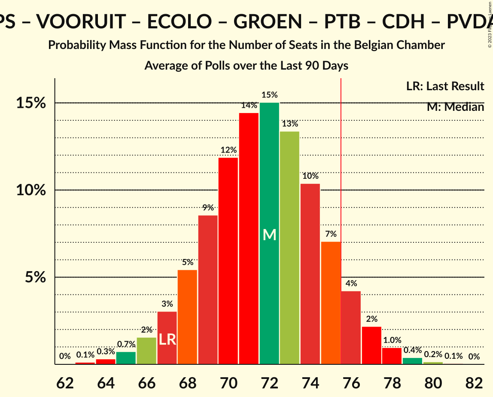
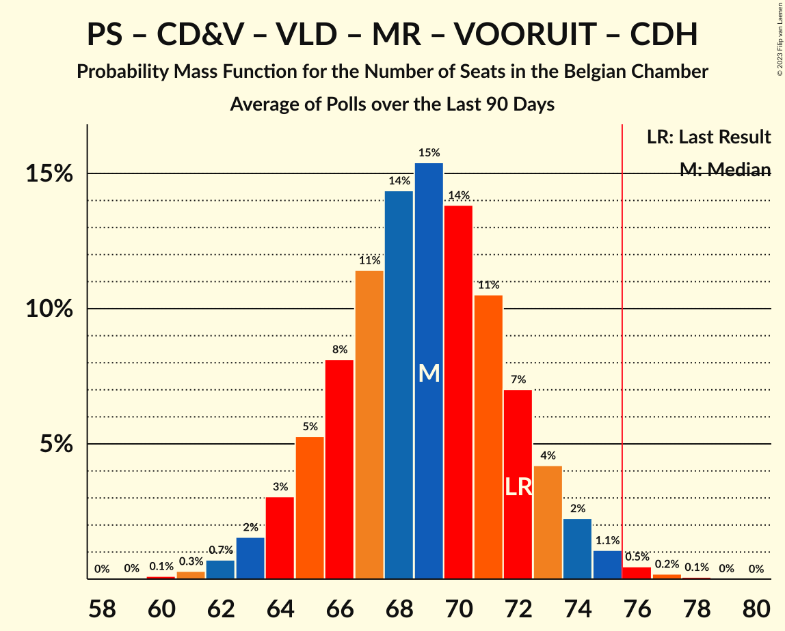

# Poll Average

<a href="#voting-intentions">Voting Intentions</a> | <a href="#seats">Seats</a> | <a href="#coalitions">Coalitions</a> | <a href="#technical-information">Technical Information</a>

## Summary

The table below lists the polls on which the average is based. They are the most recent polls (less than 90 days old) registered and analyzed so far.

| Period     | Polling firm/Commissioner(s) | N-VA | VB | PS | CD&V | PTB | PVDA | VLD | MR | VOORUIT | ECOLO | GROEN | CDH | DÉFI | PP |
|:----------:|:----------------------------:|:--:|:--:|:--:|:--:|:--:|:--:|:--:|:--:|:--:|:--:|:--:|:--:|:--:|:--:|
| 26 May 2019 | General Election | 16.0%   25 | 12.0%   18 | 9.5%   20 | 8.9%   12 | 4.8%   9 | 3.3%   3 | 8.5%   12 | 7.6%   14 | 6.7%   9 | 6.1%   13 | 6.1%   8 | 3.7%   5 | 2.2%   2 | 1.1%   0 |
| N/A | Poll Average | 12–15%   17–23 | 14–17%   19–25 | 6–7%   10–15 | 7–10%   9–13 | 5–6%   8–12 | 4–6%   3–8 | 6–9%   8–11 | 6–7%   10–14 | 7–9%   9–13 | 5–6%   7–11 | 5–7%   6–9 | 3%   4–6 | 1–2%   0–2 | N/A   N/A |
| [7–14 September 2021](2021-09-14-Ipsos.html) | Ipsos   Het Laatste Nieuws, Le Soir, RTL TVi and VTM | 12–15%   17–23 | 14–17%   19–25 | 6–7%   10–15 | 7–10%   9–13 | 5–6%   8–12 | 4–6%   3–8 | 6–9%   8–11 | 6–7%   10–14 | 7–9%   9–13 | 5–6%   7–11 | 5–7%   6–9 | 3%   4–6 | 1–2%   0–2 | N/A   N/A |
| 26 May 2019 | General Election | 16.0%   25 | 12.0%   18 | 9.5%   20 | 8.9%   12 | 4.8%   9 | 3.3%   3 | 8.5%   12 | 7.6%   14 | 6.7%   9 | 6.1%   13 | 6.1%   8 | 3.7%   5 | 2.2%   2 | 1.1%   0 |

Only polls for which at least the sample size has been published are included in the table above.

**Legend:**
+ **Top half of each row:** Voting intentions (95% confidence interval)
+ **Bottom half of each row:** Seat projections for the Belgian Chamber (95% confidence interval)
+ **N-VA:** Nieuw-Vlaamse Alliantie
+ **VB:** Vlaams Belang
+ **PS:** Parti Socialiste
+ **CD&V:** Christen-Democratisch en Vlaams
+ **PTB:** Parti du Travail de Belgique
+ **PVDA:** Partij van de Arbeid van België
+ **VLD:** Open Vlaamse Liberalen en Democraten
+ **MR:** Mouvement Réformateur
+ **VOORUIT:** Vooruit
+ **ECOLO:** Ecolo
+ **GROEN:** Groen
+ **CDH:** Centre démocrate humaniste
+ **DÉFI:** DéFI
+ **PP:** Parti Populaire
+ **N/A (single party):** Party not included the published results
+ **N/A (entire row):** Calculation for this opinion poll not started yet

## Voting Intentions

### Confidence Intervals

| Party | Last Result | Median | 80% Confidence Interval | 90% Confidence Interval | 95% Confidence Interval | 99% Confidence Interval |
|:-----:|:-----------:|:------:|:-----------------------:|:-----------------------:|:-----------------------:|:-----------------------:|
| <a href="#nieuw-vlaamse-alliantie">Nieuw-Vlaamse Alliantie</a> | 16.0% | 14.1% | 13.1–15.1% |12.8–15.3% | 12.5–15.4% | 12.0–15.5% |
| <a href="#vlaams-belang">Vlaams Belang</a> | 12.0% | 15.7% | 14.6–16.8% |14.3–17.1% | 14.1–17.2% | 13.5–17.4% |
| <a href="#parti-socialiste">Parti Socialiste</a> | 9.5% | 6.9% | 6.4–7.1% |6.3–7.2% | 6.2–7.2% | 6.0–7.2% |
| <a href="#christen-democratisch-en-vlaams">Christen-Democratisch en Vlaams</a> | 8.9% | 8.4% | 7.6–9.2% |7.3–9.4% | 7.1–9.5% | 6.7–9.6% |
| <a href="#open-vlaamse-liberalen-en-democraten">Open Vlaamse Liberalen en Democraten</a> | 8.5% | 7.6% | 6.8–8.5% |6.6–8.7% | 6.4–8.8% | 6.0–9.0% |
| <a href="#mouvement-réformateur">Mouvement Réformateur</a> | 7.6% | 6.5% | 6.1–6.8% |6.0–6.8% | 5.9–6.9% | 5.6–6.9% |
| <a href="#vooruit">Vooruit</a> | 6.7% | 8.2% | 7.4–9.0% |7.1–9.2% | 6.9–9.3% | 6.6–9.4% |
| <a href="#ecolo">Ecolo</a> | 6.1% | 5.4% | 5.0–5.7% |4.8–5.7% | 4.7–5.7% | 4.5–5.7% |
| <a href="#groen">Groen</a> | 6.1% | 6.4% | 5.7–7.1% |5.4–7.3% | 5.3–7.4% | 4.9–7.5% |
| <a href="#parti-du-travail-de-belgique">Parti du Travail de Belgique</a> | 4.8% | 6.0% | 5.6–6.3% |5.5–6.3% | 5.4–6.4% | 5.1–6.4% |
| <a href="#centre-démocrate-humaniste">Centre démocrate humaniste</a> | 3.7% | 3.2% | 2.8–3.3% |2.8–3.4% | 2.7–3.4% | 2.5–3.4% |
| <a href="#partij-van-de-arbeid-van-belgië">Partij van de Arbeid van België</a> | 3.3% | 5.1% | 4.5–5.8% |4.3–5.9% | 4.1–6.0% | 3.8–6.1% |
| <a href="#défi">DéFI</a> | 2.2% | 1.6% | 1.4–1.7% |1.3–1.8% | 1.2–1.8% | 1.1–1.8% |
| <a href="#parti-populaire">Parti Populaire</a> | 1.1% | N/A | N/A |N/A | N/A | N/A |

### Nieuw-Vlaamse Alliantie

*For a full overview of the results for this party, see the [Nieuw-Vlaamse Alliantie](party-nieuw-vlaamsealliantie.html) page.*

| Voting Intentions | Probability | Accumulated | Special Marks |
|:-----------------:|:-----------:|:-----------:|:-------------:|
| 10.5–11.5% | 0.1% | 100% |  |
| 11.5–12.5% | 3% | 99.9% |  |
| 12.5–13.5% | 22% | 97% |  |
| 13.5–14.5% | 46% | 75% | Median |
| 14.5–15.5% | 29% | 29% |  |
| 15.5–16.5% | 6% | 0.2% | Last Result |
| 16.5–17.5% | 0.4% | 0% |  |

### Vlaams Belang

*For a full overview of the results for this party, see the [Vlaams Belang](party-vlaamsbelang.html) page.*

| Voting Intentions | Probability | Accumulated | Special Marks |
|:-----------------:|:-----------:|:-----------:|:-------------:|
| 11.5–12.5% | 0% | 100% | Last Result |
| 12.5–13.5% | 0.5% | 100% |  |
| 13.5–14.5% | 8% | 99.5% |  |
| 14.5–15.5% | 33% | 92% |  |
| 15.5–16.5% | 42% | 59% | Median |
| 16.5–17.5% | 18% | 17% |  |
| 17.5–18.5% | 3% | 0% |  |

### Parti Socialiste

*For a full overview of the results for this party, see the [Parti Socialiste](party-partisocialiste.html) page.*

| Voting Intentions | Probability | Accumulated | Special Marks |
|:-----------------:|:-----------:|:-----------:|:-------------:|
| 4.5–5.5% | 0% | 100% |  |
| 5.5–6.5% | 16% | 100% |  |
| 6.5–7.5% | 100% | 84% | Median |
| 7.5–8.5% | 32% | 0% |  |
| 8.5–9.5% | 0.2% | 0% | Last Result |

### Christen-Democratisch en Vlaams

*For a full overview of the results for this party, see the [Christen-Democratisch en Vlaams](party-christen-democratischenvlaams.html) page.*

| Voting Intentions | Probability | Accumulated | Special Marks |
|:-----------------:|:-----------:|:-----------:|:-------------:|
| 4.5–5.5% | 0% | 100% |  |
| 5.5–6.5% | 0.2% | 100% |  |
| 6.5–7.5% | 9% | 99.8% |  |
| 7.5–8.5% | 47% | 91% | Median |
| 8.5–9.5% | 42% | 43% | Last Result |
| 9.5–10.5% | 7% | 1.0% |  |
| 10.5–11.5% | 0.3% | 0% |  |

### Open Vlaamse Liberalen en Democraten

*For a full overview of the results for this party, see the [Open Vlaamse Liberalen en Democraten](party-openvlaamseliberalenendemocraten.html) page.*

| Voting Intentions | Probability | Accumulated | Special Marks |
|:-----------------:|:-----------:|:-----------:|:-------------:|
| 4.5–5.5% | 0% | 100% |  |
| 5.5–6.5% | 5% | 100% |  |
| 6.5–7.5% | 41% | 95% |  |
| 7.5–8.5% | 47% | 55% | Median |
| 8.5–9.5% | 10% | 8% | Last Result |
| 9.5–10.5% | 0.5% | 0% |  |

### Mouvement Réformateur

*For a full overview of the results for this party, see the [Mouvement Réformateur](party-mouvementréformateur.html) page.*

| Voting Intentions | Probability | Accumulated | Special Marks |
|:-----------------:|:-----------:|:-----------:|:-------------:|
| 3.5–4.5% | 0% | 100% |  |
| 4.5–5.5% | 0.3% | 100% |  |
| 5.5–6.5% | 51% | 99.7% |  |
| 6.5–7.5% | 100% | 49% | Median |
| 7.5–8.5% | 8% | 0% | Last Result |

### Vooruit

*For a full overview of the results for this party, see the [Vooruit](party-vooruit.html) page.*

| Voting Intentions | Probability | Accumulated | Special Marks |
|:-----------------:|:-----------:|:-----------:|:-------------:|
| 4.5–5.5% | 0% | 100% |  |
| 5.5–6.5% | 0.5% | 100% |  |
| 6.5–7.5% | 15% | 99.5% | Last Result |
| 7.5–8.5% | 52% | 85% | Median |
| 8.5–9.5% | 33% | 32% |  |
| 9.5–10.5% | 4% | 0% |  |

### Ecolo

*For a full overview of the results for this party, see the [Ecolo](party-ecolo.html) page.*

| Voting Intentions | Probability | Accumulated | Special Marks |
|:-----------------:|:-----------:|:-----------:|:-------------:|
| 2.5–3.5% | 0% | 100% |  |
| 3.5–4.5% | 0.7% | 100% |  |
| 4.5–5.5% | 74% | 99.3% | Median |
| 5.5–6.5% | 77% | 26% | Last Result |
| 6.5–7.5% | 2% | 0% |  |

### Groen

*For a full overview of the results for this party, see the [Groen](party-groen.html) page.*

| Voting Intentions | Probability | Accumulated | Special Marks |
|:-----------------:|:-----------:|:-----------:|:-------------:|
| 3.5–4.5% | 0% | 100% |  |
| 4.5–5.5% | 7% | 100% |  |
| 5.5–6.5% | 52% | 93% | Last Result, Median |
| 6.5–7.5% | 40% | 41% |  |
| 7.5–8.5% | 5% | 0.4% |  |
| 8.5–9.5% | 0.1% | 0% |  |

### Parti du Travail de Belgique

*For a full overview of the results for this party, see the [Parti du Travail de Belgique](party-partidutravaildebelgique.html) page.*

| Voting Intentions | Probability | Accumulated | Special Marks |
|:-----------------:|:-----------:|:-----------:|:-------------:|
| 3.5–4.5% | 0% | 100% |  |
| 4.5–5.5% | 8% | 100% | Last Result |
| 5.5–6.5% | 100% | 92% | Median |
| 6.5–7.5% | 39% | 0% |  |
| 7.5–8.5% | 0.3% | 0% |  |

### Centre démocrate humaniste

*For a full overview of the results for this party, see the [Centre démocrate humaniste](party-centredémocratehumaniste.html) page.*

| Voting Intentions | Probability | Accumulated | Special Marks |
|:-----------------:|:-----------:|:-----------:|:-------------:|
| 0.5–1.5% | 0% | 100% |  |
| 1.5–2.5% | 0.8% | 100% |  |
| 2.5–3.5% | 100% | 99.2% | Median |
| 3.5–4.5% | 51% | 0% | Last Result |

### Partij van de Arbeid van België

*For a full overview of the results for this party, see the [Partij van de Arbeid van België](party-partijvandearbeidvanbelgië.html) page.*

| Voting Intentions | Probability | Accumulated | Special Marks |
|:-----------------:|:-----------:|:-----------:|:-------------:|
| 2.5–3.5% | 0.1% | 100% | Last Result |
| 3.5–4.5% | 13% | 99.9% |  |
| 4.5–5.5% | 66% | 87% | Median |
| 5.5–6.5% | 26% | 20% |  |
| 6.5–7.5% | 1.2% | 0% |  |

### DéFI

*For a full overview of the results for this party, see the [DéFI](party-défi.html) page.*

| Voting Intentions | Probability | Accumulated | Special Marks |
|:-----------------:|:-----------:|:-----------:|:-------------:|
| 0.0–0.5% | 0% | 100% |  |
| 0.5–1.5% | 39% | 100% |  |
| 1.5–2.5% | 100% | 61% | Last Result, Median |
| 2.5–3.5% | 0.2% | 0% |  |

## Seats

### Confidence Intervals

| Party | Last Result | Median | 80% Confidence Interval | 90% Confidence Interval | 95% Confidence Interval | 99% Confidence Interval |
|:-----:|:-----------:|:------:|:-----------------------:|:-----------------------:|:-----------------------:|:-----------------------:|
| <a href="#nieuw-vlaamse-alliantie">Nieuw-Vlaamse Alliantie</a> | 25 | 20 | 18–21 |17–22 | 17–23 | 16–25 |
| <a href="#vlaams-belang">Vlaams Belang</a> | 18 | 22 | 20–25 |20–25 | 19–25 | 19–26 |
| <a href="#parti-socialiste">Parti Socialiste</a> | 20 | 13 | 11–15 |11–15 | 10–15 | 9–15 |
| <a href="#christen-democratisch-en-vlaams">Christen-Democratisch en Vlaams</a> | 12 | 11 | 10–12 |9–13 | 9–13 | 9–14 |
| <a href="#open-vlaamse-liberalen-en-democraten">Open Vlaamse Liberalen en Democraten</a> | 12 | 10 | 9–11 |8–11 | 8–11 | 6–12 |
| <a href="#mouvement-réformateur">Mouvement Réformateur</a> | 14 | 11 | 10–14 |10–14 | 10–14 | 10–14 |
| <a href="#vooruit">Vooruit</a> | 9 | 11 | 9–12 |9–12 | 9–13 | 7–14 |
| <a href="#ecolo">Ecolo</a> | 13 | 9 | 8–10 |8–10 | 7–11 | 7–13 |
| <a href="#groen">Groen</a> | 8 | 8 | 6–9 |6–9 | 6–9 | 5–10 |
| <a href="#parti-du-travail-de-belgique">Parti du Travail de Belgique</a> | 9 | 10 | 9–10 |8–11 | 8–12 | 8–13 |
| <a href="#centre-démocrate-humaniste">Centre démocrate humaniste</a> | 5 | 4 | 4–5 |4–5 | 4–6 | 4–7 |
| <a href="#partij-van-de-arbeid-van-belgië">Partij van de Arbeid van België</a> | 3 | 5 | 5–8 |4–8 | 3–8 | 3–8 |
| <a href="#défi">DéFI</a> | 2 | 0 | 0–2 |0–2 | 0–2 | 0–2 |
| <a href="#parti-populaire">Parti Populaire</a> | 0 | N/A | N/A |N/A | N/A | N/A |

### Nieuw-Vlaamse Alliantie

*For a full overview of the results for this party, see the [Nieuw-Vlaamse Alliantie](party-nieuw-vlaamsealliantie.html) page.*

| Number of Seats | Probability | Accumulated | Special Marks |
|:---------------:|:-----------:|:-----------:|:-------------:|
| 15 | 0.1% | 100% |  |
| 16 | 2% | 99.9% |  |
| 17 | 4% | 98% |  |
| 18 | 6% | 94% |  |
| 19 | 17% | 88% |  |
| 20 | 45% | 70% | Median |
| 21 | 20% | 25% |  |
| 22 | 2% | 5% |  |
| 23 | 2% | 3% |  |
| 24 | 0.8% | 2% |  |
| 25 | 0.8% | 0.8% | Last Result |
| 26 | 0% | 0% |  |

### Vlaams Belang

*For a full overview of the results for this party, see the [Vlaams Belang](party-vlaamsbelang.html) page.*

| Number of Seats | Probability | Accumulated | Special Marks |
|:---------------:|:-----------:|:-----------:|:-------------:|
| 18 | 0.1% | 100% | Last Result |
| 19 | 3% | 99.8% |  |
| 20 | 12% | 97% |  |
| 21 | 22% | 85% |  |
| 22 | 17% | 63% | Median |
| 23 | 18% | 46% |  |
| 24 | 14% | 28% |  |
| 25 | 14% | 14% |  |
| 26 | 0.5% | 0.6% |  |
| 27 | 0.1% | 0.1% |  |
| 28 | 0% | 0% |  |

### Parti Socialiste

*For a full overview of the results for this party, see the [Parti Socialiste](party-partisocialiste.html) page.*

| Number of Seats | Probability | Accumulated | Special Marks |
|:---------------:|:-----------:|:-----------:|:-------------:|
| 9 | 0.8% | 100% |  |
| 10 | 2% | 99.2% |  |
| 11 | 10% | 97% |  |
| 12 | 26% | 87% |  |
| 13 | 35% | 61% | Median |
| 14 | 15% | 26% |  |
| 15 | 11% | 11% |  |
| 16 | 0.1% | 0.1% |  |
| 17 | 0% | 0% |  |
| 18 | 0% | 0% |  |
| 19 | 0% | 0% |  |
| 20 | 0% | 0% | Last Result |

### Christen-Democratisch en Vlaams

*For a full overview of the results for this party, see the [Christen-Democratisch en Vlaams](party-christen-democratischenvlaams.html) page.*

| Number of Seats | Probability | Accumulated | Special Marks |
|:---------------:|:-----------:|:-----------:|:-------------:|
| 7 | 0.1% | 100% |  |
| 8 | 0.4% | 99.9% |  |
| 9 | 7% | 99.5% |  |
| 10 | 39% | 93% |  |
| 11 | 38% | 54% | Median |
| 12 | 8% | 16% | Last Result |
| 13 | 6% | 8% |  |
| 14 | 2% | 2% |  |
| 15 | 0.1% | 0.2% |  |
| 16 | 0% | 0% |  |

### Open Vlaamse Liberalen en Democraten

*For a full overview of the results for this party, see the [Open Vlaamse Liberalen en Democraten](party-openvlaamseliberalenendemocraten.html) page.*

| Number of Seats | Probability | Accumulated | Special Marks |
|:---------------:|:-----------:|:-----------:|:-------------:|
| 6 | 1.3% | 100% |  |
| 7 | 0.9% | 98.7% |  |
| 8 | 5% | 98% |  |
| 9 | 16% | 93% |  |
| 10 | 64% | 77% | Median |
| 11 | 12% | 13% |  |
| 12 | 0.9% | 1.2% | Last Result |
| 13 | 0.2% | 0.3% |  |
| 14 | 0.1% | 0.1% |  |
| 15 | 0% | 0% |  |

### Mouvement Réformateur

*For a full overview of the results for this party, see the [Mouvement Réformateur](party-mouvementréformateur.html) page.*

| Number of Seats | Probability | Accumulated | Special Marks |
|:---------------:|:-----------:|:-----------:|:-------------:|
| 9 | 0.3% | 100% |  |
| 10 | 13% | 99.7% |  |
| 11 | 38% | 86% | Median |
| 12 | 21% | 49% |  |
| 13 | 15% | 27% |  |
| 14 | 12% | 12% | Last Result |
| 15 | 0.3% | 0.3% |  |
| 16 | 0% | 0% |  |

### Vooruit

*For a full overview of the results for this party, see the [Vooruit](party-vooruit.html) page.*

| Number of Seats | Probability | Accumulated | Special Marks |
|:---------------:|:-----------:|:-----------:|:-------------:|
| 7 | 0.5% | 100% |  |
| 8 | 2% | 99.5% |  |
| 9 | 15% | 98% | Last Result |
| 10 | 28% | 82% |  |
| 11 | 38% | 54% | Median |
| 12 | 12% | 16% |  |
| 13 | 3% | 4% |  |
| 14 | 0.7% | 1.1% |  |
| 15 | 0.4% | 0.4% |  |
| 16 | 0% | 0% |  |

### Ecolo

*For a full overview of the results for this party, see the [Ecolo](party-ecolo.html) page.*

| Number of Seats | Probability | Accumulated | Special Marks |
|:---------------:|:-----------:|:-----------:|:-------------:|
| 7 | 3% | 100% |  |
| 8 | 12% | 97% |  |
| 9 | 46% | 85% | Median |
| 10 | 34% | 38% |  |
| 11 | 3% | 4% |  |
| 12 | 1.0% | 2% |  |
| 13 | 0.9% | 0.9% | Last Result |
| 14 | 0% | 0% |  |

### Groen

*For a full overview of the results for this party, see the [Groen](party-groen.html) page.*

| Number of Seats | Probability | Accumulated | Special Marks |
|:---------------:|:-----------:|:-----------:|:-------------:|
| 5 | 2% | 100% |  |
| 6 | 21% | 98% |  |
| 7 | 14% | 77% |  |
| 8 | 16% | 63% | Last Result, Median |
| 9 | 46% | 47% |  |
| 10 | 0.9% | 1.2% |  |
| 11 | 0.2% | 0.3% |  |
| 12 | 0.1% | 0.1% |  |
| 13 | 0% | 0% |  |

### Parti du Travail de Belgique

*For a full overview of the results for this party, see the [Parti du Travail de Belgique](party-partidutravaildebelgique.html) page.*

| Number of Seats | Probability | Accumulated | Special Marks |
|:---------------:|:-----------:|:-----------:|:-------------:|
| 7 | 0.1% | 100% |  |
| 8 | 9% | 99.9% |  |
| 9 | 38% | 91% | Last Result |
| 10 | 45% | 53% | Median |
| 11 | 6% | 8% |  |
| 12 | 2% | 3% |  |
| 13 | 0.7% | 1.1% |  |
| 14 | 0.3% | 0.4% |  |
| 15 | 0.1% | 0.1% |  |
| 16 | 0% | 0% |  |

### Centre démocrate humaniste

*For a full overview of the results for this party, see the [Centre démocrate humaniste](party-centredémocratehumaniste.html) page.*

| Number of Seats | Probability | Accumulated | Special Marks |
|:---------------:|:-----------:|:-----------:|:-------------:|
| 4 | 86% | 100% | Median |
| 5 | 11% | 14% | Last Result |
| 6 | 2% | 3% |  |
| 7 | 0.5% | 0.8% |  |
| 8 | 0.3% | 0.3% |  |
| 9 | 0% | 0% |  |

### Partij van de Arbeid van België

*For a full overview of the results for this party, see the [Partij van de Arbeid van België](party-partijvandearbeidvanbelgië.html) page.*

| Number of Seats | Probability | Accumulated | Special Marks |
|:---------------:|:-----------:|:-----------:|:-------------:|
| 3 | 3% | 100% | Last Result |
| 4 | 5% | 97% |  |
| 5 | 46% | 92% | Median |
| 6 | 11% | 46% |  |
| 7 | 17% | 35% |  |
| 8 | 18% | 18% |  |
| 9 | 0.1% | 0.1% |  |
| 10 | 0% | 0% |  |

### DéFI

*For a full overview of the results for this party, see the [DéFI](party-défi.html) page.*

| Number of Seats | Probability | Accumulated | Special Marks |
|:---------------:|:-----------:|:-----------:|:-------------:|
| 0 | 69% | 100% | Median |
| 1 | 19% | 31% |  |
| 2 | 12% | 12% | Last Result |
| 3 | 0.2% | 0.2% |  |
| 4 | 0% | 0% |  |

### Parti Populaire

*For a full overview of the results for this party, see the [Parti Populaire](party-partipopulaire.html) page.*

## Coalitions

### Confidence Intervals

| Coalition | Last Result | Median | Majority? | 80% Confidence Interval | 90% Confidence Interval | 95% Confidence Interval | 99% Confidence Interval |
|:---------:|:-----------:|:------:|:---------:|:-----------------------:|:-----------------------:|:-----------------------:|:-----------------------:|
| Parti Socialiste – Christen-Democratisch en Vlaams – Open Vlaamse Liberalen en Democraten – Mouvement Réformateur – Vooruit – Ecolo – Groen – Centre démocrate humaniste | 93 | 77 | 74% | 74–80 | 74–81 | 73–81 | 72–82 |
| Parti Socialiste – Christen-Democratisch en Vlaams – Open Vlaamse Liberalen en Democraten – Mouvement Réformateur – Vooruit – Ecolo – Groen | 88 | 73 | 11% | 70–76 | 69–76 | 69–77 | 67–78 |
| Parti Socialiste – Christen-Democratisch en Vlaams – Vooruit – Ecolo – Groen – Parti du Travail de Belgique – Centre démocrate humaniste – Partij van de Arbeid van België | 79 | 71 | 2% | 68–74 | 67–75 | 66–75 | 65–77 |
| Nieuw-Vlaamse Alliantie – Parti Socialiste – Open Vlaamse Liberalen en Democraten – Mouvement Réformateur – Vooruit | 80 | 65 | 0% | 62–67 | 61–68 | 61–69 | 59–70 |
| Parti Socialiste – Open Vlaamse Liberalen en Democraten – Mouvement Réformateur – Vooruit – Ecolo – Groen | 76 | 62 | 0% | 60–65 | 59–65 | 58–66 | 57–67 |
| Parti Socialiste – Vooruit – Ecolo – Groen – Parti du Travail de Belgique – Centre démocrate humaniste – Partij van de Arbeid van België | 67 | 60 | 0% | 57–63 | 56–64 | 56–65 | 54–66 |
| Parti Socialiste – Christen-Democratisch en Vlaams – Open Vlaamse Liberalen en Democraten – Mouvement Réformateur – Vooruit – Centre démocrate humaniste | 72 | 60 | 0% | 57–62 | 57–63 | 56–64 | 54–65 |
| Nieuw-Vlaamse Alliantie – Christen-Democratisch en Vlaams – Open Vlaamse Liberalen en Democraten – Mouvement Réformateur – Centre démocrate humaniste | 68 | 56 | 0% | 54–59 | 53–60 | 52–61 | 51–62 |
| Parti Socialiste – Vooruit – Ecolo – Groen – Parti du Travail de Belgique – Partij van de Arbeid van België | 62 | 56 | 0% | 53–59 | 52–60 | 52–60 | 50–62 |
| Parti Socialiste – Christen-Democratisch en Vlaams – Vooruit – Ecolo – Groen – Centre démocrate humaniste | 67 | 55 | 0% | 52–58 | 52–59 | 51–60 | 50–61 |
| Christen-Democratisch en Vlaams – Open Vlaamse Liberalen en Democraten – Mouvement Réformateur – Ecolo – Groen – Centre démocrate humaniste | 64 | 54 | 0% | 51–56 | 50–57 | 49–58 | 48–59 |
| Nieuw-Vlaamse Alliantie – Christen-Democratisch en Vlaams – Open Vlaamse Liberalen en Democraten – Mouvement Réformateur | 63 | 52 | 0% | 50–55 | 49–56 | 48–57 | 47–58 |
| Parti Socialiste – Christen-Democratisch en Vlaams – Open Vlaamse Liberalen en Democraten – Mouvement Réformateur – Centre démocrate humaniste | 63 | 49 | 0% | 47–51 | 46–52 | 46–53 | 44–54 |
| Parti Socialiste – Open Vlaamse Liberalen en Democraten – Mouvement Réformateur – Vooruit | 55 | 45 | 0% | 43–47 | 42–48 | 41–48 | 40–50 |
| Parti Socialiste – Christen-Democratisch en Vlaams – Vooruit – Centre démocrate humaniste | 46 | 38 | 0% | 36–41 | 35–42 | 35–42 | 33–43 |
| Christen-Democratisch en Vlaams – Open Vlaamse Liberalen en Democraten – Mouvement Réformateur – Centre démocrate humaniste | 43 | 36 | 0% | 34–39 | 34–39 | 33–40 | 32–41 |

### Parti Socialiste – Christen-Democratisch en Vlaams – Open Vlaamse Liberalen en Democraten – Mouvement Réformateur – Vooruit – Ecolo – Groen – Centre démocrate humaniste

| Number of Seats | Probability | Accumulated | Special Marks |
|:---------------:|:-----------:|:-----------:|:-------------:|
| 70 | 0.1% | 100% |  |
| 71 | 0.3% | 99.8% |  |
| 72 | 1.0% | 99.5% |  |
| 73 | 3% | 98% |  |
| 74 | 7% | 96% |  |
| 75 | 15% | 88% |  |
| 76 | 17% | 74% | Majority |
| 77 | 18% | 57% | Median |
| 78 | 15% | 38% |  |
| 79 | 11% | 23% |  |
| 80 | 7% | 13% |  |
| 81 | 4% | 5% |  |
| 82 | 1.2% | 2% |  |
| 83 | 0.3% | 0.3% |  |
| 84 | 0% | 0% |  |
| 85 | 0% | 0% |  |
| 86 | 0% | 0% |  |
| 87 | 0% | 0% |  |
| 88 | 0% | 0% |  |
| 89 | 0% | 0% |  |
| 90 | 0% | 0% |  |
| 91 | 0% | 0% |  |
| 92 | 0% | 0% |  |
| 93 | 0% | 0% | Last Result |

### Parti Socialiste – Christen-Democratisch en Vlaams – Open Vlaamse Liberalen en Democraten – Mouvement Réformateur – Vooruit – Ecolo – Groen

| Number of Seats | Probability | Accumulated | Special Marks |
|:---------------:|:-----------:|:-----------:|:-------------:|
| 65 | 0% | 100% |  |
| 66 | 0.2% | 99.9% |  |
| 67 | 0.4% | 99.8% |  |
| 68 | 1.3% | 99.4% |  |
| 69 | 3% | 98% |  |
| 70 | 9% | 95% |  |
| 71 | 16% | 86% |  |
| 72 | 17% | 71% |  |
| 73 | 19% | 54% | Median |
| 74 | 14% | 35% |  |
| 75 | 10% | 21% |  |
| 76 | 7% | 11% | Majority |
| 77 | 3% | 4% |  |
| 78 | 0.9% | 1.2% |  |
| 79 | 0.2% | 0.2% |  |
| 80 | 0% | 0% |  |
| 81 | 0% | 0% |  |
| 82 | 0% | 0% |  |
| 83 | 0% | 0% |  |
| 84 | 0% | 0% |  |
| 85 | 0% | 0% |  |
| 86 | 0% | 0% |  |
| 87 | 0% | 0% |  |
| 88 | 0% | 0% | Last Result |

### Parti Socialiste – Christen-Democratisch en Vlaams – Vooruit – Ecolo – Groen – Parti du Travail de Belgique – Centre démocrate humaniste – Partij van de Arbeid van België

| Number of Seats | Probability | Accumulated | Special Marks |
|:---------------:|:-----------:|:-----------:|:-------------:|
| 64 | 0.1% | 100% |  |
| 65 | 0.7% | 99.8% |  |
| 66 | 2% | 99.1% |  |
| 67 | 6% | 97% |  |
| 68 | 8% | 91% |  |
| 69 | 12% | 83% |  |
| 70 | 16% | 71% |  |
| 71 | 16% | 55% | Median |
| 72 | 14% | 39% |  |
| 73 | 11% | 25% |  |
| 74 | 8% | 14% |  |
| 75 | 4% | 6% |  |
| 76 | 2% | 2% | Majority |
| 77 | 0.4% | 0.5% |  |
| 78 | 0.1% | 0.1% |  |
| 79 | 0% | 0% | Last Result |

### Nieuw-Vlaamse Alliantie – Parti Socialiste – Open Vlaamse Liberalen en Democraten – Mouvement Réformateur – Vooruit

| Number of Seats | Probability | Accumulated | Special Marks |
|:---------------:|:-----------:|:-----------:|:-------------:|
| 57 | 0.1% | 100% |  |
| 58 | 0.2% | 99.9% |  |
| 59 | 0.6% | 99.7% |  |
| 60 | 2% | 99.1% |  |
| 61 | 4% | 98% |  |
| 62 | 8% | 94% |  |
| 63 | 13% | 86% |  |
| 64 | 17% | 73% |  |
| 65 | 20% | 56% | Median |
| 66 | 17% | 37% |  |
| 67 | 11% | 20% |  |
| 68 | 5% | 9% |  |
| 69 | 2% | 4% |  |
| 70 | 1.0% | 1.4% |  |
| 71 | 0.3% | 0.4% |  |
| 72 | 0.1% | 0.1% |  |
| 73 | 0% | 0% |  |
| 74 | 0% | 0% |  |
| 75 | 0% | 0% |  |
| 76 | 0% | 0% | Majority |
| 77 | 0% | 0% |  |
| 78 | 0% | 0% |  |
| 79 | 0% | 0% |  |
| 80 | 0% | 0% | Last Result |

### Parti Socialiste – Open Vlaamse Liberalen en Democraten – Mouvement Réformateur – Vooruit – Ecolo – Groen

| Number of Seats | Probability | Accumulated | Special Marks |
|:---------------:|:-----------:|:-----------:|:-------------:|
| 55 | 0.1% | 100% |  |
| 56 | 0.3% | 99.9% |  |
| 57 | 0.9% | 99.6% |  |
| 58 | 2% | 98.7% |  |
| 59 | 6% | 96% |  |
| 60 | 13% | 90% |  |
| 61 | 18% | 77% |  |
| 62 | 19% | 59% | Median |
| 63 | 15% | 41% |  |
| 64 | 14% | 26% |  |
| 65 | 8% | 12% |  |
| 66 | 3% | 4% |  |
| 67 | 0.7% | 0.8% |  |
| 68 | 0.1% | 0.1% |  |
| 69 | 0% | 0% |  |
| 70 | 0% | 0% |  |
| 71 | 0% | 0% |  |
| 72 | 0% | 0% |  |
| 73 | 0% | 0% |  |
| 74 | 0% | 0% |  |
| 75 | 0% | 0% |  |
| 76 | 0% | 0% | Last Result, Majority |

### Parti Socialiste – Vooruit – Ecolo – Groen – Parti du Travail de Belgique – Centre démocrate humaniste – Partij van de Arbeid van België

| Number of Seats | Probability | Accumulated | Special Marks |
|:---------------:|:-----------:|:-----------:|:-------------:|
| 53 | 0.1% | 100% |  |
| 54 | 0.4% | 99.9% |  |
| 55 | 1.3% | 99.5% |  |
| 56 | 5% | 98% |  |
| 57 | 8% | 93% |  |
| 58 | 11% | 85% |  |
| 59 | 15% | 75% |  |
| 60 | 17% | 60% | Median |
| 61 | 14% | 43% |  |
| 62 | 12% | 29% |  |
| 63 | 9% | 17% |  |
| 64 | 5% | 8% |  |
| 65 | 2% | 3% |  |
| 66 | 0.5% | 0.6% |  |
| 67 | 0.1% | 0.1% | Last Result |
| 68 | 0% | 0% |  |

### Parti Socialiste – Christen-Democratisch en Vlaams – Open Vlaamse Liberalen en Democraten – Mouvement Réformateur – Vooruit – Centre démocrate humaniste

| Number of Seats | Probability | Accumulated | Special Marks |
|:---------------:|:-----------:|:-----------:|:-------------:|
| 53 | 0.1% | 100% |  |
| 54 | 0.4% | 99.8% |  |
| 55 | 1.1% | 99.5% |  |
| 56 | 3% | 98% |  |
| 57 | 6% | 95% |  |
| 58 | 13% | 89% |  |
| 59 | 21% | 76% |  |
| 60 | 20% | 54% | Median |
| 61 | 15% | 35% |  |
| 62 | 10% | 20% |  |
| 63 | 6% | 9% |  |
| 64 | 2% | 3% |  |
| 65 | 0.8% | 1.1% |  |
| 66 | 0.2% | 0.3% |  |
| 67 | 0% | 0.1% |  |
| 68 | 0% | 0% |  |
| 69 | 0% | 0% |  |
| 70 | 0% | 0% |  |
| 71 | 0% | 0% |  |
| 72 | 0% | 0% | Last Result |

### Nieuw-Vlaamse Alliantie – Christen-Democratisch en Vlaams – Open Vlaamse Liberalen en Democraten – Mouvement Réformateur – Centre démocrate humaniste

| Number of Seats | Probability | Accumulated | Special Marks |
|:---------------:|:-----------:|:-----------:|:-------------:|
| 50 | 0.3% | 100% |  |
| 51 | 0.9% | 99.7% |  |
| 52 | 2% | 98.7% |  |
| 53 | 5% | 96% |  |
| 54 | 11% | 91% |  |
| 55 | 17% | 81% |  |
| 56 | 19% | 64% | Median |
| 57 | 17% | 45% |  |
| 58 | 13% | 28% |  |
| 59 | 8% | 15% |  |
| 60 | 4% | 7% |  |
| 61 | 2% | 3% |  |
| 62 | 0.8% | 1.2% |  |
| 63 | 0.3% | 0.3% |  |
| 64 | 0% | 0% |  |
| 65 | 0% | 0% |  |
| 66 | 0% | 0% |  |
| 67 | 0% | 0% |  |
| 68 | 0% | 0% | Last Result |

### Parti Socialiste – Vooruit – Ecolo – Groen – Parti du Travail de Belgique – Partij van de Arbeid van België

| Number of Seats | Probability | Accumulated | Special Marks |
|:---------------:|:-----------:|:-----------:|:-------------:|
| 49 | 0.1% | 100% |  |
| 50 | 0.5% | 99.9% |  |
| 51 | 2% | 99.4% |  |
| 52 | 5% | 98% |  |
| 53 | 8% | 93% |  |
| 54 | 12% | 84% |  |
| 55 | 15% | 72% |  |
| 56 | 17% | 57% | Median |
| 57 | 14% | 40% |  |
| 58 | 12% | 26% |  |
| 59 | 8% | 15% |  |
| 60 | 4% | 7% |  |
| 61 | 2% | 2% |  |
| 62 | 0.4% | 0.5% | Last Result |
| 63 | 0.1% | 0.1% |  |
| 64 | 0% | 0% |  |

### Parti Socialiste – Christen-Democratisch en Vlaams – Vooruit – Ecolo – Groen – Centre démocrate humaniste

| Number of Seats | Probability | Accumulated | Special Marks |
|:---------------:|:-----------:|:-----------:|:-------------:|
| 48 | 0% | 100% |  |
| 49 | 0.2% | 99.9% |  |
| 50 | 0.8% | 99.8% |  |
| 51 | 3% | 99.0% |  |
| 52 | 6% | 96% |  |
| 53 | 11% | 90% |  |
| 54 | 16% | 79% |  |
| 55 | 16% | 63% |  |
| 56 | 15% | 47% | Median |
| 57 | 13% | 31% |  |
| 58 | 8% | 18% |  |
| 59 | 5% | 9% |  |
| 60 | 3% | 4% |  |
| 61 | 1.2% | 2% |  |
| 62 | 0.3% | 0.4% |  |
| 63 | 0.1% | 0.1% |  |
| 64 | 0% | 0% |  |
| 65 | 0% | 0% |  |
| 66 | 0% | 0% |  |
| 67 | 0% | 0% | Last Result |

### Christen-Democratisch en Vlaams – Open Vlaamse Liberalen en Democraten – Mouvement Réformateur – Ecolo – Groen – Centre démocrate humaniste

| Number of Seats | Probability | Accumulated | Special Marks |
|:---------------:|:-----------:|:-----------:|:-------------:|
| 47 | 0.1% | 100% |  |
| 48 | 0.5% | 99.8% |  |
| 49 | 2% | 99.4% |  |
| 50 | 5% | 97% |  |
| 51 | 10% | 92% |  |
| 52 | 14% | 82% |  |
| 53 | 16% | 68% | Median |
| 54 | 18% | 52% |  |
| 55 | 15% | 34% |  |
| 56 | 11% | 19% |  |
| 57 | 5% | 9% |  |
| 58 | 2% | 3% |  |
| 59 | 0.7% | 1.0% |  |
| 60 | 0.2% | 0.2% |  |
| 61 | 0% | 0% |  |
| 62 | 0% | 0% |  |
| 63 | 0% | 0% |  |
| 64 | 0% | 0% | Last Result |

### Nieuw-Vlaamse Alliantie – Christen-Democratisch en Vlaams – Open Vlaamse Liberalen en Democraten – Mouvement Réformateur

| Number of Seats | Probability | Accumulated | Special Marks |
|:---------------:|:-----------:|:-----------:|:-------------:|
| 46 | 0.3% | 100% |  |
| 47 | 1.1% | 99.6% |  |
| 48 | 3% | 98.5% |  |
| 49 | 6% | 96% |  |
| 50 | 12% | 90% |  |
| 51 | 18% | 78% |  |
| 52 | 19% | 60% | Median |
| 53 | 16% | 41% |  |
| 54 | 12% | 25% |  |
| 55 | 7% | 14% |  |
| 56 | 4% | 6% |  |
| 57 | 2% | 3% |  |
| 58 | 0.7% | 1.0% |  |
| 59 | 0.2% | 0.2% |  |
| 60 | 0% | 0% |  |
| 61 | 0% | 0% |  |
| 62 | 0% | 0% |  |
| 63 | 0% | 0% | Last Result |

### Parti Socialiste – Christen-Democratisch en Vlaams – Open Vlaamse Liberalen en Democraten – Mouvement Réformateur – Centre démocrate humaniste

| Number of Seats | Probability | Accumulated | Special Marks |
|:---------------:|:-----------:|:-----------:|:-------------:|
| 42 | 0% | 100% |  |
| 43 | 0.2% | 99.9% |  |
| 44 | 0.5% | 99.8% |  |
| 45 | 2% | 99.2% |  |
| 46 | 4% | 98% |  |
| 47 | 8% | 94% |  |
| 48 | 17% | 86% |  |
| 49 | 27% | 70% | Median |
| 50 | 20% | 42% |  |
| 51 | 12% | 22% |  |
| 52 | 6% | 10% |  |
| 53 | 2% | 3% |  |
| 54 | 0.8% | 1.0% |  |
| 55 | 0.2% | 0.2% |  |
| 56 | 0% | 0% |  |
| 57 | 0% | 0% |  |
| 58 | 0% | 0% |  |
| 59 | 0% | 0% |  |
| 60 | 0% | 0% |  |
| 61 | 0% | 0% |  |
| 62 | 0% | 0% |  |
| 63 | 0% | 0% | Last Result |

### Parti Socialiste – Open Vlaamse Liberalen en Democraten – Mouvement Réformateur – Vooruit

| Number of Seats | Probability | Accumulated | Special Marks |
|:---------------:|:-----------:|:-----------:|:-------------:|
| 38 | 0.1% | 100% |  |
| 39 | 0.3% | 99.9% |  |
| 40 | 0.9% | 99.6% |  |
| 41 | 2% | 98.7% |  |
| 42 | 6% | 96% |  |
| 43 | 11% | 91% |  |
| 44 | 18% | 79% |  |
| 45 | 23% | 61% | Median |
| 46 | 20% | 38% |  |
| 47 | 11% | 18% |  |
| 48 | 4% | 7% |  |
| 49 | 2% | 2% |  |
| 50 | 0.5% | 0.6% |  |
| 51 | 0.1% | 0.1% |  |
| 52 | 0% | 0% |  |
| 53 | 0% | 0% |  |
| 54 | 0% | 0% |  |
| 55 | 0% | 0% | Last Result |

### Parti Socialiste – Christen-Democratisch en Vlaams – Vooruit – Centre démocrate humaniste

| Number of Seats | Probability | Accumulated | Special Marks |
|:---------------:|:-----------:|:-----------:|:-------------:|
| 32 | 0.1% | 100% |  |
| 33 | 0.5% | 99.9% |  |
| 34 | 2% | 99.5% |  |
| 35 | 5% | 98% |  |
| 36 | 12% | 93% |  |
| 37 | 17% | 80% |  |
| 38 | 19% | 64% |  |
| 39 | 18% | 44% | Median |
| 40 | 12% | 26% |  |
| 41 | 8% | 14% |  |
| 42 | 4% | 6% |  |
| 43 | 1.4% | 2% |  |
| 44 | 0.4% | 0.5% |  |
| 45 | 0.1% | 0.1% |  |
| 46 | 0% | 0% | Last Result |

### Christen-Democratisch en Vlaams – Open Vlaamse Liberalen en Democraten – Mouvement Réformateur – Centre démocrate humaniste

| Number of Seats | Probability | Accumulated | Special Marks |
|:---------------:|:-----------:|:-----------:|:-------------:|
| 30 | 0.1% | 100% |  |
| 31 | 0.3% | 99.9% |  |
| 32 | 0.7% | 99.6% |  |
| 33 | 2% | 98.9% |  |
| 34 | 9% | 97% |  |
| 35 | 19% | 88% |  |
| 36 | 23% | 69% | Median |
| 37 | 19% | 46% |  |
| 38 | 15% | 27% |  |
| 39 | 8% | 13% |  |
| 40 | 3% | 5% |  |
| 41 | 1.3% | 2% |  |
| 42 | 0.3% | 0.4% |  |
| 43 | 0.1% | 0.1% | Last Result |
| 44 | 0% | 0% |  |

## Technical Information

+ **Number of polls included in this average:** 1
+ **Lowest number of simulations done in a poll included in this average:** 262,144
+ **Total number of simulations done in the polls included in this average:** 262,144
+ **Error estimate:** 1.39%
