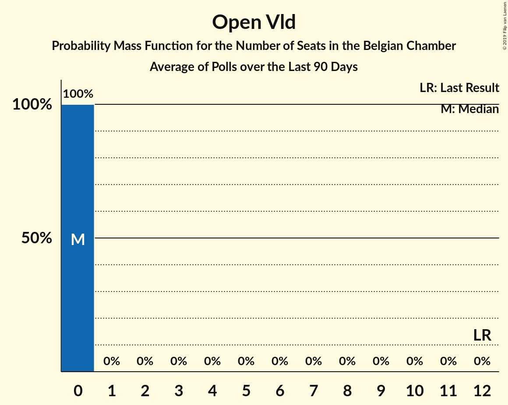
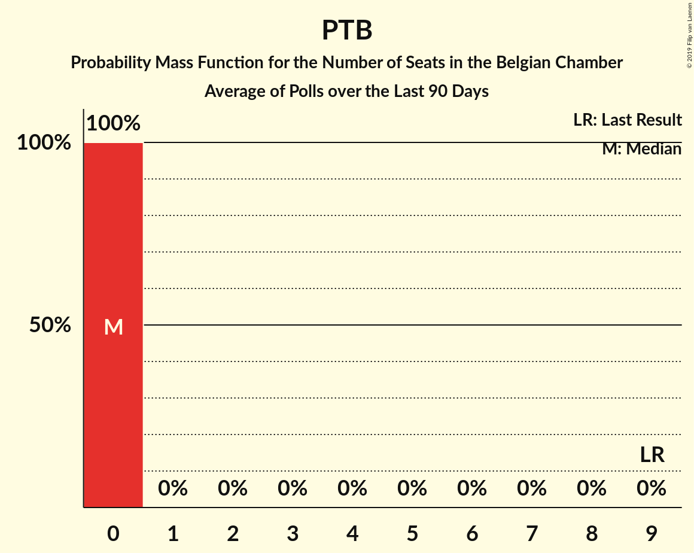

# Poll Average

<a href="#voting-intentions">Voting Intentions</a> | <a href="#seats">Seats</a> | <a href="#coalitions">Coalitions</a> | <a href="#technical-information">Technical Information</a>

## Summary

The table below lists the polls on which the average is based. They are the most recent polls (less than 90 days old) registered and analyzed so far.

| Period     | Polling firm/Commissioner(s) | N-VA | PS | CD&V | VLD | MR | SP.A | GROEN | CDH | VB | ECOLO | PTB | DÉFI | PVDA | PP | DLB | LDD | DROITE | PIRAAT | ISLAM | WDA | PIRATE | RWF | FW |
|:----------:|:----------------------------:|:--:|:--:|:--:|:--:|:--:|:--:|:--:|:--:|:--:|:--:|:--:|:--:|:--:|:--:|:--:|:--:|:--:|:--:|:--:|:--:|:--:|:--:|:--:|
| 25 May 2014 | General Election | 20.3%   33 | 11.7%   23 | 11.6%   18 | 9.8%   14 | 9.6%   20 | 8.8%   13 | 5.3%   6 | 5.0%   9 | 3.7%   3 | 3.3%   6 | 2.0%   2 | 1.8%   2 | 1.8%   0 | 1.5%   1 | 0.9%   0 | 0.4%   0 | 0.4%   0 | 0.3%   0 | 0.2%   0 | 0.2%   0 | 0.1%   0 | 0.1%   0 | 0.1%   0 |
| N/A | Poll Average | 18–19%   29–35 | 7–8%   15–20 | 8–9%   13–18 | 7–8%   10–16 | 7%   14–19 | 5–6%   6–14 | 6–9%   6–13 | 2%   3–8 | 4%   4–8 | 4–5%   9–15 | 3%   4–11 | 2%   2–6 | 2–4%   1–5 | 1%   0–1 | N/A   N/A | N/A   N/A | 0%   0 | N/A   N/A | N/A   N/A | N/A   N/A | N/A   N/A | N/A   N/A | N/A   N/A |
| [26 February–17 March 2018](2018-03-17-TNS.html) | TNS   De Standaard–VRT–RTBf–La Libre Belgique | 18–19%   28–34 | 8%   15–20 | 8–10%   13–18 | 8%   11–16 | 8%   15–19 | 4–5%   6–10 | 7–9%   11–14 | 3–4%   5–9 | 3–4%   3–7 | 6%   11–15 | 3%   4–8 | 2%   2–5 | 2–4%   1–3 | 1%   0 | N/A   N/A | N/A   N/A | N/A   N/A | N/A   N/A | N/A   N/A | N/A   N/A | N/A   N/A | N/A   N/A | N/A   N/A |
| [27 February–6 March 2018](2018-03-06-Ipsos.html) | Ipsos   RTL TVi–Le Soir–VTM–Het Laatste Nieuws | 17–19%   29–35 | 7–8%   15–19 | 8–9%   12–17 | 6–7%   9–13 | 7%   14–18 | 6–7%   9–15 | 5–7%   6–11 | 2%   2–5 | 4–5%   6–8 | 4–5%   9–12 | 5%   9–11 | 2–3%   2–6 | 3–4%   1–5 | 1%   0–2 | N/A   N/A | N/A   N/A | 0%   0 | N/A   N/A | N/A   N/A | N/A   N/A | N/A   N/A | N/A   N/A | N/A   N/A |
| 25 May 2014 | General Election | 20.3%   33 | 11.7%   23 | 11.6%   18 | 9.8%   14 | 9.6%   20 | 8.8%   13 | 5.3%   6 | 5.0%   9 | 3.7%   3 | 3.3%   6 | 2.0%   2 | 1.8%   2 | 1.8%   0 | 1.5%   1 | 0.9%   0 | 0.4%   0 | 0.4%   0 | 0.3%   0 | 0.2%   0 | 0.2%   0 | 0.1%   0 | 0.1%   0 | 0.1%   0 |

Only polls for which at least the sample size has been published are included in the table above.

**Legend:**
+ **Top half of each row:** Voting intentions (95% confidence interval)
+ **Bottom half of each row:** Seat projections for the Belgian Chamber (95% confidence interval)
+ **N-VA:** N-VA
+ **PS:** PS
+ **CD&V:** CD&V
+ **VLD:** Open Vld
+ **MR:** MR
+ **SP.A:** sp.a
+ **GROEN:** Groen
+ **CDH:** cdH
+ **VB:** Vlaams Belang
+ **ECOLO:** Ecolo
+ **PTB:** PTB
+ **DÉFI:** DéFI
+ **PVDA:** PVDA
+ **PP:** Parti Populaire
+ **DLB:** Debout les Belges
+ **LDD:** Lijst Dedecker
+ **DROITE:** La Droite
+ **PIRAAT:** Piratenpartij
+ **ISLAM:** ISLAM
+ **WDA:** Wallonie d’Abord
+ **PIRATE:** PIRATE
+ **RWF:** R.W.F.
+ **FW:** FW
+ **N/A (single party):** Party not included the published results
+ **N/A (entire row):** Calculation for this opinion poll not started yet

## Voting Intentions

### Confidence Intervals

| Party | Last Result | Median | 80% Confidence Interval | 90% Confidence Interval | 95% Confidence Interval | 99% Confidence Interval |
|:-----:|:-----------:|:------:|:-----------------------:|:-----------------------:|:-----------------------:|:-----------------------:|
| <a href="#n-va">N-VA</a> | 20.3% | 18.7% | 18.0–19.0% |17.7–19.0% | 17.5–19.0% | 17.1–19.0% |
| <a href="#ps">PS</a> | 11.7% | 7.9% | 7.6–8.0% |7.5–8.1% | 7.4–8.1% | 7.3–8.1% |
| <a href="#cd&v">CD&V</a> | 11.6% | 8.7% | 8.1–8.9% |7.9–8.9% | 7.8–8.9% | 7.5–9.0% |
| <a href="#open-vld">Open Vld</a> | 9.8% | 7.4% | 6.9–7.6% |6.7–7.7% | 6.6–7.7% | 6.3–7.7% |
| <a href="#mr">MR</a> | 9.6% | 7.3% | 7.0–7.4% |6.9–7.4% | 6.8–7.4% | 6.6–7.4% |
| <a href="#sp.a">sp.a</a> | 8.8% | 5.3% | 4.9–5.5% |4.8–5.6% | 4.6–5.6% | 4.4–5.6% |
| <a href="#groen">Groen</a> | 5.3% | 7.2% | 5.9–8.7% |5.7–8.9% | 5.5–9.0% | 5.1–9.1% |
| <a href="#cdh">cdH</a> | 5.0% | 2.3% | 2.2–2.4% |2.1–2.4% | 2.0–2.4% | 1.9–2.4% |
| <a href="#vlaams-belang">Vlaams Belang</a> | 3.7% | 4.1% | 3.7–4.3% |3.6–4.3% | 3.5–4.3% | 3.3–4.3% |
| <a href="#ecolo">Ecolo</a> | 3.3% | 5.0% | 4.7–5.1% |4.6–5.1% | 4.5–5.1% | 4.4–5.1% |
| <a href="#ptb">PTB</a> | 2.0% | 3.3% | 3.1–3.4% |3.0–3.4% | 3.0–3.4% | 2.8–3.4% |
| <a href="#défi">DéFI</a> | 1.8% | 2.4% | 2.2–2.4% |2.2–2.4% | 2.1–2.5% | 2.0–2.5% |
| <a href="#pvda">PVDA</a> | 1.8% | 3.3% | 2.7–3.9% |2.5–4.1% | 2.4–4.1% | 2.2–4.2% |
| <a href="#parti-populaire">Parti Populaire</a> | 1.5% | 1.0% | 0.9–1.0% |0.8–1.0% | 0.8–1.0% | 0.7–1.0% |
| <a href="#debout-les-belges">Debout les Belges</a> | 0.9% | N/A | N/A |N/A | N/A | N/A |
| <a href="#lijst-dedecker">Lijst Dedecker</a> | 0.4% | N/A | N/A |N/A | N/A | N/A |
| <a href="#la-droite">La Droite</a> | 0.4% | 0.3% | 0.2–0.4% |0.2–0.4% | 0.2–0.4% | 0.1–0.4% |
| <a href="#piratenpartij">Piratenpartij</a> | 0.3% | N/A | N/A |N/A | N/A | N/A |
| <a href="#islam">ISLAM</a> | 0.2% | N/A | N/A |N/A | N/A | N/A |
| <a href="#wallonie-d’abord">Wallonie d’Abord</a> | 0.2% | N/A | N/A |N/A | N/A | N/A |
| <a href="#pirate">PIRATE</a> | 0.1% | N/A | N/A |N/A | N/A | N/A |
| <a href="#r.w.f.">R.W.F.</a> | 0.1% | N/A | N/A |N/A | N/A | N/A |
| <a href="#fw">FW</a> | 0.1% | N/A | N/A |N/A | N/A | N/A |

### N-VA

*For a full overview of the results for this party, see the [N-VA](party-n-va.html) page.*

| Voting Intentions | Probability | Accumulated | Special Marks |
|:-----------------:|:-----------:|:-----------:|:-------------:|
| 15.5–16.5% | 0.1% | 100% |  |
| 16.5–17.5% | 3% | 99.9% |  |
| 17.5–18.5% | 37% | 97% |  |
| 18.5–19.5% | 100% | 61% | Median |
| 19.5–20.5% | 100% | 0% | Last Result |
| 20.5–21.5% | 100% | 0% |  |
| 21.5–22.5% | 44% | 0% |  |
| 22.5–23.5% | 4% | 0% |  |

### PS

*For a full overview of the results for this party, see the [PS](party-ps.html) page.*

| Voting Intentions | Probability | Accumulated | Special Marks |
|:-----------------:|:-----------:|:-----------:|:-------------:|
| 5.5–6.5% | 0% | 100% |  |
| 6.5–7.5% | 5% | 100% |  |
| 7.5–8.5% | 100% | 95% | Median |
| 8.5–9.5% | 100% | 0% |  |
| 9.5–10.5% | 27% | 0% |  |
| 10.5–11.5% | 0% | 0% |  |
| 11.5–12.5% | 0% | 0% | Last Result |

### CD&V

*For a full overview of the results for this party, see the [CD&V](party-cdv.html) page.*

| Voting Intentions | Probability | Accumulated | Special Marks |
|:-----------------:|:-----------:|:-----------:|:-------------:|
| 5.5–6.5% | 0% | 100% |  |
| 6.5–7.5% | 0.8% | 100% |  |
| 7.5–8.5% | 37% | 99.2% |  |
| 8.5–9.5% | 100% | 62% | Median |
| 9.5–10.5% | 100% | 0% |  |
| 10.5–11.5% | 100% | 0% |  |
| 11.5–12.5% | 17% | 0% | Last Result |
| 12.5–13.5% | 0.5% | 0% |  |

### Open Vld

*For a full overview of the results for this party, see the [Open Vld](party-openvld.html) page.*

| Voting Intentions | Probability | Accumulated | Special Marks |
|:-----------------:|:-----------:|:-----------:|:-------------:|
| 4.5–5.5% | 0% | 100% |  |
| 5.5–6.5% | 2% | 100% |  |
| 6.5–7.5% | 72% | 98% | Median |
| 7.5–8.5% | 100% | 26% |  |
| 8.5–9.5% | 100% | 0% |  |
| 9.5–10.5% | 100% | 0% | Last Result |
| 10.5–11.5% | 14% | 0% |  |
| 11.5–12.5% | 0.4% | 0% |  |

### MR

*For a full overview of the results for this party, see the [MR](party-mr.html) page.*

| Voting Intentions | Probability | Accumulated | Special Marks |
|:-----------------:|:-----------:|:-----------:|:-------------:|
| 4.5–5.5% | 0% | 100% |  |
| 5.5–6.5% | 0.4% | 100% |  |
| 6.5–7.5% | 100% | 99.6% | Median |
| 7.5–8.5% | 100% | 0% |  |
| 8.5–9.5% | 100% | 0% |  |
| 9.5–10.5% | 44% | 0% | Last Result |

### sp.a

*For a full overview of the results for this party, see the [sp.a](party-spa.html) page.*

| Voting Intentions | Probability | Accumulated | Special Marks |
|:-----------------:|:-----------:|:-----------:|:-------------:|
| 2.5–3.5% | 0% | 100% |  |
| 3.5–4.5% | 2% | 100% |  |
| 4.5–5.5% | 89% | 98% | Median |
| 5.5–6.5% | 100% | 10% |  |
| 6.5–7.5% | 100% | 0% |  |
| 7.5–8.5% | 100% | 0% |  |
| 8.5–9.5% | 84% | 0% | Last Result |
| 9.5–10.5% | 6% | 0% |  |

### Groen

*For a full overview of the results for this party, see the [Groen](party-groen.html) page.*

| Voting Intentions | Probability | Accumulated | Special Marks |
|:-----------------:|:-----------:|:-----------:|:-------------:|
| 3.5–4.5% | 0% | 100% |  |
| 4.5–5.5% | 3% | 100% | Last Result |
| 5.5–6.5% | 28% | 96% |  |
| 6.5–7.5% | 25% | 69% | Median |
| 7.5–8.5% | 27% | 43% |  |
| 8.5–9.5% | 23% | 16% |  |
| 9.5–10.5% | 4% | 0% |  |

### cdH

*For a full overview of the results for this party, see the [cdH](party-cdh.html) page.*

| Voting Intentions | Probability | Accumulated | Special Marks |
|:-----------------:|:-----------:|:-----------:|:-------------:|
| 0.5–1.5% | 0% | 100% |  |
| 1.5–2.5% | 100% | 100% | Median |
| 2.5–3.5% | 100% | 0% |  |
| 3.5–4.5% | 100% | 0% |  |
| 4.5–5.5% | 53% | 0% | Last Result |

### Vlaams Belang

*For a full overview of the results for this party, see the [Vlaams Belang](party-vlaamsbelang.html) page.*

| Voting Intentions | Probability | Accumulated | Special Marks |
|:-----------------:|:-----------:|:-----------:|:-------------:|
| 1.5–2.5% | 0% | 100% |  |
| 2.5–3.5% | 4% | 100% |  |
| 3.5–4.5% | 100% | 96% | Last Result, Median |
| 4.5–5.5% | 100% | 0% |  |
| 5.5–6.5% | 100% | 0% |  |
| 6.5–7.5% | 26% | 0% |  |
| 7.5–8.5% | 0.5% | 0% |  |

### Ecolo

*For a full overview of the results for this party, see the [Ecolo](party-ecolo.html) page.*

| Voting Intentions | Probability | Accumulated | Special Marks |
|:-----------------:|:-----------:|:-----------:|:-------------:|
| 2.5–3.5% | 0% | 100% | Last Result |
| 3.5–4.5% | 3% | 100% |  |
| 4.5–5.5% | 100% | 97% | Median |
| 5.5–6.5% | 100% | 0% |  |
| 6.5–7.5% | 100% | 0% |  |
| 7.5–8.5% | 12% | 0% |  |

### PTB

*For a full overview of the results for this party, see the [PTB](party-ptb.html) page.*

| Voting Intentions | Probability | Accumulated | Special Marks |
|:-----------------:|:-----------:|:-----------:|:-------------:|
| 1.5–2.5% | 0% | 100% | Last Result |
| 2.5–3.5% | 100% | 100% | Median |
| 3.5–4.5% | 100% | 0% |  |
| 4.5–5.5% | 100% | 0% |  |
| 5.5–6.5% | 100% | 0% |  |
| 6.5–7.5% | 27% | 0% |  |

### DéFI

*For a full overview of the results for this party, see the [DéFI](party-défi.html) page.*

| Voting Intentions | Probability | Accumulated | Special Marks |
|:-----------------:|:-----------:|:-----------:|:-------------:|
| 0.5–1.5% | 0% | 100% |  |
| 1.5–2.5% | 100% | 100% | Last Result, Median |
| 2.5–3.5% | 100% | 0% |  |
| 3.5–4.5% | 15% | 0% |  |

### PVDA

*For a full overview of the results for this party, see the [PVDA](party-pvda.html) page.*

| Voting Intentions | Probability | Accumulated | Special Marks |
|:-----------------:|:-----------:|:-----------:|:-------------:|
| 0.5–1.5% | 0% | 100% |  |
| 1.5–2.5% | 6% | 100% | Last Result |
| 2.5–3.5% | 60% | 94% | Median |
| 3.5–4.5% | 42% | 34% |  |
| 4.5–5.5% | 3% | 0% |  |

### Parti Populaire

*For a full overview of the results for this party, see the [Parti Populaire](party-partipopulaire.html) page.*

| Voting Intentions | Probability | Accumulated | Special Marks |
|:-----------------:|:-----------:|:-----------:|:-------------:|
| 0.0–0.5% | 0% | 100% |  |
| 0.5–1.5% | 100% | 100% | Median |
| 1.5–2.5% | 100% | 0% | Last Result |

### La Droite

*For a full overview of the results for this party, see the [La Droite](party-ladroite.html) page.*

| Voting Intentions | Probability | Accumulated | Special Marks |
|:-----------------:|:-----------:|:-----------:|:-------------:|
| 0.0–0.5% | 100% | 100% | Last Result, Median |
| 0.5–1.5% | 12% | 0% |  |

## Seats

### Confidence Intervals

| Party | Last Result | Median | 80% Confidence Interval | 90% Confidence Interval | 95% Confidence Interval | 99% Confidence Interval |
|:-----:|:-----------:|:------:|:-----------------------:|:-----------------------:|:-----------------------:|:-----------------------:|
| <a href="#n-va">N-VA</a> | 33 | 31 | 29–34 |29–34 | 29–35 | 28–36 |
| <a href="#ps">PS</a> | 23 | 18 | 16–19 |16–20 | 15–20 | 15–20 |
| <a href="#cd&v">CD&V</a> | 18 | 14 | 13–17 |13–18 | 13–18 | 11–18 |
| <a href="#open-vld">Open Vld</a> | 14 | 12 | 11–14 |10–15 | 10–16 | 8–17 |
| <a href="#mr">MR</a> | 20 | 16 | 15–18 |14–19 | 14–19 | 14–20 |
| <a href="#sp.a">sp.a</a> | 13 | 9 | 7–13 |6–13 | 6–14 | 5–15 |
| <a href="#groen">Groen</a> | 6 | 11 | 7–12 |7–13 | 6–13 | 6–15 |
| <a href="#cdh">cdH</a> | 9 | 5 | 3–8 |3–8 | 3–8 | 2–9 |
| <a href="#vlaams-belang">Vlaams Belang</a> | 3 | 7 | 5–8 |5–8 | 4–8 | 2–9 |
| <a href="#ecolo">Ecolo</a> | 6 | 11 | 10–14 |10–15 | 9–15 | 9–16 |
| <a href="#ptb">PTB</a> | 2 | 8 | 5–11 |5–11 | 4–11 | 4–12 |
| <a href="#défi">DéFI</a> | 2 | 4 | 2–6 |2–6 | 2–6 | 2–6 |
| <a href="#pvda">PVDA</a> | 0 | 3 | 1–3 |1–4 | 1–5 | 1–6 |
| <a href="#parti-populaire">Parti Populaire</a> | 1 | 0 | 0 |0–1 | 0–1 | 0–2 |
| <a href="#debout-les-belges">Debout les Belges</a> | 0 | N/A | N/A |N/A | N/A | N/A |
| <a href="#lijst-dedecker">Lijst Dedecker</a> | 0 | N/A | N/A |N/A | N/A | N/A |
| <a href="#la-droite">La Droite</a> | 0 | 0 | 0 |0 | 0 | 0 |
| <a href="#piratenpartij">Piratenpartij</a> | 0 | N/A | N/A |N/A | N/A | N/A |
| <a href="#islam">ISLAM</a> | 0 | N/A | N/A |N/A | N/A | N/A |
| <a href="#wallonie-d’abord">Wallonie d’Abord</a> | 0 | N/A | N/A |N/A | N/A | N/A |
| <a href="#pirate">PIRATE</a> | 0 | N/A | N/A |N/A | N/A | N/A |
| <a href="#r.w.f.">R.W.F.</a> | 0 | N/A | N/A |N/A | N/A | N/A |
| <a href="#fw">FW</a> | 0 | N/A | N/A |N/A | N/A | N/A |

### N-VA

*For a full overview of the results for this party, see the [N-VA](party-n-va.html) page.*

| Number of Seats | Probability | Accumulated | Special Marks |
|:---------------:|:-----------:|:-----------:|:-------------:|
| 27 | 0.2% | 100% |  |
| 28 | 2% | 99.8% |  |
| 29 | 10% | 98% |  |
| 30 | 18% | 88% |  |
| 31 | 21% | 69% | Median |
| 32 | 21% | 49% |  |
| 33 | 14% | 28% | Last Result |
| 34 | 10% | 14% |  |
| 35 | 3% | 5% |  |
| 36 | 1.2% | 1.4% |  |
| 37 | 0.2% | 0.2% |  |
| 38 | 0% | 0% |  |

### PS

*For a full overview of the results for this party, see the [PS](party-ps.html) page.*

| Number of Seats | Probability | Accumulated | Special Marks |
|:---------------:|:-----------:|:-----------:|:-------------:|
| 14 | 0.2% | 100% |  |
| 15 | 3% | 99.7% |  |
| 16 | 12% | 97% |  |
| 17 | 21% | 85% |  |
| 18 | 38% | 64% | Median |
| 19 | 20% | 25% |  |
| 20 | 5% | 5% |  |
| 21 | 0.2% | 0.3% |  |
| 22 | 0% | 0% |  |
| 23 | 0% | 0% | Last Result |

### CD&V

*For a full overview of the results for this party, see the [CD&V](party-cdv.html) page.*

| Number of Seats | Probability | Accumulated | Special Marks |
|:---------------:|:-----------:|:-----------:|:-------------:|
| 10 | 0.1% | 100% |  |
| 11 | 0.8% | 99.9% |  |
| 12 | 1.4% | 99.0% |  |
| 13 | 31% | 98% |  |
| 14 | 30% | 67% | Median |
| 15 | 18% | 37% |  |
| 16 | 7% | 18% |  |
| 17 | 5% | 11% |  |
| 18 | 6% | 6% | Last Result |
| 19 | 0.1% | 0.1% |  |
| 20 | 0% | 0% |  |

### Open Vld

*For a full overview of the results for this party, see the [Open Vld](party-openvld.html) page.*

| Number of Seats | Probability | Accumulated | Special Marks |
|:---------------:|:-----------:|:-----------:|:-------------:|
| 8 | 0.6% | 100% |  |
| 9 | 1.0% | 99.4% |  |
| 10 | 3% | 98% |  |
| 11 | 19% | 95% |  |
| 12 | 41% | 76% | Median |
| 13 | 20% | 36% |  |
| 14 | 8% | 16% | Last Result |
| 15 | 4% | 7% |  |
| 16 | 2% | 3% |  |
| 17 | 0.8% | 1.0% |  |
| 18 | 0.2% | 0.2% |  |
| 19 | 0% | 0% |  |

### MR

*For a full overview of the results for this party, see the [MR](party-mr.html) page.*

| Number of Seats | Probability | Accumulated | Special Marks |
|:---------------:|:-----------:|:-----------:|:-------------:|
| 13 | 0.2% | 100% |  |
| 14 | 9% | 99.8% |  |
| 15 | 23% | 91% |  |
| 16 | 21% | 68% | Median |
| 17 | 24% | 47% |  |
| 18 | 16% | 23% |  |
| 19 | 6% | 7% |  |
| 20 | 0.9% | 1.1% | Last Result |
| 21 | 0.1% | 0.1% |  |
| 22 | 0% | 0% |  |

### sp.a

*For a full overview of the results for this party, see the [sp.a](party-spa.html) page.*

| Number of Seats | Probability | Accumulated | Special Marks |
|:---------------:|:-----------:|:-----------:|:-------------:|
| 5 | 0.6% | 100% |  |
| 6 | 9% | 99.4% |  |
| 7 | 8% | 91% |  |
| 8 | 14% | 83% |  |
| 9 | 20% | 69% | Median |
| 10 | 5% | 48% |  |
| 11 | 20% | 43% |  |
| 12 | 9% | 23% |  |
| 13 | 10% | 14% | Last Result |
| 14 | 3% | 4% |  |
| 15 | 2% | 2% |  |
| 16 | 0% | 0% |  |

### Groen

*For a full overview of the results for this party, see the [Groen](party-groen.html) page.*

| Number of Seats | Probability | Accumulated | Special Marks |
|:---------------:|:-----------:|:-----------:|:-------------:|
| 5 | 0.1% | 100% |  |
| 6 | 2% | 99.9% | Last Result |
| 7 | 9% | 97% |  |
| 8 | 5% | 88% |  |
| 9 | 8% | 83% |  |
| 10 | 21% | 75% |  |
| 11 | 13% | 54% | Median |
| 12 | 35% | 40% |  |
| 13 | 3% | 5% |  |
| 14 | 1.1% | 2% |  |
| 15 | 0.8% | 1.0% |  |
| 16 | 0.2% | 0.2% |  |
| 17 | 0% | 0% |  |

### cdH

*For a full overview of the results for this party, see the [cdH](party-cdh.html) page.*

| Number of Seats | Probability | Accumulated | Special Marks |
|:---------------:|:-----------:|:-----------:|:-------------:|
| 1 | 0.1% | 100% |  |
| 2 | 2% | 99.9% |  |
| 3 | 11% | 98% |  |
| 4 | 34% | 87% |  |
| 5 | 9% | 52% | Median |
| 6 | 15% | 43% |  |
| 7 | 15% | 29% |  |
| 8 | 11% | 13% |  |
| 9 | 2% | 2% | Last Result |
| 10 | 0% | 0% |  |

### Vlaams Belang

*For a full overview of the results for this party, see the [Vlaams Belang](party-vlaamsbelang.html) page.*

| Number of Seats | Probability | Accumulated | Special Marks |
|:---------------:|:-----------:|:-----------:|:-------------:|
| 2 | 0.7% | 100% |  |
| 3 | 1.0% | 99.3% | Last Result |
| 4 | 1.3% | 98% |  |
| 5 | 13% | 97% |  |
| 6 | 22% | 84% |  |
| 7 | 44% | 62% | Median |
| 8 | 17% | 18% |  |
| 9 | 0.3% | 0.5% |  |
| 10 | 0.2% | 0.2% |  |
| 11 | 0.1% | 0.1% |  |
| 12 | 0% | 0% |  |

### Ecolo

*For a full overview of the results for this party, see the [Ecolo](party-ecolo.html) page.*

| Number of Seats | Probability | Accumulated | Special Marks |
|:---------------:|:-----------:|:-----------:|:-------------:|
| 6 | 0% | 100% | Last Result |
| 7 | 0% | 100% |  |
| 8 | 0.1% | 100% |  |
| 9 | 2% | 99.8% |  |
| 10 | 35% | 97% |  |
| 11 | 20% | 63% | Median |
| 12 | 12% | 43% |  |
| 13 | 15% | 31% |  |
| 14 | 10% | 16% |  |
| 15 | 5% | 6% |  |
| 16 | 0.6% | 0.6% |  |
| 17 | 0% | 0% |  |

### PTB

*For a full overview of the results for this party, see the [PTB](party-ptb.html) page.*

| Number of Seats | Probability | Accumulated | Special Marks |
|:---------------:|:-----------:|:-----------:|:-------------:|
| 2 | 0% | 100% | Last Result |
| 3 | 0% | 100% |  |
| 4 | 3% | 100% |  |
| 5 | 25% | 97% |  |
| 6 | 16% | 72% |  |
| 7 | 5% | 56% |  |
| 8 | 2% | 51% | Median |
| 9 | 16% | 49% |  |
| 10 | 22% | 33% |  |
| 11 | 10% | 11% |  |
| 12 | 0.6% | 0.6% |  |
| 13 | 0% | 0% |  |

### DéFI

*For a full overview of the results for this party, see the [DéFI](party-défi.html) page.*

| Number of Seats | Probability | Accumulated | Special Marks |
|:---------------:|:-----------:|:-----------:|:-------------:|
| 1 | 0.1% | 100% |  |
| 2 | 34% | 99.9% | Last Result |
| 3 | 16% | 66% |  |
| 4 | 12% | 50% | Median |
| 5 | 15% | 38% |  |
| 6 | 22% | 23% |  |
| 7 | 0.2% | 0.2% |  |
| 8 | 0% | 0% |  |

### PVDA

*For a full overview of the results for this party, see the [PVDA](party-pvda.html) page.*

| Number of Seats | Probability | Accumulated | Special Marks |
|:---------------:|:-----------:|:-----------:|:-------------:|
| 0 | 0.1% | 100% | Last Result |
| 1 | 21% | 99.9% |  |
| 2 | 24% | 79% |  |
| 3 | 46% | 55% | Median |
| 4 | 4% | 9% |  |
| 5 | 3% | 4% |  |
| 6 | 1.0% | 1.2% |  |
| 7 | 0.1% | 0.2% |  |
| 8 | 0% | 0% |  |

### Parti Populaire

*For a full overview of the results for this party, see the [Parti Populaire](party-partipopulaire.html) page.*

| Number of Seats | Probability | Accumulated | Special Marks |
|:---------------:|:-----------:|:-----------:|:-------------:|
| 0 | 91% | 100% | Median |
| 1 | 7% | 9% | Last Result |
| 2 | 2% | 2% |  |
| 3 | 0.1% | 0.1% |  |
| 4 | 0% | 0% |  |

### La Droite

*For a full overview of the results for this party, see the [La Droite](party-ladroite.html) page.*

| Number of Seats | Probability | Accumulated | Special Marks |
|:---------------:|:-----------:|:-----------:|:-------------:|
| 0 | 100% | 100% | Last Result, Median |

## Coalitions

### Confidence Intervals

| Coalition | Last Result | Median | Majority? | 80% Confidence Interval | 90% Confidence Interval | 95% Confidence Interval | 99% Confidence Interval |
|:---------:|:-----------:|:------:|:---------:|:-----------------------:|:-----------------------:|:-----------------------:|:-----------------------:|
| PS – CD&V – Open Vld – MR – sp.a – Groen – cdH – Ecolo | 109 | 98 | 100% | 91–104 | 90–105 | 89–106 | 88–107 |
| N-VA – CD&V – Open Vld – MR – cdH | 94 | 80 | 80% | 74–85 | 73–86 | 73–87 | 71–89 |
| PS – Open Vld – MR – sp.a – Groen – Ecolo | 82 | 78 | 76% | 74–83 | 73–84 | 72–84 | 70–86 |
| PS – CD&V – sp.a – Groen – cdH – Ecolo – PTB – PVDA | 77 | 79 | 95% | 76–82 | 76–83 | 75–83 | 74–85 |
| PS – CD&V – Open Vld – MR – sp.a – cdH | 97 | 76 | 53% | 72–80 | 71–81 | 70–82 | 69–83 |
| CD&V – Open Vld – MR – Groen – cdH – Ecolo | 73 | 70 | 37% | 62–79 | 61–80 | 60–81 | 59–82 |
| N-VA – CD&V – Open Vld – MR | 85 | 75 | 40% | 70–78 | 70–79 | 69–80 | 68–82 |
| PS – CD&V – sp.a – Groen – cdH – Ecolo | 75 | 69 | 3% | 64–74 | 63–75 | 62–76 | 61–77 |
| PS – CD&V – Open Vld – MR – cdH | 84 | 66 | 0.5% | 61–72 | 60–73 | 59–74 | 58–75 |
| PS – sp.a – Groen – cdH – Ecolo – PTB – PVDA | 59 | 65 | 0% | 62–68 | 62–68 | 61–69 | 60–70 |
| PS – sp.a – Groen – Ecolo – PTB – PVDA | 50 | 60 | 0% | 56–64 | 55–64 | 55–65 | 53–67 |
| PS – Open Vld – MR – sp.a | 70 | 56 | 0% | 53–59 | 53–60 | 52–61 | 51–62 |
| CD&V – Open Vld – MR – cdH | 61 | 48 | 0% | 43–54 | 42–55 | 42–56 | 40–57 |
| PS – CD&V – sp.a – cdH | 63 | 47 | 0% | 44–50 | 44–51 | 43–51 | 42–53 |

### PS – CD&V – Open Vld – MR – sp.a – Groen – cdH – Ecolo

| Number of Seats | Probability | Accumulated | Special Marks |
|:---------------:|:-----------:|:-----------:|:-------------:|
| 86 | 0% | 100% |  |
| 87 | 0.3% | 99.9% |  |
| 88 | 1.1% | 99.7% |  |
| 89 | 3% | 98.6% |  |
| 90 | 4% | 96% |  |
| 91 | 5% | 92% |  |
| 92 | 6% | 87% |  |
| 93 | 8% | 81% |  |
| 94 | 9% | 73% |  |
| 95 | 7% | 64% |  |
| 96 | 4% | 58% | Median |
| 97 | 3% | 53% |  |
| 98 | 2% | 51% |  |
| 99 | 2% | 49% |  |
| 100 | 4% | 47% |  |
| 101 | 7% | 42% |  |
| 102 | 9% | 35% |  |
| 103 | 10% | 26% |  |
| 104 | 8% | 17% |  |
| 105 | 5% | 8% |  |
| 106 | 2% | 3% |  |
| 107 | 0.6% | 0.7% |  |
| 108 | 0.1% | 0.1% |  |
| 109 | 0% | 0% | Last Result |

### N-VA – CD&V – Open Vld – MR – cdH

| Number of Seats | Probability | Accumulated | Special Marks |
|:---------------:|:-----------:|:-----------:|:-------------:|
| 70 | 0.1% | 100% |  |
| 71 | 0.5% | 99.9% |  |
| 72 | 2% | 99.4% |  |
| 73 | 4% | 98% |  |
| 74 | 6% | 94% |  |
| 75 | 8% | 87% |  |
| 76 | 8% | 80% | Majority |
| 77 | 8% | 71% |  |
| 78 | 7% | 64% | Median |
| 79 | 5% | 57% |  |
| 80 | 5% | 52% |  |
| 81 | 6% | 47% |  |
| 82 | 8% | 42% |  |
| 83 | 9% | 34% |  |
| 84 | 9% | 25% |  |
| 85 | 7% | 16% |  |
| 86 | 5% | 9% |  |
| 87 | 2% | 4% |  |
| 88 | 1.1% | 2% |  |
| 89 | 0.4% | 0.6% |  |
| 90 | 0.1% | 0.2% |  |
| 91 | 0% | 0% |  |
| 92 | 0% | 0% |  |
| 93 | 0% | 0% |  |
| 94 | 0% | 0% | Last Result |

### PS – Open Vld – MR – sp.a – Groen – Ecolo

| Number of Seats | Probability | Accumulated | Special Marks |
|:---------------:|:-----------:|:-----------:|:-------------:|
| 69 | 0.1% | 100% |  |
| 70 | 0.5% | 99.8% |  |
| 71 | 1.4% | 99.3% |  |
| 72 | 3% | 98% |  |
| 73 | 5% | 95% |  |
| 74 | 6% | 91% |  |
| 75 | 8% | 84% |  |
| 76 | 9% | 76% | Majority |
| 77 | 10% | 67% | Median |
| 78 | 9% | 58% |  |
| 79 | 9% | 49% |  |
| 80 | 10% | 39% |  |
| 81 | 10% | 29% |  |
| 82 | 8% | 19% | Last Result |
| 83 | 6% | 11% |  |
| 84 | 3% | 5% |  |
| 85 | 2% | 2% |  |
| 86 | 0.6% | 0.8% |  |
| 87 | 0.2% | 0.2% |  |
| 88 | 0% | 0% |  |

### PS – CD&V – sp.a – Groen – cdH – Ecolo – PTB – PVDA

| Number of Seats | Probability | Accumulated | Special Marks |
|:---------------:|:-----------:|:-----------:|:-------------:|
| 72 | 0.1% | 100% |  |
| 73 | 0.3% | 99.9% |  |
| 74 | 1.1% | 99.6% |  |
| 75 | 3% | 98.5% |  |
| 76 | 6% | 95% | Majority |
| 77 | 10% | 89% | Last Result |
| 78 | 14% | 79% |  |
| 79 | 17% | 65% | Median |
| 80 | 18% | 48% |  |
| 81 | 15% | 31% |  |
| 82 | 9% | 16% |  |
| 83 | 4% | 6% |  |
| 84 | 2% | 2% |  |
| 85 | 0.5% | 0.6% |  |
| 86 | 0.1% | 0.1% |  |
| 87 | 0% | 0% |  |

### PS – CD&V – Open Vld – MR – sp.a – cdH

| Number of Seats | Probability | Accumulated | Special Marks |
|:---------------:|:-----------:|:-----------:|:-------------:|
| 67 | 0.1% | 100% |  |
| 68 | 0.2% | 99.9% |  |
| 69 | 0.8% | 99.7% |  |
| 70 | 2% | 98.9% |  |
| 71 | 4% | 97% |  |
| 72 | 7% | 92% |  |
| 73 | 9% | 85% |  |
| 74 | 11% | 76% | Median |
| 75 | 12% | 65% |  |
| 76 | 12% | 53% | Majority |
| 77 | 11% | 42% |  |
| 78 | 10% | 30% |  |
| 79 | 8% | 20% |  |
| 80 | 6% | 12% |  |
| 81 | 3% | 6% |  |
| 82 | 2% | 3% |  |
| 83 | 0.7% | 1.0% |  |
| 84 | 0.2% | 0.3% |  |
| 85 | 0.1% | 0.1% |  |
| 86 | 0% | 0% |  |
| 87 | 0% | 0% |  |
| 88 | 0% | 0% |  |
| 89 | 0% | 0% |  |
| 90 | 0% | 0% |  |
| 91 | 0% | 0% |  |
| 92 | 0% | 0% |  |
| 93 | 0% | 0% |  |
| 94 | 0% | 0% |  |
| 95 | 0% | 0% |  |
| 96 | 0% | 0% |  |
| 97 | 0% | 0% | Last Result |

### CD&V – Open Vld – MR – Groen – cdH – Ecolo

| Number of Seats | Probability | Accumulated | Special Marks |
|:---------------:|:-----------:|:-----------:|:-------------:|
| 57 | 0.1% | 100% |  |
| 58 | 0.3% | 99.9% |  |
| 59 | 0.9% | 99.6% |  |
| 60 | 3% | 98.8% |  |
| 61 | 5% | 96% |  |
| 62 | 6% | 92% |  |
| 63 | 8% | 85% |  |
| 64 | 9% | 77% |  |
| 65 | 8% | 68% |  |
| 66 | 5% | 61% |  |
| 67 | 3% | 55% |  |
| 68 | 1.4% | 52% |  |
| 69 | 0.5% | 51% | Median |
| 70 | 0.2% | 50% |  |
| 71 | 0.3% | 50% |  |
| 72 | 0.8% | 50% |  |
| 73 | 2% | 49% | Last Result |
| 74 | 4% | 47% |  |
| 75 | 6% | 43% |  |
| 76 | 8% | 37% | Majority |
| 77 | 9% | 28% |  |
| 78 | 8% | 19% |  |
| 79 | 6% | 11% |  |
| 80 | 3% | 6% |  |
| 81 | 2% | 3% |  |
| 82 | 0.7% | 1.0% |  |
| 83 | 0.2% | 0.3% |  |
| 84 | 0.1% | 0.1% |  |
| 85 | 0% | 0% |  |

### N-VA – CD&V – Open Vld – MR

| Number of Seats | Probability | Accumulated | Special Marks |
|:---------------:|:-----------:|:-----------:|:-------------:|
| 66 | 0% | 100% |  |
| 67 | 0.3% | 99.9% |  |
| 68 | 1.1% | 99.7% |  |
| 69 | 3% | 98.6% |  |
| 70 | 6% | 95% |  |
| 71 | 7% | 89% |  |
| 72 | 9% | 82% |  |
| 73 | 10% | 73% | Median |
| 74 | 11% | 63% |  |
| 75 | 12% | 52% |  |
| 76 | 12% | 40% | Majority |
| 77 | 11% | 29% |  |
| 78 | 8% | 18% |  |
| 79 | 5% | 10% |  |
| 80 | 3% | 5% |  |
| 81 | 1.2% | 2% |  |
| 82 | 0.4% | 0.6% |  |
| 83 | 0.1% | 0.2% |  |
| 84 | 0% | 0% |  |
| 85 | 0% | 0% | Last Result |

### PS – CD&V – sp.a – Groen – cdH – Ecolo

| Number of Seats | Probability | Accumulated | Special Marks |
|:---------------:|:-----------:|:-----------:|:-------------:|
| 60 | 0.2% | 100% |  |
| 61 | 0.9% | 99.7% |  |
| 62 | 2% | 98.8% |  |
| 63 | 4% | 97% |  |
| 64 | 5% | 93% |  |
| 65 | 7% | 87% |  |
| 66 | 8% | 81% |  |
| 67 | 9% | 73% |  |
| 68 | 9% | 64% | Median |
| 69 | 8% | 55% |  |
| 70 | 7% | 47% |  |
| 71 | 8% | 40% |  |
| 72 | 9% | 31% |  |
| 73 | 9% | 22% |  |
| 74 | 7% | 14% |  |
| 75 | 4% | 7% | Last Result |
| 76 | 2% | 3% | Majority |
| 77 | 0.7% | 1.0% |  |
| 78 | 0.2% | 0.2% |  |
| 79 | 0% | 0% |  |

### PS – CD&V – Open Vld – MR – cdH

| Number of Seats | Probability | Accumulated | Special Marks |
|:---------------:|:-----------:|:-----------:|:-------------:|
| 56 | 0.1% | 100% |  |
| 57 | 0.3% | 99.9% |  |
| 58 | 1.0% | 99.6% |  |
| 59 | 3% | 98.7% |  |
| 60 | 6% | 96% |  |
| 61 | 9% | 90% |  |
| 62 | 10% | 81% |  |
| 63 | 8% | 71% |  |
| 64 | 6% | 62% |  |
| 65 | 4% | 56% | Median |
| 66 | 4% | 52% |  |
| 67 | 5% | 48% |  |
| 68 | 7% | 43% |  |
| 69 | 8% | 36% |  |
| 70 | 8% | 28% |  |
| 71 | 7% | 20% |  |
| 72 | 5% | 12% |  |
| 73 | 4% | 7% |  |
| 74 | 2% | 3% |  |
| 75 | 0.9% | 1.4% |  |
| 76 | 0.3% | 0.5% | Majority |
| 77 | 0.1% | 0.1% |  |
| 78 | 0% | 0% |  |
| 79 | 0% | 0% |  |
| 80 | 0% | 0% |  |
| 81 | 0% | 0% |  |
| 82 | 0% | 0% |  |
| 83 | 0% | 0% |  |
| 84 | 0% | 0% | Last Result |

### PS – sp.a – Groen – cdH – Ecolo – PTB – PVDA

| Number of Seats | Probability | Accumulated | Special Marks |
|:---------------:|:-----------:|:-----------:|:-------------:|
| 58 | 0.1% | 100% |  |
| 59 | 0.3% | 99.9% | Last Result |
| 60 | 1.1% | 99.6% |  |
| 61 | 3% | 98% |  |
| 62 | 7% | 95% |  |
| 63 | 13% | 88% |  |
| 64 | 17% | 75% |  |
| 65 | 18% | 58% | Median |
| 66 | 16% | 40% |  |
| 67 | 12% | 24% |  |
| 68 | 7% | 12% |  |
| 69 | 3% | 5% |  |
| 70 | 1.1% | 2% |  |
| 71 | 0.3% | 0.4% |  |
| 72 | 0.1% | 0.1% |  |
| 73 | 0% | 0% |  |

### PS – sp.a – Groen – Ecolo – PTB – PVDA

| Number of Seats | Probability | Accumulated | Special Marks |
|:---------------:|:-----------:|:-----------:|:-------------:|
| 50 | 0% | 100% | Last Result |
| 51 | 0% | 100% |  |
| 52 | 0.1% | 100% |  |
| 53 | 0.5% | 99.8% |  |
| 54 | 2% | 99.3% |  |
| 55 | 4% | 98% |  |
| 56 | 7% | 94% |  |
| 57 | 10% | 87% |  |
| 58 | 13% | 77% |  |
| 59 | 13% | 64% |  |
| 60 | 12% | 51% | Median |
| 61 | 11% | 39% |  |
| 62 | 9% | 28% |  |
| 63 | 8% | 19% |  |
| 64 | 6% | 11% |  |
| 65 | 3% | 5% |  |
| 66 | 1.3% | 2% |  |
| 67 | 0.4% | 0.5% |  |
| 68 | 0.1% | 0.1% |  |
| 69 | 0% | 0% |  |

### PS – Open Vld – MR – sp.a

| Number of Seats | Probability | Accumulated | Special Marks |
|:---------------:|:-----------:|:-----------:|:-------------:|
| 49 | 0.1% | 100% |  |
| 50 | 0.3% | 99.9% |  |
| 51 | 1.0% | 99.6% |  |
| 52 | 3% | 98.5% |  |
| 53 | 6% | 96% |  |
| 54 | 11% | 90% |  |
| 55 | 16% | 78% | Median |
| 56 | 18% | 62% |  |
| 57 | 17% | 44% |  |
| 58 | 13% | 28% |  |
| 59 | 8% | 15% |  |
| 60 | 4% | 7% |  |
| 61 | 2% | 3% |  |
| 62 | 0.7% | 1.0% |  |
| 63 | 0.2% | 0.3% |  |
| 64 | 0% | 0.1% |  |
| 65 | 0% | 0% |  |
| 66 | 0% | 0% |  |
| 67 | 0% | 0% |  |
| 68 | 0% | 0% |  |
| 69 | 0% | 0% |  |
| 70 | 0% | 0% | Last Result |

### CD&V – Open Vld – MR – cdH

| Number of Seats | Probability | Accumulated | Special Marks |
|:---------------:|:-----------:|:-----------:|:-------------:|
| 39 | 0.1% | 100% |  |
| 40 | 0.5% | 99.8% |  |
| 41 | 2% | 99.3% |  |
| 42 | 4% | 98% |  |
| 43 | 9% | 93% |  |
| 44 | 11% | 84% |  |
| 45 | 9% | 73% |  |
| 46 | 7% | 64% |  |
| 47 | 4% | 57% | Median |
| 48 | 3% | 53% |  |
| 49 | 4% | 49% |  |
| 50 | 7% | 45% |  |
| 51 | 8% | 38% |  |
| 52 | 9% | 30% |  |
| 53 | 8% | 21% |  |
| 54 | 6% | 13% |  |
| 55 | 4% | 7% |  |
| 56 | 2% | 3% |  |
| 57 | 0.9% | 1.3% |  |
| 58 | 0.3% | 0.4% |  |
| 59 | 0.1% | 0.1% |  |
| 60 | 0% | 0% |  |
| 61 | 0% | 0% | Last Result |

### PS – CD&V – sp.a – cdH

| Number of Seats | Probability | Accumulated | Special Marks |
|:---------------:|:-----------:|:-----------:|:-------------:|
| 41 | 0.2% | 100% |  |
| 42 | 0.9% | 99.7% |  |
| 43 | 3% | 98.9% |  |
| 44 | 7% | 96% |  |
| 45 | 12% | 90% |  |
| 46 | 18% | 78% | Median |
| 47 | 18% | 60% |  |
| 48 | 16% | 42% |  |
| 49 | 12% | 25% |  |
| 50 | 8% | 13% |  |
| 51 | 4% | 6% |  |
| 52 | 1.4% | 2% |  |
| 53 | 0.5% | 0.7% |  |
| 54 | 0.1% | 0.2% |  |
| 55 | 0% | 0% |  |
| 56 | 0% | 0% |  |
| 57 | 0% | 0% |  |
| 58 | 0% | 0% |  |
| 59 | 0% | 0% |  |
| 60 | 0% | 0% |  |
| 61 | 0% | 0% |  |
| 62 | 0% | 0% |  |
| 63 | 0% | 0% | Last Result |

## Technical Information

