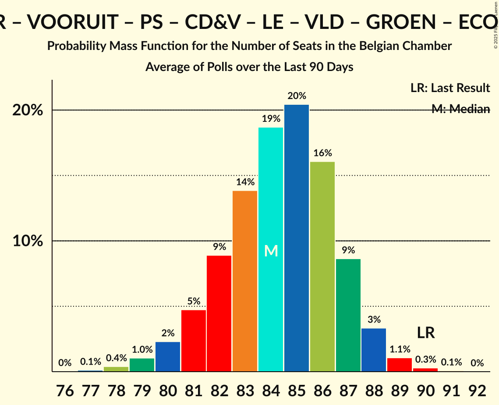
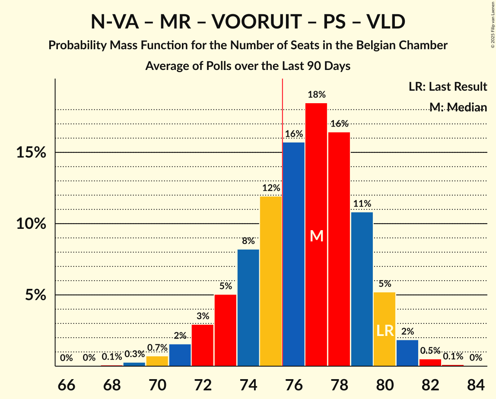
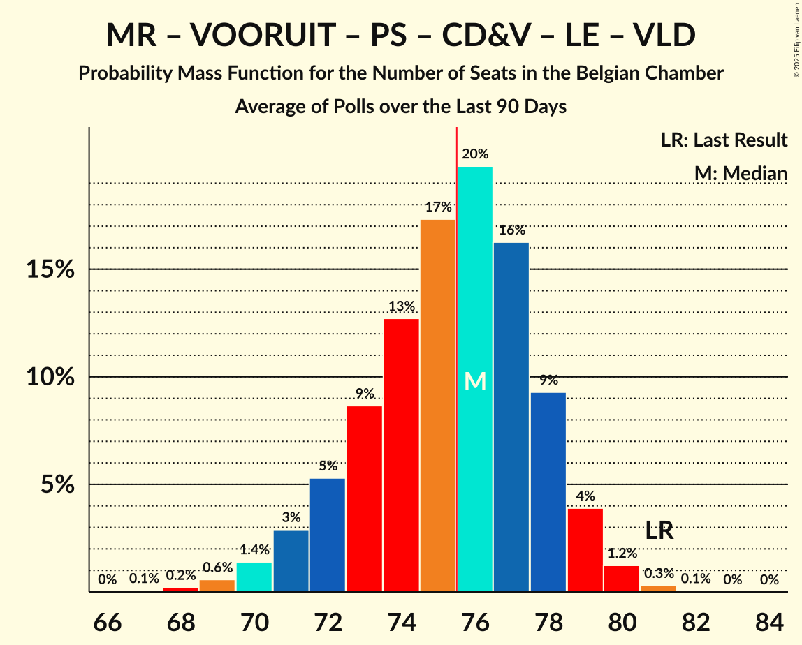
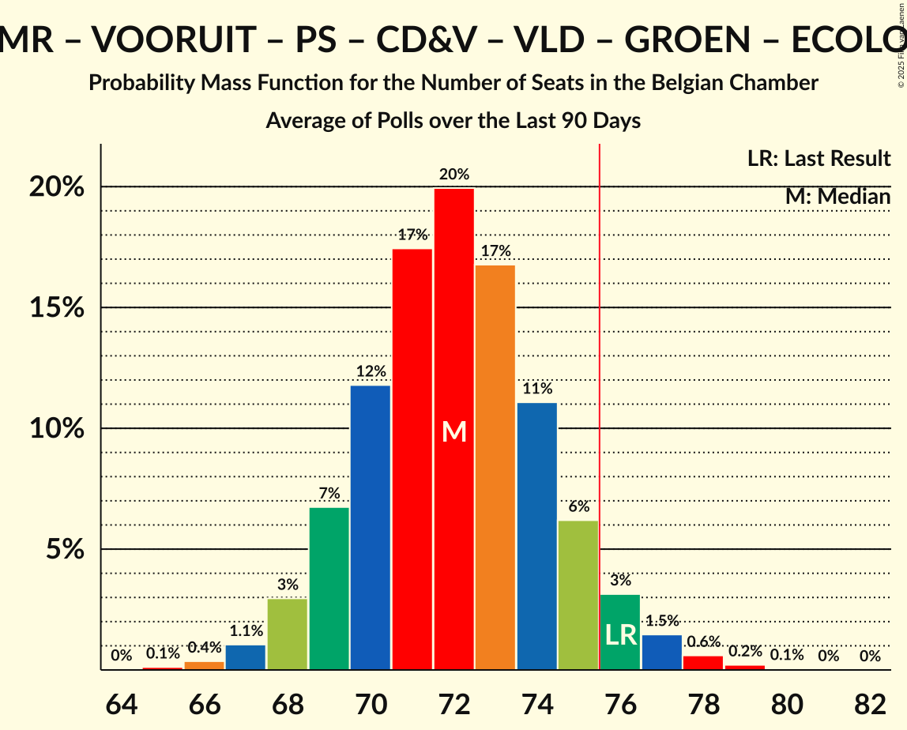
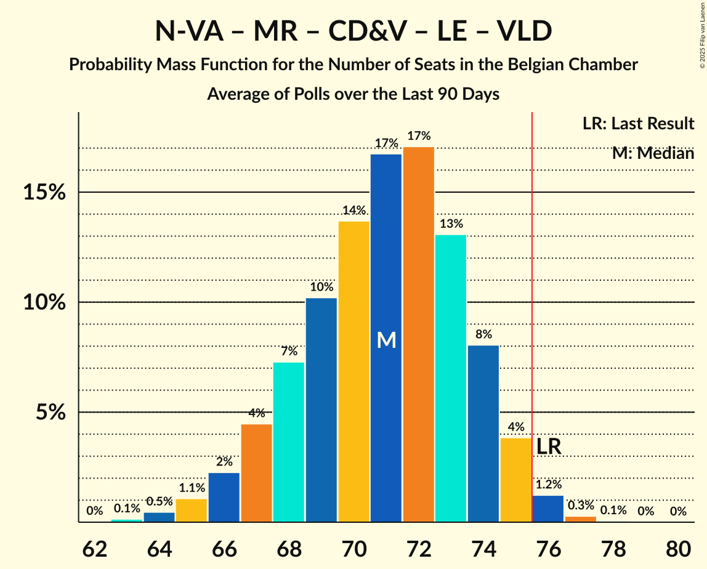
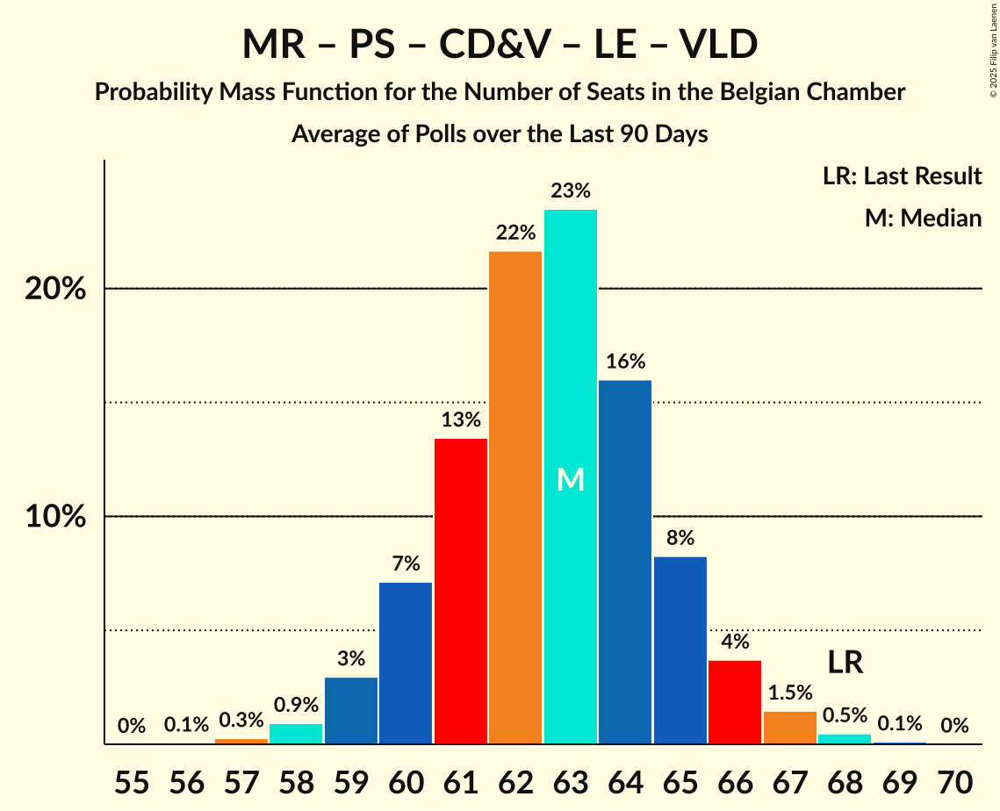
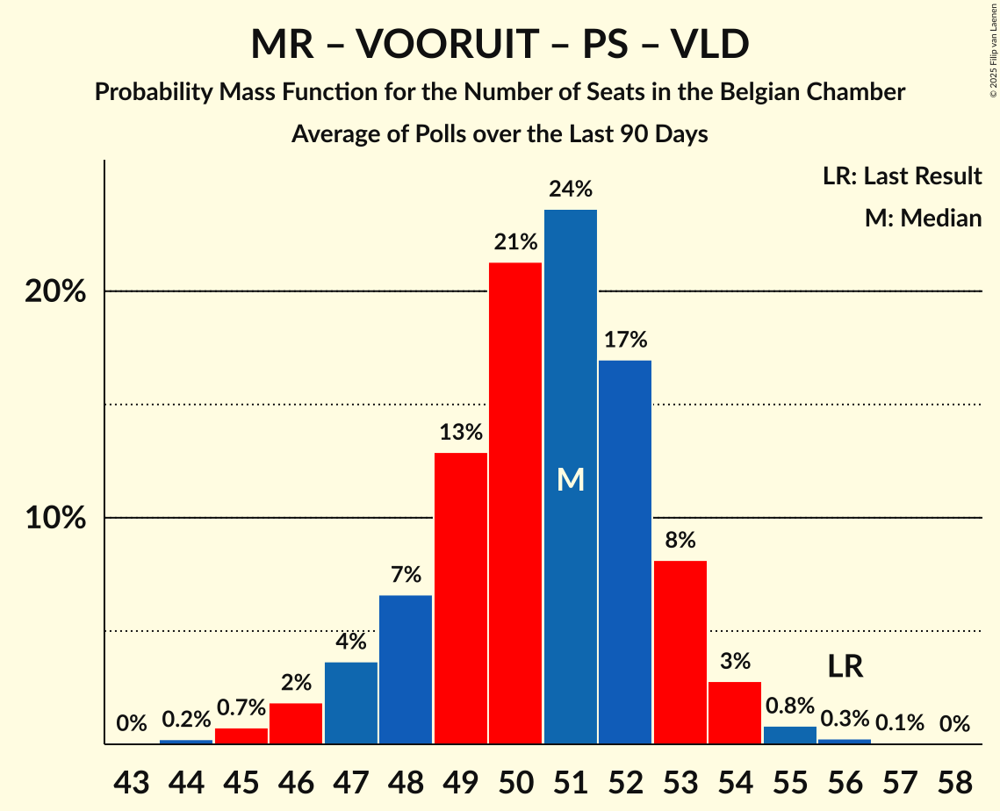

# Poll Average

<a href="#voting-intentions">Voting Intentions</a> | <a href="#seats">Seats</a> | <a href="#coalitions">Coalitions</a> | <a href="#technical-information">Technical Information</a>

## Summary

The table below lists the polls on which the average is based. They are the most recent polls (less than 90 days old) registered and analyzed so far.

| Period     | Polling firm/Commissioner(s) | N-VA | VB | MR | PVDA | PTB | VOORUIT | PS | CD&V | LE | VLD | GROEN | ECOLO | DÉFI | CN | TFA |
|:----------:|:----------------------------:|:--:|:--:|:--:|:--:|:--:|:--:|:--:|:--:|:--:|:--:|:--:|:--:|:--:|:--:|:--:|
| 9 June 2024 | General Election | 16.7%   24 | 13.8%   20 | 10.3%   20 | 5.1%   7 | 4.8%   8 | 8.1%   13 | 8.0%   16 | 8.0%   11 | 6.8%   14 | 5.4%   7 | 4.6%   6 | 2.9%   3 | 1.2%   1 | 0.9%   0 | 0.4%   0 |
| N/A | Poll Average | 15–16%   23–29 | 12–13%   18–24 | 8%   15–18 | 5–6%   5–9 | 6%   10–13 | 7–10%   9–15 | 8%   16–20 | 8–10%   10–15 | 6%   10–15 | 3–4%   2–4 | 4–5%   3–6 | 2–3%   3–6 | 0–1%   0 | 1%   0 | N/A   N/A |
| [27 May–3 June 2025](2025-06-03-Ipsos.html) | Ipsos   Het Laatste Nieuws, Le Soir, RTL TVi and VTM | 15–17%   22–29 | 13–15%   19–24 | 8%   15–19 | 4–6%   5–9 | 6%   10–13 | 7–9%   9–14 | 8–9%   16–20 | 8–10%   10–15 | 6%   10–14 | 3–4%   2–6 | 4–5%   3–6 | 3%   2–7 | 0–1%   0 | 1%   0 | N/A   N/A |
| [3–24 March 2025](2025-03-24-BpactandUniversiteitAntwerpenULB.html) | Bpact and Universiteit Antwerpen & ULB   De Standaard, RTBF and VRT | 16%   24–29 | 12%   17–22 | 8%   16–18 | 5–6%   5–8 | 6%   10–13 | 8–10%   12–15 | 8%   16–19 | 8–9%   10–14 | 6%   11–15 | 3–4%   2–4 | 4–5%   4–6 | 2–3%   3–4 | 1%   0 | 1%   0 | N/A   N/A |
| 9 June 2024 | General Election | 16.7%   24 | 13.8%   20 | 10.3%   20 | 5.1%   7 | 4.8%   8 | 8.1%   13 | 8.0%   16 | 8.0%   11 | 6.8%   14 | 5.4%   7 | 4.6%   6 | 2.9%   3 | 1.2%   1 | 0.9%   0 | 0.4%   0 |

Only polls for which at least the sample size has been published are included in the table above.

**Legend:**
+ **Top half of each row:** Voting intentions (95% confidence interval)
+ **Bottom half of each row:** Seat projections for the Belgian Chamber (95% confidence interval)
+ **N-VA:** Nieuw-Vlaamse Alliantie
+ **VB:** Vlaams Belang
+ **MR:** Mouvement Réformateur
+ **PVDA:** Partij van de Arbeid van België
+ **PTB:** Parti du Travail de Belgique
+ **VOORUIT:** Vooruit
+ **PS:** Parti Socialiste
+ **CD&V:** Christen-Democratisch en Vlaams
+ **LE:** Les Engagés
+ **VLD:** Open Vlaamse Liberalen en Democraten
+ **GROEN:** Groen
+ **ECOLO:** Ecolo
+ **DÉFI:** DéFI
+ **CN:** Chez Nous
+ **TFA:** Team Fouad Ahidar
+ **N/A (single party):** Party not included the published results
+ **N/A (entire row):** Calculation for this opinion poll not started yet

## Voting Intentions

### Confidence Intervals

| Party | Last Result | Median | 80% Confidence Interval | 90% Confidence Interval | 95% Confidence Interval | 99% Confidence Interval |
|:-----:|:-----------:|:------:|:-----------------------:|:-----------------------:|:-----------------------:|:-----------------------:|
| <a href="#nieuw-vlaamse-alliantie">Nieuw-Vlaamse Alliantie</a> | 16.7% | 16.2% | 15.5–16.5% |15.2–16.5% | 15.0–16.5% | 14.4–16.6% |
| <a href="#vlaams-belang">Vlaams Belang</a> | 13.8% | 12.4% | 12.0–12.6% |11.8–12.6% | 11.7–12.6% | 11.4–12.6% |
| <a href="#mouvement-réformateur">Mouvement Réformateur</a> | 10.3% | 8.3% | 8.1–8.5% |8.0–8.5% | 7.9–8.5% | 7.7–8.5% |
| <a href="#vooruit">Vooruit</a> | 8.1% | 8.8% | 7.8–9.4% |7.5–9.5% | 7.3–9.6% | 6.9–9.7% |
| <a href="#parti-socialiste">Parti Socialiste</a> | 8.0% | 8.4% | 8.2–8.5% |8.1–8.5% | 8.0–8.5% | 7.9–8.5% |
| <a href="#christen-democratisch-en-vlaams">Christen-Democratisch en Vlaams</a> | 8.0% | 8.7% | 8.0–9.3% |7.8–9.5% | 7.7–9.6% | 7.4–9.6% |
| <a href="#les-engagés">Les Engagés</a> | 6.8% | 6.0% | 5.7–6.1% |5.6–6.1% | 5.6–6.1% | 5.4–6.2% |
| <a href="#open-vlaamse-liberalen-en-democraten">Open Vlaamse Liberalen en Democraten</a> | 5.4% | 3.6% | 3.2–4.0% |3.1–4.1% | 3.0–4.2% | 2.8–4.2% |
| <a href="#partij-van-de-arbeid-van-belgië">Partij van de Arbeid van België</a> | 5.1% | 5.5% | 5.0–6.0% |4.8–6.1% | 4.6–6.1% | 4.3–6.2% |
| <a href="#parti-du-travail-de-belgique">Parti du Travail de Belgique</a> | 4.8% | 5.9% | 5.7–6.0% |5.6–6.0% | 5.5–6.0% | 5.4–6.0% |
| <a href="#groen">Groen</a> | 4.6% | 4.6% | 4.1–5.0% |3.9–5.1% | 3.8–5.1% | 3.5–5.2% |
| <a href="#ecolo">Ecolo</a> | 2.9% | 2.7% | 2.5–2.7% |2.5–2.7% | 2.5–2.7% | 2.4–2.7% |
| <a href="#défi">DéFI</a> | 1.2% | 0.8% | 0.6–0.9% |0.5–0.9% | 0.5–0.9% | 0.4–0.9% |
| <a href="#chez-nous">Chez Nous</a> | 0.9% | 0.9% | 0.7–1.0% |0.7–1.0% | 0.6–1.0% | 0.6–1.0% |
| <a href="#team-fouad-ahidar">Team Fouad Ahidar</a> | 0.4% | N/A | N/A |N/A | N/A | N/A |

### Nieuw-Vlaamse Alliantie

*For a full overview of the results for this party, see the [Nieuw-Vlaamse Alliantie](party-nieuw-vlaamsealliantie.html) page.*

| Voting Intentions | Probability | Accumulated | Special Marks |
|:-----------------:|:-----------:|:-----------:|:-------------:|
| 12.5–13.5% | 0% | 100% |  |
| 13.5–14.5% | 0.8% | 100% |  |
| 14.5–15.5% | 10% | 99.2% |  |
| 15.5–16.5% | 87% | 90% | Median |
| 16.5–17.5% | 100% | 2% | Last Result |
| 17.5–18.5% | 84% | 0% |  |
| 18.5–19.5% | 3% | 0% |  |

### Vlaams Belang

*For a full overview of the results for this party, see the [Vlaams Belang](party-vlaamsbelang.html) page.*

| Voting Intentions | Probability | Accumulated | Special Marks |
|:-----------------:|:-----------:|:-----------:|:-------------:|
| 9.5–10.5% | 0% | 100% |  |
| 10.5–11.5% | 1.2% | 100% |  |
| 11.5–12.5% | 83% | 98.8% | Median |
| 12.5–13.5% | 100% | 16% |  |
| 13.5–14.5% | 83% | 0% | Last Result |
| 14.5–15.5% | 17% | 0% |  |
| 15.5–16.5% | 3% | 0% |  |

### Mouvement Réformateur

*For a full overview of the results for this party, see the [Mouvement Réformateur](party-mouvementréformateur.html) page.*

| Voting Intentions | Probability | Accumulated | Special Marks |
|:-----------------:|:-----------:|:-----------:|:-------------:|
| 5.5–6.5% | 0% | 100% |  |
| 6.5–7.5% | 0.1% | 100% |  |
| 7.5–8.5% | 100% | 99.9% | Median |
| 8.5–9.5% | 100% | 0% |  |
| 9.5–10.5% | 75% | 0% | Last Result |
| 10.5–11.5% | 0.1% | 0% |  |

### Vooruit

*For a full overview of the results for this party, see the [Vooruit](party-vooruit.html) page.*

| Voting Intentions | Probability | Accumulated | Special Marks |
|:-----------------:|:-----------:|:-----------:|:-------------:|
| 4.5–5.5% | 0% | 100% |  |
| 5.5–6.5% | 0.1% | 100% |  |
| 6.5–7.5% | 6% | 99.9% |  |
| 7.5–8.5% | 32% | 94% | Last Result |
| 8.5–9.5% | 57% | 62% | Median |
| 9.5–10.5% | 15% | 4% |  |
| 10.5–11.5% | 0.2% | 0% |  |

### Parti Socialiste

*For a full overview of the results for this party, see the [Parti Socialiste](party-partisocialiste.html) page.*

| Voting Intentions | Probability | Accumulated | Special Marks |
|:-----------------:|:-----------:|:-----------:|:-------------:|
| 6.5–7.5% | 0% | 100% |  |
| 7.5–8.5% | 100% | 100% | Last Result, Median |
| 8.5–9.5% | 100% | 0% |  |
| 9.5–10.5% | 100% | 0% |  |
| 10.5–11.5% | 6% | 0% |  |

### Christen-Democratisch en Vlaams

*For a full overview of the results for this party, see the [Christen-Democratisch en Vlaams](party-christen-democratischenvlaams.html) page.*

| Voting Intentions | Probability | Accumulated | Special Marks |
|:-----------------:|:-----------:|:-----------:|:-------------:|
| 5.5–6.5% | 0% | 100% |  |
| 6.5–7.5% | 1.4% | 100% |  |
| 7.5–8.5% | 41% | 98.6% | Last Result |
| 8.5–9.5% | 55% | 58% | Median |
| 9.5–10.5% | 13% | 3% |  |
| 10.5–11.5% | 1.1% | 0% |  |

### Les Engagés

*For a full overview of the results for this party, see the [Les Engagés](party-lesengagés.html) page.*

| Voting Intentions | Probability | Accumulated | Special Marks |
|:-----------------:|:-----------:|:-----------:|:-------------:|
| 3.5–4.5% | 0% | 100% |  |
| 4.5–5.5% | 2% | 100% |  |
| 5.5–6.5% | 100% | 98% | Median |
| 6.5–7.5% | 100% | 0% | Last Result |
| 7.5–8.5% | 10% | 0% |  |

### Open Vlaamse Liberalen en Democraten

*For a full overview of the results for this party, see the [Open Vlaamse Liberalen en Democraten](party-openvlaamseliberalenendemocraten.html) page.*

| Voting Intentions | Probability | Accumulated | Special Marks |
|:-----------------:|:-----------:|:-----------:|:-------------:|
| 1.5–2.5% | 0.1% | 100% |  |
| 2.5–3.5% | 42% | 99.9% |  |
| 3.5–4.5% | 65% | 58% | Median |
| 4.5–5.5% | 4% | 0% | Last Result |

### Partij van de Arbeid van België

*For a full overview of the results for this party, see the [Partij van de Arbeid van België](party-partijvandearbeidvanbelgië.html) page.*

| Voting Intentions | Probability | Accumulated | Special Marks |
|:-----------------:|:-----------:|:-----------:|:-------------:|
| 2.5–3.5% | 0% | 100% |  |
| 3.5–4.5% | 2% | 100% |  |
| 4.5–5.5% | 52% | 98% | Last Result |
| 5.5–6.5% | 54% | 47% | Median |
| 6.5–7.5% | 3% | 0% |  |

### Parti du Travail de Belgique

*For a full overview of the results for this party, see the [Parti du Travail de Belgique](party-partidutravaildebelgique.html) page.*

| Voting Intentions | Probability | Accumulated | Special Marks |
|:-----------------:|:-----------:|:-----------:|:-------------:|
| 3.5–4.5% | 0% | 100% |  |
| 4.5–5.5% | 3% | 100% | Last Result |
| 5.5–6.5% | 100% | 97% | Median |
| 6.5–7.5% | 100% | 0% |  |
| 7.5–8.5% | 2% | 0% |  |

### Groen

*For a full overview of the results for this party, see the [Groen](party-groen.html) page.*

| Voting Intentions | Probability | Accumulated | Special Marks |
|:-----------------:|:-----------:|:-----------:|:-------------:|
| 1.5–2.5% | 0% | 100% |  |
| 2.5–3.5% | 0.6% | 100% |  |
| 3.5–4.5% | 49% | 99.4% |  |
| 4.5–5.5% | 59% | 51% | Last Result, Median |
| 5.5–6.5% | 3% | 0% |  |

### Ecolo

*For a full overview of the results for this party, see the [Ecolo](party-ecolo.html) page.*

| Voting Intentions | Probability | Accumulated | Special Marks |
|:-----------------:|:-----------:|:-----------:|:-------------:|
| 0.5–1.5% | 0% | 100% |  |
| 1.5–2.5% | 13% | 100% |  |
| 2.5–3.5% | 100% | 87% | Last Result, Median |
| 3.5–4.5% | 100% | 0% |  |

### DéFI

*For a full overview of the results for this party, see the [DéFI](party-défi.html) page.*

| Voting Intentions | Probability | Accumulated | Special Marks |
|:-----------------:|:-----------:|:-----------:|:-------------:|
| 0.0–0.5% | 6% | 100% |  |
| 0.5–1.5% | 100% | 94% | Last Result, Median |
| 1.5–2.5% | 0.3% | 0% |  |

### Chez Nous

*For a full overview of the results for this party, see the [Chez Nous](party-cheznous.html) page.*

| Voting Intentions | Probability | Accumulated | Special Marks |
|:-----------------:|:-----------:|:-----------:|:-------------:|
| 0.0–0.5% | 0.3% | 100% |  |
| 0.5–1.5% | 100% | 99.7% | Last Result, Median |
| 1.5–2.5% | 0.1% | 0% |  |

## Seats

### Confidence Intervals

| Party | Last Result | Median | 80% Confidence Interval | 90% Confidence Interval | 95% Confidence Interval | 99% Confidence Interval |
|:-----:|:-----------:|:------:|:-----------------------:|:-----------------------:|:-----------------------:|:-----------------------:|
| <a href="#nieuw-vlaamse-alliantie">Nieuw-Vlaamse Alliantie</a> | 24 | 26 | 24–28 |24–29 | 23–29 | 21–30 |
| <a href="#vlaams-belang">Vlaams Belang</a> | 20 | 20 | 18–23 |18–24 | 18–24 | 16–25 |
| <a href="#mouvement-réformateur">Mouvement Réformateur</a> | 20 | 17 | 16–18 |16–18 | 15–18 | 14–20 |
| <a href="#vooruit">Vooruit</a> | 13 | 13 | 10–14 |9–14 | 9–15 | 9–15 |
| <a href="#parti-socialiste">Parti Socialiste</a> | 16 | 18 | 17–19 |16–19 | 16–20 | 15–20 |
| <a href="#christen-democratisch-en-vlaams">Christen-Democratisch en Vlaams</a> | 11 | 13 | 10–14 |10–15 | 10–15 | 10–16 |
| <a href="#les-engagés">Les Engagés</a> | 14 | 12 | 10–14 |10–15 | 10–15 | 9–15 |
| <a href="#open-vlaamse-liberalen-en-democraten">Open Vlaamse Liberalen en Democraten</a> | 7 | 3 | 2–4 |2–4 | 2–4 | 2–7 |
| <a href="#partij-van-de-arbeid-van-belgië">Partij van de Arbeid van België</a> | 7 | 7 | 5–8 |5–8 | 5–9 | 5–10 |
| <a href="#parti-du-travail-de-belgique">Parti du Travail de Belgique</a> | 8 | 12 | 10–13 |10–13 | 10–13 | 10–14 |
| <a href="#groen">Groen</a> | 6 | 6 | 4–6 |4–6 | 3–6 | 3–7 |
| <a href="#ecolo">Ecolo</a> | 3 | 3 | 3–5 |3–6 | 3–6 | 2–7 |
| <a href="#défi">DéFI</a> | 1 | 0 | 0 |0 | 0 | 0–1 |
| <a href="#chez-nous">Chez Nous</a> | 0 | 0 | 0 |0 | 0 | 0 |
| <a href="#team-fouad-ahidar">Team Fouad Ahidar</a> | 0 | N/A | N/A |N/A | N/A | N/A |

### Nieuw-Vlaamse Alliantie

*For a full overview of the results for this party, see the [Nieuw-Vlaamse Alliantie](party-nieuw-vlaamsealliantie.html) page.*

| Number of Seats | Probability | Accumulated | Special Marks |
|:---------------:|:-----------:|:-----------:|:-------------:|
| 21 | 0.9% | 100% |  |
| 22 | 1.2% | 99.1% |  |
| 23 | 3% | 98% |  |
| 24 | 14% | 95% | Last Result |
| 25 | 19% | 81% |  |
| 26 | 20% | 62% | Median |
| 27 | 27% | 42% |  |
| 28 | 9% | 15% |  |
| 29 | 4% | 5% |  |
| 30 | 0.9% | 0.9% |  |
| 31 | 0% | 0% |  |

### Vlaams Belang

*For a full overview of the results for this party, see the [Vlaams Belang](party-vlaamsbelang.html) page.*

| Number of Seats | Probability | Accumulated | Special Marks |
|:---------------:|:-----------:|:-----------:|:-------------:|
| 16 | 0.5% | 100% |  |
| 17 | 2% | 99.5% |  |
| 18 | 9% | 98% |  |
| 19 | 17% | 89% |  |
| 20 | 31% | 72% | Last Result, Median |
| 21 | 12% | 41% |  |
| 22 | 14% | 29% |  |
| 23 | 9% | 15% |  |
| 24 | 5% | 6% |  |
| 25 | 0.6% | 0.8% |  |
| 26 | 0.1% | 0.2% |  |
| 27 | 0% | 0% |  |

### Mouvement Réformateur

*For a full overview of the results for this party, see the [Mouvement Réformateur](party-mouvementréformateur.html) page.*

| Number of Seats | Probability | Accumulated | Special Marks |
|:---------------:|:-----------:|:-----------:|:-------------:|
| 14 | 1.0% | 100% |  |
| 15 | 2% | 98.9% |  |
| 16 | 7% | 97% |  |
| 17 | 59% | 89% | Median |
| 18 | 28% | 30% |  |
| 19 | 2% | 2% |  |
| 20 | 0.5% | 0.6% | Last Result |
| 21 | 0.1% | 0.1% |  |
| 22 | 0% | 0% |  |

### Vooruit

*For a full overview of the results for this party, see the [Vooruit](party-vooruit.html) page.*

| Number of Seats | Probability | Accumulated | Special Marks |
|:---------------:|:-----------:|:-----------:|:-------------:|
| 9 | 7% | 100% |  |
| 10 | 5% | 93% |  |
| 11 | 5% | 87% |  |
| 12 | 10% | 83% |  |
| 13 | 42% | 73% | Last Result, Median |
| 14 | 28% | 31% |  |
| 15 | 3% | 3% |  |
| 16 | 0.2% | 0.2% |  |
| 17 | 0% | 0% |  |

### Parti Socialiste

*For a full overview of the results for this party, see the [Parti Socialiste](party-partisocialiste.html) page.*

| Number of Seats | Probability | Accumulated | Special Marks |
|:---------------:|:-----------:|:-----------:|:-------------:|
| 14 | 0.1% | 100% |  |
| 15 | 1.2% | 99.9% |  |
| 16 | 8% | 98.7% | Last Result |
| 17 | 38% | 91% |  |
| 18 | 32% | 53% | Median |
| 19 | 17% | 21% |  |
| 20 | 4% | 4% |  |
| 21 | 0.3% | 0.3% |  |
| 22 | 0% | 0% |  |

### Christen-Democratisch en Vlaams

*For a full overview of the results for this party, see the [Christen-Democratisch en Vlaams](party-christen-democratischenvlaams.html) page.*

| Number of Seats | Probability | Accumulated | Special Marks |
|:---------------:|:-----------:|:-----------:|:-------------:|
| 10 | 11% | 100% |  |
| 11 | 11% | 89% | Last Result |
| 12 | 22% | 78% |  |
| 13 | 39% | 56% | Median |
| 14 | 9% | 17% |  |
| 15 | 8% | 9% |  |
| 16 | 0.5% | 0.7% |  |
| 17 | 0.2% | 0.3% |  |
| 18 | 0.1% | 0.1% |  |
| 19 | 0% | 0% |  |

### Les Engagés

*For a full overview of the results for this party, see the [Les Engagés](party-lesengagés.html) page.*

| Number of Seats | Probability | Accumulated | Special Marks |
|:---------------:|:-----------:|:-----------:|:-------------:|
| 9 | 1.0% | 100% |  |
| 10 | 11% | 99.0% |  |
| 11 | 21% | 88% |  |
| 12 | 18% | 66% | Median |
| 13 | 23% | 49% |  |
| 14 | 20% | 26% | Last Result |
| 15 | 7% | 7% |  |
| 16 | 0% | 0% |  |

### Open Vlaamse Liberalen en Democraten

*For a full overview of the results for this party, see the [Open Vlaamse Liberalen en Democraten](party-openvlaamseliberalenendemocraten.html) page.*

| Number of Seats | Probability | Accumulated | Special Marks |
|:---------------:|:-----------:|:-----------:|:-------------:|
| 2 | 36% | 100% |  |
| 3 | 39% | 64% | Median |
| 4 | 23% | 25% |  |
| 5 | 0.7% | 2% |  |
| 6 | 1.0% | 2% |  |
| 7 | 0.7% | 0.7% | Last Result |
| 8 | 0% | 0% |  |

### Partij van de Arbeid van België

*For a full overview of the results for this party, see the [Partij van de Arbeid van België](party-partijvandearbeidvanbelgië.html) page.*

| Number of Seats | Probability | Accumulated | Special Marks |
|:---------------:|:-----------:|:-----------:|:-------------:|
| 5 | 10% | 100% |  |
| 6 | 13% | 90% |  |
| 7 | 49% | 77% | Last Result, Median |
| 8 | 25% | 28% |  |
| 9 | 2% | 3% |  |
| 10 | 0.4% | 0.8% |  |
| 11 | 0.3% | 0.3% |  |
| 12 | 0% | 0% |  |

### Parti du Travail de Belgique

*For a full overview of the results for this party, see the [Parti du Travail de Belgique](party-partidutravaildebelgique.html) page.*

| Number of Seats | Probability | Accumulated | Special Marks |
|:---------------:|:-----------:|:-----------:|:-------------:|
| 8 | 0% | 100% | Last Result |
| 9 | 0.3% | 100% |  |
| 10 | 16% | 99.7% |  |
| 11 | 26% | 83% |  |
| 12 | 33% | 57% | Median |
| 13 | 22% | 24% |  |
| 14 | 2% | 2% |  |
| 15 | 0% | 0% |  |

### Groen

*For a full overview of the results for this party, see the [Groen](party-groen.html) page.*

| Number of Seats | Probability | Accumulated | Special Marks |
|:---------------:|:-----------:|:-----------:|:-------------:|
| 3 | 4% | 100% |  |
| 4 | 20% | 96% |  |
| 5 | 9% | 76% |  |
| 6 | 66% | 67% | Last Result, Median |
| 7 | 0.6% | 0.9% |  |
| 8 | 0.2% | 0.4% |  |
| 9 | 0.2% | 0.2% |  |
| 10 | 0% | 0% |  |

### Ecolo

*For a full overview of the results for this party, see the [Ecolo](party-ecolo.html) page.*

| Number of Seats | Probability | Accumulated | Special Marks |
|:---------------:|:-----------:|:-----------:|:-------------:|
| 2 | 2% | 100% |  |
| 3 | 57% | 98% | Last Result, Median |
| 4 | 25% | 41% |  |
| 5 | 10% | 16% |  |
| 6 | 4% | 5% |  |
| 7 | 1.4% | 1.4% |  |
| 8 | 0% | 0% |  |

### DéFI

*For a full overview of the results for this party, see the [DéFI](party-défi.html) page.*

| Number of Seats | Probability | Accumulated | Special Marks |
|:---------------:|:-----------:|:-----------:|:-------------:|
| 0 | 99.1% | 100% | Median |
| 1 | 0.9% | 0.9% | Last Result |
| 2 | 0% | 0% |  |

### Chez Nous

*For a full overview of the results for this party, see the [Chez Nous](party-cheznous.html) page.*

| Number of Seats | Probability | Accumulated | Special Marks |
|:---------------:|:-----------:|:-----------:|:-------------:|
| 0 | 99.9% | 100% | Last Result, Median |
| 1 | 0.1% | 0.1% |  |
| 2 | 0% | 0% |  |

### Team Fouad Ahidar

*For a full overview of the results for this party, see the [Team Fouad Ahidar](party-teamfouadahidar.html) page.*

## Coalitions

### Confidence Intervals

| Coalition | Last Result | Median | Majority? | 80% Confidence Interval | 90% Confidence Interval | 95% Confidence Interval | 99% Confidence Interval |
|:---------:|:-----------:|:------:|:---------:|:-----------------------:|:-----------------------:|:-----------------------:|:-----------------------:|
| Mouvement Réformateur – Vooruit – Parti Socialiste – Christen-Democratisch en Vlaams – Les Engagés – Open Vlaamse Liberalen en Democraten – Groen – Ecolo | 90 | 84 | 100% | 82–87 | 81–87 | 80–88 | 78–89 |
| Vooruit – Parti Socialiste – Christen-Democratisch en Vlaams – Les Engagés – Partij van de Arbeid van België – Parti du Travail de Belgique – Groen – Ecolo | 78 | 83 | 99.9% | 80–85 | 79–86 | 78–87 | 77–88 |
| Nieuw-Vlaamse Alliantie – Vooruit – Parti Socialiste – Christen-Democratisch en Vlaams – Les Engagés | 78 | 81 | 98% | 78–84 | 77–85 | 76–86 | 74–87 |
| Nieuw-Vlaamse Alliantie – Mouvement Réformateur – Vooruit – Christen-Democratisch en Vlaams – Les Engagés | 82 | 81 | 96% | 77–84 | 76–85 | 75–86 | 73–87 |
| Nieuw-Vlaamse Alliantie – Mouvement Réformateur – Vooruit – Parti Socialiste – Open Vlaamse Liberalen en Democraten | 80 | 77 | 69% | 73–79 | 72–80 | 71–81 | 70–82 |
| Mouvement Réformateur – Vooruit – Parti Socialiste – Christen-Democratisch en Vlaams – Les Engagés – Open Vlaamse Liberalen en Democraten | 81 | 76 | 51% | 72–78 | 71–79 | 71–79 | 69–80 |
| Mouvement Réformateur – Vooruit – Parti Socialiste – Christen-Democratisch en Vlaams – Open Vlaamse Liberalen en Democraten – Groen – Ecolo | 76 | 72 | 5% | 69–75 | 69–76 | 68–76 | 66–78 |
| Nieuw-Vlaamse Alliantie – Mouvement Réformateur – Christen-Democratisch en Vlaams – Les Engagés – Open Vlaamse Liberalen en Democraten | 76 | 71 | 2% | 68–74 | 67–75 | 66–75 | 64–76 |
| Vooruit – Parti Socialiste – Christen-Democratisch en Vlaams – Les Engagés – Groen – Ecolo | 63 | 64 | 0% | 61–67 | 61–67 | 60–68 | 58–69 |
| Mouvement Réformateur – Parti Socialiste – Christen-Democratisch en Vlaams – Les Engagés – Open Vlaamse Liberalen en Democraten | 68 | 63 | 0% | 60–65 | 60–66 | 59–66 | 58–68 |
| Mouvement Réformateur – Vooruit – Parti Socialiste – Open Vlaamse Liberalen en Democraten – Groen – Ecolo | 65 | 60 | 0% | 57–62 | 56–63 | 55–63 | 54–65 |
| Nieuw-Vlaamse Alliantie – Mouvement Réformateur – Christen-Democratisch en Vlaams – Open Vlaamse Liberalen en Democraten | 62 | 59 | 0% | 56–61 | 55–62 | 55–62 | 53–64 |
| Vooruit – Parti Socialiste – Partij van de Arbeid van België – Parti du Travail de Belgique – Groen – Ecolo | 53 | 58 | 0% | 55–61 | 54–61 | 54–62 | 52–63 |
| Vooruit – Parti Socialiste – Christen-Democratisch en Vlaams – Les Engagés | 54 | 55 | 0% | 52–58 | 51–58 | 51–59 | 49–60 |
| Mouvement Réformateur – Christen-Democratisch en Vlaams – Les Engagés – Open Vlaamse Liberalen en Democraten – Groen – Ecolo | 61 | 54 | 0% | 51–56 | 51–57 | 50–58 | 49–59 |
| Mouvement Réformateur – Vooruit – Parti Socialiste – Open Vlaamse Liberalen en Democraten | 56 | 51 | 0% | 48–53 | 47–53 | 46–54 | 45–55 |
| Mouvement Réformateur – Christen-Democratisch en Vlaams – Les Engagés – Open Vlaamse Liberalen en Democraten | 52 | 45 | 0% | 42–47 | 42–48 | 41–49 | 40–50 |

### Mouvement Réformateur – Vooruit – Parti Socialiste – Christen-Democratisch en Vlaams – Les Engagés – Open Vlaamse Liberalen en Democraten – Groen – Ecolo

| Number of Seats | Probability | Accumulated | Special Marks |
|:---------------:|:-----------:|:-----------:|:-------------:|
| 77 | 0.1% | 100% |  |
| 78 | 0.4% | 99.8% |  |
| 79 | 1.0% | 99.5% |  |
| 80 | 2% | 98% |  |
| 81 | 5% | 96% |  |
| 82 | 9% | 91% |  |
| 83 | 14% | 82% |  |
| 84 | 19% | 69% |  |
| 85 | 20% | 50% | Median |
| 86 | 16% | 29% |  |
| 87 | 9% | 13% |  |
| 88 | 3% | 5% |  |
| 89 | 1.1% | 1.4% |  |
| 90 | 0.3% | 0.4% | Last Result |
| 91 | 0.1% | 0.1% |  |
| 92 | 0% | 0% |  |

### Vooruit – Parti Socialiste – Christen-Democratisch en Vlaams – Les Engagés – Partij van de Arbeid van België – Parti du Travail de Belgique – Groen – Ecolo

| Number of Seats | Probability | Accumulated | Special Marks |
|:---------------:|:-----------:|:-----------:|:-------------:|
| 75 | 0.1% | 100% |  |
| 76 | 0.3% | 99.9% | Majority |
| 77 | 0.9% | 99.6% |  |
| 78 | 2% | 98.7% | Last Result |
| 79 | 4% | 97% |  |
| 80 | 6% | 93% |  |
| 81 | 10% | 86% |  |
| 82 | 16% | 77% |  |
| 83 | 20% | 61% |  |
| 84 | 18% | 41% | Median |
| 85 | 12% | 22% |  |
| 86 | 7% | 10% |  |
| 87 | 2% | 3% |  |
| 88 | 0.6% | 0.8% |  |
| 89 | 0.1% | 0.2% |  |
| 90 | 0% | 0% |  |

### Nieuw-Vlaamse Alliantie – Vooruit – Parti Socialiste – Christen-Democratisch en Vlaams – Les Engagés

| Number of Seats | Probability | Accumulated | Special Marks |
|:---------------:|:-----------:|:-----------:|:-------------:|
| 72 | 0% | 100% |  |
| 73 | 0.1% | 99.9% |  |
| 74 | 0.4% | 99.8% |  |
| 75 | 1.0% | 99.4% |  |
| 76 | 2% | 98% | Majority |
| 77 | 5% | 96% |  |
| 78 | 7% | 91% | Last Result |
| 79 | 9% | 84% |  |
| 80 | 11% | 75% |  |
| 81 | 14% | 63% |  |
| 82 | 16% | 49% | Median |
| 83 | 14% | 33% |  |
| 84 | 10% | 19% |  |
| 85 | 6% | 9% |  |
| 86 | 2% | 3% |  |
| 87 | 0.6% | 0.7% |  |
| 88 | 0.1% | 0.1% |  |
| 89 | 0% | 0% |  |

### Nieuw-Vlaamse Alliantie – Mouvement Réformateur – Vooruit – Christen-Democratisch en Vlaams – Les Engagés

| Number of Seats | Probability | Accumulated | Special Marks |
|:---------------:|:-----------:|:-----------:|:-------------:|
| 71 | 0.1% | 100% |  |
| 72 | 0.2% | 99.9% |  |
| 73 | 0.4% | 99.8% |  |
| 74 | 1.1% | 99.3% |  |
| 75 | 3% | 98% |  |
| 76 | 5% | 96% | Majority |
| 77 | 7% | 91% |  |
| 78 | 9% | 83% |  |
| 79 | 9% | 75% |  |
| 80 | 10% | 65% |  |
| 81 | 12% | 55% | Median |
| 82 | 13% | 44% | Last Result |
| 83 | 12% | 31% |  |
| 84 | 9% | 19% |  |
| 85 | 6% | 10% |  |
| 86 | 3% | 4% |  |
| 87 | 0.9% | 1.0% |  |
| 88 | 0.2% | 0.2% |  |
| 89 | 0% | 0% |  |

### Nieuw-Vlaamse Alliantie – Mouvement Réformateur – Vooruit – Parti Socialiste – Open Vlaamse Liberalen en Democraten

| Number of Seats | Probability | Accumulated | Special Marks |
|:---------------:|:-----------:|:-----------:|:-------------:|
| 68 | 0.1% | 100% |  |
| 69 | 0.3% | 99.9% |  |
| 70 | 0.7% | 99.6% |  |
| 71 | 2% | 98.9% |  |
| 72 | 3% | 97% |  |
| 73 | 5% | 94% |  |
| 74 | 8% | 89% |  |
| 75 | 12% | 81% |  |
| 76 | 16% | 69% | Majority |
| 77 | 18% | 53% | Median |
| 78 | 16% | 35% |  |
| 79 | 11% | 19% |  |
| 80 | 5% | 8% | Last Result |
| 81 | 2% | 3% |  |
| 82 | 0.5% | 0.7% |  |
| 83 | 0.1% | 0.1% |  |
| 84 | 0% | 0% |  |

### Mouvement Réformateur – Vooruit – Parti Socialiste – Christen-Democratisch en Vlaams – Les Engagés – Open Vlaamse Liberalen en Democraten

| Number of Seats | Probability | Accumulated | Special Marks |
|:---------------:|:-----------:|:-----------:|:-------------:|
| 67 | 0.1% | 100% |  |
| 68 | 0.2% | 99.9% |  |
| 69 | 0.6% | 99.7% |  |
| 70 | 1.4% | 99.1% |  |
| 71 | 3% | 98% |  |
| 72 | 5% | 95% |  |
| 73 | 9% | 90% |  |
| 74 | 13% | 81% |  |
| 75 | 17% | 68% |  |
| 76 | 20% | 51% | Median, Majority |
| 77 | 16% | 31% |  |
| 78 | 9% | 15% |  |
| 79 | 4% | 5% |  |
| 80 | 1.2% | 2% |  |
| 81 | 0.3% | 0.4% | Last Result |
| 82 | 0.1% | 0.1% |  |
| 83 | 0% | 0% |  |

### Mouvement Réformateur – Vooruit – Parti Socialiste – Christen-Democratisch en Vlaams – Open Vlaamse Liberalen en Democraten – Groen – Ecolo

| Number of Seats | Probability | Accumulated | Special Marks |
|:---------------:|:-----------:|:-----------:|:-------------:|
| 65 | 0.1% | 100% |  |
| 66 | 0.4% | 99.8% |  |
| 67 | 1.1% | 99.5% |  |
| 68 | 3% | 98% |  |
| 69 | 7% | 95% |  |
| 70 | 12% | 89% |  |
| 71 | 17% | 77% |  |
| 72 | 20% | 59% |  |
| 73 | 17% | 40% | Median |
| 74 | 11% | 23% |  |
| 75 | 6% | 12% |  |
| 76 | 3% | 5% | Last Result, Majority |
| 77 | 1.5% | 2% |  |
| 78 | 0.6% | 0.9% |  |
| 79 | 0.2% | 0.3% |  |
| 80 | 0.1% | 0.1% |  |
| 81 | 0% | 0% |  |

### Nieuw-Vlaamse Alliantie – Mouvement Réformateur – Christen-Democratisch en Vlaams – Les Engagés – Open Vlaamse Liberalen en Democraten

| Number of Seats | Probability | Accumulated | Special Marks |
|:---------------:|:-----------:|:-----------:|:-------------:|
| 63 | 0.1% | 100% |  |
| 64 | 0.5% | 99.8% |  |
| 65 | 1.1% | 99.4% |  |
| 66 | 2% | 98% |  |
| 67 | 4% | 96% |  |
| 68 | 7% | 92% |  |
| 69 | 10% | 84% |  |
| 70 | 14% | 74% |  |
| 71 | 17% | 60% | Median |
| 72 | 17% | 44% |  |
| 73 | 13% | 27% |  |
| 74 | 8% | 13% |  |
| 75 | 4% | 5% |  |
| 76 | 1.2% | 2% | Last Result, Majority |
| 77 | 0.3% | 0.4% |  |
| 78 | 0.1% | 0.1% |  |
| 79 | 0% | 0% |  |

### Vooruit – Parti Socialiste – Christen-Democratisch en Vlaams – Les Engagés – Groen – Ecolo

| Number of Seats | Probability | Accumulated | Special Marks |
|:---------------:|:-----------:|:-----------:|:-------------:|
| 56 | 0% | 100% |  |
| 57 | 0.2% | 99.9% |  |
| 58 | 0.6% | 99.8% |  |
| 59 | 1.3% | 99.2% |  |
| 60 | 3% | 98% |  |
| 61 | 5% | 95% |  |
| 62 | 10% | 90% |  |
| 63 | 15% | 80% | Last Result |
| 64 | 18% | 66% |  |
| 65 | 19% | 47% | Median |
| 66 | 15% | 28% |  |
| 67 | 9% | 14% |  |
| 68 | 4% | 5% |  |
| 69 | 1.1% | 1.4% |  |
| 70 | 0.3% | 0.4% |  |
| 71 | 0.1% | 0.1% |  |
| 72 | 0% | 0% |  |

### Mouvement Réformateur – Parti Socialiste – Christen-Democratisch en Vlaams – Les Engagés – Open Vlaamse Liberalen en Democraten

| Number of Seats | Probability | Accumulated | Special Marks |
|:---------------:|:-----------:|:-----------:|:-------------:|
| 56 | 0.1% | 100% |  |
| 57 | 0.3% | 99.9% |  |
| 58 | 0.9% | 99.7% |  |
| 59 | 3% | 98.7% |  |
| 60 | 7% | 96% |  |
| 61 | 13% | 89% |  |
| 62 | 22% | 75% |  |
| 63 | 23% | 54% | Median |
| 64 | 16% | 30% |  |
| 65 | 8% | 14% |  |
| 66 | 4% | 6% |  |
| 67 | 1.5% | 2% |  |
| 68 | 0.5% | 0.6% | Last Result |
| 69 | 0.1% | 0.1% |  |
| 70 | 0% | 0% |  |

### Mouvement Réformateur – Vooruit – Parti Socialiste – Open Vlaamse Liberalen en Democraten – Groen – Ecolo

| Number of Seats | Probability | Accumulated | Special Marks |
|:---------------:|:-----------:|:-----------:|:-------------:|
| 52 | 0.1% | 100% |  |
| 53 | 0.2% | 99.9% |  |
| 54 | 0.7% | 99.7% |  |
| 55 | 2% | 99.0% |  |
| 56 | 4% | 97% |  |
| 57 | 8% | 93% |  |
| 58 | 14% | 85% |  |
| 59 | 20% | 72% |  |
| 60 | 21% | 52% | Median |
| 61 | 16% | 30% |  |
| 62 | 9% | 15% |  |
| 63 | 4% | 6% |  |
| 64 | 1.4% | 2% |  |
| 65 | 0.5% | 0.7% | Last Result |
| 66 | 0.2% | 0.2% |  |
| 67 | 0% | 0.1% |  |
| 68 | 0% | 0% |  |

### Nieuw-Vlaamse Alliantie – Mouvement Réformateur – Christen-Democratisch en Vlaams – Open Vlaamse Liberalen en Democraten

| Number of Seats | Probability | Accumulated | Special Marks |
|:---------------:|:-----------:|:-----------:|:-------------:|
| 51 | 0% | 100% |  |
| 52 | 0.2% | 99.9% |  |
| 53 | 0.6% | 99.8% |  |
| 54 | 1.5% | 99.2% |  |
| 55 | 3% | 98% |  |
| 56 | 7% | 95% |  |
| 57 | 14% | 88% |  |
| 58 | 22% | 74% |  |
| 59 | 21% | 53% | Median |
| 60 | 16% | 31% |  |
| 61 | 10% | 15% |  |
| 62 | 4% | 5% | Last Result |
| 63 | 1.0% | 2% |  |
| 64 | 0.4% | 0.5% |  |
| 65 | 0.1% | 0.1% |  |
| 66 | 0% | 0% |  |

### Vooruit – Parti Socialiste – Partij van de Arbeid van België – Parti du Travail de Belgique – Groen – Ecolo

| Number of Seats | Probability | Accumulated | Special Marks |
|:---------------:|:-----------:|:-----------:|:-------------:|
| 50 | 0.1% | 100% |  |
| 51 | 0.2% | 99.9% |  |
| 52 | 0.6% | 99.7% |  |
| 53 | 1.5% | 99.0% | Last Result |
| 54 | 3% | 98% |  |
| 55 | 6% | 94% |  |
| 56 | 11% | 88% |  |
| 57 | 16% | 78% |  |
| 58 | 19% | 62% |  |
| 59 | 18% | 43% | Median |
| 60 | 14% | 25% |  |
| 61 | 7% | 11% |  |
| 62 | 3% | 4% |  |
| 63 | 0.7% | 0.9% |  |
| 64 | 0.2% | 0.2% |  |
| 65 | 0% | 0% |  |

### Vooruit – Parti Socialiste – Christen-Democratisch en Vlaams – Les Engagés

| Number of Seats | Probability | Accumulated | Special Marks |
|:---------------:|:-----------:|:-----------:|:-------------:|
| 47 | 0.1% | 100% |  |
| 48 | 0.2% | 99.9% |  |
| 49 | 0.6% | 99.7% |  |
| 50 | 2% | 99.1% |  |
| 51 | 3% | 98% |  |
| 52 | 6% | 94% |  |
| 53 | 9% | 88% |  |
| 54 | 13% | 79% | Last Result |
| 55 | 17% | 66% |  |
| 56 | 19% | 49% | Median |
| 57 | 16% | 30% |  |
| 58 | 9% | 14% |  |
| 59 | 3% | 4% |  |
| 60 | 0.8% | 1.1% |  |
| 61 | 0.2% | 0.2% |  |
| 62 | 0% | 0.1% |  |
| 63 | 0% | 0% |  |

### Mouvement Réformateur – Christen-Democratisch en Vlaams – Les Engagés – Open Vlaamse Liberalen en Democraten – Groen – Ecolo

| Number of Seats | Probability | Accumulated | Special Marks |
|:---------------:|:-----------:|:-----------:|:-------------:|
| 47 | 0.1% | 100% |  |
| 48 | 0.3% | 99.9% |  |
| 49 | 1.0% | 99.6% |  |
| 50 | 3% | 98.6% |  |
| 51 | 6% | 96% |  |
| 52 | 12% | 89% |  |
| 53 | 17% | 78% |  |
| 54 | 20% | 60% | Median |
| 55 | 18% | 40% |  |
| 56 | 12% | 22% |  |
| 57 | 6% | 10% |  |
| 58 | 2% | 4% |  |
| 59 | 1.0% | 1.5% |  |
| 60 | 0.4% | 0.5% |  |
| 61 | 0.1% | 0.1% | Last Result |
| 62 | 0% | 0% |  |

### Mouvement Réformateur – Vooruit – Parti Socialiste – Open Vlaamse Liberalen en Democraten

| Number of Seats | Probability | Accumulated | Special Marks |
|:---------------:|:-----------:|:-----------:|:-------------:|
| 43 | 0% | 100% |  |
| 44 | 0.2% | 99.9% |  |
| 45 | 0.7% | 99.7% |  |
| 46 | 2% | 99.0% |  |
| 47 | 4% | 97% |  |
| 48 | 7% | 93% |  |
| 49 | 13% | 87% |  |
| 50 | 21% | 74% |  |
| 51 | 24% | 53% | Median |
| 52 | 17% | 29% |  |
| 53 | 8% | 12% |  |
| 54 | 3% | 4% |  |
| 55 | 0.8% | 1.2% |  |
| 56 | 0.3% | 0.3% | Last Result |
| 57 | 0.1% | 0.1% |  |
| 58 | 0% | 0% |  |

### Mouvement Réformateur – Christen-Democratisch en Vlaams – Les Engagés – Open Vlaamse Liberalen en Democraten

| Number of Seats | Probability | Accumulated | Special Marks |
|:---------------:|:-----------:|:-----------:|:-------------:|
| 38 | 0.1% | 100% |  |
| 39 | 0.3% | 99.9% |  |
| 40 | 1.0% | 99.6% |  |
| 41 | 3% | 98.6% |  |
| 42 | 6% | 96% |  |
| 43 | 12% | 90% |  |
| 44 | 17% | 77% |  |
| 45 | 20% | 60% | Median |
| 46 | 19% | 40% |  |
| 47 | 12% | 21% |  |
| 48 | 6% | 9% |  |
| 49 | 2% | 3% |  |
| 50 | 0.7% | 1.0% |  |
| 51 | 0.2% | 0.2% |  |
| 52 | 0% | 0% | Last Result |

## Technical Information

+ **Number of polls included in this average:** 2
+ **Lowest number of simulations done in a poll included in this average:** 2,097,152
+ **Total number of simulations done in the polls included in this average:** 4,194,304
+ **Error estimate:** 1.04%
