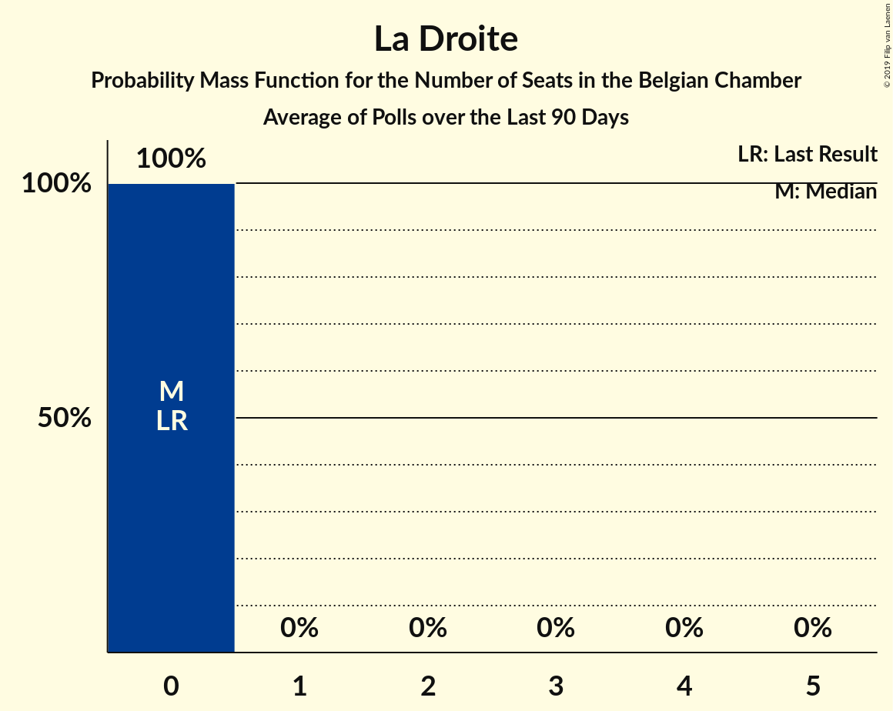

# Poll Average

<a href="#voting-intentions">Voting Intentions</a> | <a href="#seats">Seats</a> | <a href="#coalitions">Coalitions</a> | <a href="#technical-information">Technical Information</a>

## Summary

The table below lists the polls on which the average is based. They are the most recent polls (less than 90 days old) registered and analyzed so far.

| Period     | Polling firm/Commissioner(s) | N-VA | PS | CD&V | VLD | MR | SP.A | GROEN | CDH | VB | ECOLO | PTB | DÉFI | PVDA | PP | DLB | LDD | DROITE | PIRAAT | ISLAM | WDA | PIRATE | RWF | FW |
|:----------:|:----------------------------:|:--:|:--:|:--:|:--:|:--:|:--:|:--:|:--:|:--:|:--:|:--:|:--:|:--:|:--:|:--:|:--:|:--:|:--:|:--:|:--:|:--:|:--:|:--:|
| 25 May 2014 | General Election | 20.3%   33 | 11.7%   23 | 11.6%   18 | 9.8%   14 | 9.6%   20 | 8.8%   13 | 5.3%   6 | 5.0%   9 | 3.7%   3 | 3.3%   6 | 2.0%   2 | 1.8%   2 | 1.8%   0 | 1.5%   1 | 0.9%   0 | 0.4%   0 | 0.4%   0 | 0.3%   0 | 0.2%   0 | 0.2%   0 | 0.2%   0 | 0.1%   0 | 0.1%   0 |
| N/A | Poll Average | 15–16%   25–34 | 7–8%   15–20 | 8–9%   13–18 | 7–8%   11–16 | 6–7%   13–19 | 5–6%   6–13 | 7–9%   10–14 | 3%   4–8 | 4%   4–9 | 4–5%   9–15 | 3%   4–9 | 2%   2–6 | 2–4%   1–5 | 1%   0–3 | N/A   N/A | N/A   N/A | 0–1%   0 | N/A   N/A | N/A   N/A | N/A   N/A | N/A   N/A | N/A   N/A | N/A   N/A |
| [29 May–6 June 2018](2018-06-06-Ipsos.html) | Ipsos   Het Laatste Nieuws, Le Soir, RTL TVi and VTM | 15–16%   24–30 | 7–8%   15–19 | 8–9%   13–18 | 7–8%   11–16 | 6–7%   13–18 | 6–7%   9–13 | 6–8%   10–13 | 3%   4–7 | 5–6%   7–10 | 4–5%   8–11 | 4%   6–10 | 2–3%   2–6 | 3–4%   2–6 | 2%   2–4 | N/A   N/A | N/A   N/A | 0–1%   0 | N/A   N/A | N/A   N/A | N/A   N/A | N/A   N/A | N/A   N/A | N/A   N/A |
| [26 February–17 March 2018](2018-03-17-TNS.html) | TNS   De Standaard–VRT–RTBf–La Libre Belgique | 18–19%   28–34 | 8%   15–20 | 8–10%   13–18 | 8%   11–16 | 8%   15–19 | 4–5%   6–10 | 7–9%   11–14 | 3–4%   5–9 | 3–4%   3–7 | 6%   11–15 | 3%   4–8 | 2%   2–5 | 2–4%   1–3 | 1%   0 | N/A   N/A | N/A   N/A | N/A   N/A | N/A   N/A | N/A   N/A | N/A   N/A | N/A   N/A | N/A   N/A | N/A   N/A |
| 25 May 2014 | General Election | 20.3%   33 | 11.7%   23 | 11.6%   18 | 9.8%   14 | 9.6%   20 | 8.8%   13 | 5.3%   6 | 5.0%   9 | 3.7%   3 | 3.3%   6 | 2.0%   2 | 1.8%   2 | 1.8%   0 | 1.5%   1 | 0.9%   0 | 0.4%   0 | 0.4%   0 | 0.3%   0 | 0.2%   0 | 0.2%   0 | 0.2%   0 | 0.1%   0 | 0.1%   0 |

Only polls for which at least the sample size has been published are included in the table above.

**Legend:**
+ **Top half of each row:** Voting intentions (95% confidence interval)
+ **Bottom half of each row:** Seat projections for the Belgian Chamber (95% confidence interval)
+ **N-VA:** N-VA
+ **PS:** PS
+ **CD&V:** CD&V
+ **VLD:** Open Vld
+ **MR:** MR
+ **SP.A:** sp.a
+ **GROEN:** Groen
+ **CDH:** cdH
+ **VB:** Vlaams Belang
+ **ECOLO:** Ecolo
+ **PTB:** PTB
+ **DÉFI:** DéFI
+ **PVDA:** PVDA
+ **PP:** Parti Populaire
+ **DLB:** Debout les Belges
+ **LDD:** Lijst Dedecker
+ **DROITE:** La Droite
+ **PIRAAT:** Piratenpartij
+ **ISLAM:** ISLAM
+ **WDA:** Wallonie d’Abord
+ **PIRATE:** PIRATE
+ **RWF:** R.W.F.
+ **FW:** FW
+ **N/A (single party):** Party not included the published results
+ **N/A (entire row):** Calculation for this opinion poll not started yet

## Voting Intentions

### Confidence Intervals

| Party | Last Result | Median | 80% Confidence Interval | 90% Confidence Interval | 95% Confidence Interval | 99% Confidence Interval |
|:-----:|:-----------:|:------:|:-----------------------:|:-----------------------:|:-----------------------:|:-----------------------:|
| <a href="#n-va">N-VA</a> | 20.3% | 16.0% | 15.3–16.3% |15.0–16.3% | 14.8–16.3% | 14.4–16.4% |
| <a href="#ps">PS</a> | 11.7% | 7.7% | 7.4–7.8% |7.3–7.8% | 7.2–7.8% | 7.0–7.8% |
| <a href="#cd&v">CD&V</a> | 11.6% | 8.8% | 8.2–9.0% |8.1–9.0% | 7.9–9.0% | 7.6–9.0% |
| <a href="#open-vld">Open Vld</a> | 9.8% | 8.0% | 7.5–8.2% |7.3–8.2% | 7.2–8.2% | 6.9–8.2% |
| <a href="#mr">MR</a> | 9.6% | 6.8% | 6.6–7.0% |6.5–7.0% | 6.4–7.0% | 6.2–7.0% |
| <a href="#sp.a">sp.a</a> | 8.8% | 5.3% | 4.9–5.5% |4.8–5.6% | 4.6–5.6% | 4.4–5.6% |
| <a href="#groen">Groen</a> | 5.3% | 8.0% | 7.1–8.8% |6.8–8.9% | 6.6–9.0% | 6.3–9.1% |
| <a href="#cdh">cdH</a> | 5.0% | 2.9% | 2.7–3.0% |2.7–3.0% | 2.6–3.0% | 2.5–3.1% |
| <a href="#vlaams-belang">Vlaams Belang</a> | 3.7% | 4.1% | 3.7–4.3% |3.6–4.3% | 3.5–4.3% | 3.3–4.3% |
| <a href="#ecolo">Ecolo</a> | 3.3% | 4.6% | 4.3–4.7% |4.3–4.7% | 4.2–4.7% | 4.0–4.7% |
| <a href="#ptb">PTB</a> | 2.0% | 3.3% | 3.1–3.4% |3.0–3.4% | 3.0–3.4% | 2.8–3.4% |
| <a href="#défi">DéFI</a> | 1.8% | 2.4% | 2.2–2.4% |2.2–2.4% | 2.1–2.4% | 2.0–2.5% |
| <a href="#pvda">PVDA</a> | 1.8% | 3.4% | 2.7–4.1% |2.5–4.2% | 2.4–4.2% | 2.2–4.3% |
| <a href="#parti-populaire">Parti Populaire</a> | 1.5% | 1.0% | 0.9–1.0% |0.8–1.0% | 0.8–1.0% | 0.7–1.0% |
| <a href="#debout-les-belges">Debout les Belges</a> | 0.9% | N/A | N/A |N/A | N/A | N/A |
| <a href="#lijst-dedecker">Lijst Dedecker</a> | 0.4% | N/A | N/A |N/A | N/A | N/A |
| <a href="#la-droite">La Droite</a> | 0.4% | 0.6% | 0.5–0.7% |0.4–0.7% | 0.4–0.7% | 0.4–0.7% |
| <a href="#piratenpartij">Piratenpartij</a> | 0.3% | N/A | N/A |N/A | N/A | N/A |
| <a href="#islam">ISLAM</a> | 0.2% | N/A | N/A |N/A | N/A | N/A |
| <a href="#wallonie-d’abord">Wallonie d’Abord</a> | 0.2% | N/A | N/A |N/A | N/A | N/A |
| <a href="#pirate">PIRATE</a> | 0.2% | N/A | N/A |N/A | N/A | N/A |
| <a href="#r.w.f.">R.W.F.</a> | 0.1% | N/A | N/A |N/A | N/A | N/A |
| <a href="#fw">FW</a> | 0.1% | N/A | N/A |N/A | N/A | N/A |

### N-VA

*For a full overview of the results for this party, see the [N-VA](party-n-va.html) page.*

| Voting Intentions | Probability | Accumulated | Special Marks |
|:-----------------:|:-----------:|:-----------:|:-------------:|
| 12.5–13.5% | 0% | 100% |  |
| 13.5–14.5% | 0.9% | 100% |  |
| 14.5–15.5% | 20% | 99.1% |  |
| 15.5–16.5% | 100% | 79% | Median |
| 16.5–17.5% | 100% | 0% |  |
| 17.5–18.5% | 84% | 0% |  |
| 18.5–19.5% | 73% | 0% |  |
| 19.5–20.5% | 100% | 0% | Last Result |
| 20.5–21.5% | 100% | 0% |  |
| 21.5–22.5% | 33% | 0% |  |
| 22.5–23.5% | 3% | 0% |  |

### PS

*For a full overview of the results for this party, see the [PS](party-ps.html) page.*

| Voting Intentions | Probability | Accumulated | Special Marks |
|:-----------------:|:-----------:|:-----------:|:-------------:|
| 5.5–6.5% | 0% | 100% |  |
| 6.5–7.5% | 28% | 100% |  |
| 7.5–8.5% | 100% | 72% | Median |
| 8.5–9.5% | 100% | 0% |  |
| 9.5–10.5% | 19% | 0% |  |
| 10.5–11.5% | 0% | 0% |  |
| 11.5–12.5% | 0% | 0% | Last Result |

### CD&V

*For a full overview of the results for this party, see the [CD&V](party-cdv.html) page.*

| Voting Intentions | Probability | Accumulated | Special Marks |
|:-----------------:|:-----------:|:-----------:|:-------------:|
| 5.5–6.5% | 0% | 100% |  |
| 6.5–7.5% | 0.5% | 100% |  |
| 7.5–8.5% | 28% | 99.5% |  |
| 8.5–9.5% | 100% | 71% | Median |
| 9.5–10.5% | 100% | 0% |  |
| 10.5–11.5% | 100% | 0% |  |
| 11.5–12.5% | 17% | 0% | Last Result |
| 12.5–13.5% | 0.5% | 0% |  |

### Open Vld

*For a full overview of the results for this party, see the [Open Vld](party-openvld.html) page.*

| Voting Intentions | Probability | Accumulated | Special Marks |
|:-----------------:|:-----------:|:-----------:|:-------------:|
| 5.5–6.5% | 0.1% | 100% |  |
| 6.5–7.5% | 12% | 99.9% |  |
| 7.5–8.5% | 100% | 88% | Median |
| 8.5–9.5% | 100% | 0% |  |
| 9.5–10.5% | 100% | 0% | Last Result |
| 10.5–11.5% | 17% | 0% |  |
| 11.5–12.5% | 0.4% | 0% |  |

### MR

*For a full overview of the results for this party, see the [MR](party-mr.html) page.*

| Voting Intentions | Probability | Accumulated | Special Marks |
|:-----------------:|:-----------:|:-----------:|:-------------:|
| 4.5–5.5% | 0% | 100% |  |
| 5.5–6.5% | 9% | 100% |  |
| 6.5–7.5% | 100% | 91% | Median |
| 7.5–8.5% | 100% | 0% |  |
| 8.5–9.5% | 100% | 0% |  |
| 9.5–10.5% | 44% | 0% | Last Result |

### sp.a

*For a full overview of the results for this party, see the [sp.a](party-spa.html) page.*

| Voting Intentions | Probability | Accumulated | Special Marks |
|:-----------------:|:-----------:|:-----------:|:-------------:|
| 2.5–3.5% | 0% | 100% |  |
| 3.5–4.5% | 2% | 100% |  |
| 4.5–5.5% | 89% | 98% | Median |
| 5.5–6.5% | 100% | 9% |  |
| 6.5–7.5% | 100% | 0% |  |
| 7.5–8.5% | 100% | 0% |  |
| 8.5–9.5% | 11% | 0% | Last Result |
| 9.5–10.5% | 0.2% | 0% |  |

### Groen

*For a full overview of the results for this party, see the [Groen](party-groen.html) page.*

| Voting Intentions | Probability | Accumulated | Special Marks |
|:-----------------:|:-----------:|:-----------:|:-------------:|
| 4.5–5.5% | 0% | 100% | Last Result |
| 5.5–6.5% | 2% | 100% |  |
| 6.5–7.5% | 24% | 98% |  |
| 7.5–8.5% | 53% | 74% | Median |
| 8.5–9.5% | 29% | 21% |  |
| 9.5–10.5% | 4% | 0% |  |

### cdH

*For a full overview of the results for this party, see the [cdH](party-cdh.html) page.*

| Voting Intentions | Probability | Accumulated | Special Marks |
|:-----------------:|:-----------:|:-----------:|:-------------:|
| 0.5–1.5% | 0% | 100% |  |
| 1.5–2.5% | 1.2% | 100% |  |
| 2.5–3.5% | 100% | 98.8% | Median |
| 3.5–4.5% | 100% | 0% |  |
| 4.5–5.5% | 53% | 0% | Last Result |

### Vlaams Belang

*For a full overview of the results for this party, see the [Vlaams Belang](party-vlaamsbelang.html) page.*

| Voting Intentions | Probability | Accumulated | Special Marks |
|:-----------------:|:-----------:|:-----------:|:-------------:|
| 1.5–2.5% | 0% | 100% |  |
| 2.5–3.5% | 4% | 100% |  |
| 3.5–4.5% | 100% | 96% | Last Result, Median |
| 4.5–5.5% | 100% | 0% |  |
| 5.5–6.5% | 100% | 0% |  |
| 6.5–7.5% | 98% | 0% |  |
| 7.5–8.5% | 5% | 0% |  |

### Ecolo

*For a full overview of the results for this party, see the [Ecolo](party-ecolo.html) page.*

| Voting Intentions | Probability | Accumulated | Special Marks |
|:-----------------:|:-----------:|:-----------:|:-------------:|
| 2.5–3.5% | 0% | 100% | Last Result |
| 3.5–4.5% | 41% | 100% |  |
| 4.5–5.5% | 100% | 59% | Median |
| 5.5–6.5% | 100% | 0% |  |
| 6.5–7.5% | 100% | 0% |  |
| 7.5–8.5% | 12% | 0% |  |

### PTB

*For a full overview of the results for this party, see the [PTB](party-ptb.html) page.*

| Voting Intentions | Probability | Accumulated | Special Marks |
|:-----------------:|:-----------:|:-----------:|:-------------:|
| 1.5–2.5% | 0% | 100% | Last Result |
| 2.5–3.5% | 100% | 100% | Median |
| 3.5–4.5% | 100% | 0% |  |
| 4.5–5.5% | 100% | 0% |  |
| 5.5–6.5% | 4% | 0% |  |

### DéFI

*For a full overview of the results for this party, see the [DéFI](party-défi.html) page.*

| Voting Intentions | Probability | Accumulated | Special Marks |
|:-----------------:|:-----------:|:-----------:|:-------------:|
| 0.5–1.5% | 0% | 100% |  |
| 1.5–2.5% | 100% | 100% | Last Result, Median |
| 2.5–3.5% | 100% | 0% |  |
| 3.5–4.5% | 10% | 0% |  |

### PVDA

*For a full overview of the results for this party, see the [PVDA](party-pvda.html) page.*

| Voting Intentions | Probability | Accumulated | Special Marks |
|:-----------------:|:-----------:|:-----------:|:-------------:|
| 0.5–1.5% | 0% | 100% |  |
| 1.5–2.5% | 6% | 100% | Last Result |
| 2.5–3.5% | 55% | 94% | Median |
| 3.5–4.5% | 45% | 39% |  |
| 4.5–5.5% | 5% | 0% |  |

### Parti Populaire

*For a full overview of the results for this party, see the [Parti Populaire](party-partipopulaire.html) page.*

| Voting Intentions | Probability | Accumulated | Special Marks |
|:-----------------:|:-----------:|:-----------:|:-------------:|
| 0.0–0.5% | 0% | 100% |  |
| 0.5–1.5% | 100% | 100% | Median |
| 1.5–2.5% | 100% | 0% | Last Result |
| 2.5–3.5% | 100% | 0% |  |

### La Droite

*For a full overview of the results for this party, see the [La Droite](party-ladroite.html) page.*

| Voting Intentions | Probability | Accumulated | Special Marks |
|:-----------------:|:-----------:|:-----------:|:-------------:|
| 0.0–0.5% | 33% | 100% | Last Result |
| 0.5–1.5% | 100% | 67% | Median |
| 1.5–2.5% | 0% | 0% |  |

## Seats

### Confidence Intervals

| Party | Last Result | Median | 80% Confidence Interval | 90% Confidence Interval | 95% Confidence Interval | 99% Confidence Interval |
|:-----:|:-----------:|:------:|:-----------------------:|:-----------------------:|:-----------------------:|:-----------------------:|
| <a href="#n-va">N-VA</a> | 33 | 29 | 26–33 |25–33 | 25–34 | 24–35 |
| <a href="#ps">PS</a> | 23 | 18 | 16–19 |15–19 | 15–20 | 14–20 |
| <a href="#cd&v">CD&V</a> | 18 | 14 | 13–17 |13–18 | 13–18 | 12–18 |
| <a href="#open-vld">Open Vld</a> | 14 | 13 | 12–15 |12–16 | 11–16 | 11–17 |
| <a href="#mr">MR</a> | 20 | 16 | 14–18 |14–19 | 13–19 | 13–20 |
| <a href="#sp.a">sp.a</a> | 13 | 9 | 7–11 |6–12 | 6–13 | 5–14 |
| <a href="#groen">Groen</a> | 6 | 12 | 10–12 |10–13 | 10–14 | 9–15 |
| <a href="#cdh">cdH</a> | 9 | 6 | 4–8 |4–8 | 4–8 | 3–9 |
| <a href="#vlaams-belang">Vlaams Belang</a> | 3 | 7 | 5–8 |5–8 | 4–9 | 2–11 |
| <a href="#ecolo">Ecolo</a> | 6 | 11 | 9–14 |9–15 | 9–15 | 8–16 |
| <a href="#ptb">PTB</a> | 2 | 7 | 5–9 |5–9 | 4–9 | 4–10 |
| <a href="#défi">DéFI</a> | 2 | 3 | 2–6 |2–6 | 2–6 | 2–6 |
| <a href="#pvda">PVDA</a> | 0 | 3 | 1–4 |1–5 | 1–5 | 1–7 |
| <a href="#parti-populaire">Parti Populaire</a> | 1 | 2 | 0–2 |0–3 | 0–3 | 0–4 |
| <a href="#debout-les-belges">Debout les Belges</a> | 0 | N/A | N/A |N/A | N/A | N/A |
| <a href="#lijst-dedecker">Lijst Dedecker</a> | 0 | N/A | N/A |N/A | N/A | N/A |
| <a href="#la-droite">La Droite</a> | 0 | 0 | 0 |0 | 0 | 0 |
| <a href="#piratenpartij">Piratenpartij</a> | 0 | N/A | N/A |N/A | N/A | N/A |
| <a href="#islam">ISLAM</a> | 0 | N/A | N/A |N/A | N/A | N/A |
| <a href="#wallonie-d’abord">Wallonie d’Abord</a> | 0 | N/A | N/A |N/A | N/A | N/A |
| <a href="#pirate">PIRATE</a> | 0 | N/A | N/A |N/A | N/A | N/A |
| <a href="#r.w.f.">R.W.F.</a> | 0 | N/A | N/A |N/A | N/A | N/A |
| <a href="#fw">FW</a> | 0 | N/A | N/A |N/A | N/A | N/A |

### N-VA

*For a full overview of the results for this party, see the [N-VA](party-n-va.html) page.*

| Number of Seats | Probability | Accumulated | Special Marks |
|:---------------:|:-----------:|:-----------:|:-------------:|
| 23 | 0.3% | 100% |  |
| 24 | 1.3% | 99.7% |  |
| 25 | 5% | 98% |  |
| 26 | 6% | 94% |  |
| 27 | 11% | 87% |  |
| 28 | 12% | 77% |  |
| 29 | 16% | 64% | Median |
| 30 | 11% | 48% |  |
| 31 | 13% | 38% |  |
| 32 | 13% | 25% |  |
| 33 | 8% | 11% | Last Result |
| 34 | 3% | 4% |  |
| 35 | 0.8% | 1.1% |  |
| 36 | 0.3% | 0.3% |  |
| 37 | 0% | 0% |  |

### PS

*For a full overview of the results for this party, see the [PS](party-ps.html) page.*

| Number of Seats | Probability | Accumulated | Special Marks |
|:---------------:|:-----------:|:-----------:|:-------------:|
| 14 | 0.7% | 100% |  |
| 15 | 5% | 99.3% |  |
| 16 | 13% | 95% |  |
| 17 | 26% | 82% |  |
| 18 | 33% | 57% | Median |
| 19 | 18% | 23% |  |
| 20 | 5% | 5% |  |
| 21 | 0.3% | 0.3% |  |
| 22 | 0% | 0% |  |
| 23 | 0% | 0% | Last Result |

### CD&V

*For a full overview of the results for this party, see the [CD&V](party-cdv.html) page.*

| Number of Seats | Probability | Accumulated | Special Marks |
|:---------------:|:-----------:|:-----------:|:-------------:|
| 11 | 0.4% | 100% |  |
| 12 | 0.9% | 99.5% |  |
| 13 | 24% | 98.7% |  |
| 14 | 28% | 75% | Median |
| 15 | 23% | 47% |  |
| 16 | 9% | 24% |  |
| 17 | 7% | 15% |  |
| 18 | 8% | 8% | Last Result |
| 19 | 0.1% | 0.1% |  |
| 20 | 0% | 0% |  |

### Open Vld

*For a full overview of the results for this party, see the [Open Vld](party-openvld.html) page.*

| Number of Seats | Probability | Accumulated | Special Marks |
|:---------------:|:-----------:|:-----------:|:-------------:|
| 10 | 0.2% | 100% |  |
| 11 | 3% | 99.7% |  |
| 12 | 45% | 97% |  |
| 13 | 23% | 52% | Median |
| 14 | 13% | 29% | Last Result |
| 15 | 8% | 15% |  |
| 16 | 5% | 7% |  |
| 17 | 2% | 2% |  |
| 18 | 0.2% | 0.2% |  |
| 19 | 0% | 0% |  |

### MR

*For a full overview of the results for this party, see the [MR](party-mr.html) page.*

| Number of Seats | Probability | Accumulated | Special Marks |
|:---------------:|:-----------:|:-----------:|:-------------:|
| 12 | 0.1% | 100% |  |
| 13 | 3% | 99.9% |  |
| 14 | 11% | 96% |  |
| 15 | 18% | 86% |  |
| 16 | 21% | 68% | Median |
| 17 | 24% | 46% |  |
| 18 | 16% | 22% |  |
| 19 | 6% | 7% |  |
| 20 | 0.9% | 1.0% | Last Result |
| 21 | 0.1% | 0.1% |  |
| 22 | 0% | 0% |  |

### sp.a

*For a full overview of the results for this party, see the [sp.a](party-spa.html) page.*

| Number of Seats | Probability | Accumulated | Special Marks |
|:---------------:|:-----------:|:-----------:|:-------------:|
| 5 | 0.6% | 100% |  |
| 6 | 9% | 99.4% |  |
| 7 | 8% | 91% |  |
| 8 | 15% | 83% |  |
| 9 | 27% | 68% | Median |
| 10 | 13% | 41% |  |
| 11 | 21% | 28% |  |
| 12 | 3% | 7% |  |
| 13 | 3% | 3% | Last Result |
| 14 | 0.4% | 0.5% |  |
| 15 | 0.2% | 0.2% |  |
| 16 | 0% | 0% |  |

### Groen

*For a full overview of the results for this party, see the [Groen](party-groen.html) page.*

| Number of Seats | Probability | Accumulated | Special Marks |
|:---------------:|:-----------:|:-----------:|:-------------:|
| 6 | 0% | 100% | Last Result |
| 7 | 0% | 100% |  |
| 8 | 0.2% | 100% |  |
| 9 | 0.3% | 99.8% |  |
| 10 | 12% | 99.4% |  |
| 11 | 26% | 87% |  |
| 12 | 55% | 61% | Median |
| 13 | 4% | 7% |  |
| 14 | 2% | 3% |  |
| 15 | 0.9% | 1.2% |  |
| 16 | 0.2% | 0.3% |  |
| 17 | 0% | 0% |  |

### cdH

*For a full overview of the results for this party, see the [cdH](party-cdh.html) page.*

| Number of Seats | Probability | Accumulated | Special Marks |
|:---------------:|:-----------:|:-----------:|:-------------:|
| 3 | 0.6% | 100% |  |
| 4 | 20% | 99.4% |  |
| 5 | 29% | 79% |  |
| 6 | 20% | 50% | Median |
| 7 | 16% | 30% |  |
| 8 | 12% | 14% |  |
| 9 | 2% | 2% | Last Result |
| 10 | 0% | 0% |  |

### Vlaams Belang

*For a full overview of the results for this party, see the [Vlaams Belang](party-vlaamsbelang.html) page.*

| Number of Seats | Probability | Accumulated | Special Marks |
|:---------------:|:-----------:|:-----------:|:-------------:|
| 2 | 0.7% | 100% |  |
| 3 | 1.0% | 99.3% | Last Result |
| 4 | 1.2% | 98% |  |
| 5 | 13% | 97% |  |
| 6 | 19% | 84% |  |
| 7 | 26% | 65% | Median |
| 8 | 35% | 39% |  |
| 9 | 2% | 4% |  |
| 10 | 1.4% | 2% |  |
| 11 | 0.5% | 0.9% |  |
| 12 | 0.4% | 0.4% |  |
| 13 | 0% | 0% |  |

### Ecolo

*For a full overview of the results for this party, see the [Ecolo](party-ecolo.html) page.*

| Number of Seats | Probability | Accumulated | Special Marks |
|:---------------:|:-----------:|:-----------:|:-------------:|
| 6 | 0% | 100% | Last Result |
| 7 | 0.2% | 100% |  |
| 8 | 2% | 99.8% |  |
| 9 | 12% | 98% |  |
| 10 | 27% | 86% |  |
| 11 | 17% | 59% | Median |
| 12 | 11% | 42% |  |
| 13 | 15% | 31% |  |
| 14 | 10% | 16% |  |
| 15 | 5% | 6% |  |
| 16 | 0.6% | 0.6% |  |
| 17 | 0% | 0% |  |

### PTB

*For a full overview of the results for this party, see the [PTB](party-ptb.html) page.*

| Number of Seats | Probability | Accumulated | Special Marks |
|:---------------:|:-----------:|:-----------:|:-------------:|
| 2 | 0% | 100% | Last Result |
| 3 | 0% | 100% |  |
| 4 | 3% | 100% |  |
| 5 | 25% | 97% |  |
| 6 | 19% | 72% |  |
| 7 | 15% | 53% | Median |
| 8 | 22% | 37% |  |
| 9 | 13% | 15% |  |
| 10 | 2% | 2% |  |
| 11 | 0% | 0% |  |

### DéFI

*For a full overview of the results for this party, see the [DéFI](party-défi.html) page.*

| Number of Seats | Probability | Accumulated | Special Marks |
|:---------------:|:-----------:|:-----------:|:-------------:|
| 2 | 33% | 100% | Last Result |
| 3 | 21% | 67% | Median |
| 4 | 15% | 47% |  |
| 5 | 14% | 31% |  |
| 6 | 17% | 17% |  |
| 7 | 0.5% | 0.5% |  |
| 8 | 0% | 0% |  |

### PVDA

*For a full overview of the results for this party, see the [PVDA](party-pvda.html) page.*

| Number of Seats | Probability | Accumulated | Special Marks |
|:---------------:|:-----------:|:-----------:|:-------------:|
| 0 | 0.1% | 100% | Last Result |
| 1 | 20% | 99.9% |  |
| 2 | 22% | 80% |  |
| 3 | 42% | 58% | Median |
| 4 | 6% | 15% |  |
| 5 | 8% | 10% |  |
| 6 | 1.4% | 2% |  |
| 7 | 0.5% | 0.6% |  |
| 8 | 0.1% | 0.1% |  |
| 9 | 0% | 0% |  |

### Parti Populaire

*For a full overview of the results for this party, see the [Parti Populaire](party-partipopulaire.html) page.*

| Number of Seats | Probability | Accumulated | Special Marks |
|:---------------:|:-----------:|:-----------:|:-------------:|
| 0 | 49% | 100% |  |
| 1 | 0.9% | 51% | Last Result |
| 2 | 43% | 50% | Median |
| 3 | 6% | 7% |  |
| 4 | 1.4% | 1.4% |  |
| 5 | 0% | 0% |  |

### La Droite

*For a full overview of the results for this party, see the [La Droite](party-ladroite.html) page.*

| Number of Seats | Probability | Accumulated | Special Marks |
|:---------------:|:-----------:|:-----------:|:-------------:|
| 0 | 99.9% | 100% | Last Result, Median |
| 1 | 0.1% | 0.1% |  |
| 2 | 0% | 0% |  |

## Coalitions

### Confidence Intervals

| Coalition | Last Result | Median | Majority? | 80% Confidence Interval | 90% Confidence Interval | 95% Confidence Interval | 99% Confidence Interval |
|:---------:|:-----------:|:------:|:---------:|:-----------------------:|:-----------------------:|:-----------------------:|:-----------------------:|
| PS – CD&V – Open Vld – MR – sp.a – Groen – cdH – Ecolo | 109 | 100 | 100% | 94–104 | 93–105 | 93–106 | 91–107 |
| N-VA – CD&V – Open Vld – MR – cdH | 94 | 79 | 69% | 73–85 | 72–86 | 71–87 | 70–89 |
| PS – CD&V – sp.a – Groen – cdH – Ecolo – PTB – PVDA | 77 | 80 | 97% | 77–82 | 76–83 | 75–84 | 74–85 |
| PS – Open Vld – MR – sp.a – Groen – Ecolo | 82 | 79 | 88% | 75–83 | 74–84 | 73–84 | 72–86 |
| PS – CD&V – Open Vld – MR – sp.a – cdH | 97 | 76 | 64% | 73–80 | 72–81 | 72–82 | 70–83 |
| CD&V – Open Vld – MR – Groen – cdH – Ecolo | 73 | 73 | 37% | 66–79 | 65–80 | 65–81 | 63–82 |
| N-VA – CD&V – Open Vld – MR | 85 | 74 | 37% | 68–78 | 67–79 | 67–80 | 65–82 |
| PS – CD&V – sp.a – Groen – cdH – Ecolo | 75 | 70 | 3% | 66–74 | 65–75 | 65–76 | 63–77 |
| PS – CD&V – Open Vld – MR – cdH | 84 | 67 | 0.5% | 63–72 | 62–73 | 61–74 | 60–75 |
| PS – sp.a – Groen – cdH – Ecolo – PTB – PVDA | 59 | 65 | 0% | 62–68 | 62–68 | 61–69 | 60–70 |
| PS – sp.a – Groen – Ecolo – PTB – PVDA | 50 | 59 | 0% | 56–62 | 55–63 | 55–64 | 53–66 |
| PS – Open Vld – MR – sp.a | 70 | 56 | 0% | 53–59 | 52–60 | 52–61 | 51–62 |
| CD&V – Open Vld – MR – cdH | 61 | 50 | 0% | 45–54 | 45–55 | 44–56 | 43–57 |
| PS – CD&V – sp.a – cdH | 63 | 47 | 0% | 45–50 | 44–51 | 43–52 | 42–53 |

### PS – CD&V – Open Vld – MR – sp.a – Groen – cdH – Ecolo

| Number of Seats | Probability | Accumulated | Special Marks |
|:---------------:|:-----------:|:-----------:|:-------------:|
| 90 | 0.1% | 100% |  |
| 91 | 0.5% | 99.8% |  |
| 92 | 1.3% | 99.3% |  |
| 93 | 3% | 98% |  |
| 94 | 5% | 95% |  |
| 95 | 7% | 90% |  |
| 96 | 9% | 82% |  |
| 97 | 9% | 74% |  |
| 98 | 8% | 65% |  |
| 99 | 7% | 57% | Median |
| 100 | 7% | 51% |  |
| 101 | 8% | 44% |  |
| 102 | 9% | 36% |  |
| 103 | 10% | 27% |  |
| 104 | 8% | 17% |  |
| 105 | 5% | 8% |  |
| 106 | 2% | 3% |  |
| 107 | 0.6% | 0.7% |  |
| 108 | 0.1% | 0.1% |  |
| 109 | 0% | 0% | Last Result |

### N-VA – CD&V – Open Vld – MR – cdH

| Number of Seats | Probability | Accumulated | Special Marks |
|:---------------:|:-----------:|:-----------:|:-------------:|
| 68 | 0.1% | 100% |  |
| 69 | 0.2% | 99.9% |  |
| 70 | 0.7% | 99.7% |  |
| 71 | 2% | 98.9% |  |
| 72 | 4% | 97% |  |
| 73 | 7% | 93% |  |
| 74 | 8% | 86% |  |
| 75 | 9% | 78% |  |
| 76 | 8% | 69% | Majority |
| 77 | 6% | 61% |  |
| 78 | 4% | 56% | Median |
| 79 | 3% | 52% |  |
| 80 | 3% | 50% |  |
| 81 | 5% | 46% |  |
| 82 | 8% | 41% |  |
| 83 | 9% | 34% |  |
| 84 | 9% | 24% |  |
| 85 | 7% | 16% |  |
| 86 | 5% | 9% |  |
| 87 | 2% | 4% |  |
| 88 | 1.1% | 2% |  |
| 89 | 0.4% | 0.6% |  |
| 90 | 0.1% | 0.2% |  |
| 91 | 0% | 0% |  |
| 92 | 0% | 0% |  |
| 93 | 0% | 0% |  |
| 94 | 0% | 0% | Last Result |

### PS – CD&V – sp.a – Groen – cdH – Ecolo – PTB – PVDA

| Number of Seats | Probability | Accumulated | Special Marks |
|:---------------:|:-----------:|:-----------:|:-------------:|
| 73 | 0.1% | 100% |  |
| 74 | 0.6% | 99.8% |  |
| 75 | 2% | 99.2% |  |
| 76 | 5% | 97% | Majority |
| 77 | 9% | 93% | Last Result |
| 78 | 14% | 84% |  |
| 79 | 18% | 70% |  |
| 80 | 18% | 52% | Median |
| 81 | 15% | 34% |  |
| 82 | 10% | 19% |  |
| 83 | 5% | 9% |  |
| 84 | 2% | 4% |  |
| 85 | 0.9% | 1.3% |  |
| 86 | 0.3% | 0.4% |  |
| 87 | 0.1% | 0.1% |  |
| 88 | 0% | 0% |  |

### PS – Open Vld – MR – sp.a – Groen – Ecolo

| Number of Seats | Probability | Accumulated | Special Marks |
|:---------------:|:-----------:|:-----------:|:-------------:|
| 70 | 0.1% | 100% |  |
| 71 | 0.3% | 99.9% |  |
| 72 | 0.8% | 99.6% |  |
| 73 | 2% | 98.8% |  |
| 74 | 3% | 97% |  |
| 75 | 6% | 94% |  |
| 76 | 8% | 88% | Majority |
| 77 | 10% | 80% |  |
| 78 | 12% | 70% |  |
| 79 | 12% | 58% | Median |
| 80 | 13% | 46% |  |
| 81 | 12% | 33% |  |
| 82 | 9% | 21% | Last Result |
| 83 | 6% | 12% |  |
| 84 | 3% | 6% |  |
| 85 | 2% | 2% |  |
| 86 | 0.6% | 0.8% |  |
| 87 | 0.2% | 0.2% |  |
| 88 | 0% | 0% |  |

### PS – CD&V – Open Vld – MR – sp.a – cdH

| Number of Seats | Probability | Accumulated | Special Marks |
|:---------------:|:-----------:|:-----------:|:-------------:|
| 69 | 0.1% | 100% |  |
| 70 | 0.4% | 99.9% |  |
| 71 | 1.3% | 99.5% |  |
| 72 | 3% | 98% |  |
| 73 | 7% | 95% |  |
| 74 | 11% | 88% |  |
| 75 | 14% | 77% |  |
| 76 | 15% | 64% | Median, Majority |
| 77 | 14% | 49% |  |
| 78 | 12% | 35% |  |
| 79 | 9% | 23% |  |
| 80 | 7% | 13% |  |
| 81 | 4% | 7% |  |
| 82 | 2% | 3% |  |
| 83 | 0.8% | 1.1% |  |
| 84 | 0.2% | 0.3% |  |
| 85 | 0.1% | 0.1% |  |
| 86 | 0% | 0% |  |
| 87 | 0% | 0% |  |
| 88 | 0% | 0% |  |
| 89 | 0% | 0% |  |
| 90 | 0% | 0% |  |
| 91 | 0% | 0% |  |
| 92 | 0% | 0% |  |
| 93 | 0% | 0% |  |
| 94 | 0% | 0% |  |
| 95 | 0% | 0% |  |
| 96 | 0% | 0% |  |
| 97 | 0% | 0% | Last Result |

### CD&V – Open Vld – MR – Groen – cdH – Ecolo

| Number of Seats | Probability | Accumulated | Special Marks |
|:---------------:|:-----------:|:-----------:|:-------------:|
| 62 | 0.1% | 100% |  |
| 63 | 0.5% | 99.9% |  |
| 64 | 2% | 99.4% |  |
| 65 | 3% | 98% |  |
| 66 | 5% | 95% |  |
| 67 | 7% | 89% |  |
| 68 | 8% | 82% |  |
| 69 | 8% | 74% |  |
| 70 | 7% | 66% |  |
| 71 | 5% | 59% |  |
| 72 | 3% | 55% | Median |
| 73 | 3% | 51% | Last Result |
| 74 | 4% | 48% |  |
| 75 | 7% | 43% |  |
| 76 | 8% | 37% | Majority |
| 77 | 9% | 28% |  |
| 78 | 8% | 19% |  |
| 79 | 6% | 11% |  |
| 80 | 3% | 6% |  |
| 81 | 2% | 3% |  |
| 82 | 0.7% | 1.0% |  |
| 83 | 0.2% | 0.3% |  |
| 84 | 0.1% | 0.1% |  |
| 85 | 0% | 0% |  |

### N-VA – CD&V – Open Vld – MR

| Number of Seats | Probability | Accumulated | Special Marks |
|:---------------:|:-----------:|:-----------:|:-------------:|
| 64 | 0.2% | 100% |  |
| 65 | 0.5% | 99.8% |  |
| 66 | 1.4% | 99.3% |  |
| 67 | 3% | 98% |  |
| 68 | 6% | 95% |  |
| 69 | 9% | 89% |  |
| 70 | 9% | 80% |  |
| 71 | 9% | 71% |  |
| 72 | 7% | 62% | Median |
| 73 | 5% | 56% |  |
| 74 | 6% | 50% |  |
| 75 | 8% | 44% |  |
| 76 | 9% | 37% | Majority |
| 77 | 10% | 27% |  |
| 78 | 8% | 18% |  |
| 79 | 5% | 10% |  |
| 80 | 3% | 5% |  |
| 81 | 1.2% | 2% |  |
| 82 | 0.4% | 0.6% |  |
| 83 | 0.1% | 0.2% |  |
| 84 | 0% | 0% |  |
| 85 | 0% | 0% | Last Result |

### PS – CD&V – sp.a – Groen – cdH – Ecolo

| Number of Seats | Probability | Accumulated | Special Marks |
|:---------------:|:-----------:|:-----------:|:-------------:|
| 62 | 0.2% | 100% |  |
| 63 | 0.6% | 99.8% |  |
| 64 | 2% | 99.2% |  |
| 65 | 3% | 98% |  |
| 66 | 6% | 94% |  |
| 67 | 8% | 89% |  |
| 68 | 10% | 80% |  |
| 69 | 11% | 70% |  |
| 70 | 12% | 59% | Median |
| 71 | 12% | 47% |  |
| 72 | 11% | 35% |  |
| 73 | 10% | 24% |  |
| 74 | 7% | 14% |  |
| 75 | 4% | 7% | Last Result |
| 76 | 2% | 3% | Majority |
| 77 | 0.7% | 1.0% |  |
| 78 | 0.2% | 0.2% |  |
| 79 | 0% | 0% |  |

### PS – CD&V – Open Vld – MR – cdH

| Number of Seats | Probability | Accumulated | Special Marks |
|:---------------:|:-----------:|:-----------:|:-------------:|
| 59 | 0.2% | 100% |  |
| 60 | 0.7% | 99.8% |  |
| 61 | 2% | 99.1% |  |
| 62 | 5% | 97% |  |
| 63 | 8% | 92% |  |
| 64 | 9% | 85% |  |
| 65 | 9% | 75% |  |
| 66 | 9% | 66% |  |
| 67 | 9% | 57% | Median |
| 68 | 9% | 48% |  |
| 69 | 9% | 38% |  |
| 70 | 9% | 29% |  |
| 71 | 8% | 20% |  |
| 72 | 6% | 12% |  |
| 73 | 4% | 7% |  |
| 74 | 2% | 3% |  |
| 75 | 0.9% | 1.4% |  |
| 76 | 0.3% | 0.5% | Majority |
| 77 | 0.1% | 0.1% |  |
| 78 | 0% | 0% |  |
| 79 | 0% | 0% |  |
| 80 | 0% | 0% |  |
| 81 | 0% | 0% |  |
| 82 | 0% | 0% |  |
| 83 | 0% | 0% |  |
| 84 | 0% | 0% | Last Result |

### PS – sp.a – Groen – cdH – Ecolo – PTB – PVDA

| Number of Seats | Probability | Accumulated | Special Marks |
|:---------------:|:-----------:|:-----------:|:-------------:|
| 58 | 0% | 100% |  |
| 59 | 0.2% | 99.9% | Last Result |
| 60 | 1.0% | 99.7% |  |
| 61 | 3% | 98.8% |  |
| 62 | 7% | 96% |  |
| 63 | 13% | 89% |  |
| 64 | 17% | 76% |  |
| 65 | 20% | 59% |  |
| 66 | 17% | 39% | Median |
| 67 | 12% | 22% |  |
| 68 | 6% | 10% |  |
| 69 | 3% | 4% |  |
| 70 | 1.0% | 1.4% |  |
| 71 | 0.3% | 0.4% |  |
| 72 | 0.1% | 0.1% |  |
| 73 | 0% | 0% |  |

### PS – sp.a – Groen – Ecolo – PTB – PVDA

| Number of Seats | Probability | Accumulated | Special Marks |
|:---------------:|:-----------:|:-----------:|:-------------:|
| 50 | 0% | 100% | Last Result |
| 51 | 0% | 100% |  |
| 52 | 0.2% | 100% |  |
| 53 | 0.6% | 99.8% |  |
| 54 | 2% | 99.2% |  |
| 55 | 4% | 98% |  |
| 56 | 8% | 94% |  |
| 57 | 12% | 86% |  |
| 58 | 15% | 74% |  |
| 59 | 16% | 60% |  |
| 60 | 14% | 44% | Median |
| 61 | 12% | 30% |  |
| 62 | 9% | 18% |  |
| 63 | 5% | 9% |  |
| 64 | 3% | 4% |  |
| 65 | 1.1% | 2% |  |
| 66 | 0.4% | 0.5% |  |
| 67 | 0.1% | 0.2% |  |
| 68 | 0% | 0% |  |

### PS – Open Vld – MR – sp.a

| Number of Seats | Probability | Accumulated | Special Marks |
|:---------------:|:-----------:|:-----------:|:-------------:|
| 49 | 0.1% | 100% |  |
| 50 | 0.4% | 99.9% |  |
| 51 | 1.3% | 99.5% |  |
| 52 | 3% | 98% |  |
| 53 | 7% | 95% |  |
| 54 | 12% | 88% |  |
| 55 | 16% | 76% |  |
| 56 | 18% | 60% | Median |
| 57 | 16% | 42% |  |
| 58 | 12% | 26% |  |
| 59 | 8% | 14% |  |
| 60 | 4% | 7% |  |
| 61 | 2% | 3% |  |
| 62 | 0.7% | 0.9% |  |
| 63 | 0.2% | 0.3% |  |
| 64 | 0% | 0.1% |  |
| 65 | 0% | 0% |  |
| 66 | 0% | 0% |  |
| 67 | 0% | 0% |  |
| 68 | 0% | 0% |  |
| 69 | 0% | 0% |  |
| 70 | 0% | 0% | Last Result |

### CD&V – Open Vld – MR – cdH

| Number of Seats | Probability | Accumulated | Special Marks |
|:---------------:|:-----------:|:-----------:|:-------------:|
| 42 | 0.2% | 100% |  |
| 43 | 1.2% | 99.8% |  |
| 44 | 3% | 98.6% |  |
| 45 | 6% | 95% |  |
| 46 | 8% | 89% |  |
| 47 | 9% | 81% |  |
| 48 | 10% | 72% |  |
| 49 | 10% | 62% | Median |
| 50 | 10% | 52% |  |
| 51 | 10% | 42% |  |
| 52 | 10% | 32% |  |
| 53 | 8% | 22% |  |
| 54 | 6% | 13% |  |
| 55 | 4% | 7% |  |
| 56 | 2% | 3% |  |
| 57 | 0.9% | 1.3% |  |
| 58 | 0.3% | 0.4% |  |
| 59 | 0.1% | 0.1% |  |
| 60 | 0% | 0% |  |
| 61 | 0% | 0% | Last Result |

### PS – CD&V – sp.a – cdH

| Number of Seats | Probability | Accumulated | Special Marks |
|:---------------:|:-----------:|:-----------:|:-------------:|
| 41 | 0.2% | 100% |  |
| 42 | 0.7% | 99.8% |  |
| 43 | 2% | 99.1% |  |
| 44 | 6% | 97% |  |
| 45 | 12% | 91% |  |
| 46 | 17% | 79% |  |
| 47 | 18% | 62% | Median |
| 48 | 16% | 44% |  |
| 49 | 12% | 27% |  |
| 50 | 8% | 15% |  |
| 51 | 4% | 7% |  |
| 52 | 2% | 3% |  |
| 53 | 0.7% | 0.9% |  |
| 54 | 0.2% | 0.2% |  |
| 55 | 0% | 0% |  |
| 56 | 0% | 0% |  |
| 57 | 0% | 0% |  |
| 58 | 0% | 0% |  |
| 59 | 0% | 0% |  |
| 60 | 0% | 0% |  |
| 61 | 0% | 0% |  |
| 62 | 0% | 0% |  |
| 63 | 0% | 0% | Last Result |

## Technical Information

