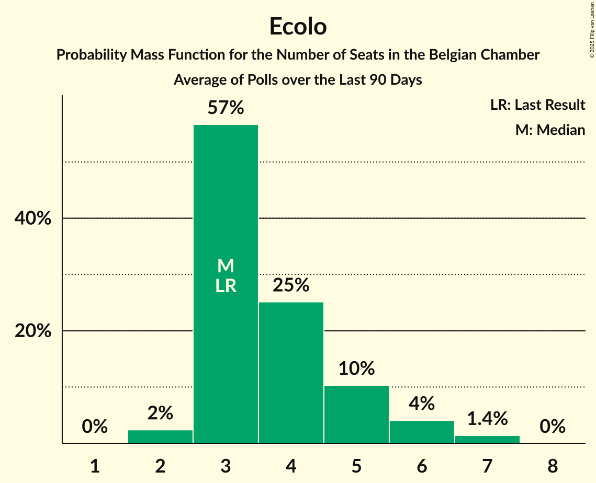
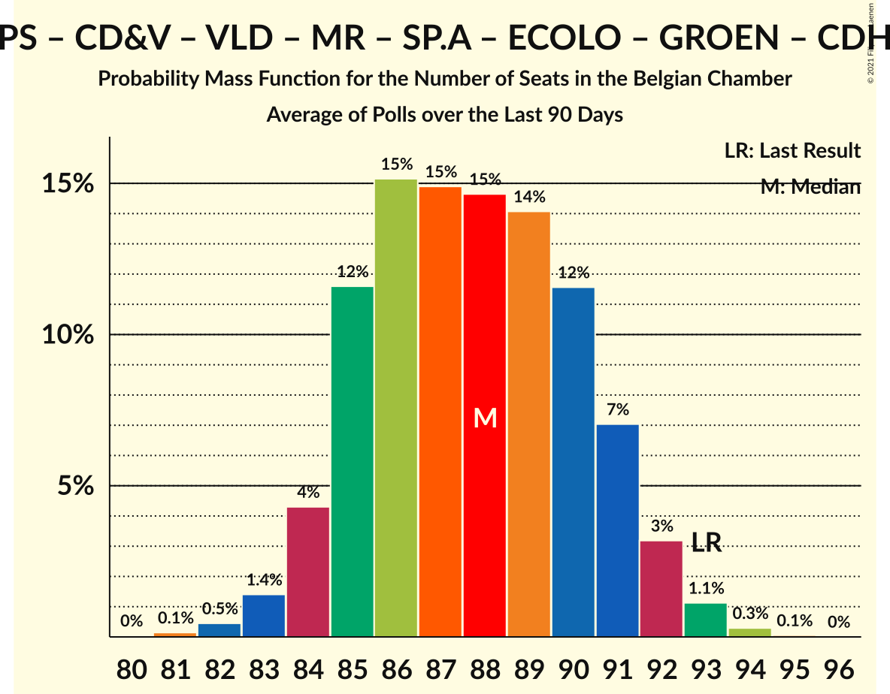
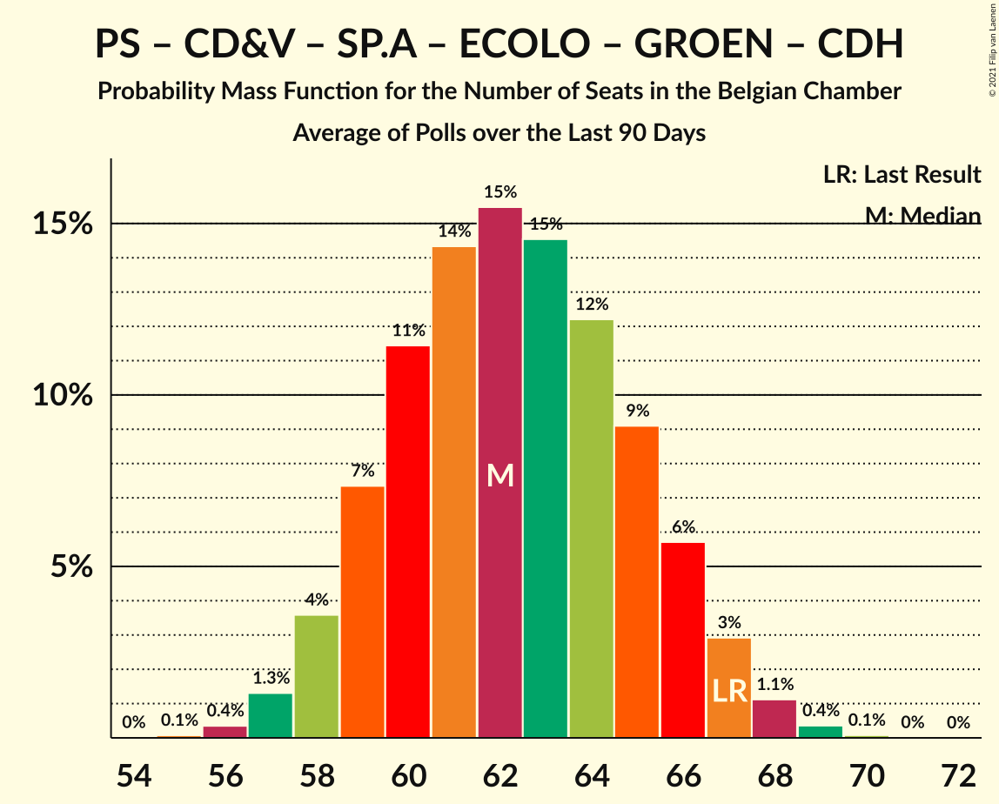
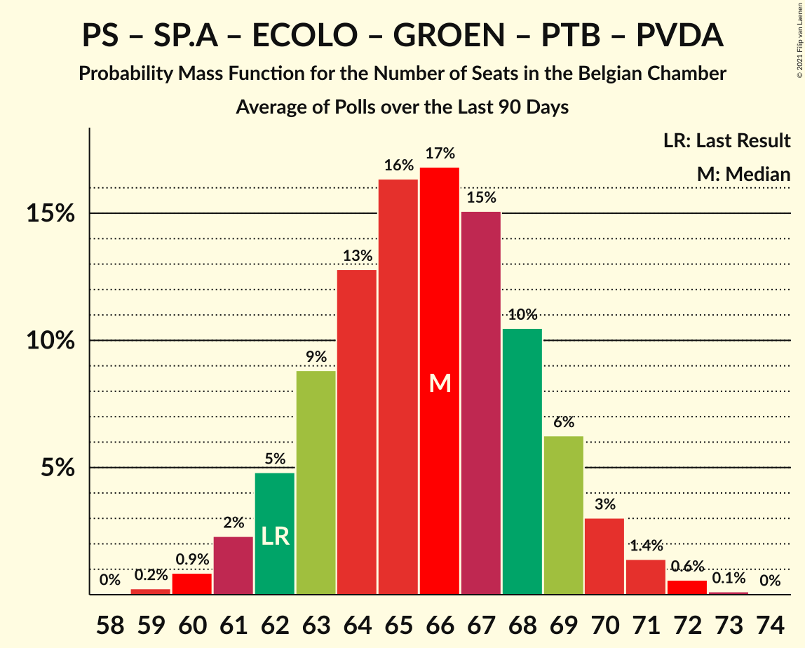
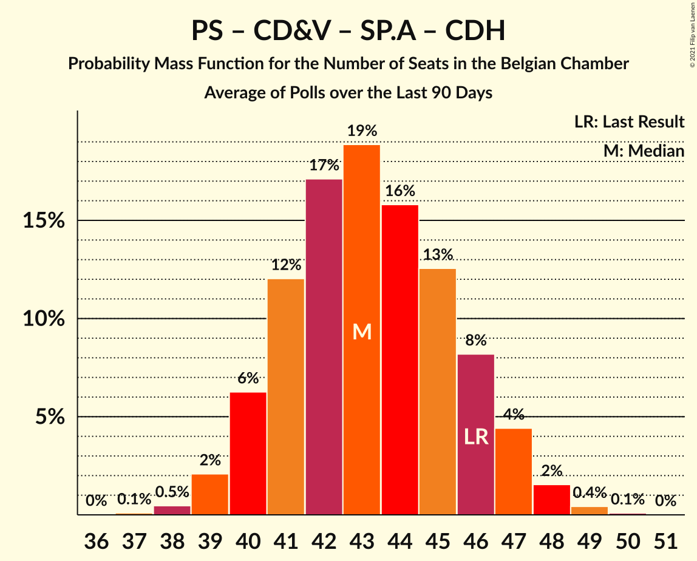

# Poll Average

<a href="#voting-intentions">Voting Intentions</a> | <a href="#seats">Seats</a> | <a href="#coalitions">Coalitions</a> | <a href="#technical-information">Technical Information</a>

## Summary

The table below lists the polls on which the average is based. They are the most recent polls (less than 90 days old) registered and analyzed so far.

| Period     | Polling firm/Commissioner(s) | N-VA | VB | PS | CD&V | PTB | PVDA | VLD | MR | SP.A | ECOLO | GROEN | CDH | DÉFI | PP |
|:----------:|:----------------------------:|:--:|:--:|:--:|:--:|:--:|:--:|:--:|:--:|:--:|:--:|:--:|:--:|:--:|:--:|
| 26 May 2019 | General Election | 16.0%   25 | 12.0%   18 | 9.5%   20 | 8.9%   12 | 4.8%   9 | 3.3%   3 | 8.5%   12 | 7.6%   14 | 6.7%   9 | 6.1%   13 | 6.1%   8 | 3.7%   5 | 2.2%   2 | 1.1%   0 |
| N/A | Poll Average | 11–12%   16–22 | 14–16%   22–29 | 7–8%   15–19 | 6–7%   9–14 | 5–6%   10–13 | 3–5%   1–7 | 6–7%   9–12 | 6–7%   12–17 | 7–9%   10–15 | 5–6%   11–14 | 4–6%   4–9 | 3%   4–6 | 2%   1–2 | N/A   N/A |
| [2–8 December 2020](2020-12-08-Ipsos.html) | Ipsos   Het Laatste Nieuws, Le Soir, RTL TVi and VTM | 11–12%   16–22 | 14–16%   22–29 | 7–8%   15–19 | 6–7%   9–14 | 5–6%   10–13 | 3–5%   1–7 | 6–7%   9–12 | 6–7%   12–17 | 7–9%   10–15 | 5–6%   11–14 | 4–6%   4–9 | 3%   4–6 | 2%   1–2 | N/A   N/A |
| 26 May 2019 | General Election | 16.0%   25 | 12.0%   18 | 9.5%   20 | 8.9%   12 | 4.8%   9 | 3.3%   3 | 8.5%   12 | 7.6%   14 | 6.7%   9 | 6.1%   13 | 6.1%   8 | 3.7%   5 | 2.2%   2 | 1.1%   0 |

Only polls for which at least the sample size has been published are included in the table above.

**Legend:**
+ **Top half of each row:** Voting intentions (95% confidence interval)
+ **Bottom half of each row:** Seat projections for the Belgian Chamber (95% confidence interval)
+ **N-VA:** Nieuw-Vlaamse Alliantie
+ **VB:** Vlaams Belang
+ **PS:** Parti Socialiste
+ **CD&V:** Christen-Democratisch en Vlaams
+ **PTB:** Parti du Travail de Belgique
+ **PVDA:** Partij van de Arbeid van België
+ **VLD:** Open Vlaamse Liberalen en Democraten
+ **MR:** Mouvement Réformateur
+ **SP.A:** Socialistische Partij Anders
+ **ECOLO:** Ecolo
+ **GROEN:** Groen
+ **CDH:** Centre démocrate humaniste
+ **DÉFI:** DéFI
+ **PP:** Parti Populaire
+ **N/A (single party):** Party not included the published results
+ **N/A (entire row):** Calculation for this opinion poll not started yet

## Voting Intentions

### Confidence Intervals

| Party | Last Result | Median | 80% Confidence Interval | 90% Confidence Interval | 95% Confidence Interval | 99% Confidence Interval |
|:-----:|:-----------:|:------:|:-----------------------:|:-----------------------:|:-----------------------:|:-----------------------:|
| <a href="#nieuw-vlaamse-alliantie">Nieuw-Vlaamse Alliantie</a> | 16.0% | 11.5% | 11.0–11.8% |10.8–11.8% | 10.7–11.8% | 10.3–11.8% |
| <a href="#vlaams-belang">Vlaams Belang</a> | 12.0% | 15.3% | 14.7–15.6% |14.5–15.6% | 14.3–15.6% | 13.9–15.6% |
| <a href="#parti-socialiste">Parti Socialiste</a> | 9.5% | 7.8% | 7.5–7.9% |7.4–7.9% | 7.3–7.9% | 7.1–7.9% |
| <a href="#christen-democratisch-en-vlaams">Christen-Democratisch en Vlaams</a> | 8.9% | 6.8% | 6.4–7.0% |6.2–7.0% | 6.1–7.0% | 5.8–7.0% |
| <a href="#open-vlaamse-liberalen-en-democraten">Open Vlaamse Liberalen en Democraten</a> | 8.5% | 6.7% | 6.3–6.9% |6.1–6.9% | 6.0–6.9% | 5.7–6.9% |
| <a href="#mouvement-réformateur">Mouvement Réformateur</a> | 7.6% | 6.7% | 6.5–6.8% |6.4–6.9% | 6.3–6.9% | 6.1–6.9% |
| <a href="#socialistische-partij-anders">Socialistische Partij Anders</a> | 6.7% | 8.4% | 7.6–9.0% |7.4–9.2% | 7.2–9.2% | 6.8–9.3% |
| <a href="#ecolo">Ecolo</a> | 6.1% | 5.8% | 5.6–5.9% |5.5–6.0% | 5.4–6.0% | 5.3–6.0% |
| <a href="#groen">Groen</a> | 6.1% | 5.0% | 4.4–5.5% |4.2–5.6% | 4.1–5.7% | 3.8–5.7% |
| <a href="#parti-du-travail-de-belgique">Parti du Travail de Belgique</a> | 4.8% | 5.8% | 5.5–5.9% |5.5–5.9% | 5.4–5.9% | 5.2–5.9% |
| <a href="#centre-démocrate-humaniste">Centre démocrate humaniste</a> | 3.7% | 3.0% | 2.9–3.1% |2.8–3.1% | 2.7–3.1% | 2.6–3.1% |
| <a href="#partij-van-de-arbeid-van-belgië">Partij van de Arbeid van België</a> | 3.3% | 4.0% | 3.5–4.5% |3.3–4.6% | 3.2–4.7% | 2.9–4.7% |
| <a href="#défi">DéFI</a> | 2.2% | 1.7% | 1.6–1.7% |1.5–1.7% | 1.5–1.7% | 1.4–1.7% |
| <a href="#parti-populaire">Parti Populaire</a> | 1.1% | N/A | N/A |N/A | N/A | N/A |

### Nieuw-Vlaamse Alliantie

*For a full overview of the results for this party, see the [Nieuw-Vlaamse Alliantie](party-nieuw-vlaamsealliantie.html) page.*

| Voting Intentions | Probability | Accumulated | Special Marks |
|:-----------------:|:-----------:|:-----------:|:-------------:|
| 8.5–9.5% | 0% | 100% |  |
| 9.5–10.5% | 2% | 100% |  |
| 10.5–11.5% | 50% | 98% |  |
| 11.5–12.5% | 100% | 48% | Median |
| 12.5–13.5% | 100% | 0% |  |
| 13.5–14.5% | 94% | 0% |  |
| 14.5–15.5% | 8% | 0% |  |
| 15.5–16.5% | 0.2% | 0% | Last Result |

### Vlaams Belang

*For a full overview of the results for this party, see the [Vlaams Belang](party-vlaamsbelang.html) page.*

| Voting Intentions | Probability | Accumulated | Special Marks |
|:-----------------:|:-----------:|:-----------:|:-------------:|
| 11.5–12.5% | 0% | 100% | Last Result |
| 12.5–13.5% | 0.1% | 100% |  |
| 13.5–14.5% | 6% | 99.9% |  |
| 14.5–15.5% | 79% | 94% | Median |
| 15.5–16.5% | 100% | 15% |  |
| 16.5–17.5% | 100% | 0% |  |
| 17.5–18.5% | 89% | 0% |  |
| 18.5–19.5% | 9% | 0% |  |
| 19.5–20.5% | 0.3% | 0% |  |

### Parti Socialiste

*For a full overview of the results for this party, see the [Parti Socialiste](party-partisocialiste.html) page.*

| Voting Intentions | Probability | Accumulated | Special Marks |
|:-----------------:|:-----------:|:-----------:|:-------------:|
| 5.5–6.5% | 0% | 100% |  |
| 6.5–7.5% | 15% | 100% |  |
| 7.5–8.5% | 100% | 85% | Median |
| 8.5–9.5% | 100% | 0% | Last Result |
| 9.5–10.5% | 9% | 0% |  |

### Christen-Democratisch en Vlaams

*For a full overview of the results for this party, see the [Christen-Democratisch en Vlaams](party-christen-democratischenvlaams.html) page.*

| Voting Intentions | Probability | Accumulated | Special Marks |
|:-----------------:|:-----------:|:-----------:|:-------------:|
| 4.5–5.5% | 0.1% | 100% |  |
| 5.5–6.5% | 21% | 99.9% |  |
| 6.5–7.5% | 100% | 79% | Median |
| 7.5–8.5% | 100% | 0% |  |
| 8.5–9.5% | 79% | 0% | Last Result |
| 9.5–10.5% | 3% | 0% |  |

### Open Vlaamse Liberalen en Democraten

*For a full overview of the results for this party, see the [Open Vlaamse Liberalen en Democraten](party-openvlaamseliberalenendemocraten.html) page.*

| Voting Intentions | Probability | Accumulated | Special Marks |
|:-----------------:|:-----------:|:-----------:|:-------------:|
| 3.5–4.5% | 0% | 100% |  |
| 4.5–5.5% | 0.2% | 100% |  |
| 5.5–6.5% | 32% | 99.8% |  |
| 6.5–7.5% | 100% | 68% | Median |
| 7.5–8.5% | 100% | 0% |  |
| 8.5–9.5% | 54% | 0% | Last Result |
| 9.5–10.5% | 2% | 0% |  |

### Mouvement Réformateur

*For a full overview of the results for this party, see the [Mouvement Réformateur](party-mouvementréformateur.html) page.*

| Voting Intentions | Probability | Accumulated | Special Marks |
|:-----------------:|:-----------:|:-----------:|:-------------:|
| 4.5–5.5% | 0% | 100% |  |
| 5.5–6.5% | 16% | 100% |  |
| 6.5–7.5% | 100% | 84% | Median |
| 7.5–8.5% | 100% | 0% | Last Result |
| 8.5–9.5% | 5% | 0% |  |

### Socialistische Partij Anders

*For a full overview of the results for this party, see the [Socialistische Partij Anders](party-socialistischepartijanders.html) page.*

| Voting Intentions | Probability | Accumulated | Special Marks |
|:-----------------:|:-----------:|:-----------:|:-------------:|
| 4.5–5.5% | 0% | 100% |  |
| 5.5–6.5% | 0.1% | 100% |  |
| 6.5–7.5% | 9% | 99.9% | Last Result |
| 7.5–8.5% | 54% | 91% | Median |
| 8.5–9.5% | 42% | 36% |  |
| 9.5–10.5% | 6% | 0% |  |

### Ecolo

*For a full overview of the results for this party, see the [Ecolo](party-ecolo.html) page.*

| Voting Intentions | Probability | Accumulated | Special Marks |
|:-----------------:|:-----------:|:-----------:|:-------------:|
| 3.5–4.5% | 0% | 100% |  |
| 4.5–5.5% | 6% | 100% |  |
| 5.5–6.5% | 100% | 94% | Last Result, Median |
| 6.5–7.5% | 100% | 0% |  |
| 7.5–8.5% | 4% | 0% |  |

### Groen

*For a full overview of the results for this party, see the [Groen](party-groen.html) page.*

| Voting Intentions | Probability | Accumulated | Special Marks |
|:-----------------:|:-----------:|:-----------:|:-------------:|
| 2.5–3.5% | 0.1% | 100% |  |
| 3.5–4.5% | 17% | 99.9% |  |
| 4.5–5.5% | 73% | 83% | Median |
| 5.5–6.5% | 21% | 9% | Last Result |
| 6.5–7.5% | 0.6% | 0% |  |

### Parti du Travail de Belgique

*For a full overview of the results for this party, see the [Parti du Travail de Belgique](party-partidutravaildebelgique.html) page.*

| Voting Intentions | Probability | Accumulated | Special Marks |
|:-----------------:|:-----------:|:-----------:|:-------------:|
| 3.5–4.5% | 0% | 100% |  |
| 4.5–5.5% | 11% | 100% | Last Result |
| 5.5–6.5% | 100% | 89% | Median |
| 6.5–7.5% | 100% | 0% |  |
| 7.5–8.5% | 3% | 0% |  |

### Centre démocrate humaniste

*For a full overview of the results for this party, see the [Centre démocrate humaniste](party-centredémocratehumaniste.html) page.*

| Voting Intentions | Probability | Accumulated | Special Marks |
|:-----------------:|:-----------:|:-----------:|:-------------:|
| 1.5–2.5% | 0.2% | 100% |  |
| 2.5–3.5% | 100% | 99.8% | Median |
| 3.5–4.5% | 100% | 0% | Last Result |
| 4.5–5.5% | 1.3% | 0% |  |

### Partij van de Arbeid van België

*For a full overview of the results for this party, see the [Partij van de Arbeid van België](party-partijvandearbeidvanbelgië.html) page.*

| Voting Intentions | Probability | Accumulated | Special Marks |
|:-----------------:|:-----------:|:-----------:|:-------------:|
| 1.5–2.5% | 0% | 100% |  |
| 2.5–3.5% | 13% | 100% | Last Result |
| 3.5–4.5% | 78% | 87% | Median |
| 4.5–5.5% | 20% | 9% |  |
| 5.5–6.5% | 0.3% | 0% |  |

### DéFI

*For a full overview of the results for this party, see the [DéFI](party-défi.html) page.*

| Voting Intentions | Probability | Accumulated | Special Marks |
|:-----------------:|:-----------:|:-----------:|:-------------:|
| 0.0–0.5% | 0% | 100% |  |
| 0.5–1.5% | 9% | 100% |  |
| 1.5–2.5% | 100% | 91% | Last Result, Median |
| 2.5–3.5% | 13% | 0% |  |

## Seats

### Confidence Intervals

| Party | Last Result | Median | 80% Confidence Interval | 90% Confidence Interval | 95% Confidence Interval | 99% Confidence Interval |
|:-----:|:-----------:|:------:|:-----------------------:|:-----------------------:|:-----------------------:|:-----------------------:|
| <a href="#nieuw-vlaamse-alliantie">Nieuw-Vlaamse Alliantie</a> | 25 | 19 | 17–21 |17–22 | 16–22 | 16–23 |
| <a href="#vlaams-belang">Vlaams Belang</a> | 18 | 25 | 24–27 |23–28 | 22–29 | 21–30 |
| <a href="#parti-socialiste">Parti Socialiste</a> | 20 | 17 | 16–18 |15–19 | 15–19 | 15–20 |
| <a href="#christen-democratisch-en-vlaams">Christen-Democratisch en Vlaams</a> | 12 | 10 | 10–12 |10–13 | 9–14 | 9–14 |
| <a href="#open-vlaamse-liberalen-en-democraten">Open Vlaamse Liberalen en Democraten</a> | 12 | 10 | 9–11 |9–12 | 9–12 | 7–14 |
| <a href="#mouvement-réformateur">Mouvement Réformateur</a> | 14 | 14 | 13–17 |13–17 | 12–17 | 12–17 |
| <a href="#socialistische-partij-anders">Socialistische Partij Anders</a> | 9 | 12 | 11–14 |10–14 | 10–15 | 9–15 |
| <a href="#ecolo">Ecolo</a> | 13 | 13 | 11–14 |11–14 | 11–14 | 10–15 |
| <a href="#groen">Groen</a> | 8 | 6 | 5–8 |5–9 | 4–9 | 3–9 |
| <a href="#parti-du-travail-de-belgique">Parti du Travail de Belgique</a> | 9 | 11 | 10–12 |10–13 | 10–13 | 9–14 |
| <a href="#centre-démocrate-humaniste">Centre démocrate humaniste</a> | 5 | 4 | 4–5 |4–6 | 4–6 | 4–7 |
| <a href="#partij-van-de-arbeid-van-belgië">Partij van de Arbeid van België</a> | 3 | 5 | 3–5 |3–6 | 1–7 | 1–8 |
| <a href="#défi">DéFI</a> | 2 | 2 | 2 |1–2 | 1–2 | 1–3 |
| <a href="#parti-populaire">Parti Populaire</a> | 0 | N/A | N/A |N/A | N/A | N/A |

### Nieuw-Vlaamse Alliantie

*For a full overview of the results for this party, see the [Nieuw-Vlaamse Alliantie](party-nieuw-vlaamsealliantie.html) page.*

| Number of Seats | Probability | Accumulated | Special Marks |
|:---------------:|:-----------:|:-----------:|:-------------:|
| 15 | 0.4% | 100% |  |
| 16 | 4% | 99.6% |  |
| 17 | 12% | 96% |  |
| 18 | 18% | 84% |  |
| 19 | 19% | 66% | Median |
| 20 | 18% | 47% |  |
| 21 | 21% | 29% |  |
| 22 | 7% | 8% |  |
| 23 | 1.1% | 1.3% |  |
| 24 | 0.1% | 0.2% |  |
| 25 | 0% | 0% | Last Result |

### Vlaams Belang

*For a full overview of the results for this party, see the [Vlaams Belang](party-vlaamsbelang.html) page.*

| Number of Seats | Probability | Accumulated | Special Marks |
|:---------------:|:-----------:|:-----------:|:-------------:|
| 18 | 0% | 100% | Last Result |
| 19 | 0% | 100% |  |
| 20 | 0.1% | 100% |  |
| 21 | 1.5% | 99.9% |  |
| 22 | 2% | 98% |  |
| 23 | 4% | 96% |  |
| 24 | 8% | 92% |  |
| 25 | 58% | 83% | Median |
| 26 | 13% | 26% |  |
| 27 | 7% | 13% |  |
| 28 | 3% | 5% |  |
| 29 | 2% | 3% |  |
| 30 | 1.0% | 1.2% |  |
| 31 | 0.1% | 0.1% |  |
| 32 | 0% | 0% |  |

### Parti Socialiste

*For a full overview of the results for this party, see the [Parti Socialiste](party-partisocialiste.html) page.*

| Number of Seats | Probability | Accumulated | Special Marks |
|:---------------:|:-----------:|:-----------:|:-------------:|
| 14 | 0.3% | 100% |  |
| 15 | 5% | 99.6% |  |
| 16 | 17% | 95% |  |
| 17 | 32% | 77% | Median |
| 18 | 36% | 46% |  |
| 19 | 8% | 10% |  |
| 20 | 2% | 2% | Last Result |
| 21 | 0.2% | 0.2% |  |
| 22 | 0% | 0% |  |

### Christen-Democratisch en Vlaams

*For a full overview of the results for this party, see the [Christen-Democratisch en Vlaams](party-christen-democratischenvlaams.html) page.*

| Number of Seats | Probability | Accumulated | Special Marks |
|:---------------:|:-----------:|:-----------:|:-------------:|
| 7 | 0.1% | 100% |  |
| 8 | 0.3% | 99.9% |  |
| 9 | 3% | 99.6% |  |
| 10 | 59% | 96% | Median |
| 11 | 19% | 37% |  |
| 12 | 11% | 18% | Last Result |
| 13 | 4% | 7% |  |
| 14 | 2% | 3% |  |
| 15 | 0.2% | 0.2% |  |
| 16 | 0% | 0% |  |

### Open Vlaamse Liberalen en Democraten

*For a full overview of the results for this party, see the [Open Vlaamse Liberalen en Democraten](party-openvlaamseliberalenendemocraten.html) page.*

| Number of Seats | Probability | Accumulated | Special Marks |
|:---------------:|:-----------:|:-----------:|:-------------:|
| 6 | 0.1% | 100% |  |
| 7 | 0.5% | 99.9% |  |
| 8 | 1.1% | 99.4% |  |
| 9 | 10% | 98% |  |
| 10 | 67% | 88% | Median |
| 11 | 14% | 21% |  |
| 12 | 5% | 7% | Last Result |
| 13 | 2% | 2% |  |
| 14 | 0.5% | 0.6% |  |
| 15 | 0% | 0% |  |

### Mouvement Réformateur

*For a full overview of the results for this party, see the [Mouvement Réformateur](party-mouvementréformateur.html) page.*

| Number of Seats | Probability | Accumulated | Special Marks |
|:---------------:|:-----------:|:-----------:|:-------------:|
| 12 | 5% | 100% |  |
| 13 | 20% | 95% |  |
| 14 | 26% | 75% | Last Result, Median |
| 15 | 20% | 49% |  |
| 16 | 19% | 29% |  |
| 17 | 11% | 11% |  |
| 18 | 0.1% | 0.1% |  |
| 19 | 0% | 0% |  |

### Socialistische Partij Anders

*For a full overview of the results for this party, see the [Socialistische Partij Anders](party-socialistischepartijanders.html) page.*

| Number of Seats | Probability | Accumulated | Special Marks |
|:---------------:|:-----------:|:-----------:|:-------------:|
| 9 | 1.4% | 100% | Last Result |
| 10 | 4% | 98.5% |  |
| 11 | 41% | 94% |  |
| 12 | 21% | 53% | Median |
| 13 | 20% | 32% |  |
| 14 | 10% | 12% |  |
| 15 | 3% | 3% |  |
| 16 | 0.1% | 0.1% |  |
| 17 | 0% | 0% |  |

### Ecolo

*For a full overview of the results for this party, see the [Ecolo](party-ecolo.html) page.*

| Number of Seats | Probability | Accumulated | Special Marks |
|:---------------:|:-----------:|:-----------:|:-------------:|
| 10 | 1.5% | 100% |  |
| 11 | 12% | 98.5% |  |
| 12 | 25% | 86% |  |
| 13 | 48% | 62% | Last Result, Median |
| 14 | 13% | 14% |  |
| 15 | 1.1% | 1.2% |  |
| 16 | 0.1% | 0.2% |  |
| 17 | 0% | 0% |  |

### Groen

*For a full overview of the results for this party, see the [Groen](party-groen.html) page.*

| Number of Seats | Probability | Accumulated | Special Marks |
|:---------------:|:-----------:|:-----------:|:-------------:|
| 3 | 0.9% | 100% |  |
| 4 | 2% | 99.1% |  |
| 5 | 38% | 97% |  |
| 6 | 28% | 59% | Median |
| 7 | 17% | 31% |  |
| 8 | 7% | 14% | Last Result |
| 9 | 7% | 7% |  |
| 10 | 0% | 0% |  |

### Parti du Travail de Belgique

*For a full overview of the results for this party, see the [Parti du Travail de Belgique](party-partidutravaildebelgique.html) page.*

| Number of Seats | Probability | Accumulated | Special Marks |
|:---------------:|:-----------:|:-----------:|:-------------:|
| 9 | 1.1% | 100% | Last Result |
| 10 | 16% | 98.9% |  |
| 11 | 42% | 82% | Median |
| 12 | 33% | 41% |  |
| 13 | 8% | 8% |  |
| 14 | 0.4% | 0.5% |  |
| 15 | 0.1% | 0.1% |  |
| 16 | 0% | 0% |  |

### Centre démocrate humaniste

*For a full overview of the results for this party, see the [Centre démocrate humaniste](party-centredémocratehumaniste.html) page.*

| Number of Seats | Probability | Accumulated | Special Marks |
|:---------------:|:-----------:|:-----------:|:-------------:|
| 4 | 60% | 100% | Median |
| 5 | 33% | 40% | Last Result |
| 6 | 5% | 7% |  |
| 7 | 1.3% | 2% |  |
| 8 | 0.3% | 0.3% |  |
| 9 | 0% | 0% |  |

### Partij van de Arbeid van België

*For a full overview of the results for this party, see the [Partij van de Arbeid van België](party-partijvandearbeidvanbelgië.html) page.*

| Number of Seats | Probability | Accumulated | Special Marks |
|:---------------:|:-----------:|:-----------:|:-------------:|
| 1 | 3% | 100% |  |
| 2 | 1.1% | 97% |  |
| 3 | 15% | 96% | Last Result |
| 4 | 16% | 82% |  |
| 5 | 60% | 65% | Median |
| 6 | 3% | 6% |  |
| 7 | 2% | 3% |  |
| 8 | 1.0% | 1.0% |  |
| 9 | 0% | 0% |  |

### DéFI

*For a full overview of the results for this party, see the [DéFI](party-défi.html) page.*

| Number of Seats | Probability | Accumulated | Special Marks |
|:---------------:|:-----------:|:-----------:|:-------------:|
| 1 | 8% | 100% |  |
| 2 | 90% | 92% | Last Result, Median |
| 3 | 2% | 2% |  |
| 4 | 0.1% | 0.1% |  |
| 5 | 0% | 0% |  |

### Parti Populaire

*For a full overview of the results for this party, see the [Parti Populaire](party-partipopulaire.html) page.*

## Coalitions

### Confidence Intervals

| Coalition | Last Result | Median | Majority? | 80% Confidence Interval | 90% Confidence Interval | 95% Confidence Interval | 99% Confidence Interval |
|:---------:|:-----------:|:------:|:---------:|:-----------------------:|:-----------------------:|:-----------------------:|:-----------------------:|
| Parti Socialiste – Christen-Democratisch en Vlaams – Open Vlaamse Liberalen en Democraten – Mouvement Réformateur – Socialistische Partij Anders – Ecolo – Groen – Centre démocrate humaniste | 93 | 88 | 100% | 85–91 | 85–91 | 84–92 | 83–93 |
| Parti Socialiste – Christen-Democratisch en Vlaams – Open Vlaamse Liberalen en Democraten – Mouvement Réformateur – Socialistische Partij Anders – Ecolo – Groen | 88 | 83 | 100% | 81–86 | 80–87 | 80–88 | 78–89 |
| Parti Socialiste – Christen-Democratisch en Vlaams – Socialistische Partij Anders – Ecolo – Groen – Parti du Travail de Belgique – Centre démocrate humaniste – Partij van de Arbeid van België | 79 | 79 | 92% | 76–82 | 75–83 | 74–83 | 73–85 |
| Nieuw-Vlaamse Alliantie – Parti Socialiste – Open Vlaamse Liberalen en Democraten – Mouvement Réformateur – Socialistische Partij Anders | 80 | 73 | 16% | 70–76 | 70–77 | 69–78 | 67–79 |
| Parti Socialiste – Open Vlaamse Liberalen en Democraten – Mouvement Réformateur – Socialistische Partij Anders – Ecolo – Groen | 76 | 73 | 9% | 70–75 | 70–76 | 69–77 | 68–78 |
| Parti Socialiste – Christen-Democratisch en Vlaams – Open Vlaamse Liberalen en Democraten – Mouvement Réformateur – Socialistische Partij Anders – Centre démocrate humaniste | 72 | 69 | 0.2% | 67–72 | 66–72 | 65–73 | 64–75 |
| Parti Socialiste – Socialistische Partij Anders – Ecolo – Groen – Parti du Travail de Belgique – Centre démocrate humaniste – Partij van de Arbeid van België | 67 | 68 | 0.1% | 65–71 | 65–72 | 64–73 | 62–74 |
| Parti Socialiste – Christen-Democratisch en Vlaams – Socialistische Partij Anders – Ecolo – Groen – Centre démocrate humaniste | 67 | 63 | 0% | 60–66 | 59–67 | 59–68 | 58–69 |
| Parti Socialiste – Socialistische Partij Anders – Ecolo – Groen – Parti du Travail de Belgique – Partij van de Arbeid van België | 62 | 64 | 0% | 61–67 | 60–67 | 59–68 | 58–70 |
| Nieuw-Vlaamse Alliantie – Christen-Democratisch en Vlaams – Open Vlaamse Liberalen en Democraten – Mouvement Réformateur – Centre démocrate humaniste | 68 | 59 | 0% | 56–62 | 55–63 | 55–64 | 54–65 |
| Christen-Democratisch en Vlaams – Open Vlaamse Liberalen en Democraten – Mouvement Réformateur – Ecolo – Groen – Centre démocrate humaniste | 64 | 58 | 0% | 56–61 | 55–62 | 55–63 | 54–64 |
| Parti Socialiste – Christen-Democratisch en Vlaams – Open Vlaamse Liberalen en Democraten – Mouvement Réformateur – Centre démocrate humaniste | 63 | 57 | 0% | 55–60 | 55–60 | 54–61 | 53–62 |
| Nieuw-Vlaamse Alliantie – Christen-Democratisch en Vlaams – Open Vlaamse Liberalen en Democraten – Mouvement Réformateur | 63 | 55 | 0% | 52–58 | 51–58 | 50–59 | 49–61 |
| Parti Socialiste – Open Vlaamse Liberalen en Democraten – Mouvement Réformateur – Socialistische Partij Anders | 55 | 54 | 0% | 52–56 | 51–57 | 50–58 | 49–59 |
| Parti Socialiste – Christen-Democratisch en Vlaams – Socialistische Partij Anders – Centre démocrate humaniste | 46 | 44 | 0% | 42–47 | 41–47 | 41–48 | 40–49 |
| Christen-Democratisch en Vlaams – Open Vlaamse Liberalen en Democraten – Mouvement Réformateur – Centre démocrate humaniste | 43 | 40 | 0% | 37–42 | 37–43 | 36–44 | 35–45 |

### Parti Socialiste – Christen-Democratisch en Vlaams – Open Vlaamse Liberalen en Democraten – Mouvement Réformateur – Socialistische Partij Anders – Ecolo – Groen – Centre démocrate humaniste

| Number of Seats | Probability | Accumulated | Special Marks |
|:---------------:|:-----------:|:-----------:|:-------------:|
| 82 | 0.2% | 100% |  |
| 83 | 0.7% | 99.8% |  |
| 84 | 3% | 99.1% |  |
| 85 | 9% | 96% |  |
| 86 | 16% | 87% | Median |
| 87 | 19% | 71% |  |
| 88 | 17% | 52% |  |
| 89 | 15% | 35% |  |
| 90 | 10% | 20% |  |
| 91 | 6% | 10% |  |
| 92 | 3% | 4% |  |
| 93 | 1.0% | 1.3% | Last Result |
| 94 | 0.3% | 0.4% |  |
| 95 | 0.1% | 0.1% |  |
| 96 | 0% | 0% |  |

### Parti Socialiste – Christen-Democratisch en Vlaams – Open Vlaamse Liberalen en Democraten – Mouvement Réformateur – Socialistische Partij Anders – Ecolo – Groen

| Number of Seats | Probability | Accumulated | Special Marks |
|:---------------:|:-----------:|:-----------:|:-------------:|
| 77 | 0.1% | 100% |  |
| 78 | 0.5% | 99.8% |  |
| 79 | 2% | 99.4% |  |
| 80 | 6% | 98% |  |
| 81 | 12% | 92% |  |
| 82 | 18% | 80% | Median |
| 83 | 18% | 62% |  |
| 84 | 16% | 44% |  |
| 85 | 12% | 28% |  |
| 86 | 8% | 15% |  |
| 87 | 4% | 7% |  |
| 88 | 2% | 3% | Last Result |
| 89 | 0.6% | 0.8% |  |
| 90 | 0.2% | 0.2% |  |
| 91 | 0% | 0.1% |  |
| 92 | 0% | 0% |  |

### Parti Socialiste – Christen-Democratisch en Vlaams – Socialistische Partij Anders – Ecolo – Groen – Parti du Travail de Belgique – Centre démocrate humaniste – Partij van de Arbeid van België

| Number of Seats | Probability | Accumulated | Special Marks |
|:---------------:|:-----------:|:-----------:|:-------------:|
| 71 | 0.1% | 100% |  |
| 72 | 0.3% | 99.9% |  |
| 73 | 0.7% | 99.7% |  |
| 74 | 2% | 98.9% |  |
| 75 | 5% | 97% |  |
| 76 | 8% | 92% | Majority |
| 77 | 13% | 84% |  |
| 78 | 16% | 71% | Median |
| 79 | 17% | 55% | Last Result |
| 80 | 15% | 39% |  |
| 81 | 11% | 24% |  |
| 82 | 7% | 13% |  |
| 83 | 3% | 6% |  |
| 84 | 1.5% | 2% |  |
| 85 | 0.6% | 0.8% |  |
| 86 | 0.2% | 0.3% |  |
| 87 | 0.1% | 0.1% |  |
| 88 | 0% | 0% |  |

### Nieuw-Vlaamse Alliantie – Parti Socialiste – Open Vlaamse Liberalen en Democraten – Mouvement Réformateur – Socialistische Partij Anders

| Number of Seats | Probability | Accumulated | Special Marks |
|:---------------:|:-----------:|:-----------:|:-------------:|
| 66 | 0.1% | 100% |  |
| 67 | 0.4% | 99.9% |  |
| 68 | 1.2% | 99.5% |  |
| 69 | 3% | 98% |  |
| 70 | 6% | 95% |  |
| 71 | 10% | 89% |  |
| 72 | 14% | 79% | Median |
| 73 | 17% | 64% |  |
| 74 | 17% | 47% |  |
| 75 | 14% | 30% |  |
| 76 | 9% | 16% | Majority |
| 77 | 4% | 7% |  |
| 78 | 2% | 3% |  |
| 79 | 0.7% | 1.0% |  |
| 80 | 0.2% | 0.3% | Last Result |
| 81 | 0.1% | 0.1% |  |
| 82 | 0% | 0% |  |

### Parti Socialiste – Open Vlaamse Liberalen en Democraten – Mouvement Réformateur – Socialistische Partij Anders – Ecolo – Groen

| Number of Seats | Probability | Accumulated | Special Marks |
|:---------------:|:-----------:|:-----------:|:-------------:|
| 66 | 0.1% | 100% |  |
| 67 | 0.3% | 99.9% |  |
| 68 | 1.0% | 99.7% |  |
| 69 | 3% | 98.7% |  |
| 70 | 8% | 96% |  |
| 71 | 16% | 87% |  |
| 72 | 20% | 71% | Median |
| 73 | 18% | 51% |  |
| 74 | 14% | 33% |  |
| 75 | 10% | 19% |  |
| 76 | 6% | 9% | Last Result, Majority |
| 77 | 2% | 3% |  |
| 78 | 0.6% | 0.9% |  |
| 79 | 0.2% | 0.3% |  |
| 80 | 0.1% | 0.1% |  |
| 81 | 0% | 0% |  |

### Parti Socialiste – Christen-Democratisch en Vlaams – Open Vlaamse Liberalen en Democraten – Mouvement Réformateur – Socialistische Partij Anders – Centre démocrate humaniste

| Number of Seats | Probability | Accumulated | Special Marks |
|:---------------:|:-----------:|:-----------:|:-------------:|
| 63 | 0.1% | 100% |  |
| 64 | 0.5% | 99.9% |  |
| 65 | 2% | 99.3% |  |
| 66 | 6% | 97% |  |
| 67 | 13% | 91% | Median |
| 68 | 18% | 78% |  |
| 69 | 20% | 60% |  |
| 70 | 17% | 40% |  |
| 71 | 12% | 23% |  |
| 72 | 7% | 12% | Last Result |
| 73 | 3% | 5% |  |
| 74 | 1.2% | 2% |  |
| 75 | 0.4% | 0.6% |  |
| 76 | 0.1% | 0.2% | Majority |
| 77 | 0% | 0% |  |

### Parti Socialiste – Socialistische Partij Anders – Ecolo – Groen – Parti du Travail de Belgique – Centre démocrate humaniste – Partij van de Arbeid van België

| Number of Seats | Probability | Accumulated | Special Marks |
|:---------------:|:-----------:|:-----------:|:-------------:|
| 61 | 0.1% | 100% |  |
| 62 | 0.5% | 99.8% |  |
| 63 | 1.1% | 99.4% |  |
| 64 | 3% | 98% |  |
| 65 | 7% | 95% |  |
| 66 | 11% | 88% |  |
| 67 | 15% | 77% | Last Result |
| 68 | 18% | 62% | Median |
| 69 | 17% | 45% |  |
| 70 | 13% | 28% |  |
| 71 | 8% | 16% |  |
| 72 | 4% | 7% |  |
| 73 | 2% | 3% |  |
| 74 | 0.7% | 1.0% |  |
| 75 | 0.2% | 0.3% |  |
| 76 | 0.1% | 0.1% | Majority |
| 77 | 0% | 0% |  |

### Parti Socialiste – Christen-Democratisch en Vlaams – Socialistische Partij Anders – Ecolo – Groen – Centre démocrate humaniste

| Number of Seats | Probability | Accumulated | Special Marks |
|:---------------:|:-----------:|:-----------:|:-------------:|
| 56 | 0.1% | 100% |  |
| 57 | 0.3% | 99.9% |  |
| 58 | 1.3% | 99.6% |  |
| 59 | 4% | 98% |  |
| 60 | 8% | 95% |  |
| 61 | 13% | 87% |  |
| 62 | 17% | 74% | Median |
| 63 | 17% | 57% |  |
| 64 | 15% | 40% |  |
| 65 | 11% | 25% |  |
| 66 | 7% | 14% |  |
| 67 | 4% | 7% | Last Result |
| 68 | 2% | 3% |  |
| 69 | 0.7% | 1.0% |  |
| 70 | 0.2% | 0.3% |  |
| 71 | 0.1% | 0.1% |  |
| 72 | 0% | 0% |  |

### Parti Socialiste – Socialistische Partij Anders – Ecolo – Groen – Parti du Travail de Belgique – Partij van de Arbeid van België

| Number of Seats | Probability | Accumulated | Special Marks |
|:---------------:|:-----------:|:-----------:|:-------------:|
| 56 | 0.1% | 100% |  |
| 57 | 0.3% | 99.9% |  |
| 58 | 0.8% | 99.7% |  |
| 59 | 2% | 98.9% |  |
| 60 | 4% | 97% |  |
| 61 | 9% | 93% |  |
| 62 | 13% | 84% | Last Result |
| 63 | 16% | 70% |  |
| 64 | 17% | 54% | Median |
| 65 | 15% | 36% |  |
| 66 | 10% | 22% |  |
| 67 | 6% | 11% |  |
| 68 | 3% | 5% |  |
| 69 | 1.2% | 2% |  |
| 70 | 0.4% | 0.6% |  |
| 71 | 0.1% | 0.2% |  |
| 72 | 0% | 0% |  |

### Nieuw-Vlaamse Alliantie – Christen-Democratisch en Vlaams – Open Vlaamse Liberalen en Democraten – Mouvement Réformateur – Centre démocrate humaniste

| Number of Seats | Probability | Accumulated | Special Marks |
|:---------------:|:-----------:|:-----------:|:-------------:|
| 52 | 0.1% | 100% |  |
| 53 | 0.3% | 99.9% |  |
| 54 | 1.3% | 99.6% |  |
| 55 | 4% | 98% |  |
| 56 | 7% | 95% |  |
| 57 | 11% | 87% | Median |
| 58 | 15% | 76% |  |
| 59 | 17% | 61% |  |
| 60 | 15% | 44% |  |
| 61 | 12% | 28% |  |
| 62 | 8% | 16% |  |
| 63 | 4% | 7% |  |
| 64 | 2% | 3% |  |
| 65 | 0.8% | 1.2% |  |
| 66 | 0.3% | 0.4% |  |
| 67 | 0.1% | 0.1% |  |
| 68 | 0% | 0% | Last Result |

### Christen-Democratisch en Vlaams – Open Vlaamse Liberalen en Democraten – Mouvement Réformateur – Ecolo – Groen – Centre démocrate humaniste

| Number of Seats | Probability | Accumulated | Special Marks |
|:---------------:|:-----------:|:-----------:|:-------------:|
| 52 | 0.1% | 100% |  |
| 53 | 0.3% | 99.9% |  |
| 54 | 1.3% | 99.6% |  |
| 55 | 5% | 98% |  |
| 56 | 11% | 94% |  |
| 57 | 17% | 83% | Median |
| 58 | 18% | 66% |  |
| 59 | 17% | 48% |  |
| 60 | 13% | 31% |  |
| 61 | 9% | 18% |  |
| 62 | 5% | 9% |  |
| 63 | 3% | 4% |  |
| 64 | 1.1% | 2% | Last Result |
| 65 | 0.3% | 0.4% |  |
| 66 | 0.1% | 0.1% |  |
| 67 | 0% | 0% |  |

### Parti Socialiste – Christen-Democratisch en Vlaams – Open Vlaamse Liberalen en Democraten – Mouvement Réformateur – Centre démocrate humaniste

| Number of Seats | Probability | Accumulated | Special Marks |
|:---------------:|:-----------:|:-----------:|:-------------:|
| 51 | 0.1% | 100% |  |
| 52 | 0.2% | 99.9% |  |
| 53 | 0.8% | 99.7% |  |
| 54 | 4% | 98.9% |  |
| 55 | 12% | 95% | Median |
| 56 | 22% | 83% |  |
| 57 | 23% | 62% |  |
| 58 | 18% | 39% |  |
| 59 | 10% | 21% |  |
| 60 | 6% | 10% |  |
| 61 | 3% | 4% |  |
| 62 | 1.1% | 2% |  |
| 63 | 0.3% | 0.4% | Last Result |
| 64 | 0.1% | 0.1% |  |
| 65 | 0% | 0% |  |

### Nieuw-Vlaamse Alliantie – Christen-Democratisch en Vlaams – Open Vlaamse Liberalen en Democraten – Mouvement Réformateur

| Number of Seats | Probability | Accumulated | Special Marks |
|:---------------:|:-----------:|:-----------:|:-------------:|
| 48 | 0.1% | 100% |  |
| 49 | 0.7% | 99.8% |  |
| 50 | 2% | 99.2% |  |
| 51 | 5% | 97% |  |
| 52 | 9% | 92% |  |
| 53 | 13% | 82% | Median |
| 54 | 16% | 69% |  |
| 55 | 17% | 52% |  |
| 56 | 14% | 35% |  |
| 57 | 10% | 22% |  |
| 58 | 6% | 11% |  |
| 59 | 3% | 5% |  |
| 60 | 1.3% | 2% |  |
| 61 | 0.5% | 0.7% |  |
| 62 | 0.2% | 0.2% |  |
| 63 | 0% | 0% | Last Result |

### Parti Socialiste – Open Vlaamse Liberalen en Democraten – Mouvement Réformateur – Socialistische Partij Anders

| Number of Seats | Probability | Accumulated | Special Marks |
|:---------------:|:-----------:|:-----------:|:-------------:|
| 48 | 0.1% | 100% |  |
| 49 | 0.6% | 99.8% |  |
| 50 | 2% | 99.3% |  |
| 51 | 6% | 97% |  |
| 52 | 13% | 91% |  |
| 53 | 19% | 79% | Median |
| 54 | 21% | 59% |  |
| 55 | 18% | 38% | Last Result |
| 56 | 11% | 20% |  |
| 57 | 6% | 9% |  |
| 58 | 2% | 3% |  |
| 59 | 0.8% | 1.1% |  |
| 60 | 0.2% | 0.3% |  |
| 61 | 0% | 0.1% |  |
| 62 | 0% | 0% |  |

### Parti Socialiste – Christen-Democratisch en Vlaams – Socialistische Partij Anders – Centre démocrate humaniste

| Number of Seats | Probability | Accumulated | Special Marks |
|:---------------:|:-----------:|:-----------:|:-------------:|
| 39 | 0.3% | 100% |  |
| 40 | 1.3% | 99.7% |  |
| 41 | 4% | 98% |  |
| 42 | 11% | 94% |  |
| 43 | 17% | 83% | Median |
| 44 | 21% | 66% |  |
| 45 | 19% | 45% |  |
| 46 | 14% | 26% | Last Result |
| 47 | 8% | 12% |  |
| 48 | 3% | 5% |  |
| 49 | 1.2% | 2% |  |
| 50 | 0.4% | 0.5% |  |
| 51 | 0.1% | 0.1% |  |
| 52 | 0% | 0% |  |

### Christen-Democratisch en Vlaams – Open Vlaamse Liberalen en Democraten – Mouvement Réformateur – Centre démocrate humaniste

| Number of Seats | Probability | Accumulated | Special Marks |
|:---------------:|:-----------:|:-----------:|:-------------:|
| 34 | 0.1% | 100% |  |
| 35 | 0.4% | 99.9% |  |
| 36 | 2% | 99.5% |  |
| 37 | 8% | 97% |  |
| 38 | 16% | 89% | Median |
| 39 | 18% | 73% |  |
| 40 | 19% | 55% |  |
| 41 | 17% | 36% |  |
| 42 | 10% | 19% |  |
| 43 | 5% | 9% | Last Result |
| 44 | 3% | 4% |  |
| 45 | 1.1% | 2% |  |
| 46 | 0.3% | 0.4% |  |
| 47 | 0.1% | 0.1% |  |
| 48 | 0% | 0% |  |

## Technical Information

+ **Number of polls included in this average:** 1
+ **Lowest number of simulations done in a poll included in this average:** 1,048,576
+ **Total number of simulations done in the polls included in this average:** 1,048,576
+ **Error estimate:** 1.37%
