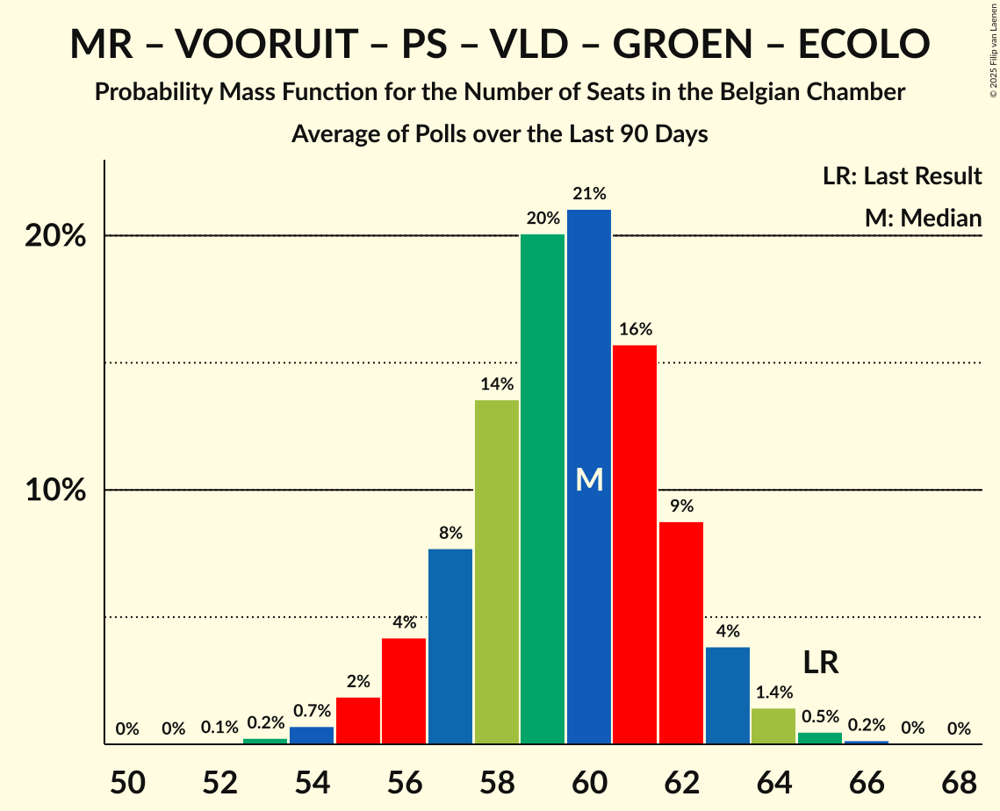
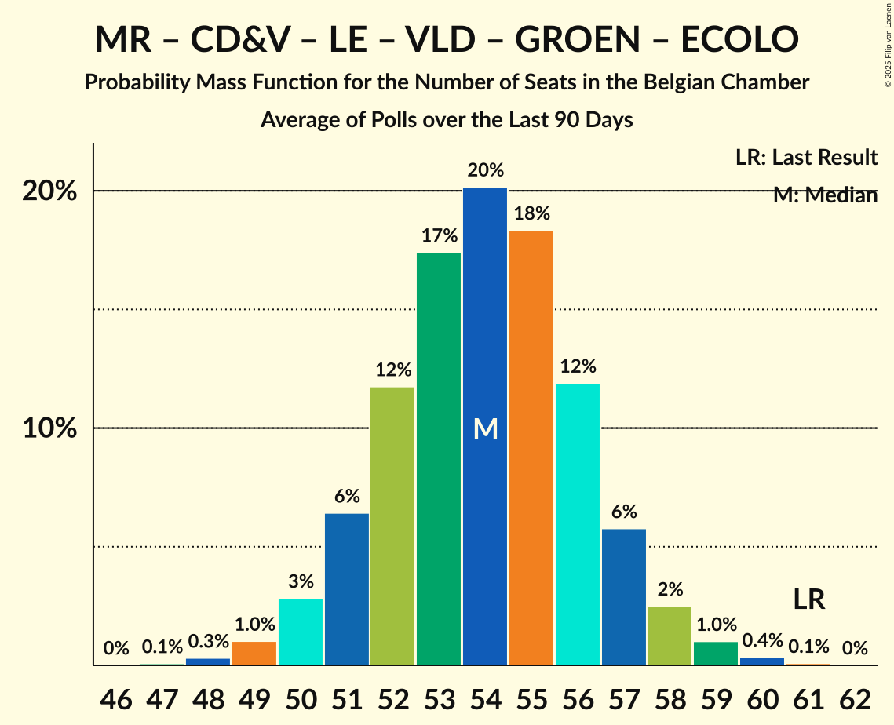
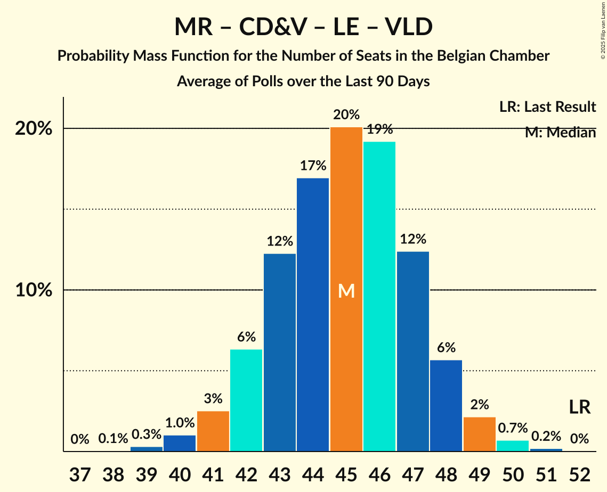

# Poll Average

<a href="#voting-intentions">Voting Intentions</a> | <a href="#seats">Seats</a> | <a href="#coalitions">Coalitions</a> | <a href="#technical-information">Technical Information</a>

## Summary

The table below lists the polls on which the average is based. They are the most recent polls (less than 90 days old) registered and analyzed so far.

| Period     | Polling firm/Commissioner(s) | N-VA | VB | MR | PVDA | PTB | VOORUIT | PS | CD&V | LE | VLD | GROEN | ECOLO | DÉFI | CN | TFA |
|:----------:|:----------------------------:|:--:|:--:|:--:|:--:|:--:|:--:|:--:|:--:|:--:|:--:|:--:|:--:|:--:|:--:|:--:|
| 9 June 2024 | General Election | 16.7%   24 | 13.8%   20 | 10.3%   20 | 5.1%   7 | 4.8%   8 | 8.1%   13 | 8.0%   16 | 8.0%   11 | 6.8%   14 | 5.4%   7 | 4.6%   6 | 2.9%   3 | 1.2%   1 | 0.9%   0 | 0.4%   0 |
| N/A | Poll Average | 14–16%   22–29 | 12–13%   18–27 | 8–9%   16–19 | 5–7%   5–10 | 6%   10–13 | 8–10%   10–15 | 8%   16–19 | 6–9%   9–14 | 5–6%   9–15 | 3–4%   2–4 | 3–5%   3–6 | 2–3%   2–5 | 1%   0–1 | 1%   0 | 0%   0 |
| [3–24 March 2025](2025-03-24-BpactandUniversiteitAntwerpenULB.html) | Bpact and Universiteit Antwerpen & ULB   De Standaard, RTBF and VRT | 16%   24–29 | 12%   17–22 | 8%   16–18 | 5–6%   5–8 | 6%   10–13 | 8–10%   12–15 | 8%   16–19 | 8–9%   10–14 | 6%   11–15 | 3–4%   2–4 | 4–5%   4–6 | 2–3%   3–4 | 1%   0 | 1%   0 | N/A   N/A |
| [4–11 March 2025](2025-03-11-Ipsos.html) | Ipsos   Het Laatste Nieuws, Le Soir, RTL TVi and VTM | 14–15%   21–28 | 14–15%   22–28 | 8–9%   16–20 | 5–7%   6–11 | 6%   10–14 | 8–10%   10–15 | 8–9%   16–20 | 6–8%   8–13 | 5–6%   9–14 | 3–4%   2–5 | 3–5%   3–6 | 2–3%   2–6 | 1%   0–1 | 1%   0 | 0%   0 |
| 9 June 2024 | General Election | 16.7%   24 | 13.8%   20 | 10.3%   20 | 5.1%   7 | 4.8%   8 | 8.1%   13 | 8.0%   16 | 8.0%   11 | 6.8%   14 | 5.4%   7 | 4.6%   6 | 2.9%   3 | 1.2%   1 | 0.9%   0 | 0.4%   0 |

Only polls for which at least the sample size has been published are included in the table above.

**Legend:**
+ **Top half of each row:** Voting intentions (95% confidence interval)
+ **Bottom half of each row:** Seat projections for the Belgian Chamber (95% confidence interval)
+ **N-VA:** Nieuw-Vlaamse Alliantie
+ **VB:** Vlaams Belang
+ **MR:** Mouvement Réformateur
+ **PVDA:** Partij van de Arbeid van België
+ **PTB:** Parti du Travail de Belgique
+ **VOORUIT:** Vooruit
+ **PS:** Parti Socialiste
+ **CD&V:** Christen-Democratisch en Vlaams
+ **LE:** Les Engagés
+ **VLD:** Open Vlaamse Liberalen en Democraten
+ **GROEN:** Groen
+ **ECOLO:** Ecolo
+ **DÉFI:** DéFI
+ **CN:** Chez Nous
+ **TFA:** Team Fouad Ahidar
+ **N/A (single party):** Party not included the published results
+ **N/A (entire row):** Calculation for this opinion poll not started yet

## Voting Intentions

### Confidence Intervals

| Party | Last Result | Median | 80% Confidence Interval | 90% Confidence Interval | 95% Confidence Interval | 99% Confidence Interval |
|:-----:|:-----------:|:------:|:-----------------------:|:-----------------------:|:-----------------------:|:-----------------------:|
| <a href="#nieuw-vlaamse-alliantie">Nieuw-Vlaamse Alliantie</a> | 16.7% | 15.2% | 14.5–15.6% |14.3–15.6% | 14.1–15.6% | 13.7–15.6% |
| <a href="#vlaams-belang">Vlaams Belang</a> | 13.8% | 12.4% | 12.0–12.6% |11.8–12.6% | 11.7–12.6% | 11.4–12.6% |
| <a href="#mouvement-réformateur">Mouvement Réformateur</a> | 10.3% | 8.5% | 8.2–8.6% |8.2–8.6% | 8.1–8.6% | 7.9–8.6% |
| <a href="#vooruit">Vooruit</a> | 8.1% | 9.0% | 8.3–9.6% |8.0–9.7% | 7.8–9.8% | 7.4–9.8% |
| <a href="#parti-socialiste">Parti Socialiste</a> | 8.0% | 8.4% | 8.2–8.5% |8.1–8.5% | 8.0–8.5% | 7.9–8.5% |
| <a href="#christen-democratisch-en-vlaams">Christen-Democratisch en Vlaams</a> | 8.0% | 7.9% | 6.7–8.7% |6.5–8.8% | 6.3–8.8% | 5.9–8.9% |
| <a href="#les-engagés">Les Engagés</a> | 6.8% | 5.8% | 5.6–6.0% |5.5–6.0% | 5.4–6.0% | 5.2–6.0% |
| <a href="#open-vlaamse-liberalen-en-democraten">Open Vlaamse Liberalen en Democraten</a> | 5.4% | 3.6% | 3.2–4.0% |3.1–4.1% | 2.9–4.1% | 2.7–4.2% |
| <a href="#partij-van-de-arbeid-van-belgië">Partij van de Arbeid van België</a> | 5.1% | 5.8% | 5.2–6.5% |5.0–6.6% | 4.9–6.7% | 4.7–6.8% |
| <a href="#parti-du-travail-de-belgique">Parti du Travail de Belgique</a> | 4.8% | 6.0% | 5.8–6.1% |5.7–6.1% | 5.6–6.1% | 5.5–6.1% |
| <a href="#groen">Groen</a> | 4.6% | 4.4% | 3.7–4.8% |3.5–4.9% | 3.4–4.9% | 3.1–5.0% |
| <a href="#ecolo">Ecolo</a> | 2.9% | 2.6% | 2.5–2.7% |2.5–2.7% | 2.4–2.7% | 2.3–2.7% |
| <a href="#défi">DéFI</a> | 1.2% | 0.9% | 0.9–1.0% |0.9–1.0% | 0.8–1.0% | 0.8–1.0% |
| <a href="#chez-nous">Chez Nous</a> | 0.9% | 0.9% | 0.7–1.0% |0.7–1.0% | 0.6–1.0% | 0.6–1.0% |
| <a href="#team-fouad-ahidar">Team Fouad Ahidar</a> | 0.4% | 0.1% | 0.1% |0.0–0.1% | 0.0–0.1% | 0.0–0.1% |

### Nieuw-Vlaamse Alliantie

*For a full overview of the results for this party, see the [Nieuw-Vlaamse Alliantie](party-nieuw-vlaamsealliantie.html) page.*

| Voting Intentions | Probability | Accumulated | Special Marks |
|:-----------------:|:-----------:|:-----------:|:-------------:|
| 11.5–12.5% | 0% | 100% |  |
| 12.5–13.5% | 0.3% | 100% |  |
| 13.5–14.5% | 10% | 99.7% |  |
| 14.5–15.5% | 78% | 90% | Median |
| 15.5–16.5% | 100% | 11% |  |
| 16.5–17.5% | 100% | 0% | Last Result |
| 17.5–18.5% | 100% | 0% |  |
| 18.5–19.5% | 4% | 0% |  |

### Vlaams Belang

*For a full overview of the results for this party, see the [Vlaams Belang](party-vlaamsbelang.html) page.*

| Voting Intentions | Probability | Accumulated | Special Marks |
|:-----------------:|:-----------:|:-----------:|:-------------:|
| 9.5–10.5% | 0% | 100% |  |
| 10.5–11.5% | 1.2% | 100% |  |
| 11.5–12.5% | 82% | 98.8% | Median |
| 12.5–13.5% | 100% | 17% |  |
| 13.5–14.5% | 66% | 0% | Last Result |
| 14.5–15.5% | 71% | 0% |  |
| 15.5–16.5% | 100% | 0% |  |
| 16.5–17.5% | 100% | 0% |  |
| 17.5–18.5% | 24% | 0% |  |
| 18.5–19.5% | 2% | 0% |  |

### Mouvement Réformateur

*For a full overview of the results for this party, see the [Mouvement Réformateur](party-mouvementréformateur.html) page.*

| Voting Intentions | Probability | Accumulated | Special Marks |
|:-----------------:|:-----------:|:-----------:|:-------------:|
| 6.5–7.5% | 0% | 100% |  |
| 7.5–8.5% | 87% | 100% | Median |
| 8.5–9.5% | 100% | 13% |  |
| 9.5–10.5% | 100% | 0% | Last Result |
| 10.5–11.5% | 1.0% | 0% |  |

### Vooruit

*For a full overview of the results for this party, see the [Vooruit](party-vooruit.html) page.*

| Voting Intentions | Probability | Accumulated | Special Marks |
|:-----------------:|:-----------:|:-----------:|:-------------:|
| 5.5–6.5% | 0% | 100% |  |
| 6.5–7.5% | 1.0% | 100% |  |
| 7.5–8.5% | 20% | 99.0% | Last Result |
| 8.5–9.5% | 67% | 79% | Median |
| 9.5–10.5% | 23% | 13% |  |
| 10.5–11.5% | 0.9% | 0% |  |

### Parti Socialiste

*For a full overview of the results for this party, see the [Parti Socialiste](party-partisocialiste.html) page.*

| Voting Intentions | Probability | Accumulated | Special Marks |
|:-----------------:|:-----------:|:-----------:|:-------------:|
| 6.5–7.5% | 0% | 100% |  |
| 7.5–8.5% | 100% | 100% | Last Result, Median |
| 8.5–9.5% | 100% | 0% |  |
| 9.5–10.5% | 100% | 0% |  |
| 10.5–11.5% | 3% | 0% |  |

### Christen-Democratisch en Vlaams

*For a full overview of the results for this party, see the [Christen-Democratisch en Vlaams](party-christen-democratischenvlaams.html) page.*

| Voting Intentions | Probability | Accumulated | Special Marks |
|:-----------------:|:-----------:|:-----------:|:-------------:|
| 4.5–5.5% | 0.1% | 100% |  |
| 5.5–6.5% | 6% | 99.9% |  |
| 6.5–7.5% | 31% | 94% |  |
| 7.5–8.5% | 47% | 63% | Last Result, Median |
| 8.5–9.5% | 27% | 16% |  |
| 9.5–10.5% | 0.8% | 0% |  |

### Les Engagés

*For a full overview of the results for this party, see the [Les Engagés](party-lesengagés.html) page.*

| Voting Intentions | Probability | Accumulated | Special Marks |
|:-----------------:|:-----------:|:-----------:|:-------------:|
| 3.5–4.5% | 0% | 100% |  |
| 4.5–5.5% | 9% | 100% |  |
| 5.5–6.5% | 100% | 91% | Median |
| 6.5–7.5% | 100% | 0% | Last Result |
| 7.5–8.5% | 7% | 0% |  |

### Open Vlaamse Liberalen en Democraten

*For a full overview of the results for this party, see the [Open Vlaamse Liberalen en Democraten](party-openvlaamseliberalenendemocraten.html) page.*

| Voting Intentions | Probability | Accumulated | Special Marks |
|:-----------------:|:-----------:|:-----------:|:-------------:|
| 1.5–2.5% | 0.1% | 100% |  |
| 2.5–3.5% | 45% | 99.9% |  |
| 3.5–4.5% | 64% | 55% | Median |
| 4.5–5.5% | 3% | 0% | Last Result |

### Partij van de Arbeid van België

*For a full overview of the results for this party, see the [Partij van de Arbeid van België](party-partijvandearbeidvanbelgië.html) page.*

| Voting Intentions | Probability | Accumulated | Special Marks |
|:-----------------:|:-----------:|:-----------:|:-------------:|
| 2.5–3.5% | 0% | 100% |  |
| 3.5–4.5% | 0.2% | 100% |  |
| 4.5–5.5% | 32% | 99.8% | Last Result |
| 5.5–6.5% | 61% | 68% | Median |
| 6.5–7.5% | 17% | 7% |  |
| 7.5–8.5% | 1.1% | 0% |  |

### Parti du Travail de Belgique

*For a full overview of the results for this party, see the [Parti du Travail de Belgique](party-partidutravaildebelgique.html) page.*

| Voting Intentions | Probability | Accumulated | Special Marks |
|:-----------------:|:-----------:|:-----------:|:-------------:|
| 3.5–4.5% | 0% | 100% |  |
| 4.5–5.5% | 1.0% | 100% | Last Result |
| 5.5–6.5% | 100% | 99.0% | Median |
| 6.5–7.5% | 100% | 0% |  |
| 7.5–8.5% | 6% | 0% |  |

### Groen

*For a full overview of the results for this party, see the [Groen](party-groen.html) page.*

| Voting Intentions | Probability | Accumulated | Special Marks |
|:-----------------:|:-----------:|:-----------:|:-------------:|
| 1.5–2.5% | 0% | 100% |  |
| 2.5–3.5% | 6% | 100% |  |
| 3.5–4.5% | 64% | 94% | Median |
| 4.5–5.5% | 42% | 31% | Last Result |
| 5.5–6.5% | 0.5% | 0% |  |

### Ecolo

*For a full overview of the results for this party, see the [Ecolo](party-ecolo.html) page.*

| Voting Intentions | Probability | Accumulated | Special Marks |
|:-----------------:|:-----------:|:-----------:|:-------------:|
| 0.5–1.5% | 0% | 100% |  |
| 1.5–2.5% | 17% | 100% |  |
| 2.5–3.5% | 100% | 83% | Last Result, Median |
| 3.5–4.5% | 55% | 0% |  |

### DéFI

*For a full overview of the results for this party, see the [DéFI](party-défi.html) page.*

| Voting Intentions | Probability | Accumulated | Special Marks |
|:-----------------:|:-----------:|:-----------:|:-------------:|
| 0.0–0.5% | 0% | 100% |  |
| 0.5–1.5% | 100% | 100% | Last Result, Median |
| 1.5–2.5% | 29% | 0% |  |

### Chez Nous

*For a full overview of the results for this party, see the [Chez Nous](party-cheznous.html) page.*

| Voting Intentions | Probability | Accumulated | Special Marks |
|:-----------------:|:-----------:|:-----------:|:-------------:|
| 0.0–0.5% | 0.3% | 100% |  |
| 0.5–1.5% | 100% | 99.7% | Last Result, Median |
| 1.5–2.5% | 0.1% | 0% |  |

### Team Fouad Ahidar

*For a full overview of the results for this party, see the [Team Fouad Ahidar](party-teamfouadahidar.html) page.*

| Voting Intentions | Probability | Accumulated | Special Marks |
|:-----------------:|:-----------:|:-----------:|:-------------:|
| 0.0–0.5% | 100% | 100% | Last Result, Median |
| 0.5–1.5% | 0% | 0% |  |

## Seats

### Confidence Intervals

| Party | Last Result | Median | 80% Confidence Interval | 90% Confidence Interval | 95% Confidence Interval | 99% Confidence Interval |
|:-----:|:-----------:|:------:|:-----------------------:|:-----------------------:|:-----------------------:|:-----------------------:|
| <a href="#nieuw-vlaamse-alliantie">Nieuw-Vlaamse Alliantie</a> | 24 | 26 | 23–28 |22–28 | 22–29 | 21–30 |
| <a href="#vlaams-belang">Vlaams Belang</a> | 20 | 22 | 18–26 |18–26 | 18–27 | 16–28 |
| <a href="#mouvement-réformateur">Mouvement Réformateur</a> | 20 | 17 | 17–18 |16–19 | 16–19 | 15–20 |
| <a href="#vooruit">Vooruit</a> | 13 | 13 | 12–14 |11–15 | 10–15 | 9–16 |
| <a href="#parti-socialiste">Parti Socialiste</a> | 16 | 18 | 17–19 |16–19 | 16–19 | 15–20 |
| <a href="#christen-democratisch-en-vlaams">Christen-Democratisch en Vlaams</a> | 11 | 11 | 10–13 |10–13 | 9–14 | 8–15 |
| <a href="#les-engagés">Les Engagés</a> | 14 | 12 | 10–14 |10–15 | 9–15 | 9–15 |
| <a href="#open-vlaamse-liberalen-en-democraten">Open Vlaamse Liberalen en Democraten</a> | 7 | 3 | 2–4 |2–4 | 2–4 | 2–6 |
| <a href="#partij-van-de-arbeid-van-belgië">Partij van de Arbeid van België</a> | 7 | 7 | 6–9 |6–10 | 5–10 | 5–11 |
| <a href="#parti-du-travail-de-belgique">Parti du Travail de Belgique</a> | 8 | 12 | 11–13 |10–13 | 10–13 | 10–14 |
| <a href="#groen">Groen</a> | 6 | 5 | 3–6 |3–6 | 3–6 | 2–6 |
| <a href="#ecolo">Ecolo</a> | 3 | 3 | 3–4 |3–5 | 2–5 | 2–6 |
| <a href="#défi">DéFI</a> | 1 | 0 | 0–1 |0–1 | 0–1 | 0–2 |
| <a href="#chez-nous">Chez Nous</a> | 0 | 0 | 0 |0 | 0 | 0 |
| <a href="#team-fouad-ahidar">Team Fouad Ahidar</a> | 0 | 0 | 0 |0 | 0 | 0 |

### Nieuw-Vlaamse Alliantie

*For a full overview of the results for this party, see the [Nieuw-Vlaamse Alliantie](party-nieuw-vlaamsealliantie.html) page.*

| Number of Seats | Probability | Accumulated | Special Marks |
|:---------------:|:-----------:|:-----------:|:-------------:|
| 20 | 0.1% | 100% |  |
| 21 | 2% | 99.9% |  |
| 22 | 3% | 98% |  |
| 23 | 7% | 95% |  |
| 24 | 22% | 88% | Last Result |
| 25 | 14% | 66% |  |
| 26 | 19% | 52% | Median |
| 27 | 21% | 33% |  |
| 28 | 8% | 12% |  |
| 29 | 3% | 4% |  |
| 30 | 0.5% | 0.6% |  |
| 31 | 0% | 0% |  |

### Vlaams Belang

*For a full overview of the results for this party, see the [Vlaams Belang](party-vlaamsbelang.html) page.*

| Number of Seats | Probability | Accumulated | Special Marks |
|:---------------:|:-----------:|:-----------:|:-------------:|
| 16 | 0.5% | 100% |  |
| 17 | 2% | 99.5% |  |
| 18 | 8% | 98% |  |
| 19 | 14% | 90% |  |
| 20 | 20% | 75% | Last Result |
| 21 | 4% | 55% |  |
| 22 | 3% | 51% | Median |
| 23 | 10% | 48% |  |
| 24 | 16% | 38% |  |
| 25 | 12% | 22% |  |
| 26 | 7% | 10% |  |
| 27 | 2% | 3% |  |
| 28 | 1.1% | 2% |  |
| 29 | 0.3% | 0.4% |  |
| 30 | 0.1% | 0.1% |  |
| 31 | 0% | 0% |  |

### Mouvement Réformateur

*For a full overview of the results for this party, see the [Mouvement Réformateur](party-mouvementréformateur.html) page.*

| Number of Seats | Probability | Accumulated | Special Marks |
|:---------------:|:-----------:|:-----------:|:-------------:|
| 14 | 0.2% | 100% |  |
| 15 | 0.8% | 99.8% |  |
| 16 | 6% | 99.1% |  |
| 17 | 56% | 94% | Median |
| 18 | 31% | 37% |  |
| 19 | 4% | 6% |  |
| 20 | 2% | 2% | Last Result |
| 21 | 0.4% | 0.4% |  |
| 22 | 0% | 0% |  |

### Vooruit

*For a full overview of the results for this party, see the [Vooruit](party-vooruit.html) page.*

| Number of Seats | Probability | Accumulated | Special Marks |
|:---------------:|:-----------:|:-----------:|:-------------:|
| 9 | 1.0% | 100% |  |
| 10 | 2% | 99.0% |  |
| 11 | 3% | 97% |  |
| 12 | 8% | 94% |  |
| 13 | 44% | 86% | Last Result, Median |
| 14 | 36% | 41% |  |
| 15 | 5% | 6% |  |
| 16 | 0.5% | 0.6% |  |
| 17 | 0.1% | 0.1% |  |
| 18 | 0% | 0% |  |

### Parti Socialiste

*For a full overview of the results for this party, see the [Parti Socialiste](party-partisocialiste.html) page.*

| Number of Seats | Probability | Accumulated | Special Marks |
|:---------------:|:-----------:|:-----------:|:-------------:|
| 14 | 0.1% | 100% |  |
| 15 | 1.1% | 99.9% |  |
| 16 | 8% | 98.8% | Last Result |
| 17 | 36% | 91% |  |
| 18 | 37% | 55% | Median |
| 19 | 17% | 18% |  |
| 20 | 1.5% | 2% |  |
| 21 | 0.1% | 0.1% |  |
| 22 | 0% | 0% |  |

### Christen-Democratisch en Vlaams

*For a full overview of the results for this party, see the [Christen-Democratisch en Vlaams](party-christen-democratischenvlaams.html) page.*

| Number of Seats | Probability | Accumulated | Special Marks |
|:---------------:|:-----------:|:-----------:|:-------------:|
| 6 | 0.1% | 100% |  |
| 7 | 0.2% | 99.9% |  |
| 8 | 2% | 99.7% |  |
| 9 | 2% | 98% |  |
| 10 | 46% | 96% |  |
| 11 | 11% | 50% | Last Result, Median |
| 12 | 16% | 39% |  |
| 13 | 21% | 23% |  |
| 14 | 2% | 3% |  |
| 15 | 0.8% | 0.8% |  |
| 16 | 0% | 0% |  |

### Les Engagés

*For a full overview of the results for this party, see the [Les Engagés](party-lesengagés.html) page.*

| Number of Seats | Probability | Accumulated | Special Marks |
|:---------------:|:-----------:|:-----------:|:-------------:|
| 9 | 3% | 100% |  |
| 10 | 15% | 97% |  |
| 11 | 24% | 83% |  |
| 12 | 16% | 59% | Median |
| 13 | 20% | 43% |  |
| 14 | 18% | 23% | Last Result |
| 15 | 6% | 6% |  |
| 16 | 0% | 0% |  |

### Open Vlaamse Liberalen en Democraten

*For a full overview of the results for this party, see the [Open Vlaamse Liberalen en Democraten](party-openvlaamseliberalenendemocraten.html) page.*

| Number of Seats | Probability | Accumulated | Special Marks |
|:---------------:|:-----------:|:-----------:|:-------------:|
| 2 | 38% | 100% |  |
| 3 | 40% | 62% | Median |
| 4 | 20% | 22% |  |
| 5 | 0.7% | 2% |  |
| 6 | 0.6% | 0.9% |  |
| 7 | 0.4% | 0.4% | Last Result |
| 8 | 0% | 0% |  |

### Partij van de Arbeid van België

*For a full overview of the results for this party, see the [Partij van de Arbeid van België](party-partijvandearbeidvanbelgië.html) page.*

| Number of Seats | Probability | Accumulated | Special Marks |
|:---------------:|:-----------:|:-----------:|:-------------:|
| 5 | 3% | 100% |  |
| 6 | 8% | 97% |  |
| 7 | 40% | 89% | Last Result, Median |
| 8 | 34% | 48% |  |
| 9 | 8% | 15% |  |
| 10 | 4% | 6% |  |
| 11 | 2% | 2% |  |
| 12 | 0% | 0% |  |

### Parti du Travail de Belgique

*For a full overview of the results for this party, see the [Parti du Travail de Belgique](party-partidutravaildebelgique.html) page.*

| Number of Seats | Probability | Accumulated | Special Marks |
|:---------------:|:-----------:|:-----------:|:-------------:|
| 8 | 0% | 100% | Last Result |
| 9 | 0.1% | 100% |  |
| 10 | 10% | 99.9% |  |
| 11 | 20% | 90% |  |
| 12 | 43% | 70% | Median |
| 13 | 25% | 28% |  |
| 14 | 2% | 2% |  |
| 15 | 0.1% | 0.1% |  |
| 16 | 0% | 0% |  |

### Groen

*For a full overview of the results for this party, see the [Groen](party-groen.html) page.*

| Number of Seats | Probability | Accumulated | Special Marks |
|:---------------:|:-----------:|:-----------:|:-------------:|
| 1 | 0.3% | 100% |  |
| 2 | 0.5% | 99.7% |  |
| 3 | 18% | 99.2% |  |
| 4 | 23% | 81% |  |
| 5 | 10% | 59% | Median |
| 6 | 49% | 49% | Last Result |
| 7 | 0.1% | 0.1% |  |
| 8 | 0% | 0% |  |

### Ecolo

*For a full overview of the results for this party, see the [Ecolo](party-ecolo.html) page.*

| Number of Seats | Probability | Accumulated | Special Marks |
|:---------------:|:-----------:|:-----------:|:-------------:|
| 2 | 4% | 100% |  |
| 3 | 62% | 96% | Last Result, Median |
| 4 | 27% | 34% |  |
| 5 | 6% | 8% |  |
| 6 | 1.2% | 1.4% |  |
| 7 | 0.1% | 0.1% |  |
| 8 | 0% | 0% |  |

### DéFI

*For a full overview of the results for this party, see the [DéFI](party-défi.html) page.*

| Number of Seats | Probability | Accumulated | Special Marks |
|:---------------:|:-----------:|:-----------:|:-------------:|
| 0 | 51% | 100% | Median |
| 1 | 49% | 49% | Last Result |
| 2 | 0.5% | 0.5% |  |
| 3 | 0% | 0% |  |

### Chez Nous

*For a full overview of the results for this party, see the [Chez Nous](party-cheznous.html) page.*

| Number of Seats | Probability | Accumulated | Special Marks |
|:---------------:|:-----------:|:-----------:|:-------------:|
| 0 | 100% | 100% | Last Result, Median |

### Team Fouad Ahidar

*For a full overview of the results for this party, see the [Team Fouad Ahidar](party-teamfouadahidar.html) page.*

| Number of Seats | Probability | Accumulated | Special Marks |
|:---------------:|:-----------:|:-----------:|:-------------:|
| 0 | 100% | 100% | Last Result, Median |

## Coalitions

### Confidence Intervals

| Coalition | Last Result | Median | Majority? | 80% Confidence Interval | 90% Confidence Interval | 95% Confidence Interval | 99% Confidence Interval |
|:---------:|:-----------:|:------:|:---------:|:-----------------------:|:-----------------------:|:-----------------------:|:-----------------------:|
| Mouvement Réformateur – Vooruit – Parti Socialiste – Christen-Democratisch en Vlaams – Les Engagés – Open Vlaamse Liberalen en Democraten – Groen – Ecolo | 90 | 83 | 99.5% | 79–86 | 78–87 | 77–87 | 76–88 |
| Vooruit – Parti Socialiste – Christen-Democratisch en Vlaams – Les Engagés – Partij van de Arbeid van België – Parti du Travail de Belgique – Groen – Ecolo | 78 | 82 | 99.0% | 78–85 | 77–86 | 76–86 | 75–87 |
| Nieuw-Vlaamse Alliantie – Vooruit – Parti Socialiste – Christen-Democratisch en Vlaams – Les Engagés | 78 | 80 | 84% | 75–84 | 74–85 | 73–86 | 71–87 |
| Nieuw-Vlaamse Alliantie – Mouvement Réformateur – Vooruit – Christen-Democratisch en Vlaams – Les Engagés | 82 | 80 | 78% | 74–84 | 73–85 | 72–86 | 71–87 |
| Nieuw-Vlaamse Alliantie – Mouvement Réformateur – Vooruit – Parti Socialiste – Open Vlaamse Liberalen en Democraten | 80 | 77 | 72% | 74–79 | 73–80 | 72–80 | 71–82 |
| Mouvement Réformateur – Vooruit – Parti Socialiste – Christen-Democratisch en Vlaams – Les Engagés – Open Vlaamse Liberalen en Democraten | 81 | 75 | 37% | 71–78 | 70–78 | 69–79 | 68–80 |
| Nieuw-Vlaamse Alliantie – Mouvement Réformateur – Christen-Democratisch en Vlaams – Les Engagés – Open Vlaamse Liberalen en Democraten | 76 | 69 | 1.1% | 64–74 | 63–74 | 63–75 | 61–76 |
| Mouvement Réformateur – Vooruit – Parti Socialiste – Christen-Democratisch en Vlaams – Open Vlaamse Liberalen en Democraten – Groen – Ecolo | 76 | 71 | 0.6% | 68–73 | 67–74 | 66–74 | 64–76 |
| Vooruit – Parti Socialiste – Christen-Democratisch en Vlaams – Les Engagés – Groen – Ecolo | 63 | 63 | 0% | 58–66 | 57–67 | 57–67 | 55–68 |
| Mouvement Réformateur – Parti Socialiste – Christen-Democratisch en Vlaams – Les Engagés – Open Vlaamse Liberalen en Democraten | 68 | 61 | 0% | 58–64 | 58–64 | 57–65 | 56–66 |
| Mouvement Réformateur – Vooruit – Parti Socialiste – Open Vlaamse Liberalen en Democraten – Groen – Ecolo | 65 | 59 | 0% | 57–62 | 56–62 | 56–63 | 54–64 |
| Vooruit – Parti Socialiste – Partij van de Arbeid van België – Parti du Travail de Belgique – Groen – Ecolo | 53 | 59 | 0% | 56–61 | 56–62 | 55–62 | 54–63 |
| Nieuw-Vlaamse Alliantie – Mouvement Réformateur – Christen-Democratisch en Vlaams – Open Vlaamse Liberalen en Democraten | 62 | 57 | 0% | 53–60 | 53–61 | 52–61 | 50–62 |
| Vooruit – Parti Socialiste – Christen-Democratisch en Vlaams – Les Engagés | 54 | 54 | 0% | 51–57 | 50–58 | 49–59 | 47–60 |
| Mouvement Réformateur – Christen-Democratisch en Vlaams – Les Engagés – Open Vlaamse Liberalen en Democraten – Groen – Ecolo | 61 | 52 | 0% | 48–55 | 47–56 | 46–57 | 45–58 |
| Mouvement Réformateur – Vooruit – Parti Socialiste – Open Vlaamse Liberalen en Democraten | 56 | 51 | 0% | 49–53 | 49–54 | 48–55 | 47–56 |
| Mouvement Réformateur – Christen-Democratisch en Vlaams – Les Engagés – Open Vlaamse Liberalen en Democraten | 52 | 43 | 0% | 40–47 | 40–47 | 39–48 | 38–49 |

### Mouvement Réformateur – Vooruit – Parti Socialiste – Christen-Democratisch en Vlaams – Les Engagés – Open Vlaamse Liberalen en Democraten – Groen – Ecolo

| Number of Seats | Probability | Accumulated | Special Marks |
|:---------------:|:-----------:|:-----------:|:-------------:|
| 74 | 0.1% | 100% |  |
| 75 | 0.4% | 99.9% |  |
| 76 | 1.0% | 99.5% | Majority |
| 77 | 2% | 98.6% |  |
| 78 | 5% | 96% |  |
| 79 | 8% | 91% |  |
| 80 | 10% | 84% |  |
| 81 | 10% | 74% |  |
| 82 | 10% | 64% | Median |
| 83 | 10% | 53% |  |
| 84 | 12% | 43% |  |
| 85 | 13% | 31% |  |
| 86 | 10% | 18% |  |
| 87 | 5% | 7% |  |
| 88 | 2% | 2% |  |
| 89 | 0.4% | 0.5% |  |
| 90 | 0.1% | 0.1% | Last Result |
| 91 | 0% | 0% |  |

### Vooruit – Parti Socialiste – Christen-Democratisch en Vlaams – Les Engagés – Partij van de Arbeid van België – Parti du Travail de Belgique – Groen – Ecolo

| Number of Seats | Probability | Accumulated | Special Marks |
|:---------------:|:-----------:|:-----------:|:-------------:|
| 73 | 0.1% | 100% |  |
| 74 | 0.2% | 99.9% |  |
| 75 | 0.7% | 99.7% |  |
| 76 | 2% | 99.0% | Majority |
| 77 | 4% | 97% |  |
| 78 | 7% | 94% | Last Result |
| 79 | 9% | 87% |  |
| 80 | 10% | 78% |  |
| 81 | 10% | 68% | Median |
| 82 | 12% | 58% |  |
| 83 | 16% | 46% |  |
| 84 | 14% | 30% |  |
| 85 | 9% | 16% |  |
| 86 | 5% | 7% |  |
| 87 | 2% | 2% |  |
| 88 | 0.4% | 0.4% |  |
| 89 | 0.1% | 0.1% |  |
| 90 | 0% | 0% |  |

### Nieuw-Vlaamse Alliantie – Vooruit – Parti Socialiste – Christen-Democratisch en Vlaams – Les Engagés

| Number of Seats | Probability | Accumulated | Special Marks |
|:---------------:|:-----------:|:-----------:|:-------------:|
| 69 | 0% | 100% |  |
| 70 | 0.1% | 99.9% |  |
| 71 | 0.4% | 99.8% |  |
| 72 | 1.1% | 99.4% |  |
| 73 | 2% | 98% |  |
| 74 | 4% | 96% |  |
| 75 | 7% | 91% |  |
| 76 | 10% | 84% | Majority |
| 77 | 10% | 74% |  |
| 78 | 8% | 65% | Last Result |
| 79 | 5% | 57% |  |
| 80 | 5% | 52% | Median |
| 81 | 8% | 47% |  |
| 82 | 11% | 39% |  |
| 83 | 11% | 28% |  |
| 84 | 9% | 17% |  |
| 85 | 5% | 8% |  |
| 86 | 2% | 3% |  |
| 87 | 0.5% | 0.6% |  |
| 88 | 0.1% | 0.1% |  |
| 89 | 0% | 0% |  |

### Nieuw-Vlaamse Alliantie – Mouvement Réformateur – Vooruit – Christen-Democratisch en Vlaams – Les Engagés

| Number of Seats | Probability | Accumulated | Special Marks |
|:---------------:|:-----------:|:-----------:|:-------------:|
| 69 | 0.1% | 100% |  |
| 70 | 0.3% | 99.9% |  |
| 71 | 0.7% | 99.7% |  |
| 72 | 2% | 98.9% |  |
| 73 | 3% | 97% |  |
| 74 | 7% | 94% |  |
| 75 | 9% | 87% |  |
| 76 | 10% | 78% | Majority |
| 77 | 8% | 68% |  |
| 78 | 6% | 60% |  |
| 79 | 4% | 54% | Median |
| 80 | 4% | 50% |  |
| 81 | 7% | 46% |  |
| 82 | 10% | 39% | Last Result |
| 83 | 11% | 29% |  |
| 84 | 9% | 18% |  |
| 85 | 6% | 9% |  |
| 86 | 3% | 4% |  |
| 87 | 0.8% | 1.0% |  |
| 88 | 0.2% | 0.2% |  |
| 89 | 0% | 0% |  |

### Nieuw-Vlaamse Alliantie – Mouvement Réformateur – Vooruit – Parti Socialiste – Open Vlaamse Liberalen en Democraten

| Number of Seats | Probability | Accumulated | Special Marks |
|:---------------:|:-----------:|:-----------:|:-------------:|
| 69 | 0.1% | 100% |  |
| 70 | 0.3% | 99.9% |  |
| 71 | 0.9% | 99.6% |  |
| 72 | 2% | 98.7% |  |
| 73 | 4% | 97% |  |
| 74 | 8% | 92% |  |
| 75 | 12% | 84% |  |
| 76 | 17% | 72% | Majority |
| 77 | 20% | 55% | Median |
| 78 | 17% | 35% |  |
| 79 | 11% | 18% |  |
| 80 | 5% | 7% | Last Result |
| 81 | 2% | 2% |  |
| 82 | 0.5% | 0.6% |  |
| 83 | 0.1% | 0.1% |  |
| 84 | 0% | 0% |  |

### Mouvement Réformateur – Vooruit – Parti Socialiste – Christen-Democratisch en Vlaams – Les Engagés – Open Vlaamse Liberalen en Democraten

| Number of Seats | Probability | Accumulated | Special Marks |
|:---------------:|:-----------:|:-----------:|:-------------:|
| 66 | 0.1% | 100% |  |
| 67 | 0.3% | 99.9% |  |
| 68 | 0.8% | 99.6% |  |
| 69 | 2% | 98.8% |  |
| 70 | 4% | 97% |  |
| 71 | 7% | 93% |  |
| 72 | 11% | 86% |  |
| 73 | 13% | 75% |  |
| 74 | 12% | 62% | Median |
| 75 | 13% | 50% |  |
| 76 | 15% | 37% | Majority |
| 77 | 12% | 22% |  |
| 78 | 7% | 10% |  |
| 79 | 3% | 3% |  |
| 80 | 0.7% | 0.9% |  |
| 81 | 0.1% | 0.2% | Last Result |
| 82 | 0% | 0% |  |

### Nieuw-Vlaamse Alliantie – Mouvement Réformateur – Christen-Democratisch en Vlaams – Les Engagés – Open Vlaamse Liberalen en Democraten

| Number of Seats | Probability | Accumulated | Special Marks |
|:---------------:|:-----------:|:-----------:|:-------------:|
| 60 | 0.1% | 100% |  |
| 61 | 0.5% | 99.8% |  |
| 62 | 1.5% | 99.4% |  |
| 63 | 4% | 98% |  |
| 64 | 8% | 94% |  |
| 65 | 9% | 87% |  |
| 66 | 9% | 77% |  |
| 67 | 9% | 69% |  |
| 68 | 6% | 60% |  |
| 69 | 5% | 54% | Median |
| 70 | 7% | 49% |  |
| 71 | 10% | 42% |  |
| 72 | 12% | 32% |  |
| 73 | 10% | 20% |  |
| 74 | 6% | 10% |  |
| 75 | 3% | 4% |  |
| 76 | 0.9% | 1.1% | Last Result, Majority |
| 77 | 0.2% | 0.2% |  |
| 78 | 0% | 0% |  |

### Mouvement Réformateur – Vooruit – Parti Socialiste – Christen-Democratisch en Vlaams – Open Vlaamse Liberalen en Democraten – Groen – Ecolo

| Number of Seats | Probability | Accumulated | Special Marks |
|:---------------:|:-----------:|:-----------:|:-------------:|
| 62 | 0% | 100% |  |
| 63 | 0.2% | 99.9% |  |
| 64 | 0.5% | 99.8% |  |
| 65 | 1.2% | 99.3% |  |
| 66 | 3% | 98% |  |
| 67 | 5% | 95% |  |
| 68 | 8% | 90% |  |
| 69 | 13% | 82% |  |
| 70 | 16% | 69% | Median |
| 71 | 18% | 53% |  |
| 72 | 17% | 35% |  |
| 73 | 11% | 19% |  |
| 74 | 5% | 8% |  |
| 75 | 2% | 2% |  |
| 76 | 0.5% | 0.6% | Last Result, Majority |
| 77 | 0.1% | 0.1% |  |
| 78 | 0% | 0% |  |

### Vooruit – Parti Socialiste – Christen-Democratisch en Vlaams – Les Engagés – Groen – Ecolo

| Number of Seats | Probability | Accumulated | Special Marks |
|:---------------:|:-----------:|:-----------:|:-------------:|
| 53 | 0.1% | 100% |  |
| 54 | 0.2% | 99.9% |  |
| 55 | 0.6% | 99.7% |  |
| 56 | 2% | 99.1% |  |
| 57 | 4% | 98% |  |
| 58 | 7% | 94% |  |
| 59 | 9% | 87% |  |
| 60 | 9% | 79% |  |
| 61 | 9% | 70% |  |
| 62 | 9% | 61% | Median |
| 63 | 10% | 52% | Last Result |
| 64 | 12% | 41% |  |
| 65 | 12% | 30% |  |
| 66 | 10% | 17% |  |
| 67 | 5% | 7% |  |
| 68 | 2% | 2% |  |
| 69 | 0.3% | 0.4% |  |
| 70 | 0% | 0% |  |

### Mouvement Réformateur – Parti Socialiste – Christen-Democratisch en Vlaams – Les Engagés – Open Vlaamse Liberalen en Democraten

| Number of Seats | Probability | Accumulated | Special Marks |
|:---------------:|:-----------:|:-----------:|:-------------:|
| 54 | 0% | 100% |  |
| 55 | 0.2% | 99.9% |  |
| 56 | 0.9% | 99.7% |  |
| 57 | 3% | 98.9% |  |
| 58 | 8% | 96% |  |
| 59 | 13% | 87% |  |
| 60 | 15% | 74% |  |
| 61 | 14% | 60% | Median |
| 62 | 16% | 46% |  |
| 63 | 16% | 30% |  |
| 64 | 9% | 14% |  |
| 65 | 4% | 5% |  |
| 66 | 1.0% | 1.3% |  |
| 67 | 0.2% | 0.3% |  |
| 68 | 0% | 0% | Last Result |

### Mouvement Réformateur – Vooruit – Parti Socialiste – Open Vlaamse Liberalen en Democraten – Groen – Ecolo

| Number of Seats | Probability | Accumulated | Special Marks |
|:---------------:|:-----------:|:-----------:|:-------------:|
| 52 | 0% | 100% |  |
| 53 | 0.1% | 99.9% |  |
| 54 | 0.5% | 99.8% |  |
| 55 | 1.5% | 99.3% |  |
| 56 | 4% | 98% |  |
| 57 | 8% | 94% |  |
| 58 | 15% | 86% |  |
| 59 | 22% | 71% | Median |
| 60 | 22% | 49% |  |
| 61 | 15% | 27% |  |
| 62 | 8% | 12% |  |
| 63 | 3% | 4% |  |
| 64 | 1.0% | 1.4% |  |
| 65 | 0.3% | 0.4% | Last Result |
| 66 | 0.1% | 0.1% |  |
| 67 | 0% | 0% |  |

### Vooruit – Parti Socialiste – Partij van de Arbeid van België – Parti du Travail de Belgique – Groen – Ecolo

| Number of Seats | Probability | Accumulated | Special Marks |
|:---------------:|:-----------:|:-----------:|:-------------:|
| 52 | 0.1% | 100% |  |
| 53 | 0.3% | 99.9% | Last Result |
| 54 | 1.1% | 99.5% |  |
| 55 | 3% | 98% |  |
| 56 | 8% | 95% |  |
| 57 | 14% | 87% |  |
| 58 | 20% | 73% | Median |
| 59 | 21% | 53% |  |
| 60 | 16% | 32% |  |
| 61 | 10% | 16% |  |
| 62 | 5% | 6% |  |
| 63 | 1.3% | 2% |  |
| 64 | 0.3% | 0.4% |  |
| 65 | 0.1% | 0.1% |  |
| 66 | 0% | 0% |  |

### Nieuw-Vlaamse Alliantie – Mouvement Réformateur – Christen-Democratisch en Vlaams – Open Vlaamse Liberalen en Democraten

| Number of Seats | Probability | Accumulated | Special Marks |
|:---------------:|:-----------:|:-----------:|:-------------:|
| 49 | 0.1% | 100% |  |
| 50 | 0.4% | 99.9% |  |
| 51 | 1.3% | 99.5% |  |
| 52 | 3% | 98% |  |
| 53 | 8% | 95% |  |
| 54 | 10% | 88% |  |
| 55 | 9% | 77% |  |
| 56 | 11% | 68% |  |
| 57 | 12% | 57% | Median |
| 58 | 16% | 46% |  |
| 59 | 14% | 30% |  |
| 60 | 9% | 16% |  |
| 61 | 5% | 7% |  |
| 62 | 2% | 2% | Last Result |
| 63 | 0.2% | 0.3% |  |
| 64 | 0% | 0% |  |

### Vooruit – Parti Socialiste – Christen-Democratisch en Vlaams – Les Engagés

| Number of Seats | Probability | Accumulated | Special Marks |
|:---------------:|:-----------:|:-----------:|:-------------:|
| 46 | 0.1% | 100% |  |
| 47 | 0.4% | 99.8% |  |
| 48 | 1.1% | 99.4% |  |
| 49 | 2% | 98% |  |
| 50 | 5% | 96% |  |
| 51 | 9% | 91% |  |
| 52 | 12% | 82% |  |
| 53 | 13% | 70% |  |
| 54 | 11% | 57% | Last Result, Median |
| 55 | 11% | 46% |  |
| 56 | 13% | 35% |  |
| 57 | 12% | 22% |  |
| 58 | 7% | 10% |  |
| 59 | 2% | 3% |  |
| 60 | 0.5% | 0.5% |  |
| 61 | 0.1% | 0.1% |  |
| 62 | 0% | 0% |  |

### Mouvement Réformateur – Christen-Democratisch en Vlaams – Les Engagés – Open Vlaamse Liberalen en Democraten – Groen – Ecolo

| Number of Seats | Probability | Accumulated | Special Marks |
|:---------------:|:-----------:|:-----------:|:-------------:|
| 43 | 0% | 100% |  |
| 44 | 0.2% | 99.9% |  |
| 45 | 0.8% | 99.7% |  |
| 46 | 2% | 98.9% |  |
| 47 | 5% | 97% |  |
| 48 | 8% | 92% |  |
| 49 | 10% | 84% |  |
| 50 | 11% | 74% |  |
| 51 | 9% | 63% | Median |
| 52 | 9% | 54% |  |
| 53 | 11% | 45% |  |
| 54 | 12% | 34% |  |
| 55 | 11% | 21% |  |
| 56 | 7% | 10% |  |
| 57 | 2% | 3% |  |
| 58 | 0.6% | 0.8% |  |
| 59 | 0.1% | 0.2% |  |
| 60 | 0% | 0% |  |
| 61 | 0% | 0% | Last Result |

### Mouvement Réformateur – Vooruit – Parti Socialiste – Open Vlaamse Liberalen en Democraten

| Number of Seats | Probability | Accumulated | Special Marks |
|:---------------:|:-----------:|:-----------:|:-------------:|
| 45 | 0.1% | 100% |  |
| 46 | 0.3% | 99.9% |  |
| 47 | 1.1% | 99.6% |  |
| 48 | 3% | 98% |  |
| 49 | 10% | 95% |  |
| 50 | 20% | 85% |  |
| 51 | 25% | 65% | Median |
| 52 | 20% | 40% |  |
| 53 | 12% | 19% |  |
| 54 | 5% | 8% |  |
| 55 | 2% | 3% |  |
| 56 | 0.6% | 0.9% | Last Result |
| 57 | 0.2% | 0.2% |  |
| 58 | 0% | 0.1% |  |
| 59 | 0% | 0% |  |

### Mouvement Réformateur – Christen-Democratisch en Vlaams – Les Engagés – Open Vlaamse Liberalen en Democraten

| Number of Seats | Probability | Accumulated | Special Marks |
|:---------------:|:-----------:|:-----------:|:-------------:|
| 36 | 0% | 100% |  |
| 37 | 0.2% | 99.9% |  |
| 38 | 0.9% | 99.7% |  |
| 39 | 3% | 98.9% |  |
| 40 | 9% | 96% |  |
| 41 | 12% | 86% |  |
| 42 | 13% | 74% |  |
| 43 | 11% | 61% | Median |
| 44 | 11% | 50% |  |
| 45 | 13% | 39% |  |
| 46 | 13% | 25% |  |
| 47 | 8% | 12% |  |
| 48 | 3% | 4% |  |
| 49 | 1.0% | 1.2% |  |
| 50 | 0.2% | 0.3% |  |
| 51 | 0% | 0% |  |
| 52 | 0% | 0% | Last Result |

## Technical Information

+ **Number of polls included in this average:** 2
+ **Lowest number of simulations done in a poll included in this average:** 2,097,152
+ **Total number of simulations done in the polls included in this average:** 4,194,304
+ **Error estimate:** 2.21%
