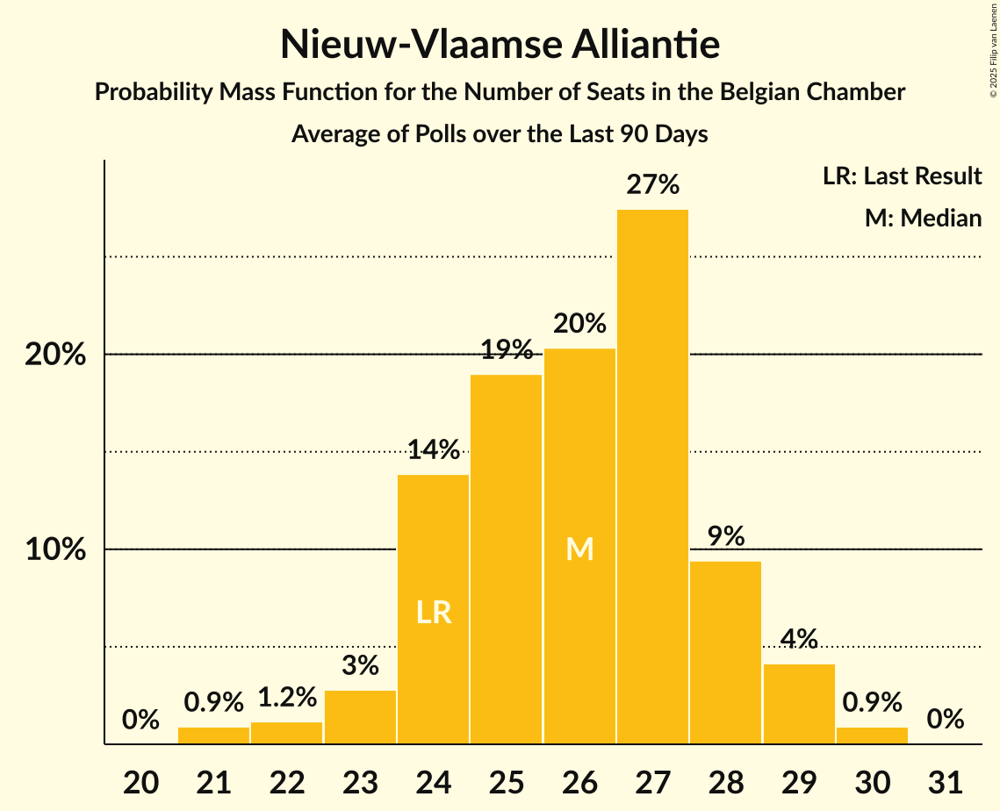
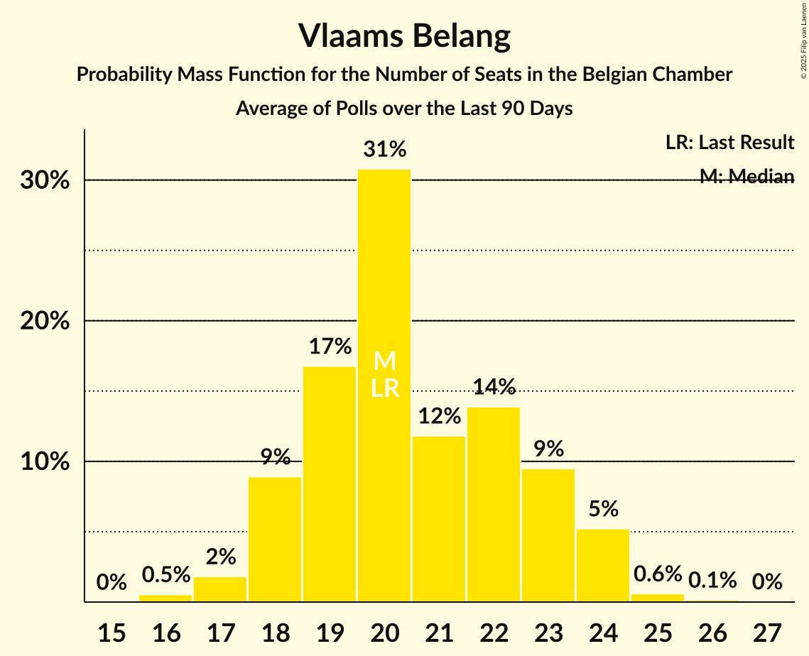

# Poll Average

<a href="#voting-intentions">Voting Intentions</a> | <a href="#seats">Seats</a> | <a href="#coalitions">Coalitions</a> | <a href="#technical-information">Technical Information</a>

## Summary

The table below lists the polls on which the average is based. They are the most recent polls (less than 90 days old) registered and analyzed so far.

| Period     | Polling firm/Commissioner(s) | N-VA | VB | PS | CD&V | PTB | PVDA | VLD | MR | SP.A | ECOLO | GROEN | CDH | DÉFI | PP |
|:----------:|:----------------------------:|:--:|:--:|:--:|:--:|:--:|:--:|:--:|:--:|:--:|:--:|:--:|:--:|:--:|:--:|
| 26 May 2019 | General Election | 16.0%   25 | 12.0%   18 | 9.5%   20 | 8.9%   12 | 4.8%   9 | 3.3%   3 | 8.5%   12 | 7.6%   14 | 6.7%   9 | 6.1%   13 | 6.1%   8 | 3.7%   5 | 2.2%   2 | 1.1%   0 |
| N/A | Poll Average | 11–12%   16–27 | 14–16%   22–30 | 7–8%   15–21 | 6–7%   8–14 | 4–5%   8–13 | 1–5%   0–8 | 5–6%   6–15 | 6–7%   13–20 | 6–9%   9–14 | 5–6%   10–14 | 4–6%   3–9 | 1–2%   0–5 | 1%   0–3 | 1%   0–2 |
| [28 August–1 September 2020](2020-09-01-Dedicated.html) | Dedicated   Soirmag | 12–14%   20–27 | 14–16%   22–30 | 7–8%   15–22 | 6–8%   9–14 | 4–5%   7–13 | 1–2%   0 | 7–8%   10–16 | 6–8%   13–20 | 6–9%   9–14 | 5%   9–15 | 3–5%   3–8 | 1–2%   0–5 | 1%   0–3 | 1%   0–2 |
| [10–15 June 2020](2020-06-15-Ipsos.html) | Ipsos   Het Laatste Nieuws, Le Soir, RTL TVi and VTM | 11–12%   16–21 | 15–16%   24–30 | 8%   16–20 | 6–7%   8–12 | 6%   10–13 | 4–5%   3–8 | 5–6%   6–10 | 6–7%   13–17 | 6–8%   8–13 | 5–6%   10–14 | 5–6%   5–9 | 2%   3–5 | 2%   1–4 | N/A   N/A |
| 26 May 2019 | General Election | 16.0%   25 | 12.0%   18 | 9.5%   20 | 8.9%   12 | 4.8%   9 | 3.3%   3 | 8.5%   12 | 7.6%   14 | 6.7%   9 | 6.1%   13 | 6.1%   8 | 3.7%   5 | 2.2%   2 | 1.1%   0 |

Only polls for which at least the sample size has been published are included in the table above.

**Legend:**
+ **Top half of each row:** Voting intentions (95% confidence interval)
+ **Bottom half of each row:** Seat projections for the Belgian Chamber (95% confidence interval)
+ **N-VA:** Nieuw-Vlaamse Alliantie
+ **VB:** Vlaams Belang
+ **PS:** Parti Socialiste
+ **CD&V:** Christen-Democratisch en Vlaams
+ **PTB:** Parti du Travail de Belgique
+ **PVDA:** Partij van de Arbeid van België
+ **VLD:** Open Vlaamse Liberalen en Democraten
+ **MR:** Mouvement Réformateur
+ **SP.A:** Socialistische Partij Anders
+ **ECOLO:** Ecolo
+ **GROEN:** Groen
+ **CDH:** Centre démocrate humaniste
+ **DÉFI:** DéFI
+ **PP:** Parti Populaire
+ **N/A (single party):** Party not included the published results
+ **N/A (entire row):** Calculation for this opinion poll not started yet

## Voting Intentions

### Confidence Intervals

| Party | Last Result | Median | 80% Confidence Interval | 90% Confidence Interval | 95% Confidence Interval | 99% Confidence Interval |
|:-----:|:-----------:|:------:|:-----------------------:|:-----------------------:|:-----------------------:|:-----------------------:|
| <a href="#nieuw-vlaamse-alliantie">Nieuw-Vlaamse Alliantie</a> | 16.0% | 11.9% | 11.2–12.2% |11.0–12.2% | 10.8–12.2% | 10.4–12.2% |
| <a href="#vlaams-belang">Vlaams Belang</a> | 12.0% | 15.7% | 14.9–16.0% |14.6–16.1% | 14.4–16.1% | 13.8–16.1% |
| <a href="#parti-socialiste">Parti Socialiste</a> | 9.5% | 8.0% | 7.7–8.2% |7.5–8.2% | 7.4–8.2% | 7.1–8.2% |
| <a href="#christen-democratisch-en-vlaams">Christen-Democratisch en Vlaams</a> | 8.9% | 6.7% | 6.2–6.9% |6.1–6.9% | 5.9–7.0% | 5.6–7.0% |
| <a href="#open-vlaamse-liberalen-en-democraten">Open Vlaamse Liberalen en Democraten</a> | 8.5% | 5.7% | 5.2–5.9% |5.1–5.9% | 4.9–5.9% | 4.7–5.9% |
| <a href="#mouvement-réformateur">Mouvement Réformateur</a> | 7.6% | 7.0% | 6.7–7.1% |6.6–7.1% | 6.5–7.1% | 6.2–7.1% |
| <a href="#socialistische-partij-anders">Socialistische Partij Anders</a> | 6.7% | 7.8% | 7.0–8.6% |6.7–8.8% | 6.5–8.8% | 6.1–8.9% |
| <a href="#ecolo">Ecolo</a> | 6.1% | 5.4% | 5.0–5.5% |4.9–5.6% | 4.7–5.6% | 4.5–5.6% |
| <a href="#groen">Groen</a> | 6.1% | 5.1% | 3.9–6.0% |3.7–6.2% | 3.5–6.2% | 3.1–6.3% |
| <a href="#parti-du-travail-de-belgique">Parti du Travail de Belgique</a> | 4.8% | 5.0% | 4.6–5.3% |4.5–5.3% | 4.3–5.3% | 4.1–5.3% |
| <a href="#centre-démocrate-humaniste">Centre démocrate humaniste</a> | 3.7% | 1.7% | 1.5–1.9% |1.4–1.9% | 1.3–1.9% | 1.2–1.9% |
| <a href="#partij-van-de-arbeid-van-belgië">Partij van de Arbeid van België</a> | 3.3% | 1.7% | 0.9–4.7% |0.8–4.8% | 0.7–4.9% | 0.6–4.9% |
| <a href="#défi">DéFI</a> | 2.2% | 1.3% | 1.1–1.4% |1.0–1.4% | 1.0–1.4% | 0.9–1.4% |
| <a href="#parti-populaire">Parti Populaire</a> | 1.1% | 1.0% | 0.7–1.2% |0.6–1.2% | 0.6–1.2% | 0.4–1.2% |

### Nieuw-Vlaamse Alliantie

*For a full overview of the results for this party, see the [Nieuw-Vlaamse Alliantie](party-nieuw-vlaamsealliantie.html) page.*

| Voting Intentions | Probability | Accumulated | Special Marks |
|:-----------------:|:-----------:|:-----------:|:-------------:|
| 8.5–9.5% | 0% | 100% |  |
| 9.5–10.5% | 0.8% | 100% |  |
| 10.5–11.5% | 24% | 99.2% |  |
| 11.5–12.5% | 100% | 75% | Median |
| 12.5–13.5% | 100% | 0% |  |
| 13.5–14.5% | 100% | 0% |  |
| 14.5–15.5% | 100% | 0% |  |
| 15.5–16.5% | 80% | 0% | Last Result |
| 16.5–17.5% | 23% | 0% |  |
| 17.5–18.5% | 3% | 0% |  |

### Vlaams Belang

*For a full overview of the results for this party, see the [Vlaams Belang](party-vlaamsbelang.html) page.*

| Voting Intentions | Probability | Accumulated | Special Marks |
|:-----------------:|:-----------:|:-----------:|:-------------:|
| 11.5–12.5% | 0% | 100% | Last Result |
| 12.5–13.5% | 0.2% | 100% |  |
| 13.5–14.5% | 4% | 99.8% |  |
| 14.5–15.5% | 35% | 96% |  |
| 15.5–16.5% | 100% | 61% | Median |
| 16.5–17.5% | 100% | 0% |  |
| 17.5–18.5% | 100% | 0% |  |
| 18.5–19.5% | 64% | 0% |  |
| 19.5–20.5% | 9% | 0% |  |
| 20.5–21.5% | 0.6% | 0% |  |

### Parti Socialiste

*For a full overview of the results for this party, see the [Parti Socialiste](party-partisocialiste.html) page.*

| Voting Intentions | Probability | Accumulated | Special Marks |
|:-----------------:|:-----------:|:-----------:|:-------------:|
| 5.5–6.5% | 0% | 100% |  |
| 6.5–7.5% | 6% | 100% |  |
| 7.5–8.5% | 100% | 94% | Median |
| 8.5–9.5% | 100% | 0% | Last Result |
| 9.5–10.5% | 100% | 0% |  |
| 10.5–11.5% | 52% | 0% |  |
| 11.5–12.5% | 4% | 0% |  |

### Christen-Democratisch en Vlaams

*For a full overview of the results for this party, see the [Christen-Democratisch en Vlaams](party-christen-democratischenvlaams.html) page.*

| Voting Intentions | Probability | Accumulated | Special Marks |
|:-----------------:|:-----------:|:-----------:|:-------------:|
| 3.5–4.5% | 0% | 100% |  |
| 4.5–5.5% | 0.3% | 100% |  |
| 5.5–6.5% | 33% | 99.7% |  |
| 6.5–7.5% | 100% | 67% | Median |
| 7.5–8.5% | 100% | 0% |  |
| 8.5–9.5% | 100% | 0% | Last Result |
| 9.5–10.5% | 33% | 0% |  |
| 10.5–11.5% | 3% | 0% |  |

### Open Vlaamse Liberalen en Democraten

*For a full overview of the results for this party, see the [Open Vlaamse Liberalen en Democraten](party-openvlaamseliberalenendemocraten.html) page.*

| Voting Intentions | Probability | Accumulated | Special Marks |
|:-----------------:|:-----------:|:-----------:|:-------------:|
| 2.5–3.5% | 0% | 100% |  |
| 3.5–4.5% | 0.2% | 100% |  |
| 4.5–5.5% | 35% | 99.8% |  |
| 5.5–6.5% | 100% | 64% | Median |
| 6.5–7.5% | 100% | 0% |  |
| 7.5–8.5% | 100% | 0% |  |
| 8.5–9.5% | 100% | 0% | Last Result |
| 9.5–10.5% | 83% | 0% |  |
| 10.5–11.5% | 16% | 0% |  |
| 11.5–12.5% | 1.2% | 0% |  |

### Mouvement Réformateur

*For a full overview of the results for this party, see the [Mouvement Réformateur](party-mouvementréformateur.html) page.*

| Voting Intentions | Probability | Accumulated | Special Marks |
|:-----------------:|:-----------:|:-----------:|:-------------:|
| 4.5–5.5% | 0% | 100% |  |
| 5.5–6.5% | 5% | 100% |  |
| 6.5–7.5% | 100% | 95% | Median |
| 7.5–8.5% | 100% | 0% | Last Result |
| 8.5–9.5% | 100% | 0% |  |
| 9.5–10.5% | 60% | 0% |  |
| 10.5–11.5% | 5% | 0% |  |

### Socialistische Partij Anders

*For a full overview of the results for this party, see the [Socialistische Partij Anders](party-socialistischepartijanders.html) page.*

| Voting Intentions | Probability | Accumulated | Special Marks |
|:-----------------:|:-----------:|:-----------:|:-------------:|
| 4.5–5.5% | 0% | 100% |  |
| 5.5–6.5% | 3% | 100% |  |
| 6.5–7.5% | 31% | 97% | Last Result |
| 7.5–8.5% | 54% | 66% | Median |
| 8.5–9.5% | 21% | 12% |  |
| 9.5–10.5% | 3% | 0% |  |

### Ecolo

*For a full overview of the results for this party, see the [Ecolo](party-ecolo.html) page.*

| Voting Intentions | Probability | Accumulated | Special Marks |
|:-----------------:|:-----------:|:-----------:|:-------------:|
| 2.5–3.5% | 0% | 100% |  |
| 3.5–4.5% | 0.9% | 100% |  |
| 4.5–5.5% | 90% | 99.1% | Median |
| 5.5–6.5% | 100% | 9% | Last Result |
| 6.5–7.5% | 100% | 0% |  |
| 7.5–8.5% | 27% | 0% |  |
| 8.5–9.5% | 0.8% | 0% |  |

### Groen

*For a full overview of the results for this party, see the [Groen](party-groen.html) page.*

| Voting Intentions | Probability | Accumulated | Special Marks |
|:-----------------:|:-----------:|:-----------:|:-------------:|
| 1.5–2.5% | 0% | 100% |  |
| 2.5–3.5% | 3% | 100% |  |
| 3.5–4.5% | 27% | 97% |  |
| 4.5–5.5% | 40% | 70% | Median |
| 5.5–6.5% | 35% | 30% | Last Result |
| 6.5–7.5% | 6% | 0% |  |

### Parti du Travail de Belgique

*For a full overview of the results for this party, see the [Parti du Travail de Belgique](party-partidutravaildebelgique.html) page.*

| Voting Intentions | Probability | Accumulated | Special Marks |
|:-----------------:|:-----------:|:-----------:|:-------------:|
| 2.5–3.5% | 0% | 100% |  |
| 3.5–4.5% | 8% | 100% |  |
| 4.5–5.5% | 100% | 92% | Last Result, Median |
| 5.5–6.5% | 100% | 0% |  |
| 6.5–7.5% | 100% | 0% |  |
| 7.5–8.5% | 17% | 0% |  |

### Centre démocrate humaniste

*For a full overview of the results for this party, see the [Centre démocrate humaniste](party-centredémocratehumaniste.html) page.*

| Voting Intentions | Probability | Accumulated | Special Marks |
|:-----------------:|:-----------:|:-----------:|:-------------:|
| 0.0–0.5% | 0% | 100% |  |
| 0.5–1.5% | 16% | 100% |  |
| 1.5–2.5% | 100% | 84% | Median |
| 2.5–3.5% | 100% | 0% |  |
| 3.5–4.5% | 11% | 0% | Last Result |

### Partij van de Arbeid van België

*For a full overview of the results for this party, see the [Partij van de Arbeid van België](party-partijvandearbeidvanbelgië.html) page.*

| Voting Intentions | Probability | Accumulated | Special Marks |
|:-----------------:|:-----------:|:-----------:|:-------------:|
| 0.0–0.5% | 0.5% | 100% |  |
| 0.5–1.5% | 45% | 99.5% |  |
| 1.5–2.5% | 10% | 54% | Median |
| 2.5–3.5% | 1.3% | 44% | Last Result |
| 3.5–4.5% | 28% | 43% |  |
| 4.5–5.5% | 25% | 15% |  |
| 5.5–6.5% | 2% | 0% |  |

### DéFI

*For a full overview of the results for this party, see the [DéFI](party-défi.html) page.*

| Voting Intentions | Probability | Accumulated | Special Marks |
|:-----------------:|:-----------:|:-----------:|:-------------:|
| 0.0–0.5% | 0% | 100% |  |
| 0.5–1.5% | 100% | 100% | Median |
| 1.5–2.5% | 100% | 0% | Last Result |
| 2.5–3.5% | 88% | 0% |  |

### Parti Populaire

*For a full overview of the results for this party, see the [Parti Populaire](party-partipopulaire.html) page.*

| Voting Intentions | Probability | Accumulated | Special Marks |
|:-----------------:|:-----------:|:-----------:|:-------------:|
| 0.0–0.5% | 2% | 100% |  |
| 0.5–1.5% | 100% | 98% | Last Result, Median |
| 1.5–2.5% | 28% | 0% |  |
| 2.5–3.5% | 0.2% | 0% |  |

## Seats

### Confidence Intervals

| Party | Last Result | Median | 80% Confidence Interval | 90% Confidence Interval | 95% Confidence Interval | 99% Confidence Interval |
|:-----:|:-----------:|:------:|:-----------------------:|:-----------------------:|:-----------------------:|:-----------------------:|
| <a href="#nieuw-vlaamse-alliantie">Nieuw-Vlaamse Alliantie</a> | 25 | 21 | 18–24 |17–26 | 16–27 | 15–27 |
| <a href="#vlaams-belang">Vlaams Belang</a> | 18 | 26 | 24–29 |23–29 | 22–30 | 21–31 |
| <a href="#parti-socialiste">Parti Socialiste</a> | 20 | 18 | 16–20 |16–21 | 15–21 | 14–22 |
| <a href="#christen-democratisch-en-vlaams">Christen-Democratisch en Vlaams</a> | 12 | 10 | 9–13 |9–13 | 8–14 | 7–15 |
| <a href="#open-vlaamse-liberalen-en-democraten">Open Vlaamse Liberalen en Democraten</a> | 12 | 10 | 7–14 |6–15 | 6–15 | 6–16 |
| <a href="#mouvement-réformateur">Mouvement Réformateur</a> | 14 | 16 | 14–18 |13–19 | 13–20 | 12–21 |
| <a href="#socialistische-partij-anders">Socialistische Partij Anders</a> | 9 | 11 | 9–13 |9–13 | 9–14 | 8–15 |
| <a href="#ecolo">Ecolo</a> | 13 | 12 | 10–13 |10–14 | 10–14 | 9–17 |
| <a href="#groen">Groen</a> | 8 | 6 | 4–9 |3–9 | 3–9 | 3–9 |
| <a href="#parti-du-travail-de-belgique">Parti du Travail de Belgique</a> | 9 | 11 | 9–12 |9–13 | 8–13 | 7–15 |
| <a href="#centre-démocrate-humaniste">Centre démocrate humaniste</a> | 5 | 4 | 0–5 |0–5 | 0–5 | 0–5 |
| <a href="#partij-van-de-arbeid-van-belgië">Partij van de Arbeid van België</a> | 3 | 1 | 0–6 |0–7 | 0–8 | 0–8 |
| <a href="#défi">DéFI</a> | 2 | 1 | 0–3 |0–3 | 0–3 | 0–4 |
| <a href="#parti-populaire">Parti Populaire</a> | 0 | 0 | 0–2 |0–2 | 0–2 | 0–2 |

### Nieuw-Vlaamse Alliantie

*For a full overview of the results for this party, see the [Nieuw-Vlaamse Alliantie](party-nieuw-vlaamsealliantie.html) page.*

| Number of Seats | Probability | Accumulated | Special Marks |
|:---------------:|:-----------:|:-----------:|:-------------:|
| 15 | 0.7% | 100% |  |
| 16 | 3% | 99.3% |  |
| 17 | 6% | 97% |  |
| 18 | 9% | 91% |  |
| 19 | 10% | 82% |  |
| 20 | 15% | 72% |  |
| 21 | 18% | 56% | Median |
| 22 | 8% | 38% |  |
| 23 | 13% | 30% |  |
| 24 | 9% | 17% |  |
| 25 | 3% | 9% | Last Result |
| 26 | 2% | 5% |  |
| 27 | 3% | 3% |  |
| 28 | 0.1% | 0.2% |  |
| 29 | 0% | 0.1% |  |
| 30 | 0% | 0% |  |

### Vlaams Belang

*For a full overview of the results for this party, see the [Vlaams Belang](party-vlaamsbelang.html) page.*

| Number of Seats | Probability | Accumulated | Special Marks |
|:---------------:|:-----------:|:-----------:|:-------------:|
| 18 | 0% | 100% | Last Result |
| 19 | 0% | 100% |  |
| 20 | 0.1% | 100% |  |
| 21 | 0.9% | 99.9% |  |
| 22 | 2% | 99.0% |  |
| 23 | 3% | 97% |  |
| 24 | 8% | 95% |  |
| 25 | 28% | 87% |  |
| 26 | 21% | 59% | Median |
| 27 | 12% | 38% |  |
| 28 | 14% | 27% |  |
| 29 | 10% | 13% |  |
| 30 | 2% | 3% |  |
| 31 | 0.5% | 0.9% |  |
| 32 | 0.3% | 0.4% |  |
| 33 | 0.1% | 0.1% |  |
| 34 | 0% | 0% |  |

### Parti Socialiste

*For a full overview of the results for this party, see the [Parti Socialiste](party-partisocialiste.html) page.*

| Number of Seats | Probability | Accumulated | Special Marks |
|:---------------:|:-----------:|:-----------:|:-------------:|
| 12 | 0.1% | 100% |  |
| 13 | 0.2% | 99.9% |  |
| 14 | 0.5% | 99.8% |  |
| 15 | 2% | 99.3% |  |
| 16 | 7% | 97% |  |
| 17 | 19% | 90% |  |
| 18 | 30% | 71% | Median |
| 19 | 18% | 41% |  |
| 20 | 16% | 23% | Last Result |
| 21 | 5% | 7% |  |
| 22 | 1.4% | 2% |  |
| 23 | 0.3% | 0.4% |  |
| 24 | 0.1% | 0.1% |  |
| 25 | 0% | 0% |  |

### Christen-Democratisch en Vlaams

*For a full overview of the results for this party, see the [Christen-Democratisch en Vlaams](party-christen-democratischenvlaams.html) page.*

| Number of Seats | Probability | Accumulated | Special Marks |
|:---------------:|:-----------:|:-----------:|:-------------:|
| 6 | 0.2% | 100% |  |
| 7 | 0.4% | 99.8% |  |
| 8 | 3% | 99.4% |  |
| 9 | 9% | 97% |  |
| 10 | 43% | 88% | Median |
| 11 | 21% | 45% |  |
| 12 | 11% | 23% | Last Result |
| 13 | 8% | 12% |  |
| 14 | 3% | 4% |  |
| 15 | 1.1% | 1.3% |  |
| 16 | 0.1% | 0.2% |  |
| 17 | 0% | 0% |  |

### Open Vlaamse Liberalen en Democraten

*For a full overview of the results for this party, see the [Open Vlaamse Liberalen en Democraten](party-openvlaamseliberalenendemocraten.html) page.*

| Number of Seats | Probability | Accumulated | Special Marks |
|:---------------:|:-----------:|:-----------:|:-------------:|
| 5 | 0.2% | 100% |  |
| 6 | 8% | 99.8% |  |
| 7 | 8% | 91% |  |
| 8 | 7% | 83% |  |
| 9 | 14% | 76% |  |
| 10 | 20% | 62% | Median |
| 11 | 10% | 42% |  |
| 12 | 10% | 33% | Last Result |
| 13 | 6% | 22% |  |
| 14 | 11% | 16% |  |
| 15 | 3% | 6% |  |
| 16 | 2% | 2% |  |
| 17 | 0.2% | 0.3% |  |
| 18 | 0% | 0.1% |  |
| 19 | 0% | 0% |  |

### Mouvement Réformateur

*For a full overview of the results for this party, see the [Mouvement Réformateur](party-mouvementréformateur.html) page.*

| Number of Seats | Probability | Accumulated | Special Marks |
|:---------------:|:-----------:|:-----------:|:-------------:|
| 11 | 0% | 100% |  |
| 12 | 0.8% | 99.9% |  |
| 13 | 9% | 99.1% |  |
| 14 | 21% | 91% | Last Result |
| 15 | 19% | 70% |  |
| 16 | 12% | 51% | Median |
| 17 | 17% | 39% |  |
| 18 | 14% | 22% |  |
| 19 | 4% | 7% |  |
| 20 | 3% | 3% |  |
| 21 | 0.4% | 0.5% |  |
| 22 | 0.1% | 0.2% |  |
| 23 | 0% | 0% |  |

### Socialistische Partij Anders

*For a full overview of the results for this party, see the [Socialistische Partij Anders](party-socialistischepartijanders.html) page.*

| Number of Seats | Probability | Accumulated | Special Marks |
|:---------------:|:-----------:|:-----------:|:-------------:|
| 6 | 0.1% | 100% |  |
| 7 | 0.2% | 99.9% |  |
| 8 | 2% | 99.7% |  |
| 9 | 11% | 98% | Last Result |
| 10 | 15% | 87% |  |
| 11 | 46% | 71% | Median |
| 12 | 11% | 25% |  |
| 13 | 11% | 14% |  |
| 14 | 3% | 3% |  |
| 15 | 0.8% | 0.9% |  |
| 16 | 0.1% | 0.1% |  |
| 17 | 0% | 0% |  |

### Ecolo

*For a full overview of the results for this party, see the [Ecolo](party-ecolo.html) page.*

| Number of Seats | Probability | Accumulated | Special Marks |
|:---------------:|:-----------:|:-----------:|:-------------:|
| 7 | 0.1% | 100% |  |
| 8 | 0.2% | 99.9% |  |
| 9 | 1.1% | 99.7% |  |
| 10 | 9% | 98.6% |  |
| 11 | 26% | 89% |  |
| 12 | 26% | 64% | Median |
| 13 | 28% | 37% | Last Result |
| 14 | 7% | 9% |  |
| 15 | 1.2% | 2% |  |
| 16 | 0.5% | 1.0% |  |
| 17 | 0.5% | 0.5% |  |
| 18 | 0% | 0% |  |

### Groen

*For a full overview of the results for this party, see the [Groen](party-groen.html) page.*

| Number of Seats | Probability | Accumulated | Special Marks |
|:---------------:|:-----------:|:-----------:|:-------------:|
| 1 | 0% | 100% |  |
| 2 | 0.2% | 99.9% |  |
| 3 | 8% | 99.7% |  |
| 4 | 9% | 92% |  |
| 5 | 26% | 83% |  |
| 6 | 13% | 56% | Median |
| 7 | 18% | 44% |  |
| 8 | 9% | 26% | Last Result |
| 9 | 16% | 17% |  |
| 10 | 0.3% | 0.3% |  |
| 11 | 0.1% | 0.1% |  |
| 12 | 0% | 0% |  |

### Parti du Travail de Belgique

*For a full overview of the results for this party, see the [Parti du Travail de Belgique](party-partidutravaildebelgique.html) page.*

| Number of Seats | Probability | Accumulated | Special Marks |
|:---------------:|:-----------:|:-----------:|:-------------:|
| 6 | 0.3% | 100% |  |
| 7 | 1.0% | 99.7% |  |
| 8 | 2% | 98.7% |  |
| 9 | 9% | 97% | Last Result |
| 10 | 22% | 88% |  |
| 11 | 32% | 66% | Median |
| 12 | 26% | 33% |  |
| 13 | 6% | 8% |  |
| 14 | 1.3% | 2% |  |
| 15 | 0.4% | 0.6% |  |
| 16 | 0.1% | 0.2% |  |
| 17 | 0.1% | 0.1% |  |
| 18 | 0% | 0% |  |

### Centre démocrate humaniste

*For a full overview of the results for this party, see the [Centre démocrate humaniste](party-centredémocratehumaniste.html) page.*

| Number of Seats | Probability | Accumulated | Special Marks |
|:---------------:|:-----------:|:-----------:|:-------------:|
| 0 | 10% | 100% |  |
| 1 | 16% | 90% |  |
| 2 | 4% | 74% |  |
| 3 | 2% | 70% |  |
| 4 | 38% | 68% | Median |
| 5 | 29% | 29% | Last Result |
| 6 | 0.1% | 0.1% |  |
| 7 | 0% | 0% |  |

### Partij van de Arbeid van België

*For a full overview of the results for this party, see the [Partij van de Arbeid van België](party-partijvandearbeidvanbelgië.html) page.*

| Number of Seats | Probability | Accumulated | Special Marks |
|:---------------:|:-----------:|:-----------:|:-------------:|
| 0 | 50% | 100% |  |
| 1 | 0.4% | 50% | Median |
| 2 | 0.1% | 50% |  |
| 3 | 4% | 50% | Last Result |
| 4 | 8% | 46% |  |
| 5 | 24% | 38% |  |
| 6 | 4% | 14% |  |
| 7 | 7% | 10% |  |
| 8 | 3% | 3% |  |
| 9 | 0% | 0% |  |

### DéFI

*For a full overview of the results for this party, see the [DéFI](party-défi.html) page.*

| Number of Seats | Probability | Accumulated | Special Marks |
|:---------------:|:-----------:|:-----------:|:-------------:|
| 0 | 19% | 100% |  |
| 1 | 32% | 81% | Median |
| 2 | 40% | 50% | Last Result |
| 3 | 8% | 10% |  |
| 4 | 2% | 2% |  |
| 5 | 0.1% | 0.1% |  |
| 6 | 0% | 0% |  |

### Parti Populaire

*For a full overview of the results for this party, see the [Parti Populaire](party-partipopulaire.html) page.*

| Number of Seats | Probability | Accumulated | Special Marks |
|:---------------:|:-----------:|:-----------:|:-------------:|
| 0 | 78% | 100% | Last Result, Median |
| 1 | 5% | 22% |  |
| 2 | 17% | 17% |  |
| 3 | 0.1% | 0.1% |  |
| 4 | 0% | 0% |  |

## Coalitions

### Confidence Intervals

| Coalition | Last Result | Median | Majority? | 80% Confidence Interval | 90% Confidence Interval | 95% Confidence Interval | 99% Confidence Interval |
|:---------:|:-----------:|:------:|:---------:|:-----------------------:|:-----------------------:|:-----------------------:|:-----------------------:|
| Parti Socialiste – Christen-Democratisch en Vlaams – Open Vlaamse Liberalen en Democraten – Mouvement Réformateur – Socialistische Partij Anders – Ecolo – Groen – Centre démocrate humaniste | 93 | 87 | 100% | 84–92 | 83–93 | 82–94 | 80–96 |
| Parti Socialiste – Christen-Democratisch en Vlaams – Open Vlaamse Liberalen en Democraten – Mouvement Réformateur – Socialistische Partij Anders – Ecolo – Groen | 88 | 84 | 99.8% | 79–90 | 78–91 | 78–93 | 76–94 |
| Nieuw-Vlaamse Alliantie – Parti Socialiste – Open Vlaamse Liberalen en Democraten – Mouvement Réformateur – Socialistische Partij Anders | 80 | 75 | 50% | 69–85 | 68–86 | 67–87 | 65–89 |
| Parti Socialiste – Christen-Democratisch en Vlaams – Socialistische Partij Anders – Ecolo – Groen – Parti du Travail de Belgique – Centre démocrate humaniste – Partij van de Arbeid van België | 79 | 76 | 50% | 68–81 | 67–82 | 66–83 | 64–85 |
| Parti Socialiste – Open Vlaamse Liberalen en Democraten – Mouvement Réformateur – Socialistische Partij Anders – Ecolo – Groen | 76 | 73 | 30% | 69–79 | 68–80 | 68–81 | 66–83 |
| Parti Socialiste – Christen-Democratisch en Vlaams – Open Vlaamse Liberalen en Democraten – Mouvement Réformateur – Socialistische Partij Anders – Centre démocrate humaniste | 72 | 69 | 9% | 64–75 | 63–77 | 62–78 | 61–80 |
| Parti Socialiste – Socialistische Partij Anders – Ecolo – Groen – Parti du Travail de Belgique – Centre démocrate humaniste – Partij van de Arbeid van België | 67 | 65 | 0.2% | 57–71 | 56–72 | 55–73 | 53–75 |
| Nieuw-Vlaamse Alliantie – Christen-Democratisch en Vlaams – Open Vlaamse Liberalen en Democraten – Mouvement Réformateur – Centre démocrate humaniste | 68 | 61 | 0% | 55–68 | 54–70 | 53–71 | 51–73 |
| Parti Socialiste – Socialistische Partij Anders – Ecolo – Groen – Parti du Travail de Belgique – Partij van de Arbeid van België | 62 | 61 | 0% | 55–67 | 53–68 | 52–69 | 50–71 |
| Nieuw-Vlaamse Alliantie – Christen-Democratisch en Vlaams – Open Vlaamse Liberalen en Democraten – Mouvement Réformateur | 63 | 57 | 0% | 50–66 | 49–67 | 48–68 | 47–70 |
| Parti Socialiste – Christen-Democratisch en Vlaams – Socialistische Partij Anders – Ecolo – Groen – Centre démocrate humaniste | 67 | 62 | 0% | 58–65 | 56–66 | 55–67 | 53–68 |
| Parti Socialiste – Christen-Democratisch en Vlaams – Open Vlaamse Liberalen en Democraten – Mouvement Réformateur – Centre démocrate humaniste | 63 | 58 | 0% | 53–64 | 53–65 | 52–66 | 51–68 |
| Christen-Democratisch en Vlaams – Open Vlaamse Liberalen en Democraten – Mouvement Réformateur – Ecolo – Groen – Centre démocrate humaniste | 64 | 58 | 0% | 55–62 | 54–63 | 53–65 | 51–67 |
| Parti Socialiste – Open Vlaamse Liberalen en Democraten – Mouvement Réformateur – Socialistische Partij Anders | 55 | 55 | 0% | 50–62 | 49–63 | 48–64 | 47–66 |
| Parti Socialiste – Christen-Democratisch en Vlaams – Socialistische Partij Anders – Centre démocrate humaniste | 46 | 43 | 0% | 40–46 | 39–47 | 39–48 | 37–50 |
| Christen-Democratisch en Vlaams – Open Vlaamse Liberalen en Democraten – Mouvement Réformateur – Centre démocrate humaniste | 43 | 40 | 0% | 36–45 | 35–47 | 34–48 | 33–50 |

### Parti Socialiste – Christen-Democratisch en Vlaams – Open Vlaamse Liberalen en Democraten – Mouvement Réformateur – Socialistische Partij Anders – Ecolo – Groen – Centre démocrate humaniste

| Number of Seats | Probability | Accumulated | Special Marks |
|:---------------:|:-----------:|:-----------:|:-------------:|
| 79 | 0.1% | 100% |  |
| 80 | 0.4% | 99.8% |  |
| 81 | 1.1% | 99.5% |  |
| 82 | 3% | 98% |  |
| 83 | 5% | 96% |  |
| 84 | 7% | 91% |  |
| 85 | 10% | 84% |  |
| 86 | 12% | 73% |  |
| 87 | 12% | 61% | Median |
| 88 | 11% | 49% |  |
| 89 | 10% | 38% |  |
| 90 | 9% | 28% |  |
| 91 | 7% | 20% |  |
| 92 | 5% | 13% |  |
| 93 | 4% | 8% | Last Result |
| 94 | 2% | 4% |  |
| 95 | 1.1% | 2% |  |
| 96 | 0.5% | 0.8% |  |
| 97 | 0.2% | 0.3% |  |
| 98 | 0.1% | 0.1% |  |
| 99 | 0% | 0% |  |

### Parti Socialiste – Christen-Democratisch en Vlaams – Open Vlaamse Liberalen en Democraten – Mouvement Réformateur – Socialistische Partij Anders – Ecolo – Groen

| Number of Seats | Probability | Accumulated | Special Marks |
|:---------------:|:-----------:|:-----------:|:-------------:|
| 74 | 0% | 100% |  |
| 75 | 0.2% | 99.9% |  |
| 76 | 0.5% | 99.8% | Majority |
| 77 | 2% | 99.2% |  |
| 78 | 3% | 98% |  |
| 79 | 5% | 95% |  |
| 80 | 7% | 90% |  |
| 81 | 10% | 82% |  |
| 82 | 10% | 72% |  |
| 83 | 9% | 62% | Median |
| 84 | 8% | 53% |  |
| 85 | 7% | 45% |  |
| 86 | 7% | 37% |  |
| 87 | 6% | 30% |  |
| 88 | 6% | 24% | Last Result |
| 89 | 5% | 18% |  |
| 90 | 4% | 13% |  |
| 91 | 3% | 8% |  |
| 92 | 2% | 5% |  |
| 93 | 1.4% | 3% |  |
| 94 | 0.7% | 1.2% |  |
| 95 | 0.3% | 0.5% |  |
| 96 | 0.1% | 0.2% |  |
| 97 | 0% | 0.1% |  |
| 98 | 0% | 0% |  |

### Nieuw-Vlaamse Alliantie – Parti Socialiste – Open Vlaamse Liberalen en Democraten – Mouvement Réformateur – Socialistische Partij Anders

| Number of Seats | Probability | Accumulated | Special Marks |
|:---------------:|:-----------:|:-----------:|:-------------:|
| 63 | 0% | 100% |  |
| 64 | 0.1% | 99.9% |  |
| 65 | 0.4% | 99.8% |  |
| 66 | 1.0% | 99.5% |  |
| 67 | 2% | 98% |  |
| 68 | 4% | 96% |  |
| 69 | 7% | 92% |  |
| 70 | 9% | 85% |  |
| 71 | 9% | 77% |  |
| 72 | 7% | 68% |  |
| 73 | 5% | 61% |  |
| 74 | 4% | 56% |  |
| 75 | 2% | 52% |  |
| 76 | 2% | 50% | Median, Majority |
| 77 | 2% | 48% |  |
| 78 | 3% | 46% |  |
| 79 | 4% | 44% |  |
| 80 | 5% | 40% | Last Result |
| 81 | 6% | 35% |  |
| 82 | 6% | 29% |  |
| 83 | 6% | 23% |  |
| 84 | 6% | 17% |  |
| 85 | 4% | 12% |  |
| 86 | 3% | 7% |  |
| 87 | 2% | 4% |  |
| 88 | 1.1% | 2% |  |
| 89 | 0.5% | 0.9% |  |
| 90 | 0.2% | 0.4% |  |
| 91 | 0.1% | 0.2% |  |
| 92 | 0% | 0.1% |  |
| 93 | 0% | 0% |  |

### Parti Socialiste – Christen-Democratisch en Vlaams – Socialistische Partij Anders – Ecolo – Groen – Parti du Travail de Belgique – Centre démocrate humaniste – Partij van de Arbeid van België

| Number of Seats | Probability | Accumulated | Special Marks |
|:---------------:|:-----------:|:-----------:|:-------------:|
| 62 | 0.1% | 100% |  |
| 63 | 0.2% | 99.9% |  |
| 64 | 0.5% | 99.7% |  |
| 65 | 1.1% | 99.1% |  |
| 66 | 2% | 98% |  |
| 67 | 3% | 96% |  |
| 68 | 5% | 93% |  |
| 69 | 6% | 88% |  |
| 70 | 7% | 82% |  |
| 71 | 7% | 75% |  |
| 72 | 6% | 69% |  |
| 73 | 5% | 63% | Median |
| 74 | 4% | 58% |  |
| 75 | 4% | 54% |  |
| 76 | 4% | 50% | Majority |
| 77 | 6% | 46% |  |
| 78 | 7% | 40% |  |
| 79 | 8% | 33% | Last Result |
| 80 | 8% | 25% |  |
| 81 | 7% | 16% |  |
| 82 | 5% | 10% |  |
| 83 | 3% | 5% |  |
| 84 | 1.4% | 2% |  |
| 85 | 0.6% | 0.8% |  |
| 86 | 0.2% | 0.2% |  |
| 87 | 0% | 0.1% |  |
| 88 | 0% | 0% |  |

### Parti Socialiste – Open Vlaamse Liberalen en Democraten – Mouvement Réformateur – Socialistische Partij Anders – Ecolo – Groen

| Number of Seats | Probability | Accumulated | Special Marks |
|:---------------:|:-----------:|:-----------:|:-------------:|
| 64 | 0.1% | 100% |  |
| 65 | 0.2% | 99.9% |  |
| 66 | 0.6% | 99.7% |  |
| 67 | 2% | 99.1% |  |
| 68 | 4% | 98% |  |
| 69 | 6% | 94% |  |
| 70 | 8% | 88% |  |
| 71 | 11% | 80% |  |
| 72 | 12% | 69% |  |
| 73 | 11% | 57% | Median |
| 74 | 9% | 47% |  |
| 75 | 8% | 38% |  |
| 76 | 7% | 30% | Last Result, Majority |
| 77 | 6% | 23% |  |
| 78 | 5% | 16% |  |
| 79 | 4% | 11% |  |
| 80 | 3% | 7% |  |
| 81 | 2% | 4% |  |
| 82 | 1.2% | 2% |  |
| 83 | 0.6% | 0.9% |  |
| 84 | 0.2% | 0.3% |  |
| 85 | 0.1% | 0.1% |  |
| 86 | 0% | 0% |  |

### Parti Socialiste – Christen-Democratisch en Vlaams – Open Vlaamse Liberalen en Democraten – Mouvement Réformateur – Socialistische Partij Anders – Centre démocrate humaniste

| Number of Seats | Probability | Accumulated | Special Marks |
|:---------------:|:-----------:|:-----------:|:-------------:|
| 59 | 0% | 100% |  |
| 60 | 0.2% | 99.9% |  |
| 61 | 0.6% | 99.8% |  |
| 62 | 2% | 99.2% |  |
| 63 | 4% | 97% |  |
| 64 | 6% | 94% |  |
| 65 | 8% | 88% |  |
| 66 | 9% | 81% |  |
| 67 | 10% | 71% |  |
| 68 | 8% | 62% |  |
| 69 | 7% | 53% | Median |
| 70 | 6% | 46% |  |
| 71 | 6% | 40% |  |
| 72 | 7% | 34% | Last Result |
| 73 | 7% | 27% |  |
| 74 | 6% | 20% |  |
| 75 | 5% | 14% |  |
| 76 | 4% | 9% | Majority |
| 77 | 3% | 5% |  |
| 78 | 1.4% | 3% |  |
| 79 | 0.7% | 1.3% |  |
| 80 | 0.3% | 0.5% |  |
| 81 | 0.1% | 0.2% |  |
| 82 | 0.1% | 0.1% |  |
| 83 | 0% | 0% |  |

### Parti Socialiste – Socialistische Partij Anders – Ecolo – Groen – Parti du Travail de Belgique – Centre démocrate humaniste – Partij van de Arbeid van België

| Number of Seats | Probability | Accumulated | Special Marks |
|:---------------:|:-----------:|:-----------:|:-------------:|
| 51 | 0.1% | 100% |  |
| 52 | 0.2% | 99.9% |  |
| 53 | 0.5% | 99.7% |  |
| 54 | 1.1% | 99.2% |  |
| 55 | 2% | 98% |  |
| 56 | 4% | 96% |  |
| 57 | 5% | 92% |  |
| 58 | 7% | 87% |  |
| 59 | 7% | 80% |  |
| 60 | 7% | 73% |  |
| 61 | 6% | 67% |  |
| 62 | 4% | 61% |  |
| 63 | 3% | 56% | Median |
| 64 | 2% | 53% |  |
| 65 | 3% | 51% |  |
| 66 | 4% | 48% |  |
| 67 | 5% | 45% | Last Result |
| 68 | 7% | 39% |  |
| 69 | 9% | 32% |  |
| 70 | 8% | 23% |  |
| 71 | 7% | 15% |  |
| 72 | 4% | 8% |  |
| 73 | 2% | 4% |  |
| 74 | 1.1% | 2% |  |
| 75 | 0.5% | 0.7% |  |
| 76 | 0.2% | 0.2% | Majority |
| 77 | 0% | 0% |  |

### Nieuw-Vlaamse Alliantie – Christen-Democratisch en Vlaams – Open Vlaamse Liberalen en Democraten – Mouvement Réformateur – Centre démocrate humaniste

| Number of Seats | Probability | Accumulated | Special Marks |
|:---------------:|:-----------:|:-----------:|:-------------:|
| 49 | 0.1% | 100% |  |
| 50 | 0.2% | 99.9% |  |
| 51 | 0.5% | 99.7% |  |
| 52 | 1.3% | 99.2% |  |
| 53 | 3% | 98% |  |
| 54 | 5% | 95% |  |
| 55 | 7% | 90% |  |
| 56 | 8% | 83% |  |
| 57 | 8% | 75% |  |
| 58 | 7% | 67% |  |
| 59 | 5% | 60% |  |
| 60 | 4% | 55% |  |
| 61 | 3% | 51% | Median |
| 62 | 4% | 47% |  |
| 63 | 5% | 44% |  |
| 64 | 6% | 39% |  |
| 65 | 7% | 33% |  |
| 66 | 7% | 27% |  |
| 67 | 6% | 20% |  |
| 68 | 5% | 14% | Last Result |
| 69 | 3% | 9% |  |
| 70 | 2% | 5% |  |
| 71 | 1.4% | 3% |  |
| 72 | 0.7% | 1.4% |  |
| 73 | 0.4% | 0.7% |  |
| 74 | 0.2% | 0.3% |  |
| 75 | 0.1% | 0.1% |  |
| 76 | 0% | 0% | Majority |

### Parti Socialiste – Socialistische Partij Anders – Ecolo – Groen – Parti du Travail de Belgique – Partij van de Arbeid van België

| Number of Seats | Probability | Accumulated | Special Marks |
|:---------------:|:-----------:|:-----------:|:-------------:|
| 48 | 0% | 100% |  |
| 49 | 0.1% | 99.9% |  |
| 50 | 0.3% | 99.8% |  |
| 51 | 0.7% | 99.5% |  |
| 52 | 1.4% | 98.7% |  |
| 53 | 2% | 97% |  |
| 54 | 4% | 95% |  |
| 55 | 5% | 91% |  |
| 56 | 7% | 86% |  |
| 57 | 7% | 79% |  |
| 58 | 7% | 72% |  |
| 59 | 6% | 65% | Median |
| 60 | 5% | 59% |  |
| 61 | 5% | 54% |  |
| 62 | 5% | 49% | Last Result |
| 63 | 7% | 44% |  |
| 64 | 8% | 38% |  |
| 65 | 9% | 29% |  |
| 66 | 8% | 21% |  |
| 67 | 6% | 13% |  |
| 68 | 4% | 7% |  |
| 69 | 2% | 3% |  |
| 70 | 0.9% | 1.4% |  |
| 71 | 0.4% | 0.5% |  |
| 72 | 0.1% | 0.1% |  |
| 73 | 0% | 0% |  |

### Nieuw-Vlaamse Alliantie – Christen-Democratisch en Vlaams – Open Vlaamse Liberalen en Democraten – Mouvement Réformateur

| Number of Seats | Probability | Accumulated | Special Marks |
|:---------------:|:-----------:|:-----------:|:-------------:|
| 45 | 0.1% | 100% |  |
| 46 | 0.2% | 99.9% |  |
| 47 | 0.6% | 99.7% |  |
| 48 | 2% | 99.0% |  |
| 49 | 3% | 97% |  |
| 50 | 6% | 94% |  |
| 51 | 8% | 89% |  |
| 52 | 8% | 81% |  |
| 53 | 8% | 72% |  |
| 54 | 6% | 65% |  |
| 55 | 4% | 58% |  |
| 56 | 3% | 54% |  |
| 57 | 2% | 51% | Median |
| 58 | 2% | 50% |  |
| 59 | 2% | 48% |  |
| 60 | 3% | 46% |  |
| 61 | 4% | 42% |  |
| 62 | 6% | 38% |  |
| 63 | 7% | 32% | Last Result |
| 64 | 7% | 25% |  |
| 65 | 6% | 18% |  |
| 66 | 5% | 12% |  |
| 67 | 3% | 7% |  |
| 68 | 2% | 4% |  |
| 69 | 1.0% | 2% |  |
| 70 | 0.5% | 0.8% |  |
| 71 | 0.2% | 0.3% |  |
| 72 | 0.1% | 0.1% |  |
| 73 | 0% | 0% |  |

### Parti Socialiste – Christen-Democratisch en Vlaams – Socialistische Partij Anders – Ecolo – Groen – Centre démocrate humaniste

| Number of Seats | Probability | Accumulated | Special Marks |
|:---------------:|:-----------:|:-----------:|:-------------:|
| 51 | 0% | 100% |  |
| 52 | 0.1% | 99.9% |  |
| 53 | 0.3% | 99.8% |  |
| 54 | 0.8% | 99.5% |  |
| 55 | 2% | 98.7% |  |
| 56 | 3% | 97% |  |
| 57 | 4% | 95% |  |
| 58 | 6% | 91% |  |
| 59 | 9% | 84% |  |
| 60 | 11% | 76% |  |
| 61 | 13% | 65% | Median |
| 62 | 14% | 52% |  |
| 63 | 13% | 38% |  |
| 64 | 10% | 25% |  |
| 65 | 7% | 15% |  |
| 66 | 4% | 8% |  |
| 67 | 2% | 4% | Last Result |
| 68 | 0.9% | 1.4% |  |
| 69 | 0.3% | 0.5% |  |
| 70 | 0.1% | 0.1% |  |
| 71 | 0% | 0% |  |

### Parti Socialiste – Christen-Democratisch en Vlaams – Open Vlaamse Liberalen en Democraten – Mouvement Réformateur – Centre démocrate humaniste

| Number of Seats | Probability | Accumulated | Special Marks |
|:---------------:|:-----------:|:-----------:|:-------------:|
| 49 | 0.1% | 100% |  |
| 50 | 0.4% | 99.9% |  |
| 51 | 1.2% | 99.5% |  |
| 52 | 3% | 98% |  |
| 53 | 5% | 95% |  |
| 54 | 7% | 90% |  |
| 55 | 9% | 83% |  |
| 56 | 10% | 74% |  |
| 57 | 10% | 63% |  |
| 58 | 8% | 53% | Median |
| 59 | 7% | 46% |  |
| 60 | 6% | 39% |  |
| 61 | 7% | 33% |  |
| 62 | 7% | 26% |  |
| 63 | 6% | 19% | Last Result |
| 64 | 5% | 13% |  |
| 65 | 4% | 8% |  |
| 66 | 2% | 4% |  |
| 67 | 1.2% | 2% |  |
| 68 | 0.6% | 0.9% |  |
| 69 | 0.2% | 0.4% |  |
| 70 | 0.1% | 0.1% |  |
| 71 | 0% | 0% |  |

### Christen-Democratisch en Vlaams – Open Vlaamse Liberalen en Democraten – Mouvement Réformateur – Ecolo – Groen – Centre démocrate humaniste

| Number of Seats | Probability | Accumulated | Special Marks |
|:---------------:|:-----------:|:-----------:|:-------------:|
| 50 | 0.1% | 100% |  |
| 51 | 0.4% | 99.9% |  |
| 52 | 1.1% | 99.5% |  |
| 53 | 3% | 98% |  |
| 54 | 5% | 96% |  |
| 55 | 8% | 91% |  |
| 56 | 11% | 83% |  |
| 57 | 13% | 73% |  |
| 58 | 14% | 60% | Median |
| 59 | 13% | 46% |  |
| 60 | 11% | 33% |  |
| 61 | 8% | 23% |  |
| 62 | 6% | 15% |  |
| 63 | 4% | 9% |  |
| 64 | 2% | 5% | Last Result |
| 65 | 1.3% | 3% |  |
| 66 | 0.7% | 1.2% |  |
| 67 | 0.3% | 0.5% |  |
| 68 | 0.1% | 0.2% |  |
| 69 | 0.1% | 0.1% |  |
| 70 | 0% | 0% |  |

### Parti Socialiste – Open Vlaamse Liberalen en Democraten – Mouvement Réformateur – Socialistische Partij Anders

| Number of Seats | Probability | Accumulated | Special Marks |
|:---------------:|:-----------:|:-----------:|:-------------:|
| 45 | 0.1% | 100% |  |
| 46 | 0.2% | 99.9% |  |
| 47 | 0.8% | 99.7% |  |
| 48 | 2% | 98.9% |  |
| 49 | 4% | 97% |  |
| 50 | 7% | 92% |  |
| 51 | 9% | 86% |  |
| 52 | 10% | 77% |  |
| 53 | 9% | 67% |  |
| 54 | 7% | 58% |  |
| 55 | 6% | 51% | Last Result, Median |
| 56 | 5% | 45% |  |
| 57 | 5% | 41% |  |
| 58 | 6% | 35% |  |
| 59 | 6% | 30% |  |
| 60 | 6% | 23% |  |
| 61 | 5% | 17% |  |
| 62 | 4% | 12% |  |
| 63 | 3% | 8% |  |
| 64 | 2% | 4% |  |
| 65 | 1.3% | 2% |  |
| 66 | 0.6% | 0.9% |  |
| 67 | 0.2% | 0.3% |  |
| 68 | 0.1% | 0.1% |  |
| 69 | 0% | 0% |  |

### Parti Socialiste – Christen-Democratisch en Vlaams – Socialistische Partij Anders – Centre démocrate humaniste

| Number of Seats | Probability | Accumulated | Special Marks |
|:---------------:|:-----------:|:-----------:|:-------------:|
| 35 | 0.1% | 100% |  |
| 36 | 0.2% | 99.9% |  |
| 37 | 0.6% | 99.7% |  |
| 38 | 1.4% | 99.1% |  |
| 39 | 3% | 98% |  |
| 40 | 6% | 95% |  |
| 41 | 10% | 89% |  |
| 42 | 15% | 78% |  |
| 43 | 18% | 63% | Median |
| 44 | 16% | 45% |  |
| 45 | 12% | 29% |  |
| 46 | 8% | 17% | Last Result |
| 47 | 5% | 9% |  |
| 48 | 3% | 5% |  |
| 49 | 1.3% | 2% |  |
| 50 | 0.6% | 1.0% |  |
| 51 | 0.3% | 0.4% |  |
| 52 | 0.1% | 0.1% |  |
| 53 | 0% | 0% |  |

### Christen-Democratisch en Vlaams – Open Vlaamse Liberalen en Democraten – Mouvement Réformateur – Centre démocrate humaniste

| Number of Seats | Probability | Accumulated | Special Marks |
|:---------------:|:-----------:|:-----------:|:-------------:|
| 31 | 0.1% | 100% |  |
| 32 | 0.3% | 99.9% |  |
| 33 | 1.1% | 99.6% |  |
| 34 | 3% | 98% |  |
| 35 | 5% | 96% |  |
| 36 | 7% | 90% |  |
| 37 | 9% | 83% |  |
| 38 | 11% | 74% |  |
| 39 | 11% | 63% |  |
| 40 | 9% | 53% | Median |
| 41 | 8% | 43% |  |
| 42 | 8% | 35% |  |
| 43 | 7% | 27% | Last Result |
| 44 | 6% | 20% |  |
| 45 | 5% | 14% |  |
| 46 | 4% | 9% |  |
| 47 | 2% | 5% |  |
| 48 | 1.4% | 3% |  |
| 49 | 0.8% | 1.4% |  |
| 50 | 0.4% | 0.6% |  |
| 51 | 0.1% | 0.2% |  |
| 52 | 0.1% | 0.1% |  |
| 53 | 0% | 0% |  |

## Technical Information

+ **Number of polls included in this average:** 2
+ **Lowest number of simulations done in a poll included in this average:** 1,048,576
+ **Total number of simulations done in the polls included in this average:** 2,097,152
+ **Error estimate:** 1.89%
