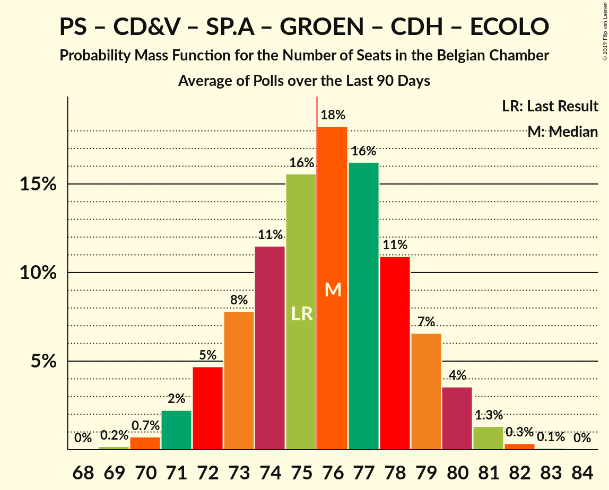

# Poll Average

<a href="#voting-intentions">Voting Intentions</a> | <a href="#seats">Seats</a> | <a href="#coalitions">Coalitions</a> | <a href="#technical-information">Technical Information</a>

## Summary

The table below lists the polls on which the average is based. They are the most recent polls (less than 90 days old) registered and analyzed so far.

| Period     | Polling firm/Commissioner(s) | N-VA | PS | CD&V | VLD | MR | SP.A | GROEN | CDH | VB | ECOLO | PTB | DÉFI | PVDA | PP | DLB | LDD | DROITE | PIRAAT | ISLAM | WDA | PIRATE | RWF | FW |
|:----------:|:----------------------------:|:--:|:--:|:--:|:--:|:--:|:--:|:--:|:--:|:--:|:--:|:--:|:--:|:--:|:--:|:--:|:--:|:--:|:--:|:--:|:--:|:--:|:--:|:--:|
| 25 May 2014 | General Election | 20.3%   33 | 11.7%   23 | 11.6%   18 | 9.8%   14 | 9.6%   20 | 8.8%   13 | 5.3%   6 | 5.0%   9 | 3.7%   3 | 3.3%   6 | 2.0%   2 | 1.8%   2 | 1.8%   0 | 1.5%   1 | 0.9%   0 | 0.4%   0 | 0.4%   0 | 0.3%   0 | 0.2%   0 | 0.2%   0 | 0.2%   0 | 0.1%   0 | 0.1%   0 |
| N/A | Poll Average | 16–17%   25–31 | 8%   15–20 | 8–9%   11–19 | 7–8%   11–18 | 6–7%   13–18 | 5–6%   5–13 | 7–10%   10–16 | 3%   4–8 | 4%   5–12 | 5%   9–16 | 4%   6–10 | 1–2%   1–3 | 1–4%   0–5 | 1–2%   0–3 | N/A   N/A | N/A   N/A | 0–1%   0 | N/A   N/A | N/A   N/A | N/A   N/A | N/A   N/A | N/A   N/A | N/A   N/A |
| [19 November–8 December 2018](2018-12-08-TNS.html) | TNS   De Standaard, La Libre Belgique, RTBf and VRT | 16–17%   25–31 | 8%   15–19 | 10–11%   14–19 | 9–10%   13–18 | 6–7%   12–16 | 4–5%   5–9 | 9–11%   12–17 | 3%   4–7 | 4%   4–8 | 7%   13–17 | 4–5%   7–10 | 1–2%   1–2 | 1–2%   0–1 | 1%   0–2 | N/A   N/A | N/A   N/A | N/A   N/A | N/A   N/A | N/A   N/A | N/A   N/A | N/A   N/A | N/A   N/A | N/A   N/A |
| [27 November–3 December 2018](2018-12-03-Ipsos.html) | Ipsos   Het Laatste Nieuws, Le Soir, RTL TVi and VTM | 15–17%   24–31 | 8%   15–20 | 7–8%   11–16 | 7–8%   10–14 | 7%   13–18 | 6–7%   9–13 | 6–8%   9–12 | 3%   4–8 | 6–7%   8–13 | 5%   9–13 | 4%   5–9 | 2%   2–4 | 3–4%   2–6 | 2%   1–3 | N/A   N/A | N/A   N/A | 0–1%   0 | N/A   N/A | N/A   N/A | N/A   N/A | N/A   N/A | N/A   N/A | N/A   N/A |
| 25 May 2014 | General Election | 20.3%   33 | 11.7%   23 | 11.6%   18 | 9.8%   14 | 9.6%   20 | 8.8%   13 | 5.3%   6 | 5.0%   9 | 3.7%   3 | 3.3%   6 | 2.0%   2 | 1.8%   2 | 1.8%   0 | 1.5%   1 | 0.9%   0 | 0.4%   0 | 0.4%   0 | 0.3%   0 | 0.2%   0 | 0.2%   0 | 0.2%   0 | 0.1%   0 | 0.1%   0 |

Only polls for which at least the sample size has been published are included in the table above.

**Legend:**
+ **Top half of each row:** Voting intentions (95% confidence interval)
+ **Bottom half of each row:** Seat projections for the Belgian Chamber (95% confidence interval)
+ **N-VA:** N-VA
+ **PS:** PS
+ **CD&V:** CD&V
+ **VLD:** Open Vld
+ **MR:** MR
+ **SP.A:** sp.a
+ **GROEN:** Groen
+ **CDH:** cdH
+ **VB:** Vlaams Belang
+ **ECOLO:** Ecolo
+ **PTB:** PTB
+ **DÉFI:** DéFI
+ **PVDA:** PVDA
+ **PP:** Parti Populaire
+ **DLB:** Debout les Belges
+ **LDD:** Lijst Dedecker
+ **DROITE:** La Droite
+ **PIRAAT:** Piratenpartij
+ **ISLAM:** ISLAM
+ **WDA:** Wallonie d’Abord
+ **PIRATE:** PIRATE
+ **RWF:** R.W.F.
+ **FW:** FW
+ **N/A (single party):** Party not included the published results
+ **N/A (entire row):** Calculation for this opinion poll not started yet

## Voting Intentions

### Confidence Intervals

| Party | Last Result | Median | 80% Confidence Interval | 90% Confidence Interval | 95% Confidence Interval | 99% Confidence Interval |
|:-----:|:-----------:|:------:|:-----------------------:|:-----------------------:|:-----------------------:|:-----------------------:|
| <a href="#n-va">N-VA</a> | 20.3% | 16.5% | 15.9–16.8% |15.7–16.8% | 15.5–16.9% | 15.1–16.9% |
| <a href="#ps">PS</a> | 11.7% | 8.1% | 7.9–8.3% |7.8–8.3% | 7.7–8.3% | 7.5–8.3% |
| <a href="#cd&v">CD&V</a> | 11.6% | 8.4% | 7.9–8.7% |7.7–8.7% | 7.5–8.7% | 7.2–8.7% |
| <a href="#open-vld">Open Vld</a> | 9.8% | 7.7% | 7.2–8.0% |7.0–8.0% | 6.9–8.0% | 6.5–8.0% |
| <a href="#mr">MR</a> | 9.6% | 6.8% | 6.6–6.9% |6.5–7.0% | 6.4–7.0% | 6.2–7.0% |
| <a href="#sp.a">sp.a</a> | 8.8% | 5.3% | 4.9–5.5% |4.7–5.5% | 4.6–5.5% | 4.4–5.5% |
| <a href="#groen">Groen</a> | 5.3% | 8.4% | 7.0–10.1% |6.8–10.3% | 6.6–10.4% | 6.2–10.5% |
| <a href="#cdh">cdH</a> | 5.0% | 3.2% | 3.0–3.3% |2.9–3.3% | 2.9–3.3% | 2.8–3.3% |
| <a href="#vlaams-belang">Vlaams Belang</a> | 3.7% | 4.2% | 3.8–4.4% |3.7–4.4% | 3.6–4.4% | 3.4–4.4% |
| <a href="#ecolo">Ecolo</a> | 3.3% | 5.2% | 4.9–5.3% |4.9–5.3% | 4.8–5.3% | 4.6–5.3% |
| <a href="#ptb">PTB</a> | 2.0% | 4.0% | 3.8–4.1% |3.7–4.1% | 3.6–4.1% | 3.5–4.1% |
| <a href="#défi">DéFI</a> | 1.8% | 1.6% | 1.4–1.6% |1.4–1.6% | 1.4–1.6% | 1.3–1.6% |
| <a href="#pvda">PVDA</a> | 1.8% | 2.0% | 1.3–4.0% |1.2–4.1% | 1.1–4.2% | 1.0–4.3% |
| <a href="#parti-populaire">Parti Populaire</a> | 1.5% | 1.4% | 1.3–1.5% |1.2–1.5% | 1.2–1.5% | 1.1–1.5% |
| <a href="#debout-les-belges">Debout les Belges</a> | 0.9% | N/A | N/A |N/A | N/A | N/A |
| <a href="#lijst-dedecker">Lijst Dedecker</a> | 0.4% | N/A | N/A |N/A | N/A | N/A |
| <a href="#la-droite">La Droite</a> | 0.4% | 0.6% | 0.5–0.7% |0.5–0.7% | 0.5–0.8% | 0.4–0.8% |
| <a href="#piratenpartij">Piratenpartij</a> | 0.3% | N/A | N/A |N/A | N/A | N/A |
| <a href="#islam">ISLAM</a> | 0.2% | N/A | N/A |N/A | N/A | N/A |
| <a href="#wallonie-d’abord">Wallonie d’Abord</a> | 0.2% | N/A | N/A |N/A | N/A | N/A |
| <a href="#pirate">PIRATE</a> | 0.2% | N/A | N/A |N/A | N/A | N/A |
| <a href="#r.w.f.">R.W.F.</a> | 0.1% | N/A | N/A |N/A | N/A | N/A |
| <a href="#fw">FW</a> | 0.1% | N/A | N/A |N/A | N/A | N/A |

### N-VA

*For a full overview of the results for this party, see the [N-VA](party-n-va.html) page.*

| Voting Intentions | Probability | Accumulated | Special Marks |
|:-----------------:|:-----------:|:-----------:|:-------------:|
| 13.5–14.5% | 0% | 100% |  |
| 14.5–15.5% | 3% | 100% |  |
| 15.5–16.5% | 50% | 97% |  |
| 16.5–17.5% | 100% | 47% | Median |
| 17.5–18.5% | 100% | 0% |  |
| 18.5–19.5% | 100% | 0% |  |
| 19.5–20.5% | 20% | 0% | Last Result |
| 20.5–21.5% | 1.0% | 0% |  |

### PS

*For a full overview of the results for this party, see the [PS](party-ps.html) page.*

| Voting Intentions | Probability | Accumulated | Special Marks |
|:-----------------:|:-----------:|:-----------:|:-------------:|
| 5.5–6.5% | 0% | 100% |  |
| 6.5–7.5% | 1.0% | 100% |  |
| 7.5–8.5% | 100% | 99.0% | Median |
| 8.5–9.5% | 100% | 0% |  |
| 9.5–10.5% | 84% | 0% |  |
| 10.5–11.5% | 0.2% | 0% |  |
| 11.5–12.5% | 0% | 0% | Last Result |

### CD&V

*For a full overview of the results for this party, see the [CD&V](party-cdv.html) page.*

| Voting Intentions | Probability | Accumulated | Special Marks |
|:-----------------:|:-----------:|:-----------:|:-------------:|
| 5.5–6.5% | 0% | 100% |  |
| 6.5–7.5% | 3% | 100% |  |
| 7.5–8.5% | 67% | 97% | Median |
| 8.5–9.5% | 100% | 30% |  |
| 9.5–10.5% | 100% | 0% |  |
| 10.5–11.5% | 100% | 0% |  |
| 11.5–12.5% | 100% | 0% | Last Result |
| 12.5–13.5% | 57% | 0% |  |
| 13.5–14.5% | 5% | 0% |  |

### Open Vld

*For a full overview of the results for this party, see the [Open Vld](party-openvld.html) page.*

| Voting Intentions | Probability | Accumulated | Special Marks |
|:-----------------:|:-----------:|:-----------:|:-------------:|
| 4.5–5.5% | 0% | 100% |  |
| 5.5–6.5% | 0.5% | 100% |  |
| 6.5–7.5% | 33% | 99.5% |  |
| 7.5–8.5% | 100% | 66% | Median |
| 8.5–9.5% | 100% | 0% |  |
| 9.5–10.5% | 100% | 0% | Last Result |
| 10.5–11.5% | 100% | 0% |  |
| 11.5–12.5% | 70% | 0% |  |
| 12.5–13.5% | 6% | 0% |  |

### MR

*For a full overview of the results for this party, see the [MR](party-mr.html) page.*

| Voting Intentions | Probability | Accumulated | Special Marks |
|:-----------------:|:-----------:|:-----------:|:-------------:|
| 4.5–5.5% | 0% | 100% |  |
| 5.5–6.5% | 9% | 100% |  |
| 6.5–7.5% | 100% | 91% | Median |
| 7.5–8.5% | 100% | 0% |  |
| 8.5–9.5% | 17% | 0% |  |
| 9.5–10.5% | 0% | 0% | Last Result |

### sp.a

*For a full overview of the results for this party, see the [sp.a](party-spa.html) page.*

| Voting Intentions | Probability | Accumulated | Special Marks |
|:-----------------:|:-----------:|:-----------:|:-------------:|
| 2.5–3.5% | 0% | 100% |  |
| 3.5–4.5% | 2% | 100% |  |
| 4.5–5.5% | 100% | 98% | Median |
| 5.5–6.5% | 100% | 0% |  |
| 6.5–7.5% | 100% | 0% |  |
| 7.5–8.5% | 100% | 0% |  |
| 8.5–9.5% | 37% | 0% | Last Result |
| 9.5–10.5% | 1.4% | 0% |  |

### Groen

*For a full overview of the results for this party, see the [Groen](party-groen.html) page.*

| Voting Intentions | Probability | Accumulated | Special Marks |
|:-----------------:|:-----------:|:-----------:|:-------------:|
| 4.5–5.5% | 0% | 100% | Last Result |
| 5.5–6.5% | 2% | 100% |  |
| 6.5–7.5% | 24% | 98% |  |
| 7.5–8.5% | 27% | 74% | Median |
| 8.5–9.5% | 19% | 47% |  |
| 9.5–10.5% | 29% | 28% |  |
| 10.5–11.5% | 10% | 0% |  |
| 11.5–12.5% | 0.7% | 0% |  |

### cdH

*For a full overview of the results for this party, see the [cdH](party-cdh.html) page.*

| Voting Intentions | Probability | Accumulated | Special Marks |
|:-----------------:|:-----------:|:-----------:|:-------------:|
| 1.5–2.5% | 0% | 100% |  |
| 2.5–3.5% | 100% | 100% | Median |
| 3.5–4.5% | 100% | 0% |  |
| 4.5–5.5% | 9% | 0% | Last Result |

### Vlaams Belang

*For a full overview of the results for this party, see the [Vlaams Belang](party-vlaamsbelang.html) page.*

| Voting Intentions | Probability | Accumulated | Special Marks |
|:-----------------:|:-----------:|:-----------:|:-------------:|
| 1.5–2.5% | 0% | 100% |  |
| 2.5–3.5% | 2% | 100% |  |
| 3.5–4.5% | 100% | 98% | Last Result, Median |
| 4.5–5.5% | 100% | 0% |  |
| 5.5–6.5% | 60% | 0% |  |
| 6.5–7.5% | 100% | 0% |  |
| 7.5–8.5% | 100% | 0% |  |
| 8.5–9.5% | 13% | 0% |  |
| 9.5–10.5% | 0.3% | 0% |  |

### Ecolo

*For a full overview of the results for this party, see the [Ecolo](party-ecolo.html) page.*

| Voting Intentions | Probability | Accumulated | Special Marks |
|:-----------------:|:-----------:|:-----------:|:-------------:|
| 2.5–3.5% | 0% | 100% | Last Result |
| 3.5–4.5% | 0.2% | 100% |  |
| 4.5–5.5% | 100% | 99.8% | Median |
| 5.5–6.5% | 100% | 0% |  |
| 6.5–7.5% | 100% | 0% |  |
| 7.5–8.5% | 100% | 0% |  |
| 8.5–9.5% | 16% | 0% |  |

### PTB

*For a full overview of the results for this party, see the [PTB](party-ptb.html) page.*

| Voting Intentions | Probability | Accumulated | Special Marks |
|:-----------------:|:-----------:|:-----------:|:-------------:|
| 1.5–2.5% | 0% | 100% | Last Result |
| 2.5–3.5% | 1.1% | 100% |  |
| 3.5–4.5% | 100% | 98.9% | Median |
| 4.5–5.5% | 100% | 0% |  |
| 5.5–6.5% | 82% | 0% |  |

### DéFI

*For a full overview of the results for this party, see the [DéFI](party-défi.html) page.*

| Voting Intentions | Probability | Accumulated | Special Marks |
|:-----------------:|:-----------:|:-----------:|:-------------:|
| 0.0–0.5% | 0% | 100% |  |
| 0.5–1.5% | 46% | 100% |  |
| 1.5–2.5% | 100% | 54% | Last Result, Median |
| 2.5–3.5% | 100% | 0% |  |

### PVDA

*For a full overview of the results for this party, see the [PVDA](party-pvda.html) page.*

| Voting Intentions | Probability | Accumulated | Special Marks |
|:-----------------:|:-----------:|:-----------:|:-------------:|
| 0.0–0.5% | 0% | 100% |  |
| 0.5–1.5% | 25% | 100% |  |
| 1.5–2.5% | 31% | 75% | Last Result, Median |
| 2.5–3.5% | 13% | 44% |  |
| 3.5–4.5% | 37% | 31% |  |
| 4.5–5.5% | 5% | 0% |  |

### Parti Populaire

*For a full overview of the results for this party, see the [Parti Populaire](party-partipopulaire.html) page.*

| Voting Intentions | Probability | Accumulated | Special Marks |
|:-----------------:|:-----------:|:-----------:|:-------------:|
| 0.0–0.5% | 0% | 100% |  |
| 0.5–1.5% | 100% | 100% | Median |
| 1.5–2.5% | 100% | 0% | Last Result |
| 2.5–3.5% | 48% | 0% |  |

### La Droite

*For a full overview of the results for this party, see the [La Droite](party-ladroite.html) page.*

| Voting Intentions | Probability | Accumulated | Special Marks |
|:-----------------:|:-----------:|:-----------:|:-------------:|
| 0.0–0.5% | 17% | 100% | Last Result |
| 0.5–1.5% | 100% | 83% | Median |
| 1.5–2.5% | 0% | 0% |  |

## Seats

### Confidence Intervals

| Party | Last Result | Median | 80% Confidence Interval | 90% Confidence Interval | 95% Confidence Interval | 99% Confidence Interval |
|:-----:|:-----------:|:------:|:-----------------------:|:-----------------------:|:-----------------------:|:-----------------------:|
| <a href="#n-va">N-VA</a> | 33 | 28 | 26–30 |25–30 | 25–31 | 24–32 |
| <a href="#ps">PS</a> | 23 | 17 | 16–19 |16–19 | 15–20 | 14–20 |
| <a href="#cd&v">CD&V</a> | 18 | 15 | 13–18 |12–18 | 11–19 | 10–21 |
| <a href="#open-vld">Open Vld</a> | 14 | 13 | 12–17 |11–18 | 11–18 | 9–18 |
| <a href="#mr">MR</a> | 20 | 15 | 13–17 |13–17 | 13–18 | 12–18 |
| <a href="#sp.a">sp.a</a> | 13 | 9 | 6–11 |5–12 | 5–13 | 5–14 |
| <a href="#groen">Groen</a> | 6 | 12 | 10–15 |10–16 | 10–16 | 8–17 |
| <a href="#cdh">cdH</a> | 9 | 5 | 4–8 |4–8 | 4–8 | 3–9 |
| <a href="#vlaams-belang">Vlaams Belang</a> | 3 | 8 | 5–12 |5–12 | 5–12 | 2–13 |
| <a href="#ecolo">Ecolo</a> | 6 | 13 | 10–16 |9–16 | 9–16 | 9–17 |
| <a href="#ptb">PTB</a> | 2 | 8 | 6–9 |6–10 | 6–10 | 5–10 |
| <a href="#défi">DéFI</a> | 2 | 2 | 1–3 |1–3 | 1–3 | 1–4 |
| <a href="#pvda">PVDA</a> | 0 | 1 | 0–4 |0–5 | 0–5 | 0–6 |
| <a href="#parti-populaire">Parti Populaire</a> | 1 | 2 | 0–2 |0–3 | 0–3 | 0–3 |
| <a href="#debout-les-belges">Debout les Belges</a> | 0 | N/A | N/A |N/A | N/A | N/A |
| <a href="#lijst-dedecker">Lijst Dedecker</a> | 0 | N/A | N/A |N/A | N/A | N/A |
| <a href="#la-droite">La Droite</a> | 0 | 0 | 0 |0 | 0 | 0 |
| <a href="#piratenpartij">Piratenpartij</a> | 0 | N/A | N/A |N/A | N/A | N/A |
| <a href="#islam">ISLAM</a> | 0 | N/A | N/A |N/A | N/A | N/A |
| <a href="#wallonie-d’abord">Wallonie d’Abord</a> | 0 | N/A | N/A |N/A | N/A | N/A |
| <a href="#pirate">PIRATE</a> | 0 | N/A | N/A |N/A | N/A | N/A |
| <a href="#r.w.f.">R.W.F.</a> | 0 | N/A | N/A |N/A | N/A | N/A |
| <a href="#fw">FW</a> | 0 | N/A | N/A |N/A | N/A | N/A |

### N-VA

*For a full overview of the results for this party, see the [N-VA](party-n-va.html) page.*

| Number of Seats | Probability | Accumulated | Special Marks |
|:---------------:|:-----------:|:-----------:|:-------------:|
| 23 | 0.3% | 100% |  |
| 24 | 2% | 99.7% |  |
| 25 | 6% | 98% |  |
| 26 | 11% | 92% |  |
| 27 | 11% | 81% |  |
| 28 | 32% | 70% | Median |
| 29 | 22% | 38% |  |
| 30 | 13% | 16% |  |
| 31 | 2% | 4% |  |
| 32 | 1.1% | 1.4% |  |
| 33 | 0.2% | 0.2% | Last Result |
| 34 | 0% | 0% |  |

### PS

*For a full overview of the results for this party, see the [PS](party-ps.html) page.*

| Number of Seats | Probability | Accumulated | Special Marks |
|:---------------:|:-----------:|:-----------:|:-------------:|
| 14 | 0.5% | 100% |  |
| 15 | 3% | 99.5% |  |
| 16 | 17% | 96% |  |
| 17 | 33% | 79% | Median |
| 18 | 23% | 46% |  |
| 19 | 20% | 23% |  |
| 20 | 3% | 3% |  |
| 21 | 0.3% | 0.3% |  |
| 22 | 0% | 0% |  |
| 23 | 0% | 0% | Last Result |

### CD&V

*For a full overview of the results for this party, see the [CD&V](party-cdv.html) page.*

| Number of Seats | Probability | Accumulated | Special Marks |
|:---------------:|:-----------:|:-----------:|:-------------:|
| 9 | 0.1% | 100% |  |
| 10 | 0.7% | 99.9% |  |
| 11 | 2% | 99.2% |  |
| 12 | 3% | 97% |  |
| 13 | 31% | 94% |  |
| 14 | 13% | 63% |  |
| 15 | 5% | 50% | Median |
| 16 | 5% | 45% |  |
| 17 | 14% | 41% |  |
| 18 | 24% | 27% | Last Result |
| 19 | 2% | 3% |  |
| 20 | 0.7% | 1.2% |  |
| 21 | 0.4% | 0.6% |  |
| 22 | 0.2% | 0.2% |  |
| 23 | 0% | 0% |  |

### Open Vld

*For a full overview of the results for this party, see the [Open Vld](party-openvld.html) page.*

| Number of Seats | Probability | Accumulated | Special Marks |
|:---------------:|:-----------:|:-----------:|:-------------:|
| 8 | 0.2% | 100% |  |
| 9 | 0.3% | 99.8% |  |
| 10 | 1.0% | 99.5% |  |
| 11 | 6% | 98% |  |
| 12 | 35% | 93% |  |
| 13 | 8% | 57% | Median |
| 14 | 9% | 50% | Last Result |
| 15 | 5% | 40% |  |
| 16 | 7% | 36% |  |
| 17 | 19% | 29% |  |
| 18 | 10% | 10% |  |
| 19 | 0.3% | 0.3% |  |
| 20 | 0% | 0% |  |

### MR

*For a full overview of the results for this party, see the [MR](party-mr.html) page.*

| Number of Seats | Probability | Accumulated | Special Marks |
|:---------------:|:-----------:|:-----------:|:-------------:|
| 12 | 1.2% | 100% |  |
| 13 | 33% | 98.7% |  |
| 14 | 15% | 66% |  |
| 15 | 17% | 51% | Median |
| 16 | 17% | 33% |  |
| 17 | 13% | 16% |  |
| 18 | 3% | 3% |  |
| 19 | 0.2% | 0.2% |  |
| 20 | 0% | 0% | Last Result |

### sp.a

*For a full overview of the results for this party, see the [sp.a](party-spa.html) page.*

| Number of Seats | Probability | Accumulated | Special Marks |
|:---------------:|:-----------:|:-----------:|:-------------:|
| 5 | 5% | 100% |  |
| 6 | 12% | 95% |  |
| 7 | 8% | 83% |  |
| 8 | 20% | 75% |  |
| 9 | 12% | 55% | Median |
| 10 | 6% | 43% |  |
| 11 | 28% | 37% |  |
| 12 | 5% | 9% |  |
| 13 | 3% | 4% | Last Result |
| 14 | 0.7% | 0.9% |  |
| 15 | 0.2% | 0.2% |  |
| 16 | 0% | 0% |  |

### Groen

*For a full overview of the results for this party, see the [Groen](party-groen.html) page.*

| Number of Seats | Probability | Accumulated | Special Marks |
|:---------------:|:-----------:|:-----------:|:-------------:|
| 6 | 0% | 100% | Last Result |
| 7 | 0.3% | 100% |  |
| 8 | 0.2% | 99.7% |  |
| 9 | 1.3% | 99.5% |  |
| 10 | 17% | 98% |  |
| 11 | 22% | 81% |  |
| 12 | 33% | 59% | Median |
| 13 | 7% | 27% |  |
| 14 | 6% | 20% |  |
| 15 | 5% | 14% |  |
| 16 | 8% | 9% |  |
| 17 | 1.0% | 1.4% |  |
| 18 | 0.3% | 0.4% |  |
| 19 | 0% | 0% |  |

### cdH

*For a full overview of the results for this party, see the [cdH](party-cdh.html) page.*

| Number of Seats | Probability | Accumulated | Special Marks |
|:---------------:|:-----------:|:-----------:|:-------------:|
| 3 | 1.1% | 100% |  |
| 4 | 19% | 98.9% |  |
| 5 | 36% | 80% | Median |
| 6 | 18% | 45% |  |
| 7 | 15% | 27% |  |
| 8 | 11% | 12% |  |
| 9 | 0.8% | 0.8% | Last Result |
| 10 | 0% | 0% |  |

### Vlaams Belang

*For a full overview of the results for this party, see the [Vlaams Belang](party-vlaamsbelang.html) page.*

| Number of Seats | Probability | Accumulated | Special Marks |
|:---------------:|:-----------:|:-----------:|:-------------:|
| 2 | 0.5% | 100% |  |
| 3 | 0.5% | 99.4% | Last Result |
| 4 | 1.2% | 98.9% |  |
| 5 | 21% | 98% |  |
| 6 | 12% | 76% |  |
| 7 | 12% | 65% |  |
| 8 | 20% | 52% | Median |
| 9 | 9% | 32% |  |
| 10 | 6% | 23% |  |
| 11 | 6% | 17% |  |
| 12 | 9% | 11% |  |
| 13 | 2% | 2% |  |
| 14 | 0% | 0% |  |

### Ecolo

*For a full overview of the results for this party, see the [Ecolo](party-ecolo.html) page.*

| Number of Seats | Probability | Accumulated | Special Marks |
|:---------------:|:-----------:|:-----------:|:-------------:|
| 6 | 0% | 100% | Last Result |
| 7 | 0% | 100% |  |
| 8 | 0.5% | 100% |  |
| 9 | 7% | 99.5% |  |
| 10 | 21% | 93% |  |
| 11 | 10% | 72% |  |
| 12 | 9% | 62% |  |
| 13 | 5% | 53% | Median |
| 14 | 13% | 48% |  |
| 15 | 18% | 35% |  |
| 16 | 16% | 18% |  |
| 17 | 2% | 2% |  |
| 18 | 0% | 0% |  |

### PTB

*For a full overview of the results for this party, see the [PTB](party-ptb.html) page.*

| Number of Seats | Probability | Accumulated | Special Marks |
|:---------------:|:-----------:|:-----------:|:-------------:|
| 2 | 0% | 100% | Last Result |
| 3 | 0% | 100% |  |
| 4 | 0.1% | 100% |  |
| 5 | 2% | 99.9% |  |
| 6 | 11% | 98% |  |
| 7 | 19% | 87% |  |
| 8 | 25% | 68% | Median |
| 9 | 34% | 42% |  |
| 10 | 8% | 8% |  |
| 11 | 0.1% | 0.1% |  |
| 12 | 0% | 0% |  |

### DéFI

*For a full overview of the results for this party, see the [DéFI](party-défi.html) page.*

| Number of Seats | Probability | Accumulated | Special Marks |
|:---------------:|:-----------:|:-----------:|:-------------:|
| 1 | 42% | 100% |  |
| 2 | 24% | 58% | Last Result, Median |
| 3 | 32% | 33% |  |
| 4 | 2% | 2% |  |
| 5 | 0.2% | 0.2% |  |
| 6 | 0.1% | 0.1% |  |
| 7 | 0% | 0% |  |

### PVDA

*For a full overview of the results for this party, see the [PVDA](party-pvda.html) page.*

| Number of Seats | Probability | Accumulated | Special Marks |
|:---------------:|:-----------:|:-----------:|:-------------:|
| 0 | 45% | 100% | Last Result |
| 1 | 6% | 55% | Median |
| 2 | 5% | 49% |  |
| 3 | 34% | 44% |  |
| 4 | 5% | 11% |  |
| 5 | 4% | 6% |  |
| 6 | 2% | 2% |  |
| 7 | 0.3% | 0.3% |  |
| 8 | 0.1% | 0.1% |  |
| 9 | 0% | 0% |  |

### Parti Populaire

*For a full overview of the results for this party, see the [Parti Populaire](party-partipopulaire.html) page.*

| Number of Seats | Probability | Accumulated | Special Marks |
|:---------------:|:-----------:|:-----------:|:-------------:|
| 0 | 21% | 100% |  |
| 1 | 11% | 79% | Last Result |
| 2 | 58% | 68% | Median |
| 3 | 10% | 10% |  |
| 4 | 0.1% | 0.1% |  |
| 5 | 0% | 0% |  |

### La Droite

*For a full overview of the results for this party, see the [La Droite](party-ladroite.html) page.*

| Number of Seats | Probability | Accumulated | Special Marks |
|:---------------:|:-----------:|:-----------:|:-------------:|
| 0 | 100% | 100% | Last Result, Median |

## Coalitions

### Confidence Intervals

| Coalition | Last Result | Median | Majority? | 80% Confidence Interval | 90% Confidence Interval | 95% Confidence Interval | 99% Confidence Interval |
|:---------:|:-----------:|:------:|:---------:|:-----------------------:|:-----------------------:|:-----------------------:|:-----------------------:|
| PS – CD&V – Open Vld – MR – sp.a – Groen – cdH – Ecolo | 109 | 101 | 100% | 95–107 | 94–108 | 93–109 | 92–110 |
| N-VA – PS – Open Vld – MR – sp.a | 103 | 83 | 99.9% | 80–86 | 79–87 | 78–88 | 77–89 |
| PS – CD&V – sp.a – Groen – cdH – Ecolo – PTB – PVDA | 77 | 82 | 98% | 78–86 | 77–87 | 76–88 | 75–90 |
| PS – Open Vld – MR – sp.a – Groen – Ecolo | 82 | 80 | 91% | 76–85 | 75–86 | 74–87 | 72–89 |
| N-VA – CD&V – Open Vld – MR – cdH | 94 | 78 | 72% | 73–82 | 72–83 | 71–84 | 69–85 |
| CD&V – Open Vld – MR – Groen – cdH – Ecolo | 73 | 75 | 50% | 67–82 | 66–83 | 65–84 | 64–86 |
| PS – CD&V – Open Vld – MR – sp.a – cdH | 97 | 76 | 60% | 73–79 | 72–80 | 72–81 | 70–82 |
| PS – CD&V – sp.a – Groen – cdH – Ecolo | 75 | 72 | 23% | 67–77 | 66–78 | 65–79 | 64–81 |
| N-VA – CD&V – Open Vld – MR | 85 | 72 | 22% | 67–77 | 66–78 | 65–79 | 64–80 |
| PS – CD&V – Open Vld – MR – cdH | 84 | 67 | 0.1% | 63–71 | 62–72 | 61–73 | 60–74 |
| PS – sp.a – Groen – cdH – Ecolo – PTB – PVDA | 59 | 67 | 0% | 64–70 | 63–71 | 63–71 | 61–73 |
| PS – sp.a – Groen – Ecolo – PTB – PVDA | 50 | 61 | 0% | 58–64 | 57–65 | 56–66 | 55–68 |
| PS – Open Vld – MR – sp.a | 70 | 55 | 0% | 52–58 | 51–59 | 51–60 | 49–61 |
| CD&V – Open Vld – MR – cdH | 61 | 50 | 0% | 45–54 | 44–55 | 44–55 | 42–57 |
| PS – CD&V – sp.a – cdH | 63 | 47 | 0% | 44–50 | 44–51 | 43–52 | 42–53 |

### PS – CD&V – Open Vld – MR – sp.a – Groen – cdH – Ecolo

| Number of Seats | Probability | Accumulated | Special Marks |
|:---------------:|:-----------:|:-----------:|:-------------:|
| 90 | 0.1% | 100% |  |
| 91 | 0.2% | 99.9% |  |
| 92 | 0.7% | 99.7% |  |
| 93 | 2% | 99.0% |  |
| 94 | 3% | 97% |  |
| 95 | 6% | 94% |  |
| 96 | 8% | 88% |  |
| 97 | 9% | 80% |  |
| 98 | 8% | 70% |  |
| 99 | 6% | 62% | Median |
| 100 | 4% | 56% |  |
| 101 | 3% | 52% |  |
| 102 | 4% | 49% |  |
| 103 | 6% | 45% |  |
| 104 | 9% | 40% |  |
| 105 | 11% | 31% |  |
| 106 | 9% | 20% |  |
| 107 | 6% | 11% |  |
| 108 | 3% | 6% |  |
| 109 | 2% | 3% | Last Result |
| 110 | 0.7% | 1.1% |  |
| 111 | 0.3% | 0.4% |  |
| 112 | 0.1% | 0.1% |  |
| 113 | 0% | 0% |  |

### N-VA – PS – Open Vld – MR – sp.a

| Number of Seats | Probability | Accumulated | Special Marks |
|:---------------:|:-----------:|:-----------:|:-------------:|
| 75 | 0.1% | 100% |  |
| 76 | 0.2% | 99.9% | Majority |
| 77 | 0.7% | 99.7% |  |
| 78 | 2% | 99.0% |  |
| 79 | 3% | 97% |  |
| 80 | 6% | 94% |  |
| 81 | 10% | 88% |  |
| 82 | 14% | 78% | Median |
| 83 | 17% | 64% |  |
| 84 | 17% | 48% |  |
| 85 | 14% | 31% |  |
| 86 | 8% | 16% |  |
| 87 | 5% | 8% |  |
| 88 | 2% | 3% |  |
| 89 | 0.9% | 1.3% |  |
| 90 | 0.3% | 0.4% |  |
| 91 | 0.1% | 0.1% |  |
| 92 | 0% | 0% |  |
| 93 | 0% | 0% |  |
| 94 | 0% | 0% |  |
| 95 | 0% | 0% |  |
| 96 | 0% | 0% |  |
| 97 | 0% | 0% |  |
| 98 | 0% | 0% |  |
| 99 | 0% | 0% |  |
| 100 | 0% | 0% |  |
| 101 | 0% | 0% |  |
| 102 | 0% | 0% |  |
| 103 | 0% | 0% | Last Result |

### PS – CD&V – sp.a – Groen – cdH – Ecolo – PTB – PVDA

| Number of Seats | Probability | Accumulated | Special Marks |
|:---------------:|:-----------:|:-----------:|:-------------:|
| 73 | 0.1% | 100% |  |
| 74 | 0.4% | 99.9% |  |
| 75 | 1.1% | 99.5% |  |
| 76 | 2% | 98% | Majority |
| 77 | 4% | 96% | Last Result |
| 78 | 7% | 92% |  |
| 79 | 9% | 85% |  |
| 80 | 10% | 76% | Median |
| 81 | 11% | 66% |  |
| 82 | 11% | 55% |  |
| 83 | 11% | 43% |  |
| 84 | 11% | 33% |  |
| 85 | 8% | 22% |  |
| 86 | 6% | 14% |  |
| 87 | 4% | 8% |  |
| 88 | 2% | 4% |  |
| 89 | 1.2% | 2% |  |
| 90 | 0.5% | 0.7% |  |
| 91 | 0.2% | 0.3% |  |
| 92 | 0% | 0.1% |  |
| 93 | 0% | 0% |  |

### PS – Open Vld – MR – sp.a – Groen – Ecolo

| Number of Seats | Probability | Accumulated | Special Marks |
|:---------------:|:-----------:|:-----------:|:-------------:|
| 71 | 0.1% | 100% |  |
| 72 | 0.4% | 99.8% |  |
| 73 | 1.2% | 99.4% |  |
| 74 | 3% | 98% |  |
| 75 | 5% | 96% |  |
| 76 | 7% | 91% | Majority |
| 77 | 9% | 84% |  |
| 78 | 9% | 75% |  |
| 79 | 9% | 66% | Median |
| 80 | 8% | 57% |  |
| 81 | 10% | 48% |  |
| 82 | 11% | 39% | Last Result |
| 83 | 10% | 28% |  |
| 84 | 7% | 18% |  |
| 85 | 5% | 11% |  |
| 86 | 3% | 6% |  |
| 87 | 2% | 3% |  |
| 88 | 1.0% | 2% |  |
| 89 | 0.5% | 0.7% |  |
| 90 | 0.2% | 0.3% |  |
| 91 | 0.1% | 0.1% |  |
| 92 | 0% | 0% |  |

### N-VA – CD&V – Open Vld – MR – cdH

| Number of Seats | Probability | Accumulated | Special Marks |
|:---------------:|:-----------:|:-----------:|:-------------:|
| 67 | 0.1% | 100% |  |
| 68 | 0.2% | 99.9% |  |
| 69 | 0.5% | 99.7% |  |
| 70 | 1.1% | 99.2% |  |
| 71 | 2% | 98% |  |
| 72 | 4% | 96% |  |
| 73 | 5% | 92% |  |
| 74 | 7% | 87% |  |
| 75 | 8% | 80% |  |
| 76 | 9% | 72% | Median, Majority |
| 77 | 10% | 62% |  |
| 78 | 10% | 53% |  |
| 79 | 10% | 43% |  |
| 80 | 10% | 34% |  |
| 81 | 10% | 23% |  |
| 82 | 7% | 13% |  |
| 83 | 4% | 7% |  |
| 84 | 2% | 3% |  |
| 85 | 0.9% | 1.2% |  |
| 86 | 0.3% | 0.4% |  |
| 87 | 0.1% | 0.1% |  |
| 88 | 0% | 0% |  |
| 89 | 0% | 0% |  |
| 90 | 0% | 0% |  |
| 91 | 0% | 0% |  |
| 92 | 0% | 0% |  |
| 93 | 0% | 0% |  |
| 94 | 0% | 0% | Last Result |

### CD&V – Open Vld – MR – Groen – cdH – Ecolo

| Number of Seats | Probability | Accumulated | Special Marks |
|:---------------:|:-----------:|:-----------:|:-------------:|
| 62 | 0.1% | 100% |  |
| 63 | 0.3% | 99.9% |  |
| 64 | 0.9% | 99.6% |  |
| 65 | 2% | 98.7% |  |
| 66 | 4% | 97% |  |
| 67 | 7% | 93% |  |
| 68 | 9% | 86% |  |
| 69 | 10% | 77% |  |
| 70 | 8% | 67% |  |
| 71 | 5% | 59% |  |
| 72 | 2% | 54% |  |
| 73 | 1.0% | 52% | Last Result, Median |
| 74 | 0.5% | 51% |  |
| 75 | 0.5% | 50% |  |
| 76 | 1.1% | 50% | Majority |
| 77 | 2% | 48% |  |
| 78 | 5% | 46% |  |
| 79 | 8% | 42% |  |
| 80 | 9% | 34% |  |
| 81 | 9% | 25% |  |
| 82 | 7% | 16% |  |
| 83 | 4% | 8% |  |
| 84 | 2% | 4% |  |
| 85 | 1.1% | 2% |  |
| 86 | 0.4% | 0.6% |  |
| 87 | 0.1% | 0.2% |  |
| 88 | 0.1% | 0.1% |  |
| 89 | 0% | 0% |  |

### PS – CD&V – Open Vld – MR – sp.a – cdH

| Number of Seats | Probability | Accumulated | Special Marks |
|:---------------:|:-----------:|:-----------:|:-------------:|
| 68 | 0% | 100% |  |
| 69 | 0.2% | 99.9% |  |
| 70 | 0.6% | 99.8% |  |
| 71 | 1.5% | 99.2% |  |
| 72 | 4% | 98% |  |
| 73 | 7% | 94% |  |
| 74 | 12% | 87% | Median |
| 75 | 15% | 75% |  |
| 76 | 16% | 60% | Majority |
| 77 | 15% | 44% |  |
| 78 | 12% | 28% |  |
| 79 | 8% | 16% |  |
| 80 | 4% | 7% |  |
| 81 | 2% | 3% |  |
| 82 | 0.7% | 1.0% |  |
| 83 | 0.2% | 0.3% |  |
| 84 | 0.1% | 0.1% |  |
| 85 | 0% | 0% |  |
| 86 | 0% | 0% |  |
| 87 | 0% | 0% |  |
| 88 | 0% | 0% |  |
| 89 | 0% | 0% |  |
| 90 | 0% | 0% |  |
| 91 | 0% | 0% |  |
| 92 | 0% | 0% |  |
| 93 | 0% | 0% |  |
| 94 | 0% | 0% |  |
| 95 | 0% | 0% |  |
| 96 | 0% | 0% |  |
| 97 | 0% | 0% | Last Result |

### PS – CD&V – sp.a – Groen – cdH – Ecolo

| Number of Seats | Probability | Accumulated | Special Marks |
|:---------------:|:-----------:|:-----------:|:-------------:|
| 62 | 0% | 100% |  |
| 63 | 0.2% | 99.9% |  |
| 64 | 0.7% | 99.7% |  |
| 65 | 2% | 99.0% |  |
| 66 | 3% | 97% |  |
| 67 | 5% | 94% |  |
| 68 | 8% | 89% |  |
| 69 | 9% | 81% |  |
| 70 | 9% | 72% |  |
| 71 | 8% | 63% | Median |
| 72 | 7% | 56% |  |
| 73 | 8% | 48% |  |
| 74 | 9% | 41% |  |
| 75 | 9% | 32% | Last Result |
| 76 | 8% | 23% | Majority |
| 77 | 6% | 15% |  |
| 78 | 4% | 8% |  |
| 79 | 2% | 5% |  |
| 80 | 1.2% | 2% |  |
| 81 | 0.6% | 0.9% |  |
| 82 | 0.3% | 0.3% |  |
| 83 | 0.1% | 0.1% |  |
| 84 | 0% | 0% |  |

### N-VA – CD&V – Open Vld – MR

| Number of Seats | Probability | Accumulated | Special Marks |
|:---------------:|:-----------:|:-----------:|:-------------:|
| 62 | 0.1% | 100% |  |
| 63 | 0.3% | 99.9% |  |
| 64 | 1.0% | 99.5% |  |
| 65 | 2% | 98% |  |
| 66 | 4% | 96% |  |
| 67 | 6% | 93% |  |
| 68 | 8% | 87% |  |
| 69 | 8% | 79% |  |
| 70 | 9% | 70% |  |
| 71 | 8% | 62% | Median |
| 72 | 7% | 53% |  |
| 73 | 7% | 47% |  |
| 74 | 7% | 40% |  |
| 75 | 10% | 33% |  |
| 76 | 10% | 22% | Majority |
| 77 | 6% | 12% |  |
| 78 | 4% | 6% |  |
| 79 | 2% | 3% |  |
| 80 | 0.6% | 0.9% |  |
| 81 | 0.3% | 0.3% |  |
| 82 | 0% | 0% |  |
| 83 | 0% | 0% |  |
| 84 | 0% | 0% |  |
| 85 | 0% | 0% | Last Result |

### PS – CD&V – Open Vld – MR – cdH

| Number of Seats | Probability | Accumulated | Special Marks |
|:---------------:|:-----------:|:-----------:|:-------------:|
| 58 | 0.1% | 100% |  |
| 59 | 0.3% | 99.9% |  |
| 60 | 0.7% | 99.6% |  |
| 61 | 2% | 98.9% |  |
| 62 | 4% | 97% |  |
| 63 | 7% | 93% |  |
| 64 | 9% | 86% |  |
| 65 | 11% | 77% | Median |
| 66 | 11% | 66% |  |
| 67 | 10% | 55% |  |
| 68 | 9% | 46% |  |
| 69 | 10% | 36% |  |
| 70 | 10% | 26% |  |
| 71 | 8% | 17% |  |
| 72 | 5% | 8% |  |
| 73 | 2% | 4% |  |
| 74 | 0.9% | 1.3% |  |
| 75 | 0.3% | 0.4% |  |
| 76 | 0.1% | 0.1% | Majority |
| 77 | 0% | 0% |  |
| 78 | 0% | 0% |  |
| 79 | 0% | 0% |  |
| 80 | 0% | 0% |  |
| 81 | 0% | 0% |  |
| 82 | 0% | 0% |  |
| 83 | 0% | 0% |  |
| 84 | 0% | 0% | Last Result |

### PS – sp.a – Groen – cdH – Ecolo – PTB – PVDA

| Number of Seats | Probability | Accumulated | Special Marks |
|:---------------:|:-----------:|:-----------:|:-------------:|
| 59 | 0% | 100% | Last Result |
| 60 | 0.1% | 100% |  |
| 61 | 0.5% | 99.9% |  |
| 62 | 2% | 99.4% |  |
| 63 | 4% | 98% |  |
| 64 | 9% | 94% |  |
| 65 | 14% | 85% | Median |
| 66 | 18% | 71% |  |
| 67 | 17% | 53% |  |
| 68 | 15% | 35% |  |
| 69 | 9% | 21% |  |
| 70 | 6% | 11% |  |
| 71 | 3% | 5% |  |
| 72 | 1.5% | 2% |  |
| 73 | 0.5% | 0.6% |  |
| 74 | 0.1% | 0.1% |  |
| 75 | 0% | 0% |  |

### PS – sp.a – Groen – Ecolo – PTB – PVDA

| Number of Seats | Probability | Accumulated | Special Marks |
|:---------------:|:-----------:|:-----------:|:-------------:|
| 50 | 0% | 100% | Last Result |
| 51 | 0% | 100% |  |
| 52 | 0% | 100% |  |
| 53 | 0% | 100% |  |
| 54 | 0.2% | 100% |  |
| 55 | 0.7% | 99.8% |  |
| 56 | 2% | 99.1% |  |
| 57 | 4% | 97% |  |
| 58 | 7% | 93% |  |
| 59 | 12% | 86% |  |
| 60 | 15% | 74% | Median |
| 61 | 17% | 59% |  |
| 62 | 15% | 42% |  |
| 63 | 11% | 27% |  |
| 64 | 7% | 16% |  |
| 65 | 5% | 9% |  |
| 66 | 3% | 4% |  |
| 67 | 1.2% | 2% |  |
| 68 | 0.5% | 0.6% |  |
| 69 | 0.1% | 0.1% |  |
| 70 | 0% | 0% |  |

### PS – Open Vld – MR – sp.a

| Number of Seats | Probability | Accumulated | Special Marks |
|:---------------:|:-----------:|:-----------:|:-------------:|
| 48 | 0.2% | 100% |  |
| 49 | 0.6% | 99.8% |  |
| 50 | 2% | 99.2% |  |
| 51 | 3% | 98% |  |
| 52 | 6% | 94% |  |
| 53 | 9% | 88% |  |
| 54 | 14% | 79% | Median |
| 55 | 17% | 65% |  |
| 56 | 18% | 48% |  |
| 57 | 15% | 30% |  |
| 58 | 8% | 16% |  |
| 59 | 4% | 7% |  |
| 60 | 2% | 3% |  |
| 61 | 0.7% | 1.0% |  |
| 62 | 0.2% | 0.3% |  |
| 63 | 0.1% | 0.1% |  |
| 64 | 0% | 0% |  |
| 65 | 0% | 0% |  |
| 66 | 0% | 0% |  |
| 67 | 0% | 0% |  |
| 68 | 0% | 0% |  |
| 69 | 0% | 0% |  |
| 70 | 0% | 0% | Last Result |

### CD&V – Open Vld – MR – cdH

| Number of Seats | Probability | Accumulated | Special Marks |
|:---------------:|:-----------:|:-----------:|:-------------:|
| 40 | 0.1% | 100% |  |
| 41 | 0.2% | 99.9% |  |
| 42 | 0.6% | 99.7% |  |
| 43 | 2% | 99.1% |  |
| 44 | 3% | 98% |  |
| 45 | 5% | 95% |  |
| 46 | 7% | 90% |  |
| 47 | 10% | 83% |  |
| 48 | 11% | 73% | Median |
| 49 | 11% | 62% |  |
| 50 | 10% | 51% |  |
| 51 | 9% | 41% |  |
| 52 | 10% | 32% |  |
| 53 | 10% | 22% |  |
| 54 | 7% | 12% |  |
| 55 | 3% | 5% |  |
| 56 | 1.3% | 2% |  |
| 57 | 0.5% | 0.7% |  |
| 58 | 0.1% | 0.2% |  |
| 59 | 0% | 0% |  |
| 60 | 0% | 0% |  |
| 61 | 0% | 0% | Last Result |

### PS – CD&V – sp.a – cdH

| Number of Seats | Probability | Accumulated | Special Marks |
|:---------------:|:-----------:|:-----------:|:-------------:|
| 40 | 0.1% | 100% |  |
| 41 | 0.3% | 99.9% |  |
| 42 | 1.1% | 99.6% |  |
| 43 | 3% | 98% |  |
| 44 | 6% | 96% |  |
| 45 | 10% | 90% |  |
| 46 | 15% | 80% | Median |
| 47 | 18% | 65% |  |
| 48 | 17% | 47% |  |
| 49 | 14% | 30% |  |
| 50 | 9% | 16% |  |
| 51 | 4% | 7% |  |
| 52 | 2% | 3% |  |
| 53 | 0.7% | 1.0% |  |
| 54 | 0.2% | 0.3% |  |
| 55 | 0.1% | 0.1% |  |
| 56 | 0% | 0% |  |
| 57 | 0% | 0% |  |
| 58 | 0% | 0% |  |
| 59 | 0% | 0% |  |
| 60 | 0% | 0% |  |
| 61 | 0% | 0% |  |
| 62 | 0% | 0% |  |
| 63 | 0% | 0% | Last Result |

## Technical Information

+ **Number of polls included in this average:** 2
+ **Lowest number of simulations done in a poll included in this average:** 1,048,576
+ **Total number of simulations done in the polls included in this average:** 2,097,152
+ **Error estimate:** 1.78%
