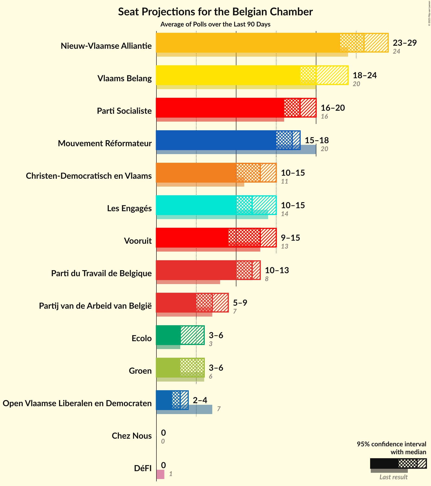
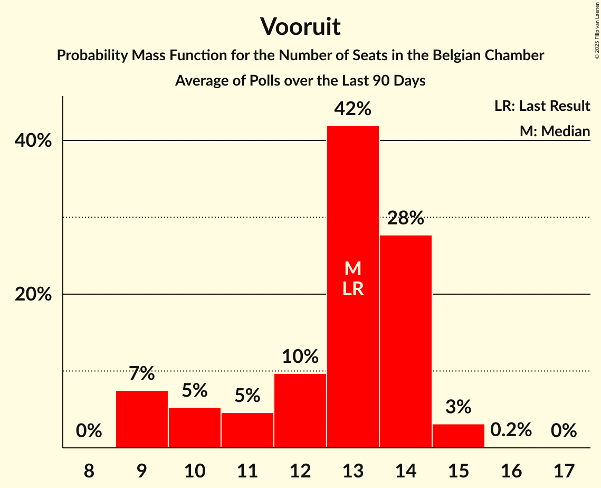
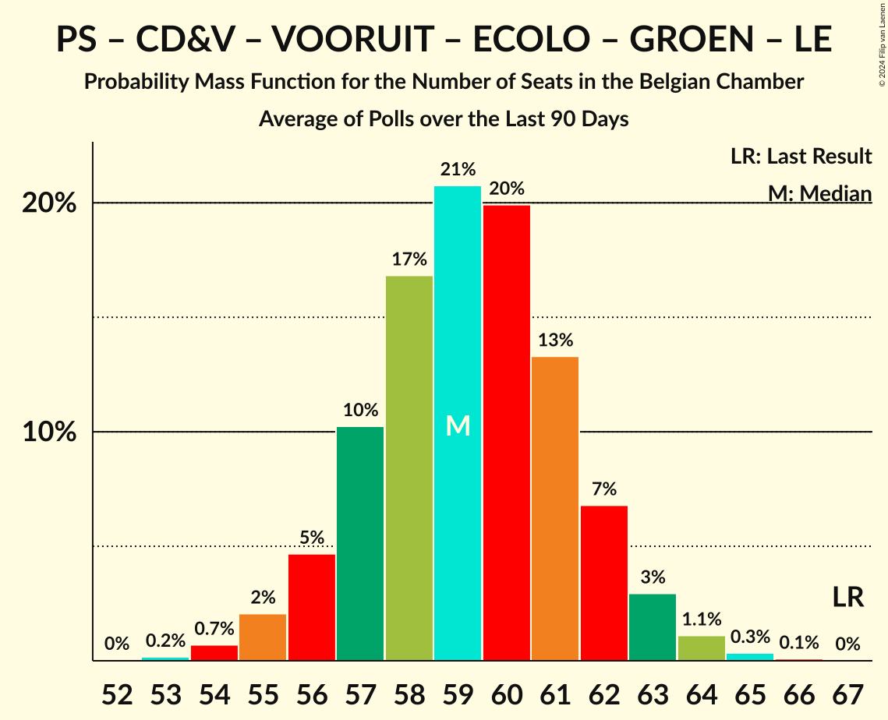
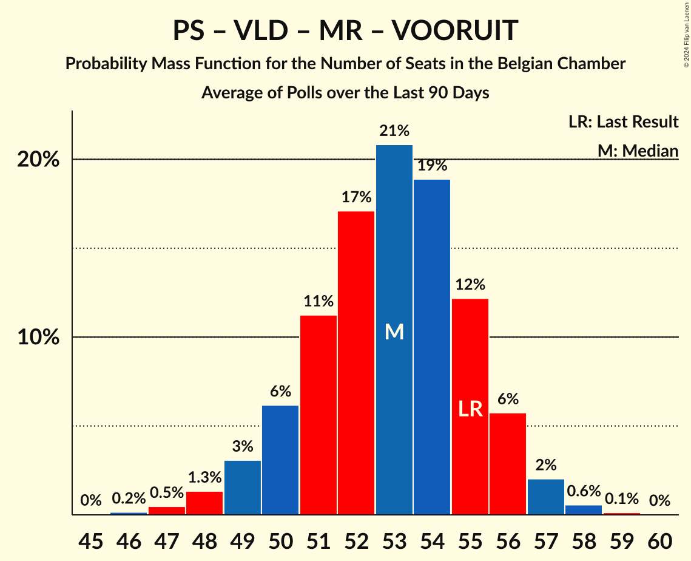
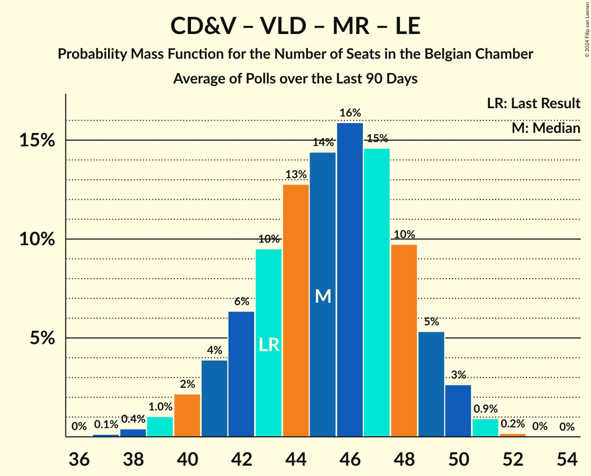

# Poll Average

<a href="#voting-intentions">Voting Intentions</a> | <a href="#seats">Seats</a> | <a href="#coalitions">Coalitions</a> | <a href="#technical-information">Technical Information</a>

## Summary

The table below lists the polls on which the average is based. They are the most recent polls (less than 90 days old) registered and analyzed so far.

| Period     | Polling firm/Commissioner(s) | N-VA | VB | PS | CD&V | PTB | PVDA | VLD | MR | VOORUIT | ECOLO | GROEN | LE | DÉFI | PP |
|:----------:|:----------------------------:|:--:|:--:|:--:|:--:|:--:|:--:|:--:|:--:|:--:|:--:|:--:|:--:|:--:|:--:|
| 26 May 2019 | General Election | 16.0%   25 | 12.0%   18 | 9.5%   20 | 8.9%   12 | 4.8%   9 | 3.3%   3 | 8.5%   12 | 7.6%   14 | 6.7%   9 | 6.1%   13 | 6.1%   8 | 3.7%   5 | 2.2%   2 | 1.1%   0 |
| N/A | Poll Average | 12–13%   18–24 | 12–13%   19–24 | 8–9%   17–21 | 6–7%   6–11 | 6–7%   11–16 | 5–7%   8–10 | 4–6%   4–9 | 6–7%   13–18 | 9–11%   13–18 | 4–5%   9–12 | 4–5%   3–8 | 3%   4–6 | 1–2%   1–2 | N/A   N/A |
| [29 May–6 June 2023](2023-06-06-Ipsos.html) | Ipsos   Het Laatste Nieuws, Le Soir, RTL TVi and VTM | 12–13%   18–24 | 12–13%   19–24 | 8–9%   17–21 | 6–7%   6–11 | 6–7%   11–16 | 5–7%   8–10 | 4–6%   4–9 | 6–7%   13–18 | 9–11%   13–18 | 4–5%   9–12 | 4–5%   3–8 | 3%   4–6 | 1–2%   1–2 | N/A   N/A |
| 26 May 2019 | General Election | 16.0%   25 | 12.0%   18 | 9.5%   20 | 8.9%   12 | 4.8%   9 | 3.3%   3 | 8.5%   12 | 7.6%   14 | 6.7%   9 | 6.1%   13 | 6.1%   8 | 3.7%   5 | 2.2%   2 | 1.1%   0 |

Only polls for which at least the sample size has been published are included in the table above.

**Legend:**
+ **Top half of each row:** Voting intentions (95% confidence interval)
+ **Bottom half of each row:** Seat projections for the Belgian Chamber (95% confidence interval)
+ **N-VA:** Nieuw-Vlaamse Alliantie
+ **VB:** Vlaams Belang
+ **PS:** Parti Socialiste
+ **CD&V:** Christen-Democratisch en Vlaams
+ **PTB:** Parti du Travail de Belgique
+ **PVDA:** Partij van de Arbeid van België
+ **VLD:** Open Vlaamse Liberalen en Democraten
+ **MR:** Mouvement Réformateur
+ **VOORUIT:** Vooruit
+ **ECOLO:** Ecolo
+ **GROEN:** Groen
+ **LE:** Les Engagés
+ **DÉFI:** DéFI
+ **PP:** Parti Populaire
+ **N/A (single party):** Party not included the published results
+ **N/A (entire row):** Calculation for this opinion poll not started yet

## Voting Intentions

### Confidence Intervals

| Party | Last Result | Median | 80% Confidence Interval | 90% Confidence Interval | 95% Confidence Interval | 99% Confidence Interval |
|:-----:|:-----------:|:------:|:-----------------------:|:-----------------------:|:-----------------------:|:-----------------------:|
| <a href="#nieuw-vlaamse-alliantie">Nieuw-Vlaamse Alliantie</a> | 16.0% | 12.5% | 12.0–12.8% |11.8–12.8% | 11.6–12.8% | 11.2–12.8% |
| <a href="#vlaams-belang">Vlaams Belang</a> | 12.0% | 13.1% | 12.5–13.3% |12.3–13.4% | 12.1–13.4% | 11.8–13.4% |
| <a href="#parti-socialiste">Parti Socialiste</a> | 9.5% | 8.5% | 8.3–8.7% |8.2–8.7% | 8.1–8.7% | 7.9–8.7% |
| <a href="#christen-democratisch-en-vlaams">Christen-Democratisch en Vlaams</a> | 8.9% | 6.6% | 5.9–7.2% |5.7–7.3% | 5.5–7.4% | 5.2–7.4% |
| <a href="#open-vlaamse-liberalen-en-democraten">Open Vlaamse Liberalen en Democraten</a> | 8.5% | 5.1% | 4.5–5.6% |4.3–5.7% | 4.1–5.8% | 3.9–5.8% |
| <a href="#mouvement-réformateur">Mouvement Réformateur</a> | 7.6% | 6.9% | 6.6–7.0% |6.5–7.0% | 6.4–7.0% | 6.3–7.0% |
| <a href="#vooruit">Vooruit</a> | 6.7% | 10.3% | 9.5–11.1% |9.2–11.2% | 9.0–11.3% | 8.6–11.4% |
| <a href="#ecolo">Ecolo</a> | 6.1% | 4.7% | 4.5–4.8% |4.4–4.8% | 4.3–4.8% | 4.2–4.8% |
| <a href="#groen">Groen</a> | 6.1% | 4.7% | 4.1–5.2% |3.9–5.3% | 3.8–5.4% | 3.5–5.4% |
| <a href="#parti-du-travail-de-belgique">Parti du Travail de Belgique</a> | 4.8% | 6.4% | 6.2–6.6% |6.1–6.6% | 6.0–6.6% | 5.9–6.6% |
| <a href="#les-engagés">Les Engagés</a> | 3.7% | 3.0% | 2.8–3.1% |2.8–3.1% | 2.7–3.1% | 2.6–3.1% |
| <a href="#partij-van-de-arbeid-van-belgië">Partij van de Arbeid van België</a> | 3.3% | 6.3% | 5.6–6.9% |5.4–7.1% | 5.3–7.1% | 5.0–7.2% |
| <a href="#défi">DéFI</a> | 2.2% | 1.5% | 1.4–1.5% |1.3–1.5% | 1.3–1.5% | 1.2–1.5% |
| <a href="#parti-populaire">Parti Populaire</a> | 1.1% | N/A | N/A |N/A | N/A | N/A |

### Nieuw-Vlaamse Alliantie

*For a full overview of the results for this party, see the [Nieuw-Vlaamse Alliantie](party-nieuw-vlaamsealliantie.html) page.*

| Voting Intentions | Probability | Accumulated | Special Marks |
|:-----------------:|:-----------:|:-----------:|:-------------:|
| 9.5–10.5% | 0% | 100% |  |
| 10.5–11.5% | 2% | 100% |  |
| 11.5–12.5% | 51% | 98% |  |
| 12.5–13.5% | 100% | 47% | Median |
| 13.5–14.5% | 100% | 0% |  |
| 14.5–15.5% | 100% | 0% |  |
| 15.5–16.5% | 10% | 0% | Last Result |
| 16.5–17.5% | 0.3% | 0% |  |

### Vlaams Belang

*For a full overview of the results for this party, see the [Vlaams Belang](party-vlaamsbelang.html) page.*

| Voting Intentions | Probability | Accumulated | Special Marks |
|:-----------------:|:-----------:|:-----------:|:-------------:|
| 9.5–10.5% | 0% | 100% |  |
| 10.5–11.5% | 0.2% | 100% |  |
| 11.5–12.5% | 10% | 99.8% | Last Result |
| 12.5–13.5% | 100% | 89% | Median |
| 13.5–14.5% | 100% | 0% |  |
| 14.5–15.5% | 100% | 0% |  |
| 15.5–16.5% | 47% | 0% |  |
| 16.5–17.5% | 3% | 0% |  |

### Parti Socialiste

*For a full overview of the results for this party, see the [Parti Socialiste](party-partisocialiste.html) page.*

| Voting Intentions | Probability | Accumulated | Special Marks |
|:-----------------:|:-----------:|:-----------:|:-------------:|
| 6.5–7.5% | 0% | 100% |  |
| 7.5–8.5% | 51% | 100% |  |
| 8.5–9.5% | 100% | 49% | Last Result, Median |
| 9.5–10.5% | 100% | 0% |  |
| 10.5–11.5% | 3% | 0% |  |

### Christen-Democratisch en Vlaams

*For a full overview of the results for this party, see the [Christen-Democratisch en Vlaams](party-christen-democratischenvlaams.html) page.*

| Voting Intentions | Probability | Accumulated | Special Marks |
|:-----------------:|:-----------:|:-----------:|:-------------:|
| 3.5–4.5% | 0% | 100% |  |
| 4.5–5.5% | 3% | 100% |  |
| 5.5–6.5% | 44% | 97% |  |
| 6.5–7.5% | 55% | 52% | Median |
| 7.5–8.5% | 8% | 0% |  |
| 8.5–9.5% | 0.2% | 0% | Last Result |

### Open Vlaamse Liberalen en Democraten

*For a full overview of the results for this party, see the [Open Vlaamse Liberalen en Democraten](party-openvlaamseliberalenendemocraten.html) page.*

| Voting Intentions | Probability | Accumulated | Special Marks |
|:-----------------:|:-----------:|:-----------:|:-------------:|
| 2.5–3.5% | 0% | 100% |  |
| 3.5–4.5% | 13% | 100% |  |
| 4.5–5.5% | 72% | 87% | Median |
| 5.5–6.5% | 26% | 15% |  |
| 6.5–7.5% | 1.0% | 0% |  |
| 7.5–8.5% | 0% | 0% |  |
| 8.5–9.5% | 0% | 0% | Last Result |

### Mouvement Réformateur

*For a full overview of the results for this party, see the [Mouvement Réformateur](party-mouvementréformateur.html) page.*

| Voting Intentions | Probability | Accumulated | Special Marks |
|:-----------------:|:-----------:|:-----------:|:-------------:|
| 4.5–5.5% | 0% | 100% |  |
| 5.5–6.5% | 6% | 100% |  |
| 6.5–7.5% | 100% | 94% | Median |
| 7.5–8.5% | 100% | 0% | Last Result |
| 8.5–9.5% | 10% | 0% |  |

### Vooruit

*For a full overview of the results for this party, see the [Vooruit](party-vooruit.html) page.*

| Voting Intentions | Probability | Accumulated | Special Marks |
|:-----------------:|:-----------:|:-----------:|:-------------:|
| 6.5–7.5% | 0% | 100% | Last Result |
| 7.5–8.5% | 0.4% | 100% |  |
| 8.5–9.5% | 12% | 99.6% |  |
| 9.5–10.5% | 51% | 87% | Median |
| 10.5–11.5% | 41% | 36% |  |
| 11.5–12.5% | 7% | 0% |  |
| 12.5–13.5% | 0.3% | 0% |  |

### Ecolo

*For a full overview of the results for this party, see the [Ecolo](party-ecolo.html) page.*

| Voting Intentions | Probability | Accumulated | Special Marks |
|:-----------------:|:-----------:|:-----------:|:-------------:|
| 2.5–3.5% | 0% | 100% |  |
| 3.5–4.5% | 19% | 100% |  |
| 4.5–5.5% | 100% | 81% | Median |
| 5.5–6.5% | 100% | 0% | Last Result |
| 6.5–7.5% | 0.3% | 0% |  |

### Groen

*For a full overview of the results for this party, see the [Groen](party-groen.html) page.*

| Voting Intentions | Probability | Accumulated | Special Marks |
|:-----------------:|:-----------:|:-----------:|:-------------:|
| 1.5–2.5% | 0% | 100% |  |
| 2.5–3.5% | 0.7% | 100% |  |
| 3.5–4.5% | 39% | 99.3% |  |
| 4.5–5.5% | 64% | 60% | Median |
| 5.5–6.5% | 7% | 0% | Last Result |

### Parti du Travail de Belgique

*For a full overview of the results for this party, see the [Parti du Travail de Belgique](party-partidutravaildebelgique.html) page.*

| Voting Intentions | Probability | Accumulated | Special Marks |
|:-----------------:|:-----------:|:-----------:|:-------------:|
| 4.5–5.5% | 0% | 100% | Last Result |
| 5.5–6.5% | 86% | 100% | Median |
| 6.5–7.5% | 100% | 14% |  |
| 7.5–8.5% | 100% | 0% |  |
| 8.5–9.5% | 0.4% | 0% |  |

### Les Engagés

*For a full overview of the results for this party, see the [Les Engagés](party-lesengagés.html) page.*

| Voting Intentions | Probability | Accumulated | Special Marks |
|:-----------------:|:-----------:|:-----------:|:-------------:|
| 0.5–1.5% | 0% | 100% |  |
| 1.5–2.5% | 0.3% | 100% |  |
| 2.5–3.5% | 100% | 99.7% | Median |
| 3.5–4.5% | 100% | 0% | Last Result |
| 4.5–5.5% | 0.8% | 0% |  |

### Partij van de Arbeid van België

*For a full overview of the results for this party, see the [Partij van de Arbeid van België](party-partijvandearbeidvanbelgië.html) page.*

| Voting Intentions | Probability | Accumulated | Special Marks |
|:-----------------:|:-----------:|:-----------:|:-------------:|
| 2.5–3.5% | 0% | 100% | Last Result |
| 3.5–4.5% | 0% | 100% |  |
| 4.5–5.5% | 8% | 100% |  |
| 5.5–6.5% | 58% | 92% | Median |
| 6.5–7.5% | 41% | 34% |  |
| 7.5–8.5% | 4% | 0% |  |

### DéFI

*For a full overview of the results for this party, see the [DéFI](party-défi.html) page.*

| Voting Intentions | Probability | Accumulated | Special Marks |
|:-----------------:|:-----------:|:-----------:|:-------------:|
| 0.0–0.5% | 0% | 100% |  |
| 0.5–1.5% | 100% | 100% | Median |
| 1.5–2.5% | 100% | 0% | Last Result |
| 2.5–3.5% | 0.8% | 0% |  |

## Seats

### Confidence Intervals

| Party | Last Result | Median | 80% Confidence Interval | 90% Confidence Interval | 95% Confidence Interval | 99% Confidence Interval |
|:-----:|:-----------:|:------:|:-----------------------:|:-----------------------:|:-----------------------:|:-----------------------:|
| <a href="#nieuw-vlaamse-alliantie">Nieuw-Vlaamse Alliantie</a> | 25 | 20 | 19–22 |19–23 | 18–24 | 17–25 |
| <a href="#vlaams-belang">Vlaams Belang</a> | 18 | 21 | 20–23 |19–24 | 19–24 | 18–25 |
| <a href="#parti-socialiste">Parti Socialiste</a> | 20 | 19 | 18–21 |17–21 | 17–21 | 16–21 |
| <a href="#christen-democratisch-en-vlaams">Christen-Democratisch en Vlaams</a> | 12 | 10 | 8–10 |7–10 | 6–11 | 6–11 |
| <a href="#open-vlaamse-liberalen-en-democraten">Open Vlaamse Liberalen en Democraten</a> | 12 | 6 | 5–8 |4–8 | 4–9 | 3–9 |
| <a href="#mouvement-réformateur">Mouvement Réformateur</a> | 14 | 15 | 14–16 |13–17 | 13–18 | 13–19 |
| <a href="#vooruit">Vooruit</a> | 9 | 15 | 14–17 |13–17 | 13–18 | 12–19 |
| <a href="#ecolo">Ecolo</a> | 13 | 10 | 9–11 |9–11 | 9–12 | 8–12 |
| <a href="#groen">Groen</a> | 8 | 5 | 5–7 |3–7 | 3–8 | 3–9 |
| <a href="#parti-du-travail-de-belgique">Parti du Travail de Belgique</a> | 9 | 13 | 12–15 |12–15 | 11–16 | 11–17 |
| <a href="#les-engagés">Les Engagés</a> | 5 | 4 | 4–5 |4–6 | 4–6 | 4–8 |
| <a href="#partij-van-de-arbeid-van-belgië">Partij van de Arbeid van België</a> | 3 | 8 | 8–9 |8–10 | 8–10 | 6–11 |
| <a href="#défi">DéFI</a> | 2 | 1 | 1–2 |1–2 | 1–2 | 1–2 |
| <a href="#parti-populaire">Parti Populaire</a> | 0 | N/A | N/A |N/A | N/A | N/A |

### Nieuw-Vlaamse Alliantie

*For a full overview of the results for this party, see the [Nieuw-Vlaamse Alliantie](party-nieuw-vlaamsealliantie.html) page.*

| Number of Seats | Probability | Accumulated | Special Marks |
|:---------------:|:-----------:|:-----------:|:-------------:|
| 16 | 0.2% | 100% |  |
| 17 | 0.8% | 99.8% |  |
| 18 | 3% | 99.0% |  |
| 19 | 14% | 96% |  |
| 20 | 39% | 82% | Median |
| 21 | 18% | 43% |  |
| 22 | 16% | 25% |  |
| 23 | 5% | 9% |  |
| 24 | 3% | 4% |  |
| 25 | 0.9% | 1.0% | Last Result |
| 26 | 0.1% | 0.1% |  |
| 27 | 0% | 0% |  |

### Vlaams Belang

*For a full overview of the results for this party, see the [Vlaams Belang](party-vlaamsbelang.html) page.*

| Number of Seats | Probability | Accumulated | Special Marks |
|:---------------:|:-----------:|:-----------:|:-------------:|
| 17 | 0.2% | 100% |  |
| 18 | 0.7% | 99.8% | Last Result |
| 19 | 6% | 99.1% |  |
| 20 | 14% | 93% |  |
| 21 | 41% | 79% | Median |
| 22 | 24% | 39% |  |
| 23 | 8% | 15% |  |
| 24 | 5% | 7% |  |
| 25 | 2% | 2% |  |
| 26 | 0.3% | 0.3% |  |
| 27 | 0% | 0% |  |

### Parti Socialiste

*For a full overview of the results for this party, see the [Parti Socialiste](party-partisocialiste.html) page.*

| Number of Seats | Probability | Accumulated | Special Marks |
|:---------------:|:-----------:|:-----------:|:-------------:|
| 16 | 0.7% | 100% |  |
| 17 | 5% | 99.3% |  |
| 18 | 23% | 94% |  |
| 19 | 30% | 72% | Median |
| 20 | 29% | 42% | Last Result |
| 21 | 13% | 13% |  |
| 22 | 0.1% | 0.1% |  |
| 23 | 0% | 0% |  |

### Christen-Democratisch en Vlaams

*For a full overview of the results for this party, see the [Christen-Democratisch en Vlaams](party-christen-democratischenvlaams.html) page.*

| Number of Seats | Probability | Accumulated | Special Marks |
|:---------------:|:-----------:|:-----------:|:-------------:|
| 5 | 0.5% | 100% |  |
| 6 | 3% | 99.5% |  |
| 7 | 3% | 96% |  |
| 8 | 12% | 93% |  |
| 9 | 13% | 80% |  |
| 10 | 65% | 67% | Median |
| 11 | 2% | 3% |  |
| 12 | 0.3% | 0.4% | Last Result |
| 13 | 0.1% | 0.1% |  |
| 14 | 0% | 0% |  |

### Open Vlaamse Liberalen en Democraten

*For a full overview of the results for this party, see the [Open Vlaamse Liberalen en Democraten](party-openvlaamseliberalenendemocraten.html) page.*

| Number of Seats | Probability | Accumulated | Special Marks |
|:---------------:|:-----------:|:-----------:|:-------------:|
| 3 | 0.6% | 100% |  |
| 4 | 6% | 99.4% |  |
| 5 | 5% | 93% |  |
| 6 | 56% | 88% | Median |
| 7 | 21% | 32% |  |
| 8 | 9% | 11% |  |
| 9 | 2% | 3% |  |
| 10 | 0.4% | 0.4% |  |
| 11 | 0% | 0% |  |
| 12 | 0% | 0% | Last Result |

### Mouvement Réformateur

*For a full overview of the results for this party, see the [Mouvement Réformateur](party-mouvementréformateur.html) page.*

| Number of Seats | Probability | Accumulated | Special Marks |
|:---------------:|:-----------:|:-----------:|:-------------:|
| 12 | 0.3% | 100% |  |
| 13 | 6% | 99.7% |  |
| 14 | 30% | 94% | Last Result |
| 15 | 41% | 64% | Median |
| 16 | 15% | 23% |  |
| 17 | 5% | 8% |  |
| 18 | 2% | 3% |  |
| 19 | 0.6% | 0.6% |  |
| 20 | 0% | 0% |  |

### Vooruit

*For a full overview of the results for this party, see the [Vooruit](party-vooruit.html) page.*

| Number of Seats | Probability | Accumulated | Special Marks |
|:---------------:|:-----------:|:-----------:|:-------------:|
| 9 | 0% | 100% | Last Result |
| 10 | 0% | 100% |  |
| 11 | 0.2% | 100% |  |
| 12 | 2% | 99.8% |  |
| 13 | 4% | 98% |  |
| 14 | 8% | 93% |  |
| 15 | 40% | 85% | Median |
| 16 | 22% | 45% |  |
| 17 | 19% | 23% |  |
| 18 | 3% | 4% |  |
| 19 | 0.7% | 0.8% |  |
| 20 | 0.1% | 0.1% |  |
| 21 | 0% | 0% |  |

### Ecolo

*For a full overview of the results for this party, see the [Ecolo](party-ecolo.html) page.*

| Number of Seats | Probability | Accumulated | Special Marks |
|:---------------:|:-----------:|:-----------:|:-------------:|
| 7 | 0.2% | 100% |  |
| 8 | 0.9% | 99.8% |  |
| 9 | 16% | 98.9% |  |
| 10 | 53% | 83% | Median |
| 11 | 26% | 30% |  |
| 12 | 3% | 4% |  |
| 13 | 0.4% | 0.4% | Last Result |
| 14 | 0% | 0% |  |

### Groen

*For a full overview of the results for this party, see the [Groen](party-groen.html) page.*

| Number of Seats | Probability | Accumulated | Special Marks |
|:---------------:|:-----------:|:-----------:|:-------------:|
| 3 | 6% | 100% |  |
| 4 | 3% | 94% |  |
| 5 | 55% | 91% | Median |
| 6 | 16% | 36% |  |
| 7 | 18% | 21% |  |
| 8 | 2% | 3% | Last Result |
| 9 | 0.9% | 0.9% |  |
| 10 | 0% | 0% |  |

### Parti du Travail de Belgique

*For a full overview of the results for this party, see the [Parti du Travail de Belgique](party-partidutravaildebelgique.html) page.*

| Number of Seats | Probability | Accumulated | Special Marks |
|:---------------:|:-----------:|:-----------:|:-------------:|
| 9 | 0% | 100% | Last Result |
| 10 | 0.1% | 100% |  |
| 11 | 3% | 99.9% |  |
| 12 | 36% | 97% |  |
| 13 | 32% | 61% | Median |
| 14 | 17% | 29% |  |
| 15 | 8% | 13% |  |
| 16 | 4% | 5% |  |
| 17 | 0.8% | 0.8% |  |
| 18 | 0% | 0% |  |

### Les Engagés

*For a full overview of the results for this party, see the [Les Engagés](party-lesengagés.html) page.*

| Number of Seats | Probability | Accumulated | Special Marks |
|:---------------:|:-----------:|:-----------:|:-------------:|
| 4 | 66% | 100% | Median |
| 5 | 27% | 34% | Last Result |
| 6 | 4% | 7% |  |
| 7 | 2% | 2% |  |
| 8 | 0.5% | 0.6% |  |
| 9 | 0.1% | 0.1% |  |
| 10 | 0% | 0% |  |

### Partij van de Arbeid van België

*For a full overview of the results for this party, see the [Partij van de Arbeid van België](party-partijvandearbeidvanbelgië.html) page.*

| Number of Seats | Probability | Accumulated | Special Marks |
|:---------------:|:-----------:|:-----------:|:-------------:|
| 3 | 0% | 100% | Last Result |
| 4 | 0% | 100% |  |
| 5 | 0.3% | 100% |  |
| 6 | 0.4% | 99.7% |  |
| 7 | 2% | 99.3% |  |
| 8 | 59% | 98% | Median |
| 9 | 29% | 39% |  |
| 10 | 8% | 10% |  |
| 11 | 1.3% | 2% |  |
| 12 | 0.3% | 0.4% |  |
| 13 | 0.1% | 0.1% |  |
| 14 | 0% | 0% |  |

### DéFI

*For a full overview of the results for this party, see the [DéFI](party-défi.html) page.*

| Number of Seats | Probability | Accumulated | Special Marks |
|:---------------:|:-----------:|:-----------:|:-------------:|
| 1 | 80% | 100% | Median |
| 2 | 19% | 20% | Last Result |
| 3 | 0.3% | 0.3% |  |
| 4 | 0% | 0% |  |

### Parti Populaire

*For a full overview of the results for this party, see the [Parti Populaire](party-partipopulaire.html) page.*

## Coalitions

### Confidence Intervals

| Coalition | Last Result | Median | Majority? | 80% Confidence Interval | 90% Confidence Interval | 95% Confidence Interval | 99% Confidence Interval |
|:---------:|:-----------:|:------:|:---------:|:-----------------------:|:-----------------------:|:-----------------------:|:-----------------------:|
| Parti Socialiste – Christen-Democratisch en Vlaams – Open Vlaamse Liberalen en Democraten – Mouvement Réformateur – Vooruit – Ecolo – Groen – Les Engagés | 93 | 86 | 100% | 83–88 | 82–88 | 81–89 | 79–90 |
| Parti Socialiste – Christen-Democratisch en Vlaams – Vooruit – Ecolo – Groen – Parti du Travail de Belgique – Les Engagés – Partij van de Arbeid van België | 79 | 86 | 100% | 83–88 | 82–89 | 81–89 | 80–90 |
| Parti Socialiste – Christen-Democratisch en Vlaams – Open Vlaamse Liberalen en Democraten – Mouvement Réformateur – Vooruit – Ecolo – Groen | 88 | 81 | 98.9% | 78–83 | 77–84 | 76–85 | 75–86 |
| Nieuw-Vlaamse Alliantie – Parti Socialiste – Open Vlaamse Liberalen en Democraten – Mouvement Réformateur – Vooruit | 80 | 76 | 69% | 74–79 | 73–80 | 72–81 | 71–82 |
| Parti Socialiste – Vooruit – Ecolo – Groen – Parti du Travail de Belgique – Les Engagés – Partij van de Arbeid van België | 67 | 76 | 67% | 74–79 | 73–79 | 72–80 | 71–81 |
| Parti Socialiste – Vooruit – Ecolo – Groen – Parti du Travail de Belgique – Partij van de Arbeid van België | 62 | 72 | 3% | 69–74 | 68–75 | 67–76 | 66–77 |
| Parti Socialiste – Open Vlaamse Liberalen en Democraten – Mouvement Réformateur – Vooruit – Ecolo – Groen | 76 | 72 | 2% | 69–74 | 68–75 | 67–75 | 65–77 |
| Parti Socialiste – Christen-Democratisch en Vlaams – Open Vlaamse Liberalen en Democraten – Mouvement Réformateur – Vooruit – Les Engagés | 72 | 70 | 0.1% | 67–72 | 66–73 | 66–73 | 64–75 |
| Parti Socialiste – Christen-Democratisch en Vlaams – Vooruit – Ecolo – Groen – Les Engagés | 67 | 64 | 0% | 61–67 | 60–67 | 60–68 | 58–69 |
| Nieuw-Vlaamse Alliantie – Christen-Democratisch en Vlaams – Open Vlaamse Liberalen en Democraten – Mouvement Réformateur – Les Engagés | 68 | 56 | 0% | 53–58 | 52–59 | 52–60 | 50–61 |
| Parti Socialiste – Open Vlaamse Liberalen en Democraten – Mouvement Réformateur – Vooruit | 55 | 56 | 0% | 53–58 | 53–59 | 52–59 | 51–61 |
| Parti Socialiste – Christen-Democratisch en Vlaams – Open Vlaamse Liberalen en Democraten – Mouvement Réformateur – Les Engagés | 63 | 54 | 0% | 52–56 | 51–57 | 50–58 | 49–59 |
| Nieuw-Vlaamse Alliantie – Christen-Democratisch en Vlaams – Open Vlaamse Liberalen en Democraten – Mouvement Réformateur | 63 | 51 | 0% | 49–54 | 48–54 | 47–55 | 46–57 |
| Christen-Democratisch en Vlaams – Open Vlaamse Liberalen en Democraten – Mouvement Réformateur – Ecolo – Groen – Les Engagés | 64 | 51 | 0% | 48–53 | 47–54 | 46–55 | 45–56 |
| Parti Socialiste – Christen-Democratisch en Vlaams – Vooruit – Les Engagés | 46 | 49 | 0% | 46–51 | 45–52 | 44–52 | 43–53 |
| Christen-Democratisch en Vlaams – Open Vlaamse Liberalen en Democraten – Mouvement Réformateur – Les Engagés | 43 | 35 | 0% | 33–37 | 32–38 | 31–39 | 30–40 |

### Parti Socialiste – Christen-Democratisch en Vlaams – Open Vlaamse Liberalen en Democraten – Mouvement Réformateur – Vooruit – Ecolo – Groen – Les Engagés

| Number of Seats | Probability | Accumulated | Special Marks |
|:---------------:|:-----------:|:-----------:|:-------------:|
| 77 | 0% | 100% |  |
| 78 | 0.1% | 99.9% |  |
| 79 | 0.4% | 99.8% |  |
| 80 | 1.1% | 99.4% |  |
| 81 | 3% | 98% |  |
| 82 | 5% | 96% |  |
| 83 | 9% | 90% |  |
| 84 | 14% | 81% | Median |
| 85 | 17% | 67% |  |
| 86 | 19% | 50% |  |
| 87 | 17% | 31% |  |
| 88 | 11% | 15% |  |
| 89 | 3% | 4% |  |
| 90 | 0.8% | 1.1% |  |
| 91 | 0.2% | 0.3% |  |
| 92 | 0% | 0% |  |
| 93 | 0% | 0% | Last Result |

### Parti Socialiste – Christen-Democratisch en Vlaams – Vooruit – Ecolo – Groen – Parti du Travail de Belgique – Les Engagés – Partij van de Arbeid van België

| Number of Seats | Probability | Accumulated | Special Marks |
|:---------------:|:-----------:|:-----------:|:-------------:|
| 78 | 0.1% | 100% |  |
| 79 | 0.3% | 99.9% | Last Result |
| 80 | 0.7% | 99.6% |  |
| 81 | 2% | 98.9% |  |
| 82 | 4% | 97% |  |
| 83 | 8% | 93% |  |
| 84 | 13% | 85% | Median |
| 85 | 17% | 72% |  |
| 86 | 18% | 55% |  |
| 87 | 17% | 37% |  |
| 88 | 12% | 19% |  |
| 89 | 5% | 7% |  |
| 90 | 1.4% | 2% |  |
| 91 | 0.3% | 0.4% |  |
| 92 | 0.1% | 0.1% |  |
| 93 | 0% | 0% |  |

### Parti Socialiste – Christen-Democratisch en Vlaams – Open Vlaamse Liberalen en Democraten – Mouvement Réformateur – Vooruit – Ecolo – Groen

| Number of Seats | Probability | Accumulated | Special Marks |
|:---------------:|:-----------:|:-----------:|:-------------:|
| 73 | 0.1% | 100% |  |
| 74 | 0.3% | 99.9% |  |
| 75 | 0.7% | 99.6% |  |
| 76 | 2% | 98.9% | Majority |
| 77 | 4% | 97% |  |
| 78 | 7% | 93% |  |
| 79 | 11% | 87% |  |
| 80 | 16% | 75% | Median |
| 81 | 18% | 60% |  |
| 82 | 18% | 42% |  |
| 83 | 14% | 24% |  |
| 84 | 7% | 10% |  |
| 85 | 2% | 3% |  |
| 86 | 0.5% | 0.7% |  |
| 87 | 0.1% | 0.2% |  |
| 88 | 0% | 0% | Last Result |

### Nieuw-Vlaamse Alliantie – Parti Socialiste – Open Vlaamse Liberalen en Democraten – Mouvement Réformateur – Vooruit

| Number of Seats | Probability | Accumulated | Special Marks |
|:---------------:|:-----------:|:-----------:|:-------------:|
| 69 | 0.1% | 100% |  |
| 70 | 0.2% | 99.9% |  |
| 71 | 0.7% | 99.7% |  |
| 72 | 2% | 99.0% |  |
| 73 | 4% | 97% |  |
| 74 | 9% | 93% |  |
| 75 | 15% | 84% | Median |
| 76 | 20% | 69% | Majority |
| 77 | 20% | 49% |  |
| 78 | 14% | 30% |  |
| 79 | 8% | 15% |  |
| 80 | 4% | 7% | Last Result |
| 81 | 2% | 3% |  |
| 82 | 0.6% | 0.9% |  |
| 83 | 0.2% | 0.2% |  |
| 84 | 0% | 0% |  |

### Parti Socialiste – Vooruit – Ecolo – Groen – Parti du Travail de Belgique – Les Engagés – Partij van de Arbeid van België

| Number of Seats | Probability | Accumulated | Special Marks |
|:---------------:|:-----------:|:-----------:|:-------------:|
| 67 | 0% | 100% | Last Result |
| 68 | 0% | 100% |  |
| 69 | 0.1% | 100% |  |
| 70 | 0.3% | 99.9% |  |
| 71 | 0.9% | 99.6% |  |
| 72 | 2% | 98.7% |  |
| 73 | 5% | 96% |  |
| 74 | 9% | 91% | Median |
| 75 | 15% | 82% |  |
| 76 | 19% | 67% | Majority |
| 77 | 20% | 48% |  |
| 78 | 16% | 28% |  |
| 79 | 8% | 12% |  |
| 80 | 3% | 4% |  |
| 81 | 0.9% | 1.2% |  |
| 82 | 0.2% | 0.3% |  |
| 83 | 0.1% | 0.1% |  |
| 84 | 0% | 0% |  |

### Parti Socialiste – Vooruit – Ecolo – Groen – Parti du Travail de Belgique – Partij van de Arbeid van België

| Number of Seats | Probability | Accumulated | Special Marks |
|:---------------:|:-----------:|:-----------:|:-------------:|
| 62 | 0% | 100% | Last Result |
| 63 | 0% | 100% |  |
| 64 | 0.1% | 100% |  |
| 65 | 0.2% | 99.9% |  |
| 66 | 0.6% | 99.7% |  |
| 67 | 2% | 99.1% |  |
| 68 | 4% | 97% |  |
| 69 | 7% | 94% |  |
| 70 | 12% | 87% | Median |
| 71 | 16% | 75% |  |
| 72 | 19% | 59% |  |
| 73 | 18% | 40% |  |
| 74 | 13% | 21% |  |
| 75 | 6% | 9% |  |
| 76 | 2% | 3% | Majority |
| 77 | 0.6% | 0.8% |  |
| 78 | 0.2% | 0.2% |  |
| 79 | 0% | 0% |  |

### Parti Socialiste – Open Vlaamse Liberalen en Democraten – Mouvement Réformateur – Vooruit – Ecolo – Groen

| Number of Seats | Probability | Accumulated | Special Marks |
|:---------------:|:-----------:|:-----------:|:-------------:|
| 64 | 0.1% | 100% |  |
| 65 | 0.4% | 99.8% |  |
| 66 | 1.0% | 99.5% |  |
| 67 | 2% | 98% |  |
| 68 | 5% | 96% |  |
| 69 | 8% | 91% |  |
| 70 | 13% | 83% | Median |
| 71 | 17% | 70% |  |
| 72 | 20% | 54% |  |
| 73 | 18% | 34% |  |
| 74 | 10% | 16% |  |
| 75 | 4% | 6% |  |
| 76 | 1.3% | 2% | Last Result, Majority |
| 77 | 0.4% | 0.5% |  |
| 78 | 0.1% | 0.1% |  |
| 79 | 0% | 0% |  |

### Parti Socialiste – Christen-Democratisch en Vlaams – Open Vlaamse Liberalen en Democraten – Mouvement Réformateur – Vooruit – Les Engagés

| Number of Seats | Probability | Accumulated | Special Marks |
|:---------------:|:-----------:|:-----------:|:-------------:|
| 62 | 0.1% | 100% |  |
| 63 | 0.2% | 99.9% |  |
| 64 | 0.6% | 99.7% |  |
| 65 | 2% | 99.1% |  |
| 66 | 4% | 98% |  |
| 67 | 7% | 94% |  |
| 68 | 13% | 86% |  |
| 69 | 18% | 74% | Median |
| 70 | 20% | 56% |  |
| 71 | 17% | 36% |  |
| 72 | 11% | 19% | Last Result |
| 73 | 5% | 8% |  |
| 74 | 2% | 2% |  |
| 75 | 0.5% | 0.6% |  |
| 76 | 0.1% | 0.1% | Majority |
| 77 | 0% | 0% |  |

### Parti Socialiste – Christen-Democratisch en Vlaams – Vooruit – Ecolo – Groen – Les Engagés

| Number of Seats | Probability | Accumulated | Special Marks |
|:---------------:|:-----------:|:-----------:|:-------------:|
| 56 | 0% | 100% |  |
| 57 | 0.2% | 99.9% |  |
| 58 | 0.5% | 99.8% |  |
| 59 | 1.3% | 99.3% |  |
| 60 | 3% | 98% |  |
| 61 | 6% | 95% |  |
| 62 | 10% | 89% |  |
| 63 | 15% | 79% | Median |
| 64 | 18% | 64% |  |
| 65 | 19% | 45% |  |
| 66 | 14% | 27% |  |
| 67 | 9% | 13% | Last Result |
| 68 | 3% | 4% |  |
| 69 | 0.6% | 0.9% |  |
| 70 | 0.2% | 0.2% |  |
| 71 | 0% | 0.1% |  |
| 72 | 0% | 0% |  |

### Nieuw-Vlaamse Alliantie – Christen-Democratisch en Vlaams – Open Vlaamse Liberalen en Democraten – Mouvement Réformateur – Les Engagés

| Number of Seats | Probability | Accumulated | Special Marks |
|:---------------:|:-----------:|:-----------:|:-------------:|
| 48 | 0% | 100% |  |
| 49 | 0.1% | 99.9% |  |
| 50 | 0.5% | 99.8% |  |
| 51 | 1.3% | 99.3% |  |
| 52 | 3% | 98% |  |
| 53 | 7% | 95% |  |
| 54 | 15% | 87% |  |
| 55 | 22% | 72% | Median |
| 56 | 20% | 51% |  |
| 57 | 14% | 30% |  |
| 58 | 9% | 16% |  |
| 59 | 4% | 8% |  |
| 60 | 2% | 3% |  |
| 61 | 0.8% | 1.2% |  |
| 62 | 0.3% | 0.4% |  |
| 63 | 0.1% | 0.1% |  |
| 64 | 0% | 0% |  |
| 65 | 0% | 0% |  |
| 66 | 0% | 0% |  |
| 67 | 0% | 0% |  |
| 68 | 0% | 0% | Last Result |

### Parti Socialiste – Open Vlaamse Liberalen en Democraten – Mouvement Réformateur – Vooruit

| Number of Seats | Probability | Accumulated | Special Marks |
|:---------------:|:-----------:|:-----------:|:-------------:|
| 49 | 0.1% | 100% |  |
| 50 | 0.4% | 99.9% |  |
| 51 | 1.1% | 99.5% |  |
| 52 | 3% | 98% |  |
| 53 | 6% | 95% |  |
| 54 | 12% | 89% |  |
| 55 | 17% | 77% | Last Result, Median |
| 56 | 21% | 60% |  |
| 57 | 19% | 39% |  |
| 58 | 12% | 19% |  |
| 59 | 5% | 8% |  |
| 60 | 2% | 2% |  |
| 61 | 0.5% | 0.7% |  |
| 62 | 0.1% | 0.2% |  |
| 63 | 0% | 0% |  |

### Parti Socialiste – Christen-Democratisch en Vlaams – Open Vlaamse Liberalen en Democraten – Mouvement Réformateur – Les Engagés

| Number of Seats | Probability | Accumulated | Special Marks |
|:---------------:|:-----------:|:-----------:|:-------------:|
| 47 | 0.1% | 100% |  |
| 48 | 0.2% | 99.9% |  |
| 49 | 0.8% | 99.7% |  |
| 50 | 2% | 98.9% |  |
| 51 | 5% | 97% |  |
| 52 | 9% | 92% |  |
| 53 | 15% | 83% |  |
| 54 | 21% | 67% | Median |
| 55 | 22% | 47% |  |
| 56 | 15% | 25% |  |
| 57 | 6% | 10% |  |
| 58 | 2% | 3% |  |
| 59 | 0.7% | 0.9% |  |
| 60 | 0.2% | 0.2% |  |
| 61 | 0% | 0% |  |
| 62 | 0% | 0% |  |
| 63 | 0% | 0% | Last Result |

### Nieuw-Vlaamse Alliantie – Christen-Democratisch en Vlaams – Open Vlaamse Liberalen en Democraten – Mouvement Réformateur

| Number of Seats | Probability | Accumulated | Special Marks |
|:---------------:|:-----------:|:-----------:|:-------------:|
| 44 | 0.1% | 100% |  |
| 45 | 0.2% | 99.9% |  |
| 46 | 0.7% | 99.7% |  |
| 47 | 2% | 99.0% |  |
| 48 | 4% | 97% |  |
| 49 | 10% | 93% |  |
| 50 | 19% | 83% |  |
| 51 | 24% | 65% | Median |
| 52 | 19% | 41% |  |
| 53 | 11% | 22% |  |
| 54 | 6% | 11% |  |
| 55 | 3% | 5% |  |
| 56 | 1.2% | 2% |  |
| 57 | 0.4% | 0.6% |  |
| 58 | 0.1% | 0.2% |  |
| 59 | 0% | 0.1% |  |
| 60 | 0% | 0% |  |
| 61 | 0% | 0% |  |
| 62 | 0% | 0% |  |
| 63 | 0% | 0% | Last Result |

### Christen-Democratisch en Vlaams – Open Vlaamse Liberalen en Democraten – Mouvement Réformateur – Ecolo – Groen – Les Engagés

| Number of Seats | Probability | Accumulated | Special Marks |
|:---------------:|:-----------:|:-----------:|:-------------:|
| 43 | 0.1% | 100% |  |
| 44 | 0.2% | 99.9% |  |
| 45 | 0.6% | 99.7% |  |
| 46 | 2% | 99.1% |  |
| 47 | 4% | 97% |  |
| 48 | 8% | 93% |  |
| 49 | 13% | 85% |  |
| 50 | 18% | 72% | Median |
| 51 | 19% | 54% |  |
| 52 | 16% | 35% |  |
| 53 | 11% | 19% |  |
| 54 | 5% | 8% |  |
| 55 | 2% | 3% |  |
| 56 | 0.7% | 0.9% |  |
| 57 | 0.2% | 0.2% |  |
| 58 | 0% | 0% |  |
| 59 | 0% | 0% |  |
| 60 | 0% | 0% |  |
| 61 | 0% | 0% |  |
| 62 | 0% | 0% |  |
| 63 | 0% | 0% |  |
| 64 | 0% | 0% | Last Result |

### Parti Socialiste – Christen-Democratisch en Vlaams – Vooruit – Les Engagés

| Number of Seats | Probability | Accumulated | Special Marks |
|:---------------:|:-----------:|:-----------:|:-------------:|
| 41 | 0.1% | 100% |  |
| 42 | 0.2% | 99.9% |  |
| 43 | 0.7% | 99.7% |  |
| 44 | 2% | 99.0% |  |
| 45 | 4% | 97% |  |
| 46 | 8% | 94% | Last Result |
| 47 | 14% | 86% |  |
| 48 | 20% | 71% | Median |
| 49 | 21% | 52% |  |
| 50 | 16% | 31% |  |
| 51 | 9% | 14% |  |
| 52 | 4% | 6% |  |
| 53 | 1.3% | 2% |  |
| 54 | 0.3% | 0.3% |  |
| 55 | 0% | 0.1% |  |
| 56 | 0% | 0% |  |

### Christen-Democratisch en Vlaams – Open Vlaamse Liberalen en Democraten – Mouvement Réformateur – Les Engagés

| Number of Seats | Probability | Accumulated | Special Marks |
|:---------------:|:-----------:|:-----------:|:-------------:|
| 28 | 0% | 100% |  |
| 29 | 0.2% | 99.9% |  |
| 30 | 0.8% | 99.7% |  |
| 31 | 2% | 98.9% |  |
| 32 | 5% | 97% |  |
| 33 | 11% | 91% |  |
| 34 | 18% | 81% |  |
| 35 | 25% | 63% | Median |
| 36 | 18% | 38% |  |
| 37 | 11% | 20% |  |
| 38 | 6% | 9% |  |
| 39 | 2% | 4% |  |
| 40 | 0.8% | 1.2% |  |
| 41 | 0.2% | 0.3% |  |
| 42 | 0.1% | 0.1% |  |
| 43 | 0% | 0% | Last Result |

## Technical Information

+ **Number of polls included in this average:** 1
+ **Lowest number of simulations done in a poll included in this average:** 1,048,576
+ **Total number of simulations done in the polls included in this average:** 1,048,576
+ **Error estimate:** 0.85%
