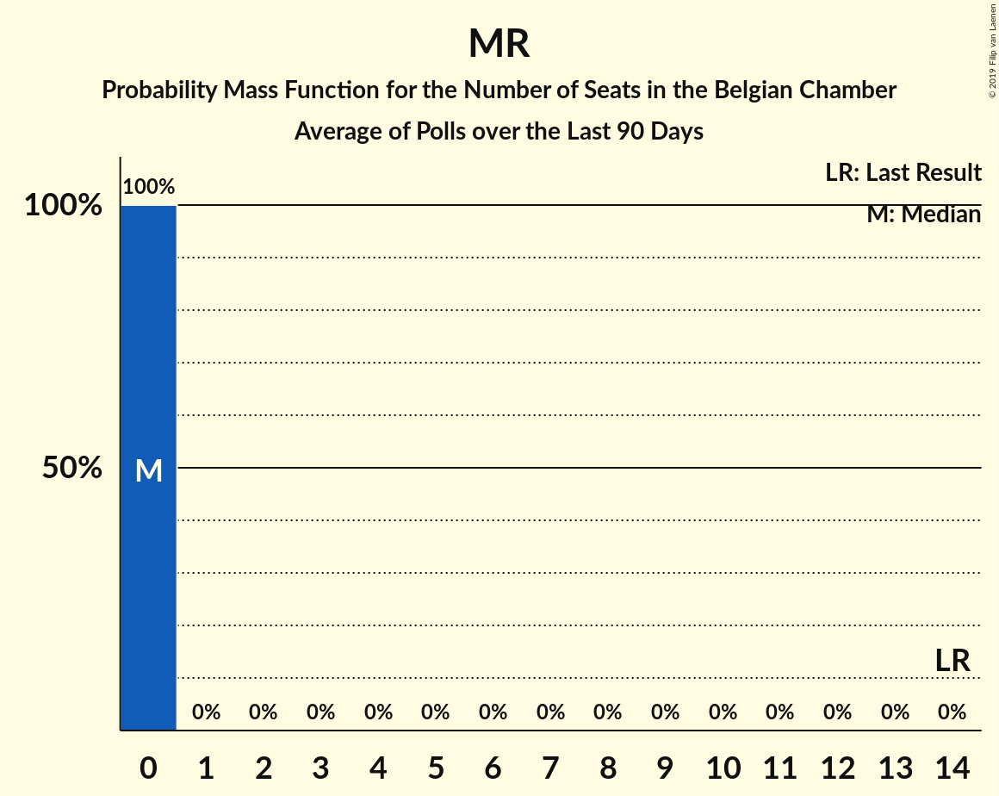
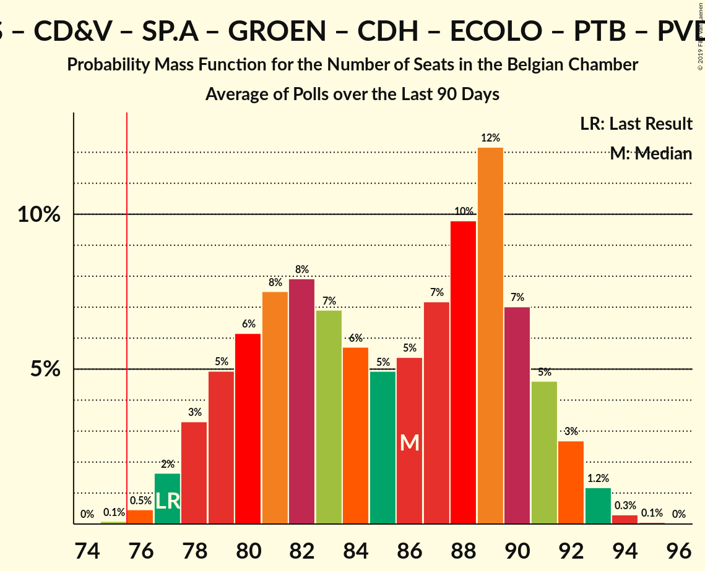
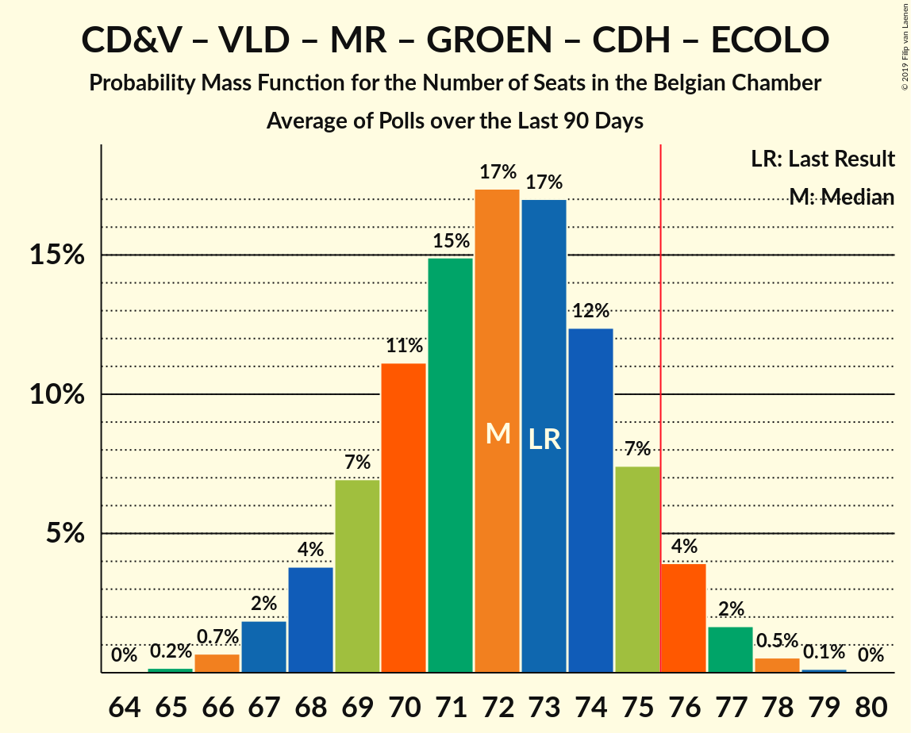

# Poll Average

<a href="#voting-intentions">Voting Intentions</a> | <a href="#seats">Seats</a> | <a href="#coalitions">Coalitions</a> | <a href="#technical-information">Technical Information</a>

## Summary

The table below lists the polls on which the average is based. They are the most recent polls (less than 90 days old) registered and analyzed so far.

| Period     | Polling firm/Commissioner(s) | N-VA | PS | CD&V | VLD | MR | SP.A | GROEN | CDH | VB | ECOLO | PTB | DÉFI | PVDA | PP | DLB | LDD | DROITE | PIRAAT | ISLAM | WDA | PIRATE | RWF | FW |
|:----------:|:----------------------------:|:--:|:--:|:--:|:--:|:--:|:--:|:--:|:--:|:--:|:--:|:--:|:--:|:--:|:--:|:--:|:--:|:--:|:--:|:--:|:--:|:--:|:--:|:--:|
| 25 May 2014 | General Election | 20.3%   33 | 11.7%   23 | 11.6%   18 | 9.8%   14 | 9.6%   20 | 8.8%   13 | 5.3%   6 | 5.0%   9 | 3.7%   3 | 3.3%   6 | 2.0%   2 | 1.8%   2 | 1.8%   0 | 1.5%   1 | 0.9%   0 | 0.4%   0 | 0.4%   0 | 0.3%   0 | 0.2%   0 | 0.2%   0 | 0.2%   0 | 0.1%   0 | 0.1%   0 |
| N/A | Poll Average | 15–17%   25–31 | 8%   15–20 | 8–9%   12–19 | 6–8%   10–18 | 6–7%   13–16 | 5–6%   5–11 | 8–11%   12–17 | 3%   4–7 | 4%   5–12 | 6%   13–17 | 3–4%   5–10 | 1–2%   1–3 | 1–3%   0–3 | 1–2%   0–2 | N/A   N/A | N/A   N/A | 0%   0 | N/A   N/A | N/A   N/A | N/A   N/A | N/A   N/A | N/A   N/A | N/A   N/A |
| [5–11 February 2019](2019-02-11-Ipsos.html) | Ipsos   Het Laatste Nieuws, Le Soir, RTL TVi and VTM | 15–16%   25–31 | 8%   16–20 | 8–9%   11–17 | 6–7%   9–14 | 6–7%   13–17 | 6%   8–12 | 8–10%   12–17 | 3%   4–7 | 6%   7–12 | 6%   12–17 | 3%   5–8 | 2%   2–3 | 2–4%   1–3 | 1–2%   0–2 | N/A   N/A | N/A   N/A | 0%   0 | N/A   N/A | N/A   N/A | N/A   N/A | N/A   N/A | N/A   N/A | N/A   N/A |
| [19 November–8 December 2018](2018-12-08-TNS.html) | TNS   De Standaard, La Libre Belgique, RTBf and VRT | 16–17%   25–31 | 8%   15–19 | 10–11%   14–19 | 9–10%   13–18 | 6–7%   12–16 | 4–5%   5–9 | 9–11%   12–17 | 3%   4–7 | 4%   4–8 | 7%   13–17 | 4–5%   7–10 | 1–2%   1–2 | 1–2%   0–1 | 1%   0–2 | N/A   N/A | N/A   N/A | N/A   N/A | N/A   N/A | N/A   N/A | N/A   N/A | N/A   N/A | N/A   N/A | N/A   N/A |
| 25 May 2014 | General Election | 20.3%   33 | 11.7%   23 | 11.6%   18 | 9.8%   14 | 9.6%   20 | 8.8%   13 | 5.3%   6 | 5.0%   9 | 3.7%   3 | 3.3%   6 | 2.0%   2 | 1.8%   2 | 1.8%   0 | 1.5%   1 | 0.9%   0 | 0.4%   0 | 0.4%   0 | 0.3%   0 | 0.2%   0 | 0.2%   0 | 0.2%   0 | 0.1%   0 | 0.1%   0 |

Only polls for which at least the sample size has been published are included in the table above.

**Legend:**
+ **Top half of each row:** Voting intentions (95% confidence interval)
+ **Bottom half of each row:** Seat projections for the Belgian Chamber (95% confidence interval)
+ **N-VA:** N-VA
+ **PS:** PS
+ **CD&V:** CD&V
+ **VLD:** Open Vld
+ **MR:** MR
+ **SP.A:** sp.a
+ **GROEN:** Groen
+ **CDH:** cdH
+ **VB:** Vlaams Belang
+ **ECOLO:** Ecolo
+ **PTB:** PTB
+ **DÉFI:** DéFI
+ **PVDA:** PVDA
+ **PP:** Parti Populaire
+ **DLB:** Debout les Belges
+ **LDD:** Lijst Dedecker
+ **DROITE:** La Droite
+ **PIRAAT:** Piratenpartij
+ **ISLAM:** ISLAM
+ **WDA:** Wallonie d’Abord
+ **PIRATE:** PIRATE
+ **RWF:** R.W.F.
+ **FW:** FW
+ **N/A (single party):** Party not included the published results
+ **N/A (entire row):** Calculation for this opinion poll not started yet

## Voting Intentions

### Confidence Intervals

| Party | Last Result | Median | 80% Confidence Interval | 90% Confidence Interval | 95% Confidence Interval | 99% Confidence Interval |
|:-----:|:-----------:|:------:|:-----------------------:|:-----------------------:|:-----------------------:|:-----------------------:|
| <a href="#n-va">N-VA</a> | 20.3% | 16.4% | 15.7–16.6% |15.5–16.7% | 15.3–16.7% | 14.9–16.7% |
| <a href="#ps">PS</a> | 11.7% | 8.0% | 7.8–8.2% |7.6–8.2% | 7.5–8.2% | 7.3–8.2% |
| <a href="#cd&v">CD&V</a> | 11.6% | 8.6% | 8.0–8.9% |7.9–8.9% | 7.7–8.9% | 7.4–8.9% |
| <a href="#open-vld">Open Vld</a> | 9.8% | 7.3% | 6.8–7.5% |6.6–7.6% | 6.5–7.6% | 6.2–7.6% |
| <a href="#mr">MR</a> | 9.6% | 6.5% | 6.3–6.6% |6.2–6.7% | 6.1–6.7% | 5.9–6.7% |
| <a href="#sp.a">sp.a</a> | 8.8% | 5.3% | 4.9–5.5% |4.7–5.5% | 4.6–5.5% | 4.4–5.5% |
| <a href="#groen">Groen</a> | 5.3% | 9.7% | 8.8–10.4% |8.6–10.6% | 8.4–10.6% | 8.0–10.7% |
| <a href="#cdh">cdH</a> | 5.0% | 3.1% | 3.0–3.2% |2.9–3.2% | 2.8–3.2% | 2.7–3.2% |
| <a href="#vlaams-belang">Vlaams Belang</a> | 3.7% | 4.2% | 3.8–4.4% |3.7–4.4% | 3.6–4.4% | 3.4–4.4% |
| <a href="#ecolo">Ecolo</a> | 3.3% | 6.3% | 6.0–6.4% |5.9–6.4% | 5.9–6.5% | 5.7–6.5% |
| <a href="#ptb">PTB</a> | 2.0% | 3.4% | 3.2–3.5% |3.1–3.5% | 3.1–3.5% | 2.9–3.5% |
| <a href="#défi">DéFI</a> | 1.8% | 1.6% | 1.4–1.6% |1.4–1.6% | 1.4–1.6% | 1.3–1.6% |
| <a href="#pvda">PVDA</a> | 1.8% | 2.0% | 1.3–3.2% |1.2–3.3% | 1.1–3.4% | 1.0–3.4% |
| <a href="#parti-populaire">Parti Populaire</a> | 1.5% | 1.4% | 1.3–1.5% |1.2–1.5% | 1.2–1.5% | 1.1–1.5% |
| <a href="#debout-les-belges">Debout les Belges</a> | 0.9% | N/A | N/A |N/A | N/A | N/A |
| <a href="#lijst-dedecker">Lijst Dedecker</a> | 0.4% | N/A | N/A |N/A | N/A | N/A |
| <a href="#la-droite">La Droite</a> | 0.4% | 0.5% | 0.3–0.5% |0.3–0.5% | 0.3–0.5% | 0.2–0.5% |
| <a href="#piratenpartij">Piratenpartij</a> | 0.3% | N/A | N/A |N/A | N/A | N/A |
| <a href="#islam">ISLAM</a> | 0.2% | N/A | N/A |N/A | N/A | N/A |
| <a href="#wallonie-d’abord">Wallonie d’Abord</a> | 0.2% | N/A | N/A |N/A | N/A | N/A |
| <a href="#pirate">PIRATE</a> | 0.2% | N/A | N/A |N/A | N/A | N/A |
| <a href="#r.w.f.">R.W.F.</a> | 0.1% | N/A | N/A |N/A | N/A | N/A |
| <a href="#fw">FW</a> | 0.1% | N/A | N/A |N/A | N/A | N/A |

### N-VA

*For a full overview of the results for this party, see the [N-VA](party-n-va.html) page.*

| Voting Intentions | Probability | Accumulated | Special Marks |
|:-----------------:|:-----------:|:-----------:|:-------------:|
| 12.5–13.5% | 0% | 100% |  |
| 13.5–14.5% | 0.1% | 100% |  |
| 14.5–15.5% | 6% | 99.9% |  |
| 15.5–16.5% | 69% | 94% | Median |
| 16.5–17.5% | 100% | 25% |  |
| 17.5–18.5% | 100% | 0% |  |
| 18.5–19.5% | 100% | 0% |  |
| 19.5–20.5% | 17% | 0% | Last Result |
| 20.5–21.5% | 0.8% | 0% |  |

### PS

*For a full overview of the results for this party, see the [PS](party-ps.html) page.*

| Voting Intentions | Probability | Accumulated | Special Marks |
|:-----------------:|:-----------:|:-----------:|:-------------:|
| 5.5–6.5% | 0% | 100% |  |
| 6.5–7.5% | 3% | 100% |  |
| 7.5–8.5% | 100% | 97% | Median |
| 8.5–9.5% | 100% | 0% |  |
| 9.5–10.5% | 69% | 0% |  |
| 10.5–11.5% | 0.1% | 0% |  |
| 11.5–12.5% | 0% | 0% | Last Result |

### CD&V

*For a full overview of the results for this party, see the [CD&V](party-cdv.html) page.*

| Voting Intentions | Probability | Accumulated | Special Marks |
|:-----------------:|:-----------:|:-----------:|:-------------:|
| 5.5–6.5% | 0% | 100% |  |
| 6.5–7.5% | 1.2% | 100% |  |
| 7.5–8.5% | 45% | 98.8% |  |
| 8.5–9.5% | 100% | 54% | Median |
| 9.5–10.5% | 100% | 0% |  |
| 10.5–11.5% | 100% | 0% |  |
| 11.5–12.5% | 100% | 0% | Last Result |
| 12.5–13.5% | 57% | 0% |  |
| 13.5–14.5% | 5% | 0% |  |

### Open Vld

*For a full overview of the results for this party, see the [Open Vld](party-openvld.html) page.*

| Voting Intentions | Probability | Accumulated | Special Marks |
|:-----------------:|:-----------:|:-----------:|:-------------:|
| 4.5–5.5% | 0% | 100% |  |
| 5.5–6.5% | 4% | 100% |  |
| 6.5–7.5% | 89% | 96% | Median |
| 7.5–8.5% | 100% | 7% |  |
| 8.5–9.5% | 78% | 0% |  |
| 9.5–10.5% | 100% | 0% | Last Result |
| 10.5–11.5% | 100% | 0% |  |
| 11.5–12.5% | 70% | 0% |  |
| 12.5–13.5% | 6% | 0% |  |

### MR

*For a full overview of the results for this party, see the [MR](party-mr.html) page.*

| Voting Intentions | Probability | Accumulated | Special Marks |
|:-----------------:|:-----------:|:-----------:|:-------------:|
| 4.5–5.5% | 0% | 100% |  |
| 5.5–6.5% | 56% | 100% |  |
| 6.5–7.5% | 100% | 44% | Median |
| 7.5–8.5% | 100% | 0% |  |
| 8.5–9.5% | 2% | 0% |  |
| 9.5–10.5% | 0% | 0% | Last Result |

### sp.a

*For a full overview of the results for this party, see the [sp.a](party-spa.html) page.*

| Voting Intentions | Probability | Accumulated | Special Marks |
|:-----------------:|:-----------:|:-----------:|:-------------:|
| 2.5–3.5% | 0% | 100% |  |
| 3.5–4.5% | 2% | 100% |  |
| 4.5–5.5% | 100% | 98% | Median |
| 5.5–6.5% | 100% | 0% |  |
| 6.5–7.5% | 100% | 0% |  |
| 7.5–8.5% | 73% | 0% |  |
| 8.5–9.5% | 4% | 0% | Last Result |

### Groen

*For a full overview of the results for this party, see the [Groen](party-groen.html) page.*

| Voting Intentions | Probability | Accumulated | Special Marks |
|:-----------------:|:-----------:|:-----------:|:-------------:|
| 4.5–5.5% | 0% | 100% | Last Result |
| 5.5–6.5% | 0% | 100% |  |
| 6.5–7.5% | 0.1% | 100% |  |
| 7.5–8.5% | 4% | 99.9% |  |
| 8.5–9.5% | 37% | 96% |  |
| 9.5–10.5% | 53% | 59% | Median |
| 10.5–11.5% | 16% | 5% |  |
| 11.5–12.5% | 1.0% | 0% |  |

### cdH

*For a full overview of the results for this party, see the [cdH](party-cdh.html) page.*

| Voting Intentions | Probability | Accumulated | Special Marks |
|:-----------------:|:-----------:|:-----------:|:-------------:|
| 1.5–2.5% | 0% | 100% |  |
| 2.5–3.5% | 100% | 100% | Median |
| 3.5–4.5% | 100% | 0% |  |
| 4.5–5.5% | 3% | 0% | Last Result |

### Vlaams Belang

*For a full overview of the results for this party, see the [Vlaams Belang](party-vlaamsbelang.html) page.*

| Voting Intentions | Probability | Accumulated | Special Marks |
|:-----------------:|:-----------:|:-----------:|:-------------:|
| 1.5–2.5% | 0% | 100% |  |
| 2.5–3.5% | 2% | 100% |  |
| 3.5–4.5% | 100% | 98% | Last Result, Median |
| 4.5–5.5% | 100% | 0% |  |
| 5.5–6.5% | 99.2% | 0% |  |
| 6.5–7.5% | 100% | 0% |  |
| 7.5–8.5% | 79% | 0% |  |
| 8.5–9.5% | 4% | 0% |  |

### Ecolo

*For a full overview of the results for this party, see the [Ecolo](party-ecolo.html) page.*

| Voting Intentions | Probability | Accumulated | Special Marks |
|:-----------------:|:-----------:|:-----------:|:-------------:|
| 2.5–3.5% | 0% | 100% | Last Result |
| 3.5–4.5% | 0% | 100% |  |
| 4.5–5.5% | 0.1% | 100% |  |
| 5.5–6.5% | 100% | 99.9% | Median |
| 6.5–7.5% | 100% | 0% |  |
| 7.5–8.5% | 100% | 0% |  |
| 8.5–9.5% | 16% | 0% |  |

### PTB

*For a full overview of the results for this party, see the [PTB](party-ptb.html) page.*

| Voting Intentions | Probability | Accumulated | Special Marks |
|:-----------------:|:-----------:|:-----------:|:-------------:|
| 1.5–2.5% | 0% | 100% | Last Result |
| 2.5–3.5% | 100% | 100% | Median |
| 3.5–4.5% | 100% | 0% |  |
| 4.5–5.5% | 100% | 0% |  |
| 5.5–6.5% | 82% | 0% |  |

### DéFI

*For a full overview of the results for this party, see the [DéFI](party-défi.html) page.*

| Voting Intentions | Probability | Accumulated | Special Marks |
|:-----------------:|:-----------:|:-----------:|:-------------:|
| 0.0–0.5% | 0% | 100% |  |
| 0.5–1.5% | 46% | 100% |  |
| 1.5–2.5% | 100% | 54% | Last Result, Median |
| 2.5–3.5% | 71% | 0% |  |

### PVDA

*For a full overview of the results for this party, see the [PVDA](party-pvda.html) page.*

| Voting Intentions | Probability | Accumulated | Special Marks |
|:-----------------:|:-----------:|:-----------:|:-------------:|
| 0.0–0.5% | 0% | 100% |  |
| 0.5–1.5% | 25% | 100% |  |
| 1.5–2.5% | 36% | 75% | Last Result, Median |
| 2.5–3.5% | 42% | 39% |  |
| 3.5–4.5% | 8% | 0% |  |

### Parti Populaire

*For a full overview of the results for this party, see the [Parti Populaire](party-partipopulaire.html) page.*

| Voting Intentions | Probability | Accumulated | Special Marks |
|:-----------------:|:-----------:|:-----------:|:-------------:|
| 0.0–0.5% | 0% | 100% |  |
| 0.5–1.5% | 100% | 100% | Median |
| 1.5–2.5% | 100% | 0% | Last Result |
| 2.5–3.5% | 2% | 0% |  |

### La Droite

*For a full overview of the results for this party, see the [La Droite](party-ladroite.html) page.*

| Voting Intentions | Probability | Accumulated | Special Marks |
|:-----------------:|:-----------:|:-----------:|:-------------:|
| 0.0–0.5% | 100% | 100% | Last Result, Median |
| 0.5–1.5% | 69% | 0% |  |
| 1.5–2.5% | 0% | 0% |  |

## Seats

### Confidence Intervals

| Party | Last Result | Median | 80% Confidence Interval | 90% Confidence Interval | 95% Confidence Interval | 99% Confidence Interval |
|:-----:|:-----------:|:------:|:-----------------------:|:-----------------------:|:-----------------------:|:-----------------------:|
| <a href="#n-va">N-VA</a> | 33 | 28 | 26–30 |25–30 | 25–31 | 24–32 |
| <a href="#ps">PS</a> | 23 | 18 | 16–19 |16–19 | 15–20 | 15–21 |
| <a href="#cd&v">CD&V</a> | 18 | 15 | 13–18 |13–18 | 12–19 | 11–21 |
| <a href="#open-vld">Open Vld</a> | 14 | 13 | 11–17 |10–18 | 10–18 | 8–18 |
| <a href="#mr">MR</a> | 20 | 14 | 13–15 |13–16 | 13–16 | 12–17 |
| <a href="#sp.a">sp.a</a> | 13 | 9 | 6–11 |5–11 | 5–11 | 5–12 |
| <a href="#groen">Groen</a> | 6 | 13 | 12–16 |12–16 | 12–17 | 11–17 |
| <a href="#cdh">cdH</a> | 9 | 5 | 4–6 |4–7 | 4–7 | 3–7 |
| <a href="#vlaams-belang">Vlaams Belang</a> | 3 | 8 | 5–11 |5–11 | 5–12 | 2–13 |
| <a href="#ecolo">Ecolo</a> | 6 | 15 | 13–16 |13–16 | 13–17 | 11–17 |
| <a href="#ptb">PTB</a> | 2 | 7 | 5–9 |5–10 | 5–10 | 4–10 |
| <a href="#défi">DéFI</a> | 2 | 2 | 1–2 |1–3 | 1–3 | 1–4 |
| <a href="#pvda">PVDA</a> | 0 | 1 | 0–3 |0–3 | 0–3 | 0–4 |
| <a href="#parti-populaire">Parti Populaire</a> | 1 | 2 | 0–2 |0–2 | 0–2 | 0–2 |
| <a href="#debout-les-belges">Debout les Belges</a> | 0 | N/A | N/A |N/A | N/A | N/A |
| <a href="#lijst-dedecker">Lijst Dedecker</a> | 0 | N/A | N/A |N/A | N/A | N/A |
| <a href="#la-droite">La Droite</a> | 0 | 0 | 0 |0 | 0 | 0 |
| <a href="#piratenpartij">Piratenpartij</a> | 0 | N/A | N/A |N/A | N/A | N/A |
| <a href="#islam">ISLAM</a> | 0 | N/A | N/A |N/A | N/A | N/A |
| <a href="#wallonie-d’abord">Wallonie d’Abord</a> | 0 | N/A | N/A |N/A | N/A | N/A |
| <a href="#pirate">PIRATE</a> | 0 | N/A | N/A |N/A | N/A | N/A |
| <a href="#r.w.f.">R.W.F.</a> | 0 | N/A | N/A |N/A | N/A | N/A |
| <a href="#fw">FW</a> | 0 | N/A | N/A |N/A | N/A | N/A |

### N-VA

*For a full overview of the results for this party, see the [N-VA](party-n-va.html) page.*

| Number of Seats | Probability | Accumulated | Special Marks |
|:---------------:|:-----------:|:-----------:|:-------------:|
| 23 | 0.2% | 100% |  |
| 24 | 2% | 99.8% |  |
| 25 | 5% | 98% |  |
| 26 | 11% | 93% |  |
| 27 | 14% | 83% |  |
| 28 | 33% | 69% | Median |
| 29 | 19% | 36% |  |
| 30 | 13% | 16% |  |
| 31 | 2% | 4% |  |
| 32 | 1.2% | 1.4% |  |
| 33 | 0.2% | 0.2% | Last Result |
| 34 | 0% | 0% |  |

### PS

*For a full overview of the results for this party, see the [PS](party-ps.html) page.*

| Number of Seats | Probability | Accumulated | Special Marks |
|:---------------:|:-----------:|:-----------:|:-------------:|
| 14 | 0.3% | 100% |  |
| 15 | 2% | 99.7% |  |
| 16 | 11% | 97% |  |
| 17 | 25% | 86% |  |
| 18 | 27% | 61% | Median |
| 19 | 30% | 34% |  |
| 20 | 4% | 5% |  |
| 21 | 0.6% | 0.6% |  |
| 22 | 0% | 0% |  |
| 23 | 0% | 0% | Last Result |

### CD&V

*For a full overview of the results for this party, see the [CD&V](party-cdv.html) page.*

| Number of Seats | Probability | Accumulated | Special Marks |
|:---------------:|:-----------:|:-----------:|:-------------:|
| 10 | 0.2% | 100% |  |
| 11 | 1.1% | 99.8% |  |
| 12 | 2% | 98.6% |  |
| 13 | 17% | 97% |  |
| 14 | 24% | 80% |  |
| 15 | 8% | 55% | Median |
| 16 | 6% | 47% |  |
| 17 | 15% | 42% |  |
| 18 | 24% | 27% | Last Result |
| 19 | 2% | 3% |  |
| 20 | 0.7% | 1.2% |  |
| 21 | 0.4% | 0.6% |  |
| 22 | 0.2% | 0.2% |  |
| 23 | 0% | 0% |  |

### Open Vld

*For a full overview of the results for this party, see the [Open Vld](party-openvld.html) page.*

| Number of Seats | Probability | Accumulated | Special Marks |
|:---------------:|:-----------:|:-----------:|:-------------:|
| 8 | 1.0% | 100% |  |
| 9 | 0.9% | 99.0% |  |
| 10 | 4% | 98% |  |
| 11 | 12% | 94% |  |
| 12 | 28% | 82% |  |
| 13 | 6% | 55% | Median |
| 14 | 8% | 48% | Last Result |
| 15 | 4% | 40% |  |
| 16 | 7% | 35% |  |
| 17 | 19% | 29% |  |
| 18 | 10% | 10% |  |
| 19 | 0.3% | 0.3% |  |
| 20 | 0% | 0% |  |

### MR

*For a full overview of the results for this party, see the [MR](party-mr.html) page.*

| Number of Seats | Probability | Accumulated | Special Marks |
|:---------------:|:-----------:|:-----------:|:-------------:|
| 11 | 0.1% | 100% |  |
| 12 | 2% | 99.9% |  |
| 13 | 41% | 98% |  |
| 14 | 22% | 57% | Median |
| 15 | 25% | 34% |  |
| 16 | 7% | 9% |  |
| 17 | 2% | 2% |  |
| 18 | 0.1% | 0.1% |  |
| 19 | 0% | 0% |  |
| 20 | 0% | 0% | Last Result |

### sp.a

*For a full overview of the results for this party, see the [sp.a](party-spa.html) page.*

| Number of Seats | Probability | Accumulated | Special Marks |
|:---------------:|:-----------:|:-----------:|:-------------:|
| 5 | 5% | 100% |  |
| 6 | 12% | 95% |  |
| 7 | 9% | 83% |  |
| 8 | 22% | 74% |  |
| 9 | 31% | 52% | Median |
| 10 | 9% | 21% |  |
| 11 | 10% | 12% |  |
| 12 | 1.4% | 2% |  |
| 13 | 0.4% | 0.5% | Last Result |
| 14 | 0.1% | 0.1% |  |
| 15 | 0% | 0% |  |

### Groen

*For a full overview of the results for this party, see the [Groen](party-groen.html) page.*

| Number of Seats | Probability | Accumulated | Special Marks |
|:---------------:|:-----------:|:-----------:|:-------------:|
| 6 | 0% | 100% | Last Result |
| 7 | 0% | 100% |  |
| 8 | 0% | 100% |  |
| 9 | 0% | 100% |  |
| 10 | 0% | 100% |  |
| 11 | 1.0% | 100% |  |
| 12 | 34% | 99.0% |  |
| 13 | 17% | 65% | Median |
| 14 | 13% | 48% |  |
| 15 | 14% | 34% |  |
| 16 | 15% | 20% |  |
| 17 | 5% | 5% |  |
| 18 | 0.4% | 0.5% |  |
| 19 | 0% | 0% |  |

### cdH

*For a full overview of the results for this party, see the [cdH](party-cdh.html) page.*

| Number of Seats | Probability | Accumulated | Special Marks |
|:---------------:|:-----------:|:-----------:|:-------------:|
| 3 | 1.3% | 100% |  |
| 4 | 30% | 98.7% |  |
| 5 | 39% | 69% | Median |
| 6 | 23% | 29% |  |
| 7 | 6% | 6% |  |
| 8 | 0.4% | 0.4% |  |
| 9 | 0% | 0% | Last Result |

### Vlaams Belang

*For a full overview of the results for this party, see the [Vlaams Belang](party-vlaamsbelang.html) page.*

| Number of Seats | Probability | Accumulated | Special Marks |
|:---------------:|:-----------:|:-----------:|:-------------:|
| 2 | 0.5% | 100% |  |
| 3 | 0.5% | 99.4% | Last Result |
| 4 | 1.2% | 98.9% |  |
| 5 | 21% | 98% |  |
| 6 | 12% | 76% |  |
| 7 | 14% | 65% |  |
| 8 | 28% | 51% | Median |
| 9 | 6% | 23% |  |
| 10 | 4% | 16% |  |
| 11 | 7% | 12% |  |
| 12 | 4% | 5% |  |
| 13 | 0.7% | 0.7% |  |
| 14 | 0% | 0% |  |

### Ecolo

*For a full overview of the results for this party, see the [Ecolo](party-ecolo.html) page.*

| Number of Seats | Probability | Accumulated | Special Marks |
|:---------------:|:-----------:|:-----------:|:-------------:|
| 6 | 0% | 100% | Last Result |
| 7 | 0% | 100% |  |
| 8 | 0% | 100% |  |
| 9 | 0% | 100% |  |
| 10 | 0.1% | 100% |  |
| 11 | 0.4% | 99.9% |  |
| 12 | 2% | 99.5% |  |
| 13 | 9% | 98% |  |
| 14 | 26% | 88% |  |
| 15 | 32% | 62% | Median |
| 16 | 26% | 30% |  |
| 17 | 4% | 4% |  |
| 18 | 0.1% | 0.1% |  |
| 19 | 0% | 0% |  |

### PTB

*For a full overview of the results for this party, see the [PTB](party-ptb.html) page.*

| Number of Seats | Probability | Accumulated | Special Marks |
|:---------------:|:-----------:|:-----------:|:-------------:|
| 2 | 0% | 100% | Last Result |
| 3 | 0% | 100% |  |
| 4 | 0.6% | 100% |  |
| 5 | 19% | 99.4% |  |
| 6 | 21% | 80% |  |
| 7 | 13% | 59% | Median |
| 8 | 10% | 47% |  |
| 9 | 29% | 36% |  |
| 10 | 8% | 8% |  |
| 11 | 0.1% | 0.1% |  |
| 12 | 0% | 0% |  |

### DéFI

*For a full overview of the results for this party, see the [DéFI](party-défi.html) page.*

| Number of Seats | Probability | Accumulated | Special Marks |
|:---------------:|:-----------:|:-----------:|:-------------:|
| 1 | 42% | 100% |  |
| 2 | 48% | 58% | Last Result, Median |
| 3 | 9% | 10% |  |
| 4 | 0.6% | 1.0% |  |
| 5 | 0.3% | 0.4% |  |
| 6 | 0.1% | 0.1% |  |
| 7 | 0% | 0% |  |

### PVDA

*For a full overview of the results for this party, see the [PVDA](party-pvda.html) page.*

| Number of Seats | Probability | Accumulated | Special Marks |
|:---------------:|:-----------:|:-----------:|:-------------:|
| 0 | 45% | 100% | Last Result |
| 1 | 23% | 55% | Median |
| 2 | 17% | 32% |  |
| 3 | 14% | 15% |  |
| 4 | 0.6% | 0.7% |  |
| 5 | 0.1% | 0.1% |  |
| 6 | 0% | 0% |  |

### Parti Populaire

*For a full overview of the results for this party, see the [Parti Populaire](party-partipopulaire.html) page.*

| Number of Seats | Probability | Accumulated | Special Marks |
|:---------------:|:-----------:|:-----------:|:-------------:|
| 0 | 25% | 100% |  |
| 1 | 17% | 75% | Last Result |
| 2 | 58% | 58% | Median |
| 3 | 0% | 0% |  |

### La Droite

*For a full overview of the results for this party, see the [La Droite](party-ladroite.html) page.*

| Number of Seats | Probability | Accumulated | Special Marks |
|:---------------:|:-----------:|:-----------:|:-------------:|
| 0 | 100% | 100% | Last Result, Median |

## Coalitions

### Confidence Intervals

| Coalition | Last Result | Median | Majority? | 80% Confidence Interval | 90% Confidence Interval | 95% Confidence Interval | 99% Confidence Interval |
|:---------:|:-----------:|:------:|:---------:|:-----------------------:|:-----------------------:|:-----------------------:|:-----------------------:|
| PS – CD&V – Open Vld – MR – sp.a – Groen – cdH – Ecolo | 109 | 103 | 100% | 99–107 | 98–108 | 98–109 | 96–110 |
| PS – CD&V – sp.a – Groen – cdH – Ecolo – PTB – PVDA | 77 | 84 | 100% | 81–87 | 80–88 | 79–88 | 78–90 |
| PS – Open Vld – MR – sp.a – Groen – Ecolo | 82 | 83 | 99.9% | 80–86 | 79–87 | 78–87 | 77–89 |
| N-VA – PS – Open Vld – MR – sp.a | 103 | 82 | 99.7% | 79–85 | 78–86 | 77–86 | 76–88 |
| CD&V – Open Vld – MR – Groen – cdH – Ecolo | 73 | 77 | 59% | 71–82 | 70–83 | 70–84 | 68–86 |
| N-VA – CD&V – Open Vld – MR – cdH | 94 | 76 | 54% | 71–82 | 70–83 | 69–84 | 67–85 |
| PS – CD&V – sp.a – Groen – cdH – Ecolo | 75 | 75 | 46% | 72–78 | 72–79 | 71–80 | 70–82 |
| PS – CD&V – Open Vld – MR – sp.a – cdH | 97 | 75 | 39% | 71–79 | 70–80 | 69–80 | 67–82 |
| N-VA – CD&V – Open Vld – MR | 85 | 71 | 22% | 66–77 | 65–78 | 64–79 | 62–80 |
| PS – sp.a – Groen – cdH – Ecolo – PTB – PVDA | 59 | 68 | 0.2% | 65–71 | 64–72 | 63–73 | 62–75 |
| PS – CD&V – Open Vld – MR – cdH | 84 | 66 | 0.1% | 61–71 | 61–72 | 60–73 | 58–74 |
| PS – sp.a – Groen – Ecolo – PTB – PVDA | 50 | 63 | 0% | 60–67 | 59–67 | 58–68 | 57–70 |
| PS – Open Vld – MR – sp.a | 70 | 54 | 0% | 51–57 | 51–57 | 50–58 | 48–59 |
| CD&V – Open Vld – MR – cdH | 61 | 48 | 0% | 43–54 | 42–55 | 41–55 | 40–57 |
| PS – CD&V – sp.a – cdH | 63 | 47 | 0% | 44–49 | 43–50 | 43–51 | 41–52 |

### PS – CD&V – Open Vld – MR – sp.a – Groen – cdH – Ecolo

| Number of Seats | Probability | Accumulated | Special Marks |
|:---------------:|:-----------:|:-----------:|:-------------:|
| 94 | 0.1% | 100% |  |
| 95 | 0.2% | 99.9% |  |
| 96 | 0.6% | 99.7% |  |
| 97 | 1.5% | 99.1% |  |
| 98 | 3% | 98% |  |
| 99 | 5% | 95% |  |
| 100 | 7% | 90% |  |
| 101 | 10% | 83% |  |
| 102 | 12% | 73% | Median |
| 103 | 13% | 60% |  |
| 104 | 13% | 47% |  |
| 105 | 13% | 34% |  |
| 106 | 10% | 21% |  |
| 107 | 6% | 12% |  |
| 108 | 3% | 6% |  |
| 109 | 2% | 3% | Last Result |
| 110 | 0.7% | 1.1% |  |
| 111 | 0.3% | 0.4% |  |
| 112 | 0.1% | 0.1% |  |
| 113 | 0% | 0% |  |

### PS – CD&V – sp.a – Groen – cdH – Ecolo – PTB – PVDA

| Number of Seats | Probability | Accumulated | Special Marks |
|:---------------:|:-----------:|:-----------:|:-------------:|
| 76 | 0.1% | 100% | Majority |
| 77 | 0.3% | 99.9% | Last Result |
| 78 | 1.0% | 99.5% |  |
| 79 | 3% | 98.5% |  |
| 80 | 5% | 96% |  |
| 81 | 9% | 91% |  |
| 82 | 13% | 82% |  |
| 83 | 16% | 69% | Median |
| 84 | 18% | 53% |  |
| 85 | 14% | 35% |  |
| 86 | 10% | 21% |  |
| 87 | 6% | 11% |  |
| 88 | 3% | 5% |  |
| 89 | 2% | 2% |  |
| 90 | 0.6% | 0.9% |  |
| 91 | 0.2% | 0.3% |  |
| 92 | 0% | 0.1% |  |
| 93 | 0% | 0% |  |

### PS – Open Vld – MR – sp.a – Groen – Ecolo

| Number of Seats | Probability | Accumulated | Special Marks |
|:---------------:|:-----------:|:-----------:|:-------------:|
| 75 | 0.1% | 100% |  |
| 76 | 0.2% | 99.9% | Majority |
| 77 | 0.7% | 99.7% |  |
| 78 | 2% | 98.9% |  |
| 79 | 5% | 97% |  |
| 80 | 8% | 92% |  |
| 81 | 13% | 84% |  |
| 82 | 18% | 71% | Last Result, Median |
| 83 | 18% | 52% |  |
| 84 | 14% | 34% |  |
| 85 | 9% | 20% |  |
| 86 | 5% | 11% |  |
| 87 | 3% | 5% |  |
| 88 | 1.4% | 2% |  |
| 89 | 0.6% | 0.9% |  |
| 90 | 0.2% | 0.3% |  |
| 91 | 0.1% | 0.1% |  |
| 92 | 0% | 0% |  |

### N-VA – PS – Open Vld – MR – sp.a

| Number of Seats | Probability | Accumulated | Special Marks |
|:---------------:|:-----------:|:-----------:|:-------------:|
| 74 | 0.1% | 100% |  |
| 75 | 0.2% | 99.9% |  |
| 76 | 0.6% | 99.7% | Majority |
| 77 | 2% | 99.1% |  |
| 78 | 3% | 97% |  |
| 79 | 7% | 94% |  |
| 80 | 11% | 87% |  |
| 81 | 15% | 77% |  |
| 82 | 17% | 62% | Median |
| 83 | 17% | 45% |  |
| 84 | 13% | 28% |  |
| 85 | 9% | 15% |  |
| 86 | 4% | 6% |  |
| 87 | 1.4% | 2% |  |
| 88 | 0.5% | 0.6% |  |
| 89 | 0.1% | 0.2% |  |
| 90 | 0% | 0% |  |
| 91 | 0% | 0% |  |
| 92 | 0% | 0% |  |
| 93 | 0% | 0% |  |
| 94 | 0% | 0% |  |
| 95 | 0% | 0% |  |
| 96 | 0% | 0% |  |
| 97 | 0% | 0% |  |
| 98 | 0% | 0% |  |
| 99 | 0% | 0% |  |
| 100 | 0% | 0% |  |
| 101 | 0% | 0% |  |
| 102 | 0% | 0% |  |
| 103 | 0% | 0% | Last Result |

### CD&V – Open Vld – MR – Groen – cdH – Ecolo

| Number of Seats | Probability | Accumulated | Special Marks |
|:---------------:|:-----------:|:-----------:|:-------------:|
| 66 | 0.1% | 100% |  |
| 67 | 0.2% | 99.9% |  |
| 68 | 0.6% | 99.7% |  |
| 69 | 1.4% | 99.2% |  |
| 70 | 3% | 98% |  |
| 71 | 5% | 95% |  |
| 72 | 7% | 90% |  |
| 73 | 8% | 83% | Last Result |
| 74 | 8% | 75% |  |
| 75 | 8% | 67% | Median |
| 76 | 6% | 59% | Majority |
| 77 | 5% | 53% |  |
| 78 | 6% | 48% |  |
| 79 | 8% | 42% |  |
| 80 | 9% | 34% |  |
| 81 | 9% | 25% |  |
| 82 | 7% | 16% |  |
| 83 | 4% | 8% |  |
| 84 | 2% | 4% |  |
| 85 | 1.1% | 2% |  |
| 86 | 0.4% | 0.6% |  |
| 87 | 0.1% | 0.2% |  |
| 88 | 0.1% | 0.1% |  |
| 89 | 0% | 0% |  |

### N-VA – CD&V – Open Vld – MR – cdH

| Number of Seats | Probability | Accumulated | Special Marks |
|:---------------:|:-----------:|:-----------:|:-------------:|
| 65 | 0% | 100% |  |
| 66 | 0.2% | 99.9% |  |
| 67 | 0.5% | 99.8% |  |
| 68 | 1.2% | 99.3% |  |
| 69 | 2% | 98% |  |
| 70 | 4% | 96% |  |
| 71 | 6% | 92% |  |
| 72 | 8% | 85% |  |
| 73 | 9% | 77% |  |
| 74 | 8% | 69% |  |
| 75 | 6% | 61% | Median |
| 76 | 5% | 54% | Majority |
| 77 | 5% | 49% |  |
| 78 | 6% | 45% |  |
| 79 | 7% | 39% |  |
| 80 | 9% | 32% |  |
| 81 | 9% | 23% |  |
| 82 | 7% | 13% |  |
| 83 | 4% | 7% |  |
| 84 | 2% | 3% |  |
| 85 | 0.9% | 1.2% |  |
| 86 | 0.3% | 0.4% |  |
| 87 | 0.1% | 0.1% |  |
| 88 | 0% | 0% |  |
| 89 | 0% | 0% |  |
| 90 | 0% | 0% |  |
| 91 | 0% | 0% |  |
| 92 | 0% | 0% |  |
| 93 | 0% | 0% |  |
| 94 | 0% | 0% | Last Result |

### PS – CD&V – sp.a – Groen – cdH – Ecolo

| Number of Seats | Probability | Accumulated | Special Marks |
|:---------------:|:-----------:|:-----------:|:-------------:|
| 68 | 0.1% | 100% |  |
| 69 | 0.4% | 99.9% |  |
| 70 | 1.1% | 99.5% |  |
| 71 | 3% | 98% |  |
| 72 | 6% | 95% |  |
| 73 | 11% | 89% |  |
| 74 | 15% | 78% |  |
| 75 | 17% | 63% | Last Result, Median |
| 76 | 16% | 46% | Majority |
| 77 | 13% | 30% |  |
| 78 | 8% | 17% |  |
| 79 | 5% | 9% |  |
| 80 | 2% | 4% |  |
| 81 | 1.0% | 2% |  |
| 82 | 0.4% | 0.5% |  |
| 83 | 0.1% | 0.1% |  |
| 84 | 0% | 0% |  |

### PS – CD&V – Open Vld – MR – sp.a – cdH

| Number of Seats | Probability | Accumulated | Special Marks |
|:---------------:|:-----------:|:-----------:|:-------------:|
| 66 | 0.1% | 100% |  |
| 67 | 0.4% | 99.8% |  |
| 68 | 1.0% | 99.4% |  |
| 69 | 2% | 98% |  |
| 70 | 4% | 96% |  |
| 71 | 7% | 92% |  |
| 72 | 10% | 85% |  |
| 73 | 12% | 75% |  |
| 74 | 12% | 64% | Median |
| 75 | 12% | 51% |  |
| 76 | 11% | 39% | Majority |
| 77 | 9% | 28% |  |
| 78 | 8% | 19% |  |
| 79 | 6% | 11% |  |
| 80 | 3% | 5% |  |
| 81 | 1.4% | 2% |  |
| 82 | 0.6% | 0.8% |  |
| 83 | 0.2% | 0.2% |  |
| 84 | 0% | 0.1% |  |
| 85 | 0% | 0% |  |
| 86 | 0% | 0% |  |
| 87 | 0% | 0% |  |
| 88 | 0% | 0% |  |
| 89 | 0% | 0% |  |
| 90 | 0% | 0% |  |
| 91 | 0% | 0% |  |
| 92 | 0% | 0% |  |
| 93 | 0% | 0% |  |
| 94 | 0% | 0% |  |
| 95 | 0% | 0% |  |
| 96 | 0% | 0% |  |
| 97 | 0% | 0% | Last Result |

### N-VA – CD&V – Open Vld – MR

| Number of Seats | Probability | Accumulated | Special Marks |
|:---------------:|:-----------:|:-----------:|:-------------:|
| 61 | 0.1% | 100% |  |
| 62 | 0.4% | 99.9% |  |
| 63 | 1.1% | 99.5% |  |
| 64 | 2% | 98% |  |
| 65 | 4% | 96% |  |
| 66 | 6% | 92% |  |
| 67 | 8% | 86% |  |
| 68 | 9% | 77% |  |
| 69 | 8% | 68% |  |
| 70 | 6% | 60% | Median |
| 71 | 5% | 54% |  |
| 72 | 4% | 49% |  |
| 73 | 5% | 44% |  |
| 74 | 7% | 39% |  |
| 75 | 10% | 32% |  |
| 76 | 10% | 22% | Majority |
| 77 | 6% | 12% |  |
| 78 | 4% | 6% |  |
| 79 | 2% | 3% |  |
| 80 | 0.6% | 0.9% |  |
| 81 | 0.3% | 0.3% |  |
| 82 | 0% | 0% |  |
| 83 | 0% | 0% |  |
| 84 | 0% | 0% |  |
| 85 | 0% | 0% | Last Result |

### PS – sp.a – Groen – cdH – Ecolo – PTB – PVDA

| Number of Seats | Probability | Accumulated | Special Marks |
|:---------------:|:-----------:|:-----------:|:-------------:|
| 59 | 0% | 100% | Last Result |
| 60 | 0% | 100% |  |
| 61 | 0.2% | 100% |  |
| 62 | 0.7% | 99.8% |  |
| 63 | 2% | 99.1% |  |
| 64 | 5% | 97% |  |
| 65 | 8% | 93% |  |
| 66 | 12% | 84% |  |
| 67 | 13% | 72% |  |
| 68 | 14% | 59% | Median |
| 69 | 13% | 44% |  |
| 70 | 12% | 31% |  |
| 71 | 9% | 19% |  |
| 72 | 5% | 10% |  |
| 73 | 3% | 4% |  |
| 74 | 1.1% | 2% |  |
| 75 | 0.4% | 0.6% |  |
| 76 | 0.1% | 0.2% | Majority |
| 77 | 0% | 0% |  |

### PS – CD&V – Open Vld – MR – cdH

| Number of Seats | Probability | Accumulated | Special Marks |
|:---------------:|:-----------:|:-----------:|:-------------:|
| 56 | 0% | 100% |  |
| 57 | 0.2% | 99.9% |  |
| 58 | 0.5% | 99.8% |  |
| 59 | 1.3% | 99.2% |  |
| 60 | 3% | 98% |  |
| 61 | 6% | 95% |  |
| 62 | 9% | 89% |  |
| 63 | 10% | 80% |  |
| 64 | 9% | 70% |  |
| 65 | 7% | 61% | Median |
| 66 | 6% | 54% |  |
| 67 | 6% | 48% |  |
| 68 | 7% | 42% |  |
| 69 | 9% | 35% |  |
| 70 | 10% | 26% |  |
| 71 | 8% | 16% |  |
| 72 | 5% | 8% |  |
| 73 | 2% | 4% |  |
| 74 | 0.9% | 1.3% |  |
| 75 | 0.3% | 0.4% |  |
| 76 | 0.1% | 0.1% | Majority |
| 77 | 0% | 0% |  |
| 78 | 0% | 0% |  |
| 79 | 0% | 0% |  |
| 80 | 0% | 0% |  |
| 81 | 0% | 0% |  |
| 82 | 0% | 0% |  |
| 83 | 0% | 0% |  |
| 84 | 0% | 0% | Last Result |

### PS – sp.a – Groen – Ecolo – PTB – PVDA

| Number of Seats | Probability | Accumulated | Special Marks |
|:---------------:|:-----------:|:-----------:|:-------------:|
| 50 | 0% | 100% | Last Result |
| 51 | 0% | 100% |  |
| 52 | 0% | 100% |  |
| 53 | 0% | 100% |  |
| 54 | 0% | 100% |  |
| 55 | 0% | 100% |  |
| 56 | 0.2% | 100% |  |
| 57 | 0.7% | 99.7% |  |
| 58 | 2% | 99.0% |  |
| 59 | 5% | 97% |  |
| 60 | 8% | 92% |  |
| 61 | 13% | 84% |  |
| 62 | 14% | 71% |  |
| 63 | 14% | 58% | Median |
| 64 | 13% | 44% |  |
| 65 | 11% | 30% |  |
| 66 | 9% | 19% |  |
| 67 | 5% | 10% |  |
| 68 | 3% | 5% |  |
| 69 | 1.3% | 2% |  |
| 70 | 0.5% | 0.7% |  |
| 71 | 0.2% | 0.2% |  |
| 72 | 0% | 0.1% |  |
| 73 | 0% | 0% |  |

### PS – Open Vld – MR – sp.a

| Number of Seats | Probability | Accumulated | Special Marks |
|:---------------:|:-----------:|:-----------:|:-------------:|
| 47 | 0.1% | 100% |  |
| 48 | 0.4% | 99.9% |  |
| 49 | 1.2% | 99.5% |  |
| 50 | 3% | 98% |  |
| 51 | 6% | 95% |  |
| 52 | 11% | 89% |  |
| 53 | 16% | 78% |  |
| 54 | 19% | 62% | Median |
| 55 | 17% | 44% |  |
| 56 | 13% | 26% |  |
| 57 | 9% | 14% |  |
| 58 | 3% | 5% |  |
| 59 | 1.2% | 2% |  |
| 60 | 0.3% | 0.4% |  |
| 61 | 0.1% | 0.1% |  |
| 62 | 0% | 0% |  |
| 63 | 0% | 0% |  |
| 64 | 0% | 0% |  |
| 65 | 0% | 0% |  |
| 66 | 0% | 0% |  |
| 67 | 0% | 0% |  |
| 68 | 0% | 0% |  |
| 69 | 0% | 0% |  |
| 70 | 0% | 0% | Last Result |

### CD&V – Open Vld – MR – cdH

| Number of Seats | Probability | Accumulated | Special Marks |
|:---------------:|:-----------:|:-----------:|:-------------:|
| 38 | 0.1% | 100% |  |
| 39 | 0.2% | 99.9% |  |
| 40 | 0.7% | 99.7% |  |
| 41 | 2% | 99.0% |  |
| 42 | 4% | 97% |  |
| 43 | 6% | 94% |  |
| 44 | 9% | 88% |  |
| 45 | 10% | 79% |  |
| 46 | 9% | 68% |  |
| 47 | 6% | 60% | Median |
| 48 | 4% | 54% |  |
| 49 | 5% | 49% |  |
| 50 | 6% | 45% |  |
| 51 | 8% | 39% |  |
| 52 | 10% | 31% |  |
| 53 | 9% | 21% |  |
| 54 | 7% | 12% |  |
| 55 | 3% | 5% |  |
| 56 | 1.3% | 2% |  |
| 57 | 0.5% | 0.7% |  |
| 58 | 0.1% | 0.2% |  |
| 59 | 0% | 0% |  |
| 60 | 0% | 0% |  |
| 61 | 0% | 0% | Last Result |

### PS – CD&V – sp.a – cdH

| Number of Seats | Probability | Accumulated | Special Marks |
|:---------------:|:-----------:|:-----------:|:-------------:|
| 40 | 0.1% | 100% |  |
| 41 | 0.4% | 99.9% |  |
| 42 | 1.4% | 99.5% |  |
| 43 | 4% | 98% |  |
| 44 | 8% | 94% |  |
| 45 | 14% | 86% |  |
| 46 | 18% | 73% |  |
| 47 | 19% | 55% | Median |
| 48 | 16% | 36% |  |
| 49 | 11% | 20% |  |
| 50 | 6% | 9% |  |
| 51 | 2% | 3% |  |
| 52 | 0.8% | 1.2% |  |
| 53 | 0.2% | 0.3% |  |
| 54 | 0.1% | 0.1% |  |
| 55 | 0% | 0% |  |
| 56 | 0% | 0% |  |
| 57 | 0% | 0% |  |
| 58 | 0% | 0% |  |
| 59 | 0% | 0% |  |
| 60 | 0% | 0% |  |
| 61 | 0% | 0% |  |
| 62 | 0% | 0% |  |
| 63 | 0% | 0% | Last Result |

## Technical Information

+ **Number of polls included in this average:** 2
+ **Lowest number of simulations done in a poll included in this average:** 1,048,576
+ **Total number of simulations done in the polls included in this average:** 2,097,152
+ **Error estimate:** 1.78%
