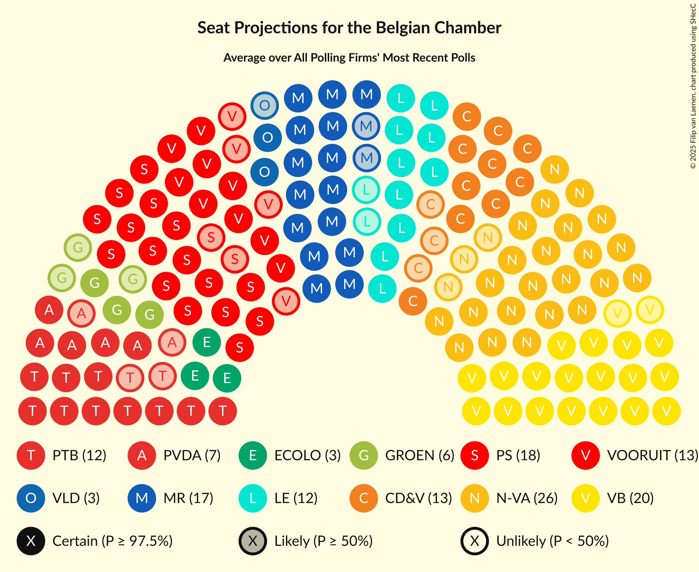

# Poll Average

<a href="#voting-intentions">Voting Intentions</a> | <a href="#seats">Seats</a> | <a href="#coalitions">Coalitions</a> | <a href="#technical-information">Technical Information</a>

## Summary

The table below lists the polls on which the average is based. They are the most recent polls (less than 90 days old) registered and analyzed so far.

| Period     | Polling firm/Commissioner(s) | N-VA | VB | PS | CD&V | PTB | PVDA | VLD | MR | SP.A | ECOLO | GROEN | CDH | DÉFI |
|:----------:|:----------------------------:|:--:|:--:|:--:|:--:|:--:|:--:|:--:|:--:|:--:|:--:|:--:|:--:|:--:|
| 26 May 2019 | General Election | 16.0%   25 | 12.0%   18 | 9.5%   20 | 8.9%   12 | 4.8%   9 | 3.3%   3 | 8.5%   12 | 7.6%   14 | 6.7%   9 | 6.1%   13 | 6.1%   8 | 3.7%   5 | 2.2%   2 |
| N/A | Poll Average | 11–12%   16–21 | 15–16%   24–30 | 8%   16–20 | 6–7%   8–12 | 6%   10–13 | 4–5%   3–8 | 5–6%   6–10 | 6–7%   13–17 | 6–8%   8–13 | 5–6%   10–14 | 5–6%   5–9 | 2%   3–5 | 2%   1–4 |
| [10–15 June 2020](2020-06-15-Ipsos.html) | Ipsos   Het Laatste Nieuws, Le Soir, RTL TVi and VTM | 11–12%   16–21 | 15–16%   24–30 | 8%   16–20 | 6–7%   8–12 | 6%   10–13 | 4–5%   3–8 | 5–6%   6–10 | 6–7%   13–17 | 6–8%   8–13 | 5–6%   10–14 | 5–6%   5–9 | 2%   3–5 | 2%   1–4 |
| 26 May 2019 | General Election | 16.0%   25 | 12.0%   18 | 9.5%   20 | 8.9%   12 | 4.8%   9 | 3.3%   3 | 8.5%   12 | 7.6%   14 | 6.7%   9 | 6.1%   13 | 6.1%   8 | 3.7%   5 | 2.2%   2 |

Only polls for which at least the sample size has been published are included in the table above.

**Legend:**
+ **Top half of each row:** Voting intentions (95% confidence interval)
+ **Bottom half of each row:** Seat projections for the Belgian Chamber (95% confidence interval)
+ **N-VA:** Nieuw-Vlaamse Alliantie
+ **VB:** Vlaams Belang
+ **PS:** Parti Socialiste
+ **CD&V:** Christen-Democratisch en Vlaams
+ **PTB:** Parti du Travail de Belgique
+ **PVDA:** Partij van de Arbeid van België
+ **VLD:** Open Vlaamse Liberalen en Democraten
+ **MR:** Mouvement Réformateur
+ **SP.A:** Socialistische Partij Anders
+ **ECOLO:** Ecolo
+ **GROEN:** Groen
+ **CDH:** Centre démocrate humaniste
+ **DÉFI:** DéFI
+ **N/A (single party):** Party not included the published results
+ **N/A (entire row):** Calculation for this opinion poll not started yet

## Voting Intentions

### Confidence Intervals

| Party | Last Result | Median | 80% Confidence Interval | 90% Confidence Interval | 95% Confidence Interval | 99% Confidence Interval |
|:-----:|:-----------:|:------:|:-----------------------:|:-----------------------:|:-----------------------:|:-----------------------:|
| <a href="#nieuw-vlaamse-alliantie">Nieuw-Vlaamse Alliantie</a> | 16.0% | 11.6% | 11.0–11.8% |10.8–11.8% | 10.7–11.8% | 10.3–11.9% |
| <a href="#vlaams-belang">Vlaams Belang</a> | 12.0% | 16.1% | 15.4–16.3% |15.2–16.4% | 15.0–16.4% | 14.6–16.4% |
| <a href="#parti-socialiste">Parti Socialiste</a> | 9.5% | 8.0% | 7.7–8.1% |7.6–8.1% | 7.5–8.1% | 7.3–8.1% |
| <a href="#christen-democratisch-en-vlaams">Christen-Democratisch en Vlaams</a> | 8.9% | 6.5% | 6.1–6.7% |5.9–6.7% | 5.8–6.7% | 5.5–6.7% |
| <a href="#open-vlaamse-liberalen-en-democraten">Open Vlaamse Liberalen en Democraten</a> | 8.5% | 5.4% | 5.1–5.6% |4.9–5.6% | 4.8–5.7% | 4.6–5.7% |
| <a href="#mouvement-réformateur">Mouvement Réformateur</a> | 7.6% | 6.9% | 6.6–7.0% |6.5–7.0% | 6.5–7.0% | 6.3–7.0% |
| <a href="#socialistische-partij-anders">Socialistische Partij Anders</a> | 6.7% | 7.7% | 6.9–8.4% |6.7–8.5% | 6.5–8.5% | 6.2–8.6% |
| <a href="#ecolo">Ecolo</a> | 6.1% | 5.6% | 5.3–5.7% |5.3–5.7% | 5.2–5.7% | 5.0–5.7% |
| <a href="#groen">Groen</a> | 6.1% | 5.7% | 5.1–6.3% |4.9–6.5% | 4.7–6.5% | 4.4–6.6% |
| <a href="#parti-du-travail-de-belgique">Parti du Travail de Belgique</a> | 4.8% | 6.0% | 5.8–6.1% |5.7–6.1% | 5.6–6.1% | 5.4–6.1% |
| <a href="#centre-démocrate-humaniste">Centre démocrate humaniste</a> | 3.7% | 2.4% | 2.2–2.5% |2.2–2.5% | 2.1–2.5% | 2.0–2.5% |
| <a href="#partij-van-de-arbeid-van-belgië">Partij van de Arbeid van België</a> | 3.3% | 4.5% | 3.9–5.0% |3.7–5.1% | 3.6–5.1% | 3.3–5.2% |
| <a href="#défi">DéFI</a> | 2.2% | 1.9% | 1.8–1.9% |1.7–1.9% | 1.7–1.9% | 1.6–1.9% |

### Nieuw-Vlaamse Alliantie

*For a full overview of the results for this party, see the [Nieuw-Vlaamse Alliantie](party-nieuw-vlaamsealliantie.html) page.*

| Voting Intentions | Probability | Accumulated | Special Marks |
|:-----------------:|:-----------:|:-----------:|:-------------:|
| 8.5–9.5% | 0% | 100% |  |
| 9.5–10.5% | 2% | 100% |  |
| 10.5–11.5% | 47% | 98% |  |
| 11.5–12.5% | 100% | 51% | Median |
| 12.5–13.5% | 100% | 0% |  |
| 13.5–14.5% | 100% | 0% |  |
| 14.5–15.5% | 11% | 0% |  |
| 15.5–16.5% | 0.3% | 0% | Last Result |

### Vlaams Belang

*For a full overview of the results for this party, see the [Vlaams Belang](party-vlaamsbelang.html) page.*

| Voting Intentions | Probability | Accumulated | Special Marks |
|:-----------------:|:-----------:|:-----------:|:-------------:|
| 11.5–12.5% | 0% | 100% | Last Result |
| 12.5–13.5% | 0% | 100% |  |
| 13.5–14.5% | 0.4% | 100% |  |
| 14.5–15.5% | 13% | 99.6% |  |
| 15.5–16.5% | 100% | 87% | Median |
| 16.5–17.5% | 100% | 0% |  |
| 17.5–18.5% | 100% | 0% |  |
| 18.5–19.5% | 68% | 0% |  |
| 19.5–20.5% | 7% | 0% |  |
| 20.5–21.5% | 0.2% | 0% |  |

### Parti Socialiste

*For a full overview of the results for this party, see the [Parti Socialiste](party-partisocialiste.html) page.*

| Voting Intentions | Probability | Accumulated | Special Marks |
|:-----------------:|:-----------:|:-----------:|:-------------:|
| 5.5–6.5% | 0% | 100% |  |
| 6.5–7.5% | 4% | 100% |  |
| 7.5–8.5% | 100% | 96% | Median |
| 8.5–9.5% | 100% | 0% | Last Result |
| 9.5–10.5% | 33% | 0% |  |

### Christen-Democratisch en Vlaams

*For a full overview of the results for this party, see the [Christen-Democratisch en Vlaams](party-christen-democratischenvlaams.html) page.*

| Voting Intentions | Probability | Accumulated | Special Marks |
|:-----------------:|:-----------:|:-----------:|:-------------:|
| 3.5–4.5% | 0% | 100% |  |
| 4.5–5.5% | 0.6% | 100% |  |
| 5.5–6.5% | 59% | 99.4% | Median |
| 6.5–7.5% | 100% | 41% |  |
| 7.5–8.5% | 100% | 0% |  |
| 8.5–9.5% | 34% | 0% | Last Result |
| 9.5–10.5% | 0.9% | 0% |  |

### Open Vlaamse Liberalen en Democraten

*For a full overview of the results for this party, see the [Open Vlaamse Liberalen en Democraten](party-openvlaamseliberalenendemocraten.html) page.*

| Voting Intentions | Probability | Accumulated | Special Marks |
|:-----------------:|:-----------:|:-----------:|:-------------:|
| 2.5–3.5% | 0% | 100% |  |
| 3.5–4.5% | 0.5% | 100% |  |
| 4.5–5.5% | 71% | 99.5% | Median |
| 5.5–6.5% | 100% | 29% |  |
| 6.5–7.5% | 100% | 0% |  |
| 7.5–8.5% | 19% | 0% |  |
| 8.5–9.5% | 0.3% | 0% | Last Result |

### Mouvement Réformateur

*For a full overview of the results for this party, see the [Mouvement Réformateur](party-mouvementréformateur.html) page.*

| Voting Intentions | Probability | Accumulated | Special Marks |
|:-----------------:|:-----------:|:-----------:|:-------------:|
| 4.5–5.5% | 0% | 100% |  |
| 5.5–6.5% | 5% | 100% |  |
| 6.5–7.5% | 100% | 95% | Median |
| 7.5–8.5% | 100% | 0% | Last Result |
| 8.5–9.5% | 14% | 0% |  |

### Socialistische Partij Anders

*For a full overview of the results for this party, see the [Socialistische Partij Anders](party-socialistischepartijanders.html) page.*

| Voting Intentions | Probability | Accumulated | Special Marks |
|:-----------------:|:-----------:|:-----------:|:-------------:|
| 4.5–5.5% | 0% | 100% |  |
| 5.5–6.5% | 3% | 100% |  |
| 6.5–7.5% | 38% | 97% | Last Result |
| 7.5–8.5% | 57% | 59% | Median |
| 8.5–9.5% | 13% | 2% |  |
| 9.5–10.5% | 0.6% | 0% |  |

### Ecolo

*For a full overview of the results for this party, see the [Ecolo](party-ecolo.html) page.*

| Voting Intentions | Probability | Accumulated | Special Marks |
|:-----------------:|:-----------:|:-----------:|:-------------:|
| 3.5–4.5% | 0% | 100% |  |
| 4.5–5.5% | 45% | 100% |  |
| 5.5–6.5% | 100% | 55% | Last Result, Median |
| 6.5–7.5% | 100% | 0% |  |
| 7.5–8.5% | 0.4% | 0% |  |

### Groen

*For a full overview of the results for this party, see the [Groen](party-groen.html) page.*

| Voting Intentions | Probability | Accumulated | Special Marks |
|:-----------------:|:-----------:|:-----------:|:-------------:|
| 2.5–3.5% | 0% | 100% |  |
| 3.5–4.5% | 1.1% | 100% |  |
| 4.5–5.5% | 35% | 98.9% |  |
| 5.5–6.5% | 62% | 64% | Last Result, Median |
| 6.5–7.5% | 13% | 2% |  |
| 7.5–8.5% | 0.4% | 0% |  |

### Parti du Travail de Belgique

*For a full overview of the results for this party, see the [Parti du Travail de Belgique](party-partidutravaildebelgique.html) page.*

| Voting Intentions | Probability | Accumulated | Special Marks |
|:-----------------:|:-----------:|:-----------:|:-------------:|
| 3.5–4.5% | 0% | 100% |  |
| 4.5–5.5% | 2% | 100% | Last Result |
| 5.5–6.5% | 100% | 98% | Median |
| 6.5–7.5% | 100% | 0% |  |
| 7.5–8.5% | 19% | 0% |  |

### Centre démocrate humaniste

*For a full overview of the results for this party, see the [Centre démocrate humaniste](party-centredémocratehumaniste.html) page.*

| Voting Intentions | Probability | Accumulated | Special Marks |
|:-----------------:|:-----------:|:-----------:|:-------------:|
| 0.5–1.5% | 0% | 100% |  |
| 1.5–2.5% | 100% | 100% | Median |
| 2.5–3.5% | 100% | 0% |  |
| 3.5–4.5% | 11% | 0% | Last Result |

### Partij van de Arbeid van België

*For a full overview of the results for this party, see the [Partij van de Arbeid van België](party-partijvandearbeidvanbelgië.html) page.*

| Voting Intentions | Probability | Accumulated | Special Marks |
|:-----------------:|:-----------:|:-----------:|:-------------:|
| 1.5–2.5% | 0% | 100% |  |
| 2.5–3.5% | 2% | 100% | Last Result |
| 3.5–4.5% | 55% | 98% | Median |
| 4.5–5.5% | 50% | 42% |  |
| 5.5–6.5% | 4% | 0% |  |

### DéFI

*For a full overview of the results for this party, see the [DéFI](party-défi.html) page.*

| Voting Intentions | Probability | Accumulated | Special Marks |
|:-----------------:|:-----------:|:-----------:|:-------------:|
| 0.5–1.5% | 0.3% | 100% |  |
| 1.5–2.5% | 100% | 99.7% | Last Result, Median |
| 2.5–3.5% | 100% | 0% |  |

## Seats

### Confidence Intervals

| Party | Last Result | Median | 80% Confidence Interval | 90% Confidence Interval | 95% Confidence Interval | 99% Confidence Interval |
|:-----:|:-----------:|:------:|:-----------------------:|:-----------------------:|:-----------------------:|:-----------------------:|
| <a href="#nieuw-vlaamse-alliantie">Nieuw-Vlaamse Alliantie</a> | 25 | 19 | 17–21 |16–21 | 16–21 | 15–23 |
| <a href="#vlaams-belang">Vlaams Belang</a> | 18 | 26 | 25–29 |24–29 | 24–30 | 23–31 |
| <a href="#parti-socialiste">Parti Socialiste</a> | 20 | 18 | 16–19 |16–19 | 16–20 | 15–21 |
| <a href="#christen-democratisch-en-vlaams">Christen-Democratisch en Vlaams</a> | 12 | 10 | 9–11 |8–12 | 8–12 | 7–13 |
| <a href="#open-vlaamse-liberalen-en-democraten">Open Vlaamse Liberalen en Democraten</a> | 12 | 9 | 6–10 |6–10 | 6–10 | 6–11 |
| <a href="#mouvement-réformateur">Mouvement Réformateur</a> | 14 | 15 | 13–17 |13–17 | 13–17 | 12–18 |
| <a href="#socialistische-partij-anders">Socialistische Partij Anders</a> | 9 | 11 | 9–12 |9–13 | 8–13 | 8–14 |
| <a href="#ecolo">Ecolo</a> | 13 | 12 | 11–13 |10–14 | 10–14 | 10–14 |
| <a href="#groen">Groen</a> | 8 | 7 | 6–9 |5–9 | 5–9 | 5–10 |
| <a href="#parti-du-travail-de-belgique">Parti du Travail de Belgique</a> | 9 | 12 | 11–13 |10–13 | 10–13 | 10–15 |
| <a href="#centre-démocrate-humaniste">Centre démocrate humaniste</a> | 5 | 4 | 4–5 |4–5 | 3–5 | 1–5 |
| <a href="#partij-van-de-arbeid-van-belgië">Partij van de Arbeid van België</a> | 3 | 5 | 4–7 |3–8 | 3–8 | 3–8 |
| <a href="#défi">DéFI</a> | 2 | 2 | 1–3 |1–3 | 1–4 | 1–4 |

### Nieuw-Vlaamse Alliantie

*For a full overview of the results for this party, see the [Nieuw-Vlaamse Alliantie](party-nieuw-vlaamsealliantie.html) page.*

| Number of Seats | Probability | Accumulated | Special Marks |
|:---------------:|:-----------:|:-----------:|:-------------:|
| 15 | 1.5% | 100% |  |
| 16 | 5% | 98.5% |  |
| 17 | 11% | 93% |  |
| 18 | 17% | 82% |  |
| 19 | 19% | 65% | Median |
| 20 | 28% | 45% |  |
| 21 | 15% | 17% |  |
| 22 | 2% | 2% |  |
| 23 | 0.4% | 0.6% |  |
| 24 | 0.2% | 0.3% |  |
| 25 | 0.1% | 0.1% | Last Result |
| 26 | 0% | 0% |  |

### Vlaams Belang

*For a full overview of the results for this party, see the [Vlaams Belang](party-vlaamsbelang.html) page.*

| Number of Seats | Probability | Accumulated | Special Marks |
|:---------------:|:-----------:|:-----------:|:-------------:|
| 18 | 0% | 100% | Last Result |
| 19 | 0% | 100% |  |
| 20 | 0% | 100% |  |
| 21 | 0.1% | 100% |  |
| 22 | 0.4% | 99.9% |  |
| 23 | 2% | 99.5% |  |
| 24 | 7% | 98% |  |
| 25 | 32% | 91% |  |
| 26 | 16% | 59% | Median |
| 27 | 12% | 44% |  |
| 28 | 17% | 32% |  |
| 29 | 12% | 15% |  |
| 30 | 2% | 3% |  |
| 31 | 0.4% | 0.6% |  |
| 32 | 0.2% | 0.2% |  |
| 33 | 0% | 0% |  |

### Parti Socialiste

*For a full overview of the results for this party, see the [Parti Socialiste](party-partisocialiste.html) page.*

| Number of Seats | Probability | Accumulated | Special Marks |
|:---------------:|:-----------:|:-----------:|:-------------:|
| 14 | 0.1% | 100% |  |
| 15 | 2% | 99.9% |  |
| 16 | 10% | 98% |  |
| 17 | 23% | 88% |  |
| 18 | 38% | 64% | Median |
| 19 | 21% | 26% |  |
| 20 | 4% | 5% | Last Result |
| 21 | 0.9% | 1.0% |  |
| 22 | 0% | 0% |  |

### Christen-Democratisch en Vlaams

*For a full overview of the results for this party, see the [Christen-Democratisch en Vlaams](party-christen-democratischenvlaams.html) page.*

| Number of Seats | Probability | Accumulated | Special Marks |
|:---------------:|:-----------:|:-----------:|:-------------:|
| 6 | 0.4% | 100% |  |
| 7 | 0.5% | 99.6% |  |
| 8 | 4% | 99.1% |  |
| 9 | 14% | 95% |  |
| 10 | 49% | 81% | Median |
| 11 | 25% | 32% |  |
| 12 | 4% | 6% | Last Result |
| 13 | 2% | 2% |  |
| 14 | 0.2% | 0.2% |  |
| 15 | 0% | 0% |  |

### Open Vlaamse Liberalen en Democraten

*For a full overview of the results for this party, see the [Open Vlaamse Liberalen en Democraten](party-openvlaamseliberalenendemocraten.html) page.*

| Number of Seats | Probability | Accumulated | Special Marks |
|:---------------:|:-----------:|:-----------:|:-------------:|
| 5 | 0.4% | 100% |  |
| 6 | 17% | 99.6% |  |
| 7 | 16% | 83% |  |
| 8 | 15% | 67% |  |
| 9 | 26% | 52% | Median |
| 10 | 26% | 26% |  |
| 11 | 0.5% | 0.6% |  |
| 12 | 0.1% | 0.1% | Last Result |
| 13 | 0% | 0% |  |

### Mouvement Réformateur

*For a full overview of the results for this party, see the [Mouvement Réformateur](party-mouvementréformateur.html) page.*

| Number of Seats | Probability | Accumulated | Special Marks |
|:---------------:|:-----------:|:-----------:|:-------------:|
| 12 | 0.8% | 100% |  |
| 13 | 13% | 99.2% |  |
| 14 | 34% | 86% | Last Result |
| 15 | 26% | 52% | Median |
| 16 | 12% | 25% |  |
| 17 | 12% | 14% |  |
| 18 | 2% | 2% |  |
| 19 | 0% | 0% |  |

### Socialistische Partij Anders

*For a full overview of the results for this party, see the [Socialistische Partij Anders](party-socialistischepartijanders.html) page.*

| Number of Seats | Probability | Accumulated | Special Marks |
|:---------------:|:-----------:|:-----------:|:-------------:|
| 7 | 0.3% | 100% |  |
| 8 | 2% | 99.7% |  |
| 9 | 9% | 97% | Last Result |
| 10 | 19% | 88% |  |
| 11 | 51% | 69% | Median |
| 12 | 12% | 19% |  |
| 13 | 4% | 6% |  |
| 14 | 2% | 2% |  |
| 15 | 0.3% | 0.3% |  |
| 16 | 0% | 0% |  |

### Ecolo

*For a full overview of the results for this party, see the [Ecolo](party-ecolo.html) page.*

| Number of Seats | Probability | Accumulated | Special Marks |
|:---------------:|:-----------:|:-----------:|:-------------:|
| 9 | 0.1% | 100% |  |
| 10 | 6% | 99.9% |  |
| 11 | 26% | 93% |  |
| 12 | 31% | 68% | Median |
| 13 | 29% | 37% | Last Result |
| 14 | 8% | 9% |  |
| 15 | 0.4% | 0.5% |  |
| 16 | 0% | 0% |  |

### Groen

*For a full overview of the results for this party, see the [Groen](party-groen.html) page.*

| Number of Seats | Probability | Accumulated | Special Marks |
|:---------------:|:-----------:|:-----------:|:-------------:|
| 5 | 7% | 100% |  |
| 6 | 15% | 92% |  |
| 7 | 29% | 77% | Median |
| 8 | 17% | 48% | Last Result |
| 9 | 30% | 31% |  |
| 10 | 0.5% | 0.7% |  |
| 11 | 0.1% | 0.2% |  |
| 12 | 0.1% | 0.1% |  |
| 13 | 0% | 0% |  |

### Parti du Travail de Belgique

*For a full overview of the results for this party, see the [Parti du Travail de Belgique](party-partidutravaildebelgique.html) page.*

| Number of Seats | Probability | Accumulated | Special Marks |
|:---------------:|:-----------:|:-----------:|:-------------:|
| 9 | 0.3% | 100% | Last Result |
| 10 | 7% | 99.7% |  |
| 11 | 40% | 92% |  |
| 12 | 41% | 52% | Median |
| 13 | 8% | 11% |  |
| 14 | 2% | 2% |  |
| 15 | 0.5% | 0.7% |  |
| 16 | 0.2% | 0.2% |  |
| 17 | 0% | 0.1% |  |
| 18 | 0% | 0% |  |

### Centre démocrate humaniste

*For a full overview of the results for this party, see the [Centre démocrate humaniste](party-centredémocratehumaniste.html) page.*

| Number of Seats | Probability | Accumulated | Special Marks |
|:---------------:|:-----------:|:-----------:|:-------------:|
| 0 | 0.1% | 100% |  |
| 1 | 0.5% | 99.9% |  |
| 2 | 1.2% | 99.4% |  |
| 3 | 2% | 98% |  |
| 4 | 59% | 96% | Median |
| 5 | 37% | 37% | Last Result |
| 6 | 0% | 0% |  |

### Partij van de Arbeid van België

*For a full overview of the results for this party, see the [Partij van de Arbeid van België](party-partijvandearbeidvanbelgië.html) page.*

| Number of Seats | Probability | Accumulated | Special Marks |
|:---------------:|:-----------:|:-----------:|:-------------:|
| 1 | 0.2% | 100% |  |
| 2 | 0.2% | 99.8% |  |
| 3 | 7% | 99.6% | Last Result |
| 4 | 15% | 92% |  |
| 5 | 49% | 77% | Median |
| 6 | 9% | 28% |  |
| 7 | 13% | 19% |  |
| 8 | 6% | 6% |  |
| 9 | 0% | 0% |  |

### DéFI

*For a full overview of the results for this party, see the [DéFI](party-défi.html) page.*

| Number of Seats | Probability | Accumulated | Special Marks |
|:---------------:|:-----------:|:-----------:|:-------------:|
| 1 | 16% | 100% |  |
| 2 | 71% | 84% | Last Result, Median |
| 3 | 9% | 13% |  |
| 4 | 4% | 4% |  |
| 5 | 0.1% | 0.1% |  |
| 6 | 0% | 0% |  |

## Coalitions

### Confidence Intervals

| Coalition | Last Result | Median | Majority? | 80% Confidence Interval | 90% Confidence Interval | 95% Confidence Interval | 99% Confidence Interval |
|:---------:|:-----------:|:------:|:---------:|:-----------------------:|:-----------------------:|:-----------------------:|:-----------------------:|
| Parti Socialiste – Christen-Democratisch en Vlaams – Open Vlaamse Liberalen en Democraten – Mouvement Réformateur – Socialistische Partij Anders – Ecolo – Groen – Centre démocrate humaniste | 93 | 86 | 100% | 83–89 | 82–89 | 81–90 | 80–91 |
| Parti Socialiste – Christen-Democratisch en Vlaams – Open Vlaamse Liberalen en Democraten – Mouvement Réformateur – Socialistische Partij Anders – Ecolo – Groen | 88 | 81 | 99.6% | 78–84 | 78–85 | 77–86 | 76–87 |
| Parti Socialiste – Christen-Democratisch en Vlaams – Socialistische Partij Anders – Ecolo – Groen – Parti du Travail de Belgique – Centre démocrate humaniste – Partij van de Arbeid van België | 79 | 79 | 95% | 76–82 | 76–83 | 75–84 | 74–85 |
| Parti Socialiste – Open Vlaamse Liberalen en Democraten – Mouvement Réformateur – Socialistische Partij Anders – Ecolo – Groen | 76 | 71 | 3% | 68–74 | 68–75 | 67–76 | 66–77 |
| Nieuw-Vlaamse Alliantie – Parti Socialiste – Open Vlaamse Liberalen en Democraten – Mouvement Réformateur – Socialistische Partij Anders | 80 | 71 | 2% | 68–74 | 67–75 | 66–75 | 65–76 |
| Parti Socialiste – Socialistische Partij Anders – Ecolo – Groen – Parti du Travail de Belgique – Centre démocrate humaniste – Partij van de Arbeid van België | 67 | 69 | 0.4% | 66–72 | 66–73 | 65–74 | 63–75 |
| Parti Socialiste – Christen-Democratisch en Vlaams – Open Vlaamse Liberalen en Democraten – Mouvement Réformateur – Socialistische Partij Anders – Centre démocrate humaniste | 72 | 66 | 0% | 63–69 | 62–70 | 62–70 | 61–72 |
| Parti Socialiste – Socialistische Partij Anders – Ecolo – Groen – Parti du Travail de Belgique – Partij van de Arbeid van België | 62 | 65 | 0% | 62–68 | 61–69 | 61–70 | 59–71 |
| Parti Socialiste – Christen-Democratisch en Vlaams – Socialistische Partij Anders – Ecolo – Groen – Centre démocrate humaniste | 67 | 63 | 0% | 60–66 | 59–67 | 58–67 | 57–69 |
| Christen-Democratisch en Vlaams – Open Vlaamse Liberalen en Democraten – Mouvement Réformateur – Ecolo – Groen – Centre démocrate humaniste | 64 | 57 | 0% | 54–60 | 53–61 | 53–62 | 51–63 |
| Nieuw-Vlaamse Alliantie – Christen-Democratisch en Vlaams – Open Vlaamse Liberalen en Democraten – Mouvement Réformateur – Centre démocrate humaniste | 68 | 57 | 0% | 54–60 | 53–60 | 52–61 | 50–63 |
| Parti Socialiste – Christen-Democratisch en Vlaams – Open Vlaamse Liberalen en Democraten – Mouvement Réformateur – Centre démocrate humaniste | 63 | 55 | 0% | 53–58 | 52–59 | 51–59 | 50–60 |
| Nieuw-Vlaamse Alliantie – Christen-Democratisch en Vlaams – Open Vlaamse Liberalen en Democraten – Mouvement Réformateur | 63 | 52 | 0% | 49–55 | 48–56 | 48–57 | 46–58 |
| Parti Socialiste – Open Vlaamse Liberalen en Democraten – Mouvement Réformateur – Socialistische Partij Anders | 55 | 52 | 0% | 49–54 | 48–55 | 48–56 | 46–57 |
| Parti Socialiste – Christen-Democratisch en Vlaams – Socialistische Partij Anders – Centre démocrate humaniste | 46 | 43 | 0% | 41–46 | 40–46 | 39–47 | 38–48 |
| Christen-Democratisch en Vlaams – Open Vlaamse Liberalen en Democraten – Mouvement Réformateur – Centre démocrate humaniste | 43 | 38 | 0% | 35–40 | 34–41 | 33–42 | 32–43 |

### Parti Socialiste – Christen-Democratisch en Vlaams – Open Vlaamse Liberalen en Democraten – Mouvement Réformateur – Socialistische Partij Anders – Ecolo – Groen – Centre démocrate humaniste

| Number of Seats | Probability | Accumulated | Special Marks |
|:---------------:|:-----------:|:-----------:|:-------------:|
| 78 | 0.1% | 100% |  |
| 79 | 0.2% | 99.9% |  |
| 80 | 0.7% | 99.7% |  |
| 81 | 2% | 99.0% |  |
| 82 | 5% | 97% |  |
| 83 | 9% | 92% |  |
| 84 | 12% | 83% |  |
| 85 | 17% | 71% |  |
| 86 | 19% | 54% | Median |
| 87 | 15% | 36% |  |
| 88 | 10% | 21% |  |
| 89 | 6% | 11% |  |
| 90 | 3% | 5% |  |
| 91 | 1.2% | 2% |  |
| 92 | 0.3% | 0.4% |  |
| 93 | 0.1% | 0.1% | Last Result |
| 94 | 0% | 0% |  |

### Parti Socialiste – Christen-Democratisch en Vlaams – Open Vlaamse Liberalen en Democraten – Mouvement Réformateur – Socialistische Partij Anders – Ecolo – Groen

| Number of Seats | Probability | Accumulated | Special Marks |
|:---------------:|:-----------:|:-----------:|:-------------:|
| 74 | 0.1% | 100% |  |
| 75 | 0.3% | 99.9% |  |
| 76 | 1.0% | 99.6% | Majority |
| 77 | 3% | 98.5% |  |
| 78 | 6% | 96% |  |
| 79 | 10% | 89% |  |
| 80 | 14% | 80% |  |
| 81 | 18% | 66% |  |
| 82 | 18% | 48% | Median |
| 83 | 13% | 31% |  |
| 84 | 9% | 18% |  |
| 85 | 5% | 9% |  |
| 86 | 3% | 4% |  |
| 87 | 0.9% | 1.3% |  |
| 88 | 0.3% | 0.3% | Last Result |
| 89 | 0.1% | 0.1% |  |
| 90 | 0% | 0% |  |

### Parti Socialiste – Christen-Democratisch en Vlaams – Socialistische Partij Anders – Ecolo – Groen – Parti du Travail de Belgique – Centre démocrate humaniste – Partij van de Arbeid van België

| Number of Seats | Probability | Accumulated | Special Marks |
|:---------------:|:-----------:|:-----------:|:-------------:|
| 72 | 0.1% | 100% |  |
| 73 | 0.4% | 99.9% |  |
| 74 | 1.1% | 99.5% |  |
| 75 | 3% | 98% |  |
| 76 | 6% | 95% | Majority |
| 77 | 10% | 90% |  |
| 78 | 14% | 80% |  |
| 79 | 17% | 66% | Last Result, Median |
| 80 | 16% | 49% |  |
| 81 | 13% | 33% |  |
| 82 | 9% | 19% |  |
| 83 | 6% | 10% |  |
| 84 | 3% | 4% |  |
| 85 | 1.1% | 2% |  |
| 86 | 0.4% | 0.5% |  |
| 87 | 0.1% | 0.1% |  |
| 88 | 0% | 0% |  |

### Parti Socialiste – Open Vlaamse Liberalen en Democraten – Mouvement Réformateur – Socialistische Partij Anders – Ecolo – Groen

| Number of Seats | Probability | Accumulated | Special Marks |
|:---------------:|:-----------:|:-----------:|:-------------:|
| 64 | 0.1% | 100% |  |
| 65 | 0.4% | 99.9% |  |
| 66 | 1.2% | 99.5% |  |
| 67 | 3% | 98% |  |
| 68 | 7% | 95% |  |
| 69 | 10% | 89% |  |
| 70 | 15% | 78% |  |
| 71 | 18% | 64% |  |
| 72 | 17% | 46% | Median |
| 73 | 13% | 29% |  |
| 74 | 8% | 16% |  |
| 75 | 5% | 8% |  |
| 76 | 2% | 3% | Last Result, Majority |
| 77 | 0.6% | 0.8% |  |
| 78 | 0.1% | 0.2% |  |
| 79 | 0% | 0% |  |

### Nieuw-Vlaamse Alliantie – Parti Socialiste – Open Vlaamse Liberalen en Democraten – Mouvement Réformateur – Socialistische Partij Anders

| Number of Seats | Probability | Accumulated | Special Marks |
|:---------------:|:-----------:|:-----------:|:-------------:|
| 63 | 0.1% | 100% |  |
| 64 | 0.2% | 99.9% |  |
| 65 | 0.7% | 99.6% |  |
| 66 | 2% | 98.9% |  |
| 67 | 4% | 97% |  |
| 68 | 8% | 93% |  |
| 69 | 14% | 84% |  |
| 70 | 17% | 70% |  |
| 71 | 17% | 53% |  |
| 72 | 14% | 36% | Median |
| 73 | 10% | 22% |  |
| 74 | 7% | 12% |  |
| 75 | 3% | 5% |  |
| 76 | 1.3% | 2% | Majority |
| 77 | 0.4% | 0.5% |  |
| 78 | 0.1% | 0.1% |  |
| 79 | 0% | 0% |  |
| 80 | 0% | 0% | Last Result |

### Parti Socialiste – Socialistische Partij Anders – Ecolo – Groen – Parti du Travail de Belgique – Centre démocrate humaniste – Partij van de Arbeid van België

| Number of Seats | Probability | Accumulated | Special Marks |
|:---------------:|:-----------:|:-----------:|:-------------:|
| 62 | 0.1% | 100% |  |
| 63 | 0.4% | 99.9% |  |
| 64 | 1.2% | 99.5% |  |
| 65 | 3% | 98% |  |
| 66 | 6% | 95% |  |
| 67 | 10% | 89% | Last Result |
| 68 | 15% | 79% |  |
| 69 | 17% | 64% | Median |
| 70 | 16% | 47% |  |
| 71 | 13% | 30% |  |
| 72 | 9% | 17% |  |
| 73 | 5% | 8% |  |
| 74 | 2% | 4% |  |
| 75 | 1.0% | 1.3% |  |
| 76 | 0.3% | 0.4% | Majority |
| 77 | 0.1% | 0.1% |  |
| 78 | 0% | 0% |  |

### Parti Socialiste – Christen-Democratisch en Vlaams – Open Vlaamse Liberalen en Democraten – Mouvement Réformateur – Socialistische Partij Anders – Centre démocrate humaniste

| Number of Seats | Probability | Accumulated | Special Marks |
|:---------------:|:-----------:|:-----------:|:-------------:|
| 59 | 0.1% | 100% |  |
| 60 | 0.3% | 99.9% |  |
| 61 | 1.2% | 99.5% |  |
| 62 | 3% | 98% |  |
| 63 | 7% | 95% |  |
| 64 | 11% | 88% |  |
| 65 | 15% | 77% |  |
| 66 | 18% | 62% |  |
| 67 | 17% | 44% | Median |
| 68 | 13% | 27% |  |
| 69 | 8% | 14% |  |
| 70 | 4% | 6% |  |
| 71 | 2% | 2% |  |
| 72 | 0.5% | 0.6% | Last Result |
| 73 | 0.1% | 0.2% |  |
| 74 | 0% | 0% |  |

### Parti Socialiste – Socialistische Partij Anders – Ecolo – Groen – Parti du Travail de Belgique – Partij van de Arbeid van België

| Number of Seats | Probability | Accumulated | Special Marks |
|:---------------:|:-----------:|:-----------:|:-------------:|
| 58 | 0.2% | 100% |  |
| 59 | 0.6% | 99.8% |  |
| 60 | 2% | 99.2% |  |
| 61 | 4% | 98% |  |
| 62 | 7% | 94% | Last Result |
| 63 | 12% | 86% |  |
| 64 | 16% | 74% |  |
| 65 | 17% | 58% | Median |
| 66 | 16% | 41% |  |
| 67 | 12% | 26% |  |
| 68 | 7% | 14% |  |
| 69 | 4% | 7% |  |
| 70 | 2% | 3% |  |
| 71 | 0.7% | 1.0% |  |
| 72 | 0.2% | 0.3% |  |
| 73 | 0% | 0.1% |  |
| 74 | 0% | 0% |  |

### Parti Socialiste – Christen-Democratisch en Vlaams – Socialistische Partij Anders – Ecolo – Groen – Centre démocrate humaniste

| Number of Seats | Probability | Accumulated | Special Marks |
|:---------------:|:-----------:|:-----------:|:-------------:|
| 55 | 0.1% | 100% |  |
| 56 | 0.2% | 99.9% |  |
| 57 | 0.7% | 99.7% |  |
| 58 | 2% | 99.0% |  |
| 59 | 5% | 97% |  |
| 60 | 9% | 92% |  |
| 61 | 14% | 82% |  |
| 62 | 17% | 68% | Median |
| 63 | 16% | 52% |  |
| 64 | 14% | 35% |  |
| 65 | 10% | 22% |  |
| 66 | 6% | 11% |  |
| 67 | 3% | 5% | Last Result |
| 68 | 1.3% | 2% |  |
| 69 | 0.4% | 0.5% |  |
| 70 | 0.1% | 0.1% |  |
| 71 | 0% | 0% |  |

### Christen-Democratisch en Vlaams – Open Vlaamse Liberalen en Democraten – Mouvement Réformateur – Ecolo – Groen – Centre démocrate humaniste

| Number of Seats | Probability | Accumulated | Special Marks |
|:---------------:|:-----------:|:-----------:|:-------------:|
| 50 | 0.2% | 100% |  |
| 51 | 0.6% | 99.8% |  |
| 52 | 2% | 99.2% |  |
| 53 | 4% | 98% |  |
| 54 | 8% | 93% |  |
| 55 | 11% | 86% |  |
| 56 | 15% | 75% |  |
| 57 | 16% | 60% | Median |
| 58 | 15% | 43% |  |
| 59 | 12% | 28% |  |
| 60 | 8% | 16% |  |
| 61 | 5% | 7% |  |
| 62 | 2% | 3% |  |
| 63 | 0.6% | 0.8% |  |
| 64 | 0.2% | 0.2% | Last Result |
| 65 | 0% | 0% |  |

### Nieuw-Vlaamse Alliantie – Christen-Democratisch en Vlaams – Open Vlaamse Liberalen en Democraten – Mouvement Réformateur – Centre démocrate humaniste

| Number of Seats | Probability | Accumulated | Special Marks |
|:---------------:|:-----------:|:-----------:|:-------------:|
| 49 | 0.1% | 100% |  |
| 50 | 0.4% | 99.9% |  |
| 51 | 1.0% | 99.5% |  |
| 52 | 3% | 98% |  |
| 53 | 6% | 96% |  |
| 54 | 10% | 90% |  |
| 55 | 14% | 81% |  |
| 56 | 17% | 67% |  |
| 57 | 16% | 50% | Median |
| 58 | 13% | 34% |  |
| 59 | 10% | 21% |  |
| 60 | 6% | 11% |  |
| 61 | 3% | 5% |  |
| 62 | 1.4% | 2% |  |
| 63 | 0.4% | 0.5% |  |
| 64 | 0.1% | 0.1% |  |
| 65 | 0% | 0% |  |
| 66 | 0% | 0% |  |
| 67 | 0% | 0% |  |
| 68 | 0% | 0% | Last Result |

### Parti Socialiste – Christen-Democratisch en Vlaams – Open Vlaamse Liberalen en Democraten – Mouvement Réformateur – Centre démocrate humaniste

| Number of Seats | Probability | Accumulated | Special Marks |
|:---------------:|:-----------:|:-----------:|:-------------:|
| 48 | 0% | 100% |  |
| 49 | 0.2% | 99.9% |  |
| 50 | 0.7% | 99.8% |  |
| 51 | 2% | 99.0% |  |
| 52 | 6% | 97% |  |
| 53 | 11% | 91% |  |
| 54 | 14% | 80% |  |
| 55 | 17% | 66% |  |
| 56 | 19% | 49% | Median |
| 57 | 16% | 30% |  |
| 58 | 9% | 14% |  |
| 59 | 4% | 5% |  |
| 60 | 1.1% | 1.4% |  |
| 61 | 0.3% | 0.3% |  |
| 62 | 0.1% | 0.1% |  |
| 63 | 0% | 0% | Last Result |

### Nieuw-Vlaamse Alliantie – Christen-Democratisch en Vlaams – Open Vlaamse Liberalen en Democraten – Mouvement Réformateur

| Number of Seats | Probability | Accumulated | Special Marks |
|:---------------:|:-----------:|:-----------:|:-------------:|
| 45 | 0.1% | 100% |  |
| 46 | 0.5% | 99.8% |  |
| 47 | 1.3% | 99.4% |  |
| 48 | 3% | 98% |  |
| 49 | 7% | 95% |  |
| 50 | 11% | 88% |  |
| 51 | 15% | 77% |  |
| 52 | 17% | 62% |  |
| 53 | 15% | 45% | Median |
| 54 | 12% | 30% |  |
| 55 | 9% | 17% |  |
| 56 | 5% | 8% |  |
| 57 | 2% | 4% |  |
| 58 | 1.0% | 1.3% |  |
| 59 | 0.2% | 0.3% |  |
| 60 | 0% | 0.1% |  |
| 61 | 0% | 0% |  |
| 62 | 0% | 0% |  |
| 63 | 0% | 0% | Last Result |

### Parti Socialiste – Open Vlaamse Liberalen en Democraten – Mouvement Réformateur – Socialistische Partij Anders

| Number of Seats | Probability | Accumulated | Special Marks |
|:---------------:|:-----------:|:-----------:|:-------------:|
| 45 | 0.1% | 100% |  |
| 46 | 0.5% | 99.9% |  |
| 47 | 2% | 99.4% |  |
| 48 | 4% | 98% |  |
| 49 | 9% | 93% |  |
| 50 | 13% | 85% |  |
| 51 | 17% | 71% |  |
| 52 | 18% | 54% |  |
| 53 | 16% | 36% | Median |
| 54 | 11% | 20% |  |
| 55 | 6% | 9% | Last Result |
| 56 | 2% | 3% |  |
| 57 | 0.6% | 0.9% |  |
| 58 | 0.2% | 0.2% |  |
| 59 | 0% | 0% |  |

### Parti Socialiste – Christen-Democratisch en Vlaams – Socialistische Partij Anders – Centre démocrate humaniste

| Number of Seats | Probability | Accumulated | Special Marks |
|:---------------:|:-----------:|:-----------:|:-------------:|
| 36 | 0% | 100% |  |
| 37 | 0.2% | 99.9% |  |
| 38 | 0.6% | 99.8% |  |
| 39 | 2% | 99.2% |  |
| 40 | 5% | 97% |  |
| 41 | 11% | 92% |  |
| 42 | 18% | 81% |  |
| 43 | 22% | 63% | Median |
| 44 | 19% | 40% |  |
| 45 | 12% | 22% |  |
| 46 | 6% | 10% | Last Result |
| 47 | 3% | 4% |  |
| 48 | 0.8% | 1.0% |  |
| 49 | 0.2% | 0.2% |  |
| 50 | 0% | 0% |  |

### Christen-Democratisch en Vlaams – Open Vlaamse Liberalen en Democraten – Mouvement Réformateur – Centre démocrate humaniste

| Number of Seats | Probability | Accumulated | Special Marks |
|:---------------:|:-----------:|:-----------:|:-------------:|
| 31 | 0.1% | 100% |  |
| 32 | 0.6% | 99.8% |  |
| 33 | 2% | 99.2% |  |
| 34 | 6% | 97% |  |
| 35 | 10% | 91% |  |
| 36 | 13% | 81% |  |
| 37 | 17% | 68% |  |
| 38 | 18% | 51% | Median |
| 39 | 15% | 33% |  |
| 40 | 9% | 18% |  |
| 41 | 5% | 8% |  |
| 42 | 2% | 3% |  |
| 43 | 0.6% | 0.7% | Last Result |
| 44 | 0.1% | 0.2% |  |
| 45 | 0% | 0% |  |

## Technical Information

+ **Number of polls included in this average:** 1
+ **Lowest number of simulations done in a poll included in this average:** 1,048,576
+ **Total number of simulations done in the polls included in this average:** 1,048,576
+ **Error estimate:** 1.40%
