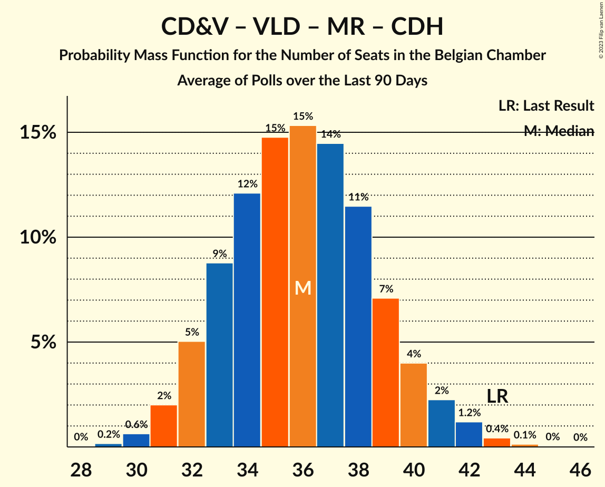
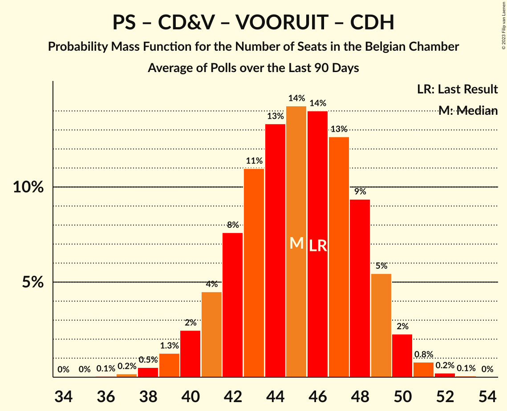

# Poll Average

<a href="#voting-intentions">Voting Intentions</a> | <a href="#seats">Seats</a> | <a href="#coalitions">Coalitions</a> | <a href="#technical-information">Technical Information</a>

## Summary

The table below lists the polls on which the average is based. They are the most recent polls (less than 90 days old) registered and analyzed so far.

| Period     | Polling firm/Commissioner(s) | N-VA | VB | PS | CD&V | PTB | PVDA | VLD | MR | VOORUIT | ECOLO | GROEN | CDH | DÉFI | PP |
|:----------:|:----------------------------:|:--:|:--:|:--:|:--:|:--:|:--:|:--:|:--:|:--:|:--:|:--:|:--:|:--:|:--:|
| 26 May 2019 | General Election | 16.0%   25 | 12.0%   18 | 9.5%   20 | 8.9%   12 | 4.8%   9 | 3.3%   3 | 8.5%   12 | 7.6%   14 | 6.7%   9 | 6.1%   13 | 6.1%   8 | 3.7%   5 | 2.2%   2 | 1.1%   0 |
| N/A | Poll Average | 11–12%   16–22 | 13–14%   20–25 | 7–8%   15–19 | 7–8%   6–14 | 6%   11–14 | 4–6%   5–8 | 7–8%   9–13 | 6–7%   13–17 | 6–8%   9–13 | 6%   11–15 | 4–6%   5–10 | 2–3%   4–5 | 2%   1–3 | N/A   N/A |
| [29 March–19 April 2021](2021-04-19-TNS.html) | TNS   De Standaard and VRT | N/A   18–22 | N/A   21–25 | N/A   N/A | N/A   6–10 | N/A   N/A | N/A   5–8 | N/A   8–11 | N/A   N/A | N/A   9–12 | N/A   N/A | N/A   8–10 | N/A   N/A | N/A   N/A | N/A   N/A |
| [4–9 March 2021](2021-03-09-Ipsos.html) | Ipsos   Het Laatste Nieuws, Le Soir, RTL TVi and VTM | 11–12%   16–21 | 13–14%   20–25 | 7–8%   15–19 | 7–8%   10–14 | 6%   11–14 | 4–6%   5–8 | 7–8%   9–14 | 6–7%   13–17 | 6–8%   9–13 | 6%   11–15 | 4–6%   4–9 | 2–3%   4–5 | 2%   1–3 | N/A   N/A |
| 26 May 2019 | General Election | 16.0%   25 | 12.0%   18 | 9.5%   20 | 8.9%   12 | 4.8%   9 | 3.3%   3 | 8.5%   12 | 7.6%   14 | 6.7%   9 | 6.1%   13 | 6.1%   8 | 3.7%   5 | 2.2%   2 | 1.1%   0 |

Only polls for which at least the sample size has been published are included in the table above.

**Legend:**
+ **Top half of each row:** Voting intentions (95% confidence interval)
+ **Bottom half of each row:** Seat projections for the Belgian Chamber (95% confidence interval)
+ **N-VA:** Nieuw-Vlaamse Alliantie
+ **VB:** Vlaams Belang
+ **PS:** Parti Socialiste
+ **CD&V:** Christen-Democratisch en Vlaams
+ **PTB:** Parti du Travail de Belgique
+ **PVDA:** Partij van de Arbeid van België
+ **VLD:** Open Vlaamse Liberalen en Democraten
+ **MR:** Mouvement Réformateur
+ **VOORUIT:** Vooruit
+ **ECOLO:** Ecolo
+ **GROEN:** Groen
+ **CDH:** Centre démocrate humaniste
+ **DÉFI:** DéFI
+ **PP:** Parti Populaire
+ **N/A (single party):** Party not included the published results
+ **N/A (entire row):** Calculation for this opinion poll not started yet

## Voting Intentions

### Confidence Intervals

| Party | Last Result | Median | 80% Confidence Interval | 90% Confidence Interval | 95% Confidence Interval | 99% Confidence Interval |
|:-----:|:-----------:|:------:|:-----------------------:|:-----------------------:|:-----------------------:|:-----------------------:|
| <a href="#nieuw-vlaamse-alliantie">Nieuw-Vlaamse Alliantie</a> | 16.0% | 11.4% | 10.9–11.7% |10.7–11.7% | 10.6–11.7% | 10.2–11.7% |
| <a href="#vlaams-belang">Vlaams Belang</a> | 12.0% | 13.6% | 13.0–13.9% |12.8–13.9% | 12.7–13.9% | 12.3–13.9% |
| <a href="#parti-socialiste">Parti Socialiste</a> | 9.5% | 7.6% | 7.3–7.7% |7.2–7.7% | 7.1–7.7% | 6.9–7.7% |
| <a href="#christen-democratisch-en-vlaams">Christen-Democratisch en Vlaams</a> | 8.9% | 7.4% | 6.9–7.6% |6.8–7.6% | 6.6–7.6% | 6.3–7.6% |
| <a href="#open-vlaamse-liberalen-en-democraten">Open Vlaamse Liberalen en Democraten</a> | 8.5% | 7.3% | 6.8–7.5% |6.7–7.5% | 6.6–7.5% | 6.3–7.5% |
| <a href="#mouvement-réformateur">Mouvement Réformateur</a> | 7.6% | 6.7% | 6.5–6.8% |6.4–6.8% | 6.3–6.8% | 6.1–6.9% |
| <a href="#vooruit">Vooruit</a> | 6.7% | 7.6% | 6.8–8.2% |6.6–8.3% | 6.4–8.4% | 6.1–8.5% |
| <a href="#ecolo">Ecolo</a> | 6.1% | 5.9% | 5.7–6.0% |5.6–6.0% | 5.5–6.0% | 5.3–6.0% |
| <a href="#groen">Groen</a> | 6.1% | 5.0% | 4.4–5.5% |4.2–5.6% | 4.1–5.7% | 3.8–5.8% |
| <a href="#parti-du-travail-de-belgique">Parti du Travail de Belgique</a> | 4.8% | 6.3% | 6.1–6.5% |6.0–6.5% | 5.9–6.5% | 5.7–6.5% |
| <a href="#centre-démocrate-humaniste">Centre démocrate humaniste</a> | 3.7% | 2.5% | 2.3–2.6% |2.3–2.6% | 2.2–2.6% | 2.1–2.6% |
| <a href="#partij-van-de-arbeid-van-belgië">Partij van de Arbeid van België</a> | 3.3% | 5.0% | 4.4–5.5% |4.2–5.6% | 4.1–5.7% | 3.8–5.8% |
| <a href="#défi">DéFI</a> | 2.2% | 1.7% | 1.6–1.8% |1.5–1.8% | 1.5–1.8% | 1.4–1.8% |
| <a href="#parti-populaire">Parti Populaire</a> | 1.1% | N/A | N/A |N/A | N/A | N/A |

### Nieuw-Vlaamse Alliantie

*For a full overview of the results for this party, see the [Nieuw-Vlaamse Alliantie](party-nieuw-vlaamsealliantie.html) page.*

| Voting Intentions | Probability | Accumulated | Special Marks |
|:-----------------:|:-----------:|:-----------:|:-------------:|
| 8.5–9.5% | 0% | 100% |  |
| 9.5–10.5% | 2% | 100% |  |
| 10.5–11.5% | 63% | 98% | Median |
| 11.5–12.5% | 100% | 34% |  |
| 12.5–13.5% | 100% | 0% |  |
| 13.5–14.5% | 80% | 0% |  |
| 14.5–15.5% | 6% | 0% |  |
| 15.5–16.5% | 0.1% | 0% | Last Result |

### Vlaams Belang

*For a full overview of the results for this party, see the [Vlaams Belang](party-vlaamsbelang.html) page.*

| Voting Intentions | Probability | Accumulated | Special Marks |
|:-----------------:|:-----------:|:-----------:|:-------------:|
| 10.5–11.5% | 0% | 100% |  |
| 11.5–12.5% | 2% | 100% | Last Result |
| 12.5–13.5% | 42% | 98% |  |
| 13.5–14.5% | 100% | 57% | Median |
| 14.5–15.5% | 100% | 0% |  |
| 15.5–16.5% | 100% | 0% |  |
| 16.5–17.5% | 16% | 0% |  |
| 17.5–18.5% | 0.6% | 0% |  |

### Parti Socialiste

*For a full overview of the results for this party, see the [Parti Socialiste](party-partisocialiste.html) page.*

| Voting Intentions | Probability | Accumulated | Special Marks |
|:-----------------:|:-----------:|:-----------:|:-------------:|
| 5.5–6.5% | 0% | 100% |  |
| 6.5–7.5% | 40% | 100% |  |
| 7.5–8.5% | 100% | 60% | Median |
| 8.5–9.5% | 100% | 0% | Last Result |
| 9.5–10.5% | 4% | 0% |  |

### Christen-Democratisch en Vlaams

*For a full overview of the results for this party, see the [Christen-Democratisch en Vlaams](party-christen-democratischenvlaams.html) page.*

| Voting Intentions | Probability | Accumulated | Special Marks |
|:-----------------:|:-----------:|:-----------:|:-------------:|
| 4.5–5.5% | 0% | 100% |  |
| 5.5–6.5% | 2% | 100% |  |
| 6.5–7.5% | 86% | 98% | Median |
| 7.5–8.5% | 100% | 13% |  |
| 8.5–9.5% | 100% | 0% | Last Result |
| 9.5–10.5% | 25% | 0% |  |
| 10.5–11.5% | 0.6% | 0% |  |

### Open Vlaamse Liberalen en Democraten

*For a full overview of the results for this party, see the [Open Vlaamse Liberalen en Democraten](party-openvlaamseliberalenendemocraten.html) page.*

| Voting Intentions | Probability | Accumulated | Special Marks |
|:-----------------:|:-----------:|:-----------:|:-------------:|
| 4.5–5.5% | 0% | 100% |  |
| 5.5–6.5% | 2% | 100% |  |
| 6.5–7.5% | 100% | 98% | Median |
| 7.5–8.5% | 100% | 0% |  |
| 8.5–9.5% | 100% | 0% | Last Result |
| 9.5–10.5% | 20% | 0% |  |
| 10.5–11.5% | 0.4% | 0% |  |

### Mouvement Réformateur

*For a full overview of the results for this party, see the [Mouvement Réformateur](party-mouvementréformateur.html) page.*

| Voting Intentions | Probability | Accumulated | Special Marks |
|:-----------------:|:-----------:|:-----------:|:-------------:|
| 4.5–5.5% | 0% | 100% |  |
| 5.5–6.5% | 18% | 100% |  |
| 6.5–7.5% | 100% | 82% | Median |
| 7.5–8.5% | 100% | 0% | Last Result |
| 8.5–9.5% | 5% | 0% |  |

### Vooruit

*For a full overview of the results for this party, see the [Vooruit](party-vooruit.html) page.*

| Voting Intentions | Probability | Accumulated | Special Marks |
|:-----------------:|:-----------:|:-----------:|:-------------:|
| 4.5–5.5% | 0% | 100% |  |
| 5.5–6.5% | 4% | 100% |  |
| 6.5–7.5% | 44% | 96% | Last Result |
| 7.5–8.5% | 54% | 52% | Median |
| 8.5–9.5% | 9% | 0% |  |
| 9.5–10.5% | 0.3% | 0% |  |

### Ecolo

*For a full overview of the results for this party, see the [Ecolo](party-ecolo.html) page.*

| Voting Intentions | Probability | Accumulated | Special Marks |
|:-----------------:|:-----------:|:-----------:|:-------------:|
| 3.5–4.5% | 0% | 100% |  |
| 4.5–5.5% | 3% | 100% |  |
| 5.5–6.5% | 100% | 97% | Last Result, Median |
| 6.5–7.5% | 100% | 0% |  |
| 7.5–8.5% | 10% | 0% |  |

### Groen

*For a full overview of the results for this party, see the [Groen](party-groen.html) page.*

| Voting Intentions | Probability | Accumulated | Special Marks |
|:-----------------:|:-----------:|:-----------:|:-------------:|
| 2.5–3.5% | 0.1% | 100% |  |
| 3.5–4.5% | 17% | 99.9% |  |
| 4.5–5.5% | 73% | 83% | Median |
| 5.5–6.5% | 21% | 10% | Last Result |
| 6.5–7.5% | 0.6% | 0% |  |

### Parti du Travail de Belgique

*For a full overview of the results for this party, see the [Parti du Travail de Belgique](party-partidutravaildebelgique.html) page.*

| Voting Intentions | Probability | Accumulated | Special Marks |
|:-----------------:|:-----------:|:-----------:|:-------------:|
| 4.5–5.5% | 0.1% | 100% | Last Result |
| 5.5–6.5% | 100% | 99.9% | Median |
| 6.5–7.5% | 100% | 0% |  |
| 7.5–8.5% | 100% | 0% |  |
| 8.5–9.5% | 0.2% | 0% |  |

### Centre démocrate humaniste

*For a full overview of the results for this party, see the [Centre démocrate humaniste](party-centredémocratehumaniste.html) page.*

| Voting Intentions | Probability | Accumulated | Special Marks |
|:-----------------:|:-----------:|:-----------:|:-------------:|
| 0.5–1.5% | 0% | 100% |  |
| 1.5–2.5% | 75% | 100% | Median |
| 2.5–3.5% | 100% | 25% |  |
| 3.5–4.5% | 34% | 0% | Last Result |

### Partij van de Arbeid van België

*For a full overview of the results for this party, see the [Partij van de Arbeid van België](party-partijvandearbeidvanbelgië.html) page.*

| Voting Intentions | Probability | Accumulated | Special Marks |
|:-----------------:|:-----------:|:-----------:|:-------------:|
| 2.5–3.5% | 0.1% | 100% | Last Result |
| 3.5–4.5% | 17% | 99.9% |  |
| 4.5–5.5% | 73% | 83% | Median |
| 5.5–6.5% | 21% | 10% |  |
| 6.5–7.5% | 0.6% | 0% |  |

### DéFI

*For a full overview of the results for this party, see the [DéFI](party-défi.html) page.*

| Voting Intentions | Probability | Accumulated | Special Marks |
|:-----------------:|:-----------:|:-----------:|:-------------:|
| 0.0–0.5% | 0% | 100% |  |
| 0.5–1.5% | 6% | 100% |  |
| 1.5–2.5% | 100% | 94% | Last Result, Median |
| 2.5–3.5% | 22% | 0% |  |

## Seats

### Confidence Intervals

| Party | Last Result | Median | 80% Confidence Interval | 90% Confidence Interval | 95% Confidence Interval | 99% Confidence Interval |
|:-----:|:-----------:|:------:|:-----------------------:|:-----------------------:|:-----------------------:|:-----------------------:|
| <a href="#nieuw-vlaamse-alliantie">Nieuw-Vlaamse Alliantie</a> | 25 | 20 | 17–21 |16–22 | 16–22 | 15–23 |
| <a href="#vlaams-belang">Vlaams Belang</a> | 18 | 23 | 21–25 |20–25 | 20–25 | 19–26 |
| <a href="#parti-socialiste">Parti Socialiste</a> | 20 | 17 | 15–18 |15–19 | 15–19 | 14–19 |
| <a href="#christen-democratisch-en-vlaams">Christen-Democratisch en Vlaams</a> | 12 | 10 | 7–13 |6–14 | 6–14 | 6–15 |
| <a href="#open-vlaamse-liberalen-en-democraten">Open Vlaamse Liberalen en Democraten</a> | 12 | 10 | 10–12 |9–13 | 9–13 | 8–14 |
| <a href="#mouvement-réformateur">Mouvement Réformateur</a> | 14 | 14 | 13–16 |13–17 | 13–17 | 12–17 |
| <a href="#vooruit">Vooruit</a> | 9 | 11 | 9–12 |9–12 | 9–13 | 8–14 |
| <a href="#ecolo">Ecolo</a> | 13 | 13 | 12–14 |11–14 | 11–15 | 10–16 |
| <a href="#groen">Groen</a> | 8 | 9 | 5–9 |5–9 | 5–10 | 4–11 |
| <a href="#parti-du-travail-de-belgique">Parti du Travail de Belgique</a> | 9 | 13 | 12–13 |11–14 | 11–14 | 10–16 |
| <a href="#centre-démocrate-humaniste">Centre démocrate humaniste</a> | 5 | 4 | 4–5 |4–5 | 4–5 | 3–5 |
| <a href="#partij-van-de-arbeid-van-belgië">Partij van de Arbeid van België</a> | 3 | 6 | 5–8 |5–8 | 5–8 | 4–8 |
| <a href="#défi">DéFI</a> | 2 | 2 | 2 |1–2 | 1–3 | 1–3 |
| <a href="#parti-populaire">Parti Populaire</a> | 0 | N/A | N/A |N/A | N/A | N/A |

### Nieuw-Vlaamse Alliantie

*For a full overview of the results for this party, see the [Nieuw-Vlaamse Alliantie](party-nieuw-vlaamsealliantie.html) page.*

| Number of Seats | Probability | Accumulated | Special Marks |
|:---------------:|:-----------:|:-----------:|:-------------:|
| 15 | 0.5% | 100% |  |
| 16 | 6% | 99.5% |  |
| 17 | 7% | 94% |  |
| 18 | 8% | 87% |  |
| 19 | 26% | 79% |  |
| 20 | 34% | 53% | Median |
| 21 | 14% | 19% |  |
| 22 | 5% | 5% |  |
| 23 | 0.5% | 0.6% |  |
| 24 | 0.1% | 0.1% |  |
| 25 | 0% | 0% | Last Result |

### Vlaams Belang

*For a full overview of the results for this party, see the [Vlaams Belang](party-vlaamsbelang.html) page.*

| Number of Seats | Probability | Accumulated | Special Marks |
|:---------------:|:-----------:|:-----------:|:-------------:|
| 17 | 0.1% | 100% |  |
| 18 | 0.1% | 99.9% | Last Result |
| 19 | 0.9% | 99.8% |  |
| 20 | 4% | 98.9% |  |
| 21 | 18% | 95% |  |
| 22 | 14% | 77% |  |
| 23 | 30% | 63% | Median |
| 24 | 14% | 33% |  |
| 25 | 18% | 19% |  |
| 26 | 1.2% | 1.4% |  |
| 27 | 0.1% | 0.2% |  |
| 28 | 0.1% | 0.1% |  |
| 29 | 0% | 0% |  |

### Parti Socialiste

*For a full overview of the results for this party, see the [Parti Socialiste](party-partisocialiste.html) page.*

| Number of Seats | Probability | Accumulated | Special Marks |
|:---------------:|:-----------:|:-----------:|:-------------:|
| 12 | 0.1% | 100% |  |
| 13 | 0.2% | 99.9% |  |
| 14 | 1.0% | 99.7% |  |
| 15 | 9% | 98.7% |  |
| 16 | 24% | 89% |  |
| 17 | 29% | 66% | Median |
| 18 | 31% | 37% |  |
| 19 | 6% | 6% |  |
| 20 | 0.3% | 0.4% | Last Result |
| 21 | 0% | 0% |  |

### Christen-Democratisch en Vlaams

*For a full overview of the results for this party, see the [Christen-Democratisch en Vlaams](party-christen-democratischenvlaams.html) page.*

| Number of Seats | Probability | Accumulated | Special Marks |
|:---------------:|:-----------:|:-----------:|:-------------:|
| 5 | 0.1% | 100% |  |
| 6 | 7% | 99.9% |  |
| 7 | 4% | 93% |  |
| 8 | 12% | 89% |  |
| 9 | 16% | 77% |  |
| 10 | 25% | 61% | Median |
| 11 | 15% | 36% |  |
| 12 | 9% | 20% | Last Result |
| 13 | 5% | 12% |  |
| 14 | 6% | 7% |  |
| 15 | 0.6% | 0.7% |  |
| 16 | 0.1% | 0.1% |  |
| 17 | 0% | 0% |  |

### Open Vlaamse Liberalen en Democraten

*For a full overview of the results for this party, see the [Open Vlaamse Liberalen en Democraten](party-openvlaamseliberalenendemocraten.html) page.*

| Number of Seats | Probability | Accumulated | Special Marks |
|:---------------:|:-----------:|:-----------:|:-------------:|
| 7 | 0.1% | 100% |  |
| 8 | 2% | 99.9% |  |
| 9 | 7% | 98% |  |
| 10 | 59% | 92% | Median |
| 11 | 20% | 32% |  |
| 12 | 7% | 13% | Last Result |
| 13 | 3% | 6% |  |
| 14 | 2% | 2% |  |
| 15 | 0.3% | 0.4% |  |
| 16 | 0.1% | 0.1% |  |
| 17 | 0% | 0% |  |

### Mouvement Réformateur

*For a full overview of the results for this party, see the [Mouvement Réformateur](party-mouvementréformateur.html) page.*

| Number of Seats | Probability | Accumulated | Special Marks |
|:---------------:|:-----------:|:-----------:|:-------------:|
| 12 | 2% | 100% |  |
| 13 | 27% | 98% |  |
| 14 | 26% | 71% | Last Result, Median |
| 15 | 27% | 45% |  |
| 16 | 9% | 18% |  |
| 17 | 9% | 9% |  |
| 18 | 0.4% | 0.4% |  |
| 19 | 0% | 0% |  |

### Vooruit

*For a full overview of the results for this party, see the [Vooruit](party-vooruit.html) page.*

| Number of Seats | Probability | Accumulated | Special Marks |
|:---------------:|:-----------:|:-----------:|:-------------:|
| 7 | 0.2% | 100% |  |
| 8 | 0.8% | 99.8% |  |
| 9 | 20% | 99.0% | Last Result |
| 10 | 18% | 79% |  |
| 11 | 50% | 61% | Median |
| 12 | 8% | 11% |  |
| 13 | 2% | 3% |  |
| 14 | 0.7% | 0.8% |  |
| 15 | 0.1% | 0.1% |  |
| 16 | 0% | 0% |  |

### Ecolo

*For a full overview of the results for this party, see the [Ecolo](party-ecolo.html) page.*

| Number of Seats | Probability | Accumulated | Special Marks |
|:---------------:|:-----------:|:-----------:|:-------------:|
| 10 | 1.0% | 100% |  |
| 11 | 7% | 99.0% |  |
| 12 | 20% | 92% |  |
| 13 | 44% | 72% | Last Result, Median |
| 14 | 24% | 28% |  |
| 15 | 3% | 4% |  |
| 16 | 0.5% | 0.7% |  |
| 17 | 0.1% | 0.2% |  |
| 18 | 0% | 0% |  |

### Groen

*For a full overview of the results for this party, see the [Groen](party-groen.html) page.*

| Number of Seats | Probability | Accumulated | Special Marks |
|:---------------:|:-----------:|:-----------:|:-------------:|
| 3 | 0.2% | 100% |  |
| 4 | 1.5% | 99.8% |  |
| 5 | 19% | 98% |  |
| 6 | 13% | 80% |  |
| 7 | 9% | 66% |  |
| 8 | 7% | 57% | Last Result |
| 9 | 46% | 51% | Median |
| 10 | 3% | 4% |  |
| 11 | 0.5% | 0.7% |  |
| 12 | 0.1% | 0.2% |  |
| 13 | 0.1% | 0.1% |  |
| 14 | 0% | 0% |  |

### Parti du Travail de Belgique

*For a full overview of the results for this party, see the [Parti du Travail de Belgique](party-partidutravaildebelgique.html) page.*

| Number of Seats | Probability | Accumulated | Special Marks |
|:---------------:|:-----------:|:-----------:|:-------------:|
| 9 | 0% | 100% | Last Result |
| 10 | 0.7% | 100% |  |
| 11 | 9% | 99.3% |  |
| 12 | 39% | 90% |  |
| 13 | 42% | 52% | Median |
| 14 | 7% | 9% |  |
| 15 | 1.2% | 2% |  |
| 16 | 0.8% | 1.1% |  |
| 17 | 0.3% | 0.3% |  |
| 18 | 0.1% | 0.1% |  |
| 19 | 0% | 0% |  |

### Centre démocrate humaniste

*For a full overview of the results for this party, see the [Centre démocrate humaniste](party-centredémocratehumaniste.html) page.*

| Number of Seats | Probability | Accumulated | Special Marks |
|:---------------:|:-----------:|:-----------:|:-------------:|
| 1 | 0.1% | 100% |  |
| 2 | 0.4% | 99.9% |  |
| 3 | 0.5% | 99.5% |  |
| 4 | 87% | 99.0% | Median |
| 5 | 12% | 12% | Last Result |
| 6 | 0.1% | 0.1% |  |
| 7 | 0% | 0% |  |

### Partij van de Arbeid van België

*For a full overview of the results for this party, see the [Partij van de Arbeid van België](party-partijvandearbeidvanbelgië.html) page.*

| Number of Seats | Probability | Accumulated | Special Marks |
|:---------------:|:-----------:|:-----------:|:-------------:|
| 3 | 0.2% | 100% | Last Result |
| 4 | 1.4% | 99.8% |  |
| 5 | 33% | 98% |  |
| 6 | 24% | 65% | Median |
| 7 | 20% | 41% |  |
| 8 | 21% | 21% |  |
| 9 | 0.4% | 0.4% |  |
| 10 | 0% | 0% |  |

### DéFI

*For a full overview of the results for this party, see the [DéFI](party-défi.html) page.*

| Number of Seats | Probability | Accumulated | Special Marks |
|:---------------:|:-----------:|:-----------:|:-------------:|
| 1 | 7% | 100% |  |
| 2 | 89% | 93% | Last Result, Median |
| 3 | 5% | 5% |  |
| 4 | 0.3% | 0.3% |  |
| 5 | 0% | 0% |  |

### Parti Populaire

*For a full overview of the results for this party, see the [Parti Populaire](party-partipopulaire.html) page.*

## Coalitions

### Confidence Intervals

| Coalition | Last Result | Median | Majority? | 80% Confidence Interval | 90% Confidence Interval | 95% Confidence Interval | 99% Confidence Interval |
|:---------:|:-----------:|:------:|:---------:|:-----------------------:|:-----------------------:|:-----------------------:|:-----------------------:|
| Nieuw-Vlaamse Alliantie – Christen-Democratisch en Vlaams – Open Vlaamse Liberalen en Democraten – Mouvement Réformateur – Centre démocrate humaniste | 68 | 46 | 0% | 37–62 | 36–63 | 36–64 | 35–65 |
| Christen-Democratisch en Vlaams – Open Vlaamse Liberalen en Democraten – Mouvement Réformateur – Ecolo – Groen – Centre démocrate humaniste | 64 | 42 | 0% | 26–62 | 25–63 | 25–64 | 24–65 |
| Parti Socialiste – Christen-Democratisch en Vlaams – Open Vlaamse Liberalen en Democraten – Mouvement Réformateur – Centre démocrate humaniste | 63 | 27 | 0% | 17–60 | 16–61 | 16–62 | 15–63 |
| Nieuw-Vlaamse Alliantie – Christen-Democratisch en Vlaams – Open Vlaamse Liberalen en Democraten – Mouvement Réformateur | 63 | 46 | 0% | 37–58 | 36–59 | 36–60 | 35–61 |
| Christen-Democratisch en Vlaams – Open Vlaamse Liberalen en Democraten – Mouvement Réformateur – Centre démocrate humaniste | 43 | 26 | 0% | 17–43 | 16–44 | 16–45 | 15–46 |
| Nieuw-Vlaamse Alliantie – Parti Socialiste – Open Vlaamse Liberalen en Democraten – Mouvement Réformateur – Vooruit | 80 | 40 | 0% | 38–42 | 38–43 | 37–44 | 36–45 |
| Parti Socialiste – Christen-Democratisch en Vlaams – Open Vlaamse Liberalen en Democraten – Mouvement Réformateur – Vooruit – Ecolo – Groen – Centre démocrate humaniste | 93 | 38 | 0% | 36–41 | 36–42 | 35–43 | 34–44 |
| Parti Socialiste – Christen-Democratisch en Vlaams – Open Vlaamse Liberalen en Democraten – Mouvement Réformateur – Vooruit – Ecolo – Groen | 88 | 38 | 0% | 36–41 | 36–42 | 35–43 | 34–44 |
| Parti Socialiste – Christen-Democratisch en Vlaams – Vooruit – Ecolo – Groen – Parti du Travail de Belgique – Centre démocrate humaniste – Partij van de Arbeid van België | 79 | 34 | 0% | 32–37 | 32–37 | 31–38 | 30–40 |
| Parti Socialiste – Christen-Democratisch en Vlaams – Open Vlaamse Liberalen en Democraten – Mouvement Réformateur – Vooruit – Centre démocrate humaniste | 72 | 30 | 0% | 27–35 | 27–36 | 26–36 | 26–38 |
| Parti Socialiste – Christen-Democratisch en Vlaams – Vooruit – Ecolo – Groen – Centre démocrate humaniste | 67 | 28 | 0% | 26–30 | 26–31 | 25–32 | 24–33 |
| Parti Socialiste – Open Vlaamse Liberalen en Democraten – Mouvement Réformateur – Vooruit – Ecolo – Groen | 76 | 29 | 0% | 26–31 | 26–31 | 25–31 | 24–32 |
| Parti Socialiste – Vooruit – Ecolo – Groen – Parti du Travail de Belgique – Centre démocrate humaniste – Partij van de Arbeid van België | 67 | 25 | 0% | 22–27 | 21–28 | 20–28 | 19–28 |
| Parti Socialiste – Vooruit – Ecolo – Groen – Parti du Travail de Belgique – Partij van de Arbeid van België | 62 | 25 | 0% | 22–27 | 21–28 | 20–28 | 19–28 |
| Parti Socialiste – Christen-Democratisch en Vlaams – Vooruit – Centre démocrate humaniste | 46 | 20 | 0% | 17–24 | 17–25 | 17–25 | 16–26 |
| Parti Socialiste – Open Vlaamse Liberalen en Democraten – Mouvement Réformateur – Vooruit | 55 | 21 | 0% | 19–23 | 19–24 | 19–24 | 18–26 |

### Nieuw-Vlaamse Alliantie – Christen-Democratisch en Vlaams – Open Vlaamse Liberalen en Democraten – Mouvement Réformateur – Centre démocrate humaniste

| Number of Seats | Probability | Accumulated | Special Marks |
|:---------------:|:-----------:|:-----------:|:-------------:|
| 34 | 0.4% | 100% |  |
| 35 | 1.0% | 99.6% |  |
| 36 | 7% | 98.6% |  |
| 37 | 5% | 92% |  |
| 38 | 11% | 87% |  |
| 39 | 19% | 76% |  |
| 40 | 6% | 57% |  |
| 41 | 0.4% | 51% |  |
| 42 | 0.2% | 50% |  |
| 43 | 0% | 50% |  |
| 44 | 0% | 50% |  |
| 45 | 0% | 50% |  |
| 46 | 0% | 50% |  |
| 47 | 0% | 50% |  |
| 48 | 0% | 50% |  |
| 49 | 0% | 50% |  |
| 50 | 0% | 50% |  |
| 51 | 0% | 50% |  |
| 52 | 0% | 50% |  |
| 53 | 0.1% | 50% |  |
| 54 | 0.4% | 50% |  |
| 55 | 1.2% | 49% |  |
| 56 | 2% | 48% |  |
| 57 | 4% | 46% |  |
| 58 | 6% | 41% | Median |
| 59 | 7% | 35% |  |
| 60 | 8% | 28% |  |
| 61 | 7% | 20% |  |
| 62 | 6% | 13% |  |
| 63 | 4% | 7% |  |
| 64 | 2% | 3% |  |
| 65 | 0.9% | 1.4% |  |
| 66 | 0.3% | 0.5% |  |
| 67 | 0.1% | 0.1% |  |
| 68 | 0% | 0% | Last Result |

### Christen-Democratisch en Vlaams – Open Vlaamse Liberalen en Democraten – Mouvement Réformateur – Ecolo – Groen – Centre démocrate humaniste

| Number of Seats | Probability | Accumulated | Special Marks |
|:---------------:|:-----------:|:-----------:|:-------------:|
| 23 | 0.1% | 100% |  |
| 24 | 2% | 99.9% |  |
| 25 | 5% | 98% |  |
| 26 | 7% | 93% |  |
| 27 | 12% | 86% |  |
| 28 | 13% | 75% |  |
| 29 | 10% | 62% |  |
| 30 | 1.2% | 51% |  |
| 31 | 0.1% | 50% |  |
| 32 | 0.1% | 50% |  |
| 33 | 0% | 50% |  |
| 34 | 0% | 50% |  |
| 35 | 0% | 50% |  |
| 36 | 0% | 50% |  |
| 37 | 0% | 50% |  |
| 38 | 0% | 50% |  |
| 39 | 0% | 50% |  |
| 40 | 0% | 50% |  |
| 41 | 0% | 50% |  |
| 42 | 0% | 50% |  |
| 43 | 0% | 50% |  |
| 44 | 0% | 50% |  |
| 45 | 0% | 50% |  |
| 46 | 0% | 50% |  |
| 47 | 0% | 50% |  |
| 48 | 0% | 50% |  |
| 49 | 0% | 50% |  |
| 50 | 0% | 50% |  |
| 51 | 0% | 50% |  |
| 52 | 0% | 50% |  |
| 53 | 0% | 50% |  |
| 54 | 0.2% | 50% |  |
| 55 | 0.7% | 50% |  |
| 56 | 2% | 49% |  |
| 57 | 4% | 47% |  |
| 58 | 6% | 43% |  |
| 59 | 7% | 36% |  |
| 60 | 7% | 29% | Median |
| 61 | 7% | 22% |  |
| 62 | 6% | 14% |  |
| 63 | 4% | 8% |  |
| 64 | 2% | 4% | Last Result |
| 65 | 1.0% | 1.4% |  |
| 66 | 0.3% | 0.4% |  |
| 67 | 0.1% | 0.1% |  |
| 68 | 0% | 0% |  |

### Parti Socialiste – Christen-Democratisch en Vlaams – Open Vlaamse Liberalen en Democraten – Mouvement Réformateur – Centre démocrate humaniste

| Number of Seats | Probability | Accumulated | Special Marks |
|:---------------:|:-----------:|:-----------:|:-------------:|
| 15 | 2% | 100% |  |
| 16 | 6% | 98% |  |
| 17 | 5% | 92% |  |
| 18 | 12% | 87% |  |
| 19 | 15% | 76% |  |
| 20 | 10% | 61% |  |
| 21 | 0.3% | 50% |  |
| 22 | 0% | 50% |  |
| 23 | 0% | 50% |  |
| 24 | 0% | 50% |  |
| 25 | 0% | 50% |  |
| 26 | 0% | 50% |  |
| 27 | 0% | 50% |  |
| 28 | 0% | 50% |  |
| 29 | 0% | 50% |  |
| 30 | 0% | 50% |  |
| 31 | 0% | 50% |  |
| 32 | 0% | 50% |  |
| 33 | 0% | 50% |  |
| 34 | 0% | 50% |  |
| 35 | 0% | 50% |  |
| 36 | 0% | 50% |  |
| 37 | 0% | 50% |  |
| 38 | 0% | 50% |  |
| 39 | 0% | 50% |  |
| 40 | 0% | 50% |  |
| 41 | 0% | 50% |  |
| 42 | 0% | 50% |  |
| 43 | 0% | 50% |  |
| 44 | 0% | 50% |  |
| 45 | 0% | 50% |  |
| 46 | 0% | 50% |  |
| 47 | 0% | 50% |  |
| 48 | 0% | 50% |  |
| 49 | 0% | 50% |  |
| 50 | 0% | 50% |  |
| 51 | 0% | 50% |  |
| 52 | 0.1% | 50% |  |
| 53 | 0.4% | 50% |  |
| 54 | 1.4% | 49% |  |
| 55 | 4% | 48% | Median |
| 56 | 7% | 44% |  |
| 57 | 9% | 37% |  |
| 58 | 9% | 28% |  |
| 59 | 8% | 19% |  |
| 60 | 6% | 12% |  |
| 61 | 4% | 6% |  |
| 62 | 2% | 3% |  |
| 63 | 0.7% | 0.9% | Last Result |
| 64 | 0.2% | 0.2% |  |
| 65 | 0% | 0.1% |  |
| 66 | 0% | 0% |  |

### Nieuw-Vlaamse Alliantie – Christen-Democratisch en Vlaams – Open Vlaamse Liberalen en Democraten – Mouvement Réformateur

| Number of Seats | Probability | Accumulated | Special Marks |
|:---------------:|:-----------:|:-----------:|:-------------:|
| 34 | 0.4% | 100% |  |
| 35 | 1.0% | 99.6% |  |
| 36 | 7% | 98.6% |  |
| 37 | 5% | 92% |  |
| 38 | 11% | 87% |  |
| 39 | 19% | 76% |  |
| 40 | 6% | 57% |  |
| 41 | 0.4% | 51% |  |
| 42 | 0.2% | 50% |  |
| 43 | 0% | 50% |  |
| 44 | 0% | 50% |  |
| 45 | 0% | 50% |  |
| 46 | 0% | 50% |  |
| 47 | 0% | 50% |  |
| 48 | 0% | 50% |  |
| 49 | 0.1% | 50% |  |
| 50 | 0.5% | 50% |  |
| 51 | 1.3% | 49% |  |
| 52 | 3% | 48% |  |
| 53 | 5% | 45% |  |
| 54 | 6% | 41% | Median |
| 55 | 8% | 34% |  |
| 56 | 8% | 27% |  |
| 57 | 7% | 19% |  |
| 58 | 5% | 12% |  |
| 59 | 3% | 6% |  |
| 60 | 2% | 3% |  |
| 61 | 0.8% | 1.2% |  |
| 62 | 0.3% | 0.4% |  |
| 63 | 0.1% | 0.1% | Last Result |
| 64 | 0% | 0% |  |

### Christen-Democratisch en Vlaams – Open Vlaamse Liberalen en Democraten – Mouvement Réformateur – Centre démocrate humaniste

| Number of Seats | Probability | Accumulated | Special Marks |
|:---------------:|:-----------:|:-----------:|:-------------:|
| 15 | 2% | 100% |  |
| 16 | 6% | 98% |  |
| 17 | 5% | 92% |  |
| 18 | 12% | 87% |  |
| 19 | 15% | 76% |  |
| 20 | 10% | 61% |  |
| 21 | 0.3% | 50% |  |
| 22 | 0% | 50% |  |
| 23 | 0% | 50% |  |
| 24 | 0% | 50% |  |
| 25 | 0% | 50% |  |
| 26 | 0% | 50% |  |
| 27 | 0% | 50% |  |
| 28 | 0% | 50% |  |
| 29 | 0% | 50% |  |
| 30 | 0% | 50% |  |
| 31 | 0% | 50% |  |
| 32 | 0% | 50% |  |
| 33 | 0% | 50% |  |
| 34 | 0% | 50% |  |
| 35 | 0% | 50% |  |
| 36 | 0.2% | 50% |  |
| 37 | 2% | 50% |  |
| 38 | 4% | 48% | Median |
| 39 | 7% | 43% |  |
| 40 | 8% | 36% |  |
| 41 | 8% | 28% |  |
| 42 | 7% | 20% |  |
| 43 | 6% | 12% | Last Result |
| 44 | 4% | 7% |  |
| 45 | 2% | 3% |  |
| 46 | 0.9% | 1.3% |  |
| 47 | 0.3% | 0.4% |  |
| 48 | 0.1% | 0.1% |  |
| 49 | 0% | 0% |  |

### Nieuw-Vlaamse Alliantie – Parti Socialiste – Open Vlaamse Liberalen en Democraten – Mouvement Réformateur – Vooruit

| Number of Seats | Probability | Accumulated | Special Marks |
|:---------------:|:-----------:|:-----------:|:-------------:|
| 35 | 0.1% | 100% |  |
| 36 | 0.5% | 99.9% |  |
| 37 | 2% | 99.4% |  |
| 38 | 12% | 97% |  |
| 39 | 17% | 85% |  |
| 40 | 21% | 68% |  |
| 41 | 24% | 47% |  |
| 42 | 14% | 24% |  |
| 43 | 7% | 10% |  |
| 44 | 2% | 3% |  |
| 45 | 0.7% | 0.9% |  |
| 46 | 0.2% | 0.2% |  |
| 47 | 0% | 0% |  |
| 48 | 0% | 0% |  |
| 49 | 0% | 0% |  |
| 50 | 0% | 0% |  |
| 51 | 0% | 0% |  |
| 52 | 0% | 0% |  |
| 53 | 0% | 0% |  |
| 54 | 0% | 0% |  |
| 55 | 0% | 0% |  |
| 56 | 0% | 0% |  |
| 57 | 0% | 0% |  |
| 58 | 0% | 0% |  |
| 59 | 0% | 0% |  |
| 60 | 0% | 0% |  |
| 61 | 0% | 0% |  |
| 62 | 0% | 0% |  |
| 63 | 0% | 0% |  |
| 64 | 0% | 0% |  |
| 65 | 0% | 0% |  |
| 66 | 0% | 0% |  |
| 67 | 0% | 0% |  |
| 68 | 0% | 0% |  |
| 69 | 0% | 0% |  |
| 70 | 0% | 0% |  |
| 71 | 0% | 0% |  |
| 72 | 0% | 0% | Median |
| 73 | 0% | 0% |  |
| 74 | 0% | 0% |  |
| 75 | 0% | 0% |  |
| 76 | 0% | 0% | Majority |
| 77 | 0% | 0% |  |
| 78 | 0% | 0% |  |
| 79 | 0% | 0% |  |
| 80 | 0% | 0% | Last Result |

### Parti Socialiste – Christen-Democratisch en Vlaams – Open Vlaamse Liberalen en Democraten – Mouvement Réformateur – Vooruit – Ecolo – Groen – Centre démocrate humaniste

| Number of Seats | Probability | Accumulated | Special Marks |
|:---------------:|:-----------:|:-----------:|:-------------:|
| 33 | 0.1% | 100% |  |
| 34 | 0.5% | 99.9% |  |
| 35 | 3% | 99.4% |  |
| 36 | 10% | 96% |  |
| 37 | 21% | 86% |  |
| 38 | 17% | 65% |  |
| 39 | 22% | 48% |  |
| 40 | 10% | 26% |  |
| 41 | 8% | 16% |  |
| 42 | 5% | 8% |  |
| 43 | 2% | 3% |  |
| 44 | 0.7% | 0.9% |  |
| 45 | 0.1% | 0.2% |  |
| 46 | 0% | 0% |  |
| 47 | 0% | 0% |  |
| 48 | 0% | 0% |  |
| 49 | 0% | 0% |  |
| 50 | 0% | 0% |  |
| 51 | 0% | 0% |  |
| 52 | 0% | 0% |  |
| 53 | 0% | 0% |  |
| 54 | 0% | 0% |  |
| 55 | 0% | 0% |  |
| 56 | 0% | 0% |  |
| 57 | 0% | 0% |  |
| 58 | 0% | 0% |  |
| 59 | 0% | 0% |  |
| 60 | 0% | 0% |  |
| 61 | 0% | 0% |  |
| 62 | 0% | 0% |  |
| 63 | 0% | 0% |  |
| 64 | 0% | 0% |  |
| 65 | 0% | 0% |  |
| 66 | 0% | 0% |  |
| 67 | 0% | 0% |  |
| 68 | 0% | 0% |  |
| 69 | 0% | 0% |  |
| 70 | 0% | 0% |  |
| 71 | 0% | 0% |  |
| 72 | 0% | 0% |  |
| 73 | 0% | 0% |  |
| 74 | 0% | 0% |  |
| 75 | 0% | 0% |  |
| 76 | 0% | 0% | Majority |
| 77 | 0% | 0% |  |
| 78 | 0% | 0% |  |
| 79 | 0% | 0% |  |
| 80 | 0% | 0% |  |
| 81 | 0% | 0% |  |
| 82 | 0% | 0% |  |
| 83 | 0% | 0% |  |
| 84 | 0% | 0% |  |
| 85 | 0% | 0% |  |
| 86 | 0% | 0% |  |
| 87 | 0% | 0% |  |
| 88 | 0% | 0% | Median |
| 89 | 0% | 0% |  |
| 90 | 0% | 0% |  |
| 91 | 0% | 0% |  |
| 92 | 0% | 0% |  |
| 93 | 0% | 0% | Last Result |

### Parti Socialiste – Christen-Democratisch en Vlaams – Open Vlaamse Liberalen en Democraten – Mouvement Réformateur – Vooruit – Ecolo – Groen

| Number of Seats | Probability | Accumulated | Special Marks |
|:---------------:|:-----------:|:-----------:|:-------------:|
| 33 | 0.1% | 100% |  |
| 34 | 0.5% | 99.9% |  |
| 35 | 3% | 99.4% |  |
| 36 | 10% | 96% |  |
| 37 | 21% | 86% |  |
| 38 | 17% | 65% |  |
| 39 | 22% | 48% |  |
| 40 | 10% | 26% |  |
| 41 | 8% | 16% |  |
| 42 | 5% | 8% |  |
| 43 | 2% | 3% |  |
| 44 | 0.7% | 0.9% |  |
| 45 | 0.1% | 0.2% |  |
| 46 | 0% | 0% |  |
| 47 | 0% | 0% |  |
| 48 | 0% | 0% |  |
| 49 | 0% | 0% |  |
| 50 | 0% | 0% |  |
| 51 | 0% | 0% |  |
| 52 | 0% | 0% |  |
| 53 | 0% | 0% |  |
| 54 | 0% | 0% |  |
| 55 | 0% | 0% |  |
| 56 | 0% | 0% |  |
| 57 | 0% | 0% |  |
| 58 | 0% | 0% |  |
| 59 | 0% | 0% |  |
| 60 | 0% | 0% |  |
| 61 | 0% | 0% |  |
| 62 | 0% | 0% |  |
| 63 | 0% | 0% |  |
| 64 | 0% | 0% |  |
| 65 | 0% | 0% |  |
| 66 | 0% | 0% |  |
| 67 | 0% | 0% |  |
| 68 | 0% | 0% |  |
| 69 | 0% | 0% |  |
| 70 | 0% | 0% |  |
| 71 | 0% | 0% |  |
| 72 | 0% | 0% |  |
| 73 | 0% | 0% |  |
| 74 | 0% | 0% |  |
| 75 | 0% | 0% |  |
| 76 | 0% | 0% | Majority |
| 77 | 0% | 0% |  |
| 78 | 0% | 0% |  |
| 79 | 0% | 0% |  |
| 80 | 0% | 0% |  |
| 81 | 0% | 0% |  |
| 82 | 0% | 0% |  |
| 83 | 0% | 0% |  |
| 84 | 0% | 0% | Median |
| 85 | 0% | 0% |  |
| 86 | 0% | 0% |  |
| 87 | 0% | 0% |  |
| 88 | 0% | 0% | Last Result |

### Parti Socialiste – Christen-Democratisch en Vlaams – Vooruit – Ecolo – Groen – Parti du Travail de Belgique – Centre démocrate humaniste – Partij van de Arbeid van België

| Number of Seats | Probability | Accumulated | Special Marks |
|:---------------:|:-----------:|:-----------:|:-------------:|
| 29 | 0.1% | 100% |  |
| 30 | 0.7% | 99.8% |  |
| 31 | 3% | 99.2% |  |
| 32 | 15% | 96% |  |
| 33 | 14% | 81% |  |
| 34 | 22% | 67% |  |
| 35 | 21% | 45% |  |
| 36 | 11% | 24% |  |
| 37 | 8% | 13% |  |
| 38 | 3% | 5% |  |
| 39 | 1.5% | 2% |  |
| 40 | 0.5% | 0.5% |  |
| 41 | 0.1% | 0.1% |  |
| 42 | 0% | 0% |  |
| 43 | 0% | 0% |  |
| 44 | 0% | 0% |  |
| 45 | 0% | 0% |  |
| 46 | 0% | 0% |  |
| 47 | 0% | 0% |  |
| 48 | 0% | 0% |  |
| 49 | 0% | 0% |  |
| 50 | 0% | 0% |  |
| 51 | 0% | 0% |  |
| 52 | 0% | 0% |  |
| 53 | 0% | 0% |  |
| 54 | 0% | 0% |  |
| 55 | 0% | 0% |  |
| 56 | 0% | 0% |  |
| 57 | 0% | 0% |  |
| 58 | 0% | 0% |  |
| 59 | 0% | 0% |  |
| 60 | 0% | 0% |  |
| 61 | 0% | 0% |  |
| 62 | 0% | 0% |  |
| 63 | 0% | 0% |  |
| 64 | 0% | 0% |  |
| 65 | 0% | 0% |  |
| 66 | 0% | 0% |  |
| 67 | 0% | 0% |  |
| 68 | 0% | 0% |  |
| 69 | 0% | 0% |  |
| 70 | 0% | 0% |  |
| 71 | 0% | 0% |  |
| 72 | 0% | 0% |  |
| 73 | 0% | 0% |  |
| 74 | 0% | 0% |  |
| 75 | 0% | 0% |  |
| 76 | 0% | 0% | Majority |
| 77 | 0% | 0% |  |
| 78 | 0% | 0% |  |
| 79 | 0% | 0% | Last Result |

### Parti Socialiste – Christen-Democratisch en Vlaams – Open Vlaamse Liberalen en Democraten – Mouvement Réformateur – Vooruit – Centre démocrate humaniste

| Number of Seats | Probability | Accumulated | Special Marks |
|:---------------:|:-----------:|:-----------:|:-------------:|
| 25 | 0.4% | 100% |  |
| 26 | 2% | 99.5% |  |
| 27 | 8% | 97% |  |
| 28 | 9% | 89% |  |
| 29 | 12% | 80% |  |
| 30 | 20% | 67% |  |
| 31 | 8% | 47% |  |
| 32 | 10% | 40% |  |
| 33 | 9% | 30% |  |
| 34 | 9% | 21% |  |
| 35 | 6% | 12% |  |
| 36 | 4% | 6% |  |
| 37 | 1.3% | 2% |  |
| 38 | 0.6% | 0.7% |  |
| 39 | 0.1% | 0.1% |  |
| 40 | 0% | 0% |  |
| 41 | 0% | 0% |  |
| 42 | 0% | 0% |  |
| 43 | 0% | 0% |  |
| 44 | 0% | 0% |  |
| 45 | 0% | 0% |  |
| 46 | 0% | 0% |  |
| 47 | 0% | 0% |  |
| 48 | 0% | 0% |  |
| 49 | 0% | 0% |  |
| 50 | 0% | 0% |  |
| 51 | 0% | 0% |  |
| 52 | 0% | 0% |  |
| 53 | 0% | 0% |  |
| 54 | 0% | 0% |  |
| 55 | 0% | 0% |  |
| 56 | 0% | 0% |  |
| 57 | 0% | 0% |  |
| 58 | 0% | 0% |  |
| 59 | 0% | 0% |  |
| 60 | 0% | 0% |  |
| 61 | 0% | 0% |  |
| 62 | 0% | 0% |  |
| 63 | 0% | 0% |  |
| 64 | 0% | 0% |  |
| 65 | 0% | 0% |  |
| 66 | 0% | 0% | Median |
| 67 | 0% | 0% |  |
| 68 | 0% | 0% |  |
| 69 | 0% | 0% |  |
| 70 | 0% | 0% |  |
| 71 | 0% | 0% |  |
| 72 | 0% | 0% | Last Result |

### Parti Socialiste – Christen-Democratisch en Vlaams – Vooruit – Ecolo – Groen – Centre démocrate humaniste

| Number of Seats | Probability | Accumulated | Special Marks |
|:---------------:|:-----------:|:-----------:|:-------------:|
| 23 | 0.1% | 100% |  |
| 24 | 1.0% | 99.9% |  |
| 25 | 3% | 98.9% |  |
| 26 | 17% | 96% |  |
| 27 | 19% | 79% |  |
| 28 | 18% | 60% |  |
| 29 | 25% | 42% |  |
| 30 | 9% | 17% |  |
| 31 | 5% | 8% |  |
| 32 | 2% | 3% |  |
| 33 | 0.7% | 0.9% |  |
| 34 | 0.1% | 0.1% |  |
| 35 | 0% | 0% |  |
| 36 | 0% | 0% |  |
| 37 | 0% | 0% |  |
| 38 | 0% | 0% |  |
| 39 | 0% | 0% |  |
| 40 | 0% | 0% |  |
| 41 | 0% | 0% |  |
| 42 | 0% | 0% |  |
| 43 | 0% | 0% |  |
| 44 | 0% | 0% |  |
| 45 | 0% | 0% |  |
| 46 | 0% | 0% |  |
| 47 | 0% | 0% |  |
| 48 | 0% | 0% |  |
| 49 | 0% | 0% |  |
| 50 | 0% | 0% |  |
| 51 | 0% | 0% |  |
| 52 | 0% | 0% |  |
| 53 | 0% | 0% |  |
| 54 | 0% | 0% |  |
| 55 | 0% | 0% |  |
| 56 | 0% | 0% |  |
| 57 | 0% | 0% |  |
| 58 | 0% | 0% |  |
| 59 | 0% | 0% |  |
| 60 | 0% | 0% |  |
| 61 | 0% | 0% |  |
| 62 | 0% | 0% |  |
| 63 | 0% | 0% |  |
| 64 | 0% | 0% | Median |
| 65 | 0% | 0% |  |
| 66 | 0% | 0% |  |
| 67 | 0% | 0% | Last Result |

### Parti Socialiste – Open Vlaamse Liberalen en Democraten – Mouvement Réformateur – Vooruit – Ecolo – Groen

| Number of Seats | Probability | Accumulated | Special Marks |
|:---------------:|:-----------:|:-----------:|:-------------:|
| 23 | 0.1% | 100% |  |
| 24 | 0.6% | 99.9% |  |
| 25 | 2% | 99.3% |  |
| 26 | 10% | 97% |  |
| 27 | 15% | 87% |  |
| 28 | 21% | 72% |  |
| 29 | 17% | 51% |  |
| 30 | 23% | 34% |  |
| 31 | 10% | 11% |  |
| 32 | 1.1% | 1.4% |  |
| 33 | 0.3% | 0.3% |  |
| 34 | 0.1% | 0.1% |  |
| 35 | 0% | 0% |  |
| 36 | 0% | 0% |  |
| 37 | 0% | 0% |  |
| 38 | 0% | 0% |  |
| 39 | 0% | 0% |  |
| 40 | 0% | 0% |  |
| 41 | 0% | 0% |  |
| 42 | 0% | 0% |  |
| 43 | 0% | 0% |  |
| 44 | 0% | 0% |  |
| 45 | 0% | 0% |  |
| 46 | 0% | 0% |  |
| 47 | 0% | 0% |  |
| 48 | 0% | 0% |  |
| 49 | 0% | 0% |  |
| 50 | 0% | 0% |  |
| 51 | 0% | 0% |  |
| 52 | 0% | 0% |  |
| 53 | 0% | 0% |  |
| 54 | 0% | 0% |  |
| 55 | 0% | 0% |  |
| 56 | 0% | 0% |  |
| 57 | 0% | 0% |  |
| 58 | 0% | 0% |  |
| 59 | 0% | 0% |  |
| 60 | 0% | 0% |  |
| 61 | 0% | 0% |  |
| 62 | 0% | 0% |  |
| 63 | 0% | 0% |  |
| 64 | 0% | 0% |  |
| 65 | 0% | 0% |  |
| 66 | 0% | 0% |  |
| 67 | 0% | 0% |  |
| 68 | 0% | 0% |  |
| 69 | 0% | 0% |  |
| 70 | 0% | 0% |  |
| 71 | 0% | 0% |  |
| 72 | 0% | 0% |  |
| 73 | 0% | 0% |  |
| 74 | 0% | 0% | Median |
| 75 | 0% | 0% |  |
| 76 | 0% | 0% | Last Result, Majority |

### Parti Socialiste – Vooruit – Ecolo – Groen – Parti du Travail de Belgique – Centre démocrate humaniste – Partij van de Arbeid van België

| Number of Seats | Probability | Accumulated | Special Marks |
|:---------------:|:-----------:|:-----------:|:-------------:|
| 18 | 0.1% | 100% |  |
| 19 | 0.7% | 99.9% |  |
| 20 | 2% | 99.1% |  |
| 21 | 6% | 97% |  |
| 22 | 8% | 91% |  |
| 23 | 13% | 83% |  |
| 24 | 17% | 70% |  |
| 25 | 25% | 52% |  |
| 26 | 15% | 27% |  |
| 27 | 6% | 12% |  |
| 28 | 6% | 6% |  |
| 29 | 0.2% | 0.2% |  |
| 30 | 0% | 0% |  |
| 31 | 0% | 0% |  |
| 32 | 0% | 0% |  |
| 33 | 0% | 0% |  |
| 34 | 0% | 0% |  |
| 35 | 0% | 0% |  |
| 36 | 0% | 0% |  |
| 37 | 0% | 0% |  |
| 38 | 0% | 0% |  |
| 39 | 0% | 0% |  |
| 40 | 0% | 0% |  |
| 41 | 0% | 0% |  |
| 42 | 0% | 0% |  |
| 43 | 0% | 0% |  |
| 44 | 0% | 0% |  |
| 45 | 0% | 0% |  |
| 46 | 0% | 0% |  |
| 47 | 0% | 0% |  |
| 48 | 0% | 0% |  |
| 49 | 0% | 0% |  |
| 50 | 0% | 0% |  |
| 51 | 0% | 0% |  |
| 52 | 0% | 0% |  |
| 53 | 0% | 0% |  |
| 54 | 0% | 0% |  |
| 55 | 0% | 0% |  |
| 56 | 0% | 0% |  |
| 57 | 0% | 0% |  |
| 58 | 0% | 0% |  |
| 59 | 0% | 0% |  |
| 60 | 0% | 0% |  |
| 61 | 0% | 0% |  |
| 62 | 0% | 0% |  |
| 63 | 0% | 0% |  |
| 64 | 0% | 0% |  |
| 65 | 0% | 0% |  |
| 66 | 0% | 0% |  |
| 67 | 0% | 0% | Last Result |

### Parti Socialiste – Vooruit – Ecolo – Groen – Parti du Travail de Belgique – Partij van de Arbeid van België

| Number of Seats | Probability | Accumulated | Special Marks |
|:---------------:|:-----------:|:-----------:|:-------------:|
| 18 | 0.1% | 100% |  |
| 19 | 0.7% | 99.9% |  |
| 20 | 2% | 99.1% |  |
| 21 | 6% | 97% |  |
| 22 | 8% | 91% |  |
| 23 | 13% | 83% |  |
| 24 | 17% | 70% |  |
| 25 | 25% | 52% |  |
| 26 | 15% | 27% |  |
| 27 | 6% | 12% |  |
| 28 | 6% | 6% |  |
| 29 | 0.2% | 0.2% |  |
| 30 | 0% | 0% |  |
| 31 | 0% | 0% |  |
| 32 | 0% | 0% |  |
| 33 | 0% | 0% |  |
| 34 | 0% | 0% |  |
| 35 | 0% | 0% |  |
| 36 | 0% | 0% |  |
| 37 | 0% | 0% |  |
| 38 | 0% | 0% |  |
| 39 | 0% | 0% |  |
| 40 | 0% | 0% |  |
| 41 | 0% | 0% |  |
| 42 | 0% | 0% |  |
| 43 | 0% | 0% |  |
| 44 | 0% | 0% |  |
| 45 | 0% | 0% |  |
| 46 | 0% | 0% |  |
| 47 | 0% | 0% |  |
| 48 | 0% | 0% |  |
| 49 | 0% | 0% |  |
| 50 | 0% | 0% |  |
| 51 | 0% | 0% |  |
| 52 | 0% | 0% |  |
| 53 | 0% | 0% |  |
| 54 | 0% | 0% |  |
| 55 | 0% | 0% |  |
| 56 | 0% | 0% |  |
| 57 | 0% | 0% |  |
| 58 | 0% | 0% |  |
| 59 | 0% | 0% |  |
| 60 | 0% | 0% |  |
| 61 | 0% | 0% |  |
| 62 | 0% | 0% | Last Result |

### Parti Socialiste – Christen-Democratisch en Vlaams – Vooruit – Centre démocrate humaniste

| Number of Seats | Probability | Accumulated | Special Marks |
|:---------------:|:-----------:|:-----------:|:-------------:|
| 15 | 0.4% | 100% |  |
| 16 | 0.6% | 99.5% |  |
| 17 | 9% | 98.9% |  |
| 18 | 8% | 90% |  |
| 19 | 12% | 81% |  |
| 20 | 27% | 69% |  |
| 21 | 14% | 42% |  |
| 22 | 8% | 29% |  |
| 23 | 9% | 21% |  |
| 24 | 6% | 11% |  |
| 25 | 4% | 6% |  |
| 26 | 0.8% | 1.2% |  |
| 27 | 0.4% | 0.4% |  |
| 28 | 0% | 0% |  |
| 29 | 0% | 0% |  |
| 30 | 0% | 0% |  |
| 31 | 0% | 0% |  |
| 32 | 0% | 0% |  |
| 33 | 0% | 0% |  |
| 34 | 0% | 0% |  |
| 35 | 0% | 0% |  |
| 36 | 0% | 0% |  |
| 37 | 0% | 0% |  |
| 38 | 0% | 0% |  |
| 39 | 0% | 0% |  |
| 40 | 0% | 0% |  |
| 41 | 0% | 0% |  |
| 42 | 0% | 0% | Median |
| 43 | 0% | 0% |  |
| 44 | 0% | 0% |  |
| 45 | 0% | 0% |  |
| 46 | 0% | 0% | Last Result |

### Parti Socialiste – Open Vlaamse Liberalen en Democraten – Mouvement Réformateur – Vooruit

| Number of Seats | Probability | Accumulated | Special Marks |
|:---------------:|:-----------:|:-----------:|:-------------:|
| 17 | 0.2% | 100% |  |
| 18 | 1.3% | 99.8% |  |
| 19 | 17% | 98% |  |
| 20 | 16% | 82% |  |
| 21 | 35% | 66% |  |
| 22 | 19% | 31% |  |
| 23 | 5% | 11% |  |
| 24 | 3% | 6% |  |
| 25 | 2% | 2% |  |
| 26 | 0.5% | 0.7% |  |
| 27 | 0.2% | 0.2% |  |
| 28 | 0% | 0% |  |
| 29 | 0% | 0% |  |
| 30 | 0% | 0% |  |
| 31 | 0% | 0% |  |
| 32 | 0% | 0% |  |
| 33 | 0% | 0% |  |
| 34 | 0% | 0% |  |
| 35 | 0% | 0% |  |
| 36 | 0% | 0% |  |
| 37 | 0% | 0% |  |
| 38 | 0% | 0% |  |
| 39 | 0% | 0% |  |
| 40 | 0% | 0% |  |
| 41 | 0% | 0% |  |
| 42 | 0% | 0% |  |
| 43 | 0% | 0% |  |
| 44 | 0% | 0% |  |
| 45 | 0% | 0% |  |
| 46 | 0% | 0% |  |
| 47 | 0% | 0% |  |
| 48 | 0% | 0% |  |
| 49 | 0% | 0% |  |
| 50 | 0% | 0% |  |
| 51 | 0% | 0% |  |
| 52 | 0% | 0% | Median |
| 53 | 0% | 0% |  |
| 54 | 0% | 0% |  |
| 55 | 0% | 0% | Last Result |

## Technical Information

+ **Number of polls included in this average:** 2
+ **Lowest number of simulations done in a poll included in this average:** 131,072
+ **Total number of simulations done in the polls included in this average:** 1,179,648
+ **Error estimate:** 1.05%
