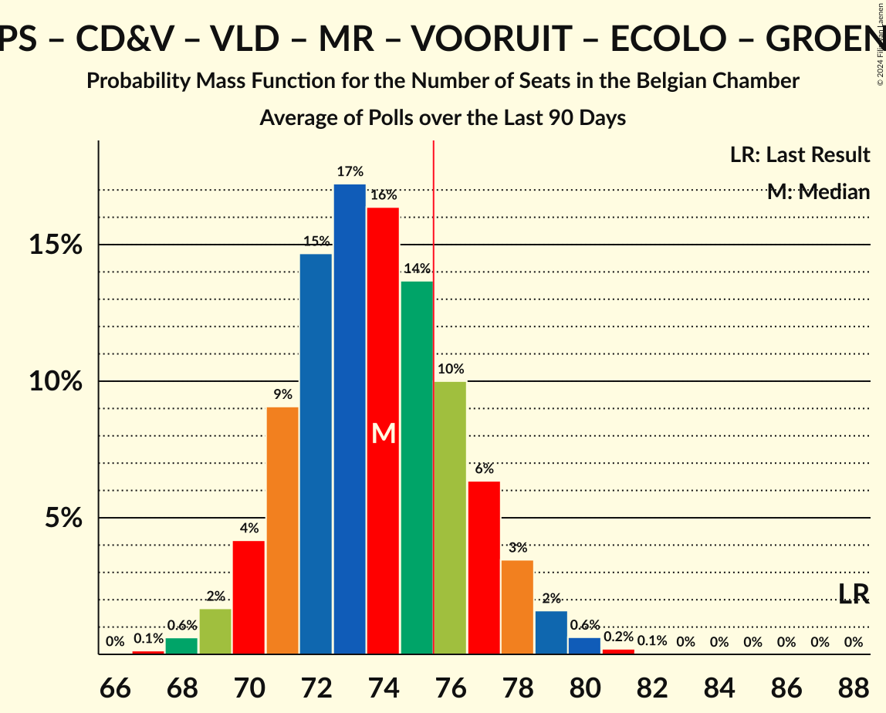
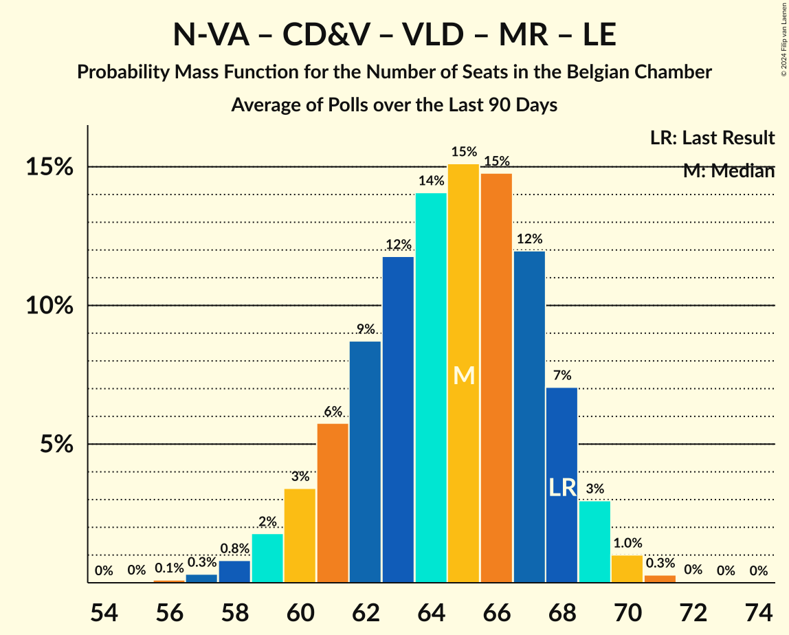

# Poll Average

<a href="#voting-intentions">Voting Intentions</a> | <a href="#seats">Seats</a> | <a href="#coalitions">Coalitions</a> | <a href="#technical-information">Technical Information</a>

## Summary

The table below lists the polls on which the average is based. They are the most recent polls (less than 90 days old) registered and analyzed so far.

| Period     | Polling firm/Commissioner(s) | N-VA | VB | PS | CD&V | PTB | PVDA | VLD | MR | VOORUIT | ECOLO | GROEN | LE | DÉFI | PP |
|:----------:|:----------------------------:|:--:|:--:|:--:|:--:|:--:|:--:|:--:|:--:|:--:|:--:|:--:|:--:|:--:|:--:|
| 26 May 2019 | General Election | 16.0%   25 | 12.0%   18 | 9.5%   20 | 8.9%   12 | 4.8%   9 | 3.3%   3 | 8.5%   12 | 7.6%   14 | 6.7%   9 | 6.1%   13 | 6.1%   8 | 3.7%   5 | 2.2%   2 | 1.1%   0 |
| N/A | Poll Average | 11–12%   17–23 | 14–16%   21–27 | 7–8%   15–20 | 5–6%   6–11 | 5–6%   10–14 | 5–7%   7–10 | 4–5%   3–7 | 6–7%   13–17 | 7–10%   11–15 | 5%   9–13 | 4–6%   5–9 | 4%   5–10 | 1–2%   1–2 | N/A   N/A |
| [22 January–8 February 2024](2024-02-08-Kantar.html) | Kantar   Knack and Le Vif | 11–12%   17–22 | 14–15%   22–28 | 7–8%   15–19 | 5–6%   6–10 | 6–7%   11–15 | 6–8%   8–11 | 4%   3–8 | 6–7%   13–17 | 8–10%   11–16 | 5%   9–12 | 4–6%   5–9 | 4%   4–9 | 1–2%   1–2 | N/A   N/A |
| [4–11 December 2023](2023-12-11-Ipsos.html) | Ipsos   Het Laatste Nieuws, Le Soir, RTL TVi and VTM | 12–15%   18–24 | 14–16%   21–26 | 8%   15–20 | 6–8%   8–12 | 5%   9–12 | 5–7%   6–9 | 4–5%   3–6 | 6–7%   13–17 | 7–9%   10–15 | 5%   9–13 | 5–6%   5–9 | 4%   6–10 | 1–2%   1–2 | N/A   N/A |
| 26 May 2019 | General Election | 16.0%   25 | 12.0%   18 | 9.5%   20 | 8.9%   12 | 4.8%   9 | 3.3%   3 | 8.5%   12 | 7.6%   14 | 6.7%   9 | 6.1%   13 | 6.1%   8 | 3.7%   5 | 2.2%   2 | 1.1%   0 |

Only polls for which at least the sample size has been published are included in the table above.

**Legend:**
+ **Top half of each row:** Voting intentions (95% confidence interval)
+ **Bottom half of each row:** Seat projections for the Belgian Chamber (95% confidence interval)
+ **N-VA:** Nieuw-Vlaamse Alliantie
+ **VB:** Vlaams Belang
+ **PS:** Parti Socialiste
+ **CD&V:** Christen-Democratisch en Vlaams
+ **PTB:** Parti du Travail de Belgique
+ **PVDA:** Partij van de Arbeid van België
+ **VLD:** Open Vlaamse Liberalen en Democraten
+ **MR:** Mouvement Réformateur
+ **VOORUIT:** Vooruit
+ **ECOLO:** Ecolo
+ **GROEN:** Groen
+ **LE:** Les Engagés
+ **DÉFI:** DéFI
+ **PP:** Parti Populaire
+ **N/A (single party):** Party not included the published results
+ **N/A (entire row):** Calculation for this opinion poll not started yet

## Voting Intentions

### Confidence Intervals

| Party | Last Result | Median | 80% Confidence Interval | 90% Confidence Interval | 95% Confidence Interval | 99% Confidence Interval |
|:-----:|:-----------:|:------:|:-----------------------:|:-----------------------:|:-----------------------:|:-----------------------:|
| <a href="#nieuw-vlaamse-alliantie">Nieuw-Vlaamse Alliantie</a> | 16.0% | 12.2% | 11.6–12.5% |11.4–12.5% | 11.2–12.5% | 10.9–12.5% |
| <a href="#vlaams-belang">Vlaams Belang</a> | 12.0% | 15.1% | 14.4–15.4% |14.2–15.5% | 14.0–15.5% | 13.5–15.5% |
| <a href="#parti-socialiste">Parti Socialiste</a> | 9.5% | 7.9% | 7.6–8.0% |7.5–8.0% | 7.4–8.0% | 7.2–8.0% |
| <a href="#christen-democratisch-en-vlaams">Christen-Democratisch en Vlaams</a> | 8.9% | 6.0% | 5.5–6.2% |5.4–6.2% | 5.3–6.2% | 5.0–6.2% |
| <a href="#open-vlaamse-liberalen-en-democraten">Open Vlaamse Liberalen en Democraten</a> | 8.5% | 4.4% | 3.9–4.6% |3.7–4.6% | 3.6–4.6% | 3.3–4.6% |
| <a href="#mouvement-réformateur">Mouvement Réformateur</a> | 7.6% | 6.8% | 6.6–7.0% |6.5–7.0% | 6.4–7.0% | 6.2–7.0% |
| <a href="#vooruit">Vooruit</a> | 6.7% | 8.7% | 7.9–9.5% |7.6–9.6% | 7.4–9.7% | 7.0–9.8% |
| <a href="#ecolo">Ecolo</a> | 6.1% | 5.1% | 4.9–5.2% |4.8–5.2% | 4.7–5.2% | 4.6–5.2% |
| <a href="#groen">Groen</a> | 6.1% | 5.5% | 4.8–6.1% |4.7–6.2% | 4.5–6.2% | 4.2–6.3% |
| <a href="#parti-du-travail-de-belgique">Parti du Travail de Belgique</a> | 4.8% | 5.4% | 5.2–5.6% |5.1–5.6% | 5.0–5.6% | 4.9–5.6% |
| <a href="#les-engagés">Les Engagés</a> | 3.7% | 4.0% | 3.8–4.1% |3.7–4.1% | 3.6–4.1% | 3.5–4.1% |
| <a href="#partij-van-de-arbeid-van-belgië">Partij van de Arbeid van België</a> | 3.3% | 6.3% | 5.5–7.0% |5.3–7.1% | 5.1–7.2% | 4.7–7.3% |
| <a href="#défi">DéFI</a> | 2.2% | 1.6% | 1.4–1.6% |1.4–1.6% | 1.4–1.6% | 1.3–1.6% |
| <a href="#parti-populaire">Parti Populaire</a> | 1.1% | N/A | N/A |N/A | N/A | N/A |

### Nieuw-Vlaamse Alliantie

*For a full overview of the results for this party, see the [Nieuw-Vlaamse Alliantie](party-nieuw-vlaamsealliantie.html) page.*

| Voting Intentions | Probability | Accumulated | Special Marks |
|:-----------------:|:-----------:|:-----------:|:-------------:|
| 8.5–9.5% | 0% | 100% |  |
| 9.5–10.5% | 0.1% | 100% |  |
| 10.5–11.5% | 8% | 99.9% |  |
| 11.5–12.5% | 91% | 92% | Median |
| 12.5–13.5% | 100% | 0.4% |  |
| 13.5–14.5% | 100% | 0% |  |
| 14.5–15.5% | 17% | 0% |  |
| 15.5–16.5% | 0.9% | 0% | Last Result |

### Vlaams Belang

*For a full overview of the results for this party, see the [Vlaams Belang](party-vlaamsbelang.html) page.*

| Voting Intentions | Probability | Accumulated | Special Marks |
|:-----------------:|:-----------:|:-----------:|:-------------:|
| 11.5–12.5% | 0% | 100% | Last Result |
| 12.5–13.5% | 0.6% | 100% |  |
| 13.5–14.5% | 14% | 99.4% |  |
| 14.5–15.5% | 94% | 86% | Median |
| 15.5–16.5% | 100% | 0% |  |
| 16.5–17.5% | 100% | 0% |  |
| 17.5–18.5% | 19% | 0% |  |
| 18.5–19.5% | 1.0% | 0% |  |

### Parti Socialiste

*For a full overview of the results for this party, see the [Parti Socialiste](party-partisocialiste.html) page.*

| Voting Intentions | Probability | Accumulated | Special Marks |
|:-----------------:|:-----------:|:-----------:|:-------------:|
| 5.5–6.5% | 0% | 100% |  |
| 6.5–7.5% | 6% | 100% |  |
| 7.5–8.5% | 100% | 94% | Median |
| 8.5–9.5% | 100% | 0% | Last Result |
| 9.5–10.5% | 21% | 0% |  |

### Christen-Democratisch en Vlaams

*For a full overview of the results for this party, see the [Christen-Democratisch en Vlaams](party-christen-democratischenvlaams.html) page.*

| Voting Intentions | Probability | Accumulated | Special Marks |
|:-----------------:|:-----------:|:-----------:|:-------------:|
| 3.5–4.5% | 0% | 100% |  |
| 4.5–5.5% | 11% | 100% |  |
| 5.5–6.5% | 100% | 89% | Median |
| 6.5–7.5% | 100% | 0% |  |
| 7.5–8.5% | 38% | 0% |  |
| 8.5–9.5% | 2% | 0% | Last Result |

### Open Vlaamse Liberalen en Democraten

*For a full overview of the results for this party, see the [Open Vlaamse Liberalen en Democraten](party-openvlaamseliberalenendemocraten.html) page.*

| Voting Intentions | Probability | Accumulated | Special Marks |
|:-----------------:|:-----------:|:-----------:|:-------------:|
| 1.5–2.5% | 0% | 100% |  |
| 2.5–3.5% | 2% | 100% |  |
| 3.5–4.5% | 80% | 98% | Median |
| 4.5–5.5% | 100% | 18% |  |
| 5.5–6.5% | 73% | 0% |  |
| 6.5–7.5% | 2% | 0% |  |
| 7.5–8.5% | 0% | 0% |  |
| 8.5–9.5% | 0% | 0% | Last Result |

### Mouvement Réformateur

*For a full overview of the results for this party, see the [Mouvement Réformateur](party-mouvementréformateur.html) page.*

| Voting Intentions | Probability | Accumulated | Special Marks |
|:-----------------:|:-----------:|:-----------:|:-------------:|
| 4.5–5.5% | 0% | 100% |  |
| 5.5–6.5% | 8% | 100% |  |
| 6.5–7.5% | 100% | 92% | Median |
| 7.5–8.5% | 100% | 0% | Last Result |
| 8.5–9.5% | 13% | 0% |  |

### Vooruit

*For a full overview of the results for this party, see the [Vooruit](party-vooruit.html) page.*

| Voting Intentions | Probability | Accumulated | Special Marks |
|:-----------------:|:-----------:|:-----------:|:-------------:|
| 5.5–6.5% | 0% | 100% |  |
| 6.5–7.5% | 4% | 100% | Last Result |
| 7.5–8.5% | 35% | 96% |  |
| 8.5–9.5% | 54% | 61% | Median |
| 9.5–10.5% | 17% | 7% |  |
| 10.5–11.5% | 1.2% | 0% |  |

### Ecolo

*For a full overview of the results for this party, see the [Ecolo](party-ecolo.html) page.*

| Voting Intentions | Probability | Accumulated | Special Marks |
|:-----------------:|:-----------:|:-----------:|:-------------:|
| 2.5–3.5% | 0% | 100% |  |
| 3.5–4.5% | 0.4% | 100% |  |
| 4.5–5.5% | 100% | 99.6% | Median |
| 5.5–6.5% | 100% | 0% | Last Result |
| 6.5–7.5% | 14% | 0% |  |

### Groen

*For a full overview of the results for this party, see the [Groen](party-groen.html) page.*

| Voting Intentions | Probability | Accumulated | Special Marks |
|:-----------------:|:-----------:|:-----------:|:-------------:|
| 2.5–3.5% | 0% | 100% |  |
| 3.5–4.5% | 3% | 100% |  |
| 4.5–5.5% | 51% | 97% | Median |
| 5.5–6.5% | 51% | 46% | Last Result |
| 6.5–7.5% | 6% | 0% |  |

### Parti du Travail de Belgique

*For a full overview of the results for this party, see the [Parti du Travail de Belgique](party-partidutravaildebelgique.html) page.*

| Voting Intentions | Probability | Accumulated | Special Marks |
|:-----------------:|:-----------:|:-----------:|:-------------:|
| 3.5–4.5% | 0% | 100% |  |
| 4.5–5.5% | 89% | 100% | Last Result, Median |
| 5.5–6.5% | 100% | 11% |  |
| 6.5–7.5% | 100% | 0% |  |
| 7.5–8.5% | 100% | 0% |  |
| 8.5–9.5% | 0.4% | 0% |  |

### Les Engagés

*For a full overview of the results for this party, see the [Les Engagés](party-lesengagés.html) page.*

| Voting Intentions | Probability | Accumulated | Special Marks |
|:-----------------:|:-----------:|:-----------:|:-------------:|
| 1.5–2.5% | 0% | 100% |  |
| 2.5–3.5% | 1.3% | 100% |  |
| 3.5–4.5% | 100% | 98.7% | Last Result, Median |
| 4.5–5.5% | 100% | 0% |  |
| 5.5–6.5% | 18% | 0% |  |

### Partij van de Arbeid van België

*For a full overview of the results for this party, see the [Partij van de Arbeid van België](party-partijvandearbeidvanbelgië.html) page.*

| Voting Intentions | Probability | Accumulated | Special Marks |
|:-----------------:|:-----------:|:-----------:|:-------------:|
| 2.5–3.5% | 0% | 100% | Last Result |
| 3.5–4.5% | 0.2% | 100% |  |
| 4.5–5.5% | 12% | 99.8% |  |
| 5.5–6.5% | 53% | 88% | Median |
| 6.5–7.5% | 41% | 35% |  |
| 7.5–8.5% | 6% | 0% |  |

### DéFI

*For a full overview of the results for this party, see the [DéFI](party-défi.html) page.*

| Voting Intentions | Probability | Accumulated | Special Marks |
|:-----------------:|:-----------:|:-----------:|:-------------:|
| 0.0–0.5% | 0% | 100% |  |
| 0.5–1.5% | 46% | 100% |  |
| 1.5–2.5% | 100% | 54% | Last Result, Median |
| 2.5–3.5% | 5% | 0% |  |

## Seats

### Confidence Intervals

| Party | Last Result | Median | 80% Confidence Interval | 90% Confidence Interval | 95% Confidence Interval | 99% Confidence Interval |
|:-----:|:-----------:|:------:|:-----------------------:|:-----------------------:|:-----------------------:|:-----------------------:|
| <a href="#nieuw-vlaamse-alliantie">Nieuw-Vlaamse Alliantie</a> | 25 | 20 | 18–22 |18–23 | 17–23 | 16–25 |
| <a href="#vlaams-belang">Vlaams Belang</a> | 18 | 25 | 22–26 |21–27 | 21–27 | 21–28 |
| <a href="#parti-socialiste">Parti Socialiste</a> | 20 | 17 | 16–19 |15–19 | 15–20 | 14–20 |
| <a href="#christen-democratisch-en-vlaams">Christen-Democratisch en Vlaams</a> | 12 | 10 | 8–10 |7–11 | 6–11 | 6–13 |
| <a href="#open-vlaamse-liberalen-en-democraten">Open Vlaamse Liberalen en Democraten</a> | 12 | 6 | 3–7 |3–7 | 3–7 | 2–8 |
| <a href="#mouvement-réformateur">Mouvement Réformateur</a> | 14 | 14 | 13–16 |13–17 | 13–17 | 12–18 |
| <a href="#vooruit">Vooruit</a> | 9 | 12 | 11–14 |11–15 | 11–15 | 10–16 |
| <a href="#ecolo">Ecolo</a> | 13 | 10 | 9–12 |9–12 | 9–13 | 8–13 |
| <a href="#groen">Groen</a> | 8 | 7 | 5–9 |5–9 | 5–9 | 5–9 |
| <a href="#parti-du-travail-de-belgique">Parti du Travail de Belgique</a> | 9 | 12 | 10–13 |10–14 | 10–14 | 8–16 |
| <a href="#les-engagés">Les Engagés</a> | 5 | 8 | 6–9 |5–10 | 5–10 | 4–11 |
| <a href="#partij-van-de-arbeid-van-belgië">Partij van de Arbeid van België</a> | 3 | 8 | 8–9 |7–10 | 7–10 | 5–12 |
| <a href="#défi">DéFI</a> | 2 | 1 | 1–2 |1–2 | 1–2 | 1–3 |
| <a href="#parti-populaire">Parti Populaire</a> | 0 | N/A | N/A |N/A | N/A | N/A |

### Nieuw-Vlaamse Alliantie

*For a full overview of the results for this party, see the [Nieuw-Vlaamse Alliantie](party-nieuw-vlaamsealliantie.html) page.*

| Number of Seats | Probability | Accumulated | Special Marks |
|:---------------:|:-----------:|:-----------:|:-------------:|
| 15 | 0.3% | 100% |  |
| 16 | 0.7% | 99.7% |  |
| 17 | 3% | 99.0% |  |
| 18 | 17% | 96% |  |
| 19 | 14% | 78% |  |
| 20 | 31% | 64% | Median |
| 21 | 16% | 33% |  |
| 22 | 12% | 18% |  |
| 23 | 5% | 6% |  |
| 24 | 0.9% | 1.4% |  |
| 25 | 0.4% | 0.5% | Last Result |
| 26 | 0.1% | 0.1% |  |
| 27 | 0% | 0% |  |

### Vlaams Belang

*For a full overview of the results for this party, see the [Vlaams Belang](party-vlaamsbelang.html) page.*

| Number of Seats | Probability | Accumulated | Special Marks |
|:---------------:|:-----------:|:-----------:|:-------------:|
| 18 | 0% | 100% | Last Result |
| 19 | 0.1% | 100% |  |
| 20 | 0.3% | 99.9% |  |
| 21 | 5% | 99.6% |  |
| 22 | 9% | 95% |  |
| 23 | 15% | 86% |  |
| 24 | 13% | 71% |  |
| 25 | 36% | 57% | Median |
| 26 | 16% | 21% |  |
| 27 | 4% | 6% |  |
| 28 | 2% | 2% |  |
| 29 | 0.3% | 0.4% |  |
| 30 | 0.1% | 0.1% |  |
| 31 | 0% | 0% |  |

### Parti Socialiste

*For a full overview of the results for this party, see the [Parti Socialiste](party-partisocialiste.html) page.*

| Number of Seats | Probability | Accumulated | Special Marks |
|:---------------:|:-----------:|:-----------:|:-------------:|
| 13 | 0.1% | 100% |  |
| 14 | 0.8% | 99.9% |  |
| 15 | 4% | 99.1% |  |
| 16 | 21% | 95% |  |
| 17 | 45% | 74% | Median |
| 18 | 18% | 29% |  |
| 19 | 7% | 11% |  |
| 20 | 4% | 4% | Last Result |
| 21 | 0.1% | 0.1% |  |
| 22 | 0% | 0% |  |

### Christen-Democratisch en Vlaams

*For a full overview of the results for this party, see the [Christen-Democratisch en Vlaams](party-christen-democratischenvlaams.html) page.*

| Number of Seats | Probability | Accumulated | Special Marks |
|:---------------:|:-----------:|:-----------:|:-------------:|
| 5 | 0.4% | 100% |  |
| 6 | 3% | 99.6% |  |
| 7 | 3% | 96% |  |
| 8 | 5% | 94% |  |
| 9 | 11% | 89% |  |
| 10 | 69% | 78% | Median |
| 11 | 6% | 9% |  |
| 12 | 2% | 2% | Last Result |
| 13 | 0.5% | 0.7% |  |
| 14 | 0.2% | 0.2% |  |
| 15 | 0% | 0% |  |

### Open Vlaamse Liberalen en Democraten

*For a full overview of the results for this party, see the [Open Vlaamse Liberalen en Democraten](party-openvlaamseliberalenendemocraten.html) page.*

| Number of Seats | Probability | Accumulated | Special Marks |
|:---------------:|:-----------:|:-----------:|:-------------:|
| 2 | 0.5% | 100% |  |
| 3 | 10% | 99.5% |  |
| 4 | 22% | 89% |  |
| 5 | 8% | 67% |  |
| 6 | 49% | 59% | Median |
| 7 | 9% | 10% |  |
| 8 | 0.9% | 1.4% |  |
| 9 | 0.4% | 0.5% |  |
| 10 | 0% | 0% |  |
| 11 | 0% | 0% |  |
| 12 | 0% | 0% | Last Result |

### Mouvement Réformateur

*For a full overview of the results for this party, see the [Mouvement Réformateur](party-mouvementréformateur.html) page.*

| Number of Seats | Probability | Accumulated | Special Marks |
|:---------------:|:-----------:|:-----------:|:-------------:|
| 12 | 0.6% | 100% |  |
| 13 | 10% | 99.4% |  |
| 14 | 46% | 90% | Last Result, Median |
| 15 | 25% | 44% |  |
| 16 | 12% | 19% |  |
| 17 | 6% | 7% |  |
| 18 | 1.0% | 1.0% |  |
| 19 | 0% | 0% |  |

### Vooruit

*For a full overview of the results for this party, see the [Vooruit](party-vooruit.html) page.*

| Number of Seats | Probability | Accumulated | Special Marks |
|:---------------:|:-----------:|:-----------:|:-------------:|
| 9 | 0.3% | 100% | Last Result |
| 10 | 1.1% | 99.6% |  |
| 11 | 29% | 98.6% |  |
| 12 | 30% | 70% | Median |
| 13 | 19% | 40% |  |
| 14 | 10% | 20% |  |
| 15 | 8% | 10% |  |
| 16 | 2% | 2% |  |
| 17 | 0.1% | 0.1% |  |
| 18 | 0% | 0% |  |

### Ecolo

*For a full overview of the results for this party, see the [Ecolo](party-ecolo.html) page.*

| Number of Seats | Probability | Accumulated | Special Marks |
|:---------------:|:-----------:|:-----------:|:-------------:|
| 8 | 1.1% | 100% |  |
| 9 | 31% | 98.9% |  |
| 10 | 31% | 68% | Median |
| 11 | 22% | 37% |  |
| 12 | 12% | 15% |  |
| 13 | 3% | 3% | Last Result |
| 14 | 0.2% | 0.2% |  |
| 15 | 0% | 0% |  |

### Groen

*For a full overview of the results for this party, see the [Groen](party-groen.html) page.*

| Number of Seats | Probability | Accumulated | Special Marks |
|:---------------:|:-----------:|:-----------:|:-------------:|
| 3 | 0.1% | 100% |  |
| 4 | 0.2% | 99.9% |  |
| 5 | 13% | 99.7% |  |
| 6 | 10% | 86% |  |
| 7 | 41% | 76% | Median |
| 8 | 12% | 35% | Last Result |
| 9 | 23% | 23% |  |
| 10 | 0.1% | 0.2% |  |
| 11 | 0% | 0% |  |

### Parti du Travail de Belgique

*For a full overview of the results for this party, see the [Parti du Travail de Belgique](party-partidutravaildebelgique.html) page.*

| Number of Seats | Probability | Accumulated | Special Marks |
|:---------------:|:-----------:|:-----------:|:-------------:|
| 8 | 0.6% | 100% |  |
| 9 | 2% | 99.4% | Last Result |
| 10 | 15% | 98% |  |
| 11 | 25% | 83% |  |
| 12 | 26% | 58% | Median |
| 13 | 23% | 31% |  |
| 14 | 6% | 9% |  |
| 15 | 2% | 2% |  |
| 16 | 0.4% | 0.6% |  |
| 17 | 0.1% | 0.1% |  |
| 18 | 0% | 0% |  |

### Les Engagés

*For a full overview of the results for this party, see the [Les Engagés](party-lesengagés.html) page.*

| Number of Seats | Probability | Accumulated | Special Marks |
|:---------------:|:-----------:|:-----------:|:-------------:|
| 4 | 1.4% | 100% |  |
| 5 | 7% | 98.6% | Last Result |
| 6 | 13% | 92% |  |
| 7 | 15% | 78% |  |
| 8 | 28% | 63% | Median |
| 9 | 29% | 35% |  |
| 10 | 5% | 6% |  |
| 11 | 0.8% | 0.9% |  |
| 12 | 0% | 0% |  |

### Partij van de Arbeid van België

*For a full overview of the results for this party, see the [Partij van de Arbeid van België](party-partijvandearbeidvanbelgië.html) page.*

| Number of Seats | Probability | Accumulated | Special Marks |
|:---------------:|:-----------:|:-----------:|:-------------:|
| 3 | 0% | 100% | Last Result |
| 4 | 0% | 100% |  |
| 5 | 0.8% | 100% |  |
| 6 | 1.1% | 99.2% |  |
| 7 | 5% | 98% |  |
| 8 | 55% | 93% | Median |
| 9 | 28% | 38% |  |
| 10 | 8% | 10% |  |
| 11 | 0.9% | 1.4% |  |
| 12 | 0.3% | 0.6% |  |
| 13 | 0.3% | 0.3% |  |
| 14 | 0% | 0% |  |

### DéFI

*For a full overview of the results for this party, see the [DéFI](party-défi.html) page.*

| Number of Seats | Probability | Accumulated | Special Marks |
|:---------------:|:-----------:|:-----------:|:-------------:|
| 0 | 0.1% | 100% |  |
| 1 | 79% | 99.9% | Median |
| 2 | 20% | 21% | Last Result |
| 3 | 0.7% | 0.9% |  |
| 4 | 0.1% | 0.1% |  |
| 5 | 0% | 0% |  |

### Parti Populaire

*For a full overview of the results for this party, see the [Parti Populaire](party-partipopulaire.html) page.*

## Coalitions

### Confidence Intervals

| Coalition | Last Result | Median | Majority? | 80% Confidence Interval | 90% Confidence Interval | 95% Confidence Interval | 99% Confidence Interval |
|:---------:|:-----------:|:------:|:---------:|:-----------------------:|:-----------------------:|:-----------------------:|:-----------------------:|
| Parti Socialiste – Christen-Democratisch en Vlaams – Open Vlaamse Liberalen en Democraten – Mouvement Réformateur – Vooruit – Ecolo – Groen – Les Engagés | 93 | 84 | 100% | 81–87 | 81–88 | 80–89 | 78–90 |
| Parti Socialiste – Christen-Democratisch en Vlaams – Vooruit – Ecolo – Groen – Parti du Travail de Belgique – Les Engagés – Partij van de Arbeid van België | 79 | 85 | 100% | 82–87 | 81–88 | 80–89 | 79–90 |
| Parti Socialiste – Christen-Democratisch en Vlaams – Open Vlaamse Liberalen en Democraten – Mouvement Réformateur – Vooruit – Ecolo – Groen | 88 | 77 | 67% | 73–80 | 73–80 | 72–81 | 70–82 |
| Parti Socialiste – Vooruit – Ecolo – Groen – Parti du Travail de Belgique – Les Engagés – Partij van de Arbeid van België | 67 | 75 | 39% | 72–78 | 71–78 | 71–79 | 69–80 |
| Nieuw-Vlaamse Alliantie – Parti Socialiste – Open Vlaamse Liberalen en Democraten – Mouvement Réformateur – Vooruit | 80 | 69 | 0.4% | 66–72 | 66–73 | 65–74 | 64–75 |
| Parti Socialiste – Vooruit – Ecolo – Groen – Parti du Travail de Belgique – Partij van de Arbeid van België | 62 | 67 | 0.1% | 64–70 | 63–72 | 62–72 | 61–74 |
| Parti Socialiste – Christen-Democratisch en Vlaams – Open Vlaamse Liberalen en Democraten – Mouvement Réformateur – Vooruit – Les Engagés | 72 | 67 | 0% | 64–70 | 63–70 | 62–71 | 61–73 |
| Parti Socialiste – Open Vlaamse Liberalen en Democraten – Mouvement Réformateur – Vooruit – Ecolo – Groen | 76 | 67 | 0% | 64–70 | 63–71 | 62–71 | 61–73 |
| Parti Socialiste – Christen-Democratisch en Vlaams – Vooruit – Ecolo – Groen – Les Engagés | 67 | 64 | 0% | 61–67 | 60–68 | 59–69 | 58–71 |
| Nieuw-Vlaamse Alliantie – Christen-Democratisch en Vlaams – Open Vlaamse Liberalen en Democraten – Mouvement Réformateur – Les Engagés | 68 | 57 | 0% | 54–61 | 53–62 | 52–62 | 50–64 |
| Christen-Democratisch en Vlaams – Open Vlaamse Liberalen en Democraten – Mouvement Réformateur – Ecolo – Groen – Les Engagés | 64 | 55 | 0% | 52–58 | 51–58 | 50–59 | 48–61 |
| Parti Socialiste – Christen-Democratisch en Vlaams – Open Vlaamse Liberalen en Democraten – Mouvement Réformateur – Les Engagés | 63 | 54 | 0% | 52–57 | 51–58 | 50–58 | 48–60 |
| Nieuw-Vlaamse Alliantie – Christen-Democratisch en Vlaams – Open Vlaamse Liberalen en Democraten – Mouvement Réformateur | 63 | 50 | 0% | 47–52 | 46–53 | 45–54 | 44–56 |
| Parti Socialiste – Open Vlaamse Liberalen en Democraten – Mouvement Réformateur – Vooruit | 55 | 49 | 0% | 47–52 | 46–53 | 45–54 | 44–55 |
| Parti Socialiste – Christen-Democratisch en Vlaams – Vooruit – Les Engagés | 46 | 47 | 0% | 44–50 | 43–50 | 42–51 | 41–53 |
| Christen-Democratisch en Vlaams – Open Vlaamse Liberalen en Democraten – Mouvement Réformateur – Les Engagés | 43 | 37 | 0% | 35–40 | 34–41 | 33–41 | 31–42 |

### Parti Socialiste – Christen-Democratisch en Vlaams – Open Vlaamse Liberalen en Democraten – Mouvement Réformateur – Vooruit – Ecolo – Groen – Les Engagés

| Number of Seats | Probability | Accumulated | Special Marks |
|:---------------:|:-----------:|:-----------:|:-------------:|
| 76 | 0% | 100% | Majority |
| 77 | 0.2% | 99.9% |  |
| 78 | 0.5% | 99.8% |  |
| 79 | 1.2% | 99.3% |  |
| 80 | 3% | 98% |  |
| 81 | 6% | 95% |  |
| 82 | 10% | 89% |  |
| 83 | 15% | 79% |  |
| 84 | 19% | 64% | Median |
| 85 | 19% | 46% |  |
| 86 | 13% | 27% |  |
| 87 | 8% | 14% |  |
| 88 | 4% | 7% |  |
| 89 | 2% | 3% |  |
| 90 | 0.6% | 0.8% |  |
| 91 | 0.1% | 0.2% |  |
| 92 | 0% | 0% |  |
| 93 | 0% | 0% | Last Result |

### Parti Socialiste – Christen-Democratisch en Vlaams – Vooruit – Ecolo – Groen – Parti du Travail de Belgique – Les Engagés – Partij van de Arbeid van België

| Number of Seats | Probability | Accumulated | Special Marks |
|:---------------:|:-----------:|:-----------:|:-------------:|
| 77 | 0% | 100% |  |
| 78 | 0.2% | 99.9% |  |
| 79 | 0.6% | 99.8% | Last Result |
| 80 | 2% | 99.1% |  |
| 81 | 4% | 97% |  |
| 82 | 9% | 93% |  |
| 83 | 14% | 84% |  |
| 84 | 17% | 69% | Median |
| 85 | 19% | 52% |  |
| 86 | 15% | 33% |  |
| 87 | 10% | 18% |  |
| 88 | 5% | 8% |  |
| 89 | 2% | 3% |  |
| 90 | 0.6% | 0.8% |  |
| 91 | 0.1% | 0.2% |  |
| 92 | 0% | 0% |  |

### Parti Socialiste – Christen-Democratisch en Vlaams – Open Vlaamse Liberalen en Democraten – Mouvement Réformateur – Vooruit – Ecolo – Groen

| Number of Seats | Probability | Accumulated | Special Marks |
|:---------------:|:-----------:|:-----------:|:-------------:|
| 68 | 0% | 100% |  |
| 69 | 0.1% | 99.9% |  |
| 70 | 0.5% | 99.8% |  |
| 71 | 1.2% | 99.3% |  |
| 72 | 3% | 98% |  |
| 73 | 6% | 95% |  |
| 74 | 9% | 90% |  |
| 75 | 14% | 80% |  |
| 76 | 17% | 67% | Median, Majority |
| 77 | 16% | 50% |  |
| 78 | 14% | 34% |  |
| 79 | 10% | 20% |  |
| 80 | 6% | 10% |  |
| 81 | 3% | 5% |  |
| 82 | 1.2% | 2% |  |
| 83 | 0.4% | 0.5% |  |
| 84 | 0.1% | 0.1% |  |
| 85 | 0% | 0% |  |
| 86 | 0% | 0% |  |
| 87 | 0% | 0% |  |
| 88 | 0% | 0% | Last Result |

### Parti Socialiste – Vooruit – Ecolo – Groen – Parti du Travail de Belgique – Les Engagés – Partij van de Arbeid van België

| Number of Seats | Probability | Accumulated | Special Marks |
|:---------------:|:-----------:|:-----------:|:-------------:|
| 67 | 0% | 100% | Last Result |
| 68 | 0.1% | 100% |  |
| 69 | 0.4% | 99.9% |  |
| 70 | 1.4% | 99.5% |  |
| 71 | 4% | 98% |  |
| 72 | 7% | 95% |  |
| 73 | 13% | 87% |  |
| 74 | 16% | 74% | Median |
| 75 | 19% | 58% |  |
| 76 | 16% | 39% | Majority |
| 77 | 11% | 22% |  |
| 78 | 6% | 11% |  |
| 79 | 3% | 5% |  |
| 80 | 1.2% | 2% |  |
| 81 | 0.4% | 0.5% |  |
| 82 | 0.1% | 0.1% |  |
| 83 | 0% | 0% |  |

### Nieuw-Vlaamse Alliantie – Parti Socialiste – Open Vlaamse Liberalen en Democraten – Mouvement Réformateur – Vooruit

| Number of Seats | Probability | Accumulated | Special Marks |
|:---------------:|:-----------:|:-----------:|:-------------:|
| 62 | 0.1% | 100% |  |
| 63 | 0.3% | 99.9% |  |
| 64 | 0.9% | 99.7% |  |
| 65 | 3% | 98.8% |  |
| 66 | 6% | 96% |  |
| 67 | 11% | 90% |  |
| 68 | 16% | 79% |  |
| 69 | 17% | 63% | Median |
| 70 | 16% | 46% |  |
| 71 | 13% | 30% |  |
| 72 | 9% | 17% |  |
| 73 | 5% | 9% |  |
| 74 | 2% | 4% |  |
| 75 | 1.0% | 1.4% |  |
| 76 | 0.3% | 0.4% | Majority |
| 77 | 0.1% | 0.1% |  |
| 78 | 0% | 0% |  |
| 79 | 0% | 0% |  |
| 80 | 0% | 0% | Last Result |

### Parti Socialiste – Vooruit – Ecolo – Groen – Parti du Travail de Belgique – Partij van de Arbeid van België

| Number of Seats | Probability | Accumulated | Special Marks |
|:---------------:|:-----------:|:-----------:|:-------------:|
| 59 | 0% | 100% |  |
| 60 | 0.2% | 99.9% |  |
| 61 | 0.6% | 99.8% |  |
| 62 | 2% | 99.1% | Last Result |
| 63 | 4% | 97% |  |
| 64 | 8% | 93% |  |
| 65 | 12% | 85% |  |
| 66 | 14% | 74% | Median |
| 67 | 16% | 59% |  |
| 68 | 14% | 43% |  |
| 69 | 11% | 29% |  |
| 70 | 8% | 18% |  |
| 71 | 5% | 10% |  |
| 72 | 3% | 5% |  |
| 73 | 1.4% | 2% |  |
| 74 | 0.6% | 0.9% |  |
| 75 | 0.2% | 0.3% |  |
| 76 | 0.1% | 0.1% | Majority |
| 77 | 0% | 0% |  |

### Parti Socialiste – Christen-Democratisch en Vlaams – Open Vlaamse Liberalen en Democraten – Mouvement Réformateur – Vooruit – Les Engagés

| Number of Seats | Probability | Accumulated | Special Marks |
|:---------------:|:-----------:|:-----------:|:-------------:|
| 59 | 0.1% | 100% |  |
| 60 | 0.3% | 99.9% |  |
| 61 | 0.7% | 99.6% |  |
| 62 | 2% | 98.9% |  |
| 63 | 4% | 97% |  |
| 64 | 8% | 93% |  |
| 65 | 12% | 85% |  |
| 66 | 17% | 73% |  |
| 67 | 18% | 56% | Median |
| 68 | 16% | 38% |  |
| 69 | 11% | 22% |  |
| 70 | 6% | 11% |  |
| 71 | 3% | 5% |  |
| 72 | 1.2% | 2% | Last Result |
| 73 | 0.4% | 0.5% |  |
| 74 | 0.1% | 0.1% |  |
| 75 | 0% | 0% |  |

### Parti Socialiste – Open Vlaamse Liberalen en Democraten – Mouvement Réformateur – Vooruit – Ecolo – Groen

| Number of Seats | Probability | Accumulated | Special Marks |
|:---------------:|:-----------:|:-----------:|:-------------:|
| 59 | 0% | 100% |  |
| 60 | 0.2% | 99.9% |  |
| 61 | 0.7% | 99.7% |  |
| 62 | 2% | 99.0% |  |
| 63 | 5% | 97% |  |
| 64 | 8% | 92% |  |
| 65 | 13% | 84% |  |
| 66 | 16% | 71% | Median |
| 67 | 17% | 55% |  |
| 68 | 14% | 38% |  |
| 69 | 11% | 23% |  |
| 70 | 7% | 13% |  |
| 71 | 4% | 6% |  |
| 72 | 2% | 2% |  |
| 73 | 0.6% | 0.8% |  |
| 74 | 0.2% | 0.2% |  |
| 75 | 0% | 0% |  |
| 76 | 0% | 0% | Last Result, Majority |

### Parti Socialiste – Christen-Democratisch en Vlaams – Vooruit – Ecolo – Groen – Les Engagés

| Number of Seats | Probability | Accumulated | Special Marks |
|:---------------:|:-----------:|:-----------:|:-------------:|
| 56 | 0.1% | 100% |  |
| 57 | 0.3% | 99.9% |  |
| 58 | 0.7% | 99.6% |  |
| 59 | 2% | 99.0% |  |
| 60 | 3% | 97% |  |
| 61 | 6% | 94% |  |
| 62 | 10% | 88% |  |
| 63 | 14% | 78% |  |
| 64 | 16% | 64% | Median |
| 65 | 16% | 48% |  |
| 66 | 13% | 32% |  |
| 67 | 9% | 19% | Last Result |
| 68 | 5% | 10% |  |
| 69 | 3% | 4% |  |
| 70 | 1.1% | 2% |  |
| 71 | 0.4% | 0.5% |  |
| 72 | 0.1% | 0.1% |  |
| 73 | 0% | 0% |  |

### Nieuw-Vlaamse Alliantie – Christen-Democratisch en Vlaams – Open Vlaamse Liberalen en Democraten – Mouvement Réformateur – Les Engagés

| Number of Seats | Probability | Accumulated | Special Marks |
|:---------------:|:-----------:|:-----------:|:-------------:|
| 48 | 0.1% | 100% |  |
| 49 | 0.2% | 99.9% |  |
| 50 | 0.5% | 99.7% |  |
| 51 | 1.2% | 99.2% |  |
| 52 | 2% | 98% |  |
| 53 | 4% | 96% |  |
| 54 | 7% | 91% |  |
| 55 | 10% | 85% |  |
| 56 | 13% | 75% |  |
| 57 | 15% | 62% |  |
| 58 | 14% | 47% | Median |
| 59 | 12% | 32% |  |
| 60 | 9% | 20% |  |
| 61 | 6% | 11% |  |
| 62 | 3% | 6% |  |
| 63 | 1.5% | 2% |  |
| 64 | 0.6% | 0.9% |  |
| 65 | 0.2% | 0.3% |  |
| 66 | 0.1% | 0.1% |  |
| 67 | 0% | 0% |  |
| 68 | 0% | 0% | Last Result |

### Christen-Democratisch en Vlaams – Open Vlaamse Liberalen en Democraten – Mouvement Réformateur – Ecolo – Groen – Les Engagés

| Number of Seats | Probability | Accumulated | Special Marks |
|:---------------:|:-----------:|:-----------:|:-------------:|
| 46 | 0% | 100% |  |
| 47 | 0.1% | 99.9% |  |
| 48 | 0.4% | 99.8% |  |
| 49 | 1.0% | 99.4% |  |
| 50 | 2% | 98% |  |
| 51 | 5% | 96% |  |
| 52 | 8% | 91% |  |
| 53 | 12% | 83% |  |
| 54 | 16% | 71% |  |
| 55 | 17% | 55% | Median |
| 56 | 15% | 37% |  |
| 57 | 12% | 23% |  |
| 58 | 7% | 11% |  |
| 59 | 3% | 5% |  |
| 60 | 1.2% | 2% |  |
| 61 | 0.4% | 0.5% |  |
| 62 | 0.1% | 0.1% |  |
| 63 | 0% | 0% |  |
| 64 | 0% | 0% | Last Result |

### Parti Socialiste – Christen-Democratisch en Vlaams – Open Vlaamse Liberalen en Democraten – Mouvement Réformateur – Les Engagés

| Number of Seats | Probability | Accumulated | Special Marks |
|:---------------:|:-----------:|:-----------:|:-------------:|
| 46 | 0% | 100% |  |
| 47 | 0.2% | 99.9% |  |
| 48 | 0.4% | 99.8% |  |
| 49 | 1.1% | 99.3% |  |
| 50 | 2% | 98% |  |
| 51 | 5% | 96% |  |
| 52 | 9% | 91% |  |
| 53 | 14% | 82% |  |
| 54 | 18% | 68% |  |
| 55 | 20% | 50% | Median |
| 56 | 15% | 30% |  |
| 57 | 8% | 15% |  |
| 58 | 5% | 7% |  |
| 59 | 2% | 2% |  |
| 60 | 0.5% | 0.7% |  |
| 61 | 0.1% | 0.2% |  |
| 62 | 0% | 0% |  |
| 63 | 0% | 0% | Last Result |

### Nieuw-Vlaamse Alliantie – Christen-Democratisch en Vlaams – Open Vlaamse Liberalen en Democraten – Mouvement Réformateur

| Number of Seats | Probability | Accumulated | Special Marks |
|:---------------:|:-----------:|:-----------:|:-------------:|
| 42 | 0.1% | 100% |  |
| 43 | 0.3% | 99.9% |  |
| 44 | 0.8% | 99.6% |  |
| 45 | 2% | 98.8% |  |
| 46 | 5% | 96% |  |
| 47 | 9% | 91% |  |
| 48 | 15% | 83% |  |
| 49 | 17% | 67% |  |
| 50 | 18% | 50% | Median |
| 51 | 14% | 32% |  |
| 52 | 9% | 18% |  |
| 53 | 5% | 9% |  |
| 54 | 2% | 4% |  |
| 55 | 1.0% | 2% |  |
| 56 | 0.4% | 0.5% |  |
| 57 | 0.1% | 0.1% |  |
| 58 | 0% | 0% |  |
| 59 | 0% | 0% |  |
| 60 | 0% | 0% |  |
| 61 | 0% | 0% |  |
| 62 | 0% | 0% |  |
| 63 | 0% | 0% | Last Result |

### Parti Socialiste – Open Vlaamse Liberalen en Democraten – Mouvement Réformateur – Vooruit

| Number of Seats | Probability | Accumulated | Special Marks |
|:---------------:|:-----------:|:-----------:|:-------------:|
| 43 | 0.2% | 100% |  |
| 44 | 0.7% | 99.8% |  |
| 45 | 2% | 99.1% |  |
| 46 | 6% | 97% |  |
| 47 | 10% | 91% |  |
| 48 | 16% | 81% |  |
| 49 | 18% | 65% | Median |
| 50 | 17% | 47% |  |
| 51 | 13% | 30% |  |
| 52 | 9% | 16% |  |
| 53 | 5% | 8% |  |
| 54 | 2% | 3% |  |
| 55 | 0.8% | 1.1% | Last Result |
| 56 | 0.2% | 0.3% |  |
| 57 | 0% | 0.1% |  |
| 58 | 0% | 0% |  |

### Parti Socialiste – Christen-Democratisch en Vlaams – Vooruit – Les Engagés

| Number of Seats | Probability | Accumulated | Special Marks |
|:---------------:|:-----------:|:-----------:|:-------------:|
| 39 | 0.1% | 100% |  |
| 40 | 0.3% | 99.9% |  |
| 41 | 0.7% | 99.6% |  |
| 42 | 2% | 98.9% |  |
| 43 | 3% | 97% |  |
| 44 | 6% | 94% |  |
| 45 | 11% | 87% |  |
| 46 | 17% | 76% | Last Result |
| 47 | 20% | 59% | Median |
| 48 | 17% | 39% |  |
| 49 | 12% | 23% |  |
| 50 | 7% | 11% |  |
| 51 | 3% | 5% |  |
| 52 | 1.1% | 2% |  |
| 53 | 0.4% | 0.5% |  |
| 54 | 0.1% | 0.1% |  |
| 55 | 0% | 0% |  |

### Christen-Democratisch en Vlaams – Open Vlaamse Liberalen en Democraten – Mouvement Réformateur – Les Engagés

| Number of Seats | Probability | Accumulated | Special Marks |
|:---------------:|:-----------:|:-----------:|:-------------:|
| 29 | 0.1% | 100% |  |
| 30 | 0.2% | 99.9% |  |
| 31 | 0.5% | 99.7% |  |
| 32 | 1.2% | 99.2% |  |
| 33 | 3% | 98% |  |
| 34 | 5% | 95% |  |
| 35 | 10% | 90% |  |
| 36 | 14% | 81% |  |
| 37 | 18% | 66% |  |
| 38 | 19% | 48% | Median |
| 39 | 16% | 29% |  |
| 40 | 8% | 14% |  |
| 41 | 4% | 6% |  |
| 42 | 1.4% | 2% |  |
| 43 | 0.3% | 0.4% | Last Result |
| 44 | 0.1% | 0.1% |  |
| 45 | 0% | 0% |  |

## Technical Information

+ **Number of polls included in this average:** 2
+ **Lowest number of simulations done in a poll included in this average:** 1,048,576
+ **Total number of simulations done in the polls included in this average:** 2,097,152
+ **Error estimate:** 0.62%
