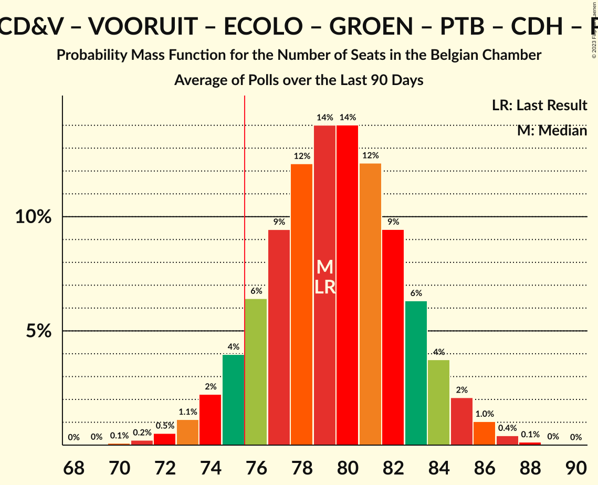
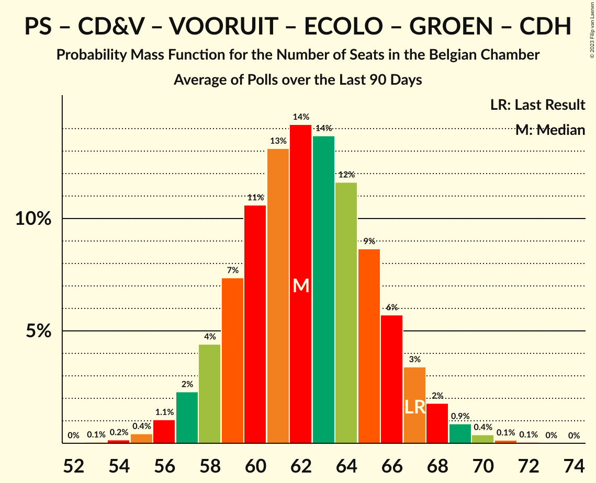
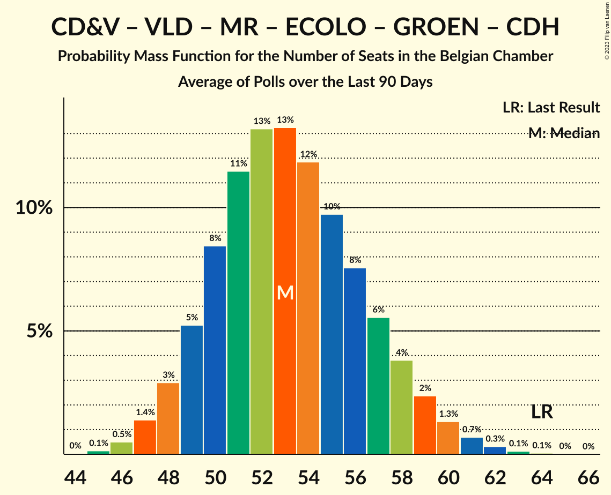

# Poll Average

<a href="#voting-intentions">Voting Intentions</a> | <a href="#seats">Seats</a> | <a href="#coalitions">Coalitions</a> | <a href="#technical-information">Technical Information</a>

## Summary

The table below lists the polls on which the average is based. They are the most recent polls (less than 90 days old) registered and analyzed so far.

| Period     | Polling firm/Commissioner(s) | N-VA | VB | PS | CD&V | PTB | PVDA | VLD | MR | VOORUIT | ECOLO | GROEN | CDH | DÉFI | PP |
|:----------:|:----------------------------:|:--:|:--:|:--:|:--:|:--:|:--:|:--:|:--:|:--:|:--:|:--:|:--:|:--:|:--:|
| 26 May 2019 | General Election | 16.0%   25 | 12.0%   18 | 9.5%   20 | 8.9%   12 | 4.8%   9 | 3.3%   3 | 8.5%   12 | 7.6%   14 | 6.7%   9 | 6.1%   13 | 6.1%   8 | 3.7%   5 | 2.2%   2 | 1.1%   0 |
| N/A | Poll Average | 12–14%   17–23 | 12–14%   17–23 | 8%   16–20 | 5–7%   5–10 | 6%   10–13 | 4–6%   5–9 | 6–8%   7–11 | 7–8%   15–19 | 9–11%   12–18 | 4–5%   9–12 | 4–6%   5–9 | 2–3%   4–5 | 2%   1–4 | N/A   N/A |
| [7–13 September 2022](2022-09-13-Ipsos.html) | Ipsos   Het Laatste Nieuws, Le Soir, RTL TVi and VTM | 12–14%   17–23 | 12–14%   17–23 | 8%   16–20 | 5–7%   5–10 | 6%   10–13 | 4–6%   5–9 | 6–8%   7–11 | 7–8%   15–19 | 9–11%   12–18 | 4–5%   9–12 | 4–6%   5–9 | 2–3%   4–5 | 2%   1–4 | N/A   N/A |
| 26 May 2019 | General Election | 16.0%   25 | 12.0%   18 | 9.5%   20 | 8.9%   12 | 4.8%   9 | 3.3%   3 | 8.5%   12 | 7.6%   14 | 6.7%   9 | 6.1%   13 | 6.1%   8 | 3.7%   5 | 2.2%   2 | 1.1%   0 |

Only polls for which at least the sample size has been published are included in the table above.

**Legend:**
+ **Top half of each row:** Voting intentions (95% confidence interval)
+ **Bottom half of each row:** Seat projections for the Belgian Chamber (95% confidence interval)
+ **N-VA:** Nieuw-Vlaamse Alliantie
+ **VB:** Vlaams Belang
+ **PS:** Parti Socialiste
+ **CD&V:** Christen-Democratisch en Vlaams
+ **PTB:** Parti du Travail de Belgique
+ **PVDA:** Partij van de Arbeid van België
+ **VLD:** Open Vlaamse Liberalen en Democraten
+ **MR:** Mouvement Réformateur
+ **VOORUIT:** Vooruit
+ **ECOLO:** Ecolo
+ **GROEN:** Groen
+ **CDH:** Centre démocrate humaniste
+ **DÉFI:** DéFI
+ **PP:** Parti Populaire
+ **N/A (single party):** Party not included the published results
+ **N/A (entire row):** Calculation for this opinion poll not started yet

## Voting Intentions

### Confidence Intervals

| Party | Last Result | Median | 80% Confidence Interval | 90% Confidence Interval | 95% Confidence Interval | 99% Confidence Interval |
|:-----:|:-----------:|:------:|:-----------------------:|:-----------------------:|:-----------------------:|:-----------------------:|
| <a href="#nieuw-vlaamse-alliantie">Nieuw-Vlaamse Alliantie</a> | 16.0% | 13.2% | 12.3–14.0% |12.0–14.2% | 11.8–14.3% | 11.3–14.3% |
| <a href="#vlaams-belang">Vlaams Belang</a> | 12.0% | 13.3% | 12.3–14.1% |12.1–14.2% | 11.8–14.3% | 11.4–14.4% |
| <a href="#parti-socialiste">Parti Socialiste</a> | 9.5% | 8.0% | 7.7–8.1% |7.6–8.1% | 7.6–8.2% | 7.4–8.2% |
| <a href="#christen-democratisch-en-vlaams">Christen-Democratisch en Vlaams</a> | 8.9% | 6.1% | 5.4–6.7% |5.2–6.8% | 5.0–6.9% | 4.7–6.9% |
| <a href="#open-vlaamse-liberalen-en-democraten">Open Vlaamse Liberalen en Democraten</a> | 8.5% | 6.8% | 6.1–7.5% |5.9–7.6% | 5.7–7.6% | 5.4–7.7% |
| <a href="#mouvement-réformateur">Mouvement Réformateur</a> | 7.6% | 7.6% | 7.4–7.7% |7.3–7.8% | 7.2–7.8% | 7.0–7.8% |
| <a href="#vooruit">Vooruit</a> | 6.7% | 10.3% | 9.5–11.1% |9.2–11.2% | 9.0–11.3% | 8.6–11.4% |
| <a href="#ecolo">Ecolo</a> | 6.1% | 4.8% | 4.6–4.9% |4.5–4.9% | 4.4–4.9% | 4.3–4.9% |
| <a href="#groen">Groen</a> | 6.1% | 5.3% | 4.6–5.8% |4.5–5.9% | 4.3–6.0% | 4.0–6.1% |
| <a href="#parti-du-travail-de-belgique">Parti du Travail de Belgique</a> | 4.8% | 6.0% | 5.7–6.1% |5.6–6.1% | 5.5–6.1% | 5.4–6.1% |
| <a href="#centre-démocrate-humaniste">Centre démocrate humaniste</a> | 3.7% | 2.6% | 2.5–2.7% |2.4–2.7% | 2.4–2.7% | 2.3–2.7% |
| <a href="#partij-van-de-arbeid-van-belgië">Partij van de Arbeid van België</a> | 3.3% | 5.3% | 4.7–5.9% |4.5–6.0% | 4.4–6.1% | 4.1–6.1% |
| <a href="#défi">DéFI</a> | 2.2% | 2.1% | 1.9–2.1% |1.9–2.1% | 1.8–2.1% | 1.7–2.1% |
| <a href="#parti-populaire">Parti Populaire</a> | 1.1% | N/A | N/A |N/A | N/A | N/A |

### Nieuw-Vlaamse Alliantie

*For a full overview of the results for this party, see the [Nieuw-Vlaamse Alliantie](party-nieuw-vlaamsealliantie.html) page.*

| Voting Intentions | Probability | Accumulated | Special Marks |
|:-----------------:|:-----------:|:-----------:|:-------------:|
| 9.5–10.5% | 0% | 100% |  |
| 10.5–11.5% | 1.3% | 100% |  |
| 11.5–12.5% | 17% | 98.7% |  |
| 12.5–13.5% | 50% | 82% | Median |
| 13.5–14.5% | 36% | 32% |  |
| 14.5–15.5% | 7% | 0% |  |
| 15.5–16.5% | 0.4% | 0% | Last Result |

### Vlaams Belang

*For a full overview of the results for this party, see the [Vlaams Belang](party-vlaamsbelang.html) page.*

| Voting Intentions | Probability | Accumulated | Special Marks |
|:-----------------:|:-----------:|:-----------:|:-------------:|
| 9.5–10.5% | 0% | 100% |  |
| 10.5–11.5% | 1.0% | 100% |  |
| 11.5–12.5% | 15% | 98.9% | Last Result |
| 12.5–13.5% | 48% | 84% | Median |
| 13.5–14.5% | 39% | 35% |  |
| 14.5–15.5% | 8% | 0% |  |
| 15.5–16.5% | 0.5% | 0% |  |

### Parti Socialiste

*For a full overview of the results for this party, see the [Parti Socialiste](party-partisocialiste.html) page.*

| Voting Intentions | Probability | Accumulated | Special Marks |
|:-----------------:|:-----------:|:-----------:|:-------------:|
| 5.5–6.5% | 0% | 100% |  |
| 6.5–7.5% | 2% | 100% |  |
| 7.5–8.5% | 100% | 98% | Median |
| 8.5–9.5% | 100% | 0% | Last Result |
| 9.5–10.5% | 38% | 0% |  |

### Christen-Democratisch en Vlaams

*For a full overview of the results for this party, see the [Christen-Democratisch en Vlaams](party-christen-democratischenvlaams.html) page.*

| Voting Intentions | Probability | Accumulated | Special Marks |
|:-----------------:|:-----------:|:-----------:|:-------------:|
| 2.5–3.5% | 0% | 100% |  |
| 3.5–4.5% | 0.2% | 100% |  |
| 4.5–5.5% | 16% | 99.8% |  |
| 5.5–6.5% | 66% | 84% | Median |
| 6.5–7.5% | 27% | 18% |  |
| 7.5–8.5% | 1.4% | 0% |  |
| 8.5–9.5% | 0% | 0% | Last Result |

### Open Vlaamse Liberalen en Democraten

*For a full overview of the results for this party, see the [Open Vlaamse Liberalen en Democraten](party-openvlaamseliberalenendemocraten.html) page.*

| Voting Intentions | Probability | Accumulated | Special Marks |
|:-----------------:|:-----------:|:-----------:|:-------------:|
| 3.5–4.5% | 0% | 100% |  |
| 4.5–5.5% | 1.1% | 100% |  |
| 5.5–6.5% | 30% | 98.9% |  |
| 6.5–7.5% | 63% | 69% | Median |
| 7.5–8.5% | 16% | 6% |  |
| 8.5–9.5% | 0.6% | 0% | Last Result |

### Mouvement Réformateur

*For a full overview of the results for this party, see the [Mouvement Réformateur](party-mouvementréformateur.html) page.*

| Voting Intentions | Probability | Accumulated | Special Marks |
|:-----------------:|:-----------:|:-----------:|:-------------:|
| 5.5–6.5% | 0% | 100% |  |
| 6.5–7.5% | 32% | 100% |  |
| 7.5–8.5% | 100% | 68% | Last Result, Median |
| 8.5–9.5% | 100% | 0% |  |
| 9.5–10.5% | 4% | 0% |  |

### Vooruit

*For a full overview of the results for this party, see the [Vooruit](party-vooruit.html) page.*

| Voting Intentions | Probability | Accumulated | Special Marks |
|:-----------------:|:-----------:|:-----------:|:-------------:|
| 6.5–7.5% | 0% | 100% | Last Result |
| 7.5–8.5% | 0.4% | 100% |  |
| 8.5–9.5% | 12% | 99.6% |  |
| 9.5–10.5% | 51% | 87% | Median |
| 10.5–11.5% | 41% | 36% |  |
| 11.5–12.5% | 7% | 0% |  |
| 12.5–13.5% | 0.3% | 0% |  |

### Ecolo

*For a full overview of the results for this party, see the [Ecolo](party-ecolo.html) page.*

| Voting Intentions | Probability | Accumulated | Special Marks |
|:-----------------:|:-----------:|:-----------:|:-------------:|
| 2.5–3.5% | 0% | 100% |  |
| 3.5–4.5% | 8% | 100% |  |
| 4.5–5.5% | 100% | 92% | Median |
| 5.5–6.5% | 100% | 0% | Last Result |
| 6.5–7.5% | 1.1% | 0% |  |

### Groen

*For a full overview of the results for this party, see the [Groen](party-groen.html) page.*

| Voting Intentions | Probability | Accumulated | Special Marks |
|:-----------------:|:-----------:|:-----------:|:-------------:|
| 2.5–3.5% | 0% | 100% |  |
| 3.5–4.5% | 7% | 100% |  |
| 4.5–5.5% | 65% | 93% | Median |
| 5.5–6.5% | 38% | 28% | Last Result |
| 6.5–7.5% | 2% | 0% |  |

### Parti du Travail de Belgique

*For a full overview of the results for this party, see the [Parti du Travail de Belgique](party-partidutravaildebelgique.html) page.*

| Voting Intentions | Probability | Accumulated | Special Marks |
|:-----------------:|:-----------:|:-----------:|:-------------:|
| 3.5–4.5% | 0% | 100% |  |
| 4.5–5.5% | 3% | 100% | Last Result |
| 5.5–6.5% | 100% | 97% | Median |
| 6.5–7.5% | 100% | 0% |  |
| 7.5–8.5% | 13% | 0% |  |

### Centre démocrate humaniste

*For a full overview of the results for this party, see the [Centre démocrate humaniste](party-centredémocratehumaniste.html) page.*

| Voting Intentions | Probability | Accumulated | Special Marks |
|:-----------------:|:-----------:|:-----------:|:-------------:|
| 0.5–1.5% | 0% | 100% |  |
| 1.5–2.5% | 21% | 100% |  |
| 2.5–3.5% | 100% | 79% | Median |
| 3.5–4.5% | 91% | 0% | Last Result |

### Partij van de Arbeid van België

*For a full overview of the results for this party, see the [Partij van de Arbeid van België](party-partijvandearbeidvanbelgië.html) page.*

| Voting Intentions | Probability | Accumulated | Special Marks |
|:-----------------:|:-----------:|:-----------:|:-------------:|
| 2.5–3.5% | 0% | 100% | Last Result |
| 3.5–4.5% | 6% | 100% |  |
| 4.5–5.5% | 62% | 94% | Median |
| 5.5–6.5% | 42% | 33% |  |
| 6.5–7.5% | 3% | 0% |  |

### DéFI

*For a full overview of the results for this party, see the [DéFI](party-défi.html) page.*

| Voting Intentions | Probability | Accumulated | Special Marks |
|:-----------------:|:-----------:|:-----------:|:-------------:|
| 0.5–1.5% | 0% | 100% |  |
| 1.5–2.5% | 100% | 100% | Last Result, Median |
| 2.5–3.5% | 100% | 0% |  |

## Seats

### Confidence Intervals

| Party | Last Result | Median | 80% Confidence Interval | 90% Confidence Interval | 95% Confidence Interval | 99% Confidence Interval |
|:-----:|:-----------:|:------:|:-----------------------:|:-----------------------:|:-----------------------:|:-----------------------:|
| <a href="#nieuw-vlaamse-alliantie">Nieuw-Vlaamse Alliantie</a> | 25 | 20 | 18–22 |18–22 | 17–23 | 16–25 |
| <a href="#vlaams-belang">Vlaams Belang</a> | 18 | 21 | 18–22 |18–22 | 17–23 | 16–24 |
| <a href="#parti-socialiste">Parti Socialiste</a> | 20 | 18 | 16–19 |16–20 | 16–20 | 15–21 |
| <a href="#christen-democratisch-en-vlaams">Christen-Democratisch en Vlaams</a> | 12 | 9 | 6–10 |5–10 | 5–10 | 5–11 |
| <a href="#open-vlaamse-liberalen-en-democraten">Open Vlaamse Liberalen en Democraten</a> | 12 | 10 | 8–10 |7–11 | 7–11 | 6–12 |
| <a href="#mouvement-réformateur">Mouvement Réformateur</a> | 14 | 17 | 15–18 |15–19 | 15–19 | 14–20 |
| <a href="#vooruit">Vooruit</a> | 9 | 15 | 14–17 |13–17 | 12–18 | 12–19 |
| <a href="#ecolo">Ecolo</a> | 13 | 10 | 9–11 |9–12 | 9–12 | 8–12 |
| <a href="#groen">Groen</a> | 8 | 7 | 5–9 |5–9 | 5–9 | 4–9 |
| <a href="#parti-du-travail-de-belgique">Parti du Travail de Belgique</a> | 9 | 11 | 10–12 |10–13 | 10–13 | 10–14 |
| <a href="#centre-démocrate-humaniste">Centre démocrate humaniste</a> | 5 | 4 | 4–5 |4–5 | 4–5 | 4–5 |
| <a href="#partij-van-de-arbeid-van-belgië">Partij van de Arbeid van België</a> | 3 | 8 | 5–8 |5–8 | 5–9 | 4–9 |
| <a href="#défi">DéFI</a> | 2 | 2 | 1–4 |1–4 | 1–4 | 1–4 |
| <a href="#parti-populaire">Parti Populaire</a> | 0 | N/A | N/A |N/A | N/A | N/A |

### Nieuw-Vlaamse Alliantie

*For a full overview of the results for this party, see the [Nieuw-Vlaamse Alliantie](party-nieuw-vlaamsealliantie.html) page.*

| Number of Seats | Probability | Accumulated | Special Marks |
|:---------------:|:-----------:|:-----------:|:-------------:|
| 15 | 0.1% | 100% |  |
| 16 | 0.6% | 99.9% |  |
| 17 | 3% | 99.3% |  |
| 18 | 7% | 96% |  |
| 19 | 16% | 89% |  |
| 20 | 37% | 74% | Median |
| 21 | 23% | 37% |  |
| 22 | 10% | 14% |  |
| 23 | 3% | 5% |  |
| 24 | 1.3% | 2% |  |
| 25 | 0.5% | 0.5% | Last Result |
| 26 | 0% | 0% |  |

### Vlaams Belang

*For a full overview of the results for this party, see the [Vlaams Belang](party-vlaamsbelang.html) page.*

| Number of Seats | Probability | Accumulated | Special Marks |
|:---------------:|:-----------:|:-----------:|:-------------:|
| 15 | 0.2% | 100% |  |
| 16 | 0.7% | 99.8% |  |
| 17 | 3% | 99.1% |  |
| 18 | 7% | 96% | Last Result |
| 19 | 20% | 89% |  |
| 20 | 17% | 68% |  |
| 21 | 41% | 52% | Median |
| 22 | 6% | 10% |  |
| 23 | 3% | 5% |  |
| 24 | 0.9% | 1.3% |  |
| 25 | 0.4% | 0.4% |  |
| 26 | 0% | 0% |  |

### Parti Socialiste

*For a full overview of the results for this party, see the [Parti Socialiste](party-partisocialiste.html) page.*

| Number of Seats | Probability | Accumulated | Special Marks |
|:---------------:|:-----------:|:-----------:|:-------------:|
| 14 | 0.1% | 100% |  |
| 15 | 0.7% | 99.9% |  |
| 16 | 10% | 99.2% |  |
| 17 | 27% | 89% |  |
| 18 | 36% | 62% | Median |
| 19 | 20% | 26% |  |
| 20 | 5% | 6% | Last Result |
| 21 | 0.8% | 0.9% |  |
| 22 | 0.2% | 0.2% |  |
| 23 | 0% | 0% |  |

### Christen-Democratisch en Vlaams

*For a full overview of the results for this party, see the [Christen-Democratisch en Vlaams](party-christen-democratischenvlaams.html) page.*

| Number of Seats | Probability | Accumulated | Special Marks |
|:---------------:|:-----------:|:-----------:|:-------------:|
| 5 | 7% | 100% |  |
| 6 | 13% | 93% |  |
| 7 | 12% | 80% |  |
| 8 | 17% | 68% |  |
| 9 | 25% | 52% | Median |
| 10 | 26% | 27% |  |
| 11 | 0.6% | 0.6% |  |
| 12 | 0% | 0% | Last Result |

### Open Vlaamse Liberalen en Democraten

*For a full overview of the results for this party, see the [Open Vlaamse Liberalen en Democraten](party-openvlaamseliberalenendemocraten.html) page.*

| Number of Seats | Probability | Accumulated | Special Marks |
|:---------------:|:-----------:|:-----------:|:-------------:|
| 6 | 1.0% | 100% |  |
| 7 | 5% | 99.0% |  |
| 8 | 8% | 94% |  |
| 9 | 30% | 86% |  |
| 10 | 50% | 56% | Median |
| 11 | 4% | 6% |  |
| 12 | 2% | 2% | Last Result |
| 13 | 0.1% | 0.2% |  |
| 14 | 0% | 0% |  |

### Mouvement Réformateur

*For a full overview of the results for this party, see the [Mouvement Réformateur](party-mouvementréformateur.html) page.*

| Number of Seats | Probability | Accumulated | Special Marks |
|:---------------:|:-----------:|:-----------:|:-------------:|
| 13 | 0.1% | 100% |  |
| 14 | 2% | 99.9% | Last Result |
| 15 | 10% | 98% |  |
| 16 | 20% | 88% |  |
| 17 | 23% | 67% | Median |
| 18 | 35% | 45% |  |
| 19 | 9% | 9% |  |
| 20 | 0.7% | 0.7% |  |
| 21 | 0% | 0% |  |

### Vooruit

*For a full overview of the results for this party, see the [Vooruit](party-vooruit.html) page.*

| Number of Seats | Probability | Accumulated | Special Marks |
|:---------------:|:-----------:|:-----------:|:-------------:|
| 9 | 0% | 100% | Last Result |
| 10 | 0% | 100% |  |
| 11 | 0.4% | 100% |  |
| 12 | 3% | 99.6% |  |
| 13 | 3% | 97% |  |
| 14 | 14% | 93% |  |
| 15 | 45% | 80% | Median |
| 16 | 21% | 34% |  |
| 17 | 9% | 13% |  |
| 18 | 2% | 4% |  |
| 19 | 1.2% | 1.5% |  |
| 20 | 0.2% | 0.2% |  |
| 21 | 0% | 0% |  |

### Ecolo

*For a full overview of the results for this party, see the [Ecolo](party-ecolo.html) page.*

| Number of Seats | Probability | Accumulated | Special Marks |
|:---------------:|:-----------:|:-----------:|:-------------:|
| 8 | 2% | 100% |  |
| 9 | 19% | 98% |  |
| 10 | 62% | 80% | Median |
| 11 | 13% | 18% |  |
| 12 | 5% | 5% |  |
| 13 | 0.3% | 0.3% | Last Result |
| 14 | 0% | 0% |  |

### Groen

*For a full overview of the results for this party, see the [Groen](party-groen.html) page.*

| Number of Seats | Probability | Accumulated | Special Marks |
|:---------------:|:-----------:|:-----------:|:-------------:|
| 3 | 0.3% | 100% |  |
| 4 | 0.7% | 99.7% |  |
| 5 | 24% | 99.0% |  |
| 6 | 16% | 75% |  |
| 7 | 35% | 59% | Median |
| 8 | 13% | 24% | Last Result |
| 9 | 11% | 11% |  |
| 10 | 0% | 0% |  |

### Parti du Travail de Belgique

*For a full overview of the results for this party, see the [Parti du Travail de Belgique](party-partidutravaildebelgique.html) page.*

| Number of Seats | Probability | Accumulated | Special Marks |
|:---------------:|:-----------:|:-----------:|:-------------:|
| 9 | 0.4% | 100% | Last Result |
| 10 | 12% | 99.6% |  |
| 11 | 44% | 88% | Median |
| 12 | 34% | 44% |  |
| 13 | 8% | 9% |  |
| 14 | 1.1% | 2% |  |
| 15 | 0.3% | 0.4% |  |
| 16 | 0.1% | 0.1% |  |
| 17 | 0% | 0% |  |

### Centre démocrate humaniste

*For a full overview of the results for this party, see the [Centre démocrate humaniste](party-centredémocratehumaniste.html) page.*

| Number of Seats | Probability | Accumulated | Special Marks |
|:---------------:|:-----------:|:-----------:|:-------------:|
| 2 | 0.1% | 100% |  |
| 3 | 0.1% | 99.9% |  |
| 4 | 89% | 99.8% | Median |
| 5 | 11% | 11% | Last Result |
| 6 | 0.3% | 0.3% |  |
| 7 | 0% | 0% |  |

### Partij van de Arbeid van België

*For a full overview of the results for this party, see the [Partij van de Arbeid van België](party-partijvandearbeidvanbelgië.html) page.*

| Number of Seats | Probability | Accumulated | Special Marks |
|:---------------:|:-----------:|:-----------:|:-------------:|
| 3 | 0% | 100% | Last Result |
| 4 | 0.5% | 100% |  |
| 5 | 17% | 99.5% |  |
| 6 | 13% | 83% |  |
| 7 | 17% | 70% |  |
| 8 | 51% | 53% | Median |
| 9 | 2% | 3% |  |
| 10 | 0.1% | 0.1% |  |
| 11 | 0% | 0% |  |

### DéFI

*For a full overview of the results for this party, see the [DéFI](party-défi.html) page.*

| Number of Seats | Probability | Accumulated | Special Marks |
|:---------------:|:-----------:|:-----------:|:-------------:|
| 1 | 18% | 100% |  |
| 2 | 35% | 82% | Last Result, Median |
| 3 | 26% | 48% |  |
| 4 | 21% | 22% |  |
| 5 | 0.2% | 0.2% |  |
| 6 | 0% | 0% |  |

### Parti Populaire

*For a full overview of the results for this party, see the [Parti Populaire](party-partipopulaire.html) page.*

## Coalitions

### Confidence Intervals

| Coalition | Last Result | Median | Majority? | 80% Confidence Interval | 90% Confidence Interval | 95% Confidence Interval | 99% Confidence Interval |
|:---------:|:-----------:|:------:|:---------:|:-----------------------:|:-----------------------:|:-----------------------:|:-----------------------:|
| Parti Socialiste – Christen-Democratisch en Vlaams – Open Vlaamse Liberalen en Democraten – Mouvement Réformateur – Vooruit – Ecolo – Groen – Centre démocrate humaniste | 93 | 89 | 100% | 86–91 | 85–92 | 84–93 | 83–94 |
| Parti Socialiste – Christen-Democratisch en Vlaams – Open Vlaamse Liberalen en Democraten – Mouvement Réformateur – Vooruit – Ecolo – Groen | 88 | 85 | 100% | 81–87 | 81–88 | 80–89 | 79–90 |
| Parti Socialiste – Christen-Democratisch en Vlaams – Vooruit – Ecolo – Groen – Parti du Travail de Belgique – Centre démocrate humaniste – Partij van de Arbeid van België | 79 | 81 | 98% | 78–84 | 77–84 | 76–85 | 75–87 |
| Nieuw-Vlaamse Alliantie – Parti Socialiste – Open Vlaamse Liberalen en Democraten – Mouvement Réformateur – Vooruit | 80 | 80 | 98% | 77–83 | 76–83 | 76–84 | 74–86 |
| Parti Socialiste – Open Vlaamse Liberalen en Democraten – Mouvement Réformateur – Vooruit – Ecolo – Groen | 76 | 76 | 65% | 74–79 | 73–80 | 72–80 | 71–82 |
| Parti Socialiste – Vooruit – Ecolo – Groen – Parti du Travail de Belgique – Centre démocrate humaniste – Partij van de Arbeid van België | 67 | 72 | 9% | 69–75 | 69–76 | 68–77 | 66–78 |
| Parti Socialiste – Christen-Democratisch en Vlaams – Open Vlaamse Liberalen en Democraten – Mouvement Réformateur – Vooruit – Centre démocrate humaniste | 72 | 72 | 5% | 69–75 | 68–76 | 67–76 | 66–77 |
| Parti Socialiste – Vooruit – Ecolo – Groen – Parti du Travail de Belgique – Partij van de Arbeid van België | 62 | 68 | 0.1% | 65–71 | 64–72 | 64–73 | 62–74 |
| Parti Socialiste – Christen-Democratisch en Vlaams – Vooruit – Ecolo – Groen – Centre démocrate humaniste | 67 | 62 | 0% | 59–65 | 58–66 | 57–66 | 56–68 |
| Parti Socialiste – Open Vlaamse Liberalen en Democraten – Mouvement Réformateur – Vooruit | 55 | 60 | 0% | 57–62 | 56–63 | 56–63 | 54–65 |
| Nieuw-Vlaamse Alliantie – Christen-Democratisch en Vlaams – Open Vlaamse Liberalen en Democraten – Mouvement Réformateur – Centre démocrate humaniste | 68 | 59 | 0% | 56–62 | 55–63 | 54–63 | 53–65 |
| Parti Socialiste – Christen-Democratisch en Vlaams – Open Vlaamse Liberalen en Democraten – Mouvement Réformateur – Centre démocrate humaniste | 63 | 57 | 0% | 54–59 | 53–60 | 52–61 | 51–61 |
| Christen-Democratisch en Vlaams – Open Vlaamse Liberalen en Democraten – Mouvement Réformateur – Ecolo – Groen – Centre démocrate humaniste | 64 | 56 | 0% | 52–58 | 52–59 | 51–60 | 49–61 |
| Nieuw-Vlaamse Alliantie – Christen-Democratisch en Vlaams – Open Vlaamse Liberalen en Democraten – Mouvement Réformateur | 63 | 55 | 0% | 52–58 | 51–58 | 50–59 | 49–60 |
| Parti Socialiste – Christen-Democratisch en Vlaams – Vooruit – Centre démocrate humaniste | 46 | 45 | 0% | 42–48 | 42–49 | 41–49 | 40–51 |
| Christen-Democratisch en Vlaams – Open Vlaamse Liberalen en Democraten – Mouvement Réformateur – Centre démocrate humaniste | 43 | 39 | 0% | 36–42 | 35–42 | 34–43 | 33–44 |

### Parti Socialiste – Christen-Democratisch en Vlaams – Open Vlaamse Liberalen en Democraten – Mouvement Réformateur – Vooruit – Ecolo – Groen – Centre démocrate humaniste

| Number of Seats | Probability | Accumulated | Special Marks |
|:---------------:|:-----------:|:-----------:|:-------------:|
| 81 | 0.1% | 100% |  |
| 82 | 0.3% | 99.9% |  |
| 83 | 0.9% | 99.6% |  |
| 84 | 3% | 98.7% |  |
| 85 | 6% | 96% |  |
| 86 | 10% | 91% |  |
| 87 | 13% | 81% |  |
| 88 | 15% | 68% |  |
| 89 | 16% | 53% |  |
| 90 | 15% | 37% | Median |
| 91 | 12% | 22% |  |
| 92 | 6% | 10% |  |
| 93 | 2% | 3% | Last Result |
| 94 | 0.7% | 0.9% |  |
| 95 | 0.2% | 0.2% |  |
| 96 | 0% | 0% |  |

### Parti Socialiste – Christen-Democratisch en Vlaams – Open Vlaamse Liberalen en Democraten – Mouvement Réformateur – Vooruit – Ecolo – Groen

| Number of Seats | Probability | Accumulated | Special Marks |
|:---------------:|:-----------:|:-----------:|:-------------:|
| 77 | 0.1% | 100% |  |
| 78 | 0.3% | 99.9% |  |
| 79 | 1.1% | 99.6% |  |
| 80 | 3% | 98% |  |
| 81 | 6% | 96% |  |
| 82 | 10% | 90% |  |
| 83 | 13% | 80% |  |
| 84 | 15% | 67% |  |
| 85 | 16% | 52% |  |
| 86 | 15% | 35% | Median |
| 87 | 11% | 20% |  |
| 88 | 6% | 9% | Last Result |
| 89 | 2% | 3% |  |
| 90 | 0.6% | 0.8% |  |
| 91 | 0.2% | 0.2% |  |
| 92 | 0% | 0% |  |

### Parti Socialiste – Christen-Democratisch en Vlaams – Vooruit – Ecolo – Groen – Parti du Travail de Belgique – Centre démocrate humaniste – Partij van de Arbeid van België

| Number of Seats | Probability | Accumulated | Special Marks |
|:---------------:|:-----------:|:-----------:|:-------------:|
| 73 | 0.1% | 100% |  |
| 74 | 0.4% | 99.9% |  |
| 75 | 1.0% | 99.5% |  |
| 76 | 3% | 98% | Majority |
| 77 | 5% | 96% |  |
| 78 | 9% | 90% |  |
| 79 | 14% | 81% | Last Result |
| 80 | 16% | 67% |  |
| 81 | 16% | 52% |  |
| 82 | 14% | 35% | Median |
| 83 | 10% | 21% |  |
| 84 | 6% | 11% |  |
| 85 | 3% | 5% |  |
| 86 | 1.3% | 2% |  |
| 87 | 0.4% | 0.6% |  |
| 88 | 0.1% | 0.2% |  |
| 89 | 0% | 0% |  |

### Nieuw-Vlaamse Alliantie – Parti Socialiste – Open Vlaamse Liberalen en Democraten – Mouvement Réformateur – Vooruit

| Number of Seats | Probability | Accumulated | Special Marks |
|:---------------:|:-----------:|:-----------:|:-------------:|
| 73 | 0.2% | 100% |  |
| 74 | 0.5% | 99.8% |  |
| 75 | 2% | 99.3% |  |
| 76 | 4% | 98% | Majority |
| 77 | 8% | 93% |  |
| 78 | 13% | 85% |  |
| 79 | 17% | 71% |  |
| 80 | 18% | 54% | Last Result, Median |
| 81 | 15% | 36% |  |
| 82 | 10% | 21% |  |
| 83 | 6% | 11% |  |
| 84 | 3% | 5% |  |
| 85 | 1.2% | 2% |  |
| 86 | 0.4% | 0.6% |  |
| 87 | 0.1% | 0.1% |  |
| 88 | 0% | 0% |  |

### Parti Socialiste – Open Vlaamse Liberalen en Democraten – Mouvement Réformateur – Vooruit – Ecolo – Groen

| Number of Seats | Probability | Accumulated | Special Marks |
|:---------------:|:-----------:|:-----------:|:-------------:|
| 69 | 0.1% | 100% |  |
| 70 | 0.3% | 99.9% |  |
| 71 | 1.0% | 99.5% |  |
| 72 | 3% | 98% |  |
| 73 | 6% | 96% |  |
| 74 | 10% | 90% |  |
| 75 | 15% | 80% |  |
| 76 | 18% | 65% | Last Result, Majority |
| 77 | 19% | 47% | Median |
| 78 | 14% | 28% |  |
| 79 | 8% | 14% |  |
| 80 | 4% | 6% |  |
| 81 | 2% | 2% |  |
| 82 | 0.6% | 0.8% |  |
| 83 | 0.2% | 0.2% |  |
| 84 | 0% | 0% |  |

### Parti Socialiste – Vooruit – Ecolo – Groen – Parti du Travail de Belgique – Centre démocrate humaniste – Partij van de Arbeid van België

| Number of Seats | Probability | Accumulated | Special Marks |
|:---------------:|:-----------:|:-----------:|:-------------:|
| 65 | 0.1% | 100% |  |
| 66 | 0.4% | 99.9% |  |
| 67 | 1.2% | 99.5% | Last Result |
| 68 | 3% | 98% |  |
| 69 | 6% | 95% |  |
| 70 | 10% | 89% |  |
| 71 | 14% | 79% |  |
| 72 | 17% | 65% |  |
| 73 | 17% | 48% | Median |
| 74 | 13% | 31% |  |
| 75 | 9% | 18% |  |
| 76 | 5% | 9% | Majority |
| 77 | 2% | 4% |  |
| 78 | 1.0% | 2% |  |
| 79 | 0.4% | 0.5% |  |
| 80 | 0.1% | 0.1% |  |
| 81 | 0% | 0% |  |

### Parti Socialiste – Christen-Democratisch en Vlaams – Open Vlaamse Liberalen en Democraten – Mouvement Réformateur – Vooruit – Centre démocrate humaniste

| Number of Seats | Probability | Accumulated | Special Marks |
|:---------------:|:-----------:|:-----------:|:-------------:|
| 65 | 0.1% | 100% |  |
| 66 | 0.5% | 99.8% |  |
| 67 | 2% | 99.3% |  |
| 68 | 5% | 97% |  |
| 69 | 9% | 93% |  |
| 70 | 12% | 84% |  |
| 71 | 14% | 72% |  |
| 72 | 16% | 58% | Last Result |
| 73 | 16% | 42% | Median |
| 74 | 13% | 26% |  |
| 75 | 8% | 13% |  |
| 76 | 3% | 5% | Majority |
| 77 | 1.2% | 2% |  |
| 78 | 0.4% | 0.5% |  |
| 79 | 0.1% | 0.1% |  |
| 80 | 0% | 0% |  |

### Parti Socialiste – Vooruit – Ecolo – Groen – Parti du Travail de Belgique – Partij van de Arbeid van België

| Number of Seats | Probability | Accumulated | Special Marks |
|:---------------:|:-----------:|:-----------:|:-------------:|
| 61 | 0.1% | 100% |  |
| 62 | 0.4% | 99.9% | Last Result |
| 63 | 1.3% | 99.4% |  |
| 64 | 3% | 98% |  |
| 65 | 6% | 95% |  |
| 66 | 11% | 89% |  |
| 67 | 15% | 78% |  |
| 68 | 17% | 63% |  |
| 69 | 17% | 46% | Median |
| 70 | 13% | 29% |  |
| 71 | 8% | 16% |  |
| 72 | 5% | 8% |  |
| 73 | 2% | 4% |  |
| 74 | 0.9% | 1.3% |  |
| 75 | 0.3% | 0.4% |  |
| 76 | 0.1% | 0.1% | Majority |
| 77 | 0% | 0% |  |

### Parti Socialiste – Christen-Democratisch en Vlaams – Vooruit – Ecolo – Groen – Centre démocrate humaniste

| Number of Seats | Probability | Accumulated | Special Marks |
|:---------------:|:-----------:|:-----------:|:-------------:|
| 54 | 0% | 100% |  |
| 55 | 0.2% | 99.9% |  |
| 56 | 0.7% | 99.8% |  |
| 57 | 2% | 99.1% |  |
| 58 | 4% | 97% |  |
| 59 | 7% | 93% |  |
| 60 | 11% | 86% |  |
| 61 | 14% | 75% |  |
| 62 | 17% | 61% |  |
| 63 | 17% | 45% | Median |
| 64 | 13% | 28% |  |
| 65 | 8% | 14% |  |
| 66 | 4% | 6% |  |
| 67 | 2% | 2% | Last Result |
| 68 | 0.5% | 0.7% |  |
| 69 | 0.1% | 0.2% |  |
| 70 | 0% | 0% |  |

### Parti Socialiste – Open Vlaamse Liberalen en Democraten – Mouvement Réformateur – Vooruit

| Number of Seats | Probability | Accumulated | Special Marks |
|:---------------:|:-----------:|:-----------:|:-------------:|
| 53 | 0.1% | 100% |  |
| 54 | 0.4% | 99.9% |  |
| 55 | 1.3% | 99.5% | Last Result |
| 56 | 4% | 98% |  |
| 57 | 8% | 95% |  |
| 58 | 14% | 87% |  |
| 59 | 20% | 72% |  |
| 60 | 21% | 52% | Median |
| 61 | 16% | 31% |  |
| 62 | 9% | 15% |  |
| 63 | 4% | 6% |  |
| 64 | 1.4% | 2% |  |
| 65 | 0.4% | 0.5% |  |
| 66 | 0.1% | 0.1% |  |
| 67 | 0% | 0% |  |

### Nieuw-Vlaamse Alliantie – Christen-Democratisch en Vlaams – Open Vlaamse Liberalen en Democraten – Mouvement Réformateur – Centre démocrate humaniste

| Number of Seats | Probability | Accumulated | Special Marks |
|:---------------:|:-----------:|:-----------:|:-------------:|
| 51 | 0% | 100% |  |
| 52 | 0.2% | 99.9% |  |
| 53 | 0.6% | 99.8% |  |
| 54 | 2% | 99.2% |  |
| 55 | 4% | 97% |  |
| 56 | 7% | 93% |  |
| 57 | 12% | 86% |  |
| 58 | 15% | 74% |  |
| 59 | 16% | 59% |  |
| 60 | 15% | 43% | Median |
| 61 | 13% | 27% |  |
| 62 | 9% | 14% |  |
| 63 | 4% | 6% |  |
| 64 | 1.3% | 2% |  |
| 65 | 0.4% | 0.6% |  |
| 66 | 0.1% | 0.2% |  |
| 67 | 0% | 0% |  |
| 68 | 0% | 0% | Last Result |

### Parti Socialiste – Christen-Democratisch en Vlaams – Open Vlaamse Liberalen en Democraten – Mouvement Réformateur – Centre démocrate humaniste

| Number of Seats | Probability | Accumulated | Special Marks |
|:---------------:|:-----------:|:-----------:|:-------------:|
| 50 | 0.1% | 100% |  |
| 51 | 0.5% | 99.8% |  |
| 52 | 2% | 99.3% |  |
| 53 | 5% | 97% |  |
| 54 | 10% | 92% |  |
| 55 | 13% | 83% |  |
| 56 | 15% | 70% |  |
| 57 | 16% | 55% |  |
| 58 | 16% | 38% | Median |
| 59 | 13% | 22% |  |
| 60 | 7% | 9% |  |
| 61 | 2% | 3% |  |
| 62 | 0.4% | 0.5% |  |
| 63 | 0.1% | 0.1% | Last Result |
| 64 | 0% | 0% |  |

### Christen-Democratisch en Vlaams – Open Vlaamse Liberalen en Democraten – Mouvement Réformateur – Ecolo – Groen – Centre démocrate humaniste

| Number of Seats | Probability | Accumulated | Special Marks |
|:---------------:|:-----------:|:-----------:|:-------------:|
| 48 | 0.1% | 100% |  |
| 49 | 0.4% | 99.9% |  |
| 50 | 1.3% | 99.4% |  |
| 51 | 3% | 98% |  |
| 52 | 6% | 95% |  |
| 53 | 9% | 89% |  |
| 54 | 12% | 81% |  |
| 55 | 15% | 68% |  |
| 56 | 17% | 53% |  |
| 57 | 15% | 36% | Median |
| 58 | 11% | 21% |  |
| 59 | 6% | 9% |  |
| 60 | 2% | 3% |  |
| 61 | 0.8% | 1.0% |  |
| 62 | 0.2% | 0.2% |  |
| 63 | 0% | 0% |  |
| 64 | 0% | 0% | Last Result |

### Nieuw-Vlaamse Alliantie – Christen-Democratisch en Vlaams – Open Vlaamse Liberalen en Democraten – Mouvement Réformateur

| Number of Seats | Probability | Accumulated | Special Marks |
|:---------------:|:-----------:|:-----------:|:-------------:|
| 47 | 0% | 100% |  |
| 48 | 0.2% | 99.9% |  |
| 49 | 0.6% | 99.8% |  |
| 50 | 2% | 99.1% |  |
| 51 | 4% | 97% |  |
| 52 | 8% | 93% |  |
| 53 | 12% | 85% |  |
| 54 | 15% | 73% |  |
| 55 | 17% | 57% |  |
| 56 | 15% | 41% | Median |
| 57 | 13% | 26% |  |
| 58 | 8% | 13% |  |
| 59 | 3% | 5% |  |
| 60 | 1.0% | 2% |  |
| 61 | 0.3% | 0.5% |  |
| 62 | 0.1% | 0.1% |  |
| 63 | 0% | 0% | Last Result |

### Parti Socialiste – Christen-Democratisch en Vlaams – Vooruit – Centre démocrate humaniste

| Number of Seats | Probability | Accumulated | Special Marks |
|:---------------:|:-----------:|:-----------:|:-------------:|
| 39 | 0.2% | 100% |  |
| 40 | 0.9% | 99.8% |  |
| 41 | 3% | 98.9% |  |
| 42 | 6% | 96% |  |
| 43 | 10% | 90% |  |
| 44 | 13% | 80% |  |
| 45 | 17% | 67% |  |
| 46 | 18% | 50% | Last Result, Median |
| 47 | 16% | 32% |  |
| 48 | 10% | 16% |  |
| 49 | 4% | 6% |  |
| 50 | 2% | 2% |  |
| 51 | 0.5% | 0.7% |  |
| 52 | 0.1% | 0.2% |  |
| 53 | 0% | 0% |  |

### Christen-Democratisch en Vlaams – Open Vlaamse Liberalen en Democraten – Mouvement Réformateur – Centre démocrate humaniste

| Number of Seats | Probability | Accumulated | Special Marks |
|:---------------:|:-----------:|:-----------:|:-------------:|
| 32 | 0.1% | 100% |  |
| 33 | 0.5% | 99.9% |  |
| 34 | 2% | 99.4% |  |
| 35 | 5% | 97% |  |
| 36 | 8% | 93% |  |
| 37 | 13% | 85% |  |
| 38 | 15% | 72% |  |
| 39 | 16% | 57% |  |
| 40 | 16% | 41% | Median |
| 41 | 14% | 25% |  |
| 42 | 9% | 12% |  |
| 43 | 3% | 3% | Last Result |
| 44 | 0.5% | 0.6% |  |
| 45 | 0.1% | 0.1% |  |
| 46 | 0% | 0% |  |

## Technical Information

+ **Number of polls included in this average:** 1
+ **Lowest number of simulations done in a poll included in this average:** 1,048,576
+ **Total number of simulations done in the polls included in this average:** 1,048,576
+ **Error estimate:** 0.85%
