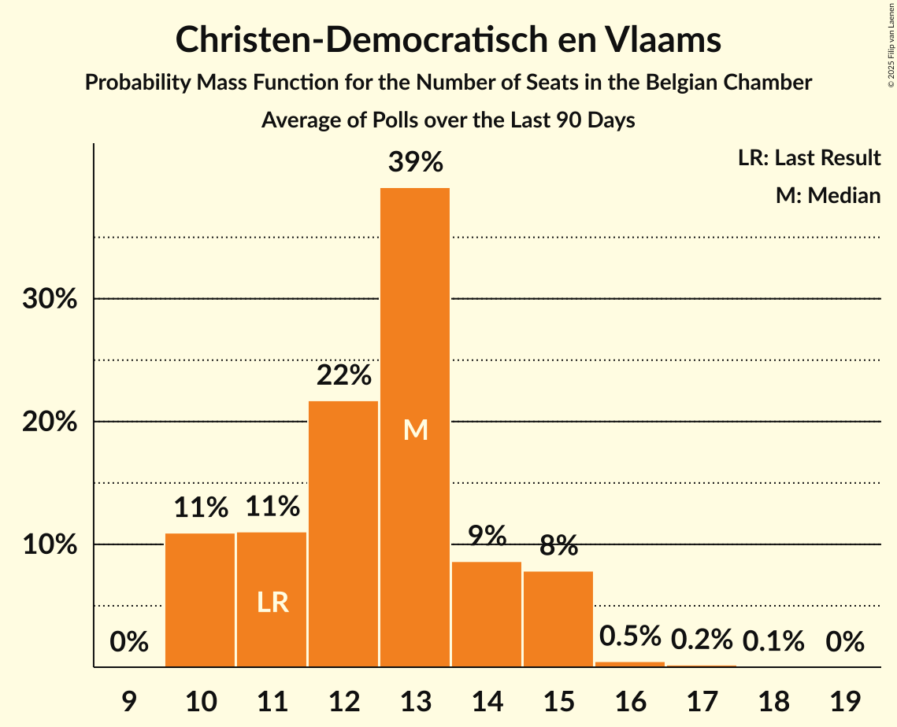

# Poll Average

<a href="#voting-intentions">Voting Intentions</a> | <a href="#seats">Seats</a> | <a href="#coalitions">Coalitions</a> | <a href="#technical-information">Technical Information</a>

## Summary

The table below lists the polls on which the average is based. They are the most recent polls (less than 90 days old) registered and analyzed so far.

| Period     | Polling firm/Commissioner(s) | N-VA | VB | PS | CD&V | PTB | PVDA | VLD | MR | VOORUIT | ECOLO | GROEN | CDH | DÉFI | PP |
|:----------:|:----------------------------:|:--:|:--:|:--:|:--:|:--:|:--:|:--:|:--:|:--:|:--:|:--:|:--:|:--:|:--:|
| 26 May 2019 | General Election | 16.0%   25 | 12.0%   18 | 9.5%   20 | 8.9%   12 | 4.8%   9 | 3.3%   3 | 8.5%   12 | 7.6%   14 | 6.7%   9 | 6.1%   13 | 6.1%   8 | 3.7%   5 | 2.2%   2 | 1.1%   0 |
| N/A | Poll Average | 11–13%   17–25 | 13–15%   20–28 | 8%   16–21 | 4–6%   5–10 | 6%   11–17 | 3–5%   1–8 | 5–7%   6–13 | 6–7%   12–18 | 8–11%   11–17 | 4%   7–12 | 4–7%   5–11 | 2–3%   4–6 | 2%   1–4 | N/A   N/A |
| [16–29 January 2023](2023-01-29-Kantar.html) | Kantar   La Libre Belgique and RTBf | 11–12%   16–25 | 12–14%   19–28 | 8%   16–21 | 4–5%   5–10 | 6–7%   11–18 | 2–4%   1–6 | 5–7%   7–14 | 6–7%   12–18 | 8–11%   11–17 | 4%   7–12 | 5–8%   5–13 | 2–3%   4–6 | 2%   1–4 | N/A   N/A |
| [21–29 November 2022](2022-11-29-Ipsos.html) | Ipsos   Het Laatste Nieuws, Le Soir, RTL TVi and VTM | 12–14%   18–24 | 14–17%   21–28 | 8%   16–21 | 5–7%   5–10 | 6%   11–14 | 4–5%   3–8 | 5–6%   6–10 | 7%   14–18 | 9–11%   12–17 | 4%   8–11 | 4–6%   5–9 | 2–3%   4–5 | 2%   1–4 | N/A   N/A |
| 26 May 2019 | General Election | 16.0%   25 | 12.0%   18 | 9.5%   20 | 8.9%   12 | 4.8%   9 | 3.3%   3 | 8.5%   12 | 7.6%   14 | 6.7%   9 | 6.1%   13 | 6.1%   8 | 3.7%   5 | 2.2%   2 | 1.1%   0 |

Only polls for which at least the sample size has been published are included in the table above.

**Legend:**
+ **Top half of each row:** Voting intentions (95% confidence interval)
+ **Bottom half of each row:** Seat projections for the Belgian Chamber (95% confidence interval)
+ **N-VA:** Nieuw-Vlaamse Alliantie
+ **VB:** Vlaams Belang
+ **PS:** Parti Socialiste
+ **CD&V:** Christen-Democratisch en Vlaams
+ **PTB:** Parti du Travail de Belgique
+ **PVDA:** Partij van de Arbeid van België
+ **VLD:** Open Vlaamse Liberalen en Democraten
+ **MR:** Mouvement Réformateur
+ **VOORUIT:** Vooruit
+ **ECOLO:** Ecolo
+ **GROEN:** Groen
+ **CDH:** Centre démocrate humaniste
+ **DÉFI:** DéFI
+ **PP:** Parti Populaire
+ **N/A (single party):** Party not included the published results
+ **N/A (entire row):** Calculation for this opinion poll not started yet

## Voting Intentions

### Confidence Intervals

| Party | Last Result | Median | 80% Confidence Interval | 90% Confidence Interval | 95% Confidence Interval | 99% Confidence Interval |
|:-----:|:-----------:|:------:|:-----------------------:|:-----------------------:|:-----------------------:|:-----------------------:|
| <a href="#nieuw-vlaamse-alliantie">Nieuw-Vlaamse Alliantie</a> | 16.0% | 12.4% | 11.5–12.8% |11.2–12.8% | 11.0–12.8% | 10.5–12.8% |
| <a href="#vlaams-belang">Vlaams Belang</a> | 12.0% | 14.2% | 13.3–14.6% |13.0–14.7% | 12.7–14.7% | 12.2–14.7% |
| <a href="#parti-socialiste">Parti Socialiste</a> | 9.5% | 8.2% | 7.9–8.4% |7.8–8.4% | 7.7–8.4% | 7.5–8.4% |
| <a href="#christen-democratisch-en-vlaams">Christen-Democratisch en Vlaams</a> | 8.9% | 5.2% | 4.6–5.4% |4.4–5.5% | 4.2–5.5% | 3.9–5.5% |
| <a href="#open-vlaamse-liberalen-en-democraten">Open Vlaamse Liberalen en Democraten</a> | 8.5% | 6.1% | 5.2–6.6% |5.0–6.6% | 4.9–6.6% | 4.5–6.6% |
| <a href="#mouvement-réformateur">Mouvement Réformateur</a> | 7.6% | 6.6% | 6.2–6.7% |6.1–6.8% | 5.9–6.8% | 5.7–6.8% |
| <a href="#vooruit">Vooruit</a> | 6.7% | 9.6% | 8.5–10.5% |8.1–10.7% | 7.9–10.7% | 7.3–10.8% |
| <a href="#ecolo">Ecolo</a> | 6.1% | 4.4% | 4.2–4.5% |4.1–4.5% | 4.0–4.5% | 3.8–4.5% |
| <a href="#groen">Groen</a> | 6.1% | 5.7% | 4.9–6.7% |4.7–6.9% | 4.5–7.0% | 4.2–7.1% |
| <a href="#parti-du-travail-de-belgique">Parti du Travail de Belgique</a> | 4.8% | 6.1% | 5.9–6.3% |5.8–6.3% | 5.7–6.3% | 5.5–6.3% |
| <a href="#centre-démocrate-humaniste">Centre démocrate humaniste</a> | 3.7% | 2.6% | 2.3–2.7% |2.2–2.7% | 2.2–2.7% | 2.0–2.7% |
| <a href="#partij-van-de-arbeid-van-belgië">Partij van de Arbeid van België</a> | 3.3% | 4.1% | 3.0–4.8% |2.8–4.9% | 2.6–5.0% | 2.3–5.1% |
| <a href="#défi">DéFI</a> | 2.2% | 1.9% | 1.8–2.0% |1.7–2.0% | 1.6–2.0% | 1.5–2.0% |
| <a href="#parti-populaire">Parti Populaire</a> | 1.1% | N/A | N/A |N/A | N/A | N/A |

### Nieuw-Vlaamse Alliantie

*For a full overview of the results for this party, see the [Nieuw-Vlaamse Alliantie](party-nieuw-vlaamsealliantie.html) page.*

| Voting Intentions | Probability | Accumulated | Special Marks |
|:-----------------:|:-----------:|:-----------:|:-------------:|
| 8.5–9.5% | 0% | 100% |  |
| 9.5–10.5% | 0.7% | 100% |  |
| 10.5–11.5% | 10% | 99.3% |  |
| 11.5–12.5% | 57% | 89% | Median |
| 12.5–13.5% | 100% | 33% |  |
| 13.5–14.5% | 100% | 0% |  |
| 14.5–15.5% | 65% | 0% |  |
| 15.5–16.5% | 16% | 0% | Last Result |
| 16.5–17.5% | 2% | 0% |  |

### Vlaams Belang

*For a full overview of the results for this party, see the [Vlaams Belang](party-vlaamsbelang.html) page.*

| Voting Intentions | Probability | Accumulated | Special Marks |
|:-----------------:|:-----------:|:-----------:|:-------------:|
| 10.5–11.5% | 0.1% | 100% |  |
| 11.5–12.5% | 1.5% | 99.9% | Last Result |
| 12.5–13.5% | 15% | 98% |  |
| 13.5–14.5% | 65% | 84% | Median |
| 14.5–15.5% | 100% | 19% |  |
| 15.5–16.5% | 100% | 0% |  |
| 16.5–17.5% | 65% | 0% |  |
| 17.5–18.5% | 16% | 0% |  |
| 18.5–19.5% | 2% | 0% |  |

### Parti Socialiste

*For a full overview of the results for this party, see the [Parti Socialiste](party-partisocialiste.html) page.*

| Voting Intentions | Probability | Accumulated | Special Marks |
|:-----------------:|:-----------:|:-----------:|:-------------:|
| 5.5–6.5% | 0% | 100% |  |
| 6.5–7.5% | 1.0% | 100% |  |
| 7.5–8.5% | 100% | 99.0% | Median |
| 8.5–9.5% | 100% | 0% | Last Result |
| 9.5–10.5% | 100% | 0% |  |
| 10.5–11.5% | 18% | 0% |  |
| 11.5–12.5% | 0.2% | 0% |  |

### Christen-Democratisch en Vlaams

*For a full overview of the results for this party, see the [Christen-Democratisch en Vlaams](party-christen-democratischenvlaams.html) page.*

| Voting Intentions | Probability | Accumulated | Special Marks |
|:-----------------:|:-----------:|:-----------:|:-------------:|
| 2.5–3.5% | 0.1% | 100% |  |
| 3.5–4.5% | 8% | 99.9% |  |
| 4.5–5.5% | 100% | 91% | Median |
| 5.5–6.5% | 100% | 0% |  |
| 6.5–7.5% | 91% | 0% |  |
| 7.5–8.5% | 14% | 0% |  |
| 8.5–9.5% | 0.9% | 0% | Last Result |

### Open Vlaamse Liberalen en Democraten

*For a full overview of the results for this party, see the [Open Vlaamse Liberalen en Democraten](party-openvlaamseliberalenendemocraten.html) page.*

| Voting Intentions | Probability | Accumulated | Special Marks |
|:-----------------:|:-----------:|:-----------:|:-------------:|
| 2.5–3.5% | 0% | 100% |  |
| 3.5–4.5% | 0.6% | 100% |  |
| 4.5–5.5% | 21% | 99.4% |  |
| 5.5–6.5% | 68% | 79% | Median |
| 6.5–7.5% | 100% | 10% |  |
| 7.5–8.5% | 100% | 0% |  |
| 8.5–9.5% | 49% | 0% | Last Result |
| 9.5–10.5% | 7% | 0% |  |
| 10.5–11.5% | 0.5% | 0% |  |

### Mouvement Réformateur

*For a full overview of the results for this party, see the [Mouvement Réformateur](party-mouvementréformateur.html) page.*

| Voting Intentions | Probability | Accumulated | Special Marks |
|:-----------------:|:-----------:|:-----------:|:-------------:|
| 3.5–4.5% | 0% | 100% |  |
| 4.5–5.5% | 0.2% | 100% |  |
| 5.5–6.5% | 47% | 99.8% |  |
| 6.5–7.5% | 100% | 53% | Median |
| 7.5–8.5% | 100% | 0% | Last Result |
| 8.5–9.5% | 28% | 0% |  |

### Vooruit

*For a full overview of the results for this party, see the [Vooruit](party-vooruit.html) page.*

| Voting Intentions | Probability | Accumulated | Special Marks |
|:-----------------:|:-----------:|:-----------:|:-------------:|
| 5.5–6.5% | 0% | 100% |  |
| 6.5–7.5% | 1.1% | 100% | Last Result |
| 7.5–8.5% | 10% | 98.9% |  |
| 8.5–9.5% | 35% | 89% |  |
| 9.5–10.5% | 46% | 54% | Median |
| 10.5–11.5% | 18% | 8% |  |
| 11.5–12.5% | 2% | 0% |  |

### Ecolo

*For a full overview of the results for this party, see the [Ecolo](party-ecolo.html) page.*

| Voting Intentions | Probability | Accumulated | Special Marks |
|:-----------------:|:-----------:|:-----------:|:-------------:|
| 2.5–3.5% | 0% | 100% |  |
| 3.5–4.5% | 100% | 100% | Median |
| 4.5–5.5% | 100% | 0% |  |
| 5.5–6.5% | 100% | 0% | Last Result |
| 6.5–7.5% | 2% | 0% |  |

### Groen

*For a full overview of the results for this party, see the [Groen](party-groen.html) page.*

| Voting Intentions | Probability | Accumulated | Special Marks |
|:-----------------:|:-----------:|:-----------:|:-------------:|
| 2.5–3.5% | 0% | 100% |  |
| 3.5–4.5% | 3% | 100% |  |
| 4.5–5.5% | 38% | 97% |  |
| 5.5–6.5% | 44% | 59% | Last Result, Median |
| 6.5–7.5% | 21% | 15% |  |
| 7.5–8.5% | 5% | 0% |  |
| 8.5–9.5% | 0.5% | 0% |  |

### Parti du Travail de Belgique

*For a full overview of the results for this party, see the [Parti du Travail de Belgique](party-partidutravaildebelgique.html) page.*

| Voting Intentions | Probability | Accumulated | Special Marks |
|:-----------------:|:-----------:|:-----------:|:-------------:|
| 3.5–4.5% | 0% | 100% |  |
| 4.5–5.5% | 0.7% | 100% | Last Result |
| 5.5–6.5% | 100% | 99.3% | Median |
| 6.5–7.5% | 100% | 0% |  |
| 7.5–8.5% | 100% | 0% |  |
| 8.5–9.5% | 16% | 0% |  |

### Centre démocrate humaniste

*For a full overview of the results for this party, see the [Centre démocrate humaniste](party-centredémocratehumaniste.html) page.*

| Voting Intentions | Probability | Accumulated | Special Marks |
|:-----------------:|:-----------:|:-----------:|:-------------:|
| 0.5–1.5% | 0% | 100% |  |
| 1.5–2.5% | 43% | 100% |  |
| 2.5–3.5% | 100% | 57% | Median |
| 3.5–4.5% | 100% | 0% | Last Result |
| 4.5–5.5% | 0.5% | 0% |  |

### Partij van de Arbeid van België

*For a full overview of the results for this party, see the [Partij van de Arbeid van België](party-partijvandearbeidvanbelgië.html) page.*

| Voting Intentions | Probability | Accumulated | Special Marks |
|:-----------------:|:-----------:|:-----------:|:-------------:|
| 0.5–1.5% | 0% | 100% |  |
| 1.5–2.5% | 2% | 100% |  |
| 2.5–3.5% | 26% | 98% | Last Result |
| 3.5–4.5% | 49% | 72% | Median |
| 4.5–5.5% | 32% | 23% |  |
| 5.5–6.5% | 2% | 0% |  |

### DéFI

*For a full overview of the results for this party, see the [DéFI](party-défi.html) page.*

| Voting Intentions | Probability | Accumulated | Special Marks |
|:-----------------:|:-----------:|:-----------:|:-------------:|
| 0.0–0.5% | 0% | 100% |  |
| 0.5–1.5% | 0.7% | 100% |  |
| 1.5–2.5% | 100% | 99.3% | Last Result, Median |
| 2.5–3.5% | 100% | 0% |  |
| 3.5–4.5% | 0.7% | 0% |  |

## Seats

### Confidence Intervals

| Party | Last Result | Median | 80% Confidence Interval | 90% Confidence Interval | 95% Confidence Interval | 99% Confidence Interval |
|:-----:|:-----------:|:------:|:-----------------------:|:-----------------------:|:-----------------------:|:-----------------------:|
| <a href="#nieuw-vlaamse-alliantie">Nieuw-Vlaamse Alliantie</a> | 25 | 20 | 18–23 |18–24 | 17–25 | 16–26 |
| <a href="#vlaams-belang">Vlaams Belang</a> | 18 | 24 | 21–26 |21–27 | 20–28 | 19–29 |
| <a href="#parti-socialiste">Parti Socialiste</a> | 20 | 19 | 17–20 |17–21 | 16–21 | 15–21 |
| <a href="#christen-democratisch-en-vlaams">Christen-Democratisch en Vlaams</a> | 12 | 8 | 6–10 |5–10 | 5–10 | 5–11 |
| <a href="#open-vlaamse-liberalen-en-democraten">Open Vlaamse Liberalen en Democraten</a> | 12 | 9 | 6–11 |6–12 | 6–13 | 5–14 |
| <a href="#mouvement-réformateur">Mouvement Réformateur</a> | 14 | 15 | 13–17 |12–18 | 12–18 | 11–19 |
| <a href="#vooruit">Vooruit</a> | 9 | 15 | 12–16 |11–17 | 11–17 | 10–19 |
| <a href="#ecolo">Ecolo</a> | 13 | 9 | 8–11 |8–11 | 7–12 | 6–12 |
| <a href="#groen">Groen</a> | 8 | 8 | 5–9 |5–10 | 5–11 | 5–13 |
| <a href="#parti-du-travail-de-belgique">Parti du Travail de Belgique</a> | 9 | 13 | 11–15 |11–16 | 11–17 | 10–18 |
| <a href="#centre-démocrate-humaniste">Centre démocrate humaniste</a> | 5 | 4 | 4–5 |4–5 | 4–6 | 3–7 |
| <a href="#partij-van-de-arbeid-van-belgië">Partij van de Arbeid van België</a> | 3 | 5 | 1–7 |1–7 | 1–8 | 0–8 |
| <a href="#défi">DéFI</a> | 2 | 2 | 1–4 |1–4 | 1–4 | 1–5 |
| <a href="#parti-populaire">Parti Populaire</a> | 0 | N/A | N/A |N/A | N/A | N/A |

### Nieuw-Vlaamse Alliantie

*For a full overview of the results for this party, see the [Nieuw-Vlaamse Alliantie](party-nieuw-vlaamsealliantie.html) page.*

| Number of Seats | Probability | Accumulated | Special Marks |
|:---------------:|:-----------:|:-----------:|:-------------:|
| 15 | 0.4% | 100% |  |
| 16 | 1.1% | 99.6% |  |
| 17 | 2% | 98% |  |
| 18 | 7% | 96% |  |
| 19 | 9% | 89% |  |
| 20 | 32% | 79% | Median |
| 21 | 21% | 47% |  |
| 22 | 11% | 26% |  |
| 23 | 7% | 14% |  |
| 24 | 4% | 7% |  |
| 25 | 2% | 3% | Last Result |
| 26 | 0.5% | 0.6% |  |
| 27 | 0.1% | 0.1% |  |
| 28 | 0% | 0% |  |

### Vlaams Belang

*For a full overview of the results for this party, see the [Vlaams Belang](party-vlaamsbelang.html) page.*

| Number of Seats | Probability | Accumulated | Special Marks |
|:---------------:|:-----------:|:-----------:|:-------------:|
| 18 | 0.3% | 100% | Last Result |
| 19 | 1.3% | 99.7% |  |
| 20 | 2% | 98% |  |
| 21 | 10% | 97% |  |
| 22 | 9% | 87% |  |
| 23 | 16% | 77% |  |
| 24 | 15% | 62% | Median |
| 25 | 35% | 47% |  |
| 26 | 6% | 12% |  |
| 27 | 3% | 6% |  |
| 28 | 2% | 3% |  |
| 29 | 0.9% | 1.2% |  |
| 30 | 0.2% | 0.3% |  |
| 31 | 0% | 0% |  |

### Parti Socialiste

*For a full overview of the results for this party, see the [Parti Socialiste](party-partisocialiste.html) page.*

| Number of Seats | Probability | Accumulated | Special Marks |
|:---------------:|:-----------:|:-----------:|:-------------:|
| 14 | 0.1% | 100% |  |
| 15 | 0.5% | 99.9% |  |
| 16 | 4% | 99.4% |  |
| 17 | 12% | 96% |  |
| 18 | 28% | 84% |  |
| 19 | 33% | 56% | Median |
| 20 | 14% | 22% | Last Result |
| 21 | 8% | 8% |  |
| 22 | 0.4% | 0.5% |  |
| 23 | 0% | 0.1% |  |
| 24 | 0% | 0% |  |

### Christen-Democratisch en Vlaams

*For a full overview of the results for this party, see the [Christen-Democratisch en Vlaams](party-christen-democratischenvlaams.html) page.*

| Number of Seats | Probability | Accumulated | Special Marks |
|:---------------:|:-----------:|:-----------:|:-------------:|
| 4 | 0.2% | 100% |  |
| 5 | 10% | 99.8% |  |
| 6 | 24% | 90% |  |
| 7 | 11% | 66% |  |
| 8 | 18% | 55% | Median |
| 9 | 15% | 37% |  |
| 10 | 21% | 22% |  |
| 11 | 1.1% | 1.3% |  |
| 12 | 0.1% | 0.2% | Last Result |
| 13 | 0% | 0.1% |  |
| 14 | 0% | 0% |  |

### Open Vlaamse Liberalen en Democraten

*For a full overview of the results for this party, see the [Open Vlaamse Liberalen en Democraten](party-openvlaamseliberalenendemocraten.html) page.*

| Number of Seats | Probability | Accumulated | Special Marks |
|:---------------:|:-----------:|:-----------:|:-------------:|
| 4 | 0.3% | 100% |  |
| 5 | 0.6% | 99.7% |  |
| 6 | 14% | 99.1% |  |
| 7 | 16% | 85% |  |
| 8 | 11% | 69% |  |
| 9 | 12% | 57% | Median |
| 10 | 31% | 46% |  |
| 11 | 6% | 15% |  |
| 12 | 6% | 9% | Last Result |
| 13 | 2% | 3% |  |
| 14 | 1.2% | 2% |  |
| 15 | 0.2% | 0.4% |  |
| 16 | 0.2% | 0.2% |  |
| 17 | 0% | 0% |  |

### Mouvement Réformateur

*For a full overview of the results for this party, see the [Mouvement Réformateur](party-mouvementréformateur.html) page.*

| Number of Seats | Probability | Accumulated | Special Marks |
|:---------------:|:-----------:|:-----------:|:-------------:|
| 10 | 0.1% | 100% |  |
| 11 | 1.0% | 99.9% |  |
| 12 | 5% | 98.9% |  |
| 13 | 16% | 94% |  |
| 14 | 23% | 79% | Last Result |
| 15 | 22% | 55% | Median |
| 16 | 14% | 33% |  |
| 17 | 11% | 19% |  |
| 18 | 8% | 9% |  |
| 19 | 0.9% | 1.0% |  |
| 20 | 0% | 0% |  |

### Vooruit

*For a full overview of the results for this party, see the [Vooruit](party-vooruit.html) page.*

| Number of Seats | Probability | Accumulated | Special Marks |
|:---------------:|:-----------:|:-----------:|:-------------:|
| 9 | 0.1% | 100% | Last Result |
| 10 | 0.5% | 99.9% |  |
| 11 | 8% | 99.4% |  |
| 12 | 10% | 91% |  |
| 13 | 11% | 81% |  |
| 14 | 17% | 70% |  |
| 15 | 39% | 53% | Median |
| 16 | 8% | 14% |  |
| 17 | 4% | 6% |  |
| 18 | 1.0% | 2% |  |
| 19 | 0.4% | 0.5% |  |
| 20 | 0.1% | 0.1% |  |
| 21 | 0% | 0% |  |

### Ecolo

*For a full overview of the results for this party, see the [Ecolo](party-ecolo.html) page.*

| Number of Seats | Probability | Accumulated | Special Marks |
|:---------------:|:-----------:|:-----------:|:-------------:|
| 5 | 0.1% | 100% |  |
| 6 | 1.0% | 99.9% |  |
| 7 | 3% | 99.0% |  |
| 8 | 8% | 96% |  |
| 9 | 42% | 88% | Median |
| 10 | 28% | 45% |  |
| 11 | 15% | 18% |  |
| 12 | 3% | 3% |  |
| 13 | 0.3% | 0.3% | Last Result |
| 14 | 0% | 0.1% |  |
| 15 | 0% | 0% |  |

### Groen

*For a full overview of the results for this party, see the [Groen](party-groen.html) page.*

| Number of Seats | Probability | Accumulated | Special Marks |
|:---------------:|:-----------:|:-----------:|:-------------:|
| 3 | 0.1% | 100% |  |
| 4 | 0.1% | 99.9% |  |
| 5 | 11% | 99.8% |  |
| 6 | 10% | 89% |  |
| 7 | 27% | 79% |  |
| 8 | 11% | 52% | Last Result, Median |
| 9 | 35% | 41% |  |
| 10 | 3% | 6% |  |
| 11 | 1.3% | 3% |  |
| 12 | 0.6% | 2% |  |
| 13 | 1.3% | 1.3% |  |
| 14 | 0% | 0% |  |

### Parti du Travail de Belgique

*For a full overview of the results for this party, see the [Parti du Travail de Belgique](party-partidutravaildebelgique.html) page.*

| Number of Seats | Probability | Accumulated | Special Marks |
|:---------------:|:-----------:|:-----------:|:-------------:|
| 9 | 0.1% | 100% | Last Result |
| 10 | 2% | 99.9% |  |
| 11 | 12% | 98% |  |
| 12 | 34% | 86% |  |
| 13 | 21% | 52% | Median |
| 14 | 13% | 31% |  |
| 15 | 9% | 17% |  |
| 16 | 6% | 9% |  |
| 17 | 2% | 3% |  |
| 18 | 1.1% | 1.3% |  |
| 19 | 0.1% | 0.1% |  |
| 20 | 0% | 0% |  |

### Centre démocrate humaniste

*For a full overview of the results for this party, see the [Centre démocrate humaniste](party-centredémocratehumaniste.html) page.*

| Number of Seats | Probability | Accumulated | Special Marks |
|:---------------:|:-----------:|:-----------:|:-------------:|
| 1 | 0.1% | 100% |  |
| 2 | 0.3% | 99.8% |  |
| 3 | 0.5% | 99.5% |  |
| 4 | 50% | 99.1% | Median |
| 5 | 46% | 49% | Last Result |
| 6 | 2% | 3% |  |
| 7 | 0.5% | 0.9% |  |
| 8 | 0.4% | 0.4% |  |
| 9 | 0% | 0% |  |

### Partij van de Arbeid van België

*For a full overview of the results for this party, see the [Partij van de Arbeid van België](party-partijvandearbeidvanbelgië.html) page.*

| Number of Seats | Probability | Accumulated | Special Marks |
|:---------------:|:-----------:|:-----------:|:-------------:|
| 0 | 0.5% | 100% |  |
| 1 | 14% | 99.5% |  |
| 2 | 3% | 86% |  |
| 3 | 16% | 83% | Last Result |
| 4 | 15% | 67% |  |
| 5 | 36% | 53% | Median |
| 6 | 6% | 16% |  |
| 7 | 6% | 10% |  |
| 8 | 4% | 4% |  |
| 9 | 0% | 0% |  |

### DéFI

*For a full overview of the results for this party, see the [DéFI](party-défi.html) page.*

| Number of Seats | Probability | Accumulated | Special Marks |
|:---------------:|:-----------:|:-----------:|:-------------:|
| 1 | 26% | 100% |  |
| 2 | 35% | 74% | Last Result, Median |
| 3 | 21% | 39% |  |
| 4 | 17% | 18% |  |
| 5 | 1.0% | 1.1% |  |
| 6 | 0.1% | 0.1% |  |
| 7 | 0% | 0% |  |

### Parti Populaire

*For a full overview of the results for this party, see the [Parti Populaire](party-partipopulaire.html) page.*

## Coalitions

### Confidence Intervals

| Coalition | Last Result | Median | Majority? | 80% Confidence Interval | 90% Confidence Interval | 95% Confidence Interval | 99% Confidence Interval |
|:---------:|:-----------:|:------:|:---------:|:-----------------------:|:-----------------------:|:-----------------------:|:-----------------------:|
| Parti Socialiste – Christen-Democratisch en Vlaams – Open Vlaamse Liberalen en Democraten – Mouvement Réformateur – Vooruit – Ecolo – Groen – Centre démocrate humaniste | 93 | 86 | 100% | 82–90 | 81–91 | 80–92 | 79–94 |
| Parti Socialiste – Christen-Democratisch en Vlaams – Open Vlaamse Liberalen en Democraten – Mouvement Réformateur – Vooruit – Ecolo – Groen | 88 | 81 | 98% | 78–86 | 77–87 | 76–88 | 74–90 |
| Parti Socialiste – Christen-Democratisch en Vlaams – Vooruit – Ecolo – Groen – Parti du Travail de Belgique – Centre démocrate humaniste – Partij van de Arbeid van België | 79 | 79 | 92% | 76–83 | 75–84 | 74–85 | 72–87 |
| Nieuw-Vlaamse Alliantie – Parti Socialiste – Open Vlaamse Liberalen en Democraten – Mouvement Réformateur – Vooruit | 80 | 77 | 73% | 74–81 | 73–82 | 72–83 | 70–85 |
| Parti Socialiste – Open Vlaamse Liberalen en Democraten – Mouvement Réformateur – Vooruit – Ecolo – Groen | 76 | 74 | 27% | 70–78 | 69–79 | 68–80 | 67–82 |
| Parti Socialiste – Vooruit – Ecolo – Groen – Parti du Travail de Belgique – Centre démocrate humaniste – Partij van de Arbeid van België | 67 | 72 | 8% | 68–75 | 67–76 | 66–77 | 64–79 |
| Parti Socialiste – Christen-Democratisch en Vlaams – Open Vlaamse Liberalen en Democraten – Mouvement Réformateur – Vooruit – Centre démocrate humaniste | 72 | 69 | 0.8% | 65–72 | 64–73 | 63–74 | 62–76 |
| Parti Socialiste – Vooruit – Ecolo – Groen – Parti du Travail de Belgique – Partij van de Arbeid van België | 62 | 67 | 0.2% | 64–71 | 63–72 | 62–73 | 60–75 |
| Parti Socialiste – Christen-Democratisch en Vlaams – Vooruit – Ecolo – Groen – Centre démocrate humaniste | 67 | 62 | 0% | 59–66 | 58–67 | 57–68 | 55–70 |
| Parti Socialiste – Open Vlaamse Liberalen en Democraten – Mouvement Réformateur – Vooruit | 55 | 57 | 0% | 54–60 | 53–61 | 52–62 | 50–64 |
| Nieuw-Vlaamse Alliantie – Christen-Democratisch en Vlaams – Open Vlaamse Liberalen en Democraten – Mouvement Réformateur – Centre démocrate humaniste | 68 | 57 | 0% | 53–60 | 52–61 | 51–62 | 50–64 |
| Parti Socialiste – Christen-Democratisch en Vlaams – Open Vlaamse Liberalen en Democraten – Mouvement Réformateur – Centre démocrate humaniste | 63 | 55 | 0% | 51–58 | 51–59 | 50–60 | 48–62 |
| Christen-Democratisch en Vlaams – Open Vlaamse Liberalen en Democraten – Mouvement Réformateur – Ecolo – Groen – Centre démocrate humaniste | 64 | 53 | 0% | 49–57 | 49–58 | 48–60 | 46–62 |
| Nieuw-Vlaamse Alliantie – Christen-Democratisch en Vlaams – Open Vlaamse Liberalen en Democraten – Mouvement Réformateur | 63 | 52 | 0% | 49–56 | 48–57 | 47–58 | 45–60 |
| Parti Socialiste – Christen-Democratisch en Vlaams – Vooruit – Centre démocrate humaniste | 46 | 45 | 0% | 42–48 | 41–49 | 40–50 | 38–51 |
| Christen-Democratisch en Vlaams – Open Vlaamse Liberalen en Democraten – Mouvement Réformateur – Centre démocrate humaniste | 43 | 36 | 0% | 33–39 | 32–40 | 31–41 | 30–43 |

### Parti Socialiste – Christen-Democratisch en Vlaams – Open Vlaamse Liberalen en Democraten – Mouvement Réformateur – Vooruit – Ecolo – Groen – Centre démocrate humaniste

| Number of Seats | Probability | Accumulated | Special Marks |
|:---------------:|:-----------:|:-----------:|:-------------:|
| 77 | 0.1% | 100% |  |
| 78 | 0.2% | 99.9% |  |
| 79 | 0.6% | 99.6% |  |
| 80 | 2% | 99.0% |  |
| 81 | 3% | 97% |  |
| 82 | 5% | 94% |  |
| 83 | 8% | 89% |  |
| 84 | 12% | 81% |  |
| 85 | 14% | 70% |  |
| 86 | 14% | 56% |  |
| 87 | 12% | 41% | Median |
| 88 | 10% | 29% |  |
| 89 | 7% | 19% |  |
| 90 | 5% | 12% |  |
| 91 | 3% | 7% |  |
| 92 | 2% | 4% |  |
| 93 | 1.1% | 2% | Last Result |
| 94 | 0.6% | 0.9% |  |
| 95 | 0.2% | 0.4% |  |
| 96 | 0.1% | 0.1% |  |
| 97 | 0% | 0% |  |

### Parti Socialiste – Christen-Democratisch en Vlaams – Open Vlaamse Liberalen en Democraten – Mouvement Réformateur – Vooruit – Ecolo – Groen

| Number of Seats | Probability | Accumulated | Special Marks |
|:---------------:|:-----------:|:-----------:|:-------------:|
| 72 | 0.1% | 100% |  |
| 73 | 0.2% | 99.9% |  |
| 74 | 0.5% | 99.7% |  |
| 75 | 1.2% | 99.3% |  |
| 76 | 2% | 98% | Majority |
| 77 | 4% | 96% |  |
| 78 | 7% | 91% |  |
| 79 | 10% | 84% |  |
| 80 | 13% | 74% |  |
| 81 | 14% | 61% |  |
| 82 | 12% | 47% |  |
| 83 | 10% | 35% | Median |
| 84 | 8% | 25% |  |
| 85 | 6% | 17% |  |
| 86 | 4% | 11% |  |
| 87 | 3% | 7% |  |
| 88 | 2% | 4% | Last Result |
| 89 | 1.1% | 2% |  |
| 90 | 0.5% | 0.9% |  |
| 91 | 0.2% | 0.4% |  |
| 92 | 0.1% | 0.1% |  |
| 93 | 0% | 0% |  |

### Parti Socialiste – Christen-Democratisch en Vlaams – Vooruit – Ecolo – Groen – Parti du Travail de Belgique – Centre démocrate humaniste – Partij van de Arbeid van België

| Number of Seats | Probability | Accumulated | Special Marks |
|:---------------:|:-----------:|:-----------:|:-------------:|
| 70 | 0.1% | 100% |  |
| 71 | 0.2% | 99.9% |  |
| 72 | 0.5% | 99.6% |  |
| 73 | 1.1% | 99.1% |  |
| 74 | 2% | 98% |  |
| 75 | 4% | 96% |  |
| 76 | 6% | 92% | Majority |
| 77 | 9% | 85% |  |
| 78 | 12% | 76% |  |
| 79 | 14% | 64% | Last Result |
| 80 | 14% | 50% |  |
| 81 | 12% | 36% | Median |
| 82 | 9% | 23% |  |
| 83 | 6% | 14% |  |
| 84 | 4% | 7% |  |
| 85 | 2% | 4% |  |
| 86 | 1.0% | 2% |  |
| 87 | 0.4% | 0.6% |  |
| 88 | 0.1% | 0.2% |  |
| 89 | 0% | 0.1% |  |
| 90 | 0% | 0% |  |

### Nieuw-Vlaamse Alliantie – Parti Socialiste – Open Vlaamse Liberalen en Democraten – Mouvement Réformateur – Vooruit

| Number of Seats | Probability | Accumulated | Special Marks |
|:---------------:|:-----------:|:-----------:|:-------------:|
| 68 | 0.1% | 100% |  |
| 69 | 0.2% | 99.9% |  |
| 70 | 0.4% | 99.7% |  |
| 71 | 1.0% | 99.3% |  |
| 72 | 2% | 98% |  |
| 73 | 4% | 96% |  |
| 74 | 7% | 92% |  |
| 75 | 11% | 84% |  |
| 76 | 14% | 73% | Majority |
| 77 | 15% | 59% |  |
| 78 | 14% | 44% | Median |
| 79 | 11% | 30% |  |
| 80 | 8% | 19% | Last Result |
| 81 | 5% | 11% |  |
| 82 | 3% | 6% |  |
| 83 | 2% | 3% |  |
| 84 | 0.8% | 1.4% |  |
| 85 | 0.4% | 0.6% |  |
| 86 | 0.2% | 0.2% |  |
| 87 | 0.1% | 0.1% |  |
| 88 | 0% | 0% |  |

### Parti Socialiste – Open Vlaamse Liberalen en Democraten – Mouvement Réformateur – Vooruit – Ecolo – Groen

| Number of Seats | Probability | Accumulated | Special Marks |
|:---------------:|:-----------:|:-----------:|:-------------:|
| 65 | 0.1% | 100% |  |
| 66 | 0.3% | 99.9% |  |
| 67 | 0.8% | 99.6% |  |
| 68 | 2% | 98.8% |  |
| 69 | 4% | 97% |  |
| 70 | 6% | 94% |  |
| 71 | 10% | 87% |  |
| 72 | 13% | 77% |  |
| 73 | 14% | 65% |  |
| 74 | 13% | 51% |  |
| 75 | 11% | 38% | Median |
| 76 | 9% | 27% | Last Result, Majority |
| 77 | 6% | 18% |  |
| 78 | 5% | 12% |  |
| 79 | 3% | 7% |  |
| 80 | 2% | 4% |  |
| 81 | 1.1% | 2% |  |
| 82 | 0.5% | 0.9% |  |
| 83 | 0.2% | 0.4% |  |
| 84 | 0.1% | 0.1% |  |
| 85 | 0% | 0.1% |  |
| 86 | 0% | 0% |  |

### Parti Socialiste – Vooruit – Ecolo – Groen – Parti du Travail de Belgique – Centre démocrate humaniste – Partij van de Arbeid van België

| Number of Seats | Probability | Accumulated | Special Marks |
|:---------------:|:-----------:|:-----------:|:-------------:|
| 62 | 0% | 100% |  |
| 63 | 0.1% | 99.9% |  |
| 64 | 0.3% | 99.8% |  |
| 65 | 0.7% | 99.5% |  |
| 66 | 2% | 98.8% |  |
| 67 | 3% | 97% | Last Result |
| 68 | 5% | 94% |  |
| 69 | 9% | 89% |  |
| 70 | 12% | 80% |  |
| 71 | 14% | 68% |  |
| 72 | 15% | 54% |  |
| 73 | 13% | 39% | Median |
| 74 | 10% | 25% |  |
| 75 | 7% | 15% |  |
| 76 | 4% | 8% | Majority |
| 77 | 2% | 4% |  |
| 78 | 1.0% | 2% |  |
| 79 | 0.4% | 0.6% |  |
| 80 | 0.2% | 0.2% |  |
| 81 | 0.1% | 0.1% |  |
| 82 | 0% | 0% |  |

### Parti Socialiste – Christen-Democratisch en Vlaams – Open Vlaamse Liberalen en Democraten – Mouvement Réformateur – Vooruit – Centre démocrate humaniste

| Number of Seats | Probability | Accumulated | Special Marks |
|:---------------:|:-----------:|:-----------:|:-------------:|
| 59 | 0% | 100% |  |
| 60 | 0.1% | 99.9% |  |
| 61 | 0.3% | 99.8% |  |
| 62 | 0.7% | 99.5% |  |
| 63 | 2% | 98.8% |  |
| 64 | 3% | 97% |  |
| 65 | 5% | 94% |  |
| 66 | 8% | 89% |  |
| 67 | 11% | 81% |  |
| 68 | 14% | 69% |  |
| 69 | 15% | 55% |  |
| 70 | 14% | 40% | Median |
| 71 | 11% | 26% |  |
| 72 | 7% | 15% | Last Result |
| 73 | 4% | 8% |  |
| 74 | 2% | 4% |  |
| 75 | 1.1% | 2% |  |
| 76 | 0.5% | 0.8% | Majority |
| 77 | 0.2% | 0.3% |  |
| 78 | 0.1% | 0.1% |  |
| 79 | 0% | 0% |  |

### Parti Socialiste – Vooruit – Ecolo – Groen – Parti du Travail de Belgique – Partij van de Arbeid van België

| Number of Seats | Probability | Accumulated | Special Marks |
|:---------------:|:-----------:|:-----------:|:-------------:|
| 58 | 0.1% | 100% |  |
| 59 | 0.2% | 99.9% |  |
| 60 | 0.5% | 99.7% |  |
| 61 | 1.1% | 99.3% |  |
| 62 | 2% | 98% | Last Result |
| 63 | 4% | 96% |  |
| 64 | 7% | 92% |  |
| 65 | 11% | 84% |  |
| 66 | 14% | 74% |  |
| 67 | 15% | 60% |  |
| 68 | 14% | 45% |  |
| 69 | 11% | 31% | Median |
| 70 | 8% | 20% |  |
| 71 | 5% | 12% |  |
| 72 | 3% | 6% |  |
| 73 | 2% | 3% |  |
| 74 | 0.8% | 1.3% |  |
| 75 | 0.3% | 0.5% |  |
| 76 | 0.1% | 0.2% | Majority |
| 77 | 0.1% | 0.1% |  |
| 78 | 0% | 0% |  |

### Parti Socialiste – Christen-Democratisch en Vlaams – Vooruit – Ecolo – Groen – Centre démocrate humaniste

| Number of Seats | Probability | Accumulated | Special Marks |
|:---------------:|:-----------:|:-----------:|:-------------:|
| 53 | 0.1% | 100% |  |
| 54 | 0.2% | 99.9% |  |
| 55 | 0.4% | 99.8% |  |
| 56 | 1.1% | 99.3% |  |
| 57 | 2% | 98% |  |
| 58 | 4% | 96% |  |
| 59 | 7% | 92% |  |
| 60 | 11% | 84% |  |
| 61 | 13% | 74% |  |
| 62 | 14% | 61% |  |
| 63 | 14% | 46% | Median |
| 64 | 12% | 33% |  |
| 65 | 9% | 21% |  |
| 66 | 6% | 12% |  |
| 67 | 3% | 7% | Last Result |
| 68 | 2% | 3% |  |
| 69 | 0.9% | 1.5% |  |
| 70 | 0.4% | 0.6% |  |
| 71 | 0.1% | 0.2% |  |
| 72 | 0.1% | 0.1% |  |
| 73 | 0% | 0% |  |

### Parti Socialiste – Open Vlaamse Liberalen en Democraten – Mouvement Réformateur – Vooruit

| Number of Seats | Probability | Accumulated | Special Marks |
|:---------------:|:-----------:|:-----------:|:-------------:|
| 48 | 0% | 100% |  |
| 49 | 0.1% | 99.9% |  |
| 50 | 0.4% | 99.8% |  |
| 51 | 1.1% | 99.4% |  |
| 52 | 3% | 98% |  |
| 53 | 6% | 96% |  |
| 54 | 9% | 90% |  |
| 55 | 14% | 81% | Last Result |
| 56 | 17% | 67% |  |
| 57 | 16% | 50% |  |
| 58 | 13% | 34% | Median |
| 59 | 9% | 20% |  |
| 60 | 5% | 11% |  |
| 61 | 3% | 6% |  |
| 62 | 1.5% | 3% |  |
| 63 | 0.7% | 1.3% |  |
| 64 | 0.3% | 0.5% |  |
| 65 | 0.1% | 0.2% |  |
| 66 | 0.1% | 0.1% |  |
| 67 | 0% | 0% |  |

### Nieuw-Vlaamse Alliantie – Christen-Democratisch en Vlaams – Open Vlaamse Liberalen en Democraten – Mouvement Réformateur – Centre démocrate humaniste

| Number of Seats | Probability | Accumulated | Special Marks |
|:---------------:|:-----------:|:-----------:|:-------------:|
| 48 | 0.1% | 100% |  |
| 49 | 0.3% | 99.9% |  |
| 50 | 0.7% | 99.6% |  |
| 51 | 2% | 98.9% |  |
| 52 | 3% | 97% |  |
| 53 | 6% | 94% |  |
| 54 | 10% | 88% |  |
| 55 | 13% | 78% |  |
| 56 | 15% | 65% | Median |
| 57 | 14% | 50% |  |
| 58 | 13% | 36% |  |
| 59 | 9% | 23% |  |
| 60 | 6% | 14% |  |
| 61 | 4% | 8% |  |
| 62 | 2% | 4% |  |
| 63 | 1.0% | 2% |  |
| 64 | 0.5% | 0.8% |  |
| 65 | 0.2% | 0.3% |  |
| 66 | 0.1% | 0.1% |  |
| 67 | 0% | 0% |  |
| 68 | 0% | 0% | Last Result |

### Parti Socialiste – Christen-Democratisch en Vlaams – Open Vlaamse Liberalen en Democraten – Mouvement Réformateur – Centre démocrate humaniste

| Number of Seats | Probability | Accumulated | Special Marks |
|:---------------:|:-----------:|:-----------:|:-------------:|
| 47 | 0.1% | 100% |  |
| 48 | 0.4% | 99.8% |  |
| 49 | 1.1% | 99.5% |  |
| 50 | 3% | 98% |  |
| 51 | 6% | 95% |  |
| 52 | 9% | 90% |  |
| 53 | 13% | 80% |  |
| 54 | 16% | 67% |  |
| 55 | 16% | 51% | Median |
| 56 | 13% | 35% |  |
| 57 | 9% | 22% |  |
| 58 | 6% | 13% |  |
| 59 | 4% | 7% |  |
| 60 | 2% | 3% |  |
| 61 | 0.8% | 1.4% |  |
| 62 | 0.3% | 0.6% |  |
| 63 | 0.1% | 0.2% | Last Result |
| 64 | 0.1% | 0.1% |  |
| 65 | 0% | 0% |  |

### Christen-Democratisch en Vlaams – Open Vlaamse Liberalen en Democraten – Mouvement Réformateur – Ecolo – Groen – Centre démocrate humaniste

| Number of Seats | Probability | Accumulated | Special Marks |
|:---------------:|:-----------:|:-----------:|:-------------:|
| 45 | 0.1% | 100% |  |
| 46 | 0.5% | 99.8% |  |
| 47 | 1.4% | 99.3% |  |
| 48 | 3% | 98% |  |
| 49 | 5% | 95% |  |
| 50 | 8% | 90% |  |
| 51 | 11% | 81% |  |
| 52 | 13% | 70% |  |
| 53 | 13% | 57% | Median |
| 54 | 12% | 43% |  |
| 55 | 10% | 32% |  |
| 56 | 8% | 22% |  |
| 57 | 6% | 14% |  |
| 58 | 4% | 9% |  |
| 59 | 2% | 5% |  |
| 60 | 1.3% | 3% |  |
| 61 | 0.7% | 1.2% |  |
| 62 | 0.3% | 0.5% |  |
| 63 | 0.1% | 0.2% |  |
| 64 | 0.1% | 0.1% | Last Result |
| 65 | 0% | 0% |  |

### Nieuw-Vlaamse Alliantie – Christen-Democratisch en Vlaams – Open Vlaamse Liberalen en Democraten – Mouvement Réformateur

| Number of Seats | Probability | Accumulated | Special Marks |
|:---------------:|:-----------:|:-----------:|:-------------:|
| 44 | 0.1% | 100% |  |
| 45 | 0.4% | 99.9% |  |
| 46 | 1.0% | 99.5% |  |
| 47 | 2% | 98% |  |
| 48 | 5% | 96% |  |
| 49 | 8% | 91% |  |
| 50 | 12% | 83% |  |
| 51 | 14% | 71% |  |
| 52 | 14% | 56% | Median |
| 53 | 13% | 42% |  |
| 54 | 11% | 29% |  |
| 55 | 7% | 18% |  |
| 56 | 5% | 10% |  |
| 57 | 3% | 6% |  |
| 58 | 2% | 3% |  |
| 59 | 0.8% | 1.3% |  |
| 60 | 0.3% | 0.6% |  |
| 61 | 0.1% | 0.2% |  |
| 62 | 0.1% | 0.1% |  |
| 63 | 0% | 0% | Last Result |

### Parti Socialiste – Christen-Democratisch en Vlaams – Vooruit – Centre démocrate humaniste

| Number of Seats | Probability | Accumulated | Special Marks |
|:---------------:|:-----------:|:-----------:|:-------------:|
| 36 | 0.1% | 100% |  |
| 37 | 0.2% | 99.9% |  |
| 38 | 0.5% | 99.8% |  |
| 39 | 1.3% | 99.2% |  |
| 40 | 2% | 98% |  |
| 41 | 4% | 96% |  |
| 42 | 8% | 91% |  |
| 43 | 11% | 83% |  |
| 44 | 13% | 72% |  |
| 45 | 14% | 59% |  |
| 46 | 14% | 45% | Last Result, Median |
| 47 | 13% | 31% |  |
| 48 | 9% | 18% |  |
| 49 | 5% | 9% |  |
| 50 | 2% | 3% |  |
| 51 | 0.8% | 1.1% |  |
| 52 | 0.2% | 0.3% |  |
| 53 | 0.1% | 0.1% |  |
| 54 | 0% | 0% |  |

### Christen-Democratisch en Vlaams – Open Vlaamse Liberalen en Democraten – Mouvement Réformateur – Centre démocrate humaniste

| Number of Seats | Probability | Accumulated | Special Marks |
|:---------------:|:-----------:|:-----------:|:-------------:|
| 28 | 0% | 100% |  |
| 29 | 0.2% | 99.9% |  |
| 30 | 0.6% | 99.8% |  |
| 31 | 2% | 99.2% |  |
| 32 | 5% | 97% |  |
| 33 | 9% | 92% |  |
| 34 | 12% | 83% |  |
| 35 | 15% | 71% |  |
| 36 | 15% | 56% | Median |
| 37 | 14% | 41% |  |
| 38 | 11% | 27% |  |
| 39 | 7% | 15% |  |
| 40 | 4% | 8% |  |
| 41 | 2% | 4% |  |
| 42 | 1.2% | 2% |  |
| 43 | 0.4% | 0.6% | Last Result |
| 44 | 0.1% | 0.2% |  |
| 45 | 0% | 0.1% |  |
| 46 | 0% | 0% |  |

## Technical Information

+ **Number of polls included in this average:** 2
+ **Lowest number of simulations done in a poll included in this average:** 1,048,576
+ **Total number of simulations done in the polls included in this average:** 2,097,152
+ **Error estimate:** 1.71%
