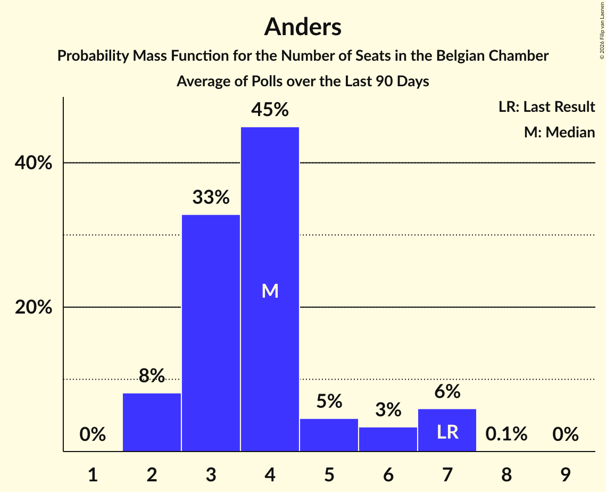

# Anders

<a href="#voting-intentions">Voting Intentions</a> | <a href="#seats">Seats</a>

## Voting Intentions

Last result: **5.4%** (General Election of 9 June 2024)

### Confidence Intervals

| Period     | Polling firm/Commissioner(s) | Median | 80% Confidence Interval | 90% Confidence Interval | 95% Confidence Interval | 99% Confidence Interval |
|:----------:|:----------------:|:-----------:|:-----------------------:|:-----------------------:|:-----------------------:|:-----------------------:|
| N/A | [Poll Average](average.html) | 4.0% | 3.5–4.5% | 3.4–4.6% | 3.3–4.7% | 3.1–4.8% |
| [1–9 June 2026](2026-06-09-Ipsos.html) | Ipsos   Het Laatste Nieuws, Le Soir, RTL TVi and VTM | 4.3% | 3.7–4.8% | 3.5–4.9% | 3.4–4.9% | 3.1–5.0% |
| [9 March–5 April 2026](2026-04-05-BpactandUniversiteitAntwerpenULB.html) | Bpact and Universiteit Antwerpen & ULB   De Standaard, RTBF and VRT | 3.8% | 3.4–4.2% | 3.3–4.2% | 3.2–4.3% | 3.0–4.3% |
| [2–9 March 2026](2026-03-09-Ipsos.html) | Ipsos   Het Laatste Nieuws, Le Soir, RTL TVi and VTM | 3.5% | 2.9–3.9% | 2.8–4.0% | 2.7–4.0% | 2.5–4.1% |
| [1–9 December 2025](2025-12-09-Ipsos.html) | Ipsos   Het Laatste Nieuws, Le Soir, RTL TVi and VTM | 4.4% | 3.8–4.9% | 3.6–5.0% | 3.5–5.1% | 3.3–5.1% |
| [16–23 September 2025](2025-09-23-Ipsos.html) | Ipsos   Het Laatste Nieuws, Le Soir, RTL TVi and VTM | 3.5% | 3.0–4.0% | 2.9–4.1% | 2.7–4.1% | 2.5–4.2% |
| [27 May–3 June 2025](2025-06-03-Ipsos.html) | Ipsos   Het Laatste Nieuws, Le Soir, RTL TVi and VTM | 3.8% | 3.2–4.3% | 3.1–4.4% | 3.0–4.4% | 2.7–4.5% |
| [3–24 March 2025](2025-03-24-BpactandUniversiteitAntwerpenULB.html) | Bpact and Universiteit Antwerpen & ULB   De Standaard, RTBF and VRT | 3.5% | 3.2–3.8% | 3.1–3.9% | 3.0–3.9% | 2.8–3.9% |
| [4–11 March 2025](2025-03-11-Ipsos.html) | Ipsos   Het Laatste Nieuws, Le Soir, RTL TVi and VTM | 3.7% | 3.2–4.2% | 3.0–4.3% | 2.9–4.3% | 2.7–4.4% |
| [18–21 November 2024](2024-11-21-Ipsos.html) | Ipsos   Het Laatste Nieuws, Le Soir, RTL TVi and VTM | 4.5% | 3.9–5.0% | 3.7–5.1% | 3.6–5.1% | 3.3–5.2% |
| [11–17 September 2024](2024-09-17-Ipsos.html) | Ipsos   Het Laatste Nieuws, Le Soir, RTL TVi and VTM | 4.2% | 3.6–4.7% | 3.5–4.8% | 3.3–4.9% | 3.1–4.9% |

### Probability Mass Function

The following table shows the probability mass function per percentage block of voting intentions for the [poll average](average.html) for Anders.

| Voting Intentions | Probability | Accumulated | Special Marks |
|:-----------------:|:-----------:|:-----------:|:-------------:|
| 1.5–2.5% | 0% | 100% |  |
| 2.5–3.5% | 13% | 100% |  |
| 3.5–4.5% | 78% | 87% | Median |
| 4.5–5.5% | 19% | 9% | Last Result |
| 5.5–6.5% | 0.7% | 0% |  |

## Seats

Last result: **7** seats (General Election of 9 June 2024)

### Confidence Intervals

| Period     | Polling firm/Commissioner(s) | Median | 80% Confidence Interval | 90% Confidence Interval | 95% Confidence Interval | 99% Confidence Interval |
|:----------:|:----------------:|:------:|:-----------------------:|:-----------------------:|:-----------------------:|:-----------------------:|
| N/A | [Poll Average](average.html) | 4 | 3–5 | 2–7 | 2–7 | 2–7 |
| [1–9 June 2026](2026-06-09-Ipsos.html) | Ipsos   Het Laatste Nieuws, Le Soir, RTL TVi and VTM | 4 | 3–7 | 3–7 | 2–7 | 2–7 |
| [9 March–5 April 2026](2026-04-05-BpactandUniversiteitAntwerpenULB.html) | Bpact and Universiteit Antwerpen & ULB   De Standaard, RTBF and VRT | 3 | 2–4 | 2–4 | 2–4 | 2–5 |
| [2–9 March 2026](2026-03-09-Ipsos.html) | Ipsos   Het Laatste Nieuws, Le Soir, RTL TVi and VTM | 2 | 2–4 | 2–4 | 2–4 | 2–6 |
| [1–9 December 2025](2025-12-09-Ipsos.html) | Ipsos   Het Laatste Nieuws, Le Soir, RTL TVi and VTM | 4 | 3–7 | 3–7 | 2–7 | 2–7 |
| [16–23 September 2025](2025-09-23-Ipsos.html) | Ipsos   Het Laatste Nieuws, Le Soir, RTL TVi and VTM | 2 | 2–4 | 2–4 | 2–4 | 2–6 |
| [27 May–3 June 2025](2025-06-03-Ipsos.html) | Ipsos   Het Laatste Nieuws, Le Soir, RTL TVi and VTM | 3 | 2–4 | 2–4 | 2–6 | 2–7 |
| [3–24 March 2025](2025-03-24-BpactandUniversiteitAntwerpenULB.html) | Bpact and Universiteit Antwerpen & ULB   De Standaard, RTBF and VRT | 3 | 2–4 | 2–4 | 2–4 | 2–4 |
| [4–11 March 2025](2025-03-11-Ipsos.html) | Ipsos   Het Laatste Nieuws, Le Soir, RTL TVi and VTM | 3 | 2–4 | 2–4 | 2–5 | 2–7 |
| [18–21 November 2024](2024-11-21-Ipsos.html) | Ipsos   Het Laatste Nieuws, Le Soir, RTL TVi and VTM | 4 | 3–7 | 3–7 | 2–7 | 2–7 |
| [11–17 September 2024](2024-09-17-Ipsos.html) | Ipsos   Het Laatste Nieuws, Le Soir, RTL TVi and VTM | 4 | 3–6 | 2–7 | 2–7 | 2–7 |

### Probability Mass Function

The following table shows the probability mass function per seat for the [poll average](average.html) for Anders.

| Number of Seats | Probability | Accumulated | Special Marks |
|:---------------:|:-----------:|:-----------:|:-------------:|
| 2 | 8% | 100% |  |
| 3 | 33% | 92% |  |
| 4 | 45% | 59% | Median |
| 5 | 5% | 14% |  |
| 6 | 3% | 9% |  |
| 7 | 6% | 6% | Last Result |
| 8 | 0.1% | 0.1% |  |
| 9 | 0% | 0% |  |

