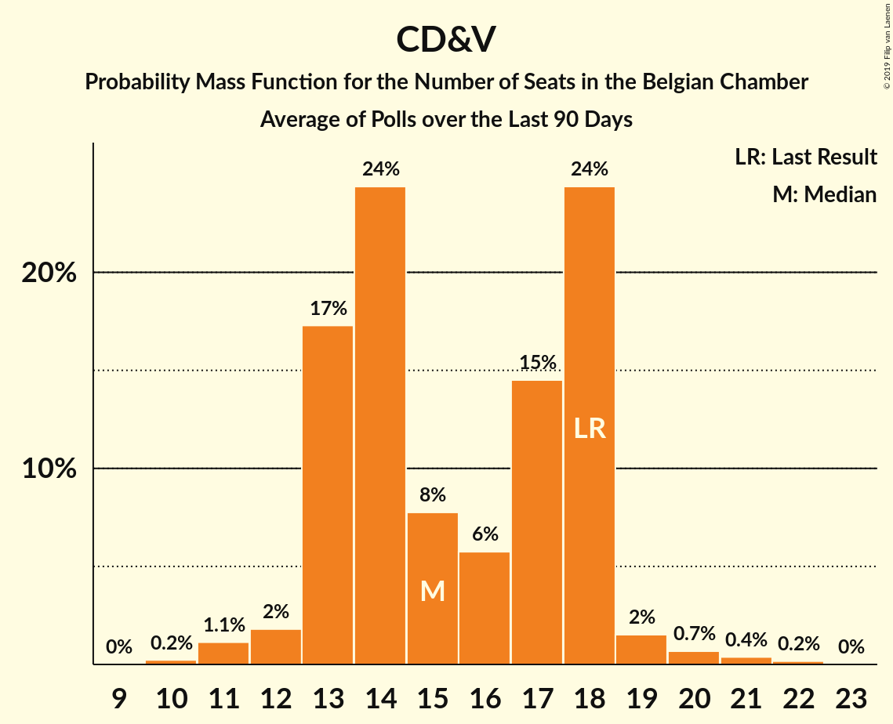

# CD&V

<a href="#voting-intentions">Voting Intentions</a> | <a href="#seats">Seats</a>

## Voting Intentions

Last result: **11.6%** (General Election of 25 May 2014)

### Confidence Intervals

| Period     | Polling firm/Commissioner(s) | Median | 80% Confidence Interval | 90% Confidence Interval | 95% Confidence Interval | 99% Confidence Interval |
|:----------:|:----------------:|:-----------:|:-----------------------:|:-----------------------:|:-----------------------:|:-----------------------:|
| N/A | [Poll Average](average.html) | 8.4% | 7.9–8.7% | 7.7–8.7% | 7.5–8.7% | 7.2–8.7% |
| [19 November–8 December 2018](2018-12-08-TNS.html) | TNS   De Standaard, La Libre Belgique, RTBf and VRT | 11.8% | 10.2–10.9% | 10.0–11.0% | 9.9–11.0% | 9.5–11.0% |
| [27 November–3 December 2018](2018-12-03-Ipsos.html) | Ipsos   Het Laatste Nieuws, Le Soir, RTL TVi and VTM | 9.1% | 7.7–8.4% | 7.5–8.4% | 7.4–8.4% | 7.1–8.4% |
| [20–27 September 2018](2018-09-27-Ipsos.html) | Ipsos   Het Laatste Nieuws, Le Soir, RTL TVi and VTM | 10.7% | 9.2–9.9% | 9.0–9.9% | 8.8–9.9% | 8.5–9.9% |
| [29 May–6 June 2018](2018-06-06-Ipsos.html) | Ipsos   Het Laatste Nieuws, Le Soir, RTL TVi and VTM | 9.5% | 8.1–8.8% | 7.9–8.8% | 7.8–8.8% | 7.4–8.8% |
| [26 February–17 March 2018](2018-03-17-TNS.html) | TNS   De Standaard–VRT–RTBf–La Libre Belgique | 10.2% | 8.7–9.4% | 8.6–9.5% | 8.4–9.5% | 8.1–9.5% |
| [27 February–6 March 2018](2018-03-06-Ipsos.html) | Ipsos   RTL TVi–Le Soir–VTM–Het Laatste Nieuws | 9.4% | 8.0–8.6% | 7.8–8.7% | 7.6–8.7% | 7.3–8.7% |
| [27 November–4 December 2017](2017-12-04-Ipsos.html) | Ipsos   RTL TVi–Le Soir–VTM–Het Laatste Nieuws | 8.8% | 7.4–8.0% | 7.2–8.1% | 7.1–8.1% | 6.8–8.1% |
| [11 September–5 October 2017](2017-10-05-TNS.html) | TNS   De Standaard–VRT–RTBf–La Libre Belgique | 12.2% | 10.6–11.3% | 10.4–11.3% | 10.2–11.4% | 9.9–11.4% |
| [25 August–3 September 2017](2017-09-03-Ipsos.html) | Ipsos   RTL TVi–Le Soir–VTM–Het Laatste Nieuws | 10.1% | 8.5–9.3% | 8.4–9.3% | 8.2–9.3% | 7.9–9.3% |
| [23–27 June 2017](2017-06-27-Dedicated.html) | Dedicated   MR | 10.5% | 9.3–11.4% | 9.0–11.5% | 8.8–11.6% | 8.3–11.7% |
| [27 March–11 April 2017](2017-04-11-TNS.html) | TNS   De Standaard–VRT | 18.6% | 17.2–20.3% | 16.7–20.7% | 16.4–21.1% | 15.7–21.9% |
| [16–20 March 2017](2017-03-20-Dedicated.html) | Dedicated   RTBf–La Libre Belgique | 12.7% | 10.6–11.8% | 10.3–11.9% | 10.1–11.9% | 9.6–11.9% |
| [16–17 February 2017](2017-02-17-IVox.html) | iVox   Sudpresse | 0.0% | N/A | N/A | N/A | N/A |
| [10–17 January 2017](2017-01-17-Ipsos.html) | Ipsos   RTL TVi–Le Soir–VTM–Het Laatste Nieuws | 9.4% | 7.9–8.6% | 7.7–8.6% | 7.6–8.6% | 7.3–8.6% |
| [24–28 November 2016](2016-11-28-Dedicated.html) | Dedicated   RTBf–La Libre Belgique | 14.9% | 12.5–13.8% | 12.2–13.9% | 12.0–13.9% | 11.4–13.9% |
| [14 September–3 October 2016](2016-10-03-TNS.html) | TNS   De Standaard–VRT | 16.8% | 15.4–18.4% | 15.0–18.8% | 14.6–19.2% | 14.0–20.0% |
| [19–25 September 2016](2016-09-25-Ipsos.html) | Ipsos   RTL TVi–Le Soir–VTM–Het Laatste Nieuws | 10.9% | 9.9–11.6% | 9.7–11.7% | 9.5–11.8% | 9.1–11.9% |
| [2–6 September 2016](2016-09-06-Dedicated.html) | Dedicated   RTBf–La Libre Belgique | 9.8% | 8.1–8.9% | 7.9–8.9% | 7.7–8.9% | 7.4–8.9% |
| [6–12 May 2016](2016-05-12-Ipsos.html) | Ipsos   RTL TVi–Le Soir–VTM–Het Laatste Nieuws | 8.5% | 7.7–9.1% | 7.5–9.3% | 7.3–9.3% | 6.9–9.4% |
| [31 March–4 April 2016](2016-04-04-Dedicated.html) | Dedicated   RTBf–La Libre Belgique | 11.5% | 9.6–10.5% | 9.4–10.5% | 9.2–10.5% | 8.8–10.5% |
| [22 February–9 March 2016](2016-03-09-TNS.html) | TNS   De Standaard–VRT | 19.1% | 17.6–20.8% | 17.2–21.2% | 16.8–21.7% | 16.1–22.5% |
| [15–20 January 2016](2016-01-20-Ipsos.html) | Ipsos   RTL TVi–Le Soir–VTM–Het Laatste Nieuws | 9.9% | 9.0–10.6% | 8.8–10.7% | 8.6–10.8% | 8.2–10.8% |
| [3–7 December 2015](2015-12-07-Dedicated.html) | Dedicated   RTBf–La Libre Belgique | 10.0% | 9.1–10.7% | 8.9–10.8% | 8.7–10.9% | 8.2–11.0% |
| [28 September–4 October 2015](2015-10-04-Ipsos.html) | Ipsos   RTL TVi–Le Soir–VTM–Het Laatste Nieuws | 11.9% | 10.8–12.6% | 10.6–12.8% | 10.4–12.8% | 9.9–12.9% |
| [22 September–2 October 2015](2015-10-02-TNS.html) | TNS   De Standaard–VRT | 18.4% | 16.9–20.0% | 16.5–20.4% | 16.1–20.8% | 15.4–21.7% |
| [9–14 September 2015](2015-09-14-Dedicated.html) | Dedicated   RTBf–La Libre Belgique | 10.7% | 9.5–11.5% | 9.2–11.6% | 9.0–11.7% | 8.5–11.8% |
| [12–18 May 2015](2015-05-18-Dedicated.html) | Dedicated   RTBf–La Libre Belgique | 11.5% | 10.3–12.3% | 10.0–12.5% | 9.8–12.6% | 9.3–12.7% |
| [5 March–9 May 2015](2015-05-09-Dedicated.html) | Dedicated   La Libre Belgique–RTBf | 1.3% | N/A | N/A | N/A | N/A |
| [20 April–3 May 2015](2015-05-03-TNS.html) | TNS   De Standaard–VRT | 21.2% | 19.7–22.9% | 19.2–23.4% | 18.8–23.8% | 18.1–24.7% |
| [20–24 April 2015](2015-04-24-Ipsos.html) | Ipsos   RTL TVi–Le Soir–VTM–Het Laatste Nieuws | 10.5% | 9.5–11.2% | 9.3–11.4% | 9.1–11.4% | 8.7–11.5% |
| [5–9 March 2015](2015-03-09-Dedicated.html) | Dedicated   RTBf–La Libre Belgique | 10.4% | 8.6–9.4% | 8.4–9.5% | 8.2–9.5% | 7.8–9.5% |
| [23–28 January 2015](2015-01-28-Ipsos.html) | Ipsos   RTL TVi–Le Soir–VTM–Het Laatste Nieuws | 11.4% | 10.4–12.1% | 10.2–12.3% | 9.9–12.4% | 9.5–12.4% |
| [5–11 January 2015](2015-01-11-Ipsos.html) | Ipsos   RTL TVi–Le Soir–VTM–Het Laatste Nieuws | 12.2% | 11.2–13.0% | 10.9–13.1% | 10.7–13.2% | 10.3–13.3% |
| [4–5 December 2014](2014-12-05-AQRate.html) | AQ Rate   Het Laatste Nieuws | 17.0% | 15.4–18.8% | 14.9–19.3% | 14.5–19.8% | 13.8–20.7% |
| [27 November–1 December 2014](2014-12-01-Dedicated.html) | Dedicated   RTBf–La Libre Belgique | 12.2% | 11.0–13.1% | 10.7–13.3% | 10.4–13.4% | 9.9–13.5% |
| [9–10 October 2014](2014-10-10-AQRate.html) | AQ Rate   Het Laatste Nieuws | 14.0% | 12.5–15.7% | 12.1–16.1% | 11.8–16.6% | 11.1–17.4% |
| [22 September–3 October 2014](2014-10-03-TNS.html) | TNS   De Standaard–VRT | 20.0% | 18.5–21.7% | 18.1–22.2% | 17.7–22.6% | 17.0–23.4% |
| [5–9 September 2014](2014-09-09-Dedicated.html) | Dedicated   RTBf–La Libre Belgique | 11.8% | 10.7–12.7% | 10.4–12.8% | 10.1–12.9% | 9.6–13.0% |
| [1–31 July 2014](2014-07-31-AQRate.html) | AQ Rate   Het Laatste Nieuws | 17.7% | 16.2–19.5% | 15.7–20.0% | 15.3–20.4% | 14.6–21.3% |

### Probability Mass Function

The following table shows the probability mass function per percentage block of voting intentions for the [poll average](average.html) for CD&V.

| Voting Intentions | Probability | Accumulated | Special Marks |
|:-----------------:|:-----------:|:-----------:|:-------------:|
| 5.5–6.5% | 0% | 100% |  |
| 6.5–7.5% | 3% | 100% |  |
| 7.5–8.5% | 67% | 97% | Median |
| 8.5–9.5% | 100% | 30% |  |
| 9.5–10.5% | 100% | 0% |  |
| 10.5–11.5% | 100% | 0% |  |
| 11.5–12.5% | 100% | 0% | Last Result |
| 12.5–13.5% | 57% | 0% |  |
| 13.5–14.5% | 5% | 0% |  |

## Seats

Last result: **18** seats (General Election of 25 May 2014)

### Confidence Intervals

| Period     | Polling firm/Commissioner(s) | Median | 80% Confidence Interval | 90% Confidence Interval | 95% Confidence Interval | 99% Confidence Interval |
|:----------:|:----------------:|:------:|:-----------------------:|:-----------------------:|:-----------------------:|:-----------------------:|
| N/A | [Poll Average](average.html) | 15 | 13–18 | 12–18 | 11–19 | 10–21 |
| [19 November–8 December 2018](2018-12-08-TNS.html) | TNS   De Standaard, La Libre Belgique, RTBf and VRT | 18 | 15–18 | 14–19 | 14–19 | 14–21 |
| [27 November–3 December 2018](2018-12-03-Ipsos.html) | Ipsos   Het Laatste Nieuws, Le Soir, RTL TVi and VTM | 13 | 12–14 | 11–15 | 11–16 | 10–17 |
| [20–27 September 2018](2018-09-27-Ipsos.html) | Ipsos   Het Laatste Nieuws, Le Soir, RTL TVi and VTM | 17 | 14–18 | 14–18 | 14–19 | 13–20 |
| [29 May–6 June 2018](2018-06-06-Ipsos.html) | Ipsos   Het Laatste Nieuws, Le Soir, RTL TVi and VTM | 14 | 13–17 | 13–18 | 13–18 | 11–18 |
| [26 February–17 March 2018](2018-03-17-TNS.html) | TNS   De Standaard–VRT–RTBf–La Libre Belgique | 15 | 13–18 | 13–18 | 13–18 | 13–18 |
| [27 February–6 March 2018](2018-03-06-Ipsos.html) | Ipsos   RTL TVi–Le Soir–VTM–Het Laatste Nieuws | 13 | 13–15 | 13–16 | 12–17 | 11–18 |
| [27 November–4 December 2017](2017-12-04-Ipsos.html) | Ipsos   RTL TVi–Le Soir–VTM–Het Laatste Nieuws | 13 | 12–15 | 11–15 | 11–16 | 10–17 |
| [11 September–5 October 2017](2017-10-05-TNS.html) | TNS   De Standaard–VRT–RTBf–La Libre Belgique | 18 | 17–20 | 16–21 | 15–21 | 14–22 |
| [25 August–3 September 2017](2017-09-03-Ipsos.html) | Ipsos   RTL TVi–Le Soir–VTM–Het Laatste Nieuws | 14 | 13–18 | 13–18 | 13–18 | 13–18 |
| [23–27 June 2017](2017-06-27-Dedicated.html) | Dedicated   MR | 16 | 13–18 | 13–18 | 13–19 | 12–20 |
| [27 March–11 April 2017](2017-04-11-TNS.html) | TNS   De Standaard–VRT | 18 | 16–18 | 15–19 | 14–20 | 14–21 |
| [16–20 March 2017](2017-03-20-Dedicated.html) | Dedicated   RTBf–La Libre Belgique | 13 | 11–14 | 10–14 | 10–15 | 9–17 |
| [16–17 February 2017](2017-02-17-IVox.html) | iVox   Sudpresse |  |  |  |  |  |
| [10–17 January 2017](2017-01-17-Ipsos.html) | Ipsos   RTL TVi–Le Soir–VTM–Het Laatste Nieuws | 14 | 13–15 | 13–17 | 12–17 | 11–18 |
| [24–28 November 2016](2016-11-28-Dedicated.html) | Dedicated   RTBf–La Libre Belgique | 15 | 13–18 | 13–18 | 13–18 | 13–19 |
| [14 September–3 October 2016](2016-10-03-TNS.html) | TNS   De Standaard–VRT | 15 | 13–18 | 13–18 | 13–18 | 13–18 |
| [19–25 September 2016](2016-09-25-Ipsos.html) | Ipsos   RTL TVi–Le Soir–VTM–Het Laatste Nieuws | 18 | 15–18 | 14–18 | 13–19 | 13–21 |
| [2–6 September 2016](2016-09-06-Dedicated.html) | Dedicated   RTBf–La Libre Belgique | 14 | 13–17 | 13–18 | 13–18 | 12–18 |
| [6–12 May 2016](2016-05-12-Ipsos.html) | Ipsos   RTL TVi–Le Soir–VTM–Het Laatste Nieuws | 13 | 12–13 | 11–14 | 10–15 | 9–17 |
| [31 March–4 April 2016](2016-04-04-Dedicated.html) | Dedicated   RTBf–La Libre Belgique | 18 | 15–19 | 14–20 | 13–21 | 13–22 |
| [22 February–9 March 2016](2016-03-09-TNS.html) | TNS   De Standaard–VRT | 18 | 16–19 | 16–20 | 15–21 | 14–22 |
| [15–20 January 2016](2016-01-20-Ipsos.html) | Ipsos   RTL TVi–Le Soir–VTM–Het Laatste Nieuws | 13 | 13–17 | 13–18 | 13–18 | 13–18 |
| [3–7 December 2015](2015-12-07-Dedicated.html) | Dedicated   RTBf–La Libre Belgique | 13 | 13–15 | 13–16 | 12–17 | 10–18 |
| [28 September–4 October 2015](2015-10-04-Ipsos.html) | Ipsos   RTL TVi–Le Soir–VTM–Het Laatste Nieuws | 18 | 15–18 | 14–19 | 14–19 | 13–21 |
| [22 September–2 October 2015](2015-10-02-TNS.html) | TNS   De Standaard–VRT | 18 | 16–18 | 15–19 | 14–20 | 13–21 |
| [9–14 September 2015](2015-09-14-Dedicated.html) | Dedicated   RTBf–La Libre Belgique | 14 | 13–18 | 13–18 | 13–18 | 12–18 |
| [12–18 May 2015](2015-05-18-Dedicated.html) | Dedicated   RTBf–La Libre Belgique | 17 | 13–18 | 13–18 | 13–19 | 13–20 |
| [5 March–9 May 2015](2015-05-09-Dedicated.html) | Dedicated   La Libre Belgique–RTBf | 0 | 0 | 0 | 0 | 0 |
| [20 April–3 May 2015](2015-05-03-TNS.html) | TNS   De Standaard–VRT | 19 | 18–22 | 18–22 | 18–22 | 17–23 |
| [20–24 April 2015](2015-04-24-Ipsos.html) | Ipsos   RTL TVi–Le Soir–VTM–Het Laatste Nieuws | 14 | 13–17 | 13–18 | 13–18 | 13–18 |
| [5–9 March 2015](2015-03-09-Dedicated.html) | Dedicated   RTBf–La Libre Belgique | 16 | 13–18 | 13–18 | 13–19 | 13–19 |
| [23–28 January 2015](2015-01-28-Ipsos.html) | Ipsos   RTL TVi–Le Soir–VTM–Het Laatste Nieuws | 16 | 13–18 | 13–18 | 13–18 | 13–19 |
| [5–11 January 2015](2015-01-11-Ipsos.html) | Ipsos   RTL TVi–Le Soir–VTM–Het Laatste Nieuws | 18 | 16–19 | 15–19 | 14–20 | 13–22 |
| [4–5 December 2014](2014-12-05-AQRate.html) | AQ Rate   Het Laatste Nieuws | 17 | 13–18 | 13–18 | 13–18 | 13–20 |
| [27 November–1 December 2014](2014-12-01-Dedicated.html) | Dedicated   RTBf–La Libre Belgique | 18 | 16–19 | 14–20 | 13–20 | 13–22 |
| [9–10 October 2014](2014-10-10-AQRate.html) | AQ Rate   Het Laatste Nieuws | 13 | 11–13 | 10–14 | 9–15 | 9–17 |
| [22 September–3 October 2014](2014-10-03-TNS.html) | TNS   De Standaard–VRT | 18 | 18–21 | 18–22 | 17–22 | 15–23 |
| [5–9 September 2014](2014-09-09-Dedicated.html) | Dedicated   RTBf–La Libre Belgique | 17 | 14–18 | 13–19 | 13–19 | 13–21 |
| [1–31 July 2014](2014-07-31-AQRate.html) | AQ Rate   Het Laatste Nieuws | 17 | 14–18 | 13–18 | 13–19 | 13–21 |

### Probability Mass Function

The following table shows the probability mass function per seat for the [poll average](average.html) for CD&V.

| Number of Seats | Probability | Accumulated | Special Marks |
|:---------------:|:-----------:|:-----------:|:-------------:|
| 9 | 0.1% | 100% |  |
| 10 | 0.7% | 99.9% |  |
| 11 | 2% | 99.2% |  |
| 12 | 3% | 97% |  |
| 13 | 31% | 94% |  |
| 14 | 13% | 63% |  |
| 15 | 5% | 50% | Median |
| 16 | 5% | 45% |  |
| 17 | 14% | 41% |  |
| 18 | 24% | 27% | Last Result |
| 19 | 2% | 3% |  |
| 20 | 0.7% | 1.2% |  |
| 21 | 0.4% | 0.6% |  |
| 22 | 0.2% | 0.2% |  |
| 23 | 0% | 0% |  |

