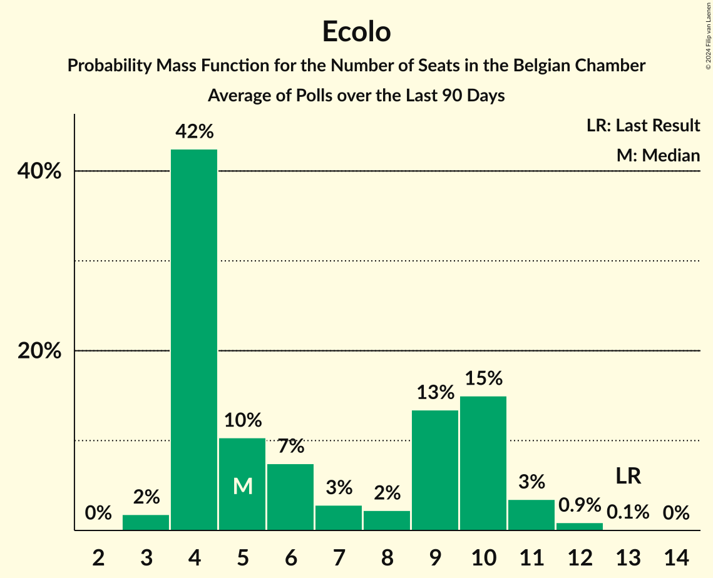

# Ecolo

<a href="#voting-intentions">Voting Intentions</a> | <a href="#seats">Seats</a>

## Voting Intentions

Last result: **6.1%** (General Election of 26 May 2019)

### Confidence Intervals

| Period     | Polling firm/Commissioner(s) | Median | 80% Confidence Interval | 90% Confidence Interval | 95% Confidence Interval | 99% Confidence Interval |
|:----------:|:----------------:|:-----------:|:-----------------------:|:-----------------------:|:-----------------------:|:-----------------------:|
| N/A | [Poll Average](average.html) | 5.7% | 5.5–5.8% | 5.4–5.9% | 5.3–5.9% | 5.2–5.9% |
| [4–9 March 2020](2020-03-09-Ipsos.html) | Ipsos   Het Laatste Nieuws, Le Soir, RTL TVi and VTM | 6.4% | 5.5–5.8% | 5.4–5.9% | 5.3–5.9% | 5.2–5.9% |
| [29 November–6 December 2019](2019-12-06-Ipsos.html) | Ipsos   Het Laatste Nieuws, Le Soir, RTL TVi and VTM | 6.9% | 6.1–6.4% | 6.0–6.4% | 5.9–6.4% | 5.7–6.4% |
| [2–10 September 2019](2019-09-10-Ipsos.html) | Ipsos   Het Laatste Nieuws, Le Soir, RTL TVi and VTM | 6.8% | 5.9–6.3% | 5.8–6.3% | 5.8–6.3% | 5.6–6.3% |

### Probability Mass Function

The following table shows the probability mass function per percentage block of voting intentions for the [poll average](average.html) for Ecolo.

| Voting Intentions | Probability | Accumulated | Special Marks |
|:-----------------:|:-----------:|:-----------:|:-------------:|
| 3.5–4.5% | 0% | 100% |  |
| 4.5–5.5% | 15% | 100% |  |
| 5.5–6.5% | 100% | 85% | Last Result, Median |
| 6.5–7.5% | 100% | 0% |  |
| 7.5–8.5% | 2% | 0% |  |

## Seats

Last result: **13** seats (General Election of 26 May 2019)

### Confidence Intervals

| Period     | Polling firm/Commissioner(s) | Median | 80% Confidence Interval | 90% Confidence Interval | 95% Confidence Interval | 99% Confidence Interval |
|:----------:|:----------------:|:------:|:-----------------------:|:-----------------------:|:-----------------------:|:-----------------------:|
| N/A | [Poll Average](average.html) | 12 | 11–14 | 11–14 | 10–14 | 10–15 |
| [4–9 March 2020](2020-03-09-Ipsos.html) | Ipsos   Het Laatste Nieuws, Le Soir, RTL TVi and VTM | 12 | 11–14 | 11–14 | 10–14 | 10–15 |
| [29 November–6 December 2019](2019-12-06-Ipsos.html) | Ipsos   Het Laatste Nieuws, Le Soir, RTL TVi and VTM | 13 | 12–15 | 12–15 | 12–16 | 11–17 |
| [2–10 September 2019](2019-09-10-Ipsos.html) | Ipsos   Het Laatste Nieuws, Le Soir, RTL TVi and VTM | 13 | 12–14 | 12–14 | 11–15 | 11–16 |

### Probability Mass Function

The following table shows the probability mass function per seat for the [poll average](average.html) for Ecolo.

| Number of Seats | Probability | Accumulated | Special Marks |
|:---------------:|:-----------:|:-----------:|:-------------:|
| 10 | 3% | 100% |  |
| 11 | 21% | 97% |  |
| 12 | 33% | 75% | Median |
| 13 | 26% | 43% | Last Result |
| 14 | 15% | 17% |  |
| 15 | 2% | 2% |  |
| 16 | 0.1% | 0.1% |  |
| 17 | 0% | 0% |  |

