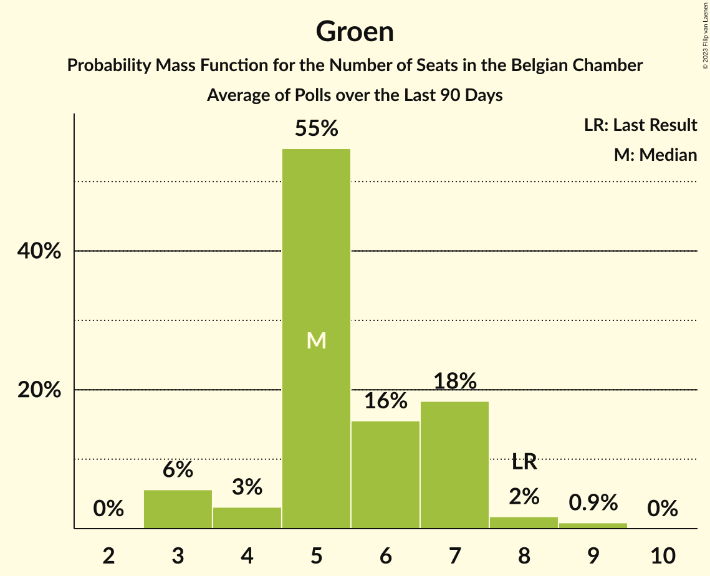

# Groen

<a href="#voting-intentions">Voting Intentions</a> | <a href="#seats">Seats</a>

## Voting Intentions

Last result: **5.3%** (General Election of 25 May 2014)

### Confidence Intervals

| Period     | Polling firm/Commissioner(s) | Median | 80% Confidence Interval | 90% Confidence Interval | 95% Confidence Interval | 99% Confidence Interval |
|:----------:|:----------------:|:-----------:|:-----------------------:|:-----------------------:|:-----------------------:|:-----------------------:|
| N/A | [Poll Average](average.html) | 7.5% | 6.8–8.2% | 6.6–8.3% | 6.4–8.3% | 6.0–8.4% |
| [27 November–3 December 2018](2018-12-03-Ipsos.html) | Ipsos   Het Laatste Nieuws, Le Soir, RTL TVi and VTM | 7.6% | 6.8–8.2% | 6.6–8.3% | 6.4–8.3% | 6.0–8.4% |
| [20–27 September 2018](2018-09-27-Ipsos.html) | Ipsos   Het Laatste Nieuws, Le Soir, RTL TVi and VTM | 8.7% | 7.9–9.3% | 7.6–9.5% | 7.4–9.5% | 7.1–9.6% |
| [29 May–6 June 2018](2018-06-06-Ipsos.html) | Ipsos   Het Laatste Nieuws, Le Soir, RTL TVi and VTM | 7.7% | 6.9–8.3% | 6.7–8.4% | 6.5–8.4% | 6.1–8.5% |
| [26 February–17 March 2018](2018-03-17-TNS.html) | TNS   De Standaard–VRT–RTBf–La Libre Belgique | 8.5% | 7.7–9.1% | 7.4–9.3% | 7.2–9.3% | 6.9–9.4% |
| [27 February–6 March 2018](2018-03-06-Ipsos.html) | Ipsos   RTL TVi–Le Soir–VTM–Het Laatste Nieuws | 6.4% | 5.7–7.0% | 5.5–7.1% | 5.3–7.2% | 5.0–7.2% |
| [27 November–4 December 2017](2017-12-04-Ipsos.html) | Ipsos   RTL TVi–Le Soir–VTM–Het Laatste Nieuws | 8.1% | 7.3–8.8% | 7.1–8.9% | 6.9–8.9% | 6.6–9.0% |
| [11 September–5 October 2017](2017-10-05-TNS.html) | TNS   De Standaard–VRT–RTBf–La Libre Belgique | 8.6% | 7.7–9.2% | 7.5–9.3% | 7.3–9.4% | 7.0–9.4% |
| [25 August–3 September 2017](2017-09-03-Ipsos.html) | Ipsos   RTL TVi–Le Soir–VTM–Het Laatste Nieuws | 8.3% | 7.5–8.9% | 7.2–9.1% | 7.1–9.1% | 6.7–9.2% |
| [23–27 June 2017](2017-06-27-Dedicated.html) | Dedicated   MR | 7.7% | 6.7–8.5% | 6.4–8.6% | 6.2–8.7% | 5.8–8.8% |
| [27 March–11 April 2017](2017-04-11-TNS.html) | TNS   De Standaard–VRT | 14.7% | 13.3–16.1% | 12.9–16.6% | 12.6–17.0% | 12.0–17.7% |
| [16–20 March 2017](2017-03-20-Dedicated.html) | Dedicated   RTBf–La Libre Belgique | 10.2% | 9.0–11.6% | 8.7–12.0% | 8.4–12.3% | 7.8–12.8% |
| [16–17 February 2017](2017-02-17-IVox.html) | iVox   Sudpresse | 0.0% | N/A | N/A | N/A | N/A |
| [10–17 January 2017](2017-01-17-Ipsos.html) | Ipsos   RTL TVi–Le Soir–VTM–Het Laatste Nieuws | 7.6% | 6.8–8.2% | 6.5–8.3% | 6.4–8.4% | 6.0–8.4% |
| [24–28 November 2016](2016-11-28-Dedicated.html) | Dedicated   RTBf–La Libre Belgique | 11.3% | 10.0–12.8% | 9.6–13.2% | 9.3–13.5% | 8.7–14.0% |
| [14 September–3 October 2016](2016-10-03-TNS.html) | TNS   De Standaard–VRT | 13.3% | 12.0–14.8% | 11.7–15.2% | 11.4–15.6% | 10.8–16.3% |
| [19–25 September 2016](2016-09-25-Ipsos.html) | Ipsos   RTL TVi–Le Soir–VTM–Het Laatste Nieuws | 6.6% | 5.8–7.2% | 5.7–7.3% | 5.5–7.4% | 5.1–7.4% |
| [2–6 September 2016](2016-09-06-Dedicated.html) | Dedicated   RTBf–La Libre Belgique | 6.2% | 5.3–6.8% | 5.1–6.9% | 4.9–7.0% | 4.6–7.1% |
| [6–12 May 2016](2016-05-12-Ipsos.html) | Ipsos   RTL TVi–Le Soir–VTM–Het Laatste Nieuws | 6.9% | 6.1–7.4% | 5.9–7.6% | 5.8–7.6% | 5.4–7.7% |
| [31 March–4 April 2016](2016-04-04-Dedicated.html) | Dedicated   RTBf–La Libre Belgique | 6.3% | 5.5–7.0% | 5.3–7.1% | 5.1–7.2% | 4.7–7.3% |
| [22 February–9 March 2016](2016-03-09-TNS.html) | TNS   De Standaard–VRT | 11.6% | 10.4–13.0% | 10.1–13.4% | 9.8–13.8% | 9.3–14.5% |
| [15–20 January 2016](2016-01-20-Ipsos.html) | Ipsos   RTL TVi–Le Soir–VTM–Het Laatste Nieuws | 6.3% | 5.6–6.9% | 5.4–7.0% | 5.3–7.1% | 5.0–7.1% |
| [3–7 December 2015](2015-12-07-Dedicated.html) | Dedicated   RTBf–La Libre Belgique | 7.7% | 6.9–8.6% | 6.7–8.8% | 6.5–9.0% | 6.1–9.1% |
| [28 September–4 October 2015](2015-10-04-Ipsos.html) | Ipsos   RTL TVi–Le Soir–VTM–Het Laatste Nieuws | 6.0% | 5.3–6.7% | 5.1–6.9% | 4.9–7.0% | 4.6–7.1% |
| [22 September–2 October 2015](2015-10-02-TNS.html) | TNS   De Standaard–VRT | 9.9% | 8.8–11.2% | 8.5–11.6% | 8.2–11.9% | 7.7–12.6% |
| [9–14 September 2015](2015-09-14-Dedicated.html) | Dedicated   RTBf–La Libre Belgique | 6.7% | 5.8–7.6% | 5.6–7.8% | 5.4–8.0% | 5.0–8.1% |
| [12–18 May 2015](2015-05-18-Dedicated.html) | Dedicated   RTBf–La Libre Belgique | 6.7% | 5.8–7.5% | 5.6–7.8% | 5.4–7.9% | 5.0–8.0% |
| [5 March–9 May 2015](2015-05-09-Dedicated.html) | Dedicated   La Libre Belgique–RTBf | 0.0% | N/A | N/A | N/A | N/A |
| [20 April–3 May 2015](2015-05-03-TNS.html) | TNS   De Standaard–VRT | 11.6% | 10.4–13.0% | 10.1–13.4% | 9.8–13.7% | 9.3–14.4% |
| [20–24 April 2015](2015-04-24-Ipsos.html) | Ipsos   RTL TVi–Le Soir–VTM–Het Laatste Nieuws | 7.1% | 6.3–8.0% | 6.1–8.2% | 5.9–8.3% | 5.6–8.5% |
| [5–9 March 2015](2015-03-09-Dedicated.html) | Dedicated   RTBf–La Libre Belgique | 5.9% | 5.1–6.6% | 4.9–6.7% | 4.7–6.8% | 4.3–6.9% |
| [23–28 January 2015](2015-01-28-Ipsos.html) | Ipsos   RTL TVi–Le Soir–VTM–Het Laatste Nieuws | 6.8% | 6.1–7.6% | 5.9–7.8% | 5.7–7.9% | 5.4–8.0% |
| [5–11 January 2015](2015-01-11-Ipsos.html) | Ipsos   RTL TVi–Le Soir–VTM–Het Laatste Nieuws | 6.9% | 6.1–7.7% | 5.9–7.9% | 5.8–8.0% | 5.4–8.1% |
| [4–5 December 2014](2014-12-05-AQRate.html) | AQ Rate   Het Laatste Nieuws | 14.0% | 12.5–15.7% | 12.1–16.1% | 11.7–16.6% | 11.1–17.4% |
| [27 November–1 December 2014](2014-12-01-Dedicated.html) | Dedicated   RTBf–La Libre Belgique | 6.8% | 6.0–7.7% | 5.7–7.9% | 5.5–8.1% | 5.1–8.2% |
| [9–10 October 2014](2014-10-10-AQRate.html) | AQ Rate   Het Laatste Nieuws | 9.0% | 7.8–10.4% | 7.5–10.8% | 7.2–11.2% | 6.7–11.9% |
| [22 September–3 October 2014](2014-10-03-TNS.html) | TNS   De Standaard–VRT | 9.8% | 8.7–11.1% | 8.4–11.4% | 8.1–11.7% | 7.6–12.4% |
| [5–9 September 2014](2014-09-09-Dedicated.html) | Dedicated   RTBf–La Libre Belgique | 6.4% | 5.6–7.2% | 5.3–7.4% | 5.2–7.6% | 4.8–7.7% |
| [1–31 July 2014](2014-07-31-AQRate.html) | AQ Rate   Het Laatste Nieuws | 9.0% | 7.9–10.3% | 7.5–10.7% | 7.3–11.1% | 6.8–11.7% |

### Probability Mass Function

The following table shows the probability mass function per percentage block of voting intentions for the [poll average](average.html) for Groen.

| Voting Intentions | Probability | Accumulated | Special Marks |
|:-----------------:|:-----------:|:-----------:|:-------------:|
| 4.5–5.5% | 0% | 100% | Last Result |
| 5.5–6.5% | 5% | 100% |  |
| 6.5–7.5% | 47% | 95% |  |
| 7.5–8.5% | 51% | 48% | Median |
| 8.5–9.5% | 8% | 0% |  |
| 9.5–10.5% | 0.2% | 0% |  |

## Seats

Last result: **6** seats (General Election of 25 May 2014)

### Confidence Intervals

| Period     | Polling firm/Commissioner(s) | Median | 80% Confidence Interval | 90% Confidence Interval | 95% Confidence Interval | 99% Confidence Interval |
|:----------:|:----------------:|:------:|:-----------------------:|:-----------------------:|:-----------------------:|:-----------------------:|
| N/A | [Poll Average](average.html) | 11 | 10–12 | 10–12 | 9–12 | 7–13 |
| [27 November–3 December 2018](2018-12-03-Ipsos.html) | Ipsos   Het Laatste Nieuws, Le Soir, RTL TVi and VTM | 11 | 10–12 | 10–12 | 9–12 | 7–13 |
| [20–27 September 2018](2018-09-27-Ipsos.html) | Ipsos   Het Laatste Nieuws, Le Soir, RTL TVi and VTM | 12 | 11–14 | 11–15 | 11–16 | 10–17 |
| [29 May–6 June 2018](2018-06-06-Ipsos.html) | Ipsos   Het Laatste Nieuws, Le Soir, RTL TVi and VTM | 11 | 10–12 | 10–12 | 10–13 | 9–14 |
| [26 February–17 March 2018](2018-03-17-TNS.html) | TNS   De Standaard–VRT–RTBf–La Libre Belgique | 12 | 11–13 | 11–13 | 11–14 | 10–15 |
| [27 February–6 March 2018](2018-03-06-Ipsos.html) | Ipsos   RTL TVi–Le Soir–VTM–Het Laatste Nieuws | 10 | 7–10 | 6–11 | 6–11 | 6–12 |
| [27 November–4 December 2017](2017-12-04-Ipsos.html) | Ipsos   RTL TVi–Le Soir–VTM–Het Laatste Nieuws | 12 | 11–13 | 10–14 | 10–14 | 10–15 |
| [11 September–5 October 2017](2017-10-05-TNS.html) | TNS   De Standaard–VRT–RTBf–La Libre Belgique | 12 | 11–13 | 11–14 | 10–14 | 10–16 |
| [25 August–3 September 2017](2017-09-03-Ipsos.html) | Ipsos   RTL TVi–Le Soir–VTM–Het Laatste Nieuws | 12 | 11–13 | 11–14 | 10–14 | 9–16 |
| [23–27 June 2017](2017-06-27-Dedicated.html) | Dedicated   MR | 11 | 10–12 | 10–13 | 9–13 | 7–15 |
| [27 March–11 April 2017](2017-04-11-TNS.html) | TNS   De Standaard–VRT | 12 | 12–14 | 11–15 | 11–16 | 10–17 |
| [16–20 March 2017](2017-03-20-Dedicated.html) | Dedicated   RTBf–La Libre Belgique | 10 | 8–11 | 8–12 | 7–12 | 6–12 |
| [16–17 February 2017](2017-02-17-IVox.html) | iVox   Sudpresse |  |  |  |  |  |
| [10–17 January 2017](2017-01-17-Ipsos.html) | Ipsos   RTL TVi–Le Soir–VTM–Het Laatste Nieuws | 11 | 10–12 | 10–12 | 9–12 | 8–13 |
| [24–28 November 2016](2016-11-28-Dedicated.html) | Dedicated   RTBf–La Libre Belgique | 12 | 10–12 | 9–13 | 9–13 | 8–16 |
| [14 September–3 October 2016](2016-10-03-TNS.html) | TNS   De Standaard–VRT | 12 | 11–12 | 10–12 | 10–13 | 9–15 |
| [19–25 September 2016](2016-09-25-Ipsos.html) | Ipsos   RTL TVi–Le Soir–VTM–Het Laatste Nieuws | 10 | 8–11 | 7–12 | 6–12 | 6–12 |
| [2–6 September 2016](2016-09-06-Dedicated.html) | Dedicated   RTBf–La Libre Belgique | 9 | 6–10 | 6–11 | 6–12 | 5–12 |
| [6–12 May 2016](2016-05-12-Ipsos.html) | Ipsos   RTL TVi–Le Soir–VTM–Het Laatste Nieuws | 10 | 8–12 | 8–12 | 8–12 | 7–12 |
| [31 March–4 April 2016](2016-04-04-Dedicated.html) | Dedicated   RTBf–La Libre Belgique | 9 | 6–11 | 6–11 | 6–12 | 5–12 |
| [22 February–9 March 2016](2016-03-09-TNS.html) | TNS   De Standaard–VRT | 10 | 8–12 | 8–12 | 8–12 | 7–12 |
| [15–20 January 2016](2016-01-20-Ipsos.html) | Ipsos   RTL TVi–Le Soir–VTM–Het Laatste Nieuws | 9 | 8–11 | 6–11 | 6–12 | 6–12 |
| [3–7 December 2015](2015-12-07-Dedicated.html) | Dedicated   RTBf–La Libre Belgique | 10 | 9–12 | 8–12 | 8–12 | 7–12 |
| [28 September–4 October 2015](2015-10-04-Ipsos.html) | Ipsos   RTL TVi–Le Soir–VTM–Het Laatste Nieuws | 7 | 6–9 | 5–9 | 5–10 | 5–11 |
| [22 September–2 October 2015](2015-10-02-TNS.html) | TNS   De Standaard–VRT | 8 | 6–10 | 6–10 | 6–11 | 5–12 |
| [9–14 September 2015](2015-09-14-Dedicated.html) | Dedicated   RTBf–La Libre Belgique | 9 | 6–10 | 6–11 | 6–12 | 5–12 |
| [12–18 May 2015](2015-05-18-Dedicated.html) | Dedicated   RTBf–La Libre Belgique | 8 | 6–10 | 6–11 | 6–12 | 5–12 |
| [5 March–9 May 2015](2015-05-09-Dedicated.html) | Dedicated   La Libre Belgique–RTBf |  |  |  |  |  |
| [20 April–3 May 2015](2015-05-03-TNS.html) | TNS   De Standaard–VRT | 10 | 8–12 | 8–12 | 8–12 | 6–12 |
| [20–24 April 2015](2015-04-24-Ipsos.html) | Ipsos   RTL TVi–Le Soir–VTM–Het Laatste Nieuws | 10 | 8–12 | 7–12 | 7–12 | 6–12 |
| [5–9 March 2015](2015-03-09-Dedicated.html) | Dedicated   RTBf–La Libre Belgique | 8 | 6–10 | 5–10 | 5–11 | 5–12 |
| [23–28 January 2015](2015-01-28-Ipsos.html) | Ipsos   RTL TVi–Le Soir–VTM–Het Laatste Nieuws | 8 | 7–10 | 6–11 | 6–11 | 6–12 |
| [5–11 January 2015](2015-01-11-Ipsos.html) | Ipsos   RTL TVi–Le Soir–VTM–Het Laatste Nieuws | 9 | 7–11 | 7–12 | 6–12 | 6–12 |
| [4–5 December 2014](2014-12-05-AQRate.html) | AQ Rate   Het Laatste Nieuws | 12 | 12–15 | 11–16 | 11–16 | 10–16 |
| [27 November–1 December 2014](2014-12-01-Dedicated.html) | Dedicated   RTBf–La Libre Belgique | 9 | 7–11 | 6–11 | 6–12 | 6–12 |
| [9–10 October 2014](2014-10-10-AQRate.html) | AQ Rate   Het Laatste Nieuws | 6 | 5–8 | 5–9 | 5–10 | 5–11 |
| [22 September–3 October 2014](2014-10-03-TNS.html) | TNS   De Standaard–VRT | 8 | 6–9 | 6–10 | 6–10 | 5–12 |
| [5–9 September 2014](2014-09-09-Dedicated.html) | Dedicated   RTBf–La Libre Belgique | 8 | 6–10 | 6–10 | 5–10 | 5–12 |
| [1–31 July 2014](2014-07-31-AQRate.html) | AQ Rate   Het Laatste Nieuws | 6 | 5–9 | 5–9 | 5–10 | 5–10 |

### Probability Mass Function

The following table shows the probability mass function per seat for the [poll average](average.html) for Groen.

| Number of Seats | Probability | Accumulated | Special Marks |
|:---------------:|:-----------:|:-----------:|:-------------:|
| 6 | 0.1% | 100% | Last Result |
| 7 | 0.5% | 99.9% |  |
| 8 | 0.5% | 99.4% |  |
| 9 | 3% | 98.9% |  |
| 10 | 34% | 96% |  |
| 11 | 44% | 63% | Median |
| 12 | 17% | 19% |  |
| 13 | 1.0% | 1.2% |  |
| 14 | 0.1% | 0.2% |  |
| 15 | 0% | 0.1% |  |
| 16 | 0% | 0% |  |

