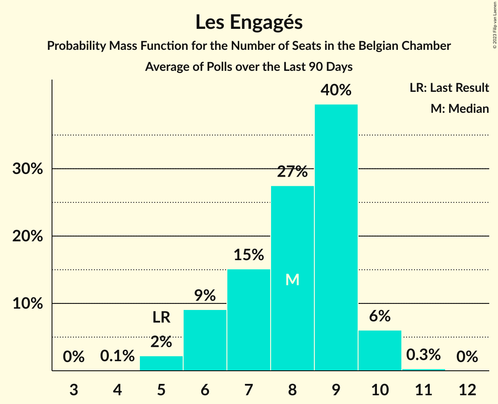

# Les Engagés

<a href="#voting-intentions">Voting Intentions</a> | <a href="#seats">Seats</a>

## Voting Intentions

Last result: **6.8%** (General Election of 9 June 2024)

### Confidence Intervals

| Period     | Polling firm/Commissioner(s) | Median | 80% Confidence Interval | 90% Confidence Interval | 95% Confidence Interval | 99% Confidence Interval |
|:----------:|:----------------:|:-----------:|:-----------------------:|:-----------------------:|:-----------------------:|:-----------------------:|
| N/A | [Poll Average](average.html) | 6.0% | 5.7–6.1% | 5.6–6.1% | 5.6–6.1% | 5.4–6.2% |
| [27 May–3 June 2025](2025-06-03-Ipsos.html) | Ipsos   Het Laatste Nieuws, Le Soir, RTL TVi and VTM | 6.5% | 5.6–6.0% | 5.6–6.0% | 5.5–6.0% | 5.3–6.0% |
| [3–24 March 2025](2025-03-24-BpactandUniversiteitAntwerpenULB.html) | Bpact and Universiteit Antwerpen & ULB   De Standaard, RTBF and VRT | 6.9% | 6.2–6.5% | 6.2–6.5% | 6.1–6.5% | 6.0–6.5% |
| [4–11 March 2025](2025-03-11-Ipsos.html) | Ipsos   Het Laatste Nieuws, Le Soir, RTL TVi and VTM | 6.4% | 5.5–5.8% | 5.4–5.8% | 5.3–5.8% | 5.2–5.8% |
| [18–21 November 2024](2024-11-21-Ipsos.html) | Ipsos   Het Laatste Nieuws, Le Soir, RTL TVi and VTM | 6.8% | 5.9–6.2% | 5.8–6.2% | 5.7–6.3% | 5.5–6.3% |
| [11–17 September 2024](2024-09-17-Ipsos.html) | Ipsos   Het Laatste Nieuws, Le Soir, RTL TVi and VTM | 7.6% | 6.6–7.0% | 6.5–7.0% | 6.4–7.0% | 6.3–7.0% |

### Probability Mass Function

The following table shows the probability mass function per percentage block of voting intentions for the [poll average](average.html) for Les Engagés.

| Voting Intentions | Probability | Accumulated | Special Marks |
|:-----------------:|:-----------:|:-----------:|:-------------:|
| 3.5–4.5% | 0% | 100% |  |
| 4.5–5.5% | 2% | 100% |  |
| 5.5–6.5% | 100% | 98% | Median |
| 6.5–7.5% | 100% | 0% | Last Result |
| 7.5–8.5% | 10% | 0% |  |

## Seats

Last result: **14** seats (General Election of 9 June 2024)

### Confidence Intervals

| Period     | Polling firm/Commissioner(s) | Median | 80% Confidence Interval | 90% Confidence Interval | 95% Confidence Interval | 99% Confidence Interval |
|:----------:|:----------------:|:------:|:-----------------------:|:-----------------------:|:-----------------------:|:-----------------------:|
| N/A | [Poll Average](average.html) | 12 | 10–14 | 10–15 | 10–15 | 9–15 |
| [27 May–3 June 2025](2025-06-03-Ipsos.html) | Ipsos   Het Laatste Nieuws, Le Soir, RTL TVi and VTM | 11 | 10–13 | 10–14 | 10–14 | 9–15 |
| [3–24 March 2025](2025-03-24-BpactandUniversiteitAntwerpenULB.html) | Bpact and Universiteit Antwerpen & ULB   De Standaard, RTBF and VRT | 13 | 12–15 | 11–15 | 11–15 | 11–15 |
| [4–11 March 2025](2025-03-11-Ipsos.html) | Ipsos   Het Laatste Nieuws, Le Soir, RTL TVi and VTM | 11 | 10–13 | 9–13 | 9–14 | 9–15 |
| [18–21 November 2024](2024-11-21-Ipsos.html) | Ipsos   Het Laatste Nieuws, Le Soir, RTL TVi and VTM | 13 | 10–14 | 9–14 | 9–14 | 9–15 |
| [11–17 September 2024](2024-09-17-Ipsos.html) | Ipsos   Het Laatste Nieuws, Le Soir, RTL TVi and VTM | 15 | 14–15 | 13–15 | 12–16 | 11–16 |

### Probability Mass Function

The following table shows the probability mass function per seat for the [poll average](average.html) for Les Engagés.

| Number of Seats | Probability | Accumulated | Special Marks |
|:---------------:|:-----------:|:-----------:|:-------------:|
| 9 | 1.0% | 100% |  |
| 10 | 11% | 99.0% |  |
| 11 | 21% | 88% |  |
| 12 | 18% | 66% | Median |
| 13 | 23% | 49% |  |
| 14 | 20% | 26% | Last Result |
| 15 | 7% | 7% |  |
| 16 | 0% | 0% |  |

