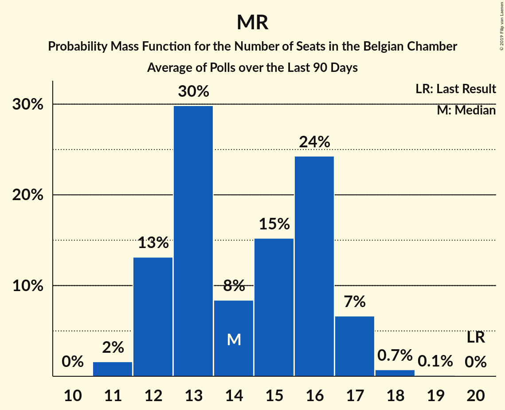

# MR

<a href="#voting-intentions">Voting Intentions</a> | <a href="#seats">Seats</a>

## Voting Intentions

Last result: **9.6%** (General Election of 25 May 2014)

### Confidence Intervals

| Period     | Polling firm/Commissioner(s) | Median | 80% Confidence Interval | 90% Confidence Interval | 95% Confidence Interval | 99% Confidence Interval |
|:----------:|:----------------:|:-----------:|:-----------------------:|:-----------------------:|:-----------------------:|:-----------------------:|
| N/A | [Poll Average](average.html) | 6.5% | 6.3–6.6% | 6.2–6.7% | 6.1–6.7% | 5.9–6.7% |
| [5–11 February 2019](2019-02-11-Ipsos.html) | Ipsos   Het Laatste Nieuws, Le Soir, RTL TVi and VTM | 7.1% | 6.2–6.5% | 6.1–6.5% | 6.0–6.6% | 5.8–6.6% |
| [13–17 December 2018](2018-12-17-Ipsos.html) | Ipsos   Het Nieuwsblad | 0.0% | N/A | N/A | N/A | N/A |
| [19 November–8 December 2018](2018-12-08-TNS.html) | TNS   De Standaard, La Libre Belgique, RTBf and VRT | 7.4% | 6.5–6.8% | 6.4–6.8% | 6.3–6.9% | 6.1–6.9% |
| [27 November–3 December 2018](2018-12-03-Ipsos.html) | Ipsos   Het Laatste Nieuws, Le Soir, RTL TVi and VTM | 7.8% | 6.8–7.1% | 6.7–7.2% | 6.6–7.2% | 6.4–7.2% |
| [20–27 September 2018](2018-09-27-Ipsos.html) | Ipsos   Het Laatste Nieuws, Le Soir, RTL TVi and VTM | 7.7% | 6.8–7.2% | 6.7–7.2% | 6.6–7.2% | 6.4–7.2% |
| [29 May–6 June 2018](2018-06-06-Ipsos.html) | Ipsos   Het Laatste Nieuws, Le Soir, RTL TVi and VTM | 7.4% | 6.5–6.8% | 6.4–6.8% | 6.3–6.8% | 6.1–6.8% |
| [26 February–17 March 2018](2018-03-17-TNS.html) | TNS   De Standaard–VRT–RTBf–La Libre Belgique | 8.9% | 7.9–8.3% | 7.8–8.3% | 7.7–8.3% | 7.6–8.3% |
| [27 February–6 March 2018](2018-03-06-Ipsos.html) | Ipsos   RTL TVi–Le Soir–VTM–Het Laatste Nieuws | 7.8% | 6.9–7.2% | 6.8–7.3% | 6.7–7.3% | 6.5–7.3% |
| [27 November–4 December 2017](2017-12-04-Ipsos.html) | Ipsos   RTL TVi–Le Soir–VTM–Het Laatste Nieuws | 8.0% | 7.0–7.4% | 6.9–7.4% | 6.9–7.4% | 6.7–7.4% |
| [11 September–5 October 2017](2017-10-05-TNS.html) | TNS   De Standaard–VRT–RTBf–La Libre Belgique | 8.1% | 7.2–7.5% | 7.1–7.5% | 7.0–7.6% | 6.8–7.6% |
| [25 August–3 September 2017](2017-09-03-Ipsos.html) | Ipsos   RTL TVi–Le Soir–VTM–Het Laatste Nieuws | 8.1% | 7.0–7.4% | 6.9–7.4% | 6.9–7.4% | 6.7–7.5% |
| [23–27 June 2017](2017-06-27-Dedicated.html) | Dedicated   MR | 8.7% | 7.4–7.9% | 7.3–7.9% | 7.2–7.9% | 7.0–8.0% |
| [27 March–11 April 2017](2017-04-11-TNS.html) | TNS   De Standaard–VRT | 0.0% | N/A | N/A | N/A | N/A |
| [16–20 March 2017](2017-03-20-Dedicated.html) | Dedicated   RTBf–La Libre Belgique | 2.0% | 1.7–1.9% | 1.7–1.9% | 1.7–1.9% | 1.6–1.9% |
| [16–17 February 2017](2017-02-17-IVox.html) | iVox   Sudpresse | 20.7% | 19.1–22.4% | 18.7–22.9% | 18.3–23.3% | 17.6–24.1% |
| [10–17 January 2017](2017-01-17-Ipsos.html) | Ipsos   RTL TVi–Le Soir–VTM–Het Laatste Nieuws | 7.3% | 6.4–6.7% | 6.3–6.8% | 6.2–6.8% | 6.0–6.8% |
| [24–28 November 2016](2016-11-28-Dedicated.html) | Dedicated   RTBf–La Libre Belgique | 2.1% | 1.8–1.9% | 1.7–1.9% | 1.7–1.9% | 1.6–1.9% |
| [14 September–3 October 2016](2016-10-03-TNS.html) | TNS   De Standaard–VRT | 0.0% | N/A | N/A | N/A | N/A |
| [19–25 September 2016](2016-09-25-Ipsos.html) | Ipsos   RTL TVi–Le Soir–VTM–Het Laatste Nieuws | 8.4% | 7.4–7.8% | 7.3–7.8% | 7.2–7.8% | 7.0–7.8% |
| [2–6 September 2016](2016-09-06-Dedicated.html) | Dedicated   RTBf–La Libre Belgique | 8.7% | 7.5–8.0% | 7.4–8.0% | 7.3–8.0% | 7.0–8.0% |
| [6–12 May 2016](2016-05-12-Ipsos.html) | Ipsos   RTL TVi–Le Soir–VTM–Het Laatste Nieuws | 7.6% | 6.7–7.1% | 6.6–7.1% | 6.5–7.1% | 6.3–7.1% |
| [31 March–4 April 2016](2016-04-04-Dedicated.html) | Dedicated   RTBf–La Libre Belgique | 8.8% | 7.8–8.2% | 7.7–8.2% | 7.6–8.2% | 7.5–8.3% |
| [22 February–9 March 2016](2016-03-09-TNS.html) | TNS   De Standaard–VRT | 0.0% | N/A | N/A | N/A | N/A |
| [15–20 January 2016](2016-01-20-Ipsos.html) | Ipsos   RTL TVi–Le Soir–VTM–Het Laatste Nieuws | 8.7% | 7.7–8.0% | 7.6–8.1% | 7.5–8.1% | 7.3–8.1% |
| [3–7 December 2015](2015-12-07-Dedicated.html) | Dedicated   RTBf–La Libre Belgique | 8.2% | 7.5–8.2% | 7.3–8.2% | 7.2–8.3% | 7.0–8.3% |
| [28 September–4 October 2015](2015-10-04-Ipsos.html) | Ipsos   RTL TVi–Le Soir–VTM–Het Laatste Nieuws | 7.7% | 7.1–7.7% | 6.9–7.8% | 6.8–7.8% | 6.6–7.8% |
| [22 September–2 October 2015](2015-10-02-TNS.html) | TNS   De Standaard–VRT | 0.0% | N/A | N/A | N/A | N/A |
| [9–14 September 2015](2015-09-14-Dedicated.html) | Dedicated   RTBf–La Libre Belgique | 8.1% | 7.2–8.1% | 7.0–8.1% | 6.9–8.1% | 6.6–8.1% |
| [12–18 May 2015](2015-05-18-Dedicated.html) | Dedicated   RTBf–La Libre Belgique | 8.4% | 7.6–8.4% | 7.4–8.5% | 7.3–8.5% | 7.0–8.5% |
| [5 March–9 May 2015](2015-05-09-Dedicated.html) | Dedicated   La Libre Belgique–RTBf | 22.9% | N/A | N/A | N/A | N/A |
| [20 April–3 May 2015](2015-05-03-TNS.html) | TNS   De Standaard–VRT | 0.0% | N/A | N/A | N/A | N/A |
| [20–24 April 2015](2015-04-24-Ipsos.html) | Ipsos   RTL TVi–Le Soir–VTM–Het Laatste Nieuws | 8.7% | 7.9–8.6% | 7.8–8.7% | 7.7–8.7% | 7.4–8.7% |
| [5–9 March 2015](2015-03-09-Dedicated.html) | Dedicated   RTBf–La Libre Belgique | 9.5% | 8.3–8.7% | 8.1–8.7% | 8.0–8.7% | 7.8–8.8% |
| [23–28 January 2015](2015-01-28-Ipsos.html) | Ipsos   RTL TVi–Le Soir–VTM–Het Laatste Nieuws | 8.7% | 7.9–8.6% | 7.8–8.6% | 7.7–8.7% | 7.4–8.7% |
| [5–11 January 2015](2015-01-11-Ipsos.html) | Ipsos   RTL TVi–Le Soir–VTM–Het Laatste Nieuws | 8.4% | 7.7–8.4% | 7.6–8.4% | 7.4–8.4% | 7.2–8.4% |
| [4–5 December 2014](2014-12-05-AQRate.html) | AQ Rate   Het Laatste Nieuws | 0.0% | N/A | N/A | N/A | N/A |
| [27 November–1 December 2014](2014-12-01-Dedicated.html) | Dedicated   RTBf–La Libre Belgique | 7.9% | 7.1–8.0% | 7.0–8.0% | 6.8–8.0% | 6.5–8.0% |
| [9–10 October 2014](2014-10-10-AQRate.html) | AQ Rate   Het Laatste Nieuws | 0.0% | N/A | N/A | N/A | N/A |
| [22 September–3 October 2014](2014-10-03-TNS.html) | TNS   De Standaard–VRT | 0.0% | N/A | N/A | N/A | N/A |
| [5–9 September 2014](2014-09-09-Dedicated.html) | Dedicated   RTBf–La Libre Belgique | 8.9% | 8.0–8.8% | 7.8–8.9% | 7.7–8.9% | 7.4–9.0% |
| [1–31 July 2014](2014-07-31-AQRate.html) | AQ Rate   Het Laatste Nieuws | 0.0% | N/A | N/A | N/A | N/A |

### Probability Mass Function

The following table shows the probability mass function per percentage block of voting intentions for the [poll average](average.html) for MR.

| Voting Intentions | Probability | Accumulated | Special Marks |
|:-----------------:|:-----------:|:-----------:|:-------------:|
| 4.5–5.5% | 0% | 100% |  |
| 5.5–6.5% | 56% | 100% |  |
| 6.5–7.5% | 100% | 44% | Median |
| 7.5–8.5% | 100% | 0% |  |
| 8.5–9.5% | 2% | 0% |  |
| 9.5–10.5% | 0% | 0% | Last Result |

## Seats

Last result: **20** seats (General Election of 25 May 2014)

### Confidence Intervals

| Period     | Polling firm/Commissioner(s) | Median | 80% Confidence Interval | 90% Confidence Interval | 95% Confidence Interval | 99% Confidence Interval |
|:----------:|:----------------:|:------:|:-----------------------:|:-----------------------:|:-----------------------:|:-----------------------:|
| N/A | [Poll Average](average.html) | 14 | 13–15 | 13–16 | 13–16 | 12–17 |
| [5–11 February 2019](2019-02-11-Ipsos.html) | Ipsos   Het Laatste Nieuws, Le Soir, RTL TVi and VTM | 14 | 13–16 | 13–16 | 13–17 | 12–17 |
| [13–17 December 2018](2018-12-17-Ipsos.html) | Ipsos   Het Nieuwsblad |  |  |  |  |  |
| [19 November–8 December 2018](2018-12-08-TNS.html) | TNS   De Standaard, La Libre Belgique, RTBf and VRT | 13 | 13–15 | 13–15 | 12–16 | 12–16 |
| [27 November–3 December 2018](2018-12-03-Ipsos.html) | Ipsos   Het Laatste Nieuws, Le Soir, RTL TVi and VTM | 16 | 14–17 | 13–18 | 13–18 | 13–18 |
| [20–27 September 2018](2018-09-27-Ipsos.html) | Ipsos   Het Laatste Nieuws, Le Soir, RTL TVi and VTM | 16 | 14–17 | 14–17 | 13–18 | 13–19 |
| [29 May–6 June 2018](2018-06-06-Ipsos.html) | Ipsos   Het Laatste Nieuws, Le Soir, RTL TVi and VTM | 15 | 14–17 | 13–17 | 13–18 | 13–18 |
| [26 February–17 March 2018](2018-03-17-TNS.html) | TNS   De Standaard–VRT–RTBf–La Libre Belgique | 17 | 16–19 | 16–19 | 15–19 | 15–20 |
| [27 February–6 March 2018](2018-03-06-Ipsos.html) | Ipsos   RTL TVi–Le Soir–VTM–Het Laatste Nieuws | 15 | 14–17 | 14–17 | 14–18 | 14–18 |
| [27 November–4 December 2017](2017-12-04-Ipsos.html) | Ipsos   RTL TVi–Le Soir–VTM–Het Laatste Nieuws | 16 | 15–19 | 15–19 | 15–20 | 14–20 |
| [11 September–5 October 2017](2017-10-05-TNS.html) | TNS   De Standaard–VRT–RTBf–La Libre Belgique | 16 | 15–17 | 15–18 | 14–18 | 14–19 |
| [25 August–3 September 2017](2017-09-03-Ipsos.html) | Ipsos   RTL TVi–Le Soir–VTM–Het Laatste Nieuws | 17 | 16–18 | 15–19 | 15–19 | 15–20 |
| [23–27 June 2017](2017-06-27-Dedicated.html) | Dedicated   MR | 18 | 16–20 | 16–20 | 15–21 | 14–21 |
| [27 March–11 April 2017](2017-04-11-TNS.html) | TNS   De Standaard–VRT |  |  |  |  |  |
| [16–20 March 2017](2017-03-20-Dedicated.html) | Dedicated   RTBf–La Libre Belgique | 4 | 3–4 | 3–4 | 3–4 | 3–4 |
| [16–17 February 2017](2017-02-17-IVox.html) | iVox   Sudpresse | 13 | 11–14 | 11–14 | 11–14 | 10–14 |
| [10–17 January 2017](2017-01-17-Ipsos.html) | Ipsos   RTL TVi–Le Soir–VTM–Het Laatste Nieuws | 16 | 14–17 | 14–17 | 13–18 | 12–18 |
| [24–28 November 2016](2016-11-28-Dedicated.html) | Dedicated   RTBf–La Libre Belgique | 4 | 3–4 | 3–4 | 3–4 | 3–4 |
| [14 September–3 October 2016](2016-10-03-TNS.html) | TNS   De Standaard–VRT |  |  |  |  |  |
| [19–25 September 2016](2016-09-25-Ipsos.html) | Ipsos   RTL TVi–Le Soir–VTM–Het Laatste Nieuws | 18 | 17–20 | 17–20 | 17–21 | 16–22 |
| [2–6 September 2016](2016-09-06-Dedicated.html) | Dedicated   RTBf–La Libre Belgique | 18 | 17–19 | 16–20 | 15–21 | 14–22 |
| [6–12 May 2016](2016-05-12-Ipsos.html) | Ipsos   RTL TVi–Le Soir–VTM–Het Laatste Nieuws | 17 | 15–18 | 14–19 | 14–19 | 14–19 |
| [31 March–4 April 2016](2016-04-04-Dedicated.html) | Dedicated   RTBf–La Libre Belgique | 18 | 17–19 | 17–19 | 17–20 | 16–20 |
| [22 February–9 March 2016](2016-03-09-TNS.html) | TNS   De Standaard–VRT |  |  |  |  |  |
| [15–20 January 2016](2016-01-20-Ipsos.html) | Ipsos   RTL TVi–Le Soir–VTM–Het Laatste Nieuws | 19 | 18–20 | 18–21 | 18–21 | 17–22 |
| [3–7 December 2015](2015-12-07-Dedicated.html) | Dedicated   RTBf–La Libre Belgique | 14 | 14–15 | 13–16 | 13–16 | 12–17 |
| [28 September–4 October 2015](2015-10-04-Ipsos.html) | Ipsos   RTL TVi–Le Soir–VTM–Het Laatste Nieuws | 14 | 14–16 | 13–16 | 13–16 | 13–17 |
| [22 September–2 October 2015](2015-10-02-TNS.html) | TNS   De Standaard–VRT |  |  |  |  |  |
| [9–14 September 2015](2015-09-14-Dedicated.html) | Dedicated   RTBf–La Libre Belgique | 14 | 14–16 | 13–16 | 13–17 | 11–18 |
| [12–18 May 2015](2015-05-18-Dedicated.html) | Dedicated   RTBf–La Libre Belgique | 15 | 14–17 | 14–17 | 14–18 | 13–19 |
| [5 March–9 May 2015](2015-05-09-Dedicated.html) | Dedicated   La Libre Belgique–RTBf | 4 | 4 | 4 | 4 | 4 |
| [20 April–3 May 2015](2015-05-03-TNS.html) | TNS   De Standaard–VRT |  |  |  |  |  |
| [20–24 April 2015](2015-04-24-Ipsos.html) | Ipsos   RTL TVi–Le Soir–VTM–Het Laatste Nieuws | 15 | 14–17 | 14–18 | 14–18 | 14–19 |
| [5–9 March 2015](2015-03-09-Dedicated.html) | Dedicated   RTBf–La Libre Belgique | 20 | 18–22 | 18–22 | 18–23 | 17–23 |
| [23–28 January 2015](2015-01-28-Ipsos.html) | Ipsos   RTL TVi–Le Soir–VTM–Het Laatste Nieuws | 16 | 14–17 | 14–18 | 14–18 | 14–19 |
| [5–11 January 2015](2015-01-11-Ipsos.html) | Ipsos   RTL TVi–Le Soir–VTM–Het Laatste Nieuws | 16 | 14–18 | 14–18 | 14–18 | 14–19 |
| [4–5 December 2014](2014-12-05-AQRate.html) | AQ Rate   Het Laatste Nieuws |  |  |  |  |  |
| [27 November–1 December 2014](2014-12-01-Dedicated.html) | Dedicated   RTBf–La Libre Belgique | 14 | 14–16 | 13–17 | 13–17 | 11–18 |
| [9–10 October 2014](2014-10-10-AQRate.html) | AQ Rate   Het Laatste Nieuws |  |  |  |  |  |
| [22 September–3 October 2014](2014-10-03-TNS.html) | TNS   De Standaard–VRT |  |  |  |  |  |
| [5–9 September 2014](2014-09-09-Dedicated.html) | Dedicated   RTBf–La Libre Belgique | 15 | 14–18 | 14–18 | 14–18 | 14–19 |
| [1–31 July 2014](2014-07-31-AQRate.html) | AQ Rate   Het Laatste Nieuws |  |  |  |  |  |

### Probability Mass Function

The following table shows the probability mass function per seat for the [poll average](average.html) for MR.

| Number of Seats | Probability | Accumulated | Special Marks |
|:---------------:|:-----------:|:-----------:|:-------------:|
| 11 | 0.1% | 100% |  |
| 12 | 2% | 99.9% |  |
| 13 | 41% | 98% |  |
| 14 | 22% | 57% | Median |
| 15 | 25% | 34% |  |
| 16 | 7% | 9% |  |
| 17 | 2% | 2% |  |
| 18 | 0.1% | 0.1% |  |
| 19 | 0% | 0% |  |
| 20 | 0% | 0% | Last Result |

