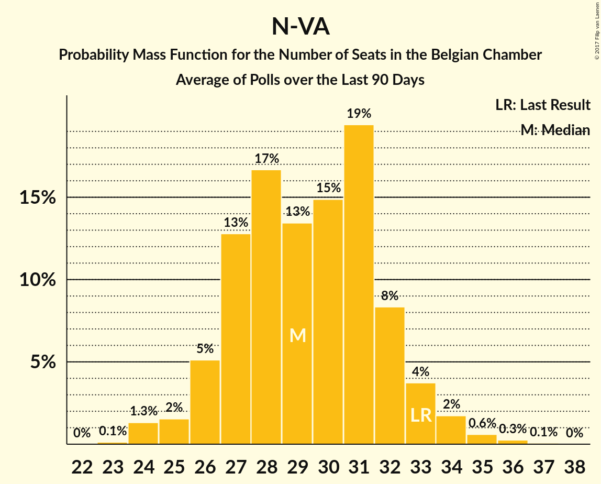

# N-VA

<a href="#voting-intentions">Voting Intentions</a> | <a href="#seats">Seats</a>

## Voting Intentions

Last result: **20.3%** (General Election of 25 May 2014)

### Confidence Intervals

| Period     | Polling firm/Commissioner(s) | Median | 80% Confidence Interval | 90% Confidence Interval | 95% Confidence Interval | 99% Confidence Interval |
|:----------:|:----------------:|:-----------:|:-----------------------:|:-----------------------:|:-----------------------:|:-----------------------:|
| N/A | [Poll Average](average.html) | 16.2% | 15.6–16.5% | 15.4–16.5% | 15.2–16.5% | 14.8–16.6% |
| [25 March–14 April 2019](2019-04-14-TNS.html) | TNS   De Standaard, La Libre Belgique, RTBf and VRT | 17.6% | 15.7–16.6% | 15.5–16.6% | 15.3–16.6% | 14.9–16.6% |
| [5–11 February 2019](2019-02-11-Ipsos.html) | Ipsos   Het Laatste Nieuws, Le Soir, RTL TVi and VTM | 17.5% | 15.5–16.4% | 15.3–16.5% | 15.1–16.5% | 14.7–16.5% |
| [13–17 December 2018](2018-12-17-Ipsos.html) | Ipsos   Het Nieuwsblad | 30.2% | N/A | N/A | N/A | N/A |
| [19 November–8 December 2018](2018-12-08-TNS.html) | TNS   De Standaard, La Libre Belgique, RTBf and VRT | 18.0% | 16.1–17.0% | 15.9–17.0% | 15.7–17.0% | 15.3–17.0% |
| [27 November–3 December 2018](2018-12-03-Ipsos.html) | Ipsos   Het Laatste Nieuws, Le Soir, RTL TVi and VTM | 17.7% | 15.8–16.7% | 15.6–16.7% | 15.4–16.7% | 15.0–16.7% |
| [20–27 September 2018](2018-09-27-Ipsos.html) | Ipsos   Het Laatste Nieuws, Le Soir, RTL TVi and VTM | 15.9% | 14.1–14.9% | 13.9–15.0% | 13.7–15.0% | 13.3–15.0% |
| [29 May–6 June 2018](2018-06-06-Ipsos.html) | Ipsos   Het Laatste Nieuws, Le Soir, RTL TVi and VTM | 16.9% | 15.0–15.9% | 14.8–15.9% | 14.6–15.9% | 14.2–15.9% |
| [26 February–17 March 2018](2018-03-17-TNS.html) | TNS   De Standaard–VRT–RTBf–La Libre Belgique | 20.4% | 18.4–19.3% | 18.1–19.3% | 17.9–19.3% | 17.5–19.4% |
| [27 February–6 March 2018](2018-03-06-Ipsos.html) | Ipsos   RTL TVi–Le Soir–VTM–Het Laatste Nieuws | 19.8% | 17.8–18.7% | 17.6–18.8% | 17.4–18.8% | 16.9–18.8% |
| [27 November–4 December 2017](2017-12-04-Ipsos.html) | Ipsos   RTL TVi–Le Soir–VTM–Het Laatste Nieuws | 18.7% | 16.8–17.7% | 16.6–17.7% | 16.4–17.7% | 16.0–17.7% |
| [11 September–5 October 2017](2017-10-05-TNS.html) | TNS   De Standaard–VRT–RTBf–La Libre Belgique | 17.6% | 15.8–16.6% | 15.6–16.7% | 15.4–16.7% | 15.0–16.7% |
| [25 August–3 September 2017](2017-09-03-Ipsos.html) | Ipsos   RTL TVi–Le Soir–VTM–Het Laatste Nieuws | 18.9% | 17.0–17.9% | 16.7–17.9% | 16.5–17.9% | 16.1–18.0% |
| [23–27 June 2017](2017-06-27-Dedicated.html) | Dedicated   MR | 16.7% | 15.3–17.7% | 14.9–17.9% | 14.6–18.0% | 14.0–18.1% |
| [27 March–11 April 2017](2017-04-11-TNS.html) | TNS   De Standaard–VRT | 26.3% | 24.6–28.1% | 24.1–28.6% | 23.7–29.1% | 22.9–30.0% |
| [16–20 March 2017](2017-03-20-Dedicated.html) | Dedicated   RTBf–La Libre Belgique | 25.6% | 22.8–24.4% | 22.4–24.4% | 22.1–24.5% | 21.4–24.5% |
| [16–17 February 2017](2017-02-17-IVox.html) | iVox   Sudpresse | 0.0% | N/A | N/A | N/A | N/A |
| [10–17 January 2017](2017-01-17-Ipsos.html) | Ipsos   RTL TVi–Le Soir–VTM–Het Laatste Nieuws | 17.3% | 15.4–16.3% | 15.2–16.3% | 15.0–16.3% | 14.6–16.4% |
| [24–28 November 2016](2016-11-28-Dedicated.html) | Dedicated   RTBf–La Libre Belgique | 23.9% | 21.0–22.6% | 20.7–22.7% | 20.3–22.7% | 19.6–22.7% |
| [14 September–3 October 2016](2016-10-03-TNS.html) | TNS   De Standaard–VRT | 27.8% | 26.1–29.7% | 25.6–30.2% | 25.2–30.7% | 24.3–31.6% |
| [19–25 September 2016](2016-09-25-Ipsos.html) | Ipsos   RTL TVi–Le Soir–VTM–Het Laatste Nieuws | 16.0% | 14.9–16.8% | 14.6–17.0% | 14.4–17.1% | 13.9–17.1% |
| [2–6 September 2016](2016-09-06-Dedicated.html) | Dedicated   RTBf–La Libre Belgique | 15.9% | 13.8–14.8% | 13.6–14.8% | 13.4–14.8% | 12.9–14.8% |
| [6–12 May 2016](2016-05-12-Ipsos.html) | Ipsos   RTL TVi–Le Soir–VTM–Het Laatste Nieuws | 15.0% | 13.9–15.7% | 13.6–15.9% | 13.4–16.0% | 12.9–16.0% |
| [31 March–4 April 2016](2016-04-04-Dedicated.html) | Dedicated   RTBf–La Libre Belgique | 16.1% | 14.0–15.0% | 13.8–15.0% | 13.5–15.0% | 13.1–15.0% |
| [22 February–9 March 2016](2016-03-09-TNS.html) | TNS   De Standaard–VRT | 27.3% | 25.5–29.1% | 25.0–29.6% | 24.6–30.1% | 23.8–31.0% |
| [15–20 January 2016](2016-01-20-Ipsos.html) | Ipsos   RTL TVi–Le Soir–VTM–Het Laatste Nieuws | 17.6% | 16.5–18.4% | 16.2–18.5% | 15.9–18.6% | 15.4–18.7% |
| [3–7 December 2015](2015-12-07-Dedicated.html) | Dedicated   RTBf–La Libre Belgique | 19.5% | 18.2–20.3% | 17.9–20.5% | 17.6–20.6% | 17.1–20.7% |
| [28 September–4 October 2015](2015-10-04-Ipsos.html) | Ipsos   RTL TVi–Le Soir–VTM–Het Laatste Nieuws | 19.3% | 18.0–20.1% | 17.7–20.2% | 17.5–20.3% | 16.9–20.4% |
| [22 September–2 October 2015](2015-10-02-TNS.html) | TNS   De Standaard–VRT | 31.1% | 29.3–33.0% | 28.8–33.6% | 28.3–34.0% | 27.5–34.9% |
| [9–14 September 2015](2015-09-14-Dedicated.html) | Dedicated   RTBf–La Libre Belgique | 18.4% | 17.0–19.4% | 16.6–19.6% | 16.3–19.7% | 15.7–19.8% |
| [12–18 May 2015](2015-05-18-Dedicated.html) | Dedicated   RTBf–La Libre Belgique | 18.8% | 17.4–19.7% | 17.0–19.9% | 16.7–20.0% | 16.1–20.1% |
| [5 March–9 May 2015](2015-05-09-Dedicated.html) | Dedicated   La Libre Belgique–RTBf | 3.5% | N/A | N/A | N/A | N/A |
| [20 April–3 May 2015](2015-05-03-TNS.html) | TNS   De Standaard–VRT | 28.5% | 26.7–30.3% | 26.2–30.9% | 25.8–31.3% | 25.0–32.2% |
| [20–24 April 2015](2015-04-24-Ipsos.html) | Ipsos   RTL TVi–Le Soir–VTM–Het Laatste Nieuws | 18.9% | 17.7–19.8% | 17.4–19.9% | 17.1–20.0% | 16.5–20.1% |
| [5–9 March 2015](2015-03-09-Dedicated.html) | Dedicated   RTBf–La Libre Belgique | 18.1% | 15.8–16.9% | 15.5–16.9% | 15.3–16.9% | 14.8–16.9% |
| [23–28 January 2015](2015-01-28-Ipsos.html) | Ipsos   RTL TVi–Le Soir–VTM–Het Laatste Nieuws | 20.2% | 18.9–21.0% | 18.6–21.2% | 18.3–21.3% | 17.8–21.4% |
| [5–11 January 2015](2015-01-11-Ipsos.html) | Ipsos   RTL TVi–Le Soir–VTM–Het Laatste Nieuws | 18.6% | 17.4–19.4% | 17.1–19.5% | 16.8–19.6% | 16.3–19.7% |
| [4–5 December 2014](2014-12-05-AQRate.html) | AQ Rate   Het Laatste Nieuws | 28.0% | 26.0–30.1% | 25.4–30.7% | 25.0–31.2% | 24.0–32.2% |
| [27 November–1 December 2014](2014-12-01-Dedicated.html) | Dedicated   RTBf–La Libre Belgique | 20.6% | 19.2–21.7% | 18.8–21.9% | 18.5–22.0% | 17.9–22.1% |
| [9–10 October 2014](2014-10-10-AQRate.html) | AQ Rate   Het Laatste Nieuws | 30.0% | 27.9–32.1% | 27.4–32.7% | 26.9–33.2% | 25.9–34.3% |
| [22 September–3 October 2014](2014-10-03-TNS.html) | TNS   De Standaard–VRT | 29.9% | 28.1–31.8% | 27.6–32.3% | 27.2–32.8% | 26.3–33.7% |
| [5–9 September 2014](2014-09-09-Dedicated.html) | Dedicated   RTBf–La Libre Belgique | 21.4% | 19.9–22.4% | 19.5–22.6% | 19.2–22.7% | 18.5–22.8% |
| [1–31 July 2014](2014-07-31-AQRate.html) | AQ Rate   Het Laatste Nieuws | 33.0% | 31.0–35.0% | 30.4–35.6% | 29.9–36.1% | 29.0–37.1% |

### Probability Mass Function

The following table shows the probability mass function per percentage block of voting intentions for the [poll average](average.html) for N-VA.

| Voting Intentions | Probability | Accumulated | Special Marks |
|:-----------------:|:-----------:|:-----------:|:-------------:|
| 12.5–13.5% | 0% | 100% |  |
| 13.5–14.5% | 0.2% | 100% |  |
| 14.5–15.5% | 8% | 99.8% |  |
| 15.5–16.5% | 91% | 92% | Median |
| 16.5–17.5% | 100% | 0.7% |  |
| 17.5–18.5% | 100% | 0% |  |
| 18.5–19.5% | 83% | 0% |  |
| 19.5–20.5% | 9% | 0% | Last Result |
| 20.5–21.5% | 0.3% | 0% |  |

## Seats

Last result: **33** seats (General Election of 25 May 2014)

### Confidence Intervals

| Period     | Polling firm/Commissioner(s) | Median | 80% Confidence Interval | 90% Confidence Interval | 95% Confidence Interval | 99% Confidence Interval |
|:----------:|:----------------:|:------:|:-----------------------:|:-----------------------:|:-----------------------:|:-----------------------:|
| N/A | [Poll Average](average.html) | 28 | 25–30 | 25–30 | 24–30 | 23–32 |
| [25 March–14 April 2019](2019-04-14-TNS.html) | TNS   De Standaard, La Libre Belgique, RTBf and VRT | 28 | 25–29 | 25–29 | 24–30 | 23–31 |
| [5–11 February 2019](2019-02-11-Ipsos.html) | Ipsos   Het Laatste Nieuws, Le Soir, RTL TVi and VTM | 28 | 26–30 | 25–30 | 25–31 | 24–32 |
| [13–17 December 2018](2018-12-17-Ipsos.html) | Ipsos   Het Nieuwsblad | 29 | 28–32 | 27–33 | 26–34 | 25–34 |
| [19 November–8 December 2018](2018-12-08-TNS.html) | TNS   De Standaard, La Libre Belgique, RTBf and VRT | 28 | 26–30 | 25–30 | 25–31 | 24–32 |
| [27 November–3 December 2018](2018-12-03-Ipsos.html) | Ipsos   Het Laatste Nieuws, Le Soir, RTL TVi and VTM | 28 | 26–30 | 25–30 | 24–31 | 24–32 |
| [20–27 September 2018](2018-09-27-Ipsos.html) | Ipsos   Het Laatste Nieuws, Le Soir, RTL TVi and VTM | 25 | 23–28 | 23–28 | 22–29 | 21–30 |
| [29 May–6 June 2018](2018-06-06-Ipsos.html) | Ipsos   Het Laatste Nieuws, Le Soir, RTL TVi and VTM | 28 | 25–29 | 25–30 | 24–30 | 23–31 |
| [26 February–17 March 2018](2018-03-17-TNS.html) | TNS   De Standaard–VRT–RTBf–La Libre Belgique | 31 | 29–33 | 29–34 | 28–34 | 28–36 |
| [27 February–6 March 2018](2018-03-06-Ipsos.html) | Ipsos   RTL TVi–Le Soir–VTM–Het Laatste Nieuws | 31 | 29–34 | 29–35 | 29–35 | 28–36 |
| [27 November–4 December 2017](2017-12-04-Ipsos.html) | Ipsos   RTL TVi–Le Soir–VTM–Het Laatste Nieuws | 30 | 29–33 | 28–34 | 28–34 | 26–35 |
| [11 September–5 October 2017](2017-10-05-TNS.html) | TNS   De Standaard–VRT–RTBf–La Libre Belgique | 28 | 25–29 | 24–30 | 24–30 | 23–31 |
| [25 August–3 September 2017](2017-09-03-Ipsos.html) | Ipsos   RTL TVi–Le Soir–VTM–Het Laatste Nieuws | 30 | 28–32 | 27–33 | 27–33 | 26–35 |
| [23–27 June 2017](2017-06-27-Dedicated.html) | Dedicated   MR | 27 | 24–29 | 23–29 | 23–30 | 22–31 |
| [27 March–11 April 2017](2017-04-11-TNS.html) | TNS   De Standaard–VRT | 25 | 23–27 | 23–28 | 22–28 | 21–29 |
| [16–20 March 2017](2017-03-20-Dedicated.html) | Dedicated   RTBf–La Libre Belgique | 28 | 25–30 | 25–31 | 24–31 | 23–32 |
| [16–17 February 2017](2017-02-17-IVox.html) | iVox   Sudpresse |  |  |  |  |  |
| [10–17 January 2017](2017-01-17-Ipsos.html) | Ipsos   RTL TVi–Le Soir–VTM–Het Laatste Nieuws | 28 | 26–30 | 25–30 | 24–31 | 23–32 |
| [24–28 November 2016](2016-11-28-Dedicated.html) | Dedicated   RTBf–La Libre Belgique | 26 | 24–28 | 24–29 | 23–30 | 21–31 |
| [14 September–3 October 2016](2016-10-03-TNS.html) | TNS   De Standaard–VRT | 27 | 25–29 | 24–30 | 24–30 | 23–31 |
| [19–25 September 2016](2016-09-25-Ipsos.html) | Ipsos   RTL TVi–Le Soir–VTM–Het Laatste Nieuws | 26 | 24–28 | 24–28 | 23–29 | 22–30 |
| [2–6 September 2016](2016-09-06-Dedicated.html) | Dedicated   RTBf–La Libre Belgique | 25 | 24–28 | 23–28 | 22–29 | 20–30 |
| [6–12 May 2016](2016-05-12-Ipsos.html) | Ipsos   RTL TVi–Le Soir–VTM–Het Laatste Nieuws | 24 | 23–26 | 22–27 | 21–27 | 20–28 |
| [31 March–4 April 2016](2016-04-04-Dedicated.html) | Dedicated   RTBf–La Libre Belgique | 25 | 23–28 | 23–28 | 22–29 | 20–30 |
| [22 February–9 March 2016](2016-03-09-TNS.html) | TNS   De Standaard–VRT | 27 | 24–29 | 24–29 | 23–29 | 23–31 |
| [15–20 January 2016](2016-01-20-Ipsos.html) | Ipsos   RTL TVi–Le Soir–VTM–Het Laatste Nieuws | 28 | 26–31 | 26–31 | 25–31 | 24–32 |
| [3–7 December 2015](2015-12-07-Dedicated.html) | Dedicated   RTBf–La Libre Belgique | 29 | 27–31 | 26–31 | 25–32 | 24–33 |
| [28 September–4 October 2015](2015-10-04-Ipsos.html) | Ipsos   RTL TVi–Le Soir–VTM–Het Laatste Nieuws | 29 | 27–31 | 27–31 | 26–32 | 24–33 |
| [22 September–2 October 2015](2015-10-02-TNS.html) | TNS   De Standaard–VRT | 31 | 29–33 | 28–33 | 28–34 | 26–35 |
| [9–14 September 2015](2015-09-14-Dedicated.html) | Dedicated   RTBf–La Libre Belgique | 27 | 25–30 | 24–31 | 24–31 | 23–32 |
| [12–18 May 2015](2015-05-18-Dedicated.html) | Dedicated   RTBf–La Libre Belgique | 28 | 25–30 | 24–31 | 24–31 | 23–32 |
| [5 March–9 May 2015](2015-05-09-Dedicated.html) | Dedicated   La Libre Belgique–RTBf | 0 | 0 | 0 | 0 | 0 |
| [20 April–3 May 2015](2015-05-03-TNS.html) | TNS   De Standaard–VRT | 27 | 25–29 | 24–30 | 24–30 | 23–31 |
| [20–24 April 2015](2015-04-24-Ipsos.html) | Ipsos   RTL TVi–Le Soir–VTM–Het Laatste Nieuws | 29 | 26–31 | 26–31 | 25–32 | 24–33 |
| [5–9 March 2015](2015-03-09-Dedicated.html) | Dedicated   RTBf–La Libre Belgique | 29 | 26–31 | 25–32 | 25–32 | 24–34 |
| [23–28 January 2015](2015-01-28-Ipsos.html) | Ipsos   RTL TVi–Le Soir–VTM–Het Laatste Nieuws | 30 | 28–32 | 27–32 | 27–33 | 26–34 |
| [5–11 January 2015](2015-01-11-Ipsos.html) | Ipsos   RTL TVi–Le Soir–VTM–Het Laatste Nieuws | 28 | 26–30 | 25–31 | 25–31 | 24–32 |
| [4–5 December 2014](2014-12-05-AQRate.html) | AQ Rate   Het Laatste Nieuws | 28 | 26–31 | 25–31 | 24–31 | 24–32 |
| [27 November–1 December 2014](2014-12-01-Dedicated.html) | Dedicated   RTBf–La Libre Belgique | 31 | 29–33 | 28–34 | 28–35 | 26–37 |
| [9–10 October 2014](2014-10-10-AQRate.html) | AQ Rate   Het Laatste Nieuws | 29 | 27–32 | 26–33 | 26–33 | 25–34 |
| [22 September–3 October 2014](2014-10-03-TNS.html) | TNS   De Standaard–VRT | 30 | 27–31 | 26–32 | 26–32 | 25–34 |
| [5–9 September 2014](2014-09-09-Dedicated.html) | Dedicated   RTBf–La Libre Belgique | 31 | 29–34 | 29–35 | 28–35 | 27–37 |
| [1–31 July 2014](2014-07-31-AQRate.html) | AQ Rate   Het Laatste Nieuws | 33 | 30–35 | 30–36 | 29–37 | 28–37 |

### Probability Mass Function

The following table shows the probability mass function per seat for the [poll average](average.html) for N-VA.

| Number of Seats | Probability | Accumulated | Special Marks |
|:---------------:|:-----------:|:-----------:|:-------------:|
| 22 | 0.1% | 100% |  |
| 23 | 0.5% | 99.9% |  |
| 24 | 2% | 99.3% |  |
| 25 | 9% | 97% |  |
| 26 | 14% | 88% |  |
| 27 | 19% | 75% |  |
| 28 | 29% | 55% | Median |
| 29 | 15% | 26% |  |
| 30 | 9% | 11% |  |
| 31 | 2% | 2% |  |
| 32 | 0.5% | 0.7% |  |
| 33 | 0.1% | 0.2% | Last Result |
| 34 | 0% | 0% |  |

