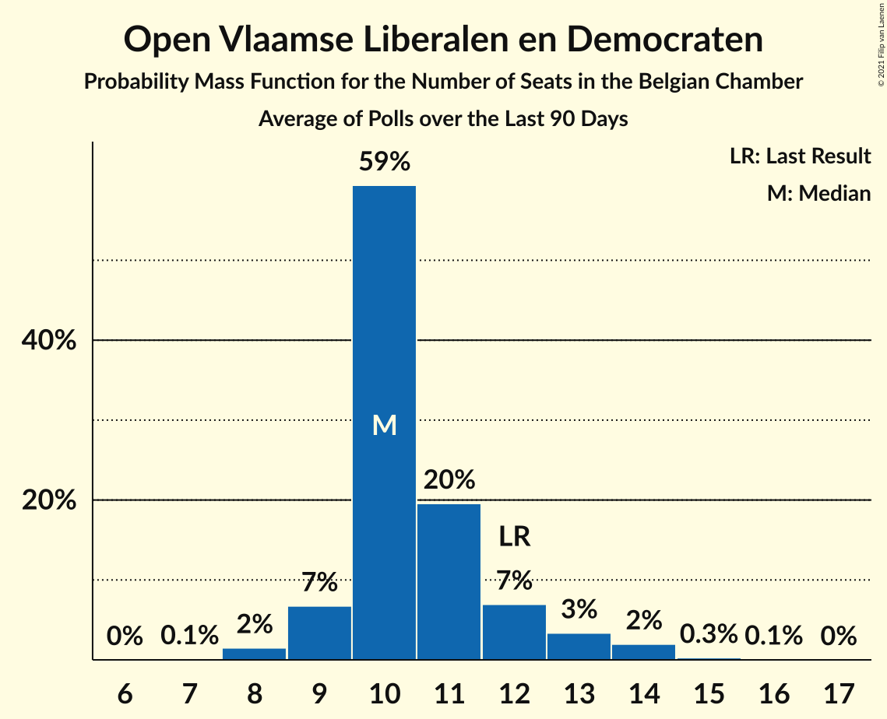

# Open Vlaamse Liberalen en Democraten

<a href="#voting-intentions">Voting Intentions</a> | <a href="#seats">Seats</a>

## Voting Intentions

Last result: **5.4%** (General Election of 9 June 2024)

### Confidence Intervals

| Period     | Polling firm/Commissioner(s) | Median | 80% Confidence Interval | 90% Confidence Interval | 95% Confidence Interval | 99% Confidence Interval |
|:----------:|:----------------:|:-----------:|:-----------------------:|:-----------------------:|:-----------------------:|:-----------------------:|
| N/A | [Poll Average](average.html) | 3.7% | 3.2–4.2% | 3.0–4.3% | 2.9–4.3% | 2.7–4.4% |
| [4–11 March 2025](2025-03-11-Ipsos.html) | Ipsos   Het Laatste Nieuws, Le Soir, RTL TVi and VTM | 3.7% | 3.2–4.2% | 3.0–4.3% | 2.9–4.3% | 2.7–4.4% |
| [18–21 November 2024](2024-11-21-Ipsos.html) | Ipsos   Het Laatste Nieuws, Le Soir, RTL TVi and VTM | 4.5% | 3.9–5.0% | 3.7–5.1% | 3.6–5.1% | 3.3–5.2% |
| [11–17 September 2024](2024-09-17-Ipsos.html) | Ipsos   Het Laatste Nieuws, Le Soir, RTL TVi and VTM | 4.2% | 3.6–4.7% | 3.5–4.8% | 3.3–4.9% | 3.1–4.9% |

### Probability Mass Function

The following table shows the probability mass function per percentage block of voting intentions for the [poll average](average.html) for Open Vlaamse Liberalen en Democraten.

| Voting Intentions | Probability | Accumulated | Special Marks |
|:-----------------:|:-----------:|:-----------:|:-------------:|
| 0.5–1.5% | 0% | 100% |  |
| 1.5–2.5% | 0.2% | 100% |  |
| 2.5–3.5% | 35% | 99.8% |  |
| 3.5–4.5% | 70% | 65% | Median |
| 4.5–5.5% | 7% | 0% | Last Result |

## Seats

Last result: **7** seats (General Election of 9 June 2024)

### Confidence Intervals

| Period     | Polling firm/Commissioner(s) | Median | 80% Confidence Interval | 90% Confidence Interval | 95% Confidence Interval | 99% Confidence Interval |
|:----------:|:----------------:|:------:|:-----------------------:|:-----------------------:|:-----------------------:|:-----------------------:|
| N/A | [Poll Average](average.html) | 3 | 2–4 | 2–4 | 2–5 | 2–7 |
| [4–11 March 2025](2025-03-11-Ipsos.html) | Ipsos   Het Laatste Nieuws, Le Soir, RTL TVi and VTM | 3 | 2–4 | 2–4 | 2–5 | 2–7 |
| [18–21 November 2024](2024-11-21-Ipsos.html) | Ipsos   Het Laatste Nieuws, Le Soir, RTL TVi and VTM | 4 | 3–7 | 3–7 | 2–7 | 2–7 |
| [11–17 September 2024](2024-09-17-Ipsos.html) | Ipsos   Het Laatste Nieuws, Le Soir, RTL TVi and VTM | 4 | 3–6 | 2–7 | 2–7 | 2–7 |

### Probability Mass Function

The following table shows the probability mass function per seat for the [poll average](average.html) for Open Vlaamse Liberalen en Democraten.

| Number of Seats | Probability | Accumulated | Special Marks |
|:---------------:|:-----------:|:-----------:|:-------------:|
| 1 | 0% | 100% |  |
| 2 | 36% | 99.9% |  |
| 3 | 35% | 64% | Median |
| 4 | 26% | 29% |  |
| 5 | 1.3% | 3% |  |
| 6 | 1.1% | 2% |  |
| 7 | 0.7% | 0.7% | Last Result |
| 8 | 0% | 0% |  |

