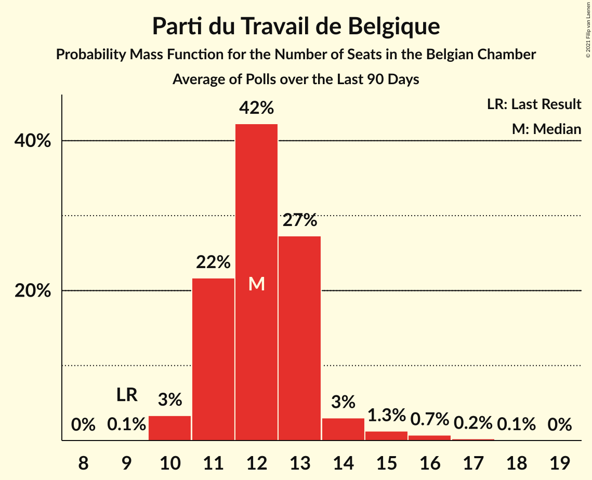

# Parti du Travail de Belgique

<a href="#voting-intentions">Voting Intentions</a> | <a href="#seats">Seats</a>

## Voting Intentions

Last result: **4.8%** (General Election of 26 May 2019)

### Confidence Intervals

| Period     | Polling firm/Commissioner(s) | Median | 80% Confidence Interval | 90% Confidence Interval | 95% Confidence Interval | 99% Confidence Interval |
|:----------:|:----------------:|:-----------:|:-----------------------:|:-----------------------:|:-----------------------:|:-----------------------:|
| N/A | [Poll Average](average.html) | 5.9% | 5.7–6.1% | 5.6–6.1% | 5.5–6.1% | 5.4–6.1% |
| [4–9 March 2020](2020-03-09-Ipsos.html) | Ipsos   Het Laatste Nieuws, Le Soir, RTL TVi and VTM | 6.6% | 5.7–6.1% | 5.6–6.1% | 5.5–6.1% | 5.4–6.1% |
| [29 November–6 December 2019](2019-12-06-Ipsos.html) | Ipsos   Het Laatste Nieuws, Le Soir, RTL TVi and VTM | 6.0% | 5.1–5.5% | 5.0–5.5% | 5.0–5.5% | 4.8–5.5% |
| [2–10 September 2019](2019-09-10-Ipsos.html) | Ipsos   Het Laatste Nieuws, Le Soir, RTL TVi and VTM | 5.6% | 4.7–5.1% | 4.7–5.1% | 4.6–5.1% | 4.4–5.1% |

### Probability Mass Function

The following table shows the probability mass function per percentage block of voting intentions for the [poll average](average.html) for Parti du Travail de Belgique.

| Voting Intentions | Probability | Accumulated | Special Marks |
|:-----------------:|:-----------:|:-----------:|:-------------:|
| 3.5–4.5% | 0% | 100% |  |
| 4.5–5.5% | 3% | 100% | Last Result |
| 5.5–6.5% | 100% | 97% | Median |
| 6.5–7.5% | 100% | 0% |  |
| 7.5–8.5% | 15% | 0% |  |

## Seats

Last result: **9** seats (General Election of 26 May 2019)

### Confidence Intervals

| Period     | Polling firm/Commissioner(s) | Median | 80% Confidence Interval | 90% Confidence Interval | 95% Confidence Interval | 99% Confidence Interval |
|:----------:|:----------------:|:------:|:-----------------------:|:-----------------------:|:-----------------------:|:-----------------------:|
| N/A | [Poll Average](average.html) | 11 | 10–13 | 10–13 | 10–14 | 9–15 |
| [4–9 March 2020](2020-03-09-Ipsos.html) | Ipsos   Het Laatste Nieuws, Le Soir, RTL TVi and VTM | 11 | 10–13 | 10–13 | 10–14 | 9–15 |
| [29 November–6 December 2019](2019-12-06-Ipsos.html) | Ipsos   Het Laatste Nieuws, Le Soir, RTL TVi and VTM | 10 | 9–11 | 9–12 | 9–12 | 9–12 |
| [2–10 September 2019](2019-09-10-Ipsos.html) | Ipsos   Het Laatste Nieuws, Le Soir, RTL TVi and VTM | 10 | 9–11 | 8–11 | 8–11 | 8–12 |

### Probability Mass Function

The following table shows the probability mass function per seat for the [poll average](average.html) for Parti du Travail de Belgique.

| Number of Seats | Probability | Accumulated | Special Marks |
|:---------------:|:-----------:|:-----------:|:-------------:|
| 9 | 1.2% | 100% | Last Result |
| 10 | 12% | 98.8% |  |
| 11 | 45% | 87% | Median |
| 12 | 29% | 42% |  |
| 13 | 10% | 13% |  |
| 14 | 2% | 3% |  |
| 15 | 0.6% | 0.7% |  |
| 16 | 0.1% | 0.2% |  |
| 17 | 0% | 0% |  |

