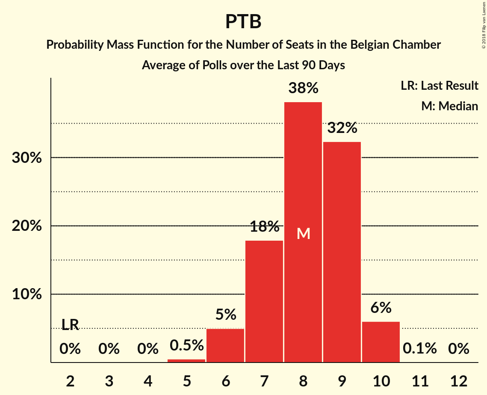

# PTB

<a href="#voting-intentions">Voting Intentions</a> | <a href="#seats">Seats</a>

## Voting Intentions

Last result: **2.0%** (General Election of 25 May 2014)

### Confidence Intervals

| Period     | Polling firm/Commissioner(s) | Median | 80% Confidence Interval | 90% Confidence Interval | 95% Confidence Interval | 99% Confidence Interval |
|:----------:|:----------------:|:-----------:|:-----------------------:|:-----------------------:|:-----------------------:|:-----------------------:|
| N/A | [Poll Average](average.html) | 4.8% | 4.6–4.9% | 4.5–4.9% | 4.4–4.9% | 4.3–4.9% |
| [27 November–4 December 2017](2017-12-04-Ipsos.html) | Ipsos   RTL TVi–Le Soir–VTM–Het Laatste Nieuws | 6.4% | 5.5–5.9% | 5.4–5.9% | 5.3–5.9% | 5.2–5.9% |
| [11 September–5 October 2017](2017-10-05-TNS.html) | TNS   De Standaard–VRT–RTBf–La Libre Belgique | 5.3% | 4.5–4.8% | 4.4–4.8% | 4.3–4.8% | 4.2–4.8% |
| [25 August–3 September 2017](2017-09-03-Ipsos.html) | Ipsos   RTL TVi–Le Soir–VTM–Het Laatste Nieuws | 6.1% | 5.2–5.5% | 5.1–5.5% | 5.0–5.5% | 4.8–5.5% |
| [23–27 June 2017](2017-06-27-Dedicated.html) | Dedicated   MR | 8.7% | 7.5–8.0% | 7.4–8.0% | 7.2–8.0% | 7.0–8.0% |
| [27 March–11 April 2017](2017-04-11-TNS.html) | TNS   De Standaard–VRT | 0.0% | N/A | N/A | N/A | N/A |
| [16–20 March 2017](2017-03-20-Dedicated.html) | Dedicated   RTBf–La Libre Belgique | 1.5% | 1.3–1.4% | 1.2–1.4% | 1.2–1.4% | 1.2–1.4% |
| [16–17 February 2017](2017-02-17-IVox.html) | iVox   Sudpresse | 17.4% | 15.9–19.0% | 15.5–19.5% | 15.2–19.9% | 14.5–20.6% |
| [10–17 January 2017](2017-01-17-Ipsos.html) | Ipsos   RTL TVi–Le Soir–VTM–Het Laatste Nieuws | 5.9% | 5.1–5.4% | 5.0–5.4% | 4.9–5.4% | 4.7–5.4% |
| [24–28 November 2016](2016-11-28-Dedicated.html) | Dedicated   RTBf–La Libre Belgique | 1.0% | 0.8–1.0% | 0.8–1.0% | 0.8–1.0% | 0.7–1.0% |
| [14 September–3 October 2016](2016-10-03-TNS.html) | TNS   De Standaard–VRT | 0.0% | N/A | N/A | N/A | N/A |
| [19–25 September 2016](2016-09-25-Ipsos.html) | Ipsos   RTL TVi–Le Soir–VTM–Het Laatste Nieuws | 5.8% | 5.0–5.3% | 4.9–5.3% | 4.8–5.3% | 4.7–5.3% |
| [2–6 September 2016](2016-09-06-Dedicated.html) | Dedicated   RTBf–La Libre Belgique | 5.1% | 4.1–4.5% | 4.0–4.5% | 3.9–4.5% | 3.7–4.5% |
| [6–12 May 2016](2016-05-12-Ipsos.html) | Ipsos   RTL TVi–Le Soir–VTM–Het Laatste Nieuws | 4.7% | 3.9–4.2% | 3.9–4.3% | 3.8–4.3% | 3.7–4.3% |
| [31 March–4 April 2016](2016-04-04-Dedicated.html) | Dedicated   RTBf–La Libre Belgique | 3.7% | 3.0–3.2% | 2.9–3.3% | 2.9–3.3% | 2.7–3.3% |
| [22 February–9 March 2016](2016-03-09-TNS.html) | TNS   De Standaard–VRT | 0.0% | N/A | N/A | N/A | N/A |
| [15–20 January 2016](2016-01-20-Ipsos.html) | Ipsos   RTL TVi–Le Soir–VTM–Het Laatste Nieuws | 3.2% | 2.6–2.8% | 2.5–2.9% | 2.5–2.9% | 2.4–2.9% |
| [3–7 December 2015](2015-12-07-Dedicated.html) | Dedicated   RTBf–La Libre Belgique | 3.4% | 2.9–3.5% | 2.8–3.5% | 2.8–3.5% | 2.6–3.5% |
| [28 September–4 October 2015](2015-10-04-Ipsos.html) | Ipsos   RTL TVi–Le Soir–VTM–Het Laatste Nieuws | 2.8% | 2.4–2.8% | 2.3–2.9% | 2.2–2.9% | 2.1–2.9% |
| [22 September–2 October 2015](2015-10-02-TNS.html) | TNS   De Standaard–VRT | 0.0% | N/A | N/A | N/A | N/A |
| [9–14 September 2015](2015-09-14-Dedicated.html) | Dedicated   RTBf–La Libre Belgique | 3.2% | 2.7–3.2% | 2.5–3.3% | 2.5–3.3% | 2.3–3.3% |
| [12–18 May 2015](2015-05-18-Dedicated.html) | Dedicated   RTBf–La Libre Belgique | 3.0% | 2.5–3.0% | 2.4–3.0% | 2.3–3.1% | 2.1–3.1% |
| [5 March–9 May 2015](2015-05-09-Dedicated.html) | Dedicated   La Libre Belgique–RTBf | 5.7% | N/A | N/A | N/A | N/A |
| [20 April–3 May 2015](2015-05-03-TNS.html) | TNS   De Standaard–VRT | 0.0% | N/A | N/A | N/A | N/A |
| [20–24 April 2015](2015-04-24-Ipsos.html) | Ipsos   RTL TVi–Le Soir–VTM–Het Laatste Nieuws | 2.8% | 2.4–2.9% | 2.3–2.9% | 2.2–2.9% | 2.1–2.9% |
| [5–9 March 2015](2015-03-09-Dedicated.html) | Dedicated   RTBf–La Libre Belgique | 3.0% | 2.3–2.5% | 2.2–2.5% | 2.1–2.5% | 2.0–2.5% |
| [23–28 January 2015](2015-01-28-Ipsos.html) | Ipsos   RTL TVi–Le Soir–VTM–Het Laatste Nieuws | 2.5% | 2.0–2.5% | 2.0–2.5% | 1.9–2.5% | 1.8–2.5% |
| [5–11 January 2015](2015-01-11-Ipsos.html) | Ipsos   RTL TVi–Le Soir–VTM–Het Laatste Nieuws | 2.6% | 2.2–2.6% | 2.1–2.6% | 2.0–2.6% | 1.9–2.6% |
| [4–5 December 2014](2014-12-05-AQRate.html) | AQ Rate   Het Laatste Nieuws | 0.0% | N/A | N/A | N/A | N/A |
| [27 November–1 December 2014](2014-12-01-Dedicated.html) | Dedicated   RTBf–La Libre Belgique | 2.5% | 2.1–2.6% | 2.0–2.6% | 1.9–2.6% | 1.7–2.6% |
| [9–10 October 2014](2014-10-10-AQRate.html) | AQ Rate   Het Laatste Nieuws | 0.0% | N/A | N/A | N/A | N/A |
| [22 September–3 October 2014](2014-10-03-TNS.html) | TNS   De Standaard–VRT | 0.0% | N/A | N/A | N/A | N/A |
| [5–9 September 2014](2014-09-09-Dedicated.html) | Dedicated   RTBf–La Libre Belgique | 2.7% | 2.2–2.8% | 2.1–2.8% | 2.0–2.8% | 1.9–2.8% |
| [1–31 July 2014](2014-07-31-AQRate.html) | AQ Rate   Het Laatste Nieuws | 0.0% | N/A | N/A | N/A | N/A |

### Probability Mass Function

The following table shows the probability mass function per percentage block of voting intentions for the [poll average](average.html) for PTB.

| Voting Intentions | Probability | Accumulated | Special Marks |
|:-----------------:|:-----------:|:-----------:|:-------------:|
| 1.5–2.5% | 0% | 100% | Last Result |
| 2.5–3.5% | 0% | 100% |  |
| 3.5–4.5% | 9% | 100% |  |
| 4.5–5.5% | 100% | 91% | Median |
| 5.5–6.5% | 100% | 0% |  |
| 6.5–7.5% | 100% | 0% |  |
| 7.5–8.5% | 2% | 0% |  |

## Seats

Last result: **2** seats (General Election of 25 May 2014)

### Confidence Intervals

| Period     | Polling firm/Commissioner(s) | Median | 80% Confidence Interval | 90% Confidence Interval | 95% Confidence Interval | 99% Confidence Interval |
|:----------:|:----------------:|:------:|:-----------------------:|:-----------------------:|:-----------------------:|:-----------------------:|
| N/A | [Poll Average](average.html) | 10 | 8–12 | 8–13 | 8–13 | 7–14 |
| [27 November–4 December 2017](2017-12-04-Ipsos.html) | Ipsos   RTL TVi–Le Soir–VTM–Het Laatste Nieuws | 11 | 10–13 | 10–13 | 10–13 | 9–14 |
| [11 September–5 October 2017](2017-10-05-TNS.html) | TNS   De Standaard–VRT–RTBf–La Libre Belgique | 9 | 8–10 | 8–10 | 8–11 | 7–11 |
| [25 August–3 September 2017](2017-09-03-Ipsos.html) | Ipsos   RTL TVi–Le Soir–VTM–Het Laatste Nieuws | 11 | 10–12 | 10–12 | 9–12 | 9–13 |
| [23–27 June 2017](2017-06-27-Dedicated.html) | Dedicated   MR | 17 | 15–20 | 14–20 | 14–20 | 13–21 |
| [27 March–11 April 2017](2017-04-11-TNS.html) | TNS   De Standaard–VRT |  |  |  |  |  |
| [16–20 March 2017](2017-03-20-Dedicated.html) | Dedicated   RTBf–La Libre Belgique | 2 | 2–3 | 2–3 | 2–3 | 2–3 |
| [16–17 February 2017](2017-02-17-IVox.html) | iVox   Sudpresse | 9 | 8–10 | 8–10 | 8–10 | 7–11 |
| [10–17 January 2017](2017-01-17-Ipsos.html) | Ipsos   RTL TVi–Le Soir–VTM–Het Laatste Nieuws | 11 | 10–12 | 9–12 | 9–13 | 9–13 |
| [24–28 November 2016](2016-11-28-Dedicated.html) | Dedicated   RTBf–La Libre Belgique | 2 | 1–2 | 1–2 | 1–2 | 1–2 |
| [14 September–3 October 2016](2016-10-03-TNS.html) | TNS   De Standaard–VRT |  |  |  |  |  |
| [19–25 September 2016](2016-09-25-Ipsos.html) | Ipsos   RTL TVi–Le Soir–VTM–Het Laatste Nieuws | 10 | 10–12 | 10–12 | 9–12 | 9–13 |
| [2–6 September 2016](2016-09-06-Dedicated.html) | Dedicated   RTBf–La Libre Belgique | 9 | 8–9 | 8–10 | 7–10 | 6–11 |
| [6–12 May 2016](2016-05-12-Ipsos.html) | Ipsos   RTL TVi–Le Soir–VTM–Het Laatste Nieuws | 8 | 7–9 | 6–10 | 6–10 | 6–10 |
| [31 March–4 April 2016](2016-04-04-Dedicated.html) | Dedicated   RTBf–La Libre Belgique | 5 | 5–6 | 4–6 | 4–7 | 4–8 |
| [22 February–9 March 2016](2016-03-09-TNS.html) | TNS   De Standaard–VRT |  |  |  |  |  |
| [15–20 January 2016](2016-01-20-Ipsos.html) | Ipsos   RTL TVi–Le Soir–VTM–Het Laatste Nieuws | 5 | 4–6 | 4–6 | 4–7 | 4–7 |
| [3–7 December 2015](2015-12-07-Dedicated.html) | Dedicated   RTBf–La Libre Belgique | 4 | 4–5 | 4–6 | 3–6 | 3–7 |
| [28 September–4 October 2015](2015-10-04-Ipsos.html) | Ipsos   RTL TVi–Le Soir–VTM–Het Laatste Nieuws | 4 | 3–4 | 3–4 | 3–5 | 2–6 |
| [22 September–2 October 2015](2015-10-02-TNS.html) | TNS   De Standaard–VRT |  |  |  |  |  |
| [9–14 September 2015](2015-09-14-Dedicated.html) | Dedicated   RTBf–La Libre Belgique | 4 | 3–5 | 3–6 | 3–6 | 2–6 |
| [12–18 May 2015](2015-05-18-Dedicated.html) | Dedicated   RTBf–La Libre Belgique | 4 | 3–4 | 3–5 | 3–5 | 2–6 |
| [5 March–9 May 2015](2015-05-09-Dedicated.html) | Dedicated   La Libre Belgique–RTBf | 1 | 1 | 1 | 1 | 1 |
| [20 April–3 May 2015](2015-05-03-TNS.html) | TNS   De Standaard–VRT |  |  |  |  |  |
| [20–24 April 2015](2015-04-24-Ipsos.html) | Ipsos   RTL TVi–Le Soir–VTM–Het Laatste Nieuws | 4 | 3–4 | 3–4 | 3–5 | 2–5 |
| [5–9 March 2015](2015-03-09-Dedicated.html) | Dedicated   RTBf–La Libre Belgique | 4 | 3–5 | 3–5 | 3–6 | 2–7 |
| [23–28 January 2015](2015-01-28-Ipsos.html) | Ipsos   RTL TVi–Le Soir–VTM–Het Laatste Nieuws | 3 | 2–4 | 2–4 | 2–4 | 2–4 |
| [5–11 January 2015](2015-01-11-Ipsos.html) | Ipsos   RTL TVi–Le Soir–VTM–Het Laatste Nieuws | 3 | 3–4 | 2–4 | 2–4 | 2–5 |
| [4–5 December 2014](2014-12-05-AQRate.html) | AQ Rate   Het Laatste Nieuws |  |  |  |  |  |
| [27 November–1 December 2014](2014-12-01-Dedicated.html) | Dedicated   RTBf–La Libre Belgique | 3 | 2–4 | 2–4 | 2–4 | 2–5 |
| [9–10 October 2014](2014-10-10-AQRate.html) | AQ Rate   Het Laatste Nieuws |  |  |  |  |  |
| [22 September–3 October 2014](2014-10-03-TNS.html) | TNS   De Standaard–VRT |  |  |  |  |  |
| [5–9 September 2014](2014-09-09-Dedicated.html) | Dedicated   RTBf–La Libre Belgique | 3 | 3 | 2–4 | 2–4 | 2–4 |
| [1–31 July 2014](2014-07-31-AQRate.html) | AQ Rate   Het Laatste Nieuws |  |  |  |  |  |

### Probability Mass Function

The following table shows the probability mass function per seat for the [poll average](average.html) for PTB.

| Number of Seats | Probability | Accumulated | Special Marks |
|:---------------:|:-----------:|:-----------:|:-------------:|
| 2 | 0% | 100% | Last Result |
| 3 | 0% | 100% |  |
| 4 | 0% | 100% |  |
| 5 | 0% | 100% |  |
| 6 | 0.1% | 100% |  |
| 7 | 0.5% | 99.9% |  |
| 8 | 10% | 99.4% |  |
| 9 | 25% | 90% |  |
| 10 | 28% | 65% | Median |
| 11 | 21% | 38% |  |
| 12 | 11% | 16% |  |
| 13 | 4% | 5% |  |
| 14 | 0.9% | 1.0% |  |
| 15 | 0.1% | 0.1% |  |
| 16 | 0% | 0% |  |

