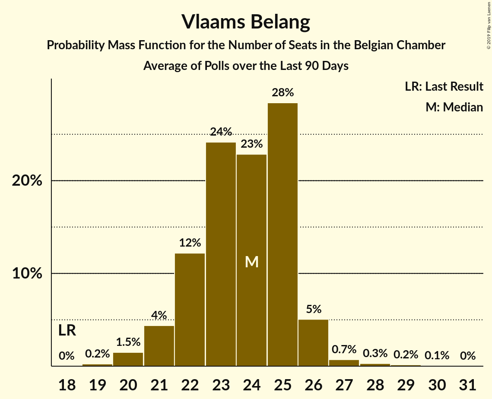

# Vlaams Belang

<a href="#voting-intentions">Voting Intentions</a> | <a href="#seats">Seats</a>

## Voting Intentions

Last result: **12.0%** (General Election of 26 May 2019)

### Confidence Intervals

| Period     | Polling firm/Commissioner(s) | Median | 80% Confidence Interval | 90% Confidence Interval | 95% Confidence Interval | 99% Confidence Interval |
|:----------:|:----------------:|:-----------:|:-----------------------:|:-----------------------:|:-----------------------:|:-----------------------:|
| N/A | [Poll Average](average.html) | 16.2% | 15.6–16.5% | 15.4–16.6% | 15.2–16.6% | 14.8–16.6% |
| [4–9 March 2020](2020-03-09-Ipsos.html) | Ipsos   Het Laatste Nieuws, Le Soir, RTL TVi and VTM | 17.6% | 15.6–16.5% | 15.4–16.6% | 15.2–16.6% | 14.8–16.6% |
| [29 November–6 December 2019](2019-12-06-Ipsos.html) | Ipsos   Het Laatste Nieuws, Le Soir, RTL TVi and VTM | 17.0% | 15.2–16.0% | 15.0–16.1% | 14.8–16.1% | 14.4–16.1% |
| [2–10 September 2019](2019-09-10-Ipsos.html) | Ipsos   Het Laatste Nieuws, Le Soir, RTL TVi and VTM | 15.6% | 13.8–14.6% | 13.6–14.6% | 13.4–14.7% | 13.0–14.7% |

### Probability Mass Function

The following table shows the probability mass function per percentage block of voting intentions for the [poll average](average.html) for Vlaams Belang.

| Voting Intentions | Probability | Accumulated | Special Marks |
|:-----------------:|:-----------:|:-----------:|:-------------:|
| 11.5–12.5% | 0% | 100% | Last Result |
| 12.5–13.5% | 0% | 100% |  |
| 13.5–14.5% | 0.2% | 100% |  |
| 14.5–15.5% | 8% | 99.8% |  |
| 15.5–16.5% | 86% | 92% | Median |
| 16.5–17.5% | 100% | 6% |  |
| 17.5–18.5% | 100% | 0% |  |
| 18.5–19.5% | 93% | 0% |  |
| 19.5–20.5% | 11% | 0% |  |
| 20.5–21.5% | 0.5% | 0% |  |

## Seats

Last result: **18** seats (General Election of 26 May 2019)

### Confidence Intervals

| Period     | Polling firm/Commissioner(s) | Median | 80% Confidence Interval | 90% Confidence Interval | 95% Confidence Interval | 99% Confidence Interval |
|:----------:|:----------------:|:------:|:-----------------------:|:-----------------------:|:-----------------------:|:-----------------------:|
| N/A | [Poll Average](average.html) | 26 | 25–29 | 25–30 | 24–30 | 23–31 |
| [4–9 March 2020](2020-03-09-Ipsos.html) | Ipsos   Het Laatste Nieuws, Le Soir, RTL TVi and VTM | 26 | 25–29 | 25–30 | 24–30 | 23–31 |
| [29 November–6 December 2019](2019-12-06-Ipsos.html) | Ipsos   Het Laatste Nieuws, Le Soir, RTL TVi and VTM | 26 | 24–28 | 23–29 | 23–29 | 22–30 |
| [2–10 September 2019](2019-09-10-Ipsos.html) | Ipsos   Het Laatste Nieuws, Le Soir, RTL TVi and VTM | 24 | 22–25 | 21–26 | 21–26 | 20–28 |

### Probability Mass Function

The following table shows the probability mass function per seat for the [poll average](average.html) for Vlaams Belang.

| Number of Seats | Probability | Accumulated | Special Marks |
|:---------------:|:-----------:|:-----------:|:-------------:|
| 18 | 0% | 100% | Last Result |
| 19 | 0% | 100% |  |
| 20 | 0% | 100% |  |
| 21 | 0% | 100% |  |
| 22 | 0.3% | 100% |  |
| 23 | 1.1% | 99.7% |  |
| 24 | 3% | 98.6% |  |
| 25 | 30% | 95% |  |
| 26 | 19% | 65% | Median |
| 27 | 12% | 47% |  |
| 28 | 11% | 35% |  |
| 29 | 14% | 23% |  |
| 30 | 8% | 9% |  |
| 31 | 0.9% | 1.2% |  |
| 32 | 0.2% | 0.3% |  |
| 33 | 0% | 0% |  |

