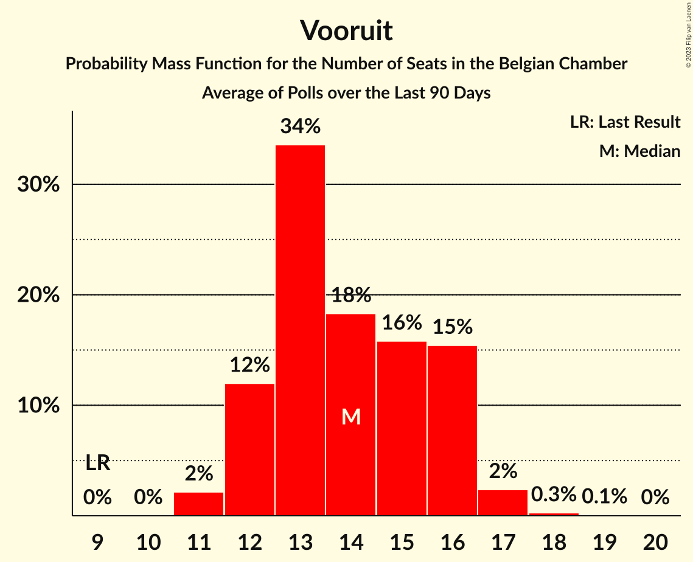

# Vooruit

<a href="#voting-intentions">Voting Intentions</a> | <a href="#seats">Seats</a>

## Voting Intentions

Last result: **8.1%** (General Election of 9 June 2024)

### Confidence Intervals

| Period     | Polling firm/Commissioner(s) | Median | 80% Confidence Interval | 90% Confidence Interval | 95% Confidence Interval | 99% Confidence Interval |
|:----------:|:----------------:|:-----------:|:-----------------------:|:-----------------------:|:-----------------------:|:-----------------------:|
| N/A | [Poll Average](average.html) | 9.6% | 8.8–10.3% | 8.5–10.5% | 8.3–10.5% | 7.9–10.6% |
| [18–21 November 2024](2024-11-21-Ipsos.html) | Ipsos   Het Laatste Nieuws, Le Soir, RTL TVi and VTM | 9.6% | 8.8–10.3% | 8.5–10.5% | 8.3–10.5% | 7.9–10.6% |
| [11–17 September 2024](2024-09-17-Ipsos.html) | Ipsos   Het Laatste Nieuws, Le Soir, RTL TVi and VTM | 9.2% | 8.3–9.9% | 8.1–10.0% | 7.9–10.1% | 7.5–10.2% |

### Probability Mass Function

The following table shows the probability mass function per percentage block of voting intentions for the [poll average](average.html) for Vooruit.

| Voting Intentions | Probability | Accumulated | Special Marks |
|:-----------------:|:-----------:|:-----------:|:-------------:|
| 6.5–7.5% | 0.1% | 100% |  |
| 7.5–8.5% | 6% | 99.9% | Last Result |
| 8.5–9.5% | 41% | 94% |  |
| 9.5–10.5% | 51% | 53% | Median |
| 10.5–11.5% | 13% | 2% |  |
| 11.5–12.5% | 0.7% | 0% |  |

## Seats

Last result: **13** seats (General Election of 9 June 2024)

### Confidence Intervals

| Period     | Polling firm/Commissioner(s) | Median | 80% Confidence Interval | 90% Confidence Interval | 95% Confidence Interval | 99% Confidence Interval |
|:----------:|:----------------:|:------:|:-----------------------:|:-----------------------:|:-----------------------:|:-----------------------:|
| N/A | [Poll Average](average.html) | 14 | 13–16 | 13–16 | 12–17 | 10–17 |
| [18–21 November 2024](2024-11-21-Ipsos.html) | Ipsos   Het Laatste Nieuws, Le Soir, RTL TVi and VTM | 14 | 13–16 | 13–16 | 12–17 | 10–17 |
| [11–17 September 2024](2024-09-17-Ipsos.html) | Ipsos   Het Laatste Nieuws, Le Soir, RTL TVi and VTM | 13 | 13–15 | 12–15 | 11–16 | 10–17 |

### Probability Mass Function

The following table shows the probability mass function per seat for the [poll average](average.html) for Vooruit.

| Number of Seats | Probability | Accumulated | Special Marks |
|:---------------:|:-----------:|:-----------:|:-------------:|
| 9 | 0.1% | 100% |  |
| 10 | 0.4% | 99.9% |  |
| 11 | 0.8% | 99.4% |  |
| 12 | 3% | 98.6% |  |
| 13 | 27% | 96% | Last Result |
| 14 | 42% | 69% | Median |
| 15 | 15% | 27% |  |
| 16 | 9% | 12% |  |
| 17 | 3% | 3% |  |
| 18 | 0.2% | 0.2% |  |
| 19 | 0% | 0% |  |

